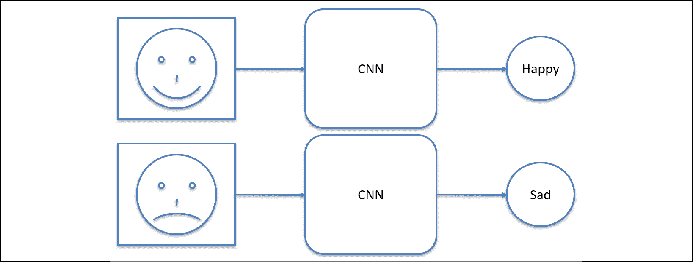
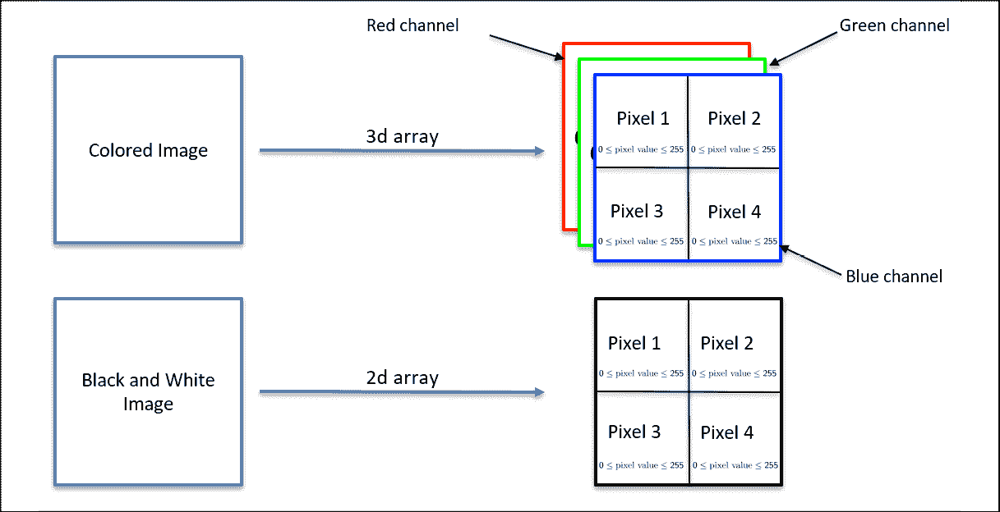
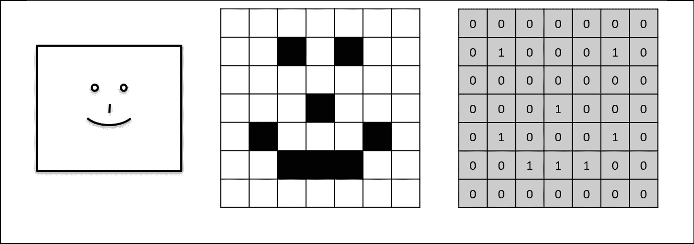
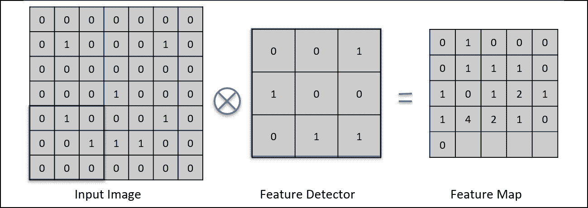
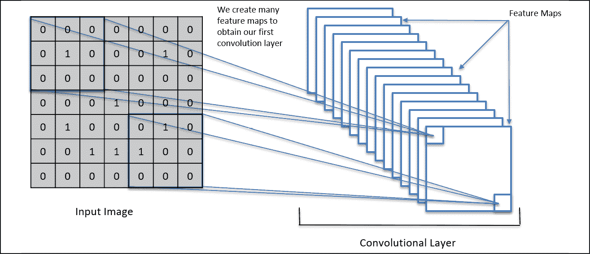
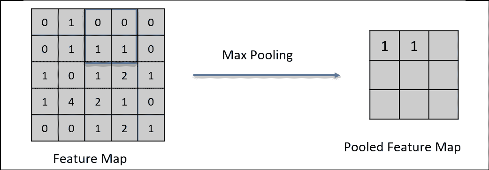
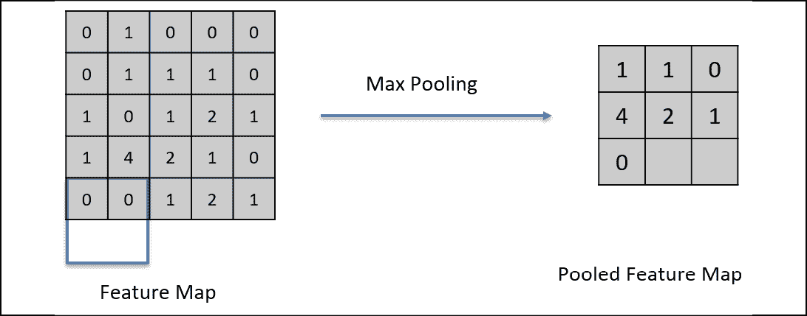
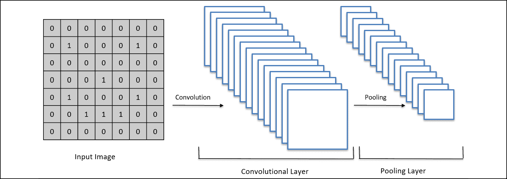
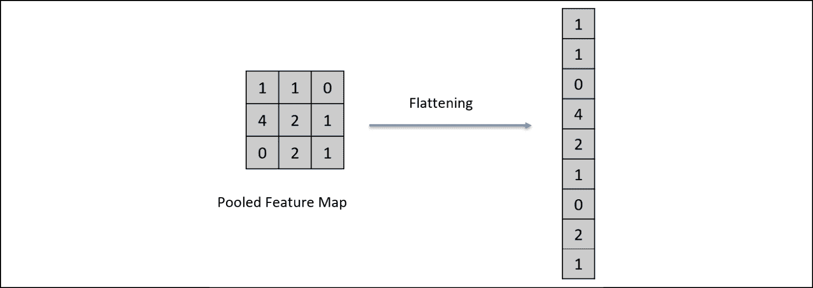

# 十二、深度卷积 Q 学习

既然你已经理解了**人工神经网络** ( **神经网络**)是如何工作的，那么你已经准备好处理一个非常有用的工具了，主要是在处理图像时使用的——**卷积神经网络**(**CNN**)。简单地说，CNN 让你的人工智能实时看到图像，就像它有眼睛一样。

我们将通过以下步骤解决这些问题:

1.  CNN 是用来做什么的？
2.  CNN 是如何工作的？
3.  盘旋
4.  最大池化
5.  变平
6.  完全连接

一旦你理解了这些步骤，你就会理解 CNN，以及它们如何被用于深度卷积 Q 学习。

## CNN 是做什么用的？

CNN 主要用于图像或视频，有时也用于文本，以解决**自然语言处理** ( **NLP** )问题。它们通常用于物体识别，例如，预测图片或视频中是否有猫或狗。当环境返回自身的 2D 状态时，例如，当我们试图建造一辆自动驾驶汽车来读取周围摄像头的输出时，它们也经常与深度 Q 学习(我们将在稍后讨论)一起使用。

还记得第九章*中的例子吗，*用人工大脑走向专业——深度 Q 学习*，在那里我们预测了房价。作为输入，我们有定义一所房子的所有值(面积、年龄、卧室数量等等)，作为输出，我们有一所房子的价格。就 CNN 而言，情况非常相似。例如，如果我们想用 CNN 解决同样的问题，我们会把房子的图片作为输入，把房子的价格作为输出。*

这张图表应该能说明我的意思:

图 1:输入图像–CNN–输出标签

如你所见，输入是一个流经 CNN 的图像，然后作为输出输出。在此图的情况下，输出是图像对应的类。我说的类是什么意思？例如，如果我们想预测输入的图像是笑脸还是哭丧脸，那么一类是*笑脸*，另一类是*哭丧脸*。然后，我们的输出应该正确地决定输入图像对应的类别。

说到快乐和悲伤的脸，这里有一张图可以更详细地展示出来:

图 2:预测两个不同的类别(快乐或悲伤)

在前面的例子中，我们通过 CNN 播放了两张图片。第一张是笑脸，另一张是愁容。正如我之前提到的，我们的网络预测图像是一张快乐的脸还是一张悲伤的脸。

我可以想象你现在在想什么:它是如何工作的？这个我们称之为 CNN 的黑盒子里面是什么？我将在以下部分回答这些问题。

## CNN 是如何工作的？

在我们深入 CNN 的结构之前，我们需要了解几点。我用一个问题给大家介绍第一点:一个彩色的 RGB 图像有多少个维度？

答案可能会让你大吃一惊:是 3！

为什么？因为每个 RGB 图像实际上是由三个 2D 图像表示的，每个图像对应于 RGB 结构中的一种颜色。所以，有一个图像对应红色，一个对应绿色，一个对应蓝色。灰度图像只有 2D，因为它们没有颜色，只能用一种比例来表示。下图应该会使它更清楚:

图 3: RGB 与黑白图像

如您所见，一个彩色的图像由一个 3D 数组表示。每种颜色在图片中都有自己的一层，这一层叫做**通道**。灰度(黑白)图像只有一个通道，因此是 2D 阵列。

你可能知道，图像是由像素组成的。每一个都由一个范围从 0 到 255 的值表示，其中 0 是关闭的像素，255 是完全亮的像素。重要的是要理解，当我们说一个像素具有值(255，255，0)时，这意味着该像素在红色和绿色通道上完全明亮，在蓝色通道上关闭。

从现在开始，为了更好地理解一切，我们将处理非常简单的图像。事实上，我们的图像将是灰度级的(1 通道，2D ),像素要么全亮，要么关闭。为了使图片更容易阅读，我们将 1 分配给关闭的像素(黑色)，0 分配给完全明亮的像素(白色)。

回到快乐和悲伤表情的例子，这就是我们代表快乐表情的 2D 数组的样子:

图 4:像素表示

如你所见，我们有一个数组，其中 **0** 对应一个白色像素， **1** 对应一个黑色像素。右图是我们用数组表示的笑脸。

现在我们理解了基础，我们已经简化了问题，我们准备好处理 CNN 了。为了充分理解它们，我们需要将我们的学习分成组成 CNN 的四个步骤:

1.  盘旋
2.  最大池化
3.  变平
4.  完全连接

现在我们将逐一了解这四个步骤。

### 第一步–卷积

这是每个 CNN 的第一个关键步骤。在卷积中，我们将称为**的特征检测器**应用于输入图像。我们为什么要这样做呢？这是因为所有图像都包含某些定义图片内容的特征。例如，要识别哪张脸是悲伤的，哪张脸是快乐的，我们需要理解嘴的形状的含义，这是这个图像的一个特征。从图表中更容易理解这一点:

图 5:步骤 1–卷积(1/5)

在上图中，我们对输入的笑脸应用了特征检测器，也称为过滤器。正如你所看到的，过滤器是一个 2D 数组，里面有一些值。当我们将这个特征检测器应用于它所覆盖的图像时(在本例中，它是一个 3 x 3 的网格)，我们检查这部分图像中有多少像素与过滤器的像素相匹配。然后我们把这个数字放到一个新的 2D 数组中，这个数组叫做**特征图**。换句话说，图片的一部分越匹配图片检测器，我们放入特征图的数字就越高。

接下来，我们*在整个图像上滑动*特征检测器。在下一次迭代中，将会发生以下情况:

图 6:步骤 1–卷积(2/5)

如您所见，我们将过滤器向右滑动一个位置。这一次，一个像素在过滤器和图像的这一部分中匹配。这就是为什么我们把 **1** 放在特征图中。

你认为当我们到达这张图片的边界时会发生什么？你会怎么做？我将向您展示这两个图会发生什么:

图 7:步骤 1–卷积(3/5)

图 8:步骤 1–卷积(4/5)

这里，我们有这样一个确切的情况:在第一个图像中，我们的过滤器碰到了边界。结果是我们的特征检测器简单地*跳到*下一行。

如果我们只有一个滤波器，卷积的全部魔力就不会发挥作用。实际上，我们使用许多过滤器，这些过滤器产生许多不同的特征图。这组特征图被称为**卷积层**，或**卷积层**。这里有一个图来回顾一下:

图 9:步骤 1–卷积(5/5)

这里，我们可以看到一个应用了许多过滤器的输入图像。总之，他们从许多要素地图中创建了一个卷积图层。这是建立 CNN 的第一步。

现在我们已经了解了卷积，我们可以进入另一个重要的步骤——最大 po oling。

### 第 2 步–最大池

CNN 中的这一步负责降低每个特征地图的大小。在处理神经网络时，我们不希望有太多的输入，否则我们的网络将无法正常学习，因为复杂性很高。因此，需要引入一种叫做 **max pooling** 的减小大小的方法。它让我们在不损失任何重要特征的情况下减小尺寸，并且它使特征对于移动(平移和旋转)部分不变。

从技术上讲，最大池算法也是基于在整个特征图上滑动的数组。在这种情况下，我们不是在搜索任何要素，而是在要素地图的特定区域中搜索最大值。

让我向你展示我用这张图表达的意思:

图 10:步骤 2–最大池(1/5)

在本例中，我们采用在之前的卷积步骤后获得的特征图，然后我们通过最大池运行它。如所示，我们有一个大小为 2 x 2 的窗口，在它所覆盖的部分特征图中寻找最高值。在这种情况下，它是 1。

你能说出下一次迭代会发生什么吗？

正如您可能已经怀疑的那样，这个窗口将会向右滑动，尽管方式与之前略有不同。它是这样移动的:

图 11:步骤 2–最大池(2/5)

这个窗口*向右跳转*它的大小，我希望你记得这不同于卷积步骤，在卷积步骤中特征检测器一次滑动一个单元。在这种情况下，最高值也是 1，因此我们将 **1** 写入**汇集的特征映射**。

当我们触及特征图的边界时，这次会发生什么？事情看起来又和以前略有不同了。事情是这样的:

图 12:步骤 2–最大池(3/5)

该窗口越过边界，并在仍在最大池窗口内的部分特征图中搜索最大值。同样，最大值是 1。

但是现在会发生什么呢？毕竟没有空间可以往右走了。左下方也只有一行用于 max pooling。这就是算法的作用:

图 13:步骤 2–最大池(4/5)

正如我们所看到的，它再次越过边界，在窗口中搜索最大值。在这种情况下，它是 0。重复这个过程，直到窗口碰到特征图的右下角。回顾一下我们的 CNN 现在的样子，看看下面的图表:

图 14:步骤 2–最大池(5/5)

我们有一个笑脸作为输入，然后我们通过卷积来获得许多特征图，称为卷积层。现在，我们已经通过 max pooling 运行了所有的特征地图，并且获得了许多池化的特征地图，它们一起被称为**池化层**。

现在我们可以继续到下一步，这将让 us 将池层输入到神经网络中。这一步叫做 **展平**。

### 第三步–展平

这是很短的一步。顾名思义，我们将所有汇集的特征地图从 2D 阵列更改为 1D 阵列。正如我之前提到的，这将让我们轻松地将图像输入到神经网络中。那么，我们将如何实现这一目标呢？下图应该有助于您理解:

图 15:步骤 3–展平(1/3)

在这里，我们回到之前获得的池化特征地图。为了使它变平，我们从左上角开始取像素值，到右下角结束。像这样的操作会返回一个 1D 数组，包含与我们开始时的 2D 数组相同的值。

但请记住，我们没有一个汇集的要素地图，我们有一个完整的图层。你认为我们应该怎么做？

答案很简单:我们将整个图层放入一个 1D 展平数组中，一个接一个地汇集要素地图。为什么一定要去 1D？这是因为人工神经网络只接受 1D 阵列作为它们的输入。传统神经网络中的所有层都是 1D，这意味着输入也必须是 1D。因此，我们展平所有汇集的要素地图，如下所示:

图 16:步骤 3–展平(2/3)

我们将整个图层转换成一个单一的扁平 1D 阵列。我们将很快使用这个数组作为传统神经网络的输入。

首先，让我们提醒自己我们的模型现在是什么样子:

图 17:步骤 3–展平(3/3)

因此，我们有一个卷积层，池层，和一个新添加的，平坦的 1D 层。现在我们可以回到一个经典的人工神经网络，即一个全连接的神经网络，并将这最后一层作为这个网络的输入。这就把我们带到了最后一步，**满 c 连接**。

### 步骤 4–完全连接

创建 CNN 的最后一步是将其连接到一个经典的全连接神经网络。请记住，我们已经有了一个 1D 阵列，它以压缩的方式告诉我们图像看起来像什么，那么为什么不只是将它作为一个完全连接的神经网络的输入呢？毕竟，能够做出预测的是后者。

这正是我们接下来要做的，就像这样:

图 18:步骤 4–完全连接

展平后，我们将这些返回值直接输入到完全连接的神经网络中，然后由神经网络产生预测值——输出值。

您可能想知道反向传播阶段现在是如何工作的。在 CNN 中，反向传播不仅更新全连接神经网络中的权重，还更新卷积步骤中使用的滤波器。最大池化和扁平化步骤将保持不变，因为那里没有什么要更新的。

总之，CNN 寻找一些具体的特征。这就是为什么当我们处理图像时，搜索特征是至关重要的，它们是最常用的。例如，当试图识别悲伤和快乐的脸时，CNN 需要理解哪个嘴的形状意味着悲伤的脸，哪个意味着快乐的脸。为了获得输出，CNN 必须运行以下步骤:

1.  **卷积**–对输入图像应用滤镜。该操作将找到我们的 CNN 正在寻找的特征，并将它们保存在特征地图中。
2.  **最大汇集**–通过在给定区域取最大值并将这些值保存在一个名为汇集特征图的新数组中，降低特征图的大小。
3.  **展平**–将整个合并图层(所有合并的要素地图)更改为 1D 矢量。这将允许我们把这个向量输入到神经网络中。
4.  **全连接**–创建一个神经网络，它将一个展平的池层作为输入，并返回一个我们想要预测的值。这最后一步让我们做出预测。

## 深度卷积 Q 学习

在关于深度 Q 学习的章节中(*第 9 章*、*人工大脑走向专业——深度 Q 学习*)，我们的输入是定义环境状态的编码值的向量。当处理图像或视频时，编码矢量不是描述状态的最佳输入(输入帧)，因为编码矢量不能保持图像的空间结构。空间结构很重要，因为它给了我们更多的信息来帮助预测下一个状态，而预测下一个状态对于我们的 AI 学习正确的下一步行动至关重要。

因此，我们需要保留空间结构。为此，我们的输入必须是 3D 图像(像素阵列的 2D 加上颜色的一个额外维度，如本章开头所示)。例如，如果我们训练一个人工智能玩视频游戏，输入只是屏幕本身的图像，这正是人类玩游戏时看到的。

根据这个类比，人工智能的行为就像它有人类的眼睛一样；它在玩游戏时观察屏幕上的输入图像。这些输入图像进入 CNN(人类的眼睛)，它检测每幅图像中的状态。然后，它们通过应用最大池化的池化层向前传播。然后，汇集层被展平成一个 1D 向量，它成为我们深度 Q 学习网络的输入(与第 9 章中的*完全相同，*用人工大脑走向职业——深度 Q 学习*)。最后，运行相同的深度 Q 学习过程。*

下图说明了应用于著名的末日游戏的深度卷积 Q 学习:

图 19:末日的深度卷积 Q 学习

总之，深度卷积 Q 学习与深度 Q 学习相同，唯一的区别是输入现在是图像，并且在完全连接的深度 Q 学习网络的开始处添加了 CNN 以检测这些图像的状态。

## 总结

你已经了解了另一种类型的神经网络——卷积神经网络。

我们确定这个网络主要用于图像和搜索这些图像中的某些特征。它使用了人工神经网络没有的三个额外步骤:卷积，我们在这里搜索特征；最大池，我们缩小图像的大小；展平，我们把 2D 图像展平成一个 1D 向量，这样我们就可以把它输入到神经网络中。

在下一章中，您将构建一个深度卷积 Q 学习模型来解决一个经典的游戏问题:Snake。