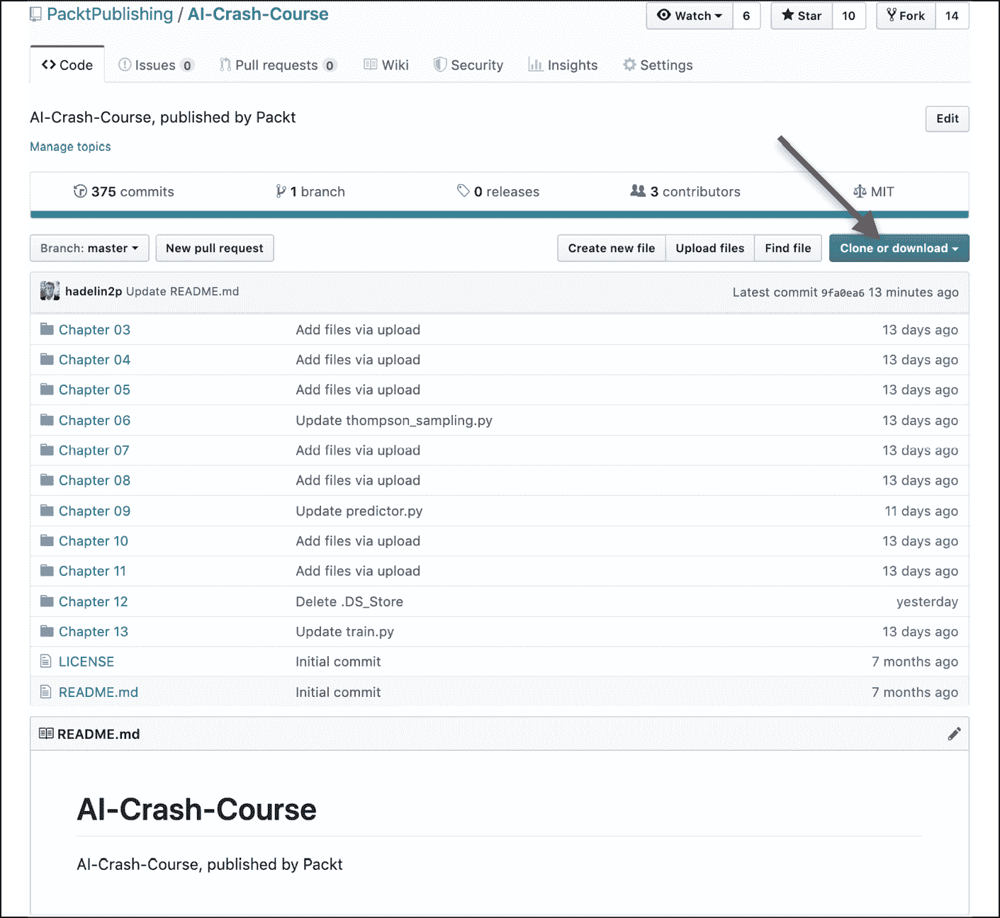
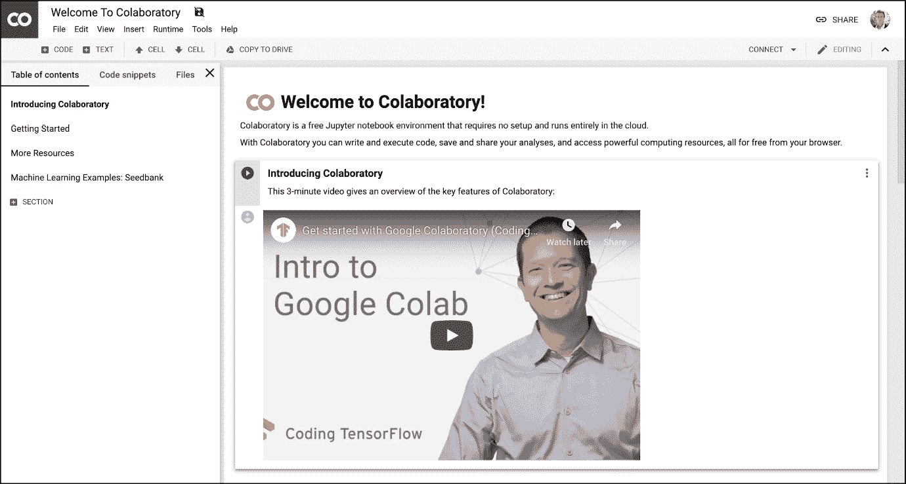
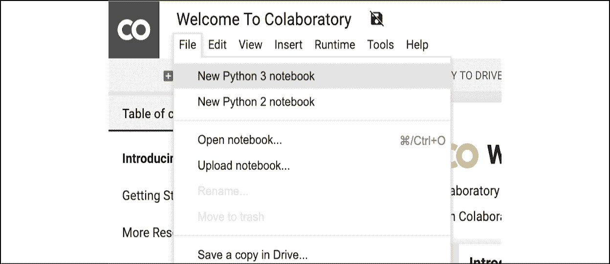
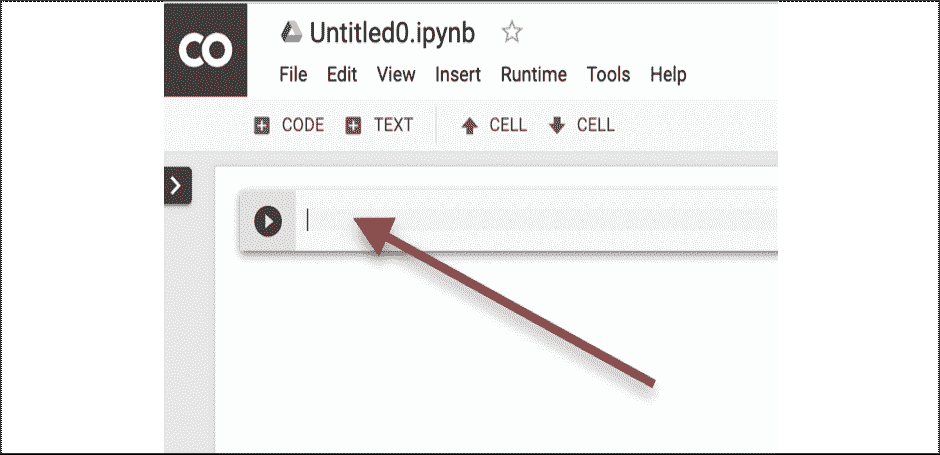
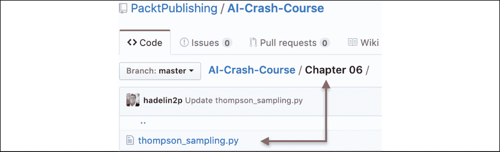
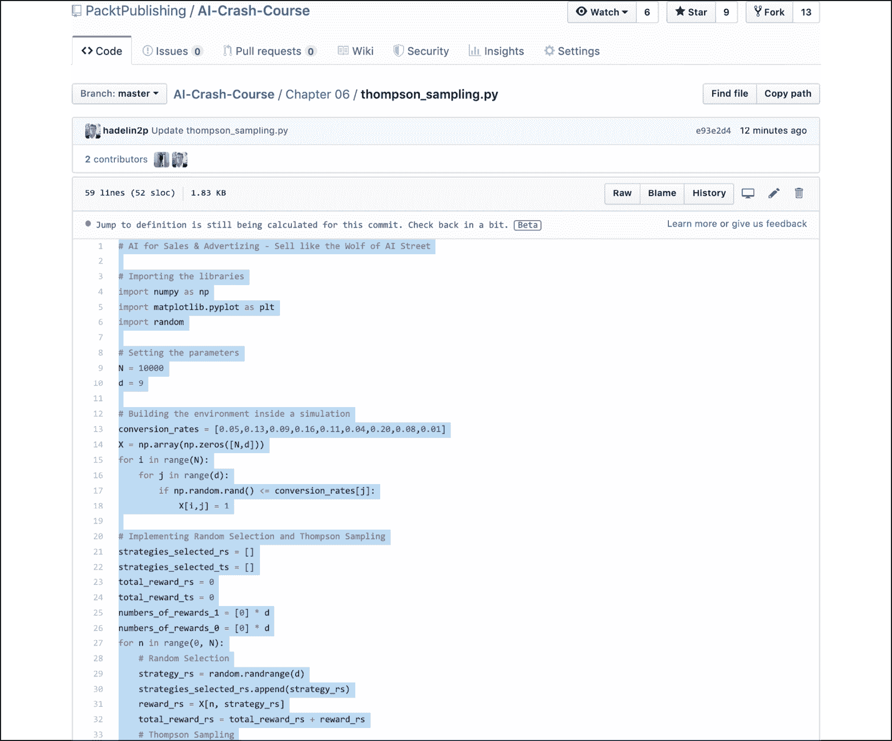
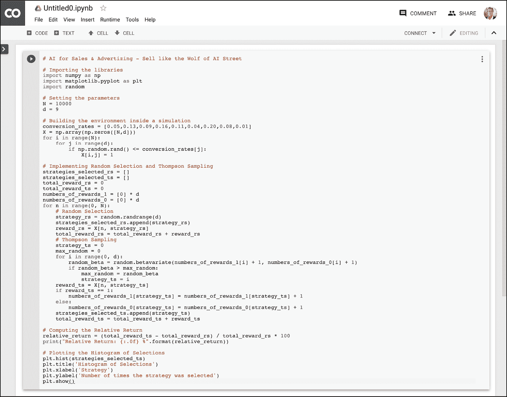

<title>Chapter_2</title>

# 2

# 发现你的人工智能工具包

在前一章，你开始了你的人工智能之旅。在你继续之前，你需要你的人工智能工具包。这本书不仅仅是理论；它还包含一个以 Python 文件形式存在的所有人工智能模型的易于使用的工具包，由于令人惊叹的谷歌合作平台，它随时可以运行，本章还将向您介绍这个平台。

为了填充您的人工智能工具包，我准备了一个 GitHub 页面，包含所有的人工智能实现供您下载，以及包含实现的 Python 笔记本的 Google Colab 链接，所有这些都准备好通过一个简单的即插即用过程来执行。

## GitHub 页面

你会发现这本书的所有代码都准备好了，可以从下面的 GitHub 页面下载:

[https://github.com/PacktPublishing/AI-Crash-Course](https://github.com/PacktPublishing/AI-Crash-Course)

要下载代码，您只需点击**克隆或下载**按钮，然后点击**下载 Zip** :

图 GitHub 存储库

然后，一旦你下载了这些代码，就可以随意用你最喜欢的 Python **集成开发环境** ( **IDE** )打开它们，不管是 Jupyter Notebook，Spyder，一个简单的文本编辑器，甚至是你的终端。

如果你以前从未用 Python 编码过，也不知道如何用 Python 编辑器打开文件，那么没问题；我为你准备了最好最简单的解决方案:Colaboratory(或 Google Colab )。

## 合作实验室

Colaboratory 是一个用于 Python 开发的免费开源环境，不需要设置，完全在云上运行。它包含您的人工智能实现所需的所有预安装的软件包，以便它们可以通过简单的即插即用过程运行。通过插入，我只是想将代码复制并粘贴到一个新的 Colab 文件中(接下来我将解释如何打开一个文件)，通过播放，我只是想单击播放按钮(下面是一个例子)。

以下是合作实验室主页的链接:

[https://colab.research.google.com/notebooks/welcome.ipynb](https://colab.research.google.com/notebooks/welcome.ipynb)

您应该会看到这样一个页面:

图 2:合作实验室-主页

点击左上角的**文件**，然后点击**新 Python 3 笔记本**:

图 3:协作室-打开笔记本

然后你会得到这个观点。将您的 Python 代码粘贴到单元格内(红色箭头)。这就是“插头”部分:

图 4:协同实验室——“插头”部分

我建议对本书中的每个模型使用单独的合作笔记本。

现在让我们看看“玩”的部分。打开`Chapter 06`文件夹中的汤普森采样模型，在`thompson_sampling.py`文件中实现:

图 5:GitHub–打开 Thompson 采样

从 Python 文件内部复制整个代码；现在不要担心理解代码(或结果)。这将在*第 6 章*、*销售和广告的人工智能-像人工智能街的狼一样销售*中逐步解释:

图 6:GitHub——复制 Thompson 采样

接下来，将其粘贴到协同实验室中(在*图 4* 中箭头突出显示的单元格中)。然后我们得到这个:

图 7:粘贴汤普森采样

现在我们已经准备好“玩”的部分了！点击下面的“播放”按钮:

图 8:“播放”部分

代码将会执行。现在不要关注结果，因为这将在*第六章*、*销售和广告的人工智能-像人工智能街的狼一样销售*中解释。

你都准备好了！你现在有了一个 AI 工具包，它将使你能够跟随 bo 中的每个例子。

在你认真开始你的人工智能之旅之前，你必须确保你有正确的基本编码知识。这在成为人工智能大师之前是非常重要的。如果你很少或没有使用 Python 的经验，确保你在*第 3 章*、 *Python 基础——学习如何用 Python* 编码中学习 Python，作为你开始探索机器人工作 ld 之前的最后准备阶段。

## 总结

在这一章中，你用我们的人工智能工具包打包了你的行李，它不仅包括本书的许多人工智能模型，还包括非常用户友好的谷歌协作环境。您看到了从 GitHub 到 Colaboratory 即插即用我们的模型是多么容易。现在，您只需要掌握编码技能，就可以开始真正的旅程了。在下一章中，您将有机会学习或者重温 Python 的基础知识。