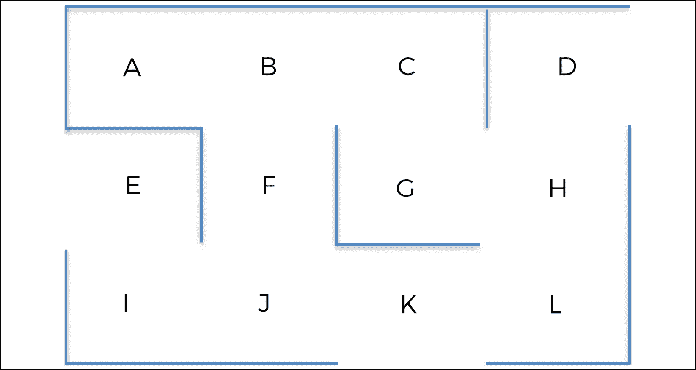
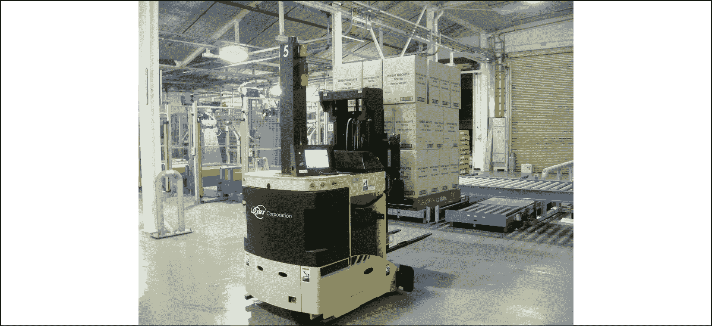
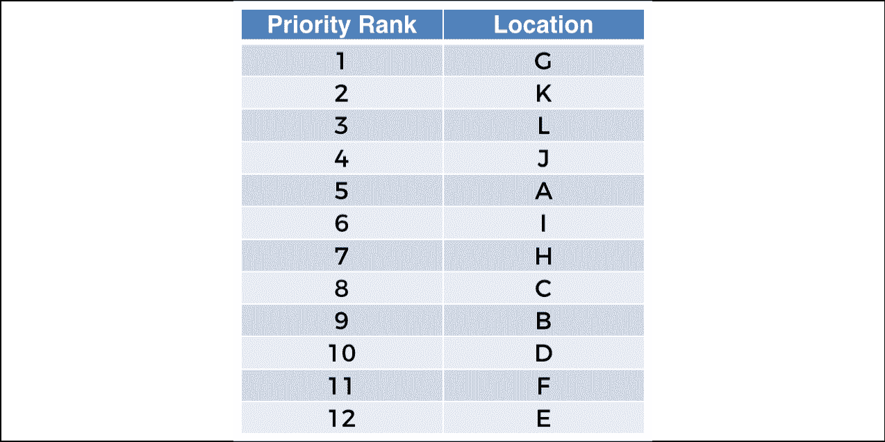
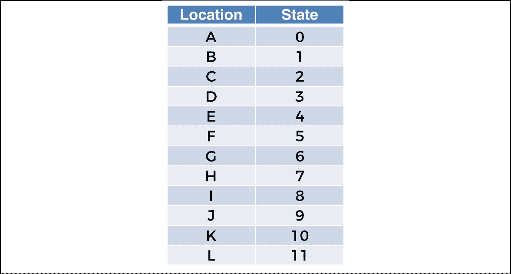
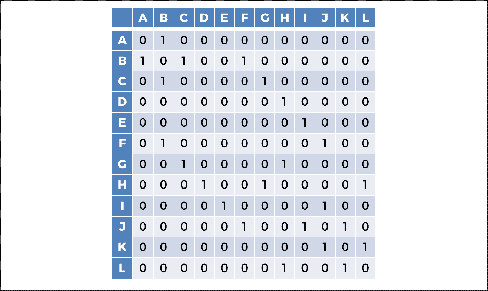
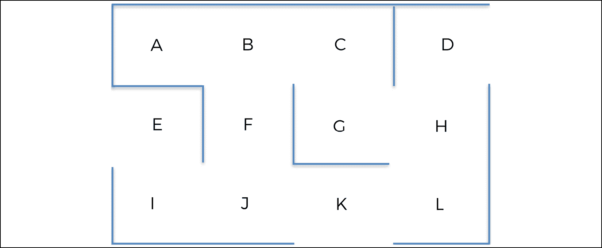

# 八、用于物流的人工智能——仓库中的机器人

是时候开始我们人工智能旅程的下一步了。我在本书的开头就告诉过你，人工智能可以为运输和物流带来巨大的价值，自动驾驶的送货车辆可以加快物流过程。它们通过电子商务行业对经济起到了巨大的推动作用。

在这个新的章节中，我们将为这种应用建立一个人工智能。我们将为此使用的模型当然是 Q 学习(我们将深度 Q 学习留给自动驾驶汽车)。Q 学习是一个简单而强大的人工智能模型，可以优化仓库中的流动，这是你将在这里解决的现实世界的问题。为了方便这次旅行，你将在一个你已经熟悉的环境中工作:我们在前一章看到的迷宫。

不同的是，这一次，迷宫实际上将是一家企业的仓库。它可以是任何企业:电子商务企业、零售企业或任何向客户销售产品并拥有仓库来存储大量待售产品的企业。

让我们再来看看这个迷宫，现在是一个仓库:


图 1:仓库

在这个仓库内，产品被存放在 12 个不同的位置，分别用以下字母从 **A** 到 **L** 标注:



图 2:仓库中的位置

当顾客下订单时，一个机器人会在仓库里来回走动，收集要交付的产品。那将是你的 AI！它看起来是这样的:



图 3:仓库机器人

这 12 个位置都连接到一个计算机系统，该系统实时排列这 12 个位置的产品收集优先级。举个例子，假设在一个特定的时间， *t* ，它返回如下排名:



图 4:最优先的位置

位置 **G** 的优先级为 1，这意味着它是最高优先级，因为它包含一个必须立即收集和交付的产品。我们的机器人必须根据它所在的位置以最短的路线移动到位置 **G** 。我们的目标是建立一个人工智能，无论机器人在哪里，它都能返回最短的路线。

但是我们可以做得更好。这里，位置 **K** 和 **L** 处于前 3 个优先级。因此，让我们的机器人在到达其最终的最高优先级位置之前，通过一些中间位置，这将是一个很好的选择。

系统计算位置优先级的方式超出了本案例研究的范围。其原因是，可以有许多方法来计算这些优先级，从简单的规则或算法到确定性计算，再到机器学习。但这些方式中的大多数都不是我们今天所知道的人工智能。在这个练习中，我们真正想要关注的是核心人工智能，包括强化学习和 Q-学习。就本例而言，我们可以说位置 **G** 是最高优先级，因为该公司最忠实的白金级客户之一紧急订购了存储在位置 **G** 的产品，因此必须尽快交付。

总之，我们的任务是构建一个 AI，它将总是采取最短的路线到达最高优先级的位置，无论它从哪个位置开始，并且可以选择通过位于最高三个优先级的中间位置。

## 建筑环境

当构建一个人工智能时，我们必须做的第一件事就是定义环境。定义一个环境总是需要以下三个要素:

*   定义状态
*   定义行动
*   定义奖励

这三个要素在前面关于 Q 学习的章节中已经定义过了，但是让我们快速提醒自己它们是什么。

### 美国

在特定时间 *t* 的状态是机器人在该时间 *t* 的位置。但是，请记住，您必须对位置名称进行编码，以便我们的人工智能可以进行计算。

冒着让你失望的风险，鉴于所有关于人工智能的疯狂炒作，让我们保持现实，明白 Q 学习只不过是一堆数学方程；就像任何其他人工智能模型一样。让我们从 0 开始编码整数，因为 Python 中的索引从 0 开始:



图 5:位置到州的映射

### 行动

这些动作是机器人下一个可能去的目的地。您可以使用与州相同的索引对这些目的地进行编码。因此，AI 可以执行的全部操作如下:

```
actions = [0,1,2,3,4,5,6,7,8,9,10,11] 
```

### 奖励

记住，当在一个特定的位置时，有些动作是机器人无法执行的。例如，如果机器人在位置 **J** ，它可以执行动作 5、8 和 10，但不能执行其他动作。您可以通过将奖励 0 分配给它不能执行的操作，将奖励 1 分配给它可以执行的操作来指定。

这让你建立了以下奖励矩阵:



图 6:奖励矩阵

### 人工智能解决方案复习器

在实现模型之前，对其进行一点更新是没有坏处的！让我们提醒自己 Q 学习过程的步骤；这次，让它适应你的新问题。让我们欢迎 Q 学习重返舞台:

#### 初始化(第一次迭代)

对于所有状态对 *s* 和动作 *a* ，Q 值被初始化为 0:


#### 下一次迭代

在每次迭代 *t* ≥ 1 时，人工智能将重复以下步骤:

1.  它从可能的状态:中选择一个随机状态
2.  它执行随机动作，该随机动作可以导致下一个可能的状态，即，使得 :
3.  它到达下一个状态并获得奖励。
4.  它计算时间差:
5.  它通过应用贝尔曼方程更新 Q 值:

我们重复这些步骤超过 1000 次。为什么是 1000？1000 的选择来自于我对这个特定环境的实验。我选择了一个足够大的数字让 Q 值在训练中收敛。100 英镑不够大，但 1000 英镑足够了。通常，您可以选择一个非常大的数字，例如 5000，您将获得收敛(即 Q 值不再更新)。然而，这取决于问题的复杂程度。如果您正在处理一个更加复杂的环境，例如，如果您在仓库中有数百个位置，您将需要更多的训练迭代。

整个过程就是这样。现在，您将从头开始用 Python 实现它！

你准备好了吗？我们开始吧。

## Im 实施

好吧，让我们砸碎它。但首先，试着在没有我的情况下自己打碎这个。当然，这是我们将一起进行的旅程，但我真的不介意你比我先走一些。你越快在人工智能中变得独立，你就能越快用它创造奇迹。尝试执行前面提到的 Q 学习过程，完全按照它的样子。不把所有事情都实现也没关系；重要的是你努力了。

这就足够了。不管你有多成功，让我们来看看解决方案。

首先，从导入您将在这个实现中使用的库开始。这次只需要一个库:`numpy`库，它提供了一种处理数组和数学运算的实用方法。给它捷径`np`。

```
# AI for Logistics - Robots in a warehouse

# Importing the libraries

import numpy as np 
```

然后，设置模型的参数。其中包括折现因子 *γ* 和学习率，这是 Q 学习模型仅有的参数。分别给它们`0.75`和`0.9` 的值，这是我随意挑选的，但通常是个不错的选择。如果你不知道用什么，这些是不错的开始值。然而，您将得到具有相似值的相同结果。

```
# Setting the parameters gamma and alpha for the Q 学习gamma = 0.75

alpha = 0.9 
```

在您真正开始构建您的 AI 模型之前，前面的两个代码部分只是介绍性的部分。下一步是开始我们实现的第一部分。

试着记住你现在必须做什么，作为构建人工智能的第一步。

你创造环境！

我只想再次强调这一点。真的是强制性的。环境将是代码的第一部分:

### 第一部分——营造环境

让我们看看这个实现的整个结构，这样您就可以后退一步了。您的代码将分为三个部分:

*   **第一部分**–营造环境
*   **第 2 部分**–利用 Q 学习(训练)构建人工智能解决方案
*   **第三部分**——投产(推论)

让我们从第 1 部分开始。为此，您定义了状态、动作和奖励。首先定义状态，用 Python 字典将位置名称(从 A 到 L 的字母)映射到状态(从 0 到 11 的索引)。把这本字典叫做:

```
# PART 1 - BUILDING THE ENVIRONMENT

# Defining the states

location_to_state = {'A': 0,

                     'B': 1,

                     'C': 2,

                     'D': 3,

                     'E': 4,

                     'F': 5,

                     'G': 6,

                     'H': 7,

                     'I': 8,

                     'J': 9,

                     'K': 10,

                     'L': 11} 
```

然后，用一个从 0 到 11 的简单索引列表定义动作。请记住，每个动作索引对应于该动作指向的下一个位置:

```
# Defining the actions

actions = [0,1,2,3,4,5,6,7,8,9,10,11] 
```

最后，通过创建奖励矩阵来定义奖励，其中行对应于当前状态，列对应于导致下一个状态的动作，单元格包含奖励。如果单元格包含 1，这意味着 AI 可以从当前状态执行动作，以到达下一个状态。如果单元格包含 0，这意味着 AI 不能从当前状态执行动作以到达任何下一个状态。

现在，你可能还记得这个非常重要的问题，它的答案是强化学习的核心。

你如何让人工智能知道它必须去那个最高优先级的位置 **G** ？

一切都与奖励有关。

我必须再次强调，你要记住这一点。如果你给位置 **G** 一个高奖励，那么 AI 通过 Q 学习过程，将学会以最有效的方式抓住那个高奖励，因为它比到达其他位置的奖励更大。

请记住这条非常重要的规则:当人工智能由 Q 学习(或深度 Q 学习，你很快就会知道)驱动时，它将总是学会通过最快的路线达到最高奖励，而不会用负面奖励惩罚人工智能。这就是为什么到达地点 G 的诀窍是简单地给予它比其他地点更高的奖励。

首先在位置 **G** 对应的单元格内手工放入高额奖励，奖励可以是大于 1 的任意高数；位置 **G** 是机器人为了收集产品而必须到达的最高优先级位置。

因为位置 **G** 已经编码了索引状态 6，所以在第 6 行第 6 列的单元格中放置一个`1000`奖励。稍后，我们将通过实现自动转到最高优先级位置的方式来改进您的解决方案，而不必手动更新奖励矩阵，也不必像应该的那样用 0 和 1 进行初始化。现在，这是你的奖励矩阵，包括手动更新。

```
# Defining the rewards

R = np.array([[0,1,0,0,0,0,0,0,0,0,0,0],

              [1,0,1,0,0,1,0,0,0,0,0,0],

              [0,1,0,0,0,0,1,0,0,0,0,0],

              [0,0,0,0,0,0,0,1,0,0,0,0],

              [0,0,0,0,0,0,0,0,1,0,0,0],

              [0,1,0,0,0,0,0,0,0,1,0,0],

              [0,0,1,0,0,0,1000,1,0,0,0,0],

              [0,0,0,1,0,0,1,0,0,0,0,1],

              [0,0,0,0,1,0,0,0,0,1,0,0],

              [0,0,0,0,0,1,0,0,1,0,1,0],

              [0,0,0,0,0,0,0,0,0,1,0,1],

              [0,0,0,0,0,0,0,1,0,0,1,0]]) 
```

这就完成了第一部分。现在，让我们开始实现的第二部分。

### 第 2 部分—利用 Q 学习构建人工智能解决方案

要构建你的人工智能解决方案，完全按照之前提供的 Q 学习算法。如果你在尝试自己实现 Q 学习时遇到了任何麻烦，现在是你复仇的机会了。从字面上看，接下来要做的就是将完全相同的 Q 学习过程转化为代码。

现在你已经记住了，试着自己再编码一次。你能做到的！

不管结果如何，如果你尝试了，恭喜你。接下来，让我们检查一下你是否答对了。

首先，通过创建全 0 的 Q 值矩阵来初始化所有 Q 值，其中行对应于当前状态，列对应于导致下一个状态的动作，单元格包含 Q 值。

```
# PART 2 - BUILDING THE AI SOLUTION WITH Q 学习# Initializing the Q-values

Q = np.array(np.zeros([12,12])) 
```

然后用一个 for 循环执行 Q 学习过程 1000 次迭代，将 Q 学习过程的完全相同的步骤重复 1000 次。

```
# Implementing the Q 学习process

for i in range(1000):

    current_state = np.random.randint(0,12)

    playable_actions = []

    for j in range(12):

        if R[current_state, j] > 0:

            playable_actions.append(j)

    next_state = np.random.choice(playable_actions)

    TD = R[current_state, next_state] + gamma * Q[next_state, np.argmax(Q[next_state,])] - Q[current_state, next_state]

    Q[current_state, next_state] = Q[current_state, next_state] + alpha * TD 
```

现在你已经到达了旅程中真正激动人心的第一步。您实际上已经准备好启动 Q 学习过程，并获得您的最终 Q 值。执行到目前为止您已经实现的全部代码，并使用以下简单的打印语句可视化 Q 值:

```
print("Q-values:")

print(Q.astype(int)) 
```

这是我得到的:

```
Q-values:

[[   0 1661    0    0    0    0    0    0    0    0    0    0]

 [1246    0 2213    0    0 1246    0    0    0    0    0    0]

 [   0 1661    0    0    0    0 2970    0    0    0    0    0]

 [   0    0    0    0    0    0    0 2225    0    0    0    0]

 [   0    0    0    0    0    0    0    0  703    0    0    0]

 [   0 1661    0    0    0    0    0    0    0  931    0    0]

 [   0    0 2213    0    0    0 3968 2225    0    0    0    0]

 [   0    0    0 1661    0    0 2968    0    0    0    0 1670]

 [   0    0    0    0  528    0    0    0    0  936    0    0]

 [   0    0    0    0    0 1246    0    0  703    0 1246    0]

 [   0    0    0    0    0    0    0    0    0  936    0 1661]

 [   0    0    0    0    0    0    0 2225    0    0 1246    0]] 
```

如果您在 Anaconda 中使用的是 Spyder，那么为了更加直观清晰起见，您甚至可以通过双击 Q，直接在变量资源管理器中检查 Q 值矩阵。然后，要获得整数形式的 Q 值，您可以单击 **Format** 并输入浮点格式`%.0f`。您将得到下面的结果，这更清楚一些，因为您可以看到 Q 矩阵中行和列的索引:


图 7:Q 值矩阵

现在你已经有了 Q 值矩阵，你已经准备好投入生产了——你可以继续到实现的第三部分。

### 第 3 部分—投入生产

换句话说，你正在进入推理模式！在这一部分中，您将计算从任何起始位置到任何结束位置的最佳路径。这里的想法是实现一个`route`函数，它将起始位置和结束位置作为输入，并将 Python 列表中的最短路径作为输出返回。起始位置对应于我们的自主仓库机器人在给定时间所处的位置，结束位置对应于机器人作为最高优先级必须去的位置。

由于您希望输入位置及其名称(以字母表示)，而不是它们的状态(以索引表示)，因此您需要一个将位置状态(以索引表示)映射到位置名称(以字母表示)的字典。这是第三部分要做的第一件事，使用一个技巧来反转你之前的字典`location_to_state`，因为你只是想从这个字典中得到精确的逆映射:

```
# PART 3 - GOING INTO PRODUCTION

# Making a mapping from the states to the locations

state_to_location = {state: location for location, state in location_to_state.items()} 
```

现在，请集中注意力——如果这些点还没有在你的脑海中完美地连接起来，现在是时候了。我将向你展示机器人如何设法找出最短路线的具体步骤。

你的机器人将从位置 **E** 移动到位置 **G** 。下面是它是如何做到这一点的解释——我将列举该过程的不同步骤。按照我解释的 Q 值矩阵进行操作:

1.  AI 从开始位置 **E** 开始。
2.  AI 得到位置 **E** 的状态，根据你的`location_to_state`映射是。
3.  在我们的 Q 值矩阵的索引行上，AI 选择具有最大 Q 值的列(`703`)。
4.  该列的索引为 8，因此 AI 执行索引为 8 的动作，这导致它进入下一个状态。
5.  AI 得到状态 8 的位置，根据我们的`state_to_location`映射，它是位置 **I** 。因为下一个位置是位置 **I** ，所以 **I** 被附加到包含最佳路径的 AI 列表中。
6.  然后，从新位置 **I** 开始，AI 重复相同的前五步，直到它到达我们的最终目的地，位置 **G** 。

就是这样！这正是你要实现的。您必须将其推广到任何开始和结束位置，最好的方法是通过一个接受两个输入的函数:

1.  `starting_location`:人工智能开始的位置
2.  `ending_location`:它必须到达的最高优先级位置

并返回最优路径。既然我们在讨论一条路线，你可以调用那个函数`route()`。

在这个`route()`函数中需要理解的一件重要的事情是，因为你不知道 AI 在开始和结束位置之间必须经过多少个位置，所以你必须进行一个`while`循环，该循环将重复前面描述的 5 步过程，并且一旦到达最高优先级的结束位置就会停止。

```
# Making the final function that will return the optimal route

def route(starting_location, ending_location):

    route = [starting_location]

    next_location = starting_location

    while (next_location != ending_location):

        starting_state = location_to_state[starting_location]

        next_state = np.argmax(Q[starting_state,])

        next_location = state_to_location[next_state]

        route.append(next_location)

        starting_location = next_location

    return route 
```

恭喜你！你的人工智能已经准备好了。它不仅实现了训练过程，还实现了在推理模式下运行的代码。到目前为止，唯一不太好的是，您仍然需要手动更新奖励矩阵；不过别担心，我们稍后会谈到这一点。在我们开始之前，让我们先检查一下你是否取得了中间胜利，然后我们就可以着手改进了。

```
# Printing the final route

print('Route:')

route('E', 'G') 
```

以下是输出:

```
Route:

Out[1]: ['E', 'I', 'J', 'F', 'B', 'C', 'G']

Out[2]: ['E', 'I', 'J', 'K', 'L', 'H', 'G'] 
```

这很完美——我在测试从 E 到 G 的代码时运行了两次，这就是为什么您会看到前面的两个输出。返回了两条可能的最优路径:一条经过 F，另一条经过 k。

这是一个好的开始。你有了第一个运行良好的人工智能模型版本。现在让我们来提高你的人工智能，让它更上一层楼。

你可以用两种方法来改进人工智能。首先，通过自动将奖励分配到最优先的位置，这样你就不必手动完成了。其次，通过添加一个特性，让 AI 可以选择在前往最高优先级位置之前经过一个中间位置——该中间位置应该在前三个优先级位置中。

在我们的最高优先级位置排名中，第二个最高优先级位置是位置 K。因此，为了优化仓库流程，您的自动仓库机器人必须通过位置 K 来收集前往最高优先级位置 g 的产品。一种方法是在您的`route()`功能过程中选择经过一个中间位置。这正是您要实现的第二个改进。

首先，让我们实现第一个改进，即自动化奖励归属的改进。

### 改进 1——自动化奖励归属

方法是分三步走。

**步骤 1** :回到原来的奖励矩阵，和之前一样只有 1 和 0。代码的第 1 部分如下所示，并将包含在最终代码中:

```
# PART 1 - BUILDING THE ENVIRONMENT

# Defining the states

location_to_state = {'A': 0,

                     'B': 1,

                     'C': 2,

                     'D': 3,

                     'E': 4,

                     'F': 5,

                     'G': 6,

                     'H': 7,

                     'I': 8,

                     'J': 9,

                     'K': 10,

                     'L': 11}

# Defining the actions

actions = [0,1,2,3,4,5,6,7,8,9,10,11]

# Defining the rewards

R = np.array([[0,1,0,0,0,0,0,0,0,0,0,0],

              [1,0,1,0,0,1,0,0,0,0,0,0],

              [0,1,0,0,0,0,1,0,0,0,0,0],

              [0,0,0,0,0,0,0,1,0,0,0,0],

              [0,0,0,0,0,0,0,0,1,0,0,0],

              [0,1,0,0,0,0,0,0,0,1,0,0],

              [0,0,1,0,0,0,1,1,0,0,0,0],

              [0,0,0,1,0,0,1,0,0,0,0,1],

              [0,0,0,0,1,0,0,0,0,1,0,0],

              [0,0,0,0,0,1,0,0,1,0,1,0],

              [0,0,0,0,0,0,0,0,0,1,0,1],

              [0,0,0,0,0,0,0,1,0,0,1,0]]) 
```

**第二步**:在代码的第二部分，复制(称之为`R_new`)你的奖励矩阵，里面的`route()`函数可以自动更新结束位置的单元格中的奖励。

为什么一定要做副本？因为您必须保留用 1 和 0 初始化的原始奖励矩阵，以便将来当您想去新的优先位置时进行修改。那么，`route()`函数将如何自动更新结束位置单元格中的奖励呢？这很简单:由于结束位置是`route()`函数的输入之一，那么通过使用`location_to_state`字典，您可以非常容易地找到该单元格，并将其奖励更新为`1000`。你可以这样做:

```
# Making a function that returns the shortest route from a starting to ending location

def route(starting_location, ending_location):

    R_new = np.copy(R)

    ending_state = location_to_state[ending_location]

    R_new[ending_state, ending_state] = 1000 
```

**步骤 3** :您必须在`route()`函数中包含整个 Q 学习算法(包括初始化步骤)，就在我们更新您的奖励矩阵副本(`R_new`)中的奖励之后。在您之前的实现中，Q 学习过程发生在原始版本的奖励矩阵上。现在，原始版本需要保持原样，也就是说，只初始化为 1 和 0。因此，您必须将 Q 学习过程包含在`route()`函数中，并使其发生在您的奖励矩阵`R_new`的副本上，而不是原始的奖励矩阵`R`。你可以这样做:

```
# Making a function that returns the shortest route from a starting to ending location

def route(starting_location, ending_location):

    R_new = np.copy(R)

    ending_state = location_to_state[ending_location]

    R_new[ending_state, ending_state] = 1000

    Q = np.array(np.zeros([12,12]))

    for i in range(1000):

        current_state = np.random.randint(0,12)

        playable_actions = []

        for j in range(12):

            if R_new[current_state, j] > 0:

                playable_actions.append(j)

        next_state = np.random.choice(playable_actions)

        TD = R_new[current_state, next_state] + gamma * Q[next_state, np.argmax(Q[next_state,])] - Q[current_state, next_state]

        Q[current_state, next_state] = Q[current_state, next_state] + alpha * TD

    route = [starting_location]

    next_location = starting_location

    while (next_location != ending_location):

        starting_state = location_to_state[starting_location]

        next_state = np.argmax(Q[starting_state,])

        next_location = state_to_location[next_state]

        route.append(next_location)

        starting_location = next_location

    return route 
```

完美；第 2 部分现在已经准备好了！以下是最终代码的第二部分:

```
# PART 2 - BUILDING THE AI SOLUTION WITH Q 学习# Making a mapping from the states to the locations

state_to_location = {state: location for location, state in location_to_state.items()}

# Making a function that returns the shortest route from a starting to ending location

def route(starting_location, ending_location):

    R_new = np.copy(R)

    ending_state = location_to_state[ending_location]

    R_new[ending_state, ending_state] = 1000

    Q = np.array(np.zeros([12,12]))

    for i in range(1000):

        current_state = np.random.randint(0,12)

        playable_actions = []

        for j in range(12):

            if R_new[current_state, j] > 0:

                playable_actions.append(j)

        next_state = np.random.choice(playable_actions)

        TD = R_new[current_state, next_state] + gamma * Q[next_state, np.argmax(Q[next_state,])] - Q[current_state, next_state]

        Q[current_state, next_state] = Q[current_state, next_state] + alpha * TD

    route = [starting_location]

    next_location = starting_location

    while (next_location != ending_location):

        starting_state = location_to_state[starting_location]

        next_state = np.argmax(Q[starting_state,])

        next_location = state_to_location[next_state]

        route.append(next_location)

        starting_location = next_location

    return route 
```

如果您使用 **E** 和 **G** 的开始和结束点多次执行这个新代码，您将得到与之前相同的两条可能的最优路径。您也可以使用`route()`功能，尝试不同的起点和终点。试试吧！

### 改进 2——增加一个中期目标

现在，让我们来解决第二个改进。对于添加经过第二高优先级位置 **K** 的选项的问题，有三种可能的解决方案。当你看到它们时，你就会明白我告诉你强化学习中的一切都是由回报决定的是什么意思。

从每个起点来看，只有一个解决方案有效，但我想给你所有三个解决方案来帮助强化你的直觉。为了有助于这一点，这里有一个仓库布局的提示:



图 8:仓库中的位置

**解决方案 1** :从位置 **J** 到位置 **K** 的动作给予高奖励。这个高额奖励必须大于 1，并且低于 1000。它必须大于 1，以便 Q 学习过程支持从 **J** 到 **K** 的动作，而不是从 **J** 到 **F** 的动作，后者的奖励为 1。它还必须低于 1000，以便最高奖励停留在最高优先级的位置，以确保 AI 结束在那里。例如，在您的奖励矩阵中，您可以给予索引 9 的行和索引 10 的列中的单元高奖励`500`，因为该单元对应于从位置 **J** (状态索引 9)到位置 **K** (状态索引 10)的动作。这样，当从位置 **E** 到位置 **G** 时，您的人工智能机器人将始终经过位置 **K** 。这种情况下的奖励矩阵如下:

```
# Defining the rewards

R = np.array([[0,1,0,0,0,0,0,0,0,0,0,0],

              [1,0,1,0,0,1,0,0,0,0,0,0],

              [0,1,0,0,0,0,1,0,0,0,0,0],

              [0,0,0,0,0,0,0,1,0,0,0,0],

              [0,0,0,0,0,0,0,0,1,0,0,0],

              [0,1,0,0,0,0,0,0,0,1,0,0],

              [0,0,1,0,0,0,1,1,0,0,0,0],

              [0,0,0,1,0,0,1,0,0,0,0,1],

              [0,0,0,0,1,0,0,0,0,1,0,0],

              [0,0,0,0,0,1,0,0,1,0,500,0],

              [0,0,0,0,0,0,0,0,0,1,0,1],

              [0,0,0,0,0,0,0,1,0,0,1,0]]) 
```

这个解决方案并不是在所有情况下都有效，实际上只对起点 **E** 、 **I** 和 **J** 有效。那是因为`500`权重只能影响 AI 关于它是否应该从 **J** 到 **K** 的决定；它不会改变人工智能首先去 **J** 的可能性。

**解决方案 2** :给从位置 **J** 到位置 **F** 的动作一个不好的奖励。这个坏的回报必须低于 0。通过用不好的奖励来惩罚这个动作，Q 学习过程将永远不会支持从 **J** 到 **F** 的动作。例如，在您的奖励矩阵中，您可以给索引 9 的行和索引 5 的列中的单元一个差的奖励`-500`，因为该单元对应于从位置 **J** (状态索引 9)到位置 **F** (状态索引 5)的动作。这样，你的自动仓库机器人将永远不会从位置 **J** 到位置 **F** 到达位置 **G** 。这种情况下的奖励矩阵如下:

```
# Defining the rewards

R = np.array([[0,1,0,0,0,0,0,0,0,0,0,0],

              [1,0,1,0,0,1,0,0,0,0,0,0],

              [0,1,0,0,0,0,1,0,0,0,0,0],

              [0,0,0,0,0,0,0,1,0,0,0,0],

              [0,0,0,0,0,0,0,0,1,0,0,0],

              [0,1,0,0,0,0,0,0,0,1,0,0],

              [0,0,1,0,0,0,1,1,0,0,0,0],

              [0,0,0,1,0,0,1,0,0,0,0,1],

              [0,0,0,0,1,0,0,0,0,1,0,0],

              [0,0,0,0,0,-500,0,0,1,0,1,0],

              [0,0,0,0,0,0,0,0,0,1,0,1],

              [0,0,0,0,0,0,0,1,0,0,1,0]]) 
```

这个解决方案并不是在所有情况下都有效，实际上只对起点 **E** 、 **I** 和 **J** 有效。就像在解决方案 1 中一样，那是因为`-500`权重只能影响 AI 关于它是否应该从 **J** 到 **F** 的决定；它不会改变人工智能首先去 **J** 的可能性。

**解决方案 3** :做一个额外的`best_route()`函数，将三个起点、中间点和终点位置作为输入，这将调用你之前的`route()`函数两次；第一次从开始位置到中间位置，第二次从中间位置到结束位置。

前两个解决方案很容易手动实现，但是自动实现起来很棘手。很容易自动得到你希望人工智能经过的中间位置的索引，但是很难得到通向该中间位置的位置的索引，因为它取决于开始位置和结束位置。如果你尝试实现第一个或第二个解决方案，你就会明白我的意思。此外，解决方案 1 和 2 不能作为全局解决方案。

只有解决方案 3 保证了 AI 在到达最终位置之前会访问一个中间位置。

相应地，我们将实现解决方案 3，它可以用两行额外的代码编写，并且我将它包含在*第 3 部分——投入生产*:

```
# PART 3 - GOING INTO PRODUCTION

# Making the final function that returns the optimal route

def best_route(starting_location, intermediary_location, ending_location):

    return route(starting_location, intermediary_location) + route(intermediary_location, ending_location)[1:]

# Printing the final route

print('Route:')

best_route('E', 'K', 'G') 
```

很简单，对吧？有时候，最好的解决方案是最简单的。这里肯定是这样的。如您所见，第 3 部分包含了运行最终测试的代码。如果 AI 在从位置 **E** 到位置 **G** 的最短路线上通过位置 **K** ，则测试成功。要测试它，可以根据需要多次执行这个全新的代码；您将总是得到相同的预期输出:

```
Route:

['E', 'I', 'J', 'K', 'L', 'H', 'G'] 
```

恭喜你！你开发了一个全功能的人工智能，由 Q 学习提供动力，解决了一个物流优化问题。使用这个人工智能机器人，我们现在可以从任何位置到任何新的最高优先级位置，同时优化我们的路径，以在第二优先级的中间位置收集产品。还不错！如果你对物流感到厌倦，可以随意想象自己回到迷宫中，并尝试使用你喜欢的任何起点和终点的`best_route()`功能，这样你就可以看到你创建的人工智能有多灵活。好好享受吧！当然，在 GitHub 页面上你可以找到完整的代码。

## 摘要

在这一章中，你已经实现了一个商业问题的 Q 学习解决方案。你必须找到去仓库某个地方的最佳路线。你不仅做到了这一点，而且还实现了额外的代码，允许你的 AI 尽可能多的中途停留。基于获得的奖励，你的 AI 能够找到通过这些站点的最佳路线。这就是仓库机器人的 Q 学习。现在，让我们继续深入 Q 学习！