<title>Chapter_9</title>

# 9

# 借助人工大脑走向职业——深度 Q 学习

这个下一个人工智能模型太棒了，因为它是第一个真正受人类智能启发的人工智能模型。我希望你已经准备好在你的人工智能之旅的下一个激动人心的步骤中走向职业；这本书不仅是 AI 的速成课，也是深度学习的入门。

今天，一些顶级的 AI 模型集成了深度学习。它们形成了人工智能的一个新分支，称为深度强化学习。我们将在本章讨论的模型属于这一分支，被称为深度 Q 学习。你已经知道 Q-learning 是怎么一回事，但你可能对深度学习和**人工神经网络** ( **ANNs** )一无所知；我们将从他们开始。当然，如果你是深度学习方面的专家，你可以跳过这一章的前几节，但要考虑到一点复习不会伤害任何人。

在我们开始研究这个理论之前，我们将从用 Python 编写的真实的工作代码开始。你先创造一些人工智能，然后我再帮你理解它。现在，我们要建立一个人工神经网络来预测房价。

## 预测房价

我们想要做的是根据一些变量来预测某个房子的价格。为此，您需要遵循以下四个步骤:

1.  获取一些房屋销售的历史数据；对于本例，您将使用西雅图大约 20，000 所房屋的数据集。
2.  将这些数据导入到您的代码中，同时对您的变量进行一些缩放(我将在后面向您解释缩放)。
3.  使用任何库构建一个人工神经网络——您将使用 Keras，因为它简单可靠。
4.  训练你的 ANN，得到结果。

现在你已经知道了未来代码的结构，你可以开始写了。因为您将使用的所有库都可以在 Google Colab 中找到，所以您可以轻松地使用它来执行这项任务。

### 上传数据集

首先创建一个新的 Google Colab 笔记本。一旦我们创建了您的新笔记本，在您开始编写任何代码之前，您必须上传您的数据集。您可以在 GitHub 存储库的`Chapter 09`文件夹中找到这个名为`kc_house_data.csv`的数据集。

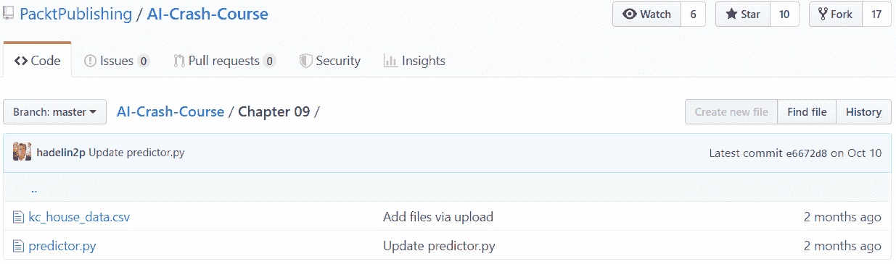

图 1:GitHub–第九章

完成后，您可以通过执行以下操作将其上传到 Colab:

1.  Click this little arrow here: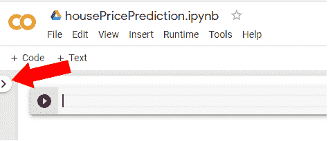

    图 2:Google Colab——上传文件(1/3)

2.  In the window that pops up, go to **Files**. You should get something like this: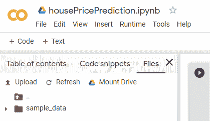

    图 3:Google Colab——上传文件(2/3)

3.  点击**上传**，然后选择保存`kc_house_data`数据集的文件位置。
4.  After you have done that, you should get a new folder with our dataset, like this: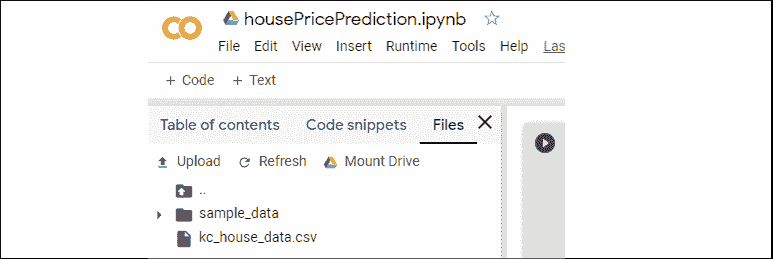

    图 4:Google Colab——上传文件(3/3)

太好了！现在你可以开始编码了。

### 导入库

每次你开始编码的时候，你应该从导入必要的库开始。因此，我们用这些行开始我们的代码:

```
# Importing the libraries   #3

import pandas as pd   #4

import numpy as np   #5

import keras   #6

from sklearn.model_selection import train_test_split   #7

from sklearn.preprocessing import MinMaxScaler   #8

from keras.layers import Dense, Dropout   #9

from keras.models import Sequential   #10

from keras.optimizers import Adam   #11 
```

在第 4 行和第 5 行，在注释之后，您导入了`pandas`和`numpy`库。Pandas 将帮助你读取数据集，当你处理数组或列表时，NumPy 非常有用；您将使用它从数据集中删除一些不必要的列。

在随后的两行中，您从 Scikit-Learn 库中导入了两个有用的工具。第一个是帮助将数据集分成训练集和测试集的工具(你应该总是拥有它们；AI 模型在训练集上训练，然后在测试集上测试)，第二个是一个缩放器，它将在稍后缩放值时帮助您。

第 9、10 和 11 行负责导入`keras`库，您将使用它来构建一个神经网络。这些工具中的每一个都将在代码的后面使用。

既然已经导入了库，就可以读取数据集了。通过使用您之前导入的 Pandas 库，用下面一行代码来完成:

```
# Importing the dataset   #13

dataset = pd.read_csv('kc_house_data.csv')   #14 
```

因为您在导入时使用了`pd`作为 Pandas 库的缩写，所以您可以使用它来缩短您的代码。用`pd`调用熊猫库后，就可以使用它的一个函数`read_csv`，顾名思义就是读取 csv 文件。然后在括号中输入文件名，在您的例子中是`kc_house_data.csv`。不需要其他的论证。

现在我有一个小练习给你！看一下数据集，试着判断哪些变量对我们的价格预测有影响。相信我，不是所有的都相关。我强烈建议您尝试单独完成，尽管我们将在下一部分讨论它们。

### 排除变量

你能辨别出哪些变量是必要的，哪些不是吗？没有也不用担心；我们现在将解释它们及其相关性。

下表解释了数据集中的每一列:

| **变数** | **描述** |
| --- | --- |
| 身份 | 每个家庭的唯一 ID |
| 日期 | 房子出售的日期 |
| 价格 | 这房子卖了多少钱 |
| 卧室 | 卧室数量 |
| 浴室 | 浴室数量；0.5 代表有卫生间但没有淋浴的房间 |
| Sqft _ 生活 | 公寓内部生活空间的平方英尺 |
| 平方英尺 _ 地段 | 土地面积 |
| 地面 | 楼层数 |
| 海滨 | 如果公寓不俯瞰海滨，0 分；如果俯瞰海滨，1 分 |
| 视角 | 值在 0-4 的范围内，取决于物业的视野有多好 |
| 情况 | 定义属性条件的值，范围为 1-5 |
| 级别 | 1-13 之间的值，表示建筑的设计和构造 |
| Sqft_above | 地面以上的室内空间的平方英尺 |
| 平方英尺 _ 地下室 | 地下室的平方英尺 |
| 建造年份 | 房子建造的年份 |
| 翻新年份 | 房子装修的年份(如果不是，则为 0) |
| 邮政编码 | 房屋所在区域的邮政编码 |
| 拉脱维亚的货币单位 | 纬度 |
| 长的 | 经度 |
| Sqft _ living15 | 最近的 15 个邻居的室内居住空间的平方英尺 |
| Sqft_lot15 | 最近的 15 个邻居的土地面积 |

结果是，在这 21 个变量中，只有 18 个有效。这是因为唯一的、类似类别的值对您的预测没有任何影响。其中包括 Id、日期和邮政编码。价格是你预测的目标，因此你也应该把它从你的变量中去掉。在这之后，你有 17 个独立变量。

现在我们已经解释了所有的变量，并决定了哪些是相关的，哪些是不相关的，你可以回到你的代码了。您将排除这些不必要的变量，并将数据集分为要素和目标(在我们的示例中，目标是价格)。

```
# Getting separately the features and the targets   #16

X = dataset.iloc[:, 3:].values   #17

X = X[:, np.r_[0:13,14:18]]   #18

y = dataset.iloc[:, 2].values   #19 
```

在第 17 行，您从数据集中取出从第四行开始的所有行和所有列(因为您排除了 Id、Date、Price ),并将这个新集合称为`X`。您使用`.iloc`对数据集进行切片，然后使用`.values`将其更改为 NumPy 对象。这些将是你的特色。

接下来，您需要排除 Zipcode，不幸的是，它位于特性集的中间。这就是为什么您必须使用 NumPy 函数(`np.r_`)来分隔`X`，排除您选择的列(在本例中是第 14 列)。13 是该列的索引，因为 Python 中的索引是从零开始的；另外值得一提的是，Python 符号中排除了上限，这也是我们写`0:13`)的原因，然后将它们再次连接起来，形成一个新的数组。在下一行中，您得到了您预测的目标，并将其称为`y`。这对应于数据集中的第三列，即 Price。

### 数据准备

既然你已经将你的重要特性和目标分开，你可以将`X`和`y`分成训练集和测试集。我们用下面的代码行来实现:

```
# Splitting the dataset into a training set and a test set   #21

X_train, X_test, y_train, y_test = train_test_split(X, y, test_size = 0.2, random_state = 0)   #22 
```

这在做任何一种机器学习的时候都是非常重要的。你必须有一个训练模型的训练集和一个测试模型的测试集。您使用之前导入的`train_test_split`函数执行该操作。这样做了之后，你就得到`X_train`，和`y_train`大小相等，每个正好是我们之前`X`和`y`集合的 80%。`X_test`和`y_test`由`X`和`y`剩余的 20%组成。

现在你已经有了训练集和测试集，你认为下一步是什么？你必须扩展你的数据。

#### 缩放数据

现在你可能想知道你到底为什么要做这样的手术。你已经有了数据，为什么不建立和训练神经网络呢？

这是有问题的。如果我们让数据保持原样，你会注意到你的人工神经网络没有学习。这是因为不同的变量会根据它们的值或多或少地影响你的预测。

以这个图表说明我的意思，基于一个有 3 间卧室和 1350 平方英尺居住面积的房产。

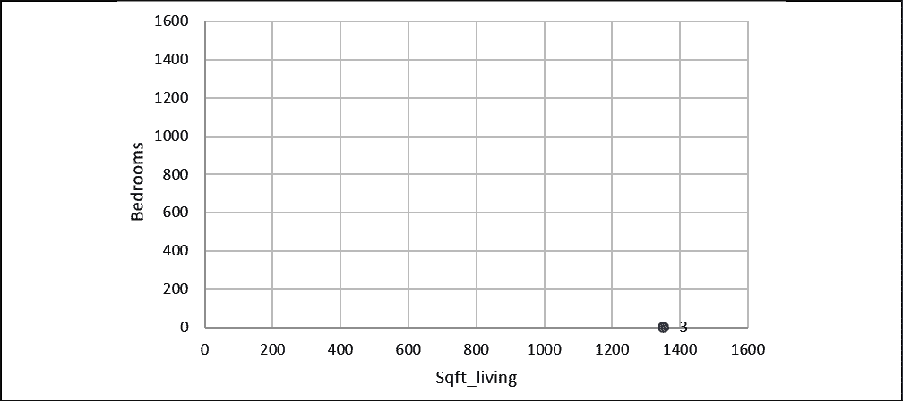

图 5:3 间卧室和 1350 平方英尺居住面积的例子

你可以清楚地看到，卧室的数量不会像 Sqft_living 那样影响预测。即使是我们人类也看不出这张图上零卧室和三卧室之间有什么区别。

这个问题的许多解决方案之一是将所有变量调整到 0 到 1 之间的范围内。我们通过计算以下等式来实现这一点:


其中:

*   *x*–我们要缩放的值在我们的例子中是一列中的每个值
*   *x*min–一列中所有的最小值
*   *x*[max]–一列中所有值的最大值
*   *x*执行缩放后缩放–*x*

执行此缩放后，我们之前的图表现在看起来像这样:

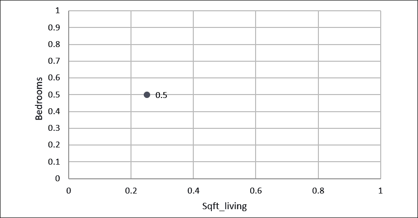

图 6:缩放后的相同图形

现在我们可以毫无疑问地说，卧室的数量会对 Sqft_living 产生类似的影响。我们可以清楚的看到零卧室和三卧室的区别。

那么，我们如何用代码实现它呢？既然你知道方程，我建议你试着自己做。失败了也不用担心；下一段我会告诉你一个非常简单的方法。

如果您能够自己扩展数据，那么恭喜您！如果没有，请继续阅读下一部分，看看答案。您可能已经注意到您导入了一个名为`MinMaxScaler`的 Scikit-learn 库类。您可以使用该类通过以下代码来缩放变量:

```
# Scaling the features   #24

xscaler = MinMaxScaler(feature_range = (0,1))   #25

X_train = xscaler.fit_transform(X_train)   #26

X_test = xscaler.transform(X_test)   #27

#28

# Scaling the target   #29

yscaler = MinMaxScaler(feature_range = (0,1))   #30

y_train = yscaler.fit_transform(y_train.reshape(-1,1))   #31

y_test = yscaler.transform(y_test.reshape(-1,1))   #32 
```

这段代码创建了两个缩放器，一个缩放特征，一个缩放目标。称他们为`xscaler`和`yscaler`。`feature_range`参数是您希望数据缩放的范围(在您的例子中是从 0 到 1)。

然后使用`fit_transform`方法，缩放`X_train`和`y_train`并基于这些集合调整缩放器(该方法的`fit`部分设置*x*最小值和 *x* 最大值)。之后，使用`transform`方法缩放`X_test`和`y_test`，而不调整`yscaler`和`xscaler`。

当缩放`y`变量时，您必须通过使用`.reshape(-1,1)`来改变它们的形状，以便创建一个假的第二维度(因此代码可以将这个一维数组视为一个具有一列的二维数组)。我们需要这个假的第二维来避免格式错误。

如果您仍然不明白为什么我们必须使用缩放，请再次阅读本节。一旦我们研究了这个理论，它也会变得更加清晰。

最后，您可以着手构建神经网络！请记住，这背后的所有理论将在本章的后面介绍，因此，如果你在理解某些东西时遇到困难，不要害怕。

### 构建神经网络

要构建神经网络，您可以使用一个高度可靠且易于使用的库，名为 Keras。让我们直接开始编码吧:

```
# Building the Artificial Neural Network   #34

model = Sequential()   #35

model.add(Dense(units = 64, kernel_initializer = 'uniform', activation = 'relu', input_dim = 17))   #36

model.add(Dense(units = 16, kernel_initializer = 'uniform', activation = 'relu'))   #37

model.add(Dense(units = 1, kernel_initializer = 'uniform', activation = 'relu'))   #38

model.compile(optimizer = Adam(lr = 0.001), loss = 'mse', metrics = ['mean_absolute_error'])   #39 
```

在代码块的第 35 行，使用 Keras 库中的`Sequential`类实例化您的模型。

接下来，添加一行代码，向神经网络添加一个包含 64 个神经元的新层。`kernel_initializer`是定义在层中创建初始权重的方式的自变量，`activation`是该层的激活函数，`input_dim`是输入的大小；对你来说，这 17 个特征决定了房子的价格。

接下来，你再添加两层，一层有 16 个神经元，一层有 1 个神经元，这将是神经网络的输出。

```
compile method, which describes how you want to train your net. Inside this compile method, optimizer is the tool that performs backpropagation, lr is the learning rate—the speed at which the weights in the ANN are updated. loss is how you want to calculate the error of the output (I have decided to go for the mean squared error mse), and metrics is just a value that will help you visualize performance—you can use mean absolute error.
```

如果你现在还不知道我在说什么，什么是激活，什么是损耗，什么是优化器，你也不用担心。当我们在本章后面讲到这个理论时，你很快就会明白了。

### 训练神经网络

现在你已经建立了你的模型，你终于可以训练它了！

```
# Training the Artificial Neural Network   #41

model.fit(X_train, y_train, batch_size = 32, epochs = 100, validation_data = (X_test, y_test))   #42 
```

这个简单的小程序负责学习。

作为这个拟合方法的前两个参数，您输入`X_train`和`y_train`，它们是您的模型将被训练的集合。然后你有一个论点叫做`batch_size`；这定义了在您的数据集中有多少条记录之后，您更新您的权重(在`batch_size`输入之后，损失被累加并反向传播)。接下来你有`epochs`，这个值定义了你在整个`X_train`和`y_train`集合中训练你的模型的次数。最后一个参数是`validation_data`，正如你所看到的，你放了`X_test`和`y_test`。这意味着在每一个纪元之后，你的模型将在这个集合上进行测试，但它不会从中学习。

### 显示结果

你就快到了。你还有最后一个非强制性的步骤要做。您计算测试集的绝对误差，并查看其真实的、未经调整的预测(实际价格，不在(0，1)范围内)。

```
# Making predictions on the test set while reversing the scaling   #44

y_test = yscaler.inverse_transform(y_test)   #45

prediction = yscaler.inverse_transform(model.predict(X_test))   #46

#47

# Computing the error rate   #48

error = abs(prediction - y_test)/y_test   #49

print(np.mean(error))   #50 
```

你在第 45 行重新调整你的`y_test`。然后，对测试要素集进行预测，并重新调整其比例，因为预测也是按比例缩小的。

在最后两行中，使用以下公式计算绝对误差:


由于 prediction 和`y_test`都是 NumPy 数组，您可以简单地使用`/`符号来划分它们。在最后一行，您使用 NumPy 函数计算平均误差。

太棒了！现在您已经完成了所有的工作，您终于可以运行这段代码并查看结果了。

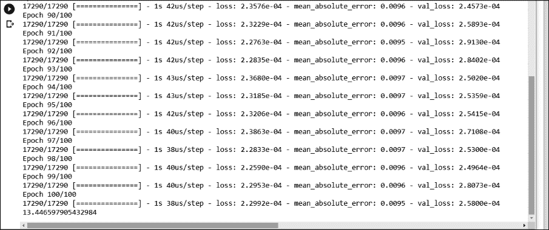

图 7:结果

正如您在最后一行中看到的，显示了您的结果。我的平均误差是 13.5%。这是一个非常好的结果！

现在我们可以进入深度学习背后的理论，并找出神经网络真正是如何工作的。

## 深度学习理论

下面是我们的攻坚 go pro，攻克深度学习的计划:

1.  神经元
2.  激活功能
3.  神经网络是如何工作的？
4.  神经网络是如何学习的？
5.  正向传播和反向传播
6.  梯度下降，包括批量、随机和小批量方法

我希望你对这一部分感到兴奋——深度学习是一个可怕而强大的研究领域。

### 神经元

神经元是人工神经网络的基本构建模块，它们基于大脑中的神经元细胞。

#### 生物神经元

在下面的图片中，是真实生活中的神经元，它们已经被涂在载玻片上，稍微着色，并通过显微镜观察:

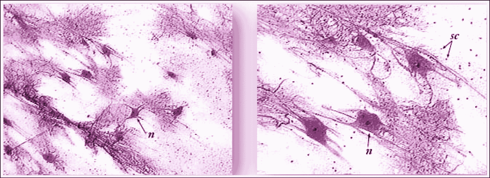

图 8:神经元

正如你所看到的，它们有一个中心体的结构，有许多不同的分支从中延伸出来。问题是:我们如何在一台机器上重现它？我们真的想在机器中重建它，因为深度学习的整个目的是模仿人类大脑的工作方式，希望通过这样做，我们可以创造出一些令人惊叹的东西:一个强大的学习机器基础设施。

我们为什么希望这样？因为人脑恰好是这个星球上最强大的学习工具之一。我们希望，如果我们重新创造它，那么我们会有同样令人敬畏的东西。

我们现在的挑战，我们创造人工神经网络的第一步，是再造一个神经元。那么我们该怎么做呢？首先，让我们仔细看看神经元到底是什么。

1899 年，神经科学家 Santiago Ramón y Cajal 对实际脑组织中的神经元进行染色，并在显微镜下观察它们。当他看着它们的时候，他画出了他所看到的，这和我们之前看的幻灯片非常相似。今天，技术进步了很多，让我们可以更近距离、更详细地观察神经元。这意味着我们可以用图解法画出它们的样子:

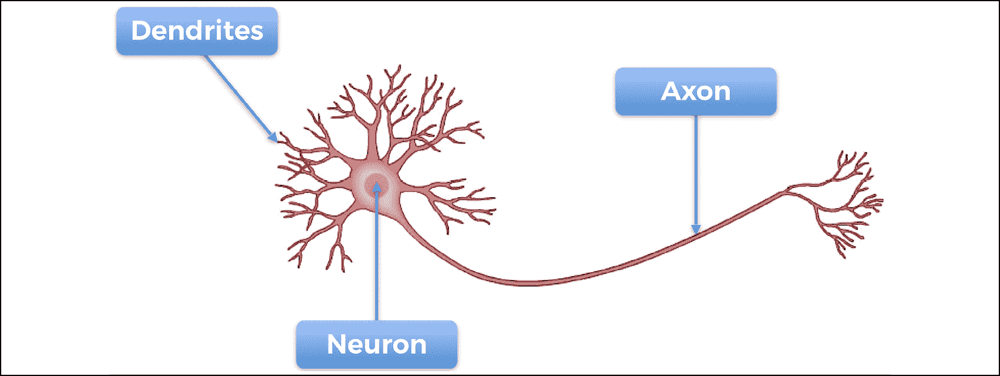

图 9:神经元的结构

这个神经元在其相邻神经元之间交换信号。树突是信号的接收器，轴突是信号的发送器。

神经元的树突与它上面的其他神经元的轴突相连。当神经元触发时，信号沿着其轴突传播，并传递到下一个神经元的树突。这就是它们是如何连接的，以及神经元是如何工作的。现在我们可以从神经科学转向技术。

#### 人工神经元

下面是神经元在人工神经网络中的表现方式:

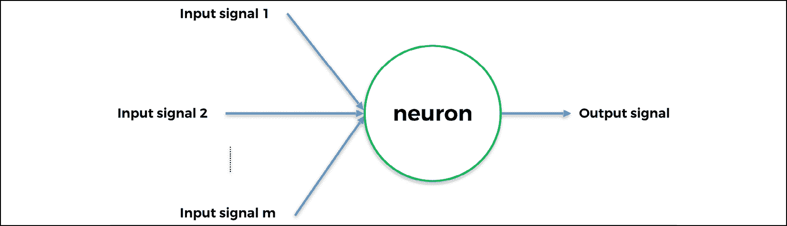

图 10:具有单个神经元的人工神经网络

就像人类神经元一样，它有一些输入信号，也有一个输出信号。蓝色箭头将输入信号连接到神经元，并将神经元连接到输出信号，就像人类神经元中的突触。

在人工神经元中，输入和输出信号到底是什么？输入信号是构成环境状态的定标独立变量。例如，在服务器冷却实践示例中，我们将在本书的后面编写代码(*第 11 章*、*商业人工智能-通过深度 Q 学习最小化成本*)，这些是服务器的温度、用户数量和数据传输速率。输出信号是输出值，在深度 Q 学习模型中，输出值总是 Q 值。知道了所有这些，我们可以为机器制作一个神经元的一般表示:

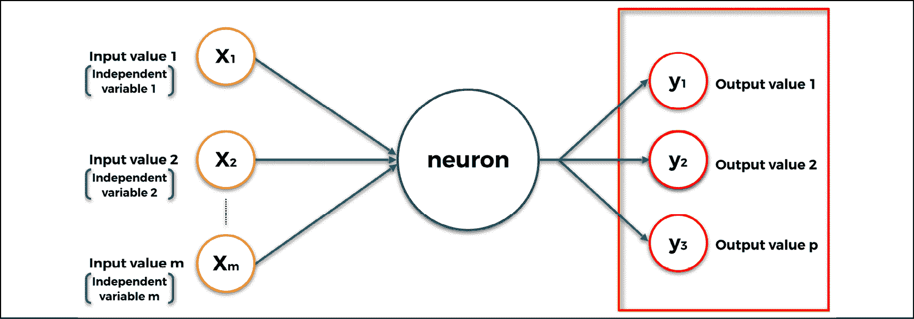

图 11:神经元——输出值

为了完成对神经元的描述，我们需要添加这个表示中缺少的最后一个元素，也是最重要的一个:权重。

每个突触(蓝色箭头)都有一个权重。权重越大，通过突触的信号越强。需要理解的是，这些权重是机器随时间更新以改进其预测的。让我们将它们添加到之前的图形中，以确保您可以很好地将它们可视化:

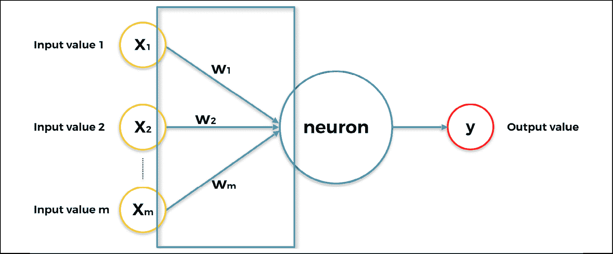

图 12:神经元——权重

那是神经元。接下来要了解的是激活功能；给定输入的阿瑟 t，神经元决定产生什么输出的方式。

### 激活功能

激活函数是 *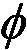* 函数，在神经元内部运行，将输入值乘以相关权重的线性和作为输入，并返回输出值，如下图所示:

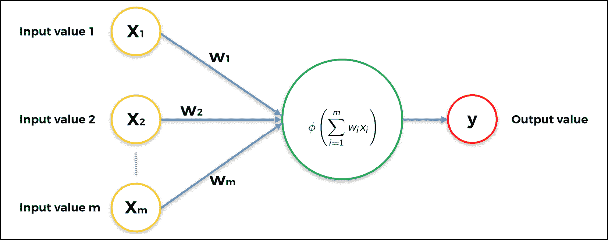

图 13:激活功能

使得:


你的下一个问题大概是: ** 到底是什么功能？

可以有很多，但是这里我们将描述三个最常用的，包括你将在实践活动中用到的:

1.  阈值激活函数
2.  sigmoid 激活函数
3.  整流器激活功能

让我们通过一个一个地看它们来进一步提高你的专业技能。

#### 阈值激活功能

阈值激活函数简单定义如下:

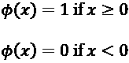

并且可以由以下曲线表示的:

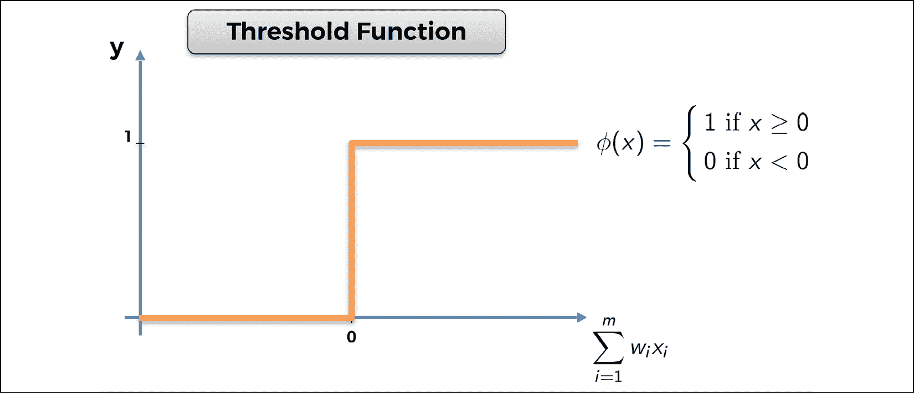

图 14:阈值激活函数

这意味着通过神经元的信号是不连续的，只有在以下情况下才会被激活:

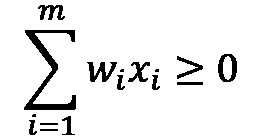

现在让我们看看下一个激活函数:sigmoid 激活函数。sigmoid 激活函数是人工神经网络中最有效和最广泛使用的函数，但主要在通向输出层的最后一个隐藏层中。

#### 乙状结肠激活功能

sigmoid 激活功能由定义如下:

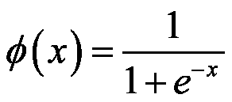

并且可以由以下曲线表示的:

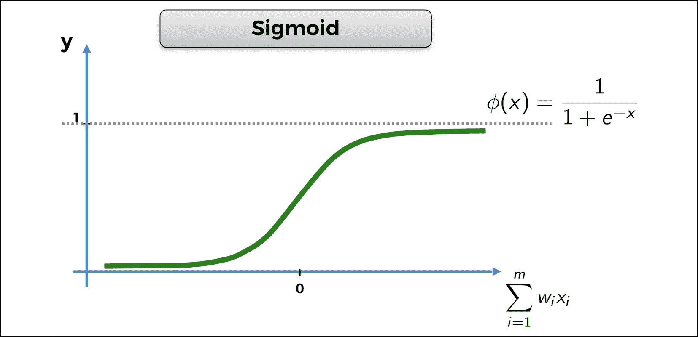

图 15:乙状结肠激活函数

这意味着通过神经元的信号是连续的，将一直被激活。的值越高:

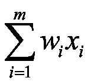

信号越强。

现在让我们来看看另一个广泛使用的激活函数:整流器激活函数。你会在大多数深度神经网络中找到它，但主要是在早期的隐藏层中，与 sigmoid 函数相反，sigmoid 函数更常用于通向输出层的最后一个隐藏层。

#### 整流器激活功能

整流器激活功能简单定义为如下:

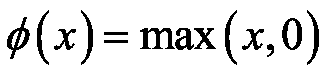

因此由以下曲线表示:

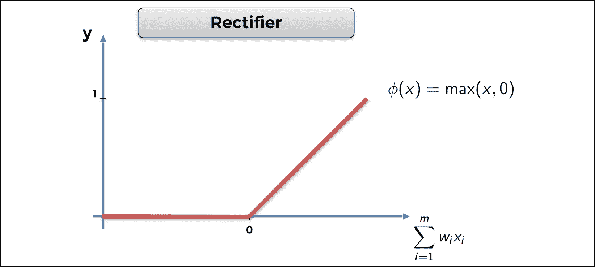

图 16:整流器激活功能

这意味着通过神经元的信号是连续的，只有在以下情况下才会被激活:

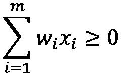

输入的加权和越高，信号越强。

这就提出了一个问题:你应该选择哪一个激活函数，或者，正如人们经常问的那样，你如何知道选择哪一个？

好消息是答案很简单。它实际上取决于作为因变量返回的内容。如果是二进制结果，0 或 1，那么阈值激活函数将是一个不错的选择。如果您想要返回的是因变量为 1 的概率，那么 sigmoid 激活函数是一个很好的选择，因为它的 sigmoid 曲线非常适合建模概率。

概括一下，下图中突出显示了一个小蓝图:


图 17:激活功能蓝图

记住，整流器激活函数应该在具有一个以上隐藏层的深度神经网络的隐藏层内使用，而 sigmoid 激活函数应该在通向输出层的最后一个隐藏层中使用。

让我们在下图中突出显示这一点，以便您可以更好地形象化和记住它:

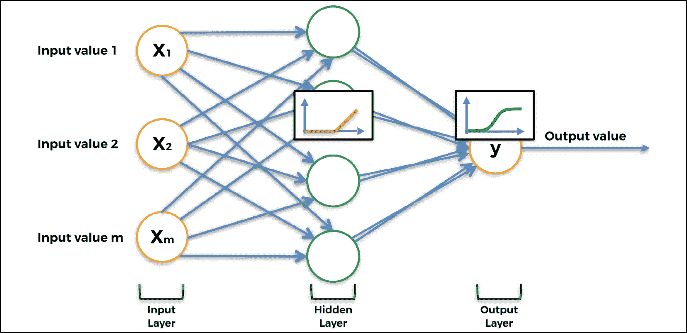

图 18:不同层中的不同激活功能

我们进展很快！你已经对深度学习了解很多了。不过这还没有结束——让我们进入下一部分来解释神经网络实际上是如何工作的。

### 神经网络是如何工作的？

为了解释这一点，让我们回到预测房地产价格的问题。我们用一些独立变量来预测房屋和公寓的价格。为了简单起见，并且能够在一个图中表示一切，让我们说我们仅有的独立变量(我们的预测值)如下:

1.  面积(平方英尺)
2.  卧室数量
3.  到城市的距离(英里)
4.  年龄

我们的因变量是我们预测的公寓价格。这就是深度学习的神奇之处。

每一个独立变量都有一个权重，权重越高，自变量对因变量的影响就越大；也就是说，因变量的预测能力越强。

一旦新的输入进入神经网络，信号就从每个输入向前传播，到达隐藏层的神经元。

在隐藏层的每个神经元内部，应用激活函数，使得输入的权重越低，激活函数就越阻挡来自该输入的信号，并且该输入的权重越高，激活函数就越让该信号通过。

最后，来自隐藏神经元的所有信号，或多或少地被激活函数阻挡，被向前传播到输出层，以返回最终结果:价格预测。

这是神经网络工作方式的可视化:

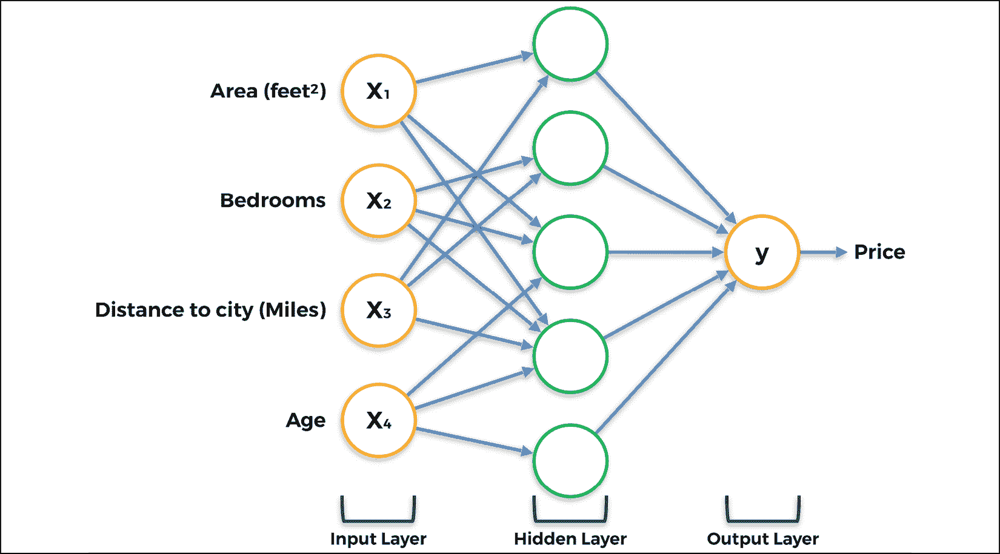

图 19:神经网络如何工作——房地产价格预测的例子

这涵盖了故事的一半。现在我们知道了神经网络是如何工作的，我们需要找到它是如何学习的。

### 神经网络如何学习？

神经网络通过多次迭代更新所有输入和隐藏神经元(当有几个隐藏层时)的权重来学习，总是朝着同一个目标:减少预测和实际值之间的损失误差。

为了让神经网络学习，我们需要实际值，也称为目标值。在我们前面关于房地产定价的示例中，实际值是取自我们数据集中的房屋和公寓的实际价格。这些实际价格取决于之前列出的独立变量(面积、卧室数量、到城市的距离和年龄)，通过运行以下过程，神经网络学会更好地预测这些价格:

1.  神经网络向前传播来自输入的信号；自变量、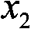、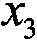和。
2.  然后得到输出层的预测价格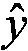。
3.  然后计算预测价格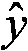(预测)和实际价格 *y* (目标)之间的损失误差*C*: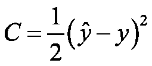
4.  然后，这个损耗误差在神经网络内部反向传播，在我们的表示中是从右到左。
5.  然后，在每个神经元上，神经网络运行一种称为梯度下降的技术(我们将在下一节中讨论)，以在减少损失的方向上更新权重，也就是说，更新为减少损失误差的新权重 *C* 。
6.  然后，这个整个过程重复多次，每次都有新的输入和新的目标，直到我们获得期望的性能(提前停止)或最后一次迭代(在实现中选择的迭代次数)。

让我们在下一节中用两个独立的图形来展示整个过程的两个主要阶段:前向传播和反向传播。

### 正向传播和反向传播

**阶段 1:正向传播**:

下面是信号如何通过人工神经网络从输入到输出前向传播:

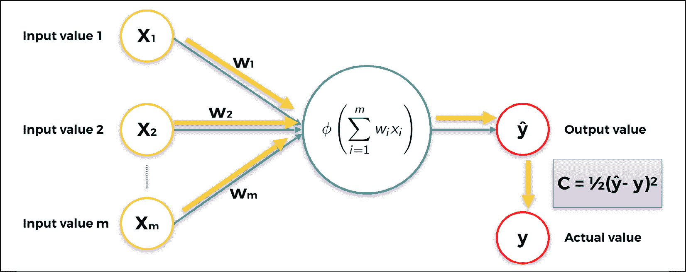

图 20:向前传播

一旦信号通过整个网络传播，损耗误差 *C* 就会被计算出来，这样它就可以被反向传播。

**第二阶段:反向传播**:

在前向传播之后是反向传播，在此期间损耗误差 *C* 从输出到输入被传播回神经网络。


图 21:反向传播

在反向传播期间，权重被更新以减少预测值(输出值)和目标值(实际值)之间的损失误差 *C* 。它们是如何更新的？这就是梯度下降发挥作用的地方。

### 梯度下降

梯度下降是一种优化技术，帮助我们找到成本函数的最小值，就像前面的损失误差 *C* 一样:

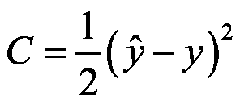

让我们用最直观的方式来形象化它，就像下面碗里的球(上面撒了一点数学):

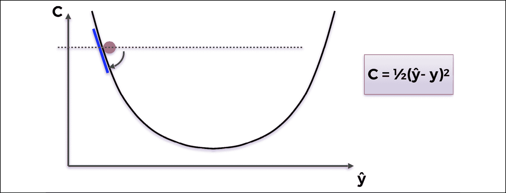

图 22:梯度下降(1/4)

想象一下，这是一个碗的横截面，我们将一个红色的小球放入碗中，让它自己找到底部。一段时间后，当它在碗的底部找到最佳位置时，它就会停止滚动。

你可以用同样的方式考虑梯度下降。它从碗中的某个地方开始(参数的初始值)，并试图找到碗的底部，或者换句话说，一个成本函数的最小值。

让我们看一下上图中显示的例子。参数的初始值将我们的球设置在所示的位置。在此基础上，我们得到一些预测，并与我们的目标值进行比较。这两组之间的差异是我们对于当前参数组的损失。

然后我们计算成本函数关于参数的一阶导数。这就是**渐变**这个名字的由来。这里，这个一阶导数给出了球所在曲线的切线斜率。如果坡度是负的，就像上图中的，我们将下一步移向右侧。如果斜率是正的，我们就向左移动一步。

名称 **descent** 由此而来，即我们总是采取指向下坡的下一步，如下图所示:

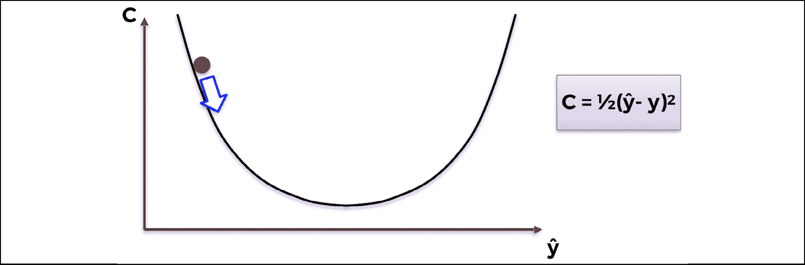

图 23:梯度下降(2/4)

在下一个位置，我们的球停在一个正斜坡上，所以我们必须向左迈出下一步:

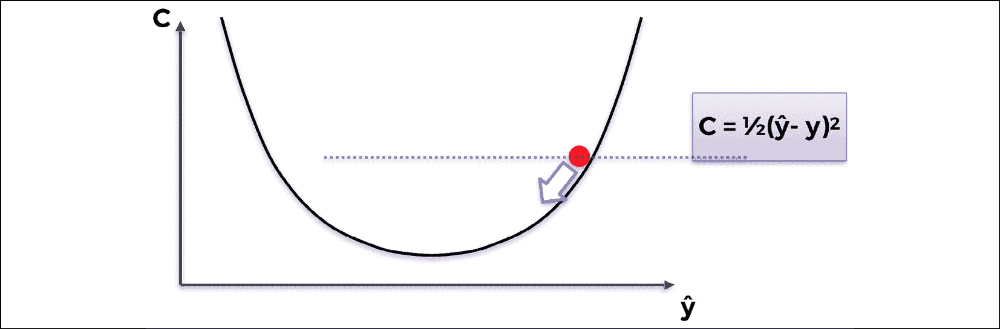

图 24:梯度下降(3/4)

最终，通过重复相同的步骤，球将到达碗的底部:

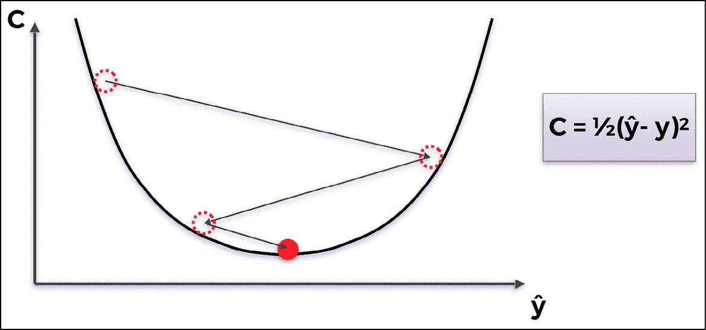

图 25:梯度下降(4/4)

就是这样！这就是梯度下降在一维(一个参数)中的操作方式。现在你可能会问:“太好了，但是这个如何扩展呢？”我们看到了一维优化的例子，但是二维甚至三维呢？

这是一个非常好的问题。如果成本函数是凸的，梯度下降保证了这种方法可以在所需的多个维度上扩展。事实上，如果代价函数是凸的，梯度下降将找到代价函数的绝对最小值。下面是一个二维的例子:

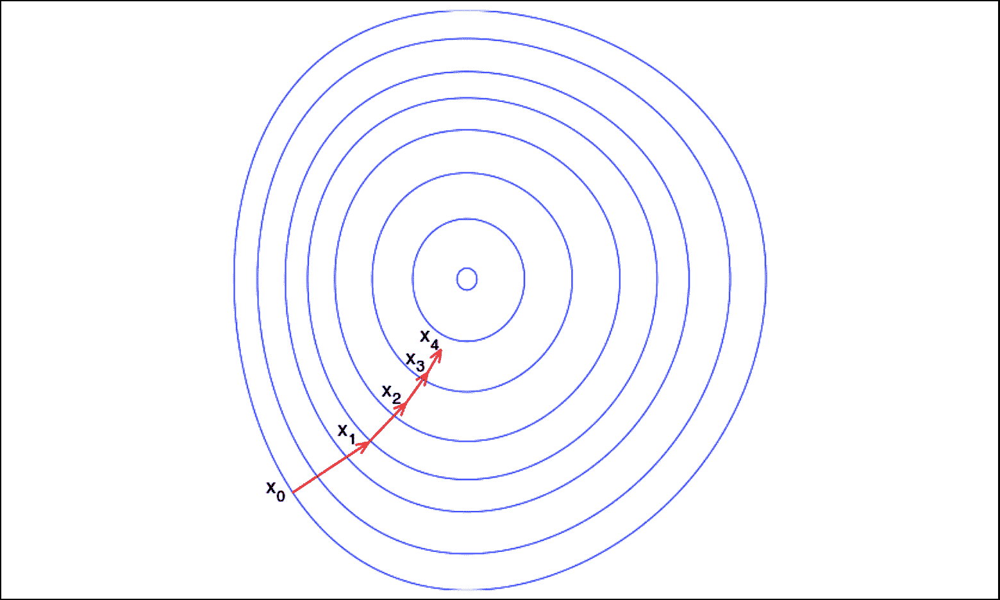

图 26:梯度下降–凸成本函数的收敛保证

但是如果代价函数不是凸的，梯度下降只会找到一个局部极小值。这是一个三维的例子:

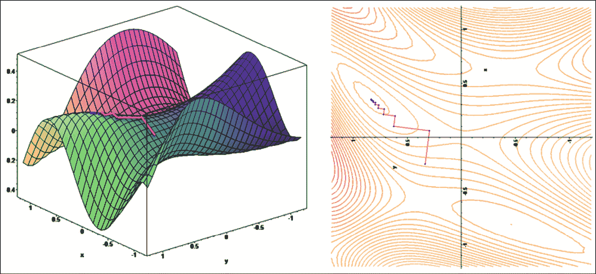

图 27:非凸函数(左)不收敛的例子(右)

既然我们了解了梯度下降是怎么一回事，我们就可以研究它的最先进和最有效的版本:

1.  批量梯度下降
2.  随机梯度下降
3.  小批量梯度下降

“梯度下降”，“批量梯度下降”，“迷你批量梯度下降”，“随机梯度下降”，有太多的术语，像你这样刚刚开始的人可能会发现自己非常困惑。别担心，我会支持你的。

所有这些梯度下降版本之间的主要区别只是我们将数据提供给模型的方式，以及我们更新参数(权重)以移动小红球的频率。先来解释批量梯度下降。

#### 批量梯度下降

批量梯度下降是指当我们有一批输入(与单个输入相反)输入神经网络时，将它们向前传播到最终获得一批预测，这些预测本身与一批目标进行比较。然后，两个批次的预测和目标之间的总体损失误差被计算为每个预测和其相关目标之间的损失误差的总和。

该全局损失被反向传播到神经网络中，在神经网络中，执行梯度下降或随机梯度下降，以根据它们对该全局损失误差的影响程度来更新所有权重。

这是一个批量梯度下降的例子。要解决的问题是根据花费在学习上的时间(学习小时)和花费在睡眠上的时间(睡眠小时)来预测学生在考试中获得的分数(从 0 到 100 %):


图 28:批量梯度下降

在上图中需要注意的一点是，这些不是多个神经网络，而是由单独的权重更新表示的单个神经网络。正如我们在批量梯度下降的示例中看到的，我们将所有数据一次输入到模型中。

这产生了权重的集体更新和网络的快速优化。然而，这也有不好的一面。正如我们在下图中看到的那样，仍然有陷入局部最小值的可能性:

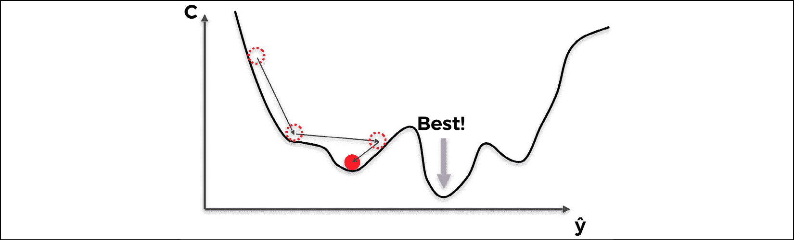

图 29:陷入局部最小值

我们早一点解释了发生这种情况的原因:这是因为前面图形中的成本函数不是凸的，这种类型的优化(简单梯度下降)要求成本函数是凸的。如果不是这种情况，我们会发现自己陷入局部最小值，永远不会找到具有最佳参数的全局最小值。另一方面，这是一个凸成本函数的例子，与我们之前看到的一样:

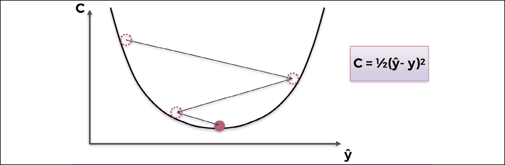

图 30:凸函数的一个例子

简单来说，如果一个函数只有一个全局最小值，那么它就是凸的。凸函数的图形呈碗状。然而，在包括商业问题在内的大多数问题中，成本函数不会是凸的(如下面的 3D 图形示例所示)，因此不允许简单梯度下降很好地执行。这就是随机梯度下降发挥作用的地方。

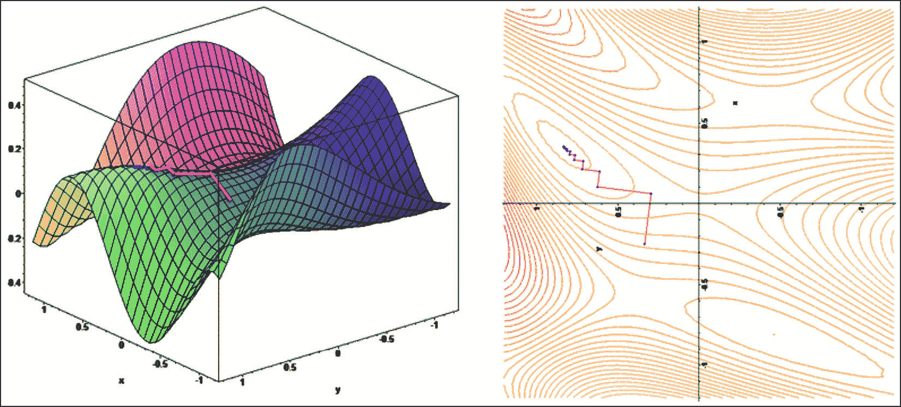

图 31:非凸函数(左)不收敛的例子(右)

#### 随机梯度下降

**随机梯度下降** ( **SGD** )来拯救这一天。它总体上提供了更好的结果，防止算法陷入局部最小值。然而，顾名思义，它是随机的，或者说，是随机的。

因为这个属性，不管你运行算法多少次，不管初始化如何，过程总会略有不同。

SGD 不会立即在整个数据集上运行，而是逐个输入。过程是这样的:

1.  输入单个观察值。
2.  向前传播输入以获得单个预测。
3.  计算预测(输出)和目标(实际值)之间的损耗误差。
4.  将损失误差反向传播到神经网络中。
5.  用梯度下降法更新权重。
6.  对整个数据集重复步骤 1 到 5。

让我们展示一下我们之前看到的预测考试分数的例子中前三个单一输入的前三次迭代:

**观察值的第一个输入行**:

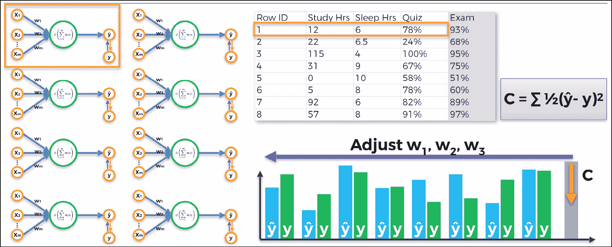

图 32:随机梯度下降——观测值的第一个输入行

**观察值的第二输入行**:

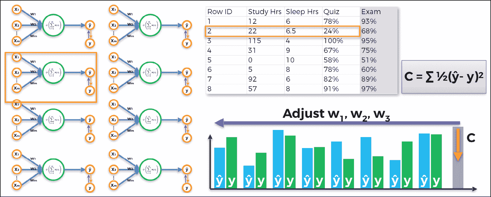

图 33:随机梯度下降——观察值的第二个输入行

**第三个输入行的观察值**:

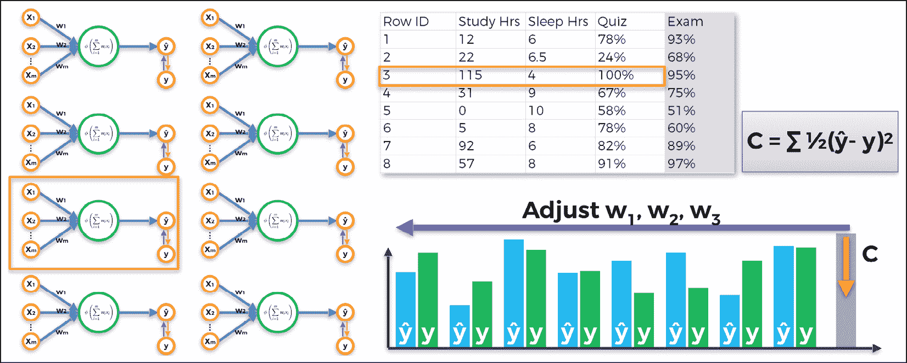

图 34:随机梯度下降——第三行输入观测值

前面的三个图形中的每一个都是 SGD 运行的一个权重更新的例子。正如我们可以看到的，每次我们只从我们的数据集向神经网络输入一行观察值，然后我们相应地更新权重，并继续下一行输入观察值。

乍一看，SGD 似乎更慢，因为我们分别输入每一行。实际上，这要快得多，因为我们不必将整个数据集加载到内存中，也不必等待整个数据集通过模型来更新权重。

为了结束本部分，让我们用下图概括一下批次梯度下降和 SGD 之间的差异:

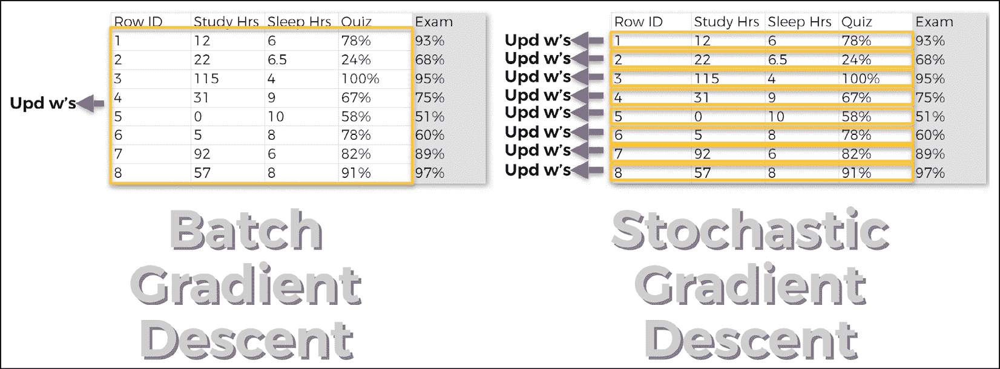

图 35:批量梯度下降与随机梯度下降

现在我们可以考虑一个折中的方法；小批量梯度下降。

#### 小批量梯度下降

小批量梯度下降法结合了批量梯度下降法和 SGD 法的优点。这是通过向人工神经网络提供小批量数据来完成的，而不是一个接一个地提供单个输入行的观察值或一次提供整个数据集。

这种方法比经典的 SGD 更快，并且仍然可以防止陷入局部最小值。如果您没有足够的计算资源来将整个数据集加载到内存中，或者没有足够的处理能力来获得 SGD 的全部好处，那么小批量梯度下降也会有所帮助。

神经网络到此为止！现在，您已经准备好将您的神经网络知识与 Q-learning 的知识结合起来。

## 深度 Q 学习

你已经参观了深度学习的基础，你已经知道 Q-learning；由于深度 Q 学习由结合 Q 学习和深度学习组成，你已经准备好直观地掌握深度 Q 学习并粉碎它。

在我们开始之前，试着猜测一下这是如何工作的。我希望大家花点时间思考一下如何将 Q-learning 整合到人工神经网络中。

首先，你可能已经猜到了神经网络的输入和输出是什么。人工神经网络的输入当然是输入状态，它可以是对环境中正在发生的事情进行编码的一维向量，或者是图像(就像自动驾驶汽车看到的图像)。输出将是每个动作的一组 Q 值，这意味着它将是几个 Q 值的一维向量，每个 Q 值对应一个可以执行的动作。然后，就像以前一样，人工智能采取具有最大 Q 值的动作，并执行它。

非常简单地说，这意味着我们不用贝尔曼方程(简单的 Q 学习)通过迭代更新来预测 Q 值，而是用一个人工神经网络来预测它们，该人工神经网络将输入状态作为输入，并将不同动作的 Q 值作为输出返回。

这就提出了一个问题:我们知道预测什么是好的，但当我们训练人工智能时，这些预测的目标(实际值)是什么？提醒一下，目标是实际值，或者你希望你的预测是理想的:你的预测越接近目标，它就越正确。这就是为什么我们计算预测和目标之间的损失误差 *C* ，以便通过具有随机或小批量梯度下降的反向传播来减少它。

当我们做简单的房地产价格预测时，目标是显而易见的。它们只是我们可以得到的数据集中的价格。但是，例如，当你在训练一辆自动驾驶汽车时，Q 值的目标是什么？这并不明显，尽管它是 Q 值和回报的显式函数。

答案是深度 Q 学习中的一个基本公式。输入状态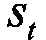的目标是:

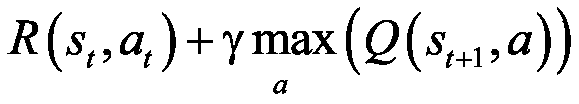

其中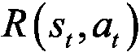是最后获得的奖励，而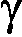是折扣系数，如前所述。

你认出目标的公式了吗？如果你还记得 Q-learning，回答这个问题应该没问题。

当然是在时间差里！记住，时差的定义是:

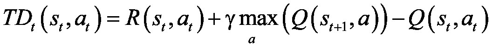

所以现在很明显。目标只是时间差左边的第一个元素:

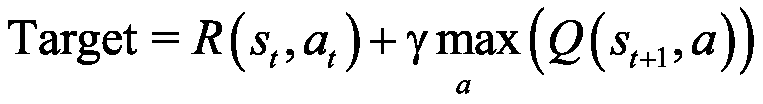

因此我们得到:

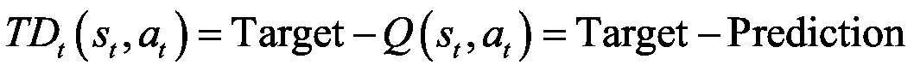

注意，在开始时，Q 值是空的，所以目标只是奖励。

在我们可以说我们真正理解深度 Q 学习之前，还有一个难题；soft max 法。

### soft max 方法

这是我们准备好为深度 Q 学习组装一切之前缺少的一块。Softmax 方法是我们在预测 Q 值后选择要执行的动作的方式。在 Q-learning 中，这很简单；所执行的动作是具有最高 Q 值的动作。那个就是 argmax 方法。在深度 Q-learning 中，情况有所不同。问题通常更复杂，因此，为了找到最优解，我们必须经历一个叫做**探索**的过程。

探索包括以下内容:不是执行具有最大 Q 值的动作(这被称为开发)，我们将给予每个动作与其 Q 值成比例的概率，这样 Q 值越高，概率越高。这准确地创建了可执行动作的分布。最后，执行的动作将从该分布中随机抽取。我举个例子解释一下。

让我们想象我们正在建造一辆自动驾驶汽车(我们实际上将在*第 10 章，自动驾驶汽车的人工智能——建造一辆自动驾驶汽车*)。假设要执行的可能动作很简单:前进、左转或右转。

然后，在特定的时间，假设我们的 AI 预测了以下 Q 值:

| 前进 | 向左转 | 向右转 |
| 24 | 38 | 11 |

我们创建所需概率分布的方法是，将每个 Q 值除以三个 Q 值之和，每次都得出特定行动的概率。让我们来做这些算术题:

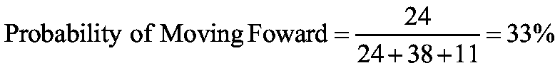Probability of Turning Left

完美-概率总和为 1，并且与 Q 值成比例。这给了我们动作的分布。为了执行一个动作，Softmax 方法从这个分布中随机抽取，例如:

*   前进的动作有 33%的几率被选中。
*   向左转的动作有 52%的几率被选中。
*   向右转的动作有 15%的几率被选中。

你能感受到 Softmax 和 argmax 的区别吗，你明白为什么叫探索而不是剥削吗？有了 argmax，向左*的动作*将被绝对确定地执行。那是剥削。但是使用 Softmax，即使动作*左转*是最有可能被选中的动作，其他动作也有可能被选中。

当然，现在的问题是:我们为什么要这么做？这仅仅是因为我们想要探索其他的行为，以防它们导致转变，导致比我们从纯粹的剥削中获得更高的回报。这种情况经常发生在复杂的问题上，也就是深度 Q 学习用来寻找解决方案的问题。深度 Q-learning 通过其先进的模型以及对行动的探索找到了解决方案。这是人工智能中的一种技术，称为策略探索。

和以前一样，下一步是退一步。我们将回顾深度 Q 学习是如何工作的。

### deEP Q-学习回顾

深度 Q 学习包括将 Q 学习与人工神经网络相结合。

输入是编码的向量，每个向量定义一个环境状态。这些输入进入人工神经网络，其输出包含每个动作的预测 Q 值。

更准确地说，如果 AI 可以采取 *n* 个可能的动作，人工神经网络的输出是由 *n* 个元素组成的 1D 向量，每个元素对应于在当前状态下可以执行的每个动作的 Q 值。然后，通过 Softmax 方法选择执行的操作。

因此，在每个状态下:

1.  预测是 Q 值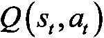，其中由 Softmax 方法执行。
2.  目标是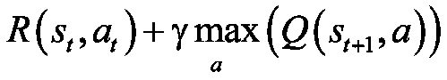。
3.  预测值和目标值之间的损失误差是时间差的平方: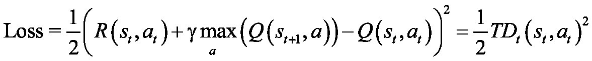

这个损失误差被反向传播到神经网络中，并且通过随机或小批量梯度下降，根据它们对误差的贡献大小来更新权重。

### 经验回放

你可能注意到到目前为止，我们只考虑了从一个状态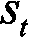到下一个状态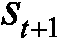的转换。这样的问题是大部分时间与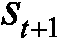非常相关；所以神经网络学的不多。

如果我们考虑最后的 *m* 转换，而不是每次只考虑最后的转换，这可以得到改进，其中 *m* 是一个大的数字。这组最后的 *m* 转换被称为体验重放记忆，或简称为记忆。从这种记忆中，我们将一些随机跃迁分成小批进行采样。然后，我们用这些批次训练神经网络，然后通过小批次梯度下降来更新权重。

### whol 深度 Q 学习算法

我们来总结一下整个深度 Q 学习过程的不同步骤。

初始化:

1.  将体验重放的存储器初始化为空列表 *M* 。
2.  选择内存的最大大小。

在每个时间 *t* ，我们重复以下过程，直到该时期结束:

1.  预测当前状态的 Q 值。
2.  执行 Softmax 方法选择的动作:
3.  得到奖励。
4.  到达下一个状态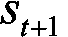。
5.  将过渡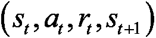添加到存储器 *M* 中。
6.  随机抽取一批 **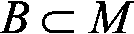** 的转场。对于随机批次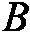的所有过渡:
    *   获取预测: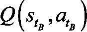
    *   获取目标: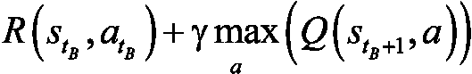
    *   计算整批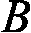: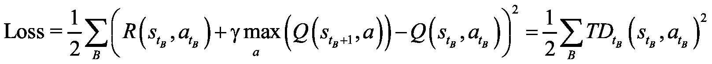的预测值和目标值之间的损失
    *   将该损失误差反向传播回神经网络，并通过随机梯度下降，根据它们对损失误差的贡献大小来更新权重。

你刚刚开启了完整的深度 Q 学习过程！这意味着你现在能够在许多领域构建强大的现实世界人工智能应用。以下是深度 Q-学习可以创造显著附加值的一些应用之旅:

1.  **能源**:那是 DeepMind AI 用来减少谷歌 40%数据中心冷却账单的深度 Q 学习模型。此外，深度 Q 学习可以优化智能电网的功能；换句话说，它可以让智能电网更加智能。
2.  **交通**:深度 Q 学习可以优化交通灯控制，以减少交通流量。
3.  **自动驾驶汽车**:深度 Q-learning 可以用来制造自动驾驶汽车，我们将在本书的下一章对此进行说明。
4.  **机器人**:今天，许多先进的机器人都是用深度 Q-learning 制造的。
5.  **和更多的**:化学、推荐系统、广告和更多——甚至是视频游戏，正如你将在*第 13 章*中发现的那样，游戏的*AI——成为 Snake* 的主人，当你使用深度卷积 Q 学习来训练 AI 玩 Snake 时。

## 总结

你在这一章中学到了很多；我们首先讨论了人工神经网络。人工神经网络是由多层神经元构成的。一层中的每个神经元都与前一层中的每个神经元相连，并且每一层都有自己的激活函数——该函数决定每个输出信号应该被阻止的程度。

人工神经网络做出预测的步骤称为前向传播，它学习的步骤称为反向传播。有三种主要类型的反向传播:批量梯度下降，随机梯度下降，以及最好的一种，小批量梯度下降，它混合了前面两种方法的优点。

我们在本章最后谈到的是深度 Q 学习。这种方法使用神经网络来预测采取某些行动的 Q 值。我们还提到了体验回放记忆，它为我们的人工智能存储了大量的体验。

在下一章中，你将通过编写自己的无人驾驶汽车来将所有这些付诸实践。