# 十一、商业人工智能——通过深度 Q 学习最大限度地降低成本

你可以实现深度 Q 学习模型来建造自动驾驶汽车，这太棒了。真的，再次祝贺你。但我也希望你能够使用深度 Q 学习来解决现实世界的业务问题。有了这个下一个应用程序，你将准备好通过利用人工智能为你的工作或业务增加价值。尽管我们将再次使用一个特定的应用程序，但本章将为您提供一个通用的人工智能框架，一个包含当您使用深度 Q 学习解决现实世界问题时必须遵循的一般步骤的蓝图。这一章对你和你的职业生涯都非常重要；我不希望你在对你将在这里学到的技能有信心之前就合上这本书。让我们一起来粉碎这下一个应用！

## 要解决的问题

当我说我们要解决一个现实世界的商业问题时，我并没有夸大这个问题；我们要用深度 Q 学习解决的问题与下面的问题非常相似，后者是通过深度 Q 学习在现实世界中解决的。

2016 年，DeepMind AI 通过使用他们的 DQN 人工智能模型(deep Q 学习)将谷歌数据中心的冷却账单减少了 40%，从而将谷歌的年度成本的很大一部分降至最低。点击此处链接:

[https://deep mind . com/blog/deep mind-ai-reduces-Google-data-centre-cooling-bill-40](https://deepmind.com/blog/deepmind-ai-reduces-google-data-centre-cooling-bill-40/)

在这个案例研究中，我们将做一些非常类似的事情。我们将建立自己的服务器环境，我们将建立一个人工智能来控制服务器的冷却和加热，使其保持在最佳温度范围内，同时使用最少的能源，从而将成本降至最低。

正如 DeepMind AI 所做的那样，我们的目标将是实现至少 40%的节能！你准备好了吗？让我们开始吧！

一如既往，我的第一个问题是:我们的第一步是什么？

我确信到这一点，我不需要说出答案。让我们直接构建我们的环境！

## 建筑环境

在我们定义状态、动作和奖励之前，我们需要设置服务器并解释它是如何操作的。我们将分几个步骤来完成:

1.  首先，我们将列出控制服务器的所有环境参数和变量。
2.  之后，我们将设置问题的基本假设，你的人工智能将依赖这些假设来提供解决方案。
3.  然后，我们将指定如何模拟整个过程。
4.  最后，我们将解释服务器的整体功能，以及人工智能如何发挥其作用。

### 服务器环境的参数和变量

以下是服务器环境中所有参数的列表，这些参数的值是固定的:

1.  每个月的平均气温。
2.  服务器的最佳温度范围，我们将其设置为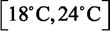。
3.  服务器无法运行的最低温度，我们将其设置为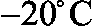。
4.  服务器无法运行的最高温度，我们将其设置为。
5.  服务器中的最小用户数，我们将设置为 10。
6.  服务器中的最大用户数量，我们将设置为 100。
7.  每分钟服务器中用户的最大变化，我们将它设置为 5；所以每一分钟，服务器最多只能多 5 个用户或者少 5 个用户的变化。
8.  服务器中数据传输的最小速率，我们将设置为 20。
9.  服务器中数据传输的最大速率，我们将设置为 300。
10.  每分钟数据传输速率的最大变化，我们将设置为 10；因此，每一分钟，数据传输速率在任一方向上的最大值只能改变 10。

接下来，我们将列出服务器环境的所有变量，这些变量的值会随着时间的推移而波动:

1.  给定时刻服务器的温度。
2.  给定时间内连接到服务器的用户数量。
3.  给定时间内数据传输的速率。
4.  在给定的一分钟内，人工智能消耗在服务器上的能量(冷却或加热)。
5.  每当服务器温度超出最佳范围时，服务器的集成冷却系统自动将服务器温度恢复到最佳范围所消耗的能量。这是为了记录一个非人工智能系统会使用多少能量，这样我们就可以将我们的人工智能系统与它进行比较。

所有这些参数和变量都将是环境的一部分，并将影响我们人工智能的行动。

接下来，我们将解释环境的两个核心假设。重要的是要明白，这些假设与 AI 无关，只是用来简化环境，以便我们可以专注于创建一个功能性的 AI 解决方案。

### 服务器环境的假设

我们将依赖以下两个基本假设:

#### 假设 1–我们可以估算服务器温度

服务器的温度可以通过多元线性回归来近似，即大气温度、用户数量和数据传输速率的线性函数，如下所示:

*服务器温度* = 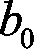 + 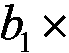 *大气温度* + 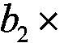 *用户数量* + 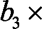 *数据传输速率*

其中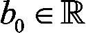、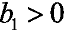、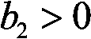、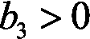。

这种假设的存在理由以及为什么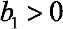、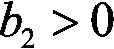和可以直观地理解。当大气温度升高时，服务器的温度也会升高，这是有道理的。连接到服务器的用户越多，服务器处理这些用户所需的能量就越多，因此服务器的温度就越高。最后，服务器内部传输的数据越多，服务器处理数据所需的能量就越多，因此服务器的温度就越高。

为了简单起见，我们可以假设这些相关性是线性的。然而，通过假设它们是二次的或对数的，并修改代码以反映这些方程，您完全可以运行相同的模拟。这只是我对虚拟服务器环境的模拟；你可以随意调整它！

让我们进一步假设，在执行该多元线性回归之后，我们获得了以下系数值:、、和。因此:

*服务器温度* = *大气温度* +  *用户数量* + 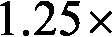 *数据传输速率*

现在，如果我们在现实生活中面临这个问题，我们可以获得服务器的温度数据集，并直接计算这些值。在这里，我们只是假设易于编码和理解的值，因为我们在这一章的目标不是完美地模拟一个真实的服务器；而是要经历用 AI 解决一个现实世界问题的步骤。

#### 假设 2–我们可以估算能源成本

任何冷却系统消耗的能量，无论是我们的 AI 还是我们将与我们的 AI 进行比较的服务器集成冷却系统，在 1 个单位时间内(在我们的情况下为 1 分钟)将服务器的温度从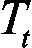改变到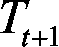，都可以通过回归服务器绝对温度变化的线性函数来近似计算，如下所示:


其中:

1.  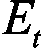是系统在时间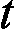和分钟之间花费在服务器上的能量。
2.  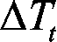是系统在和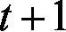分钟之间引起的服务器温度变化。
3.  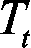是服务器在时刻的温度。
4.  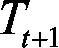是服务器在分钟时的温度。
5.  。
6.  。

我们来解释一下为什么用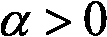做这个假设直观上是有意义的。这只是因为人工智能或老式的集成冷却系统越是加热或冷却服务器，它花费越多的能量来实现热传递。

比如，想象一下服务器突然出现过热问题，刚刚达到C；那么在一个单位时间(1 分钟)内，任一系统将需要更多的能量来使服务器温度回到其最佳温度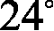 C，而不是回到 C

为了简单起见，在这个例子中，我们假设这些相关性是线性的，而不是从真实数据集计算真实的值。如果你想知道为什么我们取绝对值，那只是因为当人工智能冷却服务器时，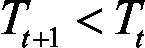，所以。由于能源成本总是正的，我们必须取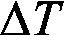的绝对值。

记住我们想要的简单性，我们将假设回归的结果是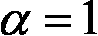和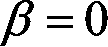，因此我们基于假设 2 得到以下最终等式:


因此:

，即如果服务器发热，

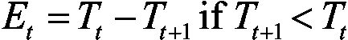，即服务器是否冷却。

现在我们已经完成了我们的假设，让我们来解释我们将如何模拟服务器的操作，用户登录和注销，数据进出。

### 模拟

用户数量和数据传输速率将随机波动，以模拟实际服务器不可预测的用户活动和数据需求。这导致温度的随机性。人工智能需要了解它应该向服务器传输多少冷却或加热功率，以便不降低服务器性能，同时，通过优化其热传递来消耗尽可能少的能量。

现在我们已经有了完整的图片，我将解释服务器和 AI 在这个环境中的整体功能。

### 整体功能

在数据中心内部，我们正在与一台特定的服务器打交道，这台服务器由前面列出的参数和变量控制。每分钟都有一些新用户登录到服务器，一些当前用户注销，因此更新了服务器中活动用户的数量。此外，每分钟都有一些新数据传输到服务器，一些现有数据传输到服务器外部，因此更新了服务器内部的数据传输速率。

因此，基于前面给出的*假设 1* ，服务器的温度每分钟更新一次。现在请集中注意力，因为这是你理解人工智能在服务器上扮演的巨大角色的地方。

两种可能的系统可以调节服务器的温度:AI，或服务器的集成冷却系统。服务器的集成冷却系统是一个非智能系统，可自动将服务器的温度恢复到最佳温度范围内。

每一分钟，服务器的温度都会更新。如果服务器使用集成的冷却系统，该系统会观察会发生什么；该更新可以将温度保持在最佳温度范围内(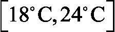)，或者将其移出该范围。如果温度超出最佳范围，例如达到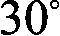 C，服务器的集成冷却系统会自动将温度恢复到最佳范围的最近界限，在本例中为 C。为了进行模拟，我们假设无论温度变化有多大，集成冷却系统都能在一分钟内将其恢复到最佳范围。显然，这是一个不切实际的假设，但本章的目的是让你建立一个能够解决问题的功能性 AI，而不是完美地模拟真实服务器的热动力学。一旦我们一起完成了我们的例子，我强烈建议你修改代码，让它更真实；现在，为了简单起见，我们将相信我们神奇有效的集成冷却系统。

如果服务器改为使用人工智能，那么在这种情况下，服务器的集成冷却系统被停用，并且是人工智能本身更新服务器的温度，以最佳方式调节它。AI 在做出一些预先预测后改变温度，而不是像智能集成冷却系统那样以纯粹确定的方式。在用户数量和数据传输速率发生更新，导致服务器温度发生变化之前，AI 会预测它是否应该冷却服务器，什么都不做，或者加热服务器，并采取行动。然后温度发生变化，人工智能重复。

由于这两个系统彼此不同，我们可以分别评估它们以比较它们的性能；在服务器上训练或运行人工智能，同时跟踪集成冷却系统在相同情况下会使用多少能源。

这让我们想到了能量。请记住，人工智能的一个主要目标是降低运行该服务器的能源成本。因此，我们的人工智能必须尝试使用比服务器上不智能的冷却系统更少的能量。因为，基于前面给出的*假设 2* ，服务器上消耗的能量(任何系统)与一个单位时间内的温度变化成正比:

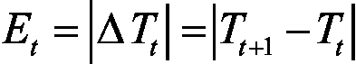

因此:

，即如果服务器发热，

也就是说，如果服务器冷却下来，

那么这意味着 AI 在每次迭代(每分钟)中节省的能量等于非智能服务器的集成冷却系统与来自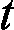和的 AI 之间在服务器中引起的绝对温度变化之差:

和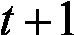之间人工智能节省的能量

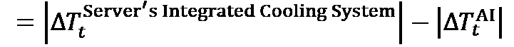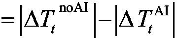

其中:

1.  是服务器的集成冷却系统在迭代期间，即从到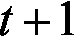分钟，将在服务器中引起的温度变化。
2.  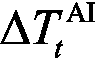是在迭代期间，即从到分钟，AI 在服务器中引起的温度变化。

AIs 的目标是每分钟节省尽可能多的能量，从而在一整年的模拟中节省最大的总能量，并最终为企业节省最大的冷却/加热电费成本。这就是我们在 21 世纪做生意的方式；用 AI！

现在我们已经完全理解了我们的服务器环境是如何工作的，以及它是如何被模拟的，是时候继续定义一个人工智能环境时必须要做的事情了。你已经知道接下来的步骤:

1.  定义状态。
2.  定义行动。
3.  定义奖励。

### 定义状态

记住，当你在做深度 Q 学习时，输入状态总是一个 1D 向量。(除非你正在进行深度卷积 Q 学习，在这种情况下，输入状态是 2D 图像，但这超出了我们的想象！等*第十二章*、*深度卷积 Q 学习* )。那么，在这个服务器环境中，输入状态向量会是什么呢？为了足够好地描述环境的每个状态，它将包含什么信息？这些是你在为一个人工智能问题建模和构建环境时必须问自己的问题。试着自己先回答这些问题，算出这种情况下的输入状态向量，你就能在下一段知道我们在用什么了。提示:再看一下前面定义的变量。

在时间的输入状态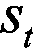由以下三个元素组成:

1.  服务器在时刻的温度
2.  在时刻服务器中的用户数量
3.  在时间时服务器中的数据传输速率

因此，输入状态将是这三个元素的输入向量。我们未来的 AI 会把这个向量作为输入，每次都会返回一个要执行的动作，。说到行动，它们会是什么？让我们找出答案。

### 定义行动

为了弄清楚要执行哪些操作，我们需要记住目标，即最佳地调节服务器的温度。这些动作仅仅是人工智能可以在服务器内部引起的温度变化，以便加热或冷却它。在深度 Q 学习中，动作必须总是离散的；它们不能从一个范围中挑选出来，我们需要一个确定数量的可能行动。因此，我们将考虑五种可能的温度变化，从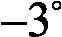 C 到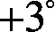 C，这样我们最终得到了 AI 可以执行的五种可能的动作来调节服务器的温度:

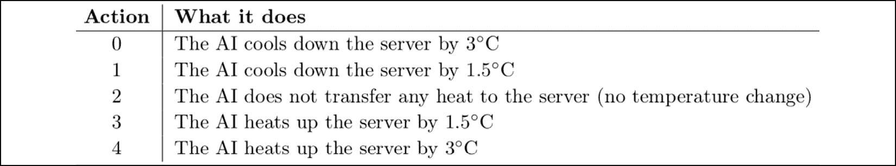

图 1:定义动作

太好了。最后，让我们看看我们将如何奖励和惩罚我们的人工智能。

### 定义奖励

你可能已经从前面的*整体功能*部分猜到了奖励会是什么。迭代的回报是人工智能节省的能量，相对于服务器的集成冷却系统会花费多少能量；也就是说，如果 AI 被停用，非智能冷却系统将花费的能量与 AI 在服务器上花费的能量之间的差异:


因为根据*假设 2* ，消耗的能量等于服务器中引起的温度变化(由任何系统引起，包括人工智能或非智能冷却系统):

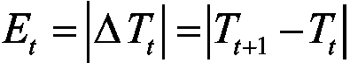

因此:

，如果服务器发热，

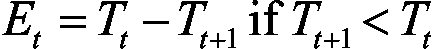，如果服务器冷却，

然后，我们在时间收到奖励，这是在非智能冷却系统(即没有 AI 时)和 AI 之间在服务器中引起的温度变化的差异:

在和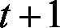之间人工智能节省的能量

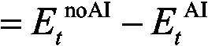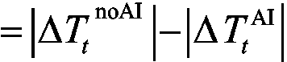

其中:

1.  是服务器的集成冷却系统在迭代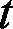过程中，即从到分钟，服务器内温度的变化。
2.  是在迭代期间，即从到分钟，AI 将在服务器中引起的温度变化。

**重要提示**:为了计算奖励，系统(我们的 AI 和服务器的集成冷却系统)将被单独评估，理解这一点很重要。由于在每个时间点，两个不同系统的动作导致不同的温度，我们必须分别记录两个温度，如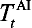和。换句话说，我们正在同时执行两个独立的模拟，遵循相同的用户和数据波动；一个用于人工智能，一个用于服务器的集成冷却系统。

为了完成这一部分，我们将做一个 2 次迭代(即 2 分钟)的小模拟，作为一个例子，以使一切都非常清楚。

### 最终模拟示例

假设我们在时间下午时，服务器的温度是摄氏度，无论有没有人工智能。在这个精确的时间，人工智能预测一个动作:0，1，2，3 或 4。因为，现在，服务器的温度在最佳温度范围之外，，AI 可能会预测动作 0、1 或 2。假设它预测 1，这对应于将服务器冷却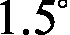 C。因此，在 pm 和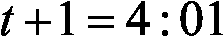 pm 之间，AI 使服务器的温度从变为:


因此，基于*假设 2* ，AI 在服务器上消耗的能量为:


现在，计算奖励只缺少一条信息:如果人工智能在下午 4:00 到 4:01 之间被停用，服务器的集成冷却系统将花费的能量。请记住，这种不智能的冷却系统会自动将服务器的温度恢复到最佳温度范围的最近界限。由于在下午的温度是摄氏度，那么当时的最佳温度范围的最接近界限是摄氏度。因此，服务器的集成冷却系统会将温度从改变到，如果没有 AI，服务器的温度变化是:


基于*假设 2* ，如果没有人工智能，非智能冷却系统消耗的能量为:


总之，AI 在时间 pm 玩这个动作后得到的奖励是:


我相信你已经注意到了，我们的人工智能系统并不参与服务器的最佳温度范围；正如我之前提到的，一切都来自奖励，人工智能不会因为在最佳范围内而获得任何奖励，也不会因为超出最佳范围而受到任何惩罚。一旦我们已经完全构建了人工智能，我建议你摆弄一下代码，尝试添加一些奖励或惩罚，让人工智能接近最佳范围；但是现在，为了让事情简单，让我们的人工智能启动并运行，我们将把奖励完全与节省的能量联系起来。

然后，在 pm 和 pm 之间，新的事情发生:一些新用户登录服务器，一些现有用户注销，一些新数据传输到服务器，一些现有数据传输出去。基于*假设 1* ，这些因素使服务器的温度发生变化。假设总的来说，他们将服务器的温度提高了 C:


现在，请记住，我们正在分别评估两个系统:我们的人工智能和服务器的集成冷却系统。因此我们必须在下午分别计算这两个系统的两个温度，一个没有另一个。让我们从人工智能开始。

当 AI 被激活时，我们在 pm 得到的温度是:


如果人工智能没有激活，我们在 pm 得到的温度是:


现在我们有两个独立的温度，当人工智能被激活时是 = 31.5 *C* ，当人工智能未被激活时是 = 29 *C* 。

让我们模拟一下在点和点之间会发生什么。同样，我们的人工智能将进行预测，由于服务器正在升温，假设它预测了动作 0，这对应于通过冷却服务器，使其下降到。因此，AI 在点和点之间消耗的能量为:


现在，关于服务器的集成冷却系统(即，当没有 AI 时)，由于在 pm 我们有，那么最佳温度范围的最近界限仍然是，因此服务器的非智能冷却系统在 pm 和 pm 之间将花费的能量是:


因此，在 pm 和 pm 之间获得的奖励(仅完全基于节省的能量)是:


最后，在 pm 和 pm 之间获得的总奖励为:


这是整个过程持续两分钟的一个例子。在我们的实现中，我们将在 5 个月的时间内运行 1000 个时期的相同过程，然后，一旦我们的 AI 被训练，我们将在 1 年的模拟中运行相同的过程进行测试。

现在我们已经详细地定义和构建了环境，是时候让我们的 AI 采取行动了！这就是深度 Q 学习发挥作用的地方。我们的模型将比前一个更先进，因为我正在引入一些新的技巧，称为**辍学**和**提前停止**，这些是你工具箱中的伟大技术；它们通常会提高深度 Q 学习的训练性能。

别忘了，你还会得到一个人工智能蓝图，它将允许你把我们在这里做的事情应用到你想用深度 Q 学习解决的任何其他商业问题上。

准备好了吗？让我们打碎它。

## 人工智能解决方案

让我们从提醒我们自己整个深度 Q 学习模型开始，同时使它适应这个案例研究，这样你就不必滚动或翻很多页回到前面的章节。重复从来都不是坏事；它把知识更牢固地灌输到我们的头脑中。这是深度 Q 学习算法:

初始化:

1.  体验回放的内存初始化为一个空列表，代码中称为`memory`(GitHub repo 的`Chapter 11`文件夹中的`dqn.py` Python 文件)。
2.  我们为内存选择一个最大大小，在代码中称为`max_memory`(GitHub repo 的`Chapter 11`文件夹中的`dqn.py` Python 文件)。

在每个时间 *t* (每分钟)，我们重复以下过程，直到纪元结束:

1.  我们预测当前状态的 Q 值。由于可以执行五个动作(0 ==冷却 3°C，1 ==冷却 1.5°C，2 ==无热传递，3 ==加热 1.5°C，4 ==加热 3°C)，我们得到五个预测 Q 值。
2.  我们执行由 argmax 方法选择的动作，该方法简单地包括选择具有五个预测 Q 值中最高值的动作:
3.  我们得到奖励，这就是差别。
4.  我们到达下一个状态，它由以下三个元素组成:
    *   服务器在时刻的温度
    *   在时刻服务器中的用户数量
    *   在时间服务器中数据传输的速率
5.  我们在内存中添加了转换。
6.  我们随机抽取一批过渡。对于随机批次的所有过渡:
    *   我们得到预测:
    *   我们得到的目标:
    *   我们计算整批:的预测和目标之间的损失

最后，我们将这个损失误差反向传播回神经网络，通过随机梯度下降，我们根据它们对损失误差的贡献大小来更新权重。

我希望这本书令人耳目一新！让我们继续来看看服装的大脑。

### 大脑

所谓大脑，我指的当然是我们人工智能的人工神经网络。

我们的大脑将是一个全连接的神经网络，由两个隐藏层组成，第一层有 64 个神经元，第二层有 32 个神经元。提醒一下，这个神经网络将环境状态作为输入，并将五种可能行为的 Q 值作为输出返回。

这种神经网络的特殊设计，具有两个分别为 64 和 32 个神经元的隐藏层，被认为是一种经典的架构。适合解决很多问题，在我们这里会很管用。

这个人工大脑将用一个**均方误差** ( **MSE** )损失和一个`Adam`优化器来训练。选择 MSE 损失是因为我们想要测量并减少预测值和目标值之间的平方差，而`Adam`优化器是一个经典的优化器，实际上是默认使用的。

这是这个人造大脑的样子:


图 2:我们人工智能的人工大脑

这个人造大脑看起来很复杂，但我们可以非常容易地建立它，这要感谢令人惊叹的 Keras 库。在最后一章中，我们使用 PyTorch，因为它是我更熟悉的神经网络库；但是我希望你能够使用尽可能多的人工智能工具，所以在这一章我们将使用 Keras。这里有一个完整实现的预览，包含构建这个大脑的部分(取自`brain_nodropout.py`文件):

```
# BUILDING THE BRAIN

class Brain(object):

    # BUILDING A FULLY CONNECTED NEURAL NETWORK DIRECTLY INSIDE THE INIT METHOD

    def __init__(self, learning_rate = 0.001, number_actions = 5):

        self.learning_rate = learning_rate

        # BUILDING THE INPUT LAYER COMPOSED OF THE INPUT STATE

        states = Input(shape = (3,))

        # BUILDING THE FULLY CONNECTED HIDDEN LAYERS

        x = Dense(units = 64, activation = 'sigmoid')(states)

        y = Dense(units = 32, activation = 'sigmoid')(x)

        # BUILDING THE OUTPUT LAYER, FULLY CONNECTED TO THE LAST HIDDEN LAYER

        q_values = Dense(units = number_actions, activation = 'softmax')(y)

        # ASSEMBLING THE FULL ARCHITECTURE INSIDE A MODEL OBJECT

        self.model = Model(inputs = states, outputs = q_values)

        # COMPILING THE MODEL WITH A MEAN-SQUARED ERROR LOSS AND A CHOSEN OPTIMIZER

        self.model.compile(loss = 'mse', optimizer = Adam(lr = learning_rate)) 
```

正如您所看到的，这只需要几行代码，我将在后面的部分向您解释每一行代码。现在让我们继续讨论实现。

### 实施

这个实现将分为五个部分，每个部分都有自己的 Python 文件。您可以在 GitHub 库的`Chapter 11`文件夹中找到完整的实现。这五个部分构成了通用的人工智能框架，或人工智能蓝图，无论何时你建立一个环境来解决任何具有深度强化学习的业务问题，都应该遵循这个框架。

以下是从第 1 步到第 5 步:

*   第一步:营造环境(`environment.py`)
*   **第二步**:打造大脑(`brain_nodropout.py`或`brain_dropout.py`)
*   **步骤 3** :实现深度强化学习算法，在我们的例子中是深度 Q 学习模型(`dqn.py`)
*   **步骤 4** :训练人工智能(`training_noearlystopping.py`或`training_earlystopping.py`)
*   **步骤 5** :测试人工智能(`testing.py`)

按顺序，这些是一般人工智能框架的主要步骤。

我们将遵循这个 AI 蓝图，在以下五个部分中为我们的特定情况实现 AI，每个部分对应于这五个主要步骤中的一个。在每一步中，我们将通过用大写字母为通用 AI 框架的所有子步骤编写代码部分的标题，用小写字母为我们项目的所有子步骤编写代码部分的标题，来区分仍然是通用 AI 框架的一部分的子步骤和特定于我们项目的子步骤。

这意味着，每当你看到一个标题用大写字母书写的新代码部分，那么它就是通用人工智能框架的下一个子步骤，当你为自己的业务问题构建人工智能时，你也应该遵循它。

下一步，构建环境，是这个项目最大的 Python 实现文件。确保你休息好了，你的电池也充电了，一旦你准备好了，让我们一起来解决这个问题吧！

### 第 1 步–构建环境

在第一步中，我们将在一个类中构建环境。为什么一个班？因为我们希望我们的环境是一个可以用我们选择的任何参数值轻松创建的对象。

例如，我们可以为在特定时间具有特定数量的连接用户和特定数据速率的服务器创建一个环境对象，并为具有不同数量的连接用户和不同数据速率的不同服务器创建另一个环境对象。由于这个类的高级结构，我们可以轻松地即插即用我们在不同服务器上创建的环境对象，这些服务器有自己的参数，用几个不同的人工智能调节它们的温度，这样我们就可以最小化整个数据中心的能耗，就像 Google DeepMind 用其 DQN(深度 Q 学习)算法为 Google 的数据中心所做的那样。

本课程遵循以下子步骤，这些子步骤是步骤 1-构建环境中一般人工智能框架的一部分:

*   **步骤 1-1** :引入并初始化环境的所有参数和变量。
*   **步骤 1-2** :制作一个方法，在 AI 播放一个动作后立即更新环境。
*   **步骤 1-3** :制作重置环境的方法。
*   **步骤 1-4** :做一个方法，随时给我们当前状态，上次获得的奖励，游戏是否结束。

您将在本节中找到这个`Environment`类的完整实现。记住最重要的一点:所有标题用大写字母书写的代码段都是通用 AI 框架/蓝图的步骤，所有标题用小写字母书写的代码段都是我们的案例研究所特有的。

该环境的实现有 144 行代码。出于两个原因，我不会解释每一行代码:

1.  这会让这一章变得非常精彩。
2.  代码非常简单，为了清晰起见进行了注释，它创建了我们在本章中定义的所有内容。

我相信你理解它不会有问题。此外，代码部分的标题和所选的变量名足够清晰，可以从表面上理解代码的结构和流程。我将大致向您介绍一下代码。开始了。

首先，我们用第一个方法`__init__`开始构建`Environment`类，这个方法引入并初始化所有的参数和变量，正如我们前面所描述的:

```
# BUILDING THE ENVIRONMENT IN A CLASS

class Environment(object):

    # INTRODUCING AND INITIALIZING ALL THE PARAMETERS AND VARIABLES OF THE ENVIRONMENT

    def __init__(self, optimal_temperature = (18.0, 24.0), initial_month = 0, initial_number_users = 10, initial_rate_data = 60):

        self.monthly_atmospheric_temperatures = [1.0, 5.0, 7.0, 10.0, 11.0, 20.0, 23.0, 24.0, 22.0, 10.0, 5.0, 1.0]

        self.initial_month = initial_month

        self.atmospheric_temperature = self.monthly_atmospheric_temperatures[initial_month]

        self.optimal_temperature = optimal_temperature

        self.min_temperature = -20

        self.max_temperature = 80

        self.min_number_users = 10

        self.max_number_users = 100

        self.max_update_users = 5

        self.min_rate_data = 20

        self.max_rate_data = 300

        self.max_update_data = 10

        self.initial_number_users = initial_number_users

        self.current_number_users = initial_number_users

        self.initial_rate_data = initial_rate_data

        self.current_rate_data = initial_rate_data

        self.intrinsic_temperature = self.atmospheric_temperature + 1.25 * self.current_number_users + 1.25 * self.current_rate_data

        self.temperature_ai = self.intrinsic_temperature

        self.temperature_noai = (self.optimal_temperature[0] + self.optimal_temperature[1]) / 2.0

        self.total_energy_ai = 0.0

        self.total_energy_noai = 0.0

        self.reward = 0.0

        self.game_over = 0

        self.train = 1 
```

您会注意到`self.monthly_atmospheric_temperatures`变量；这是一个包含 12 个月中每个月平均气温的列表:一月 1 摄氏度，二月 5 摄氏度，三月 7 摄氏度，以此类推。

`self.atmospheric_temperature`变量是我们在模拟期间所在月份的当前平均大气温度，它被初始化为最初月份的大气温度，我们稍后将它设置为一月份。

变量`self.game_over`告诉 AI 我们是否应该重置服务器的温度，以防它超出允许的范围[-20°C，80°C]。如果是，`self.game_over`将被设置为等于 1，否则将保持为 0。

最后，`self.train`变量告诉我们是处于训练模式还是推理模式。如果我们处于训练模式，`self.train = 1`。如果我们处于推理模式，`self.train = 0`。剩下的就是把我们在这一章开始时用文字定义的所有东西都写成代码。

让我们继续前进！

现在，我们制作第二个方法，`update_env`，它在 AI 执行一个动作后更新环境。该方法将三个参数作为输入:

1.  `direction`:描述 AI 强加给服务器的热传递方向的变量，像这样:如果`direction == 1`，AI 正在加热服务器。如果`direction == -1`，AI 正在冷却服务器。我们需要在调用`update_env`方法之前获得这个方向的值，因为这个方法是在动作执行之后调用的。
2.  `energy_ai`:动作播放时，AI 在这个特定时间加热或冷却服务器所消耗的能量。基于假设 2，它将等于由服务器中的 AI 引起的温度变化。
3.  `month`:简单来说就是我们在某个月的某个特定时间进行的动作。

程序在这个方法中采取的第一个动作是计算奖励。事实上，在动作播放后，我们可以立即推断出奖励，因为它是服务器的集成系统在没有人工智能的情况下所消耗的能量与人工智能所消耗的能量之间的差异:

```
 # MAKING A METHOD THAT UPDATES THE ENVIRONMENT RIGHT AFTER THE AI PLAYS AN ACTION

    def update_env(self, direction, energy_ai, month):

        # GETTING THE REWARD

        # Computing the energy spent by the server's cooling system when there is no AI

        energy_noai = 0

        if (self.temperature_noai < self.optimal_temperature[0]):

            energy_noai = self.optimal_temperature[0] - self.temperature_noai

            self.temperature_noai = self.optimal_temperature[0]

        elif (self.temperature_noai > self.optimal_temperature[1]):

            energy_noai = self.temperature_noai - self.optimal_temperature[1]

            self.temperature_noai = self.optimal_temperature[1]

        # Computing the Reward

        self.reward = energy_noai - energy_ai

        # Scaling the Reward

        self.reward = 1e-3 * self.reward 
```

你可能已经注意到，我们选择在最后调整奖励。简而言之，扩展是将价值(这里是回报)降低到一个小范围内。例如，标准化是一种缩放技术，其中所有值都被降低到 0 和 1 之间的范围内。另一种广泛使用的缩放技术是标准化，稍后将对此进行解释。

在执行深度强化学习时，缩放是研究论文中通常推荐的一种常见做法，因为它可以稳定训练并提高 AI 的性能。

得到奖励后，我们到达下一个状态。请记住，每个状态都由以下元素组成:

1.  服务器在时间的温度
2.  在时间时服务器中的用户数量
3.  在时间服务器中的数据传输速率

因此，当我们到达下一个状态时，我们按照下一个代码部分中作为注释突出显示的子步骤，逐一更新这些元素:

```
 # GETTING THE NEXT STATE

        # Updating the atmospheric temperature

        self.atmospheric_temperature = self.monthly_atmospheric_temperatures[month]

        # Updating the number of users

        self.current_number_users += np.random.randint(-self.max_update_users, self.max_update_users)

        if (self.current_number_users > self.max_number_users):

            self.current_number_users = self.max_number_users

        elif (self.current_number_users < self.min_number_users):

            self.current_number_users = self.min_number_users

        # Updating the rate of data

        self.current_rate_data += np.random.randint(-self.max_update_data, self.max_update_data)

        if (self.current_rate_data > self.max_rate_data):

            self.current_rate_data = self.max_rate_data

        elif (self.current_rate_data < self.min_rate_data):

            self.current_rate_data = self.min_rate_data

        # Computing the Delta of Intrinsic Temperature

        past_intrinsic_temperature = self.intrinsic_temperature

        self.intrinsic_temperature = self.atmospheric_temperature + 1.25 * self.current_number_users + 1.25 * self.current_rate_data

        delta_intrinsic_temperature = self.intrinsic_temperature - past_intrinsic_temperature

        # Computing the Delta of Temperature caused by the AI

        if (direction == -1):

            delta_temperature_ai = -energy_ai

        elif (direction == 1):

            delta_temperature_ai = energy_ai

        # Updating the new Server's Temperature when there is the AI

        self.temperature_ai += delta_intrinsic_temperature + delta_temperature_ai

        # Updating the new Server's Temperature when there is no AI

        self.temperature_noai += delta_intrinsic_temperature 
```

然后，如果需要的话，我们更新`self.game_over`变量，也就是说，如果服务器的温度超出了允许的范围[-20°C，80°C]。如果服务器温度低于最低温度-20°C，或者如果服务器温度高于最高温度 80°C，就会发生这种情况。此外，我们还做了两件额外的事情:我们将服务器温度带回最佳温度范围(最接近的界限)，由于这样做会消耗一些能量，因此我们更新了 AI 消耗的总能量(`self.total_energy_ai`)。这正是下一个代码段中要编码的内容:

```
 # GETTING GAME OVER

        if (self.temperature_ai < self.min_temperature):

            if (self.train == 1):

                self.game_over = 1

            else:

                self.total_energy_ai += self.optimal_temperature[0] - self.temperature_ai

                self.temperature_ai = self.optimal_temperature[0]

        elif (self.temperature_ai > self.max_temperature):

            if (self.train == 1):

                self.game_over = 1

            else:

                self.total_energy_ai += self.temperature_ai - self.optimal_temperature[1]

                self.temperature_ai = self.optimal_temperature[1] 
```

现在，我知道让服务器从 80 度快速恢复到 24 度，或者从-20 度恢复到 18 度似乎不太现实，但这是我们之前定义的神奇高效的集成冷却系统完全能够做到的。可以把它想象成在温度灾难的情况下，人工智能切换到集成系统的一瞬间。再说一次，一旦我们让人工智能运行起来，这个领域将会从你持续的修补中受益匪浅；之后，您可以随意摆弄这些数字，以获得更真实的服务器模型。

然后，我们更新来自两个独立模拟的两个分数，它们是:

1.  `self.total_energy_ai`:人工智能消耗的总能量
2.  `self.total_energy_noai`:无 AI 时服务器集成散热系统消耗的总能量。

```
 # UPDATING THE SCORES

        # Updating the Total Energy spent by the AI

        self.total_energy_ai += energy_ai

        # Updating the Total Energy spent by the server's cooling system when there is no AI

        self.total_energy_noai += energy_noai 
```

然后，为了提高性能，我们通过扩展其三个元素(服务器温度、用户数量和数据传输速率)来扩展下一个状态。为此，我们执行一个简单的标准化缩放技术，它简单地包括减去变量的最小值，然后除以变量的最大增量:

```
 # SCALING THE NEXT STATE

        scaled_temperature_ai = (self.temperature_ai - self.min_temperature) / (self.max_temperature - self.min_temperature)

        scaled_number_users = (self.current_number_users - self.min_number_users) / (self.max_number_users - self.min_number_users)

        scaled_rate_data = (self.current_rate_data - self.min_rate_data) / (self.max_rate_data - self.min_rate_data)

        next_state = np.matrix([scaled_temperature_ai, scaled_number_users, scaled_rate_data]) 
```

最后，我们通过返回下一个状态、收到的奖励以及游戏是否结束来结束这个`update_env`方法:

```
 # RETURNING THE NEXT STATE, THE REWARD, AND GAME OVER

        return next_state, self.reward, self.game_over 
```

太好了！我们已经完成了这个漫长但重要的方法，它在每个时间步(每分钟)更新环境。现在有两个最终且非常简单的方法:一个是重置环境，另一个是在任何时候给我们三条信息:当前状态，最后一次收到的奖励，以及游戏是否结束。

这里是`reset`方法，当一个新的训练集开始时，它通过将环境的所有变量重置为它们最初的初始值来重置环境:

```
 # MAKING A METHOD THAT RESETS THE ENVIRONMENT

    def reset(self, new_month):

        self.atmospheric_temperature = self.monthly_atmospheric_temperatures[new_month]

        self.initial_month = new_month

        self.current_number_users = self.initial_number_users

        self.current_rate_data = self.initial_rate_data

        self.intrinsic_temperature = self.atmospheric_temperature + 1.25 * self.current_number_users + 1.25 * self.current_rate_data

        self.temperature_ai = self.intrinsic_temperature

        self.temperature_noai = (self.optimal_temperature[0] + self.optimal_temperature[1]) / 2.0

        self.total_energy_ai = 0.0

        self.total_energy_noai = 0.0

        self.reward = 0.0

        self.game_over = 0

        self.train = 1 
```

最后，这里是`observe`方法，它让我们在任何给定的时间知道当前状态、收到的最后一个奖励以及游戏是否结束:

```
 # MAKING A METHOD THAT GIVES US AT ANY TIME THE CURRENT STATE, THE LAST REWARD AND WHETHER THE GAME IS OVER

    def observe(self):

        scaled_temperature_ai = (self.temperature_ai - self.min_temperature) / (self.max_temperature - self.min_temperature)

        scaled_number_users = (self.current_number_users - self.min_number_users) / (self.max_number_users - self.min_number_users)

        scaled_rate_data = (self.current_rate_data - self.min_rate_data) / (self.max_rate_data - self.min_rate_data)

        current_state = np.matrix([scaled_temperature_ai, scaled_number_users, scaled_rate_data])

        return current_state, self.reward, self.game_over 
```

厉害！我们已经完成了实现的第一步，构建环境。现在让我们进入下一步，开始建造大脑。

### 第二步——打造大脑

在这一步，我们将构建我们人工智能的人工大脑，它只不过是一个完全连接的神经网络。又来了:


图 3:我们人工智能的人工大脑

我们将在一个类中构建这个人工大脑，原因与之前相同，即允许我们为数据中心内的不同服务器创建几个人工大脑。也许一些服务器将需要不同的人工大脑，具有不同于其他服务器的超参数。这就是为什么，由于这种类/对象高级 Python 结构，我们可以轻松地从一个大脑切换到另一个大脑，以调节需要具有不同神经网络参数的 AI 的新服务器的温度。这就是**面向对象编程** ( **OOP** )的妙处。

我们正在用令人惊叹的 Keras 图书馆建造这个人工大脑。从这个库中，我们使用`Dense()`类来创建我们的两个完全连接的隐藏层，第一个来自 64 个隐藏神经元，第二个来自 32 个神经元。请记住，这是一个经典的神经网络架构，通常默认使用，作为常见的做法，并在许多研究论文中看到。最后，我们再次使用`Dense()`类返回 Q 值，这是人工神经网络的输出。

稍后，当我们编写训练和测试文件时，我们将使用 argmax 方法来选择具有最大 Q 值的动作。然后，我们通过将大脑创建为`Model()`类的对象(这非常有用，因为我们可以保存和加载具有特定权重的模型)，来组装大脑的所有组件，包括输入和输出。最后，我们将用均方差损失和 Adam 优化器来编译它。稍后我会更详细地解释这一切。

以下是通用人工智能框架的新步骤:

*   **步骤 2-1** :构建输入层，由输入状态组成。
*   **步骤 2-2** :建立定义数量的隐层，每层内部定义数量的神经元，与输入层完全连接，相互之间也完全连接。
*   **步骤 2-3** :建立输出层，完全连接到最后一个隐藏层。
*   **步骤 2-4** :在模型对象内部组装完整的架构。
*   **步骤 2-5** :用均方误差损失函数和选择的优化器编译模型。

这是的实现，您可以选择两个不同的文件:

1.  `brain_nodropout.py`:一个实现文件，它构建了一个不使用正则化技术的人工大脑(我很快会解释它是什么)。
2.  `brain_dropout.py`:一个实现文件，它使用退出正则化技术构建人工大脑。

首先让我给你一个没有 dropout 的实现，然后我会提供一个有 dropout 的实现并解释它。

#### 无辍学

这里是人工大脑的完整实现，没有任何退出正则化技术:

```
# AI for Business - Minimize cost with Deep Q 学习#1

# Building the Brain without Dropout   #2

#3

# Importing the libraries   #4

from keras.layers import Input, Dense   #5

from keras.models import Model   #6

from keras.optimizers import Adam   #7

   #8

# BUILDING THE BRAIN   #9

   #10

class Brain(object):   #11

    #12

    # BUILDING A FULLY CONNECTED NEURAL NETWORK DIRECTLY INSIDE THE INIT METHOD   #13

    #14

    def __init__(self, learning_rate = 0.001, number_actions = 5):   #15

        self.learning_rate = learning_rate   #16

        #17

        # BUILDING THE INPUT LAYER COMPOSED OF THE INPUT STATE   #18

        states = Input(shape = (3,))   #19

        #20

        # BUILDING THE FULLY CONNECTED HIDDEN LAYERS   #21

        x = Dense(units = 64, activation = 'sigmoid')(states)   #22

        y = Dense(units = 32, activation = 'sigmoid')(x)   #23

        #24

        # BUILDING THE OUTPUT LAYER, FULLY CONNECTED TO THE LAST HIDDEN LAYER   #25

        q_values = Dense(units = number_actions, activation = 'softmax')(y)   #26

        #27

        # ASSEMBLING THE FULL ARCHITECTURE INSIDE A MODEL OBJECT   #28

        self.model = Model(inputs = states, outputs = q_values)   #29

        #30

        # COMPILING THE MODEL WITH A MEAN-SQUARED ERROR LOSS AND A CHOSEN OPTIMIZER   #31

        self.model.compile(loss = 'mse', optimizer = Adam(lr = learning_rate))   #32 
```

现在，让我们详细检查一下代码。

**第 5 行**:我们从`keras`库中的`layers`模块导入`Input`和`Dense`类。`Input`类允许我们构建输入层，而`Dense`类允许我们构建全连接层。

**第 6 行**:我们从`keras`库中的`models`模块导入`Model`类。它允许我们通过组装不同的层来建立整个神经网络模型。

**第 7 行**:我们从`keras`库中的`optimizers`模块导入`Adam`类。当在训练的每次迭代中反向传播损失误差时，它允许我们使用 Adam 优化器，用于通过随机梯度下降来更新神经网络的权重。

**第 11 行**:我们引入了`Brain`类，它不仅包含了人工神经网络的整个架构，还包含了模型与损耗(均方误差)和 Adam 优化器的连接。

**第 15 行**:我们引入了`__init__`方法，这将是这个类唯一的方法。我们定义了内部神经网络的整个架构，只是通过创建连续的变量来组装神经网络。该方法将两个参数作为输入:

1.  学习率(`learning_rate`)，衡量你希望神经网络学习多快(学习率越高，神经网络学习越快；但是以质量为代价)。默认值为`0.001`。
2.  动作数(`number_actions`)，当然是我们的 AI 可以执行的动作数。现在你可能会想:为什么我们需要把它作为一个论点？这只是以防万一，你想建立另一个可以执行更多或更少动作的人工智能。在这种情况下，你只需要改变参数的值，就可以了。很实用，不是吗？

**第 16 行**:我们为学习率`self.learning_rate`创建了一个对象变量，它被初始化为`__init__`方法中提供的`learning_rate`参数的值(因此是我们将来创建对象时`Brain`类的参数)。

**第 19 行**:我们创建名为`states`的输入状态层，作为`Input`类的对象。在这个`Input`类中，我们输入一个参数`shape = (3,)`，它简单地告诉我们输入层是一个由三个元素(服务器温度、用户数量和数据传输速率)组成的 1D 向量。

**第 22 行**:我们创建第一个全连接的隐藏层，称为`x`，作为`Dense`类的对象，它接受两个参数作为输入:

1.  `units`:我们希望在第一个隐藏层中包含的隐藏神经元的数量。这里，我们选择 64 个隐藏神经元。
2.  `activation`:当输入前向传播到第一个隐藏层时，用于传递信号的激活函数。默认情况下，我们选择 sigmoid 激活函数，如下所示:


图 4:乙状结肠激活函数

ReLU 激活函数在这里也可以很好地工作；我鼓励你去尝试！还要注意从输入层到第一个隐藏层的连接是如何通过在`Dense`类之后调用`states`变量来实现的。

**第 23 行**:我们创建第二个全连接隐藏层，称为`y`，作为`Dense`类的对象，它接受同样的两个参数作为输入:

1.  `units`:我们希望在第二个隐藏层中拥有的隐藏神经元的数量。这次我们选择了 32 个隐藏神经元。
2.  `activation`:将输入前向传播到第一个隐藏层时，用于传递信号的激活函数。这里，我们再次选择一个 sigmoid 激活函数。

再次注意从第一个隐藏层到第二个隐藏层的连接是如何通过在`Dense`类之后调用`x`变量实现的。

**第 26 行**:我们创建输出层，名为`q_values`，完全连接到第二个隐藏层，作为`Dense`类的对象。这一次，我们输入`number_actions`单位，因为输出层包含要玩的动作，以及一个`softmax`激活功能，见*第五章*，*你的第一个 AI 模型——小心老虎机！*，关于深度 Q 学习理论。

**第 29 行**:使用`Model`类，我们组装神经网络的连续层，只需输入`states`作为输入，`q_values`作为输出。

**第 32 行**:使用来自`Model`类的`compile`方法，我们将我们的模型连接到均方误差损失和 Adam 优化器。后者将`learning_rate`参数作为输入。

#### 带辍学

在你的工具箱里再增加一项强力技术对你来说很有价值:**辍学**。

Dropout 是一种防止过度拟合的正则化技术，过度拟合是指 AI 模型在训练集上表现良好，但在测试集上表现不佳的情况。丢弃简单地包括在向前和向后传播的每一步中去激活随机选择的一部分神经元。这意味着不是所有的神经元都以相同的方式学习，这防止了神经网络过度拟合训练数据。

使用`keras`添加 dropout 非常容易。您只需在`Dense`类之后调用`Dropout`类，并输入您想要停用的神经元的比例，如下所示:

```
# AI for Business - Minimize cost with Deep Q 学习# Building the Brain with Dropout

# Importing the libraries

from keras.layers import Input, Dense, Dropout

from keras.models import Model

from keras.optimizers import Adam

# BUILDING THE BRAIN

class Brain(object):

    # BUILDING A FULLY CONNECTED NEURAL NETWORK DIRECTLY INSIDE THE INIT METHOD

    def __init__(self, learning_rate = 0.001, number_actions = 5):

        self.learning_rate = learning_rate

        # BUILDING THE INPUT LAYER COMPOSED OF THE INPUT STATE

        states = Input(shape = (3,))

        # BUILDING THE FIRST FULLY CONNECTED HIDDEN LAYER WITH DROPOUT ACTIVATED

        x = Dense(units = 64, activation = 'sigmoid')(states)

        x = Dropout(rate = 0.1)(x)

        # BUILDING THE SECOND FULLY CONNECTED HIDDEN LAYER WITH DROPOUT ACTIVATED

        y = Dense(units = 32, activation = 'sigmoid')(x)

        y = Dropout(rate = 0.1)(y)

        # BUILDING THE OUTPUT LAYER, FULLY CONNECTED TO THE LAST HIDDEN LAYER

        q_values = Dense(units = number_actions, activation = 'softmax')(y)

        # ASSEMBLING THE FULL ARCHITECTURE INSIDE A MODEL OBJECT

        self.model = Model(inputs = states, outputs = q_values)

        # COMPILING THE MODEL WITH A MEAN-SQUARED ERROR LOSS AND A CHOSEN OPTIMIZER

        self.model.compile(loss = 'mse', optimizer = Adam(lr = learning_rate)) 
```

这里，我们对第一个和第二个完全连接的层应用 dropout，分别去激活它们 10%的神经元。现在，让我们进入我们通用 AI 框架的下一步:第三步——实现深度强化学习算法。

### 步骤 3–实施深度强化学习算法

在这个新的实现中(在`dqn.py`文件中给出)，我们只需遵循之前提供的深度 Q 学习算法。因此，这个实现遵循以下子步骤，这些子步骤是通用 AI 框架的一部分:

*   **步骤 3-1** :引入并初始化深度 Q 学习模型的所有参数和变量。
*   **步骤 3-2** :做一个在体验回放中建立记忆的方法。
*   **步骤 3-3** :制作一个方法，构建并返回两批 10 个输入和 10 个目标。

首先，看一下整个代码，然后我会逐行解释:

```
# AI for Business - Minimize cost with Deep Q 学习#1

# Implementing Deep Q 学习with Experience Replay   #2

#3

# Importing the libraries   #4

import numpy as np   #5

#6

# IMPLEMENTING DEEP Q 学习WITH EXPERIENCE REPLAY   #7

#8

class DQN(object):   #9

    #10

    # INTRODUCING AND INITIALIZING ALL THE PARAMETERS AND VARIABLES OF THE DQN   #11

    def __init__(self, max_memory = 100, discount = 0.9):   #12

        self.memory = list()   #13

        self.max_memory = max_memory   #14

        self.discount = discount   #15

#16

    # MAKING A METHOD THAT BUILDS THE MEMORY IN EXPERIENCE REPLAY   #17

    def remember(self, transition, game_over):   #18

        self.memory.append([transition, game_over])   #19

        if len(self.memory) > self.max_memory:   #20

            del self.memory[0]   #21

#22

    # MAKING A METHOD THAT BUILDS TWO BATCHES OF INPUTS AND TARGETS BY EXTRACTING TRANSITIONS FROM THE MEMORY   #23

    def get_batch(self, model, batch_size = 10):   #24

        len_memory = len(self.memory)   #25

        num_inputs = self.memory[0][0][0].shape[1]   #26

        num_outputs = model.output_shape[-1]   #27

        inputs = np.zeros((min(len_memory, batch_size), num_inputs))   #28

        targets = np.zeros((min(len_memory, batch_size), num_outputs))   #29

        for i, idx in enumerate(np.random.randint(0, len_memory, size = min(len_memory, batch_size))):   #30

            current_state, action, reward, next_state = self.memory[idx][0]   #31

            game_over = self.memory[idx][1]   #32

            inputs[i] = current_state   #33

            targets[i] = model.predict(current_state)[0]   #34

            Q_sa = np.max(model.predict(next_state)[0])   #35

            if game_over:   #36

                targets[i, action] = reward   #37

            else:   #38

                targets[i, action] = reward + self.discount * Q_sa   #39

        return inputs, targets   #40 
```

**第 5 行**:我们导入了`numpy`库，因为我们将使用`numpy`数组。

**第 9 行**:我们介绍`DQN`类( **DQN** 代表**深度 Q-网络**)，里面包含了深度 Q-学习算法的主要部分，包括经验回放。

**第 12 行**:我们引入了`__init__`方法，它创建了`DQN`模型的以下三个对象变量:经验重放内存、容量(内存的最大大小)和目标公式中的折扣因子。它以`max_memory`(容量)和`discount`(折扣因子)作为参数，以防我们想要建立具有不同容量的其他经验重放记忆，或者如果我们想要在目标的计算中改变折扣因子的值。这些参数的缺省值分别是`100`和`0.9`，它们是任意选择的，结果证明效果相当好；这些都是很好的实验参数，看看当你设置它们不同时会有什么不同。

**第 13 行**:我们创建了体验回放内存对象变量`self.memory`，并将其初始化为一个空列表。

**第 14 行**:我们为内存容量`self.max_memory`创建对象变量，并将其初始化为`max_memory`参数的值。

**第 15 行**:我们为折扣因子`self.discount`创建对象变量，并将其初始化为`discount`参数的值。

**第 18 行**:我们引入了`remember`方法，它将一个要添加到内存中的转换作为输入，还引入了`game_over`，它声明这个转换是否会导致服务器的温度超出允许的温度范围。

**第 19 行**:使用从`memory`列表中调用的`append`函数，我们将带有`game_over`布尔值的转换添加到内存中(在最后一个位置)。

**第 20 行**:如果添加此过渡后，内存大小超过内存容量(`self.max_memory`)。

**第 21 行**:我们删除了内存的第一个元素。

**第 24 行**:我们引入了`get_batch`方法，它将我们在之前的 Python 文件中构建的模型(`model`)和一个批处理大小(`batch_size`)作为输入，并通过从内存中提取`10`转换(如果批处理大小为 10)来构建两个批处理的输入和目标。

**第 25 行**:我们获取内存中元素的当前数量，并将其放入一个新变量`len_memory`。

**第 26 行**:我们得到输入状态向量中元素的数目(是 3)，但是我们不是直接输入 3，而是从内存的输入状态向量元素的`shape`属性中访问这个数目，这是通过取`[0][0][0]`索引得到的。存储器的每个元件的结构如下:

[[ `current_state`，`action`，`reward`，`next_state`，`game_over` ]

因此在`[0][0][0]`中，第一个`[0]`对应于存储器的第一个元素(意味着第一次转换)，第二个`[0]`对应于元组[ `current_state`、`action`、`reward`、`next_state` ]，因此第三个`[0]`对应于该元组的`current_state`元素。因此，`self.memory[0][0][0]`对应于第一个当前状态，通过加上`.shape[1]`我们得到该输入状态向量中的元素数量。你可能会奇怪为什么我们不直接输入 3；这是因为我们希望将此代码推广到您的环境中可能需要的任何输入状态向量维度。例如，您可能希望考虑一个包含更多服务器信息的输入状态，如湿度。多亏了这一行代码，您不必对新的状态元素数量做任何更改。

**第 27 行**:我们得到模型输出的元素个数，意思是动作的个数。就像上一行一样，我们不是直接输入 5，而是通过访问从`Model`类的`model`对象调用的`shape`属性来进行归纳。`-1`意味着我们得到了那个`shape`属性的最后一个索引，其中包含了动作的数量。

**第 28 行**:我们引入并初始化一批输入为一个`numpy`数组，`batch_size` = 10 行 3 列对应输入状态元素，只有 0。如果存储器还没有 10 次转换，那么行数就是存储器的长度。

如果内存已经有至少 10 次转换，我们从这行代码中得到的结果如下:


图 5:批量输入(1/2)

**第 29 行**:我们引入并初始化一批目标为`numpy`数组`batch_size` = 10 行 5 列对应 5 个可能的动作，只有 0。就像之前一样，如果内存还没有 10 次跃迁，那么行数就是内存的长度。如果内存已经有至少 10 次转换，我们从这行代码中得到的结果如下:


图 6:一批目标(1/3)

第 30 行:我们在同一个`for`循环中做了两次迭代。第一个迭代变量`i`从 0 到批量大小(如果`len_memory` < `batch_size`，则到`len_memory`):

`i` = 0，1，2，3，4，5，6，7，8，9

这样，`i`将迭代批处理的每个元素。第二个迭代变量`idx`取存储器的 10 个随机索引，以便从存储器中提取 10 个随机转变。在`for`循环中，我们通过遍历两批输入和目标的每个元素，用它们正确的值填充它们。

**第 31 行**:我们从内存中得到采样指标`idx`的变迁，由当前状态、动作、奖励、下一个状态组成。我们添加`[0]`的原因是因为内存的一个元素的结构如下:

[[ `current_state`，`action`，`reward`，`next_state`，`game_over` ]

我们将在下一行代码中单独获取`game_over`值。

**第 32 行**:我们得到内存的同一个索引`idx`对应的`game_over`值。如您所见，这次我们在末尾添加了`[1]`,以获得内存元素的第二个元素:

[[ `current_state`，`action`，`reward`，`next_state`，`game_over` ]

**第 33 行**:我们用所有当前状态填充该批输入，以便在`for`循环结束时得到:


图 7:批量输入(2/2)

现在我们开始用正确的值填充目标。首先，我们用模型预测的不同状态-动作对的所有 Q 值填充它:(当前状态，动作 0)、(当前状态，动作 1)、(当前状态，动作 2)、(当前状态，动作 3)和(当前状态，动作 4)。因此我们首先得到这个(在`for`循环的末尾):


图 8:一批目标(2/3)

请记住，对于播放的动作，目标的公式必须是这样的:


我们在下面的代码行中所做的是将这个公式放入在 10 个选择的过渡中播放的每个动作的列中。换句话说，我们得到这个:


图 9:一批目标(3/3)

在该示例中，**动作 1** 在第一个过渡中执行(**目标 1** )，**动作 3** 在第二个过渡中执行(**目标 2** )，**动作 0** 在第三个过渡中执行(**目标 3** )，依此类推。让我们用下面几行代码填充它。

**第 35 行**:我们首先开始获取目标公式的部分:


第 36 行:我们检查是否`game_over` = 1，这意味着服务器已经超出了服务器温度的允许范围。因为如果有，实际上没有下一个状态(因为我们基本上通过将服务器的温度恢复到最佳范围来重置环境，所以我们从新的状态开始)；因此我们不应该考虑。

第 37 行:这样的话，我们只保留目标的部分。

**第 38 行**:但是，如果游戏没有结束(`game_over` = 0)...

**第 39 行**:我们保留目标的整个公式，但是当然只针对执行的动作，这里的意思是:


因此，我们得到了下面一批目标，正如您前面看到的:


图 10:一批目标(3/3)

第 40 线:最后，我们`return`最后一批`inputs`和`targets`。

那是史诗般的——你成功地创造了一个人工大脑。既然你已经做了，我们准备开始训练。

### 第四步:训练人工智能

现在我们的 AI 有了全功能的大脑，是时候训练它了。这正是我们在第四个 Python 实现中所做的。为此，您实际上可以选择两个文件:

1.  它在 5 个月的时间内训练你的 AI 整整 1000 个纪元。
2.  `training_earlystopping.py`，它也在 1000 个历元上训练你的 AI，但是如果性能在迭代中不再提高，它可以提前停止训练。这种技术叫做**早停**。

这两个实现都很长，但是非常简单。我们从设置所有参数开始，然后我们通过创建一个`Environment()`类的对象来构建环境，然后我们通过创建一个`Brain()`类的对象来构建人工智能的大脑，然后我们通过创建一个`DQN()`类的对象来构建深度 Q 学习模型，最后我们启动训练，将所有这些对象在 5 个月的 1000 个时期内连接在一起。

你会注意到，在训练循环中，我们在执行动作时也会做一些探索，不时地执行一些随机动作。在我们的例子中，这将在 30%的时间内完成，因为我们使用了一个探索参数，然后当我们绘制一个低于的 0 到 1 之间的随机值时，我们强迫 AI 执行一个随机动作。我们做一些探索的原因是因为它改进了深度强化学习过程，正如我们在*第 9 章*、*用人工大脑走向专业——深度 Q 学习*中讨论的那样，我们在这个项目中不使用 Softmax 的原因只是为了让您了解如何实现一种不同的探索方法。

稍后，您将了解到`training_noearlystopping.py`文件中的另一个小改进，其中我们使用了一种早期停止技术，如果性能没有改善，它会提前停止训练。

让我们强调仍然属于我们的通用人工智能框架/蓝图的新步骤:

*   **步骤 4-1** :通过创建一个`Environment`类的对象来构建环境。
*   **步骤 4-2** :通过创建`Brain`类的对象来构建人工大脑。
*   **步骤 4-3** :通过创建`DQN`类的对象来构建`DQN`模型。
*   **步骤 4-4** :选择训练模式。
*   **步骤 4-5** :开始训练，在 5 个月的周期内循环`for`100 次。
*   第 4-6 步:在每个时期，我们重复整个深度 Q 学习过程，同时用 30%的时间做一些探索。

#### 没有提前停止

准备好实施这个了吗？也许先喝一杯好咖啡或茶，因为这个有点长(88 行代码，但是很简单！).我们将在不提前停止的情况下开始，然后在最后我将解释如何添加提前停止技术。跟随的文件是`training_noearlystopping.py`。因为这很长，所以这次让我们从第一个开始，一部分一部分地做:

```
# AI for Business - Minimize cost with Deep Q 学习#1

# Training the AI without Early Stopping   #2

#3

# Importing the libraries and the other python files   #4

import os   #5

import numpy as np   #6

import random as rn   #7

import environment   #8

import brain_nodropout   #9

import dqn   #10 
```

**第 5 行**:我们导入了`os`库，它将用于设置可重复性的种子，这样，如果您运行多次训练，每次都会得到相同的结果。当然，当您自己修改代码时，您可以选择删除它！

**第 6 行**:我们导入了`numpy`库，因为我们将使用`numpy`数组。

**第 7 行**:我们导入了`random`库，我们将用它来做一些探索。

**第 8 行**:我们导入在步骤 1 中实现的`environment.py`文件，它包含了整个定义的环境。

**第 9 行**:我们导入`brain_nodropout.py`文件，这是我们在第 2 步中实现的没有漏失的人工大脑。这包含了我们 AI 的整个神经网络。

**第 10 行**:我们导入步骤 3 中实现的`dqn.py`文件，其中包含深度 Q 学习算法的主要部分，包括经验回放。

继续下一部分:

```
# Setting seeds for reproducibility   #12

os.environ['PYTHONHASHSEED'] = '0'   #13

np.random.seed(42)   #14

rn.seed(12345)   #15

#16

# SETTING THE PARAMETERS   #17

epsilon = .3   #18

number_actions = 5   #19

direction_boundary = (number_actions - 1) / 2   #20

number_epochs = 100   #21

max_memory = 3000   #22

batch_size = 512   #23

temperature_step = 1.5   #24

#25

# BUILDING THE ENVIRONMENT BY SIMPLY CREATING AN OBJECT OF THE ENVIRONMENT CLASS   #26

env = environment.Environment(optimal_temperature = (18.0, 24.0), initial_month = 0, initial_number_users = 20, initial_rate_data = 30)   #27

#28

# BUILDING THE BRAIN BY SIMPLY CREATING AN OBJECT OF THE BRAIN CLASS   #29

brain = brain_nodropout.Brain(learning_rate = 0.00001, number_actions = number_actions)   #30

#31

# BUILDING THE DQN MODEL BY SIMPLY CREATING AN OBJECT OF THE DQN CLASS   #32

dqn = dqn.DQN(max_memory = max_memory, discount = 0.9)   #33

#34

# CHOOSING THE MODE   #35

train = True   #36 
```

**第 13、14 和 15 行**:我们设置了可重复性的种子，以便在几轮训练后得到相同的结果。这真的很重要，只有这样你才能重现你的发现——如果你不需要这么做，有些人喜欢，有些人不喜欢。如果你不想要种子，你可以把它们拿走。

**第 18 行**:我们引入了探索因子，我们将其设置为`0.3`，这意味着将有 30%的探索(执行随机动作)对 70%的开发(执行 AI 的动作)。

**第 19 行**:我们将动作数设置为`5`。

**第 20 行**:我们设置了方向界限，也就是动作指数，在这个界限以下我们冷却服务器，在这个界限以上我们加热服务器。因为动作 0 和 1 冷却服务器，动作 3 和 4 加热服务器，所以方向边界是(5-1)/2 = 2，这对应于不向服务器传递热量的动作(动作 2)。

**第 21 行**:我们将训练时期数设置为`100`。

**第 22 行**:我们把内存容量，也就是它的最大容量，设置为`3000`。

**第 23 行**:我们将批量设置为`512`。

第 24 行:我们引入了温度步长，意思是 AI 通过播放动作 0、1、3 或 4 在服务器上引起的绝对温度变化。那当然是`1.5` C。

**第 27 行**:我们创建了`environment`对象，作为从`environment`文件中调用的`Environment`类的实例。在这个`Environment`类中，我们输入了`init`方法的所有参数:

```
optimal_temperature = (18.0, 24.0),

initial_month = 0,

initial_number_users = 20,

initial_rate_data = 30 
```

**第 30 行**:我们创建`brain`对象作为`Brain`类的实例，我们从`brain_nodropout`文件中调用它。在这个`Brain`类中，我们输入了`init`方法的所有参数:

```
learning_rate = 0.00001,

number_actions = number_actions 
```

**第 33 行**:我们创建`dqn`对象作为`DQN`类的实例，我们从`dqn`文件中调用它。在这个`DQN`类中，我们输入了`init`方法的所有参数:

```
max_memory = max_memory,

discount = 0.9 
```

**第 36 行**:我们将训练模式设置为`True`，因为下一个代码段将包含执行所有训练的大`for`循环。

目前一切都好吗？当你感到有点不知所措或不知所措的时候，不要忘记通过再次阅读前面的段落来休息或后退一步。

现在让我们开始大的训练循环；这是该文件的最后一段代码:

```
# TRAINING THE AI   #38

env.train = train   #39

model = brain.model   #40

if (env.train):   #41

    # STARTING THE LOOP OVER ALL THE EPOCHS (1 Epoch = 5 Months)   #42

    for epoch in range(1, number_epochs):   #43

        # INITIALIAZING ALL THE VARIABLES OF BOTH THE ENVIRONMENT AND THE TRAINING LOOP   #44

        total_reward = 0   #45

        loss = 0\.   #46

        new_month = np.random.randint(0, 12)   #47

        env.reset(new_month = new_month)   #48

        game_over = False   #49

        current_state, _, _ = env.observe()   #50

        timestep = 0   #51

        # STARTING THE LOOP OVER ALL THE TIMESTEPS (1 Timestep = 1 Minute) IN ONE EPOCH   #52

        while ((not game_over) and timestep <= 5 * 30 * 24 * 60):   #53

            # PLAYING THE NEXT ACTION BY EXPLORATION   #54

            if np.random.rand() <= epsilon:   #55

                action = np.random.randint(0, number_actions)   #56

                if (action - direction_boundary < 0):   #57

                    direction = -1   #58

                else:   #59

                    direction = 1   #60

                energy_ai = abs(action - direction_boundary) * temperature_step   #61

            # PLAYING THE NEXT ACTION BY INFERENCE   #62

            else:   #63

                q_values = model.predict(current_state)   #64

                action = np.argmax(q_values[0])   #65

                if (action - direction_boundary < 0):   #66

                    direction = -1   #67

                else:   #68

                    direction = 1   #69

                energy_ai = abs(action - direction_boundary) * temperature_step   #70

            # UPDATING THE ENVIRONMENT AND REACHING THE NEXT STATE   #71

            next_state, reward, game_over = env.update_env(direction, energy_ai, ( new_month + int(timestep/(30*24*60)) ) % 12)   #72

            total_reward += reward   #73

            # STORING THIS NEW TRANSITION INTO THE MEMORY   #74

            dqn.remember([current_state, action, reward, next_state], game_over)   #75

            # GATHERING IN TWO SEPARATE BATCHES THE INPUTS AND THE TARGETS   #76

            inputs, targets = dqn.get_batch(model, batch_size = batch_size)   #77

            # COMPUTING THE LOSS OVER THE TWO WHOLE BATCHES OF INPUTS AND TARGETS   #78

            loss += model.train_on_batch(inputs, targets)   #79

            timestep += 1   #80

            current_state = next_state   #81

        # PRINTING THE TRAINING RESULTS FOR EACH EPOCH   #82

        print("\n")   #83

        print("Epoch: {:03d}/{:03d}".format(epoch, number_epochs))   #84

        print("Total Energy spent with an AI: {:.0f}".format(env.total_energy_ai))   #85

        print("Total Energy spent with no AI: {:.0f}".format(env.total_energy_noai))   #86

        # SAVING THE MODEL   #87

        model.save("model.h5")   #88 
```

**第 39 行**:我们将`env.train`对象变量(这是我们`environment`对象的一个变量)设置为刚刚输入的`train`变量的值，当然等于`True`，意味着我们确实处于训练模式。

**第 40 行**:我们从`brain`对象中获取模型。这个模型包含神经网络的整个架构，加上它的优化器。它还有额外的实用工具，例如`save`和`load`方法，这将允许我们分别在训练后保存重量或在将来的任何时候加载重量。

**第 41 行**:如果我们处于训练模式…

**第 43 行**:我们开始主训练`for`循环，从 1 到 100 迭代训练时期。

**第 45 行**:我们将总奖励(训练迭代累积的总奖励)设置为`0`。

**第 46 行**:我们把亏损设置为`0` ( `0`因为亏损会是一个`float`)。

**第 47 行**:我们将训练开始的月份`new_month`设置为 0 到 11 之间的一个随机整数。例如，如果随机整数是 2，我们在 3 月开始训练。

**第 48 行**:通过从我们在步骤 1 中构建的`Environment`类的`env`对象中调用`reset`方法，我们从那个`new_month`开始重置环境。

**第 49 行**:我们将`game_over`变量设置为`False`，因为我们是在允许的服务器温度范围内开始的。

**第 50 行**:通过从我们在步骤 1 中构建的`Environment`类的`env`对象中调用`observe`方法，我们只得到当前状态，这是我们的起始状态。

**第 51 行**:我们将第一个`timestep`设置为`0`。这是训练的第一分钟。

**第 53 行**:我们开始`while`循环，该循环将迭代整个时段的所有时间步长(分钟)，即 5 个月。因此，我们迭代通过`5 * 30 * 24 * 60`分钟；也就是 216，000 个时间步长。

然而，如果在这些时间步长内，我们超出了服务器温度的允许范围(也就是说，如果`game_over` = 1)，那么我们将停止纪元，并开始一个新的纪元。

第 55 到 61 行确保 AI 在 30%的时间里执行随机动作。这就是探索。在这种情况下，它的技巧是采样 0 和 1 之间的随机数，如果这个随机数在 0 和 0.3 之间，AI 就会执行随机操作。这意味着人工智能将在 30%的时间里执行随机操作，因为这个采样的数字有 30%的机会在 0 和 0.3 之间。

**第 55 行**:如果 0 到 1 之间的采样数低于...

**第 56 行**:...我们玩一个从 0 到 4 的随机行动指数。

现在我们刚刚执行了一个动作，我们计算方向和消耗的能量；记住它们是`Environment`类的`update_env`方法的必需参数，我们稍后将调用它来更新环境。AI 通过检查动作是低于还是高于 2 的方向边界来区分两种情况。如果动作低于方向边界 2，意味着 AI 冷却服务器...

**第 58 行**:...然后加热方向等于`-1`(降温)。

**线 59 和 60** :否则加热方向与`+1`相同(加热)。

**第 61 行**:我们计算人工智能在服务器上消耗的能量，根据假设 2:

| *动作* - *方向 _ 边界* | * *温度 _ 步长* = | *动作* - 2| * 1.5 *焦耳*

例如，如果动作是 4，那么 AI 将服务器加热 3℃，因此根据假设 2，消耗的能量是 3 焦耳。我们确实检查到|4-2|*1.5 = 3。

现在我们通过推理来玩动作，意思是直接从我们的人工智能的预测中。推理从第 55 行的`else`语句开始，对应的是第 55 行的`if`语句。这个`else`对应的是采样数在 0.3 到 1 之间的情况，这种情况发生的几率是 70%。

**第 64 行**:通过从我们的`model`对象中调用`predict`方法(`predict`是`Model`类的预建方法)，我们从我们的 AI 模型中获得五个预测的 Q 值。

**第 65 行**:使用`numpy`的`argmax`函数，我们在第 64 行的五个预测动作中选择具有最大 Q 值的动作。

**第 66 行到第 70 行**:我们做的和第 57 行到第 61 行完全一样，但是这次是通过推理来执行动作。

现在我们已经做好了更新环境的一切准备。我们调用步骤 1 的`Environment`类中的 big `update_env`方法，通过输入加热方向、人工智能消耗的能量以及在`while`循环的特定时间步中所处的月份。我们得到的回报是下一个状态、收到的奖励以及游戏是否结束(也就是说，我们是否超出了服务器温度的最佳范围)。

**第 73 行**:我们将最后收到的奖励加到总奖励中。

**第 75 行**:通过调用第 3 步中构建的`DQN`类的`dqn`对象中的`remember`方法，我们将新的转换[ `current_state`、`action`、`reward`、`next_state`、`game_over` ]存储到内存中。

**第 77 行**:通过从我们在步骤 3 中构建的`DQN`类的`dqn`对象中调用`get_batch`方法，我们创建了两个单独的批次`inputs`和`targets`，每个批次有 512 个元素(因为`batch_size` = 512)。

**第 79 行**:通过从我们的`model`对象中调用`train_on_batch`方法(`train_on_batch`是`Model`类的一个预建方法)，我们计算整批预测和目标之间的损失误差。提醒一下，这个损耗误差就是均方误差损耗。然后，在同一行中，我们将该损失误差添加到该时期的总损失中，以防我们想要检查该总损失在训练期间如何随时期演变。

**第 80 行**:我们增加`timestep`。

**第 81 行**:我们更新当前状态，成为新到达的状态。

第 83 行:我们打印一个新的行来分离出训练结果，这样我们可以很容易地查看它们。

**第 84 行**:我们打印到达的纪元(我们在主训练`for`循环的这个特定时刻所处的纪元)。

**第 85 行**:我们打印 AI 在那个特定时期(我们在主训练`for`循环的这个特定时刻所处的时期)消耗的总能量。

**Line 86** :我们打印服务器集成冷却系统在同一特定时间段内消耗的总能量。

**Line 88** :我们在训练结束时保存模型的权重，以便在将来任何时候我们想要使用我们预先训练的模型来调节服务器的温度时加载它们。

就是这样训练我们的 AI 不用提前停；现在让我们来看看要实现它需要做些什么。

#### 提前停止

现在打开`training_earlystopping.py`文件。将它与前一个文件进行比较；从 1 到 40 的所有代码行都是一样的。然后，在最后一个代码部分`TRAINING THE AI`，我们有相同的过程，其中添加了提前停止技术。提醒一下，如果表现没有改善，就停止训练，这可以通过两种不同的方式来评估:

1.  如果一个时代的总回报不再随着时代增加很多。
2.  如果一个时期的总损失在该时期内不再减少很多。

让我们看看我们是如何做到这一点的。

首先，我们在主训练`for`循环之前引入四个新变量:

```
# TRAINING THE AI   #38

env.train = train   #39

model = brain.model   #40

early_stopping = True   #41

patience = 10   #42

best_total_reward = -np.inf   #43

patience_count = 0   #44

if (env.train):   #45

    # STARTING THE LOOP OVER ALL THE EPOCHS (1 Epoch = 5 Months)   #46

    for epoch in range(1, number_epochs):   #47 
```

**第 41 行**:我们引入了一个新变量`early_stopping`，如果我们决定激活提前停止技术，也就是说如果我们决定在成绩不再提高时停止训练，这个变量就等于`True`。

**第 42 行**:我们引入了一个新变量`patience`，它是在停止训练之前，我们等待性能没有提高的时期数。这里我们选择一个`10`历元的耐心，这意味着如果一个历元的最佳总奖励在接下来的 10 个历元中没有增加，我们将停止训练。

**第 43 行**:我们引入一个新变量`best_total_reward`，它是一个完整时期内记录的最佳总报酬。如果我们在 10 个周期过去之前没有超过最佳总回报，训练就停止了。它被初始化为`-np.inf`，代表`-infinity`。那只是一个小技巧，说什么都不能低于一开始那个最佳总报酬。那么一旦我们在第一个时期获得第一个总报酬，`best_total_reward`就成为第一个总报酬。

**第 44 行**:我们引入一个新的变量`patience_count`，它是一个从`0`开始的计数器，每一次一个历元的总奖励没有超过最佳总奖励就加 1。如果`patience_count`达到 10(耐心)，我们停止训练。并且如果一个时期击败了最佳总报酬，`patience_count`被重置为 0。

然后，主训练`for`循环与之前相同，但在保存模型之前，我们添加了以下内容:

```
 # EARLY STOPPING   #91

        if (early_stopping):   #32

            if (total_reward <= best_total_reward):   #93

                patience_count += 1   #94

            elif (total_reward > best_total_reward):   #95

                best_total_reward = total_reward   #96

                patience_count = 0   #97

            if (patience_count >= patience):   #98

                print("Early Stopping")   #99

                break   #100

        # SAVING THE MODEL   #101

        model.save("model.h5")   #102 
```

**第 92 行**:如果`early_stopping`变量为`True`，表示提前停止技术被激活…

**第 93 行**:如果当前历元的总奖励(我们仍在迭代历元的主训练`for`循环中)低于目前为止获得的一个历元的最佳总奖励…

**第 94 行**:...我们将变量`patience_count`增加`1`。

**第 95 行**:但是，如果当前历元的总奖励高于目前为止获得的一个历元的最佳总奖励…

**第 96 行**:...我们更新最佳总报酬，它成为当前时期的新总报酬。

**第 97 行**:...我们将变量`patience_count`重置为`0`。

**第 98 行**:然后在一个新的`if`条件下，我们检查`patience_count`变量是否高于 10 的耐性…

**第 99 行**:...我们打印`Early Stopping`，

**第 100 行**:...我们用一个`break`语句停止主训练`for`循环。

这就是全部。简单直观，对吧？现在你知道如何实现提前停止了。

在执行代码之后(我稍后会解释如何运行它)，我们已经可以在训练中看到我们的人工智能的一些良好表现，在大多数时候比服务器的集成冷却系统花费更少的能量。但那只是训练；现在我们需要看看我们是否能在新的一年模拟中从人工智能中获得良好的表现。这就是我们下一个也是最后一个 Python 文件发挥作用的地方。

### 步骤 5–测试人工智能

现在我们需要在一个全新的情况下测试我们的人工智能的性能。为此，我们在推理模式下运行一年的模拟，这意味着在任何时候都没有训练发生。我们的人工智能只返回全年模拟的预测。然后，由于我们的环境对象，最终我们将能够看到人工智能全年花费的总能量，以及服务器的集成冷却系统在同一年花费的总能量。最后，我们比较这两个消耗的总能量，通过计算它们的相对差值(百分比)来精确显示 AI 节省的总能量。为最终结果做好准备——我们很快就会揭晓！

就 AI 蓝图而言，对于测试实现，我们的过程与训练实现几乎相同，只是这次我们不需要创建`brain`对象，也不需要创建`DQN`模型对象；当然，我们不会在某些训练时期运行深度 Q 学习过程。然而，我们必须创建一个新的`environment`对象，而不是创建一个`brain`，我们将从我们在步骤 4-训练 AI 中执行的先前训练中加载我们的人工大脑预训练的权重。让我们来看看人工智能框架/蓝图最后部分的最后子步骤:

*   **步骤 5-1** :通过创建一个`Environment`类的对象来构建一个新环境。
*   **步骤 5-2** :用之前训练的预训练权重加载人工大脑。
*   **步骤 5-3** :选择推理模式。
*   **步骤 5-4** :开始 1 年的模拟。
*   **步骤 5-5** :在每一次迭代(每一分钟)中，我们的 AI 只执行其预测产生的动作，无论如何都不会进行探索或深度 Q 学习训练。

实现很容易理解。它实际上与训练文件相同，只是:

1.  我们没有从`Brain`类创建一个`brain`对象，而是加载了从训练中得到的预训练权重。
2.  我们不是在 100 个 5 个月的时期内运行一个训练循环，而是在一个 12 个月的时期内运行一个推理循环。在这个推理循环中，您会发现与训练`for`循环的推理部分完全相同的代码。你能行的！

看看下面代码中的完整测试实现:

```
# AI for Business - Minimize cost with Deep Q 学习# Testing the AI

# Installing Keras

# conda install -c conda-forge keras

# Importing the libraries and the other python files

import os

import numpy as np

import random as rn

from keras.models import load_model

import environment

# Setting seeds for reproducibility

os.environ['PYTHONHASHSEED'] = '0'

np.random.seed(42)

rn.seed(12345)

# SETTING THE PARAMETERS

number_actions = 5

direction_boundary = (number_actions - 1) / 2

temperature_step = 1.5

# BUILDING THE ENVIRONMENT BY SIMPLY CREATING AN OBJECT OF THE ENVIRONMENT CLASS

env = environment.Environment(optimal_temperature = (18.0, 24.0), initial_month = 0, initial_number_users = 20, initial_rate_data = 30)

# LOADING A PRE-TRAINED BRAIN

model = load_model("model.h5")

# CHOOSING THE MODE

train = False

# RUNNING A 1 YEAR SIMULATION IN INFERENCE MODE

env.train = train

current_state, _, _ = env.observe()

for timestep in range(0, 12 * 30 * 24 * 60):

    q_values = model.predict(current_state)

    action = np.argmax(q_values[0])

    if (action - direction_boundary < 0):

        direction = -1

    else:

        direction = 1

    energy_ai = abs(action - direction_boundary) * temperature_step

    next_state, reward, game_over = env.update_env(direction, energy_ai, int(timestep / (30 * 24 * 60)))

    current_state = next_state

# PRINTING THE TRAINING RESULTS FOR EACH EPOCH

print("\n")

print("Total Energy spent with an AI: {:.0f}".format(env.total_energy_ai))

print("Total Energy spent with no AI: {:.0f}".format(env.total_energy_noai))

print("ENERGY SAVED: {:.0f} %".format((env.total_energy_noai - env.total_energy_ai) / env.total_energy_noai * 100)) 
```

一切都和以前差不多；我们只是移除了与训练相关的部分。

## 演示

鉴于我们有不同的文件，请务必理解有四种可能的方式来运行程序:

1.  没有辍学和没有提前停止
2.  没有辍学和提前停止
3.  有辍学和没有提前停止
4.  辍学和提前停止

然后，对于这四种组合中的每一种，运行方式都是相同的:我们首先执行训练文件，然后执行测试文件。在本演示部分，我们将执行第四个选项，包括退出和提前停止。

现在我们该怎么做呢？我们有两个选择:有或没有 Google Colab。

我会解释如何在 Google Colab 上做，我甚至会给你一个 Google Colab 文件，你只需要点击播放按钮。对于那些想要在不使用 Colab 的情况下，在您最喜欢的 Python IDE 上，或者通过终端来执行此操作的人，让我解释一下它是如何完成的。很容易；你只需要从 GitHub 下载主库，然后在你的 Python IDE 中设置正确的工作目录文件夹，也就是`Chapter 11`文件夹，然后依次运行以下两个文件:

1.  `training_earlystopping.py`，在里面你要确保在第 9 行导入`brain_dropout`。这将执行训练，您必须等到训练结束(大约需要 10 分钟)。
2.  `testing.py`，将对一整年的数据进行模型测试。

现在，回到 Google Colab。首先，打开一个新的协作文件，并将其命名为**Deep Q 学习for Business**。然后将 GitHub 的`Chapter 11`文件夹中的所有文件添加到这个协作文件中，就在这里:


图 11:Google Colab–步骤 1

不幸的是，手动添加不同的文件并不容易。你只能通过使用`os`库来做到这一点，我们不会为这个费心。相反，将五个 Python 实现按以下顺序复制粘贴到我们的协作文件的五个不同单元中:

1.  第一个单元格包含整个`environment.py`实现。
2.  第二个单元格包含整个`brain_dropout.py`实现。
3.  第三个单元格包含整个`dqn.py`实现。
4.  第四个单元格包含整个`training_earlystopping.py`实现。
5.  以及包含整个`testing.py`实现的最后一个单元。

添加一些时髦的标题后，它看起来是这样的:


图 12:Google Colab–步骤 2


图 13:Google Colab–步骤 3


图 14:Google Colab–步骤 4


图 15:Google Colab–步骤 5


图 16:Google Colab–步骤 6

现在，在我们按照从 1 到 5 的顺序执行这些单元之前，我们需要删除 Python 文件的`import`命令。这样做的原因是，现在实现是在单元中的，它们就像一个 Python 实现，我们不必在每个单元中导入相互依赖的文件。首先，删除训练文件中以下三个不同的行:


图 17:Google Colab–第 7 步

做完这些后，我们得到了这个:


图 18:Google Colab–第 8 步

然后，由于我们删除了这些导入，我们还必须在创建对象时删除三个文件名`environment`、`brain`和`dqn`:

**首先是环境**:


图 19:Google Colab–步骤 9

**然后是大脑**:


图 20:Google Colab–步骤 10

**最后是 dqn** :


图 21:Google Colab–步骤 11

现在训练文件可以开始了。在测试文件中，我们只需删除两件事，第 12 行的`environment`导入:


图 22:Google Colab–步骤 12

第 25 行的`environment.`:


图 23:Google Colab–步骤 13

就是这样；现在你都准备好了！您已经准备好从上到下点击每个单元格上的播放按钮。

首先，执行第一个单元格。执行后，不显示任何输出。那也行！

然后执行第二个单元格:

```
Using TensorFlow backend. 
```

执行之后，您可以看到输出`Using TensorFlow backend.`

然后执行第三个单元格，之后不显示任何输出。

现在有点激动人心了！您将执行训练，并实时跟踪训练表现。通过执行第四个单元格来完成此操作。执行之后，训练启动，您应该会看到以下结果:


图 24:输出

不要担心那些警告，一切都在正常运行。由于提前停止被激活，您将在 100 个时期之前到达训练路线的终点，在第 15 个时期:


图 25:第 15 个时期的输出

注意，预训练的重量保存在**文件**中，在`model.h5`文件中:


图 26:model . H5 文件

训练结果看起来很有希望。大多数时候，人工智能比替代服务器的集成冷却系统消耗更少的能量。在新的一年的模拟中，检查完整测试的情况是否仍然如此。

执行最后一个单元，当它完成运行时(大约需要 3 分钟)，您会在打印结果中获得人工智能节省的总能耗是…

```
Total Energy spent with an AI: 261985

Total Energy spent with no AI: 1978293

ENERGY SAVED: 87% 
```

**人工智能节省的总能量= 87%**

节省了大量能源！谷歌 DeepMind 在 2016 年取得了类似的骄人成绩。如果你通过搜索“DeepMind 减少谷歌冷却账单”来查找结果，你会看到他们达到的结果是 40%。还不错！当然，让我们持批评态度:他们的服务器/数据中心环境比我们的服务器环境复杂得多，并且有更多的参数，所以即使他们有世界上最有才华的人工智能团队之一，他们也只能减少不到 50%的冷却费用。

我们的环境非常简单，如果您深入研究(我建议您这样做)，您可能会发现用户和数据的变化以及温度的变化遵循均匀分布。因此，服务器的温度通常保持在最佳温度范围附近。人工智能很好地理解这一点，因此选择大部分时间不采取行动，也不引起温度变化，因此消耗非常少的能量。

我强烈建议您尝试您的服务器冷却模型；想怎么复杂就怎么复杂，尝试不同的奖励，看看能不能引起不同的行为。

即使我们的环境很简单，你也可以为你的成就感到骄傲。重要的是，你能够为现实世界的商业问题建立一个深度 Q 学习模型。环境本身不太重要；最重要的是，你知道如何将深度强化学习模型连接到一个环境，以及如何在内部训练模型。

现在，在你成功开发了无人驾驶汽车和这个商业应用程序之后，你知道该怎么做了！

我们所建立的对我们的商业客户来说是极好的，因为我们的人工智能将大大降低他们的成本。请记住，由于我们的面向对象的结构(使用类和对象)，我们可以非常容易地将在此实现中创建的对象用于一台服务器，然后将它们插入其他服务器，这样最终我们可以降低整个数据中心的总能耗！这就是谷歌如何节省数十亿美元能源相关成本的原因，这要归功于他们的 DeepMind AI 构建的`DQN`模型。

我衷心祝贺你成功完成了这项新申请。你的人工智能技能取得了巨大的进步。

最后，这里是到合作文件的链接，它包含了承诺的整个实现。什么都不用装，Keras 和 NumPy 已经预装了(这就是 Google Colab 的妙处！):

[https://colab . research . Google . com/drive/1k gaot 7s 60 oc 3 ughnnrr _ fun 5 hcil 0 chk](https://colab.research.google.com/drive/1KGAoT7S60OC3UGHNnrr_FuN5Hcil0cHk)

在我们完成本章并进入深度卷积 Q-学习的世界之前，让我给你一个有用的概述，当建立一个深度强化学习模型时，整个通用的人工智能蓝图。

## 通用人工智能框架/蓝图

让我们重述一下整个 AI 蓝图，这样你就可以把它打印出来，贴在你的墙上。

**第一步:构建环境**

*   **步骤 1-1** :引入并初始化环境的所有参数和变量。
*   **步骤 1-2** :制作一个方法，在 AI 播放一个动作后立即更新环境。
*   **步骤 1-3** :制作重置环境的方法。
*   **步骤 1-4** :制作一个方法，随时给我们当前的状态，最后获得的奖励，游戏是否结束。

**第二步:打造大脑**

*   **步骤 2-1** :建立由输入状态组成的输入层。
*   **步骤 2-2** :用选定数量的这些层和每个层内的神经元构建隐藏层，完全连接到输入层并在彼此之间。
*   **步骤 2-3** :构建输出层，完全连接到最后一个隐藏层。
*   **步骤 2-4** :在模型对象内部组装完整的架构。
*   **步骤 2-5** :用均方误差损失函数和选择的优化器(Adam 是一个好的优化器)编译模型。

**第三步:实现深度强化学习算法**

*   **步骤 3-1** :引入并初始化`DQN`模型的所有参数和变量。
*   **步骤 3-2** :制定在体验回放中建立记忆的方法。
*   **步骤 3-3** :制作一个方法，构建并返回两批 10 个输入和 10 个目标。

**第四步:训练人工智能**

*   **步骤 4-1** :通过创建在步骤 1 中构建的`Environment`类的对象来构建环境。
*   **步骤 4-2** :通过创建在步骤 2 中构建的`Brain`类的对象来构建人工大脑。
*   **步骤 4-3** :通过创建在步骤 3 中构建的`DQN`类的对象来构建`DQN`模型。
*   **步骤 4-4** :选择训练模式。
*   **步骤 4-5** :开始训练，在选定数量的时期内循环`for`。
*   第 4-6 步:在每个时期，我们重复整个深度 Q 学习过程，同时用 30%的时间做一些探索。

**第五步:测试人工智能**

*   **步骤 5-1** :通过创建一个在步骤 1 中构建的`Environment`类的对象来构建一个新环境。
*   **步骤 5-2** :将人工大脑加载上一次训练的预训练权重。
*   **步骤 5-3** :选择推理模式。
*   **步骤 5-4** :开始模拟。
*   **步骤 5-5** :在每一次迭代中(每一分钟)，我们的 AI 只扮演其预测产生的动作，无论如何都不会进行探索或深度 Q 学习训练。

## 概要 y

在这一章中，你将深度 Q 学习重新应用于一个新的业务问题。你应该找到冷却和加热服务器的最佳策略。在你开始定义人工智能策略之前，你必须对你的环境做一些假设，例如计算温度的方式。作为人工神经网络的输入，在任何给定的时间，你都有关于服务器的信息，比如温度和数据传输。作为输出，你的人工智能预测是否冷却或加热我们的服务器一定的数量。奖励是相对于其他传统冷却系统节省的能量。你的人工智能可以节省 87%的能量。