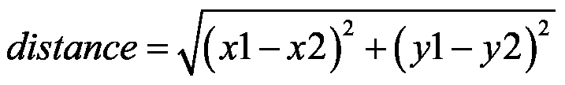
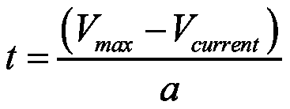
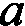

# 三、Python 基础——学习如何用 Python 编码

这一章是为那些很少或没有 Python 编程语言经验的人编写的。如果你已经知道如何在 Python 中使用`for` / `while`循环、方法和类，你可以跳过这一章，以后就不会有任何问题了。

但是，如果您以前没有使用过 Python，或者只是勉强使用过，我强烈建议您遵循这个指南。您将学习如何编写我在上一段中提到的 Python 元素的代码，您将完全理解本书中包含的代码，并且您将能够自己用 Python 编写代码。我还会给你们一些额外的练习，在这一章中称为“家庭作业”，我强烈建议你们做。

开始之前，请打开 Python 编辑器。我推荐使用 Google Colab 笔记本，它是上一章介绍给你的人工智能工具包的一部分。所有的代码，以及家庭作业的解决方案，都在本书的 GitHub 页面上`Chapter 3`的相应章节文件夹中提供。在它们里面，您会发现两个 Python 文件:一个(与本节同名)是本书中使用的代码，而`homework.py`文件是本练习的解决方案。每个作业练习的说明将在每个部分的末尾提供。

在本章中，我们将讨论以下主题:

*   显示文本
*   变量和操作
*   列表和数组
*   `if`陈述和条件
*   `for`和`while`循环
*   功能
*   类别和对象

特别是如果你是从零开始的话，按照这里出现的顺序覆盖每一部分，并且记得试着做作业。我们开始吧！

## 显示文本

我们将从介绍任何编程语言的最流行的方式开始；您将了解如何在 Python 控制台中显示一些文本。控制台是每个 Python 编辑器的一部分，它显示我们想要的信息，或者显示发生的任何错误(希望不要出现任何错误！).

在我们的控制台中显示一些东西的最简单的方法是使用`print()`方法，就像这样:

```
# Displaying text

print('Hello world!') 
```

`print`上面的文字，以`#`开头，称为注释。执行代码时，注释被排除在外，只对您可见。

在 Google Colab 中运行这个短代码后，您会看到这样的显示:

```
Hello world! 
```

总之，只需将您想要显示的内容放入`print`方法的括号中——用引号括起来的文本，如本例所示，或者变量。

如果你对什么是变量感到好奇，那很好——你将在这个练习后了解它们。

### 锻炼身体

仅使用一种`print()`方法，尝试显示两行或更多行。

**提示**:尝试使用`\n`符号。

GitHub 页面的`Chapter 03/Displaying Text/homework.py`文件中提供了解决方案。

## 变量和操作

变量仅仅是分配在我们计算机内存中某处的值。它们类似于数学中的变量。它们可以是任何东西:文本、整数或浮点数(小数点后有精度的数字，如 2.33)。

要创建一个新的变量，您只需编写以下代码:

```
x = 2 
```

在这种情况下，我们命名了一个变量`x`，并将其值设置为`2`。

和数学中一样，你可以对这些变量进行一些运算。最常见的运算是加法、减法、乘法和除法。用 Python 写它们的方法是这样的:

```
x = x + 5   #x += 5

x = x - 3   #x -= 3

x = x * 2.5 #x *= 2.5

x = x / 3   #x /= 3 
```

第一遍看的话，没有太大意义——那怎么写`x = x + 5`？

在 Python 和大多数代码中，“=”符号并不意味着这两个术语相等。这意味着我们将新的`x`值与旧的`x`值相关联，加 5。重要的是要理解这不是一个等式，而是创建一个与前一个变量同名的新变量。

你也可以把这些操作写在右边的注释里。你通常会看到它们是这样写的，因为这样更节省空间。

您也可以对其他变量执行这些操作，例如:

```
y = 3

x += y

print(x) 
```

这里，我们创建了一个新变量`y`，并将其设置为`3`。然后，我们将它添加到我们现有的`x`中。此外，当您运行此代码时，将显示`x`。

那么，在所有这些操作之后，`x`会变成什么样呢？如果你运行代码，你会得到这个:

```
6.333333333333334 
```

如果手工计算这些运算，会发现`x`确实等于 `6.33`。

### 锻炼身体

想办法把一个数提高到另一个数的幂。

**提示**:尝试使用 Python 的`pow()`内置函数。

GitHub 页面上的`Chapter 03/Variables/homework.py`文件中提供了解决方案。

## 列表和数组

列表和数组可以用一个表格来表示。想象一个**一维** ( **1D** )向量或者一个矩阵，你刚刚想象了一个列表/数组。

列表和数组中可以包含数据。数据可以是任何东西——变量、其他列表或数组(这些被称为多维列表/数组)，或者某些类的对象(我们将在后面了解它们)。

例如，这是一个包含整数的 1D 列表/数组:


这是一个**二维** ( **2D** )列表/数组的例子，也包含整数:


为了创建一个 2D 列表，你必须创建一个列表列表。创建列表非常简单，就像这样:

```
L1 = list()

L2 = []

L3 = [3,4,1,6,7,5]

L4 = [[2, 9, -5], [-1, 0, 4], [3, 1, 2]] 
```

这里我们创建四个列表:`L1`、`L2`、`L3`和`L4`。前两个列表是空的，它们没有任何元素。两个后续列表中有一些预定义的值。`L3`是一个一维列表，与第一张图中的列表相同。`L4`是一个二维列表，与第二张图中相同。如您所见，`L4`实际上由三个较小的 1D 列表组成。

每当我提到数组时，我通常指的是“NumPy”数组。NumPy 是一个 Python 库(一个库是一个预编码程序的集合，它允许你执行许多动作而不用从头开始写代码)，广泛用于列表/数组操作。您可以将 NumPy 数组视为一种特殊的列表，具有许多附加功能。

要创建一个 NumPy 数组，你必须指定一个大小并使用一个初始化方法。这里有一个例子:

```
import numpy as np

nparray = np.zeros((5,5)) 
```

在第一行中，我们导入了 NumPy 库(正如您所看到的，要导入一个库，您需要编写`import`),通过使用`as,`，我们给 NumPy 一个缩写`np`，以便于使用。然后，我们创建一个名为`nparray`的新数组，这是一个大小为 5 x 5 的 2D 数组，充满了零。初始化方法是`.`之后的部分；在这种情况下，我们使用函数`zeros`将这个数组初始化为全零。

为了访问列表或数组中的值，你需要给出这个值的索引。例如，如果您想改变`L3`列表中的第一个元素，您必须获取它的索引。在 Python 中，索引从`0`开始，所以您需要编写`L3[0]`。事实上，您可以编写`print(L3[0])`并执行它，您会看到，正如您可能希望的那样，数字`3`会显示出来。

访问多维列表/数组中的单个值需要输入与维度一样多的索引。例如，要从我们的`L4`列表中获取`0`，我们必须编写`L4[1][1]`。`L4[1]`将返回整个第二行，其中是一个列表。

### 锻炼身体

试着找出`L4`列表中所有数字的平均值。有多种解决方案。

提示:最简单的解决方案是利用 NumPy 库。在这里看看它的一些功能:[https://docs.scipy.org/doc/numpy/reference/](https://docs.scipy.org/doc/numpy/reference/)

解决方案在 GitHub 页面的`Chapter 03/Lists and Arrays/homework.py`文件中提供。

## if 语句和条件

现在我要给你介绍一个编程中非常有用的工具——`if`条件！

它们被广泛用于检查一个陈述是否真实。如果给定的陈述是真的，那么我们的代码的一些指令被遵循。

我将用一些简单的代码向你们展示这个主题，这些代码将告诉我们一个数是正数、负数还是等于 0。代码很短，所以我会一次全部展示给你看:

```
a = 5

if a > 0:

    print('a is greater than 0')

elif a == 0:

    print('a is equal to 0')

else:

    print('a is lower than 0') 
```

在第一行中，我们引入了一个名为`a`的新变量，并赋予其值`5`。这是我们要检查其值的变量。

在下一行中，我们检查这个变量是否大于`0`。我们通过使用一个`if`条件来做到这一点。如果`a`大于`0`，那么我们遵循缩进块中写的指令；在这种情况下，它只显示消息`a is greater than 0`。

然后，如果第一个条件不成立，即`a`小于等于`0`，我们就进入下一个条件，用`elif`(简称`else if`)引入。该语句将检查`a`是否等于零。如果是，我们按照缩进的指令，这将显示一条消息显示:`a is equal to 0`。

最终条件通过`else`引入。当所有其他条件失败时，包含在`else`条件中的指令将始终被遵循。在这种情况下，不满足这两个条件意味着`a` < `0`，因此我们将显示`a is lower than 0`。

很容易预测我们的代码将返回什么。这将是第一条指令。事实上，一旦你运行这段代码，你将会得到:

```
a is greater than 0 
```

简而言之，`if`用于引入语句检查和第一个条件，`elif`用于检查尽可能多的进一步条件，当所有其他语句都失败时，`else`为真语句。

同样重要的是要知道一旦一个条件为真，就不会检查其他条件。所以，在这种情况下，一旦我们输入第一个条件，我们看到它是真的，我们不再检查其他语句。如果您想检查其他条件，您需要用新的`if`语句替换`elif`和`else`语句。新的`if`总是检查新的条件；因此，包含在`if` 中的条件总是被检查。

### 锻炼身体

建立一个条件，让检查一个数是否能被 3 整除。

**提示**:你可以使用一个叫做 modulo 的数学表达式，当使用它时，返回两个数相除的余数。在 Python 中，模用`%`来表示。例如:

5 % 3 = 2

71 % 5 = 1

GitHub 页面上的`Chapter 03/If Statements/homework.py` 文件中提供了解决方案。

## for 和 while 循环

你可以把循环想象成不断重复相同的指令，直到满足某个条件中断这个循环。比如前面的代码不是循环；因为它只被执行了一次，所以我们只检查了`a`一次。

Python 中有两种类型的循环:

*   `for`循环
*   `while`回路

`for`循环有特定的迭代次数。你可以把一次迭代看作是包含在`for`循环中的特定指令的一次执行。迭代次数告诉程序循环中的指令应该执行多少次。

那么，如何创建一个 for 循环呢？简单地说，就像这样:

```
for i in range(1, 20):

    print(i) 
```

我们通过编写`for`来指定循环的类型，从而初始化这个循环。然后我们创建一个变量`i,`，它将与来自`range (1,20)`的整数值相关联。这意味着当我们第一次进入这个循环时，`i`将等于`1`，第二次将等于`2`，以此类推，一直到`19`。为什么是`19`？这是因为在 Python 中，上限被排除了，所以在最后一次迭代中`i`将等于`19`。至于我们的指令，在这种情况下，它只是通过使用`print()`方法在我们的控制台中显示当前的`i`。同样重要的是要理解，直到 for 循环结束，主代码才会继续执行。

这是我们执行代码后得到的结果:

```
1

2

3

4

5

6

7

8

9

10

11

12

13

14

15

16

17

18

19 
```

您可以看到我们的代码显示了所有大于 0 小于 20 的整数。

您还可以使用一个`for`循环来遍历列表中的元素，如下所示:

```
L3 = [3,4,1,6,7,5]

for element in L3:

    print(element) 
```

在这里，我们回到我们的`L3` 1D 名单。这段代码遍历`L3`列表中的每个元素，然后显示它。如果你运行它，你会看到这个数组从`3`到`5`的所有元素。

另一方面，循环需要一个条件来停止。只要给定的条件得到满足，他们就会继续下去。以此`while`回路为例:

```
stop = False

i = 0

while stop == False:  # alternatively it can be "while not stop:"

    i += 1

    print(i)

    if i >= 19:

        stop = True 
```

这里，我们创建一个新的变量，名为`stop`。这种类型的变量被称为 bool，因为它只能被赋予两个值——`True`或`False`。然后，我们创建一个名为`i`的变量，我们将使用它来计算我们的`while`循环被执行了多少次。接下来，我们创建一个`while`循环，只要变量`stop`为`False`，这个循环就会继续；只有当`stop`变为`True`时，循环才会停止。

在循环中，我们将`i`加 1，显示它，并检查它是否大于或等于`19`。如果大于等于`19`，我们把`stop`改成`True`；一旦我们把`stop`换成`True`，循环就会中断！

执行此代码后，您将看到与`for`循环示例完全相同的输出，即:

```
1

2

3

4

5

6

7

8

9

10

11

12

13

14

15

16

17

18

19 
```

知道你可以将`for`和`while`循环互相堆叠也是非常重要的。例如，为了一个接一个地显示我们之前创建的 2D 列表`L4`中的所有元素，您将不得不创建一个`for`循环来遍历每一行，然后创建另一个`for`循环(在前一个循环中)来遍历这一行中的每一个值。大概是这样的:

```
L4 = [[2, 9, -5], [-1, 0, 4], [3, 1, 2]]

for row in L4:

    for element in row:

        print(element) 
```

运行它会产生以下输出:

```
2

9

-5

-1

0

4

3

1

2 
```

这与`L4`列表相匹配。

总之，`for`和`while`循环让我们轻松地执行重复的任务。`for`循环总是在预定义的范围内工作；你知道他们什么时候会停下来。`while`循环在未定义的范围内工作；仅仅看他们的`stop`条件，你可能无法判断会发生多少次迭代。`while`只要满足零件的特定条件，循环就会工作。

### 锻炼身体

构建能够让计算正整数变量的阶乘的`for`和`while`循环。

**提示**:阶乘是一个数学函数，返回所有小于或等于该函数自变量的正整数的乘积。这是等式:

*f*(*n*)=*n**(*n*–1)*(*n*–2)*...* 1

其中:

*   *f*(*n*)–阶乘函数
*   *n*–我们正在寻找其阶乘的整数

这个函数在数学上用`!`来表示，例如:

5!= 5 * 4 * 3 * 2 * 1 = 120

4!= 4 * 3 * 2 * 1 = 24

GitHub 页面上的`Chapter 03/For and While Loops/homework.py`文件中提供了解决方案。

## 功能

当你想增加代码可读性时，函数是非常有用的。您可以将它们视为主流代码之外的代码块。函数一旦在主代码中被调用就会被执行。

你写一个这样的函数:

```
def division(a, b):

    result = a / b

    return result

d = division(3, 5)

print(d) 
```

前三行是新创建的名为`division`的函数，后两行是主代码的一部分。

你可以通过写`def`然后写函数名来创建一个函数。在名字后面，你放上括号，并在括号内写上函数的参数；这些是你可以在函数内部使用的变量，是主代码和函数之间连接的一部分。在这种情况下，我们的函数有两个参数:`a`和`b`。

然后，一旦我们进入我们的函数，我们所做的是计算`a`除以`b`，并调用这个除法`result`。然后，在我们函数的最后一行，我们说`return`，这样当我们用代码调用这个函数时，它将返回一个值。在这种情况下，返回值是`result`。

接下来，我们回到主代码，调用我们的函数。我们通过写`division`来完成，然后在括号中输入两个我们想要除的数。记住，`division`函数返回这个除法的一个`result`；因此，我们创建了一个变量`d`，它将保存这个返回值。在最后一行，我们简单地显示`d`来看看这个代码是否真的有效。如果运行它，您将得到以下输出:

```
0.6 
```

你可以用手确认，3 除以 5 确实是 0.6；你也可以在其他数字上测试它。

在真实世界的代码中，函数可以长得多，有时甚至会调用其他函数。你会看到它们被大量使用，甚至在本书的其他章节中。它们还增加了代码的可读性，您将在后面看到；没有函数，我提供的代码是无法理解的。

### 锻炼身体

建立一个函数来计算 *x，y* 平面上两点之间的距离:一个点的坐标为`x1`和`y1`，另一个点的坐标为`x2`和`y2`。

**提示**:您可以使用以下公式:



GitHub 页面上的`Chapter 03/Functions/homework.py`文件中提供了解决方案。

## 类别和对象

像函数一样，类是代码的另一部分，位于主代码之外，只有在主代码流中被调用时才执行。对象是相应类的实例，存在于我们代码的主流程中。为了更好地理解它，可以把一个类想象成某样东西的平面图，例如，一辆汽车的平面图。它包含有关某些组件的外观以及如何相互协作的信息。Python 中的类是某个事物的总体规划。

您可以根据平面图将对象视为现实生活中的建筑。例如，一辆真实的、可以工作的、自动驾驶的汽车将是一个对象的示例。你创建一个汽车的计划(这是一个类)，然后你根据这个计划(这是一个对象)制造一辆汽车。当然，当你有了某样东西的计划，你可以想复制多少就复制多少；比如你可以跑生产线生产汽车。

为了让您更深入地了解类，我们将创建一个简单的机器人。我们从编写一个类开始，就像这样:

```
class Bot():

    def __init__(self, posx, posy):

        self.posx = posx

        self.posy = posy

    def move(self, speedx, speedy):

        self.posx += speedx

        self.posy += speedy 
```

我们编写`class`来指定我们正在创建一个新类，我们将其命名为`Bot`。然后，很重要的一步是写一个`__init__()`方法，这是创建类时的必需品。每当在代码的主流程中创建该类的对象时，都会自动调用该函数。

一个类中的所有函数都需要将`self`作为一个参数。那么，什么是`self`？该参数指定该函数及其名称以`self`开头的变量是该类的一部分。一旦我们有了这个类的对象，我们将能够调用`self`变量。我们的 bot 的`__init__()`方法也是取两个参数，`posx`和`posy`，这将是我们 bot 的初始位置。

我们还创建了一个方法，通过增加或减少它的`posx`和`posy`来移动我们的机器人。方法是隐藏在类中的函数。你可以把它看作是当我们有一个计划时，某件事必须如何运作的指示。例如，回到汽车的例子，一个方法可以定义我们的引擎或变速箱的工作方式。

现在，您可以创建这个类的对象。请记住，这将是一个现实生活中的对象，基于一个计划构建而成(`class`)。以前，该类是预定义的，不能与您的代码一起工作。创建对象后，该类就成为主代码的一个组成部分。我们可以通过以下方式实现这一目标:

```
bot = Bot(3, 4) 
```

这将创建一个类`Bot`的新对象；我们称这个对象为`bot`。我们还需要指定类`Bot`的`__init__()`方法采用的两个参数，即`posx`和`posy`。这不是可选的；当创建一个对象时，你必须指定所有在方法中给定的参数。

现在，在主代码中，您可以移动机器人并显示其新位置，如下所示:

```
bot.move(2, -1)

print(bot.posx, bot.posy) 
```

在第一行中，我们使用了来自我们的`Bot`类的`move`方法。正如你在它的定义中看到的，`move`有两个参数。这两个参数分别指定了我们将增加多少`posx`和`posy`。然后我们只显示新的`posx`和`posy`。这就是`self`发挥作用的地方；如果在我们的`Bot`类中变量`posx`和`posy`前面没有`self`，我们就不能通过方法访问它们。运行这段代码会得到以下结果:

```
5 3 
```

从结果可以看出，我们的机器人在 *x* 轴上向前移动了两个单位，在 *y* 轴上向后移动了一个单位。记住，`posx`最初被设置为`3`，现在已经被`2`使用`Bot`类的`move`方法增加了；`posy`最初被设置为`4`，现在被`1`减少，使用相同的`move`方法。

花时间编写一个`Bot`类的一个很大的好处是，现在我们能够创建尽可能多的机器人，而不用再编写代码。简而言之，对象是一个类的副本，我们可以创建任意多的对象。

总之，你可以把一个类想象成一个预先定义的指令的集合，并且封闭在方法中，你可以把一个对象想象成这个类的一个实例，它可以在我们的代码中访问并且和它一起运行。

### 锻炼身体

你最后的挑战将是建立一个非常简单的汽车类。作为参数，汽车对象应该取汽车可以移动的最大速度(单位为 m/s)，以及汽车加速的加速度(单位为 m/s ² )。我也挑战你建立一个方法，它将计算汽车从当前速度加速到最大速度所需的时间，已知加速度(使用当前速度作为这个方法的自变量)。

**提示**:要计算所需时间，您可以使用以下等式:



其中:

*   –达到最高速度所需的时间
*   –最大速度
*   –当前速度
*   –加速

GitHub 页面上的`Chapter 03/Classes/homework.py`文件中提供了解决方案。

## 总结

在这一章中，我们介绍了 Python 的基础知识，你需要掌握本书中的代码，从发送一个简单的文本显示到控制台，到用 Python 编写你的第一个类。你现在已经获得了继续你的人工智能旅程所需的所有技能；在*第四章*、 *AI 基础技术*中，我们将开始学习 AI 的基础技术。