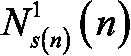

# 五、你的第一个人工智能模型——小心老虎机！

在这一章中，你将得到你的第一个人工智能模型！你要做一个模型来解决众所周知的多臂老虎机问题。这是人工智能中的一个经典问题，也是许多现实世界商业问题中广泛遇到的问题。

## 多臂老虎机问题

想象你在拉斯维加斯，在你最喜欢的赌场。你在一个有五台老虎机的房间里。对他们每个人来说，游戏都是一样的:你赌一定数量的钱，比如 1 美元，你拉手臂，然后机器要么拿走你的钱，要么给你双倍的钱。还记得我们在前一章谈到的奖励吗？假设机器拿了你的钱，你的奖励是-1，如果机器还你两倍的钱，你的奖励是+1。

正如你所看到的，你已经开始定义一个人工智能环境，我要提醒你这是用人工智能解决问题的绝对基础。到目前为止，人工智能还没有出现，但它很快就会出现。你总是从定义环境开始。

你已经定义了奖励；稍后您将定义状态(输入)和动作(输出)。现在，仍然在定义环境的过程中，假设你知道，不知何故，当你拉它的手臂时，这些机器中的一个给你+1 奖励的概率比其他的高。你如何知道这些信息并不重要，但它一定是问题假设的一部分。请放心，这个假设在上面提到的可以应用多臂老虎机问题的现实业务问题中总是自然得到验证。

你的目标，就像在任何人工智能环境中一样，是在你的游戏时间内获得最高的累积奖励。假设您将总共下注 1000 美元，这意味着您将下注 1 美元，1000 次，每次通过拉动这五个老虎机中的任何一个的手臂。问题是:

你的策略应该是什么，这样在玩了 1000 次之后，你就能拿到最多的钱带回家？

你的战略的第一步必须是在最少的游戏次数中，找出这五个老虎机中哪一个最有可能给你 1 英镑的奖励。换句话说，你得迅速找出成功率最高的老虎机。然后，一旦你想通了，你只需要继续玩最成功的吃角子老虎机。

找到最成功的吃角子老虎机并不难；一个简单的策略是在这五台吃角子老虎机上各玩 100 次，最后，看看哪台给你的钱更多。据统计，这给了你一个很好的机会找到最慷慨的老虎机。

所有的挑战都在“快”。最难的部分是在最少的尝试次数中找到最好的老虎机**。这就是你的第一个人工智能模型发挥作用的地方。**

## 汤普森抽样模型

你要马上建造这个模型。现在，您将构建该方法的一个简单实现，稍后将向您展示其背后的理论。让我们开始吧！

正如我们之前所定义的，我们的问题是试图在众多老虎机中找到获胜几率最高的最佳老虎机。一个不太理想的解决方案是在我们的每台吃角子老虎机上玩 100 局，看看哪一局的胜率最高。更好的解决方案是一种叫做汤普森抽样的方法。

背后的理论我就不太深究了；我们稍后会谈到这一点。现在，只要说汤普森抽样使用了一个分布函数(分布将在本章中进一步解释)就足够了，这个函数叫做 Beta，它有两个参数。为简单起见，假设第一个参数越高，我们的老虎机越好，第二个参数越高，我们的老虎机越差。

因此，我们可以将这个函数定义为:


其中:

*   从我们的测试版中随机选择
*   –我们的 Beta 函数
*   *a*–第一个参数
*   *b*–第二个参数

如果你还没有完全理解这个不要担心；你以后会读到关于它的一切。

### 编码模式 l

让我们开始编写我们的解决方案。所有这些代码也可以在本书的 GitHub 页面的`Chapter 05`文件夹中找到。我们开始第一段代码:

```py
# Importing the libraries

import numpy as np 
```

您只需要一个名为 NumPy 的库。这是一个非常有用的库，当我们处理多维数组和列表的时候很有帮助。给它起个缩写`np`，这是行业标准，这样会比较好用。

现在我们必须明白一些非常重要的事情。您正在创建一个模拟，其目的是模拟现实生活中的情况。事实上，每台吃角子老虎机都给了我们一些获胜的机会，有些机器的胜算比其他机器高。所以，在模拟这种环境的时候，你也要做同样的事情。然而，重要的是要记住，我们的 AI 不会知道这些预定义的胜率。它不能只是读取这些数据，然后根据这些数据判断哪台机器是最好的。

对于这个例子，我们称这个中奖机会列表为`conversionRates`。

```py
# Setting conversion rates and the number of samples

conversionRates = [0.15, 0.04, 0.13, 0.11, 0.05]

N = 10000

d = len(conversionRates) 
```

这里，你有五个老虎机。他们有一些获胜机会；例如，1 号吃角子老虎机有 15%的胜算。然后你创建若干样本，`N`。请记住，您正在执行模拟，因此您需要有一个预定义的数据集，它会告诉您在玩游戏时是否赢了。您还引入了一个变量`d`，它是您的转换率列表的长度；也就是老虎机的数量。像这样使用短的变量名是很有用的，因为否则代码会更长，可读性更差。

你知道你下一步该做什么吗？您正在运行模拟，因此您需要为每个样本的每台老虎机预定义一组输赢。我强烈建议你试着自己做这件事。你需要一台电视机来告诉你在某个时间点`i`你是否通过玩某个吃角子老虎机赢了。答案就在下一段代码中。

```py
# Creating the dataset

X = np.zeros((N, d))

for i in range(N):

    for j in range(d):

        if np.random.rand() < conversionRates[j]:

            X[i][j] = 1 
```

在第一行中，您创建了一个充满 0 的 2d 数组，大小为`N * d`。这意味着您已经创建了一个具有`N`(在本例中为`10000`)行和`d`(在本例中为`5`)列的数组。然后，在一个`for`循环中，遍历 2d 数组`X`中的每一行。在嵌套的`for`循环中，遍历该行中的每一列。在上述代码片段的第 5 行，对于每台老虎机(每列)，我们检查范围(0，1)中的随机浮点数是否小于相应老虎机的转换率。

那就跟玩老虎机一样；因为从这个范围中获得任何浮点数的机会是相等的，所以获得小于`x`(其中`x`也在范围(0，1)内)的数的机会等于`x`。例如，对于`d` = 0.15，100 个实例中有 15 个获得小于 0.15 的浮点数，因此有 15%的机会为老虎机 1 返回高奖励。换句话说，如果随机浮动更小，那么这意味着如果你在特定的时间点玩特定的机器，你就赢了。

为了确保您理解，如果您的数据集`X`中的`N`样本之一看起来像这样:`[0, 1, 0, 0, 1]`，您将通过玩 2 号或 5 号吃角子老虎机在该时间点获胜。

接下来，您需要创建两个数组，通过玩每台老虎机来计算您输了多少次和赢了多少次，如下所示:

```py
# Making arrays to count our losses and wins

nPosReward = np.zeros(d)

nNegReward = np.zeros(d) 
```

命名为`nPosReward`(赢的次数)和`nNegReward`(输的次数)。

现在你已经做了一个模拟集和这两个计数器，你可以开始编码一些汤普森采样。请记住，这个理论以及另一个例子将在后面介绍。

接下来，初始化一个`for`循环，该循环将迭代通过我们数据集中的每个样本，并选择最佳的老虎机。最初，仅创建两个变量，一个名为`selected`，它将告诉您选择了哪个老虎机，另一个名为`maxRandom`，您将使用它来获得所有老虎机的最高 Beta 分布猜测:

```py
# Taking our best slot machine through beta distribution and updating its losses and wins

for i in range(N):

    selected = 0

    maxRandom = 0 
```

现在你可以了解汤普森采样的核心了。您将从我们的 Beta 分布中随机猜测，并在所有吃角子老虎机中找到最高值。

您可以使用取自 NumPy 的一个名为`np.random.beta(a,b)`的方法，它返回这个随机的猜测。知道了这些，试着自己去找最高的猜测和最好的机器吧！如果你失败了也没关系——我们还没有谈到这个理论——我会给你一个答案。祝你好运！

我希望你已经试过了。不管它是否对你有用，我的答案是:

```py
 for j in range(d):

        randomBeta = np.random.beta(nPosReward[j] + 1, nNegReward[j] + 1)

        if randomBeta > maxRandom:

            maxRandom = randomBeta

            selected = j 
```

您没有错过任何东西——这是这个任务所需的全部代码。您创建一个`for`循环来遍历每台老虎机并找到最好的一台。对于指数为`j`的每台吃角子老虎机(请记住，您仍然在指数为`i`的更大的`for`循环中)，您从我们的 Beta 分布中随机抽取一个名为`randomBeta`的数字，并检查它是否大于`maxRandom`。

如果是，那么您重新分配`maxRandom`等于`randomBeta`，并设置`selected`等于这个新的最高猜测老虎机`j`的索引。还值得一提的是，在这种情况下，Beta 函数的`a`和`b`参数是什么；它们是我们在特定吃角子老虎机上赢和输的次数。记住，第一个参数越大越好，我们的随机猜测会越高；第二个参数越大，越糟糕，我们的随机猜测就越低。

现在你已经选择了最好的吃角子老虎机，你认为你下一步应该做什么？

你必须更新你的`nPosReward`或`nNegReward`取决于你是否赢了。我们可以用这段代码做到这一点:

```py
 if X[i][selected] == 1:

        nPosReward[selected] += 1

    else:

        nNegReward[selected] += 1 
```

在这里，您可以看到前面创建的`X`数组的用法。您可以通过检查在您的`X`数组中的适当位置是否有一个`1`来检查您是否赢得了这一轮。如果您赢了，您通过添加`1`来更新`nPosReward`中所选机器对应的索引。然而，如果你输了，你可以通过在同一个索引中添加`1`来更新`nNegReward`。你可以清楚地看到，如果你赢了，下一次，你对那台机器的 Beta 分布的随机猜测会更高；而如果输了，会更低。

这段代码已经可以工作了，尽管添加几行代码来显示您的代码认为哪个老虎机最好是值得的:

```py
# Showing which slot machine is considered the best

nSelected = nPosReward + nNegReward 

for i in range(d):

    print('Machine number ' + str(i + 1) + ' was selected ' + str(nSelected[i]) + ' times')

print('Conclusion: Best machine is machine number ' + str(np.argmax(nSelected) + 1)) 
```

这里，您只需显示每台老虎机被您的算法选择的次数。要得到这些数字，你可以将列表`nPosReward`和`nNegReward`相加。在最后一行，你显示哪台机器被选择的次数最多，使它成为被认为是最好的老虎机。

现在，您可以运行代码并查看结果:

```py
Machine number 1 was selected 7927.0 times

Machine number 2 was selected 82.0 times

Machine number 3 was selected 1622.0 times

Machine number 4 was selected 306.0 times

Machine number 5 was selected 63.0 times

Conclusion: Best machine is machine number 1 
```

我们可以看到，你的算法**很快**发现 1 号机是最好的。它在大约 2000 轮中完成(在您的`X` 集合中有 2000 个样本)。

### 了解模型

到目前为止，汤普森抽样是解决这类问题的最佳模型；在本章的最后，你会看到与另一种方法的比较。这就是它的神奇之处。当找到最好的吃角子老虎机时，我们做的第一件事显然是逐一玩五个吃角子老虎机中每一个的手臂。所以我们开始吧:

**第 1 轮**:我们玩 1 号老虎机的手臂。假设我们得到奖励 0。

**第 2 轮**:我们玩 2 号吃角子老虎机的手臂。假设我们得到了回报 1。

**第 3 轮**:我们玩 3 号吃角子老虎机的手臂。假设我们得到奖励 0。

**第 4 轮**:我们玩 4 号吃角子老虎机的手臂。假设我们得到奖励 0。

**第 5 轮**:我们玩 5 号老虎机的手臂。假设我们得到了回报 1。

你认为我们为什么要这么做？我们这样做只是为了从每台老虎机收集一些开始信息。未来几轮将需要这一信息。

现在，事情开始变得有趣了。第六轮我们要做什么？我们要打哪只手臂？

嗯，我们需要回顾一下前五个回合发生了什么。对于每台老虎机，我们引入两个新变量，一个计算老虎机返回 0 奖励的次数，另一个计算老虎机返回 1 奖励的次数。

让我们将这些变量分别表示为和，其中是老虎机号 *i* 返回奖励 0 到回合 *n* 的次数，是老虎机号 *i* 返回奖励 1 到回合 *n* 的次数。在我们的代码中，这两个变量由`nNegReward`和`nPosReward`表示。因此，根据我们目前在第 5 轮中获得的信息，让我们给出这些变量的一些值示例:

表示吃角子老虎机 1 在 1 个回合内返回 1 次损失。

表示吃角子老虎机 1 在 1 轮中返回 0 胜。

表示吃角子老虎机 2 在 1 轮中输了 0 次。

表示吃角子老虎机 2 在 1 轮中赢了 1 次。

表示吃角子老虎机 5 在 4 个回合内返回 0 次失败。

表示吃角子老虎机 5 在 4 轮中已返回 0 胜。

表示吃角子老虎机 5 轮输了 0 次。

表示吃角子老虎机 5 轮已返回 1 胜。

好吧，这是最简单的部分。好消息是我们已经为我们的人工智能创造了所有我们需要的变量。坏消息是现在最难的部分来了，数学。如果你觉得数学是好消息，我喜欢你的精神；但是不喜欢数学也不用担心，我不会让你失望的。

### 什么是分布？

我们人工智能旅程的下一步是引入数学中的分布。对于这个，我用我自己的话给你一个简单的定义，不是你在数学书上找到的很正式的定义。我想确保每个人都明白。它是这样的:变量的分布是一个函数，对于变量可能取值范围内的每一个值，它给出了这个变量等于那个值的概率。

让我们通过一个例子来真正理解它是什么:


图 1:正态分布

在上图中，您可以看到一个分布示例。现在，记得在我给你们的定义中，我提到了两个度量:“变量取值范围”和“这个变量等于那个值的概率”。在任何分布中，在*x*-轴上有变量取值的范围，在 *y* 轴上有变量等于每个值的概率。

如果这还不清楚，不要担心。为了扩展我们的例子，让我们说在前面的图表中，这个变量是人们在特定国家的年薪。

在 *x* 轴上，我们将有从最低工资到最高工资的年薪范围，比方说从 15，000 美元到 150，000 美元。在 y 轴上，我们会得到一个人拿到那份薪水的概率。

现在应该更有道理了。对于低薪人群，曲线较低，这意味着个人收入在 15000 美元左右的概率较低。

然后，直到*x*-轴的中心，标记为，这是工资的平均值，人们工资增加的概率。假设等于 4.5 万美元。我们直观地理解，在一个特定的国家，一个人每年挣 45，000 美元的可能性是最大的，因为大多数人每年挣 45，000 美元左右。这就是为什么图表中的分布在这个工资水平上是最高的。

年薪超过 45，000 美元的人越多，我们会发现挣这种工资的人越少，因此人们挣这种工资的概率会降低，直到我们超过年薪 150，000 美元，在这种情况下很少有人挣那么多，因此导致概率接近于零。

好，这就是直观解释的分布。现在，你必须知道有许多类型的分布:高斯分布(看起来像前面的图)，正态分布(均值为 0，方差为 1 的高斯分布)，贝塔分布，等等。

这是下一步:**贝塔分布**。Beta 发行版是我们为解决老虎机问题而构建的 AI 的核心。下面是测试版的样子:


图 2:三个测试版

让我们做一些练习来确保你理解发行版是如何工作的。想象这三个分布对应三个不同的国家，再一次假设它们是这些国家的工资分布。哪个国家的工资最高？它是紫色的，绿色的，还是黄色的？答案当然是黄色的！正是在这个国家，我们有最高工资的正概率(记住，工资在 *x* 轴上，概率在 *y* 轴上)。

那只是一个快速测试，以确保你和我在一起。现在，你不必记住贝塔分布的精确公式，但你必须知道它有两个参数，以及它们如何影响分布。不要忘记，当我们在实践中解决这个问题时，已经提到了这一点，现在将对其进行更详细的解释。

如果我们再次将这两个参数表示为 *a* 和 *b* ，我们可以用以下公式表示贝塔分布:


你可能会问刚刚发生了什么——为什么会出现？别担心，我们会揭开这一切的神秘面纱。在上面的公式中，是概率，只是的函数，是工资，是任何贝塔分布中存在的两个参数。同样，你不必知道函数的确切定义，只要记住上图中给出的曲线形状即可。

然而，你现在真正需要了解的是两个参数和的作用。以下是你必须知道并在脑海中想象的两点:

1.  给定两个具有相同参数的贝塔分布，具有较大参数的一个将更多地向右移动。
2.  给定两个具有相同参数的 Beta 分布，具有较大参数的一个将更多地向左移动。

就是这样！这足以对我们的 AI 将如何解决老虎机问题有一个直观的了解。换句话说，参数越大，它越会将贝塔分布向右偏移，参数越大，它越会将贝塔分布向左偏移。

我们来练习一下这个！如果我给你以下三个 Beta 分布:

1.  
2.  
3.  

你能告诉我下图中三个 Beta 分布中的哪一个大概是什么样子吗？


图 3:三个测试版

基于以上两种说法，是紫色的，是黄色的，是绿色的。如果你猜对了，恭喜你！

现在你可以解决我们的老虎机问题了。但我先问你一个问题，这个问题可能会让你比这本书更快地理解魔术:

如果，*x*-轴包含赌场中机器的成功率，而不是一个国家的工资，并且如果三个 Beta 分布中的每一个都代表一个特定的吃角子老虎机，你会选择哪一个来赌你的 1000 美元？

你会选择黄色的！

当然啦！该分布对于最高转换率具有正概率，因为它是最向右偏移的一个。

这在本章前面的代码部分已经讨论过了；我在那里跟你说过，第一个参数越高，老虎机越好。事实上，Beta 分布将更向右移动，这意味着这台老虎机有更大的机会让我们赢。此外，第二个参数越高，吃角子老虎机就越差，现在，Beta 分布将向左移动，这意味着这台机器赢的几率更低。

现在是另一个问题，在我们解决我们的老虎机问题之前。记住你有五台吃角子老虎机可以玩，试着回答这个问题:如果五台吃角子老虎机与以下五种测试版的成功率相关联:

、、、、，

你会选哪一个来赌你的 1000 美元？

答案是！

当然，又来了！因为它是具有最大参数和最小参数的一个，因此最向右移动，因此具有最高转换率的正概率。

如果你还和我在一起，你肯定已经准备好理解人工智能的魔力了。如果没有，请再次通读这一部分。在下一节中，我将最终揭示第五轮之后会发生什么。

### 攻克 MABP

从现在起在玩每一轮游戏之前，我们要做的是将每台吃角子老虎机与一个特定的 Beta 分布相关联。在每一轮 *n* 中，老虎机编号 *i* ( *i* =1，2，3，4，5)将与以下 Beta 分布相关联:


在这里，您应该记得以下内容:

*   是吃角子老虎机号码返回 1 奖励到回合的次数。
*   是吃角子老虎机号码返回 0 奖励到第轮的次数。

记住，在 Beta 分布中，参数越高，分布越向右偏移。参数越高，分布越向左偏移。因此，由于在每一轮时，对于每个老虎机，参数是到第轮它返回 1 的次数(加 1)，而参数是到第轮它返回 0 的次数(加 1)，那么这意味着:老虎机返回 1(成功)越多，它的分布将越向右移动；而且老虎机越是返回 0(失败)，它的分布就越会左移。

如果你自己想通了和应该是什么，恭喜你。我们已经在上面的实践教程中使用了它们；我们有两个数组，`nPosReward`和`nNegReward`，分别对应于和。

一旦你明白了这一点，在我给你解决方案之前，试着想出策略。

好的，你将会看到奇迹。我们要做的是，在每轮玩 arm 之前，从对应于五个老虎机的五个分布中随机抽取一个。如果你不清楚那是什么意思，我会解释的。让我再给你们看一下三个贝塔分布的图表:


图 4:三个测试版

我说的随机抽取是什么意思？首先，记住对于我们的老虎机问题，在轴上，我们 T2 的成功率从 0 到 1。例如， *x* = 0.25 意味着机器在 25%的时间里返回 1 奖励(成功)。然后，在 *y* 轴上，我们仍然有这些成功率的概率。

让我们关注一个分布，例如，紫色的。从分布中随机抽取一个意味着什么？这意味着非常简单，我们在分布为正的 *x* 轴上随机选取一个值，这样概率最高的 *x* 值将有最大的机会被选取。例如，假设紫色曲线的顶部对应于 *x* = 0.2 和 *y* = 0.35。

然后，从紫色分布中随机抽取意味着我们将有 35%的机会选择 20%的成功率。概括地说，假设是与紫色分布相关的函数，那么从紫色分布中随机抽取意味着对于在 *x* 轴上的每个成功率 *x* ，我们将有的机会选择 *x* 。这就是“从一个分布中随机抽取”的意思，也叫做“抽样分布”。

既然您已经理解了这一点，让我们看看我们从哪里停止的。我们说过，在每轮玩手臂之前，我们将从对应于五个老虎机的五个分布中随机抽取一个。因此，我们在 *x* 轴上获得五个值，每个值对应于五个老虎机中的每一个。然后，关键的问题来了，这个问题将告诉你是否有正确的战略直觉。

**根据你对这五个数值的观察，你打算玩哪个老虎机？我真的希望你花点时间来回答这个问题，因为现在，我们正处于战略的核心(你也可以看看我们之前写的代码)。答案可以在下一段找到。**

我真的希望你试着自己解决这个问题:你接下来要玩的吃角子老虎机是我们在五次随机抽奖中获得最高分的那台。为什么？因为最高的随机抽取对应于最高的成功率，并且对于该最高的成功率，与被挑选的投币机相关联的贝塔分布在该最高的成功率附近具有正概率。

因为我们想最大化我们玩的机器的成功率(因为我们想赚钱)，我们必须选择 Beta 分布在最高成功率附近具有正概率的吃角子老虎。在下图中，这是黄色的分布。


图 5:三个测试版

现在，我们必须后退一步。当我学习新的技术知识时，我已经经历过很多次你的情况，有时会感到不知所措。在这种情况下，最好的办法是后退一步，这正是我们现在要做的，我们要回顾一下这个策略和它的直觉。

### 汤普森抽样策略的三个步骤

Af 在前五轮我们玩了五个老虎机之后，这里是 AI 在每一轮要做的事情:

1.  For each slot machine *i* (*i*=1,2,3,4,5), we take a random draw  from its Beta distribution:

    

    其中:

    是吃角子老虎机号码返回 1 奖励到回合的次数。

    是吃角子老虎机号码返回 0 奖励到回合的次数。

2.  We pull the arm of the slot machine  that has the highest sampled :

    

3.  We don't forget to update  or :

    如果玩过吃角子老虎机返回 1 奖励:

    

    如果玩过的老虎机返回 0 奖励:

    

然后，我们在每一轮重复这三个步骤，直到我们花完 1000 美元。这种策略被称为汤普森抽样，是人工智能的一个特定分支的基本而强大的模型，称为强化学习。

### 塑造您汤普森取样直觉的最后一笔

你对这个为什么以及如何工作的直觉应该如下(试着把它记在心里或者在图上想象出来):

每台老虎机都有自己的测试版。在这些回合中，具有最高转换率的吃角子老虎机的 Beta 分布将逐渐向右移动，具有较低转换率的策略的 Beta 分布将逐渐向左移动(步骤 1 和 3)。所以因为第二步，转化率最高的老虎机会越来越被选中。

瞧！恭喜——你刚刚了解了一个强大的人工智能模型，这是你旅程中的一大步。为了看到汤普森取样在行动中，并检查它确实工作，我不会强迫你去一个赌场，并尝试它；我们将在*第 6 章*、 *AI 用于销售和广告的另一个现实生活模型——像 AI 街的狼一样销售*。

最后，让我用一个问题来结束这个理论教程。还记得我在书的前面告诉过你，我们今天构建的任何人工智能都将状态作为输入，将播放的动作作为输出返回，并在播放该动作后，获得奖励(积极或消极)。**对于这个特殊的老虎机问题，输入状态是什么，玩的动作是什么，收到的奖励是什么？**在阅读下一段之前，想好这一点。

我们找到了答案:

*   输入状态是我们到达的确切回合，包括两个参数和的信息。
*   输出动作是我们从所选老虎机中拉出的手臂。
*   奖励是 1 或 0，如果吃角子老虎机的回报是我们投资的两倍，奖励是 1，如果我们输了一美元，奖励是 0。

如果你回答正确，恭喜你，恭喜你解决了第一个人工智能模型，汤普森取样。别忘了，在第 6 章的*中，*AI for Sales and Advertising——Sell like the Wolf of AI Street*中，我们将此应用到实践中，以解决一个现实世界的商业问题。*

### 针对标准模型的汤普森采样

当我第一次学习 Thompso n 采样时，我脑子里有一个主要问题:它真的那么好吗？事实上，如果你运行标准模型(我说的“标准模型”是指每台吃角子老虎机都玩一定次数)和 Thompson 分别采样，你可能看不出有什么不同；你可能会得出这样的结论:它们彼此工作得非常好。

为了检验 Thompson 采样是否真的没有更好，我实现了一个代码，在许多不同的场景下测试这两种解决方案。变化包括:样本数量(200 或 1000 或 5000)、老虎机数量(从 3 到 20)和转换率范围(可设定转换率的范围:0-0.1；0-0.3;0-0.5).

每个场景都被测试了 100 次，以计算每个模型的准确性。

结果和使用的代码分别在本书 GitHub 页面的`Chapter 05`中的`resultsModified.xlsx`和`comparison.py`文件中提供。在这里，您可以看到一些取自该 Excel 文件的图表，这些图表显示了两种模型的性能:


图 6:精度与老虎机数量的关系(200 个样本)

*图 6* 中的第一张图显示了两种型号的精确度，取决于老虎机的数量。样本数量设置为 200，转化率范围设置为 0-0.1，这意味着这些速率之间的差异很小。这是这次比较最艰难的设定。总体而言，Thompson 采样的表现优于标准模型(高出 22%)。


图 7:精度与老虎机数量的关系(5000 个样本)

图 7 中的第二张图显示了最简单条件下的性能。样本数量设置为 5，000，转化率范围设置为 0-0.5，这意味着差异清晰可见。Thompson 取样的总体准确度下降小于标准溶液的准确度下降。汤普森采样这次表现明显更好(好了 41%)。

考虑到所有的情况，Thompson 采样达到了 57%的平均准确度，而标准模型达到了 43%的准确度。考虑到测试了非常艰难的场景(例如，只有 200 个样本，范围为 0-0.1，以及 20 台老虎机)，这是一个显著的差异。

## 总结

Thompson 采样是一种强大的采样技术，使您能够快速计算出多个未知转换率中的最高值。它总是在同一个框架中应用，称为多臂老虎机问题，在经典意义上，它由几个老虎机组成，每个老虎机都有不同的正结果转换率。我们初步了解了这个人工智能如何比标准方法更好更快地解决这个问题。

在下一章中，我们将进行一个完整的实践活动，在这个活动中，我们将看到多臂 bandit 框架如何轻松地为一个业务问题(在线广告)建模，以及 Thompson 采样如何带来显著的附加值。