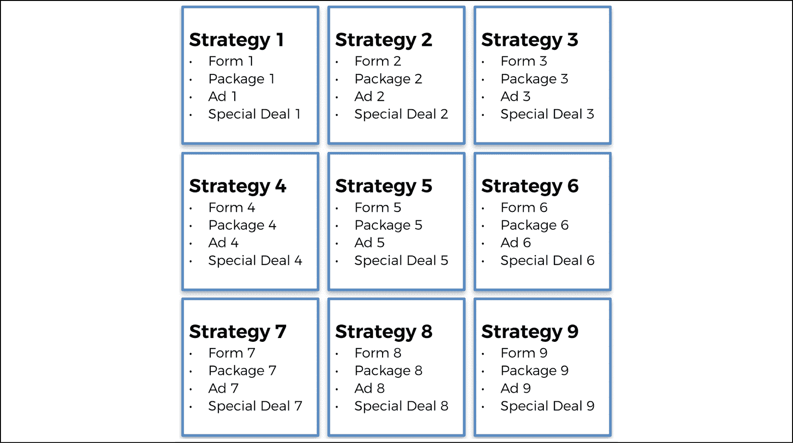
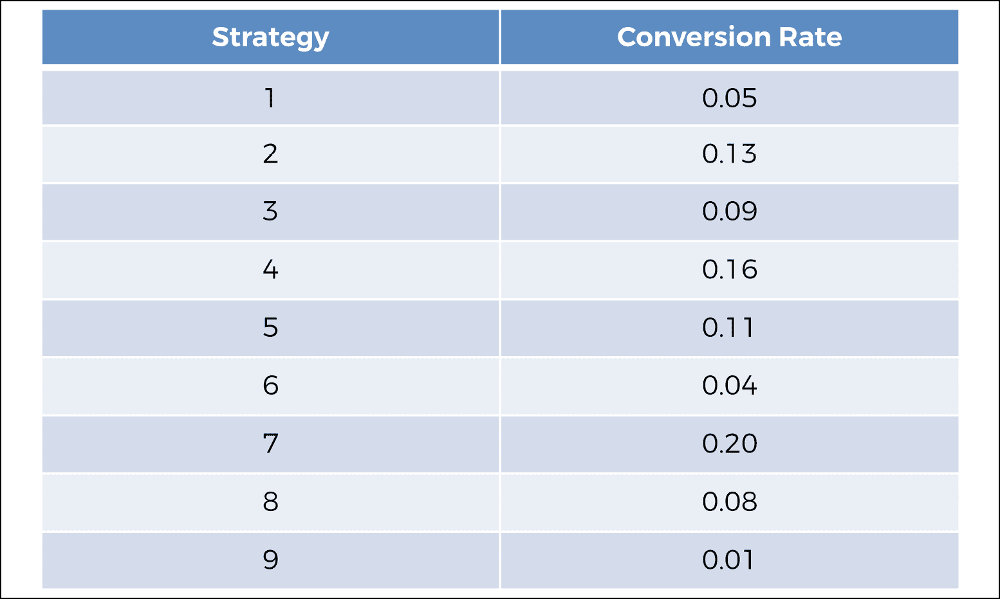
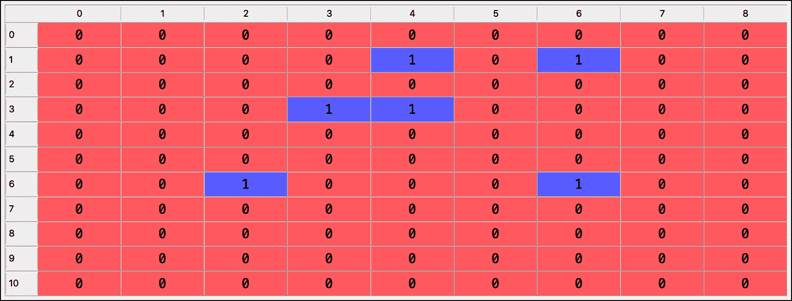

# 六、销售和广告的人工智能——像人工智能街的狼一样销售

现在是时候将你的新技能付诸实践，开始编码，塑造你的 AI 技能了！您已经了解了汤普森抽样的所有内容，现在是时候实施这一人工智能模型来解决一个现实世界的问题，最大限度地提高电子商务业务的销售额。

在这个实践练习中，您将真正采取行动，自己构建 AI 来解决问题。在这一章你保持活跃真的很重要，因为这是你有机会边做边学的地方，这是学东西最有效的方法；熟能生巧。换句话说，我希望你成为这场人工智能冒险的英雄。你，不是我。准备好了吗？

## 要解决的问题

想象一个拥有数百万客户的电子商务企业。这些客户是不时在网站上购买产品的人，他们将这些产品送货上门。生意做得很好，但是董事会已经决定遵循一个行动计划来最大化收益。

该计划包括向客户提供订阅高级计划的选项，这将为他们提供优惠，如降价、特殊交易等。这个额外收费计划以每年 200 美元的价格提供，当然，这个电子商务业务的目标是让尽可能多的客户订阅这个额外收费计划。让我们做一些快速的数学计算，给我们一些动力来建立一个人工智能，以最大化这项业务的收入。

假设这个电子商务企业有 1 亿客户。现在考虑两种将客户转化为高级计划的策略:一种不好的策略，转化率为 1%，一种好的策略，转化率为 11%。如果企业采用不良策略，一年内它将从额外收费计划订阅中获得总计 100，000，000×0.01×200 = 200，000，000 美元的额外收入。

另一方面，如果企业部署了良好的战略，一年内它将从额外收费计划订阅中获得总计 100，000，000×0.11×200 = 2，200，000，000 美元的额外收入。通过找出部署的最佳策略，企业可以额外赚取 20 亿美元，从而实现收入最大化。

在这个乌托邦的例子中，我们只有两种策略，此外，我们知道它们的转化率。在我们的案例研究中，我们将面临九种不同的策略。我们的人工智能不知道哪一个是最好的，也绝对没有任何关于它们转化率的先验信息。

然而，我们将假设这九种策略中的每一种都有一个固定的转换率。这些策略是营销团队精心设计的，每个策略都有相同的目标:将最大数量的客户转化为高级计划。然而，这九种策略都是不同的。他们有不同的形式，不同的包装，不同的广告，和不同的特殊交易来说服和说服客户订阅保费计划。当然，营销团队不知道这九个策略中哪一个会是最好的。让我们总结一下这九种策略的不同之处:



图 1:九种策略——哪种卖得最好？

营销团队希望尽快找出哪种策略的转化率最高，并且花费最少。他们知道找到并部署最佳策略可以显著增加企业的收入。营销专家也选择不直接向他们的 1 亿客户发送电子邮件，因为这将是昂贵的，并且有向太多客户发送垃圾邮件的风险。相反，他们会通过在线学习巧妙地寻找最佳策略。什么是在线学习？它包括每次客户浏览电子商务网站时部署不同的策略。

当客户浏览网站时，他们会突然得到一个弹出广告，建议他们订阅高级计划。对于浏览网站的每个客户，将只显示九种策略中的一种。然后，用户将选择采取行动或不采取行动，并订阅保费计划。如果客户订阅了，这个策略就是成功的；否则就是失败。我们这样做的客户越多，我们收集的反馈就越多，我们就能更好地了解什么是最佳策略。

但是，当然，我们不会手动、视觉或用一些简单的数学来解决这个问题。相反，我们希望实现最智能的算法，在最短的时间内找出最佳策略。这是出于同样的两个原因:首先，因为部署每个策略都有成本(例如，来自弹出广告)；其次，因为公司想用他们的广告惹恼最少的顾客。

## 模拟内部建筑环境

这一部分很特别，因为有些乍一看并不明显的东西需要理解。提出这一警告的原因是我教授这一学科的经验；我的许多学生都不理解为什么我们要在这里做一个模拟，对于整个问题。

我刚开始的时候也是这样！如果你已经明白我们为什么要进行模拟，那太好了——这意味着你已经有了在线学习。如果没有，请跟我到这里，让我仔细解释。

为了理解这一点，让我们从解释现实生活中会发生什么开始:你只需向浏览网站的客户显示九大策略之一的“行动号召”弹出广告，并且一次只对一个客户这样做。你必须一次一个客户地做这件事，一个客户接一个客户地做，因为对于每个客户，你需要收集他们的反应:客户是否订阅了高级计划。如果客户做到了，奖励是 1。如果没有，奖励为 0。它会是这样的:

**第一轮**:我们向一个客户展示*策略 1* 的*广告 1* ，*客户 1* ，我们检查客户是否选择订阅。如果是，我们得到 1 的奖励，如果不是，我们得到 0 的奖励。拿到奖励后，我们继续下一位顾客(下一轮)。

**第 2 轮**:我们向新客户*客户 2* 显示*策略 2* 的*广告 2* ，我们检查客户是否选择订阅。如果是，我们得到 1 的奖励，如果不是，我们得到 0 的奖励。拿到奖励后，我们继续下一位顾客(下一轮)。

…

**第 9 轮**:我们向新客户*客户 9* 展示*策略 9* 的*广告 9* ，我们检查客户是否选择订阅。如果是，我们得到 1 的奖励，如果不是，我们得到 0 的奖励。拿到奖励后，我们继续下一位顾客(下一轮)。

第 10 轮:我们终于开始激活汤普森采样了！我们使用汤普森采样人工智能来告诉我们哪个广告具有最强的魔力来转化最大的客户订阅额外收费计划。我们想要额外的收入！AI(由 Thompson Sampling 提供支持)从 9 个广告中选择一个显示给新客户*客户 10* ，然后检查客户是否选择订阅。如果是，我们得到 1 的奖励，如果不是，我们得到 0 的奖励。拿到奖励后，我们继续下一位顾客(下一轮)。

**第 11 轮**:人工智能(由 Thompson Sampling 提供支持)从 9 个广告中选择一个显示给新客户，比如说*客户 11* ，然后检查客户是否选择订阅。如果是，我们得到 1 的奖励，如果不是，我们得到 0 的奖励。拿到奖励后，我们继续下一位顾客(下一轮)。

好，我就此打住！你明白了。这种情况会持续数百轮，或者至少直到人工智能找到最佳广告——转化率最高的广告。

这是现实生活中会发生的事。每一轮我们都不需要其他东西。如果你看看汤普森抽样算法，在每一轮中，它只需要每个广告在前几轮中获得 1 奖励的次数，以及每个广告在前几轮中获得 0 奖励的次数。总之，这是一个非常重要的结论:汤普森抽样绝对不需要知道广告的转换率来计算出最好的广告。

然而，为了模拟这个应用，我们需要给每个广告分配一个转换率。原因很简单，如果我们不这样做，我们将永远无法验证汤普森取样确实找到了最好的广告。这只是为了检查人工智能的工作！

我们要做的是给九种策略中的每一种赋予不同的转化率。这个模拟的目的仅仅是检查人工智能是否能够捕捉到最好的广告，以及最高的转化率。让我把这一点重新表述为两个要点:

1.  汤普森取样在任何时候都不需要知道转换率，以找出最高的一个。
2.  我们提前知道转换率的唯一原因是因为我们正在做一个模拟，只是为了检查 Thompson Sampling 是否真的能够计算出具有最高转换率的广告。

现在我们已经了解了这一点，让我们最终设置这些转换率。我们将假设九种策略具有以下转换率:



图 2:9 种策略的转化率

现在，我们在幕后提前知道了哪个策略的转化率最高:策略号 **7** 。然而，汤普森取样并不知道这一点。如果你注意的话，你会发现汤普森取样在运行它的算法时，从来没有使用过转换率。它只知道前几轮累积的成功(订阅)和失败(无订阅)的次数。您可以在代码中清楚地看到这一点。

最后，请务必记住，在现实生活中，我们不知道这些转换率可能是多少。我们在这里只是出于模拟的目的才知道它们，这样我们就可以检查我们的 AI 最终是否已经设法找出了最佳策略——在我们的模拟中是*策略 7* 。

下一个问题是:我们到底要如何运行这个模拟？

### 运行模拟

首先，让我们回顾一下环境的不同组成部分(状态、行动和奖励):

1.  状态仅仅是一个特定的客户，我们向其部署一个策略，并向他们展示该策略的广告。
2.  行动是选择部署在客户身上的策略。
3.  如果客户订阅了高级计划，奖励为 1，否则为 0。

然后，假设这家电子商务公司想要在 10，000 名客户身上进行找出最佳策略的实验。为什么选择一万？因为从统计数据来看，这是一个足够大的样本量，足以代表整个客户群。那么，我们如何根据之前建立的广告转化率来模拟 10，000 个客户的反应呢？我们别无选择，只能使用 Excel 或 Google Sheets 这样的电子表格，模拟 10，000 名客户对 9 个广告的反应。我们将这样做:这是一个相当不错的把戏。

我们将创建一个 10，000 行 9 列的矩阵。每行对应一个特定的客户，每列对应一个特定的策略。为了清楚起见，我们假设:

第 1 行对应于*客户 1* 。

第 2 行对应于*客户 2* 。

…

第 10000 行对应于*客户 10000* 。

第 1 列对应于*策略 1* 。

第 2 列对应于*策略 2* 。

…

第 9 列对应于*策略 9* 。

在这个矩阵的单元格中，我们将根据这 10，000 名客户对 9 个策略中的每一个是积极响应(订阅)还是消极响应(不订阅)来给予奖励 1 或 0。这就是“漂亮的把戏”发挥作用的地方。为了模拟这 10，000 名客户对 9 个广告的反应，同时考虑这些广告的转化率，我们做了以下工作:

对于每个客户(行)和每个策略(列)，我们抽取一个介于 0 和 1 之间的随机数。如果这个随机数低于策略的转化率，奖励为 1。如果这个随机数高于策略的转化率，奖励为 0。为什么会这样？因为通过这样做，我们总有百分之 *p* 的机会得到 1，其中 *p* 是部署给该客户的策略的转换率。

比如我们拿*策略* *4* 来说，它的转化率是 0.16。对于每个客户，我们抽取一个介于 0 和 1 之间的随机数。该随机数有 16%的几率介于 0 和 0.16 之间，有(100–16)= 84%的几率介于 0.16 和 1 之间。因此，因为当我们的随机数在 0 和 0.16 之间时，我们得到 1，当我们的随机数在 0.16 和 1 之间时，我们得到 0，那么这意味着我们有 16%的机会得到 1，有 84%的机会得到 0。

这准确地模拟了这样一个事实:当*策略 4* 部署到一个客户身上时，该客户将有 16%的机会订阅高级计划；这正好相当于得到 1 的奖励。

我希望你喜欢这个把戏。挺经典的，但是在 AI 里面用的很频繁；了解这件事对你来说很重要。我们将该技巧应用于 10，000 x 9 对(客户、策略)中的每一对，并得到以下矩阵(此图仅显示前 10 行):



图 3:模拟的奖励矩阵

让我们详细检查前三行:

1.  第一个客户(索引为 **0** 的行)在通过任何策略接触后都不会订阅额外费用计划。
2.  第二个客户(索引 **1** 的行)将在仅通过*策略 5* 或*策略* *7* 接触后订阅额外费用计划。
3.  第三个客户(索引 **2** 的行)在通过任何策略接触后都不会订阅保费计划。

我们已经可以在这个预览中看到我们的小把戏奏效了；转化率最低的广告(策略 1、6 和 9)对 11 个第一顾客只有 0 奖励，而转化率最高的广告(策略 4 和 7)已经有大约 1 奖励。注意，这个 Python 表中的索引从 0 开始；在 Python 中总是这样，不幸的是我们对此无能为力。不过，别担心，你会习惯的！

如果你是一个代码爱好者，生成这个模拟的代码会在本章的后面介绍。

我们的下一步是后退一步，回顾一下。

### 回顾

我们已经准备好模拟 Thompson 抽样对 10，000 名客户的行为，这些客户通过 9 种策略中的一种连续接触，这要感谢前面的矩阵，它将准确模拟客户是否订阅保费计划的决定。

如果对应于特定客户和特定选定策略的单元格的值为 1，则模拟客户向高级计划的转换。如果单元格为 0，则表示拒绝。Thompson Sampling 将一个接一个地收集这些客户是否订阅了保费计划的反馈。然后得益于其强大的算法，它会很快算出转化率最高的策略。

这种策略是部署在数百万客户身上的最佳策略，可以从这种新的收入流中最大化公司的收入。

## 人工智能解决方案和直觉复习器

在你享受看到你的人工智能运行之前，让我们刷新一下记忆，让整个汤普森取样人工智能模型适应这个新问题。

顺便说一句，如果你不喜欢这个电子商务业务应用，请完全自由地想象自己回到赌场，被九个老虎机包围，这些老虎机的转换率与我们的策略相同。这是完全相同的场景。这 9 个策略很可能是 9 个老虎机，以相同的转换率给出 1 奖励(让你赚钱)或 0 奖励(拿走你的钱)。你的目标是尽快找出哪个吃角子老虎机最有可能给你头奖！这取决于你。你可以随意去拉斯维加斯或 AI 街，但就这一章而言，我会坚持我们的电子商务业务。

首先，让我们提醒自己,每次我们向新客户展示广告，都被认为是新一轮广告， *n* ，我们从 9 个策略中选择一个来尝试转化(订阅高级计划)。目标是在最少的回合数中找出最佳策略(与转化率最高的广告相关联)。汤普森采样公司是这样做的:

### 人工智能解决方案

每轮超过 10000 次，重复以下三步:

**步骤 1** :对于每个策略，从以下分布中随机抽取:


其中:

1.  是策略到第轮为止获得 1 奖励的次数。
2.  是策略到第轮为止获得 0 奖励的次数。

**第二步**:选择最高的策略:


**步骤**3:根据以下条件更新和:

1.  如果策略选择了获得了 1 个奖励:
2.  如果策略选中获得了 0 奖励:

现在我们已经看到了数学步骤，让我们提醒自己背后的直觉。

### 直觉

每种策略都有自己的 Beta 分布。在这些回合中，转化率最高的策略的 Beta 分布将逐渐向右移动，转化率较低的策略的 Beta 分布将逐渐向左移动(*步骤 1* 和 *3* )。所以在*第二步*中，转化率最高的策略会越来越多的被选中。下面的图表显示了三种策略的三种 Beta 分布，有助于您对此进行可视化:


图 4:三个测试版

你已经后退了一步，你已经复习了一遍；我认为您已经为实现做好了准备！在下一节中，您将把所有的理论付诸实践——换句话说，就是代码。

## Im 实施

您将在学习本章的过程中开发代码，但是请记住，我已经为这个应用提供了汤普森采样的完整实现；你可以在这本书的 GitHub 页面([https://github.com/PacktPublishing/AI-Crash-Course](https://github.com/PacktPublishing/AI-Crash-Course))找到它。如果您想尝试运行代码，可以在 Colaboratory、Anaconda 中的 Spyder 或您最喜欢的 IDE 上运行。

### 人类抽样与随机选择

在实现 Thompson 采样的同时，您还将实现随机选择算法，该算法将在每一轮中简单地选择一个随机策略。这将是您评估汤普森抽样模型性能的基准。当然，汤普森取样和随机选择算法将在相同的模拟上竞争，即在相同的环境矩阵上竞争。

#### 绩效评估

最后，在整个模拟完成后，您可以通过计算相对收益来评估汤普森采样的性能，相对收益由以下公式定义:


你还将有机会绘制所选广告的直方图，以检查转化率最高的策略(*策略 7* )是被选择最多的策略。

### 我们开始编码吧

首先，导入以下三个必需的库:

1.  `numpy`，您将使用它来构建环境矩阵。
2.  `matplotlib.pyplot`，您将使用它来绘制直方图。
3.  `random`，您将使用它来生成模拟所需的随机数。

以下是从 GitHub 中摘录的代码:

```py
# AI for Sales & Advertizing - Sell like the Wolf of AI Street

# Importing the libraries

import numpy as np

import matplotlib.pyplot as plt

import random 
```

然后为客户数量和策略设置参数:

1.  `N`= 10000 个客户。
2.  `d` = 9 策略。

**代码**:

```py
# Setting the parameters

N = 10000

d = 9 
```

然后，通过构建对应于客户的 10，000 行和对应于策略的 9 列的环境矩阵来创建模拟。在每一轮，对于每一个策略，你抽取一个 0 到 1 之间的随机数。如果这个随机数低于策略的转化率，奖励为 1。否则，将为 0。环境矩阵在代码中被命名为`X`。

**代码**:

```py
# Building the environment inside a simulation

conversion_rates = [0.05,0.13,0.09,0.16,0.11,0.04,0.20,0.08,0.01]

X = np.array(np.zeros([N,d]))

for i in range(N):

    for j in range(d):

        if np.random.rand() <= conversion_rates[j]:

            X[i,j] = 1 
```

现在环境已经准备好了，你可以开始实现 AI 了。为此，第一步是引入并初始化实现所需的变量:

1.  `strategies_selected_rs`:包含通过随机选择算法选择的策略的列表。将其初始化为空列表。
2.  一个包含汤普森取样人工智能模型选择的策略的列表。将其初始化为空列表。
3.  `total_rewards_rs`:通过随机选择算法累计的总奖励。将其初始化为 0。
4.  `total_rewards_ts`:Thompson Sampling AI 模型多轮累计的总奖励。将其初始化为 0。
5.  `number_of_rewards_1`:9 个元素的列表，包含每个策略获得 1 奖励的次数。将其初始化为 9 个零的列表。
6.  `number_of_rewards_0`:9 个元素的列表，包含每个策略获得 0 奖励的次数。将其初始化为 9 个零的列表。

**代码**:

```py
# Implementing Random Selection and Thompson Sampling

strategies_selected_rs = []

strategies_selected_ts = []

total_reward_rs = 0

total_reward_ts = 0

numbers_of_rewards_1 = [0] * d

numbers_of_rewards_0 = [0] * d 
```

然后您需要开始`for`循环，该循环将迭代这个环境矩阵的 10，000 行(即客户)。在每一轮中，你会得到两个不同的部署策略选择；一个来自随机选择算法，一个来自汤普森采样。

先说随机选择算法，简单来说就是每轮选择一个随机策略。

**代码**:

```py
for n in range(0, N):

    # Random Selection

    strategy_rs = random.randrange(d)

    strategies_selected_rs.append(strategy_rs)

    reward_rs = X[n, strategy_rs]

    total_reward_rs = total_reward_rs + reward_rs 
```

接下来，您需要完全按照之前提供的*步骤 1* 、 *2* 和 *3* 来执行汤普森采样。我建议在编写下一部分代码之前，再看看这些步骤，在看到我的解决方案之前，尝试自己编写代码。这是你进步的最好方式；熟能生巧。你已经具备了编码所需的所有元素；你甚至在*第五章*、*你的第一个人工智能模型中也有类似的代码——小心老虎机！*。祝你好运！以下是解决方案。

您应该从第一步开始，逐步实现 Thompson 采样。让我们提醒自己:

**步骤 1** :对于每个策略，从以下分布中随机抽取:


其中:

1.  是策略到第轮为止获得 1 奖励的次数
2.  是策略到第轮为止获得 0 奖励的次数

我们来看看*步骤 1* 是如何实现的。

编写第二个`for`循环来迭代 9 个策略，因为您必须从 9 个策略的 Beta 分布中随机抽取。

从 Beta 发行版中随机抽取的内容是由您在开始时导入的`random`库中的`betavariate()`函数生成的。

**代码**:

```py
 # Thompson Sampling

    strategy_ts = 0

    max_random = 0

    for i in range(0, d):

        random_beta = random.betavariate(numbers_of_rewards_1[i] + 1, numbers_of_rewards_0[i] + 1) 
```

现在执行*步骤 2* ，即:

**第二步**:选择最高的策略:


为了实现*步骤 2* ，您停留在迭代 9 个策略的第二个`for`循环中，并使用一个带有`if`条件的简单技巧来计算最高的。

诀窍如下:当迭代策略时，如果你发现一个随机抽取(`random_beta`)比目前为止获得的随机抽取的最大值(`max_random`)高，那么这个最大值等于那个更高的随机抽取。

**代码**:

```py
 # Thompson Sampling

    strategy_ts = 0

    max_random = 0

    for i in range(0, d):

        random_beta = random.betavariate(numbers_of_rewards_1[i] + 1, numbers_of_rewards_0[i] + 1)

        if random_beta > max_random:

            max_random = random_beta

            strategy_ts = i

    reward_ts = X[n, strategy_ts] 
```

最后，让我们实现*步骤 3* ，最简单的一个:

**第三步**:根据以下条件更新和:

1.  如果选择的策略获得了 1 奖励:
2.  如果选择的策略获得了 0 奖励:

简单地用完全相同的两个`if`条件实现它，翻译成代码。

**代号**:

```py
 # Thompson Sampling

    strategy_ts = 0

    max_random = 0

    for i in range(0, d):

        random_beta = random.betavariate(numbers_of_rewards_1[i] + 1, numbers_of_rewards_0[i] + 1)

        if random_beta > max_random:

            max_random = random_beta

            strategy_ts = i

    reward_ts = X[n, strategy_ts]

    if reward_ts == 1:

        numbers_of_rewards_1[strategy_ts] = numbers_of_rewards_1[strategy_ts] + 1

    else:

        numbers_of_rewards_0[strategy_ts] = numbers_of_rewards_0[strategy_ts] + 1 
```

接下来，不要忘记将在*步骤 2* 中选择的策略添加到我们的策略列表中(`strategies_selected_ts`)，并通过汤普森抽样(`total_reward_ts`)计算各轮累积的总奖励。

**代码**:

```py
 # Thompson Sampling

    strategy_ts = 0

    max_random = 0

    for i in range(0, d):

        random_beta = random.betavariate(numbers_of_rewards_1[i] + 1, numbers_of_rewards_0[i] + 1)

        if random_beta > max_random:

            max_random = random_beta

            strategy_ts = i

    reward_ts = X[n, strategy_ts]

    if reward_ts == 1:

        numbers_of_rewards_1[strategy_ts] = numbers_of_rewards_1[strategy_ts] + 1

    else:

        numbers_of_rewards_0[strategy_ts] = numbers_of_rewards_0[strategy_ts] + 1

    strategies_selected_ts.append(strategy_ts)

    total_reward_ts = total_reward_ts + reward_ts 
```

然后计算最终得分，这是 Thompson 抽样相对于我们的基准的相对回报，我们的基准是随机选择:

**代码**:

```py
# Computing the Relative Return

relative_return = (total_reward_ts - total_reward_rs) / total_reward_rs * 100

print("Relative Return: {:.0f} %".format(relative_return)) 
```

### 最后的 r 结果

通过执行这段代码，我获得了 91%的最终相对回报率。换句话说，Thompson 抽样几乎将我的随机选择基准的性能提高了一倍。不算太差！

最后，绘制所选策略的直方图，以检查*策略 7* (在索引 6 处)是否是被选择最多的策略，因为它是转化率最高的策略。为此，使用`matplotlib`库中的`hist()`函数。

**代码**:

```py
# Plotting the Histogram of Selections

plt.hist(strategies_selected_ts)

plt.title('Histogram of Selections')

plt.xlabel('Strategy')

plt.ylabel('Number of times the strategy was selected')

plt.show() 
```

这是最激动人心的时刻——代码完成了(顺便祝贺一下),您可以享受结果了。拥有最终的相对收益是很好的，但是以一个清晰的可视化图结束会更好。这就是执行最终代码的结果:


图 5:选择的直方图

你可以看到，索引为 **6** 的策略、*策略 7* 是目前为止被选择最多的。汤普森取样公司很快就发现这是最佳策略。事实上，如果你重新运行相同的代码，但只有 1000 名客户，你会发现汤普森抽样仍然能够确定*策略 7* 为最佳策略。

Thompson Sampling 为这项电子商务业务做出了惊人的贡献。它不仅能够在少量回合中确定最佳策略——这意味着更少的客户，从而节省广告和运营成本——而且还能够清楚地找出转化率最高的策略。

例如，如果该电子商务业务有 5000 万客户，并且如果高级计划的价格为每年 200 美元，那么部署转换率为 20 %的最佳策略将导致产生 50，000，000×0.2×200 美元= 20 亿美元的额外收入！

换句话说，Thompson Sampling 清晰而迅速地粉碎了这个电商业务的销售和广告，以至于我们真的可以称之为 AI 街之狼。

现在，休息一下，这是你应得的。振作起来，一旦你充好电，为新的人工智能冒险做好准备，我也会在这里准备好开始下一章。回头见！

## 总结

在第一个实践教程中，您实现了 Thompson 采样来解决应用于广告活动的多臂老虎机问题。汤普森抽样能够迅速找到最佳商业策略，这是随机选择所不能做到的。总的来说，你创造了 91%的相对回报，在做了一些假设后，这将产生额外的 20 亿美元的收入。您只用了不到 60 行代码就在一个文件中做到了这一点。很惊人，对吧？