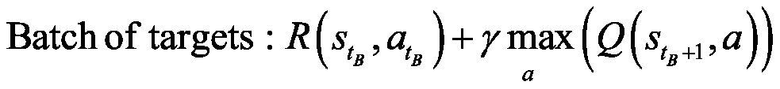
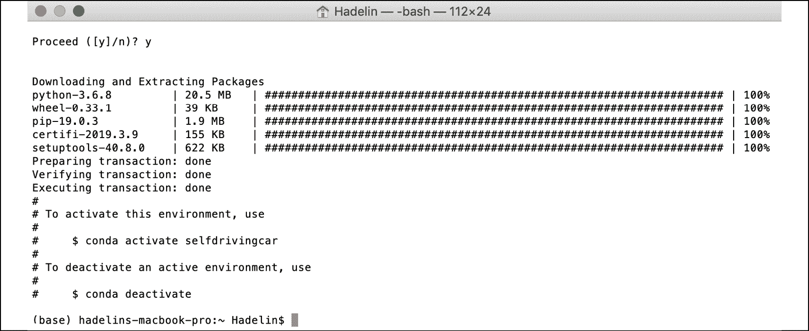
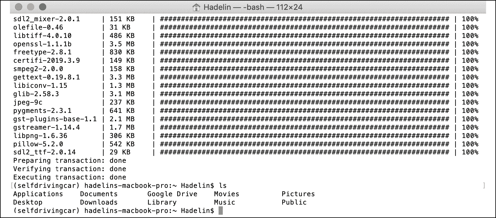

# 十、自动驾驶汽车的人工智能——制造一辆自动驾驶汽车

我真的很期待你开始新的篇章。这可能是本书中最具挑战性，也是最有趣的冒险。你真的要在 2D 地图上，使用强大的深度 Q 学习模型，从零开始建造一辆自动驾驶汽车。我认为这非常令人兴奋！

快速思考；我们的第一步是什么？

如果你的答案是“营造环境”，那你就完全正确。我希望你已经很熟悉这个问题了，以至于我还没问完你就已经回答了。让我们从建立一个环境开始，在这个环境中，汽车可以学习如何自动驾驶。

## 建筑环境

这一次，我们要定义的不仅仅是状态、动作和奖励。制造自动驾驶汽车是一个非常复杂的问题。现在，我不会要求你去你的车库，把自己变成一个混合人工智能机械师；你只需建造一辆在 2D 地图上行驶的虚拟无人驾驶汽车。

您将在 Kivy web 应用中构建此 2D 地图。Kivy 是一个免费的开源 Python 框架，用于开发游戏之类的应用，或者任何类型的移动应用。点击这里查看网站:[https://kivy.org/#home](https://kivy.org/#home)。

这个项目的整个环境从头到尾都是用 Kivy 构建的。地图和虚拟汽车的开发与 AI 无关，所以我们不会一行一行地介绍实现它的代码。

然而，我将描述地图的特征。对于那些想知道地图是如何构建的人来说，我在 GitHub 中提供了一个名为`map_commented.py`的完全注释的 Python 文件，它从头开始构建环境，并提供了完整的解释。

在我们了解的所有功能之前，让我们先来看看这张包含小虚拟汽车的地图:


图 1:地图

你首先会注意到的是一个黑屏，这是 Kivy 用户界面。你可以在这个界面中构建你的游戏或应用。你可能会猜到，它实际上是整个环境的容器。

你可以看到里面有奇怪的东西，一个白色的长方形，前面有三个彩色的点。嗯，就是这辆车！很抱歉我没有成为一个更好的艺术家，但保持简单是很重要的。白色的小矩形是汽车的形状，三个小点是汽车的传感器。为什么我们需要传感器？因为在这张地图上，我们可以选择修建道路，用沙子划界，汽车必须避开这些道路。

要在地图上放一些沙子，只需按住鼠标左键，画出你想要的任何东西。它不一定只是道路；你也可以添加一些障碍。在任何情况下，赛车都必须避免穿过沙地。

如果你记得一切都是从回报开始的，我相信你已经知道如何让它发生；这是通过在自动驾驶汽车驶上沙滩时给它一个不好的奖励来惩罚它。我们以后会处理的。与此同时，让我们来看看我的一幅漂亮的沙画:


图 2:绘制了道路的地图

传感器是用来探测沙子的，所以汽车可以避开它。蓝色传感器覆盖汽车左侧的区域，红色传感器覆盖汽车前部的区域，黄色传感器覆盖汽车右侧的区域。

最后，在屏幕的左下角有三个按钮可以点击，它们是:

**清除**:清除所有绘制在地图上的沙子

**保存**:保存 AI 的权重(参数)

**加载**:加载上次保存的重量

现在我们已经看了一下我们的小地图，让我们继续定义我们的目标。

### 定义目标

我们明白我们的目标是制造一辆自动驾驶汽车。很好。但是，在人工智能和强化学习方面，我们如何正式确定这个目标呢？你的直觉应该有希望让你考虑我们要设置的奖励。我同意——如果我们的汽车能够自动驾驶，我们将给予它高额奖励。但是我们怎么知道它能自动驾驶呢？

我们有很多方法来评估这个。例如，我们可以简单地在地图上画一些障碍物，并训练我们的自动驾驶汽车在地图上移动，而不会撞到障碍物。这是一个简单的挑战，但我们可以尝试一些更有趣的东西。还记得我之前画的路吗？我们训练我们的车从地图的左上角到右下角，穿过我们在这两个点之间建造的任何道路，怎么样？这是一个真正的挑战，这就是我们要做的。我们假设地图是一个城市，左上角是机场，右下角是市区:


图 3:两个目的地——机场和市区

现在我们可以清楚地制定一个目标；来训练自动驾驶汽车在机场和市区之间往返。一旦它到达机场，它将不得不去市区，一旦它到达市区，它将不得不去机场。更重要的是，它应该能够沿着连接这两个位置的任何道路进行这些往返。它还应该能够应付它必须避开的道路上的任何障碍。这是另一条更具挑战性的道路的例子:


图 4:更具挑战性的道路

如果你认为路看起来太容易，这里有一个更具挑战性的例子；这一次不仅道路更加艰难，而且障碍重重:


图 5:更具挑战性的道路

作为最后一个例子，我想分享这最后一张地图，由我的一个学生设计，它可能属于电影 *Inception* :


图 6:有史以来最具挑战性的道路

如果你仔细观察，它仍然是一条从机场到市区的道路，反之亦然，只是更具挑战性。我们创造的人工智能将能够应对这些地图。

我希望你和我一样感到兴奋！保持这种能量水平，因为我们有相当多的工作要做。

### 设置参数

在定义输入状态、输出动作和奖励之前，您必须设置地图和汽车的所有参数，它们将成为您环境的一部分。投入、产出和回报都是这些参数的函数。让我们列出它们，使用与代码中相同的名称，以便您可以容易地理解文件`map.py`:

1.  **角度**:地图的 *x* 轴与汽车轴之间的角度
2.  **旋转**:汽车做的最后一次旋转(我们后面会看到，在玩一个动作的时候，汽车做一次旋转)
3.  **pos = (self.car.x，self.car.y)** :汽车的位置(`self.car.x`是汽车的*x*-坐标，`self.car.y`是汽车的*y*-坐标)
4.  **速度=(速度 x，速度 y)** :汽车的速度矢量
5.  **传感器 1 =(传感器 1_x，传感器 1_y)** :第一个传感器的位置
6.  **传感器 2 =(传感器 2_x，传感器 2_y)** :第二个传感器的位置
7.  **传感器 3 =(传感器 3_x，传感器 3_y)** :第三个传感器的位置
8.  **信号 1** :传感器 1 接收到的信号
9.  **信号 2** :传感器 2 接收到的信号
10.  **信号 3** :传感器 3 接收到的信号

现在让我们慢下来；我们必须定义这些信号是如何计算的。这些信号是对传感器周围沙子密度的测量。你怎么计算密度呢？首先引入一个名为`sand`的新变量，将其初始化为一个数组，数组中的单元格数量与图形界面中的像素数量一样多。简单地说，`sand`数组就是黑色贴图本身，像素就是数组的单元。然后，`sand`数组的每个单元格如果有沙子就会得到 1，如果没有沙子就会得到 0。

例如，这里的`sand`数组的前几行只有 1，其余的都是 0:


图 7:第一行只有沙子的地图

我知道边界有点不稳定——就像我说的，我不是伟大的艺术家——这仅仅意味着`sand`数组的那些行在有沙子的地方会有 1，在没有沙子的地方会有 0。

现在有了这个`sand`阵列，计算每个传感器周围沙子的密度就非常容易了。你用一个 20 乘 20 的正方形包围你的传感器(传感器从`sand`数组中读取)，然后你计算这些单元中 1 的数量，最后你用这个数字除以那个正方形中的单元总数，即 20 x 20 = 400 个单元。

由于`sand`数组只包含 1(有沙子的地方)和 0(没有沙子的地方)，我们可以很容易地通过简单地将这个 20 乘 20 的正方形中的`sand`数组的单元相加来计算 1 的数量。这给了我们每个传感器周围沙子的精确密度，这是在`map.py`文件的第 81、82 和 83 行计算的:

```py
 self.signal1 = int(np.sum(sand[int(self.sensor1_x)-10:int(self.sensor1_x)+10, int(self.sensor1_y)-10:int(self.sensor1_y)+10]))/400\.   #81

        self.signal2 = int(np.sum(sand[int(self.sensor2_x)-10:int(self.sensor2_x)+10, int(self.sensor2_y)-10:int(self.sensor2_y)+10]))/400\.   #82

        self.signal3 = int(np.sum(sand[int(self.sensor3_x)-10:int(self.sensor3_x)+10, int(self.sensor3_y)-10:int(self.sensor3_y)+10]))/400\.   #83 
```

既然我们已经讨论了信号是如何计算的，让我们继续讨论其余的参数。我在下面的列表中突出显示的最后几个参数很重要，因为它们是我们需要揭示最终输入状态向量的最后几个参数。这里他们是:

1.  **goal_x** :目标的*x*-坐标(可以是机场也可以是市区)
2.  **goal_y** :目标的*y*-坐标(可以是机场也可以是市区)
3.  **xx = (goal_x - self.car.x)** :目标与汽车之间的 *x* 坐标差
4.  **yy = (goal_y - self.car.y)** :目标与汽车之间的 *y* 坐标差
5.  **方位**:测量汽车相对于目标的方向的角度

让我们再慢一会儿。我们需要知道方向是如何计算的；它是汽车轴(我们第一个参数列表中的`velocity`向量)和连接目标和汽车中心的轴之间的角度。目标有坐标(`goal_x`、`goal_y`)，车中心有坐标(`self.car.x`、`self.car.y`)。例如，如果汽车正完美地驶向目标，那么 orientation = 0。如果您对我们如何在 Python 中计算两个轴之间的角度感到好奇，下面是获得`orientation`的代码(在`map.py`文件中的第 126、127 和 128 行):

```py
 xx = goal_x - self.car.x   #126

        yy = goal_y - self.car.y   #127

        orientation = Vector(*self.car.velocity).angle((xx,yy))/180\.   #128 
```

好消息—我们终于准备好定义环境的主要支柱了。当然，我说的是输入状态、动作和回报。

在我定义它们之前，试着猜测它们会是什么。再次检查所有前面的参数，并记住目标:在机场和市区两个地点之间往返，同时避开路上的任何障碍。解决方案在下一部分。

### 输入状态

你认为输入状态是什么？你可能会回答“汽车的位置”在这种情况下，输入状态将是两个元素的向量，即汽车的坐标:`self.car.x`和`self.car.y`。

这是一个好的开始。从你在*第 9 章*、*用人工大脑走向专业——深度 Q 学习*中学到的深度 Q 学习的直觉和基础技术，你知道当你在进行深度 Q 学习时，输入状态不一定是 Q 学习中的单个元素。事实上，在深度 Q 学习中，输入状态可以是许多元素的向量，允许您向您的 AI 提供许多信息源，以帮助它预测要采取的智能行动。

输入状态甚至可以比一个简单的向量更大:它可以是一个图像！在这种情况下，AI 模型被称为**深度卷积 Q 学习**。这和深度 Q 学习是一样的，只不过你在神经网络的入口处添加了一个卷积神经网络，让你的 AI(机器)可以可视化图像。我们将在*第 12 章*、*深度卷积 Q 学习*中介绍这种技术。

我们可以做得比仅仅提供汽车位置坐标更好。它们告诉我们自动驾驶汽车位于何处，但还有另一个参数更好、更简单，并且与目标更直接相关。我说的是`orientation`变量。方向是一个单一的输入，它直接告诉我们是否指向正确的方向，朝着目标。如果我们有那个方向，我们根本不需要汽车位置坐标来导航到目标；我们可以改变方向，改变一定的角度，让车朝着目标的方向行驶。人工智能执行的动作将会改变方向。我们将在下一节讨论这些。

我们有了输入状态的第一个元素:方向。

但这还不够。请记住，我们还有另一个目标，或者，我应该说，约束。我们的车需要停在路上，避开路上的任何障碍物。

在输入状态下，我们需要信息来告诉 AI 它是否要离开道路或撞到障碍物。试着自己解决这个问题——我们有办法得到这个信息吗？

解决方案是传感器。记住，我们的汽车有三个传感器给我们信号，告诉我们周围有多少沙子。蓝色传感器告诉我们汽车左侧是否有沙子，红色传感器告诉我们汽车前方是否有沙子，黄色传感器告诉我们汽车右侧是否有沙子。这些传感器的信号已经编码成三个变量:`signal1`、`signal2`和`signal3`。这些信号将告诉人工智能它是否即将撞上某个障碍或即将离开道路，因为道路是由沙子划定的。

这就是输入状态所需的其余信息。有了这四个要素，`signal1`、`signal2`、`signal3`和`orientation`，你就拥有了从一个地方开到另一个地方所需的一切，同时还能保持在路上，不会撞上任何障碍物。

总之，下面是每次的输入状态:

输入状态= ( `orientation`，`signal1`，`signal2`，`signal3`)

这正是`map.py`文件中第 129 行的代码:

```py
 state = [orientation, self.car.signal1, self.car.signal2, self.car.signal3]   #129 
```

`state`是输入状态的变量名。

不要太担心`signal`、`self.signal`和`self.car.signal`之间的代码语法差异；他们都一样。我们使用这些不同变量的原因是因为人工智能是用类编码的(如在**面向对象编程** ( **OOP** ))，这允许我们在同一张地图上创建几辆自动驾驶汽车。

如果你确实想在你的地图上有几辆自动驾驶汽车，例如，如果你想让它们比赛，那么多亏了`self.car.signal`，你可以更好地区分这些汽车。例如，如果你有两辆汽车，你可以将这两个物体命名为`car1`和`car2`，这样你就可以用`self.car1.signal1`和`self.car2.signal1`来区分两辆汽车的第一个传感器信号。在这一章中，我们只有一辆车，所以无论我们使用`signal1`、`car.signal1`还是`self.car.signal1`，我们得到的都是一样的东西。

我们已经讨论了输入状态；现在让我们开始行动吧。

### 输出动作

我已经简要地提到或建议了将要采取的行动。给定我们的输入状态，很容易猜测。自然地，既然你正在建造一辆自动驾驶汽车，你可能会认为这些动作应该是:前进、左转或右转。你完全正确！这正是我们将要采取的行动。

这不仅直观，而且与我们选择的输入状态非常吻合。它们包含了`orientation`变量，告诉我们是否朝着正确的方向朝着目标前进。简单地说，如果`orientation`输入告诉我们我们的车指向正确的方向，我们就执行向前移动的动作。如果`orientation`输入告诉我们目标在我们汽车的右边，我们执行右转的动作。最后，如果`orientation`告诉我们目标在我们车的左边，我们就执行左转的动作。

与此同时，如果任何信号发现汽车周围有沙子，汽车就会向左或向右转向以避开沙子。前进、左转和右转这三个可能的动作对我们的目标、约束和输入状态有逻辑意义，我们可以将它们定义为以下三个旋转:

*旋转* =【转 0(即前进)，向左转 20，向右转 20】

选择 20 是相当随意的。你完全可以选择 10、30 或 40。我会避免超过 40 英里，因为那样的话你的车会有焦躁不安的动作，看起来不像一辆平稳行驶的车。

然而，ANN 输出的动作不会是 0、20 和-20；它们将是 0、1 和 2。

*动作* = [0，1，2]

当你处理人工神经网络的输出时，使用简单的类别总是更好。因为 0，1 和 2 将是人工智能返回的动作，你认为我们如何结束旋转？

您将使用一个简单的映射，在我们的代码中称为`action2rotation`，它将动作 0，1，2 映射到相应的旋转 0，20，-20。这正是`map.py`文件第 34 行和第 131 行的代码:

```py
action2rotation = [0,20,-20]   #34

        rotation = action2rotation[action]   #131 
```

现在，让我们来看看奖励。这将会很有趣，因为这是你决定如何奖励或惩罚你的车的地方。试着先自己弄清楚怎么做，然后看看下一节的解决方案。

### 奖励

为了定义奖励系统，我们必须回答以下问题:

*   在哪些情况下，我们给人工智能一个好的奖励？对每个案例有多好？
*   在哪些情况下，我们给了人工智能一个不好的奖励？每个案例有多糟糕？

要回答这些问题，我们必须简单地记住目标和约束是什么:

*   目标是在机场和市区之间往返。
*   约束条件是保持在道路上，并避免任何障碍。换句话说，约束是远离沙子。

因此，基于这一目标和约束条件，我们前面问题的答案是:

1.  当人工智能更接近目的地时，我们会给它很好的奖励。
2.  当它离目的地越来越远时，我们给它一个不好的奖励。
3.  如果 AI 要开到沙地上，我们会给它一个不好的奖励。

就是这样！这应该行得通，因为这些好的和坏的奖励对目标和约束有直接的影响。

为了回答每个问题的第二部分，每个案例的奖励应该是多好和多坏，我们将打出强硬的牌；往往更有效。这张强硬的牌包括当汽车犯错时惩罚它比当它表现好时奖励它更多。换句话说，坏的奖励会比好的奖励更强。

这在强化学习中很有效，但这并不意味着你应该对你的狗或孩子做同样的事情。当你在处理一个生物系统时，反过来(高的好的奖励和小的坏的奖励)是一种更有效的训练或教育方式。只是精神食粮。

关于这一点，以下是我们在每种情况下给予的奖励:

1.  如果 AI 开到沙地上，它会得到-1 的坏奖励。恶心！
2.  如果 AI 离开目的地，它会得到-0.2 的坏奖励。
3.  如果人工智能更接近目的地，它将获得 0.1 的奖励。

我们将最差回报(-1)归因于汽车行驶到沙地上的原因是有道理的。我们绝对不想在沙滩上开车。地图上的沙子代表现实生活中的障碍物；在现实生活中，你会训练你的自动驾驶汽车不要撞到任何障碍物，以避免任何事故。为了做到这一点，当 AI 在训练中遇到障碍时，我们会用非常糟糕的奖励来惩罚它。

那怎么翻译成代码呢？那很容易；你只需要用你的`sand`数组检查汽车是否已经移动到一个包含 1 的单元格中。如果是的话，这意味着汽车已经移动到一些沙子上，因此必须得到一个不好的奖励-1。这正是`map.py`文件的第 138、139 和 140 行中的代码(包括汽车速度向量的更新，它不仅通过将汽车减速到 1 来更新速度，还通过某个角度来更新汽车的方向，`self.car.angle`):

```py
 if sand[int(self.car.x),int(self.car.y)] > 0:   #138

            self.car.velocity = Vector(1, 0).rotate(self.car.angle)   #139

            reward = -1   #140 
```

然后对于其他的奖励属性，你只需要完成前面的`if`条件和一个`else`，它会告诉你在汽车没有驶上沙地的情况下会发生什么。

在这种情况下，你开始一个新的`if`和`else`条件，说如果汽车已经远离目的地，你给它一个`-0.2`的坏奖励，如果汽车已经靠近目的地，你给它一个`0.1`的好奖励。您测量汽车是否远离或接近目标的方法是通过比较放入两个独立变量的两个距离:`last_distance`，这是汽车在时间 *t* -1 时与目的地之间的先前距离，以及`distance`，这是汽车在时间 *t* 时与目的地之间的当前距离。如果将所有这些放在一起，就会得到下面的代码，它完成了前面的代码行:

```py
 if sand[int(self.car.x),int(self.car.y)] > 0:   #138

            self.car.velocity = Vector(1, 0).rotate(self.car.angle)   #139

            reward = -1   #140

        else:   #141

            self.car.velocity = Vector(6, 0).rotate(self.car.angle)   #142

            reward = -0.2   #143

            if distance < last_distance:   #144

                reward = 0.1   #145 
```

为了防止汽车试图偏离地图，`map.py`文件的第 147 至 158 行惩罚 AI，如果自动驾驶汽车进入地图的 4 个边界中的任何一个边界的`10`像素内，则给予不良奖励`-1`。最后，`map.py`文件的第 160 到 162 行更新目标，每当汽车到达当前目标的 100 个像素以内时，就将目标从机场切换到市区，反之亦然。

## 艾解复修

让我们通过提醒自己深度 Q 学习过程的步骤来刷新我们的记忆，同时使它们适应我们的自动驾驶汽车应用。

初始化:

1.  体验回放的内存初始化为一个空列表，代码中称为**内存**。
2.  设置内存的最大容量，在代码中称为**容量**。

在每次 *t* 时，AI 重复以下过程，直到该时期结束:

1.  AI 预测当前状态*S[t]的 Q 值。因此，由于可以玩三个动作(0 个< - > 0，1 个< - > 20，或者 2 个< - > -20)，它得到三个预测的 Q 值。*
2.  人工智能执行由 Softmax 方法选择的动作(见*第 5 章*，*你的第一个人工智能模型——小心老虎机！* ):
3.  AI 获得奖励，奖励为-1、-0.2 或+0.1 中的一个。
4.  AI 到达下一个状态，它由来自三个传感器的下三个信号加上汽车的方向组成。
5.  人工智能将过渡添加到内存中。
6.  人工智能随机选择一批过渡。对于随机批次的所有过渡:
    *   人工智能得到预测:
    *   人工智能得到目标:
    *   AI 计算整批:的预测和目标之间的损失
    *   最后， AI 将这个损失误差反向传播到神经网络中，并通过随机梯度下降根据它们对损失误差的贡献大小来更新权重。

## 实现

现在是实施的时候了！你首先需要的是一个专业的工具包，因为你不会用简单的 Python 库来构建一个人工大脑。你需要的是一个先进的框架，允许快速计算训练神经网络。

如今，构建和训练人工智能的最佳框架是 **TensorFlow** (谷歌)和 **PyTorch** (脸书)。两者之间你该如何选择？他们都很好共事，而且同样强大。它们都有动态图形，允许在使用小批量梯度下降的反向传播过程中快速计算训练模型所需的复杂函数的梯度。真的，你选择哪个框架并不重要；这两者对于我们的自动驾驶汽车来说都非常有效。就我而言，我使用 PyTorch 的经验稍微多一点，所以我将选择 PyTorch，这就是本章中的例子将如何继续发挥作用。

退一步说，我们的自动驾驶汽车实现由三个 Python 文件组成:

1.  `car.kv`，其中包含了 Kivy 对象(矩形形状的汽车和三个传感器)
2.  `map.py`，构建环境(地图、汽车、输入状态、输出动作、奖励)
3.  `deep_q_learning.py`，它通过深度 Q 学习来构建和训练人工智能

我们已经讨论了`map.py`的主要元素，现在我们即将处理`deep_q_learning.py`，在这里你不仅要建立一个人工神经网络，还要实现深度 Q 学习训练过程。我们开始吧！

### 步骤 1–导入库

像往常一样，你从导入构建你的人工智能所需的库和模块开始。其中包括:

1.  `os`:操作系统库，用于加载保存的 AI 模型。
2.  `random`:用于从内存中随机抽取一些过渡进行体验回放。
3.  【PyTorch 的主库，它将用于构建我们的张量神经网络，而不是像`numpy`数组这样的简单矩阵。矩阵是一个二维数组，而张量可以是一个 n 维数组，其单元中不仅仅只有一个数字。这里有一个图表，这样你可以清楚地理解矩阵和张量的区别:
4.  `torch.nn`:torch 库中的`nn`模块，用于构建我们 AI 的人工神经网络中的全连接层。
5.  `torch.nn.functional`:来自`nn`模块的`functional`子模块，用于调用激活函数(整流器和 Softmax)，以及用于反向传播的损耗函数。
6.  `torch.optim`:torch 库中的`optim`模块，用于调用 Adam 优化器，该优化器计算损失相对于权重的梯度，并在减少损失的方向上更新这些权重。
7.  `torch.autograd`:torch 库中的`autograd`模块，用于调用`Variable`类，该类将每个张量及其梯度关联到同一个变量中。

这构成了您的第一个代码部分:

```py
# AI for Autonomous Vehicles - Build a Self-Driving Car   #1

#2

# Importing the libraries   #3

#4

import os   #5

import random   #6

import torch   #7

import torch.nn as nn   #8

import torch.nn.functional as F   #9

import torch.optim as optim   #10

from torch.autograd import Variable   #11 
```

### 步骤 2–创建神经网络的架构

这段代码是你真正成为你的人工智能大脑的建筑师。您将构建输入层、完全连接的层和输出层，同时选择一些激活功能，将信号在大脑中向前传播。

首先，你在一个类中构建这个大脑，我们称之为`Network`。

什么是课？在解释你为什么要用它之前，让我们先解释一下。类是 Python 中的一种高级结构，它包含我们想要构建的对象的指令。以你的神经网络(对象)为例，这些指令包括你想要多少层，你想要每层里面有多少神经元，你选择哪个激活函数，等等。这些参数定义了你的人工大脑，并且都聚集在我们称之为`__init__()`的方法中，这是我们在构建一个类时总是要开始的。但这还不是全部——一个类还可以包含称为方法的工具，这些方法是执行某些操作或返回某些内容的函数。您的`Network`类将包含一个方法，该方法在神经网络内部前向传播信号并返回预测的 Q 值。把这种方法叫做`forward`。

现在，为什么要使用类呢？这是因为构建一个类允许你创建尽可能多的对象(也称为实例),并且通过改变类的参数就可以轻松地从一个对象切换到另一个对象。例如，您的`Network`类包含两个参数:`input_size`(输入的数量)和`nb_actions`(动作的数量)。如果你想构建一个有更多输入(除了信号和方向)或更多输出(你可以添加一个刹车动作)的 AI，由于这个类的高级结构，你可以在一瞬间完成。它非常实用，如果你还不熟悉这些课程，你必须熟悉它们。几乎所有的人工智能实现都是用类来完成的。

这只是一个简短的技术问题，以确保我不会在途中失去任何人。现在让我们构建这个类。由于代码中有许多重要的元素需要解释，而且您可能不熟悉 PyTorch，我将首先向您展示代码，然后从`deep_q_learning.py`文件中逐行解释:

```py
# Creating the architecture of the Neural Network   #13

#14

class Network(nn.Module):   #15

    #16

    def __init__(self, input_size, nb_action):   #17

        super(Network, self).__init__()   #18

        self.input_size = input_size   #19

        self.nb_action = nb_action   #20

        self.fc1 = nn.Linear(input_size, 30)   #21

        self.fc2 = nn.Linear(30, nb_action)   #22

    #23

    def forward(self, state):   #24

        x = F.relu(self.fc1(state))   #25

        q_values = self.fc2(x)   #26

        return q_values   #27 
```

**第 15 行**:你介绍一下`Network`类。在这个类的括号里，可以看到`nn.Module`。这意味着您正在调用`Module`类，它是从`nn`模块中提取的现有类，以便获得`Module`类的所有属性和工具，并在`Network`类中使用它们。这种在新类中调用另一个现有类的技巧被称为**继承**。

**第 17 行**:您从`__init__()`方法开始，它定义了您的人工神经网络的所有参数(输入数、输出数等等)。可以看到三个参数:`self`、`input_size`、`nb_action.self`指的是对象，也就是指类完成后将要创建的类的未来实例。任何时候你在一个变量前看到`self`，并且被一个点分开(像`self.variable`)，这意味着这个变量属于这个对象。这应该可以解开关于`self`的任何谜团！

然后，`input_size`是你的输入状态向量中的个输入(因此为 4)，`nb_action`是输出动作的数量(因此为 3)。重要的是要明白，`__init__()`方法的自变量(除了自我)是你在创建未来对象时要输入的，未来对象是你 AI 的未来人工大脑。

**第 18 行**:在`__init__()`方法中，使用`super()`函数激活继承(在第 15 行解释)。

**第 19 行**:这里引入第一个对象变量`self.input_size`，设置为等于参数`input_size`(稍后将输入为`4`，因为输入状态有 4 个元素)。

**第 20 行**:引入第二个对象变量`self.nb_action`，设置为等于参数`nb_action`(稍后将输入为`3`，因为有三个动作可以执行)。

**第 21 行**:你引入第三个对象变量`self.fc1`，它是输入层(由输入状态组成)和隐藏层之间的第一个全连接。第一个完全连接是作为`nn.Linear`类的对象创建的，它有两个参数:第一个参数是左边层(输入层)中元素的数量，因此`input_size`是要使用的正确参数，第二个参数是右边层(隐藏层)中隐藏神经元的数量。这里，您选择有 30 个神经元，因此第二个参数是`30`。选择 30 是完全随意的，自动驾驶汽车可以使用任何其他数字。

**第 22 行**:你引入第四个对象变量`self.fc2`，它是隐藏层(由 30 个隐藏神经元组成)与输出层的第二个全连接。它可能是一个新的隐藏层的完整连接，但你的问题没有复杂到需要一个以上的隐藏层，所以你的人工大脑中只有一个隐藏层。就像前面一样，第二个完全连接是作为`nn.Linear`类的对象创建的，它有两个参数:第一个参数是左侧层(隐藏层)中元素的数量，即`30`，第二个参数是右侧层(输出层)中隐藏神经元的数量，即`3`。

**第 24 行**:你开始构建这个类的第一个也是唯一的方法`forward`方法，它将把信号从输入层传播到输出层，之后它将返回预测的 Q 值。这个`forward`方法有两个参数:`self`，因为您将在`forward`方法中使用对象变量，还有`state`，由四个元素(方向加上三个信号)组成的输入状态向量。

**第 25 行**:在用整流器激活功能激活信号的同时，将信号从输入层正向传播到隐藏层，也称为 **ReLU** ( **整流线性单元**)。你分两步做这件事。首先，通过调用第一个全连接`self.fc1`，以输入状态向量`state`作为输入:`self.fc1(state)`，完成从输入层到隐藏层的正向传播。

返回隐藏的层。然后，我们调用带有该隐藏层的`relu`函数作为输入，以如下方式打破信号的线性度:


图 8:整流器激活功能

ReLU 层的目的是通过沿着完全连接的层创建非线性操作来打破线性。你会想拥有它，因为你正试图解决一个非线性问题。最后，`F.relu(self.fc1(state))`返回带有非线性信号的隐藏层`x`。

**第 26 行**:你将信号从隐藏层向前传播到包含 Q 值的输出层。与前一行一样，这是通过调用第二个全连接`self.fc2`来完成的，将隐藏层`x`作为输入:`self.fc2(x)`。这将返回 Q 值，您将其命名为`q_values`。这里不需要激活函数，因为稍后在另一个类中，您将选择与 Softmax 一起玩的动作。

**第 27 行**:最后，这里的`forward`方法返回 Q 值。

让我们看看你刚刚创造了什么！


图 9:我们人工智能的神经网络(大脑)

`self.fc1`是**输入层**和**隐藏层**之间的所有蓝色连接线。

`self.fc2`是**隐藏层**和**输出层**之间的所有蓝色连接线。

这将有助于你更好地理解所有的联系。干得好！

### 步骤 3–实施体验回放

下一步的时间到了！你现在将构建另一个类，该类构建用于体验重放的内存对象(参见*第 5 章*，*你的第一个人工智能模型——小心老虎机！*)。称这个阶层为`ReplayMemory`。让我们先看看代码，然后我会从`deep_q_learning.py`文件中一行一行地解释一切。

```py
# Implementing Experience Replay   #29

#30

class ReplayMemory(object):   #31

    #32

    def __init__(self, capacity):   #33

        self.capacity = capacity   #34

        self.memory = []   #35

    #36

    def push(self, event):   #37

        self.memory.append(event)   #38

        if len(self.memory) > self.capacity:   #39

            del self.memory[0]   #40

    #41

    def sample(self, batch_size):   #42

        samples = zip(*random.sample(self.memory, batch_size))   #43

        return map(lambda x: Variable(torch.cat(x, 0)), samples)   #44 
```

第 31 行:你介绍一下`ReplayMemory`类。这次不需要从其他任何类继承，只需要在类的括号里输入`object`即可。

**第 33 行**:和往常一样，你从`__init__()`方法开始，它只接受两个参数:`self`，对象，和`capacity`，内存的最大大小。

**第 34 行**:您引入了第一个对象变量`self.capacity`，设置为等于参数`capacity`，它将在稍后创建类的对象时输入。

**第 35 行**:引入第二个对象变量`self.memory`，初始化为一个空列表。

**第 37 行**:你开始构建这个类的第一个工具`push`方法，它将一个转换作为输入，并将其添加到内存中。但是，如果添加的过渡超过了存储器的容量，`push`方法也会删除存储器的第一个元素。您可以看到的`event`参数是要添加的过渡。

**第 38 行**:使用`append`功能，将过渡添加到内存中。

**第 39 行**:你启动一个`if`条件，检查存储器的长度(意味着它的转换次数)是否大于容量。

如果事实确实如此，你删除内存的第一个元素。

**第 42 行**:你开始构建这个类的第二个工具，即`sample`方法，它从经验回放记忆中抽取一些随机转换。它将`batch_size`作为输入，这是你用来训练你的神经网络的转换批次的大小。

请记住它是如何工作的:不是将单个输入状态前向传播到神经网络中，并在输入状态产生的每个转换后更新权重，而是前向传播小批量的输入状态，并在用小批量梯度下降反向传播相同的整批转换后更新权重。这不同于*第 9 章*、*使用人工大脑进行专业训练-深度 Q 学习*中解释的随机梯度下降(每一次输入更新权重)和批量梯度下降(每一批输入更新权重):


图 10:批量梯度下降与随机梯度下降

**第 43 行**:你从内存中随机抽取一些过渡，放入一个大小为`batch_size`的批次中。例如，如果`batch_size = 100`，你从内存中随机抽取 100 个样本。抽样是用随机库中的`sample()`函数完成的。然后，`zip(*list)`用于将状态、动作和奖励重新分组到相同大小的单独批次中(`batch_size`，以便将采样的转换放入 PyTorch 期望的格式中(`Variable`格式，接下来是第 44 行)。

这可能是一个后退一步的好时机。让我们看看第 43 行给你什么:


图 11:上一个状态、动作、奖励和下一个状态的批次

**第 44 行**:使用`map()`函数，将每个样本包装成一个`torch Variable`对象(因为`Variable()`实际上是一个类)，这样样本内部的每个张量都关联到一个梯度。简单地说，你可以把一个`torch Variable`看作一个包含张量和梯度的高级结构。

这就是 PyTorch 的美。这些`torch Variables`都在一个动态图形中，允许快速计算复杂函数的梯度。这些快速计算是在利用小批量梯度下降的反向传播期间发生的权重更新所需要的。在`Variable`类中，我们看到了`torch.cat(x,0)`。这只是一个连接技巧，沿着纵轴，将样本放入`Variable`类期望的格式中。

要记住的最重要的事情是:当用 PyTorch 训练神经网络时，我们总是与`torch Variables`一起工作，而不仅仅是张量。您可以在 PyTorch 文档中找到更多的细节。

### 步骤 4–实施深度 Q 学习

你成功了！你终于要开始编码整个深度 Q 学习过程了。同样，您将把所有这些都包装到一个类中，这次称为`Dqn`，就像在 deep Q-network 中一样。这是你在终点线前的最后一次跑步。让我们打碎它。

这一次，这个类相当长，所以我将从`deep_q_learning.py`文件中一个方法一个方法地展示和解释代码行。这里是第一个，即`__init__()`方法:

```py
# Implementing Deep Q 学习#46

#47

class Dqn(object):   #48

    #49

    def __init__(self, input_size, nb_action, gamma):   #50

        self.gamma = gamma   #51

        self.model = Network(input_size, nb_action)   #52

        self.memory = ReplayMemory(capacity = 100000)   #53

        self.optimizer = optim.Adam(params = self.model.parameters())   #54

        self.last_state = torch.Tensor(input_size).unsqueeze(0)   #55

        self.last_action = 0   #56

        self.last_reward = 0   #57 
```

**第 48 行**:你介绍一下`Dqn`类。您不需要从任何其他类继承，所以只需在类的括号中输入`object`。

**第 50 行**:和往常一样，您从`__init__()`方法开始，这次它有四个参数:

1.  `self`:对象
2.  `input_size`:输入状态向量中的输入数(即 4)
3.  `nb_action`:动作次数(即 3 次)
4.  `gamma`:时差公式中的折扣系数

**第 51 行**:你引入第一个对象变量`self.gamma`，设置为等于参数`gamma`(稍后当你创建一个`Dqn`类的对象时会进入)。

**第 52 行**:你引入第二个对象变量`self.model`，一个你之前构建的`Network`类的对象。这个物体就是你的神经网络；换句话说，我们人工智能的大脑。创建这个对象时，在`Network`类中输入`__init__()`方法的两个参数，分别是`input_size`和`nb_action`。稍后，当创建一个`Dqn`类的对象时，您将输入它们的真实值(分别是`4`和`3`)。

**第 53 行**:你引入第三个对象变量`self.memory`，作为你之前构建的`ReplayMemory`类的对象。这个物体就是经验回放记忆。因为`ReplayMemory`类的`__init__`方法只需要一个参数，即`capacity`，这就是你在这里输入的`100,000`。换句话说，你正在创建一个大小为 100，000 的记忆，这意味着 AI 将记住最后 100，000 次转变，而不是只记住最后一次转变。

**第 54 行**:你引入了第四个对象变量`self.optimizer`，作为`Adam`类的一个对象，这是一个在`torch.optim`模块中已经存在的类。这个对象是优化器，它在反向传播过程中通过小批量梯度下降来更新权重。在参数中，保留大部分缺省参数值(您可以在 PyTorch 文档中查看它们),并且只输入模型参数(`params`参数),您可以通过`self.model.parameters`来访问这些参数，这是`nn.Module`类的属性之一，而`Network`类继承自`nn.Module`类。

**第 55 行**:你引入第五个对象变量`self.last_state`，它将是每个(上一个状态、动作、奖励、下一个状态)转换中的最后一个状态。这最后一个状态被初始化为 torch 库中`Tensor`类的一个对象，您只需向其中输入`input_size`参数。然后使用`.unsqueeze(0)`在索引 0 处创建一个额外的维度，这将对应于批处理。这使我们可以这样做，将每个最后的状态匹配到适当的批次:


图 12:为批处理添加一个维度

**第 56 行**:你引入第六个对象变量`self.last_action`，初始化为`0`，这是每次迭代的最后一个动作。

**第 57 行**:我们引入最后一个对象变量`self.last_reward`，初始化为`0`，它是在最后一个状态`self.last_state`下，玩完最后一个动作`self.last_action`后收到的最后一个奖励。

现在，你们都对`__init__`方法很在行。让我们用下一个方法继续下一个代码部分:`select_action`方法，它使用 Softmax 选择每次迭代要播放的动作。

```py
 def select_action(self, state):   #59

        probs = F.softmax(self.model(Variable(state))*100)   #60

        action = probs.multinomial(len(probs))   #61

        return action.data[0,0]   #62 
```

**第 59 行**:你开始定义`select_action`方法，该方法将一个输入状态向量(方向，信号 1，信号 2，信号 3)作为输入，并将选择的动作作为输出返回给玩家。

**第 60 行**:由于使用了`torch.nn.functional`模块中的 Softmax 函数，你得到了三个动作的概率。这个 Softmax 函数将 Q 值作为输入，由`self.model(Variable(state))`准确返回。请记住，`self.model`是`Network`类的一个对象，它具有`forward`方法，该方法将包装在`torch` `Variable`中的输入状态张量作为输入，并将三个动作的 Q 值作为输出返回。

**极客注释**:通常我们会指定以这种方式调用`forward`方法——`self.model.forward(Variable(state))`——但是因为`forward`是`Network`类的唯一方法，所以只调用`self.model`就足够了。

将 Q 值乘以`softmax`中的一个数字(这里是`100`)是一个需要记住的好技巧:它允许你调节探索和开发。这个数字越低，你要探索的就越多，因此需要更长的时间来获得优化的行动。在这里，问题并不太复杂，所以选择一个大的数字(`100`)以便有自信的行动和通往目标的平稳轨迹。如果您从代码中删除`*100`，您会清楚地看到不同之处。简而言之，有了`*100`，你会看到一辆自信的汽车；没有`*100`，你会看到一辆车坐立不安。

**第 61 行**:你从第 60 行的`softmax`函数创建的动作分布中随机抽取，方法是从你的概率`probs`中调用`multinomial()`函数。

**第 62 行**:返回在`action.data[0,0]`中访问的要执行的选定动作。返回的`action`具有高级张量结构，您感兴趣的动作索引(0，1 或 2)位于 indexes [0，0]的第一个单元格的动作张量的`data`属性中。

让我们继续下一个代码部分，即`learn`方法。这个非常有趣，因为它是深度 Q 学习的核心所在。正是在这种方法中，我们计算时间差，并相应地计算损失，并使用优化器更新权重，以减少损失。这就是为什么这种方法被称为`learn`的原因，因为正是在这里，人工智能学会执行越来越好的动作，从而增加累积的奖励。让我们继续:

```py
 def learn(self, batch_states, batch_actions, batch_rewards, batch_next_states):   #64

        batch_outputs = self.model(batch_states).gather(1, batch_actions.unsqueeze(1)).squeeze(1)   #65

        batch_next_outputs = self.model(batch_next_states).detach().max(1)[0]   #66

        batch_targets = batch_rewards + self.gamma * batch_next_outputs   #67

        td_loss = F.smooth_l1_loss(batch_outputs, batch_targets)   #68

        self.optimizer.zero_grad()   #69

        td_loss.backward()   #70

        self.optimizer.step()   #71 
```

**第 64 行**:首先定义`learn()`方法，该方法将组成转换的四个元素的批次作为输入(输入状态、动作、奖励、下一个状态):

1.  `batch_states`:一批输入状态。
2.  `batch_actions`:播放的一批动作。
3.  `batch_rewards`:收到的一批奖励。
4.  `batch_next_states`:到达一批后续状态。

在我解释第 65、66 和 67 行之前，让我们后退一步，看看您需要做什么。如你所知，这种`learn`方法的目标是在每次训练迭代中减少反向传播损失的方向上更新权重。首先让我们提醒自己损失的公式:


在损失公式中，我们清楚地认识到输出(预测的 Q 值)和目标:


因此，要计算损失，您需要在接下来的四行代码中这样做:

**第 65 行**:你收集批量输出，。

**第 66 行**:你计算目标的部分，你称之为`batch_next_outputs`。

**第 67 行**:你得到那批目标。

既然你有了产出和目标，你就准备好承受损失了。

现在让我们详细地做这件事。

**第 65 行**:你收集一批输出，意思是输入状态的预测 Q 值和该批中执行的动作。得到它们需要几个步骤。首先，调用`self.model(batch_states)`，如第 60 行所示，它返回`batch_states`中每个输入状态的 Q 值，以及所有三个动作 0、1 和 2 的 Q 值。为了帮助您更好地理解它，它会返回如下内容:


图 13:self . model 返回了什么(batch_states)

您只需要批量输出中所选动作的预测 Q 值，这可以在批量动作`batch_actions`中找到。这正是`.gather(1, batch_actions.unsqueeze(1)).squeeze(1)`技巧所做的:对于批次的每个输入状态，它挑选与在批次动作中选择的动作相对应的 Q 值。为了更好地形象化，让我们假设该批操作如下:


图 14:批量操作

然后，您将获得由红色 Q 值组成的以下一批输出:


图 15:批量输出

我希望这是清楚的；我在尽最大努力不失去你。

**第 66 行**:现在你得到目标的部分。称此为`batch_next_outputs`；你分两步得到它。首先，调用`self.model(batch_next_states)`来获得一批下一个状态中的每个下一个状态以及三个动作中的每一个的预测 Q 值。然后，对于批次的每个下一个状态，使用`.detach().max(1)[0]`取三个 Q 值中的最大值。这给了你一批目标的值部分。

**第 67 行**:既然你有了那批奖励(这是参数的一部分)，又因为你刚刚得到了第 66 行目标的那批值部分，那么你就准备好得到那批目标了:



这正是你在第 67 行所做的，将`batch_rewards`和`batch_next_outputs`相加，再乘以`self.gamma`，这是`Dqn`类中的一个对象变量。现在你既有一批输出，也有一批目标，所以你已经准备好接受损失了。

让我们提醒自己损失的公式:


因此，为了得到损失，你只需要得到我们的目标和批量输出之间的平方差之和。这正是`smooth_l1_loss`函数要做的。取自`torch.nn.functional`模块，将两批输出和目标作为输入，并返回前面公式中给出的损失。在代码中，像在**时间差异损失**中那样调用这个损失`td_loss`。

进步很大！现在您已经有了损失，表示预测和目标之间的误差，您准备好将这一损失反向传播到神经网络中，并更新我们的权重，以通过小批量梯度下降来减少这一损失。这就是为什么这里要采取的下一步是使用您的优化器，这是将对权重执行更新的工具。

**第 69 行**:你首先初始化渐变，从你的`self.optimizer`对象调用`zero_grad()`方法(`zero_grad`是`Adam`类的一个方法)，这将基本上将所有权重的渐变设置为零。

**第 70 行**:通过从`td_loss`调用`backward()`函数，将损耗误差`td_loss`反向传播到神经网络中。

**第 71 行**:通过从`self.optimizer`对象调用`step()`方法来执行权重更新(`step`是`Adam`类的一个方法)。

恭喜你！你已经在`Dqn`类中为自己构建了一个工具，它将训练你的汽车更好地驾驶。你已经完成了最艰难的部分。现在你剩下要做的就是把事情打包成最后一个方法，叫做`update`，它将在达到一个新的状态后简单地更新权重。

现在，如果你在想，“但是我不是已经用`learn`方法做了吗？，“嗯，你说得对；但是您需要创建一个额外的函数，在适当的时候更新权重。更新权重的正确时间是在我们的人工智能达到一个新状态之后。简单地说，您将要实现的最后一个`update`方法将连接`learn`方法和动态环境之间的点。

那是终点线！你准备好了吗？代码如下:

```py
 def update(self, new_state, new_reward):   #73

        new_state = torch.Tensor(new_state).float().unsqueeze(0)   #74

        self.memory.push((self.last_state, torch.LongTensor([int(self.last_action)]), torch.Tensor([self.last_reward]), new_state))   #75

        new_action = self.select_action(new_state)   #76

        if len(self.memory.memory) > 100:   #77

            batch_states, batch_actions, batch_rewards, batch_next_states = self.memory.sample(100)   #78

            self.learn(batch_states, batch_actions, batch_rewards, batch_next_states)   #79

        self.last_state = new_state   #80

        self.last_action = new_action   #81

        self.last_reward = new_reward   #82

        return new_action   #83 
```

**第 73 行**:你引入了`update()`方法，该方法将一个动作完成后达到的新状态和获得的新奖励作为输入。此处输入的新状态将是您可以在`map.py`文件的第 129 行看到的`state`变量，而这个新的奖励将是您可以在`map.py`文件的第 138 到 145 行看到的`reward`变量。这个`update`方法执行一些操作，包括权重更新，最后返回要执行的新动作。

**第 74 行**:首先将新状态转换为 torch 张量，并取消其排队，以创建一个与批处理相对应的额外维度(首先放在索引 0 中)。为了方便将来的操作，您还需要确保新状态的所有元素(方向加上三个信号)都通过添加`.float()`被转换成浮点数。

**第 75 行**:使用`push()`方法从你的内存对象中，添加一个新的过渡到内存中。这一新的过渡包括:

1.  `self.last_state`:到达新状态前到达的最后一个状态
2.  `self.last_action`:导致新状态的最后一个动作
3.  `self.last_reward`:执行最后一个动作后收到的最后一个奖励
4.  `new_state`:刚刚达到的新状态

这个新转变的所有元素都转换成火炬张量。

**第 76 行**:使用你的`Dqn`类中的`select_action()`方法，从刚刚到达的新状态执行一个新动作。

**第 77 行**:检查内存大小是否大于 100。在`self.memory.memory`中，第一个`memory`是在第 53 行创建的对象，第二个`memory`是在第 35 行引入的变量对象。

**第 78 行**:如果是这种情况，样本 100 从内存中转换，使用`self.memory`对象的`sample()`方法。这将返回四批大小为 100 的产品:

1.  `batch_states`:当前状态批次(转换时的当前状态)。
2.  `batch_actions`:当前状态下执行的批量动作。
3.  `batch_rewards`:在`batch_states`当前状态下，玩`batch_actions`动作后获得的那批奖励。
4.  `batch_next_states`:在`batch_states`的当前状态下，播放`batch_actions`的动作后到达的下一批状态。

**第 79 行**:仍处于`if`状态，使用从相同的`Dqn`类调用的`learn()`方法进行重量更新，将之前的四个批次作为输入。

**第 80 行**:更新最后到达的状态`self.last_state`，变成`new_state`。

**第 81 行**:更新最后执行的动作`self.last_action`，成为`new_action`。

**第 82 行**:更新上次收到的奖励`self.last_reward`，变成`new_reward`。

**第 83 行**:返回新执行的动作。

`update()`法就是这样！我希望你能看到我们是如何把这些点联系起来的。现在，为了更好地连接这些点，让我们看看在`map.py`文件中的什么地方以及如何调用那个`update`方法。

首先，在调用那个`update()`方法之前，您必须创建一个`Dqn`类的对象，这里称为`brain`。这正是您在`map.py`文件的第 33 行中所做的。

```py
brain = Dqn(4,3,0.9)   #33 
```

这里输入的参数是我们在`Dqn`类的`__init__()`方法中看到的三个参数:

*   `4`是输入状态下的元素个数(`input_size`)。
*   `3`是可能动作的数量(`nb_action`)。
*   `0.9`是贴现因子(`gamma`)。

然后，从这个`brain`对象中，您调用`map.py`文件的第 130 行中的`update()`方法，就在到达一个新状态之后，在代码中称为`state`:

```py
 state = [orientation, self.car.signal1, self.car.signal2, self.car.signal3]   #129

        action = brain.update(state, reward)   #130 
```

回到你的`Dqn`类，你需要两个额外的方法:

1.  `save()`方法，在最后一次更新后保存人工智能网络的权重。运行地图时，只要点击**保存**按钮，就会调用该方法。然后你的 AI 的权重将被保存并放入一个名为`last_brain.pth`的文件中，该文件将自动填充到包含你的 Python 文件的文件夹中。这就是为什么你可以拥有一个预先训练好的人工智能。
2.  `load()`方法，将保存的重量加载到`last_brain.pth`文件中。运行地图时，只要点击**加载**按钮，就会调用该方法。它允许你用预先训练好的自动驾驶汽车启动地图，而不必等待它训练。

后两种方法与人工智能无关，所以我们不会花时间解释它们的每一行代码。尽管如此，如果您想将这两个工具用于您用 PyTorch 构建的另一个 AI 模型，那么能够识别这两个工具对您还是有好处的。

下面是它们的实现方式:

```py
 def save(self):   #85

        torch.save({'state_dict': self.model.state_dict(),   #86

                    'optimizer' : self.optimizer.state_dict(),   #87

                   }, 'last_brain.pth')   #88

    #89

    def load(self):   #90

        if os.path.isfile('last_brain.pth'):   #91

            print("=> loading checkpoint... ")   #92

            checkpoint = torch.load('last_brain.pth')   #93

            self.model.load_state_dict(checkpoint['state_dict'])   #94

            self.optimizer.load_state_dict(checkpoint['optimizer'])   #95

            print("done !")   #96

        else:   #97

            print("no checkpoint found...")   #98 
```

恭喜你！

没错！你已经完成了这 100 行代码，实现了我们无人驾驶汽车内部的人工智能。这是一个相当大的成就，尤其是当第一次编写深度 Q 学习时。你真的可以为自己走了这么远而自豪。

在所有这些艰苦的工作之后，你确实应该得到一些乐趣，我认为看着你努力工作的结果是最有趣的。换句话说，你将看到你的自动驾驶汽车在运行！我记得我第一次跑这个的时候非常兴奋。你也会感觉到；挺爽的！

## 演示

我有一些好消息和一些坏消息。

我先说坏消息:我们无法在 Google Colab 上通过简单的即插即用运行`map.py`文件。原因是 Kivy 很难通过 Colab 安装。因此，我们将采用运行 Python 文件的经典方法:通过终端。

好消息是，一旦我们通过终端安装了 Kivy 和 PyTorch，您将有一个精彩的演示！

让我们安装运行自动驾驶汽车所需的一切。以下是我们必须安装的内容，按照以下顺序:

1.  Anaconda:Python 的一个免费的开源发行版，由于有了`conda`命令，它提供了一个简单的安装包的方法。这是我们用来安装 PyTorch 和 Kivy 的。
2.  **Python 3.6 的虚拟环境** : Anaconda 安装 Python 3.7 或更高版本；然而，3.7 版本与 Kivy 不兼容。我们将创建一个虚拟环境，在其中安装 Python 3.6，这个版本与 Kivy 和我们的实现都兼容。不要担心，如果这听起来吓人，我会给你所有的细节，你需要设置这一点。
3.  PyTorch :然后，在虚拟环境中，我们将安装 PyTorch，这个人工智能框架用于构建我们的深度 Q 网络。我们将安装一个与我们的实现兼容的特定版本的 PyTorch，这样每个人都可以在同一个页面上毫无问题地运行它。PyTorch 升级有时包括模块名称的改变，这会使旧的实现与最新的 PyTorch 版本不兼容。这里，我们知道我们的实现有正确的 PyTorch 版本。
4.  最后，仍然在虚拟环境中，我们将安装开源 Python 框架 Kivy，我们将在其上运行我们的地图。

让我们从蟒蛇开始。

### 安装蟒蛇

在谷歌或者你最喜欢的浏览器上，去 www.anaconda.com。在 Anaconda 网站上，点击屏幕右上角的**下载**。向下滚动，您将找到要下载的 Python 版本:


图 16:安装 Anaconda——步骤 2

在顶部，确保正确选择您的系统(Windows、macOS 或 Linux)。如果是，点击 Python 3.7 版本框中的**下载**按钮。这将下载 Python 3.7 版的 Anaconda。

然后双击下载的文件并保持点击**继续**和**同意**安装，直到结束。如果提示您选择为谁或如何安装，请选择**仅为我安装**。

### 使用 Python 3.6 创建虚拟环境

现在 Anaconda 已经安装好了，你可以创建一个虚拟环境，命名为`selfdrivingcar`，安装 Python 3.6。为此，你需要打开一个终端，输入一些命令。下面是三个系统的打开方法:

1.  对于 Linux 用户，只需按`Ctrl` + `Alt` + `T`即可。
2.  对于 Mac 用户，按下`Cmd` + `Space`，然后在 Spotlight 搜索中输入`Terminal`。
3.  对于 Windows 用户，点击屏幕左下角的 Windows 按钮，在程序列表中找到`anaconda`，点击打开 Anaconda 提示符。一个黑色窗口将会打开；这是您将用来安装软件包的终端。

在终端中，输入以下命令:

```py
conda create -n selfdrivingcar python=3.6 
```

就像这样:


这个命令创建了一个名为`selfdrivingcar`的虚拟环境，其中安装了 Python 3.6 和其他包。

按下`Enter`后，你会在几秒钟内得到这个:


按下`y`继续。这个将下载并解压软件包。几秒钟后，您会看到这个，它标志着安装的结束:



然后，我们将激活`selfdrivingcar`虚拟环境，这意味着我们将进入虚拟环境，以便在`selfdrivingcar`虚拟环境中安装 PyTorch 和 Kivy。

正如您刚才看到的，为了激活环境，我们将输入以下命令:

```py
conda activate selfdrivingcar 
```

输入该命令，然后您将进入虚拟环境:


现在我们可以在我的计算机名`hadelins-macbook-pro`前看到`(selfdrivingcar)`，这意味着我们在`selfdrivingcar`虚拟环境中。

我们已经为下一步做好了准备，那就是在这个虚拟环境中安装 PyTorch 和 Kivy。不要关闭你的终端，否则当你再次打开它时，你将回到主环境。

### 安装 PyTorch

现在，我们将通过输入以下命令来在虚拟环境中安装 PyTorch:

```py
conda install pytorch==0.3.1 -c pytorch 
```

就像这样:


几秒钟后，我们得到这个:


再次按下`y`，按下再按下`Enter`。

几秒钟后，PyTorch 安装完毕:


### 安装 Kivy

现在让我们继续前往基维。在同一个虚拟环境中，我们将通过输入以下命令来安装 Kivy:

```py
conda install -c conda-forge/label/cf201901 kivy 
```


我们再次得到这个:


再次输入`y`，几秒钟后，Kivy 就安装好了。


现在我有一些好消息要告诉你:你已经准备好驾驶自动驾驶汽车了！为此，我们需要在终端中运行我们的代码，仍然在我们的虚拟环境中。

如果您已经关闭了您的终端，那么当您再次打开它时，输入`conda activate selfdrivingcar`命令以便回到虚拟环境中。

那么，让我们运行代码吧！如果您还没有，请点击 GitHub 页面上的**克隆或下载**按钮下载整个库:

([https://github.com/PacktPublishing/AI-Crash-Course](https://github.com/PacktPublishing/AI-Crash-Course))


图 17:GitHub 存储库

然后解压并移动解压后的文件夹到你的桌面，就像这样:


现在进入`Chapter 10` ，选择复制里面的所有文件:


然后，因为我们现在只对这些文件感兴趣，为了简化终端中的命令行，将这些文件粘贴到主`AI-Crash-Course-master`文件夹中，并删除所有其他我们不需要的文件，这样您最终会看到:


现在我们将从终端访问该文件夹。由于我们将存储库文件夹放在桌面上，我们会很快找到它。回到终端，输入`ls` (l 代表 lion ),看看你在机器的哪个文件夹中:



我可以看到我在我的主根文件夹中，它包含了`Desktop`文件夹。对你来说通常也是如此。因此，现在我们将通过输入以下命令进入`Desktop`文件夹:

```py
cd Desktop 
```


再次输入`ls`并检查是否确实看到了`AI-Crash-Course-master`文件夹:


然后通过输入以下命令进入`AI-Crash-Course-master`文件夹:

```py
cd AI-Crash-Course-master 
```


完美！现在我们在正确的位置！再次进入`ls`，可以看到回购的所有文件，包括的`map.py`文件，这是我们为了看到我们的自动驾驶汽车在运行而必须运行的文件！


如果您在这一点上遇到了困难，那可能是因为您的主根文件夹不包含您的`Desktop`文件夹。如果是这种情况，只需将`AI-Crash-Course-master` repo 文件夹放入您在终端中输入`ls`命令时看到的一个文件夹中，并重复相同的过程。

你所要做的就是用`cd`命令找到并进入`AI-Crash-Course-master`文件夹。就是这样！别忘了确保你的`AI-Crash-Course-master`文件夹只包含自动驾驶汽车文件:


现在你离运行你的自动驾驶汽车只有一个命令行了。我希望你看到自己努力工作的成果会很兴奋；我完全了解你的感受，不久前我也在和你一样！

所以，事不宜迟，现在让我们输入最后的命令。是这样的:

```py
python map.py 
```


你一进入它，有车的地图就会像这样弹出来:


图 18:地图

第一分钟左右，你的自动驾驶汽车会通过表演无意义的动作来探索它的动作；你可能会看到它在旋转。在每 100 个动作之后，AI 的神经网络内部的权重得到更新，汽车改进其动作以获得更高的奖励。突然，也许再过 30 秒左右，你会看到你的车在机场和市区之间来回行驶，我在这里再次强调了这一点:


图 19:目的地

现在找点乐子吧！在地图上画出一些障碍物，看汽车是否避开。

在我这边，我有刚刚画了这个，经过几分钟的训练，我可以清楚地看到赛车避开了障碍物:


图 20:有障碍物的道路

而且你可以有更有趣！以为例，画出这样一条路:


图 21:演示之路

经过几分钟的训练，汽车能够沿着那条道路自动驾驶，同时在机场和市中心之间进行多次公路旅行。

问你一个小问题:你是如何设计汽车在目的地之间行驶的？

当汽车接近目标时，你给人工智能一个小的积极的奖励。这被编程在`map.py`文件的第 144 和 145 行中:

```py
 if distance < last_distance:   #144

                reward = 0.1   #145 
```

祝贺你完成了这个不太基础的自动驾驶汽车应用的这一大章！我希望你玩得开心，并为掌握了深度强化学习的高级模型而感到自豪。

## 摘要

在这一章中，我们学习了如何建立深度 Q 学习模型来驾驶自动驾驶汽车。作为输入，它从三个传感器中获取信息及其当前方位。作为输出，它决定了直行、左转或右转的每个动作的 Q 值。至于奖励，我们罚它撞沙罚得厉害，罚它走错方向罚它轻微，罚它走对方向罚它轻微。我们用 PyTorch 实现了 AI，用 Kivy 制作了图形。为了运行所有这些，我们使用了 Anaconda 环境。

现在休个长假，这是你应得的！我们将在下一章的下一个人工智能挑战中再见，这一次我们将解决一个现实世界的商业问题，其成本高达数百万。