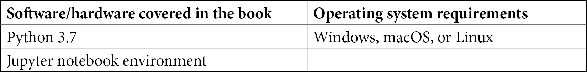

# 零、前言

数据驱动的决策一直是任何企业成功的关键，而**机器学习** ( **ML** )在实现这一目标并帮助企业保持竞争领先地位方面发挥着关键作用。尽管 ML 有助于释放企业的真正潜力，但前进的道路上仍有许多障碍。根据一项研究，90%的 ML 模型从未投入生产。模型开发和生产之间的脱节以及糟糕或平庸的 ML 实践是造成这种情况的众多原因中的一部分。这就是为什么有这么多端到端的 ML 平台来简化 ML 开发。这些平台的主要目标之一是鼓励数据科学家/ML 工程师遵循**机器学习操作** ( **MLOps** )标准，这有助于更快地生产模型。近年来，特征管理一直是 ML 平台的目标之一——无论它是内部构建还是作为**平台即服务** ( **PaaS** )。提供创建、共享和发现精选 ML 特征的能力的特征存储已经成为大多数这些 ML 平台的组成部分。

本书的目的是讨论 ML 管道中特性库的重要性。因此，我们将从一个 ML 问题开始，尝试开发一个没有特征库的模型。然后，我们将讨论 ML 的哪些方面可以从特征存储中受益，以及特征存储的一些特征如何不仅有助于创建更好的 ML 实践，而且有助于模型的更快和更具成本效益的开发。当我们从*为什么*我们应该使用特征库转移到*什么？*和*如何？*在这方面，我们将经历特征工程、模型训练、推理，以及批量和在线模型的生产和实际例子。在本书的第一和第二部分，我们将使用一个开源的特性存储，Feast。在最后一节中，我们将寻找市场上可用的替代方案，并尝试使用托管特征存储的端到端用例。

# 这本书是给谁的

本书面向数据/ML/平台工程师、数据科学家和数据科学爱好者，他们希望了解特征管理、如何在 AWS 云上部署 Feast、如何创建精选的 ML 特征，以及如何在模型构建中使用和与其他数据科学家协作，使用特征存储进行批量和在线模型预测，以及将模型从开发转移到生产。这本书将有益于从小型大学项目到企业级 ML 应用的 ML 项目。

# 这本书涵盖了什么

[*第 1 章*](B18024_01_ePub.xhtml#_idTextAnchor014) ，*机器学习生命周期概述*，从简单介绍 ML 开始，然后深入一个 ML 用例——客户终身价值模型。本章贯穿了 ML 开发的不同阶段，最后讨论了 ML 最耗时的部分，以及 ML 开发中理想世界和现实世界的样子。

[*第二章*](B18024_02_ePub.xhtml#_idTextAnchor029) 、*特征店解决什么问题？*，向我们介绍了这本书的主要重点，即特性管理和特性存储。它讨论了特征在生产系统中的重要性，将特征引入生产的不同方法，以及这些方法的常见问题，然后讨论了特征存储如何克服这些常见问题。

[*第 3 章*](B18024_03_ePub.xhtml#_idTextAnchor050) ，*特征库基础知识、术语和用法*，首先介绍开源特征库——Feast——然后介绍安装、特征库世界中使用的不同术语以及基本 API 用法。最后，简要介绍了在 Feast 中协同工作的不同组件。

[最后，它重新审视了在](B18024_04_ePub.xhtml#_idTextAnchor065) [*第 1 章*](B18024_01_ePub.xhtml#_idTextAnchor014) 、*机器学习生命周期概述*中开发的客户终身价值模型的特征工程方面，并创建和吸收了精选的特征。

[*第 5 章*](B18024_05_ePub.xhtml#_idTextAnchor078) ，*模型训练和推理*，从我们离开的地方继续 [*第 4 章*](B18024_04_ePub.xhtml#_idTextAnchor065) ，*向 ML 模型添加特征库*，并讨论特征库如何帮助数据科学家和 ML 工程师协作开发 ML 模型。它讨论了如何使用 Feast 进行批量模型推理，以及如何为在线模型推理构建 REST API。

[*第 6 章*](B18024_06_ePub.xhtml#_idTextAnchor096) ，*模型到生产和超越*，讨论了使用 Amazon **管理的工作流为 Apache air flow**(**MWAA**)创建编排环境，使用前几章中构建的特征工程、模型训练和推理代码/笔记本，并将批处理和在线模型管道部署到生产中。最后，它讨论了产品之外的方面，比如特性监控、特性定义的变更，以及构建下一个 ML 模型。

[*第七章*](B18024_07_ePub.xhtml#_idTextAnchor113) ，*Feast替代方案和 ML 最佳实践*，介绍了其他的特征存储，如 Tecton，Databricks 特征存储，Google Cloud 的 Vertex AI，Hopsworks 特征存储，亚马逊 SageMaker 特征存储。它还介绍了后者的基本用法，以便用户可以了解使用托管特征存储的要点。最后，它简要讨论了 ML 最佳实践。

[*第 8 章*](B18024_08_ePub.xhtml#_idTextAnchor138) ，*用例-客户流失预测*，使用亚马逊 SageMaker 的托管特征存储产品，并通过端到端用例在电信数据集上预测客户流失。它还涵盖了特征漂移监控和模型性能监控的示例。

# 为了充分利用这本书

这本书将 AWS 服务用于Feast部署、管道编排和几个 SageMaker 产品。如果您创建一个新的 AWS 帐户，所有使用的服务都在自由层或特征产品下，除了 Apache Airflow (MWAA)环境的托管工作流。但是，我们已经列出了可用于运行示例的气流安装替代方案。

所有的例子都是使用 Python 3.7-`feast==0.19.3`运行的。必要时，适当的库版本也会在笔记本中提及。要运行这些示例，您需要的只是一个 Jupyter 笔记本环境(local、Google Colab、SageMaker 或您选择的其他环境)以及提到的 AWS 资源和每个章节的权限。



**如果你使用的是这本书的数字版，我们建议你自己输入代码或者从这本书的 GitHub 库中获取代码(下一节有链接)。这样做将帮助您避免任何与复制和粘贴代码相关的潜在错误。**

为了从本书中获得最大收益，您应该具有 Python 编程经验，并对笔记本、Python 环境以及 ML 和 Python ML 库(如 XGBoost 和 scikit-learn)有基本的了解。

# 下载示例代码文件

您可以从 GitHub 的 https://GitHub . com/packt publishing/Feature-Store-for-Machine-Learning 下载本书的示例代码文件。如果代码有更新，它会在 GitHub 库中更新。

我们在[https://github.com/PacktPublishing/](https://github.com/PacktPublishing/)也有丰富的书籍和视频目录中的其他代码包。看看他们！

# 下载彩色图片

我们还提供了一个 PDF 文件，其中有本书中使用的截图和图表的彩色图像。可以在这里下载:https://static . packt-cdn . com/downloads/9781803230061 _ color images . pdf

# 习惯用法

本书通篇使用了许多文本约定。

`Code in text`:表示文本中的码字、数据库表名、文件夹名、文件名、文件扩展名、路径名、伪 URL、用户输入和 Twitter 句柄。下面是一个例子:“前面的代码块缩放数字列:`tenure`、`MonthlyCharges`和`TotalCharges`。”

代码块设置如下:

```
le = LabelEncoder()
```

```
for i in bin_cols:
```

```
    churn_data[i] = le.fit_transform(churn_data[i])
```

当我们希望将您的注意力吸引到代码块的特定部分时，相关的行或项目以粗体显示:

```
project: customer_segmentation
```

```
registry: data/registry.db
```

```
provider: aws
```

```
online_store:
```

```
  type: dynamodb
```

```
  region: us-east-1
```

任何命令行输入或输出都按如下方式编写:

```
$ docker build -t customer-segmentation .
```

**Bold** :表示一个新术语、一个重要单词或您在屏幕上看到的单词。例如，菜单或对话框中的单词以**粗体**出现。下面是一个例子:“在集群主页上，选择**属性**选项卡，向下滚动到**关联的 IAM 角色**

提示或重要注意事项

像这样出现。

# 取得联系

我们随时欢迎读者的反馈。

**总体反馈**:如果您对本书的任何方面有疑问，请发邮件至[customercare@packtpub.com](mailto:customercare@packtpub.com)联系我们，并在邮件主题中提及书名。

**勘误表**:虽然我们已经尽力确保内容的准确性，但错误还是会发生。如果你在这本书里发现了一个错误，请告诉我们，我们将不胜感激。请访问[www.packtpub.com/support/errata](http://www.packtpub.com/support/errata)并填写表格。

**盗版**:如果您在互联网上遇到我们作品的任何形式的非法拷贝，如果您能提供我们的地址或网站名称，我们将不胜感激。请通过[copyright@packt.com](mailto:copyright@packt.com)联系我们，并提供材料链接。

**如果你有兴趣成为一名作家**:如果有一个你擅长的话题，并且你有兴趣写一本书或者为一本书投稿，请访问[authors.packtpub.com](http://authors.packtpub.com)。

# 分享你的想法

一旦你阅读了*机器学习特征存储*，我们很想听听你的想法！请点击这里直接进入亚马逊对这本书的评论页面并分享你的反馈。

您的评论对我们和技术社区非常重要，将有助于我们确保提供高质量的内容。