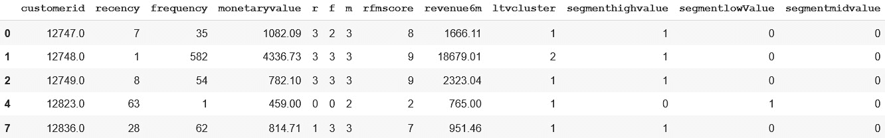

<title>B18024_04_ePub</title>

# 第 4 章:向 ML 模型添加特征库

在上一章中，我们讨论了本地系统中的 **Feast** 安装，Feast 中的常用术语，项目结构是什么样子，API 使用示例，以及 Feast 架构的简要概述。

到目前为止，在本书中，我们一直在讨论有关要素管理的问题，以及要素存储如何使数据科学家和数据工程师受益。是时候让我们用一个 ML 模型来弄脏我们的手，并把盛宴添加到 ML 管道中了。

在本章中，我们将重温**客户终身价值** ( **LTV/CLTV** ) ML 模型内置于 [*第 1 章*](B18024_01_ePub.xhtml#_idTextAnchor014) ，*机器学习生命周期*的概述。我们将使用 AWS 云服务而不是本地系统来运行本章中的示例。正如在第 3 章*中提到的，存储基础知识、术语和用法*，AWS 的安装不同于本地系统的安装，因此我们必须创建一些资源。我将使用一些免费层服务和一些特色服务(前 2 个月免费使用，有限制)。此外，我们在 [*第 3 章*](B18024_03_ePub.xhtml#_idTextAnchor050) 、*功能商店基础知识、术语和用法*中看到的术语和 API 用法示例，在我们尝试将 Feast 包含在 ML 管道中时将非常有用。

本章的目标是学习如何在项目中包含一个特征库，以及它与我们在 [*第 1 章*](B18024_01_ePub.xhtml#_idTextAnchor014) 、*机器学习生命周期概述*中所做的传统 ML 模型构建有何不同。我们将学习 Feast 安装，如何为 LTV 模型构建一个特性工程管道，如何定义特性定义，我们还将看看 Feast 中的特性摄取。

我们将依次讨论以下主题:

*   在 AWS 中创建盛宴资源
*   AWS 的盛宴初始化
*   用盛宴探索 ML 生命周期

# 技术要求

要遵循本章中的代码示例，您只需要熟悉 Python 和任何笔记本环境，可以是本地设置(如 Jupyter)或在线笔记本环境(如 Google Collab、Kaggle 或 SageMaker)。您还需要一个 AWS 帐户，完全访问资源，如红移，S3，胶水，DynamoDB，IAM 控制台，等等。您可以创建一个新帐户，并在试用期内免费使用所有服务。您可以在下面的 GitHub 链接中找到该书的代码示例:

https://github . com/packt publishing/Feature-Store-for-Machine-Learning/tree/main/chapter 04

以下 GitHub 链接指向特性库:

[https://github . com/packt publishing/Feature-Store-for-Machine-Learning/tree/main/customer _ segmentation](https://github.com/PacktPublishing/Feature-Store-for-Machine-Learning/tree/main/customer_segmentation)

# 在 AWS 中创建盛宴资源

正如前一章所讨论的，Feast 旨在为初学者提供一个快速的设置来尝试它；然而，对于团队协作和在生产中运行模型，需要更好的设置。在本节中，我们将在 AWS 云中设置一个盛宴环境，并在模型开发中使用它。在前一章中，我们还讨论了 Feast 在选择线上和线下商店时提供了多种选择。在本练习中，带 Redshift 的亚马逊 S3 将用作离线/历史商店，DynamoDB 将用作在线商店。因此，在我们开始在项目中使用特性库之前，我们需要一些 AWS 上的资源。让我们一个接一个地创建资源。

## 亚马逊 S3 用于存储数据

正如 AWS 文档中提到的,**亚马逊简单存储服务** ( **亚马逊 S3** ) *是一种对象存储服务，提供业界领先的可扩展性、数据可用性、安全性和性能*。Feast 提供了使用 S3 来存储和检索所有数据和元数据的能力。您还可以使用版本控制系统，如 GitHub 或 GitLab，在部署期间协作处理元数据并同步到 S3。要在 AWS 中创建S3 桶，请登录您的 AWS 帐户，使用搜索框导航至 S3 服务，或访问[https://s3.console.aws.amazon.com/s3/home?region=us-east-1](https://s3.console.aws.amazon.com/s3/home?region=us-east-1)。将显示一个网页，，如图*图 4.1* 所示。


图 4.1–AWS S3 主页

如果您已经有了存储桶，您将在页面上看到它们。我正在使用一个新帐户，因此我还没有看到任何桶。要创建新的存储桶，点击`feast-demo-mar-2022`。需要记住的一点是，S3 时段名称在所有客户中都是唯一的。如果桶创建失败并出现错误，**具有相同名称的桶已经存在**，尝试在末尾添加一些随机字符。


图 4.2-S3 创建存储桶

在成功创建桶后，您将看到一个类似于*图 4.3* 的屏幕。


图 4.3–创建 S3 存储桶后

## 线下商店的 AWS 红移

正如 AWS 文档中提到的,*Amazon Redshift 使用 SQL 来分析跨数据仓库、运营数据库和数据湖的结构化和半结构化数据，使用 AWS 设计的硬件和机器学习来提供任何规模的最佳性价比*。如前所述，我们将使用红移集群来查询历史数据。我们需要创建一个集群，因为我们还没有一个集群。在我们创建一个集群之前，让我们创建一个**身份和访问管理** ( **IAM** )角色。这就是红移将代表我们查询 S3 历史数据的角色。

让我们首先创建一个 IAM 角色:

1.  要创建 IAM 角色，请使用搜索导航到 AWS IAM 控制台或访问 URL https://us-east-1.console.aws.amazon.com/iamv2/home?区域=美国东部-1 #/角色。将显示一个类似于图 4.4 中*的网页。*


图 4.4–IAM 主页

1.  要创建新角色，点击右上角的**创建角色**按钮。将显示以下页面。


图 4.5–IAM 创建角色

1.  从页面上的可用选项中，选择**自定义信任策略**，复制以下代码块，并替换文本框中 JSON 中的策略:

    ```
    {     "Version": "2012-10-17",     "Statement": [         {             "Effect": "Allow",             "Principal": {                 "Service": "redshift.amazonaws.com"             },             "Action": "sts:AssumeRole"         }     ] }
    ```

2.  一直滚动到底部，点击下一个的**。在下一页，您将看到一个 IAM 策略列表，可以将附加到角色，如图*图 4.6* 所示。**


图 4.6–角色的 IAM 权限

1.  We need **S3** access, since the data will be stored in S3 as Parquet files, and **AWS Glue** access. The data stored in S3 will be loaded as an external schema into Redshift using AWS Glue Data Catalog/Lake Formation. Follow along here and you will understand what it means to load data as an external schema. For S3 access, search for **AmazonS3FullAccess** and select the corresponding checkbox, then search for **AWSGlueConsoleFullAccess** and select the corresponding checkbox. Scroll all the way down and click on **Next**.

    重要说明

    我们将提供对 S3 和 Glue 的完全访问权限，但是建议限制对特定资源的访问。我将把它作为一个练习，因为它超出了本章的范围。

点击**下一个**后，将显示以下页面。


图 4.7–IAM 审查

1.  在此页面上，为角色提供一个名称。我给这个角色取名为`feast-demo-mar-2022-spectrum-role`。查看角色的详细信息，并点击**创建角色**。成功创建后，您将在 IAM 控制台页面上找到该角色。
2.  现在我们已经准备好了 IAM 角色，下一步是创建一个**红移**集群，并将创建的 IAM 角色分配给它。要创建红移集群，请使用搜索栏导航到红移主页或访问链接 https://us-east-1.console.aws.amazon.com/redshiftv2/home?region = us-east-1 #集群。将显示以下页面。


图 4.8–红移主页

1.  在*图 4.8* 中的页面，点击**创建集群**上的。将显示以下页面。


图 4.9–创建一个红移集群

1.  从图 4.9 的*中显示的网页，我选择了**免费试用版**进行演示，但这可以根据数据集大小和负载进行配置。选择**免费试用**后，向下滚动并选择密码。下图显示了向下滚动时窗口的下半部分。*


图 4.10–创建集群下半部分

1.  一旦你选择了密码，点击底部的**创建集群**。集群创建需要几分钟时间。一旦集群创建完成，您应该会在 AWS Redshift 控制台中看到新创建的集群。最后一件事是将我们之前创建的 IAM 角色与 Redshift 集群关联起来。让我们现在做那件事。导航到新创建的集群。您将看到一个类似于图 4.11 中的网页。


图 4.11–红移群集页面

1.  在集群主页上，选择**属性**选项卡并向下滚动到**关联 IAM 角色**。您将看到*图 4.12* 中显示的选项。


图 4.12–红移属性选项卡

1.  在网页中，单击`feast-demo-mar-2022-spectrum-role`，因此我将关联该角色。单击该按钮后，集群将更新为新角色。可能还需要几分钟。一旦集群准备就绪，我们现在就完成了所需的基础设施。当特性准备好接受时，我们将添加外部数据目录。


图 4.13–红移关联 IAM 角色

我们需要一个 IAM 用户来访问这些资源并对它们执行操作。接下来让我们创建它。

## 创建一个 IAM 用户来访问资源

有不同的方式向用户提供对资源的访问。如果您是组织的一部分，那么 IAM 角色可以与 Auth0 和 active directories 集成。因为这超出了本文的范围，所以我将创建一个 IAM 用户，并授予该用户访问前面创建的资源所需的权限:

1.  让我们从 AWS 控制台创建 IAM 用户。可以使用搜索或访问 https://console.aws.amazon.com/iamv2/home#/users.来访问 IAM 控制台。IAM 控制台如图*图 4.14* 所示。


图 4.14–IAM 用户页面

1.  在 IAM 用户页面上，点击右上角的**添加用户**按钮。将显示以下网页。


图 4.15–IAM 添加用户

1.  在 web 页面上，提供一个用户名并选择**访问键-编程访问**，然后点击底部的**下一步:权限**。将显示以下网页。


图 4.16–IAM 权限

1.  On the displayed web page, click on **Attach existing policies directly** and from the list of available policies, search for and attach the following policies: **AmazonRedshiftFullAccess**, **AmazonS3FullAccess**, and **AmazonDynamoDBFullAccess**.

    重要说明

    我们在这里附加了完全访问权限，而不限制用户访问特定的资源。根据资源限制访问并仅提供所需的权限始终是一种好的做法。

2.  点击**下一步:标记**和随意添加标记，并再次点击**下一步:查看**。查看页面如下所示:


图 4.17–IAM 用户审查

1.  在查看页面中，点击**创建用户**按钮。将显示*图 4.18* 中的网页。


图 4.18–IAM 用户凭证

1.  在网页上，点击 **Download.csv** 按钮，并将文件保存在安全的位置。它包含我们刚刚创建的用户的**访问密钥 ID** 和**秘密访问密钥**。如果您不从该页面下载并保存，则秘密将会丢失。但是，您可以从 IAM 用户页面进入用户并管理密码(删除现有凭据并创建新凭据)。

现在基础设施已经准备好了，让我们初始化盛宴项目。

# AWS 盛宴初始化

我们现在已经有了运行 Feast 所需的基础设施。然而，在开始使用之前，我们需要初始化一个 Feast 项目。为了初始化一个盛宴项目，我们需要安装盛宴库，就像我们在 [*第 3 章*](B18024_03_ePub.xhtml#_idTextAnchor050) 、*特性存储基础、术语和用法*中所做的那样。然而，这一次，我们还需要安装 AWS 依赖项。下面是笔记本的链接:[https://github . com/packt publishing/Feature-Store-for-Machine-Learning/blob/main/chapter 04/CH4 _ Feast _ AWS _ initial ization . ipynb .](https://github.com/PacktPublishing/Feature-Store-for-Machine-Learning/blob/main/Chapter04/ch4_Feast_aws_initialization.ipynb )

以下命令安装带有所需 AWS 依赖项的 Feast:

```
!pip install feast[aws]
```

一旦安装了依赖项，我们需要初始化 Feast 项目。与我们在上一章中所做的初始化不同，在这里，盛宴初始化需要额外的输入，例如红移 ARN、数据库名称、S3 路径等等。我们来看看初始化在这里有什么不同。在我们初始化项目之前，我们需要以下详细信息:

*   **AWS 区域**:您的基础设施正在运行的区域。我已经创建了**美东-1** 中的所有资源。如果您已经在不同的地区创建了它们，请使用。
*   **红移星团 ID** :之前创建的红移星团的星团标识符。可以在主页上找到。
*   `dev`。
*   `awsuser`。如果您在集群创建期间提供了不同的用户名，请在此处使用该用户名。
*   `s3://feast-demo-mar-2022/staging`。还要在存储桶中创建暂存文件夹。
*   `arn:aws:iam::<account_number>:role/feast-demo-mar-2022-spectrum-role`。

一旦有了上述参数的值，新项目可以用两种方式初始化。一种是使用以下命令:

```
 feast init -t aws customer_segmentation
```

前面的命令初始化了 Feast 项目。在初始化过程中，该命令会要求您提供提到的参数。

第二种方法是编辑`feature_store.yaml`文件:

```
project: customer_segmentation
```

```
registry: data/registry.db
```

```
provider: aws
```

```
online_store:
```

```
  type: dynamodb
```

```
  region: us-east-1
```

```
offline_store:
```

```
  type: redshift
```

```
  cluster_id: feast-demo-mar-2022
```

```
  region: us-east-1
```

```
  database: dev
```

```
  user: awsuser
```

```
  s3_staging_location: s3://feast-demo-mar-2022/staging
```

```
  iam_role: arn:aws:iam::<account_number>:role/feast-demo-mar-2022-spectrum-role
```

无论您选择哪种方法来初始化项目，请确保您为参数提供了合适的值。我突出显示了可能需要替换的参数，以便 Feast 功能正常工作。如果使用第一种方法，`init`命令将给出是否加载示例数据的选项。选择`no`上传示例数据。

现在我们已经为项目初始化了特性库，让我们应用我们的初始特性集，它基本上是空的。如果您使用`feast init`来初始化项目，下面的代码块将删除不需要的文件:

```
%cd customer_segmentation
!rm -rf driver_repo.py test.py
```

如果不运行上述命令，它将在`driver_repo.py`文件中为实体和特征视图创建特征定义。

下面的代码块创建项目中定义的功能和实体定义。在这个项目中，目前还没有:

```
!feast apply
```

当运行前面的命令时，它显示消息**注册表**没有变化，这是正确的，因为我们还没有任何特性定义。

`customer_segmentation`的文件夹结构应类似于*图 4.19* 。


图 4.19–项目文件夹结构

特征库现在可以使用了。这可以签入 *GitHub* 或 *GitLab* 进行版本控制和协作。

重要说明

还要注意的是，使用基础设施作为代码框架，如 Terraform、AWS CDK、Cloud Formation 等，可以自动执行上述所有步骤。根据组织中遵循的团队结构，数据工程师或平台/基础架构团队将负责创建所需的资源，并共享可供数据科学家或工程师使用的存储库详细信息。

在下一节中，让我们看看 ML 生命周期是如何随着特性库而变化的。

# 用盛宴探索 ML 生命周期

在这个部分，让我们讨论当你使用一个特性库时，ML 模型开发是什么样子的。我们在 [*第 1 章*](B18024_01_ePub.xhtml#_idTextAnchor014)*中浏览了 ML 生命周期，概述了机器学习生命周期*。这使得我们很容易理解它是如何随着一个特性库而变化的，并且使我们能够跳过一些多余的步骤。


图 4.20–毫升生命周期

## 问题陈述(计划和创建)

问题陈述与第一章*机器学习生命周期概述*中的 [*保持不变。让我们假设你拥有一家零售企业，想要改善客户体验。首先，你要找到你的客户群和客户终身价值。*](B18024_01_ePub.xhtml#_idTextAnchor014)

## 数据(准备和清洗)

与第一章[*不同，*机器学习生命周期的概述*，在探索数据和弄清楚访问和更多之前，这里建模的起点是特征库。以下是笔记本的链接:*](B18024_01_ePub.xhtml#_idTextAnchor014)

[https://github . com/packt publishing/Feature-Store-for-Machine-Learning/blob/main/chapter 04/CH4 _ browse _ features . ipynb](https://github.com/PacktPublishing/Feature-Store-for-Machine-Learning/blob/main/Chapter04/ch4_browse_feast_for_features.ipynb )

[先说特色店:](https://github.com/PacktPublishing/Feature-Store-for-Machine-Learning/blob/main/Chapter04/ch4_browse_feast_for_features.ipynb )

1.  那么，让我们打开笔记本，安装带有 AWS 依赖项的 Feast:

    ```
    !pip install feast[aws]
    ```

2.  如果在上一节中创建的特性存储库被推入到诸如 GitHub 或 GitLab 之类的源代码控制中，那么让我们克隆这个存储库。下面的代码克隆了存储库:

    ```
    !git clone <repo_url>
    ```

3.  现在我们已经有了特性库，让我们连接到 Feast/特性库，看看有什么可用的:

    ```
    # change directory %cd customer_segmentation """import feast and load feature store object with the path to the directory which contains feature_story.yaml.""" from feast import FeatureStore store = FeatureStore(repo_path=".")
    ```

前面的代码块连接到 Feast 特性存储库。`repo_path="."`参数表示`feature_store.yaml`在当前工作目录中。

1.  让我们检查特征库是否包含任何可在模型中使用的**实体**或**特征视图**，而不是探索数据并重新生成已经存在的特征:

    ```
    #Get list of entities and feature views print(f"List of entities: {store.list_entities()}") print(f"List of FeatureViews: {store.list_feature_views()}")
    ```

前面的代码块列出了我们所连接的当前特征库中存在的**实体**和**特征视图**。代码块输出两个空列表，如下所示:

```
List of entities: []
List of FeatureViews: []
```

重要说明

你可能想知道*其他团队创造的功能呢？我怎样才能接触到他们，并检查有什么可用的？有很多方法可以解决这个问题。我们稍后会谈到这一点。*

因为实体和特征视图是空的，所以没有什么可以使用的。下一步是执行数据探索和特征工程。

我们将跳过数据探索阶段，因为我们已经在 [*第 1 章*](B18024_01_ePub.xhtml#_idTextAnchor014) 、*机器学习生命周期概述*中做过。此外，生成特征的步骤也是相同的。因此，我不会在特性工程上展开。相反，我将使用相同的代码，并简要说明代码的作用。参考 [*第 1 章*](B18024_01_ePub.xhtml#_idTextAnchor014) ，*机器学习生命周期概述*，了解如何生成特征的详细描述。

## 模型(特征工程)

在这个部分，我们将生成模型所需的特性。正如我们在 [*第 1 章*](B18024_01_ePub.xhtml#_idTextAnchor014) 、*机器学习生命周期概述*中所做的那样，我们将使用 3 个月的数据来生成 RFM 特征，并使用 6 个月的数据来生成数据集的标签。我们将按照我们在 [*第 1 章*](B18024_01_ePub.xhtml#_idTextAnchor014) 、*机器学习生命周期概述*中所做的相同顺序来完成这些步骤。以下是功能工程笔记本的链接:

[https://github . com/packt publishing/Feature-Store-for-Machine-Learning/blob/main/chapter 04/CH4 _ Feature _ engineering . ipynb](https://github.com/PacktPublishing/Feature-Store-for-Machine-Learning/blob/main/Chapter04/ch4_feature_engineering.ipynb)。

让我们从特征工程开始:

1.  下面的代码块读取数据集并过滤掉不属于`United Kingdom` :

    ```
    %pip install feast[aws]==0.19.3 s3fs import pandas as pd from datetime import datetime, timedelta, date from sklearn.cluster import Kmeans ##Read the data and filter out data that belongs to country other than UK retail_data = pd.read_csv('/content/OnlineRetail.csv', encoding= 'unicode_escape') retail_data['InvoiceDate'] = pd.to_datetime(retail_data['InvoiceDate'], errors = 'coerce') uk_data = retail_data.query("Country=='United Kingdom'").reset_index(drop=True)
    ```

    的数据
2.  有了筛选后的数据后，下一步是创建两个数据框架，一个用于 3 个月，另一个用于 6 个月。

以下代码块创建两个不同的数据帧，一个用于`2011-03-01 00:00:00.054000`和`2011-06-01 00:00:00.054000`之间的数据，另一个用于`2011-06-01 00:00:00.054000`和`2011-12-01 00:00:00.054000`之间的数据:

```
## Create 3months and 6 months DataFrames
t1 = pd.Timestamp("2011-06-01 00:00:00.054000")
t2 = pd.Timestamp("2011-03-01 00:00:00.054000")
t3 = pd.Timestamp("2011-12-01 00:00:00.054000")
uk_data_3m = uk_data[(uk_data.InvoiceDate < t1) & (uk_data.InvoiceDate >= t2)].reset_index(drop=True)
uk_data_6m = uk_data[(uk_data.InvoiceDate >= t1) & (uk_data.InvoiceDate < t3)].reset_index(drop=True)
```

1.  下一步是从 3 个月的数据框架中生成 RFM 特征。下面的代码块为所有客户生成 RFM 值:

    ```
    ## Calculate RFM values. Uk_data_3m['revenue'] = uk_data_3m['UnitPrice'] * uk_data_3m['Quantity'] max_date = uk_data_3m['InvoiceDate'].max() + timedelta(days=1) rfm_data = uk_data_3m.groupby(['CustomerID']).agg({   'InvoiceDate': lambda x: (max_date – x.max()).days,   'InvoiceNo': 'count',   'revenue': 'sum'}) rfm_data.rename(columns={'InvoiceDate': 'Recency',                          'InvoiceNo': 'Frequency',                          'revenue': 'MonetaryValue'},                 inplace=True)
    ```

现在我们已经为所有客户生成了 RFM 值，下一步是为范围从 0 到 3 的每个客户生成一个 R 组、一个 F 组和一个 M 组。一旦我们有了客户的 RFM 组，它们将用于通过合计客户的单个组值来计算 RFM 得分。

1.  下面的代码块为客户生成 RFM 组，并计算 RFM 分数:

    ```
    ## Calculate RFM groups of customers  r_grp = pd.qcut(rfm_data['Recency'],                 q=4, labels=range(3,-1,-1)) f_grp = pd.qcut(rfm_data['Frequency'],                 q=4, labels=range(0,4)) m_grp = pd.qcut(rfm_data['MonetaryValue'],                  q=4, labels=range(0,4)) rfm_data = rfm_data.assign(R=r_grp.values).assign(F=f_grp.values).assign(M=m_grp.values) rfm_data['R'] = rfm_data['R'].astype(int) rfm_data['F'] = rfm_data['F'].astype(int) rfm_data['M'] = rfm_data['M'].astype(int) rfm_data['RFMScore'] = rfm_data['R'] + rfm_data['F'] + rfm_data['M']
    ```

2.  计算出 RFM 分数后，就可以将客户分为低价值、中价值和高价值客户了。

下面的代码块将客户分成这些组:

```
# segment customers.
Rfm_data['Segment'] = 'Low-Value'
rfm_data.loc[rfm_data['RFMScore']>4,'Segment'] = 'Mid-Value' 
rfm_data.loc[rfm_data['RFMScore']>6,'Segment'] = 'High-Value' 
rfm_data = rfm_data.reset_index()
```

1.  现在我们已经准备好了 RFM 的特性。让我们先把这些放在一边，用在前面的步骤中创建的 6 个月数据框架来计算收入。

以下代码块计算 6 个月数据集中每个客户的收入:

```
# Calculate revenue using the six month dataframe.
Uk_data_6m['revenue'] = uk_data_6m['UnitPrice'] * uk_data_6m['Quantity']
revenue_6m = uk_data_6m.groupby(['CustomerID']).agg({
        'revenue': 'sum'})
revenue_6m.rename(columns={'revenue': 'Revenue_6m'}, 
                  inplace=True)
revenue_6m = revenue_6m.reset_index()
```

1.  下一步是将 6 个月的收入数据集合并到 RFM 特征数据框架中。下面的代码块合并了`CustomerId`列中的两个数据帧:

    ```
    # Merge the 6m revenue DataFrame with RFM data. Merged_data = pd.merge(rfm_data, revenue_6m, how="left") merged_data.fillna(0)
    ```

2.  由于我们将该问题视为分类问题，因此让我们使用 **k-means** 聚类算法为生成客户 LTV 标签。这里，我们将使用 6 个月的收入来生成标签。客户将被分成三个组，即**低电压**、**中电压**和**高电压**。

下面的代码块为客户生成 LTV 组:

```
# Create LTV cluster groups
merged_data = merged_data[merged_data['Revenue_6m']<merged_data['Revenue_6m'].quantile(0.99)]
kmeans = Kmeans(n_clusters=3)
kmeans.fit(merged_data[['Revenue_6m']])
merged_data['LTVCluster'] = kmeans.predict(merged_data[['Revenue_6m']])
```

1.  现在我们有了最终的数据集，让我们看看我们生成的特征集是什么样子的。以下代码块将分类值转换为整数值:

    ```
    Feature_data = pd.get_dummies(merged_data) feature_data['CustomerID'] = feature_data['CustomerID'].astype(str) feature_data.columns = ['customerid', 'recency', 'frequency', 'monetaryvalue', 'r', 'f', 'm', 'rfmscore', 'revenue6m', 'ltvcluster', 'segmenthighvalue', 'segmentlowvalue', 'segmentmidvalue'] feature_data.head(5)
    ```

前面的代码块产生以下功能集:



图 4.21–模型的最终特征集

在 [*第 1 章*](B18024_01_ePub.xhtml#_idTextAnchor014) 、*机器学习生命周期概述*中，执行的下一步是模型训练和评分。这就是我们将背离的地方。我假设这将是我们最终的特性集。然而，在模型开发期间，特征集会随着时间的推移而演变。我们将在后面的章节中讨论如何处理这些变化。

现在我们有了一个特性集，接下来的事情就是在 Feast 中创建实体和特性视图。

### 创建实体和特征视图

在前一章、 [*第三章*](B18024_03_ePub.xhtml#_idTextAnchor050) 、*特征存储基础、术语和用法*中，我们定义了**实体**和**特征视图**。实体被定义为语义相关特征的集合。实体是特性可以映射到的域对象。特征视图被定义为特征视图就像一个数据库表。它表示源要素数据的结构。特征视图由实体、一个或多个特征以及数据源组成。类似于数据库对象，特征视图通常围绕领域对象建模。由于创建和应用要素定义是一次性活动，因此最好将其保存在单独的笔记本或 Python 文件中。以下是笔记本的链接:

[https://github . com/packt publishing/Feature-Store-for-Machine-Learning/blob/main/chapter 04/CH4 _ create _ apply _ Feature _ definitions . ipynb](https://github.com/PacktPublishing/Feature-Store-for-Machine-Learning/blob/main/Chapter04/ch4_create_apply_feature_definitions.ipynb )

让我们打开一个笔记本，安装库，并像前面提到的那样克隆特性库:

```
!pip install feast[aws]==0.19.3
```

```
!git clone <feature_repo>
```

既然我们已经克隆了特性库，让我们创建实体和特性视图。根据实体和特征视图的定义，工作是识别*图 4.21* 中特征集中的实体、特征和特征视图。让我们从实体开始。在*图 4.21* 中唯一可以找到的域对象是`customerid`:

1.  让我们从定义客户实体开始。下面的代码块为 Feast 定义了客户实体:

    ```
    # Customer ID entity definition. from feast import Entity, ValueType customer = Entity(     name='customer',     value_type=ValueType.STRING,     join_key='customeriD',     description="Id of the customer" )
    ```

前面的实体定义有几个必选属性，如`name`、`value_type`、`join_key`，其他为可选属性。如果用户想要提供更多信息，还可以添加其他属性。最重要的属性是`join_key`。该属性的值应该与特征数据帧中的列名相匹配。

我们已经弄清楚了特征集中的实体。下一步工作是定义特征视图。在我们定义特性视图之前，要记住的一件事是定义特性视图，就好像你是一个没有生成特性集的消费者。我的意思是，不要命名特性视图`customer_segmentation_features`或`LTV_features`并将它们全部推到一个表中。当其他数据科学家浏览它们时，总是试图将它们分成有意义的逻辑组。

1.  记住这一点，让我们看看特性集，并决定这里可以形成多少个逻辑组，以及哪些特性属于哪些组。从*图 4.21* 中可以分为一组或两组。我看到的两组是客户的 RFM 功能和收入功能。由于 RFM 也有收入明细，我宁愿把他们分成一组，而不是两组，因为这里没有明确的子组。我就叫它`customer_rfm_features`。

以下代码块定义了功能视图:

```
from feast import ValueType, FeatureView, Feature, RedshiftSource
from datetime import timedelta 
# Redshift batch source
rfm_features_source = RedshiftSource(
    query="SELECT * FROM spectrum.customer_rfm_features",
    event_timestamp_column="event_timestamp",
    created_timestamp_column="created_timestamp",
)
# FeatureView definition for RFM features.
rfm_features_features = FeatureView(
    name="customer_rfm_features",
    entities=["customer"],
    ttl=timedelta(days=3650),
    features=[
        Feature(name="recency", dtype=ValueType.INT32),
        Feature(name="frequency", dtype=ValueType.INT32),
        Feature(name="monetaryvalue", 
        dtype=ValueType.DOUBLE),
        Feature(name="r", dtype=ValueType.INT32),
        Feature(name="f", dtype=ValueType.INT32),
        Feature(name="m", dtype=ValueType.INT32),
        Feature(name="rfmscore", dtype=ValueType.INT32),
        Feature(name="revenue6m", dtype=ValueType.DOUBLE),
        Feature(name="ltvcluster", dtype=ValueType.INT32),
        Feature(name="segmenthighvalue", 
        dtype=ValueType.INT32),
        Feature(name="segmentlowvalue", 
        dtype=ValueType.INT32),
        Feature(name="segmentmidvalue", 
        dtype=ValueType.INT32),
    ],
    batch_source=rfm_features_source,
)
```

前置代码块有两种定义。第一个是批量来源定义。根据所使用的脱机存储，批处理源的定义会有所不同。在前一章中，我们在示例中使用了`FileSource`。由于我们使用红移来查询线下商店，`RedshiftSource`已被定义。对象的输入是 query，这是一个简单的`SELECT`语句。可以将数据源配置为具有复杂的 SQL 查询，包括连接、聚合等等。然而，输出应该匹配在`FeatureView`中定义的列名。源的另一个输入是`created_timestamp_column`和`event_timestamp_column`。这些列在*图 4.21* 中缺失。这些列表示其标题所陈述的内容、事件发生的时间以及事件的创建时间。在我们接收数据之前，需要将这些列添加到数据中。

`FeatureView`表示数据源数据的表结构。正如我们在上一章中看到的，它有`entities`、`features`和`batch_source`。在*图 4.21* 中，实体是前面定义的`customer`。其余的列是特征和批处理源，即`RedshiftSource`对象。特征名应与列名匹配，而`dtype`应与列的值类型匹配。

1.  现在我们已经有了我们特性集的特性定义，我们必须注册新的定义才能使用它们。为了注册定义，让我们将实体和特性定义复制到一个 Python 文件中，并将该文件添加到我们的特性库文件夹中。我将命名这个文件为`rfm_features.py`。将文件添加到存储库后，文件夹结构如下图所示。


图 4.22–带有特性定义文件的项目

在使用`apply`命令注册和定义之前，让我们在红移上映射外部模式。

### 创建外部目录

如果您没记错的话，在创建红移资源的过程中，我提到过亚马逊 S3 中的数据将被添加为使用 Glue/Lake Formation 的外部映射。这意味着数据不会被直接吸收到红移中；相反，数据集将在 S3。数据集的结构将在湖泊形成目录中定义，稍后您将看到该目录。然后，数据库将被映射为 Redshift 上的外部模式。因此，接收会将数据直接推入 S3，并使用红移集群执行查询。

现在我们已经了解了摄取和查询的工作原理，让我们为湖泊形成中的要素集创建数据库和目录:

1.  要创建数据库，请通过搜索或使用以下网址访问 AWS 湖形成页面:https://console.aws.amazon.com/lakeformation/home?区域=美国东部-1 #数据库。


图 4.23-AWS 湖地层中的数据库

*图 4.23* 显示了 AWS 湖地层的数据库列表。

1.  在网页上，点击**创建数据库**。将出现以下网页。如果你在转换中看到任何弹出窗口，要求你开始湖泊形成，它可以被取消或接受。


图 4.24-湖泊形成创建数据库

1.  From the web page displayed above, give the database a name. I am calling it `dev`. Leave everything else as the default and click on **Create database**. The database will be created, and it will redirect to the database details page. As databases are groupings of tables together, you can think of this database as a grouping for all the feature views in the project. Once you have the database, the next step is to create the table. As you might have already realized, the table we create here corresponds to the feature view. In the current exercise, there is just one feature view. Hence, a corresponding table needs to be created.

    注意

    当您添加新的要素视图时，需要将相应的表添加到 Lake Formation 的数据库中。

2.  要在数据库中创建表格，从图 4.23*中的页面点击**表格**或访问以下网址:[https://console.aws.amazon.com/lakeformation/home?region = us-east-1 #表。](https://console.aws.amazon.com/lakeformation/home?region=us-east-1#tables )*


图 4.25-湖泊形成表

1.  从*图 4.25* 中的网页，点击右上角的**创建表格**按钮。将显示以下网页:


图 4.26-湖泊形成创建表 1

1.  对于`customer_rfm_features`，我选择了之前创建的数据库(`dev`)。描述是可选的。填写完这些详细信息后，向下滚动。以下选项将出现在**创建表格**页面的下一部分。


图 4.27-湖泊形成创建表 2

1.  The data store is one of the important properties here. It stands for the location of data in S3\. So far, we haven't pushed any data to S3 yet. We will be doing that soon. Let's define where data for this table will be pushed to. I am going to use the S3 bucket we created earlier, hence the location will be `s3://feast-demo-mar-2022/customer-rfm-features/`.

    重要说明

    在 S3 路径下创建`customer-rfm-features`文件夹。

2.  选择 S3 路径后，向下滚动到页面的最后部分，将显示以下选项。


图 4.28-湖泊形成创建表 3

*图 4.28* 显示了表格创建的最后一部分。**数据格式**部分要求数据的文件格式。在这个练习中，我们将选择 T21 拼花地板。请随意与他人进行实验。无论在这里选择什么格式，所有接收到的数据文件都应该是相同的格式，否则可能无法正常工作。

1.  最后一部分是数据集的**模式**定义。您可以点击**添加列**按钮，单独添加列，或者点击**上传模式**按钮，一次性上传定义所有列的 JSON。让我们使用**添加列**按钮，按顺序添加所有列。一旦添加了所有列和数据类型，这些列应该如下所示:


图 4.29–创建表格中的列列表

从*图 4.29* 中可以看出已经添加了所有的列，以及实体`customerid`和两个时间戳列:`event_timestamp`和`created_timestamp`。添加完列后，点击底部的**提交**按钮。

1.  现在，唯一悬而未决的事情是在已经创建的红移集群中映射这个表。让我们接下来做那件事。要创建外部模式的映射，请访问“红移集群”页面并选择之前创建的集群。将显示一个类似于*图 4.30* 的网页。


图 4.30–红移集群详细信息页面

1.  从*图 4.30* 中显示的网页，点击页面右上方的**查询数据**。在下拉选项中，选择查询编辑器 v2 中的**查询。它将打开一个查询编辑器，如下图所示:**


图 4.31–红移查询编辑器 v2

1.  从左侧面板中选择集群，如果默认情况下没有选择，还可以选择数据库。在*图 4.31* 所示的查询编辑器中，运行以下查询，将外部数据库映射到名为`spectrum`的模式中:

    ```
    create external schema spectrum  from data catalog database dev  iam_role '<redshift_role_arn>'  create external database if not exists;
    ```

2.  在前面的代码块中，将角色的`<redshift_role_arn>`替换为**ARN**，该角色已创建并与红移相关联。ARN 可以在 IAM 控制台的角色详情页面中找到，类似于*图 4.32* 中的那个。


图 4.32–IAM 角色详细信息页面

在成功执行查询的时，您应该能够在刷新页面后看到数据库下的输出`spectrum`模式，如图*图 4.33* 所示。


图 4.33–红移光谱模式

1.  您还可以通过执行下面的 SQL `SELECT`查询来验证映射:

    ```
    SELECT * from spectrum.customer_rfm_features limit 5
    ```

前面的 SQL 查询将在结果中返回一个空表，因为数据尚未被接收。

我们现在已经完成了外部表的映射。我们剩下的就是应用特性集和接收数据。让我们接下来做那件事。

重要说明

在 ML 管道中添加一个特性库似乎需要做很多工作，然而，事实并非如此。因为我们是第一次做，所以看起来就像那样。此外，从资源创建到映射外部表的所有步骤都可以使用基础设施作为代码来自动化。下面是一个自动化基础设施创建的例子的链接([https://github . com/feast-dev/feast-AWS-credit-scoring-tutorial](https://github.com/feast-dev/feast-aws-credit-scoring-tutorial))。除此之外，如果您使用诸如 Tecton、SageMaker 或 Databricks 之类的托管功能库，那么基础设施就是托管的，您所要做的就是创建功能、接收功能和使用功能，而无需担心基础设施。我们将在 [*第 7 章*](B18024_07_ePub.xhtml#_idTextAnchor113) 、 *Feast 替代方案和 ML 最佳实践*中对 Feast 与其他特性商店进行比较。

### 应用定义和摄取数据

到目前为止，我们已经执行了数据清理、特征工程、定义了实体和特征定义，并且还创建了外部表并将其映射到红移。现在，让我们应用特性定义并接收数据。继续我们在*创建实体和特征视图*部分创建的同一笔记本([https://github . com/packt publishing/Feature-Store-for-Machine-Learning/blob/main/chapter 04/CH4 _ create _ apply _ Feature _ definitions . ipynb](https://github.com/PacktPublishing/Feature-Store-for-Machine-Learning/blob/main/Chapter04/ch4_create_apply_feature_definitions.ipynb))。

要应用一个特性集，我们需要之前创建的 IAM 用户凭证。回想一下，在创建 IAM 用户的过程中，可以下载凭证文件。该文件包含`AWS_ACCESS_KEY_ID`和`AWS_SECRET_ACCESS_KEY`。一旦你有了它，在下面的代码块中替换`<aws_key_id>`和`<aws_secret>`:

```
import os
```

```
os.environ["AWS_ACCESS_KEY_ID"] = "<aws_key_id>"
```

```
os.environ["AWS_SECRET_ACCESS_KEY"] = "<aws_secret>"
```

```
os.environ["AWS_DEFAULT_REGION"] = "us-east-1"
```

重要说明

将笔记本中的凭据设置为原始字符串从来都不是一个好主意。根据用户可用的工具，使用秘密管理器来存储秘密是一种好的做法。

设置环境变量后，您只需运行以下代码块来应用定义的功能集:

```
%cd customer_segmentation/
```

```
!feast apply
```

前面的代码块注册了新的特性定义，并为定义中的所有特性视图创建了 AWS DynamoDB 表。前面代码块的输出显示在*图 4.34* 中。


图 4.34–盛宴应用输出

要验证是否为功能视图创建了 DynamoDB 表，请使用搜索或访问 https://console.aws.amazon.com/dynamodbv2/home?导航至 DynamoDB 控制台 region = us-east-1 #表。你应该看到如图*图 4.35* 所示的`customer_rfm_features`表。


图 4.35–dynamo db 表

现在已经应用了特征定义，为了摄取特征数据，让我们拿起在*模型(特征工程)*部分中创建的特征工程笔记本([https://github . com/packt publishing/Feature-Store-for-Machine-Learning/blob/main/chapter 04/CH4 _ Feature _ engineering . ipynb](https://github.com/PacktPublishing/Feature-Store-for-Machine-Learning/blob/main/Chapter04/ch4_feature_engineering.ipynb))并继续进行(特征工程产生的最后一个命令*图 4.21* )。为了摄取数据，我们唯一要做的事情是将特征数据帧写入 S3 位置，该位置在*图 4.28* 中映射。我将数据存储位置映射为`s3://feast-demo-mar-2022/customer-rfm-features/`。让我们将数据帧写入位置为 Parquet。

以下代码块接收 S3 位置的数据:

```
import os
```

```
from datetime import datetime
```

```
os.environ["AWS_ACCESS_KEY_ID"] = "<aws_key_id>"
```

```
os.environ["AWS_SECRET_ACCESS_KEY"] = "<aws_secret>"
```

```
os.environ["AWS_DEFAULT_REGION"] = "us-east-1"
```

```
file_name = f"rfm_features-{datetime.now()}.parquet" 
```

```
feature_data["event_timestamp"] = datetime.now()
```

```
feature_data["created_timestamp"] = datetime.now()
```

```
s3_url = f's3://feast-demo-mar-2022/customer-rfm-features/{file_name}'
```

```
feature_data.to_parquet(s3_url)
```

前面的代码块设置 IAM 用户的 AWS 凭证，添加缺少的列`event_timestamp`和`created_timestamp`，最后将 Parquet 文件写入 S3 位置。要验证文件是否成功写入，导航至 S3 位置并验证文件是否存在。为了确保文件的格式正确，让我们导航到图 4.32 中的红移查询编辑器，并运行以下查询:

```
SELECT * from spectrum.customer_rfm_features limit 5
```

前面的命令应该成功，输出如图*图 4.36* 所示。


图 4.36–获取数据后的红移查询

在我们进入 ML 的下一个阶段之前，让我们运行几个 API，看看我们的特性库是什么样子的，并验证对历史存储的查询工作正常。对于下面的代码，让我们使用我们用来创建和应用特性定义的笔记本([https://github . com/packt publishing/Feature-Store-for-Machine-Learning/blob/main/chapter 04/CH4 _ create _ apply _ Feature _ definitions . ipynb](https://github.com/PacktPublishing/Feature-Store-for-Machine-Learning/blob/main/Chapter04/ch4_create_apply_feature_definitions.ipynb))。

下面的代码连接到特性存储并列出可用的实体和特性视图:

```
"""import feast and load feature store object with the path to the directory which contains feature_story.yaml."""
```

```
from feast import FeatureStore
```

```
store = FeatureStore(repo_path=".")
```

```
#Get list of entities and feature views
```

```
print("-----------------------Entity---------------------")
```

```
for entity in store.list_entities():
```

```
  print(f"entity: {entity}")
```

```
print("--------------------Feature Views-----------------")
```

```
for feature_view in store.list_feature_views():
```

```
  print(f"List of FeatureViews: {feature_view}")
```

前面的代码块打印了`customer`实体和`customer_rfm_features`特征视图。让我们查询几个实体的线下商店，看看它是否像预期的那样工作。

为了查询离线数据，我们需要实体 id 和时间戳列。实体 ID 列是客户 ID 的列表，时间戳列用于对数据集执行时间点连接查询。以下代码为查询创建一个实体数据帧:

```
import pandas as pd
```

```
from datetime import datetime, timedelta
```

```
entity_df = pd.DataFrame.from_dict(
```

```
    {
```

```
        "customerid": ["12747.0", "12748.0", "12749.0"],
```

```
        "event_timestamp": [datetime.now()]*3
```

```
    }
```

```
)
```

```
entity_df.head()
```

前面的代码块产生一个实体数据帧，如图*图 4.37* 所示。


图 4.37-实体数据框架

使用示例实体数据框架，让我们查询历史数据。以下代码从历史存储中获取要素的子集:

```
job = store.get_historical_features(
```

```
    entity_df=entity_df,
```

```
    features=[
```

```
              "customer_rfm_features:recency", 
```

```
              "customer_rfm_features:frequency", 
```

```
              "customer_rfm_features:monetaryvalue", 
```

```
              "customer_rfm_features:r", 
```

```
              "customer_rfm_features:f", 
```

```
              "customer_rfm_features:m"]
```

```
    )
```

```
df = job.to_df()
```

```
df.head()
```

下面的代码块可能需要几分钟来运行，但最终会输出以下结果:


图 4.38–历史检索作业输出

现在我们可以说我们的特色工程管道已经准备好了。接下来需要的步骤是训练模型，执行验证，如果对模型的性能满意，将管道部署到生产中。我们将在下一章关注培训、验证、部署和模型评分。接下来简单总结一下我们所学的内容。

# 摘要

在这一章中，我们的目标是将 Feast 特性存储添加到我们的 ML 模型开发中。我们通过在 AWS 上创建所需的资源，添加一个 IAM 用户来访问这些资源，从而实现了这一点。在创建资源之后，我们再次经历了 ML 生命周期的步骤，从问题陈述到特性工程和特性摄取。我们还验证了创建的特性定义和获取的数据可以通过 API 进行查询。

既然我们已经为 ML 生命周期的后续步骤(模型训练、验证、部署和评分)奠定了基础，那么在下一章中，我们将了解如何从一开始就添加特性存储，从而在开发完成后使模型可以投入生产。

# 参考文献

*   盛宴文档:[https://docs.feast.dev/](https://docs.feast.dev/)
*   AWS 上的 Feast 信用评分:[https://github . com/Feast-dev/Feast-AWS-credit-scoring-tutorial](https://github.com/feast-dev/feast-aws-credit-scoring-tutorial)