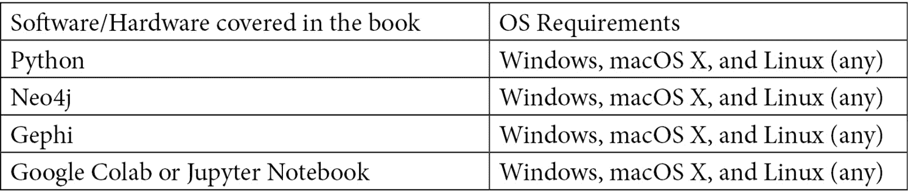

# 前言

图形机器学习提供了一套新的工具，用于处理网络数据和利用实体之间的关系，可用于预测、建模和分析任务。

你将从简单介绍图论和图机器学习开始，学习理解它们的潜力。随着学习的进行，您将会精通图形表示学习的主要机器学习模型:它们的目的、它们如何工作，以及它们如何在广泛的监督和非监督学习应用中实现。然后，您将建立一个完整的机器学习管道，包括数据处理、模型训练和预测，以便充分利用图形数据的潜力。接下来，您将了解真实世界的场景，例如从社交网络中提取数据、文本分析、使用图表的自然语言处理以及图表上的金融交易系统。最后，您将了解如何构建和扩展数据驱动的图表分析应用程序，以存储、查询和处理网络信息，然后继续探索图表的最新趋势。

在这本机器学习书结束时，你将已经学会了图论的基本概念和所有用于构建成功的机器学习应用程序的算法和技术。

# 这本书是给谁的

本书面向数据分析师、图形开发人员、图形分析师和图形专业人员，他们希望利用嵌入在数据点之间的连接和关系中的信息，揭示隐藏的结构，并利用拓扑信息来提高他们的分析和模型的性能。这本书也将对想要建立机器学习驱动的图形数据库的数据科学家和机器学习开发者有用。需要对图形数据库和图形数据有初级的理解。Python 编程和机器学习的中级工作知识也有望充分利用这本书。

# 这本书涵盖了什么

[*第 1 章*](B16069_01_Final_JM_ePub.xhtml#_idTextAnchor014) ，*图论入门*，利用 NetworkX Python 库介绍图论的基本概念。

[*第二章*](B16069_02_Final_JM_ePub.xhtml#_idTextAnchor035) ，*图机器学习*，介绍图机器学习的主要概念和图嵌入技术。

[*第三章*](B16069_03_Final_JM_ePub.xhtml#_idTextAnchor046) ，*无监督图学习*，涵盖了近期的无监督图嵌入方法。

[*第四章*](B16069_04_Final_JM_ePub.xhtml#_idTextAnchor064) ，*监督图学习*，涵盖了最近的监督图嵌入方法。

[*第五章*](B16069_05_Final_JM_ePub.xhtml#_idTextAnchor079) ，*关于图上机器学习的问题*，介绍了图上最常见的机器学习任务。

[*第六章*](B16069_06_Final_JM_ePub.xhtml#_idTextAnchor100) ，*社交网络分析*，展示了机器学习算法在社交网络数据上的一个应用。

[*第七章*](B16069_07_Final_JM_ePub.xhtml#_idTextAnchor116) ，*文本分析和自然语言处理使用图表*，展示了机器学习算法对自然语言处理任务的应用。

[*第八章*](B16069_08_Final_JM_ePub.xhtml#_idTextAnchor129) ，*信用卡交易的图形分析*，展示了机器学习算法在信用卡欺诈检测中的应用。

[*第九章*](B16069_09_Final_JM_ePub.xhtml#_idTextAnchor141) ，*构建数据驱动的图驱动应用*，介绍了一些对处理大型图有用的技术和技巧。

[*第十章*](B16069_10_Final_JM_ePub.xhtml#_idTextAnchor150) ，*关于图的新趋势*，介绍了图机器学习的一些新趋势(算法和应用)。

# 为了充分利用这本书

Jupyter 或 Google Colab 笔记本足以涵盖所有示例。有些章节还需要 Neo4j 和 Gephi。



**如果你正在使用这本书的数字版本，我们建议你自己键入代码或者通过 GitHub 库访问代码(下一节提供链接)。这样做将帮助您避免任何与复制和粘贴代码相关的潜在错误。**

# 下载示例代码文件

你可以从 https://github.com/PacktPublishing/Graph-Machine-Learning[的 GitHub 下载本书的示例代码文件。如果代码有更新，它将在现有的 GitHub 库中更新。](https://github.com/PacktPublishing/Graph-Machine-Learning)

我们在 https://github.com/PacktPublishing/的[也有丰富的书籍和视频目录中的其他代码包。看看他们！](https://github.com/PacktPublishing/)

# 下载彩色图像

我们还提供了一个 PDF 文件，其中有本书中使用的截图/图表的彩色图像。可以在这里下载:[https://static . packt-cdn . com/downloads/9781800204492 _ color images . pdf](https://static.packt-cdn.com/downloads/9781800204492_ColorImages.pdf)。

# 习惯用法

本书通篇使用了许多文本约定。

`Code in text`:表示文本中的码字、数据库表名、文件夹名、文件名、文件扩展名、路径名、伪 URL、用户输入和 Twitter 句柄。下面是一个例子:“将下载的`WebStorm-10*.dmg`磁盘镜像文件挂载为系统中的另一个磁盘。”

代码块设置如下:

```
html, body, #map {
 height: 100%; 
 margin: 0;
 padding: 0
}
```

当我们希望将您的注意力吸引到代码块的特定部分时，相关的行或项目以粗体显示:

```
Jupyter==1.0.0
networkx==2.5
matplotlib==3.2.2
node2vec==0.3.3
karateclub==1.0.19
scipy==1.6.2
```

任何命令行输入或输出都按如下方式编写:

```
$ mkdir css
$ cd css
```

**粗体**:表示一个新术语、一个重要单词或您在屏幕上看到的单词。例如，菜单或对话框中的单词出现在文本中，如下所示。下面是一个例子:“从**管理**面板中选择**系统信息**”

提示或重要注意事项

像这样出现。

# 取得联系

我们随时欢迎读者的反馈。

**总体反馈**:如果您对本书的任何方面有疑问，请在邮件主题中提及书名，并发邮件至[customercare@packtpub.com](mailto:customercare@packtpub.com)联系我们。

**勘误表**:虽然我们已经尽一切努力确保内容的准确性，但错误还是会发生。如果你在这本书里发现了一个错误，请告诉我们，我们将不胜感激。请访问[www.packtpub.com/support/errata](http://www.packtpub.com/support/errata)，选择您的图书，点击勘误表提交表格链接，并输入详细信息。

盗版:如果您在互联网上发现我们作品的任何形式的非法拷贝，如果您能提供我们的地址或网站名称，我们将不胜感激。请通过[copyright@packt.com](mailto:copyright@packt.com)联系我们，并提供材料链接。

如果你有兴趣成为一名作家:如果有一个你擅长的话题，并且你有兴趣写书或投稿，请访问[authors.packtpub.com](http://authors.packtpub.com)。

# 点评

请留下评论。一旦你阅读并使用了这本书，为什么不在你购买它的网站上留下评论呢？潜在的读者可以看到并使用您不带偏见的意见来做出购买决定，我们 Packt 可以了解您对我们产品的看法，我们的作者可以看到您对他们的书的反馈。谢谢大家！

有关 Packt 的更多信息，请访问[packt.com](http://packt.com)。