# 第 1 章:图表入门

图形是用于描述实体之间关系的数学结构，几乎在任何地方都可以使用。例如，社交网络是图表，其中用户的连接取决于一个用户是否跟随另一个用户的更新。它们可用于表示地图，其中城市通过街道连接起来。图形可以描述生物结构、网页，甚至神经退行性疾病的进展。

**图论**，即对图形的研究，多年来一直受到人们的极大兴趣，引领人们开发算法，识别属性，并定义数学模型，以更好地理解复杂的行为。

本章将回顾图形结构数据背后的一些概念。理论性的概念将会被呈现，连同例子一起帮助你理解一些更一般的概念并且把他们付诸实践。在这一章中，我们将介绍和使用一些最广泛使用的库来创建、操作和研究复杂网络的结构动力学和功能，具体来看 Python `networkx`库。

本章将涵盖以下主题:

*   带`networkx`的图形介绍
*   绘制图表
*   图表属性
*   基准和存储库
*   处理大型图表

# 技术要求

在我们所有的练习中，我们将使用带有 Python 3.8 的 Jupyter 笔记本。在下面的代码片段中，我们展示了将使用`pip`为本章安装的 Python 库的列表(例如，在命令行上运行`pip install networkx==2.5`，等等):

```
Jupyter==1.0.0
networkx==2.5
snap-stanford==5.0.0
matplotlib==3.2.2
pandas==1.1.3
scipy==1.6.2
```

在本书中，将参考以下 Python 命令:

*   `import networkx as nx`
*   `import pandas as pd`
*   `import numpy as np`

对于更复杂的数据可视化任务，ge phi([https://gephi.org/](https://gephi.org/))也是必需的。安装手册可在此处获得:【https://gephi.org/users/install/ 。与本章相关的所有代码文件都可以在[https://github . com/packt publishing/Graph-Machine-Learning/tree/main/chapter 01](https://github.com/PacktPublishing/Graph-Machine-Learning/tree/main/Chapter01)获得。

# networkx 图形简介

在这一节中，我们将对图论进行一个一般介绍。此外，为了将理论概念与它们的实际实现相结合，我们将使用`networkx`用 Python 中的代码片段来丰富我们的解释。

一个**简单无向图**(或者简单地说，一个图) *G* 定义为一对 *G=(V，E)* ，其中 *V={* 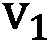 *，..、*  *}* 是一组节点(也叫顶点)和 *E={{*  *、*  *..、{ *  *、*  *}}* 是边的两个集合(两个元素的集合)(也叫的**链接**)，代表属于 *V* 的两个节点之间的连接。

需要强调的是，因为 *E* 的每个元素都是两个集合，所以每个边之间没有顺序。提供更多细节， *{*  *，* 和 *{*  *，* 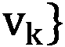表示同一条边。

我们现在为图和节点的一些基本属性提供定义，如下:

*   一个图的**阶**是它的顶点数 *|V|* 。一个图的**大小**是它的边数 *|E|* 。
*   一个顶点的**度**是与其相邻的边的数量。图 *G* 中顶点 *v* 的**邻居**是与 *v* 相邻的所有顶点所诱导的顶点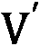的子集。
*   图 *G* 中顶点 *v* 的**邻域图**(也称为自我图)是 *G* 的子图，由与 *v* 相邻的顶点和连接与 *v* 相邻的顶点的所有边组成。

在下面的屏幕截图中可以看到一个图表的示例:


图 1.1–图表示例

根据这个表示，由于没有方向，从`4`开始的一条边(总共有四个顶点和四条边)。`2`、`3`和`1`。每个节点的邻居显示在以下列表中:

*   `Paris` = { `Milan`，`Dublin` }
*   `Milan` = { `Paris`，`Dublin`，`Rome` }
*   `Dublin` = { `Paris`，`Milan` }
*   `Rome` = { `Milan` }

相同的图形可在`networkx`中表示，如下所示:

```
import networkx as nx
G = nx.Graph()
V = {'Dublin', 'Paris', 'Milan', 'Rome'}
E = [('Milan','Dublin'), ('Milan','Paris'), ('Paris','Dublin'), ('Milan','Rome')]
G.add_nodes_from(V)
G.add_edges_from(E)
```

由于默认情况下，`nx.Graph()`命令生成一个无向图，我们不需要指定每条边的两个方向。在`networkx`中，节点可以是任何可散列的对象:字符串、类，甚至其他`networkx`图。现在让我们来计算我们之前生成的图形的一些属性。

通过运行以下代码，可以获得图的所有节点和边:

```
print(f"V = {G.nodes}")
print(f"E = {G.edges}")
```

以下是前面命令的输出:

```
V = ['Rome', 'Dublin', 'Milan', 'Paris']
E = [('Rome', 'Milan'), ('Dublin', 'Milan'), ('Dublin', 'Paris'), ('Milan', 'Paris')]
```

我们还可以使用以下命令计算每个节点的图顺序、图大小、度和邻居:

```
print(f"Graph Order: {G.number_of_nodes()}")
print(f"Graph Size: {G.number_of_edges()}")
print(f"Degree for nodes: { {v: G.degree(v) for v in G.nodes} }")
print(f"Neighbors for nodes: { {v: list(G.neighbors(v)) for v in G.nodes} }") 
```

结果将如下所示:

```
Graph Order: 4
Graph Size: 4
Degree for nodes: {'Rome': 1, 'Paris': 2, 'Dublin':2, 'Milan': 3}
Neighbors for nodes: {'Rome': ['Milan'], 'Paris': ['Milan', 'Dublin'], 'Dublin': ['Milan', 'Paris'], 'Milan': ['Dublin', 'Paris', 'Rome']}
```

最后，我们还可以为图`G`计算特定节点的自我图，如下所示:

```
ego_graph_milan = nx.ego_graph(G, "Milan")
print(f"Nodes: {ego_graph_milan.nodes}")
print(f"Edges: {ego_graph_milan.edges}")
```

结果将如下:

```
Nodes: ['Paris', 'Milan', 'Dublin', 'Rome']
Edges: [('Paris', 'Milan'), ('Paris', 'Dublin'), ('Milan', 'Dublin'), ('Milan', 'Rome')]
```

也可以通过添加新的节点和/或边来修改原始图形，如下所示:

```
#Add new nodes and edges
new_nodes = {'London', 'Madrid'}
new_edges = [('London','Rome'), ('Madrid','Paris')]
G.add_nodes_from(new_nodes)
G.add_edges_from(new_edges)
print(f"V = {G.nodes}")
print(f"E = {G.edges}")
```

这将输出以下几行:

```
V = ['Rome', 'Dublin', 'Milan', 'Paris', 'London', 'Madrid']
E = [('Rome', 'Milan'), ('Rome', 'London'), ('Dublin', 'Milan'), ('Dublin', 'Paris'), ('Milan', 'Paris'), ('Paris', 'Madrid')]
```

通过运行以下代码可以删除节点:

```
node_remove = {'London', 'Madrid'}
G.remove_nodes_from(node_remove)
print(f"V = {G.nodes}")
print(f"E = {G.edges}")
```

这是前面命令的结果:

```
V = ['Rome', 'Dublin', 'Milan', 'Paris']
E = [('Rome', 'Milan'), ('Dublin', 'Milan'), ('Dublin', 'Paris'), ('Milan', 'Paris')]
```

如预期的那样，包含被移除节点的所有边都被自动从边列表中删除。

此外，可以通过运行以下代码来删除边缘:

```
node_edges = [('Milan','Dublin'), ('Milan','Paris')]
G.remove_edges_from(node_edges)
print(f"V = {G.nodes}")
print(f"E = {G.edges}")
```

最终的结果如下:

```
V = ['Dublin', 'Paris', 'Milan', 'Rome']
E = [('Dublin', 'Paris'), ('Milan', 'Rome')]
```

`networkx`库还允许我们通过使用以下命令从图`G`中移除单个节点或单条边:`G. remove_node('Dublin')`和`G.remove_edge('Dublin', 'Paris')`。

## 图表的类型

在前一节中，我们描述了如何创建和修改简单的无向图。在这里，我们将展示如何扩展这个基本的数据结构，以便封装更多的信息，这要归功于**有向图** ( **有向图**)、加权图和多重图的引入。

### 有向图

一个有向图 *G* 定义为一对 *G=(V，E)* ，其中 *V={*  *，..，*  *}* 是一组节点并且 *E={(*  *，*  *..、(*  *、*  *)}* 是表示属于 *V* 的两个节点之间连接的有序偶的集合。

因为 *E* 的每个元素都是一个有序的偶，它强制连接的方向。边缘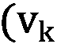 *，* 表示*节点*  *进入* 。这与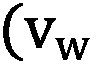 *、* 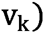不同，因为它的意思是*节点*  *到* 。起始节点称为*头*，而结束节点称为*尾*。

由于边方向的存在，节点度的定义需要扩展。

内度数和外度数

对于顶点 *v* ，与 *v* 相邻的头端数为称为**的度数**(用 *v* 的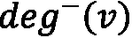表示，而与 *v* 相邻的尾端数为其**的伸出度**(用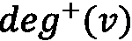表示)。

下面的截图中有一个关于有向图的示例:


图 1.2–有向图的例子

边缘的方向是从箭头上可见的——比如**米兰** - >都柏林就是从**米兰**到**都柏林**的意思。**都柏林**有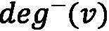*= 2*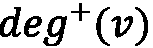*= 0*，**巴黎**有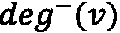 *= 0* ，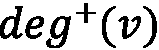 *= 2* ，**米兰**有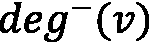 *= 1* ，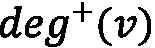 * = 2*

相同的图形可以用`networkx`表示，如下所示:

```
G = nx.DiGraph()
V = {'Dublin', 'Paris', 'Milan', 'Rome'}
E = [('Milan','Dublin'), ('Paris','Milan'), ('Paris','Dublin'), ('Milan','Rome')]
G.add_nodes_from(V)
G.add_edges_from(E)
```

定义与用于简单无向图的定义相同；唯一的区别是用于实例化对象的`networkx`类。对于有向图，使用了`nx.DiGraph()`类。

`Indegree`和`Outdegree`可以使用以下命令计算:

```
print(f"Indegree for nodes: { {v: G.in_degree(v) for v in G.nodes} }")
print(f"Outdegree for nodes: { {v: G.out_degree(v) for v in G.nodes} }")
```

结果将如下所示:

```
Indegree for nodes: {'Rome': 1, 'Paris': 0, 'Dublin': 2, 'Milan': 1}
Outdegree for nodes: {'Rome': 0, 'Paris': 2, 'Dublin': 0, 'Milan': 2}
```

对于无向图，`G.add_nodes_from()`、`G.add_edges_from()`、`G.remove_nodes_from()`、`G.remove_edges_from()`函数可用于修改给定的图`G`。

### 多重图

我们现在将引入多重图对象，它是图定义的一种推广，允许多条边具有相同的开始和结束节点对。

一个**多图 G** 被定义为 *G=(V，E)* ，其中 *V* 是一组节点， *E* 是一组边(一个允许其每个元素有多个实例的集合)。

如果 *E* 是有序偶的多集合，则称一个多图为 a **有向多图**；否则，如果 *E* 是两个集合的多重集合，则称之为**无向多重图**。

下面的屏幕截图提供了一个有向多重图的示例:


图 1.3-多重图示例

在下面的代码片段中，我们展示了如何使用`networkx`来创建有向或无向多重图:

```
directed_multi_graph = nx.MultiDiGraph()
undirected_multi_graph = nx.MultiGraph()
V = {'Dublin', 'Paris', 'Milan', 'Rome'}
E = [('Milan','Dublin'), ('Milan','Dublin'), ('Paris','Milan'), ('Paris','Dublin'), ('Milan','Rome'), ('Milan','Rome')]
directed_multi_graph.add_nodes_from(V)
undirected_multi_graph.add_nodes_from(V)
directed_multi_graph.add_edges_from(E)
undirected_multi_graph.add_edges_from(E)
```

有向和无向多重图之间的唯一区别在于前两行，它们创建了两个不同的对象:`nx.MultiDiGraph()`用于创建有向多重图，而`nx.MultiGraph()`用于构建无向多重图。用于添加节点和边的函数对于两个对象是相同的。

### 加权图

我们现在将介绍有向、无向和多重加权图。

一个**边加权图**(或简称为加权图) *G* 被定义为 *G=(V，E，w)* 其中 *V* 是一组节点， *E* 是一组边，是一个加权函数，它在每条边上分配一个用实数表示的权重。

一个**节点加权图** *G* 被定义为 *G=* ( *V，E，w* )，其中 *V* 是一组节点， *E* 是一组边，是加权函数，在每个节点分配一个用实数表示的权重。

请记住以下几点:

*   如果 *E* 是有序偶集，那么我们称为**有向加权图**。
*   如果 *E* 是两个集合的集合，那么我们称之为一个**无向加权图**。
*   如果 *E* 是多集，我们就称之为**加权多图** ( **有向加权多图**)。****
*   如果 *E* 是有序偶的多集，则是**无向加权多图**。

一个有向边加权图的例子可以在下面的截图中找到:


图 1.4–有向边加权图示例

从*图 1.4* 中，很容易看出图中权重的存在是如何帮助向数据结构添加有用信息的。的确，我们可以把边权重想象成从一个节点到另一个节点的“成本”。比如到达`19`，同时到达`11`。

在`networkx`中，可以生成如下有向加权图:

```
G = nx.DiGraph()
V = {'Dublin', 'Paris', 'Milan', 'Rome'}
E = [('Milan','Dublin', 19), ('Paris','Milan', 8), ('Paris','Dublin', 11), ('Milan','Rome', 5)]
G.add_nodes_from(V)
G.add_weighted_edges_from(E)
```

### 二部图

我们现在将介绍本节中使用的另一种类型的图:多部分图。二部图和三部图——更一般地说，第 k 部图——是其顶点可以分别划分为两个、三个或更多第 k 组节点的图。边只允许跨不同的集合，不允许在属于同一集合的节点内。在大多数情况下，属于不同集合的节点也由特定的节点类型来表征。在*第 7 章，使用图形的文本分析和自然语言处理，*和 [*第 8 章*](B16069_08_Final_JM_ePub.xhtml#_idTextAnchor129) ，*信用卡交易的图形分析*中，我们将处理一些基于图形的应用的实际示例，您将看到多部分图形如何在几种情况下出现，例如，在以下场景中:

*   当处理文档并在文档和文档中出现的实体的二分图中构造信息时
*   当处理交易数据时，为了编码买家和商家之间的关系

使用下面的代码可以在`networkx`中轻松创建二分图:

```
import pandas as pd
import numpy as np
n_nodes = 10
n_edges = 12
bottom_nodes = [ith for ith in range(n_nodes) if ith % 2 ==0]
 top_nodes = [ith for ith in range(n_nodes) if ith % 2 ==1]
iter_edges = zip(
    np.random.choice(bottom_nodes, n_edges),  
    np.random.choice(top_nodes, n_edges))
edges = pd.DataFrame([
    {"source": a, "target": b} for a, b in iter_edges])
B = nx.Graph()
B.add_nodes_from(bottom_nodes, bipartite=0)
 B.add_nodes_from(top_nodes, bipartite=1)
 B.add_edges_from([tuple(x) for x in edges.values])
```

使用`networkx`的`bipartite_layout`实用函数也可以方便地绘制网络，如以下代码片段所示:

```
from networkx.drawing.layout import bipartite_layout
pos = bipartite_layout(B, bottom_nodes)
 nx.draw_networkx(B, pos=pos)
```

`bipatite_layout`函数产生一个图形，如下面的截图所示:


图 1.5-二分图示例

## 图形表示法

如前面章节所述，使用`networkx`，我们实际上可以通过使用节点和边对象来定义和操作图形。在不同的用例中，这样的表示不容易处理。在本节中，我们将展示两种方法来执行图形数据结构的紧凑表示——即邻接矩阵和边列表。

### 邻接矩阵

图 *G=(V，E)* 的**邻接矩阵** *M* 是一个方阵 *(|V| × |V|* )矩阵使得的元素在节点 *i* 到节点 *j* 有边时为 1，无边时为 0。在下面的屏幕截图中，我们展示了一个简单的示例，其中显示了不同类型图形的邻接矩阵:


图 1.6-无向图、有向图、多重图和加权图的邻接矩阵

很容易看出，无向图的邻接矩阵总是对称的，因为没有为边定义方向。相反，对于有向图的邻接矩阵来说，由于在边的方向上存在约束，对称性是不能保证的。对于多重图，我们可以取大于 1 的值，因为多条边可以用来连接同一对节点。对于加权图，特定单元格中的值等于连接两个节点的边的权重。

在`networkx`中，给定图形的邻接矩阵可以用两种不同的方法计算。如果`G`是*图 1.6* 的`networkx`，我们可以计算其邻接矩阵如下:

```
nx.to_pandas_adjacency(G) #adjacency matrix as pd DataFrame
nt.to_numpy_matrix(G) #adjacency matrix as numpy matrix
```

对于第一行和第二行，我们分别得到以下结果:

```
          Rome  Dublin  Milan  Paris
Rome     0.0     0.0    0.0    0.0
Dublin   0.0     0.0    0.0    0.0
Milan    1.0     1.0    0.0    0.0
Paris    0.0     1.0    1.0    0.0
[[0\. 0\. 0\. 0.]
 [0\. 0\. 0\. 0.]
 [1\. 1\. 0\. 0.]
 [0\. 1\. 1\. 0.]]
```

由于`numpy`矩阵不能代表节点的名称，邻接矩阵中元素的顺序是在`G.nodes`列表中定义的。

### 边缘列表

和邻接矩阵一样，边列表是另一种表示图的简洁方式。这种格式背后的思想是将图表示为边的列表。

一个图 *G=(V，E)* 的**边列表** *L* 是一个大小为 *|E|* 的矩阵列表，使得它的元素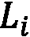是一个表示边 *i* 的尾部和末端节点的对。下面的屏幕截图提供了每种图形类型的边列表示例:


图 1.7–无向图、有向图、多重图和加权图的边列表

在下面的代码片段中，我们展示了如何在`networkx`中计算在*图 1.7* 中可用的简单无向图 *G* 的边列表:

```
print(nx.to_pandas_edgelist(G))
```

通过运行前面的命令，我们得到以下结果:

```
  source  target
0  Milan  Dublin
1  Milan    Rome
2  Paris   Milan
3  Paris  Dublin
```

其他表示方法，我们就不详细讨论了，在`networkx`中也有。其中一些例子是`nx.to_dict_of_dicts(G)`和`nx.to_numpy_array(G)`。

# 绘制图表

正如我们在前面章节中看到的，图形是用图形表示的直观数据结构。节点可以绘制成简单的圆，而边是连接两个节点的线。

尽管它们很简单，但是当边和节点的数量增加时，很难清楚地表示出来。这种复杂性的来源主要与在最终绘图中分配给每个节点的位置(空间/笛卡尔坐标)有关。事实上，手动为具有数百个节点的图形指定每个节点在最终绘图中的具体位置是不可行的。

在本节中，我们将看到如何在不指定每个节点坐标的情况下绘制图形。我们将利用两种不同的解决方案:`networkx`和 Gephi。

## 网络 x

`networkx`通过`nx.draw`库提供了一个简单接口来绘制图形对象。在下面的代码片段中，我们展示了如何使用该库来绘制图形:

```
def draw_graph(G, nodes_position, weight):
      nx.draw(G, pos_ position, with_labels=True, font_size=15, node_size=400, edge_color='gray', arrowsize=30)
             if plot_weight:
             edge_labels=nx.get_edge_attributes(G,'weight')
         nx.draw_networkx_edge_labels(G, pos_ position, edge_labels=edge_labels)
```

这里，`nodes_position`是一个字典，其中键是节点，分配给每个键的值是一个长度为 2 的数组，笛卡尔坐标用于绘制特定节点。

`nx.draw`函数将把它的节点放在给定的位置来绘制整个图形。`with_labels`选项将用特定的`font_size`值将其名称标在每个节点的顶部。`node_size`和`edge_color`将分别指定圆的大小，代表节点和边的颜色。最后，`arrowsize`将为有向边定义箭头的大小。当要绘制的图形是有向图时，将使用此选项。

在下面的代码示例中，我们展示了如何使用之前定义的`draw_graph`函数来绘制图形:

```
G = nx.Graph()
V = {'Paris', 'Dublin','Milan', 'Rome'}
E = [('Paris','Dublin', 11), ('Paris','Milan', 8),
     ('Milan','Rome', 5), ('Milan','Dublin', 19)]
G.add_nodes_from(V)
G.add_weighted_edges_from(E)
node_position = {"Paris": [0,0], "Dublin": [0,1], "Milan": [1,0], "Rome": [1,1]}
draw_graph(G, node_position, True)
```

在下面的屏幕截图中可以看到绘图的结果:


图 1.8–绘图功能的结果

前面描述的方法很简单，但在实际场景中不可行，因为`node_position`值可能很难确定。为了解决这个问题，`networkx`提供了不同的函数，根据不同的布局自动计算每个节点的位置。在*图 1.9* 中，我们展示了一个无向图的一系列图，这些图是使用`networkx`中可用的不同布局获得的。为了在我们提出的函数中使用它们，我们只需要将`node_position`分配给我们想要使用的布局的结果，例如`node_position = nx.circular_layout(G)`。这些情节可以在下面的截图中看到:


图 1.9-不同布局的同一个无向图

`networkx`是一个很好的工具，可以很容易地操作和分析图形，但是它没有提供很好的功能来执行复杂和好看的图形绘制。在下一节中，我们将研究另一个执行复杂图形可视化的工具:Gephi。

## Gephi

在本节中，我们将展示`Les Miserables.gexf`如何采样(一个加权无向图)，当应用程序启动时，可以在**欢迎**窗口中选择哪个。

Gephi 的主界面如图*图 1.10* 所示。它可以分为四个主要区域，如下所示:

1.  **图形**:该部分显示图形的最终绘图。每次应用滤镜或特定布局时，图像都会自动更新。
2.  **外观**:这里可以指定节点和边的外观。
3.  `networkx`)来调整图中的节点位置。不同的算法，从简单的随机位置发生器到更复杂的胡一帆算法，都是可用的。
4.  **Filters & Statistics**: In this set area, two main functions are available, outlined as follows:

    a.**过滤器**:在该选项卡中，可以根据使用**统计**选项卡计算的设置属性，过滤并可视化图形的特定子区域。

    b.**统计**:该选项卡包含可用图表指标的列表，可使用**运行**按钮在图表上计算这些指标。一旦计算出度量，就可以将它们用作属性来指定边和节点的外观(例如节点和边的大小和颜色)，或者过滤图形的特定子区域。

    你可以在下面的截图中看到 Gephi 的主界面:


图 1.10–ge phi 主窗口

我们对 Gephi 的探索从对图形应用不同的布局开始。如前所述，在`networkx`中，布局允许我们在最终图中给每个节点分配一个特定的位置。在 Gephi 1.2 中，可以使用不同的布局。为了应用特定的布局，我们必须从**布局**区域选择一个可用布局，然后点击选择后出现的**运行**按钮。

在**图形**区域可见的图形表示将根据布局定义的新坐标自动更新。需要注意的是，有些布局是参数化的，因此最终的图形会根据所使用的参数而发生显著变化。在下面的屏幕截图中，我们提出了三种不同布局应用的几个示例:


图 1.11–不同布局的同一图表的绘图

我们现在将介绍在*图 1.10* 中可见的**外观**菜单中的可用选项。在此部分中，可以指定要应用于边和节点的样式。要应用的样式可以是静态的，也可以由节点/边的特定属性动态定义。我们可以通过选择菜单中的**节点**选项来改变节点的颜色和大小。

为了改变颜色，我们必须选择调色板图标，并使用特定的按钮决定，如果我们想要分配一种**独特的**颜色，一种**分区**(离散值)，或者一种**等级**(值的范围)的颜色。对于**分区**和**等级**，可以从下拉菜单中选择一个特定的**图形**属性作为颜色范围的参考。下拉菜单中只有通过点击**统计**区的**运行**计算的属性可用。可以使用相同的程序来设置节点的大小。通过选择同心圆图标，可以为所有节点设置一个唯一的**大小，或者根据特定属性指定一个大小的**等级**。**

至于节点，也可以通过选择菜单中的**边缘**选项来改变边缘的样式。然后，我们可以选择分配一种**独特的**颜色、一种**分区**(离散值)或一种**颜色等级**(值的范围)。对于**分区**和**等级**，构建色标的参考值由可从下拉菜单中选择的特定**图形**属性定义。

重要的是要记住，为了将特定的样式应用于图表，应点击**应用**按钮。因此，图表将根据定义的样式进行更新。在下面的屏幕截图中，我们显示了一个示例，其中节点的颜色由**模块性类**值给出，每个节点的大小由其度数给出，而每个边的颜色由边权重定义:


图 1.12–改变节点和边外观的图表示例

另一个需要描述的重要部分是**过滤器&统计**。在这个菜单中，可以根据 g 图度量计算一些统计数据。

最后，我们通过介绍**统计**菜单中可用的功能来结束对 Gephi 的讨论，这些功能在*图 1.10* 的右侧面板中可见。通过此菜单，可以在输入图上计算不同的统计数据。这些统计数据可以很容易地用于设置最终绘图的一些属性，如节点/边的颜色和大小，或者过滤原始图形以绘制它的特定子集。为了计算特定的统计数据，用户需要明确选择菜单中可用的指标之一，并点击**运行**按钮(*图 1.10* ，右侧面板)。

此外，用户可以使用 **Statistics** 菜单的 **Filters** 选项卡中的选项选择图表的子区域，这些选项在*图 1.10* 的右侧面板中可见。过滤图形的示例见*图 1.13* 。为了提供更多的细节，我们使用 **Degree** 属性构建了一个过滤器，并应用到图表中。过滤器的结果是原始图形的子集，其中只有具有特定范围的 degree 属性值的节点(及其边)是可见的。

这是下面截图中的图示:


图 1.13–根据度数值范围过滤的图表示例

当然，Gephi 允许我们执行更复杂的可视化任务，并且包含了本书无法完全涵盖的许多功能。为了更好地研究 Gephi 中所有可用的特性，一些很好的参考资料是Gephi 官方指南([https://gephi.org/users/](https://gephi.org/users/))或由 Packt 出版社出版的 *Gephi 食谱*书。

# 图形属性

正如我们已经了解到的,*图*是一种数学模型，用于描述实体之间的关系。然而，每一个复杂的网络都有其固有的特性。这样的属性可以通过特定的度量来测量，并且每个度量可以表征该图的一个或几个局部和全局方面。

例如，在 Twitter 等社交网络的图中，用户(由图中的*节点*表示)相互连接。然而，有些用户比其他人(影响者)联系更紧密。在 Reddit 社交图上，具有相似特征的用户倾向于组成社区。

我们已经提到了图的一些*基本特征*，比如一个图的节点数*和边数*，它们构成了图本身的大小。这些性质已经很好地描述了网络的结构。例如，考虑一下脸书图:它可以用节点和边的数量来描述。这样的数字很容易让它与一个小得多的网络区分开来(例如，一个办公室的社会结构)，但却无法表征更复杂的动态(例如，*相似的*节点是如何连接的)。为此，可以考虑更高级的图派生**指标**，这些指标可以分为四个主要类别，概述如下:

*   **集成度量**:这些度量节点如何趋向于相互连接。
*   **分离度量**:这些量化网络中互连节点组的存在，称为社区或模块。
*   **中心性度量**:这些评估网络中各个节点的重要性。
*   **弹性指标**:这些可以被认为是网络在面临故障或其他不利条件时能够保持和适应其操作性能的程度的度量。

当表达对整个网络的测量时，这些指标被定义为全局指标。另一方面，**局部**度量测量单个网络元素(节点或边)的值。在加权图中，每个属性可能或可能不考虑*边权重*，导致**加权和未加权度量**。

在下一节中，我们将描述一些最常用的度量全局和局部属性的指标。为了简单起见，除非文中有不同的说明，否则我们将说明该指标的全局未加权版本。在一些情况下，这是通过平均节点的局部未加权属性来获得的。

## 集成指标

在本节中，将描述一些最常用的集成指标。

### 距离、路径和最短路径

图中**距离**的概念通常与从给定源节点到达目标节点要经过的边数有关。

特别地，考虑源节点和目标节点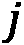。将节点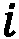连接到节点 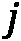的边集合称为**路径**。在研究复杂网络时，我们往往对寻找**两个节点之间的**最短路径感兴趣。源节点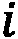和目标节点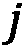之间的最短路径是与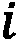和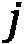之间的所有可能路径相比具有最少边数的路径。网络的**直径**是所有可能最短路径中最长最短路径包含的边数。

看看下面的截图。从都柏林到东京有不同的路径。然而，其中一个是最短的(在最短路径上的边被突出显示):


图 1.14–两个节点之间的最短路径

`networkx` Python 库的`shortest_path`函数使用户能够快速计算图中两个节点之间的最短路径。考虑下面的代码，其中使用`networkx`创建了一个七节点图:

```
G = nx.Graph()
nodes = {1:'Dublin',2:'Paris',3:'Milan',4:'Rome',5:'Naples',
         6:'Moscow',7:'Tokyo'}
G.add_nodes_from(nodes.keys())
G.add_edges_from([(1,2),(1,3),(2,3),(3,4),(4,5),(5,6),(6,7),(7,5)])
```

源节点(例如`'Dublin'`，由关键字 1 标识)和目标节点(例如`'Tokyo'`，由关键字 7 标识)之间的最短路径可以如下获得:

```
path = nx.shortest_path(G,source=1,target=7)
```

这应该输出以下内容:

```
[1,3,4,5,6]
```

这里，`[1,3,4,5,7]`是包含在`'Tokyo'` 和`'Dublin'`之间的最短路径中的节点。

### 特征路径长度

**特征路径长度**被定义为所有可能节点对之间所有最短路径长度的平均值。如果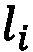是节点 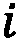和所有其他节点之间的平均路径长度，则特征路径长度计算如下:

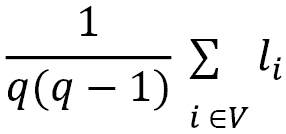

这里，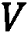是图中节点的集合，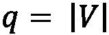代表其*顺序*。这是衡量信息在网络中传播效率的最常用方法之一。具有较短特征路径长度的网络促进了信息的快速传输并降低了成本。特征路径长度可通过`networkx`使用以下函数计算:

```
nx.average_shortest_path_length(G)
```

这应该给我们提供以下信息:

```
2.1904761904761907
```

然而，由于不可能计算出*不连通图*中所有节点之间的路径，因此该度量不能总是被定义。正因如此，**网络效率**也被广泛使用。

### 全局和局部效率

**全局效率**是所有节点对的最短路径长度倒数的平均值。这种度量可以被看作是对网络中信息交换效率的一种度量。考虑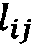是节点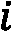和节点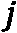之间的最短路径。网络效率定义如下:

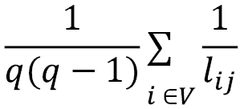

当一个图是完全连通的时，效率是最大的，而对于完全不连通的图，效率是最小的。直观上，路径越短，测度越低。

`networkx`使用以下命令:

```
nx.global_efficiency(G)
```

输出应该如下所示:

```
0.6111111111111109
```

使用以下命令在`networkx`中计算平均本地效率:

```
nx.local_efficiency(G)
```

输出应该如下所示:

```
0.6666666666666667
```

在下面的屏幕截图中，描绘了两个图形示例。正如所观察到的，左边的全连通图与右边的圆形图相比呈现出更高的效率水平。在全连通图中，每个节点都可以从图中的任何其他节点到达，信息可以通过网络快速交换。但是，在圆形图中，应该遍历几个节点才能到达目标节点，这样会降低效率:


图 1.15-全连通图(左)和圆形图(右)的全局效率

集成指标很好地描述了节点之间的联系。然而，通过考虑隔离度量，可以提取关于组的存在的更多信息。

## 分离指标

在本节中，将描述一些最常见的分离指标。

### 聚类系数

`networkx`使用以下命令:

```
nx.average_clustering(G)
```

这将输出以下内容:

```
0.6666666666666667
```

使用以下命令在`networkx`中计算局部聚类系数:

```
nx.clustering(G)
```

这将输出以下内容:

```
{1: 1.0,
 2: 1.0,
 3: 0.3333333333333333,
 4: 0,
 5: 0.3333333333333333,
 6: 1.0,
 7: 1.0}
```

输出是一个 Python 字典，包含每个节点(由各自的键标识)的对应值。在图 1.16 的*所示的图形中，两个节点集群可以很容易识别。通过计算每个单个节点的聚类系数，可以观察到**罗马**具有最低值。**东京**和**莫斯科**以及**巴黎**和**都柏林**在他们各自的组内反而联系得非常好(注意每个节点的大小是按照每个节点的聚类系数成比例绘制的)。该图可以在下面的截图中看到:*


图 1.16-局部聚类系数表示

### 转移性

聚类系数的常见变体称为`networkx`，如下所示:

```
nx.transitivity(G)
```

输出应该如下所示:

```
0.5454545454545454
```

### 模块性

**模块化**旨在量化高度互联节点集合中的网络划分，通常称为**模块**、**社区**、**群组**或**集群**。主要思想是，具有高模块化的网络将显示模块内的密集连接和模块间的稀疏连接。

考虑一个社交网络，比如 Reddit:与视频游戏相关的社区成员倾向于与同一社区的其他用户进行更多的互动，谈论最近的新闻、最喜欢的游戏机等等。然而，他们可能会与谈论时尚的用户互动较少。与许多其他图度量不同，模块性通常通过优化算法来计算。

使用`networkx.algorithms.community`模块的`modularity`函数计算`networkx`中的模块性，如下所示:

```
import networkx.algorithms.community as nx_comm
nx_comm.modularity(G, communities=[{1,2,3}, {4,5,6,7}])
```

这里，第二个参数——`communities`——是一个集合列表，每个集合代表图的一个部分。输出应该如下所示:

```
0.3671875
```

分离度量有助于理解组的存在。然而，图中的每个节点都有自己的重要性。为了量化它，我们可以使用中心性度量。

## 中心性度量

在本节中，将描述一些最常见的中心性指标。

### 程度中心性

最常见和简单的中心性指标之一是**度中心性**指标。这是与一个节点的*度*直接相连，测量某个节点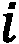上*关联*边的个数。

直观地，一个节点与另一个节点连接得越多，它的度中心性将呈现更高的值。注意，如果一个图形被*指向*，则`networkx`通过使用以下命令:

```
nx.degree_centrality(G)
```

输出应该如下所示:

```
{1: 0.3333333333333333, 2: 0.3333333333333333, 3: 0.5, 4: 0.3333333333333333, 5: 0.5, 6: 0.3333333333333333, 7: 0.3333333333333333}
```

### 接近中心性

**接近中心性**度量试图量化一个节点与其他节点的接近程度(良好连接)。更正式的说法是指网络中一个节点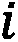到所有其他节点的平均距离。如果是节点和节点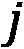之间的最短路径，则亲密度中心性定义如下:

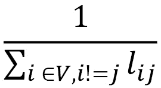

这里， *V* 是图中节点的集合。可以使用以下命令在`networkx`中计算接近度中心性:

```
nx.closeness_centrality(G)
```

输出应该如下:

```
{1: 0.4, 2: 0.4, 3: 0.5454545454545454, 4: 0.6, 5: 0.5454545454545454, 6: 0.4, 7: 0.4}
```

### 中间中心性

**中间中心性**度量评估一个节点在多大程度上充当其他节点之间的**桥梁**。即使连接不良，节点也可以战略性地连接，有助于保持整个网络的连接。

如果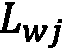是节点和节点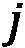之间的最短路径总数，而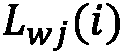是经过节点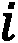的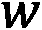和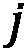之间的最短路径总数，则中间中心度定义如下:

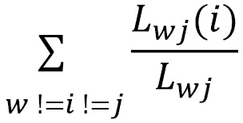

如果我们观察该公式，我们可以注意到通过节点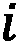的最短路径的数量越多，介数中心性的值就越高。使用以下命令在`networkx`中计算中间中心性:

```
nx.betweenness_centrality(G)
```

输出应该如下:

```
{1: 0.0, 2: 0.0, 3: 0.5333333333333333, 4: 0.6, 5: 0.5333333333333333, 6: 0.0, 7: 0.0}
```

在*图 1.17* 中，我们举例说明了*度中心性*、*接近中心性*和*中间中心性*的区别。**米兰**和**那不勒斯**的度中心性最高。罗马具有最高的接近中心性，因为它最接近任何其他节点。它还显示了最高的介数中心性，因为它在连接两个可见集群和保持整个网络连接方面起着至关重要的作用。

您可以在这里看到不同之处:


图 1.17-程度中心性(左)、接近中心性(中)和中间中心性(右)

中心性度量允许我们测量网络中节点的重要性。最后，我们将提到弹性度量，它使我们能够测量图的脆弱性。

## 弹性指标

有几个衡量网络弹性的指标。分类性是最常用的方法之一。

### 分类系数

`networkx`通过使用以下命令:

```
nx.degree_pearson_correlation_coefficient(G)
```

输出应该如下所示:

```
-0.6
```

社交网络大多是分类的。然而，所谓的*影响者*(著名歌手、足球运动员、时尚博主)往往会被几个标准用户*追随*(传入边缘)，同时倾向于相互联系，表现出一种异化行为。

需要注意的是，前面介绍的属性是用来描述图形的所有可能度量的子集。更多的指标和算法可以在[https://networkx . org/documentation/stable/reference/algorithms/](https://networkx.org/documentation/stable/reference/algorithms/)找到。

# 基准和存储库

既然我们已经理解了关于图和网络分析的基本概念和观念，现在是时候深入一些实际的例子来帮助我们开始将我们到目前为止所学的一般概念付诸实践了。在本节中，我们将介绍一些通常用于研究网络属性的示例和玩具问题，以及基准网络算法的性能和有效性。我们还将提供一些有用的知识库链接，在那里可以找到和下载网络数据集，以及一些关于如何解析和处理它们的提示。

## 简单图形的例子

我们从看一些非常简单的网络例子开始。幸运的是，`networkx` 已经提供了许多已经实现的图形，随时可以使用和处理。让我们从创建一个**全连通无向图**开始，如下:

```
complete = nx.complete_graph(n=7)
```

这有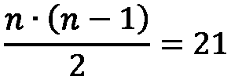条边和一个聚类系数 *C=1* 。尽管完全连通图本身并不十分有趣，但它们代表了可能在更大的图中出现的基本构件。在一个更大的图中， *n* 节点的全连通子图通常被称为大小为 *n* 的**团**。

定义

无向图中的**团**、 *C* 被定义为其顶点 *C* 、、 *V* 的子集，使得子集中的每两个不同的顶点是相邻的。这相当于 *C* 导出的 *G* 的导出子图是全连通图的条件。

集团是图论中的一个基本概念，通常也用于需要编码关系的数学问题中。此外，当构造更复杂的图形时，它们也代表最简单的单元。另一方面，在更大的图中寻找给定大小的团 *n* 的任务(团问题)是非常有趣的，并且可以表明这是计算机科学中经常研究的**非确定性多项式时间完全**(**NP-完全**)问题。

在下面的截图中可以看到一些简单的`networkx`图的例子:

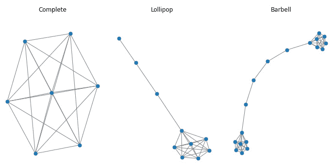

图 1.18-带有 networkx 的图的简单例子:(左)全连通图；(中间)棒棒糖图；(右)杠铃图

在*图 1.18* 中，我们展示了一个完整的图表以及另外两个简单的例子，其中包含可以通过`networkx`轻松生成的集团，概述如下:

*   一个**棒棒糖图**由大小为 *n* 的团和一个 *m* 节点的分支组成，如下面的代码片段所示:

    ```
    lollipop = nx.lollipop_graph(m=7, n=3)
    ```

*   一个**杠铃图**由大小为 *m1* 和 *m2* 的两个集团通过一个节点分支连接而形成，它类似于我们之前用来描述一些全局和局部属性的样本图。生成它的代码如下面的代码片段所示:

    ```
    barbell = nx.barbell_graph(m1=7, m2=4)
    ```

这种简单的图形是基本的构建模块，可以通过组合它们来生成更复杂的网络。使用`networkx`合并子图非常容易，只需几行代码就可以完成，如下面的代码片段所示，其中三个图被合并成一个图，并放置一些随机边来连接它们:

```
def get_random_node(graph):
    return np.random.choice(graph.nodes)
allGraphs = nx.compose_all([complete, barbell, lollipop])
allGraphs.add_edge(get_random_node(lollipop), get_random_node(lollipop))
allGraphs.add_edge(get_random_node(complete), get_random_node(barbell))
```

其他非常简单的图表(然后可以合并和使用)可以在[https://networkx . org/documentation/stable/reference/generators . html # module-networkx . generators . classic](https://networkx.org/documentation/stable/reference/generators.html#module-networkx.generators.classic)找到。

## 生成图模型

虽然创建简单的子图并合并它们是生成日益复杂的新图的一种方式，但是网络也可以通过**概率模型**和/或**生成模型**来生成，这些模型让图自己增长。这种图通常与真实网络共享有趣的属性，并长期用于创建基准和合成图，尤其是在可用数据量不像今天这样庞大的时候。在这里，我们展示了一些随机生成图的例子，简要描述了它们背后的模型。

### 瓦茨和斯特罗加茨(1998 年)

这个模型被作者用来研究**小世界网络**的行为——也就是说，在某种程度上类似于普通社交网络的网络。该图通过首先移动环中的 n 个节点并将每个节点与其 k 个邻居连接来生成。这样一个图的每条边都有一个概率 *p* 被重新连接到一个随机选择的节点。通过调整 p 的范围，Watts 和 Strogatz 模型允许从规则网络( *p=0* )转变为完全随机网络( *p=1* )。在两者之间，图形表现出小世界特征；也就是说，他们倾向于让这个模型更接近社交网络图。使用以下命令可以轻松创建这些类型的图表:

```
graph = nx.watts_strogatz_graph(n=20, k=5, p=0.2)
```

### 巴拉巴希-艾伯特(1999 年)

由 Albert 和 Barabási 提出的模型基于一种生成模型，该模型允许通过使用**优先连接**模式来创建随机无标度网络，其中网络是通过逐步添加新节点并将它们连接到现有节点来创建的，优先选择具有更多邻居的节点。从数学上来说，该模型的基本思想是，新节点附着到现有节点 *i* 的概率取决于第 *i* 个节点的度，根据以下公式:

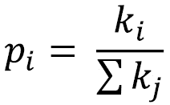

因此，具有大量边的节点(中心)倾向于发展甚至更多的边，而具有很少链接的节点将不会发展其他链接(外围)。由该模型生成的网络展示了节点之间连接性(即程度)的*幂律分布*。这种行为在真实网络(例如`networkx`)中也可以发现，它还允许新边的优先连接或现有边的重新布线。

Barabási-Albert 模型如下图所示:

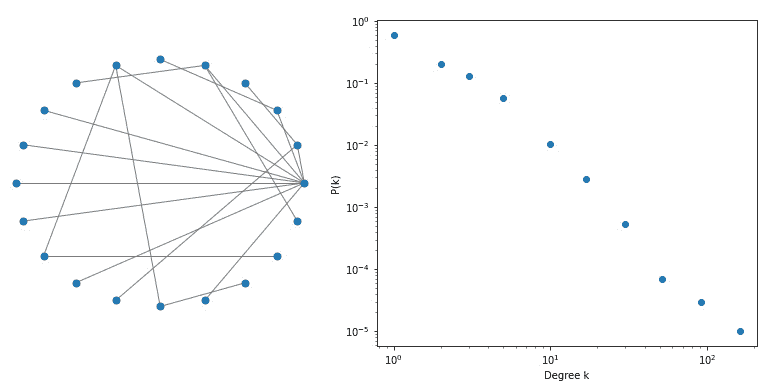

图 1.19–barabási-Albert 模型(左)具有 20 个节点(右)的连通性分布，n=100.000 个节点，显示了无标度幂律分布

在*图 1.19* 中，我们展示了一个小型网络的 Barabasi-Albert 模型的例子，其中你已经可以观察到枢纽的出现(在左边)，以及节点度的概率分布，这展示了无标度幂律行为(在右边)。前面的分布可以很容易地在`networkx`复制，如下所示:

```
ba_model = nx.extended_barabasi_albert_graph(n,m=1,p=0,q=0)
degree = dict(nx.degree(ba_model)).values()
bins = np.round(np.logspace(np.log10(min(degree)), np.log10(max(degree)), 10))
cnt = Counter(np.digitize(np.array(list(degree)), bins))
```

## 基准测试

数字化已经深刻地改变了我们的生活，今天，任何活动、个人或过程都会产生数据，提供大量的信息进行挖掘、分析，并用于促进数据驱动的决策。几十年前，很难找到可用于开发或测试新算法的数据集。另一方面，今天有大量的存储库为我们提供数据集，甚至是相当大的维度，以供下载和分析。人们可以在这些存储库中共享数据集，同时也为算法的应用、验证和相互比较提供了一个基准。

在本节中，我们将简要介绍网络科学中使用的一些主要存储库和文件格式，以便为您提供导入不同大小的数据集所需的所有工具，供您分析和使用。

在这样的存储库中，您会发现网络数据集来自网络科学的一些常见领域，如社交网络、生物化学、动态网络、文档、合著和引用网络，以及金融交易产生的网络。在*第 3 部分*、*图机器学习的高级应用*中，我们将讨论一些最常见的网络类型(社交网络、处理语料库文档时出现的图以及金融网络)，并通过应用*第 2 部分*、*图上的机器学习*中描述的技术和算法对它们进行更彻底的分析。

另外，`networkx`已经自带了一些基本的(也很小的)网络，一般用来解释算法和基本度量，可以在[https://networkx . org/documentation/stable/reference/generators . html # module-networkx . generators . social](https://networkx.org/documentation/stable/reference/generators.html#module-networkx.generators.social)找到。然而，这些数据集通常很小。对于更大的数据集，请参考我们接下来介绍的存储库。

### 网络数据仓库

**网络数据仓库**无疑是最大的【http://networkrepository.com/】网络数据仓库之一，拥有数千个不同的网络，拥有来自世界各地和顶级学术机构的用户和捐赠。如果网络数据集是免费提供的，您很可能会在那里找到它。数据集被分为大约 30 个领域，包括生物学、经济学、引文、社交网络数据、工业应用(能源、道路)以及许多其他领域。除了提供数据，该网站还提供了一个交互式可视化、探索和数据集比较的工具，我们建议您查看并探索它。

网络数据仓库中的数据一般以**矩阵市场交换格式** ( **MTX** )文件格式提供。MTX 文件格式基本上是一种通过可读的文本文件(**美国信息交换标准码**，或 **ASCII** )来指定实矩阵或复矩阵的文件格式。更多详情请参考[http://math.nist.gov/MatrixMarket/formats.html#MMformat](http://math.nist.gov/MatrixMarket/formats.html#MMformat)。

使用`scipy`可以很容易地在 Python 中读取 MTX 格式的文件。我们从网络数据仓库下载的一些文件看起来有轻微的损坏，需要在 10.15.2 OSX 系统上进行最小的修复。为了修复它们，只需确保文件头符合格式规范；也就是说，在行首有一个双`%`并且没有空格，如下行所示:

```
%%MatrixMarket matrix coordinate pattern symmetric 
```

矩阵应该是坐标格式。在这种情况下，规范也指向一个未加权的无向图(如`pattern`和`symmetric`所理解的)。有些文件在第一个标题行后有一些注释，前面有一个`%`。

作为一个例子，我们认为是**天体物理学** ( **ASTRO-PH** )合作网络。该图表是使用 1993 年 1 月至 2003 年 4 月期间发表在*天体物理学*类别中的电子出版物 *arXiv* 库中的所有科学论文生成的。该网络是通过连接(经由无向边)共同撰写出版物的所有作者来构建的，因此产生了包括给定论文的所有作者的集团。生成图表的代码如下所示:

```
from scipy.io import mmread
adj_matrix = mmread("ca-AstroPh.mtx")
graph = nx.from_scipy_sparse_matrix(adj_matrix)
```

数据集有 17，903 个节点，由 196，072 条边连接。可视化如此多的节点并不容易，即使我们这样做了，它也可能不会提供很多信息，因为理解底层结构对于如此多的信息来说并不容易。然而，我们可以通过查看特定的子图来获得一些见解，就像我们接下来要做的那样。

首先，我们可以从计算我们之前描述的一些基本属性开始，并将它们放入一个 pandas `DataFrame`中，以便于以后使用、排序和分析。实现这一点的代码如下面的代码片段所示:

```
stats = pd.DataFrame({
    "centrality": nx.centrality.betweenness_centrality(graph), 
    "C_i": nx.clustering(graph), 
    "degree": nx.degree(graph)
})
```

我们可以很容易地找出最大`6933`的节点，它有 503 个邻居(肯定是天体物理学中非常受欢迎和重要的科学家！)，如以下代码片段所示:

```
neighbors = [n for n in nx.neighbors(graph, 6933)]
```

当然，还标绘了的`C_i`值。完成此任务的代码如以下代码片段所示:

```
nTop = round(len(neighbors)*sampling)
idx = {
    "random": stats.loc[neighbors].sort_index().index[:nTop], 
    "centrality": stats.loc[neighbors]\
         .sort_values("centrality", ascending=False)\
         .index[:nTop],
    "C_i": stats.loc[neighbors]\
         .sort_values("C_i", ascending=False)\
         .index[:nTop]
}
```

然后，我们可以定义一个简单的函数来提取和绘制一个子图，该子图只包含与某些索引相关的节点，如下面的代码片段所示:

```
def plotSubgraph(graph, indices, center = 6933):
    nx.draw_kamada_kawai(
        nx.subgraph(graph, list(indices) + [center])
    )
```

使用前面的函数，我们可以绘制不同的子图，这些子图是通过使用三种不同的标准过滤 ego 网络而获得的，这三种不同的标准基于我们之前提出的随机采样、中心性和聚类系数。这里提供了一个示例:

```
plotSubgraph(graph, idx["random"]) 
```

在*图 1.20* 中，我们比较了通过将键值更改为`centrality`和`C_i`而获得的其他网络的结果。随机表示似乎显示了一些具有分离社区的新兴结构。具有最中心节点的图清楚地显示了一个几乎完全连接的网络，该网络可能由所有正教授和天体物理学中有影响力的人物组成，在多个主题上发表论文，并且彼此频繁合作。最后，另一方面，通过选择具有较高聚类系数的节点，最后的表示突出了一些可能与特定主题相关的特定社区。这些节点可能没有很大程度的中心性，但它们很好地代表了特定的主题。你可以在这里看到自我子图的例子:


图 1.20–ASTRO-PH 数据集中度数最大的节点的 ego 子图示例。以比率=0.1 对邻居进行采样。(左)随机抽样；具有最大介数中心性的(中心)节点；(右)聚类系数最大的节点

在`networkx`中可视化的另一个选择也可以是使用 *Gephi* 软件，该软件允许快速过滤和可视化图形。为此，我们需要首先将数据导出为**图形交换 XML 格式** ( **GEXF** )(这是一种可以在 Gephi 中导入的文件格式)，如下所示:

```
nx.write_gext(graph, "ca-AstroPh.gext")
```

一旦数据被导入到 Gephi 中，通过少量的过滤器(通过中心性或程度)和一些计算(模块性)，您可以很容易地绘制出如图*图 1.21* 所示的图形，其中节点使用模块性进行了着色，以突出集群。着色也使我们能够很容易地发现连接不同社区的节点，因此具有很大的介数。

网络数据存储库中的一些数据集也可能在`networkx`中可用，只需通过简单地重写其头来转换它们。举个例子，数字书目和图书馆网 ( **DBLP** )引文网。

在下面的截图中可以看到一个示例图:

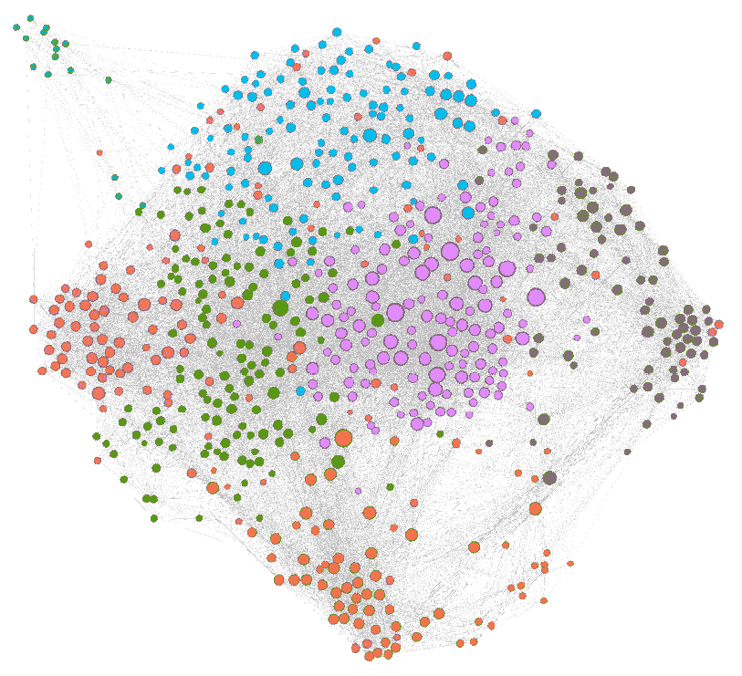

图 1.21–带有 Gephi 的可视化天文 PH 数据集示例。节点用度中心性过滤，用模块性类着色；节点大小与度数的值成比例

以下是文件头的代码:

```
% asym unweighted
% 49743 12591 12591 
```

通过用以下代码替换这些行，可以很容易地将其转换为符合 MTX 文件格式:

```
%%MatrixMarket matrix coordinate pattern general
12591 12591 49743 
```

然后，您可以使用前面描述的导入功能。

### 斯坦福大型网络数据集集合

另一个有价值的网络数据集来源是斯坦福网络分析平台的网站，该平台拥有数亿个节点和数十亿条边，是一个通用的网络分析库。它是用 *C++* 编写的，以实现最高的计算性能，但它也具有与 Python 的接口，以便导入并在本机 Python 应用程序中使用。

尽管`networkx`是目前研究`networkx`的主要库，SNAP 或其他库(稍后会有更多介绍)可能比`networkx`快几个数量级，它们可能会代替`networkx`用于需要更高性能的任务。在 SNAP 网站中，您会发现一个关于**生物医学网络数据集**([https://snap.stanford.edu/biodata/index.html](https://snap.stanford.edu/biodata/index.html))的特定网页，此外还有其他更一般的网络([https://snap.stanford.edu/data/index.html](https://snap.stanford.edu/data/index.html))，涵盖了与之前描述的网络数据存储库类似的领域和数据集。

数据通常在一个代码行中的`networkx`中提供，使用以下命令:

```
g = nx.read_edgelist("amazon0302.txt")
```

一些图形可能有额外的信息，而不是关于边。额外的信息作为一个单独的文件包含在数据集的档案中，例如，提供了节点的一些元数据，并通过 *id* 节点与图表相关。

也可以通过 Python 使用 SNAP 库及其接口直接读取图形。如果您的本地计算机上有 SNAP 的工作版本，您可以轻松地读取数据，如下所示:

```
from snap import LoadEdgeList, PNGraph
graph = LoadEdgeList(PNGraph, "amazon0302.txt", 0, 1, '\t')
```

请记住，此时，您将拥有 SNAP 库的一个`PNGraph`对象的实例，并且您不能直接在这个对象上使用`networkx`功能。如果你想使用一些`networkx`函数，你首先需要将`PNGraph`对象转换成`networkx`对象。为了使这一过程更简单，在本书的补充材料中(可在[https://github.com/PacktPublishing/Graph-Machine-Learning](https://github.com/PacktPublishing/Graph-Machine-Learning)获得)，我们编写了一些函数，允许您在`networkx`和 SNAP 之间无缝地来回切换，如以下代码片段所示:

```
networkx_graph = snap2networkx(snap_graph)
snap_graph = networkx2snap(networkx_graph) 
```

### 开放图形基准

这是 graph benchmark 领域的最新更新(日期为 2020 年 5 月),预计这个存储库在未来几年将获得越来越多的重视和支持。**开放图形基准**(**OGB**)已经被创建来解决一个特定的问题:与真实的应用相比，当前的基准实际上太小，对**机器学习** ( **ML** )的进步没有用处。一方面，一些在小数据集上开发的模型无法扩展到大数据集，证明它们不适合在现实世界中应用。另一方面，大型数据集也允许我们增加 ML 任务中使用的模型的容量(复杂性)，并探索新的算法解决方案(如神经网络)，这些解决方案可以受益于大样本量的有效训练，使我们能够实现非常高的性能。这些数据集属于不同的领域，它们已按三种不同的数据集大小(小型、中型和大型)进行了排名，其中小型图尽管有其名称，但已经有超过 100，000 个节点和/或超过 100 万条边。另一方面，大型图的特征是具有超过 1 亿个节点和超过 10 亿条边的网络，这促进了可扩展模型的开发。

除了数据集之外，OGB 还以一种 *Kaggle 方式*提供了一个端到端的 ML 管道，用于标准化数据加载、实验设置和模型评估。OGB 创建了一个相互比较和评估模型的平台，发布了一个*排行榜*，允许跟踪节点、边和图形属性预测的特定任务的性能演变和进步。有关数据集和 OGB 项目的更多详情，请参考 https://arxiv.org/pdf/2005.00687.pdf。

# 处理大型图表

在处理使用案例或分析时，了解我们关注的数据有多大或未来会有多大是非常重要的，因为数据集的规模很可能会影响我们使用的技术和我们可以进行的分析。正如已经提到的，在小数据集上开发的一些方法很难扩展到现实世界的应用程序和更大的数据集，这使得它们在实践中毫无用处。

当处理(可能)大型图形时，了解我们使用的工具、技术和/或算法的潜在瓶颈和限制，评估当增加节点或边的数量时我们的应用/分析的哪一部分可能无法扩展，这是至关重要的。更重要的是，构建一个数据驱动的应用程序是至关重要的，无论多么简单或处于早期的概念验证阶段，这种方式允许在未来数据/用户增加时向外扩展，而无需重写整个应用程序。

创建一个诉诸图形表示/建模的数据驱动的应用程序是一项具有挑战性的任务，它需要的设计和实现比简单地导入`networkx`要复杂得多。特别是，将处理图形的组件(名为**图形处理引擎**)与允许查询和遍历图形的组件(名为**图形存储层**)分离开来通常是有用的。我们将在 [*第 9 章*](B16069_09_Final_JM_ePub.xhtml#_idTextAnchor141) 、*构建数据驱动的草稿驱动应用*中进一步讨论这些概念。尽管如此，考虑到本书对 ML 和分析技术的关注，更关注图形处理引擎而不是图形存储层是有意义的。因此，我们发现在这个阶段向您提供一些用于图形处理引擎处理大型图形的技术是非常有用的，这在扩展应用程序时至关重要。

在这方面，重要的是将图形处理引擎分为两类(影响要使用的工具/库/算法)，这取决于图形是否适合*共享内存机器*或需要*分布式架构*进行处理和分析。

请注意，大图和小图没有绝对的定义，但这也取决于所选择的架构。如今，由于基础设施的垂直扩展，您可以找到具有大于 1**TB**(**TB**)的**随机存取内存** ( **RAM** )(通常称为*胖节点*)的服务器，以及在大多数云提供商产品中用于多线程的数万个**中央处理单元**(**CPU**)，尽管这些基础设施可能在经济上不可行。即使没有扩展到如此极端的体系结构，具有数百万个节点和数千万条边的图仍然可以在大约 100 **千兆字节**(**GB**)RAM 和大约 50 个 CPU 的单个服务器上轻松处理。

虽然`networkx`是一个非常流行、用户友好、直观的库，但是当扩展到如此大的图形时，它可能不是最佳选择。`networkx`是用纯 Python(一种解释型语言)原生编写的，其性能远远优于完全或部分用更高性能的编程语言(如 C++和 Julia)编写的其他图形引擎，并利用了多线程，如下所示:

*   **SNAP**([http://snap.stanford.edu/](http://snap.stanford.edu/))我们在上一节已经看到了，它是一个在斯坦福开发的图形引擎，用 C++编写，Python 中有可用的绑定。
*   igraph([https://igraph.org/](https://igraph.org/))是一个 C 库，具有 Python、R 和 Mathematica 中的绑定功能。
*   **graph-tool**([https://graph-tool.skewed.de/](https://graph-tool.skewed.de/))尽管是一个 Python 模块，但它拥有用 C++编写的核心算法和数据结构，并使用 OpenMP 并行化来扩展多核架构。
*   **network it**([https://networkit.github.io/](https://networkit.github.io/))也是用 C++编写的，OpenMP boost 用于其核心功能的并行化，集成在一个 Python 模块中。
*   `networkx`性能更高、更强大的库中的功能。

当实现更好的性能成为一个问题时，所有前面的库都是`networkx`的有效替代。改进可能非常显著，速度提高了 30 到 300 倍，最佳性能通常由 LightGraphs 实现。

在接下来的章节中，我们将主要关注`networkx`，以便提供一致的演示，并为用户提供网络分析的基本概念。我们希望您知道其他选项是可用的，因为从性能的角度来看，这变得非常重要。

# 总结

在这一章中，我们更新了一些概念，如图、节点和边。我们回顾了图形*表示*的方法，并探索了如何*可视化*图形。我们还定义了*属性*，用于描述网络或者网络的一部分。

我们通过一个知名的 Python 库来处理图，`networkx`，学习如何使用它将理论概念应用到实践中。

然后，我们运行了一些例子和玩具问题，这些问题通常用于研究网络的属性，以及网络算法的基准性能和有效性。我们还为您提供了一些有用的存储库链接，在那里可以找到和下载网络数据集，以及一些关于如何解析和处理它们的提示。

在下一章中，我们将超越在图上定义 ML 的概念。我们将学习如何通过特定的 ML 算法自动发现更高级和潜在的属性。