<title>B16069_02_Final_JM_ePub</title>

# 第二章:图机器学习

**机器学习**是人工智能的子集，旨在为系统提供*学习*并从数据中改进的能力。它在许多不同的应用中取得了令人印象深刻的结果，特别是在很难或不可行显式定义规则来解决特定任务的情况下。例如，我们可以训练算法来识别垃圾邮件，将句子翻译成其他语言，识别图像中的对象，等等。

近年来，将机器学习应用于*图结构数据*的兴趣越来越大。这里，主要目标是自动学习合适的表示以进行预测，发现新的模式，并以相对于“传统”机器学习方法更好的方式理解复杂的动力学。

本章将首先回顾一些基本的机器学习概念。然后，将提供图形机器学习的介绍，特别关注**表示学习**。然后我们将分析一个实际的例子来引导你理解理论概念。

本章将涵盖以下主题:

*   机器学习的复习
*   什么是图上的机器学习，为什么它很重要？
*   在图形机器学习算法中导航的通用分类法

# 技术要求

在我们所有的练习中，我们将使用 Jupyter 笔记本和 *Python 3.8* 。以下是本章使用`pip`需要安装的 Python 库列表。例如，在命令行上运行`pip install networkx==2.5`，依此类推:

```
Jupyter==1.0.0
networkx==2.5
matplotlib==3.2.2
node2vec==0.3.3
karateclub==1.0.19
scipy==1.6.2
```

与本章相关的所有代码文件都可以在[https://github . com/packt publishing/Graph-Machine-Learning/tree/main/chapter 02](https://github.com/PacktPublishing/Graph-Machine-Learning/tree/main/Chapter02)获得。

# 理解图上的机器学习

在人工智能的分支中，**机器学习**是近年来最受关注的一个。指的是一类计算机算法，通过经验*自动学习和提高自己的技能，而不需要显式编程*。这种方法从大自然中获得灵感。想象一个运动员第一次面对一个新奇的动作:他们慢慢开始，小心翼翼地模仿教练的手势，尝试，犯错，再尝试。最终，他们会提高，变得越来越自信。

那么，这个概念如何转化为机器呢？本质上是一个优化问题。目标是找到一个数学模型，能够在特定任务中实现最佳性能。可以使用特定的性能指标来衡量性能(也称为损失函数或**成本函数**)。在一个普通的学习任务中，算法被提供了数据，可能是大量的数据。该算法使用这些数据迭代地为特定任务做出决策或预测。在每次迭代中，使用损失函数评估决策。产生的*误差*用于更新模型参数，希望这意味着模型将执行得更好。这个过程俗称**训练**。

更正式地说，让我们考虑一个特定的任务， *T* 和一个性能指标， *P* ，它允许我们量化一个算法在 *T* 上执行得有多好。根据 Mitchell (Mitchell et al .，1997)，如果一个算法在任务 *T* 中的性能(由 *P* 测量)随着经验 *E* 而提高，那么该算法被称为从经验 *E* 中学习。

## 机器学习的基本原理

机器学习算法分为三大类，被称为*监督*、*非监督*和*半监督*学习。这些学习范例取决于向算法提供数据的方式以及如何评估性能。

**监督学习**是当我们知道问题的答案时使用的学习范式。在这种情况下，数据集由形式为 *< x，y >* 的样本对组成，其中 *x* 是输入(例如，图像或语音信号)，而 *y* 是相应的期望输出(例如，图像代表什么或语音在说什么)。输入变量也被称为*特征*，而输出通常被称为*标签*、*目标*和*注释*。在监督设置中，通常使用*距离函数*来评估性能。该函数测量预测和预期输出之间的差异。根据标签的类型，监督学习可以进一步分为以下几种:

*   **分类**:这里标签是离散的，指输入所属的“类”。分类的例子是确定照片中的对象或者预测电子邮件是否是垃圾邮件。
*   **回归**:目标为连续。回归问题的例子有预测建筑物内的温度或预测任何特定产品的销售价格。

无监督学习不同于有监督学习，因为问题的答案是未知的。在这种情况下，我们没有任何标签，只提供了输入 *< x >* 。因此，目标是推断结构和模式，试图找到相似之处。

发现相似例子的组(聚类)是这些问题之一，以及在高维空间中给出数据的新表示。

在**半监督学习**中，使用标记和未标记数据的组合来训练算法。通常，为了指导对未标记输入数据中存在的结构的研究，使用有限量的标记数据。

另外值得一提的是**强化学习**用于训练机器学习模型做出决策序列。人工智能算法面临类似游戏的情况，根据执行的动作获得*惩罚*或*奖励*。算法的作用是理解如何行动以最大化奖励和最小化惩罚。

最小化上的误差光有训练数据是不够的。机器学习中的关键词是*学习*。这意味着算法必须能够达到相同的性能水平，即使是在看不见的数据上。评估机器学习算法泛化能力的最常见方式是将数据集分为两部分:训练集**和测试集**。模型在训练集上被训练，其中损失函数被计算并用于更新参数。训练后，在测试集上评估模型的性能。此外，当更多的数据可用时，测试集可以进一步分为验证**和**测试**集。验证集通常用于在训练期间评估模型的性能。******

当训练机器学习算法时，可以观察到三种情况:

*   在第一种情况下，模型在训练集上达到低水平的性能。这种情况通常被称为**欠匹配**，这意味着模型不够强大，不足以解决任务。
*   在第二种情况下，该模型在训练集上实现了高水平的性能，但在测试数据上难以一般化。这种情况称为**过拟合**。在这种情况下，模型只是记忆训练数据，而没有真正理解它们之间的真实关系。
*   最后，理想的情况是模型能够在训练和测试数据上实现(可能)最高水平的性能。

图 2.1 中的*风险曲线给出了一个过拟合和欠拟合的例子。从图中可以看出，训练集和测试集的性能如何根据模型的复杂性(要拟合的参数数量)而变化:*

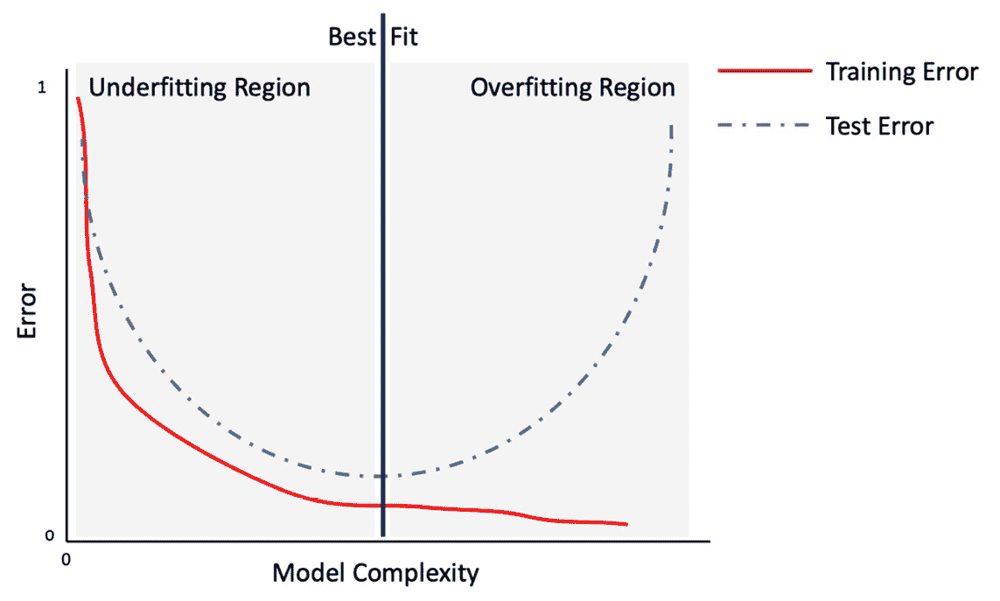

图 2.1–风险曲线描述了模型复杂性(模型参数数量)函数中训练和测试集误差的预测误差

过拟合是影响机器学习从业者的主要问题之一。发生这种情况有几个原因。一些原因可能如下:

*   数据集可能定义不清，或者不能充分代表任务。在这种情况下，添加更多数据有助于缓解问题。
*   用于解决这个问题的数学模型对这项任务来说太强大了。在这种情况下，可以将适当的约束添加到损失函数中，以降低模型的“功效”这样的约束被称为**正则化**项。

机器学习在许多领域取得了令人印象深刻的成果，成为计算机视觉、模式识别和自然语言处理等领域中最广泛和有效的方法之一。

## 机器学习对图形的好处

已经开发了几种机器学习算法，每种算法都有自己的优点和局限性。其中，值得一提的是回归算法(例如，线性和逻辑回归)、基于实例的算法(例如，k 近邻或支持向量机)、决策树算法、贝叶斯算法(例如，朴素贝叶斯)、聚类算法(例如，k 均值)和人工神经网络。

但是这一切成功的关键是什么呢？

本质上，有一点:机器学习可以自动处理人类容易完成的任务。这些任务可能太复杂，无法用传统的计算机算法来描述，在某些情况下，它们甚至表现出比人更好的能力。在处理图形时尤其如此，因为它们的结构复杂，与图像或音频信号相比，它们在许多方面都有所不同。通过使用图形机器学习，我们可以创建算法来自动检测和解释重复出现的潜在模式。

由于这些原因，人们对图结构数据的*学习表示*越来越感兴趣，并且已经开发了许多机器学习算法来处理图。例如，我们可能对确定蛋白质在生物交互图中的作用、预测协作网络的进化、在社交网络中向用户推荐新产品等感兴趣(我们将在 [*第 10 章*](B16069_10_Final_JM_ePub.xhtml#_idTextAnchor150) 、*图的未来*中讨论这些和更多应用)。

由于其性质，图表可以在不同的粒度级别进行分析:在节点、边和图表级别(整个图表)，如图*图 2.2* 所示。对于每个级别，可能会面临不同的问题，因此，应该使用特定的算法:


图 2.2-图形中三种不同粒度级别的可视化表示

在以下要点中，我们将给出这些级别中的每一个级别可能面临的机器学习问题的一些示例:

*   **节点级**:给定一个(可能很大的)图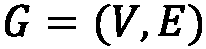，目标是将每个顶点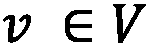分类到正确的类中。在此设置中，数据集包括 *G* 和一个对列表 *< vi，yi >* ，其中 *vi* 是图 *G* 的一个节点，*y*I 是该节点所属的类。
*   **边缘级别**:给定一个(可能很大的)图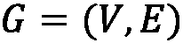，目标是将每个边缘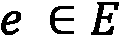分类到正确的类中。在这个设置中，数据集包括 *G* 和一个对列表*ei，yi >* ，其中 *ei* 是图 *G* 的一条边， *yi* 是该边所属的类。这一级别的粒度的另一个典型任务是**链接预测**，预测图中两个现有节点之间是否存在链接的问题。
*   **图级**:给定一个有 *m* 个不同图的数据集，任务是建立一个能够将图分类到正确类别的机器学习算法。然后，我们可以将这个问题视为一个分类问题，其中数据集由一组对定义， *< Gi，yi* *>* ，其中 *Gi* 是一个图， *yi* 是该图所属的类。

在本节中，我们讨论了机器学习的一些基本概念。此外，我们通过引入一些处理图形时常见的机器学习问题来丰富我们的描述。有了这些理论原则作为基础，我们现在将介绍一些与图形机器学习相关的更复杂的概念。

# 广义图嵌入问题

在经典的机器学习应用中，处理输入数据的一种常见方式是在一个称为**特征工程**的过程中从一组特征中构建，该过程能够给出数据集中存在的每个实例的紧凑且有意义的表示。

从特征工程步骤获得的数据集然后将被用作机器学习算法的输入。如果这一过程通常适用于大范围的问题，当我们处理图形时，它可能不是最佳解决方案。事实上，由于它们定义良好的结构，找到一个能够包含所有有用信息的合适的表示可能不是一件容易的事情。

第一种，也是最直接的，创建能够从图中表示结构信息的特征的方法是*提取某些统计数据*。例如，一个图可以用它的度分布、效率和我们在前一章中描述的所有度量来表示。

更复杂的过程包括应用特定的内核函数，或者在其他情况下，应用能够将期望的属性合并到最终机器学习模型中的工程特定特征。但是，正如您可以想象的那样，这个过程可能非常耗时，并且在某些情况下，模型中使用的特征可能只是为最终模型获得最佳性能所真正需要的信息的子集。

在过去的十年中，为了定义新的方法来创建有意义的和紧凑的图表示，人们做了大量的工作。所有这些方法背后的总体思想是创建能够*学习*原始数据集的良好表示的算法，以便新空间中的几何关系反映原始图形的结构。我们通常把学习一个给定图的良好表示的过程叫做**表示学习**或者**网络嵌入**。我们将提供一个更正式的定义如下。

**表征学习** ( **网络嵌入**)是旨在学习从离散图形到连续域的映射函数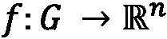的任务。函数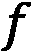将能够执行低维向量表示，使得图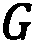的属性(局部和全局)被保留。

一旦映射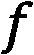被学习，它可以被应用到图中，并且产生的映射可以被用作机器学习算法的特征集。在*图 2.3* 中可以看到该过程的图形示例:


图 2.3–网络嵌入算法的工作流程示例

映射功能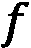也可用于学习节点和边的矢量表示。正如我们已经提到的，图上的机器学习问题可能发生在不同的粒度级别。因此，开发了不同的嵌入算法，以便学习生成节点(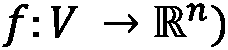(也称为节点嵌入)或边(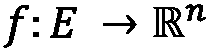)(也称为**边嵌入**)的矢量表示的函数。这些映射函数试图构建一个向量空间，使得新空间中的几何关系反映原始图形、节点或边的结构。因此，我们将看到，在原始空间中相似的图、节点或边在新空间中也将是相似的。

换句话说，在嵌入函数生成的空间中，相似的结构将具有*小的欧几里德距离*，而不相似的结构将具有*大的欧几里德距离*。重要的是要强调，虽然大多数嵌入算法在欧几里德向量空间中生成映射，但是最近对非欧几里德映射函数有了兴趣。

现在让我们看一个嵌入空间看起来像什么的实际例子，以及如何在新空间中看到相似性。在下面的代码块中，我们展示了一个使用称为**节点到向量** ( **节点 2Vec** )的特定嵌入算法的例子。我们将在下一章描述它是如何工作的。目前，我们只能说该算法将把图 *G* 的每个节点映射到一个向量中:

```
import networkx as nx
from node2vec import Node2Vec
import matplotlib.pyplot as plt
G = nx.barbell_graph(m1=7, m2=4)
node2vec = Node2Vec(G, dimensions=2)
model = node2vec.fit(window=10)
fig, ax = plt.subplots()
for x in G.nodes():
    v = model.wv.get_vector(str(x))
    ax.scatter(v[0],v[1], s=1000)
    ax.annotate(str(x), (v[0],v[1]), fontsize=12)
```

在前面的代码中，我们完成了以下工作:

1.  我们生成了一个杠铃图(在前一章中描述过)。
2.  然后使用 Node2Vec 嵌入算法，以便将图的每个节点映射到二维向量中。
3.  最后，绘制由嵌入算法生成的二维向量，表示原始图的节点。

结果如*图 2.4* 所示:


图 2.4–将 Node2Vec 算法应用于图(左)以生成其节点的嵌入向量(右)

从*图 2.4* 中很容易看出，结构相似的节点彼此靠近，而结构不相似的节点彼此远离。观察 Node2Vec 区分组 1 和组 3 的能力也很有趣。由于该算法使用每个节点的相邻信息来生成表示，因此可以清楚地区分这两个组。

可以使用**边到矢量** ( **Edge2Vec** )算法在中执行同一图形上的另一个示例，以便为同一图形的边生成映射 *G* :

```
from node2vec.edges import HadamardEmbedder
edges_embs = HadamardEmbedder(keyed_vectors=model.wv)
fig, ax = plt.subplots()
for x in G.edges():
    v = edges_embs[(str(x[0]), str(x[1]))]
    ax.scatter(v[0],v[1], s=1000)
    ax.annotate(str(x), (v[0],v[1]), fontsize=12)
```

在前面的代码中，我们完成了以下工作:

1.  我们生成了一个杠铃图(在前一章中描述过)。
2.  `HadamardEmbedder`嵌入算法应用于 Node2Vec 算法(`keyed_vectors=model.wv`)的结果，以便将图的每条边映射到二维向量中。
3.  最后，绘制由嵌入算法生成的代表原始图的节点的二维向量。

结果如*图 2.5* 所示:

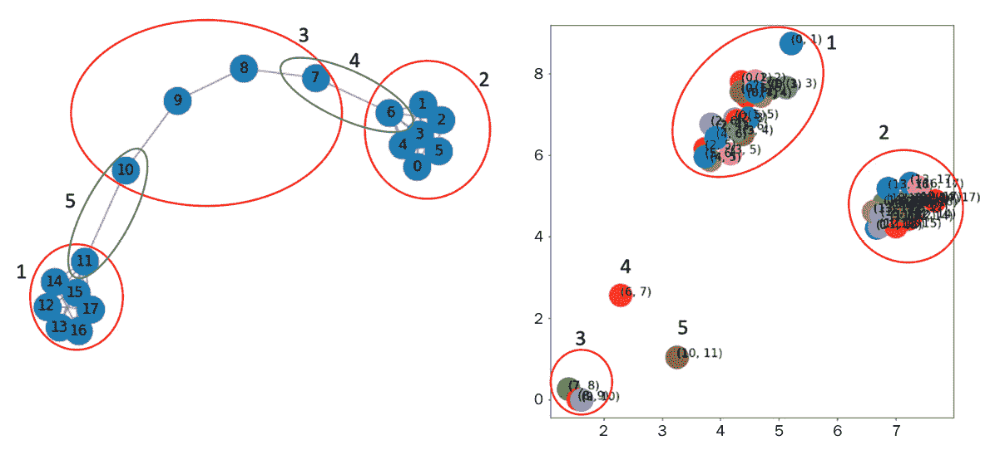

图 2.5–将 Hadamard 算法应用于图(左)以生成其边的嵌入向量(右)

至于节点嵌入，在*图 2.5* 中，我们报道了边嵌入算法的结果。从图中很容易看出，边缘嵌入算法清楚地识别相似的边缘。正如所预期的，属于组 1、2 和 3 的边聚集在明确定义和良好分组的区域中。此外，分别属于组 4 和组 5 的(6，7)和(10，11)边被很好地聚集在特定的组中。

最后，我们将提供一个图到矢量 ( **Grap2Vec** )嵌入算法的例子。该算法将单个图形映射到矢量中。至于另一个例子，我们将在下一章更详细地讨论这个算法。在下面的代码块中，我们提供了一个 Python 示例，展示了如何使用 Graph2Vec 算法在一组图形上生成嵌入表示:

```
import random
import matplotlib.pyplot as plt
from karateclub import Graph2Vec
n_graphs = 20
def generate_random():
    n = random.randint(5, 20)
    k = random.randint(5, n)
    p = random.uniform(0, 1)
    return nx.watts_strogatz_graph(n,k,p)
Gs = [generate_random() for x in range(n_graphs)]
model = Graph2Vec(dimensions=2)
model.fit(Gs)
embeddings = model.get_embedding()
fig, ax = plt.subplots(figsize=(10,10))
for i,vec in enumerate(embeddings):
    ax.scatter(vec[0],vec[1], s=1000)
    ax.annotate(str(i), (vec[0],vec[1]), fontsize=16)
```

在本例中，已经完成了以下工作:

1.  已经用随机参数生成了 20 瓦特-斯特罗加兹图(在前一章中描述过)。
2.  然后，我们执行了图形嵌入算法，以生成每个图形的二维矢量表示。
3.  最后，生成的向量被绘制在它们的欧几里得空间中。

本示例的结果如图*图 2.6* 所示:


图 2.6–graph 2 vec 算法生成的两个嵌入向量应用于 20 个随机生成的 Watts-Strogatz 图(左)。示出了具有大欧几里德距离的两个图(右上角的图 12 和图 8)和具有低欧几里德距离的两个图(右下角的图 14 和图 4)的提取

从*图 2.6* 中我们可以看到，欧几里德距离大的图，比如图 12 和图 8，有着不同的结构。前者由`nx.watts_strogatz_graph(20,20,0.2857)`参数生成，后者由`nx.watts_strogatz_graph(13,6,0.8621)`参数生成。相比之下，具有低欧几里德距离的图，例如图 14 和图 8，具有类似的结构。图表 14 由`nx.watts_strogatz_graph(9,9,0.5091)`命令生成，而图表 4 由`nx.watts_strogatz_graph(10,5,0.5659)`生成。

在科学文献中，已经开发了大量的嵌入方法。我们将在本书的下一节详细描述并使用其中的一些。这些方法通常分为两种主要类型:*直推式*和*感应式*，这取决于添加新样本时函数的更新程序。如果提供了新的节点，直推式方法更新模型(例如，重新训练)以推断关于节点的信息，而在归纳式方法中，模型被期望推广到在训练期间没有观察到的新节点、边或图。

# 图嵌入机器学习算法的分类

已经开发了各种各样的方法来生成图形表示的紧凑空间。近年来，已经观察到研究人员和机器学习实践者趋向于统一符号以提供描述这种算法的通用定义的趋势。在本节中，我们将介绍一个简化版的分类法，该分类法是在论文【图的机器学习:模型和综合分类法([https://arxiv.org/abs/2005.03675](https://arxiv.org/abs/2005.03675))中定义的。

在这种形式表示中，每个图、节点或边嵌入方法都可以用两个基本组件来描述，即编码器和解码器。**编码器** ( **ENC** )将输入映射到嵌入空间，而**解码器** ( **DEC** )从学习到的嵌入( *Figure 2.7* )中解码关于图形的结构信息。

该论文中描述的框架遵循一个直观的想法:如果我们能够对一个图进行编码，使得解码器能够检索所有必要的信息，那么嵌入必须包含所有这些信息的压缩版本，并且可以用于下游的机器学习任务:


图 2.7–嵌入算法的通用编码器(ENC)和解码器(DEC)架构

在许多用于表示学习的基于图的机器学习算法中，解码器通常被设计成将节点嵌入对映射到真实值，通常表示原始图中节点的接近度(距离)。例如，可以实现解码器，使得给定两个节点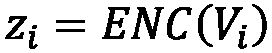和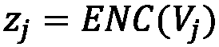、的嵌入表示，如果在输入图中存在连接两个节点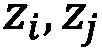的边。在实践中，可以使用更有效的*接近度函数*来测量节点之间的相似性。

## 嵌入算法的分类

受*图 2.7* 中描述的一般框架的启发，我们现在将各种嵌入算法分为四大组。此外，为了帮助您更好地理解这种分类，我们将用伪代码提供简单的代码快照。在我们的伪代码形式中，我们将`G`表示为一般的`networkx`图，将`graphs_list`表示为一列`networkx`图，将`model`表示为一般的嵌入算法:

*   `graphs_list`(第二行)。无监督和有监督的浅层嵌入方法将分别在 [*第三章*](B16069_03_Final_JM_ePub.xhtml#_idTextAnchor046) 、*无监督图学习*和 [*第四章*](B16069_04_Final_JM_ePub.xhtml#_idTextAnchor064) 、*有监督图学习*中描述。
*   `graphs_list`(第 1 行)。一旦模型适合输入训练集，就有可能使用它来生成新的看不见的图`G`的嵌入向量。图形自动编码方法将在 [*第三章*](B16069_03_Final_JM_ePub.xhtml#_idTextAnchor046) 、*无监督图形学习*中描述。
*   **Neighborhood aggregation methods**: These algorithms can be used to extract embeddings at the graph level, where nodes are labeled with some properties. Moreover, as for the graph autoencoding methods, the algorithms belonging to this class are able to learn a general mapping function, 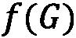, also capable of generating the embedding vector for unseen instances.

    这些算法的一个很好的特性是可以建立一个嵌入空间，其中不仅考虑了图的内部结构，还考虑了一些外部信息，定义为其节点的特性。例如，用这种方法，我们可以得到一个嵌入空间，它能够同时识别节点上具有相似结构和不同性质的图。无监督和有监督的邻域聚合方法将分别在 [*第三章*](B16069_03_Final_JM_ePub.xhtml#_idTextAnchor046) 、*无监督图学习*和 [*第四章*](B16069_04_Final_JM_ePub.xhtml#_idTextAnchor064) 、*有监督图学习*中描述。

*   **Graph regularization methods**: Methods based on graph regularization are slightly different from the ones listed in the preceding points. Here, we do not have a graph as input. Instead, the objective is to learn from a set of features by exploiting their "interaction" to regularize the process. In more detail, a graph can be constructed from the features by considering feature similarities. The main idea is based on the assumption that nearby nodes in a graph are likely to have the same labels. Therefore, the loss function is designed to constrain the labels to be consistent with the graph structure. For example, regularization might constrain neighboring nodes to share similar embeddings, in terms of their distance in the L2 norm. For this reason, the encoder only uses *X* node features as input.

    属于这个家族的算法学习一个函数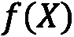，它将一组特定的特征(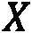)映射到一个嵌入向量。至于图自动编码和邻域聚合方法，该算法也能够将学习到的函数应用于新的、看不见的特征。图正则化方法将在 [*第四章*](B16069_04_Final_JM_ePub.xhtml#_idTextAnchor064) 、*监督图学习*中描述。

对于属于浅嵌入方法和邻域聚合方法组的算法，可以定义一个*非监督*和*监督*版本。属于图自动编码方法的算法适用于无监督任务，而属于图正则化方法的算法用于半监督/监督设置。

对于非监督算法，仅使用输入数据集中包含的信息(如节点、边或图)来嵌入特定数据集。对于监督设置，外部信息用于指导嵌入过程。这些信息通常被归类为一个标签，比如一对 *< Gi，yi >* ，它们为每个图分配一个特定的类别。该过程比无监督的过程更复杂，因为该模型试图找到最佳矢量表示，以便找到标签到实例的最佳分配。为了澄清这个概念，我们可以考虑，例如，用于图像分类的*卷积神经网络*。在训练过程中，神经网络试图通过同时执行各种卷积滤波器的拟合，将每幅图像分类到正确的类别中。这些卷积滤波器的目标是找到输入数据的紧凑表示，以便最大化预测性能。同样的概念也适用于监督图嵌入，其中算法试图找到最佳的图表示，以便最大化类分配任务的性能。

从更加的数学角度来看，所有这些模型都用一个适当的损失函数来训练。这个函数可以用两个术语来概括:

*   第一种用于监督设置，以最小化预测和目标之间的差异。
*   第二个用于评估输入图和在 ENC + DEC 步骤之后重建的图之间的相似性(这是结构重建误差)。

形式上，它可以定义如下:

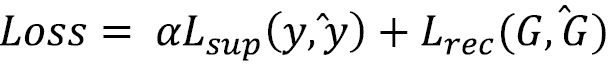

这里，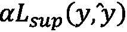是监督设置中的损失函数。该模型被优化以最小化每个实例的正确类别(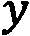)和预测类别(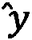)之间的误差。是表示输入图(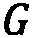)和在 ENC + DEC 处理(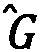)之后获得的图之间的重构误差的损失函数。对于无监督的设置，我们有相同的损失，但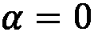，因为我们没有目标变量使用。

当我们试图解决图上的机器学习问题时，强调这些算法的主要作用是很重要的。它们可以被动地用于将图形转换成适合经典机器学习算法或数据可视化任务的特征向量。但是它们也可以在学习过程中积极使用*，在学习过程中，机器学习算法会找到一个针对特定问题的简洁而有意义的解决方案。*

 *# 总结

在这一章中，我们刷新了一些基本的*机器学习*概念，并发现了它们如何应用于图形。我们定义了基本的*图形机器学习*术语，特别关注*图形表示学习*。介绍了主要图形机器学习算法的分类，以阐明多年来开发的各种解决方案之间的区别。最后，提供了实际例子来开始理解如何将理论应用于实际问题。

在下一章，我们将修改主要的基于图的机器学习算法。我们将分析它们的行为，看看如何在实践中使用它们。*