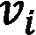
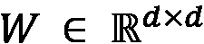
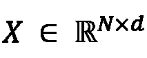

# 三、无监督图学习

无监督机器学习是指在训练期间不利用任何目标信息的机器学习算法的子集。相反，他们靠自己去寻找聚类，发现模式，检测异常，并解决许多其他没有老师也没有先验正确答案的问题。

正如许多其他机器学习算法一样，无监督模型在图表示学习领域有着广泛的应用。事实上，它们是解决各种下游任务的非常有用的工具，例如节点分类和社区检测等。

在这一章中，将概述最近的无监督图嵌入方法。给定一个图，这些技术的目标是自动学习它的潜在表示，其中关键的结构组件以某种方式保留下来。

本章将涵盖以下主题:

*   无监督图嵌入路线图
*   浅层嵌入方法
*   自动编码器
*   图神经网络

# 技术要求

我们将在所有练习中使用 Python 3.9 版的 Jupyter 笔记本。以下是本章使用`pip`需要安装的 Python 库列表。例如，在命令行上运行`pip install networkx==2.5`，依此类推:

```
Jupyter==1.0.0
networkx==2.5
matplotlib==3.2.2
karateclub==1.0.19
node2vec==0.3.3
tensorflow==2.4.0
scikit-learn==0.24.0
git+https://github.com/palash1992/GEM.git
git+https://github.com/stellargraph/stellargraph.git
```

在本书的其余部分，如果没有明确说明，我们将把 Python 命令`import networkx`称为`nx`。

与本章相关的所有代码文件都可以在[https://github . com/packt publishing/Graph-Machine-Learning/tree/main/chapter 03](https://github.com/PacktPublishing/Graph-Machine-Learning/tree/main/Chapter03)获得。

# 无监督图嵌入路线图

图是定义在非欧几里得空间中的复杂数学结构。粗略地说，这意味着定义什么接近什么并不总是容易的；可能也很难说*关闭*意味着什么。想象一个社交网络图:两个用户可以分别连接，但共享非常不同的功能——一个可能对时尚和服装感兴趣，而另一个可能对体育和视频游戏感兴趣。我们能认为他们是“亲密”的吗？

由于这个原因，无监督的机器学习算法在图分析中得到了广泛的应用。无监督机器学习是一类无需人工标注数据即可训练的机器学习算法。这些模型中的大多数确实只利用了邻接矩阵和节点特征中的信息，而没有下游机器学习任务的任何知识。

这怎么可能呢？最常用的解决方案之一是学习保持图结构的嵌入。学习到的表示通常被优化，以便它可以用于重建成对节点相似性，例如**邻接矩阵**。这些技术带来了一个重要的特征:学习到的表示可以对节点或图之间的潜在关系进行编码，从而允许我们发现隐藏和复杂的新模式。

已经开发了许多与无监督图机器学习技术相关的算法。然而，正如不同的科学论文([https://arxiv.org/abs/2005.03675](https://arxiv.org/abs/2005.03675))之前所报道的那样，这些算法可以分为几个宏组:浅层嵌入方法、自动编码器和**图神经网络** ( **GNNs** )，如下图中的图所示:


图 3.1–本书中描述的不同无监督嵌入算法的层次结构

在接下来的部分中，您将了解每组算法背后的主要原理。我们将尝试提供该领域中最著名的算法背后的思想，以及它们如何用于解决实际问题。

# 浅层包埋法

正如已经在 [*第 2 章*](B16069_02_Final_JM_ePub.xhtml#_idTextAnchor035) 、*图机器学习*中介绍的，利用浅层嵌入方法，我们识别出一组算法，这些算法能够学习并仅返回已学习的输入数据的嵌入值。

在本节中，我们将详细解释其中的一些算法。此外，我们将通过提供几个如何在 Python 中使用这些算法的例子来丰富描述。对于本节描述的所有算法，我们将使用以下库中提供的实现:**图嵌入方法** ( **GEM** )、**节点到向量** ( **Node2Vec** )以及空手道俱乐部。

## 矩阵分解

矩阵分解是一种广泛应用于不同领域的通用分解技术。为了计算图的节点嵌入，一致数量的图嵌入算法使用这种技术。

我们将从提供矩阵分解问题的一般介绍开始。在介绍了基本原理之后，我们将描述两种算法，即**图分解** ( **GF** )和**高阶邻近保持嵌入** ( **希望**)，其中使用矩阵分解来构建图的节点嵌入。

设为输入数据。矩阵分解分解用和分别称为的**源**和**丰度**矩阵，是生成的嵌入空间的维数。矩阵分解算法通过最小化一个损失函数来学习 *V* 和 *H* 矩阵，这个损失函数可以根据我们想要解决的具体问题而改变。在其通用公式中，损失函数通过使用 Frobenius 范数计算重建误差来定义。

一般来说，所有基于矩阵分解的无监督嵌入算法使用相同的原理。它们都将一个输入图分解为不同组件中的矩阵。每种方法之间的主要区别在于优化过程中使用的损失函数。事实上，不同的损失函数允许创建一个嵌入空间，强调输入图的特定属性。

### 图因子分解

GF 算法是为了执行给定图的节点嵌入而达到良好计算性能的第一个模型之一。通过遵循我们之前描述的矩阵分解原理，GF 算法分解给定图的邻接矩阵。

形式上，让是我们想要计算节点嵌入的图，让是它的邻接矩阵。在这个矩阵分解问题中使用的损失函数( *L* )如下:


在上式中，表示 *G* 中的一条边，而是包含 *d* 维嵌入的矩阵。矩阵的每一行代表给定节点的嵌入。此外，嵌入矩阵的正则化项()用于确保即使在缺乏足够数据的情况下，问题仍然是适定的。

该方法中使用的损失函数主要是为了提高 GF 性能和可扩展性。事实上，这种方法产生的解可能会有噪声。此外，应该注意，通过查看其矩阵分解公式，GF 执行强对称分解。这个属性特别适用于无向图，在无向图中邻接矩阵是对称的，但是对于无向图可能是一个潜在的限制。

在下面的代码中，我们将展示如何使用 Python 和 GEM 库执行给定`networkx`图的节点嵌入:

```
import networkx as nx
from gem.embedding.gf import GraphFactorization
G = nx.barbell_graph(m1=10, m2=4)
gf = GraphFactorization(d=2, data_set=None, max_iter=10000, eta=1*10**-4, regu=1.0)
gf.learn_embedding(G)
embeddings = gf.get_embedding()
```

在前面的示例中，已经完成了以下工作:

1.  `networkx`用于生成一个**杠铃图** ( *G* )作为 GF 分解算法的输入。
2.  `GraphFactorization`类用于生成一个`d=2`维的嵌入空间。
3.  使用`gf.learn_embedding(G)`计算输入图的节点嵌入。
4.  通过调用`gf.get_embedding()`方法提取计算出的嵌入。

下图显示了前面代码的结果:


图 3.2–将 GF 算法应用于一个图(左)以生成其节点的嵌入向量(右)

从*图 3.2* 中，可以看出属于组 1 和组 3 的节点是如何在空间的同一区域被映射在一起的。那些点被属于组 2 的节点分开。这个映射允许我们很好地将组 1 和组 3 与组 2 分开。不幸的是，第 1 组和第 3 组之间没有明确的界限。

### 高阶邻近保持嵌入

HOPE 是另一种基于矩阵分解原理的图嵌入技术。这种方法允许保持高阶邻近性，并且不强制其嵌入具有任何对称属性。在开始描述该方法之前，让我们理解一阶近似和高阶近似的含义:

*   **一阶邻近度**:给定一个图，其中边具有权重，对于每个顶点对，如果边，我们说它们具有等于的一阶邻近度。否则，两个节点之间的一阶接近度为 0。
*   **二阶和高阶接近度**:利用二阶接近度，我们可以捕获每对顶点之间的两步关系。对于每个顶点对，我们可以将二阶近似视为从到的两步转换。高阶近似概括了这一概念，并允许我们捕捉更全局的结构。因此，高阶接近度可以被视为从到的 k 步( *k* ≥ 3)转换。

给定近似的定义，我们现在可以描述 HOPE 方法。形式上，让是我们想要计算嵌入的图，让是它的邻接矩阵。这个问题使用的损失函数( *L* )如下:


在上式中，是从图生成的相似矩阵，和是表示一个 *d* 维嵌入空间的两个嵌入矩阵。更详细地说，表示源嵌入，表示目标嵌入。

HOPE 使用这两个矩阵来捕获有向网络中的不对称邻近，其中存在来自源节点和目标节点的方向。最终的嵌入矩阵是通过简单地逐列连接和矩阵而获得的。由于此操作，HOPE 生成的最终嵌入空间将具有维度。

正如我们已经说过的，矩阵是从原始图 *G* 中获得的相似性矩阵。的目标是获取高阶邻近信息。形式上计算为，其中和都是矩阵的多项式。

在最初的公式中，HOPE 的作者提出了计算 T8 和 T9 的不同方法。这里我们报告一个计算这些矩阵、**Adamic-Adar**(**AA**)的通用而简单的方法。在这个公式中，(单位矩阵)而，其中是对角矩阵计算为。计算和的其他公式有**卡茨指数**、**根 PageRank ** ( **RPR** )、**共同邻居** ( **CN** )。

在下面的代码中，我们将展示如何使用 Python 和 GEM 库执行给定`networkx`图的节点嵌入:

```
import networkx as nx
from gem.embedding.hope import HOPE
G = nx.barbell_graph(m1=10, m2=4)
gf = HOPE(d=4, beta=0.01)
gf.learn_embedding(G)
embeddings = gf.get_embedding()
```

前面的代码与用于 GF 的代码相似。唯一的区别在于类的初始化，因为这里我们使用了`HOPE`。根据 GEM 提供的实现，代表嵌入空间维数的`d`参数将定义在和的逐列连接之后获得的最终嵌入矩阵的列数。

因此，和的列数由分配给`d`的值的底数除法(Python 中的`//`运算符)定义。下图显示了代码的结果:


图 3.3–将 HOPE 算法应用于一个图(左)以生成其节点的嵌入向量(右)

在这种情况下，该图是无向的，因此在源和目标节点之间没有区别。*图 3.3* 显示了代表的`embeddings`矩阵的前二维。在这种情况下，可以看到由 HOPE 生成的嵌入空间如何提供不同节点的更好分离。

### 具有全局结构信息的图表示

具有全局结构信息(GraphRep)的图表示，例如 HOPE，允许我们保持高阶邻近性，而不强制其嵌入具有对称属性。形式上，让是我们想要计算节点嵌入的图，让是它的邻接矩阵。这个问题使用的损失函数( *L* )如下:


在上式中，是从图 *G* 生成的矩阵，以得到节点间的第 *k* 阶接近度。

和是两个嵌入矩阵，分别表示源节点和目标节点的第 *k* 阶接近度的一个 *d* 维嵌入空间。

根据以下等式计算矩阵:。这里，是一个对角矩阵，称为**度矩阵**，使用以下等式计算:


代表(一步)概率转移矩阵，其中是一步内从转移到顶点的概率。一般来说，对于通用值 *k* , 表示在 *k* 步内从到顶点的转换的概率。

对于接近度的每一阶、 *k* ，拟合一个独立的优化问题。然后，生成的所有 *k* 个嵌入矩阵被逐列连接，以获得最终的源嵌入矩阵。

在下面的代码中，我们将展示如何使用 Python 和`karateclub`库来执行给定`networkx`图的节点嵌入:

```
import networkx as nx
from karateclub.node_embedding.neighbourhood.grarep import GraRep
G = nx.barbell_graph(m1=10, m2=4)
gr = GraRep(dimensions=2, order=3)
gr.fit(G)
embeddings = gr.get_embedding()
```

我们从`karateclub`库中初始化`GraRep`类。在该实现中，`dimension`参数表示嵌入空间的维度，而`order`参数定义节点之间的最大邻近阶数。最终嵌入矩阵的列数(在本例中，存储在`embeddings`变量中)是`dimension*order`，因为，如我们所说，对于每个邻近顺序，一个嵌入被计算并连接在最终嵌入矩阵中。

具体来说，由于在示例中计算了两个维度，`embeddings[:,:2]`表示对于 *k* =1、`embeddings[:,2:4]`表示对于 *k* =2、`embeddings[:,4:]`表示对于 *k* =3 获得的嵌入。代码的结果如下图所示:

。f


图 3.4–将 GraphRep 算法应用于一个图(上图)以生成不同 k 值的节点嵌入向量(下图)

从上图中，很容易看出不同的接近顺序如何让我们得到不同的嵌入。由于输入图非常简单，在这种情况下，已经有了 *k* =1，获得了良好分离的嵌入空间。具体来说，在所有邻近顺序中属于组 1 和组 3 的节点具有相同的嵌入值(它们在散点图中重叠)。

在这一节中，我们描述了一些用于无监督图嵌入的矩阵分解方法。在下一节中，我们将介绍一种不同的方式来执行无监督图嵌入使用跳过 gram 模型。

## 跳格

在这一节中，我们将快速描述跳格模型。因为它被不同的嵌入算法广泛使用，所以需要一个高层次的描述来更好地理解不同的方法。在深入进行详细描述之前，我们先简单概述一下。

skip-gram 模型是一个简单的神经网络，具有一个经过训练的隐藏层，以便在输入单词出现时预测给定单词出现的概率。通过使用文本语料库作为参考建立训练数据来训练神经网络。下图描述了这一过程:


图 3.5–从给定语料库生成训练数据的示例。在填充的框中，目标单词。在虚线框中，由长度为 2 的窗口大小标识的上下文单词

*图 3.5* 中描述的例子显示了生成训练数据的算法是如何工作的。选择*目标*字，并围绕该字构建固定大小的滚动窗口 *w* 。滚动窗口内的单词被称为*上下文*单词。然后根据滚动窗口内的单词构建多对*(目标单词，上下文单词)*。

一旦从整个语料库中生成训练数据，跳过语法模型就被训练来预测单词成为给定目标的上下文单词的概率。在其训练期间，神经网络学习输入单词的紧凑表示。这就是为什么 skip-gram 模型也被称为**字到向量** ( **Word2Vec** )。

下图描述了代表跳格模型的神经网络的结构:


图 3.6–跳跃图模型的神经网络结构。隐藏层中 d 个神经元的数量代表了嵌入空间的最终大小

神经网络的输入是一个大小为 m 的二进制向量。向量的每个元素代表我们想要嵌入单词的语言的字典中的一个单词。在训练过程中，当给出一个*(目标单词，上下文单词)*对时，输入数组将在其所有条目中具有 0，除了表示“目标”单词的条目，其将等于 1。隐藏层有 *d* 神经元。隐藏层会学习每个单词的嵌入表示，创建一个 *d* 维的嵌入空间。

最后，神经网络的输出层是具有 *softmax* 激活函数的 *m* 个神经元(与输入向量大小相同)的密集层。每个神经元代表字典中的一个单词。神经元分配的值对应于该单词与输入单词“相关”的概率。由于当 *m* 的大小增加时，softmax 可能难以计算，因此总是使用*分层 softmax* 方法。

skip-gram 模型的最终目标不是实际学习我们之前描述的任务，而是构建输入单词的紧凑的 *d* 维表示。由于这种表示，有可能使用隐藏层的权重容易地提取单词的嵌入空间。创建跳格模型的另一种常见方法是*基于上下文的* : **连续词袋** ( **CBOW** )，这里不再描述。

既然已经介绍了 skip-gram 模型背后的基本概念，我们可以开始描述一系列基于该模型的无监督图嵌入算法。一般来说，所有基于 skip-gram 模型的无监督嵌入算法都使用相同的原理。

从一个输入图开始，他们从中提取一组行走。这些遍历可以被视为一个文本语料库，其中每个节点代表一个单词。两个单词(代表节点)在文本中彼此靠近，如果它们在行走中由边连接。每种方法之间的主要区别在于计算这些行走的方式。事实上，正如我们将看到的，不同的遍历生成算法可以强调图的特定局部或全局结构。

### 深度行走

DeepWalk 算法使用 skip-gram 模型生成一个给定图的节点嵌入。为了更好地解释这个模型，我们需要引入**随机游动**的概念。

形式上，设为图，设为选作起点的顶点。我们随机选择一个的邻居，并向它移动。从这个点，我们随机选择另一个点来移动。这个过程重复次。以这种方式选择的顶点的随机序列是长度为的随机游走。值得一提的是，用于生成随机漫步的算法对如何构建它们没有任何限制。因此，不能保证节点的局部邻域被很好地保留。

使用随机漫步的概念，深度漫步算法为每个节点生成大小至多为 *t* 的随机漫步。这些随机行走将作为跳格模型的输入。使用 skip-gram 生成的嵌入将被用作最终的节点嵌入。在下图(*图 3.7* )中，我们可以看到算法的逐步图表示:


图 3.7–deep walk 算法生成给定图的节点嵌入所使用的所有步骤

以下是对上图中以图方式描述的算法的逐步解释:

1.  **随机游走生成**:对于输入图 *G* 的每个节点，计算一组固定最大长度的随机游走( *t* )。需要注意的是，长度 *t* 是一个上限。没有强制所有路径具有相同长度的约束。
2.  **Skip-Gram Training**: Using all the random walks generated in the previous step, a skip-gram model is trained. As we described earlier, the skip-gram model works on words and sentences. When a graph is given as input to the skip-gram model, as visible in *Figure 3.7*, a graph can be seen as an input text corpus, while a single node of the graph can be seen as a word of the corpus.

    随机漫步可以被看作是一个单词序列(一个句子)。然后使用由随机漫步中的节点生成的“假”句子来训练跳格。先前描述的跳格模型的参数(窗口大小， *w* 和嵌入大小， *d* )用于该步骤。

3.  **嵌入生成**:使用训练好的 skip-gram 模型的隐藏层中包含的信息来提取每个节点的嵌入。

在下面的代码中，我们将展示如何使用 Python 和`karateclub`库来执行给定`networkx`图的节点嵌入:

```
import networkx as nx
from karateclub.node_embedding.neighbourhood.deepwalk import DeepWalk
G = nx.barbell_graph(m1=10, m2=4)
dw = DeepWalk(dimensions=2)
dw.fit(G)
embeddings = dw.get_embedding()
```

代码非常简单。我们从`karateclub`库中初始化`DeepWalk`类。在这个实现中，`dimensions`参数代表嵌入空间的维度。`DeepWalk`类接受的其他值得一提的参数如下:

*   `walk_number`:为每个节点生成的随机漫步数
*   `walk_length`:生成的随机游走的长度
*   `window_size`:跳格模型的窗口大小参数

最后，使用`dw.fit(G)`将模型拟合到图 *G* 上，并使用`dw.get_embedding()`提取嵌入。

代码的结果如下图所示:


图 3.8–将 DeepWalk 算法应用于图(左)以生成其节点的嵌入向量(右)

从前面的图中，我们可以看到 DeepWalk 如何能够将区域 1 从区域 3 中分离出来。这两个组被属于区域 2 的节点污染。事实上，对于这些节点，在嵌入空间中看不到明显的区别。

### Node2Vec

**Node2Vec** 算法可以看作是 DeepWalk 的扩展。事实上，与 DeepWalk 一样，Node2Vec 也生成一组随机行走，用作 skip-gram 模型的输入。一旦被训练，跳过图模型的隐藏层被用于生成图中节点的嵌入。这两种算法的主要区别在于随机游走的生成方式。

事实上，如果 DeepWalk 在不使用任何偏差的情况下生成随机行走，那么在 Node2Vec 中，引入了一种在图上生成有偏差的随机行走的新技术。生成随机游走的算法通过合并**广度优先搜索** ( **BFS** )和**深度优先搜索** ( **DFS** )来结合图探索。这两种算法与在随机游走生成中的结合方式由两个参数和来规范。定义了随机漫步回到前一个节点的概率，而定义了随机漫步可以穿过图中以前看不见的部分的概率。

由于这种组合，Node2Vec 可以通过保留图中的局部结构以及全局社区结构来保留高阶邻近性。这种新的随机行走生成方法允许解决深度行走的限制，保留节点的局部邻域属性。

在下面的代码中，我们将展示如何使用 Python 和`node2vec`库来执行给定`networkx`图的节点嵌入:

```
import networkx as nx
from node2vec import Node2Vec
G = nx.barbell_graph(m1=10, m2=4)
draw_graph(G)
node2vec = Node2Vec(G, dimensions=2)
model = node2vec.fit(window=10)
embeddings = model.wv
```

另外，对于 Node2Vec，代码很简单。我们从`node2vec`库中初始化`Node2Vec`类。在该实现中，`dimensions`参数表示嵌入空间的维度。然后使用`node2vec.fit(window=10)`装配模型。最后，使用`model.wv`获得嵌入。

应该注意的是`model.wv`是`Word2VecKeyedVectors`类的一个对象。为了得到以`nodeid`为 ID 的特定节点的嵌入向量，我们可以使用训练好的模型，如下:`model.wv[str(nodeId)]`。`Node2Vec`类接受的其他值得一提的参数如下:

*   `num_walks`:为每个节点生成的随机漫步数
*   `walk_length`:生成的随机游走的长度
*   `p, q`:随机游走生成算法的 *p* 和 *q* 参数

代码的结果如图*图 3.9* 所示:


图 3.9–将 Node2Vec 算法应用于图(左)以生成其节点的嵌入向量(右)

从*图 3.9* 中可以看出，与 DeepWalk 相比，Node2Vec 允许我们在嵌入空间中获得更好的节点分离。具体来说，区域 1 和 3 很好地聚集在两个空间区域中。相反，区域 2 很好地位于两个组的中间，没有任何重叠。

### Edge2Vec

与的另一个嵌入函数相反，**边缘到向量** ( **Edge2Vec** )算法在边缘而不是节点上生成嵌入空间。这个算法是使用 Node2Vec 生成的嵌入的一个简单副作用。主要思想是利用两个相邻节点的节点嵌入进行一些基本的数学运算，以便提取连接它们的边的嵌入。

形式上，让和是两个相邻的节点，让和是用 Node2Vec 计算的它们的嵌入。*表 3.1* 中描述的算子可用于计算其边缘的嵌入:


表 3.1–边嵌入操作符及其在 Node2Vec 库中的方程和类名

在下面的代码中，我们将展示如何使用 Python 和 Node2Vec 库执行给定`networkx`图的节点嵌入:

```
from node2vec.edges import HadamardEmbedder
embedding = HadamardEmbedder(keyed_vectors=model.wv)
```

代码非常简单。仅用`keyed_vectors`参数实例化了`HadamardEmbedder`类。这个参数的值是 Node2Vec 生成的嵌入模型。为了使用其他技术生成边缘嵌入，我们只需要改变类并从*表 3.1* 中列出的类中选择一个。下图显示了该算法应用的一个示例:


图 3.11–将 Edge2Vec 算法应用于一个图(上图)，使用不同的方法生成其节点的嵌入向量(下图)

从*图 3.11* 可以看出不同的嵌入方式是如何产生完全不同的嵌入空间的。在这个例子中，`AverageEmbedder`和`HadamardEmbedder`为区域 1、2 和 3 生成分离良好的嵌入。

然而，对于`WeightedL1Embedder`和`WeightedL2Embedder`，嵌入空间没有很好地分离，因为边缘嵌入集中在单个区域中，而没有显示清楚的簇。

### Graph2Vec

我们之前描述的方法为给定图上的每个节点或边生成嵌入空间。**图到矢量** ( **Graph2Vec** )概括了这个概念，并为整个图生成嵌入。

具体来说，给定一组图，Graph2Vec 算法生成一个嵌入空间，其中每个点代表一个图。该算法使用被称为**文档到向量** ( **Doc2Vec** )的 Word2Vec 跳格模型的演化来生成其嵌入。我们可以在*图 3.12* 中看到该模型的简化图:


图 3.12–doc 2 vec 跳跃图模型的简化图表示。隐藏层中 d 个神经元的数量代表了嵌入空间的最终大小

与简单的 Word2Vec 相比，Doc2Vec 还接受另一个表示包含输入单词的文档的二进制数组。给定一个“目标”文档和一个“目标”单词，该模型然后试图预测相对于输入的“目标”单词和文档最可能的“上下文”单词。

随着 Doc2Vec 模型的引入，我们现在可以描述 Graph2Vec 算法了。这种方法背后的主要思想是将整个图视为一个文档，并将它的每个子图作为每个节点的自我图(参见 [*第 1 章*](B16069_01_Final_JM_ePub.xhtml#_idTextAnchor014) 、*开始使用图*)生成，作为组成文档的单词。

换句话说，图由子图组成，就像文档由句子组成一样。根据这种描述，该算法可以概括为以下步骤:

1.  **子图生成**:围绕每个节点生成一组有根子图。
2.  **Doc2Vec 训练**:使用上一步生成的子图训练 Doc2Vec 跳转图。
3.  **嵌入生成**:使用包含在训练好的 Doc2Vec 模型的隐藏层中的信息，以便提取每个节点的嵌入。

在下面的代码中，正如我们已经在第 2 章 、*图机器学习*中所做的那样，我们将向展示如何使用 Python 和`karateclub`库来执行一组图的节点嵌入:

```
import matplotlib.pyplot as plt
from karateclub import Graph2Vec
n_graphs = 20
def generate_random():
    n = random.randint(5, 20)
    k = random.randint(5, n)
    p = random.uniform(0, 1)
    return nx.watts_strogatz_graph(n,k,p)
Gs = [generate_random() for x in range(n_graphs)]
model = Graph2Vec(dimensions=2)
model.fit(Gs)
embeddings = model.get_embedding()
```

在本例中，完成了以下工作:

1.  已经用随机参数生成了 20 瓦特-斯特罗加兹图。
2.  然后我们用两个维度初始化`karateclub`库中的`Graph2Vec`类。在这个实现中，`dimensions`参数代表嵌入空间的维度。
3.  然后使用`model.fit(Gs)`根据输入数据拟合模型。
4.  The vector containing the embeddings is extracted using `model.get_embedding()`.

    代码的结果如下图所示:


图 3.13–将 Graph2Vec 算法应用于一个图(左)以使用不同的方法生成其节点的嵌入向量(右)

从*图 3.13* 中，可以看到为不同图生成的嵌入空间。

在本节中，我们描述了基于矩阵分解和 skip-gram 模型的不同浅层嵌入方法。然而，在科学文献中，存在许多无监督嵌入算法，例如拉普拉斯方法。我们建议那些对探索这些方法感兴趣的人去看看论文*图上的机器学习:一个模型和全面的分类*，该论文可在[https://arxiv.org/pdf/2005.03675.pdf](https://arxiv.org/pdf/2005.03675.pdf)获得。

我们将在下一节继续描述无监督图嵌入方法。我们将描述基于自动编码器的更复杂的图嵌入算法。

# 自动编码器

自动编码器是一个极其强大的工具，可以有效地帮助数据科学家处理高维数据集。虽然自动编码器在大约 30 年前首次出现，但近年来，随着基于神经网络的算法的普遍兴起，自动编码器已经变得越来越普遍。除了允许我们压缩稀疏表示，它们还可以是生成模型的基础，代表着著名的**生成对抗网络** ( **甘**)的第一次出现，用杰弗里·辛顿的话说就是:

*“机器学习近 10 年最有趣的想法”*

自动编码器是一种神经网络，其输入和输出基本相同，但其特征在于隐藏层中的单元数量较少。不严格地说，它是一种神经网络，被训练成使用数量少得多的变量和/或自由度来重构其输入。

由于自动编码器不需要带标签的数据集，它可以被视为无监督学习和降维技术的一个例子。然而，不同于其他技术，如如**主成分分析** ( **PCA** )和矩阵分解，自动编码器可以学习非线性变换，这得益于其神经元的非线性激活功能:


图 3.14–自动编码器结构图。输入和输出图层中的颜色表示值应该尽可能相似。事实上，网络的训练是为了匹配这些值并最小化重构误差

*图 3.14* 显示了一个自动编码器的简单例子。您可以看到自动编码器通常由两部分组成:

*   一种编码器网络，通过一个或多个单元处理输入，并将其映射到编码表示中，该编码表示降低了输入的维度(欠完备自动编码器)和/或限制了其稀疏性(过完备正则化自动编码器)
*   解码器网络，从中间层的编码表示重构输入信号

编码器-解码器结构然后被训练以最小化整个网络重构输入的能力。为了完全指定一个自动编码器，我们需要一个损失函数。可以使用不同的度量来计算输入和输出之间的误差，实际上，在构建自动编码器时，为“重建”误差选择正确的形式是一个关键点。

度量重建误差的损失函数的一些常见的选择有**均方误差**、**平均绝对误差**、**交叉熵**、 **KL 散度**。

在接下来的小节中，我们将向您展示如何从一些基本概念开始构建一个自动编码器，然后将这些概念应用到图结构中。但是在开始之前，我们觉得有必要给你一个非常简单的框架介绍，它将允许我们这样做:TensorFlow 和 Keras。

## TensorFlow 和 Keras——强大的组合

TensorFlow 于 2017 年由谷歌作为开源发布，现在是标准的、事实上的框架，允许符号计算和差分编程。它基本上允许你建立一个符号结构，描述输入如何被组合以产生输出，定义通常所谓的**计算图**或**有状态数据流图**。在该图中，节点是变量(标量、数组、张量),边表示将单个操作的输入(边源)连接到输出(边目标)的操作。

在 TensorFlow 中，这样的图是静态的(这确实是与另一个非常流行的框架的主要区别之一:`torch`)并且可以通过将数据作为输入输入其中来执行，清除前面提到的“数据流”属性。

通过抽象计算，TensorFlow 是一个非常通用的工具，可以在多个后端上运行:在由 CPU、GPU 甚至特别设计的处理单元(如 TPUs)驱动的机器上。此外，TensorFlow 支持的应用还可以部署在不同的设备上，从单个和分布式服务器到移动设备。

除了抽象计算，TensorFlow 还允许您根据任何变量象征性地区分您的计算图，从而产生一个新的计算图，该计算图也可以被区分以产生高阶导数。这种方法通常被称为符号到符号导数，并且它确实非常强大，尤其是在通用损失函数的优化的背景下，这需要梯度估计(例如梯度下降技术)。

正如你可能知道的，关于许多参数优化损失函数的问题是通过反向传播训练任何神经网络的中心。这肯定是 TensorFlow 在过去几年变得非常受欢迎的主要原因，也是它最初由谷歌设计和生产的原因。

深入探究张量流的用法超出了本书的范围，事实上你可以通过专门书籍中的描述找到更多。在下面的章节中，我们将使用它的一些主要功能，并为您提供构建神经网络的基本工具。

自从上一个主要版本 2.x 以来，使用 TensorFlow 构建模型的标准方式是使用 Keras API。Keras 本身是 TensorFlow 的一个外部项目，旨在提供一个通用而简单的 API 来使用几个差分编程框架，如 TensorFlow、Teano 和 CNTK，以实现神经网络模型。它通常抽象了计算图的低级实现，并为您提供了构建神经网络时最常用的层(尽管自定义层也可以轻松实现)，如下所示:

*   卷积层
*   循环层
*   正则化层
*   损失函数

Keras 还公开了与 scikit-learn 非常相似的 API，scikit-learn 是 Python 生态系统中最受欢迎的机器学习库，使数据科学家可以非常容易地在其应用中构建、训练和集成基于神经网络的模型。

在下一节中，我们将向您展示如何使用 Keras 构建和训练自动编码器。我们将开始将这些技术应用于图像，以便逐步将关键概念应用于图结构。

## 我们的第一台自动编码器

我们将从实现一个最简单形式的自动编码器开始，也就是说，一个简单的前馈网络被训练来重构它的输入。我们将把它应用于时尚 MNIST 数据集，这是一个类似于著名的 MNIST 数据集的数据集，其特征是在黑白图像上手写数字。

MNIST 有 10 个类别，由代表一件衣服的 60k + 10k(训练数据集+测试数据集)28x28 像素灰度图像(`T-shirt`、`Trouser`、`Pullover`、`Dress`、`Coat`、`Sandal`、`Shirt`、`Sneaker`、`Bag`、`Ankle boot`)组成。时尚-MNIST 数据集比原始 MNIST 数据集更难，它通常用于基准算法。

数据集已经集成到 Keras 库中，可以使用以下代码轻松导入:

```
from tensorflow.keras.datasets import fashion_mnist
(x_train, y_train), (x_test, y_test) = fashion_mnist.load_data() 
```

通常良好的做法是以大约 1 的数量级(激活函数最有效)重新调整输入，并确保数字数据是单精度(32 位)而不是双精度(64 位)。这是因为在训练神经网络时，通常希望提高速度而不是精度，这是一个计算量很大的过程。在某些情况下，精度甚至可以降低到半精度(16 位)。我们用以下方式转换输入:

```
x_train = x_train.astype('float32') / 255.
x_test = x_test.astype('float32') / 255.
```

通过使用以下代码绘制训练集中的一些样本，我们可以掌握我们正在处理的输入类型:

```
n = 10
plt.figure(figsize=(20, 4))
for i in range(n):
    ax = plt.subplot(1, n, i + 1)
    plt.imshow(x_train[i])
    plt.title(classes[y_train[i]])
    plt.gray()
    ax.get_xaxis().set_visible(False)
    ax.get_yaxis().set_visible(False)
plt.show()
```

在前面的代码中，`classes`表示整数和类名之间的映射，例如:`T-shirt`、`Trouser`、`Pullover`、`Dress`、`Coat`、`Sandal`、`Shirt`、`Sneaker`、`Bag`、`Ankle boot`:


图 3.15-从时尚 MNIST 数据集的训练集中抽取的一些样本

现在我们已经导入了输入，我们可以通过创建编码器和解码器来构建我们的自动编码器网络。我们将使用 Keras functional API 来实现这一点，与所谓的顺序 API 相比，它提供了更多的通用性和灵活性。我们首先定义编码器网络:

```
from tensorflow.keras.layers import Conv2D, Dropout, MaxPooling2D, UpSampling2D, Input
input_img = Input(shape=(28, 28, 1))
x = Conv2D(16, (3, 3), activation='relu', padding='same')(input_img)
x = MaxPooling2D((2, 2), padding='same')(x)
x = Conv2D(8, (3, 3), activation='relu', padding='same')(x)
x = MaxPooling2D((2, 2), padding='same')(x)
x = Conv2D(8, (3, 3), activation='relu', padding='same')(x)
encoded = MaxPooling2D((2, 2), padding='same')(x)
```

我们的网络由三层相同模式的堆栈组成，由相同的两层构建块组成:

*   `Conv2D`，应用于输入的二维卷积核，有效地对应于在所有输入神经元之间共享权重。在应用卷积核之后，使用 ReLU 激活函数对输出进行转换。对于 *n* 个隐藏平面重复该结构，其中 *n* 在第一堆叠层中为 16，在第二和第三堆叠层中为 8。
*   `MaxPooling2D`，通过在指定窗口(本例中为 2x2)内取最大值，对输入进行下采样。

使用 Keras API，我们还可以了解各层如何使用`Model`类转换输入，该类将张量转换为用户友好的模型，随时可供使用和研究:

```
Model(input_img, encoded).summary()
```

这提供了*图 3.16* 中可见的编码器网络概要:


图 3.16–编码器网络概述

可以看出，在编码阶段结束的，我们有一个(4，4，8)张量，它比我们最初的初始输入(28×28)小六倍以上。我们现在可以建立解码器网络。注意，编码器和解码器不需要具有相同的结构和/或共享的权重:

```
x = Conv2D(8, (3, 3), activation='relu', padding='same')(encoded)
x = UpSampling2D((2, 2))(x)
x = Conv2D(8, (3, 3), activation='relu', padding='same')(x)
x = UpSampling2D((2, 2))(x)
x = Conv2D(16, (3, 3), activation='relu')(x)
x = UpSampling2D((2, 2))(x)
decoded = Conv2D(1, (3, 3), activation='sigmoid', padding='same')(x) 
```

在这种情况下，解码器网络类似于编码器结构，其中使用`MaxPooling2D`层实现的输入的下采样已被`UpSampling2D`层取代，该层基本上在指定的窗口上重复输入(在这种情况下为 2x2，有效地使每个方向上的张量加倍)。

现在，我们已经完全定义了带有编码器和解码器层的网络结构。为了完全指定我们的自动编码器，我们还需要指定一个损失函数。此外，为了构建计算图，Keras 还需要知道应该使用哪些算法来优化网络权重。当*编译*模型时，通常向 Keras 提供两位信息，即损失函数和要使用的优化器:

```
autoencoder = Model(input_img, decoded)
autoencoder.compile(optimizer='adam', loss='binary_crossentropy')
```

我们现在终于可以训练我们的自动编码器了。Keras `Model`类提供了类似于 scikit-learn 的 API，使用`fit`方法来训练神经网络。注意，由于自动编码器的性质，我们使用相同的信息作为网络的输入和输出:

```
autoencoder.fit(x_train, x_train,
                epochs=50,
                batch_size=128,
                shuffle=True,
                validation_data=(x_test, x_test))
```

训练完成后，我们可以通过将输入图像与其重构版本进行比较来检查网络重构输入的能力，重构版本可以使用 Keras `Model`类的`predict`方法轻松计算，如下所示:

```
decoded_imgs = autoencoder.predict(x_test)
```

在*图 3.17* 中，我们展示了重建的图像。如你所见，该网络非常擅长重建看不见的图像，尤其是在考虑大规模型征时。在压缩过程中可能会丢失一些细节(例如，可以看到 t 恤衫上的徽标)，但是我们的网络确实已经捕捉到了整体相关信息:


图 3.17–由经过训练的自动编码器在测试集上完成的重建示例

使用 T-SNE 在二维平面中表示图像的编码版本也非常有趣:

```
from tensorflow.keras.layers import Flatten
embed_layer = Flatten()(encoded)
embeddings = Model(input_img, embed_layer).predict(x_test)
tsne = TSNE(n_components=2)
emb2d = tsne.fit_transform(embeddings)
x, y = np.squeeze(emb2d[:, 0]), np.squeeze(emb2d[:, 1])
```

T-SNE 提供的坐标显示在*图 3.18* 中，根据样品所属的类别进行着色。可以清楚地看到不同服装的聚集，特别是一些与其他服装明显分开的类别:


图 3.18–从测试集中提取的嵌入的 T-SNE 变换，用样本所属的类别着色

然而，自动编码器很容易过度拟合，因为它们倾向于精确地重新创建训练的图像，并且不能很好地概括。在接下来的小节中，我们将看到如何防止过度拟合，以构建更健壮和可靠的密集表示。

## 去噪自动编码器

除了允许将稀疏表示压缩成更密集的向量，自动编码器还广泛用于处理信号，以便滤除噪声并仅提取相关(特征)信号。这在许多应用中非常有用，尤其是在识别异常和异常值时。

去噪自动编码器是已经实现的一个小变化。如前一节所述，使用相同的图像作为输入和输出来训练基本的自动编码器。去噪自动编码器使用不同强度的一些噪声来破坏输入，同时保持相同的无噪声目标。这可以通过简单地在输入中增加一些高斯噪声来实现:

```
noise_factor = 0.1
x_train_noisy = x_train + noise_factor * np.random.normal(loc=0.0, scale=1.0, size=x_train.shape) 
x_test_noisy = x_test + noise_factor * np.random.normal(loc=0.0, scale=1.0, size=x_test.shape) 
x_train_noisy = np.clip(x_train_noisy, 0., 1.)
x_test_noisy = np.clip(x_test_noisy, 0., 1.)
```

然后，可以使用被破坏的输入来训练网络，而对于输出，使用无噪声图像:

```
noisy_autoencoder.fit(x_train_noisy, x_train,
                epochs=50,
                batch_size=128,
                shuffle=True,
                validation_data=(x_test_noisy, x_test))
```

当数据集很大并且过拟合噪声的风险相当有限时，这种方法通常是有效的。当数据集较小时，避免网络“学习”噪声(从而学习静态噪声图像与其无噪声版本之间的映射)的替代方法是使用`GaussianNoise`层添加训练随机噪声。

注意，以这种方式，噪声可以在历元之间改变，并且防止网络学习叠加到我们的训练集的静态破坏。为此，我们以下列方式改变网络的第一层:

```
input_img = Input(shape=(28, 28, 1))
noisy_input = GaussianNoise(0.1)(input_img)
x = Conv2D(16, (3, 3), activation='relu', padding='same')(noisy_input)
```

不同之处在于，噪声输入现在在各时期之间保持变化，而不是具有静态破坏的样本(不随时间变化)，因此也避免了网络获知噪声。

`GaussianNoise`层是正则化层的一个例子，即通过在网络中插入随机部分来帮助减少神经网络的过拟合的层。`GaussianNoise`层使模型更健壮，能够更好地概括，避免自动编码器学习身份函数。

正则化层的另一个常见示例是漏失层，它有效地将一些输入设置为 0(以某个概率随机设置，)，并通过一个因子重新调整其他输入，以便(统计上)保持所有单元的总和不变，且没有漏失。

为了减少对特定神经元的输出依赖，Dropout 对应于随机删除层之间的一些连接。您需要记住，正则化图层仅在训练时有效，而在测试时，它们只是对应于身份图层。

在*图 3.19* 中，我们比较了先前非正则化训练网络和具有`GaussianNoise`层的网络的噪声输入(input)的网络重构。可以看出(例如，比较裤子的图像)，具有正则化的模型倾向于开发更强的鲁棒性，并且重建无噪声输出:


图 3.19–与噪声样本重建的比较。顶行:噪声输入；中间一行:使用普通自动编码器重建的输出；底部一行:使用去噪自动编码器重建的输出

正则化层通常在处理深度神经网络时使用，深度神经网络往往会过度拟合，并且能够为自动编码器学习身份函数。通常，会引入丢弃或`GaussianNoise`层，重复由正则化和可学习层组成的类似模式，我们通常称之为**堆叠去噪层**。

## 图自动编码器

一旦理解了自动编码器的基本概念，我们现在可以转向将这个框架应用于图结构。一方面，如果分解成编码器-解码器结构的网络结构仍然适用，并且其间具有低维表示，那么在处理网络时，要优化的损失函数的定义需要谨慎一些。首先，我们需要使重构误差适应有意义的公式，该公式可以适应图结构的特性。但要做到这一点，让我们先介绍一下一阶和高阶近似的概念。

当将自动编码器应用于图结构时，网络的输入和输出应该是图表示，例如邻接矩阵。然后，重构损失可以定义为输入和输出矩阵之差的 Frobenius 范数。然而，当将自动编码器应用于这样的图结构和邻接矩阵时，出现了两个关键问题:

*   尽管链接的存在指示两个顶点之间的关系或相似性，但是它们的不存在通常不指示顶点之间的不相似性。
*   邻接矩阵非常稀疏，因此模型自然倾向于预测 0 而不是正值。

为了解决图结构的这种特性，当定义重建损失时，我们需要惩罚更多针对非零元素而不是针对零元素的错误。这个可以使用以下损失函数来完成:


这里，是 Hadamard 元素的乘积，其中表示节点和之间有边，否则为 0。前面的损失保证了共享邻域的顶点(也就是说，它们的邻接向量是相似的)在嵌入空间中也是接近的。因此，前面的公式将自然地保持重构图的二阶近似。

另一方面，您也可以在重构的图中提升一阶邻近度，从而强制连接的节点在嵌入空间中接近。这种情况可以通过使用以下 loss 来实施:


这里，和是节点和在嵌入空间中的两种表示。该损失函数迫使相邻节点在嵌入空间中靠近。事实上，如果两个节点连接紧密，就会很大。因此，它们在嵌入空间中的差异应该被限制(指示两个节点在嵌入空间中接近)以保持损失函数较小。这两个损失也可以组合成单个损失函数，其中，为了防止过拟合，可以添加与权重系数的范数成比例的正则化损失:


在上式中， *W* 表示网络中使用的所有权重。前面的提法是王等人在 2016 年提出的，现在称为**结构深网嵌入** ( **SDNE** )。

虽然前面的损失也可以用 TensorFlow 和 Keras 直接实现，但是您已经可以在我们前面提到的 GEM 包中找到这个网络集成。和前面一样，提取节点嵌入可以类似地用几行代码完成，如下所示:

```
G=nx.karate_club_graph()
sdne=SDNE(d=2, beta=5, alpha=1e-5, nu1=1e-6, nu2=1e-6,
          K=3,n_units=[50, 15,], rho=0.3, n_iter=10, 
          xeta=0.01,n_batch=100,
          modelfile=['enc_model.json','dec_model.json'],
          weightfile=['enc_weights.hdf5','dec_weights.hdf5'])
sdne.learn_embedding(G)
embeddings = m1.get_embedding()
```

虽然这些图自动编码器非常强大，但是在处理大型图时会遇到一些问题。对于这些情况，我们的自动编码器的输入是邻接矩阵的一行，该矩阵具有与网络中的节点一样多的元素。在大型网络中，这一规模很容易达到数百万或数千万的数量级。

在下一节中，我们将描述一种不同的编码网络信息的策略，这种策略在某些情况下可以迭代地仅在局部邻域上聚集嵌入，使其可扩展到大型图。

# 图神经网络

**GNNs** 是深度学习方法，作用于图结构数据。这一系列方法也被称为 T4(geometric deep learning)，并在各种应用中获得了越来越多的兴趣，包括社交网络分析和计算机图学。

根据 [*第二章*](B16069_02_Final_JM_ePub.xhtml#_idTextAnchor035) 、*图机器学习*中定义的分类法，编码器部分将图结构和节点特征作为输入。这些算法可以在有人监督或无人监督的情况下进行训练。在这一章中，我们将着重于非监督训练，而监督设置将在 [*第 4 章*](B16069_04_Final_JM_ePub.xhtml#_idTextAnchor064) 、*监督图学习*中探讨。

如果你熟悉卷积神经网络 ( **CNN** )的概念，你可能已经知道它们在处理常规欧几里得空间时能够取得令人印象深刻的结果，比如文本(一维)、图像(二维)和视频(三维)。经典的 CNN 由一系列层组成，每层提取多尺度局部空间特征。这些特征被更深的层利用来构造更复杂和更具表现力的表示。

近年来，人们注意到，多层和局部性等概念对于处理图结构的数据也很有用。然而，图是在*非欧几里得空间*上定义的，并且找到图的 CNN 的一般化并不简单，如*图 3.20* 中所述:


图 3.20-欧几里得和非欧几里得邻域之间的视觉差异

GNN 最初的配方是由斯卡塞利等人在 2009 年提出的。它依赖于这样一个事实，即每个节点都可以用它的特征和它的邻域来描述。来自邻域的信息(表示图域中位置的概念)可以被聚集并用于计算更复杂和更高级的特征。让我们更详细地了解它是如何做到的。

开始时，每个节点都与一个状态相关联。让我们从一个随机嵌入开始，(为了简单起见，忽略节点属性)。在算法的每次迭代中，节点使用一个简单的神经网络层来累积来自其邻居的输入:


这里，和是可训练参数(其中 *d* 是嵌入的维数)，是非线性函数， *t* 表示算法的第 *t* 次迭代。等式被递归地应用，直到达到特定的目标。注意，在每一次迭代中，利用*先前状态*(在前一次迭代中计算的状态)来计算新状态已经通过*递归神经网络*发生。

## GNNs 的变体

从这个第一个想法开始，近年来已经进行了几次尝试来重新解决从图数据中学习的问题。特别地，已经提出了先前描述的 GNN 的变体，目的是提高其表示学习能力。其中一些是专门为处理特定类型的图(直接、间接、加权、未加权、静态、动态等)而设计的。

此外，已经提出了对传播步骤的几种修改(卷积、门机制、注意机制和跳过连接等)，目的是改善不同级别的表示。此外，还提出了不同的训练方法来提高学习效果。

当处理无监督表示学习时，最常见的方法之一是使用编码器来嵌入图(编码器被公式化为 GNN 变量之一)，然后使用简单的解码器来重建邻接矩阵。损失函数通常表示为原始邻接矩阵和重构邻接矩阵之间的相似度。形式上，它可以定义如下:


这里，是邻接矩阵表示，是节点属性的矩阵。这种方法的另一个常见变体，特别是在处理图分类/表示学习时使用的，是针对*目标距离*进行训练。想法是同时嵌入两对图，获得一个组合的表示。然后训练该模型，使得该表示与距离匹配。当通过使用节点相似性函数来处理节点分类/表示学习时，也可以采用类似的策略。

**基于图卷积神经网络** ( **GCN** )的编码器是用于无监督学习的 GNN 最广泛的变体之一。gcn 是受 CNN 背后的许多基本思想启发的 GNN 模型。过滤器参数通常在图中的所有位置共享，并且几个层被连接以形成深层网络。

对于图数据，基本上有两种类型的卷积操作，即**频谱方法**和**非频谱方法** ( **空间方法**)。第一种，顾名思义，定义了谱域中的卷积(即将图分解为更简单元素的组合)。空间卷积将卷积公式化为来自邻居的聚合特征信息。

## 光谱图卷积

谱方法与谱图理论相关，即研究与图相关的矩阵的特征多项式、特征值和特征向量相关的图的特征。卷积运算被定义为信号(节点特征)乘以核。更详细地说，它是通过确定图拉普拉斯的*特征分解在傅立叶域中定义的(把图拉普拉斯想成一个以特殊方式归一化的邻接矩阵)。*

虽然谱卷积的这种定义有很强的数学基础，但运算的计算量很大。为此，已经做了一些工作来以有效的方式近似它。例如，Defferrard 等人的 ChebNet 是关于谱图卷积的第一批开创性著作之一。这里，通过使用阶为 *K* 的切比雪夫多项式(一种用于有效近似函数的特殊多项式)的概念来近似运算。

这里， *K* 是一个非常有用的参数，因为它决定了滤波器的局部性。直观上，对于 *K* =1，只有节点特征被馈入网络。当 K = 2 时，我们对两跳邻居(邻居的邻居)进行平均，以此类推。

设为节点特征矩阵。在经典的神经网络处理中，该信号将是由以下形式的层组成的:


这里，是层权重，代表一些非线性激活函数。这种操作的缺点是它独立地处理每个节点信号，而不考虑节点之间的连接。为了克服这个限制，可以进行一个简单(但有效)的修改，如下所示:


通过引入邻接矩阵，增加了每个节点与其对应邻居之间的新的线性组合。这样，信息只依赖于邻域，参数同时应用于所有节点。

值得注意的是，这种操作可以按顺序重复几次，从而形成一个深度网络。在每一层，节点描述符 *X* 将被前一层的输出替换。

然而，前面给出的等式有一些限制，不能照现在的样子应用。第一个限制是通过乘以 *A* ，我们考虑节点的所有邻居，而不是节点本身。这个问题可以通过在图中添加自循环来轻松克服，也就是添加单位矩阵。

第二个限制与邻接矩阵本身有关。因为它通常不被归一化，所以我们将在高度数节点的特征表示中观察到大值，而在低度数节点的特征表示中观察到小值。这将在训练期间导致几个问题，因为优化算法通常对特征尺度敏感。已经提出了几种标准化 *A* 的方法。

例如，在 Kipf 和 Welling，2017(著名的 GCN 模型之一)中，通过将 *A* 乘以*对角节点度矩阵* *D* 来进行归一化，使得所有行的总和为 1: 。更具体地说，他们使用了对称归一化，因此建议的传播规则如下:


这里，是的对角节点度矩阵。

在下面的例子中，我们将创建一个如 Kipf 和 Welling 中定义的 GCN，我们将应用这个传播规则来嵌入一个众所周知的网络:一个 Zachary 的空手道俱乐部图:

1.  首先，有必要导入所有的 Python 模块。我们将使用`networkx`加载*杠铃图* :

    ```
    import networkx as nx import numpy as np G = nx.barbell_graph(m1=10,m2=4)
    ```

2.  为了实现 GC 传播规则，我们需要一个表示`G`的邻接矩阵。由于该网络没有节点特征，我们将使用单位矩阵作为节点描述符:

    ```
    A = nx.to_numpy_matrix(G)  I = np.eye(G.number_of_nodes())
    ```

3.  我们现在添加自循环并准备对角节点度矩阵:

    ```
    from scipy.linalg import sqrtm A_hat = A + I D_hat = np.array(np.sum(A_hat, axis=0))[0]  D_hat = np.array(np.diag(D_hat))  D_hat = np.linalg.inv(sqrtm(D_hat))  A_norm = D_hat @ A_hat @ D_hat
    ```

4.  我们的 GCN 将由两层组成。让我们定义层的权重和传播规则。层权重 *W* 将使用 *Glorot 均匀初始化*进行初始化(即使也可以使用其他初始化方法，例如，通过从高斯或均匀分布采样):

    ```
    def glorot_init(nin, nout):      sd = np.sqrt(6.0 / (nin + nout))      return np.random.uniform(-sd, sd, size=(nin, nout)) class GCNLayer():   def __init__(self, n_inputs, n_outputs):       self.n_inputs = n_inputs       self.n_outputs = n_outputs       self.W = glorot_init(self.n_outputs, self.n_inputs)       self.activation = np.tanh   def forward(self, A, X):       self._X = (A @ X).T       H = self.W @ self._X        H = self.activation(H)       return H.T # (n_outputs, N)
    ```

5.  最后，让我们创建我们的网络并计算正向传递，即通过网络传播信号:

    ```
    gcn1 = GCNLayer(G.number_of_nodes(), 8)  gcn2 = GCNLayer(8, 4)  gcn3 = GCNLayer(4, 2) H1 = gcn1.forward(A_norm, I)  H2 = gcn2.forward(A_norm, H1) H3 = gcn3.forward(A_norm, H2)
    ```

`H3`现在包含使用 GCN 传播规则计算的嵌入。请注意，我们选择了`2`作为输出数量，这意味着嵌入是二维的，可以很容易地可视化。在*图 3.21* 中，可以看到输出:


图 3.21–将图卷积层应用于图(左)以生成其节点的嵌入向量(右)

你可以观察到两个截然不同的社区的存在。考虑到我们还没有训练网络，这是一个不错的结果！

谱图卷积方法已经在许多领域取得了显著的成果。然而，它们存在一些缺点。例如，考虑一个具有数十亿个节点的非常大的图:谱方法需要同时处理该图，从计算的角度来看这是不切实际的。

此外，谱卷积通常假设一个固定的图，导致对新的不同图的泛化能力差。为了克服这些问题，空间图卷积代表了一种有趣的替代方案。

## 空间图卷积

空间图卷积网络通过聚集来自空间近邻的信息，直接在图上执行操作。空间卷积有许多优点:权重可以很容易地在图的不同位置共享，从而在不同的图上具有良好的泛化能力。此外，计算可以通过考虑节点的子集而不是整个图来完成，潜在地提高了计算效率。

GraphSAGE 是实现空间卷积的算法之一。一个主要特征是它能够在各种类型的网络上扩展。我们可以认为 GraphSAGE 由三个步骤组成:

1.  **邻域采样**:对于图中的每个节点，第一步是找到它的 k-邻域，其中 *k* 由用户定义，用于确定要考虑多少跳(邻居的邻居)。
2.  **聚合**:第二个步骤是为每个节点聚合描述各自邻域的节点特征。可以执行各种类型的聚合，包括平均、汇集(例如，根据某些标准选取最佳功能)，或者更复杂的操作，例如使用循环单元(如 LSTM)。
3.  **预测**:每个节点都配备了一个简单的神经网络，该网络学习如何基于来自邻居的聚集特征来执行预测。

GraphSAGE 经常在监督设置中使用，正如我们将在第四章*中看到的 [*监督图学习*。然而，通过采用诸如使用相似性函数作为目标距离的策略，它对于学习嵌入也可以是有效的，而无需明确地监督任务。](B16069_04_Final_JM_ePub.xhtml#_idTextAnchor064)*

## 实践中的图卷积

在实践中，GNNs 已经在很多机器学习和深度学习框架中实现，包括 TensorFlow、Keras 和 PyTorch。在下一个例子中，我们将使用 StellarGraph，这是一个 Python 库，用于对图进行机器学习。

在下面的例子中，我们将学习在没有目标变量的情况下，以无监督的方式嵌入向量。该方法受白等 2019 的启发，基于图对的同时嵌入。这种嵌入应该与图之间的地面真实距离相匹配:

1.  首先，让我们加载所需的 Python 模块:

    ```
    import numpy as np import stellargraph as sg from stellargraph.mapper import FullBatchNodeGenerator from stellargraph.layer import GCN import tensorflow as tf from tensorflow.keras import layers, optimizers, losses, metrics, Model
    ```

2.  我们将在本例中使用`PROTEINS`数据集，该数据集在 StellarGraph 中可用，由 1114 个图组成，每个图平均有 39 个节点和 73 条边。每个节点由四个属性描述，属于两类中的一类:

    ```
    dataset = sg.datasets.PROTEINS() graphs, graph_labels = dataset.load()
    ```

3.  下一步是创建模型。它将由两个 GC 层组成，分别具有 64 和 32 个输出维度，随后是 ReLU 激活。输出将被计算为两个嵌入的欧几里德距离:

    ```
    generator = sg.mapper.PaddedGraphGenerator(graphs)   # define a GCN model containing 2 layers of size 64 and 32, respectively.  # ReLU activation function is used to add non-linearity between layers gc_model = sg.layer.GCNSupervisedGraphClassification(  [64, 32], ["relu", "relu"], generator, pool_all_layers=True) # retrieve the input and the output tensor of the GC layer such that they can be connected to the next layer inp1, out1 = gc_model.in_out_tensors() inp2, out2 = gc_model.in_out_tensors() vec_distance = tf.norm(out1 - out2, axis=1)   # create the model. It is also useful to create a specular model in order to easily retrieve the embeddings pair_model = Model(inp1 + inp2, vec_distance)  embedding_model = Model(inp1, out1)
    ```

4.  现在是准备数据集进行训练的时候了。对于每对输入图，我们将分配一个相似性得分。注意，在这种情况下可以使用任何图相似性的概念，包括图编辑距离。为了简单起见，我们将使用图的拉普拉斯谱之间的距离:

    ```
    def graph_distance(graph1, graph2):    spec1 = nx.laplacian_spectrum(graph1.to_networkx(feature_attr=None))    spec2 = nx.laplacian_spectrum(graph2.to_networkx(feature_attr=None))    k = min(len(spec1), len(spec2))    return np.linalg.norm(spec1[:k] - spec2[:k]) graph_idx = np.random.RandomState(0).randint(len(graphs), size=(100, 2)) targets = [graph_distance(graphs[left], graphs[right]) for left, right in graph_idx] train_gen = generator.flow(graph_idx, batch_size=10, targets=targets)
    ```

5.  最后，让我们编译和训练模型。我们将使用自适应矩估计优化器(Adam)，学习率参数设置为`1e-2`。我们将使用的损失函数定义为预测值和之前计算的地面实况距离之间的最小平方误差。该模型将被训练 500 个纪元:

    ```
    pair_model.compile(optimizers.Adam(1e-2), loss="mse") pair_model.fit(train_gen, epochs=500, verbose=0)
    ```

6.  训练之后，我们现在准备好检查和可视化所学的表征。由于输出是 32 维的，我们需要一种方法来定性地评估嵌入，例如，通过在二维空间中绘制它们。为此，我们将使用 T-SNE:

    ```
    # retrieve the embeddings embeddings = embedding_model.predict(generator.flow(graphs)) # TSNE is used for dimensionality reduction from sklearn.manifold import TSNE tsne = TSNE(2)  two_d = tsne.fit_transform(embeddings)
    ```

让我们绘制嵌入图。在图中，每个点(嵌入图)根据对应的标签(蓝色=0，红色=1)进行着色。结果如图*图 3.22* 所示:


图 3.22–使用 GCNs 嵌入蛋白质数据集

这只是学习图的嵌入的可能方法之一。可以尝试更高级的解决方案来更好地适应感兴趣的问题。

# 总结

在这一章中，我们已经了解了无监督机器学习如何有效地应用于图来解决实际问题，例如节点和图表示学习。

具体来说，我们首先分析了浅层嵌入方法，这是一组能够学习并仅返回已学习输入数据的嵌入值的算法。

然后，我们了解了如何通过在低维空间中保存重要信息，使用自动编码器算法对输入进行编码。我们也看到了这种思想如何适用于图，通过学习嵌入，允许我们重建成对节点/图的相似性。

最后，我们介绍了 GNNs 背后的主要概念。我们已经看到了众所周知的概念，如卷积，是如何应用于图的。

在下一章，我们将在有人监督的环境下修改这些概念。这里提供了一个目标标签，目标是学习输入和输出之间的映射。