# 五、图上机器学习的问题

图**机器学习** ( **ML** )方法可以用于广泛的任务，应用范围从药物设计到社交网络中的推荐系统。此外，考虑到这些方法在设计上是通用的(这意味着它们不是为特定问题定制的)，相同的算法可以用来解决不同的问题。

使用基于图的学习技术可以解决一些常见的问题。在本章中，我们将通过提供关于特定算法的细节来提及其中一些研究得最好的算法，这些算法是我们已经在第 3 章 、*无监督图学习、*和[*第 4 章*](B16069_04_Final_JM_ePub.xhtml#_idTextAnchor064) 、*有监督图学习*中学习过的算法，可以用来解决一个任务。读完这一章后，你会意识到在处理图时可能遇到的许多常见问题的正式定义。此外，您将学习有用的 ML 管道，您可以在将来处理的实际问题中重用这些管道。

更确切地说，本章将涵盖以下主题:

*   预测图中缺失的链接
*   检测有意义的结构，如社区
*   检测图相似性和图匹配

# 技术要求

我们将在所有练习中使用 Python 3.8 版的 Jupyter 笔记本。在下面的代码块中，您可以看到使用`pip`为本章安装的 Python 库的列表(例如，在命令行上运行`pip install networkx==2.5`):

```
Jupyter==1.0.0
networkx==2.5
karateclub==1.0.19
scikit-learn==0.24.0
pandas==1.1.3
node2vec==0.3.3
numpy==1.19.2
tensorflow==2.4.1
stellargraph==1.2.1
communities==2.2.0
git+https://github.com/palash1992/GEM.git 
```

与本章相关的所有代码文件都可以在[https://github . com/packt publishing/Graph-Machine-Learning/tree/main/chapter 05](https://github.com/PacktPublishing/Graph-Machine-Learning/tree/main/Chapter05)获得。

# 预测图中缺失的链接

**链接预测**又称**图补全**，是处理图时的常见问题。更准确地说，从部分观察图——对于某一对节点来说，不可能确切知道它们之间是否有边——我们想要预测未知状态节点对是否存在边，如图*图 5.1* 所示。形式上，让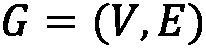是一个图，其中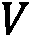是它的一组节点，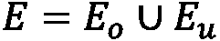是它的一组边。这组边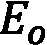称为*观测链*，而这组边称为*未知链*。链路预测问题的目标是利用和的信息来估计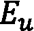。在处理时态图数据时，这个问题也很常见。在此设置中，假设是在给定时间点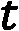观察到的图，其中我们希望预测该图在给定时间点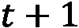的边缘。这里可以看到部分观察到的图表:

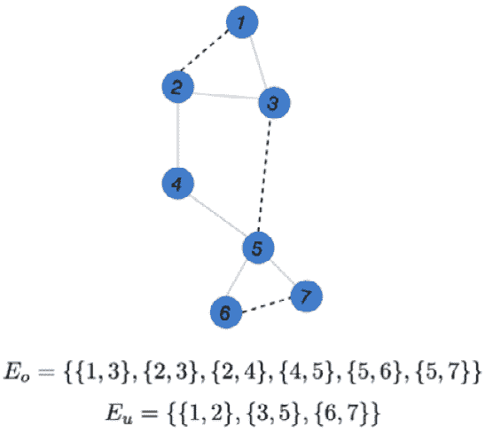

图 5.1–部分观察到的图表，带有观察到的链接(实线)和未知链接(虚线)

链接预测问题被广泛用于不同的领域，例如推荐系统，以便在社交网络中提议友谊或者在电子商务网站上提议购买物品。它还用于犯罪网络调查，以便找到犯罪团伙之间的隐藏联系，以及用于分析蛋白质-蛋白质相互作用的生物信息学。在接下来的章节中，我们将讨论解决链接预测问题的两类方法，即**基于相似性的**和**基于嵌入的**方法。

## 基于相似性的方法

在这一小节中，我们将向展示几种简单的算法来解决标签预测问题。所有这些算法背后的主要共享思想是估计图中每对节点之间的相似性函数。如果根据函数，节点*看起来相似*，它们将有很高的概率通过边连接。我们将这些算法分为两个子族:`networkx.algorithms.link_prediction`包中的`networkx`库。

### 基于索引的方法

在这一节中，我们将展示一些在`networkx`中可用的算法来计算两个断开节点之间的边的概率。这些算法是基于通过分析两个断开节点的邻居所获得的信息来计算简单指数。

#### 资源分配指数

资源分配指数方法通过根据以下公式估计所有节点对的*资源分配指数*来估计两个节点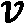和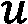连接的概率:

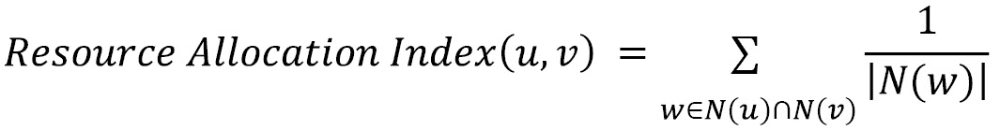

在给定的公式中，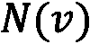函数计算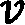节点和节点的邻居，如公式所示，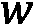节点是和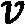的邻居。可以使用以下代码在`networkx`中计算该指数:

```
import networkx as nx
edges = [[1,3],[2,3],[2,4],[4,5],[5,6],[5,7]]
 G = nx.from_edgelist(edges)
 preds = nx.resource_allocation_index(G,[(1,2),(2,5),(3,4)])
```

`resource_allocation_index`函数的第一个参数是一个输入图，而第二个参数是可能的边的列表。我们想计算连接的概率。结果，我们得到以下输出:

```
[(1, 2, 0.5), (2, 5, 0.5), (3, 4, 0.5)]
```

输出是一个列表，它包含成对的节点，如`(1,2)`、`(2,5)`和`(3,4)`，它们形成了资源分配索引。根据这个输出的，这些节点对之间有边的概率是`0.5`。

#### 雅克卡系数

算法根据 *Jaccard 系数*计算两个节点和之间连接的概率，计算如下:


这里，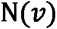用于计算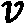节点的邻居。使用以下代码可在`networkx`中使用该功能:

```
import networkx as nx
edges = [[1,3],[2,3],[2,4],[4,5],[5,6],[5,7]]
 G = nx.from_edgelist(edges)
 preds = nx.resource_allocation_index(G,[(1,2),(2,5),(3,4)])
```

`resource_allocation_index`功能与之前的功能具有相同的参数。代码的结果如下所示:

```
[(1, 2, 0.5), (2, 5, 0.25), (3, 4, 0.3333333333333333)]
```

根据这个输出，节点`(1,2)`之间有边的概率是`0.5`，而节点`(2,5)`之间这个是`0.25`，节点`(3,4)`之间这个是`0.333`。

在`networkx`中，基于相似性得分计算两个节点之间的连接概率的其他方法是`nx.adamic_adar_index`和`nx.preferential_attachment`，分别基于 *Adamic/Adar 指数*和*优先连接指数*的计算。这些函数与其他函数具有相同的参数，并接受一个图表和一系列节点，我们希望在这些节点上计算分数。在下一节中，我们将展示基于社区检测的另一系列算法。

### 基于社区的方法

与基于指数的方法一样，属于该家族的算法也计算代表断开节点被连接的概率的指数。基于索引的方法和基于社区的方法之间的主要区别与它们背后的逻辑有关。事实上，在生成索引之前，基于社区的方法需要计算关于属于那些节点的社区的信息。在这一小节中，我们将展示一些常见的基于社区的方法，并提供几个例子。

#### 社区公共邻居

为了估计两个节点被连接的概率，该算法计算共同邻居的数量，并将属于同一社区的共同邻居的数量加到该值上。形式上，对于两个节点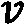和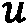，社区公共邻居值计算如下:


在这个公式中，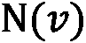用于计算节点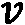的邻居，如果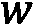属于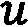和的同一个社区，则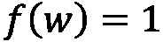；否则，这是 0。可以使用以下代码在`networkx`中计算该函数:

```
import networkx as nx
edges = [[1,3],[2,3],[2,4],[4,5],[5,6],[5,7]]
 G = nx.from_edgelist(edges)

G.nodes[1]["community"] = 0
G.nodes[2]["community"] = 0
G.nodes[3]["community"] = 0
G.nodes[4]["community"] = 1
G.nodes[5]["community"] = 1
G.nodes[6]["community"] = 1
G.nodes[7]["community"] = 1
preds = nx.cn_soundarajan_hopcroft(G,[(1,2),(2,5),(3,4)])
```

从前面的代码片段中，可以看出我们需要如何将`community`属性分配给图中的每个节点。当计算前面等式中定义的函数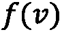时，该属性用于识别属于同一社区的节点。正如我们将在下一节中看到的，社区价值也可以使用特定的算法自动计算。正如我们已经看到的，`cn_soundarajan_hopcroft`函数接受输入图和我们想要计算分数的几个节点。结果，我们得到以下输出:

```
[(1, 2, 2), (2, 5, 1), (3, 4, 1)]
```

与前一个函数的主要区别在于索引值。的确，我们很容易看到输出不在范围`(0,1)`内。

#### 社区资源分配

与前面的方法一样，社区资源分配算法将从节点的邻居获得的信息与社区合并，如下面的公式所示:

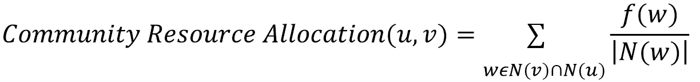

这里，用于计算节点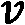的邻居，如果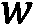属于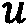和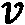的同一个社区，则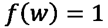；否则，这是 0。可以在`networkx`中使用以下代码计算该函数:

```
import networkx as nx
edges = [[1,3],[2,3],[2,4],[4,5],[5,6],[5,7]]
 G = nx.from_edgelist(edges)

G.nodes[1]["community"] = 0
G.nodes[2]["community"] = 0
G.nodes[3]["community"] = 0
G.nodes[4]["community"] = 1
G.nodes[5]["community"] = 1
G.nodes[6]["community"] = 1
G.nodes[7]["community"] = 1
preds = nx. ra_index_soundarajan_hopcroft(G,[(1,2),(2,5),(3,4)])
```

从前面的代码片段中，可以看出我们需要如何将`community`属性分配给图中的每个节点。这个属性用于在计算前面等式中定义的函数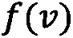时识别属于同一社区的节点。正如我们将在下一节中看到的，社区价值也可以使用特定的算法自动计算。正如我们已经看到的，`ra_index_soundarajan_hopcroft`函数接受输入图和我们想要计算分数的几个节点。结果，我们得到以下输出:

```
[(1, 2, 0.5), (2, 5, 0), (3, 4, 0)]
```

从前面的输出中，可以看出社区在指数计算中的影响。由于节点`1`和`2`属于同一个社区，所以它们在索引中具有较高的值。相反，边`(2,5)`和`(3,4)`具有值 0，因为它们属于彼此不同的社区。

在`networkx`中，基于两个节点的相似性得分并结合社区信息来计算两个节点之间的连接概率的另外两种方法是`nx.a` `within_inter_cluster`和`nx.common_neighbor_centrality`。

在下一节中，我们将描述一种基于 ML 加边缘嵌入来执行未知边缘预测的更复杂的技术。

## 基于嵌入的方法

在本节中，我们将描述一种更高级的方式来执行链路预测。这种方法背后的思想是将链路预测问题作为监督分类任务来解决。更准确地说，对于给定的图，每对节点用特征向量(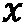)表示，并且类别标签()被分配给这些节点对中的每一个。形式上，假设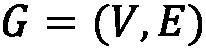是一个图，对于每一对节点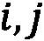，我们建立以下公式:


这里，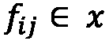是代表节点对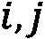的*特征向量*,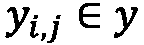是它们的*标签*。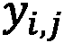的值定义如下:如果在图`G`中存在连接节点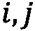的边；否则，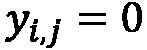。使用特征向量和标签，我们可以训练 ML 算法，以便预测给定的一对节点是否构成给定图的合理边。

如果为每对节点构建标签向量很容易，那么构建特征空间就不那么简单了。为了生成每对节点的特征向量，我们将使用一些嵌入技术，例如`node2vec`和`edge2vec`，已经在第 3 章*的 [*中讨论过的无监督图学习*。使用这些嵌入算法，特征空间的生成将大大简化。事实上，整个过程可以总结为两个主要步骤，概述如下:](B16069_03_Final_JM_ePub.xhtml#_idTextAnchor046)*

1.  对于图`G`的每个节点，使用`node2vec`算法计算其嵌入向量。
2.  对于图中所有可能的节点对，使用`edge2vec`算法计算嵌入。

我们现在可以将一般的 ML 算法应用于生成的特征向量，以便解决分类问题。

为了给你一个这个过程的实际解释，我们将在下面的代码片段中提供一个例子。更准确地说，我们将使用`networkx`、`stellargraph`和`node2vec`库来描述整个管道(从图到链接预测)。为了简化我们对不同部分的理解，我们将整个过程分成不同的步骤。将链接预测问题应用于第一章[](B16069_01_Final_JM_ePub.xhtml#_idTextAnchor014)*、*Python 中的图表入门*中描述的引用网络数据集，可从以下链接获得:【https://linqs-data.soe.ucsc.edu/public/lbc/cora.tgz】T42。*

 *作为第一步，我们将使用引用数据集构建一个`networkx`图，如下所示:

```
import networkx as nx
import pandas as pd
edgelist = pd.read_csv("cora.cites", sep='\t', header=None, names=["target", "source"])
G = nx.from_pandas_edgelist(edgelist)
```

由于数据集被表示为边列表(参见 [*第 1 章*](B16069_01_Final_JM_ePub.xhtml#_idTextAnchor014) ，*Python 中的图入门*)，我们使用`from_pandas_edgelist`函数来构建图。

第二步，我们需要从图`G`中创建训练和测试集。更准确地说，我们的训练集和测试集不仅应该包含图`G`中真实边的子集，还应该包含不代表图`G`中真实边的节点对。代表真实边缘的对将是*正实例*(类别标签 1)，而不代表真实边缘的对将是*负实例*(类别标签 0)。该过程可以如下容易地执行:

```
from stellargraph.data import EdgeSplitter
edgeSplitter = EdgeSplitter(G)
 graph_test, samples_test, labels_test = edgeSplitter.train_test_split(p=0.1, method="global")
```

我们使用了`stellargraph`中可用的`EdgeSplitter`类。`EdgeSplitter`类的主要构造函数参数是我们想要用来执行分割的图(`G`)。使用`train_test_split`功能执行真正的分割，该功能将生成以下输出:

*   `graph_test`是原始图的子集，包含所有节点，但只是边的一个选定子集。
*   `samples_test`是在每个位置包含一对节点的向量。该向量将包含代表真实边的节点对(正实例)，但也包含不代表真实边的节点对(负实例)。
*   `labels_test`是与`samples_test`长度相同的向量。它只包含 0 或 1。值 0 出现在代表`samples_test`向量中负实例的位置，而值 1 出现在代表`samples_test`中正实例的位置。

通过遵循用于生成测试集的相同过程，可以生成训练集，如以下代码片段所示:

```
edgeSplitter = EdgeSplitter(graph_test, G)
 graph_train, samples_train, labels_train = edgeSplitter.train_test_split(p=0.1, method="global")
```

这部分代码的主要区别与`EdgeSplitter`的初始化有关。在这种情况下，我们还提供了`graph_test`以便不重复为测试集生成的正面和负面实例。

在这一点上，我们有我们的训练和测试数据集，有正面和负面的实例。对于这些实例中的每一个，我们现在需要生成它们的特征向量。在这个例子中，我们使用了`node2vec`库来生成节点嵌入。一般来说，每个节点嵌入算法都可以用来执行这项任务。对于训练集，我们可以使用以下代码生成特征向量:

```
from node2vec import Node2Vec
from node2vec.edges import HadamardEmbedder
node2vec = Node2Vec(graph_train)
 model = node2vec.fit()
edges_embs = HadamardEmbedder(keyed_vectors=model.wv)
 train_embeddings = [edges_embs[str(x[0]),str(x[1])] for x in samples_train]
```

从之前的代码片段中，可能会看到以下内容:

*   我们使用`node2vec`库为训练图中的每个节点生成嵌入。
*   我们使用`HadamardEmbedder`类来生成包含在训练集中的每对节点的嵌入。这些值将被用作特征向量来执行我们的模型的训练。

在这个例子中，我们使用了`HadamardEmbedder`算法，但是一般来说，也可以使用其他嵌入算法，比如在 [*第 3 章*](B16069_03_Final_JM_ePub.xhtml#_idTextAnchor046) 、*无监督图学习*中描述的那些算法。

还需要对测试集执行前面的步骤，代码如下:

```
edges_embs = HadamardEmbedder(keyed_vectors=model.wv)
 test_embeddings = [edges_embs[str(x[0]),str(x[1])] for x in samples_test]
```

这里唯一的区别是用于计算边缘嵌入的`samples_test`数组。实际上，在这种情况下，我们使用为测试集生成的数据。此外，应该注意的是，没有为测试集重新计算`node2vec`算法。实际上，给定`node2vec`的随机性质，不可能确保两个学习的嵌入是“可比较的”,因此`node2vec`嵌入将在运行之间改变。

现在一切都准备好了。我们最终可以使用`train_embeddings`特征空间和`train_labels`标签分配训练一个 ML 算法来解决标签预测问题，如下所示:

```
from sklearn.ensemble import RandomForestClassifier
rf = RandomForestClassifier(n_estimators=1000)
 rf.fit(train_embeddings, labels_train);
```

在这个例子中，我们使用了一个简单的`RandomForestClassifier`类，但是每个 ML 算法都可以用来解决这个任务。然后，我们可以在`test_embeddings`特征空间上应用训练好的模型，以便量化分类的质量，如下面的代码块所示:

```
from sklearn import metrics
y_pred = rf.predict(test_embeddings)
 print('Precision:', metrics.precision_score(labels_test, y_pred))
 print('Recall:', metrics.recall_score(labels_test, y_pred))
 print('F1-Score:', metrics.f1_score(labels_test, y_pred))
```

结果，我们得到以下输出:

```
Precision: 0.8557114228456913
Recall: 0.8102466793168881
F1-Score: 0.8323586744639375
```

正如我们已经提到的，我们刚刚描述的方法只是一个通用的模式；流水线的每一部分——比如训练/测试分割、节点/边嵌入和 ML 算法——都可以根据我们面临的具体问题进行改变。

这种方法在处理时态图中的链接预测时特别有用。在这种情况下，可以应用与在时间点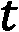获得的用于训练模型的边缘相关的信息，以便预测在时间点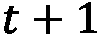的边缘。

在本节中，我们介绍了标签预测问题。我们通过用几个例子来描述用于找到链路预测问题的解决方案的不同技术来丰富我们的解释。我们展示了解决这个问题的不同方法，从简单的基于索引的 T21 技术到更复杂的基于嵌入的技术。然而，科学文献中充满了解决链路预测任务的算法，并且有不同的算法来解决该问题。在论文*关于学习和提取用于链路预测的图特征*([https://arxiv.org/pdf/1901.03425.pdf](https://arxiv.org/pdf/1901.03425.pdf))中，对用于解决链路预测问题的不同技术进行了很好的概述。在下一节中，我们将研究社区检测问题。

# 检测社区等有意义的结构

数据科学家在处理网络时面临的一个常见问题是如何识别图表中的聚类和社区。这通常发生在图是从社交网络和已知存在的社区中导出的时候。然而，底层算法和方法也可以在其他环境中使用，代表了执行聚类和分割的另一种选择。例如，这些方法可以有效地用于文本挖掘，以识别新出现的主题，并对涉及单个事件/主题的文档进行聚类。社区检测任务包括划分图，使得属于相同社区的节点彼此紧密连接，而与来自其他社区的节点弱连接。存在几种识别社区的策略。一般来说，我们可以将它们定义为属于以下两个类别之一:

*   **非重叠**社区检测算法提供节点和社区之间的一对一关联，因此社区之间没有重叠节点
*   **重叠**社区检测算法，允许一个节点包含在多个社区中——例如，反映社交网络发展重叠社区的自然趋势(例如，学校的朋友、邻居、玩伴、同一个足球队的人等等)，或者在生物学中，单个蛋白质可以参与多个过程和生物反应

在下一节中，我们将回顾社区检测环境中一些最常用的技术。

## 基于嵌入的社区发现

允许我们将节点划分为社区的第一类方法可以简单地通过对节点嵌入应用标准浅层聚类技术来获得，使用 [*第 3 章*](B16069_03_Final_JM_ePub.xhtml#_idTextAnchor046) 、*无监督图学习*中描述的方法来计算。嵌入方法实际上允许我们将节点投影到向量空间中，在向量空间中可以定义表示节点之间相似性的距离度量。正如我们在 [*第三章*](B16069_03_Final_JM_ePub.xhtml#_idTextAnchor046) 、*无监督图学习*中所展示的，嵌入算法在分离具有相似邻域和/或连通性属性的节点时非常有效。然后，可以使用标准的聚类技术，例如基于距离的聚类(K-means)、连通性聚类(层次聚类)、分布聚类(高斯混合)和基于密度的聚类(`networkx`效用函数)，如下所示:

```
import networkx as nx 
G = nx.barbell_graph(m1=10, m2=4) 
```

然后，我们可以首先使用我们之前见过的嵌入算法之一(例如，`HOPE`)获得简化的密集节点表示，如下所示:

```
from gem.embedding.hope import HOPE 
gf = HOPE(d=4, beta=0.01) 
gf.learn_embedding(G) 
 embeddings = gf.get_embedding() 
```

最后，我们可以对节点嵌入提供的矢量表示运行聚类算法，如下所示:

```
from sklearn.mixture import GaussianMixture
gm = GaussianMixture(n_components=3, random_state=0)
 labels = gm.fit_predict(embeddings)
```

我们可以用不同颜色突出显示的计算社区来绘制网络，如下所示:

```
colors = ["blue", "green", "red"]
nx.draw_spring(G, node_color=[colors[label] for label in labels])
```

通过这样做，您应该可以获得如下屏幕截图所示的输出:


图 5.2–杠铃图，其中使用基于嵌入的方法应用了社区检测算法

两个集群以及连接节点已经被正确地分组为三个不同的社区，反映了图的内部结构。

## 谱方法和矩阵分解

实现图划分的另一种方式是处理表示图的连通性属性的邻接矩阵或拉普拉斯矩阵。例如，可以通过对拉普拉斯矩阵的特征向量应用标准聚类算法来获得谱聚类。在某种意义上，谱聚类也可以被视为基于嵌入的社区检测算法的特例，其中嵌入技术是所谓的谱嵌入，通过考虑拉普拉斯矩阵的前 k 个特征向量来获得。通过考虑拉普拉斯算子的不同定义以及不同的相似性矩阵，可以获得该方法的变体。在`communities` Python 库中可以找到该方法的一个方便的实现，并且可以用于从`networkx`图中容易获得的邻接矩阵表示，如下面的代码片段所示:

```
from communities.algorithms import spectral_clustering
adj=np.array(nx.adjacency_matrix(G).todense())
communities = spectral_clustering(adj, k=2)
```

此外，邻接矩阵(或拉普拉斯算子)也可以使用矩阵分解技术而不是**奇异值分解** ( **SVD** )技术来分解，例如**非负矩阵分解**(**NMF**)——这允许类似的描述，如下面的代码片段所示:

```
from sklearn.decomposition import NMF
nmf = NMF(n_components=2)
 score = nmf.fit_transform(adj)
communities = [set(np.where(score [:,ith]>0)[0])
               for ith in range(2)]
```

在这个示例中，属于团体的的阈值被设置为 0，尽管也可以使用其他值来仅保留团体核心。注意，这些方法是重叠社区检测算法，节点可能属于多个社区。

## 概率模型

社区检测方法也可以通过拟合生成概率图模型的参数来导出。生成模型的例子已经在 [*第一章*](B16069_01_Final_JM_ePub.xhtml#_idTextAnchor014) 、*Python 图入门*中描述过了。但是，他们并没有假设任何底层社区的存在，不像所谓的**随机区块模型** ( **SBM** )。事实上，该模型基于这样的假设，即节点可以被划分为 K 个不相交的社区，并且每个社区都具有与另一个社区连接的确定概率。对于具有 *n* 个节点和 *K* 个社区的网络，生成模型由以下参数化:

*   **隶属矩阵** : *M* ，这是一个 *n x K* 矩阵，代表给定节点属于某一类的概率 *k*
*   **概率矩阵** : *B* ，是 *K x K* 矩阵，表示属于社区 *i* 的节点与属于社区 *j* 的节点之间的边概率

然后通过以下公式生成邻接矩阵:

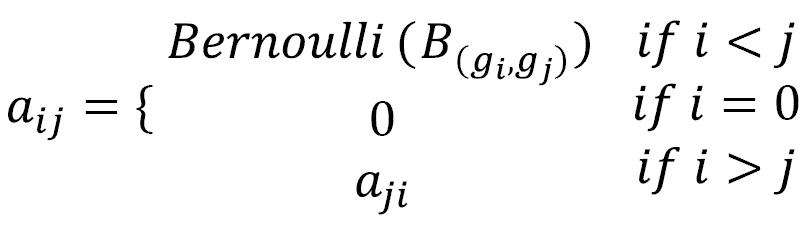

这里，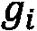和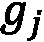代表社区，它们可以通过从概率的多项分布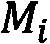和中抽样获得。

在 SBM 中，我们可以通过最大似然估计，从矩阵 *A* 基本上反转公式并将社区检测问题简化为隶属矩阵 *M* 的后验估计。这种方法的一个版本最近与随机谱聚类一起使用，以便在非常大的图中执行社区检测。注意，恒定概率矩阵的极限(即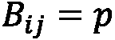)中的 SBM 模型对应于 Erdős-Rényi 模型。这些模型还具有描述社区之间的关系、识别社区-社区关系的优点。

## 成本函数最小化

检测图中社区的另一种可能方式是优化给定的成本函数，该成本函数表示图结构，并惩罚跨社区的边与社区内的边。这基本上包括建立一个社区质量的度量(我们将很快看到它的模块性)，然后优化节点与社区的关联，以便最大化分区的整体质量。

在二元关联社区结构的上下文中，社区关联可以由值为-1 或 1 的二分变量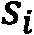来描述，这取决于节点是否属于两个社区之一。在这种设置中，我们可以定义以下数量，这些数量确实可以用来有效地表示与在不同社区的两个节点之间建立链接相关联的成本:

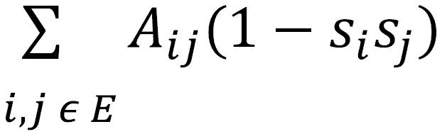

实际上，当两个连接的节点属于不同的社区时，由边提供的贡献是正的。另一方面，当两个节点不连接时()和当两个连接的节点属于同一社区时()，贡献都是 0。因此，问题是找到最佳社区分配(和)，以便最小化前面的函数。然而，该方法仅适用于二元社区检测，因此其应用相当有限。

属于这个类的另一个非常流行的算法是 Louvain 方法，它的名字来自于发明它的大学。该算法旨在最大化模块化，定义如下:


这里，表示边的个数，和分别表示第 I 个和第 j 个节点的度，是克罗内克德尔塔函数，当和的值相同时为 1，否则为 0。模块性基本上代表了与随机重新布线节点并因此创建具有相同边数和度分布的随机网络相比，社区识别执行得多好的度量。

为了有效地最大化这种模块性，Louvain 方法迭代计算以下步骤:

1.  **模块性优化**:迭代地扫描节点，对于每个节点，我们计算模块性的变化 *Q* 如果该节点被分配到它的邻居的每个社区，那么将会有什么变化。一旦计算出所有的值，该节点就被分配给提供最大增量的社区。如果通过将节点放置在除了它所在的社区之外的任何其他社区中没有获得增加，则该节点保持在其原始社区中。这个优化过程一直持续到没有引起变化为止。
2.  **节点聚合**:在第二步中，我们通过将同一社区中的所有节点进行分组，并使用从两个社区中所有边的总和得到的边来连接社区，从而构建一个新的网络。社区内的边也通过自循环来考虑，自循环具有从属于社区的所有边权重的总和得到的权重。

Louvain 实现已经可以在`communities`库中找到，如下面的代码片段所示:

```
from communities.algorithms import louvain_method
communities = louvain_method(adj) 
```

另一种使模块性最大化的方法是格文-纽曼算法，该算法基于反复移除具有最高介数中心性的边(从而连接两个独立的节点集群)来创建连通的组件社区。以下是与此相关的代码:

```
from communities.algorithms import girvan_newman
communities = girvan_newman(adj, n=2)
```

注意

后一种算法需要计算所有边的介数中心性来移除边。在大型图中，这样的计算可能非常昂贵。事实上，格文-纽曼算法的规模为，其中是边的数量，是节点的数量，在处理大型数据集时不应使用。

# 检测图相似性和图匹配

学习图之间的*相似度*的定量度量被认为是一个关键问题。事实上，这是网络分析的关键步骤，也可以促进许多 ML 问题，如分类、聚类和排序。例如，许多聚类算法使用相似性的概念来确定一个对象是否应该是一个组的成员。

在图的领域中，寻找一个有效的相似性度量是许多应用的关键问题。例如，考虑图中节点的*角色*。这个节点对于在网络上传播信息或保证网络的健壮性可能非常重要:例如，它可能是一个星形图的中心，也可能是一个团体的成员。在这种情况下，拥有一种根据角色比较节点的强大方法将非常有用。例如，您可能对搜索表现出相似角色或表现出相似异常行为的个人感兴趣。你也可以用它来搜索相似的子图或确定知识转移的网络兼容性。例如，如果您找到了一种提高网络稳定性的方法，并且您知道这样的网络与另一个网络非常相似，您可以将适用于第一个网络的相同解决方案直接应用于第二个网络:


图 5.3–两个图表之间的差异示例

几个度量可以用于测量两个对象之间的相似性(距离)。一些例子包括*欧几里德距离*、*曼哈顿距离*、*余弦相似度*等等。然而，这些指标可能无法捕获正在研究的数据的具体特征，特别是在非欧几里德结构上，比如图。看看*图 5.3*:G1 和 **G2** 有多“远”？他们看起来非常相似。但是如果 **G2** 的红色社区中的连接缺失导致信息严重丢失怎么办？他们看起来还相似吗？

基于数学概念，如*图同构*、*编辑距离*和*公共子图*，已经提出了几种算法方法和启发式方法(我们建议阅读[https://link.springer.com/article/10.1007/s10044-012-0284-8](https://link.springer.com/article/10.1007/s10044-012-0284-8)以获得详细的评论)。这些方法中的许多目前都在实际应用中使用，即使它们通常需要指数级的高计算时间来为一般的**NP-完全**问题提供解决方案(其中 **NP** 代表**非确定性多项式时间**)。因此，找到或学习用于测量特定任务中所涉及的数据点的相似性的度量是至关重要的。这就是曼梯·里帮助我们的地方。

我们已经在第三章*无监督图学习*和 [*第四章*](B16069_04_Final_JM_ePub.xhtml#_idTextAnchor064)*有监督图学习*中看到的许多算法可能对学习有效的相似性度量有用。根据它们的使用方式，可以定义一个精确的分类法。在这里，我们提供了一个简单的图相似性技术概述。更全面的列表可以在论文*深度图相似性学习:调查*([https://arxiv.org/pdf/1912.11615.pdf](https://arxiv.org/pdf/1912.11615.pdf))中找到。它们基本上可以分为三大类，即使复杂的组合也是可以开发的。**基于图嵌入的方法**使用嵌入技术来获得图的嵌入表示，并利用这样的表示来学习相似性函数；**基于图核的方法**通过测量组成子结构的相似性来定义图之间的相似性；**基于图神经网络的方法**使用**图神经网络** ( **GNNs** )来联合学习嵌入式表示和相似度函数。让我们更详细地看看所有这些。

## 基于图嵌入的方法

这些技术寻求应用图嵌入技术来获得节点级或图级表示，并进一步使用这些表示进行相似性学习。例如， *DeepWalk* 和 *Node2Vec* 可用于提取有意义的嵌入，然后可用于定义相似性函数或预测相似性得分。例如，在蒂歇尔等人(2015)中，`node2vec`用于编码节点嵌入。然后，从那些节点嵌入中获得的**二维** ( **2D** )直方图被传递给为图像设计的经典 2D **卷积神经网络** ( **CNN** )架构。这样一个简单而强大的方法能够从许多基准数据集获得良好的结果。

## 基于图核的方法

**基于图核的方法**在捕捉图之间的相似性方面产生了很多的兴趣。这些方法将两个图之间的相似性计算为它们的一些子结构之间的相似性的函数。不同的图核基于它们使用的子结构而存在，这些子结构包括随机行走、最短路径和子图。例如，一种叫做**深度图核** ( **DGK** ) (Yanardag 等人，2015)的方法将图分解成被视为“单词”的子结构。然后，**自然语言处理** ( **NLP** )方法如**连续词包** ( **CBOW** )和**skip-gram**用于学习子结构的潜在表示。这样，基于子结构空间的相似性来定义两个图之间的核。

## GNN 方法

随着深度学习**技术** ( **DL** )的出现，GNNs 已经成为学习图上表示的一个强有力的新工具。这种强大的模型可以很容易地适应各种任务，包括图相似性学习。此外，相对于其他传统的图嵌入方法，它们呈现出关键的优势。事实上，虽然后者通常在孤立的阶段学习表征，但在这种方法中，表征学习和目标学习任务是联合进行的。因此，GNN 深度模型可以更好地利用特定学习任务的图特征。我们已经在 [*第三章*](B16069_03_Final_JM_ePub.xhtml#_idTextAnchor046) 、*无监督图学习*中看到了一个使用 GNNs 进行相似性学习的例子，其中训练了一个二分支网络来估计两个图之间的邻近距离。

## 应用

图的相似性学习已经在许多领域取得了可喜的成果。在化学和生物信息学中可能会发现重要的应用，例如，寻找与查询化合物最相似的化合物，如下图左侧所示。在神经科学中，相似性学习方法已经开始被应用于测量多个受试者之间的大脑网络的相似性，从而允许对大脑疾病进行新的临床研究:


图 5.4–举例说明图表如何用于表示各种对象:(a)两种化合物之间的差异；(b)两种人体姿势之间的差异

图相似性学习也已经在计算机安全领域得到了探索，其中已经提出了新的方法来检测软件系统中的漏洞以及硬件安全问题。最近，已经观察到应用这种解决方案来解决计算机视觉问题的趋势。一旦将图像转换为图数据的挑战性问题得到解决，就可以为视频序列中的人体动作识别和场景中的对象匹配以及其他领域提出有趣的解决方案(如*图 5.4* 右侧所示)。

# 总结

在这一章中，我们学习了基于图的 ML 技术如何被用来解决许多不同的问题。

特别是，我们已经看到，相同的算法(或稍加修改的版本)可以用来解决明显不同的任务，如链接预测、社区检测和图相似性学习。我们还看到，每个问题都有自己的特点，研究人员利用这些特点来设计更复杂的解决方案。

在下一章，我们将探索使用 ML 解决的现实生活中的问题。*