# 七、使用图的文本分析和自然语言处理

如今，就自然书面语言而言，大量信息可以以文本的形式获得。你现在正在读的这本书就是这样一个例子。你每天早上阅读的新闻，你之前发送/阅读的推文或脸书帖子，你为学校作业写的报告，我们不断写的电子邮件——这些都是我们通过书面文件和文本交换信息的例子。毫无疑问，这是最常见的间接互动方式，而不是像说话或打手势这样的直接互动。因此，能够利用此类信息并从文档和文本中提取见解至关重要。

如今以这种形式出现的大量信息决定了自然语言处理领域的巨大发展和最新进展。

在这一章中，我们将向您展示如何处理自然语言文本，并回顾一些允许我们构建文本信息的基本模型。使用从文档语料库中提取的信息，我们将向您展示如何创建可以使用我们在前面章节中看到的一些技术进行分析的网络。特别是，使用一个标记的语料库，我们将向您展示如何开发有监督的(分类模型以将文档分类到预先确定的主题中)和无监督的(社区检测以发现新主题)算法。

本章涵盖以下主题:

*   提供数据集的快速概览
*   理解 NLP 中使用的主要概念和工具
*   从文档集创建图
*   构建文档主题分类器

# 技术要求

我们将在所有练习中使用 *Python 3.8* 。以下是您必须使用 pip 为本章安装的 Python 库列表。为此，例如，在命令行上运行`pip install networkx==2.4`等等:

```py
networkx==2.4 
scikit-learn==0.24.0
stellargraph==1.2.1
spacy==3.0.3
pandas==1.1.3
numpy==1.19.2
node2vec==0.3.3
Keras==2.0.2
tensorflow==2.4.1
communities==2.2.0
gensim==3.8.3
matplotlib==3.3.4
nltk==3.5
fasttext==0.9.2
```

与本章相关的所有代码文件都可以在[https://github . com/packt publishing/Graph-Machine-Learning/tree/main/chapter 07](https://github.com/PacktPublishing/Graph-Machine-Learning/tree/main/Chapter07)获得。

# 提供数据集的快速概览

为了向您展示如何处理文档语料库以提取相关信息，我们将使用一个来自 NLP 领域中一个众所周知的基准的数据集:所谓的 **Reuters-21578** 。原始数据集包括 1987 年发表在金融路透社新闻专线上的 21，578 篇新闻文章，这些文章按类别进行了汇编和索引。原始数据集的分布非常不均匀，有些类别只出现在训练集或测试集中。出于这个原因，我们将使用一个修改后的版本，称为 **ApteMod** ，也称为 Reuters-21578 Distribution 1.0，它在训练和测试数据集之间具有更小的偏斜分布和一致的标签。

尽管这些文章有点过时，但是数据集已经在大量关于 NLP 的论文中使用，并且仍然是一个经常用于基准算法的数据集。

的确，Reuters-21578 包含了足够多的文档，可以进行有趣的后处理和洞察。如今，拥有大量文档的语料库很容易找到(例如，参见[https://github.com/niderhoff/nlp-datasets](https://github.com/niderhoff/nlp-datasets)对最常见文档的概述)，但它们可能需要更大的存储和计算能力，以便进行处理。在 [*第 9 章*](B16069_09_Final_JM_ePub.xhtml#_idTextAnchor141) *构建数据驱动、图驱动的应用*中，我们将向您展示一些可用于扩展您的应用和分析的工具和库。

Reuters-21578 数据集的每个文档都有一组代表其内容的标签。这使得它成为测试监督和非监督算法的完美基准。使用`nltk`库可以很容易地下载 Reuters-21578 数据集(这是一个非常有用的后处理文档库):

```py
from nltk.corpus import reuters
corpus = pd.DataFrame([
    {"id": _id,
     "text": reuters.raw(_id).replace("\n", ""), 
     "label": reuters.categories(_id)}
    for _id in reuters.fileids()
])
```

正如您将从检查`corpus`数据帧中看到的，id 以`training/{ID}`和`test/{ID}`的形式出现，这清楚地表明了哪些文档应该用于训练和测试。首先，让我们列出所有主题，并使用以下代码查看每个主题有多少个文档:

```py
from collections import Counter
Counter([label for document_labels in corpus["label"] for label in document_labels]).most_common()
```

Reuters-21578 数据集包括 90 个不同的主题，这些主题在类别之间有很大程度的不平衡，几乎 37%的文档属于`most common`类别，而在五个最不常见的类别中，每个类别仅占 0.01%。正如您在检查文本时所看到的，一些文档嵌入了一些换行符，在第一个文本清理阶段可以很容易地删除这些换行符:

```py
corpus["clean_text"] = corpus["text"].apply(
    lambda x: x.replace("\n", "")
)
```

现在我们已经将数据加载到内存中，我们可以开始分析它了。在下一小节中，我们将向您展示一些可用于处理非结构化文本数据的主要工具。它们将帮助您提取结构化信息，以便轻松使用。

# 了解 NLP 中使用的主要概念和工具

在处理文档时，第一个分析步骤当然是推断文档语言。实际上，NLP 任务中使用的大多数分析引擎都是针对特定语言的文档进行训练的，并且应该只用于这种语言。一些构建跨语言模型的尝试(例如，多语言嵌入，如[https://fasttext.cc/docs/en/aligned-vectors.html](https://fasttext.cc/docs/en/aligned-vectors.html)和[https://github . com/Google-research/Bert/blob/master/multilingual . MD](https://github.com/google-research/bert/blob/master/multilingual.md))最近越来越受欢迎，尽管它们仍然只代表 NLP 模型的一小部分。因此，首先推断语言以便您可以使用正确的下游分析 NLP 管道是非常常见的。

你可以用不同的方法来推断语言。一种非常简单而有效的方法是寻找一种语言中最常见的单词(所谓的`stopwords`，如`the`、`and`、`be`、`to`、`of`等等)，并根据它们的频率建立一个分数。然而，它的精确度往往局限于短文本，并且没有利用单词的位置和上下文。另一方面，Python 有许多使用更精细逻辑的库，允许我们以更精确的方式推断语言。一些这样的库是`fasttext`、`polyglot`和`langdetect`，仅举几个例子。

作为一个例子，我们将在下面的代码中使用`fasttext`，它可以用很少的几行代码集成，并提供对 150 多种语言的支持。使用下面的代码片段可以推断出所有文档的语言:

```py
from langdetect import detect
import numpy as np
def getLanguage(text: str):
    try:
        return langdetect.detect(text)
    except:
        return np.nan
corpus["language"] = corpus["text"].apply(langdetect.detect)
```

正如您将在输出中看到的，似乎有非英语语言的文档。事实上，这些文件通常要么非常短，要么结构奇怪，这意味着它们不是真正的新闻文章。当文档表示人类会阅读并标记为新闻的文本时，模型通常相当精确和准确。

既然我们已经推断出了语言，我们可以继续分析管道中与语言相关的步骤。对于下面的任务，我们将使用`spaCy`，这是一个非常强大的库，允许我们用很少的代码行嵌入最先进的 NLP 模型。在用`pip install spaCy`安装了库之后，可以通过使用`spaCy`下载实用程序简单地安装它们来集成特定语言的模型。例如，以下命令可用于下载和安装英语模型:

```py
python -m spacy download en_core_web_sm
```

现在，我们应该已经准备好使用英语的语言模型了。看看它能提供哪些信息。使用 spaCy 非常简单，只需一行代码，就可以将计算作为一组非常丰富的信息嵌入。让我们首先将该模型应用于路透社语料库中的一个文档:

苏博洛托说印尼支持锡盟延期

矿业和能源部长 Subroto 证实印尼支持延长第六次国际锡协议，但是表示没有必要签订新的协议。当被路透社要求澄清他周一的声明时，他说该协议应该被允许失效，Subroto 说印度尼西亚准备支持延长 ITA。“我们可以支持延长第六项协议，”他说。"但是我们认为第七项协议是不必要的."第六届 ITA 将于 6 月底到期，除非三分之二的成员国投票同意延期。

`spacy`只需加载模型并将其应用于文本，即可轻松应用:

```py
nlp = spacy.load('en_core_web_md')
parsed = nlp(text)
```

由`spacy`返回的`parsed`对象有几个字段，因为许多模型被合并到一个管道中。这些提供了不同层次的文本结构。让我们逐一检查它们:

*   `spacy` generally works fairly well. However, please note that, depending on the context, a bit of model tuning or rule modification might be necessary. For instance, when you're dealing with short texts that contain slang, emoticons, links, and hashtags, a better choice for text segmentation and tokenization may be `TweetTokenizer`, which is included in the `nltk` library. Depending on the context, we encourage you to explore other possible segmentations.

    在`spacy`返回的文档中，可以在`parsed`对象的`sents`属性中找到句子切分。通过简单地使用下面的代码，每个句子都可以在其标记上迭代:

    ```py
    for sent in parsed.sents:
        for token in sent:
            print(token)
    ```

    每个令牌都是一个 spaCy `Span`对象，它具有指定令牌类型的属性以及其他模型引入的进一步特征。

*   `DET`)后面通常是名词，以此类推。使用 spaCy 时，关于词性标注的信息通常存储在`Span`对象的`label_`属性中。可用的标签类型可在[https://spacy.io/models/en](https://spacy.io/models/en)找到。相反，您可以使用`spacy.explain`函数获得给定类型的可读值。
*   `ents` attribute of the `parsed` object. spaCy also provides some utilities to nicely visualize the entities in a text using the `displacy` module:

    ```py
    displacy.render(parsed, style='ent', jupyter=True)
    ```

    这会产生以下输出:


图 7.1–NER 发动机的空间输出示例

*   `spacy`可用于构建句法树，该句法树可被导航以识别记号之间的关系。我们很快就会看到，这些信息在构建知识图时至关重要:


图 7.2-spaCy 提供的句法依赖树示例

*   `Span` object via the `lemma_` attribute.

    如上图所示，可以轻松集成 spaCy 管道来处理整个语料库，并将结果存储在我们的`corpus`数据框架中:

    ```py
    nlp = spacy.load('en_core_web_md')
    sample_corpus["parsed"] = sample_corpus["clean_text"]\
        .apply(nlp)
    ```

该数据帧表示文档的结构化信息。这将是我们所有后续分析的基础。在下一节中，我们将向您展示如何使用这些信息来构建图。

# 从文档集创建图

在本节中，我们将使用在上一节中提取的信息，使用不同的文本引擎来构建将不同信息关联起来的网络。具体来说，我们将关注两种图:

*   **基于知识的图**，在这里我们将使用句子的语义来推断不同实体之间的关系。
*   **二分图**，在这里我们将把文档和文本中出现的实体联系起来。然后，我们将把二分图投影成一个同构图，它将只由文档或实体节点组成。

## 知识图

知识图非常有趣，因为它们不仅将实体联系起来，还为关系提供了方向和意义。例如，让我们看看下面的关系:

我(->)买(->)一本书

这与下面的关系有很大的不同:

我(->)卖(->)一本书

除了那种关系(买或卖)之外，有一个方向也很重要，在这个方向上，主体和客体不是对称对待的，而是在谁在执行这个动作和谁是这个动作的目标之间有区别。

因此，为了创建一个知识图，我们需要一个函数来识别每个句子的**主语-动词-宾语** ( **SVO** )三元组。这个函数可以应用于语料库中的所有句子；然后，可以聚合所有三元组来生成相应的图。

SVO 提取器可以在 spaCy 模型提供的浓缩之上实现。事实上，依存树解析器提供的标记对于分离主句和它们的从属句，以及识别 SOV 三元组非常有帮助。业务逻辑可能需要考虑一些特殊情况(比如连接词、否定和介词处理)，但这可以用一组规则来编码。此外，根据具体的使用情况，这些规则也可能发生变化，用户可以对其进行微调。这些规则的基本实现可以在[https://github . com/nsch rading/intro-spacy-NLP/blob/master/subject _ object _ extraction . py](https://github.com/NSchrading/intro-spacy-nlp/blob/master/subject_object_extraction.py)中找到。这些已经在我们的范围内稍微采用了，并且包含在本书提供的 GitHub 库中。使用这个辅助函数，我们可以计算语料库中的所有三元组，并将它们存储在我们的`corpus`数据帧中:

```py
from subject_object_extraction import findSVOs
corpus["triplets"] = corpus["parsed"].apply(
    lambda x: findSVOs(x, output="obj")
)
edge_list = pd.DataFrame([
    {
        "id": _id,
        "source": source.lemma_.lower(),
        "target": target.lemma_.lower(),
        "edge": edge.lemma_.lower()
    }
    for _id, triplets in corpus["triplets"].iteritems()
    for (source, (edge, neg), target) in triplets
])
```

连接的类型(由句子的主谓词决定)存储在`edge`列中。前 10 个最常见的关系可以使用下面的命令显示:

```py
edges["edge"].value_counts().head(10)
```

最常见的边缘类型对应于非常基本的谓词。事实上，连同非常一般的动词(如 be、have、tell 和 give)，我们还可以找到与金融上下文更相关的谓词(如 buy、sell 和 make)。使用所有这些边，我们现在可以使用`networkx`效用函数创建基于知识的图:

```py
G = nx.from_pandas_edgelist(
    edges, "source", "target", 
    edge_attr=True, create_using=nx.MultiDiGraph()
)
```

通过过滤边缘数据帧并使用该信息创建子网，我们可以分析特定的关系类型，例如`lend`边缘:

```py
G=nx.from_pandas_edgelist(
    edges[edges["edge"]=="lend"], "source", "target",
    edge_attr=True, create_using=nx.MultiDiGraph()
)
```

下图显示了基于*贷款*关系的子图。正如我们所见，它已经提供了有趣的经济见解，如国家间的经济关系，如委内瑞拉-厄瓜多尔和美国-苏丹:


图 7.3–与借出关系相关的边的知识图部分示例

您可以通过基于其他关系过滤图来试验前面的代码。我们鼓励您这样做，以便从我们刚刚创建的知识图中揭示更多有趣的见解。在下一节中，我们将向您展示另一种方法，它允许我们将从文本中提取的信息编码到图结构中。为此，我们还将利用我们在第 1 章 *、* *二部图*中介绍的一种特殊类型的图。

## 二分文档/实体图

知识图可以揭示和查询实体的聚合信息。然而，其他图表示也是可能的，并且在其他情况下可能是有用的。例如，当您想要对文档进行语义聚类时，知识图可能不是使用和分析的最佳数据结构。知识图在发现间接关系方面也不是很有效，比如识别竞争对手、类似产品等等，这些关系不经常出现在同一个句子中，但是经常出现在同一个文档中。

为了解决这些限制，我们将以**二分图**的形式对文档中的信息进行编码。对于每个文档，我们将提取最相关的实体，并将代表该文档的节点与代表该文档中相关实体的所有节点连接起来。每个节点可能有多个关系:根据定义，每个文档连接多个实体。根据合同，一个实体可以被多个单据引用。正如我们将看到的，交叉引用可用于创建实体和文档之间的相似性度量。这种相似性也可以用于将二分图投影到一组特定的节点中——文档节点或实体节点。

为此，为了构建我们的二分图，我们需要提取文档的相关实体。术语*相关实体*显然模糊而宽泛。在当前上下文中，我们将相关实体视为命名实体(如 NER 引擎识别的组织、个人或位置)或关键字；也就是说，标识并概括描述文档及其内容的单词(或单词组合)。例如，适合本书的关键词可能是“图”、“网络”、“机器学习”、“监督模型”和“非监督模型”存在许多从文档中提取关键词的算法。一种非常简单的方法是基于所谓的 TF-IDF 分数，它基于为每个标记(或标记组，通常称为*克*)建立分数，该分数与文档中的单词计数(**术语频率**或 **TF** )以及该单词在给定语料库中的频率倒数(**逆文档频率 y** 或成比例

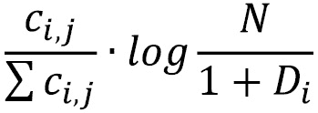

这里，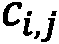表示文档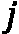中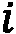的字数，表示语料库中文档的数量，是出现的文档。因此，TF-IDF 分数提升了在文档中重复多次的单词，惩罚了常见的单词，因此这些单词对于文档来说可能不是很有代表性。还有更复杂的算法。

在本书的上下文中，一个非常强大并且值得一提的方法就是`gensim`，它可以以一种简单明了的方式使用:

```py
from gensim.summarization import keywords
text = corpus["clean_text"][0]
 keywords(text, words=10, split=True, scores=True,
         pos_filter=('NN', 'JJ'), lemmatize=True)
```

这会产生以下输出:

```py
[('trading', 0.4615130639538529),
 ('said', 0.3159855693494515),
 ('export', 0.2691553824958079),
 ('import', 0.17462010006456888),
 ('japanese electronics', 0.1360932626379031),
 ('industry', 0.1286043740379779),
 ('minister', 0.12229815662000462),
 ('japan', 0.11434500812642447),
 ('year', 0.10483992409352465)]
```

这里，分数代表中心性，中心性代表给定标记的重要性。可以看到，也可能出现一些复合令牌，比如`japanese electronics`。可以实施关键词提取来计算整个语料库的关键词，从而将信息存储在我们的`corpus`数据框架中:

```py
corpus["keywords"] = corpus["clean_text"].apply(
    lambda text: keywords(
       text, words=10, split=True, scores=True,
       pos_filter=('NN', 'JJ'), lemmatize=True)
)
```

除了关键字之外，为了构建二分图，我们还需要解析由 NER 引擎提取的命名实体，然后以与关键字所使用的数据格式相似的数据格式对信息进行编码。这可以通过几个实用函数来实现:

```py
def extractEntities(ents, minValue=1, 
                    typeFilters=["GPE", "ORG", "PERSON"]):
    entities = pd.DataFrame([
       {
          "lemma": e.lemma_, 
          "lower": e.lemma_.lower(),
          "type": e.label_
       } for e in ents if hasattr(e, "label_")
    ])
    if len(entities)==0:
        return pd.DataFrame()
    g = entities.groupby(["type", "lower"])
    summary = pd.concat({
        "alias": g.apply(lambda x: x["lemma"].unique()),
        "count": g["lower"].count()
    }, axis=1)
    return summary[summary["count"]>1]\
             .loc[pd.IndexSlice[typeFilters, :, :]]

def getOrEmpty(parsed, _type):
    try:  
        return list(parsed.loc[_type]["count"]\
           .sort_values(ascending=False).to_dict().items())
    except:
        return []
def toField(ents):
    typeFilters=["GPE", "ORG", "PERSON"]
    parsed = extractEntities(ents, 1, typeFilters)
    return pd.Series({_type: getOrEmpty(parsed, _type)
                      for _type in typeFilters})
```

有了这些函数，解析`spacy`标签可以用下面的代码来完成:

```py
entities = corpus["parsed"].apply(lambda x: toField(x.ents))
```

使用`pd.concat`函数可以很容易地将`entities`数据帧与`corpus`数据帧合并，从而将所有信息放在一个数据结构中:

```py
merged = pd.concat([corpus, entities], axis=1)
```

现在我们有了二分图的所有要素，我们可以通过循环所有文档-实体或文档-关键字对来创建边列表:

```py
edges = pd.DataFrame([
    {"source": _id, "target": keyword, "weight": score, "type": _type}
    for _id, row in merged.iterrows()
    for _type in ["keywords", "GPE", "ORG", "PERSON"] 
    for (keyword, score) in row[_type]
])
```

一旦边列表被创建，我们就可以使用`networkx`API 生成二分图:

```py
G = nx.Graph()
G.add_nodes_from(edges["source"].unique(), bipartite=0)
 G.add_nodes_from(edges["target"].unique(), bipartite=1)
 G.add_edges_from([
    (row["source"], row["target"])
    for _, row in edges.iterrows()
])
```

现在，我们可以通过使用`nx.info`来查看我们的图概览:

```py
Type: Graph
Number of nodes: 25752
Number of edges: 100311
Average degree:   7.7905
```

在下一小节中，我们将把二分图投射到两组节点中的任何一组:实体或文档。这将允许我们探索两个图之间的差异，并使用第 4 章 *【有监督的图学习】*中描述的 [*无监督技术来聚类术语和文档。然后，我们将回到二分图来展示一个监督分类的例子，我们将通过利用二分图的网络信息来完成。*](B16069_04_Final_JM_ePub.xhtml#_idTextAnchor064)

### 实体-实体图

我们将从把我们的图投影到实体节点集开始。`networkx`提供了一个用于处理二分图的特殊子模块`networkx.algorithms.bipartite`，其中已经实现了许多算法。特别是，`networkx.algorithms.bipartite.projection`子模块提供了许多实用函数，用于在节点子集上投影二分图。在执行投影之前，我们必须使用生成图时创建的“二分”属性提取与特定集合(文档或实体)相关的节点:

```py
document_nodes = {n 
                  for n, d in G.nodes(data=True)
                  if d["bipartite"] == 0}
entity_nodes = {n 
                for n, d in G.nodes(data=True)
                if d["bipartite"] == 1}
```

图投影基本上是用一组选定的节点创建一个新的图。基于两个节点是否有共同的邻居，边是节点之间的位置。基本的`projected_graph`函数创建这样一个带有未加权边的网络。然而，根据公共邻居的数量对边进行加权通常会提供更多信息。`projection`模块根据权重的计算方式提供不同的功能。在下一节中，我们将使用`overlap_weighted_projected_graph`，其中使用基于公共邻居的 Jaccard 相似性来计算边权重。但是，我们鼓励您根据您的使用案例和环境，探索最适合您的目标的其他选项。

#### 注意维度-过滤图

在处理投影时，还有一点需要注意:投影图的尺寸。在某些情况下，就像我们在这里考虑的一样，投影可能会创建大量的边，这使得图很难分析。在我们的用例中，按照我们用来创建网络的逻辑，一个文档节点连接到至少 10 个关键字，外加一些实体。在生成的实体-实体图中，所有这些实体将相互连接，因为它们至少共享一个公共邻居(包含它们的文档)。因此，我们将只为一个文档生成大约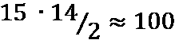边缘。如果我们将这个数字乘以文档的数量，，我们将得到几个边，尽管用例很小，但已经变得几乎难以处理，因为有几百万个边。尽管这肯定代表了一个保守的上限(因为实体之间的一些共现在许多文档中很常见，因此不会重复)，但它提供了您可能预期的复杂性数量级。因此，我们鼓励您在投影二分图之前谨慎行事，这取决于底层网络的拓扑和图的大小。降低这种复杂性并使投影可行的一个技巧是只考虑具有一定度数的实体节点。大部分的复杂性来自于只出现一次或几次的实体，但是仍然会在图中产生*集团*。这样的实体对于捕获模式和提供洞察力来说信息并不丰富。此外，它们可能受到统计可变性的强烈影响。另一方面，我们应该关注由更大的事件支持的强相关性，并提供更可靠的统计结果。

所以我们只会考虑有一定程度的实体节点。为此，我们将生成过滤的二分子图，其排除了具有低度数值的节点，即小于 5:

```py
nodes_with_low_degree = {n 
    for n, d in nx.degree(G, nbunch=entity_nodes) if d<5}
subGraph = G.subgraph(set(G.nodes) - nodes_with_low_degree)
```

现在可以投影该子图，而不会生成具有过多边数的图:

```py
entityGraph = overlap_weighted_projected_graph(
    subGraph,
    {n for n in subGraph.nodes() if n in entity_nodes}
)
```

我们可以用`nx.info`的`networkx`函数检查图的尺寸:

```py
Number of nodes: 2386
Number of edges: 120198
Average degree: 100.7527
```

尽管我们已经应用了过滤器，但是边的数量和平均节点度仍然很大。下图显示了度和边权重的分布，其中我们可以观察到度分布中的一个峰值位于相当低的值处，有一个厚尾向度值较大的方向延伸。此外，边权重显示了类似的行为，在相当低的值处有一个峰值，并且右尾部很厚。这些分布表明存在几个小社区，即集团，它们通过一些中心节点相互连接:

.jpg)

图 7.4-实体-实体网络的度和权重分布

边缘权重的分布也表明可以应用第二滤波器。我们之前在二分图中应用的实体度过滤器允许我们过滤掉只出现在少数文档中的罕见实体。然而，生成的图也可能受到相反问题的影响:流行的实体可能只是因为它们经常出现在文档中而被连接起来，即使它们之间没有有趣的因果关系。以美国和微软为例。它们几乎肯定是有联系的，因为极有可能至少有一个或几个文档同时出现了它们。但是，如果它们之间没有很强的因果联系，那么 Jaccard 相似度很大的可能性很小。只考虑权重最大的边可以让您专注于最相关和可能最稳定的关系。上图中显示的边权重分布表明，合适的阈值可以是`0.05`:

```py
filteredEntityGraph = entityGraph.edge_subgraph(
    [edge 
     for edge in entityGraph.edges
     if entityGraph.edges[edge]["weight"]>0.05])
```

这样的阈值显著减少了边的数量，使得分析网络变得可行:

```py
Number of nodes: 2265
Number of edges: 8082
Average degree:   7.1364   
```

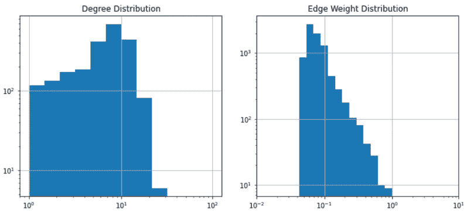

图 7.5-根据边权重过滤后，结果图的度数分布(左)和边权重分布(右)

前面的图显示了过滤图的节点度和边权重的分布。边缘权重的分布对应于图 7.4 中*所示分布的右尾。度分布与*图 7.4* 的关系不太明显，它显示了度约为 10 的节点的峰值，与*图 7.4* 中显示的峰值相反，后者是在低范围内观察到的，约为 100。*

#### 分析图

使用 Gephi 我们可以提供整个网络的概况，如图*图 7.6* 所示。

图如下:

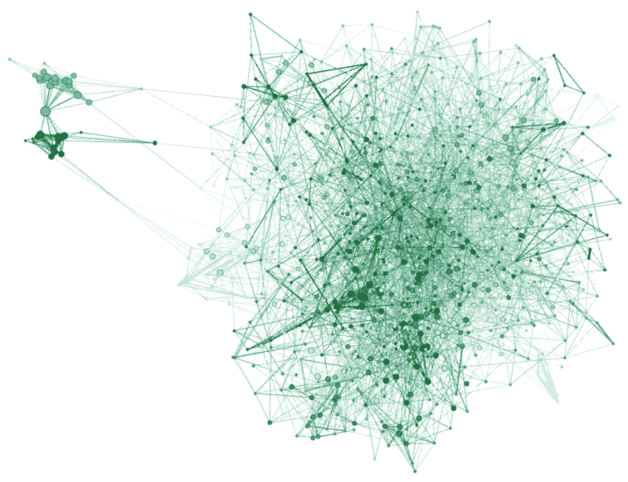

图 7.6-实体-实体网络，突出了多个小型子社区的存在

为了进一步了解网络的拓扑结构，我们还将计算一些全局指标，比如平均最短路径、聚类系数和全局效率。虽然该图有五个不同的连接部分，但最大的一个几乎完全占了整个图，包括 2，265 个节点中的 2，254 个:

```py
components = nx.connected_components(filteredEntityGraph)
 pd.Series([len(c) for c in components])
```

最大组件的全局属性可以通过以下代码找到:

```py
comp = components[0] 
global_metrics = pd.Series({
    "shortest_path": nx.average_shortest_path_length(comp),
    "clustering_coefficient": nx.average_clustering(comp),
    "global_efficiency": nx.global_efficiency(comp)
 })
```

最短路径和全局效率可能需要几分钟的计算。这会产生以下输出:

```py
{
    'shortest_path': 4.715073779178782,
    'clustering_coefficient': 0.21156314975836915,
    'global_efficiency': 0.22735551077454275
}
```

基于这些度量的大小(最短路径约为 5，聚类系数约为 0.2)，加上前面显示的度分布，我们可以看到网络有多个有限大小的社区。其他有趣的本地属性，如度、页面排名和介数中心性分布，显示在下图中，该图显示了所有这些度量如何相互关联:

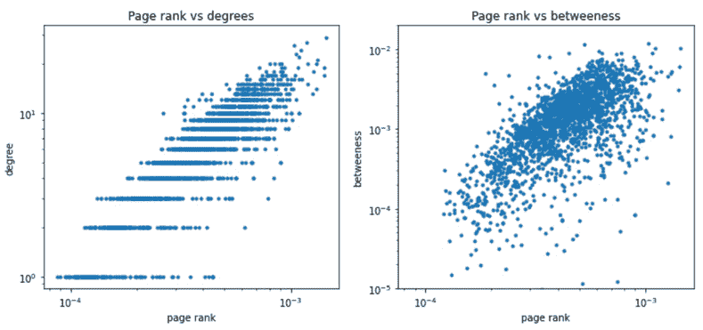

图 7.7-程度、页面等级和中间性中心性测量之间的关系和分布

在提供 loca 方面的描述后；/全局测量，以及网络的一般可视化，我们将应用我们在前面章节中看到的一些技术来识别网络中的一些见解和信息。我们将使用第 4 章 *“有监督的图学习*”中描述的无监督技术来做到这一点。

我们将从使用 Louvain 社区检测算法开始，该算法通过优化其模块性，旨在识别不相交社区中节点的最佳划分:

```py
import community
communities = community.best_partition(filteredEntityGraph)
```

请注意，由于随机种子的原因，结果可能会因运行而异。但是，应该会出现一个类似的分区，其集群成员分布类似于下图所示。我们通常观察大约 30 个社区，较大的社区包含大约 130-150 个文档。

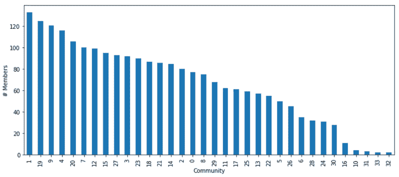

图 7.8-检测到的社区规模分布

*图 7.9* 显示了其中一个社区的特写，在这里我们可以确定一个特定的主题/论点。在左侧，在实体节点旁边，我们还可以看到文档节点，从而揭示相关二分图的结构:

.jpg)

图 7.9-我们已经确定的一个社区的特写

如 [*第四章*](B16069_04_Final_JM_ePub.xhtml#_idTextAnchor064) 、*监督图学习*所示，我们可以通过使用节点嵌入来提取关于实体之间的拓扑和相似性的有见地的信息。特别是，我们可以使用 Node2Vec，它通过向 skip-gram 模型提供随机生成的遍历，可以将节点投影到向量空间中，其中附近的节点被映射到附近的点:

```py
from node2vec import Node2Vec
node2vec = Node2Vec(filteredEntityGraph, dimensions=5) 
model = node2vec.fit(window=10) 
embeddings = model.wv
```

在嵌入的向量空间中，我们可以应用传统的聚类算法，比如*高斯混合*、 *K-means* 和 *DB-scan* 。正如我们在前面章节中所做的，我们也可以使用 t-SNE 将嵌入投影到 2D 平面中，以可视化集群和社区。除了为我们提供另一个选项来识别图中的集群/社区，Node2Vec 还可以用于提供单词之间的相似性，正如传统上由`turkey`完成的，它提供语义相似的单词:

```py
[('turkish', 0.9975333213806152),
 ('lira', 0.9903393983840942),
 ('rubber', 0.9884852170944214),
 ('statoil', 0.9871745109558105),
 ('greek', 0.9846569299697876),
 ('xuto', 0.9830175042152405),
 ('stanley', 0.9809650182723999),
 ('conference', 0.9799597263336182),
 ('released', 0.9793018102645874),
 ('inra', 0.9775203466415405)]
```

尽管 Node2Vec 和 Word2Vec 这两种方法在方法上有一些相似之处，但这两种嵌入方案来自不同类型的信息:Word2Vec 直接从文本构建，并在句子级别包含关系，而 Node2Vec 编码的描述更多地在文档级别起作用，因为它来自二分实体-文档图。

### 文档-文档图

现在，让我们将二分图投影到文档节点集合中，以创建一个我们可以分析的文档-文档网络。以类似于我们创建实体-实体网络的方式，我们将使用`overlap_weighted_projected_graph`函数获得一个加权图，该图可以被过滤以减少重要边的数量。事实上，网络的拓扑和用于构建二分图的业务逻辑不支持集团创建，正如我们在实体-实体图中看到的那样:只有当两个节点共享至少一个关键字、组织、位置或人员时，它们才会连接。正如对实体所观察到的那样，在 10-15 个节点的组中，这当然是可能的，但可能性不大。

正如我们之前所做的那样，我们可以使用以下代码轻松构建我们的网络:

```py
documentGraph = overlap_weighted_projected_graph(
    G,
    document_nodes
)
```

下图显示了度和边权重的分布。这可以帮助我们决定用于滤除边缘的阈值。有趣的是，与实体-实体图中观察到的度分布相比，节点度分布显示出明显的大值峰值。这表明存在大量高度连接的*超级节点*(即度数相当大的节点)。此外，边权重分布显示 Jaccard 指数趋于接近 1 的值，这比我们在实体-实体图中观察到的值大得多。这两个观察强调了两个网络之间的深刻差异:实体-实体图的特征是许多紧密连接的社区(即集团),而文档-文档图的特征是节点之间具有较大程度的紧密连接(构成核心),而不是弱连接或不连接节点的外围:

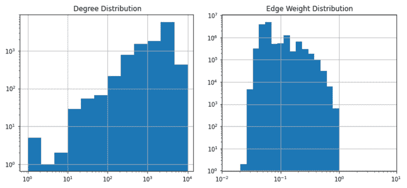

图 7.10-二分图到文档-文档网络的投影的度分布和边权重分布

将所有的边存储在一个数据帧中是很方便的，这样我们可以绘制它们，然后使用它们进行过滤，从而创建一个子图:

```py
allEdgesWeights = pd.Series({
    (d[0], d[1]): d[2]["weight"] 
    for d in documentGraph.edges(data=True)
})
```

通过查看上图，为边权重设置一个阈值`0.6`似乎是合理的，这样我们就可以使用`networkx`的`edge_subgraph`函数生成一个更易处理的网络:

```py
filteredDocumentGraph = documentGraph.edge_subgraph(
    allEdgesWeights[(allEdgesWeights>0.6)].index.tolist()
)
```

下图显示了简化图的度和边权重的结果分布:

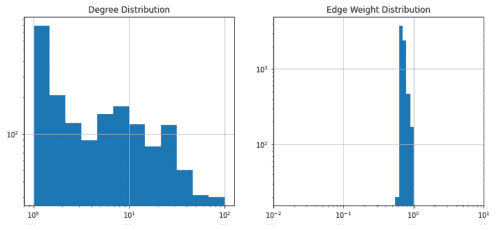

图 7.11-文档-文档过滤网络的度分布和边权重分布

文档-文档图相对于实体-实体图在拓扑结构上的显著差异也可以在下图中清楚地看到，该图示出了完整的网络可视化。正如分发所预期的那样，文件-文件网络的特点是有一个核心网络和几个每周连接的卫星。这些卫星代表共享零个或几个关键词或实体共同出现的所有文档。断开的文档数量相当大，几乎占总数的 50%:

.jpg)

图 7.12-(左)表示文档-文档过滤网络，突出了核心和外围的存在。(右)核心特写，嵌入了一些子社区。节点大小与节点度数成正比

使用以下命令为这个网络提取连接的组件可能是值得的:

```py
components = pd.Series({
    ith: component 
    for ith, component in enumerate(
        nx.connected_components(filteredDocumentGraph)
    )
})
```

在下图中，我们可以看到连接组件大小的分布。在这里，我们可以清楚地看到一些非常大的集群(核心)，以及大量不相连或非常小的组件(外围或卫星)。这种结构与我们在实体-实体图中观察到的结构明显不同，在实体-实体图中，所有节点都是由一个非常大的连接集群生成的:


图 7.13–连接组件大小的分布，强调了许多小型社区(代表外围)和一些大型社区(代表核心)的存在

进一步研究核心组件的结构可能会很有趣。我们可以用下面的代码从全图中提取由网络的最大组件组成的子图:

```py
coreDocumentGraph = nx.subgraph(
    filteredDocumentGraph,
    [node 
     for nodes in components[components.apply(len)>8].values
     for node in nodes]
)
```

我们可以使用`nx.info`来检查核心网络的属性:

```py
Type: Graph
Number of nodes: 1050
Number of edges: 7112
Average degree:  13.5467
```

图 7.12 中的左图显示了堆芯的 Gephi 可视化。正如我们所看到的，核心由几个社区组成，还有一些节点，这些节点之间的连接程度相当大。

正如我们对实体-实体网络所做的那样，我们可以处理网络来识别嵌入图中的社区。然而，与我们以前所做的不同，文档-文档图现在提供了一种使用文档标签来判断聚类的方法。事实上，我们期望属于相同主题的文档是紧密的，并且相互连接的。此外，正如我们将很快看到的，这也将允许我们识别主题之间的相似性。

首先，让我们从提取候选社区开始:

```py
import community
communities = pd.Series(
    community.best_partition(filteredDocumentGraph)
)
```

然后，我们将提取每个社区内的主题混合，以查看主题之间是否存在同质性(所有文档属于同一类)或某种相关性:

```py
from collections import Counter
def getTopicRatio(df):
    return Counter([label 
                    for labels in df["label"] 
                    for label in labels])

communityTopics = pd.DataFrame.from_dict({
    cid: getTopicRatio(corpus.loc[comm.index])
    for cid, comm in communities.groupby(communities)
 }, orient="index")
normalizedCommunityTopics = (
    communityTopics.T / communityTopics.sum(axis=1)
).T
```

`normalizedCommunityTopics`是一个数据框架，为每个社区(数据框架中的行)提供不同主题(沿列轴)的主题混合(百分比)。为了量化集群/社区内主题混合的异质性，我们必须计算每个社区的香农熵:

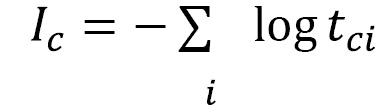

这里，代表聚类的熵，，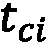对应话题在社区中的百分比。我们必须计算所有群落的经验香农熵:

```py
normalizedCommunityTopics.apply(
    lambda x: np.sum(-np.log(x)), axis=1)
```

下图显示了所有社区的熵分布。大多数社区具有零熵或非常低的熵，因此表明属于相同类别(标签)的文档倾向于聚集在一起:


图 7.14–每个社区中主题混合的熵分布

即使大多数社区围绕主题表现出零或低可变性，当社区表现出一些异质性时，调查主题之间是否存在关系也是有趣的。也就是说，我们计算主题分布之间的相关性:

```py
topicsCorrelation = normalizedCommunityTopics.corr().fillna(0)
```

然后可以使用主题-主题网络来表示和可视化这些内容:

```py
topicsCorrelation[topicsCorrelation<0.8]=0
topicsGraph = nx.from_pandas_adjacency(topicsCorrelation)
```

下图的左侧显示了主题网络的完整图。正如对文档-文档网络所观察到的，主题-主题图显示了在不连接的节点的外围和强连接的核心中组织的结构。下图的右侧显示了核心网络的特写。这表明有语义支持的相关性，与商品相关的主题彼此紧密相连:

.jpg)

图 7.15-(左)主题-主题关联图，以外围-核心结构组织。(右)网络核心的特写

在这一节中，我们分析了在分析文档和更一般的文本源时出现的不同类型的网络。为了做到这一点，我们使用全局和局部属性来统计地描述网络，以及一些无监督的算法，这使我们能够揭示图中的一些结构。在下一节中，我们将向您展示在构建机器学习模型时如何利用这些图结构。

# 构建文档主题分类器

为了向您展示如何利用图结构，我们将重点关注使用二分实体-文档图提供的拓扑信息和实体之间的连接来训练多标签分类器。这将帮助我们预测文档主题。为此，我们将分析两种不同的方法:

*   **一种浅层机器学习方法**，其中我们将使用我们从二分网络中提取的嵌入来训练*传统的*分类器，例如随机森林分类器。
*   **一种更加集成和可区分的方法**基于使用图神经网络，该网络已应用于异构图(如二分图)。

让我们考虑前 10 个主题，我们有足够的文档来训练和评估我们的模型:

```py
from collections import Counter
topics = Counter(
    [label 
     for document_labels in corpus["label"] 
     for label in document_labels]
).most_common(10)
```

前面的代码块产生以下输出。这显示了主题的名称，我们将在下面的分析中关注所有这些主题:

```py
[('earn', 3964), ('acq', 2369), ('money-fx', 717), 
('grain', 582), ('crude', 578), ('trade', 485), 
('interest', 478), ('ship', 286), ('wheat', 283), 
('corn', 237)]
```

当训练主题分类器时，我们必须将我们的焦点限制在属于这些标签的那些文档上。通过使用以下代码块，可以很容易地获得过滤后的语料库:

```py
topicsList = [topic[0] for topic in topics]
 topicsSet = set(topicsList)
dataset = corpus[corpus["label"].apply(
    lambda x: len(topicsSet.intersection(x))>0
)]
```

现在我们已经提取并结构化了数据集，我们准备开始训练我们的主题模型并评估它们的性能。在下一节中，我们将从使用浅层学习方法创建一个简单的模型开始，这样我们就可以通过使用图神经网络来增加模型的复杂性。

## 浅薄的学习方法

我们将从利用网络信息实现主题分类任务的浅层方法开始。我们将向您展示如何做到这一点，以便您可以根据您的使用情形进一步定制:

1.  First, we will compute the embeddings by using `Node2Vec` on the bipartite graph. Filtered document-document networks are characterized by a periphery with many nodes that are disconnected, so they would not benefit from topological information. On the other hand, the unfiltered document-document network will have many edges, which makes the scalability of the approach an issue. Therefore, using the bipartite graph is crucial in order to efficiently leverage the topological information and the connection between entities and documents:

    ```py
    from node2vec import Node2Vec
    node2vec = Node2Vec(G, dimensions=10) 
    model = node2vec.fit(window=20) 
    embeddings = model.wv 
    ```

    在这里，`dimension`嵌入，以及我们的`window`，用于生成行走，是必须通过交叉验证优化的超参数。

2.  To make this computationally efficient, a set of embeddings can be computed beforehand, saved to disk, and then be used in the optimization process. This would work based on the assumption that we are in a *semi-supervised* setting or in a *transductive* task, where we have connection information about the entire dataset, apart from their labels, at training time. Later in this chapter, we will outline another approach, based on graph neural networks, that provides an inductive framework for integrating topology when training classifiers. Let's store the embeddings in a file:

    ```py
    pd.DataFrame(embeddings.vectors,
                 index=embeddings.index2word
    ).to_pickle(f"graphEmbeddings_{dimension}_{window}.p")
    ```

    在这里，我们可以为`dimension`和`window`选择和循环不同的值。对于这两个变量，一些可能的选择是 10、20 和 30。

3.  这些嵌入可以集成到一个 scikit-learn `transformer`中，这样它们就可以在网格搜索交叉验证过程中使用:

    ```py
    from sklearn.base import BaseEstimator class EmbeddingsTransformer(BaseEstimator):     def __init__(self, embeddings_file):         self.embeddings_file = embeddings_file             def fit(self, *args, **kwargs):         self.embeddings = pd.read_pickle(             self.embeddings_file)         return self             def transform(self, X):         return self.embeddings.loc[X.index]         def fit_transform(self, X, y):         return self.fit().transform(X)
    ```

4.  To build a modeling training pipeline, we will split our corpus into training and test sets:

    ```py
    def train_test_split(corpus):
        indices = [index for index in corpus.index]
        train_idx = [idx 
                     for idx in indices 
                     if "training/" in idx]
        test_idx = [idx 
                    for idx in indices 
                    if "test/" in idx]
        return corpus.loc[train_idx], corpus.loc[test_idx]
    train, test = train_test_split(dataset)
    ```

    我们还将构建函数来方便地提取特征和标签:

    ```py
    def get_features(corpus):
        return corpus["parsed"]
    def get_labels(corpus, topicsList=topicsList):
        return corpus["label"].apply(
            lambda labels: pd.Series(
               {label: 1 for label in labels}
            ).reindex(topicsList).fillna(0)
        )[topicsList]
    def get_features_and_labels(corpus):
        return get_features(corpus), get_labels(corpus)
    features, labels = get_features_and_labels(train)
    ```

5.  现在，我们可以实例化建模管道:

    ```py
    from sklearn.pipeline import Pipeline from sklearn.ensemble import RandomForestClassifier  from sklearn.multioutput import MultiOutputClassifier pipeline = Pipeline([     ("embeddings", EmbeddingsTransformer(         "my-place-holder")     ),     ("model", MultiOutputClassifier(         RandomForestClassifier())     ) ])
    ```

6.  让我们定义参数空间，作为以及配置，用于交叉验证的网格搜索:

    ```py
    from glob import glob param_grid = {     "embeddings__embeddings_file": glob("graphEmbeddings_*"),     "model__estimator__n_estimators": [50, 100],     "model__estimator__max_features": [0.2,0.3, "auto"],  } grid_search = GridSearchCV(     pipeline, param_grid=param_grid, cv=5, n_jobs=-1)
    ```

7.  最后，让我们通过使用 sklearn API 的`fit`方法来训练我们的主题模型:

    ```py
    model = grid_search.fit(features, labels)
    ```

太好了！您刚刚创建了您的主题模型，它利用了图的信息。一旦确定了最佳模型，我们就可以在测试数据集上使用该模型来评估其性能。为此，我们必须定义以下帮助函数，它允许我们获得一组预测:

```py
def get_predictions(model, features):
    return pd.DataFrame(
        model.predict(features),
        columns=topicsList, index=features.index)
preds = get_predictions(model, get_features(test))
 labels = get_labels(test)
```

使用`sklearn`功能，我们可以快速查看经过训练的分类器的性能:

```py
from sklearn.metrics import classification_report
print(classification_report(labels, preds))
```

这提供了以下输出，它显示了 F1 分数收到的总体绩效度量。这大约是 0.6-0.8，取决于不平衡等级的计算方式:

```py
              precision    recall  f1-score   support
           0       0.97      0.94      0.95      1087
           1       0.93      0.74      0.83       719
           2       0.79      0.45      0.57       179
           3       0.96      0.64      0.77       149
           4       0.95      0.59      0.73       189
           5       0.95      0.45      0.61       117
           6       0.87      0.41      0.56       131
           7       0.83      0.21      0.34        89
           8       0.69      0.34      0.45        71
           9       0.61      0.25      0.35        56
   micro avg       0.94      0.72      0.81      2787
   macro avg       0.85      0.50      0.62      2787
weighted avg       0.92      0.72      0.79      2787
 samples avg       0.76      0.75      0.75      2787
```

在对嵌入进行编码时，您可以摆弄分析管道的类型和超参数，改变模型，并试验不同的值。正如我们之前提到的，前面的方法显然是直推式的，因为它使用了在整个数据集上训练的嵌入。这是半监督任务中的常见情况，其中标记的信息只存在于点的小子集中，任务是推断所有未知样本的标签。在下一小节中，我们将概述如何使用图神经网络构建归纳分类器。当训练时测试样本未知时，可以使用这些方法。

## 图神经网络

现在，让我们描述一种基于神经网络的方法，该方法本身集成并利用了图结构。图神经网络在 [*第三章*](B16069_03_Final_JM_ePub.xhtml#_idTextAnchor046)*无监督图学习*[*第四章*](B16069_04_Final_JM_ePub.xhtml#_idTextAnchor064)*有监督图学习*中有介绍。然而，在这里，我们将向您展示如何将这个框架应用于异构图；也就是说，图中有一种以上的节点。每种节点类型可能有不同的功能集，训练可能只针对一种特定的节点类型。

我们将在这里展示的方法将利用我们之前描述过的`stellargraph`和`GraphSAGE`算法。这些方法还支持对每个节点使用特征，而不是仅仅依赖于图的拓扑。如果你没有任何节点特征，可以用单热点节点表示法代替，如 [*第六章*](B16069_06_Final_JM_ePub.xhtml#_idTextAnchor100) 、*社交网络图*所示。然而，在这里，为了使事情更加通用，我们将根据每个实体和关键字的 TF-IDF 得分(我们前面已经看到了)生成一组节点特性。在这里，我们将向您展示一个分步指南，帮助您训练和评估一个基于图神经网络的模型，用于预测文档主题分类:

1.  Let's start by computing the TF-IDF score for each document. `sklearn` already provides some functionalities that allow us to easily compute the TF-IDF scores from a corpus of documents. The `TfidfVectorizer` `sklearn` class already comes with a `tokenizer` embedded. However, since we already have a tokenized and lemmatized version that we extracted with `spacy`, we can also provide an implementation of a custom tokenizer that leverages on spaCy processing:

    ```py
    def my_spacy_tokenizer(pos_filter=["NOUN", "VERB", "PROPN"]):
        def tokenizer(doc):
            return [token.lemma_ 
                    for token in doc 
                    if (pos_filter is None) or 
                       (token.pos_ in pos_filter)] 
        return tokenizer 
    ```

    这个可以用在`TfidfVectorizer`:

    ```py
    cntVectorizer = TfidfVectorizer(
        analyzer=my_spacy_tokenizer(),
        max_df = 0.25, min_df = 2, max_features = 10000
    )
    ```

    为了使这种方法真正具有归纳性，我们将只为训练集训练 TF-IDF。这只适用于测试集:

    ```py
    trainFeatures, trainLabels = get_features_and_labels(train)
    testFeatures, testLabels = get_features_and_labels(test)
    trainedIDF = cntVectorizer.fit_transform(trainFeatures)
    testIDF = cntVectorizer.transform(testFeatures)
    ```

    为了方便起见，两个 TF-IDF 表示(用于训练集和测试集)现在可以堆叠在一起成为一个单一数据结构，表示整个图的文档节点的特征:

    ```py
    documentFeatures = pd.concat([trainedIDF, testIDF])
    ```

2.  除了文档节点的特征信息，我们还将为实体构建一个简单的特征向量，基于实体类型的一键编码表示:

    ```py
    entityTypes = {     entity: ith      for ith, entity in enumerate(edges["type"].unique()) } entities = edges\     .groupby(["target", "type"])["source"]\     .count()\     .groupby(level=0).apply(         lambda s: s.droplevel(0)\                    .reindex(entityTypes.keys())\                    .fillna(0))\     .unstack(level=1) entityFeatures = (entities.T / entities.sum(axis=1))
    ```

3.  We now have all the information we need to create an instance of a `StellarGraph`. We will do this by merging the information of the node features, both for documents and for entities, with the connections provided by the `edges` DataFrame. We should only filter out some of the edges/nodes so that we only include the documents that belong to the targeted topics:

    ```py
    from stellargraph import StellarGraph
    _edges = edges[edges["source"].isin(documentFeatures.index)]
    nodes = {«entity»: entityFeatures, 
             «document»: documentFeatures}
    stellarGraph = StellarGraph(
        nodes, _edges,
        target_column=»target», edge_type_column=»type»
    )
    ```

    就这样，我们创造了我们的`StellarGraph`。我们可以使用以下命令检查网络，类似于我们对`networkx`所做的:

    ```py
    print(stellarGraph.info())
    ```

    这产生了概述之后的:

    ```py
    StellarGraph: Undirected multigraph
     Nodes: 23998, Edges: 86849
    Node types:
      entity: [14964]
        Features: float32 vector, length 6
        Edge types: entity-GPE->document, entity-ORG->document, entity-PERSON->document, entity-keywords->document
      document: [9034]
        Features: float32 vector, length 10000
        Edge types: document-GPE->entity, document-ORG->entity,
     document-PERSON->entity, document-keywords->entity
    Edge types:
        document-keywords->entity: [78838]
            Weights: range=[0.0827011, 1], mean=0.258464,
     std=0.0898612
            Features: none
        document-ORG->entity: [4129]
            Weights: range=[2, 22], mean=3.24122, std=2.30508
            Features: none
        document-GPE->entity: [2943]
            Weights: range=[2, 25], mean=3.25926, std=2.07008
            Features: none
        document-PERSON->entity: [939]
            Weights: range=[2, 14], mean=2.97444, std=1.65956
            Features: none
    ```

    `StellarGraph`的描述实际上提供了很多信息。此外，`StellarGraph`本身还处理不同类型的节点和边，并为每个节点/边类型提供现成的分段统计。

4.  You may have noted that the graph we just created includes both training and test data. To truly test the performance of an inductive approach and avoid information from being linked between the train and test sets, we need to create a subgraph that only contains the data available at training time:

    ```py
    targets = labels.reindex(documentFeatures.index).fillna(0)
     sampled, hold_out = train_test_split(targets)
    allNeighbors = np.unique([n 
        for node in sampled.index 
        for n in stellarGraph.neighbors(node)
    ])
    subgraph = stellarGraph.subgraph(
        set(sampled.index).union(allNeighbors)
    )
    ```

    与整个图中的 23，998 个节点和 86，849 条边相比，所考虑的子图包含 16，927 个节点和 62，454 条边。

5.  现在我们只有训练时可用的数据和网络，我们可以在它的基础上建立我们的机器学习模型。为此，我们将把数据分为训练、验证和测试数据。对于训练，我们将只使用 10%的数据，这类似于半监督任务:

    ```py
    from sklearn.model_selection import train_test_split train, leftOut = train_test_split(     sampled,     train_size=0.1,     test_size=None,     random_state=42 ) validation, test = train_test_split(     leftOut, train_size=0.2, test_size=None, random_state=100, ) 
    ```

6.  Now, we can start to build our graph neural network model using `stellargraph` and the `keras` API. First, we will create a generator able to produce the samples that will feed the neural network. Note that, since we are dealing with a heterogeneous graph, we need a generator that will sample examples from nodes that only belong to specific class. Here, we will be using the `HinSAGENodeGenerator` class, which generalizes the node generator we used for the homogeneous graph into heterogeneous graphs, allowing us to specify the node type we want to target:

    ```py
    from stellargraph.mapper import HinSAGENodeGenerator
    batch_size = 50
    num_samples = [10, 5]
    generator = HinSAGENodeGenerator(
        subgraph, batch_size, num_samples,
        head_node_type="document"
    )
    ```

    使用这个对象，我们可以为训练和验证数据集创建一个生成器:

    ```py
    train_gen = generator.flow(train.index, train, shuffle=True)
     val_gen = generator.flow(validation.index, validation)
    ```

7.  Now, we can create our GraphSAGE model. As we did for the generator, we need to use a model that can handle heterogenous graphs. Here, `HinSAGE` will be used in place of `GraphSAGE`:

    ```py
    from stellargraph.layer import HinSAGE
    from tensorflow.keras import layers
    graphsage_model = HinSAGE(
        layer_sizes=[32, 32], generator=generator,
        bias=True, dropout=0.5
    )
    x_inp, x_out = graphsage_model.in_out_tensors()
    prediction = layers.Dense(
        units=train.shape[1], activation="sigmoid"
    )(x_out)
    ```

    注意，在最终的密集层中，我们使用了一个 *sigmoid* 激活函数，而不是一个 *softmax* 激活函数，因为手头的问题是一个多类、多标签的任务。因此，一个文档可能属于多个类，在这种情况下，sigmoid 激活函数似乎是更明智的选择。像往常一样，我们将编译我们的 Keras 模型:

    ```py
    from tensorflow.keras import optimizers, losses, Model
    model = Model(inputs=x_inp, outputs=prediction)
    model.compile(
        optimizer=optimizers.Adam(lr=0.005),
        loss=losses.binary_crossentropy,
        metrics=["acc"]
    )
    ```

8.  Finally, we will train the neural network model:

    ```py
    history = model.fit(
        train_gen, epochs=50, validation_data=val_gen,
        verbose=1, shuffle=False
    )
    ```

    这会产生以下输出:

    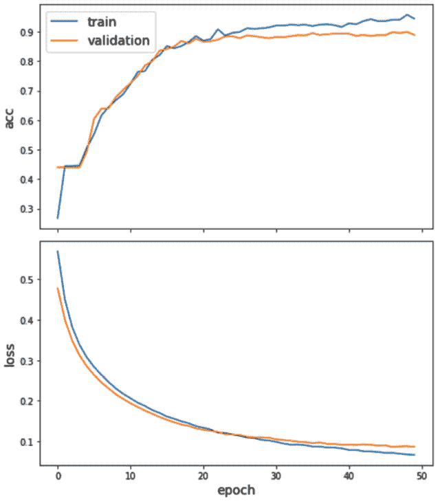

    图 7.16—(顶部)训练和验证准确度与历元数的关系。(底部)训练和验证数据集的二元交叉熵损失与历元数的关系

    前面的图显示了训练和验证损失和准确度相对于历元数的演变图。正如我们所看到的，训练和验证的准确性持续增加，达到大约 30 个时期。在这里，验证集的精度稳定在*平台*，而训练精度继续增加，表明有过度拟合的趋势。因此，在 50 岁左右停止训练似乎是一个相当合理的选择。

9.  Once the model has been trained, we can test its performance on the test set:

    ```py
    test_gen = generator.flow(test.index, test)
     test_metrics = model.evaluate(test_gen)
    ```

    这应该提供以下值:

    ```py
    loss: 0.0933
    accuracy: 0.8795
    ```

    请注意，由于不平衡的标签分布，准确性可能不是评估性能的最佳选择。此外，值 0.5 通常用于阈值，因此在不平衡的设置中提供标签分配也可能是次优的。

10.  To identify the best threshold to be used to classify the documents, we will compute the prediction over all the test samples:

    ```py
    test_predictions = pd.DataFrame(
        model.predict(test_gen), index=test.index,
        columns=test.columns)
    test_results = pd.concat({
        "target": test,
        "preds": test_predictions
    }, axis=1)
    ```

    然后，我们将针对不同的阈值选择，使用一个宏观平均值(单个类别的 F1 分数的平均值)来计算 F1 分数:

    ```py
    thresholds = [0.01,0.05,0.1,0.2,0.3,0.4,0.5] 
    f1s = {}
    for th in thresholds:
        y_true = test_results["target"]
        y_pred = 1.0*(test_results["preds"]>th)
        f1s[th] = f1_score(y_true, y_pred, average="macro")    
    pd.Series(f1s).plot()
    ```

    如下图所示，阈值 0.2 似乎是最佳选择，因为它实现了最佳性能:

    

    图 7.17–宏观平均 F1 分数与用于标记的阈值

11.  Using a threshold value of 0.2, we can extract the classification report for the test set:

    ```py
    print(classification_report(
        test_results["target"], 1.0*(test_results["preds"]>0.2))
    )
    ```

    这为我们提供了以下输出:

    ```py
                  precision    recall  f1-score   support
               0       0.92      0.97      0.94      2075
               1       0.85      0.96      0.90      1200
               2       0.65      0.90      0.75       364
               3       0.83      0.95      0.89       305
               4       0.86      0.68      0.76       296
               5       0.74      0.56      0.63       269
               6       0.60      0.80      0.69       245
               7       0.62      0.10      0.17       150
               8       0.49      0.95      0.65       149
               9       0.44      0.88      0.58       129
       micro avg       0.80      0.89      0.84      5182
       macro avg       0.70      0.78      0.70      5182
    weighted avg       0.82      0.89      0.84      5182
     samples avg       0.83      0.90      0.85      5182
    ```

12.  At this point, we have trained a graph neural network model and assessed its performance. Now, let's apply this model to a set of unobserved data – the data that we left out at the very beginning – and represent the true test data in an inductive setting. To do this, we need to instantiate a new generator:

    ```py
    generator = HinSAGENodeGenerator(
        stellarGraph, batch_size, num_samples,
        head_node_type="document")
    ```

    注意，我们从`HinSAGENodeGenerator`获取的输入图现在是整个图(代替我们之前使用的过滤图)，它包含了训练和测试文档。使用这个类，我们可以创建一个生成器，它只从测试节点中抽取样本，过滤掉那些不属于我们主要选择的主题之一的样本:

    ```py
    hold_out = hold_out[hold_out.sum(axis=1) > 0]
    hold_out_gen = generator.flow(hold_out.index, hold_out)
    ```

13.  The model can then be evaluated over these samples, and the labels are predicted using the threshold we identified earlier; that is, 0.2:

    ```py
    hold_out_predictions = model.predict(hold_out_gen)
    preds = pd.DataFrame(1.0*(hold_out_predictions > 0.2),
                         index = hold_out.index,
                         columns = hold_out.columns)
    results = pd.concat(
        {"target": hold_out,"preds": preds}, axis=1
    )
    ```

    最后，我们可以提取归纳测试数据集的性能:

    ```py
    print(classification_report(
        results["target"], results["preds"])
    )
    ```

    这会生成下表:

    ```py
                  precision    recall  f1-score   support
               0       0.93      0.99      0.96      1087
               1       0.90      0.97      0.93       719
               2       0.64      0.92      0.76       179
               3       0.82      0.95      0.88       149
               4       0.85      0.62      0.72       189
               5       0.74      0.50      0.59       117
               6       0.60      0.79      0.68       131
               7       0.43      0.03      0.06        89
               8       0.50      0.96      0.66        71
               9       0.39      0.86      0.54        56
       micro avg       0.82      0.89      0.85      2787
       macro avg       0.68      0.76      0.68      2787
    weighted avg       0.83      0.89      0.84      2787
    samples avg       0.84      0.90      0.86      2787
    ```

与浅层学习方法相比，我们可以看到我们在性能上取得了 5-10%的实质性提高。

# 总结

在本章中，您学习了如何处理非结构化信息，以及如何使用图来表示这些信息。从一个众所周知的基准数据集 Reuters-21578 数据集开始，我们应用标准的 NLP 引擎来标记和结构化文本信息。然后，我们使用这些高级特征来创建不同类型的网络:基于知识的网络、二分网络、节点子集的投影以及与数据集主题相关的网络。这些不同的图还允许我们使用我们在前面章节中介绍的工具从网络表示中提取洞察力。

我们使用局部和全局属性向您展示这些量如何表示和描述结构上不同类型的网络。然后，我们使用非监督技术来识别语义社区，并对属于相似主题/话题的文档进行聚类。最后，我们使用数据集中提供的标记信息来训练有监督的多类多标记分类器，这也利用了网络的拓扑结构。

然后，我们将监督技术应用于异构图，其中存在两种不同的节点类型:文档和实体。在这种情况下，我们向您展示了如何分别使用浅层学习和图神经网络来实现直推式和归纳式方法。

在下一章中，我们将着眼于另一个领域，在这个领域中，图分析可以有效地用于提取洞察力和/或创建利用网络拓扑的机器学习模型:交易数据。下一个用例也将允许你把本章介绍的二分图概念推广到另一个层次:三分图。