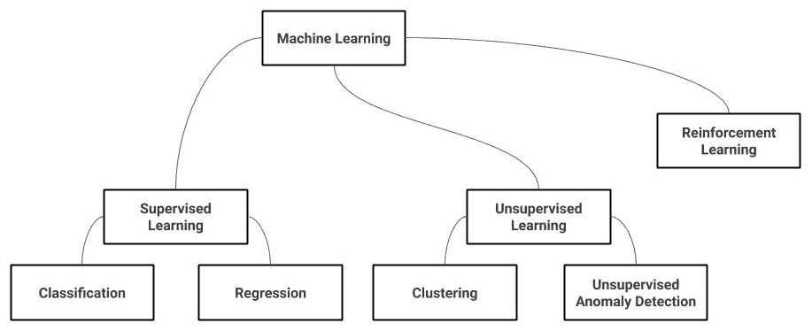
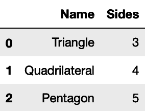
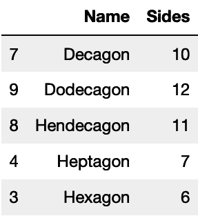

<title>Introduction to Machine Learning</title>  Introduction to Machine Learning

机器学习无处不在。当你预订机票时，一种算法会决定你将要支付的价格。当你申请贷款时，机器学习可能会决定你是否会获得贷款。当你在脸书时间线上滚动时，它会选择向你展示哪些广告。机器学习在你的谷歌搜索结果中也起着很大的作用。它会整理你的电子邮件收件箱，过滤垃圾邮件，当你申请工作时，它会在招聘人员面前检查你的简历，最近，它还开始以 Siri 和其他虚拟助理的形式扮演你的个人助理的角色。

在本书中，我们将学习机器学习的理论和实践。我们将理解何时以及如何应用它。为了开始，我们将查看机器学习如何工作的高级介绍。然后你将能够区分不同的机器学习范例，并知道何时使用它们。然后，您将被引导通过模型开发生命周期和实践者解决问题的不同步骤。最后，我们将向您介绍 scikit-learn，并了解为什么它是许多从业者的事实上的工具。

以下是第一章将涵盖的主题列表:

*   理解机器学习
*   模型开发生命周期
*   scikit 简介-了解
*   安装您需要的软件包

# 理解机器学习

你可能想知道机器实际上是如何学习的。为了得到这个问题的答案，让我们以一个虚构的公司为例。**航天飞机公司**有一些太空飞行器出租。他们每天都收到想去火星旅行的客户的申请。他们不确定这些客户是否会归还车辆——也许他们会决定继续在火星上生活，永远不再回来。更糟糕的是，一些客户可能是糟糕的飞行员，并在途中撞毁他们的车辆。因此，该公司决定雇用班车租赁审批人员，他们的工作是审查申请并决定谁值得乘坐班车。然而，他们的业务增长如此之大，以至于他们需要制定航天飞机审批流程。

传统的班车公司会从制定商业规则和雇佣初级员工来执行这些规则开始。例如，如果你是一个外国人，那么对不起，你不能从我们这里租一辆穿梭机。如果你是一个人类，并且你有在地球上学的孩子，那么你非常欢迎租一架我们的穿梭机。如你所见，这些规则太宽泛了。那些热爱生活在地球上，只想去火星快速度假的外星人怎么办？为了制定更好的商业政策，公司开始雇佣分析师。他们的工作是翻阅历史数据，试图得出详细的规则或业务逻辑。这些分析师可以提出非常详细的规则。如果你是一个外星人，你的父母之一来自海王星，你的年龄在 0.1 到 0.2 海王星年之间，你有 3 到 4 个孩子，其中一个是 80%或更多的人类，那么你可以租一辆穿梭巴士。为了能够提出合适的规则，分析师还需要一种方法来衡量这个业务逻辑有多好。例如，如果应用某些规则，航天飞机返回的百分比是多少？他们使用历史数据来评估这些措施，只有这样我们才能说这些规则实际上是从数据中学来的。

机器学习的工作方式几乎相同。您希望使用历史数据来提出一些业务逻辑(一种算法)，以便优化一些衡量逻辑好坏的标准(一个目标或损失函数)。贯穿这本书，我们将了解众多的机器学习算法；它们在如何表示业务逻辑、使用什么目标函数以及利用什么优化技术来达到最大化(有时最小化)目标函数的模型方面互不相同。像前面例子中的分析师一样，您应该选择一个尽可能接近您的业务目标的目标函数。每当你听到人们说数据科学家应该对他们的业务有很好的理解，其中很重要的一部分是他们选择一个好的目标函数和方法来评估他们建立的模型。在我的例子中，我很快选择了羽毛球返回的百分比作为我的目标。

但仔细想想，这真的是穿梭公司营收的精确一对一映射吗？允许一次旅行所获得的收益等于失去一次穿梭的成本吗？此外，拒绝一次旅行也可能会让你的公司损失打给客户服务中心的愤怒电话和负面的口碑广告。在选择目标函数之前，你必须充分理解所有这些。

最后，使用机器学习的一个关键好处是，它可以迭代大量的业务逻辑案例，直到它达到最佳目标函数，不像我们航天飞机公司的分析师那样，他们只能按照他们的规则走这么远。机器学习方法也是自动化的，因为每当新数据到来时，它都会不断更新业务逻辑。这两个方面使它具有可伸缩性、更高的准确性和适应变化的能力。

## 机器学习算法的类型

“社会在变，一次一个学习算法。”

佩德罗·多明戈斯

在本书中，我们将涵盖机器学习的两种主要范式——监督学习和非监督学习。这两个范例都有自己的子分支，将在下一节中讨论。虽然本书没有涉及，但强化学习也将在下一节介绍:



让我们再次使用我们虚构的航天飞机公司来解释不同机器学习范例之间的差异。

### 监督学习

还记得在学校的那些美好时光吗？那时给你一些例子来练习，最后还有正确的答案来验证你是否做得很好。然后，到了考试时间，就剩下你一个人了。这就是监督学习的基本内容。假设我们虚构的太空飞行器公司想要预测旅行者是否会归还他们的太空飞行器。幸运的是，该公司过去与许多旅行者合作过，他们已经知道哪些人归还了车辆，哪些人没有。可以把这些数据想象成一个电子表格，每一列都有一些关于旅行者的信息——他们的财务报表，他们有多少个孩子，他们是人类还是外星人，也许还有他们的年龄(当然是以海王星年为单位)。机器学习者称这些列为**特征**。对于以前的旅行者，有一个额外的列说明他们是否返回；我们称这个列为**标签**或**目标**列。在学习阶段，我们使用特性和目标建立一个模型。学习时算法的目标是最小化其预测和实际目标之间的差异。区别就是我们所说的误差。一旦构建了一个模型，使其误差最小，我们就可以用它来预测新的数据点。对于新的旅行者，我们只知道他们的特征，但是我们使用我们刚刚建立的模型来预测他们相应的目标。简而言之，目标在我们的历史数据中的存在使得这个过程受到监督。

#### 分类与回归

监督学习进一步细分为分类和回归。对于我们只有几个预定义标签要预测的情况，我们使用一个分类器——例如，*返回*对*不返回*或者*人类*对*火星人*对*金星人*。如果我们想要预测的是一个大范围的数字，比如一个旅行者需要多少年才能回来，那么这就是一个回归问题，因为这些值可以是从 1 年或 2 年到 3 年 5 个月 7 天的任何值。

#### 监督学习评估

由于它们之间的差异，我们用来评估这些分类器的指标通常不同于我们用于回归的指标:

*   **分类器评估指标**:假设我们使用一个分类器来确定一个旅行者是否会返回。然后，在分类器预测会返回的旅行者中，我们想要测量他们实际返回的百分比。我们称这种测量为**精度**。此外，在所有返回的旅行者中，我们想要测量分类器正确预测返回的百分比。我们称之为**召回**。可以为每个类计算精度和召回率，也就是说，我们还可以为没有返回的旅行者计算精度和召回率。

**准确性**是另一个常用的，有时也是被滥用的衡量标准。对于我们历史数据中的每一个案例，我们知道一个旅行者是否真的回来了(**实际值**)，我们还可以生成他们是否会回来的**预测值**。精确度计算预测和实际相符的案例百分比。如你所见，它被标记为**不可知论者**，所以当职业高度不平衡时，它有时会产生误导。在我们的示例业务中，假设 99%的旅行者实际上会返回。我们可以建立一个虚拟分类器来预测是否每个旅行者都会回来；它 99%的时候都是准确的。这个 99%的准确率值并不能告诉我们太多，特别是如果你知道在这些情况下，对于非返回旅行者的召回值是 0%。正如我们将在本书后面看到的，每个度量都有它的优点和缺点，度量的好坏取决于它与我们的业务目标的接近程度。我们还将了解其他指标，如 **F [1] 得分**、 **AUC** 和**日志损失**。

*   **回归变量评估指标**:如果我们使用回归变量来判断一个旅行者会停留多长时间，那么我们需要确定回归评估预测的数字与现实有多远。假设有三个用户，回归者期望他们分别呆 6 年、9 年和 20 年，而他们实际上分别呆了 5 年、10 年和 26 年。一种解决方案是计算预测和现实之间差异的平均值——6–5、9–10 和 20–25 的平均值，因此 1、-1 和-6 的平均值为-2。这些计算的一个问题是 1 和-1 相互抵消。仔细想想，1 和-1 都是模型犯的错误，符号在这里可能没什么关系。

所以，我们将需要使用**平均绝对误差** ( **MAE** )来代替。这将计算差值绝对值的平均值，因此，1、1 和 6 的平均值为 2.67。现在这更有意义了，但如果我们能容忍 1 年的差异超过 6 年的差异呢？然后，我们可以使用**均方误差** ( **MSE** )来计算平方差的平均值，因此，1、1 和 36 的平均值是 12.67。显然，每项措施都有其利弊。此外，我们还可以使用这些指标的不同变体，例如中值绝对误差或最大误差。此外，有时您的业务目标可以决定其他度量。假设我们想要惩罚模型，如果它预测一个旅行者将在 1 年后到达的次数是它预测他们将在 1 年前到达的次数的两倍，那么你能想出什么度量标准呢？

在实践中，分类和回归问题之间的界限有时会变得模糊。对于旅行者需要多少年才能返回的情况，您仍然可以决定将范围分为 1-5 年、5-10 年和 10 年以上。然后，您最终需要解决一个分类问题。相反，分类器返回概率以及它们的预测目标。对于用户是否会返回的情况，从二元分类器的角度来看，60%和 95%的预测值意味着相同的事情，但与第一种情况相比，分类器更有信心旅行者会在第二种情况下返回。虽然这还是一个分类问题，但是我们可以用 **Brier score** 来评价我们这里的分类器，其实就是 **MSE** 变相的。更多关于欧石南的分数将在第九章、*中介绍，Y 和 X 一样重要*。大多数时候，很清楚你面对的是一个分类问题还是回归问题，但是如果需要的话，你要时刻注意重新表述你的问题的可能性。

### 无监督学习

生活并不总是像我们在学校时那样给我们提供正确的答案。我们被告知，太空旅行者喜欢和志同道合的乘客一起旅行。我们已经很了解我们的旅行者了，但是当然，没有旅行者会说*顺便说一句，我是 A 型、B 型或 C 型旅行者*。因此，为了给我们的客户分组，我们使用一种叫做**聚类**的无监督学习形式。聚类算法试图得出群体，并在我们不告诉他们可能存在什么群体的情况下，将我们的旅行者放入其中。无监督学习缺乏目标，但这并不意味着我们不能评估我们的聚类算法。我们希望一个集群的成员彼此相似，但也希望它们与相邻集群的成员不同。**轮廓系数**基本上测量的就是这个。在本书的后面，我们还会遇到其他的聚类方法，比如戴维斯-波尔丁指数和卡林斯基-哈拉巴斯指数

### 强化学习

强化学习超出了本书的范围，在`scikit-learn`中没有实现。尽管如此，我还是在这里简单说一下。在我们看到的监督学习例子中，我们分别对待每个旅行者。如果我们想知道哪些旅行者会最早归还他们的太空飞行器，那么我们的目标就是为我们的生意挑选最好的旅行者。但是如果你仔细想想，一个旅行者的行为也会影响其他人的体验。我们只允许宇宙飞船在太空停留 20 年。然而，我们还没有探索允许一些旅行者停留更长时间的影响，或者对其他旅行者实行更严格的租期的影响。强化学习是这个问题的答案，其中的关键是探索和利用。

我们可能希望探索次优行动，而不是分别处理每个行动，以达到行动的整体优化。强化学习用于机器人学，其中机器人有一个目标，它只能通过一系列步骤来达到目标——向右两步，向前 5 步，以此类推。我们无法判断是向右还是向左走更好；必须找到整个序列以达到最佳结果。强化学习也用于游戏和推荐引擎。如果网飞只向用户推荐最符合他们口味的东西，用户可能最终只能在主屏幕上看到《星球大战》电影。然后需要强化学习来探索次优匹配，以丰富用户的整体体验。

# 模型开发生命周期

当被要求使用机器学习解决问题时，数据科学家通过遵循一系列步骤来实现这一点。在本节中，我们将讨论这些迭代步骤。

## 理解问题

“所有的模型都是错的，但有些是有用的。”

乔治·博克斯

在开发一个模型时，首先要做的是彻底理解你试图解决的问题。这不仅包括理解你正在解决什么问题，还包括你为什么要解决它，你期望有什么影响，以及你正在与你的新解决方案比较的当前可用的解决方案是什么。当 Box 说所有的模型都是错误的时候，我对他的理解是，模型只是通过对现实的一个或多个角度进行建模而得到的一种近似。通过理解你试图解决的问题，你可以决定你需要对现实的哪些角度建模，以及你可以容忍忽略哪些角度。

您还需要很好地理解这个问题，以决定如何分割您的数据用于训练和评估(下一节将详细介绍)。然后，您可以决定使用哪种模型。问题适合有监督学习还是无监督学习？对于这个问题，我们使用分类或回归算法更好吗？什么样的分类算法最适合我们？线性模型足以近似我们的现实吗？我们需要最准确的模型，还是一个我们可以很容易向用户和业务涉众解释的模型？

在这里可以进行最少的探索性数据分析，您可以检查是否有标签，并检查标签的基数(如果有)，以决定您是在处理分类问题还是回归问题。我仍然会保存任何进一步的数据分析，直到数据集被分成训练集和测试集。将高级数据分析仅限于训练集以确保模型的概化非常重要。

最后，我们需要理解我们的模型要与什么进行比较。我们需要改进的当前基线是什么？如果已经有了业务规则，那么我们的模型必须比这些规则更好地解决手头的问题。为了能够决定它在解决问题方面有多好，我们需要使用评估度量——适合我们的模型并且尽可能接近我们的业务需求的度量。如果我们的目标是增加收入，那么当我们的模型被使用时，与当前的现状相比，我们的度量应该善于估计收入的增加。如果我们的目标是增加重复购买，而不考虑收入，那么其他指标可能更合适。

## 分割我们的数据

正如我们在监督学习中看到的，我们在一组给出正确答案(标签)的数据上训练我们的模型。然而，学习只是问题的一半。我们还希望能够判断我们构建的模型在用于未来数据时是否会做得很好。我们无法预见未来，但我们可以使用现有的数据来评估我们的模型。

我们通过将数据分成几部分来实现这一点。我们使用数据的一部分来训练模型(训练集)，然后使用单独的一部分来评估模型(测试集)。因为我们希望我们的测试集尽可能接近未来的数据，所以在分割我们的数据时，需要记住以下小节中讨论的两个要点:

*   寻找分割数据的最佳方式
*   确保训练数据集和测试数据集是分开的

### 寻找分割数据的最佳方式

假设你的用户数据是根据他们的国家按字母顺序排序的。如果你只是将前 *N* 条记录用于训练，其余的用于测试，那么你最终将训练来自某些国家的用户的模型，并且永远不会让它学习来自比如说赞比亚和津巴布韦的用户的任何信息。因此，一个常见的解决方案是在分割数据之前将数据随机化。然而，随机分割并不总是最好的选择。假设我们想要建立一个模型来预测未来几年的股票价格或气候变化现象。为了确信我们的系统能够捕捉到像全球变暖这样的时间趋势，我们需要根据时间分割我们的数据。我们可以根据早期的数据进行训练，看看这个模型能否很好地预测更近期的数据。

有时候，我们只是预测罕见的事件。你的支付系统中发生的欺诈案件数量可能是 0.1%。如果您随机拆分您的数据，您可能会很不走运，在训练数据中出现绝大多数欺诈案例，在测试数据中出现极少数案例，或者相反。因此，建议您在处理高度不平衡的数据时使用分层。分层确保目标的分布在训练和测试数据集中或多或少是相同的。

分层抽样策略用于确保我们人口中的不同亚群体在我们的样本中得到代表。如果我的数据集由 99%的男性和 1%的女性组成，那么人口中的随机样本可能最终只有男性。因此，您应该首先将男性和女性人口分开，然后从两个人口中各取一个样本，稍后再将它们合并，以确保它们在最终的样本中都有代表。如果我们想确保所有的类标签都出现在我们的训练集和测试集中，那么同样的概念也适用于这里。在本书的后面，我们将使用`train_test_split()`函数分割我们的数据。默认情况下，该函数使用类别标签对其样本进行分层。

### 确保训练数据集和测试数据集是分开的

新数据科学家可能犯的最常见错误之一是前瞻偏差。我们用测试数据集来模拟未来会看到的数据，但通常情况下，测试数据集包含的信息是我们只有在时间过去后才能知道的。以我们的太空飞行器为例；我们可能有两列——一列表示车辆是否返回，另一列表示车辆需要多长时间返回。如果我们要建立一个分类器来预测车辆是否会返回，我们将使用前一列作为我们的目标，但我们永远不会使用后一列作为特征。我们只有在飞行器实际返回后才能知道它在外层空间停留了多长时间。这个例子看起来微不足道，但是相信我，前瞻偏差是一个非常常见的错误，尤其是在处理没有这个例子那么明显的情况时。

除了训练，您还可以从数据中学习一些东西，以便对其进行预处理。比方说，您希望有一个特性来说明用户的身高是高于还是低于中位数，而不是以厘米为单位的用户身高。要做到这一点，你需要浏览数据并计算中位数。现在，由于我们学习的任何东西都必须来自训练集本身，我们还需要从训练集而不是从整个数据集学习这个中位数。幸运的是，在 scikit-learn 的所有数据预处理函数中，`fit()`、`predict()`和`transform()`函数都有单独的方法。这确保了从数据中学习到的任何东西(通过`fit()`方法)只从训练数据集中学习，然后它可以被应用到测试集(通过`predict()`和/或`transform()`方法)。

### 开发集

在开发模型时，我们需要尝试模型的多种配置，以决定哪种配置给出最佳结果。为了能够做到这一点，我们通常将训练数据集进一步分成训练集和开发集。拥有两个新的子集允许我们在其中一个子集上训练时尝试不同的配置，并评估这些配置变化对另一个子集的影响。一旦我们找到了最佳配置，我们就用它在测试集上的最终配置来评估我们的模型。在[第 2 章](https://cdp.packtpub.com/hands_on_machine_learning_with_scikit_learn/wp-admin/post.php?post=25&action=edit)、*用树做决策*中，我们会在实践中做到这一切。请注意，我将互换使用术语*模型配置*和*超参数*。

## 评估我们的模型

评估模型的性能对于为工作选择最佳算法以及评估模型在现实生活中的表现至关重要。正如博克斯所说，一个错误的模型仍然有用。以一家网络初创企业为例。他们开展了一项广告活动，每获得一次浏览就能获得 1 美元，他们知道每 100 个浏览者中，只有一个浏览者注册并花 50 美元买东西。换句话说，他们必须花 100 美元才能赚 50 美元。显然，这对他们的业务来说是一个糟糕的投资回报。现在，如果你为他们创建一个模型，可以为他们选择目标用户，但你的新模型只有 10%的正确率，那该怎么办？在这种情况下，10%的精度是好是坏？当然，这个模型 90%的时候都是错的，这听起来可能是一个非常糟糕的模型，但如果我们现在计算投资回报率，那么他们每花 100 美元，就能赚 500 美元。好吧，我肯定会付钱给你，让你为我建造这个模型，这个模型是非常错误的，但是非常有用！

scikit-learn 提供了大量的评估指标，我们将使用这些指标来评估我们在本书中构建的模型。但是请记住，只有当您真正理解您正在解决的问题及其业务影响时，指标才有用。

## 在生产和监控中部署

例如，许多数据科学家使用 Python 而不是 R 来进行机器学习的主要原因是，这样可以更容易地生产代码。Python 有大量的 web 框架来构建 API，并将机器学习模型放在后面。它也受到所有云提供商的支持。我发现开发模型的团队也要负责在生产中部署它，这一点很重要。用一种语言构建您的模型，然后要求另一个团队将其移植到另一种语言中是容易出错的。当然，让一个人或一个团队来构建和部署模型在大公司中可能是不可行的，或者由于其他的实现限制。

然而，保持两个团队的密切联系，并确保开发模型的团队仍然能够理解产品代码是至关重要的，这有助于最小化由于开发和产品代码不一致而导致的错误。

在训练我们的模型时，我们尽量不要有任何前瞻性偏见。我们希望数据在我们的模型被训练后不会改变，我们希望我们的代码没有错误。然而，我们不能保证这一切。我们可能会忽略这样一个事实，即用户的信用评分只有在他们第一次购买后才会添加到数据库中。我们可能不知道我们的开发人员决定切换到公制来指定我们的库存重量，而当模型被训练时它是以磅为单位保存的。因此，记录模型做出的所有预测非常重要，以便能够监控模型在现实生活中的性能，并将其与测试集的性能进行比较。您还可以在每次重新训练模型时记录测试集的性能，或者随时跟踪目标的分布情况。

## 重复

通常，当您部署一个模型时，您会得到更多的数据。此外，您的模型的性能不能保证在生产中部署时是相同的。这可能是由于评估过程中出现的一些实施问题或错误。这两点意味着你的解决方案的第一个版本总是需要改进的。从简单的解决方案(可以通过迭代改进)开始是敏捷编程的一个重要概念，也是机器学习的一个重要概念。

这整个过程，从理解问题到监控解决方案的持续改进，需要让我们快速有效地迭代的工具。在下一节中，我们将向您介绍 scikit-learn，并解释为什么许多机器学习从业者认为它是这项工作的合适工具。

## 何时使用机器学习

“正常人可以在不到 1 秒钟内完成的几乎所有事情，我们现在都可以通过人工智能实现自动化。”

吴恩达

在进入下一部分之前，还有一点需要注意的是，当面临一个问题时，你必须决定机器学习是否适合这个任务。吴恩达的 1 秒规则是一个很好的启发式方法，可以帮助你判断基于机器学习的解决方案是否可行。这背后的主要原因是计算机擅长模式。他们比人类更擅长选择重复的模式并付诸行动。

一旦他们一遍又一遍地识别相同的模式，就很容易将他们编码成每次都做出相同的决定。同样，计算机也擅长战术。1908 年，理查德·泰希曼指出，一盘棋 99%是基于战术。也许这就是为什么自 1997 年以来，计算机在国际象棋上击败了人类。如果我们要相信 Teichmann 的说法，那么剩下的 1%就是策略。与战术不同，战略是人类战胜机器的竞技场。如果你想解决的问题可以被公式化为一套战术，那么就去做机器学习，把战略决策留给人类去做。最终，我们大多数的日常决策都是战术性的。此外，一个人的策略往往是另一个人的战术。

# scikit 简介-了解

既然你已经拿起了这本书，你可能不需要我来说服你为什么机器学习很重要。但是，您可能仍然对为什么要特别使用 scikit-learn 有疑问。在日常新闻消费中，你可能会比 scikit-learn 更频繁地遇到 TensorFlow、PyTorch 和 Spark 等名字。所以，让我来说服你我更喜欢后者。

## 它与 Python 数据生态系统配合得很好

scikit-learn 是一个构建在 NumPy、SciPy 和 Matplotlib 之上的 Python 工具包。这些选择意味着它非常适合您的日常数据管道。作为一名数据科学家，Python 很可能是您的首选语言，因为它对离线分析和实时实现都有好处。您还将使用诸如`pandas`之类的工具从数据库加载数据，这允许您对数据执行大量的转换。因为`pandas`和 scikit-learn 都是建立在 NumPy 之上的，所以它们可以很好地相互配合。Matplotlib 是 Python 的*事实上的*数据可视化工具，这意味着您可以使用其复杂的数据可视化功能来探索您的数据并揭示您的模型的来龙去脉。

由于 scikit-learn 是一个开源工具，在社区中被大量使用，所以看到其他数据工具使用几乎相同的接口是很常见的。这些工具中的许多都是建立在相同的科学 Python 库之上的，它们统称为**SciKits**(SciPy**Toolkits**的缩写)——因此，scikit-learn 中的 *scikit* 前缀。例如，`scikit-image`是一个用于图像处理的库，而`categorical-encoding`和`imbalanced-learn`是用于数据预处理的独立库，它们是作为 scikit-learn 的附加组件构建的。

我们将在本书中使用其中的一些工具，您会注意到在使用 scikit-learn 时，将这些不同的工具集成到您的工作流程中是多么容易。

成为 Python 数据生态系统中的关键角色是 scikit-learn 成为机器学习的*事实上的*工具集的原因。这是您最有可能将工作申请任务交给的工具，也是用于 Kaggle 竞赛和解决您工作中大多数专业日常机器学习问题的工具。

## 实用抽象层次

scikit-learn 实现了大量的机器学习、数据处理和模型选择算法。这些实现足够抽象，因此在从一种算法切换到另一种算法时，您只需要应用微小的更改。这是一个关键特性，因为在开发一个模型来选择最适合您的问题的算法时，您需要在不同的算法之间快速迭代。话虽如此，这种抽象并不能保护你不受算法配置的影响。换句话说，您仍然可以完全控制您的超参数和设置。

## 何时不使用 scikit-learn

最有可能的是，不使用 scikit-learn 的原因将包括深度学习或规模的组合。scikit-learn 对神经网络的实现是有限的。与 scikit-learn 不同，TensorFlow 和 PyTorch 允许您使用自定义架构，并且它们支持 GPU 进行大规模训练。scikit-learn 的所有实现都在一台机器的内存中运行。我想说，这样的话，超过 90%的企业都处于这些约束都没有问题的规模。由于有云选项可用，数据科学家仍然可以将他们的数据放入足够大的机器的内存中。他们可以聪明地设计解决方案来处理扩展问题，但是如果这些限制成为他们无法再处理的事情，那么他们将需要其他工具来完成这个任务。

有一些正在开发的解决方案允许 scikit-learn 扩展到多台机器，如 Dask。许多 scikit-learn 算法允许使用`joblib`进行并行执行，它本身提供了基于线程和基于进程的并行性。Dask 可以通过提供一个替代的`joblib`后端，将这些`joblib`支持的算法扩展到一个机器集群。

# 安装您需要的软件包

是时候安装我们在本书中需要的包了，但是首先，确保你的电脑上已经安装了 Python。在本书中，我们将使用 Python 版。如果您的计算机安装了 Python 2.x，那么您应该将 Python 升级到 3.6 版或更高版本。我将向您展示如何使用`pip`、Python 的*实际上的*包管理系统来安装所需的包。如果您使用其他包管理系统，比如 Anaconda，那么您可以很容易地在线找到以下每个包的等效安装命令。

要安装`scikit-learn`，运行以下命令:

```
          $ pip install --upgrade scikit-learn==0.22

```

我将在这里使用`scikit-learn`的版本`0.22`。您可以在`pip`命令中添加`--user`开关，将安装限制在您自己的目录中。如果您没有机器的 root 访问权限或者不想全局安装库，这一点很重要。此外，我更喜欢为我从事的每个项目创建一个虚拟环境，并将这个项目所需的所有库安装到该环境中。您可以查看 Anaconda 或 Python 的`venv`模块的文档，了解如何创建虚拟环境。

除了 scikit-learn，我们还需要安装`pandas`。我将在下一节简要介绍`pandas`，但是现在，您可以使用下面的命令来安装它:

```
          $ pip install --upgrade pandas==0.25.3

```

或者，您可能需要安装 **Jupyter** 。Jupyter 笔记本允许你在浏览器中编写代码，并以你想要的任何顺序运行代码。这使得它非常适合实验和尝试不同的参数，而不需要每次都重新运行整个代码。你也可以在 Matplotlib 的帮助下在笔记本上绘制图形。使用以下命令安装 Jupyter 和 Matplotlib:

```
          $ pip install jupyter

          $ pip install matplotlib

```

要启动 Jupyter 服务器，您可以在终端中运行`jupyter notebook`，然后在浏览器中访问`http://localhost:8888/`。

我们将在本书的后面使用其他库。当我们需要它们的时候，我会把它们介绍给你，然后告诉你如何安装它们。

## 熊猫简介

`pandas`是一个开源库，为 Python 编程语言提供数据分析工具。如果这个定义没有告诉你太多，那么你可能会认为`pandas`是 Python 对电子表格的回应。我决定将这一部分献给`pandas`，因为您将使用它来创建和加载您将在本书中使用的数据。您还将使用`pandas`来分析和可视化您的数据，并在对其应用机器学习算法之前改变其列的值。

`pandas`中的表格被称为数据帧。如果你是一个 R 程序员，那么这个名字你应该很熟悉。现在，让我们首先为一些多边形名称和每个多边形的边数创建一个数据框:

```
# It's customary to call pandas pd when importing it
import pandas as pd

polygons_data_frame = pd.DataFrame(
    {
         'Name': ['Triangle', 'Quadrilateral', 'Pentagon', 'Hexagon'],
         'Sides': [3, 4, 5, 6],
     }
)
```

然后，您可以使用`head`方法打印新创建的 DataFrame 的前 *N* 行:

```
polygons_data_frame.head(3)
```

在这里，您可以看到数据帧的前三行。除了我们指定的列，`pandas`添加一个默认索引:



因为我们是用 Python 编程的，所以在创建数据帧时，我们也可以使用该语言的内置函数，甚至使用我们的自定义函数。这里，我们将使用`range`生成器，而不是自己输入所有可能的边数:

```
polygons = {
    'Name': [
        'Triangle', 'Quadrilateral', 'Pentagon', 'Hexagon', 'Heptagon', 'Octagon', 'Nonagon', 'Decagon', 'Hendecagon', 'Dodecagon', 'Tridecagon', 'Tetradecagon'
     ],
     # Range parameters are the start, the end of the range and the step
     'Sides': range(3, 15, 1), 
}
polygons_data_frame = pd.DataFrame(polygons)
```

您也可以按列对数据帧进行排序。在这里，我们将按照多边形名称的字母顺序对其进行排序，然后打印前五个多边形:

```
polygons_data_frame.sort_values('Name').head(5)
```

这一次，我们可以看到按字母顺序排列多边形名称后的数据帧的前五行:



特征工程是通过处理现有数据来获得新特征的艺术。这是`pandas`擅长的事情。在下面的例子中，我们创建了一个新列`Length of Name`，并添加了每个多边形名称的字符长度:

```
polygons_data_frame[
   'Length of Name'
] = polygons_data_frame['Name'].str.len()
```

我们使用`str`来访问字符串函数，将它们应用到`Name`列中的值。然后我们使用字符串的`len`方法。实现相同结果的另一种方法是使用`apply()`功能。如果在一列上调用`apply()`，就可以访问该列中的值。然后，您可以在那里应用任何 Python 内置函数或自定义函数。这里有两个如何使用`apply()`功能的例子。

实施例 1 如下:

```
polygons_data_frame[
   'Length of Name'
] = polygons_data_frame['Name'].apply(len)
```

实施例 2 如下:

```
polygons_data_frame[
   'Length of Name'
] = polygons_data_frame['Name'].apply(lambda n: len(n))
```

`apply()`方法的好处是它允许你在任何地方运行你自己的定制代码，这是你在执行复杂的特征工程时需要经常使用的。然而，使用`apply()`方法运行的代码没有第一个例子中的代码优化。这是一个您应该知道的灵活性与性能权衡的明显例子。

最后，我们可以使用`pandas`和 Matplotlib 提供的绘图功能来查看多边形的边数和其名称的长度之间是否有任何关联:

```
# We use the DataFrame's plot method here, 
# where we specify that this is a scatter plot
# and also specify which columns to use for x and y
polygons_data_frame.plot(
    title='Sides vs Length of Name',
    kind='scatter',
    x='Sides',
    y='Length of Name',
)
```

一旦我们运行前面的代码，将会显示以下散点图:


散点图通常有助于查看两个特征之间的相关性。在下面的情节中，看不出明显的相关性。

### Python 的科学计算生态系统惯例

在本书中，我将使用`pandas`、NumPy、SciPy、Matplotlib 和 Seaborn。每当您看到`np`、`sp`、`pd`、`sns`和`plt`前缀时，您应该假设我已经在代码之前运行了以下导入语句:

```
import numpy as np
import scipy as sp
import pandas as pd
import seaborn as sns
import matplotlib.pyplot as plt
```

这是将科学计算生态系统导入 Python 的事实上的方式。如果您的计算机上缺少这些库，以下是使用`pip`安装它们的方法:

```
          $ pip install --upgrade numpy==1.17.3

          $ pip install --upgrade scipy==1.3.1

          $ pip install --upgrade pandas==0.25.3

          $ pip install --upgrade scikit-learn==0.22

          $ pip install --upgrade matplotlib==3.1.2

          $ pip install --upgrade seaborn==0.9.0

```

通常，您不需要为每个库指定版本；运行`pip install numpy`只会安装库的最新稳定版本。然而，固定版本对于再现性来说是一个很好的实践。它确保相同的代码在不同的机器上运行时得到相同的结果。

本书使用的代码写在 Jupyter 笔记本上。我建议你在你的机器上也这样做。一般来说，在打印和显示结果时，代码应该可以在任何其他环境中顺利运行，只需很少的更改。如果您的 Jupyter 笔记本中没有显示这些数字，您可能需要在笔记本开头的任何单元格中至少运行一次以下行:

```
          %matplotlib inline

```

此外，随机性在许多机器学习任务中非常普遍。我们可能需要创建随机数据来使用我们的算法。我们也可以将这些数据随机分成训练集和测试集。算法本身可以使用随机值进行初始化。有一些技巧可以确保我们通过使用伪随机数得到完全相同的结果。我有时会在需要的时候使用这些技巧，但其他时候，最好确保我们得到稍微不同的结果，以便让您了解事物如何不总是确定的，以及如何找到处理潜在不确定性的方法。稍后将详细介绍。

# 摘要

鉴于机器学习在商业和学术领域的广泛应用，掌握机器学习如今是一项令人向往的技能。然而，仅仅理解它的理论也只能让你到此为止，因为从业者也需要理解他们的工具来自给自足和有能力。

在这一章中，我们从机器学习的高级介绍开始，学习了何时使用每一种机器学习类型；从分类和回归到聚类和强化学习。然后我们了解了 scikit-learn，以及为什么从业者在解决监督和非监督学习问题时推荐它。为了让这本书自给自足，我们还为那些以前没有使用过像`pandas`和 Matplotlib 这样的库的人讲述了数据操作的基础知识。在接下来的章节中，我们将继续使用 scikit-learn 将我们对机器学习基础理论的理解与更多实际例子结合起来。

这本书的前两部分将涵盖监督机器学习算法。第一部分将涵盖基本算法，以及一些其他的机器学习基础知识，如数据分割和预处理。然后，我们将在第二部分继续讨论更高级的话题。第三部分也是最后一部分将涵盖无监督学习以及异常检测和推荐引擎等主题。

为了使这本书仍然是一本实用的指南，我保证在每一章都提供例子。我也不想将数据准备与模型创建分开。尽管数据分割、特征选择、数据缩放和模型评估等主题是需要了解的关键概念，但我们通常将它们作为整体解决方案的一部分来处理。我还认为，这些概念只有在正确的背景下才能得到最好的理解。这就是为什么，在每一章中，我将涵盖一个主要的算法，但会用一些例子来阐明一些其他的概念。

这意味着，你是从头到尾读完这本书，还是把它作为参考，并在需要时直接跳到你想知道的算法，这取决于你。尽管如此，我建议你浏览所有的章节，即使你已经知道其中涉及的算法或者现在不需要知道。

我希望你现在已经为下一章做好了准备，我们将从看决策树开始，并学习如何使用它们来解决不同的分类和回归问题。

# 进一步阅读

有关本章相关主题的更多信息，请参考以下链接:

*   *学习 Python 编程-第二版*，作者*法布里吉奥·罗马诺*:[https://www . packtpub . com/application-development/Learn-Python-Programming-第二版](https://www.packtpub.com/application-development/learn-python-programming-second-edition)

*   *与熊猫*一起动手分析数据，作者*斯蒂芬妮·莫林*:[https://www . packtpub . com/big-Data-and-business-intelligence/Hands-Data-Analysis-Pandas](https://www.packtpub.com/big-data-and-business-intelligence/hands-data-analysis-pandas)