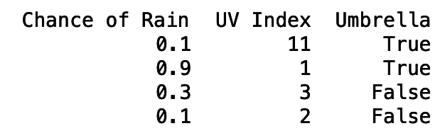
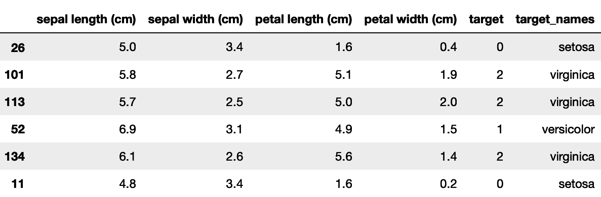
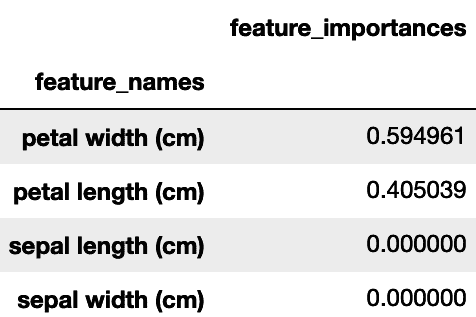
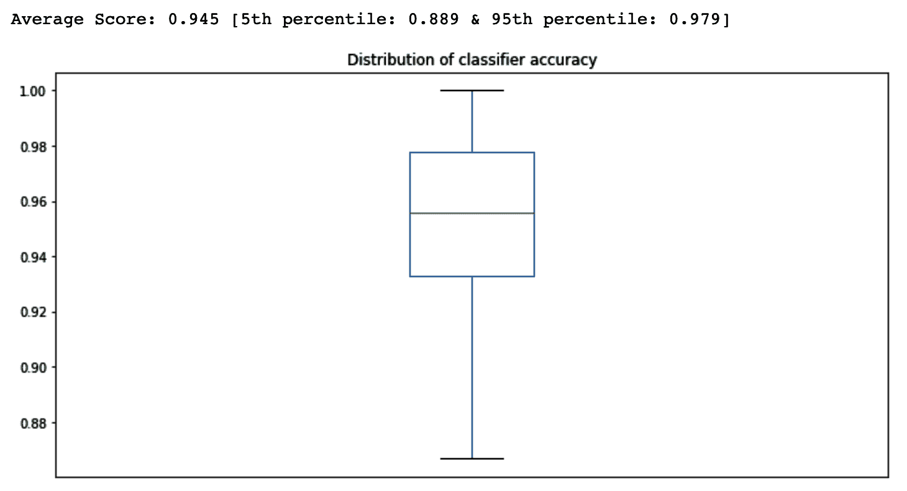
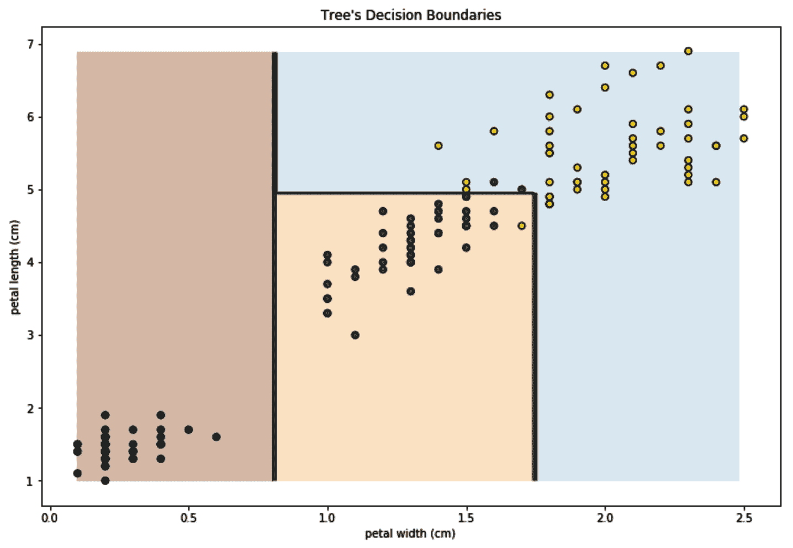
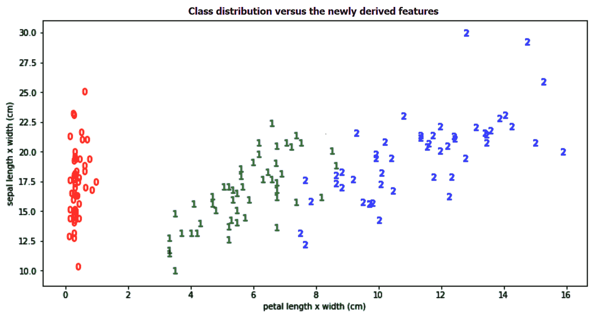
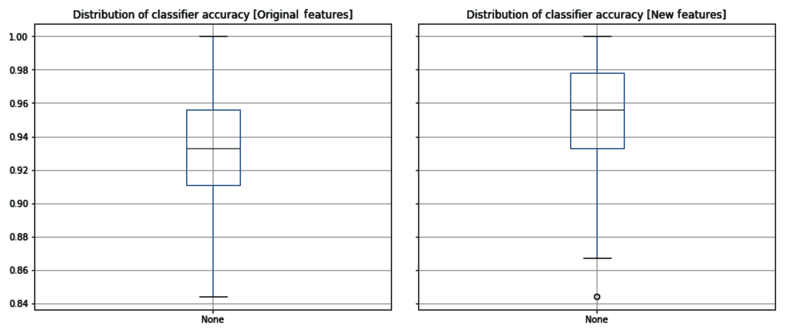
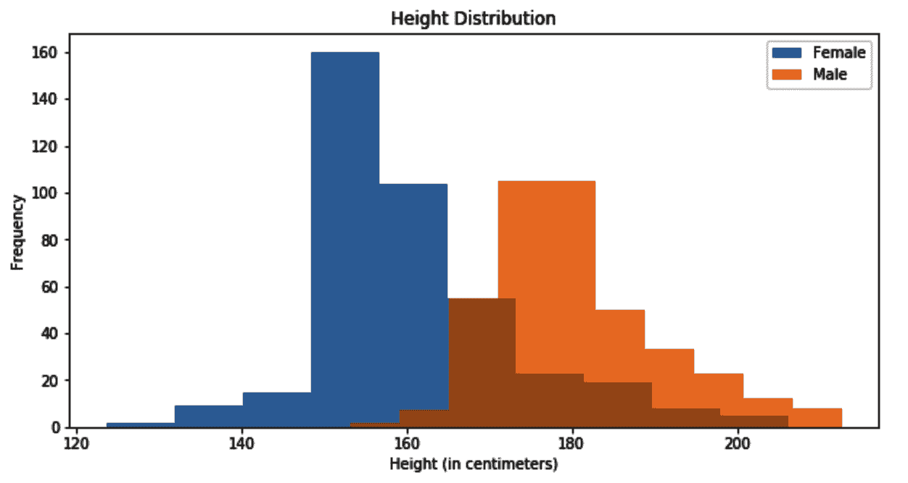
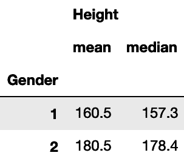

在这一章中，我们将从我们的第一个监督学习算法——决策树开始。决策树算法用途广泛，易于理解。它被广泛使用，也是我们将在本书后面遇到的许多高级算法的基础。在这一章中，我们将学习如何训练一个决策树，并用它来解决分类或回归问题。我们也会了解它学习过程的细节，以便知道如何设置它的不同超参数。此外，我们将使用真实世界的数据集来应用我们在实践中将要学习的内容。我们将从获取和准备数据开始，并应用我们的算法。在这个过程中，我们还将尝试理解关键的机器学习概念，如交叉验证和模型评估指标。本章结束时，你将对以下主题有很好的理解:

*   理解决策树
*   决策树是如何学习的？
*   获得更可靠的分数
*   调整超参数以获得更高的精度
*   可视化树的决策边界
*   构建决策树回归器

# 理解决策树

我选择从决策树开始这本书，因为我注意到大多数新的机器学习从业者之前都有两个领域之一的经验——软件开发，或者统计和数学。决策树在概念上类似于软件开发人员习惯的一些概念，比如嵌套的`if-else`条件和二分搜索法树。至于统计学家，请耐心听我说——很快，当我们读到关于线性模型的那一章时，你会感觉很自在。

## 什么是决策树？

我认为解释决策树是什么的最好方法是展示它们在被训练后产生的规则。幸运的是，我们可以访问这些规则并打印出来。以下是决策树规则的一个示例:

```
Shall I take an umbrella with me?
|--- Chance of Rainy <= 0.6
|    |--- UV Index <= 7.0
|    |    |--- class: False
|    |--- UV Index >  7.0
|    |    |--- class: True
|--- Chance of Rainy >  0.6
|    |--- class: True
```

如你所见，这基本上是一组条件。如果下雨的几率在`0.6` (60%)以上，那我就需要带伞了。如果低于`0.6`，那就全靠紫外线指数了。如果紫外线指数在`7`以上，那么就需要打伞了；不然我没有也挺好的。现在，你可能会想<q>好吧，几个嵌套的`if-else`条件就够了。</q>没错，但这里的主要区别是，这些条件都不是我自己写的。该算法只是在经过以下数据后自动学习前面的条件:



当然，对于这个简单的例子，任何人都可以手动浏览数据，得出相同的条件。然而，当处理更大的数据集时，我们需要编程的条件数量将随着列数和每列中的值而快速增长。在这样的规模下，不可能手动执行相同的工作，需要一种能够从数据中学习条件的算法。

相反，也可以将构建的树映射回嵌套的`if-else`条件。这意味着您可以使用 Python 从数据中构建一棵树，然后导出要用不同语言实现的底层条件，或者如果您愿意，甚至可以将它们放入 **Microsoft Excel** 中。

## 虹膜分类

scikit-learn 加载了大量数据集，我们可以用它们来测试新算法。这些数据集之一是虹膜集。鸢尾是一个拥有 260-300 种艳丽花朵的开花植物的属。然而，在我们的数据集中，只有三个物种被涵盖——刚毛藻**、**云芝**和**海滨锦葵**。我们数据集中的每个例子都有每种植物的萼片和花瓣的长度和宽度(特征)，以及它是 Setosa、Versicolor 还是 Virginica(目标)。我们的任务是根据植物的萼片和花瓣的大小来识别植物的种类。显然，这是一个分类问题。这是一个监督学习问题，因为目标提供了数据。此外，这是一个分类问题，因为我们取有限数量的预定义值(三个物种)。**

### 加载 Iris 数据集

现在，让我们从加载数据集开始:

1.  我们从 scikit-learn 导入数据集的模块，然后将虹膜数据加载到一个变量中，我们也将称之为`iris`:

```
from sklearn import datasets
import pandas as pd
iris = datasets.load_iris()
```

2.  使用`dir`，我们可以看到数据集提供了哪些方法和属性:

```
dir(iris)
```

我们得到了一个`DESCR`、`data`、`feature_names`、`filename`、`target`和`target_names`方法的列表。

数据创建者为每一个都提供了描述，这很好，我们可以使用`DESCR`来访问。然而，现实生活中的数据很少出现这种情况。通常，在现实生活中，我们需要首先与产生数据的人交谈，了解每个值的含义，或者至少在使用数据之前使用一些描述性统计来了解数据。

3.  现在，让我们打印虹膜数据的描述:

```
print(iris.DESCR)
```

现在看一下描述，试着想出其中的一些要点。之后我会列出我自己的收获:

```
.. _iris_dataset:
 Iris plants dataset
 --------------------
Data Set Characteristics:
 :Number of Instances: 150 (50 in each of three classes)
  :Number of Attributes: 4 numeric, predictive attributes and the class
   :Attribute Information:        
- sepal length in cm
- sepal width in cm
- petal length in cm
- petal width in cm
- class:
    - Iris-Setosa
    - Iris-Versicolor
    - Iris-Virginica
:Summary Statistics:
    ============== ==== ==== ======= ===== ====================
                Min  Max   Mean    SD     Class   Correlation
    ============== ==== ==== ======= ===== ====================
sepal length:   4.3  7.9   5.84   0.83    0.7826
sepal width:    2.0  4.4   3.05   0.43   -0.4194
petal length:   1.0  6.9   3.76   1.76    0.9490  (high!)
petal length:   1.0  6.9   3.76   1.76    0.9490  (high!)
petal width:    0.1  2.5   1.20   0.76    0.9565  (high!)
    ============== ==== ==== ======= ===== ====================
:Missing Attribute Values: None
:Class Distribution: 33.3% for each of 3 classes.

:Creator: R.A. Fisher
```

这种描述为我们提供了一些有用的信息，我发现以下几点最有意思:

*   数据由 150 行(或 150 个样本)组成。这是一个相当小的数据集。稍后，我们将看到在评估我们的模型时如何处理这个事实。
*   类别标签或目标取三个值— `Iris-Setosa`、`Iris-Versicolor`和`Iris-Virginica`。一些分类算法只能处理两个类别标签；我们称之为二元分类器。幸运的是，决策树算法可以处理两个以上的类，所以这次我们没有问题。

*   数据是平衡的；每门课有 50 个样本。这是我们在以后训练和评估我们的模型时需要记住的事情。
*   我们有四个特征——`sepal length`、`sepal width`、`petal length`和`petal width`——并且这四个特征都是数字的。在[第 3 章](https://cdp.packtpub.com/hands_on_machine_learning_with_scikit_learn/wp-admin/post.php?post=26&action=edit)、*准备您的数据*中，我们将学习如何处理非数值数据。
*   没有缺失的属性值。换句话说，我们的样本都不包含空值。在本书的后面，我们将学习如何处理我们遇到的缺失值。
*   花瓣尺寸比萼片尺寸与类别值更相关。我希望我们从来没有看到这条信息。理解您的数据是有用的，但这里的问题是这种相关性是针对整个数据集计算的。理想情况下，我们将只为我们的训练数据计算它。无论如何，现在让我们忽略这个信息，只是在以后使用它进行健全性检查。

4.  是时候将所有数据集信息放入一个数据帧中了。

`feature_names`方法返回我们特性的名称，而`data`方法以 NumPy 数组的形式返回它们的值。类似地，`target`变量具有 0、1 和 2 形式的目标值，而`target_names`分别将`0`、`1`和`2`映射到`Iris-Setosa`、`Iris-Versicolor`和`Iris-Virginica`。

NumPy 数组处理起来很有效，但是它们不允许列有名称。我发现列名对于调试非常有用。我发现`pandas`数据框架在这里更合适，因为我们可以使用列名，并将特征和目标组合成一个数据框架。

在这里，我们可以看到使用`iris.data[:8]`得到的前八行:

```
array([[5.1, 3.5, 1.4, 0.2], [4.9, 3\. , 1.4, 0.2], [4.7, 3.2, 1.3, 0.2], [4.6, 3.1, 1.5, 0.2], [5\. , 3.6, 1.4, 0.2], [5.4, 3.9, 1.7, 0.4], [4.6, 3.4, 1.4, 0.3], [5\. , 3.4, 1.5, 0.2]])
```

以下代码使用`data`、`feature_names`和`target`方法将所有数据集信息合并到一个 DataFrame 中，并相应地分配其列名:

```
df = pd.DataFrame(
    iris.data,
    columns=iris.feature_names
)

df['target'] = pd.Series(
 iris.target
)
```

sci kit-learn 0.23 及以上版本支持立即将数据集加载为`pandas`数据帧。您可以通过在`datasets.load_iris`中设置`as_frame=True`及其类似的数据加载方法来做到这一点。然而，这并没有在本书中测试，因为 0.22 版本是写作时最稳定的版本。

5.  `target`列现在有了类 id。然而，为了更加清晰，我们还可以创建一个名为`target_names`的新列，在这里我们可以将数值目标值映射到类名:

```
df['target_names'] = df['target'].apply(lambda y: iris.target_names[y])
```

6.  最后，让我们打印一个六行的样本，看看我们的新数据帧是什么样子的。在 Jupyter 笔记本或 Jupyter 实验室中运行以下代码将只打印数据帧的内容；否则，您需要用一个`print`语句将代码括起来。我将假设在所有后面的代码片段中使用 Jupyter 笔记本环境:

```
# print(df.sample(n=6))
df.sample(n=6)
```

这给了我以下随机样本:



示例方法随机选取了六行进行显示。这意味着每次运行相同的代码时，您将获得一组不同的行。有时，我们需要在每次运行相同的代码时得到相同的随机结果。然后，我们使用一个带有预设种子的伪随机数发生器。用相同种子初始化的伪随机数发生器每次运行时都会产生相同的结果。

因此，将`sample()`方法中的`random_state`参数设置为`42`，如下所示:

```
df.sample(n=6, random_state=42) 
```

您将得到与前面显示的完全相同的行。

### 拆分数据

让我们将刚刚创建的数据帧一分为二—70%的记录(即 105 条记录)应该进入训练集，而 30% (45 条记录)应该进入测试。70/30 的选择暂时是任意的。我们将使用 scikit-learn 提供的`train_test_split()`函数，并将`test_size`指定为`0.3`:

```
from sklearn.model_selection import train_test_split
df_train, df_test = train_test_split(df, test_size=0.3)
```

我们可以使用`df_train.shape[0]`和`df_test.shape[0]`来检查新创建的数据帧中有多少行。我们还可以使用`df_train.columns`和`df_test.columns`列出新数据帧的列。它们都有相同的六列:

*   `sepal length (cm)`
*   `sepal width (cm)`
*   `petal length (cm)`
*   `petal width (cm)`
*   `target`
*   `target_names`

前四列是我们的特性，第五列是我们的目标(或标签)。现在不需要第六列。从视觉上来说，你可以说我们已经将数据垂直分成了训练集和测试集。通常，将我们的每个数据帧进一步水平分割成两部分是有意义的——一部分用于特征，我们通常称之为 *x* ，另一部分用于目标，通常称之为 *y* 。在本书的其余部分，我们将继续使用这个 *x* 和 *y* 命名约定。

有些人喜欢用大写字母 *X* 来说明它是一个二维数组(或数据帧),而当它是一个一维数组(或序列)时，则用小写字母来表示 *y* 。我觉得坚持单一案例更实际。

如您所知，`iris`中的`feature_names`方法包含了我们特性的对应列名列表。我们将使用这些信息以及`target`标签来创建我们的 *x* 和 *y* 集合，如下所示:

```
x_train = df_train[iris.feature_names]
x_test = df_test[iris.feature_names]

y_train = df_train['target']
y_test = df_test['target']
```

### 训练模型并将其用于预测

为了了解一切是如何工作的，我们现在将使用默认配置来训练我们的算法。在本章的后面，我将解释决策树算法的细节以及如何配置它们。

我们需要首先导入`DecisionTreeClassifier`，然后创建它的一个实例，如下所示:

```
from sklearn.tree import DecisionTreeClassifier

# It is common to call the classifier instance clf
clf = DecisionTreeClassifier()
```

训练的一个常用同义词是 fitting。这就是算法如何使用训练数据( *x* 和 *y* )来学习其参数。所有 scikit-learn 模型都实现了一个采用`x_train`和`y_train`的`fit()`方法，`DecisionTreeClassifier`也不例外:

```
clf.fit(x_train, y_train)
```

通过调用`fit()`方法，`clf`实例被训练并准备好用于预测。然后我们在`x_test`上调用`predict()`方法:

```
# If y_test is our truth, then let's call our predictions y_test_pred
y_test_pred = clf.predict(x_test)
```

在预测时，我们通常不知道我们特征的实际目标(*y*)(*x*)。这就是为什么我们这里只提供`x_test`的`predict()`方法。在这个特例中，我们碰巧知道了`y_test`；然而，我们会假装我们现在不知道，只是在以后的评估中使用它。由于我们的实际目标称为`y_test`，我们将预测目标称为`y_test_pred`，稍后将对两者进行比较。

### 评估我们的预测

因为我们有了`y_test_predict`，我们现在需要做的就是将它与`y_test`进行比较，以检查我们的预测有多好。如果你还记得上一章的内容，评估一个分类器有多个指标，比如`precision`、`recall`和`accuracy`。虹膜数据集是平衡数据集；每个类都有相同数量的实例。因此，在这里使用准确性度量是合适的。

如下计算准确度，给我们一个分数`0.91`:

```
from sklearn.metrics import accuracy_score
accuracy_score(y_test, y_test_pred)
```

你得到的分数和我的不同吗？别担心。在*获得更可靠的分数*部分，我将解释为什么这里计算的准确度分数可能会有所不同。

恭喜你！你刚刚训练了你的第一个监督学习算法。从现在开始，我们将在本书中使用的所有算法都有一个相似的界面:

*   `fit()`方法获取训练数据的 *x* 和 *y* 部分。
*   `predict()`方法只取 *x* 并返回一个预测的 *y* 。

### 哪些功能更重要？

我们现在可以问自己，*在决定鸢尾物种时，模型发现哪些特征更有用？*幸运的是，`DecisionTreeClassifier`有一个叫做`feature_importances_`的方法，它是在分类器被拟合后计算的，并对每个特征对模型决策的重要性进行评分。在下面的代码片段中，我们将创建一个数据帧，将功能的名称及其重要性放在一起，然后按重要性对功能进行排序:

```
pd.DataFrame(
  {
    'feature_names': iris.feature_names,
    'feature_importances': clf.feature_importances_
  }
).sort_values(
  'feature_importances', ascending=False
).set_index('feature_names')
```

这是我们得到的输出:



您可能还记得，当我们打印数据集的描述时，花瓣长度和宽度值开始与目标高度相关。它们在这里也有很高的特性重要性分数，这证实了描述中的陈述。

### 显示内部树决策

我们还可以使用下面的代码片段打印学习树的内部结构:

```
from sklearn.tree import export_text
print(
  export_text(clf, feature_names=iris.feature_names, spacing=3, decimals=1)
) 
```

这将打印以下文本:

```
|--- petal width (cm) <= 0.8
| |--- class: 0
|--- petal width (cm) > 0.8
| |--- petal width (cm) <= 1.8
| | |--- petal length (cm) <= 5.3
| | | |--- sepal length (cm) <= 5.0
| | | | |--- class: 2
| | | |--- sepal length (cm) > 5.0
| | | | |--- class: 1
| | |--- petal length (cm) > 5.3
| | | |--- class: 2
| |--- petal width (cm) > 1.8
| | |--- class: 2
```

如果您打印完整的数据集描述，您会注意到在接近结尾时，它会显示以下内容:

一类与另外两类是线性可分的；后者彼此不是线性可分的。

这意味着一个类更容易与其他两个类分开，而其他两个类更难彼此分开。现在，看看内部树的结构。您可能会注意到，在第一步中，它决定花瓣宽度小于或等于`0.8`的任何东西都属于类`0` ( `Setosa`)。然后，对于超过`0.8`的花瓣宽度，树继续分支，试图区分类别`1`和`2` ( `Versicolor`和`Virginica`)。一般来说，分类越困难，分支就越深入。

# 决策树是如何学习的？

是时候了解决策树实际上是如何学习的了，以便对它们进行配置。在我们刚刚打印的内部结构中，树决定使用一个花瓣宽度`0.8`作为它的初始分裂决定。这样做是因为决策树试图使用下面的技术构建尽可能最小的树。

它遍历了所有特征，试图找到一个特征(`petal width`，此处)和该特征中的一个值(`0.8`，此处)，这样，如果我们将所有的训练数据分成两部分(一部分用于`petal width ≤ 0.8`，一部分用于`petal width > 0.8`，我们可能会得到最纯粹的分割。换句话说，它试图找到一个条件，在这个条件下，我们可以尽可能地分离我们的类。然后，对于每一边，它反复尝试使用相同的技术进一步分割数据。

## 分割标准

如果我们只有两个类，理想的划分应该是一个类的成员在一边，另一个类的成员在另一边。在我们的例子中，我们成功地将类`0`的成员放在一边，将类`1`和`2`的成员放在另一边。显然，我们并不总是能保证得到如此纯粹的分裂。正如我们在树的其他分支中所看到的，我们总是在每一边都有来自类`1`和`2`的混合样本。

说到这里，我们需要一种方法来衡量纯度。我们需要一个标准，基于一个分裂是否比另一个更纯粹。scikit-learn 使用两个标准来确定分类器的纯度— `gini`和`entropy`—`gini`标准是其默认选项。当谈到决策树回归时，我们稍后会遇到其他标准。

## 防止过度拟合

"如果你追求完美，你永远不会满足。"

列夫·托尔斯泰

在第一次分裂之后，树继续尝试在剩余的类之间分离；`Versicolor`和`Virginica`鸢尾花。然而，我们真的确定我们的训练数据足够详细，足以解释这两个类别之间的所有细微差别吗？难道没有可能所有那些分支都在驱动算法学习那些恰好存在于训练数据中的东西，但在面对未来数据时不会进行足够好的概括？允许一棵树长得太多会导致所谓的过度适应。树试图完美地拟合训练数据，忘记了它将来可能遇到的数据可能是不同的。为了防止过度拟合，可以使用以下设置来限制树的增长:

*   这是一棵树能到达的最大深度。较低的数字意味着树将较早停止分支。将其设置为`None`意味着树将继续生长，直到所有的叶子都是纯的，或者直到所有的叶子包含的样本都少于`min_samples_split`个。
*   `min_samples_split`:一个级别中允许进一步拆分所需的最小样本数。较高的数字意味着树将较早停止分支。
*   `min_samples_leaf` : **一个级别成为叶节点所需的最小样本数。叶节点是没有进一步分裂的节点，并且是做出决策的节点。较高的数字可能会使模型平滑，尤其是在回归中。**

 **检查过度拟合的一个快速方法是将分类器在测试集上的准确性与其在训练集上的准确性进行比较。与测试集相比，训练集的分数高得多是过度拟合的标志。在这种情况下，推荐一棵更小、修剪更整齐的树。

如果在训练时没有设置`max_depth`来限制树的生长，那么你也可以在树建成后修剪它。好奇的读者可以查看决策树的`cost_complexity_pruning_path()`方法，并了解如何使用它来修剪一棵已经长大的树。

## 预言

在训练过程的最后，不再被分割的节点被称为叶节点。在一个叶节点中，我们可能有五个样本——其中四个来自类`1`，一个来自类`2`，没有一个来自类`0`。然后，在预测时，如果样本在同一个叶节点中结束，我们可以很容易地确定新样本属于类别`1`，因为与其他两个类别相比，该叶节点具有来自类别`1`的 4:1 比率的训练样本。

当我们对测试集进行预测时，我们可以对照测试集中的实际标签来评估分类器的准确性。然而，我们分割数据的方式可能会影响我们得到的分数的可靠性。在下一节中，我们将看到如何获得更可靠的分数。

# 获得更可靠的分数

虹膜数据集是一个只有 150 个样本的小集合。当我们将其随机分为训练集和测试集时，我们最终在测试集中有 45 个实例。数量如此之少，我们的目标分布可能会有变化。例如，当我随机分割数据时，我从类`0`中得到 13 个样本，从我的测试集中的另外两个类中各得到 16 个样本。知道预测类`0`比这个特定数据集中的其他两个类更容易，我们可以说，如果我更幸运，在测试集中有更多类`0`的样本，我会有更高的分数。此外，决策树对数据变化非常敏感，训练数据中的每一个微小变化都可能会产生非常不同的树。

## 现在该怎么做才能得到更可靠的分数

统计学家会说<q>让我们不止一次地运行数据分割、训练和预测的整个过程，并得到我们每次得到的不同准确度分数的分布</q>。下面的代码在 100 次迭代中完全做到了这一点:

```
import pandas as pd

from sklearn.model_selection import train_test_split
from sklearn.tree import DecisionTreeClassifier
from sklearn.metrics import accuracy_score

# A list to store the score from each iteration
accuracy_scores = []
```

在导入所需的模块并定义一个`accuracy_scores`列表来存储我们将在每次迭代中得到的分数之后，是时候编写一个`for`循环来新鲜分割数据并在每次迭代中重新计算分类器的准确性了:

```
for _ in range(100):

    # At each iteration we freshly split our data
    df_train, df_test = train_test_split(df, test_size=0.3) 
    x_train = df_train[iris.feature_names]
    x_test = df_test[iris.feature_names]

    y_train = df_train['target']
    y_test = df_test['target']

    # We then create a new classifier
    clf = DecisionTreeClassifier()

    # And use it for training and prediction
    clf.fit(x_train, y_train)
    y_pred = clf.predict(x_test)

    # Finally, we append the score to our list
    accuracy_scores.append(round(accuracy_score(y_test, y_pred), 3))

# Better convert accuracy_scores from a list into a series
# Pandas series provides statistical methods to use later
accuracy_scores = pd.Series(accuracy_scores)
```

下面的代码片段让我们使用箱线图来绘制准确度的分布:

```
accuracy_scores.plot(
    title='Distribution of classifier accuracy',
    kind='box',
)

print(
    'Average Score: {:.3} [5th percentile: {:.3} & 95th percentile: {:.3}]'.format(
        accuracy_scores.mean(),
        accuracy_scores.quantile(.05),
        accuracy_scores.quantile(.95),
    )
)
```

这将为我们提供以下图形分析的准确性。由于训练集和测试集的随机分割以及决策树的随机初始设置，您的结果可能会略有不同。几乎所有的 scikit-learn 模块都支持伪随机数生成器，该生成器可以通过`random_state`超参数进行初始化。这可以用来加强代码的可复制性。尽管如此，这次我故意忽略了它，以显示模型的结果如何从一次运行变化到另一次运行，并显示通过迭代估计模型误差分布的重要性:



箱线图擅长显示分布。我们现在有了对分类器性能的最佳和最坏情况的估计，而不是一个单一的数字。

如果在任何时候，您无法访问 NumPy，您仍然可以使用 Python 内置的`statistics`模块提供的`mean()`和`stdev()`方法来计算样本的平均值和标准差。它还提供了计算几何平均值和调和平均值以及中位数和分位数的功能。

## 洗牌拆分

生成不同的训练和测试分割称为交叉验证。这有助于我们对模型的准确性有一个更可靠的估计。我们在上一节中所做的是许多交叉验证策略中的一种，称为重复随机子采样验证，或蒙特卡罗交叉验证。

在概率论中，大数定律表明，如果我们多次重复相同的实验，得到的结果的平均值应该接近预期的结果。由于大数定律，蒙特卡罗方法利用随机抽样来一遍又一遍地重复实验，以达到对结果的更好估计。由于计算机的存在，蒙特卡罗方法成为可能，在这里，我们使用相同的方法一遍又一遍地重复训练/测试，以达到对模型准确性的更好估计。

scikit-learn 的`ShuffleSplit`模块为我们提供了执行蒙特卡罗交叉验证的功能。与其让我们自己拆分数据，`ShuffleSplit`不如给我们一个索引列表，用来拆分我们的数据。在下面的代码中，我们将使用 DataFrame 的`loc()`方法和我们从`ShuffleSplit`获得的索引，将数据集随机分成 100 个训练和测试对:

```
import pandas as pd

from sklearn.model_selection import ShuffleSplit
from sklearn.tree import DecisionTreeClassifier
from sklearn.metrics import accuracy_score

accuracy_scores = []

# Create a shuffle split instance
rs = ShuffleSplit(n_splits=100, test_size=0.3)

# We now get 100 pairs of indices 
for train_index, test_index in rs.split(df):

 x_train = df.loc[train_index, iris.feature_names]
 x_test = df.loc[test_index, iris.feature_names]

 y_train = df.loc[train_index, 'target']
 y_test = df.loc[test_index, 'target']

 clf = DecisionTreeClassifier()

 clf.fit(x_train, y_train)
 y_pred = clf.predict(x_test)

 accuracy_scores.append(round(accuracy_score(y_test, y_pred), 3))

accuracy_scores = pd.Series(accuracy_scores)
```

或者，我们可以通过使用 scikit-learn 的`cross_validate` **功能来进一步简化前面的代码。这一次，我们不是自己将数据分成训练集和测试集。我们将给`cross_validate`整个集合的`x`和`y`值，然后给它我们的`ShuffleSplit`实例，让它在内部使用来分割数据。我们还给它分类器，并指定使用哪种评分标准。完成后，它将返回一个列表，其中包含计算出的测试集分数:**

```
import pandas as pd

from sklearn.model_selection import ShuffleSplit
from sklearn.tree import DecisionTreeClassifier
from sklearn.model_selection import cross_validate

clf = DecisionTreeClassifier()
rs = ShuffleSplit(n_splits=100, test_size=0.3)

x = df[iris.feature_names]
y = df['target']

cv_results = cross_validate(
    clf, x, y, cv=rs, scoring='accuracy'
)

accuracy_scores = pd.Series(cv_results['test_score'])
```

我们现在可以绘制一系列准确度得分的结果，得到与前面相同的箱线图。在处理小数据集时，建议进行交叉验证，因为与单次试验后计算的单个分数相比，一组准确度分数将使我们更好地理解分类器的性能。

# 调整超参数以获得更高的精度

既然我们已经学会了如何使用`ShuffleSplit`交叉验证方法更可靠地评估模型的准确性，那么是时候检验我们之前的假设了:一棵更小的树会更准确吗？

以下是我们在以下几个小节中要做的事情:

1.  将数据分成训练集和测试集。
2.  现在把测试侧放在一边。
3.  使用不同的`max_depth`值限制树的生长。
4.  对于每个`max_depth`设置，我们将在训练集上使用`ShuffleSplit`交叉验证方法来获得分类器准确度的估计值。
5.  一旦我们决定为`max_depth`使用哪个值，我们将在整个训练集上最后一次训练算法，并在测试集上进行预测。

## 拆分数据

下面是将数据分成训练集和测试集的常用代码:

```
from sklearn.model_selection import train_test_split

df_train, df_test = train_test_split(df, test_size=0.25)

x_train = df_train[iris.feature_names]
x_test = df_test[iris.feature_names]

y_train = df_train['target']
y_test = df_test['target']
```

## 尝试不同的超参数值

如果我们允许先前的树无限增长，我们将得到一个深度为`4`的树。一旦完成训练，你可以通过调用`clf.get_depth()`来检查树的深度。所以，尝试任何高于`4`的`max_depth`值是没有意义的。这里，我们将循环从`1`到`4`的最大深度，并使用`ShuffleSplit`获得分类器的精度:

```
import pandas as pd
from sklearn.model_selection import ShuffleSplit
from sklearn.tree import DecisionTreeClassifier
from sklearn.model_selection import cross_validate

for max_depth in [1, 2, 3, 4]:

    # We initialize a new classifier each iteration with different max_depth
    clf = DecisionTreeClassifier(max_depth=max_depth)
    # We also initialize our shuffle splitter
    rs = ShuffleSplit(n_splits=20, test_size=0.25)

    cv_results = cross_validate(
        clf, x_train, y_train, cv=rs, scoring='accuracy'
    )
    accuracy_scores = pd.Series(cv_results['test_score'])

print(
        '@ max_depth = {}: accuracy_scores: {}~{}'.format(
            max_depth, 
            accuracy_scores.quantile(.1).round(3), 
            accuracy_scores.quantile(.9).round(3)
        )
    )
```

我们像前面一样调用了`cross_validate()`方法，给它分类器的实例和`ShuffleSplit`实例。我们还将我们的评估分数定义为`accuracy`。最后，我们打印每次迭代得到的分数。我们将在下一节中更多地查看打印的值。

## 比较准确度分数

由于我们有每次迭代的分数列表，我们可以计算它们的平均值，或者，正如我们在这里将要做的，我们将打印它们的第 10 个^第和第 90 个^第百分位数，以了解相对于每个`max_depth`设置的精度范围。

运行前面的代码产生了以下结果:

```
@ max_depth = 1: accuracy_scores: 0.532~0.646
@ max_depth = 2: accuracy_scores: 0.925~1.0
@ max_depth = 3: accuracy_scores: 0.929~1.0
@ max_depth = 4: accuracy_scores: 0.929~1.0
```

我现在可以肯定的一点是，单级树(通常称为存根)没有更深层次的树准确。换句话说，基于花瓣宽度是否小于`0.8`进行单一决策是不够的。允许树进一步生长提高了精确度，但是我看不出深度`2`、`3`和`4`的树之间有什么不同。我的结论是，与我之前的推测相反，我们不应该过于担心这里的过度适应。

在这里，我们为单个参数`max_depth`尝试了不同的值。这就是为什么在不同的值上进行简单的`for`循环是可行的。在后面的章节中，我们将看到当我们需要一次调整多个超参数以达到最佳精度的组合时该怎么做。

最后，您可以使用整个训练集和一个`max_depth`值，比如说`3`，再次训练您的模型。然后，使用训练好的模型来预测测试集的类，以便评估您的最终模型。这次我不会用代码来烦你，因为你自己可以很容易地完成。

除了打印分类器的决策和关于其准确性的描述性统计数据之外，直观地查看其决策边界也很有用。将这些边界与数据样本对应起来，有助于我们理解为什么分类器会犯某些错误。在下一节中，我们将检查为 Iris 数据集获得的决策边界。

# 可视化树的决策边界

为了能够为问题选择正确的算法，从概念上理解算法如何做出决策是很重要的。正如我们现在已经知道的，决策树一次选择一个特征，并尝试相应地分割数据。然而，能够可视化这些决策也是很重要的。让我先画出我们的类和我们的特性，然后我会进一步解释:


当树决定围绕`0.8`的花瓣宽度分割数据时，您可以将其视为在右侧图形中以`0.8`的值绘制一条水平线。然后，随着每一次后来的分割，树使用水平线和垂直线的组合进一步分割空间。了解了这一点，您就不应该期望算法使用曲线或 45 度线来分隔类。

在一棵树被训练后，绘制它的决策边界的一个技巧是使用等高线图。为了简单起见，让我们假设我们只有两个特征——花瓣长度和花瓣宽度。然后，我们为这两个特征生成几乎所有可能的值，并为我们的新假设数据预测类别标签。然后，我们使用这些预测创建一个等值线图，以查看类之间的边界。下面这个由哥德堡大学的 Richard Johanssonof 创建的函数就是这么做的:

```
import numpy as np
import pandas as pd
import matplotlib.pyplot as plt

def plot_decision_boundary(clf, x, y):

 feature_names = x.columns
 x, y = x.values, y.values

 x_min, x_max = x[:,0].min(), x[:,0].max()
 y_min, y_max = x[:,1].min(), x[:,1].max()

 step = 0.02

 xx, yy = np.meshgrid(
 np.arange(x_min, x_max, step),
 np.arange(y_min, y_max, step)
 )
 Z = clf.predict(np.c_[xx.ravel(), yy.ravel()])
 Z = Z.reshape(xx.shape)

 plt.figure(figsize=(12,8))
 plt.contourf(xx, yy, Z, cmap='Paired_r', alpha=0.25)
 plt.contour(xx, yy, Z, colors='k', linewidths=0.7)
 plt.scatter(x[:,0], x[:,1], c=y, edgecolors='k')
 plt.title("Tree's Decision Boundaries")
 plt.xlabel(feature_names[0])
 plt.ylabel(feature_names[1])
```

这一次，我们将只使用两个特征来训练我们的分类器，然后使用新训练的模型调用前面的函数:

```
x = df[['petal width (cm)', 'petal length (cm)']]
y = df['target']

clf = DecisionTreeClassifier(max_depth=3)
clf.fit(x, y)

plot_decision_boundary(clf, x, y)
```

Richard Johansson 的函数将等高线图叠加到我们的样本上，得到了下图:



通过查看决策边界和数据样本，您可以更好地决定一种算法是否适合当前的问题。

## 特征工程

"每个人都把自己视野的局限视为世界的局限."

亚瑟·叔本华

看到类别分布与花瓣长度和宽度的关系，你可能会想:*如果决策树也可以画 40 度的边界会怎么样？40 度的界限不是比那些水平和垂直的拼图更贴切吗？*不幸的是，决策树无法做到这一点，但让我们暂时将算法放在一边，转而考虑数据。创建一个新的轴，让类的边界改变它们的方向，怎么样？

让我们创建两个新的列——`petal length x width (cm)`和`sepal length x width (cm)`——看看班级分布情况如何:

```
df['petal length x width (cm)'] = df['petal length (cm)'] * df['petal width (cm)']
df['sepal length x width (cm)'] = df['sepal length (cm)'] * df['sepal width (cm)']
```

以下代码将绘制类和新派生的要素:

```
fig, ax = plt.subplots(1, 1, figsize=(12, 6));

h_label = 'petal length x width (cm)'
v_label = 'sepal length x width (cm)'

for c in df['target'].value_counts().index.tolist():
    df[df['target'] == c].plot(
        title='Class distribution vs the newly derived features',
        kind='scatter',
x=h_label,
y=v_label,
color=['r', 'g', 'b'][c], # Each class different color
marker=f'${c}$', # Use class id as marker
s=64,
        alpha=0.5,
        ax=ax,
    )

fig.show()
```

运行此代码将生成下图:



这个新投影看起来更好；这使得数据在垂直方向上更容易分离。尽管如此，布丁的好坏仍有待品尝。因此，让我们训练两个分类器——一个基于原始特征，一个基于新获得的特征——看看

它们的精确度如何比较。以下代码经过 500 次迭代，每次都随机拆分数据，然后训练两个模型，每个模型都有自己的一组特征，并存储每次迭代获得的精度:

```
features_orig = iris.feature_names
features_new = ['petal length x width (cm)', 'sepal length x width (cm)']

accuracy_scores_orig = []
accuracy_scores_new = []

for _ in range(500):

    df_train, df_test = train_test_split(df, test_size=0.3)

x_train_orig = df_train[features_orig]
x_test_orig = df_test[features_orig]

x_train_new = df_train[features_new]
x_test_new = df_test[features_new]

     y_train = df_train['target']
y_test = df_test['target']

clf_orig = DecisionTreeClassifier(max_depth=2)
clf_new = DecisionTreeClassifier(max_depth=2)

     clf_orig.fit(x_train_orig, y_train)
clf_new.fit(x_train_new, y_train)

y_pred_orig = clf_orig.predict(x_test_orig)
y_pred_new = clf_new.predict(x_test_new)

accuracy_scores_orig.append(round(accuracy_score(y_test, y_pred_orig), 
                                       3))
accuracy_scores_new.append(round(accuracy_score(y_test, y_pred_new), 
                                      3))

accuracy_scores_orig = pd.Series(accuracy_scores_orig)
accuracy_scores_new = pd.Series(accuracy_scores_new)
```

然后，我们可以使用箱线图来比较两个分类器的准确性:

```
fig, axs = plt.subplots(1, 2, figsize=(16, 6), sharey=True);

accuracy_scores_orig.plot(
    title='Distribution of classifier accuracy [Original Features]',
    kind='box',
grid=True,
ax=axs[0]
)

accuracy_scores_new.plot(
title='Distribution of classifier accuracy [New Features]',
kind='box',
grid=True,
ax=axs[1]
)

fig.show()
```

这里，我们将顶部的图放在一起，以便相互比较:



很明显，派生的特性有所帮助。它的平均精度更高(`0.96`对`0.93`)，它的下限也更高。

# 构建决策树回归器

决策树回归器的工作方式与分类器相似。该算法一次使用一个特征递归分割数据。在这个过程的最后，我们得到了叶节点——也就是没有进一步分割的节点。在分类器的情况下，如果在训练时间，一个叶节点有三个类`A`的实例和一个类`B`的实例，那么在预测时间，如果一个实例落在同一个叶节点，分类器决定它属于多数类(类`A`)。在回归器的情况下，如果在训练时，叶节点具有值`12`、`10`和`8`的三个实例，则在预测时，如果一个实例位于同一叶节点，回归器预测其值为`10`(训练时三个值的平均值)。

实际上，选择平均值并不总是最好的情况。而是取决于所使用的分裂标准。在下一节中，我们将借助一个示例更详细地了解这一点。

## 预测人的身高

假设我们有两个种群。人群`1`女性平均身高 155 cm，标准差`4`，男性平均身高 175 cm，标准差`5`。人口 2 女性平均身高 165 cm，标准差`15`，男性平均身高 185 cm，标准差`12`。我们决定从每个种群中抽取 200 只雄性和 200 只雌性。为了能够模拟这种情况，我们可以使用 NumPy 提供的函数，从正态(高斯)分布中抽取随机样本。

下面是生成随机样本的代码:

```
# It's customary to call numpy np
import numpy as np

# We need 200 samples from each
n = 200

# From each population we get 200 male and 200 female samples
height_pop1_f = np.random.normal(loc=155, scale=4, size=n)
height_pop1_m = np.random.normal(loc=175, scale=5, size=n)
height_pop2_f = np.random.normal(loc=165, scale=15, size=n)
height_pop2_m = np.random.normal(loc=185, scale=12, size=n)
```

目前，我们实际上并不关心每个样本来自哪个人群。因此，我们将使用`concatenate`将所有男性和所有女性分组在一起:

```
# We group all females together and all males together
height_f = np.concatenate([height_pop1_f, height_pop2_f])
height_m = np.concatenate([height_pop1_m, height_pop2_m])
```

然后，我们将这些数据放入数据框架(`df_height`)中，以便能够轻松处理。在那里，我们还给女性贴上`1`的标签，给男性贴上`2`的标签:

```
df_height = pd.DataFrame(
    {
        'Gender': [1 for i in range(height_f.size)] + 
                   [2 for i in range(height_m.size)],
        'Height': np.concatenate((height_f, height_m))
    }
)
```

让我们用直方图来绘制虚构的数据，看看每个性别的身高分布:

```
fig, ax = plt.subplots(1, 1, figsize=(10, 5))

df_height[df_height['Gender'] == 1]['Height'].plot(
    label='Female', kind='hist', 
    bins=10, alpha=0.7, ax=ax
)
df_height[df_height['Gender'] == 2]['Height'].plot(
    label='Male', kind='hist', 
    bins=10, alpha=0.7, ax=ax
)

ax.legend()

fig.show()
```

前面的代码给出了下图:



如你所见，最终的分布是不对称的。虽然正态分布是对称的，但这些人工分布是由两个子分布组合而成的。我们可以使用这行代码来查看它们的平均值和中值不相等:

```
df_height.groupby('Gender')[['Height']].agg([np.mean, np.median]).round(1)
```

这里，我们有每组的平均和中间高度:



现在，我们想用一个特征来预测人们的身高——他们的性别。因此，我们将把数据分成训练集和测试集，并创建我们的 *x* 和 *y* 集，如下所示:

```
df_train, df_test = train_test_split(df_height, test_size=0.3)
x_train, x_test = df_train[['Gender']], df_test[['Gender']]
y_train, y_test = df_train['Height'], df_test['Height']
```

请记住，在分类的情况下，树使用`gini`或`entropy`来决定训练过程中每一步的最佳分割。这些标准的目标是找到一个分裂点，在这个分裂点上，两个亚组中的每一个都尽可能的纯净。在回归的情况下，我们有一个不同的目标。我们希望每组成员的目标值尽可能接近他们做出的预测。scikit-learn 实施两个标准来实现这一目标:

*   **均方误差** ( **均方误差或 L2** ):假设分割后，我们得到一组三个样本，目标为`5`、`5`、`8`。我们计算这三个数字的平均值(`6`)。然后，我们计算每个样本与计算出的平均值之间的方差— `1`、`1`和`4`。然后我们取这些平方差的平均值，即`2`。
*   **平均绝对误差** ( **MAE 或 L1** ):假设分割后，我们在一组中得到三个样本，目标为`5`、`5`、`8`。我们计算这三个数的中值(`5`)。然后，我们计算每个样本与计算出的中位数`0`、`0`和`3`之间的绝对差异。然后我们取这些绝对差值的平均值，即`1`。

对于训练时的每个可能的分割，该树计算分割后每个预期子组的 L1 或 L2。然后在这一步选择具有最小 L1 或 L2 的分割。由于 L1 对异常值的稳健性，有时可能是首选。要记住的另一个重要区别是，L1 在计算中使用中值，而 L2 使用平均值。

如果在训练时，我们看到 10 个特征几乎相同但目标不同的样本，它们可能会一起出现在一个叶节点中。现在，如果我们在构建回归变量时使用 L1 作为分割标准，那么如果我们在预测时获得一个与 10 个训练样本具有相同特征的样本，我们应该期望预测接近 10 个训练样本的目标的中值。同样，如果 L2 用于构建回归变量，那么我们应该期望新样本的预测接近 10 个训练样本的目标平均值。

现在让我们比较一下分割标准对我们的身高数据集的影响:

```
from sklearn.tree import export_text
from sklearn.tree import DecisionTreeRegressor

for criterion in ['mse', 'mae']:
    rgrsr = DecisionTreeRegressor(criterion=criterion)
    rgrsr.fit(x_train, y_train)

    print(f'criterion={criterion}:\n')
    print(export_text(rgrsr, feature_names=['Gender'], spacing=3, decimals=1))
```

根据选择的标准，我们得到以下两棵树:

```
criterion=mse:

|--- Gender <= 1.5
|    |--- value: [160.2]
|--- Gender > 1.5
|    |--- value: [180.8]

criterion=mae:

|--- Gender <= 1.5
|    |--- value: [157.5]
|--- Gender > 1.5
|    |--- value: [178.6]
```

正如所料，当使用 MSE 时，预测值接近每个性别的平均值，而对于 MAE，预测值接近中位数。

当然，我们的数据集中只有一个二元特征——性别。这就是为什么我们有一个非常浅的只有一个裂口的树(一个**树桩**)。实际上，在这种情况下，我们甚至不需要训练决策树；我们可以很容易地计算出男性和女性的平均身高，并立即将它们作为我们的期望值。这样一棵浅树做出的决策，叫做偏决策。如果我们允许每个人使用更多的信息来表达自己，而不仅仅是他们的性别，那么我们就能够对每个人做出更准确的预测。

最后，就像在分类树中一样，我们有相同的旋钮，如`max_depth`、`min_samples_split`和`min_samples_leaf`、**、**来控制回归树的生长。

## 回归者的评价

完全相同的 MSE 和 MAE 分数也可以用来评估回归变量的准确性。我们用它们来比较回归变量的预测和测试集中的实际目标。下面是预测和评估所做预测的代码:

```
from sklearn.metrics import mean_squared_error, mean_absolute_error

y_test_pred = rgrsr.predict(x_test)
print('MSE:', mean_squared_error(y_test, y_test_pred))
print('MAE:', mean_absolute_error(y_test, y_test_pred))
```

使用 MSE 作为分割标准，我们得到的 MSE 为`117.2`，MAE 为`8.2`，而使用 MAE 作为分割标准，我们得到的 MSE 为`123.3`，MAE 为`7.8`。显然，使用 MAE 作为分割标准会在测试时产生较低的 MAE，反之亦然。换句话说，如果你的目标是减少基于某个指标的预测误差，建议你在训练的时候使用相同的指标来生长你的树。

## 设置样品重量

决策树分类器和回归器都允许我们通过在拟合时设置它们的权重来或多或少地强调单个训练样本。这是许多估计器的共同特征，决策树在这里也不例外。为了了解样本权重的影响，我们将为 150 cm 以上的用户赋予比其他用户多 10 倍的权重:

```
rgrsr = DecisionTreeRegressor(criterion='mse')
sample_weight = y_train.apply(lambda h: 10 if h > 150 else 1)
rgrsr.fit(x_train, y_train, sample_weight=sample_weight)
```

相反，我们也可以通过改变`sample_weight`的计算方式，给 150 cm 及以下的用户更多的权重，如下所示:

```
sample_weight = y_train.apply(lambda h: 10 if h <= 150 else 1)
```

通过使用`export_text()`函数，正如我们在上一节中所做的，我们可以显示结果树。我们可以看到`sample_weight` **如何影响它们的最终结构:**

```
Emphasis on "below 150":

|--- Gender <= 1.5
|    |--- value: [150.7]
|--- Gender > 1.5
|    |--- value: [179.2]

Emphasis on "above 150":

|--- Gender <= 1.5
|    |--- value: [162.4]
|--- Gender > 1.5
|    |--- value: [180.2]

```

默认情况下，所有样本的权重相同。当处理不平衡的数据或不平衡的商业决策时，对单个样本进行不同的加权是有用的；也许你能容忍为新客户推迟发货，而不是为你的忠实客户。在[第 8 章](https://cdp.packtpub.com/hands_on_machine_learning_with_scikit_learn/wp-admin/post.php?post=30&action=edit)、*集成中——当一个模型不够用时*，我们还将看到样本权重如何成为 AdaBoost 算法学习的一个组成部分。

# 摘要

决策树是能够执行分类和回归任务的直观算法。它们允许用户打印出他们的决策规则，这在向业务人员和非技术第三方传达您所做的决策时是一个优势。此外，决策树易于配置，因为它们的超参数数量有限。在训练决策树时，你需要做出的两个主要决定是你的分裂标准和如何控制你的树的增长，以在*过度拟合*和*欠拟合*之间取得良好的平衡。您对树的决策边界的限制的理解对于决定该算法对于手头的问题是否足够好是至关重要的。

在这一章中，我们看了决策树如何学习并使用它们来分类一个众所周知的数据集。我们还了解了不同的评估指标，以及数据的大小如何影响我们对模型准确性的信心。然后，我们学习了如何使用不同的数据分割策略来处理评估的不确定性。我们看到了如何调整算法的超参数，以便在过度拟合和欠拟合之间取得良好的平衡。最后，我们利用所获得的知识来构建决策树回归器，并了解了分裂标准的选择如何影响我们的预测结果。

我希望这一章能够很好地介绍 scikit-learn 及其一致的界面。有了这些知识，我们可以继续我们的下一个算法，看看它与这个相比如何。在下一章，我们将学习线性模型。这套算法可以追溯到 18 世纪，现在仍然是最常用的算法之一。******