# 三、使用线性方程来做决策

最小二乘回归分析的方法可以追溯到 18 世纪卡尔·弗里德里希·高斯的时代。两个多世纪以来，许多算法都建立在它的基础上，或者以某种形式受到它的启发。这些线性模型可能是当今回归和分类中最常用的算法。我们将从基本的最小二乘算法开始这一章，然后随着本章的进展，我们将继续学习更高级的算法。

以下是本章涵盖的主题列表:

*   了解线性模型
*   预测波士顿的房价
*   正则化回归变量
*   寻找回归区间
*   其他线性回归变量
*   使用逻辑回归进行分类
*   附加线性分类器

# 了解线性模型

为了能够很好地解释线性模型，我想从一个例子开始，在这个例子中，可以使用线性方程组找到解决方案——这是一种我们在大约 12 岁时在学校学习的技术。然后我们会看到为什么这种技术并不总是适用于现实生活中的问题，因此需要一个线性回归模型。然后，我们将回归模型应用于现实生活中的回归问题，并学习如何在这个过程中改进我们的解决方案。

## 线性方程

"数学是人类精神最美丽、最强大的创造."

斯特凡·巴拿赫

在这个例子中，我们有五个乘坐出租车的乘客。这里，我们记录了每辆出租车行驶的公里数，以及每次行程结束时计价器上显示的交易会:

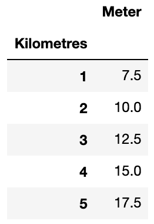

我们知道出租车计价器通常以一定的金额开始，然后每行驶一公里增加一笔固定的费用。我们可以使用以下公式对电表进行建模:


这里， *A* 是计价器的起始值， *B* 是每公里增加的费用。我们还知道，有了两个未知数——*A*和*B*——我们只需要两个数据样本就能算出 *A* 是`5`而 *B* 是`2.5`。我们也可以用 *A* 和 *B* 的值绘制公式，如下所示:

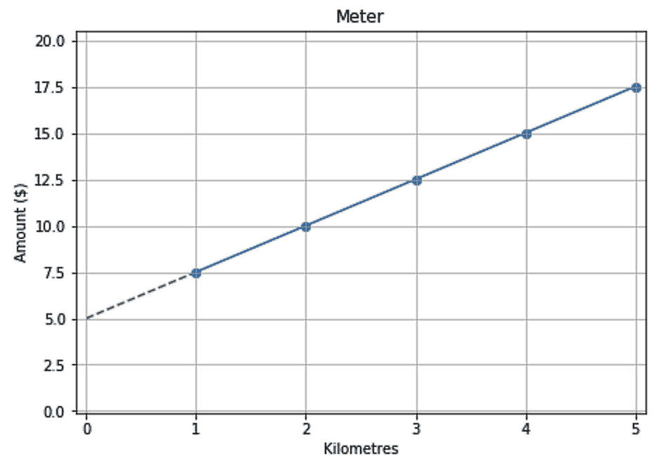

我们还知道，蓝线将在值 *A* ( `5`)处与*y*-轴相交。所以，我们称*为***拦截**。我们也知道直线的斜率等于 *B* ( `2.5`)。

乘客并不总是有零钱，所以他们有时会把计价器上显示的金额凑整，给司机增加小费。以下是每位乘客最终支付金额的数据:

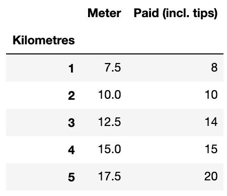

在我们添加了小费之后，很明显，旅行的距离和支付的金额之间的关系不再是线性的。右手边的图显示，不能绘制一条直线来捕捉这种关系:

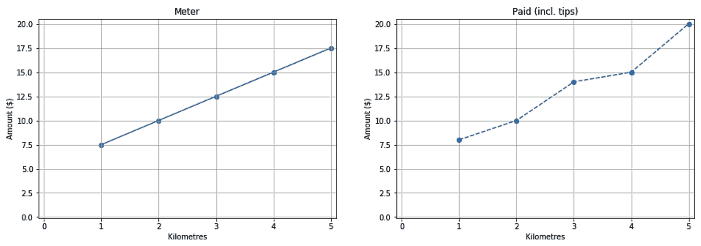

我们现在知道，我们通常解方程的方法这次行不通了。尽管如此，我们可以说仍然有一条线可以在某种程度上近似这种关系。在下一节中，我们将使用线性回归算法来找到这个近似值。

## 线性回归

算法都是关于目标的。我们之前的目标是找到一条穿过图中所有点的直线。我们已经看到，如果点之间不存在线性关系，这个目标是不可行的。因此，我们将使用线性回归算法，因为它有不同的目标。线性回归算法试图找到一条直线，该直线上的估计点和实际点之间的平方误差的平均值最小。从视觉上讲，在下图中，我们需要一条虚线，使垂直线的平均平方长度最小:

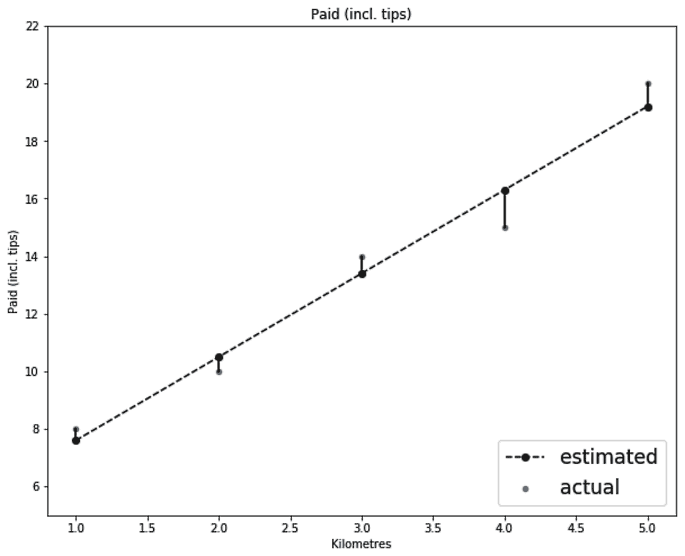

这里使用的方法是找到一条使**均方误差** ( **MSE** )最小化的直线，这种方法被称为普通最小二乘法。通常，线性回归只是普通的最小二乘法。尽管如此，在本章中，我将使用术语`LinearRegression`(作为一个单词)来指代 scikit-learn 的普通最小二乘法的实现，并且我将保留术语*线性回归*(作为两个单独的单词)来指代线性回归的一般概念，无论是使用普通最小二乘法还是使用不同的方法。

普通最小二乘法大约有两个世纪的历史，它使用简单的数学来估计参数。这就是为什么有些人可能会认为这个算法实际上不是机器学习算法。就我个人而言，在对什么是机器学习，什么不是机器学习进行分类时，我遵循一种更自由的方法。只要算法自动从数据中学习，并且我们使用这些数据来评估它，那么对我来说，它就属于机器学习范式。

### 估算支付给出租车司机的金额

现在我们知道了线性回归的工作原理，让我们来看看如何估计支付给出租车司机的金额。

1.  让我们使用 scikit-learn 构建一个回归模型来估计支付给出租车司机的金额:

```py
from sklearn.linear_model import LinearRegression

# Initialize and train the model
reg = LinearRegression()
reg.fit(df_taxi[['Kilometres']], df_taxi['Paid (incl. tips)'])

# Make predictions
df_taxi['Paid (Predicted)'] = reg.predict(df_taxi[['Kilometres']])
```

显然，scikit-learn 具有一致的界面。我们已经使用了与前一章相同的`fit()`和`predict()`方法，但是这次使用的是`LinearRegression`对象。

我们这次只有一个特色，`Kilometres`；然而，`fit()`和`predict()`方法期望一个二维的`ax`，这就是为什么我们把`Kilometers`放在一组额外的方括号中——T8。

2.  我们把我们的预测放在`Paid (Predicted)`下的同一个数据框架中。然后，我们可以使用以下代码绘制实际值与估计值的对比图:

```py
fig, axs = plt.subplots(1, 2, figsize=(16, 5))

df_taxi.set_index('Kilometres')['Meter'].plot(
   title='Meter', kind='line', ax=axs[0]
)

df_taxi.set_index('Kilometres')['Paid (incl. tips)'].plot(
title='Paid (incl. tips)', label='actual', kind='line',  ax=axs[1]
)
df_taxi.set_index('Kilometres')['Paid (Predicted)'].plot(
    title='Paid (incl. tips)', label='estimated', kind='line', ax=axs[1]
)

fig.show()
```

我删除了代码中的格式化部分，以使其简明扼要。以下是最终结果:

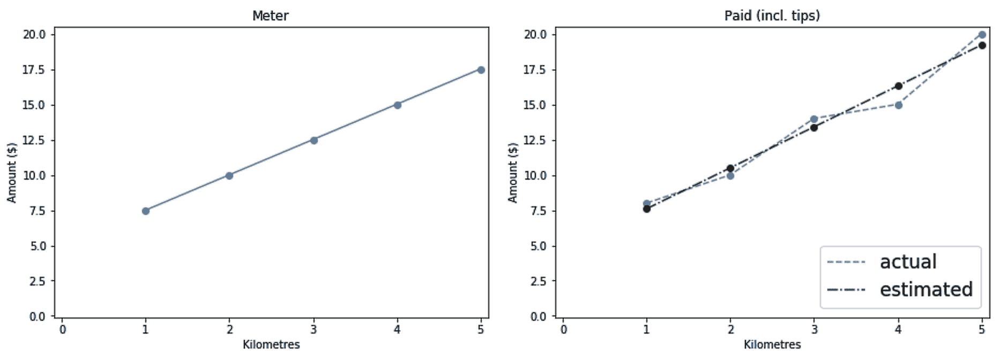

3.  一旦线性模型被训练，您可以使用`intercept_`和`coef_`参数获得它的截距和系数。因此，我们可以使用下面的代码片段来创建估计线的线性方程:

```py
print(
    'Amount Paid = {:.1f} + {:.1f} * Distance'.format(
        reg.intercept_, reg.coef_[0], 
    )
) 
```

然后打印以下等式:

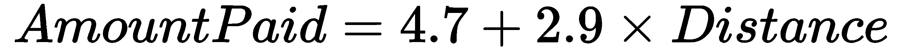

如果您想在 scikit-learn 中建立一个模型，然后在另一种语言甚至是您最喜欢的电子表格软件中使用它，那么获取线性方程的参数会很方便。知道这个系数也有助于我们理解为什么模型会做出某些决定。本章后面会有更多的介绍。

在软件中，函数和方法的输入被称为参数。在机器学习中，为模型学习的权重也被称为参数。当设置一个模型时，我们将它的配置传递给它的`__init__`方法。因此，为了避免任何混淆，模型的配置被称为超参数。

# 预测波士顿的房价

现在我们已经了解了线性回归的工作原理，让我们继续来看一个真实的数据集，在这里我们可以演示一个更实际的用例。

波士顿数据集是代表波士顿市房价的一个小集合。它包含 506 个样本和 13 个特征。让我们将数据加载到数据帧中，如下所示:

```py
from sklearn.datasets import load_boston

boston = load_boston()

df_dataset = pd.DataFrame(
    boston.data,
    columns=boston.feature_names,
)
df_dataset['target'] = boston.target
```

## 数据探索

确保数据中没有任何空值非常重要；不然 scikit-learn 会投诉的。在这里，我将计算每一列中的空值的总和，然后对其求和。如果我得到了`0`，那么我就是一个快乐的人:

```py
df_dataset.isnull().sum().sum() # Luckily, the result is zero
```

对于一个回归问题，最重要的是了解你的目标的分布。如果目标范围在`1`和`10`之间，并且在训练我们的模型后，我们得到平均绝对误差`5`，我们可以知道在这种情况下误差很大。

然而，范围在`500,000`和`1,000,000`之间的目标的相同误差可以忽略不计。当您想要可视化分布时，直方图是您的好朋友。除了目标的分布之外，我们还要绘制每个特征的平均值:

```py
fig, axs = plt.subplots(1, 2, figsize=(16, 8))

df_dataset['target'].plot(
    title='Distribution of target prices', kind='hist', ax=axs[0]
)
df_dataset[boston.feature_names].mean().plot(
    title='Mean of features', kind='bar', ax=axs[1]
)

fig.show()
```

这为我们提供了以下图表:

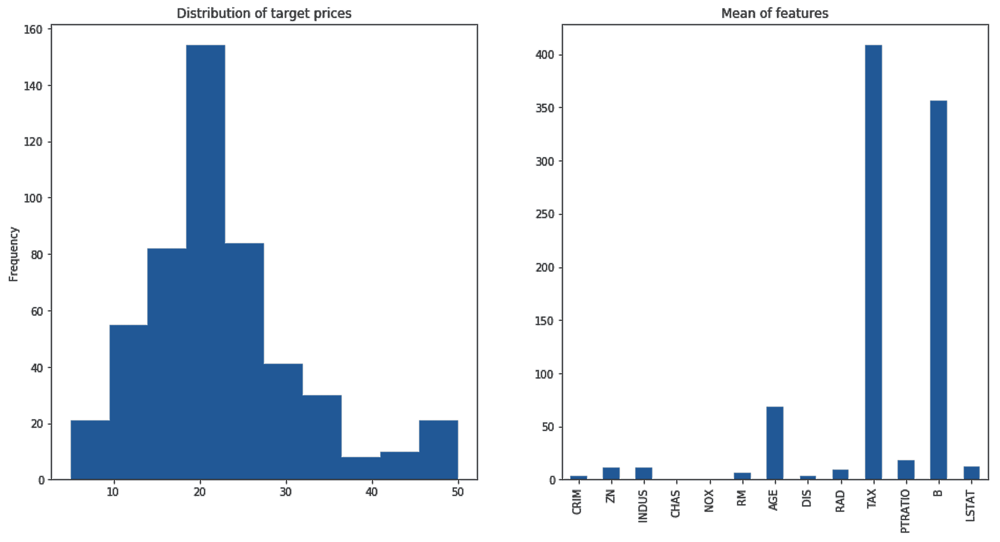

在上图中，我们观察到:

*   价格范围在`5`到`50`之间。显然，这些不是真实的价格，可能是归一化的值，但现在这并不重要。
*   此外，从柱状图中我们可以看出，大多数价格都低于`35`。我们可以使用下面的代码片段来查看 90%的价格都低于`34.8`:

```py
df_dataset['target'].describe(percentiles=[.9, .95, .99])
```

您总是可以更深入地探索数据，但我们将在这种情况下停止。

## 拆分数据

对于小型数据集，建议您分配足够的数据进行测试。因此，我们将使用`train_test_split`函数将数据分成 60%用于训练，40%用于测试:

```py
from sklearn.model_selection import train_test_split

df_train, df_test = train_test_split(df_dataset, test_size=0.4)

x_train = df_train[boston.feature_names]
x_test = df_test[boston.feature_names]
y_train = df_train['target']
y_test = df_test['target']
```

一旦有了训练集和测试集，将它们进一步分成 *x* 集和 *y* 集。然后，我们准备进入下一步。

## 计算基线

目标的分布给了我们一个可以容忍的误差水平的概念。然而，将我们的最终模型与某样东西进行比较总是有用的。如果我们在房地产行业，人工代理被用来估计房价，那么我们很可能会被期望建立一个比人工代理做得更好的模型。然而，由于我们不知道任何真实的估计来比较我们的模型，我们可以提出我们自己的基线。平均房价`22.5`。如果我们建立一个虚拟模型，不管给它的数据如何，它都返回平均价格，那么它将成为一个合理的基线。

请记住，`22.5`的值是针对整个数据集计算的，但是由于我们假装只能访问训练数据，因此只计算训练集的平均价格是有意义的。为了节省我们所有的努力，scikit-learn 提供了虚拟回归器来为我们做这些工作。

这里，我们将创建一个虚拟回归变量，并使用它来计算测试集的基线预测:

```py
from sklearn.dummy import DummyRegressor

baselin = DummyRegressor(strategy='mean')
baselin.fit(x_train, y_train)

y_test_baselin = baselin.predict(x_test)

```

我们还可以使用其他策略，比如找到中位数(第 50 个分位数)或任何其他第 N 个分位数。请记住，对于相同的数据，与使用中位数相比，使用平均值作为估计值会产生更低的 MSE。相反，中值给出了较低的**平均绝对误差** ( **MAE** )。我们希望我们的模型能够超越 MAE 和 MSE 的基线。

## 训练线性回归器

基线模型的代码不是和实际模型的代码几乎一样吗？这就是 scikit-learn 的 API 的妙处。这意味着当我们决定尝试一种不同的算法时——比如上一章的决策树算法——我们只需要修改几行代码。无论如何，这是线性回归的代码:

```py
from sklearn.linear_model import LinearRegression

reg = LinearRegression()
reg.fit(x_train, y_train)

y_test_pred = reg.predict(x_test)
```

我们现在将坚持使用默认配置。

## 评估我们模型的准确性

回归常用的度量有三种:*R²**MAE**MSE*。让我们首先编写计算三个指标并打印结果的代码:

```py
from sklearn.metrics import r2_score
from sklearn.metrics import mean_absolute_error
from sklearn.metrics import mean_squared_error

print(
    'R2 Regressor = {:.2f} vs Baseline = {:.2f}'.format(
        r2_score(y_test, y_test_pred), 
        r2_score(y_test, y_test_baselin)
     )
)
print(
    'MAE Regressor = {:.2f} vs Baseline = {:.2f}'.format(
        mean_absolute_error(y_test, y_test_pred), 
        mean_absolute_error(y_test, y_test_baselin)
    )
)
print(
    'MSE Regressor = {:.2f} vs Baseline = {:.2f}'.format(
        mean_squared_error(y_test, y_test_pred), 
        mean_squared_error(y_test, y_test_baselin)
    )
)
```

以下是我们得到的结果:

```py
R2 Regressor = 0.74 vs Baseline = -0.00
MAE Regressor = 3.19 vs Baseline = 6.29
MSE Regressor = 19.70 vs Baseline = 76.11
```

到现在，你应该已经知道 *MAE* 和 *MSE* 是如何计算的了。请记住， *MSE* 比 *MAE* 对异常值更敏感。这就是为什么基线的平均估计在那里得分很低。至于 *R* *²* ，我们来看看它的公式:


下面是对上述公式的解释:

*   分子可能会让你想起 *MSE* 。我们基本上是计算所有预测值和它们对应的实际值之间的平方差。
*   至于分母，我们使用实际值的平均值作为伪估计值。
*   基本上，这个指标告诉我们，与使用目标的平均值作为估计相比，我们的预测要好得多。
*   一个 R ² 的分数`1`是我们能得到的最好成绩，一个`0`的分数意味着与使用一个仅仅依赖平均值作为估计的有偏模型相比，我们没有提供额外的价值。
*   负的分数意味着我们应该把我们的模型扔进垃圾桶，而使用目标的平均值。
*   显然，在基线模型中，我们已经使用目标的平均值作为预测值。这就是为什么它的 R ² 分数是`0`。

对于 *MAE* 和 *MSE* ，它们的值越小，模型越好。反之，对于 *R* *²* ，其数值越高，模型越好。在 scikit-learn 中，度量函数的名称以`_score`结尾，其中较高的值与较好的结果相关，而对于以`_error`或`_loss`结尾的函数，值越低越好。

现在，如果我们比较分数，很明显我们的模型在使用的所有三个分数中都比基线得分高。恭喜你！

## 显示特征系数

我们知道，线性模型是将每个特征乘以某个系数，然后得到这些乘积的和作为它的最终预测。在模型被训练后，我们可以使用回归器的`coef_`方法来打印这些系数:

```py
df_feature_importance = pd.DataFrame(
    {
        'Features': x_train.columns,
        'Coeff': reg.coef_,
        'ABS(Coeff)': abs(reg.coef_),
    }
).set_index('Features').sort_values('Coeff', ascending=False)
```

正如我们在这些结果中看到的，有些系数是正的，有些是负的。正系数意味着特征与目标正相关，反之亦然。我还为系数的绝对值添加了另一列:

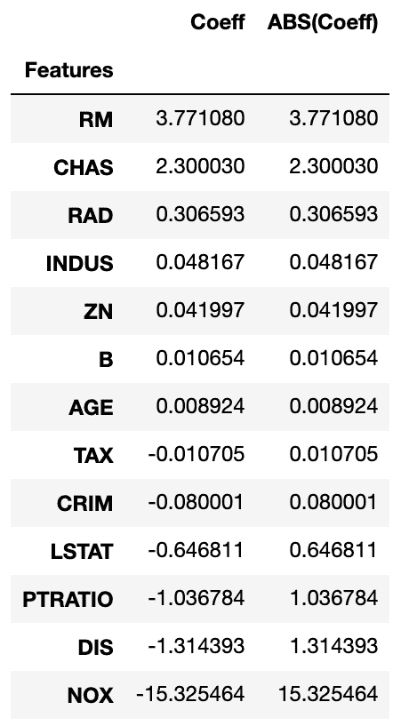

在前面的屏幕截图中，观察到以下情况:

*   理想情况下，每个系数的值应该告诉我们每个特性有多重要。无论其符号如何，较高的绝对值反映了高重要性。
*   然而，我在这里犯了一个错误。如果你检查数据，你会注意到`NOX`的最大值是`0.87`，而`TAX`上升到`711`。这意味着，如果`NOX`只是边缘重要性，它的系数将仍然很高，以平衡它的小值，而对于`TAX`，与特征本身的高值相比，它的系数将总是很小。
*   因此，我们希望调整这些特性，使它们都处于可比较的范围内。在下一节中，我们将了解如何缩放我们的功能。

## 缩放更有意义的系数

scikit-learn 有许多定标器。我们现在将使用`MinMaxScaler`。使用它的默认配置将挤出`0`和`1`之间所有特性的所有值。首先需要安装定标器，以了解特征的范围。只能在训练 *x* 套件上进行装配。然后，我们使用缩放器的`transform`函数来缩放训练集和测试集 *x* :

```py
from sklearn.linear_model import LinearRegression
from sklearn.preprocessing import MinMaxScaler

scaler = MinMaxScaler()
reg = LinearRegression()

scaler.fit(x_train)
x_train_scaled = scaler.transform(x_train)
x_test_scaled = scaler.transform(x_test)

reg.fit(x_train_scaled, y_train)
y_test_pred = reg.predict(x_test_scaled)
```

这段代码有一个简化版本，用于拟合一个数据集，然后对其进行转换。换句话说，以下未注释的行取代了两个注释行:

```py
# scaler.fit(x_train)
# x_train_scaled = scaler.transform(x_train)
x_train_scaled = scaler.fit_transform(x_train)
```

从现在开始，我们将在需要的地方大量使用`fit_transform()`函数。

如果想要有意义的系数，缩放要素非常重要。此外，缩放有助于基于梯度的解算器更快地收敛(稍后将详细介绍)。除了缩放之外，您还应该确保没有高度相关的要素用于更有意义的系数和稳定的线性回归模型。

既然我们已经缩放了要素并重新训练了模型，我们可以再次打印要素及其系数:

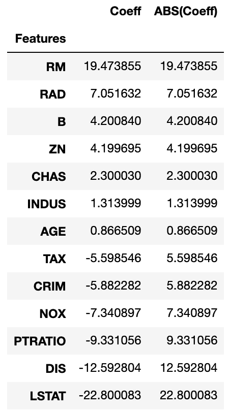

注意`NOX`现在没有以前重要了。

## 添加多项式要素

现在我们知道了最重要的特征是什么，我们可以根据它们来绘制目标，以查看它们之间的相互关系:

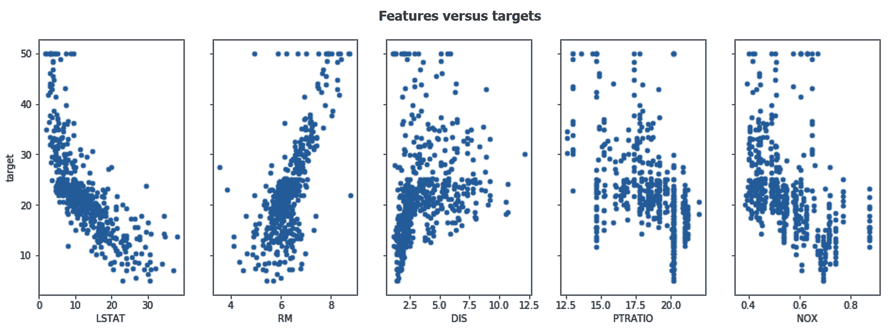

在前面的屏幕截图中，观察到以下情况:

*   这些图对我来说似乎不是很线性，线性模型将无法捕捉这种非线性。
*   虽然我们不能将线性模型转换成非线性模型，但是我们仍然可以转换数据。
*   可以这样想:如果 *y* 是*x²的函数，我们可以使用非线性模型——这种模型能够捕捉到 *x* 和 *y* 之间的二次关系——或者我们可以只计算*x²T43，并将其交给线性模型，而不是 *x* 。此外，线性回归算法不能捕捉特征交互。**
*   当前模型无法捕捉多个特征之间的交互。

多项式变换可以为我们解决非线性和特征交互问题。给定原始数据，scikit-learn 的多项式转换器会将要素转换到更高维度(例如，它会将每个要素的二次值和三次值相加)。此外，它还会将产品添加到每个特性对(或三元组)中。`PolynomialFeatures`工作方式类似于我们在本章前面使用的缩放器。我们将使用其`fit_transform`变量和一个`transform()`方法，如下所示:

```py
from sklearn.preprocessing import PolynomialFeatures

poly = PolynomialFeatures(degree=3)
x_train_poly = poly.fit_transform(x_train)
x_test_poly = poly.transform(x_test)
```

为了获得二次和三次特征变换，我们将`degree`参数设置为`3`。

关于`PolynomialFeatures`的一个恼人的事情是，它不跟踪数据帧的列名。它用`x0`、`x1`、`x2`等替换特征名称。但是，有了 Python 技能，我们可以重新获得列名。让我们使用下面的代码块来实现这一点:

```py
feature_translator = [
    (f'x{i}', feature) for i, feature in enumerate(x_train.columns, 0)
]

def translate_feature_names(s):
    for key, val in feature_translator:
        s = s.replace(key, val)
    return s

poly_features = [
    translate_feature_names(f) for f in poly.get_feature_names()
]

x_train_poly = pd.DataFrame(x_train_poly, columns=poly_features)
x_test_poly = pd.DataFrame(x_test_poly, columns=poly_features)
```

我们现在可以使用新导出的多项式特征来代替原来的特征。

### 用导出的特征拟合线性回归

*“我六岁的时候，姐姐只有我一半大。现在我 60 岁了，姐姐多大了？”*

*这是在网上找到的一个谜题。如果你的答案是 30，那么你忘了在你的线性回归模型中加入截距。*

现在，我们准备将线性回归器用于新转换的要素。需要记住的一点是，`PolynomialFeatures`转换器增加了一个额外的列，其中所有的值都是`1`。该列训练后得到的系数相当于截距。因此，这次在训练我们的回归量时，我们不会通过设置`fit_intercept=False`来拟合截距:

```py
from sklearn.linear_model import LinearRegression

reg = LinearRegression(fit_intercept=False)
reg.fit(x_train_poly, y_train)

y_test_pred = reg.predict(x_test_poly)
```

最后，当我们打印出*R²、 *MAE* 和 *MSE* 结果时，我们面临着以下令人不快的意外:*

```py
R2 Regressor = -84.887 vs Baseline = -0.0
MAE Regressor = 37.529 vs Baseline = 6.2
MSE Regressor = 6536.975 vs Baseline = 78.1
```

回归变量比以前更差，甚至比基线更差。多项式特征对我们的模型做了什么？

普通最小二乘回归算法的一个主要问题是它不能很好地处理高度相关的要素(多重共线性)。

多项式要素变换的厨房水槽方法(添加要素、其平方值和立方值以及要素对和三元组的乘积)很可能会产生多个相关要素。这种多重共线性损害了模型的性能。再者，如果打印出`x_train_poly`的形状，会看到它有 303 个样本，560 个特征。这是另一个被称为维数灾难的问题。

**维数灾难**是指与样本相比，你有太多的特征。如果您将数据框想象成一个矩形，以要素为底边，以样本为高，那么您总是希望矩形的高度比底边大得多。假设有两个二进制列— `x1`和`x2`。它们可以采用四种可能的值组合— `(0, 0)`、`(0, 1)`、`(1, 0)`和`(1, 1)`。同样，对于 *n* 列，可以取*2^n 组合。如您所见，可能性的数量随着功能的数量呈指数增长。对于监督学习算法来说，它需要足够的样本来覆盖所有这些可能性的合理数量。当我们有非二进制特征时，这个问题甚至更严重，就像我们这里的情况一样。*

谢天谢地，两个世纪的时间足够人们找到这两个问题的解决方案了。正则化是我们将在下一节中体验的解决方案。

# 正则化回归变量

"用更少的资源做更多的事情是徒劳的."

–奥卡姆的威廉

最初，我们的目标是最小化回归变量的 MSE 值。后来，我们发现太多的特性是一个问题。这就是为什么我们需要一个新的目标。我们仍然需要最小化回归变量的 MSE 值，但是我们也需要激励模型忽略无用的特征。我们目标的第二部分简单来说就是正规化的作用。

正则化线性回归常用两种算法——**lasso**和 **ridge** 。Lasso 推动模型使用较少的系数——也就是说，它将尽可能多的系数设置为`0`——而 ridge 推动模型使用尽可能小的系数值。Lasso 使用一种称为 L1 的正则化形式，它惩罚系数的绝对值，而 ridge 使用 L2，它惩罚系数的平方值。这两种算法都有一个超参数(alpha ),用于控制系数的正则化程度。将 alpha 设置为`0`意味着根本没有正则化，这将我们带回普通的最小二乘回归器。虽然 alpha 值越大，正则化越强，但我们将从 alpha 的默认值开始，然后看看如何正确设置它。

普通最小二乘算法中使用的标准方法在这里不起作用。我们现在有了一个目标函数，除了最小化预测器的 MSE 值之外，还旨在最小化系数的大小。因此，使用求解器来寻找最佳系数，以最小化新的目标函数。我们将在本章的后面进一步研究求解器。

## 训练套索回归器

训练套索和训练其他任何模型没什么不同。类似于我们在上一节中所做的，我们将在这里将`fit_intercept`设置为`False`:

```py
from sklearn.linear_model import Ridge, Lasso

reg = Lasso(fit_intercept=False)
reg.fit(x_train_poly, y_train)

y_test_pred = reg.predict(x_test_poly)
```

完成后，我们可以打印 R ² 、MAE 和 MSE:

```py
R2 Regressor = 0.787 vs Baseline = -0.0
MAE Regressor = 2.381 vs Baseline = 6.2
MSE Regressor = 16.227 vs Baseline = 78.
```

我们不仅解决了多项式特征带来的问题，而且比原始的线性回归器具有更好的性能。 *MAE* 这里是`2.4`，对比之前的`3.6`， *MSE* 是`16.2`，对比之前的`25.8`， *R ²* 是`0.79`，对比之前的`0.73`。

现在我们已经看到了应用正则化后的有希望的结果，是时候看看如何设置正则化参数的最佳值了。

## 寻找最佳正则化参数

理想情况下，在将数据分成训练集和测试集之后，我们会将训练集进一步分成 *N* 个折叠。然后，我们将列出我们想要测试的所有 alpha 值，并一个接一个地循环。对于每次迭代，我们将应用 *N* -fold 交叉验证来找到给出最小误差的 alpha 值。谢天谢地，scikit-learn 有一个叫做`LassoCV`的模块(`CV`代表交叉验证)。在这里，我们将使用该模块，通过五重交叉验证找到 alpha 的最佳值:

```py
from sklearn.linear_model import LassoCV

# Make a list of 50 values between 0.000001 & 1,000,000
alphas = np.logspace(-6, 6, 50)

# We will do 5-fold cross validation
reg = LassoCV(alphas=alphas, fit_intercept=False, cv=5)
reg.fit(x_train_poly, y_train)

y_train_pred = reg.predict(x_train_poly)
y_test_pred = reg.predict(x_test_poly)
```

一旦完成，我们就可以使用该模型进行预测。您可能希望预测定型集和测试集，并查看模型是否过度适合定型集。我们也可以打印选择的 alpha，如下所示:

```py
print(f"LassoCV: Chosen alpha = {reg.alpha_}")
```

我得到了一个`1151.4`的`alpha`值。

此外，我们还可以看到，对于α的每个值，五次折叠中的每一次的 *MSE* 值是多少。我们可以通过`mse_path_`获取这些信息。

由于我们有五个α值的 MSE 值，我们可以画出这五个值的平均值，以及平均值的置信区间。

置信区间用于显示观察数据可能出现的预期范围。95%的置信区间意味着我们预计 95%的值都在这个范围内。有一个宽的置信区间意味着数据可能取一个宽范围的值，而一个窄的置信区间意味着我们几乎可以精确地指出数据将取什么值。

95%的置信区间计算如下:


在这里，标准误差等于标准差除以样本数的平方根( [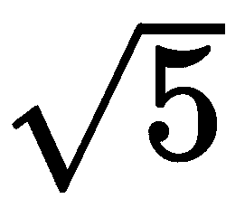] ，因为我们这里有五倍)。

这里的置信区间公式不是 100%准确的。从统计学的角度来说，当处理小样本，并且它们的潜在方差未知时，应该使用 t 分布而不是 z 分布。因此，鉴于此处的折叠次数较少，系数 1.96 应由 t 分布表中更精确的值代替，其中其自由度是根据折叠次数推断的。

以下代码片段计算并绘制了 MSE 与 alpha 的置信区间:

1.  我们首先计算返回的 *MSE* 值的描述性统计数据:

```py
# n_folds equals to 5 here
n_folds = reg.mse_path_.shape[1]

# Calculate the mean and standard error for MSEs
mse_mean = reg.mse_path_.mean(axis=1)
mse_std = reg.mse_path_.std(axis=1)
# Std Error = Std Deviation / SQRT(number of samples)
mse_std_error = mse_std / np.sqrt(n_folds)
```

2.  然后，我们将计算结果放入数据框中，并使用默认折线图绘制它们:

```py
fig, ax = plt.subplots(1, 1, figsize=(16, 8))

# We multiply by 1.96 for a 95% Confidence Interval
pd.DataFrame(
    {
        'alpha': reg.alphas_,
        'Mean MSE': mse_mean,
        'Upper Bound MSE': mse_mean + 1.96 * mse_std_error,
        'Lower Bound MSE': mse_mean - 1.96 * mse_std_error,
    }
).set_index('alpha')[
    ['Mean MSE', 'Upper Bound MSE', 'Lower Bound MSE']
].plot(
    title='Regularization plot (MSE vs alpha)', 
    marker='.', logx=True, ax=ax
)

# Color the confidence interval 
plt.fill_between(
    reg.alphas_, 
    mse_mean + 1.96 * mse_std_error, 
    mse_mean - 1.96 * mse_std_error, 
)

# Print a vertical line for the chosen alpha
ax.axvline(reg.alpha_, linestyle='--', color='k')
ax.set_xlabel('Alpha')
ax.set_ylabel('Mean Squared Error')
```

下面是前面代码的输出:

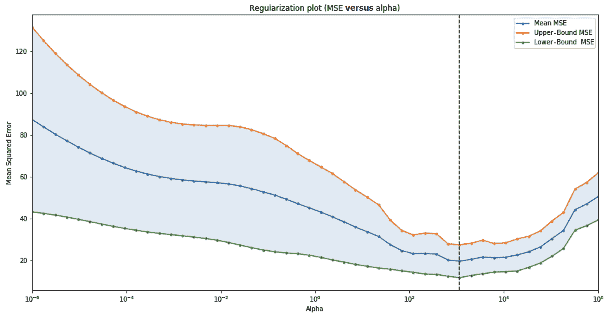

MSE 值在选定的 alpha 值处最低。置信区间也更窄，这反映出对预期的 *MSE* 结果更有信心。

最后，将模型的 alpha 值设置为建议的值，并使用它来预测测试数据，会得到以下结果:

|  | **基线** | **线性回归** | **阿尔法= 1151.4 时的套索** |
| **R²** | `0.00` | `0.73` | `0.83` |
| **梅** | `7.20` | `3.56` | `2.76` |
| **MSE** | `96.62` | `25.76` | `16.31` |

显然，正则化更早地解决了维数灾难导致的问题。此外，我们能够使用交叉验证来找到最佳的正则化参数。我们绘制了误差的置信区间，以可视化 alpha 对回归变量的影响。事实上，我已经在本节中讨论了置信区间，这激励我将下一节致力于回归区间。

# 寻找回归区间

"探索未知需要容忍不确定性。"

布赖恩·格林

并不总是保证我们有准确的模型。有时，我们的数据本身就有噪声，我们无法使用回归变量对其建模。在这些情况下，重要的是能够量化我们在估计中的确定程度。通常情况下，回归变量会做出点预测。这些是目标值( *y* )在每个 *x* 值下的期望值(通常是平均值)。贝叶斯岭回归器能够像往常一样返回期望值，但它也返回目标值( *y* )在每个值 *x* 处的标准偏差。

为了演示这是如何工作的，让我们创建一个噪声数据集，其中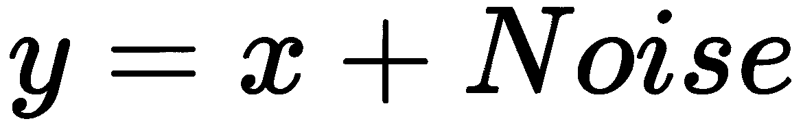:

```py
import numpy as np
import pandas as pd

df_noisy = pd.DataFrame(
    {
        'x': np.random.random_integers(0, 30, size=150),
        'noise': np.random.normal(loc=0.0, scale=5.0, size=150)
    }
)

df_noisy['y'] = df_noisy['x'] + df_noisy['noise']
```

然后，我们可以用散点图的形式绘制它:

```py
df_noisy.plot(
    kind='scatter', x='x', y='y'
)
```

绘制生成的数据框将得到以下图形:

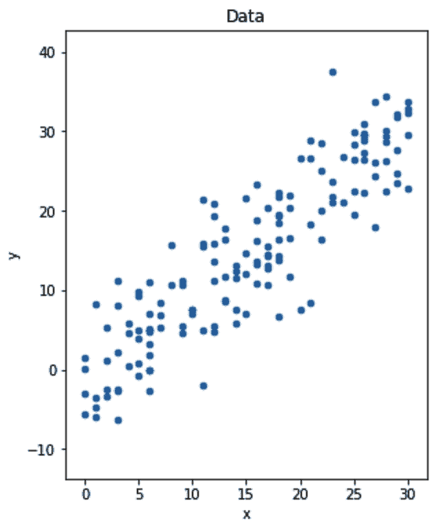

现在，让我们针对相同的数据训练两个回归变量— `LinearRegression`和`BayesianRidge`。在这里，我将坚持使用贝叶斯岭超参数的默认值:

```py
from sklearn.linear_model import LinearRegression
from sklearn.linear_model import BayesianRidge

lr = LinearRegression()
br = BayesianRidge()

lr.fit(df_noisy[['x']], df_noisy['y'])
df_noisy['y_lr_pred'] = lr.predict(df_noisy[['x']])

br.fit(df_noisy[['x']], df_noisy['y'])
df_noisy['y_br_pred'], df_noisy['y_br_std'] = br.predict(df_noisy[['x']], return_std=True)
```

请注意贝叶斯岭回归器在预测时如何返回两个值。

线性回归的贝叶斯方法与上述算法的不同之处在于它查看系数的方式。对于我们到目前为止看到的所有算法，每个系数在训练后都取单个值，但对于贝叶斯模型，系数更像是具有估计平均值和标准偏差的分布。使用先验分布初始化系数，通过训练数据更新该系数，以通过贝叶斯定理得到后验分布。贝叶斯岭回归器是一个正则化的贝叶斯回归器。

这两个模型做出的预测非常相似。然而，我们可以使用返回的标准偏差来计算我们预计未来大部分数据将落入的值的范围。以下代码片段为两个模型及其预测创建了绘图:

```py
fig, axs = plt.subplots(1, 3, figsize=(16, 6), sharex=True, sharey=True)

# We plot the data 3 times
df_noisy.sort_values('x').plot(
    title='Data', kind='scatter', x='x', y='y', ax=axs[0]
)
df_noisy.sort_values('x').plot(
    kind='scatter', x='x', y='y', ax=axs[1], marker='o', alpha=0.25
)
df_noisy.sort_values('x').plot(
    kind='scatter', x='x', y='y', ax=axs[2], marker='o', alpha=0.25
)

# Here we plot the Linear Regression predictions
df_noisy.sort_values('x').plot(
    title='LinearRegression', kind='scatter', x='x', y='y_lr_pred', 
    ax=axs[1], marker='o', color='k', label='Predictions'
)

# Here we plot the Bayesian Ridge predictions
df_noisy.sort_values('x').plot(
    title='BayesianRidge', kind='scatter', x='x', y='y_br_pred', 
    ax=axs[2], marker='o', color='k', label='Predictions'
)

# Here we plot the range around the expected values
# We multiply by 1.96 for a 95% Confidence Interval
axs[2].fill_between(
    df_noisy.sort_values('x')['x'], 
    df_noisy.sort_values('x')['y_br_pred'] - 1.96 * 
                df_noisy.sort_values('x')['y_br_std'], 
    df_noisy.sort_values('x')['y_br_pred'] + 1.96 * 
                df_noisy.sort_values('x')['y_br_std'],
    color="k", alpha=0.2, label="Predictions +/- 1.96 * Std Dev"
)

fig.show()
```

运行前面的代码会得到下面的图形。在`BayesianRidge`案例中，阴影区域显示了我们预计 95%的目标会落在哪里:


当我们想要量化我们的不确定性时，回归区间是很方便的。在[第 8 章](https://cdp.packtpub.com/hands_on_machine_learning_with_scikit_learn/wp-admin/post.php?post=30&action=edit)、*集合中——当一个模型不够用时*，我们将重新考虑回归区间

# 了解其他线性回归变量

在使用线性分类器之前，还需要向工具集中添加以下额外的线性回归算法:

*   **弹性网**混合使用 L1 和 L2 正则化技术，其中`l1_ratio`控制两者的混合。当你想要学习一个稀疏模型，其中很少的权重是非零的(如**套索**)，同时保持**脊**正则化的好处时，这是很有用的。
*   **随机样本一致性** ( **RANSAC** )在你的数据有离群值的时候很有用。它试图从内部样本中分离出异常值。然后，它只适合内联器上的模型。
*   **最小角度回归** ( **LARS** )在处理高维数据时很有用——也就是说，当与样本数量相比有大量特征时。您可能想尝试一下我们之前看到的多项式特征示例，看看它在那里的表现如何。

让我们继续本书的下一部分，在这里你将学习使用逻辑回归对数据进行分类。

# 使用逻辑回归进行分类

“你可以通过一个人的回答来判断他是否聪明。你可以通过一个人的问题来判断他是否明智。”

纳吉布·马赫福兹

有一天，求职时，面试官问:*那么告诉我，logistic 回归是分类还是回归算法？*简短的回答是这是一个分类算法，但是更长更有趣的回答需要对逻辑函数有很好的理解。然后，这个问题可能会有完全不同的意思。

## 理解物流功能

逻辑函数是 sigmoid ( *s* 形)函数的一员，它由以下公式表示:

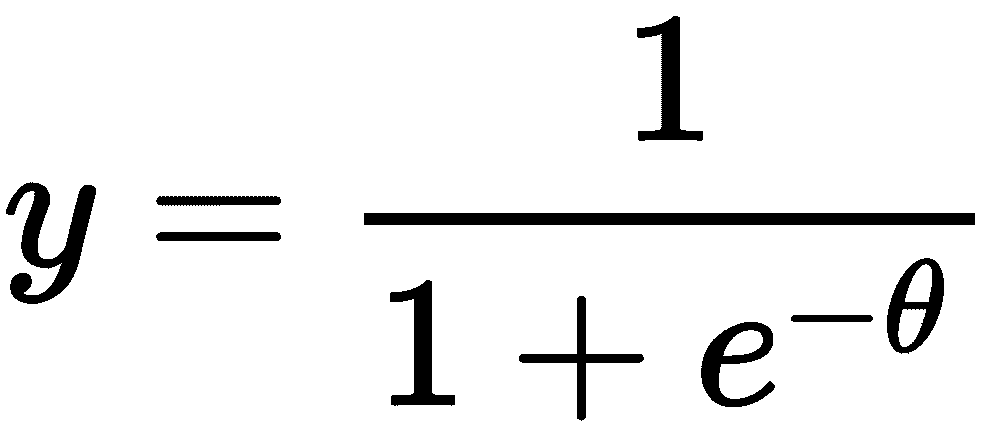

不要让这个等式吓到你。真正重要的是这个函数的视觉效果。幸运的是，我们可以用计算机生成一系列θ值——例如，在`-10`和`10`之间。然后，我们可以将这些值代入公式，并绘制出结果的`y`值与θ值的关系，就像我们在下面的代码中所做的那样:

```py
import numpy as np
import pandas as pd

fig, ax = plt.subplots(1, 1, figsize=(16, 8))

theta = np.arange(-10, 10, 0.05)
y = 1 / (1 + np.exp(-1 * theta))

pd.DataFrame(
    {
        'theta': theta,
        'y': y
    }
).plot(
    title='Logistic Function', 
    kind='scatter', x='theta', y='y', 
    ax=ax
)

fig.show()
```

运行这段代码会得到下面的图表:

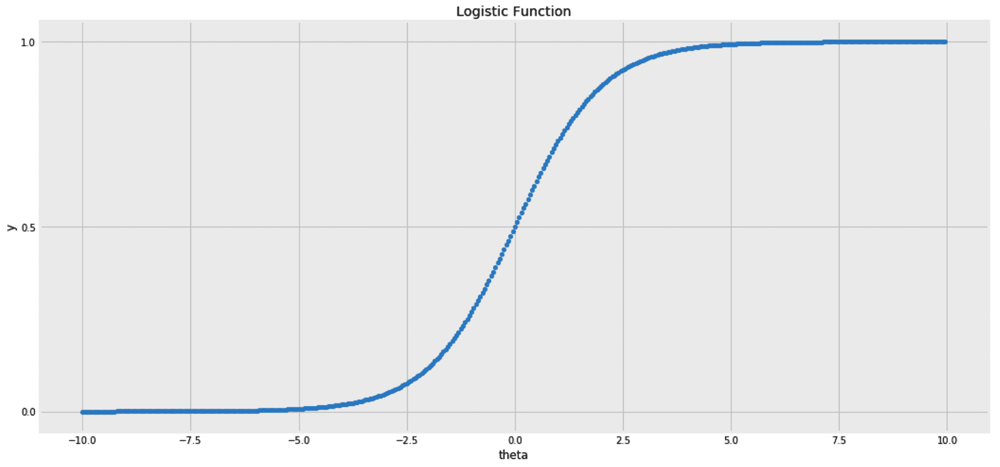

物流职能中需要注意的两个关键特征如下:

*   *y* 仅在`0`和`1`之间运行。当θ接近无穷大时接近`1`，当θ接近负无穷大时接近`0`。
*   当θ为`0`时`y`取`0.5`的值。

## 将逻辑函数代入线性模型

“概率不仅仅是计算骰子上的赔率或更复杂的变量；它是接受我们的知识缺乏确定性，并发展出处理我们无知的方法。”

纳西姆·尼古拉斯·塔勒布

对于具有几个特征的线模型，*x[1]和 *x [2]* ，我们可以有一个截距和两个系数。姑且称之为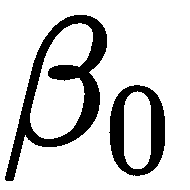、、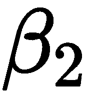。那么，线性回归方程将如下:*

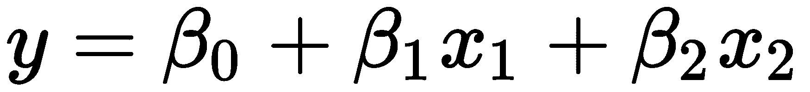

另外，我们也可以将前面等式的右边代入逻辑函数，代替。这将为 *y* 给出以下等式:

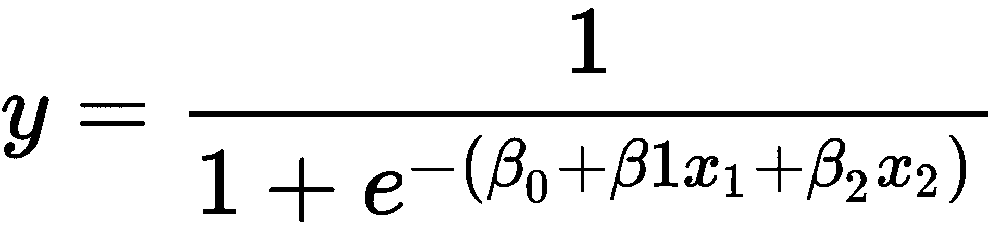

在这种情况下， *x* 值的变化将使 *y* 在`0`和`1`之间移动。 *x* 及其系数的乘积的较高值将使 *y* 向`1`移动，较低值将使其向`0`移动。我们也知道概率取值在`0`和`1`之间。所以，给定 *x* 的值，将 *y* 解释为 *y* 属于某个类的概率是有意义的。如果不想处理概率，可以只指定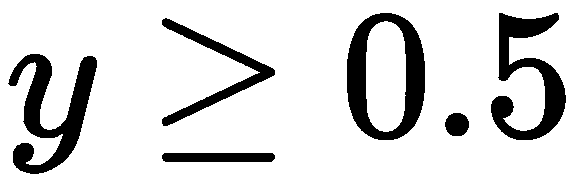；那么，我们的样本属于 1 类，否则属于 0 类。

这是对逻辑回归工作原理的简要介绍。它是一个分类器，但它被称为*回归*，因为它基本上是一个回归变量，返回一个在`0`和`1`之间的值，我们将其解释为概率。

为了训练逻辑回归模型，我们需要一个目标函数，以及一个试图找到最佳系数以最小化该函数的求解器。在接下来的部分中，我们将更详细地讨论所有这些。

### 目标函数

在训练阶段，该算法遍历数据，试图找到最小化预定义目标(损失)函数的系数。在逻辑回归的情况下，我们试图最小化的损失函数称为对数损失。它使用以下公式测量预测概率( *p* )与实际分类标签( *y* )的差距:

*-log(p)如果 y == 1 否则-log(1 - p)*

数学家由于缺乏`if-else`条件，用一种相当难听的方式来表达这个公式。因此，为了清晰起见，我选择在这里显示 Python 表单。玩笑归玩笑，一旦你知道了它的信息论根源，这个数学公式将会变得很美，但这不是我们现在要看的东西。

### 正规化

此外，scikit-learn 的逻辑回归算法实现默认使用正则化。开箱即用，它使用 L2 正则化(如在岭回归)，但它也可以使用 L1(如在套索)或 L1 和 L2 的混合(如在弹性网)。

### 解决者（solver 的复数形式）

最后，我们如何找到最佳系数来最小化我们的损失函数？一种简单的方法是尝试所有可能的系数组合，直到找到最小损失。然而，由于在给定无限组合的情况下穷举搜索是不可行的，因此求解器可以有效地搜索最佳系数。scikit-learn 实现了大约六个解算器。

规划求解的选择以及所使用的正则化方法是配置逻辑回归算法时需要做出的两个主要决定。在下一节中，我们将了解如何以及何时挑选每一个。

## 配置逻辑回归分类器

在讨论解算器之前，我们先来看看一些常用的超参数:

*   **`fit_intercept`** :通常，除了每个特征的系数，在你的方程中还有一个常数截距。然而，有些情况下你可能不需要截距——例如，当所有的 *x* 的值都是`0`时，你肯定知道 *y* 的值应该是`0.5`。另一种情况是当您的数据已经有一个所有值都设置为`1`的附加常量列时。如果您的数据已经在早期阶段进行了处理，通常会出现这种情况，例如多项式处理器。在这种情况下，`constant`列的系数将被解释为截距。对于前面解释的线性回归算法，也存在相同的配置。
*   **`max_iter`** :为使求解器找到最佳系数，它对训练数据循环不止一次。这些迭代也被称为纪元。您通常会对迭代次数设置一个限制，以防止过度拟合。前面解释的 lasso 和 ridge 回归函数使用了相同的超参数。
*   **`tol`** :这是另一种阻止求解器过多迭代的方法。如果您将它设置为一个较高的值，这意味着只允许在一次迭代和下一次迭代之间有较高的改进；否则，求解器将停止。相反，较低的值将使解算器进行更多的迭代，直到它到达 **`max_iter`。**
*   **`penalty`** :选择要使用的正则化技术。这可以是 L1，L2，弹性网，或无正则化。正则化有助于防止过度拟合，因此当您有很多特征时使用正则化非常重要。当`max_iter`和 **`tol`** 设置为高值时，它还可以减轻过拟合效应。
*   `C`或`alpha`:这些参数用于设置您希望正则化的强度。因为我们将在这里使用逻辑回归算法的两种不同实现，所以知道这两种实现使用不同的参数(`C`与`alpha`)是很重要的。`alpha`基本上是`C`的逆——()。这意味着`C`的较小值指定更强的正则化，而对于`alpha`，更强的正则化需要更大的值。
*   `l1_ratio`:当使用 L1 和 L2 的混合时，如在 elastic-net 中，这个分数指定了 L1 对 L2 的权重。

以下是我们可以使用的一些解算器:

*   `liblinear` : **该求解器在`LogisticRegression`中实现，建议用于较小的数据集。它支持 L1 和 L2 正则化，但是如果你想使用弹性网，或者你根本不想使用正则化，你就不能使用它。**
***   `sag`或`saga`:这些解算器在`LogisticRegression`和`RidgeClassifier`中实现。对于较大的数据集，它们速度更快。但是，您需要缩放要素以使其收敛。我们在本章前面使用了`MinMaxScaler`来缩放我们的特征。现在，不仅需要更有意义的系数，还需要求解器更早地找到解。`saga`支持所有四种惩罚选项。*   `lbfgs` : **该解算器在`LogisticRegression`中实现。它支持 L2 惩罚或根本没有正规化。****

 *****   **随机梯度下降**(**SGD**):SGD 有专门的实现— `SGDClassifier`和`SGDRegressor`。这与`LogisticRegression`不同，后者的重点是通过优化单损失函数(对数损失)来执行逻辑回归。`SGDClassifier`的重点在于 SGD 求解器本身，这意味着同一个分类器允许使用不同的损失函数。如果`loss`设置为`log`，则为逻辑回归模型。然而，将`loss`设置为`hinge`或`perceptron`会将其分别转换为**支持向量机** ( **SVM** )或感知器。这是另外两个线性分类器。

**Gradie****nt****descent** is an optimization algorithm that aims to find a local minimum in a function by iteratively moving in the direction of steepest descent. The direction of the steepest descent is found using calculus, hence the term *gradient*. If you imagine the objective (loss) function as a curve, the gradient descent algorithm blindly lands on a random point on this curve and uses the gradient at the point it is on as a guiding stick to move to a local minimum step by step. Usually, the loss function is chosen to be a convex one so that its local minima is also its global one. In**the **stochastic** version of **gradient descent**, rather than calculating the gradient for the entire training data, the estimator's weights are updated with each training sample. Gradient descent is covered in more detail in [Chapter 7](https://cdp.packtpub.com/hands_on_machine_learning_with_scikit_learn/wp-admin/post.php?post=33&action=edit), *Neural Networks – Here Comes the Deep Learning*.** **## 使用逻辑回归对虹膜数据集进行分类

我们将 Iris 数据集加载到数据框中。以下是与第 2 章*用树做决策*中使用的代码块相似的代码块，用于加载数据集:

```py
from sklearn import datasets
iris = datasets.load_iris()

df = pd.DataFrame(
    iris.data,
    columns=iris.feature_names
)

df['target'] = pd.Series(
    iris.target
)
```

然后，我们将使用`cross_validate`通过六重交叉验证来评估`LogisticRegression`算法的准确性，如下所示:

```py
from sklearn.linear_model import LogisticRegression
from sklearn.model_selection import cross_validate

num_folds = 6

clf = LogisticRegression(
    solver='lbfgs', multi_class='multinomial', max_iter=1000
)
accuracy_scores = cross_validate(
    clf, df[iris.feature_names], df['target'], 
    cv=num_folds, scoring=['accuracy']
)

accuracy_mean = pd.Series(accuracy_scores['test_accuracy']).mean()
accuracy_std = pd.Series(accuracy_scores['test_accuracy']).std()
accuracy_sterror = accuracy_std / np.sqrt(num_folds)

print(
     'Logistic Regression: Accuracy ({}-fold): {:.2f} ~ {:.2f}'.format(
         num_folds,
         (accuracy_mean - 1.96 * accuracy_sterror),
         (accuracy_mean + 1.96 * accuracy_sterror),
    )
)
```

运行前面的代码将给出一组精确度分数，置信区间为 95%，范围在`0.95`和`1.00`之间。为决策树分类器运行相同的代码给我们一个范围在`0.93`和`0.99`之间的置信区间。

因为我们这里有三个类，所以为每个类边界计算的系数与其他的是分开的。在我们在没有`cross_validate`包装器的情况下再次训练逻辑回归算法之后，我们可以通过`coef_`访问系数。我们也可以通过`intercept_`获取这些拦截信息。

在下一段代码中，我将使用字典理解。在 Python 中，创建`[0, 1, 2, 3]`列表的一种方法是使用`[i for i in range(4)]`列表理解。这基本上是执行循环来填充列表。类似地，`['x' for i in range(4)]`列表理解将创建`['x', 'x', 'x, 'x']`列表。词典理解也是如此。例如，`{str(i): i for i in range(4)}`行代码将创建`{'0': 0, '1': 1, '2': 2, '3': 3}`字典。

以下代码将系数放入数据帧中。它基本上创建了一个字典，其关键字是类 ID，并将每个 ID 映射到其对应系数的列表。创建字典后，我们将其转换为数据帧，并在显示之前将截取内容添加到数据帧中:

```py
# We need to fit the model again before getting its coefficients
clf.fit(df[iris.feature_names], df['target'])

# We use dictionary comprehension instead of a for-loop
df_coef = pd.DataFrame(
    {
        f'Coef [Class {class_id}]': clf.coef_[class_id]
        for class_id in range(clf.coef_.shape[0])
    },
    index=iris.feature_names
)
df_coef.loc['intercept', :] = clf.intercept_
```

别忘了在训练前缩放你的特征。然后，您应该会得到如下所示的系数数据框:

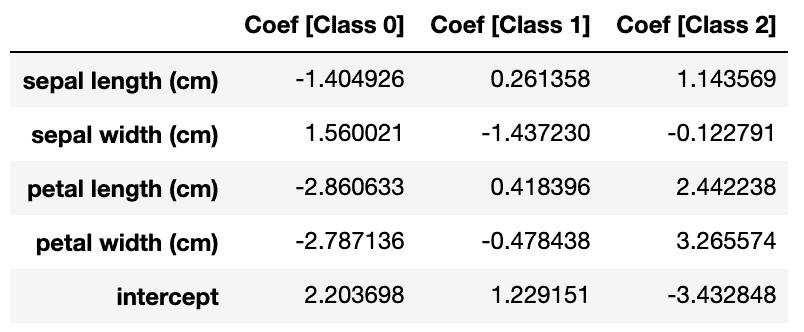

上图中的表格显示了以下内容:

*   从第一行中，我们可以看出，基于类别 1 和类别 2 的系数的正号，萼片长度的增加与类别 1 和类别 2 的相关性大于其余类别。
*   这里有一个线性模型意味着类的边界不会像决策树那样局限于水平线和垂直线，而是采用线性形式。

为了更好地理解这一点，在下一节中，我们将绘制逻辑回归分类器的决策边界，并将它们与决策树的决策边界进行比较。

## 理解分类器的决策界限

通过直观地看到决策边界，我们可以理解模型为什么做出某些决策。以下是绘制这些边界的步骤:

1.  我们首先创建一个函数，该函数获取分类器的对象和数据样本，然后绘制特定分类器和数据的决策边界:

```py
def plot_decision_boundary(clf, x, y, ax, title):

   cmap='Paired_r' 
   feature_names = x.columns
   x, y = x.values, y.values

   x_min, x_max = x[:,0].min(), x[:,0].max()
   y_min, y_max = x[:,1].min(), x[:,1].max()

   step = 0.02

   xx, yy = np.meshgrid(
      np.arange(x_min, x_max, step),
      np.arange(y_min, y_max, step)
   )
   Z = clf.predict(np.c_[xx.ravel(), yy.ravel()])
   Z = Z.reshape(xx.shape)

   ax.contourf(xx, yy, Z, cmap=cmap, alpha=0.25)
   ax.contour(xx, yy, Z, colors='k', linewidths=0.7)
   ax.scatter(x[:,0], x[:,1], c=y, edgecolors='k')
   ax.set_title(title)
   ax.set_xlabel(feature_names[0])
   ax.set_ylabel(feature_names[1])
```

2.  然后，我们将数据分为训练集和测试集:

```py
from sklearn.model_selection import train_test_split
df_train, df_test = train_test_split(df, test_size=0.3, random_state=22)
```

3.  为了能够容易地可视化事物，我们将使用两个特征。在下面的代码中，我们将训练一个逻辑回归模型和一个决策树模型，然后在对相同数据进行训练时比较它们的决策界限:

```py
from sklearn.metrics import accuracy_score
from sklearn.linear_model import LogisticRegression
from sklearn.tree import DecisionTreeClassifier

fig, axs = plt.subplots(1, 2, figsize=(12, 6))

two_features = ['petal width (cm)', 'petal length (cm)']

clf_lr = LogisticRegression()
clf_lr.fit(df_train[two_features], df_train['target'])
accuracy = accuracy_score(
    df_test['target'], 
    clf_lr.predict(df_test[two_features])
)
plot_decision_boundary(
    clf_lr, df_test[two_features], df_test['target'], ax=axs[0], 
    title=f'Logistic Regression Classifier\nAccuracy: {accuracy:.2%}'
)

clf_dt = DecisionTreeClassifier(max_depth=3)
clf_dt.fit(df_train[two_features], df_train['target'])
accuracy = accuracy_score(
    df_test['target'], 
    clf_dt.predict(df_test[two_features])
)
plot_decision_boundary(
    clf_dt, df_test[two_features], df_test['target'], ax=axs[1], 
    title=f'Decision Tree Classifier\nAccuracy: {accuracy:.2%}'
)

fig.show()
```

运行这段代码将得到以下图形:

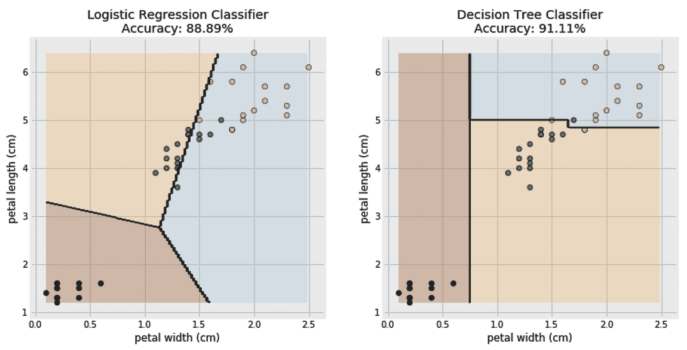

在上图中，观察到以下情况:

*   当仅使用两个特征时，逻辑回归模型这次表现不佳。然而，我们关心的是边界的形状。
*   很明显，左边的界限不像右边那样是水平线和垂直线。而右边的可以由多条线段组成，左边的只能由连续的线段组成。

# 了解其他线性分类器

在结束本章之前，强调一些附加的线性分类算法是有用的:

*   SGD 是一个多功能的解算器。如前所述，根据使用的损失函数，除了 SVM 和感知器分类之外，它还可以执行逻辑回归分类。它还允许常规处罚。
*   **r****ide****分类器**将类标签转换为`1`和`-1`并将问题视为回归任务。它还可以很好地处理非二元分类任务。由于它的设计，它使用了一套不同的求解器，所以值得一试，因为在处理大量的类时，学习起来可能会更快。
*   **直线** **ar** **支持** **矢量** **分类** ( **LinearSVC** )是另一种线性模型。它没有使用 log loss，而是使用了`hinge`函数，该函数旨在找到类的边界，其中每个类的样本离边界尽可能远。这不要与支持向量机混淆。与它们的线性表亲相反，由于所谓的核心技巧，支持向量机是非线性算法。支持向量机不像几十年前那样普遍使用，它们也超出了本书的范围。

# 摘要

线性模型随处可见。它们的简单性，以及它们提供的功能——比如正则化——使它们在从业者中很受欢迎。它们还与神经网络共享许多概念，这意味着理解它们将在后面的章节中对你有所帮助。

只要我们能够创造性地进行特征转换，线性通常不是一个限制因素。此外，在更高维度中，线性假设可能比我们想象的更经常成立。这就是为什么建议总是从线性模型开始，然后决定是否需要更高级的模型。

话虽如此，有时为您的线性模型找出最佳配置或决定使用哪个规划求解是很棘手的。在本章中，我们学习了如何使用交叉验证来微调模型的超参数。我们还看到了不同的超参数和解算器，以及何时使用它们的提示。

到目前为止，对于我们在前两章处理的所有数据集，我们很幸运地拥有了正确格式的数据。我们只处理了没有缺失值的数字数据。然而，在现实世界的场景中，这种情况很少发生。

在下一章中，我们将学习更多关于数据预处理的知识，这样我们就可以无缝地继续处理更多的数据集和更高级的算法。******