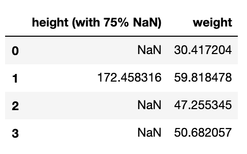

# 四、准备你的数据

在前一章中，我们处理了干净的数据，其中所有的值都是可用的，所有的列都有数值，当面对太多的特征时，我们有一种正则化技术。在现实生活中，数据往往不像你希望的那样干净。有时，即使是干净的数据也可以通过某种方式进行预处理，使我们的机器学习算法变得更容易。在本章中，我们将学习以下数据预处理技术:

*   输入缺失值
*   编码非数字列
*   更改数据分布
*   通过选择减少特征的数量
*   将数据投射到新的维度

# 输入缺失值

"没有数据就进行理论化是一个严重的错误。"

夏洛克·福尔摩斯

为了模拟现实生活中数据有缺失值的情况，我们将创建一个数据集，其中人的体重是其身高的函数。然后，我们将随机删除`height`列中 75%的值，并将它们设置为`NaN`:

```py
df = pd.DataFrame(
    {
        'gender': np.random.binomial(1, .6, 100),
        'height': np.random.normal(0, 10, 100), 
        'noise': np.random.normal(0, 2, 100), 
    }
)

df['height'] = df['height'] + df['gender'].apply(
    lambda g: 150 if g else 180
)
df['height (with 75% NaN)'] = df['height'].apply(
    lambda x: x if np.random.binomial(1, .25, 1)[0] else np.nan
)
df['weight'] = df['height'] + df['noise'] - 110
```

我们在这里使用了一个具有底层**二项式** **二项式** / **伯努利** **分布的随机数生成器来决定是否要移除每个样本。该分布的 *n* 值被设置为`1`——也就是说，它是一个伯努利分布——并且它的 *p* 值被设置为`0.25`——也就是说，每个样本都有 25%的机会留下来。每当发生器的返回值为`0`时，样本被设置为`NaN`。正如您所看到的，由于随机发生器的性质，`NaN`值的最终百分比可能略高于或低于 75%。**

 **这是我们刚刚创建的数据帧的前四行。此处仅显示了`height`列，其中缺少值和权重:



我们还可以使用下面的代码来检查每列中缺失值的百分比:

```py
df.isnull().mean()
```

当我运行前一行时，77%的值丢失了。请注意，由于使用了随机数生成器，您可能会得到与这里不同的缺失值比率。

到目前为止，我们看到的回归函数都不会接受包含所有`NaN`值的数据。因此，我们需要将那些缺失的值转换成某种东西。决定用哪些值来代替缺失值是数据插补过程的工作。

有不同种类的插补技术。我们将在这里尝试它们，并观察它们对我们估计体重的影响。请记住，我们碰巧知道没有任何缺失值的原始`height`数据，并且我们知道对原始数据使用岭回归得到的 MSE 值为`3.4`。让我们暂时把这条信息作为参考。

## 将缺失值设置为 0

一种简单的方法是将所有缺失值设置为`0`。以下代码将使我们的数据再次可用:

```py
df['height (75% zero imputed)'] = df['height (with 75% NaN)'].fillna(0)
```

在新估算的列上拟合一个岭回归将会得到一个 MSE 值`365`:

```py
from sklearn.linear_model import Ridge
from sklearn.metrics import mean_squared_error

reg = Ridge()
x, y = df[['height (75% zero imputed)']], df['weight']
reg.fit(x, y)
mean_squared_error(y, reg.predict(x))
```

尽管我们能够使用回归器，但与我们的参考场景相比，它的误差是巨大的。为了了解零插补的效果，让我们绘制插补数据，并使用回归变量的系数来查看它在训练后创建了什么样的直线。我们也把原始数据标出来对比一下。我确信生成下图的代码对您来说很简单，所以我将跳过它:


我们现在已经知道，线性模型只能将一条连续的直线拟合到数据上(或者在更高维的情况下拟合到一个超平面上)。我们也知道`0`不是任何人的合理身高。然而，在零插补的情况下，我们引入了一组高度为`0`且权重范围在`10`和`90`之间的值。这显然混淆了我们的回归变量，正如我们在右边的图表中看到的。

非线性回归器，如决策树，将能够比线性回归器更好地处理这个问题。实际上，对于基于树的模型，我建议您尝试用数据中不存在的值替换 *x* 中缺少的值。例如，在这种情况下，您可以尝试将高度设置为`-1`。

## 将缺失值设置为平均值

统计平均值的另一个名称是*期望值*。这是因为平均值是对数据的有偏估计。也就是说，用列的平均值替换缺失值听起来是一个合理的想法。

在这一章中，我将在整个数据集上拟合回归变量。在这里，我不关心将数据分成训练集和测试集，因为我主要关心的是回归变量如何进行插补。然而，在现实生活中，您可能只想了解训练集的平均值，并使用它来估算训练集和测试集的缺失值。

scikit-learn 的`SimpleImputer`功能可以从训练集中找出平均值，并用它来估算训练集和测试集。它通过使用我们最喜欢的`fit()`和`transform()`方法来做到这一点。但是让我们坚持使用单步`fit_transform()`函数，因为我们只有一个集合:

```py
from sklearn.impute import SimpleImputer
imp = SimpleImputer(missing_values=np.nan, strategy='mean')
df['height (75% mean imputed)'] = imp.fit_transform(
    df[['height (with 75% NaN)']]
)[:, 0]
```

我们在这里有一个单独的列要插补，这就是为什么我在插补后使用`[:, 0]`来访问它的值。

岭回归将给我们一个 MSE 值`302`。为了理解这种改进来自哪里，让我们绘制模型的决策图，并将其与之前的零插补模型进行比较:


显然，模型的决定现在更有意义了。您可以看到虚线是如何与实际的非估算数据点重合的。

除了使用**均值**作为策略，算法还可以找到训练数据的**中值**。如果您的数据有异常值，中位数通常是更好的选择。在非数字特征的情况下，你应该使用`most_frequent`选项作为你的策略。

## 对缺失值使用知情估计

对所有缺失值使用单一值可能并不理想。例如，我们知道我们的数据包括男性和女性样本，每个子样本都有不同的平均身高。`IterativeImputer()`方法是一种可以使用相邻特征来估计某个特征中缺失值的算法。这里，我们使用性别信息来推断输入缺失高度时要使用的值:

```py
# We need to enable the module first since it is an experimental one 
from sklearn.experimental import enable_iterative_imputer
from sklearn.impute import IterativeImputer
imp = IterativeImputer(missing_values=np.nan)
df['height (75% iterative imputed)'] = imp.fit_transform(
    df[['height (with 75% NaN)', 'gender']]
)[:, 0]
```

我们现在有两个值用于插补:


这次的 MSE 值是`96`。这个策略在这里是明显的赢家。

我们这里只有一个要素缺少值。在多个特征的情况下，`IterativeImputer()`方法循环遍历所有特征。它使用除一个特征之外的所有特征，通过回归来预测其余特征的缺失值。一旦完成所有特征的循环，它可能会多次重复整个过程，直到值收敛。有一些参数可以决定使用哪种回归算法、在要素上循环时使用的顺序以及允许的最大迭代次数。显然，对于较大的数据集和较高数量的不完整要素，这种策略的计算成本可能很高。此外，`IterativeImputer()`实现仍然是实验性的，它的 API 将来可能会改变。

缺少太多值的列携带的信息太少，无法用于我们的估计。我们可以尽力弥补那些缺失的价值；但是尽管如此，删除整个列并且根本不使用它有时是最好的选择，尤其是在缺少大部分值的情况下。

# 编码非数字列

"每一次解码都是另一次编码."

戴维·洛奇

非数值数据是算法实现无法处理的另一个问题。除了核心的 scikit-learn 实现，`scikit-learn-contrib`还有一个附属项目列表。这些项目为我们的数据仓库提供了额外的工具，以下是它们对自己的描述:

“scikit-learn-contrib 是一个 GitHub 组织，用于收集高质量的、与 scikit-learn 兼容的项目。它还为建立新的 scikit-learn 兼容项目提供了模板。”

我们将在这里使用其中一个项目— `category_encoders`。这允许我们将非数字数据编码成不同的形式。首先，我们将使用`pip`安装程序安装库，如下所示:

```py
          pip install category_encoders

```

在进入不同的编码策略之前，让我们先创建一个虚构的数据集来玩玩:

```py
df = pd.DataFrame({
    'Size': np.random.choice(['XS', 'S', 'M', 'L', 'XL', 'XXL'], 10),
    'Brand': np.random.choice(['Nike', 'Puma', 'Adidas', 'Le Coq', 'Reebok'], 10),
})
```

然后我们将它分成相等的两半:

```py
from sklearn.model_selection import train_test_split
df_train, df_test = train_test_split(df, test_size=0.5)
```

请记住，核心 scikit-learn 库实现了我们将在这里看到的两个编码器— `preprocessing.OneHotEncoder`和`preprocessing.OrdinalEncoder`。然而，我更喜欢`category_encoders`的实现，因为它丰富多样。

现在，让我们来看看第一个，也是最受欢迎的编码策略——一键编码。

## 一键编码

**一键编码**，也称为哑编码，是处理分类特征最常用的方法。如果您有一个包含`red`、`green`和`blue`值的列，那么将它们转换成三列——`is_red`、`is_green`和`is_blue`——并相应地用 1 和 0 填充这些列听起来是合乎逻辑的。

下面是使用`OneHotEncoder`解码数据集的代码:

```py
from category_encoders.one_hot import OneHotEncoder
encoder = OneHotEncoder(use_cat_names=True, handle_unknown='return_nan')
x_train = encoder.fit_transform(df_train)
x_test = encoder.transform(df_test)
```

我设置`use_cat_names=True`在分配列名时使用编码值。`handle_unknown`参数告诉编码器如何处理测试集中不存在于训练集中的值。例如，我们的训练装备中没有`XS`或`S`号的服装。我们那里也没有任何`Adidas`衣物。这就是为什么测试集中的这些记录被转换为`NaN`:


您仍然需要估算这些`NaN`值。否则，我们可以通过将`handle_unknown`设置为`value`来将这些值设置为`0`。

对于线性模型和 **K 最近邻** ( **KNN** )算法，推荐使用一键编码。然而，由于一个列可能会扩展成太多列，并且其中一些列可能是相互依赖的，所以这里推荐正则化或特征选择。我们将在本章的后面进一步研究特征选择，KNN 算法将在本书的后面讨论。

## 顺序编码

根据您的用例，您可能需要以反映其顺序的方式对分类值进行编码。如果我要用这些数据来预测物品的需求水平，那么我知道物品的尺寸越大，需求就越高。因此，对于这里的大小，一键编码可能仍然是合适的。然而，如果我们要预测制作每件衣服所需的材料量，那么我们需要以暗示`XL`比`L`需要更多材料的方式对尺寸进行编码。在这种情况下，我们关心这些值的顺序，所以我们使用`OrdinalEncoder`，如下所示:

```py
from category_encoders.ordinal import OrdinalEncoder

oencoder = OrdinalEncoder(
  mapping= [
    {
      'col': 'Size', 
      'mapping': {'XS': 1, 'S': 2, 'M': 3, 'L': 4, 'XL': 5}
    }
  ]
)

df_train.loc[
  :, 'Size [Ordinal Encoded]'
] = oencoder.fit_transform(
  df_train['Size']
)['Size'].values
df_test.loc[
  :, 'Size [Ordinal Encoded]'
] = oencoder.transform(
  df_test['Size']
)['Size'].values
```

注意，我们必须手工指定映射。我们希望将`XS`编码为`1`，`S`编码为`2`，以此类推。结果，我们得到以下数据帧:


这一次，编码的数据只适合一列，训练集中缺少的值被编码为`-1`。

对于非线性模型，如决策树，建议使用这种编码方法。至于线性模型，他们可能会把`XL`(编码为`5`)解读为`XS`(编码为`1`)的 5 倍大小。这就是为什么对于线性模型，一键编码仍然是首选。此外，想出有意义的映射并手动设置它可能很耗时。

## 目标编码

在监督学习场景中，对分类特征进行编码的一种显而易见的方法是基于目标值进行编码。假设我们想估算一件衣服的价格。我们可以用训练数据集中同一品牌所有商品的平均价格替换品牌名称。然而，这里有一个明显的问题。假设一个品牌在我们的训练集中只出现一两次。不能保证这几个外观很好的代表了品牌的价格。在另一个世界中，像这样使用目标值可能会导致过度拟合，并且在处理新数据时，得到的模型可能不会很好地概括。这就是为什么`category_encoders`库有多种目标编码的原因；它们都有相同的基本目标，但是它们中的每一个都有不同的方法来处理上述过拟合问题。以下是这些实现的一些示例:

*   留一交叉验证
*   目标编码器
*   catboost 编码器
*   M 估计量

Leave-one-out 可能是列出的实现中最广为人知的一个。在定型数据中，它将原始数据中的分类值替换为除此特定原始数据之外具有相同分类值的所有行的相应目标值的平均值。对于测试数据，它只是使用从训练数据中学习到的每个类别值的相应目标的平均值。此外，编码器还有一个名为`sigma`的参数，允许您将噪声添加到已学习的均值中，以防止更多的过拟合。

# 均匀化柱的比例

不同的数字列可能有不同的刻度。一个专栏的年龄是几十岁，而它的工资通常是几千。正如我们前面看到的，在某些情况下，将不同的列放入相似的范围会有所帮助。以下是一些推荐扩展的情况:

*   它允许梯度下降解算器更快地收敛。
*   KNN、**主成分分析** ( **PCA** )等算法都需要用到
*   当训练一个估计器时，它将特征放在一个可比较的尺度上，这有助于并列它们的学习系数。

在下一节中，我们将研究最常用的定标器。

## 标准定标器

这通过将它们的平均值设置为`0`并将它们的标准差设置为`1`将特征转换为正态分布。这是使用以下操作完成的，其中从列中的每个值中减去列的平均值，然后将结果除以列的标准偏差值:


定标器的实现可以如下使用:

```py
from sklearn.preprocessing import StandardScaler

scaler = StandardScaler()
x_train_scaled = scaler.fit_transform(x_train)
x_test_scaled = scaler.transform(x_test)
```

拟合后，您还可以通过`mean_`和`var_`属性找出训练数据中每一列的平均值和方差。在存在异常值的情况下，标准缩放器不能保证平衡的特征比例。

## 最小最大缩放器

这将特征压缩到一定的范围内，通常在`0`和`1`之间。如果您需要使用不同的范围，您可以使用`feature_range`参数进行设置。该定标器的工作原理如下:

```py
from sklearn.preprocessing import MinMaxScaler

scaler = MinMaxScaler(feature_range=(0,1))
x_train_scaled = scaler.fit_transform(x_train)
x_test_scaled = scaler.transform(x_test)
```

安装后，您还可以使用`data_min_` **和`data_max_`属性找出训练数据中每一列的最小值和最大值。由于所有样本都被限制在一个预定义的范围内，离群值可能会迫使内联者被压缩到这个范围的一个小子集中。**

 **## 鲁棒定标器

这类似于标准缩放器，但使用数据分位数来更好地应对异常值对平均值和标准差的影响。如果您的数据有异常值，建议您使用此方法，如下所示:

```py
from sklearn.preprocessing import RobustScaler

scaler = RobustScaler()
x_train_scaled = scaler.fit_transform(x_train)
x_test_scaled = scaler.transform(x_test)
```

也存在其他定标器；然而，我在这里已经介绍了最常用的定标器。在本书中，我们将使用前面提到的定标器。所有缩放器都有一个`inverse_transform()`方法，因此如果需要，您可以恢复一个特征的原始比例。此外，如果您不能一次将所有训练数据加载到内存中，或者如果数据是成批出现的，那么您可以对每一批调用 scaler 的`partial_fit()`方法，而不是对整个数据集调用`fit()`方法一次。

# 选择最有用的功能

“更多的数据，比如过马路时注意周围人的眼睛颜色，可以让你错过大货车。”

纳西姆·尼古拉斯·塔勒布

在前面的章节中，我们已经看到过多的特性会降低模型的性能。所谓的维数灾难可能会对算法的准确性产生负面影响，尤其是在没有足够的训练样本的情况下。此外，它还会导致更多的训练时间和更高的计算要求。幸运的是，我们还学会了如何调整我们的线性模型或限制决策树的增长，以对抗特征丰富的影响。然而，我们有时可能最终使用正则化不可行的模型。此外，我们可能仍然需要去除一些无意义的特征，以减少算法的训练时间和计算需求。在这些情况下，明智的做法是首先选择功能。

根据我们处理的是标记数据还是未标记数据，我们可以选择不同的特征选择方法。此外，一些方法比其他方法的计算成本更高，而一些方法的结果更精确。在以下几节中，我们将了解如何使用这些不同的方法，为了演示这一点，我们将加载 scikit-learn 的`wine`数据集:

```py
from sklearn import datasets

wine = datasets.load_wine()
df = pd.DataFrame(
    wine.data,
    columns=wine.feature_names
)
df['target'] = pd.Series(
    wine.target
)
```

然后，我们像往常一样分割数据:

```py
from sklearn.model_selection import train_test_split
df_train, df_test = train_test_split(df, test_size=0.4)

x_train = df_train[wine.feature_names]
x_test = df_test[wine.feature_names]

y_train = df_train['target']
y_test = df_test['target']
```

`wine`数据集有 13 个特征，用于分类任务。在接下来的几节中，我们将发现哪些特性没有其他特性重要。

## 变异阈值

如果您还记得，当我们使用`PolynomialFeatures`转换器时，它添加了一列，其中所有的值都被设置为`1`。此外，分类编码器，比如 one-hot 编码，可能会产生几乎所有值都是`0`的列。在现实生活中，列中的所有数据都相同或几乎相同的情况也很常见。方差是衡量数据集中变化量的最明显的方式，因此`VarianceThreshold`允许我们为每个特性中可接受的方差设置一个最小阈值。在下面的代码中，我们将把方差阈值设置为`0`。然后，它通过训练集来了解哪些功能值得保留:

```py
from sklearn.feature_selection import VarianceThreshold
vt = VarianceThreshold(threshold=0)
vt.fit(x_train)
```

像我们所有的其他模块一样，这个模块也提供了常用的`fit()`、`transform()`和`fit_transform()`方法。然而，我不喜欢在这里使用它们，因为我们已经给了我们的列名，而且`transform()`函数不支持我们给的名称。这就是为什么我更喜欢用另一种叫做`get_support()`的方法。该方法返回一个布尔值列表，其中任何`False`值都对应于根据我们设置的阈值应该删除的列。下面是我如何使用`pandas`库的`iloc`函数删除不必要的特性:

```py
x_train = x_train.iloc[:, vt.get_support()]
x_test = x_test.iloc[:, vt.get_support()]
```

我们还可以打印特征名称，并根据它们的差异对它们进行排序，如下所示:

```py
pd.DataFrame(
    {
        'Feature': wine.feature_names,
        'Variance': vt.variances_,
    }
).sort_values(
    'Variance', ascending=True
)
```

这为我们提供了下表:


我们可以看到，我们的特征都没有零方差；因此，它们都没有被删除。您可以决定使用更高的阈值—例如，将阈值设置为`0.05`将会去掉`nonflavanoid_phenols`。但是，让我列出本模块的主要优点和缺点，以帮助您决定何时以及如何使用它:

*   与我们稍后将看到的其他特征选择方法不同，这种方法在选择特征时不使用数据标签。这在处理未标记的数据时很有用，例如在无监督的学习场景中。
*   它是标签不可知的这一事实也意味着低方差特征可能仍然与我们的标签有很好的相关性，并且移除它是一个错误。
*   方差和均值一样，是与尺度相关的。从`1`到`10`的数字列表的方差为`8.25`，而`10, 20, 30,...100`的列表的方差为`825.0`。在`proline`的方差中我们可以清楚的看到这一点。这使得我们表中的数字不可比，并且很难选择一个正确的阈值。一种想法可能是在计算数据的方差之前对其进行缩放。但是，请记住，您不能使用`StandardScaler`，因为它有意地统一了所有特性的方差。所以，我觉得`MinMaxScaler`在这里更有意义。

总之，我发现方差阈值在去除零方差特征方面很方便。至于其余的特征，我会让下一个特征选择算法来处理它们，尤其是在处理带标签的数据时。

## 过滤

既然我们的数据带有标签，那么使用每个特征和标签之间的相关性来决定哪些特征对我们的模型更有用是有意义的。这类特征选择算法处理每个单独的特征，并测量其相对于标签的有用性；这种算法被称为*滤波器*。换句话说，该算法获取 *x* 中的每一列，并使用某种度量来评估它在预测 *y* 中的有用程度。有用的列保留下来，而其余的被删除。衡量有用性的方法是区分一个过滤器选择器和另一个的标准。为了清楚起见，我将在这里把重点放在两个选择器上，因为每一个都源于不同的科学领域，并且理解它们都是未来概念的良好基础。这两个概念是**方差分析(F 值)**和**互信息**。

### f-回归和 f-分类

顾名思义，`f_regression`用于回归任务中的特征选择。`f_classif`是它的分类表亲。`f_regression`植根于统计学领域。它的 scikit-learn 实现使用 Pearson 相关系数来计算 *x* 和 *y* 中每一列之间的相关性。然后，结果被转换为 F 值和 P 值，但让我们将转换放在一边，因为相关系数是这里的关键。我们首先从同一列的所有值中减去每一列的平均值，这与我们在`StandardScaler`中所做的类似，但是没有将这些值除以它们的标准偏差。然后，我们使用以下公式计算相关系数:


因为减去了平均值，所以当实例高于其列的平均值时， *x* 和 *y* 的值为正，当实例低于其列的平均值时，为负。因此，这个等式被最大化，使得每当 *x* 高于平均值时， *y* 也高于平均值，并且每当 *x* 低于平均值时， *y* 跟随。这个等式的最大值是`1`。然后我们可以说 *x* 和 *y* 完全相关。当 *x* 和 *y* 固执地走向相反的方向，换句话说就是负相关时，方程就是`-1`。零结果意味着 *x* 和 *y* 不相关(即独立或正交)。

通常，统计学家对这个等式的写法不同。从 *x* 和 *y* 中减去平均值的事实通常被记为等式的一部分。那么，分子显然是协方差，分母是两个方差的乘积。然而，我故意选择不遵循这里的统计惯例，以便我们的自然语言处理朋友在意识到这与余弦相似性的等式完全相同时，会有宾至如归的感觉。在那里， *x* 和 *y* 被视为向量，分子是它们的点积，分母是它们的幅度的乘积。因此，当两个向量之间的角度为`0`(余弦`0` = `1`)时，这两个向量完全相关(方向相同)。相反，当它们彼此垂直时，它们是独立的，因此术语*正交*。从这种直观解释中可以看出，这种度量只考虑了 *x* 和 *y* 之间的线性关系。

对于分类的情况，进行单向 ANOVA 检验。这将不同类别标签之间的方差与每个类别内的方差进行比较。就像它的回归表亲一样，它测量特征和分类标签之间的线性相关性。

目前的理论已经足够；让我们使用`f_classif`来挑选数据集中最有用的特征:

```py
from sklearn.feature_selection import f_classif
f, p = f_classif(x_train, y_train)
```

现在让我们把结果 *f* 和 *p* 的值放在一边。在解释了用于特征选择的互信息方法之后，我们将使用这些值来对比这两种方法。

### 交互信息

这种方法源于一个不同的科学领域，叫做**INF**formationtheory。这个领域是由 Claude Shannon 提出来解决与信号处理和数据压缩相关的问题的。当我们发送一条由 0 和 1 组成的消息时，我们可能知道这条消息的确切内容，但我们真的能量化这条消息所携带的信息量吗？香农通过借用热力学的**熵**概念解决了这个问题。再往下是**相互** **在** **形成**的概念。它量化了观察一个变量时获得的关于另一个变量的信息量。互信息的公式如下:


在剖析这个等式之前，请记住以下几点:

*   *P(x)* 是 *x* 取某一值的概率，如同 *P(y)* 对于 *y* 。
*   *P(x，y)* 称为联合概率，是指 *x* 和 *y* 都取特定一对值的概率。
*   *P(x，y)* 仅等于 *P(x)* * *P(y)* 的乘积，前提是 *x* 和 *y* 相互独立。否则它的值是大于还是小于他们的乘积，取决于 *x* 和 *y* 是正相关还是负相关。

双重求和以及等式的第一部分， *P(x，y)* ，是我们计算 *x* 和 *y* 所有可能值的加权平均值的方式。对数部分是我们所关心的，它被称为逐点互信息。如果 *x* 和 *y* 独立，则分数等于`1`，其对数为`0`。换句话说，当两个变量不相关时，我们得到`0`。否则，结果的符号指向 *x* 和 *y* 是正相关还是负相关。

下面是我们如何获得每个特征的互信息系数:

```py
from sklearn.feature_selection import mutual_info_classif
mi = mutual_info_classif(x_train, y_train)
```

与皮尔逊的相关系数不同，互信息可以捕捉任何类型的相关性，不管它是不是线性的。

### 比较和使用不同的过滤器

现在让我们将我们的互信息得分与 F 值进行比较。为此，我们将它们放入一个数据帧中，并使用`pandas`样式特性在数据帧中绘制条形图，如下所示:

```py
pd.DataFrame(
  {
    'Feature': wine.feature_names,
    'F': f,
    'MI': mi,
  }
).sort_values(
  'MI', ascending=False
).style.bar(
  subset=['F', 'MI'], color='grey'
)
```

这为我们提供了以下数据框架:


正如你所看到的，他们在特性重要性的顺序上基本一致，但是他们有时仍然有分歧。我使用这两种方法中的每一种来选择前四个特征，然后比较使用每种特征选择方法的**逻辑回归**分类器和决策树分类器的准确性。以下是训练集的结果:


可以看出，对于这里的两个分类器之一，这两种选择方法中的每一种都工作得更好。由于线性模型的线性性质，似乎`f_classif`更适合线性模型，而非线性模型更适合捕捉非线性相关性的算法。然而，我没有发现任何文献证实这种推测的普遍性。

很难不看到将这两种措施联系在一起的潜在主题。分子计算一些内部变量信息—协方差、点积或连接概率。分母计算变量间信息的乘积——方差、范数或概率。这个主题将会继续出现在未来不同的主题中。有一天，我们可能会使用余弦相似度来比较两个文档；另一天，我们可能会使用互信息来评估一个聚类算法。

## 一次评估多个特征

本章*过滤器*一节中显示的特征选择方法也被视为单变量特征选择方法，因为它们在决定是否保留之前分别检查每个特征。这可能会导致以下两个问题中的任何一个:

*   如果两个特征高度相关，我们只想保留其中一个。但是，由于单变量特征选择的性质，它们仍将被选择。
*   如果两个特性本身不是很有用，但是它们的组合是有用的。由于单变量特征选择方法的工作方式，它们仍将被移除。

为了处理这些问题，我们可能决定使用以下解决方案之一:

*   **使用估计器进行特征选择**:通常，回归器和分类器为训练后使用的特征赋值，表示它们的重要性。因此，我们可以使用估计器的系数(或特征重要性)来从我们的初始特征集中添加或删除特征。scikit-learn 的**递归特征消除** ( **RFE** )算法从一组初始特征开始。然后，它使用训练好的模型的系数在每次迭代中迭代地移除特征。`SelectFromModel`算法是一种元变换器，可以利用正则化模型来移除系数为零或接近零的特征。
*   **使用带有内置特征选择的估计器**:换句话说，这意味着使用一个正则化的估计器，如 lasso，其中特征选择是估计器目标的一部分。

总之，诸如使用方差阈值和过滤器的方法执行起来很快，但是当涉及到特征相关性和相互作用时，它们具有缺点。计算成本更高的方法，如包装器，可以处理这些问题，但容易过度拟合。

如果你问我对特征选择的建议，就个人而言，我的首选方法是在移除零方差特征后进行正则化，除非我正在处理大量的特征，而在整个集合上进行训练是不可行的。在这些情况下，我会使用单变量特征选择方法，同时小心地删除可能最终有用的特征。之后，我仍然会使用正则化模型来处理任何多重共线性。

最后，布丁的味道要靠吃来检验，通过反复试验得出的经验结果可能会胜过我的建议。此外，除了提高最终模型的准确性，特征选择仍然可以用来理解手头的数据。功能重要性分数仍然可以用于商业决策。例如，如果我们的标签表明用户是否会流失，我们可以提出一个假设，即得分最高的功能对流失率影响最大。然后，我们可以通过改变产品的相关部分来进行实验，看看是否可以降低流失率。

# 摘要

从事与数据相关的职业需要有处理不完美的倾向。处理缺失的价值观是我们不可或缺的一步。因此，我们从学习不同的数据插补方法开始这一章。此外，适用于一项任务的数据可能不适合另一项任务。这就是为什么我们学习了特征编码以及如何改变分类和顺序数据以适应我们的机器学习需求。帮助算法更好地执行可能需要重新调整数字特征。因此，我们了解了三种缩放方法。最后，数据丰富对我们的模型可能是一个诅咒，所以特征选择是一种解决维数灾难的规定方法，还有正则化。

贯穿这一整章的一个主题是简单快速的方法与可能导致过拟合的更明智和计算昂贵的方法之间的权衡。除了愿意试验和使用迭代之外，知道使用哪种方法需要理解它们的基本理论。所以，我决定在需要的地方深入一点理论背景，这不仅有助于你明智地选择方法，也有助于你在未来提出自己的方法。

既然我们已经有了主要的数据预处理工具，我们就可以开始下一个算法了——KNN。****