在本章和下一章，我们将采取不同的方法。最近邻算法将在这里扮演配角，而图像处理将是本章的主角。我们将从加载图像开始，我们将使用 Python 以适合机器学习算法的格式来表示它们。我们将使用最近邻算法进行分类和回归。我们还将学习如何将图像中的信息压缩到更小的空间。这里解释的许多概念是可移植的，稍加调整就可以用于其他算法。稍后，在[第 7 章](https://cdp.packtpub.com/hands_on_machine_learning_with_scikit_learn/wp-admin/post.php?post=33&action=edit)、*神经* *网络——深度学习*来了，我们将建立在这里获得的知识上，并通过使用神经网络继续进行图像处理。在本章中，我们将讨论以下主题:

*   最近的邻居
*   加载和显示图像
*   图像分类
*   使用自定义距离
*   使用最近邻进行回归
*   降低图像数据的维度

# 最近的邻居

“我们通过例子和直接经验来学习，因为口头指导的充分性是有实际限制的。”

马尔科姆·格拉德威尔

感觉好像马尔科姆·格拉德威尔在前面的引文中解释 K-最近邻算法；我们只需要将“*口头指令*”替换为“*数学方程*”在线性模型等情况下，训练数据用于学习对数据建模的数学方程。一旦学习了一个模型，我们就可以很容易地把训练数据放在一边。这里，在最近邻算法中，数据本身就是模型。每当我们遇到新的数据样本时，我们都会将其与训练数据集进行比较。我们在训练集中找到与新遇到的样本最近的 K 个样本，然后我们使用训练集中 K 个样本的类别标签来给新样本分配标签。

这里应该注意一些事情:

*   训练的概念在这里并不存在。与训练时间取决于训练数据量的其他算法不同，最近邻算法的计算成本主要花费在预测时间。
*   最近对最近邻算法进行的大多数研究都集中在寻找最佳方法，以便在预测时间内快速搜索训练数据。
*   最近的*是什么意思？在这一章中，我们将学习用于比较不同数据点的不同距离度量。根据所使用的距离度量，两个数据点被视为彼此靠近。*
*   什么是 *K* ？我们可以将新数据点与训练集中的 1、2、3 或 50 个其他样本进行比较。我们决定比较的样本数量是 *K* ，我们将看到不同的 K*K*值如何影响算法的行为。

在使用最近邻算法进行图像分类之前，我们需要首先学习如何处理图像。在下一节中，我们将加载并显示机器学习和图像处理领域中最常用的图像数据集之一。

当查找样本的最近邻时，可以将其与所有其他训练样本进行比较。这是一种天真的蛮力方法，不能很好地与训练数据的大小相适应。对于较大的数据集，更有效的方法要求将训练样本存储在为搜索而优化的特定数据结构中。K-D 树和球树是两种可用的数据结构。这两个数据结构通过`leaf_size`参数化。当它的值接近训练集的大小时，K-D 树和球树变成了强力搜索。相反，将叶子大小设置为`1`会在遍历树时引入大量开销。默认的叶子大小`30`是许多样本大小的中间值。

# 加载和显示图像

“照片是二维的。我在四维空间工作。”

-蒂诺·塞加尔

当被问及一幅图像有多少个维度时，摄影师、画家、插图画家以及这个星球上的几乎所有人都会同意图像是二维物体。只有机器学习从业者对图像的看法不同。对我们来说，黑白图像中的每个像素都是一个独立的维度。彩色图像的尺寸扩大得更多，但那是以后的事了。我们将每个像素视为一个独立的维度，这样我们就可以将每个像素及其值与其他像素(特征)一起作为定义图像的唯一特征来处理。所以，不像*蒂诺·塞加尔，我们有时会以 4000 个维度结束工作。*

 ***标准** **和** **技术** ( **MNIST** )数据集是图像处理中常用的手写数字的集合。由于其受欢迎程度，它被包含在`scikit-learn`中，我们可以像加载其他数据集一样加载它:

```
from sklearn.datasets import load_digits
digits = load_digits()
```

数据集有从`0`到`9`的数字。我们可以按如下方式访问它们的目标(标签):

```
digits['target']
# Output: array([0, 1, 2, ..., 8, 9, 8])
```

类似地，我们可以加载像素值，如下所示:

```
digits['data']
# Output: 
# array([[ 0., 0., 5., ..., 0., 0., 0.], 
#  [ 0., 0., 0., ..., 10., 0., 0.], 
#  ..., 
#  [ 0., 0., 2., ..., 12., 0., 0.], 
#  [ 0., 0., 10., ..., 12., 1., 0.]])
```

每行是一张图片，每个整数是一个像素值。在这个数据集中，像素取值在`0`和`16`之间。数据集的形状(`digits['data'].shape`)是*1797 x 64*。换句话说，我们有 1797 个正方形图片，每个图片有 64 个像素(宽度=高度= 8)。

知道了这些信息，我们可以创建下面的函数来显示图像。它接受一个包含 64 个值的数组，并将其重塑为一个 8 行 8 列的二维数组。它还使用图像的相应目标来显示在数字的顶部。给出了`matplotlib`轴(`ax`)，以便我们可以在其上显示图像:

```
def display_img(img, target, ax):
    img = img.reshape((8, 8))
    ax.imshow(img, cmap='gray')
    ax.set_title(f'Digit: {str(target)}')
    ax.grid(False)
```

现在，我们可以使用刚刚创建的函数来显示数据集的前八位数字:

```
fig, axs = plt.subplots(1, 8, figsize=(15, 10))

for i in range(8):
    display_img(digits['data'][i], digits['target'][i], axs[i])

fig.show()
```

数字看起来如下:

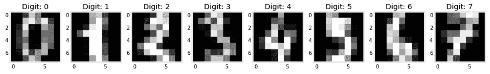

能够显示数字是良好的第一步。接下来，我们需要将它们转换成我们通常的培训和测试格式。这一次，我们希望将每个图像保留为一行，因此没有必要将其重新整形为 *8 x 8* 矩阵:

```
from sklearn.model_selection import train_test_split
x, y = digits['data'], digits['target']
x_train, x_test, y_train, y_test = train_test_split(x, y)
```

此时，数据已准备好用于图像分类算法。通过学习在给定一堆像素时预测目标，我们已经离让我们的计算机理解手写文本更近了一步。

# 图像分类

现在我们已经准备好了数据，我们可以使用最近邻分类器预测数字，如下所示:

```
from sklearn.neighbors import KNeighborsClassifier

clf = KNeighborsClassifier(n_neighbors=11, metric='manhattan')
clf.fit(x_train, y_train)
y_test_pred = clf.predict(x_test)
```

对于这个示例，我将`n_neighbors`设置为`11`并将`metric`设置为`manhattan`，这意味着在预测时，我们将每个新样本与 11 个最近的训练样本进行比较，使用曼哈顿距离来评估它们的接近程度。稍后将详细介绍这些参数。该模型在测试集上的预测准确率为 96.4%。这听起来可能有道理，但我很抱歉告诉你；对于这个特定的数据集来说，这不是一个了不起的分数。无论如何，让我们继续进一步剖析模型的性能。

## 使用混淆矩阵来理解模型的错误

当处理一个有 10 个类标签的数据集时，一个单一的准确度分数只能告诉我们这么多。为了更好地理解哪些数字比其他数字更难猜，我们可以打印模型的混淆矩阵。这是一个正方形矩阵，其中实际标签显示为行，预测标签显示为列。然后，每个单元格中的数字显示了落入其中的测试实例。我现在来创建一下，一会儿就清楚了。`plot_confusion_matrix`函数需要分类器的实例，以及测试的`x`和`y`值，以显示矩阵:

```
from sklearn.metrics import plot_confusion_matrix
plot_confusion_matrix(clf, x_test, y_test, cmap='Greys')
```

一旦被调用，该函数就在内部对测试数据运行模型，并显示以下矩阵:

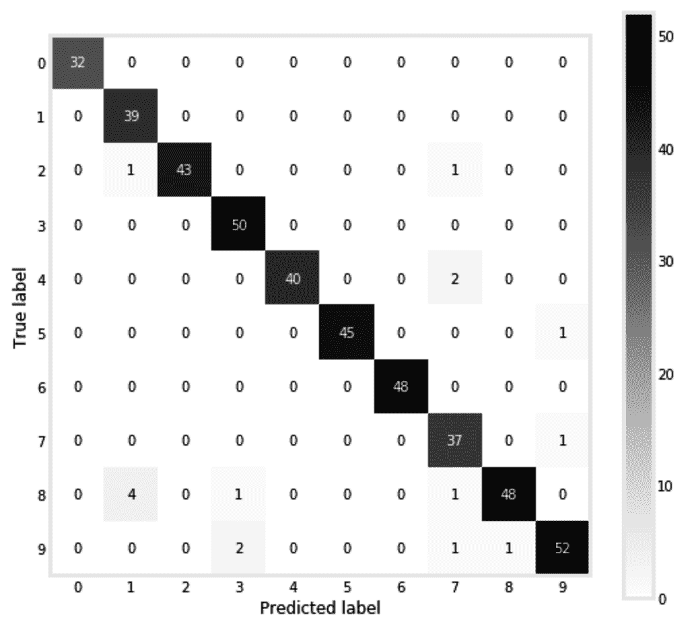

理想情况下，除了对角线单元格，所有单元格都应该有零。落入对角线单元意味着样品被正确标记。但是，这里只有几个非零单元格。第 8 行和第 1 列交叉处的四个样本表示我们的模型将四个样本分类为`1`，而它们的实际标签是`8`。最有可能的是，那些太瘦的 8 对算法来说看起来像 1。对于剩余的非对角线非零单元，可以得出相同的结论。

## 选择合适的指标

我们使用的图像只是一系列数字(向量)。距离度量决定一个图像是否与另一个图像接近。这也适用于非图像数据，其中距离度量用于决定一个样本是否接近另一个样本。两个常用的度量是**米** **安哈坦**和**欧几里德**距离:

| **姓名** | **曼哈顿(L1 标准)** | **欧几里得(L2 范数)** |
| 公式 | **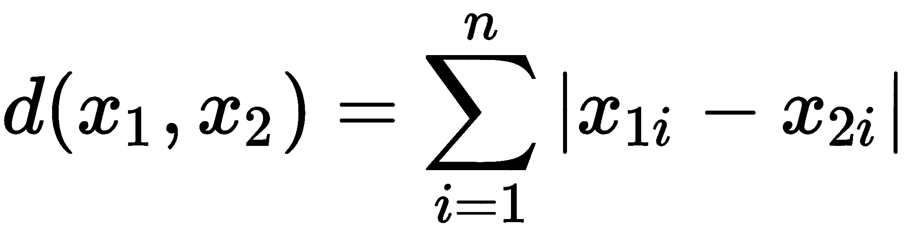** | **T51** |

最有可能的是，曼哈顿距离的等式会让您想起平均绝对误差和 L1 正则化，而欧几里德距离类似于均方误差和 L2 正则化。这种相似性很好地提醒了我们有多少概念源于共同的想法:

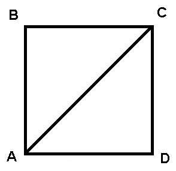

对于**M**安哈坦距离，A 到 C 的距离是从 A 到 D，再从 D 到 C 计算出来的，它得名于纽约的曼哈顿岛，那里的地貌被分割成块。对于**欧几里德**距离，A 和 C 之间的距离通过两点之间的对角线计算。这两个指标有一个通用形式，称为**闵可夫斯基**距离，其公式如下:

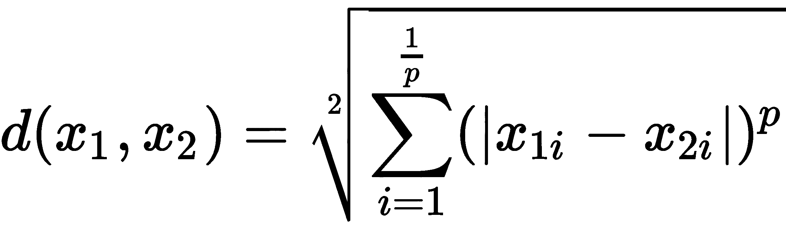

将`p`设置为`1`给出了曼哈顿距离，我们可以通过将它设置为`2`得到欧几里德距离。我相信你现在能说出 L1 和 L2 规范中的`1`和`2`来自哪里。为了能够比较`p`的不同值，我们可以运行下面的代码。这里，我们针对不同的`p`值，计算两个点`(1, 2)`和`(4, 6)`的闵可夫斯基距离:

```
from sklearn.neighbors import DistanceMetric

points = pd.DataFrame(
    [[1, 2], [4, 6]], columns=['x1', 'x2']
)

d = [
  (p, DistanceMetric.get_metric('minkowski', p=p).pairwise(points)[0][-1])
  for p in [1, 2, 10, 50, 100]
]
```

绘制结果向我们展示了闵可夫斯基距离如何随`p`变化:

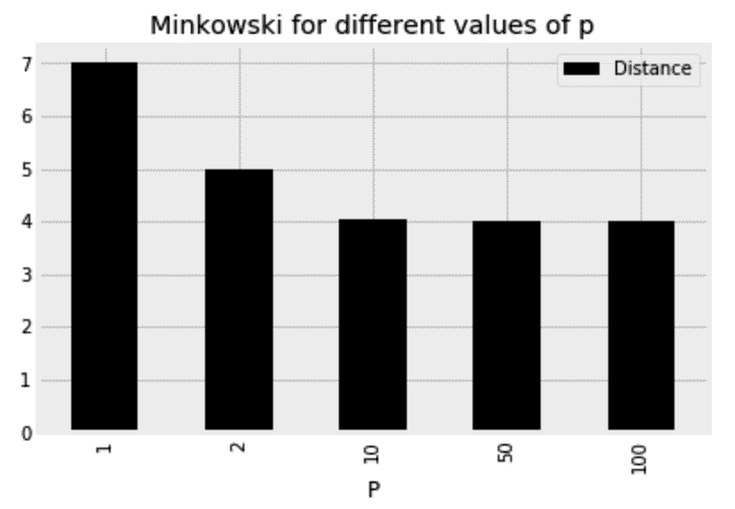

显然，闵可夫斯基距离随着`p`的增加而减小。对于`p = 1`，距离为`7`、`(4 - 1) + (6 - 2)`，对于`p = 2`，距离为`5`、`(9 + 16)`的平方根。对于更高的`p`值，计算出的距离接近`4`，仅为`(6 - 2)`。换句话说，当`p`接近无穷大时，距离正好是所有轴上的点之间所有跨度的最大值，这就是所谓的切比雪夫距离。

术语*度量*用于描述遵循以下标准的距离度量:

它不能是负数: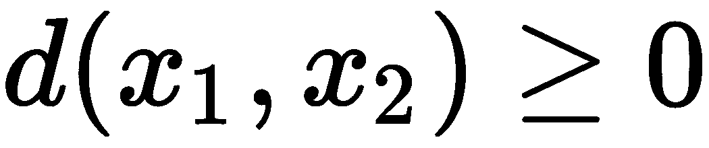，它是对称的: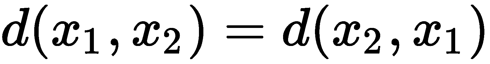。
一点到自身的距离为 0。它遵循以下三角形不等式准则: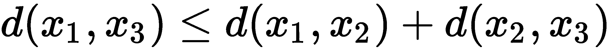。

另一个常见的度量是**余弦**距离，其公式如下:


与欧几里得距离不同，余弦距离不区分比例。我认为用下面的例子来展示这两个指标的区别会更好。

这里，我们取一个数字，并将每个像素值乘以`2`:

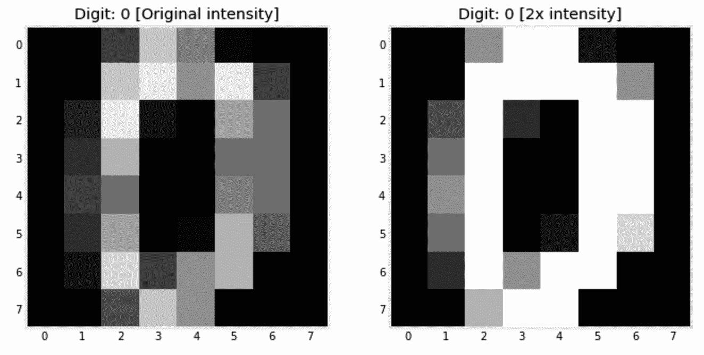

现在，让我们计算原始图像和增强图像之间的距离:

```
from sklearn.metrics.pairwise import (
    euclidean_distances, 
    manhattan_distances, 
    cosine_distances
)

d0 = manhattan_distances(
 [1.0 * digits['data'][0], 2.0 * digits['data'][0]]
)[0,1]

d1 = euclidean_distances(
 [1.0 * digits['data'][0], 2.0 * digits['data'][0]]
)[0,1]

d2 = cosine_distances(
 [1.0 * digits['data'][0], 2.0 * digits['data'][0]]
)[0,1]
```

运行前面的代码会给出每个距离的值——Manhattan =`294`，Euclidean = `55.41`，cosine = `0`。正如所料，余弦距离并不关心我们用来乘以像素的常数，它将相同图像的两个版本视为一个。另一方面，其他两个指标认为这两个版本相距甚远。

## 设置正确的 K 值

对于度量选择来说，同样重要的是知道在做出决策时要监听多少邻居。你不想问太少的邻居，因为他们可能知道的还不够多。你也不想问每个人，因为非常远的邻居可能不太了解手头的样品。正式地说，基于太少的邻域做出的决策会引入方差，因为数据中的任何微小变化都会导致不同的邻域和不同的结果。相反，基于太多邻居做出的决定是有偏见的决定，因为它对邻居之间的差异不太敏感。请记住这一点。在这里，我使用了具有不同设置的模型用于 *K* 并绘制了结果精度:

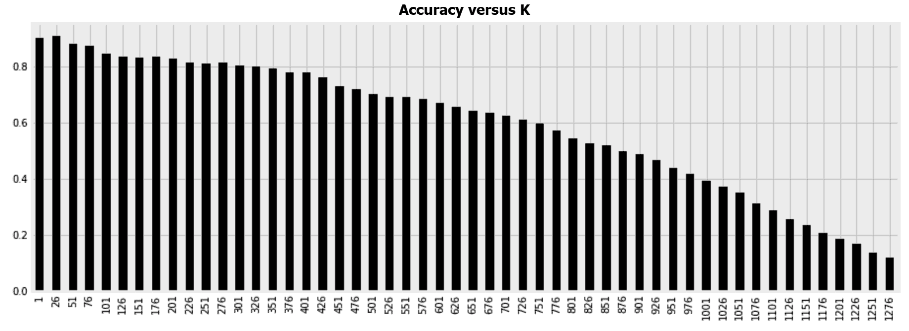

偏差-方差权衡的概念将贯穿本书。当谈到选择阵营时，当我们有较小的训练集时，我们通常选择使用有偏模型。如果没有足够的数据可供学习，高方差模型将会过拟合。偏差最大的模型是将 *K* 设置为训练样本数的模型。然后，所有新的数据点将获得相同的预测，并将被分配到与多数类相同的标签。相反，当我们拥有大量数据时，较小半径内的几个最近邻是更好的咨询选择，因为它们更有可能与我们的新样本属于同一类。

现在，我们需要设置两个超参数:邻居的数量和距离度量。在下一节中，我们将使用网格搜索来找到这些参数的最佳值。

## 使用 GridSearchCV 进行超参数调整

`GridSearchCV`是一种循环所有可能的超参数组合并采用交叉验证挑选最佳超参数的方法。对于每一个超参数组合，我们不希望只局限于一个准确度得分。因此，为了更好地理解每个组合的估计量的准确性，我们利用 K 倍交叉验证。然后，将数据拆分成多个折叠，对于每次迭代，除了一个折叠之外的所有折叠都用于训练，剩下的一个用于测试。这种超参数调整方法对所有可能的参数组合进行彻底搜索，因此使用了`Grid`前缀。在下面的代码中，我们给`GridSearchCV`一个 Python 字典，里面有我们想要循环的所有参数值，以及我们想要调整的估计器。我们还指定将数据分割成的折叠数，然后我们用训练数据调用网格搜索的`fit`方法。记住，从测试数据集中学习任何东西都是不好的做法，现在应该把它放在一边。下面是执行此操作的代码:

```
from sklearn.model_selection import GridSearchCV
from sklearn.neighbors import KNeighborsClassifier

parameters = {
    'metric':('manhattan','euclidean', 'cosine'), 
    'n_neighbors': range(1, 21)
}

knn = KNeighborsClassifier()
gscv = GridSearchCV(knn, param_grid=parameters, scoring='accuracy')

gscv.fit(x_train, y_train)
```

一旦完成，我们可以显示通过`gscv.best_params_`找到的最佳参数。我们还可以通过`gscv.best_score_`显示使用所选参数时达到的精度。这里，`euclidean`距离被选择为`metric`，而`n_neighbors`被设置为`3`。当使用所选择的超参数时，我也获得了 98.7%的准确率。

我们现在可以使用得到的分类器对测试集进行预测:

```
from sklearn.metrics import accuracy_score

y_test_pred = gscv.predict(x_test)
accuracy_score(y_test, y_test_pred)
```

这使我在测试集上的准确率达到了 98.0%。幸运的是，网格搜索通过选择最佳超参数帮助我们提高了估计量的准确性。

`GridSearchCV` can become computationally expensive if we have too many hyperparameters to search through and too many values for each one. When facing a problem like this,`RandomizedSearchCV` may be an alternative solution since it randomly picks hyperparameter values while searching. Both hyperparameter tuning algorithms use the `accuracy` score by default for classifiers and `R`^(`2`)for regressors. We can override this and specify different metrics to pick the best configuration.

# 使用自定义距离

这里的数字是用黑色背景上的白色像素书写的。我不认为任何人会对识别一个数字有问题，如果它是在白色背景上用黑色像素写的。至于计算机算法，事情就有点不一样了。让我们像往常一样训练我们的分类器，看看如果颜色反转，它是否会有任何问题。我们将从在原始图像上训练算法开始:

```
clf = KNeighborsClassifier(n_neighbors=3, metric='euclidean')
clf.fit(x_train, y_train)
y_train_pred = clf.predict(x_train)
```

然后，我们创建刚刚用于训练的数据的反转版本:

```
x_train_inv = x_train.max() - x_train 
```

最近邻实现有一个名为`kneighbors`的方法。当给定一个样本时，它返回一个列表，其中列出了从训练集中离它最近的 K 个样本，以及它们离给定样本的距离。我们将为该方法提供一个反向样本，并查看它会将哪些样本视为其邻居:

```
img_inv = x_train_inv[0]

fig, axs = plt.subplots(1, 8, figsize=(14, 5))

display_img(img_inv, y_train[0], axs[0])

_, kneighbors_index_inv = clf.kneighbors(
    [x_train_inv[0]], 
    n_neighbors=7, 
    return_distance=True
)

for i, neighbor_index in enumerate(kneighbors_index_inv[0], 1):
    display_img(
        x_train[neighbor_index], 
        y_train[neighbor_index], 
        axs[i]
    )
```

为了让事情更清楚，我运行了代码两次——一次是原始样本及其七个邻居，一次是反向样本及其邻居。两次运行的输出显示在这里。如你所见，不像我们人类，这个算法完全被颜色颠倒的对立例子弄糊涂了:

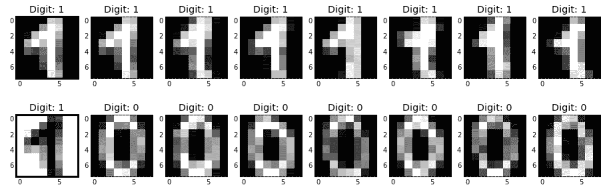

如果你想一想，根据我们使用的距离，一个样本和它的倒置版本不能彼此相距太远。虽然我们在视觉上将两者视为一体，但模型将它们视为昼夜不同。话虽如此，显然我们需要想出一种不同的方法来评估距离。由于像素取值在`0`和`16`之间，在反相样本中，所有的 16 都变成 0，15 变成 1，依此类推。因此，根据样本像素距离`0`和`16` ( `8`)之间的中点有多远来比较样本的距离可以帮助我们解决这里的问题。以下是如何创建这个自定义距离。姑且称我们的新距离为`contrast_distance` ***:***

```
from sklearn.metrics.pairwise import euclidean_distances

def contrast_distance(x1, x2):
    _x1, _x2 = np.abs(8 - x1), np.abs(8 - x2)
    d = euclidean_distances([_x1], [_x2])
    return d[0][0]
```

定义后，我们可以在分类器中使用自定义指标，如下所示:

```
clf = KNeighborsClassifier(n_neighbors=3, metric=contrast_distance)
clf.fit(x_train, y_train)
```

在这种调整之后，反转不再干扰模型。对于原始集和反转集，我们得到了完全相同的 89.3%的准确率。我们还可以根据新的度量打印七个最近的邻居，以验证新模型已经更加智能并且不再歧视黑色数字的事实:

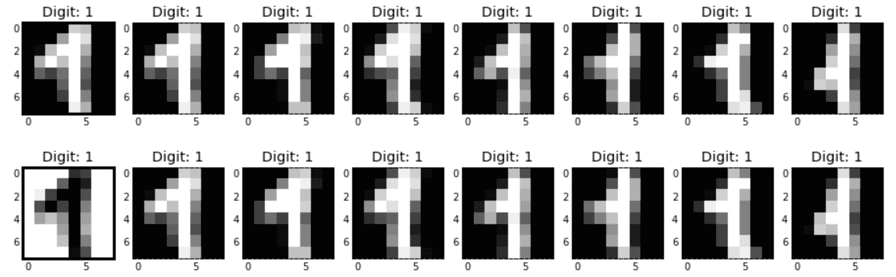

在编写自己的自定义距离时要记住的一点是，它们不如内置距离优化，并且在预测时运行算法的计算开销会更大。

# 使用最近邻进行回归

最终，我们在 MNIST 数据集中预测的目标只是 0 到 9 之间的数字。因此，我们可以选择使用回归算法来解决相同的问题。在这种情况下，我们的预测将不再是整数，而是浮点数。训练回归器与训练分类器没有太大的不同:

```
from sklearn.neighbors import KNeighborsRegressor
clf = KNeighborsRegressor(n_neighbors=3, metric='euclidean')
clf.fit(x_train, y_train)
y_test_pred = clf.predict(x_test)
```

以下是一些错误的预测:

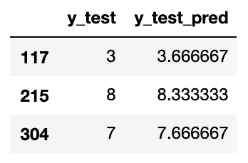

第一项的三个最近邻居是`3`、`3`和`5`。因此，回归者使用它们的平均值(`3.67`)作为预测值。第二项和第三项的邻居分别是`8, 9, 8`和`7, 9, 7`。如果您想要使用分类器的评估度量来评估此模型，请记住对这些预测进行舍入并将它们转换为整数。

# 更多邻域算法

在进入下一节之前，我想快速浏览一下 K 近邻的其他变体。这些算法不太常用，尽管它们有自己的优点和某些缺点。

## 半径邻居

与允许特定数量的邻居投票的 K-最近邻居算法相反，在半径邻居中，特定半径内的所有邻居都参与投票过程。通过设置预定义的半径，稀疏邻域中的决策比密集邻域中的决策基于更少的邻居。这在处理不平衡的类时很有用。此外，通过使用哈弗辛公式作为我们的度量，我们可以使用该算法在地图上向用户推荐附近的场地或加油站。通过指定算法的`weights`参数，半径邻居和 K-最近邻居都可以给予较近的数据点比较远的数据点更多的投票权。

## 最近质心分类器

正如我们所看到的，K-最近邻算法将测试样本与训练集中的所有样本进行比较。这种穷举搜索会导致模型在预测时变得更慢。为了处理这一点，最近质心分类器将来自每个类的所有训练样本汇总成代表该类的伪样本。此伪样本被称为质心，因为它通常是通过计算类中每个要素的平均值来创建的。在预测时，将测试样本与所有质心进行比较，并根据质心最接近的类进行分类。

在下一节中，我们将使用质心算法进行训练和预测，但现在，我们将使用它来生成新的数字，只是为了好玩。该算法被训练如下:

```
from sklearn.neighbors import NearestCentroid
clf = NearestCentroid(metric='euclidean')
clf.fit(x_train, y_train)
```

学习的质心存储在`centroids_`中。以下代码显示了这些质心以及类别标签:

```
fig, axs = plt.subplots(1, len(clf.classes_), figsize=(15, 5))

for i, (centroid, label) in enumerate(zip(clf.centroids_, clf.classes_)):
    display_img(centroid, label, axs[i])

fig.show()
```

生成的数字如下所示:

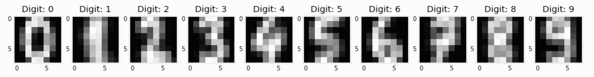

这些数字在我们的数据集中不存在。它们只是每个类中所有样本的组合。

最近质心分类器相当简单，我相信您可以使用几行代码从头开始实现它。但是，对于 MNIST 数据集，其精度不如最近邻法。质心算法更常用于自然语言处理，在这里它更好地被称为 Rocchio(发音像“我们会摇滚你”)。

最后，质心算法还有一个超参数叫做`shrink_threshold`。设置后，这有助于移除不相关的功能。

# 降低图像数据的维度

早些时候，我们意识到图像的维数等于图像中的像素数。因此，没有办法将我们的 43 维 MNIST 数据集可视化。诚然，我们可以分别显示每个数字，但我们无法看到每个图像在我们的特征空间中的位置。这对理解分类器的决策边界很重要。此外，估计器的内存需求与训练数据中的特征数量成比例增长。因此，我们需要一种减少数据中要素数量的方法来处理上述问题。

在本节中，我们将发现两种降维算法:**主成分分析** ( **PCA** )和**邻域成分分析** ( **NCA** )。在解释它们之后，我们将使用它们来可视化 MNIST 数据集，并生成附加样本以添加到我们的训练集中。最后，我们还将使用**特征选择**算法从我们的图像中移除无信息像素。

## 主成分分析

"一张好照片是知道站在哪里。"

安塞尔·亚当斯

想象一下，下面的数据集有两个特征— `x1`和`x2`:

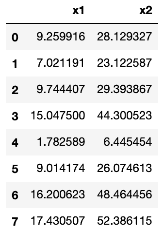

您可以通过使用以下代码片段来生成先前的数据框，请记住，鉴于其随机性，这些数字在您的计算机上可能会有所不同:

```
df = pd.DataFrame(
    {
        'x1': np.random.normal(loc=10.0, scale=5.0, size=8),
        'noise': np.random.normal(loc=0.0, scale=1.0, size=8),
    }
)

df['x2'] = 3 * df['x1'] + df['noise'] 
```

当我们绘制数据时，我们意识到`x1`和`x2`采用以下形式:

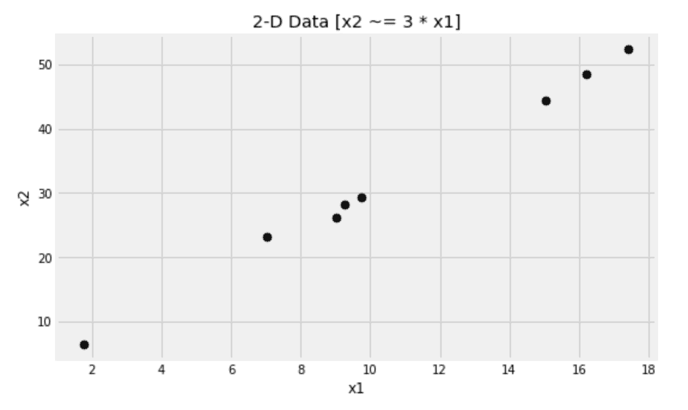

如果你愿意，你可以把头向左倾斜。现在，假设我们没有`x1`和`x2`轴，而是有一个穿过数据的对角线轴。这个轴难道不足以代表我们的数据吗？然后，我们将它从二维数据集缩减为一维数据集。这正是 PCA 试图实现的目标。

这个新轴有一个主要特点——它上面的点之间的距离大于它们在`x1`或`x2`轴上的距离。记住，三角形的斜边总是比其他两条边都大。总之，PCA 试图找到一组数据方差最大化的新轴(主成分)。

就像[第四章](https://cdp.packtpub.com/hands_on_machine_learning_with_scikit_learn/wp-admin/post.php?post=27&action=edit)、*准备你的数据*中讨论的相关系数方程的情况一样，PCA 也需要数据居中。对于每一列，我们从其中的每个值中减去该列的平均值。我们可以使用`with_std =False`标准定标器来实现这一点。以下是如何计算 PCA 并将我们的数据转换成新的维度:

```
from sklearn.preprocessing import StandardScaler
from sklearn.decomposition import PCA

scaler = StandardScaler(with_std=False)
x = scaler.fit_transform(df[['x1', 'x2']])

pca = PCA(n_components=1)
x_new = pca.fit_transform(x)
```

得到的`x_new`值是一个单列数据帧，而不是两个。我们还可以通过`pca.components_`访问新创建的组件。这里，我在原始数据上绘制了新组件:

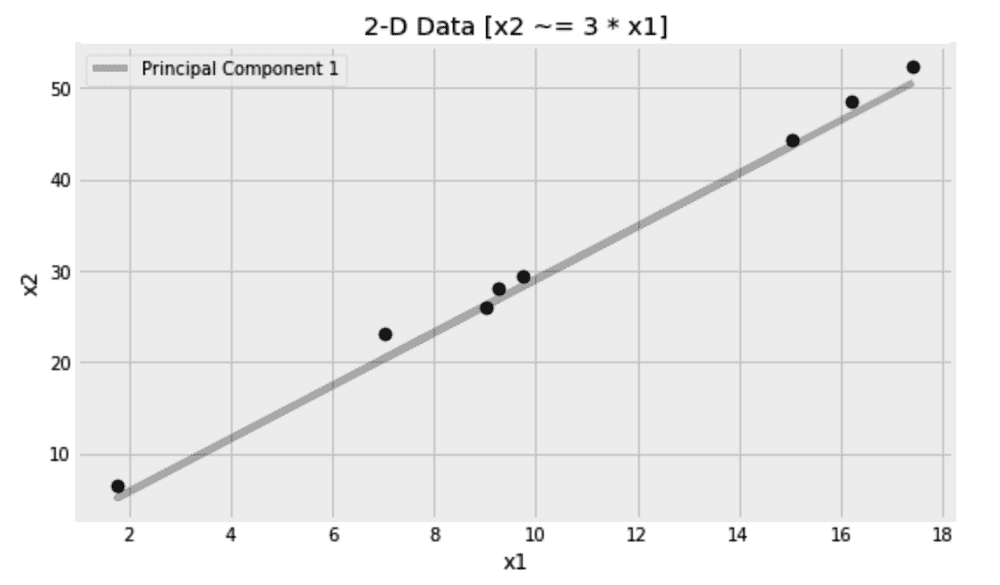

如您所见，我们能够使用 PCA 算法将这里的特征数量从两个减少到一个。由于点并不正好落在直线上，仅使用一个组件会丢失一些信息。该信息存储在我们没有检索到的第二个组件中。您可以将数据转换为任意数量的组件，从一个到原始数量的要素。组件根据它们携带的信息量降序排列。因此，忽略后面的组件可能有助于移除任何噪声和不太有用的信息。转换数据后，还可以将其转换回来(逆转换)。如果保留所有组件，则两次操作后的结果数据仅与原始数据匹配；否则，我们可以将自己限制在前几个(主)分量来对数据进行去噪。

在 PCA 假设中，期望特征空间中具有最高方差的方向比具有较低方差的方向携带更多信息。这种假设在某些情况下可能成立，但不能保证总是正确的。请记住，在 PCA 中，不使用目标，只使用特征。这使得它更适合未标记的数据。

## 邻域成分分析

在最近邻算法中，距离度量的选择是至关重要的，然而它只是凭经验设置的。我们在本章前面使用了 K-fold 交叉验证来决定哪种距离度量对我们的问题更好。这可能很耗时，这促使许多研究人员寻找更好的解决方案。NCA 的主要目的是使用梯度下降从数据中学习距离度量。它试图学习的距离通常用一个正方形矩阵表示。对于 *N* 个样本，我们有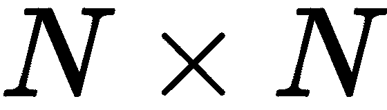个样本对进行比较，因此得到方阵。然而，这个矩阵可以被限制成一个矩形矩阵，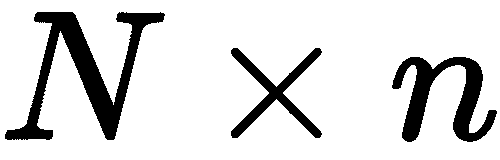，其中小的 *n* 是一个比 *N* 小的数，并且代表缩减的分量。这些简化的组件是 NCA 的构建模块。

最近邻算法属于一类称为基于实例的学习器。我们使用训练集的实例来做决策。因此，承载实例之间距离的矩阵是它的重要组成部分。这个矩阵激发了许多研究人员对它进行研究。例如，从数据中学习距离是 NCA 和大幅度最近邻所做的；其他研究人员将这个矩阵转换到一个更高维的空间中——例如，使用内核技巧——其他人试图通过正则化将特征选择嵌入到基于实例的学习器中。

在下一节中，我们将直观地比较这两种降维方法，使用它们将 MNIST 数据集绘制到二维图上。

## 比较 PCA 和 NCA

我们将通过将数据投影到一个更小的空间来降低数据的维度。除了随机投影，我们将使用 **PCA** 和 **NCA** 。我们将从导入所需的模型开始，并将这三个算法放入 Python 字典中，以便稍后对它们进行循环:

```
from sklearn.preprocessing import StandardScaler
from sklearn.random_projection import SparseRandomProjection
from sklearn.decomposition import PCA
from sklearn.neighbors import NeighborhoodComponentsAnalysis

methods = {
    'Rand': SparseRandomProjection(n_components=2),
    'PCA': PCA(n_components=2),
    'NCA': NeighborhoodComponentsAnalysis(n_components=2, init='random'),
}
```

然后，我们将为三种算法并排创建三个图，如下所示:

```
fig, axs = plt.subplots(1, 3, figsize=(15, 5))

for i, (method_name, method_obj) in enumerate(methods.items()):

    scaler = StandardScaler(with_std=False)
    x_train_scaled = scaler.fit_transform(x_train)

    method_obj.fit(x_train_scaled, y_train)
    x_train_2d = method_obj.transform(x_train_scaled)

    for target in set(y_train):
        pd.DataFrame(
            x_train_2d[
                y_train == target
            ], columns=['y', 'x']
        ).sample(n=20).plot(
            kind='scatter', x='x', y='y', 
            marker=f'${target}$', s=64, ax=axs[i]
        )
        axs[i].set_title(f'{method_name} MNIST')
```

在应用 PCA 之前，将您的数据居中是很重要的。我们用`StandardScaler`来做这个。反正其他算法应该不介意居中。运行代码会得到以下图形:

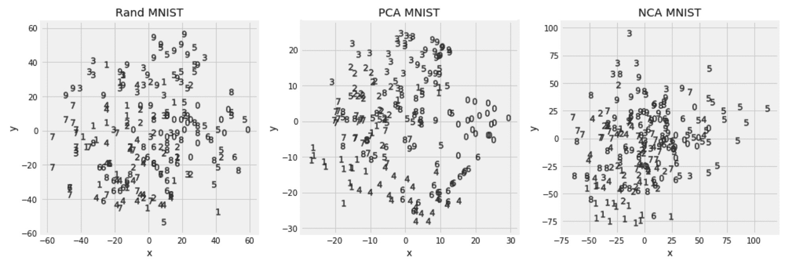

主成分分析和 NCA 在将相同的数字聚集在一起方面比随机投影做得更好。除了可视化分析，我们还可以对缩减后的数据运行最近邻算法，以判断哪种转换更好地代表了数据。我们可以使用与前面类似的代码，并用下面两段代码替换`for`循环中的部分:

1.  首先，我们需要扩展和转变我们的数据:

```
from sklearn.preprocessing import StandardScaler
from sklearn.preprocessing import MinMaxScaler

scaler = StandardScaler(with_std=False)

x_train_scaled = scaler.fit_transform(x_train)
x_test_scaled = scaler.fit_transform(x_test)

method_obj.fit(x_train_scaled, y_train)
x_train_2d = method_obj.transform(x_train_scaled)
x_test_2d = method_obj.transform(x_test_scaled)

scaler = MinMaxScaler()
x_train_scaled = scaler.fit_transform(x_train_2d)
x_test_scaled = scaler.transform(x_test_2d)
```

2.  然后，我们使用交叉验证来设置最佳超参数:

```
from sklearn.neighbors import KNeighborsClassifier 
from sklearn.model_selection import GridSearchCV 
from sklearn.metrics import accuracy_score

parameters = {'metric':('manhattan','euclidean'), 'n_neighbors': range(3, 9)}

knn = KNeighborsClassifier()
clf = GridSearchCV(knn, param_grid=parameters, scoring='accuracy', cv=5)

clf.fit(x_train_scaled, y_train)
y_test_pred = clf.predict(x_test_scaled)

print(
    'MNIST test accuracy score: {:.1%} [k={}, metric={} - {}]'.format(
        accuracy_score(y_test, y_test_pred), 
        clf.best_params_['n_neighbors'], 
        clf.best_params_['metric'], 
        method_name
    )
)
```

由于这次我们不需要可视化数据，我们可以将组件的数量设置为`6`。这为我们提供了以下准确度分数。请记住，由于数据的随机分割和估计量的初始值，您的结果可能会有所不同:

| **投影** | **精度** |
| 稀疏随机投影 | 73% |
| 主成分分析 | 93% |
| NCA | 95% |

在 PCA 中，不需要类别标签。为了保持一致性，我在前面的代码中传递了它们，但是它们被算法忽略了。相比之下，在 NCA，算法使用类别标签。

### 挑选信息最丰富的组件

在拟合 PCA 之后，`explained_variance_ratio_`包含由每个选择的成分解释的方差的百分比。根据主成分假设，较高的比率应该反映更多的信息。我们可以将这些信息放入数据框中，如下所示:

```
df_explained_variance_ratio = pd.DataFrame(
    [
        (component, explained_variance_ratio) 
        for component, explained_variance_ratio in enumerate(pca.explained_variance_ratio_[:32], 1)
    ], columns=['component', 'explained_variance_ratio']
)
```

然后，将其绘制成下图。我相信通过条形图绘制数据已经成为你的第二天性了:

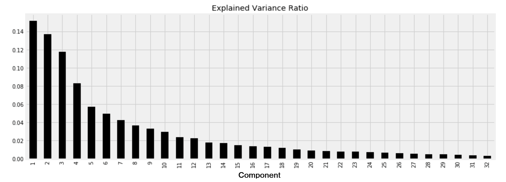

从图中，我们可以看出，从第八个组件开始，其余组件携带的信息不到 5%。

我们还可以循环使用`n_components`的不同值，然后根据减少的数据训练一个模型，看看精确度如何随着使用的组件数量而变化。我更相信这种方法，而不是依赖于解释的方差，因为它独立于主成分假设，并将特征约简算法和分类器作为单个黑盒来评估。这一次，我将使用不同的算法:最近的质心。

#### 结合 PCA 使用质心分类器

在下面的代码中，我们将每次使用不同数量的主成分来尝试质心算法。请不要忘记在每次迭代中缩放和变换您的特征，并且记住将结果的`x`值存储在`x_train_embed`和`x_test_embed`中。我在这里使用了`StandardScaler`以及 PCA 的`transform`方法来转换缩放后的数据:

```
from sklearn.neighbors import NearestCentroid

scores = []
for n_components in range(1, 33, 1):

    # Scale and transform the features as before 
    clf = NearestCentroid(shrink_threshold=0.01)
    clf.fit(x_train_embed, y_train)
    y_test_pred = clf.predict(x_test_embed)

scores.append([n_components, accuracy_score(y_test, y_test_pred)])
```

绘制分数给我们提供了下面的图表:

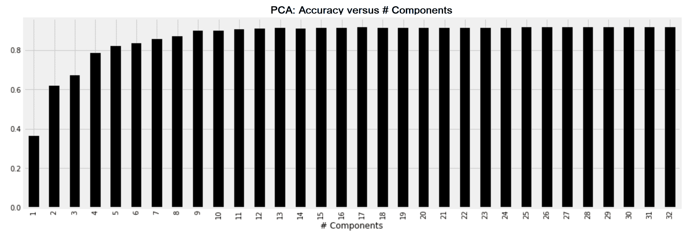

当我们对这个数据集使用质心算法时，我们可以粗略地看到，15 个组件以上的任何内容都不会增加多少价值。在交叉验证的帮助下，我们可以挑选出给出最佳结果的组件的确切数量。

### 从其组成部分恢复原始图像

一旦图像被还原为其主要成分，它也可以被还原回来，如下所示。

1.  首先，您必须在使用 PCA 之前缩放数据:

```
from sklearn.preprocessing import StandardScaler
scaler = StandardScaler(with_std=False)
x_train_scaled = scaler.fit_transform(x_train)
x_test_scaled = scaler.transform(x_test)
```

缩放后，您可以使用 32 个主成分来转换数据，如下所示。

2.  然后，您可以使用`inverse_transform`方法恢复转换后的原始数据:

```
from sklearn.decomposition import PCA
embedder = PCA(n_components=32)
embedder.fit(x_train, y_train)

x_train_embed = embedder.transform(x_train_scaled)
x_test_embed = embedder.transform(x_test_scaled)

x_train_restored = embedder.inverse_transform(x_train_embed) 
x_test_restored = embedder.inverse_transform(x_test_embed)
```

3.  为了使原始图像和恢复的图像保持相同的比例，我们可以使用`MinMaxScaler`，如下所示:

```
iscaler = MinMaxScaler((x_train.min(), x_train.max()))
x_train_restored = iscaler.fit_transform(x_train_restored) 
x_test_restored = iscaler.fit_transform(x_test_restored)
```

在这里，你可以看到一些数字和它们自身的比较，去掉了不太重要的部分。原始数据的这些恢复版本对分类器很有用，可以用它们代替训练集和测试集，也可以将它们作为附加样本添加到训练集中:

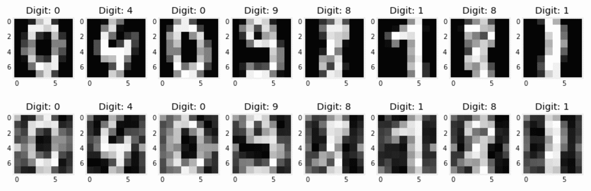

4.  最后，我使用了`x_train_embed`和`x_test_embed`来代替最近邻分类器中的原始特征。我每次都尝试不同数量的 PCA 组件。下图中较暗的条形显示了导致最高准确度分数的 PCA 成分的数量:

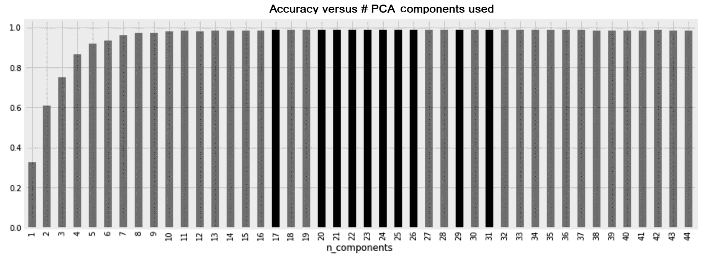

PCA 不仅帮助我们减少了特征的数量和预测时间，还帮助我们获得了 98.9%的分数。

## 寻找信息最丰富的像素

由于几乎所有的数字都在图像的中心，我们可以直观地推断出图像左右边缘的像素没有携带有价值的信息。为了验证我们的直觉，我们将让[第 4 章](https://cdp.packtpub.com/hands_on_machine_learning_with_scikit_learn/wp-admin/post.php?post=27&action=edit)、*准备您的数据*中的特征选择算法为我们决定哪些像素是最重要的。这里，我们可以使用互信息算法来返回像素及其相应重要性的列表:

```
from sklearn.feature_selection import mutual_info_classif
mi = mutual_info_classif(x_train, y_train)
```

然后，我们使用前面的信息来移除 75%的像素:

```
percent_to_remove = 75
mi_threshold = np.quantile(mi, 0.01 * percent_to_remove)
informative_pixels = (mi >= mi_threshold).reshape((8, 8))

plt.imshow(informative_pixels, cmap='Greys')
plt.title(f'Pixels kept when {percent_to_remove}% removed')
```

在下图中，用黑色标记的像素是信息量最大的像素，其余的是互信息算法认为不太重要的 75%的像素:

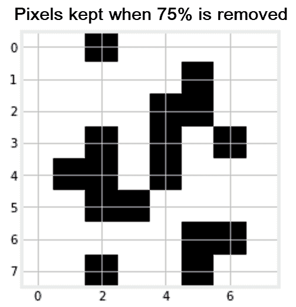

正如所料，边缘上的像素信息较少。既然我们已经确定了信息量较少的像素，我们可以通过移除信息量较少的像素来减少数据中的要素数量，如下所示:

```
from sklearn.feature_selection import SelectPercentile
percent_to_keep = 100 - percent_to_remove
selector = SelectPercentile(mutual_info_classif, percentile=percent_to_keep)

x_train_mi = selector.fit_transform(x_train, y_train)
x_test_mi = selector.transform(x_test)
```

在减少的特征上训练分类器给我们 94%的准确度分数。知道最近邻算法的复杂性及其预测时间随着特征的数量而增长，我们就可以理解仅使用数据的 **25%** 的精度稍差的算法的价值。

# 摘要

图像在我们的日常生活中大量存在。机器人需要计算机视觉来理解它们的周围环境。社交媒体上的大多数帖子都附有图片。手写文档需要进行图像处理，以便机器可以使用。这些和更多的使用案例是为什么图像处理是机器学习从业者必须掌握的基本能力的原因。在这一章中，我们学习了如何加载图像并理解它们的像素。我们还学习了如何对图像进行分类，并减少它们的尺寸，以便更好地可视化和进一步操作。

我们使用最近邻算法进行图像分类和回归。该算法允许我们在需要时插入自己的指标。我们还学习了其他算法，如半径邻居和最近质心。这些算法背后的概念及其差异在机器学习领域无所不在。稍后，我们将看到聚类和异常检测算法如何借鉴这里讨论的概念。除了这里讨论的主要算法，距离度量和降维等概念也无处不在。

由于图像处理的重要性，我们不会在这里停下来，因为我们将在第 7 章、*神经网络中建立在这里获得的知识——这里是深度学习*，我们将使用人工神经网络进行图像分类。*