# 六、使用朴素贝叶斯分类文本

“语言是自由创造的过程；它的法律和原则是固定的，但使用生成原则的方式是自由和无限变化的。即使是对词语的解释和使用，也包含着一个自由创造的过程。”

诺姆·乔姆斯基

并非所有信息都存在于表格中。从维基百科到社交媒体，有数十亿的文字，我们希望我们的计算机能够处理并从中提取信息。处理文本数据的机器学习子领域被称为**文本挖掘**和**自然语言处理** ( **NLP** )。这些不同的名称反映了该领域继承自多个学科的事实。一方面我们有计算机科学和统计学，另一方面我们有语言学。我认为，语言学在该领域处于婴儿期时的影响更大，但在后来的阶段，从业者开始青睐数学和统计工具，因为它们需要较少的人工干预，并且可以在没有人工将语言规则编码到算法中的情况下逃脱:

"每当我解雇一名语言学家，我们的语音识别系统的性能就会上升."

弗雷德·耶利内克

话虽如此，但对事情如何随着时间的推移而发展有一个基本的了解是非常重要的，不要马上跳到最前沿的解决方案。这使我们能够明智地选择工具，同时意识到我们正在进行的权衡。因此，我们将从处理文本数据并以算法能够理解的格式呈现给算法开始这一章。这个预处理阶段对下游算法的性能有重要影响。因此，我将确保阐明这里解释的每种方法的优缺点。一旦数据准备就绪，我们将使用一个**朴素贝叶斯**分类器，根据不同 Twitter 用户发送给多个航空服务的消息来检测他们的情绪。

本章将涵盖以下主题:

*   将句子拆分成标记
*   令牌规范化
*   使用单词包来表示标记
*   使用 n-grams 来表示令牌
*   使用 Word2Vec 表示令牌
*   基于朴素贝叶斯分类器的文本分类

# 将句子拆分成标记

“一个字接一个字接一个字就是力量。”

玛格丽特·阿特伍德

到目前为止，我们处理的数据要么是以列为特征的表格数据，要么是以像素为特征的图像数据。在文本的情况下，事情就不那么明显了。我们应该使用句子、单词还是字符作为我们的特征？句子很具体。例如，完全相同的句子不太可能出现在两个或更多的维基百科文章中。因此，如果我们使用句子作为特征，我们最终会得到大量不能很好概括的特征。

另一方面，角色是有限的。例如，英语只有 26 个字母。这种小的变化可能会限制单独字符携带足够信息以供下游算法提取的能力。因此，单词通常被用作大多数任务的特征。

在这一章的后面，我们将看到相当具体的记号仍然是可能的，但是现在让我们坚持把单词作为特征。最后，我们不想把自己局限于字典里的单词；Twitter 标签、数字和 URL 也可以从文本中提取出来，并作为特征对待。这就是为什么我们更喜欢使用术语*令牌*而不是*单词*，因为它更通用。将文本流分割成标记的过程称为标记化，我们将在下一节中了解这一点。

## 使用字符串拆分进行标记化

不同的标记化方法导致不同的结果。为了演示这些差异，让我们看看下面的三行文本，看看我们如何标记它们。

在这里，我将文本行写成字符串，并将它们放入一个列表中:

```py
lines = [
    'How to tokenize?\nLike a boss.',
    'Google is accessible via http://www.google.com',
    '1000 new followers! #TwitterFamous',
]
```

一个显而易见的方法是使用 Python 的内置`split()`方法，如下所示:

```py
for line in lines:
    print(line.split())
```

当没有给定参数时，`split()`使用空格根据。因此，我们得到以下输出:

```py
['How', 'to', 'tokenize?', 'Like', 'a', 'boss.']
['Google', 'is', 'accessible', 'via', 'http://www.google.com']
['1000', 'new', 'followers!', '#TwitterFamous']
```

您可能会注意到，标点符号是作为记号的一部分保留下来的。问号留在了`tokenize`的结尾，句号依然连着`boss`。hashtag 由两个单词组成，但是因为它们之间没有空格，所以它和它的前导散列符号一起作为一个单独的标记保存。

## 使用正则表达式进行标记

我们也可以使用正则表达式将字母和数字序列视为记号，并相应地拆分句子。这里使用的模式，`"\w+"`，指的是一个或多个字母数字字符或下划线的任何序列。编译我们的模式给了我们一个正则表达式对象，我们可以用它来进行匹配。最后，我们循环遍历每一行，并使用正则表达式对象将它拆分成标记:

```py
import re
_token_pattern = r"\w+"
token_pattern = re.compile(_token_pattern)

for line in lines:
    print(token_pattern.findall(line))
```

这为我们提供了以下输出:

```py
['How', 'to', 'tokenize', 'Like', 'a', 'boss']
['Google', 'is', 'accessible', 'via', 'http', 'www', 'google', 'com']
['1000', 'new', 'followers', 'TwitterFamous']
```

现在，标点符号已被删除，但 URL 已被拆分为四个标记。

默认情况下，Scikit-learn 使用正则表达式进行标记化。但是，使用下面的模式`r"(?u)\b\w\w+\b"`来代替`r"\w+"`。这种模式忽略所有标点符号和短于两个字母的单词。因此,“a”标记将被省略。您仍然可以通过提供自定义模式来覆盖默认模式。

## 在标记前使用占位符

为了解决前面的问题，我们可以决定在标记句子之前用占位符替换数字、URL 和标签。如果我们不在乎区分它们的内容，这是很有用的。一个 URL 对我来说可能只是一个 URL，不管它通向哪里。下面的函数将其输入转换成小写，然后用一个`_url_`占位符替换它找到的任何 URL。类似地，它将标签和数字转换成相应的占位符。最后，根据空格分割输入，并返回结果标记:

```py
_token_pattern = r"\w+"
token_pattern = re.compile(_token_pattern)

def tokenizer(line):
    line = line.lower()
    line = re.sub(r'http[s]?://[\w\/\-\.\?]+','_url_', line)
    line = re.sub(r'#\w+', '_hashtag_', line)
    line = re.sub(r'\d+','_num_', line)
    return token_pattern.findall(line)

for line in lines:
    print(tokenizer(line))
```

这为我们提供了以下输出:

```py
['how', 'to', 'tokenize', 'like', 'a', 'boss']
['google', 'is', 'accessible', 'via', '_url_']
['_num_', 'new', 'followers', '_hashtag_']
```

正如您所看到的，新的占位符告诉我们，在第二句话中存在一个 URL，但它并不真正关心 URL 链接到哪里。如果我们有另一个带有不同 URL 的句子，它也会得到相同的占位符。数字和标签也是如此。

根据您的使用情况，如果您的标签包含您不希望丢失的信息，这可能并不理想。同样，这是您必须根据您的用例做出的权衡。通常，您可以直观地判断哪种技术更适合手头的问题，但有时在多种标记化技术之后评估模型可能是判断哪种技术更适合的唯一方法。最后，在实践中，您可以使用像 **NLTK** 和 **spaCy** 这样的库来标记您的文本。他们已经有了必要的正则表达式。我们将在本章的后面使用 spaCy。

请注意，在处理句子之前，我是如何将句子转换成小写的。这叫正常化。如果没有规范化，一个大写的单词和它的小写版本将被视为两个不同的标记。这并不理想，因为*男孩*和*男孩*在概念上是相同的，因此通常需要规范化。默认情况下，Scikit-learn 将输入文本转换为小写。

# 将文本矢量化为矩阵

在文本挖掘中，数据集通常被称为**语料库**。其中的每个数据样本通常称为一个**文档**。文档由**记号**组成，一组不同的记号被称为**词汇**。将这些信息放入一个矩阵中称为**矢量化**。在接下来的几节中，我们将会看到不同种类的矢量化。

## 向量空间模型

我们仍然怀念我们钟爱的特性矩阵，我们期望每个标记都有自己的列，每个文档用单独的行表示。这种对文本数据的表示称为**vecto**rspace model。从线性代数的角度来看，这种表示中的文档被视为向量(行)，不同的项是这个空间(列)的维度，因此得名向量空间模型。在下一节中，我们将学习如何对我们的文档进行矢量化。

### 一袋单词

我们需要将文档转换成令牌，并将其放入向量空间模型。`CountVectorizer`可用于标记文档，并将其放入所需的矩阵中。在这里，我们将在上一节中创建的记号赋予器的帮助下使用它。像往常一样，我们导入并初始化`CountVectorizer`，然后使用它的`fit_transform`方法来转换我们的文档。我们还指定要使用我们在上一节中构建的记号赋予器:

```py
from sklearn.feature_extraction.text import CountVectorizer
vec = CountVectorizer(lowercase=True, tokenizer=tokenizer)
x = vec.fit_transform(lines)
```

返回的矩阵中的大部分单元都是零。为了节省空间，保存为稀疏矩阵；但是，我们可以用它的`todense()`方法把它变成一个密集矩阵。矢量器保存遇到的词汇集，可以使用`get_feature_names()`检索。使用这些信息，我们可以将`x`转换成如下数据帧:

```py
pd.DataFrame(
    x.todense(), 
    columns=vec.get_feature_names()
)
```

这给了我们以下矩阵:

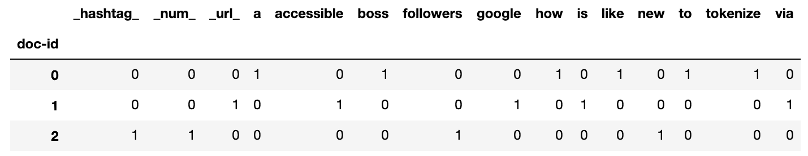

每个单元格包含每个标记在每个文档中出现的次数。但是，词汇没有遵循任何顺序；因此，不可能从这个矩阵中判断出每个文档中标记的顺序。

### 不同的句子，相同的表述

就拿这两个意思相反的句子来说:

```py
flight_delayed_lines = [
    'Flight was delayed, I am not happy',
    'Flight was not delayed, I am happy'
]
```

如果我们使用计数矢量器来表示它们，我们将得到以下矩阵:

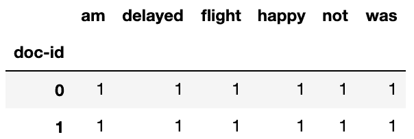

如您所见，句子中的标记顺序丢失了。这就是为什么这种方法被称为**单词袋**的原因——结果就像一个没有任何顺序的单词袋。很明显，这就让人分不清两个人谁幸福谁不幸福了。为了解决这个问题，我们可能需要使用 **n-grams** ，我们将在下一节中这样做。

### N-grams

我们可以将每两个连续术语的组合视为单个标记，而不是将每个术语视为一个标记。我们要做的就是将`CountVectorizer`中的`ngram_range`设置为`(2,2)`，如下:

```py
from sklearn.feature_extraction.text import CountVectorizer
vec = CountVectorizer(ngram_range=(2,2))
x = vec.fit_transform(flight_delayed_lines)
```

使用与上一节类似的代码，我们可以将得到的`x`放入一个数据帧中，并得到下面的矩阵:

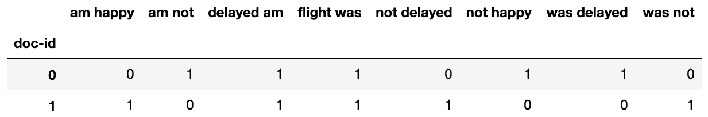

现在我们可以分辨出谁快乐，谁不快乐。当使用词对时，这被称为**二元组**。我们也可以做 3 克(三个连续的单词)，4 克，或任何其他数量的克。将`ngram_range`设置为(1，1)会将我们带回最初的表示，其中每个单独的单词都是一个令牌，也就是 **unigrams** 。我们也可以通过将`ngram_range` **设置为(1，2)来混合使用单字和双字。简而言之，这个范围告诉记号赋予器在我们的 n 元语法中使用的 *n* 的最小和最大值。**

 **如果您将 *n* 设置为一个较高的值——比如说 8——这意味着八个单词的序列被视为令牌。现在，您认为八个单词的序列在您的数据集中出现多次的可能性有多大？最有可能的是，你会在你的训练集中看到它一次，而不会在测试集中再看到它。这就是为什么 *n* 通常被设置为 2 到 3 之间的某个值，一些单字也被用来捕获罕见的单词。

### 用字符代替单词

迄今为止，词语一直是我们文本世界的原子。然而，有些情况可能需要我们基于字符来标记我们的文档。在单词边界不清楚的情况下，比如在标签和 URL 中，使用字符作为标记可能会有所帮助。自然语言的字符往往有不同的频率。字母 **e** 是英语中最常用的字符，像 **th** 、 **er** 和上的**这样的字符组合也很常见。其他语言，如法语和荷兰语，有不同的字符频率。如果我们的目标是根据文档的语言对文档进行分类，那么使用字符而不是单词会很方便。**

同样的`CountVectorizer`可以帮助我们将文档标记成字符。我们也可以将它与`n-grams`设置结合起来，以获得单词中的子序列，如下所示:

```py
from sklearn.feature_extraction.text import CountVectorizer
vec = CountVectorizer(analyzer='char', ngram_range=(4,4))
x = vec.fit_transform(flight_delayed_lines)
```

我们可以将结果`x`放入一个数据帧中，就像我们之前做的那样，得到下面的矩阵:

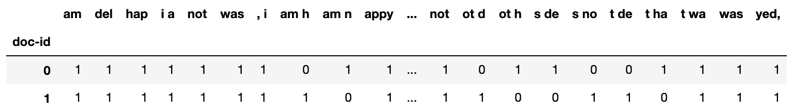

现在我们所有的代币都是由四个字符组成的。如您所见，空白也被视为字符。对于字符，更常见的是选择更高的 *n* 值。

### 使用 TF-IDF 捕获重要单词

我们从这里借鉴了很多想法的另一个学科是**信息检索**领域。它是负责运行搜索引擎(如 Google、Bing 和 DuckDuckGo)的算法的领域。

现在，以下面这段引文为例:

“从语言学的角度来看，你真的不能反对这样一种观点，即表演就是表演。”

沃尔特·贝克尔

单词**语言学**和单词 **that** 在前一段引文中都只出现过一次。然而，如果我们在互联网上搜索这段引文，我们只会担心单词**语言学**，而不是单词 **that** 。我们知道它更有意义，尽管它只出现了一次，与 T21 出现的次数一样多。**这个词显示**出现了三次。从计数矢量器的角度来看，它应该比单词**语言**多携带三倍的信息。我假设你也不同意矢量器的观点。这些问题从根本上是**词频** - **逆词频** *( **TF-IDF** )存在的理由。IDF 部分不仅包括根据单词在某个文档中出现的频率来加权单词的值，还包括如果这些单词在其他文档中非常常见，则从这些单词中扣除权重。单词**和**在其他文档中是如此的常见，以至于它不应该被赋予和**语言学**一样的价值。此外，IDF 使用对数标度，根据单词在文档中的出现频率，更好地表示单词携带的信息。*

 *让我们使用以下三个文档来演示 TF-IDF 是如何工作的:

```py
lines_fruits = [
    'I like apples',
    'I like oranges',
    'I like pears',
]
```

`TfidfVectorizer`具有与`CountVectorizer`几乎相同的界面:

```py
from sklearn.feature_extraction.text import TfidfVectorizer
vec = TfidfVectorizer(token_pattern=r'\w+')
x = vec.fit_transform(lines_fruits)
```

下面是两个矢量器输出的对比:

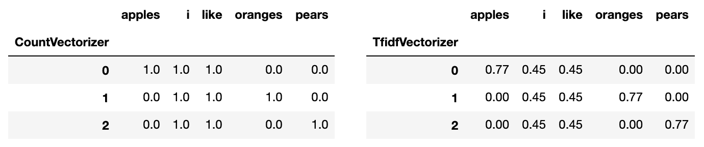

如你所见，不像在`CountVectorizer`中，不是所有的单词都被`TfidfVectorizer`一视同仁。与其他在三个句子中出现的信息量较少的单词相比，水果的名字更受重视。

`CountVectorizer`和**`TfidfVectorizer`**都有一个参数叫`stop_words`。它可用于指定要忽略的令牌。你可以提供你自己的信息较少的单词列表，例如 **a** 、**a**和**a**。您还可以提供`english` *关键字来指定英语中常见的停用词。话虽如此，但重要的是要注意到，有些单词对一项任务可能有用，但对另一项任务却没用。此外，IDF 通常会自动做您需要它做的事情，并对非信息性单词给予较低的权重。这就是为什么我通常不喜欢手动删除停用词，而是先尝试诸如`TfidfVectorizer`、特征选择和正则化**之类的东西。*******

 *******除了它最初的用例，`TfidfVectorizer`通常被用作文本分类的预处理步骤。然而，当要对较长的文档进行分类时，它通常会产生良好的结果。对于短文档，可能会产生嘈杂的转换，建议在此类情况下尝试一下`CountVectorizer`。

在一个基本的搜索引擎中，当有人键入一个查询时，它会使用 TF-IDF 转换到所有要搜索的文档所在的向量空间。一旦搜索查询和文档作为向量存在于同一空间中，就可以使用简单的距离度量(如余弦距离)来查找与查询最接近的文档。现代搜索引擎与这一基本思想有所不同，但它是你理解信息检索的良好基础。

## 用单词嵌入表示意思

因为文档是记号的集合，所以它们的向量表示基本上是它们包含的记号的向量的总和。正如我们前面所看到的，文档**我喜欢苹果**由使用向量[1，1，1，0，0]的`CountVectorizer`表示:

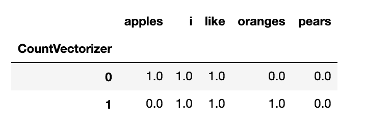

从这个表示中，我们还可以推导出， **I** 、 **like** 、**apple**、**orange**由以下四个五维向量表示:[0，1，0，0，0，0]、[0，0，1，0，0]、[1，0，0，0，0，0]和[0，0，0，0，1，0]。我们有一个五维空间，有五个词汇。每一项在一个维度上的量值为 1，在其他四个维度上的量值为 0。从线性代数的角度来看，所有五项都是相互正交的。然而，**苹果**、**梨**和**橙子**都是水果，从概念上讲，它们有一些相似性，这是这个模型所没有捕捉到的。因此，理想情况下，我们会用更接近的向量来表示它们，不像这些正交向量。顺便说一句，同样的问题也适用于`TfidfVectorizer`***。这是研究人员提出更好的表示方法的驱动力，单词嵌入是当今自然语言处理领域最酷的产品，因为它试图比传统的矢量器更好地捕捉含义。在下一节中，我们将了解一种流行的嵌入技术，Word2Vec。***

### Word2Vec

在不涉及太多细节的情况下，Word2Vec 使用神经网络根据上下文，即周围的单词来预测单词。通过这样做，它学习了不同单词的更好的表示，这些表示包含了它们所代表的单词的意思。与前面提到的矢量器不同，单词表示的维度与我们的词汇量没有直接联系。我们可以选择嵌入向量的长度。一旦每个单词都由一个向量表示，文档的表示通常是该单词的所有向量的总和。平均也是代替求和的一种选择。

由于我们的向量的大小独立于我们正在处理的文档的词汇大小，研究人员可以重用预先训练的 Word2Vec 模型，该模型不是专门为他们的特定问题而制作的。这种重用预先训练好的模型的能力被称为迁移学习。一些研究人员可以使用昂贵的机器在大量文件上训练嵌入，并发布结果向量供整个世界使用。然后，下一次我们处理特定的自然语言处理任务时，我们需要做的就是获得这些向量，并使用它们来表示我们的新文档。spaCy([https://spacy.io/](https://spacy.io/))是一个开源软件库，带有不同语言的单词向量。

在下面几行代码中，我们将安装 spaCy，下载它的语言模型数据，并使用它将单词转换为向量:

1.  要使用 spaCy，我们可以通过在终端中运行以下命令来安装该库并下载其针对英语语言的预训练模型:

```py
          pip install spacy

          python -m spacy download en_core_web_lg

```

2.  然后，我们可以将下载的向量分配给我们的五个单词，如下所示:

```py
import spacy
nlp = spacy.load('en_core_web_lg')

terms = ['I', 'like', 'apples', 'oranges', 'pears']
vectors = [
    nlp(term).vector.tolist() for term in terms
]
```

3.  以下是苹果的示意图:

```py
# pd.Series(vectors[terms.index('apples')]).rename('apples')

0     -0.633400
1      0.189810
2     -0.535440
3     -0.526580
         ...   
296   -0.238810
297   -1.178400
298    0.255040
299    0.611710
Name: apples, Length: 300, dtype: float64
```

我向你保证，苹果**、橘子**、梨**和梨**的表示不会像`CountVectorizer`那样是正交的。然而，对于 300 维，我很难直观地证明这一点。幸运的是，我们已经学会了如何计算两个向量之间夹角的余弦值。正交向量之间应该有 90 ^o 的角度，它们的余弦等于 0。两个方向完全相同的向量之间的零度角的余弦为 1。

这里，我们计算从空间得到的所有五个向量之间的余弦。我用了一些熊猫和海豹的造型让数字更清晰:

```py
import seaborn as sns
from sklearn.metrics.pairwise import cosine_similarity

cm = sns.light_palette("Gray", as_cmap=True)

pd.DataFrame(
    cosine_similarity(vectors),
    index=terms, columns=terms,
).round(3).style.background_gradient(cmap=cm)
```

然后，我在下面的数据框中显示了结果:

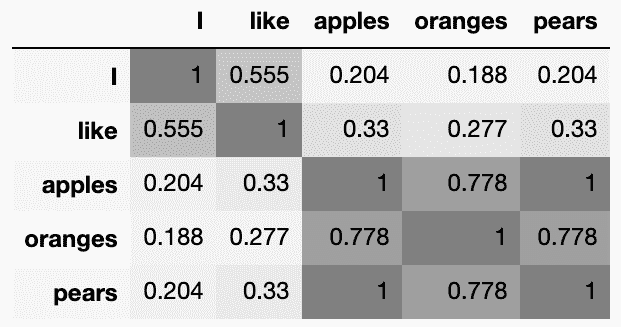

很明显，新的表示理解了水果名称彼此之间的相似度要高于它们与单词之间的相似度，如 **I** 和 **like** 。它还认为**苹果**和**梨**彼此非常相似，而不是**橙子**。

你可能已经注意到了 Word2Vec 和 unigrams 面临着同样的问题；人们对单词进行编码时并不太注意它们的上下文。单词“book”在“I will read a book”中的表示与它在“I will book a flight”中的表示相同。这就是为什么更新的技术，如来自语言模型的**嵌入** ( **埃尔莫**)、来自变形金刚的**双向编码器表示** ( **伯特**)和 OpenAI 最近的 **GPT-3** 如今越来越受欢迎，因为它们尊重单词的上下文。我希望它们能很快被包含在更多的库中，以便任何人都能轻松使用。

嵌入概念如今被各地的机器学习从业者回收再利用。除了用于自然语言处理之外，它还用于特征约简和推荐系统。例如，每当客户向他们的在线购物车中添加商品时，如果我们将购物车视为一个句子，而将商品视为单词，我们最终会得到商品嵌入( **Item2Vec** )。这些项目的新表示可以容易地插入到下游分类器或推荐系统中。

在进行文本分类之前，我们需要先停下来花点时间了解一下我们将要使用的分类器——朴素贝叶斯分类器**。**

# 理解朴素贝叶斯

朴素贝叶斯分类器通常用于分类文本数据。在接下来的章节中，我们将看到它的不同风格，并学习如何配置它们的参数。但是首先，为了理解朴素贝叶斯分类器，我们需要先看一下托马斯·贝叶斯定理，他在 18 世纪发表了这个定理。

## 贝叶斯规则

说到分类器，我们可以用条件概率来描述某个样本属于某个类别的概率， *P(y|x)* 。这是给定特征的样本属于类别 *y* 的概率， *x* 。管道符号(|)就是我们用来指代条件概率的，即 *y* 给定 *x* 。贝叶斯规则能够使用下面的公式，按照 *P(x|y)* 、 *P(x)* 和 *P(y)* 来表达这个条件概率:

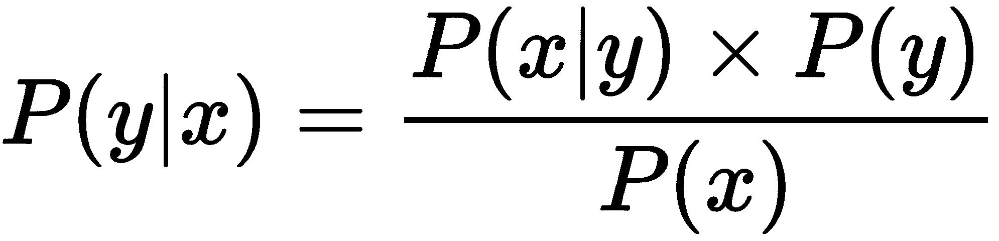

通常，我们忽略等式的分母部分，将其转换为比例，如下所示:

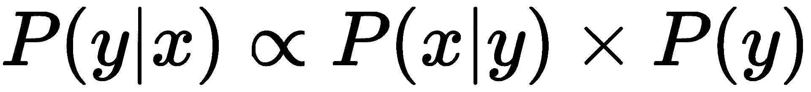

一个类的概率 *P(y)* 称为先验概率。基本上就是所有训练样本中属于某一类的样本数。条件概率 *P(x|y)* 被称为似然性。这是我们从训练样本中计算出来的。一旦在训练时知道了这两个概率，我们就可以用它们来预测一个新样本在预测时属于某一类的几率， *P(y|x)* ，也称为后验概率。计算等式的似然部分并不像我们预期的那么简单。因此，在下一节中，我们将讨论简化计算的假设。

## 天真地计算可能性

一个数据样本由多个特征组成，这意味着在现实中， *P(x|y)* 的 *x* 部分由 *x [1]* ， *x [2]* ， *x [3]* ，....*x[k]，其中 *k* 为特征数。这样，条件概率可以表示为 *P(x [1] ，x [2] ，x [3] ，....x [k] |y)* 。实际上，这意味着我们需要为 *x* 的所有可能组合计算这个条件概率。这样做的主要缺点是我们的模型缺乏通用性。*

让我们用下面的玩具例子来说明问题:

| **正文** | 这篇文章暗示作者喜欢水果吗？ |
| 我喜欢苹果 | 是 |
| 我喜欢橘子 | 是 |
| 我讨厌梨 | 不 |

如果上表是我们的训练数据，第一个样本的似然概率， *P(x|y)* 是看到三个词 **I** 、 **like** 和**apple**在一起的概率，给定目标， **Yes** 。同样，对于第二个样本，是看到三个字 **I** 、 **like** 、 **oranges** 在一起的概率，给定目标， **Yes** 。第三个样本也是如此，目标是**否**而不是**是**。现在，假设给我们一个新样本，**我讨厌苹果**。问题是我们以前从来没见过这三个字在一起。你可能会说，“但是我们之前已经看到过这个句子中的每个单词，只是分别看到的！”没错，但是我们的公式只关心单词的组合。它无法独自从每个单独的特征中学习任何东西。

您可能还记得第四章、*准备您的数据*中的 *P(x [1] ，x [2] ，x [3] ，....x [k] |y)* 只能表示为*P(x[1]| y)* P(x[2]| y)x[3]*..* P(x [k] |y)* 如果 *x [1] ，x [2] ，x [3] ，....x[k]都是独立的。我们无法确定它们的独立性，但为了使模型更具普遍性，我们还是做了这个天真的假设。由于这种假设和处理单独的单词，我们现在可以了解一些关于短语**我讨厌苹果**的信息，尽管之前没有看到过。这种天真而有用的独立性假设给了分类器名称“天真”的前缀。*

朴素贝叶斯实现

## 在 scikit-learn 中，有各种各样的朴素贝叶斯实现。

**多项式朴素贝叶斯**分类器是最常用的文本分类工具。它的实现与我们在上一节中看到的非常相似。

*   **伯努利朴素贝叶斯** **分类器假定特征是二元的。在 Bernoulli 版本中，我们只关心一个术语是否存在，而不是计算一个术语在每个文档中出现多少次。计算可能性的方式明确地惩罚了文档中未出现的术语，并且它可能在一些数据集上执行得更好，尤其是那些具有较短文档的数据集。**
***   **高斯朴素贝叶斯**用于连续特征。它假设要素呈正态分布，并使用最大似然估计来计算似然概率。除了文本分析之外，这种实现对于其他情况也很有用。*   此外，您还可以在 scikit-learn 用户指南([https://scikit-learn.org/stable/modules/naive_bayes.html](https://scikit-learn.org/stable/modules/naive_bayes.html))中了解其他两个实现，**互补朴素贝叶斯**和**分类朴素贝叶斯**。**

 **加法平滑

### 当一个在训练中没有出现的术语在预测中出现时，我们将其概率设置为 0。这听起来很符合逻辑，但考虑到我们天真的假设，这是一个有问题的决定。由于 *P(x [1] ，x [2] ，x [3] ，....x [k] |y)* 等于*P(x[1]| y)* P(x[2]| y)* P(x[3]| y)*..* P(x [k] |y)，*将任一项的条件概率设置为零将设置整个 *P(x [1] ，x [2] ，x [3] ，....结果 x [k] |y)* 归零。为了避免这个问题，我们假设在每个类中添加了一个包含全部词汇的新文档。从概念上来说，这个新的假设文档将分配给我们已经看到的术语的概率质量的一部分重新分配给看不见的术语。`alpha`参数控制我们想要将多少概率质量重新分配给看不见的项。将`alpha`设置为 1 称为**拉普拉斯平滑**，将其设置为 0 到 1 之间的值称为 **Lidstone** 平滑**平滑**。

我发现自己在计算比率时大量使用拉普拉斯平滑法。除了防止我们被零除，还有助于处理不确定性。让我用下面两个例子来进一步解释:

**例 1**:10000 人看到一个链接，其中 9000 人点击了它。我们显然可以估计点击率为 90%。

*   **例二**:如果我们的数据只有一个人，而那个人看到了链接并点击了，我们会有足够的信心说点击率是 100%吗？

*   在前面的例子中，如果我们假设有两个额外的用户，其中只有一个用户点击了链接，那么第一个例子中的点击率将变成 10，002 中的 9，001，仍然几乎是 90%。但是，在第二个示例中，我们将 2 除以 3，这样将剩下 60%，而不是之前计算的 100%。拉普拉斯平滑和李德斯通平滑可以与贝叶斯思维方式联系起来。这两个用户，其中 50%点击了链接，是我们之前的信念。最初，我们不知道太多，所以我们假设 50%的点击率。现在，在第一个例子中，我们有足够的数据推翻这个先验信念，而在第二个例子中，较少的数据点只能移动先验信念这么多。

现在这已经是足够的理论了——让我们用我们目前所知道的一切来判断一些评论者是否对他们的电影观看体验感到满意。

使用朴素贝叶斯分类器对文本进行分类

# 在这一部分，我们将获得一个句子列表，并根据用户的情感对它们进行分类。我们想知道这个句子表达的是积极的还是消极的情绪。 *Dimitrios Kotzias 等人*为他们的研究论文创建了这个数据集，*使用深度特征从群体到个体标签*。他们从三个不同的网站收集了一系列随机句子，每个句子都标有 1(积极情绪)或 0(消极情绪)。

数据集中总共有 2745 个句子。在接下来的部分中，我们将下载数据集，对其进行预处理，并对其中的句子进行分类。

下载数据

## 您只需打开浏览器，将 CSV 文件下载到本地文件夹中，然后使用 pandas 将文件加载到 DataFrames 中。然而，我更喜欢使用 Python 来下载文件，而不是浏览器。我这样做并不是出于极客，而是通过把它放进代码里来保证我整个过程的可重复性。任何人都可以运行我的 Python 代码并获得相同的结果，而不必阅读糟糕的文档文件，找到压缩文件的链接，并按照说明获取数据。

下面是下载我们需要的数据的步骤:

首先，让我们创建一个文件夹来存储下载的数据。下面的代码检查所需的文件夹是否存在。如果不存在，它会在当前工作目录中创建它:

1.  然后我们需要使用`pip`安装`requests`库，因为我们将使用它来下载数据:

```py
import os

data_dir = f'{os.getcwd()}/data'

if not os.path.exists(data_dir):
    os.mkdir(data_dir)
```

2.  然后，我们按如下方式下载压缩数据:

```py
          pip install requests

```

3.  现在，我们可以解压缩数据，并将其存储到我们刚刚创建的数据文件夹中。我们将使用`zipfile`模块来解压缩我们的数据。`ZipFile`方法期望读取一个文件对象。因此，我们使用`BytesIO`将响应的内容转换成类似文件的对象。然后我们将 zip 文件的内容提取到我们的文件夹中，如下所示:

```py
import requests

url = 'https://archive.ics.uci.edu/ml/machine-learning-databases/00331/sentiment%20labelled%20sentences.zip'

response = requests.get(url)
```

4.  现在，我们的数据被写入数据文件夹中的 3 个单独的文件中，我们可以将这 3 个文件中的每一个都加载到一个单独的数据框中。然后，我们可以将 3 个数据帧合并成一个数据帧，如下所示:

```py
import zipfile

from io import BytesIO

with zipfile.ZipFile(file=BytesIO(response.content), mode='r') as compressed_file:
    compressed_file.extractall(data_dir)
```

5.  我们可以使用以下代码显示情感标签的分布:

```py
df_list = []

for csv_file in ['imdb_labelled.txt', 'yelp_labelled.txt', 'amazon_cells_labelled.txt']:

    csv_file_with_path = f'{data_dir}/sentiment labelled sentences/{csv_file}'
    temp_df = pd.read_csv(
        csv_file_with_path, 
        sep="\t", header=0, 
        names=['text', 'sentiment']
    ) 
    df_list.append(temp_df)

df = pd.concat(df_list)
```

6.  正如我们所看到的，这两个阶级差不多是平等的。在运行任何分类任务之前，检查您的类的分布是一个很好的做法:

```py
explode = [0.05, 0.05]
colors = ['#777777', '#111111']
df['sentiment'].value_counts().plot(
    kind='pie', colors=colors, explode=explode
)
```

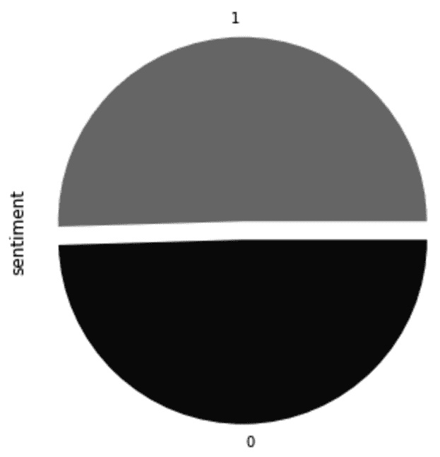

在调整 pandas 的设置以在每个单元格中显示更多字符后，我们还可以使用下面的代码显示一些例句:

7.  我将`random_state`设置为任意值，以确保我们都获得相同的样本，如下所示:

```py
pd.options.display.max_colwidth = 90
df[['text', 'sentiment']].sample(5, random_state=42)
```

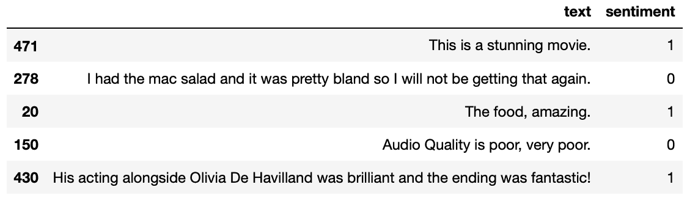

准备数据

## 现在我们需要为分类器准备数据来使用它:

正如我们通常所做的，我们首先将数据帧分成训练集和测试集。我保留了 40%的数据集用于测试，并将`random_state`设置为任意值，以确保我们都获得相同的随机分割:

1.  然后，我们从情感列中获取标签，如下所示:

```py
from sklearn.model_selection import train_test_split
df_train, df_test = train_test_split(df, test_size=0.4, random_state=42)
```

2.  至于文字特征，我们用`CountVectorizer`转换一下。我们将包括一元模型以及二元模型和三元模型。我们还可以通过将`min_df`设置为`3`来排除出现在少于三个文档中的单词，从而忽略罕见的单词。这对于消除拼写错误和干扰符号是一个有用的实践。最后，我们可以从字母中去掉重音符号，并将它们转换成`ASCII`:

```py
y_train = df_train['sentiment']
y_test = df_test['sentiment']
```

3.  最后，我们可以使用朴素贝叶斯分类器对数据进行分类。我们为模型设置了`fit_prior=True`,以使用训练数据中类别标签的分布作为其先验:

```py
from sklearn.feature_extraction.text import CountVectorizer

vec = CountVectorizer(ngram_range=(1,3), min_df=3, strip_accents='ascii')
x_train = vec.fit_transform(df_train['text'])
x_test = vec.transform(df_test['text'])
```

4.  这一次，我们以前的良好准确性分数可能不够翔实。我们想知道我们每一类有多准确。此外，根据我们的用例，我们可能需要判断模型是否能够识别所有负面推文，即使它以错误分类一些正面推文为代价。为了能够获得这些信息，我们需要使用`precision`和`recall`分数。

```py
from sklearn.naive_bayes import MultinomialNB
clf = MultinomialNB(fit_prior=True)
clf.fit(x_train, y_train)
y_test_pred = clf.predict(x_test)
```

精确度、召回率和 F1 分数

## 在被分配到阳性类别的样本中，它们实际为阳性的百分比是该类别的**精度**。对于正面推文，分类器正确预测为正面推文的百分比是该类别的**召回**。如您所见，精度和召回率是按类计算的。下面是我们如何用真阳性和假阳性来正式表示**精度分数**:

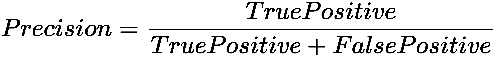

**召回分数**用真阳性和假阴性 *:* 表示

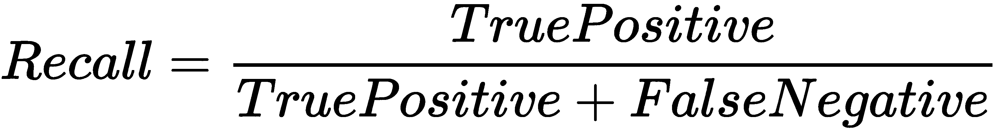

要将前面两个分数汇总成一个数，可以用 *F [1] 分数*。它使用以下公式将精确度和召回分数结合起来:

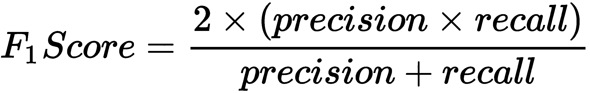

在这里，我们为我们的分类器计算三个上述度量:

为了清楚起见，我将得到的指标放入下表。请记住，支持只是每个类中的样本数:

```py
p, r, f, s = precision_recall_fscore_support(y_test, y_test_pred)
```

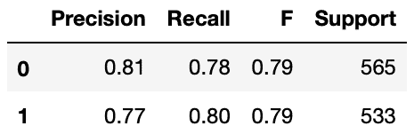

鉴于两个班级的规模几乎相等，我们的分数相当。在类别不平衡的情况下，更常见的是看到一个类别比另一个类别获得更高的精度或更高的召回率。

因为这些度量是按类标签计算的，所以我们也可以得到它们的宏观平均值。对于此处的示例，宏平均精度分数将是 **0.81** 和 **0.77** 的平均值，即 **0.79** 。另一方面，微观平均值基于真阳性、假阳性和假阴性样本的总数来计算这些分数。

管道

## 在前面的章节中，我们使用网格搜索来为我们的估计量寻找最优超参数。现在，我们有多个东西要同时优化。一方面，我们希望优化朴素贝叶斯超参数，但另一方面，我们也希望优化预处理步骤中使用的矢量器的参数。由于网格搜索只期望一个对象，scikit-learn 提供了一个`pipeline`包装器，我们可以在其中将多个转换器和估算器组合成一个。

顾名思义，管道由一组连续的步骤组成。这里我们从`CountVectorizer`开始，第二步也是最后一步是`MultinomialNB`:

除了最后一步中的对象外，所有对象都应该是`transformers`；也就是说，它们应该有`fit`、`transform`和`fit_transform`方法。最后一步中的对象应该是`estimator`，这意味着它应该有`fit`和`predict`方法。您还可以构建自定义的转换器和估算器，并在管道中使用它们，只要它们具有预期的方法。

```py
from sklearn.pipeline import Pipeline
from sklearn.feature_extraction.text import CountVectorizer
from sklearn.naive_bayes import MultinomialNB

pipe = Pipeline(steps=[
    ('CountVectorizer', CountVectorizer()), 
    ('MultinomialNB', MultinomialNB())]
)
```

现在我们已经准备好了我们的管道，我们可以把它插入到`GridSearchCV`中来寻找最优的超参数。

针对不同分数进行优化

### “可测量的东西会得到管理。”

彼得·德鲁克

当我们之前使用`GridSearchCV`时，我们没有指定我们想要为哪个度量优化我们的超参数。默认情况下使用分类器的准确性。或者，您也可以选择优化精确分数或召回分数的超参数。我们将在这里设置网格搜索，以优化宏精度分数。

我们首先设置我们想要搜索的不同超参数。因为我们在这里使用了管道，所以我们在每个超参数前加上指定步骤的名称，以便管道将参数分配给正确的步骤:

默认情况下，贝叶斯规则中的先验值`P(y)`是根据每个类别中的样本数设置的。但是，我们可以通过设置`fit_prior=False`将它们设置为所有类的常量。

```py
param_grid = {
    'CountVectorizer__ngram_range': [(1,1), (1,2), (1,3)],
    'MultinomialNB__alpha': [0.1, 1],
    'MultinomialNB__fit_prior': [True, False],
}
```

这里，我们运行`GridSearchCV`，同时让它知道我们最关心精度:

这为我们提供了以下超参数:

```py
from sklearn.model_selection import GridSearchCV
search = GridSearchCV(pipe, param_grid, scoring='precision_macro', n_jobs=-1)
search.fit(df_train['text'], y_train)
print(search.best_params_)
```

`ngram_range` : (1，3)

*   `alpha` : 1
*   `fit_prior`:假
*   我们得到了 80.5%的宏精度和 80.5%的宏召回率。

由于平衡的阶级分布，预计先验不会增加太多的价值。我们也得到了相似的精确度和回忆分数。因此，现在再次运行网格搜索来优化召回是没有意义的。无论如何，我们很可能会得到相同的结果。然而，当您处理高度不平衡的类时，事情可能会有所不同，您希望以牺牲其他类为代价最大化一个类的回忆。

在下一节中，我们将使用单词嵌入来表示我们的令牌。让我们看看这种形式的迁移学习是否有助于我们的分类器更好地执行。

创建自定义转换器

# 在结束本章之前，我们还可以创建一个基于`Word2Vec`嵌入的定制转换器，并在我们的分类管道中使用它来代替`CountVectorizer`。为了能够在管道中使用我们的定制转换器，我们需要确保它有`fit`、`transform`和`fit_transform`方法。

这是我们的新变压器，我们称之为`WordEmbeddingVectorizer`:

这里的`fit`方法是无效的——它不做任何事情，因为我们使用的是来自 spaCy 的预训练模型。我们可以使用新创建的转换器，如下所示:

```py
import spacy

class WordEmbeddingVectorizer:

    def __init__(self, language_model='en_core_web_md'):
        self.nlp = spacy.load(language_model)

    def fit(self):
        pass

    def transform(self, x, y=None):
        return pd.Series(x).apply(
            lambda doc: self.nlp(doc).vector.tolist()
        ).values.tolist()

    def fit_transform(self, x, y=None):
        return self.transform(x)
```

除了朴素贝叶斯分类器，我们还可以将这个转换器与其他分类器一起使用，比如`LogisticRegression`或`Multi-layer Perceptron`。

```py
vec = WordEmbeddingVectorizer()
x_train_w2v = vec.transform(df_train['text'])
```

pandas 中的`apply`功能可能会很慢，尤其是在处理大量数据时。我喜欢使用名为`tqdm`的库，它允许我用`progress_apply()`替换`apply()`方法，然后在运行时显示进度条。导入库后你要做的就是运行`tqdm.pandas()`；这将把`progress_apply()`方法添加到 pandas 系列和 DataFrame 对象中。有趣的事实:`tqdm`这个词在阿拉伯语中是进步的意思。

摘要

# 就我个人而言，我发现自然语言处理领域非常令人兴奋。我们人类的绝大多数知识都包含在书籍、文档和网页中。知道如何自动提取这些信息，并在机器学习的帮助下组织这些信息，对于我们的科学进步和自动化努力至关重要。这就是为什么多个科学领域，如信息检索、统计学和语言学，相互借鉴思想，试图从不同的角度解决同一个问题。在这一章中，我们还借鉴了所有这些领域的思想，并学习了如何以适合机器学习算法的格式来表示文本数据。我们还了解了 scikit-learn 提供的用于帮助构建和优化端到端解决方案的实用程序。我们还遇到了迁移学习等概念，我们能够将 spaCy 的语言模型无缝地整合到 scikit-learn 中。

从下一章开始，我们将讨论稍微高级一点的话题。在下一章，我们将学习人工神经网络(多层感知器)。这是时下非常热门的话题，理解它的主要概念有助于任何想更深入深度学习的人。由于神经网络通常用于图像处理，我们将抓住机会在第[章第 5](https://cdp.packtpub.com/hands_on_machine_learning_with_scikit_learn/wp-admin/post.php?post=28&action=edit) 节“最近邻图像处理”中学到的基础上，进一步扩展我们的图像处理知识。

From the next chapter, we are going to deal with slightly advanced topics. In the next chapter, we will learn about artificial neural networks (multi-layer perceptron). This is a very hot topic nowadays, and understanding its main concepts helps anyone who wants to get deeper into deep learning. Since neural networks are commonly used in image processing, we will seize the opportunity to build on what we learned in [Chapter 5](https://cdp.packtpub.com/hands_on_machine_learning_with_scikit_learn/wp-admin/post.php?post=28&action=edit), Image Processing with Nearest Neighbors and expand our image processing knowledge even further.************