阅读新闻文章或遇到误用术语*深度学习*代替*机器学习*的人并不罕见。这是因为机器学习的这个特定子领域已经非常成功地解决了大量以前无法解决的图像处理和自然语言处理问题。这一成功导致许多人将子字段与其父字段混淆。

术语*深度学习*指的是深度**人工神经网络** ( **ANNs** )。后一个概念有不同的形式和形状。在这一章中，我们将涵盖被称为**多层感知器** ( **MLP** )的**前馈神经网络**的一个子集。它是最常用的类型之一，由 scikit-learn 实现。顾名思义，它由多层组成，是一个前馈网络，因为各层之间没有循环连接。层次越多，网络越深。这些深度网络可以以多种形式存在，比如 **MLP** 、**卷积神经网络**(**CNN**)，或者**长短期记忆** ( **LSTM** )。scikit-learn 没有实现后两个，但这不会阻止我们讨论 CNN 背后的主要概念，并使用科学 Python 生态系统中的工具手动模仿它们。

在本章中，我们将讨论以下主题:

*   了解 MLP
*   衣物分类
*   解开缠绕
*   MLP 回归变量

# 了解 MLP

当学习一个新算法时，您可能会因为超参数的数量而感到气馁，并发现很难决定从哪里开始。因此，我建议从回答以下两个问题开始:

*   算法是如何构建的？
*   算法是如何训练的？

在接下来的部分中，我们将回答这两个问题，并逐一了解相应的超参数。

## 理解算法的架构

幸运的是，我们在[第 3 章](f5590b35-517b-42bb-821f-66d4fdc8059a.xhtml)、*用线性方程做出决策*中获得的关于线性模型的知识，将在这里给我们一个良好的开端。简而言之，线性模型可以在下图中概述:

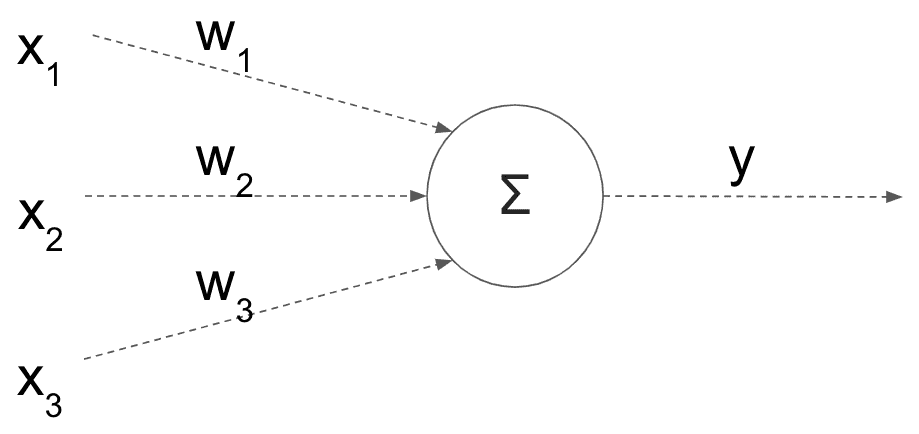

每个输入特征(x [i] )乘以一个权重(w [i] )，这些乘积之和就是模型的输出(y)。此外，我们有时会添加额外的偏差(阈值)及其权重。然而，线性模型的一个主要问题是它们实际上是线性的(咄！).此外，每个要素都有自己的权重，而不考虑其相邻要素。这种简单的架构阻止了模型捕捉其特征之间的任何交互。因此，您可以将更多的层堆叠在一起，如下所示:

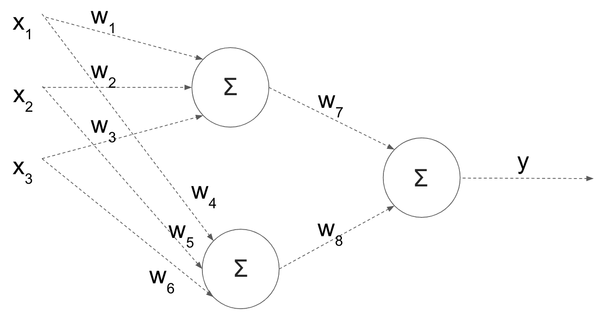

这听起来像是一个潜在的解决方案；然而，基于简单的数学推导，这些乘法和求和的组合仍然可以简化为单个线性方程。就好像所有这些层都没有任何作用。因此，为了达到预期的效果，我们希望在每次求和后应用非线性变换。这些非线性变换被称为激活函数，它们将模型转化为非线性模型。让我们看看它们在模型中的位置，然后我会进一步解释:

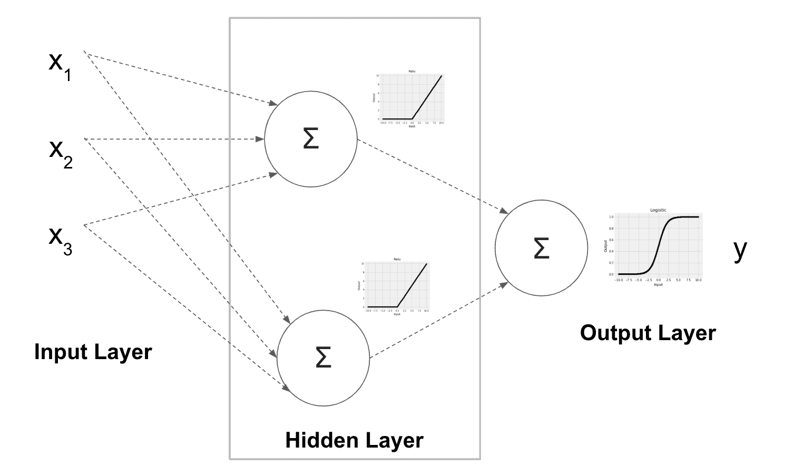

这个模型有一个单独的隐藏层，有两个隐藏节点，显示在方框内。在实践中，您可能有多个带有多个节点的隐藏层。前述激活函数应用于隐藏节点的输出端。这里，我们使用了一个**R**修正的线性单元 ( **ReLU** )，它是一个激活函数；对于负值，它返回`0`，并保持正值不变。除了`relu`功能，隐藏层还支持`identity`、`logistic`和`tanh`激活功能，这些功能使用`activation`超参数设置。以下是这四种激活功能的外观:

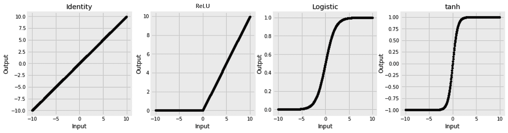

如前所述，由于`identity`函数在没有任何非线性变换的情况下保持其输入不变，因此很少使用，因为它最终会将模型简化为简单的线性模型。它还被诅咒有一个恒定的梯度，这对于用于训练的梯度下降算法没有太大的帮助。因此，`relu`函数通常是一个很好的非线性选择。这是当前的默认设置，是很好的首选；下一个可选选项是`logistic`或`tanh`激活功能。

输出层也有自己的激活功能，但它服务于不同的目的。如果你还记得第三章、*用线性方程做决策、*中的[我们使用了`logistic`函数将线性回归转化为分类器，也就是逻辑回归。输出的激活功能在这里也起着完全相同的作用。此列表列出了可能的输出激活功能及其相应的用例:](f5590b35-517b-42bb-821f-66d4fdc8059a.xhtml)

*   **恒等函数**:使用`MLPRegressor`进行回归时设定
*   **逻辑功能**:使用`MLPClassifier`进行二元分类时设置
*   **Softmax 功能** : **使用`MLPClassifier`区分三个或更多类别时设置**

 **我们不手动设置输出激活功能；基于是否使用`MLPRegressor`或`MLPClassifier`以及后者可用于分类的类别数量，自动选择它们。

如果我们观察网络架构，很明显，要设置的另一个重要的超参数是隐藏层数和每层中的节点数。这是使用接受元组的`hidden_layer_sizes` *超参数设置的。为了实现上图中的架构，即一个隐藏层有两个节点，我们将把`hidden_layer_sizes`设置为`2`。设置它为`(10, 10, 5)`给我们三个隐藏层；前两个各有 10 个节点，而第三个有 5 个节点。*

 *## 训练神经网络

“心理学家告诉我们，为了从经验中学习，两个因素是必要的:频繁的练习和即时的反馈。”

理查德·塞勒

研究人员的大部分时间都花在改进他们的神经网络训练上。这也反映在与所使用的训练算法相关的超参数的数量上。为了更好地理解这些超参数，我们需要检查以下训练工作流程:

1.  获取训练样本的子集。
2.  在网络上运行它们并做出预测。
3.  通过比较实际值和预测值来计算训练损失。
4.  使用计算的损失来更新网络权重。
5.  返回*步骤 1* 获取更多样本，如果所有样本都已使用，则反复检查训练数据，直到训练过程收敛。

逐一查看这些步骤，您会发现在第一阶段需要设置训练子集的大小。这是`batch_size`参数设置的内容。正如我们稍后将看到的，您可以从一次使用一个样本，到一次使用整个训练集，再到两者之间的任何东西。第一步和第二步很简单，但是第三步要求我们应该知道使用哪个损失函数。至于可用的损失函数，我们在使用 scikit-learn 时没有太多选择。我们在进行分类时选择了一个**对数损失函数**，并且**均方误差**是可用于回归的。第四步是最棘手的部分，需要设置最多的超参数。我们计算损失函数相对于网络权重的梯度。

这个梯度告诉我们减少损失函数的方向。换句话说，我们使用梯度来更新权重，希望可以迭代地将损失函数降低到最小值。负责该操作的逻辑被称为求解器。不过，解决者应该有自己独立的部分，稍后会有。最后，我们反复检查训练数据的次数称为时期，使用`max_iter`超参数设置。如果模型不再学习，我们也可以决定更早停止(`early_stopping`)。`validation_fraction`、`n_iter_no_change`和`tol`超参数帮助我们决定何时停止。下一节将详细介绍它们是如何工作的。

### 配置解算器

在计算损失函数(也称为成本或目标函数)后，我们需要找到使损失函数最小的最佳网络权重。在第 3 章、*的[线性模型中，用线性方程](f5590b35-517b-42bb-821f-66d4fdc8059a.xhtml)*决策，损失函数选择为凸的。如下图所示，凸函数有一个最小值，它既是全局最小值也是局部最小值。当试图优化这个函数时，这简化了求解者的工作。在非线性神经网络的情况下，损失函数通常是非凸的，这需要在训练期间格外小心，因此这里对求解器给予更多关注:

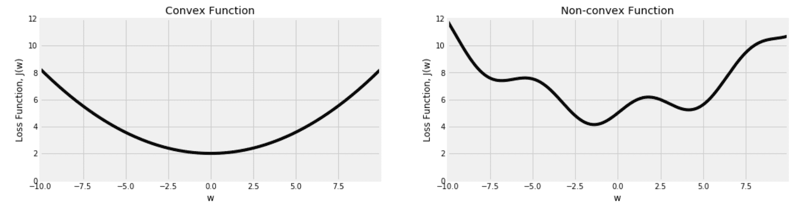

MLP 支持的解算器可以分为**有限内存****Broyden–Fletcher–Goldfarb–Shanno**(**LBFGS**)和**梯度下降** ( **随机梯度下降** ( **SGD** )和 **Adam)。在这两个变体中，我们想要在损失函数上选取一个随机点，计算它的斜率(梯度)，并使用它来计算我们下一步应该向哪个方向移动。请记住，在现实中，我们处理的是比这里显示的二维图形更高的维度。此外，我们通常不能像现在这样看到整个图表:**

 ***   **LBFGS** 算法使用斜率(一阶导数)和斜率变化率(二阶导数)，这有助于提供更好的覆盖范围；但是，它不能很好地与训练数据的大小成比例。它的训练速度可能非常慢，因此建议将该算法用于较小的数据集，除非有更强大的并发机器来拯救它。
*   **梯度下降** **算法仅依赖于一阶导数。因此，需要更多的努力来帮助它有效地移动。计算出的梯度与`learning_rate`结合。这将控制在计算梯度后每次移动的量。移动太快可能导致过冲和错过局部最小值，而移动太慢可能导致算法不能足够快地收敛。我们以`learning_rate_init`定义的速率开始我们的探索。如果我们设置`learning_rate='constant'`，初始速率在整个训练过程中保持不变。否则，我们可以将速率设置为随着每一步而降低(在缩放中)，或者仅在模型不再能够学习足够的内容时降低(自适应)。**
***   **梯度下降**可以使用整个训练数据计算梯度，一次使用单个样本(`sgd`，或者在小的子集内消耗数据(小批量梯度下降)。这些选择由`batch_size`控制。拥有一个无法放入内存的数据集可能会阻止我们一次使用整个数据集，而使用小批量可能会导致损失函数波动。在下一节中，我们将在实践中看到这种效果。*   学习率的问题是，它不适应曲线的形状，尤其是因为我们在这里只使用一阶导数。我们要控制学习速度，取决于脚下的曲线有多陡。使学习过程更加智能的一个值得注意的调整是`momentum`的概念。这基于当前和先前的更新来调整学习过程。默认情况下,`sgd`解算器启用`momentum`,可以使用`momentum`超参数设置其大小。`adam`解算器结合了这一概念，并将其与计算每个网络权重的单独学习率的能力相结合。通过`beta_1`和`beta_2`参数化。它们通常分别保持默认值`0.9`和`0.999`。`adam`解算器是默认解算器，因为与`sgd`解算器相比，它需要较少的调整工作。然而，如果调整正确，`sgd`解算器可以收敛到更好的解。*   最后，决定何时停止训练过程是另一个需要做出的重要决定。我们在数据上循环不止一次，受`max_iter`设置的限制。然而，如果我们觉得我们学得不够，我们可以在到达`max_iter`之前停下来。我们使用`tol`来定义多少学习是足够的，然后我们可以立即停止训练过程，或者在我们决定停止它之前再给它几次机会(`n_iter_no_change`)。此外，我们可以将训练的一部分单独放在一边(`validation_fraction`)，用它来更好地评估我们的学习过程。然后，如果我们设置`early_stopping =True`，一旦验证集的改进没有达到 **`n_iter_no_change`时期的`tol`阈值，训练过程将停止。****

 ****既然我们对事物如何工作有了一个很好的高层次的了解，我觉得最好的前进方式是将所有这些超参数付诸实践，并观察它们对真实数据的影响。在下一节中，我们将加载一个影像数据集，并使用它来了解有关上述超参数的更多信息。

# 衣物分类

在这一部分，我们将根据服装的图片对它们进行分类。我们将使用 Zalando 发布的数据集。Zalando 是一家位于柏林的电子商务网站。他们发布了一个包含 7 万张服装图片及其标签的数据集。每个项目属于以下 10 个标签之一:

```
{ 0: 'T-shirt/top ', 1: 'Trouser  ', 2: 'Pullover  ', 3: 'Dress  ', 4: 'Coat  ', 5: 'Sandal  ', 6: 'Shirt  ', 7: 'Sneaker  ', 8: 'Bag  ', 9: 'Ankle boot' }
```

数据发布在 OpenML 平台上，因此我们可以使用 scikit-learn 中的内置下载器轻松下载。

## 下载时尚 MNIST 数据集

OpenML 平台上的每个数据集都有一个特定的 ID。我们可以将这个 ID 给`fetch_openml()`来下载所需的数据集，如下所示:

```
from sklearn.datasets import fetch_openml
fashion_mnist = fetch_openml(data_id=40996) 
```

类别标签以数字的形式给出。为了提取他们的名字，我们可以从描述中解析下面一行，如下所示:

```
labels_s = '0 T-shirt/top \n1 Trouser \n2 Pullover \n3 Dress \n4 Coat \n5 Sandal \n6 Shirt \n7 Sneaker \n8 Bag \n9 Ankle boot'

fashion_label_translation = {
    int(k): v for k, v in [
        item.split(maxsplit=1) for item in labels_s.split('\n')
    ]
}

def translate_label(y, translation=fashion_label_translation):
    return pd.Series(y).apply(lambda y: translation[int(y)]).values
```

我们还可以创建一个类似于我们在[第 5 章](b95b628d-5913-477e-8897-989ce2afb974.xhtml)、*最近邻图像处理、*中创建的函数，以显示数据集中的图像:

```
def display_fashion(img, target, ax):

    if len(img.shape):
        w = int(np.sqrt(img.shape[0]))
        img = img.reshape((w, w))

    ax.imshow(img, cmap='Greys')
    ax.set_title(f'{target}')
    ax.grid(False)

```

前面的函数期望除了显示图像的`matplotlib`轴之外，还有一个图像和一个目标标签。我们将在接下来的章节中看到如何使用它。

## 为分类准备数据

当开发一个模型并优化它的超参数时，您将需要一遍又一遍地运行它。因此，建议您从较小的数据集开始工作，以最大限度地减少训练时间。一旦您获得了一个可接受的模型，您就可以添加更多的数据并进行最终的超参数调整。稍后，我们将看到如何判断手头的数据是否足够，以及是否需要更多的样本；但是现在，让我们坚持 10，000 幅图像的子集。

当从原始数据集中采样以及将采样数据分成训练集和测试集时，我有意避免设置任何随机状态。由于没有设置随机状态，您应该预料到每次运行的最终结果会有所不同。我做这个选择是因为我在这里的主要目的是关注基本的概念，我不想让你纠结于最终的结果。最后，您将在现实生活场景中处理的数据将因问题而异，我们已经在前面的章节中学习了如何通过交叉验证来更好地了解我们的模型性能的界限。因此，在这一章中，就像在本书的许多其他章节中一样，如果提到的模型的准确性数字、系数或学习行为与你的略有不同，不要太担心。

我们将使用两次`train_test_split()`函数。最初，我们将使用它进行采样。之后，我们将重用它，用于将数据分成训练集和测试集的指定目的:

```
from sklearn.model_selection import train_test_split

fashion_mnist_sample = {}

fashion_mnist_sample['data'], _, fashion_mnist_sample['target'], _ = train_test_split(
    fashion_mnist['data'], fashion_mnist['target'], train_size=10000
)

x, y = fashion_mnist_sample['data'], fashion_mnist_sample['target']
x_train, x_test, y_train, y_test = train_test_split(x, y, test_size=0.2)
```

这里的像素取值在`0`和`255`之间。通常，这是好的；然而，当数据放入更紧的范围时，我们将使用的求解器收敛得更好。`MinMaxScaler`将帮助我们实现这一点，如下面的代码所示，而`StandardScaler`也是一个选项:

```
from sklearn.preprocessing import MinMaxScaler

scaler = MinMaxScaler()

x_train = scaler.fit_transform(x_train)
x_test = scaler.transform(x_test)
```

现在，我们可以使用在上一节中创建的函数将数字标签转换为名称:

```
translation = fashion_label_translation
y_train_translated = translate_label(y_train, translation=translation)
y_test_translated = translate_label(y_test, translation=translation)
```

如果您的原始标签是字符串，您可以使用`LabelEncoder`将它们转换成数值:

```
from sklearn.preprocessing import LabelEncoder

le = LabelEncoder()
y_train_encoded = le.fit_transform(y_train_translated)
y_test_encoded = le.transform(y_test_translated)
```

最后，让我们使用下面的代码来看看图像是什么样子的:

```
import random 

fig, axs = plt.subplots(1, 10, figsize=(16, 12))

for i in range(10):
    rand = random.choice(range(x_train.shape[0]))
    display_fashion(x_train[rand], y_train_translated[rand], axs[i])

fig.show()
```

在这里，我们看到 10 张随机图片和它们的标签。我们循环遍历 10 个随机图像，并使用我们之前创建的显示函数将它们并排显示:

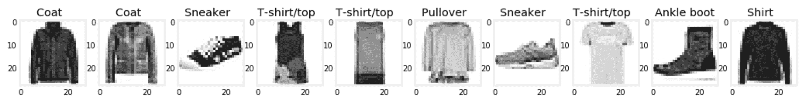

现在数据已经准备好了，是时候看看超参数在实践中的效果了。

## 体验超参数的影响

神经网络训练完成后，你可以检查它的权重(`coefs_`)、截距(`intercepts_`)和损失函数的最终值(`loss_`)。一条额外的信息是每个历元之后计算的损失(`loss_curve_`)。这种计算损失的轨迹对于学习过程非常有用。

这里，我们训练一个具有两个隐藏层的神经网络，每个隐藏层有 100 个节点，我们将最大历元数设置为`500`。我们暂时保留所有其他超参数的默认值:

```
from sklearn.neural_network import MLPClassifier
clf = MLPClassifier(hidden_layer_sizes=(100, 100), max_iter=500)
clf.fit(x_train, y_train_encoded)
y_test_pred = clf.predict(x_test)
```

训练完网络后，我们可以使用以下代码行绘制损耗曲线:

```
pd.Series(clf.loss_curve_).plot(
    title=f'Loss Curve; stopped after {clf.n_iter_} epochs'
)
```

这给了我们下图:

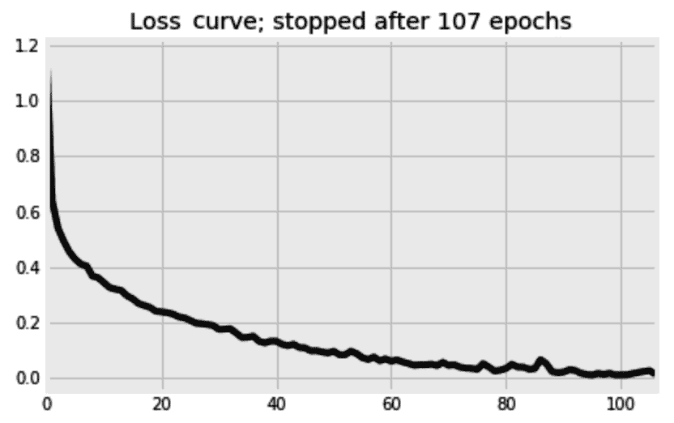

尽管算法被告知继续学习多达`500`个时期，但它在第 107 ^个时期后停止。`n_iter_no_change`的默认值是`10`历元。这意味着自第 97 ^个时期以来，学习率没有得到足够的提高，因此网络在 10 个时期后停止运行。请记住，默认情况下`early_stopping`被设置为`False`，这意味着无论默认情况下被搁置的`10%`验证集如何，都会做出这个决定。如果我们想将验证集用于提前停止决策，我们应该设置`early_stopping=True`。

### 学习不要太快也不要太慢

如前所述，损失函数( *J* )相对于权重( *w* )的梯度用于更新网络的权重。根据以下等式进行更新，其中 *lr* 是学习率:

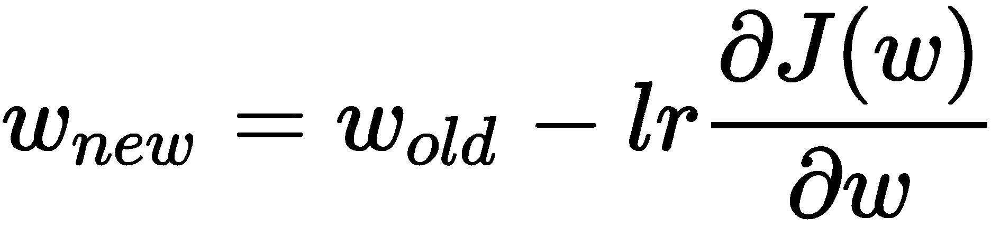

你可能想知道学习率的必要性；为什么我们不通过设置 *lr = 1* 来直接使用渐变呢？在本节中，我们将通过见证学习率对训练过程的影响来回答这个问题。

MLP 估计器中另一个隐藏的宝石是`validation_scores_`。和`loss_curve_`一样，这个也没有文档，它的接口可能会随着未来的发布而改变。在`MLPClassifier`的情况下，`validation_scores_`跟踪验证集上分类器的准确性，而对于`MLPRegressor`，它跟踪回归变量的 R ² 分数。

我们将使用验证分数(`validation_scores_`)来查看不同学习率的效果。由于这些分数仅在`early_stopping`设置为`True`时存储，并且我们不想过早停止，我们也将`n_iter_no_change`设置为与`max_iter`相同的值，以取消过早停止的影响。

默认学习率为`0.001`，默认在训练过程中保持不变。这里，我们将采用更小的训练数据子集—1000 个样本—并尝试从`0.0001`到`1`的不同学习率:

```
from sklearn.neural_network import MLPClassifier

learning_rate_init_options = [1, 0.1, 0.01, 0.001, 0.0001]

fig, axs = plt.subplots(1, len(learning_rate_init_options), figsize=(15, 5), sharex=True, sharey=True)

for i, learning_rate_init in enumerate(learning_rate_init_options):

    print(f'{learning_rate_init} ', end='')

    clf = MLPClassifier(
        hidden_layer_sizes=(500, ), 
        learning_rate='constant',
        learning_rate_init=learning_rate_init,
        validation_fraction=0.2,
        early_stopping=True, 
        n_iter_no_change=120,
        max_iter=120, 
        solver='sgd',
        batch_size=25,
        verbose=0,
    )

    clf.fit(x_train[:1000,:], y_train_encoded[:1000])

    pd.Series(clf.validation_scores_).plot(
        title=f'learning_rate={learning_rate_init}', 
        kind='line', 
        color='k',
        ax=axs[i]
    )

fig.show()
```

下图比较了不同学习率下验证分数的进度。为了简洁起见，省略了用于格式化轴的代码:

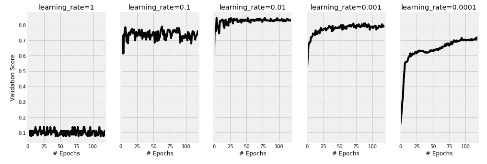

我们可以看到，当设置学习率为`1`时，网络无法学习，准确率停留在 10%左右。这是因为用于更新权重的较大的步长导致梯度下降过冲并错过局部最小值。理想情况下，我们希望梯度下降在曲线上明智地移动；它不应该匆忙错过最佳解决方案。另一方面，我们可以看到，一个非常慢的学习速率`0.0001`，导致网络永远需要训练。很明显，划时代是不够的，还需要更多的划时代。对于这个例子，一个学习率`0.01`看起来是一个很好的平衡。

学习率的概念通常用于迭代方法中，以防止超调。它可能有不同的名称和不同的理由，但本质上，它服务于相同的目的。例如，在**强化学习**字段中，**贝尔曼方程**中的**折扣因子**可能类似于这里的学习率。

### 选择合适的批量

在处理海量训练数据时，您不希望在计算梯度时一次性使用所有数据，尤其是在内存中无法容纳这些数据的情况下。在小的子集中使用数据是我们可以配置的。在这里，我们将尝试不同的批量，同时保持其他一切不变。请记住，当`batch_size`设置为`1`时，模型会非常慢，因为它会在每个训练实例后更新其权重:

```
from sklearn.neural_network import MLPClassifier

batch_sizes = [1, 10, 100, 1500]

fig, axs = plt.subplots(1, len(batch_sizes), figsize=(15, 5), sharex=True, sharey=True)

for i, batch_size in enumerate(batch_sizes):

    print(f'{batch_size} ', end='')

    clf = MLPClassifier(
        hidden_layer_sizes=(500, ), 
        learning_rate='constant',
        learning_rate_init=0.001, 
        momentum=0,
        max_iter=250, 
        early_stopping=True,
        n_iter_no_change=250,
        solver='sgd',
        batch_size=batch_size,
        verbose=0,
    )

    clf.fit(x_train[:1500,:], y_train_encoded[:1500])

    pd.Series(clf.validation_scores_).plot( 
        title=f'batch_size={batch_size}',
        color='k',
        kind='line', 
        ax=axs[i]
    )

fig.show()
```

该图直观地比较了四种批量设置及其效果。为简洁起见，省略了部分格式化代码:

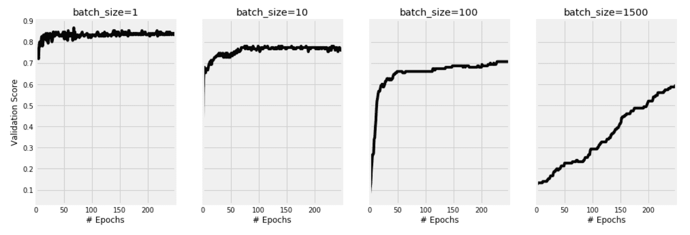

您可以看到为什么小批量梯度下降的使用正在成为从业者的规范，这不仅是因为内存限制，还因为小批量有助于我们的模型更好地学习。尽管较小批量的验证分数波动较大，但还是获得了这一最终结果。另一方面，将`batch_size`设置为`1`会减慢学习过程。

到目前为止，我们已经调整了多个超参数，并见证了它们对训练过程的影响。除了这些超参数之外，还有两个问题有待回答:

*   多少训练样本就够了？
*   多少个纪元就够了？

### 检查是否需要更多的训练样本

我们希望比较在使用 75%、50%、25%、10%和 5%的训练样本时，使用整个训练样本(100%)的情况。`learning_curve`函数对于这种比较很有用。它使用交叉验证来计算不同样本大小的平均训练和测试分数。这里，我们将定义不同的采样比率，并指定需要三重交叉验证:

```
from sklearn.model_selection import learning_curve

train_sizes = [1, 0.75, 0.5, 0.25, 0.1, 0.05]

train_sizes, train_scores, test_scores = learning_curve(
    MLPClassifier(
        hidden_layer_sizes=(100, 100), 
        solver='adam',
        early_stopping=False
    ), 
    x_train, y_train_encoded,
    train_sizes=train_sizes,
    scoring="precision_macro",
    cv=3,
    verbose=2,
    n_jobs=-1
)
```

完成后，我们可以使用下面的代码来绘制样本量增加时的训练进度和测试分数:

```
df_learning_curve = pd.DataFrame(
    {
        'train_sizes': train_sizes,
        'train_scores': train_scores.mean(axis=1),
        'test_scores': test_scores.mean(axis=1)
    }
).set_index('train_sizes')

df_learning_curve['train_scores'].plot(
    title='Learning Curves', ls=':',
)

df_learning_curve['test_scores'].plot(
    title='Learning Curves', ls='-',
)
```

结果图显示了随着训练数据的增加，分类器的准确度增加。请注意，训练分数是恒定的，而测试分数是我们真正关心的，在一定数量的数据之后，它似乎饱和了:

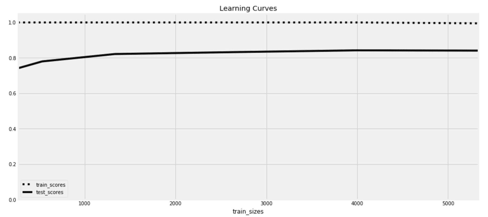

在本章的前面，我们从最初的 70，000 幅图像中抽取了 10，000 幅图像作为样本。然后，我们将其分成 8，000 份用于训练，2，000 份用于测试。从学习曲线图中，我们可以看到，满足于更小的训练集是可能的。在 2000 次之后，额外的样本不会增加多少价值。

通常，我们希望使用尽可能多的数据样本来训练我们的模型。然而，当调整模型的超参数时，您需要折衷，使用较小的样本来加快开发过程。完成后，建议在整个数据集上训练最终模型。

### 检查是否需要更多的纪元

这一次，我们将使用`validation_curve`功能。它的工作方式类似于`learning_curve`函数，但它不是比较不同的训练样本大小，而是比较不同的超参数设置。这里，我们将看到对`max_iter`使用不同值的效果:

```
from sklearn.model_selection import validation_curve

max_iter_range = [5, 10, 25, 50, 75, 100, 150]

train_scores, test_scores = validation_curve(
    MLPClassifier(
        hidden_layer_sizes=(100, 100), 
        solver='adam',
        early_stopping=False
    ), 
    x_train, y_train_encoded,
    param_name="max_iter", param_range=max_iter_range,
    scoring="precision_macro",
    cv=3,
    verbose=2,
    n_jobs=-1
)
```

有了训练和测试分数，我们可以像在上一节中那样绘制它们，得到下图:

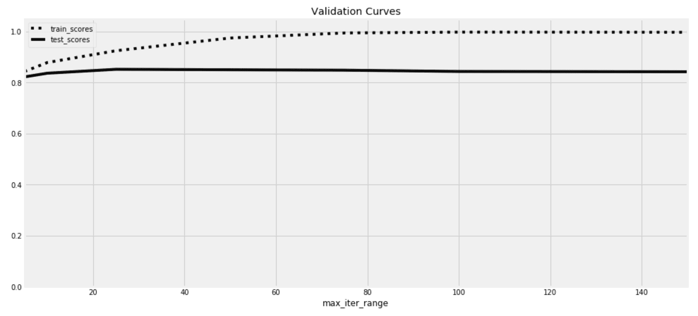

在这个例子中，我们可以看到测试分数在`25`时期后大致停止提高。训练分数继续提高，直到达到 100%，这是过度适应的症状。实际上，我们可能不需要这个图表，因为一旦我们已经学习了足够的知识，并且在我们过度拟合之前，我们使用`early_stopping`、`tol`和`n_iter_no_change`超参数来停止训练过程。

## 选择最佳架构和超参数

到目前为止，我们还没有谈到网络架构。我们应该有多少层，每层应该放多少个节点？我们也没有比较不同的激活函数。如您所见，有大量的超参数可供选择。在本书的前面，我们提到了诸如`GridSearchCV`和`RandomizedSearchCV`这样的工具，它们可以帮助您选择最佳的超参数。这些仍然是可以使用的好工具，但是如果我们决定使用它们来调整我们拥有的每个参数的每个可能值，它们就会太慢。当用于太多训练样本或太多时期时，它们也会变得太慢。

我们在前面章节中看到的工具应该通过排除一些超参数范围来帮助我们在稍小的干草堆中找到我们的针。它们还将允许我们坚持使用更小的数据集和更短的训练时间。然后，我们可以有效地使用`GridSearchCV`和`RandomizedSearchCV`来微调我们的神经网络。

在可能的情况下，也建议并行。`GridSearchCV`和**`RandomizedSearchCV`允许我们使用机器上的不同处理器同时训练多个模型。我们可以通过`n_jobs`设定来实现。这意味着您可以通过使用具有大量处理器的机器来显著加快超参数调优过程。至于数据大小，由于我们将执行 k 倍交叉验证，并且训练数据将被进一步拆分，因此我们应该添加比上一节中估计的数量更多的数据。现在，事不宜迟，让我们使用`GridSearchCV`来调整我们的网络:**

```
from sklearn.model_selection import GridSearchCV

param_grid = {
    'hidden_layer_sizes': [(50,), (50, 50), (100, 50), (100, 100), (500, 100), (500, 100, 100)],
    'activation': ['logistic', 'tanh', 'relu'],
    'learning_rate_init': [0.01, 0.001],
    'solver': ['sgd', 'adam'],
}

gs = GridSearchCV(
    estimator=MLPClassifier(
        max_iter=50,
        batch_size=50,
        early_stopping=True,
    ), 
    param_grid=param_grid,
    cv=4,
    verbose=2,
    n_jobs=-1
)

gs.fit(x_train[:2500,:], y_train_encoded[:2500])
```

它在四个 CPU 上运行了 14 分钟，选择了以下超参数:

*   **激活** : `relu`
*   **隐藏层尺寸** : `(500, 100)`
*   **初始学习率** : `0.01`
*   **解算器** : `adam`

所选模型在测试集上获得了 **85.6%** 的**微 F 值**。通过使用`precision_recall_fscore_support`函数，您可以更详细地看到哪些类比其他类更容易预测:

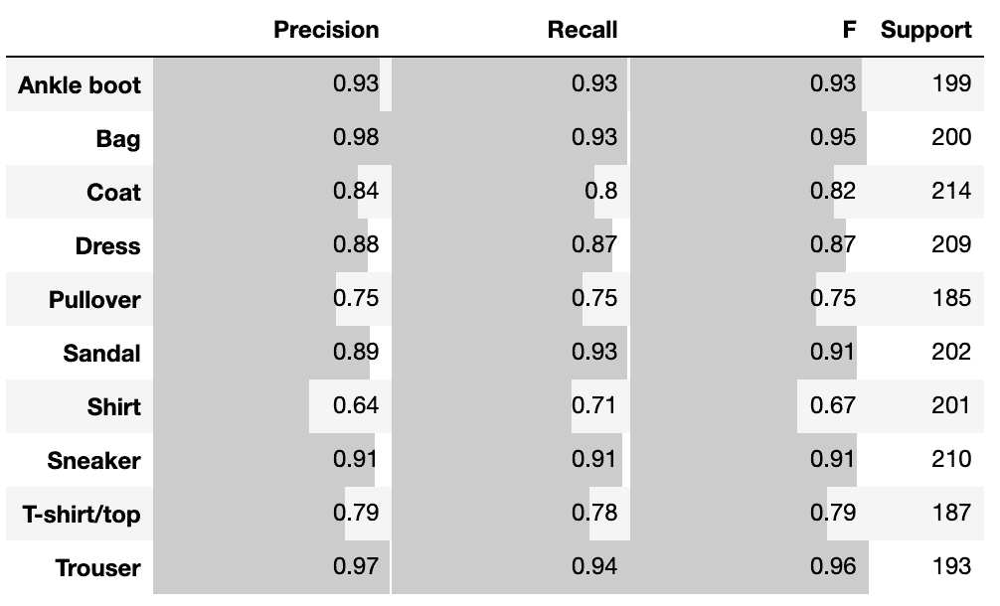

理想情况下，我们应该使用整个训练集再次训练，但我现在离开了这一点。最后，开发最佳神经网络通常被视为艺术和科学的结合。然而，了解您的超参数以及如何测量它们的影响应该是一件简单的事情。然后，像`GridSearchCV`和`RandomizedSearchCV`这样的工具供您使用，用于自动化部分流程。自动化多次胜过灵巧。

在进入下一个主题之前，我想稍微离题一下，向您展示如何构建自己的激活函数。

## 添加您自己的激活功能

许多激活函数的一个共同问题是消失梯度问题。如果您查看`logistic`和`tanh`激活功能的曲线，您可以看到，对于高正值和负值，曲线几乎是水平的。这意味着对于这些高值，曲线的梯度几乎是恒定的。这阻碍了学习过程。`relu`激活功能试图解决一个零件的这一问题，但未能处理负值。这促使研究人员不断提出不同的激活函数。这里，我们将比较 **ReLU** 激活与其修改版本 **Leaky ReLU** :

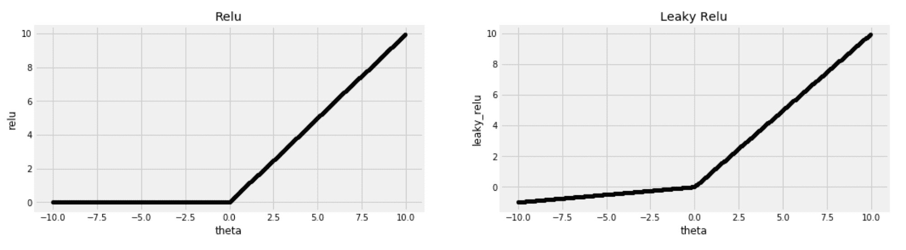

正如您在 **Leaky ReLU** 示例中看到的，对于负值，该线不再是恒定的，而是以很小的速率下降。为了添加 **Leaky ReLU** ，我不得不寻找`relu`函数是如何在 scikit 中构建的——学习并无耻地修改代码以满足我的需求。基本上有两种构建方法。这些方法在前向路径中使用，并且仅将激活函数应用于其输入，而第二种方法将激活函数的导数应用于计算的误差。为了简洁起见，我稍微修改了一下代码，下面是`relu`的两个现有方法:

```
def relu(X):
    return np.clip(X, 0, np.finfo(X.dtype).max)

definplace_relu_derivative(Z, delta):
    delta[Z==0] =0
```

在第一种方法中，NumPy 的`clip()`方法用于将负值设置为`0`。由于`clip`方法需要下界和上界，所以代码的隐含部分只需获取该数据类型的最大值，将其设置为上界。第二种方法获取激活函数的输出(`Z`)以及计算误差(`delta`)。它应该将误差乘以激活输出的梯度。然而，对于这个特定的激活函数，梯度是正值的`1`和负值的`0`。因此，对于负值，误差被设置为`0`——也就是说，每当`relu`返回`0`时，误差被设置为`0`。

`leaky_relu`保持正值不变，负值乘以一个小值`0.01`。现在，我们需要做的就是利用这些信息建立新的方法:

```
leaky_relu_slope = 0.01

def leaky_relu(X):
    X_min = leaky_relu_slope * np.array(X)
    return np.clip(X, X_min, np.finfo(X.dtype).max)

def inplace_leaky_relu_derivative(Z, delta):
    delta[Z < 0] = leaky_relu_slope * delta[Z < 0]
```

回想一下，`leaky_relu`的斜率对于正值是`1`，对于负值等于`leaky_relu_slope`常数。这就是为什么我们将δ乘以`Z`为负的部分乘以`leaky_relu_slope`。现在，在使用我们的新方法之前，我们必须将它们注入到 scikit-learn 的代码库中，如下所示:

```
from sklearn.neural_network._base import ACTIVATIONS, DERIVATIVES

ACTIVATIONS['leaky_relu'] = leaky_relu
DERIVATIVES['leaky_relu'] = inplace_leaky_relu_derivative
```

然后，您可以使用`MLPClassifier`,就好像它从一开始就存在一样:

```
clf = MLPClassifier(activation='leaky_relu')
```

像这样的黑客库迫使我们阅读它的源代码并更好地理解它。它还展示了开源的价值，在这里你不会被已经存在的东西所束缚。在下一节中，我们将继续破解并构建我们自己的卷积层。

# 解开缠绕

深入观察自然，你会更好地理解一切

阿尔伯特·爱因斯坦

关于使用神经网络对图像进行分类的任何一章都不允许在没有触及 CNN 的情况下结束。尽管 scikit-learn 没有实现卷积层，但我们仍然可以理解这个概念并了解它是如何工作的。

让我们从下面的 *5* x *5* 图像开始，看看如何对其应用卷积层:

```
x_example = array(
    [[0, 0, 0, 0, 0],
     [0, 0, 0, 0, 0],
     [0, 0, 1, 1, 0],
     [0, 0, 1, 1, 0],
     [0, 0, 0, 0, 0]]
)
```

在自然语言处理中，当涉及到特征提取时，单词通常充当字符和整个句子之间的中间地带。在这幅图像中，也许更小的斑块比单独的像素更能提供信息。本节的目标是找到在图像中表示这些小的 *2 x 2* 、 *3 x 3* 或 *N x N* 小块的方法。我们可以从平均值开始作为总结。我们基本上可以通过将每个 *3 x 3* 小块中的每个像素乘以 1，然后将总数除以 9，来取每个小块的平均值；补丁中有 9 个像素。对于边缘上的像素，由于它们在所有方向上都没有邻居，我们可以假设在图像周围有一个额外的 1 像素边界，其中所有像素都设置为 0。通过这样做，我们得到了另一个 *5 x 5* 数组。

这种操作被称为**卷积**，而 **SciPy** 提供了一种实现方式。使用的全 1 矩阵也称为内核或权重。这里，我们指定全 1 内核，然后除以 9。我们还通过将`mode`设置为`constant`并将`cval`设置为`0`来指定对全零边框的需求，如以下代码所示:

```
from scipy import ndimage

kernel = [[1,1,1],[1,1,1],[1,1,1]] 
x_example_convolve = ndimage.convolve(x_example, kernel, mode='constant', cval=0)
x_example_convolve = x_example_convolve / 9 
```

以下是原始图像和卷积输出之间的比较:

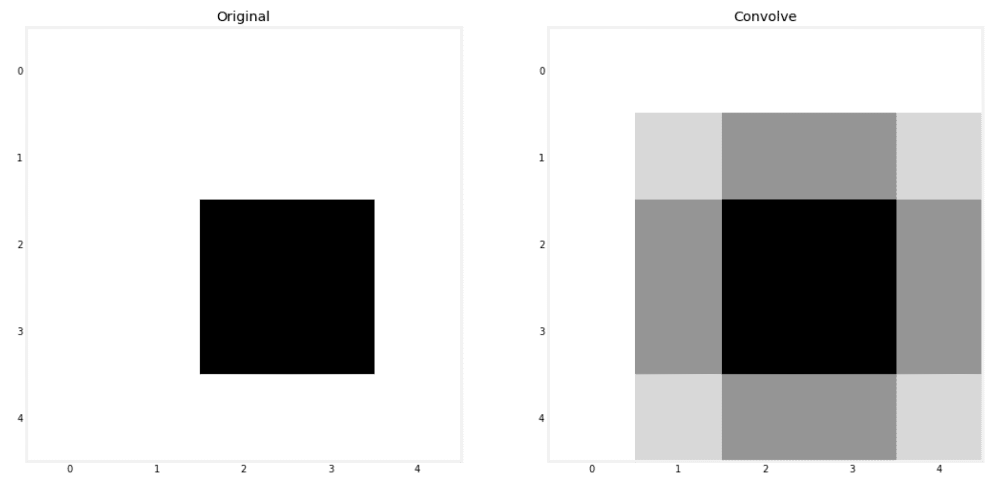

计算平均值给了我们原始图像的模糊版本，所以下次你需要模糊图像时，你知道该怎么做。将每个像素乘以一定的权重，计算这些乘积的总和，听起来像是一个线性模型。此外，我们可以将平均值视为所有权重都设置为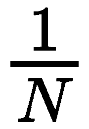的线性模型。因此，你可能会说，我们正在为图像的每个小块建立迷你线性模型。记住这个类比，但是现在，我们必须手动设置模型的权重。

虽然每个面片都获得与其他面片完全相同的线性模型，但是没有什么可以阻止每个面片内的像素乘以不同的权重。事实上，不同权重的核给出的效果是不同的。在下一部分，我们将见证不同内核对我们的**时尚-MNIST** 数据集的影响。

## 通过卷积提取特征

我们可以调整代码，一次卷积多个图像，而不是一个接一个地处理图像。我们的时尚-MNIST 数据集中的图像是扁平的，所以我们需要将它们分别整形为 *28* x *28* 像素。然后，我们使用给定的内核进行卷积，最后，使用我们最喜欢的`MinMaxScaler`参数确保所有像素值都在`0`和`1`之间:

```
from scipy import ndimage
from sklearn.preprocessing import MinMaxScaler

def convolve(x, kernel=[[1,1,1],[1,1,1],[1,1,1]]):
    w = int(np.sqrt(x.shape[1]))
    x = ndimage.convolve(
        x.reshape((x.shape[0], w, w)), [kernel], 
        mode='constant', cval=0.0
    ) 
    x = x.reshape(x.shape[0], x.shape[1]*x.shape[2]) 
    return MinMaxScaler().fit_transform(x)
```

接下来，我们可以使用它作为我们的训练和测试数据，如下所示:

```
sharpen_kernel = [[0,-1,0], [-1,5,-1], [0,-1,0]]
x_train_conv = convolve(x_train, sharpen_kernel)
x_test_conv = convolve(x_test, sharpen_kernel)
```

这里有几个内核:第一个用于锐化图像，然后是一个强调垂直边缘的内核，而最后一个强调水平边缘:

*   **锐化** : `[[0,-1,0], [-1,5,-1], [0,-1,0]]`
*   **V 形边缘** : `[[-1,0,1], [-2,0,2], [-1,0,1]]`
*   **H 边** : `[[-1,-2,-1], [0,0,0], [1,2,1]]`

将这些内核赋予我们刚刚创建的卷积函数将产生以下效果:

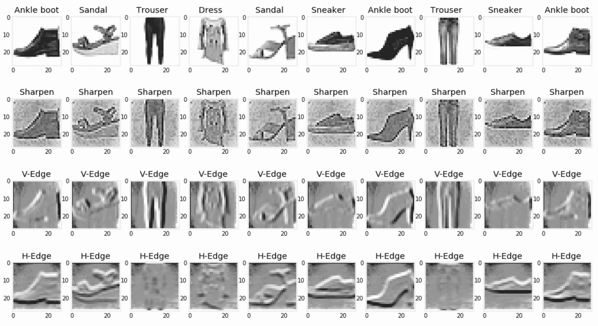

你可以在网上找到更多的内核，或者你也可以自己尝试，看看它们产生的效果。内核也是直观的；锐化内核明显给予中心像素比其周围更多的权重。

每一种不同的卷积变换都从我们的图像中捕捉某些信息。因此，我们可以将它们视为特征工程层，在这里我们提取特征以提供给我们的分类器。然而，数据的大小会随着我们附加到数据上的每个额外的卷积变换而增长。在下一节中，我们将看到如何处理这个问题。

## 通过最大池减少数据的维度

理想情况下，我们希望将来自多个先前卷积变换的输出输入到我们的神经网络中。然而，如果我们的图像由 784 个像素组成，那么仅连接三个卷积函数的输出将产生 2352 个特征， *784 x 3* 。这将会减慢我们的训练过程，正如我们在本书前面学到的，功能越多并不总是越好。

要将图像缩小到其大小的四分之一，即宽度的一半和高度的一半，您可以将它分成多个 *2 x 2* 小块，然后取每个小块中的最大值来代表整个小块。这正是**最大池**的作用。为了实现它，我们需要在您的计算机终端中使用`pip`安装另一个名为`scikit-image`的库:

```
pipinstallscikit-image
```

然后，我们可以创建最大池函数，如下所示:

```

from skimage.measure import block_reduce
from sklearn.preprocessing import MinMaxScaler

def maxpool(x, size=(2,2)):
    w = int(np.sqrt(x.shape[1]))
    x = np.array([block_reduce(img.reshape((w, w)), block_size=(size[0], size[1]), func=np.max) for img in x])
    x = x.reshape(x.shape[0], x.shape[1]*x.shape[2]) 
    return MinMaxScaler().fit_transform(x)
```

然后，我们可以将它应用于其中一个卷积的输出，如下所示:

```
x_train_maxpool = maxpool(x_train_conv, size=(5,5))
x_test_maxpool = maxpool(x_test_conv, size=(5,5))
```

在 *5 x 5* 补丁上应用最大池化会将我们的数据大小从 *28 x 28* 减少到 *6 x 6* ，这还不到其原始大小的 5%。

## 把所有的放在一起

scikit-learn 中的`FeatureUnion`流水线可以合并多个变压器的输出。换句话说，如果 scikit-learn 拥有可以对图像进行卷积的转换器，并且 max pool 这些卷积的输出，您将能够组合多个转换器的输出，每个转换器都有其特定的内核。幸运的是，我们可以自己建造这个变压器，并通过`FeatureUnion`组合它们的输出。我们只需要它们提供 fit、transform 和 fit_transform 方法，如下所示:

```
class ConvolutionTransformer:

    def __init__(self, kernel=[], max_pool=False, max_pool_size=(2,2)):
        self.kernel = kernel
        self.max_pool = max_pool
        self.max_pool_size = max_pool_size

    def fit(self, x):
        return x

    def transform(self, x, y=None):
        x = convolve(x, self.kernel)
        if self.max_pool:
            x = maxpool(x, self.max_pool_size)
        return x

    def fit_transform(self, x, y=None):
        x = self.fit(x)
        return self.transform(x)
```

您可以指定在初始化步骤中使用的内核。您也可以通过将`max_pool`设置为`False`来跳过最大共用部分。在这里，我们定义了三个内核，并在将每个 *4 x 4* 补丁合并到我们的图像中时组合它们的输出:

```
kernels = [
    ('Sharpen', [[0,-1,0], [-1,5,-1], [0,-1,0]]),
    ('V-Edge', [[-1,0,1], [-2,0,2], [-1,0,1]]),
    ('H-Edge', [[-1,-2,-1], [0,0,0], [1,2,1]]),
]

from sklearn.pipeline import FeatureUnion

funion = FeatureUnion(
    [
        (kernel[0], ConvolutionTransformer(kernel=kernel[1], max_pool=True, max_pool_size=(4,4)))
        for kernel in kernels
    ]
)

x_train_convs = funion.fit_transform(x_train)
x_test_convs = funion.fit_transform(x_test)
```

然后，我们可以将`FeatureUnion`管道的输出用于我们的神经网络，如下所示:

```
from sklearn.neural_network import MLPClassifier

mlp = MLPClassifier(
    hidden_layer_sizes=(500, 300),
    activation='relu',
    learning_rate_init=0.01,
    solver='adam',
    max_iter=80,
    batch_size=50,
    early_stopping=True,
)

mlp.fit(x_train_convs, y_train)
y_test_predict = mlp.predict(x_test_convs)
```

这个网络取得了 **79%** 的**微 F 分**。你可以尝试添加更多的内核并调整网络的超参数，看看我们是否能获得比没有卷积时更好的分数。

我们必须手动设置卷积的核权重。然后，我们展示了他们的输出，看看他们是否有直观的意义，并希望他们在使用时会提高我们的模型的性能。这听起来不像是真正的数据驱动方法。理想情况下，您会希望从数据中学习权重。这正是真正的 CNN 所做的。我建议你看看 TensorFlow 和 PyTorch 的 CNN 实现。如果你能把它们的准确性与我们在这里建立的模型进行比较，那就太好了。

# MLP 回归变量

除了`MLPClassifier`，还有它的回归子兄弟`MLPRegressor`。两者共享一个几乎相同的界面。两者的主要区别是各自使用的损失函数和输出层的激活函数。回归器优化平方损失，最后一层由身份函数激活。所有其他超参数都是相同的，包括隐藏层的四个激活选项。

这两个估计器都有一个`partial_fit()`方法。在估计器已经被安装之后，一旦您获得了额外的训练数据，您就可以使用它来更新模型。`MLPRegressor`中的`score()`计算回归量的**R *² ，*与分类器的精度相反，由`MLPClassifier` *计算。***

 ****# 摘要

我们现在已经对人工神经网络及其基础技术有了很好的理解。我推荐 TensorFlow 和 PyTorch 之类的库，用于更复杂的架构和扩大 GPU 上的训练过程。然而，你已经有了一个良好的开端。这里讨论的大多数概念都可以转移到任何其他库。您将使用或多或少相同的激活函数和相同的解算器，以及这里讨论的大多数其他超参数。scikit-learn 的实现仍然适用于原型开发，以及我们想要超越线性模型而不需要太多隐藏层的情况。

此外，这里讨论的求解器，如梯度下降，在机器学习领域中是如此普遍，因此理解它们的概念也有助于理解其他非神经网络的算法。我们之前看到了梯度下降如何用于训练线性和逻辑回归以及支持向量机。我们还将在下一章的梯度推进算法中使用它们。

无论您使用什么算法，学习率和如何估计所需的训练数据量等概念都是很好的选择。由于 scikit-learn 提供的有用工具，这些概念在这里很容易应用。我有时发现自己在使用 scikit-learn 的工具，即使我没有构建机器学习解决方案。

如果人工神经网络和深度学习是媒体的鸦片，那么当解决任何商业问题或在 Kaggle 上争夺 1 万美元奖金时，集成算法是大多数从业者的面包和黄油。

在下一章，我们将学习不同的系综方法及其理论背景，然后动手微调它们的超参数。***************