# 八、集成：当一个模型不够的时候

在前三章中，我们看到了**神经网络**如何直接和间接地帮助解决自然语言理解和图像处理问题。这是因为神经网络被证明能够很好地处理**同质数据**；也就是说，如果所有的输入特征都是相同的——像素、单词、字符等等。另一方面，说到**异构** **数据**，众所周知大放异彩的是**系综** **方法**。它们非常适合处理异构数据——例如，一列包含用户的年龄，另一列包含他们的收入，第三列包含他们的居住城市。

你可以把总体估计量看作元估计量；它们由其他估计量的多个实例组成。他们组合潜在估计量的方式是不同集合方法之间的区别——例如， **bagging** 与 **boosting** 方法。在这一章中，我们将详细研究这些方法并理解它们的基本理论。我们还将学习如何诊断我们自己的模型，并理解它们为什么做出某些决定。

像往常一样，我也想抓住机会阐明一般的机器学习概念，同时剖析每个单独的算法。在这一章中，我们将看到如何使用分类器的概率和回归范围来处理估值器的不确定性。

本章将讨论以下主题:

*   集成背后的动机
*   平均/打包系综
*   增强集成
*   回归范围
*   ROC 曲线
*   曲线下面积
*   投票和堆叠系综

# 回答为什么是集成？

集成背后的主要思想是组合多个估计量，使它们比单个估计量做出更好的预测。然而，你不应该期望仅仅是多个估计量的组合就能得到更好的结果。犯完全相同错误的多个估计量的组合预测将与组中每个估计量一样错误。因此，考虑可能的方法来减少单个评估者所犯的错误是有帮助的。为此，我们必须重温我们的老朋友偏差和方差二分法。我们很少会遇到比这一对更好的机器学习老师。

如果你还记得[第 2 章](66742a94-deba-4899-9f6b-1c17d0f6bf7e.xhtml)、*用树做决策*，当我们让决策树尽可能地增长时，它们倾向于像手套一样适合训练数据，但未能推广到更新的数据点。我们称之为过度拟合，我们已经在非正则化线性模型和少量最近邻模型中看到了相同的行为。相反，积极限制树木的生长，限制线性模型中的要素数量，并要求太多的邻居投票，会导致模型变得有偏差，并使手头的数据不足。因此，我们必须在试图找到偏差-方差和欠拟合-过拟合二分法之间的最佳平衡时小心谨慎。

在接下来的部分中，我们将遵循不同的方法。我们将把偏差-方差二分法作为一个连续的尺度来处理，从这个尺度的一边开始，使用*系综*的概念向另一边移动。在下一节中，我们将从研究高方差估计量开始，并对其结果进行平均以减少方差。稍后，我们将从另一边开始，使用提升的概念来减少估计量的偏差。

## 通过平均合并多个估计量

为了从多种证据来源中获取最有用的信息，您应该始终努力使这些来源相互独立

丹尼尔·卡内曼

如果一个完全成长的决策树过拟合，如果在最近邻算法中有许多投票者会产生相反的效果，那么为什么不把这两个概念结合起来呢？与其有一棵树，不如有一个结合了每棵树的预测的森林。然而，我们不希望森林中的所有树木都是一样的；我们希望它们尽可能多样化。**装袋**和随机森林元估计器是这里最常见的例子。为了实现多样性，他们确保他们使用的每一个单独的估计器都是在训练数据的随机子集上训练的——因此在随机森林中有了 *random* 前缀。每次抽取一个随机样本，可以用替换(**自举**)也可以不用替换(**粘贴**)。术语 bagging 代表 **bootstrap aggregation** ，因为估计者用替换抽取他们的样本。此外，为了更加多样化，集成可以确保每棵树看到训练特征的随机子集。

默认情况下，两个集成都使用决策树估计器，但是 **bagging** 集成可以重新配置为使用任何其他估计器。理想情况下，我们希望使用高方差估计量。通过投票或平均，将各个评估者做出的决策结合起来。

## 提升多重有偏估计量

如果说我比别人看得更远，那是因为我站在巨人的肩膀上。

艾萨克·牛顿

与完全成熟的树相比，浅的树往往是有偏见的。提升有偏估计器通常通过 **AdaBoost** 或**梯度提升**来实现。AdaBoost 元估计器从一个弱的或有偏差的估计器开始，然后每个后续估计器从其前任所犯的错误中学习。我们在[第 2 章](66742a94-deba-4899-9f6b-1c17d0f6bf7e.xhtml)、*用树做决策*中看到，我们可以给每个单独的训练样本一个不同的权重，这样估计器就可以对一些样本给予更多的重视。在 **AdaBoost** 中，前一个估计器做出的错误预测会被赋予更大的权重，以便后一个估计器更加关注。

**梯度增强**元估计器遵循稍微不同的方法。它从有偏估计量开始，计算其损失函数，然后建立每个后续估计量，以最小化其前身的损失函数。正如我们之前看到的，梯度下降在迭代最小化损失函数时总是很方便，因此在梯度增强算法的名称中有*梯度*前缀。

由于两个集成的迭代性质，它们都有一个学习速率来控制它们的学习速度，并确保它们在收敛时不会错过局部最小值。像 **bagging** 算法一样， **AdaBoost** 并不局限于决策树作为它的基础估计器。

既然我们对不同的集成方法有了一个很好的想法，我们可以使用现实生活中的数据来演示它们在实践中是如何工作的。这里描述的每种集成方法都可以用于分类和回归。每个集合的分类器和回归超参数几乎相同。因此，我将挑选一个回归问题来演示每个算法，并简要展示随机森林和梯度增强算法的分类能力，因为它们是最常用的集成。

在下一部分，我们将下载一个由加州大学欧文分校准备的数据集。它包含不同汽车的 201 个样本，以及它们的价格。我们将在后面的部分使用这个数据集通过回归来预测汽车价格。

# 下载 UCI 汽车数据集

汽车数据集由 Jeffrey C. Schlimmer 创建，并发表在 UCI 的机器学习库中。它包含了 201 辆汽车的信息以及它们的价格。缺少功能的名称。尽管如此，我还是可以从数据集的描述中得到它们([http://archive . ics . UCI . edu/ml/machine-learning-database/autos/imports-85 . names](http://archive.ics.uci.edu/ml/machine-learning-databases/autos/imports-85.names))。因此，我们可以从查看 URL 和功能名称开始，如下所示:

```py
url = 'http://archive.ics.uci.edu/ml/machine-learning-databases/autos/imports-85.data'

header = [
    'symboling',
    'normalized-losses',
    'make',
    # ... some list items are omitted for brevity 
    'highway-mpg',
    'price',

]
```

然后，我们使用下面的代码下载我们的数据。

```py
df = pd.read_csv(url, names=header, na_values='?')
```

在数据集的描述中提到，缺失值用问号代替。为了让事情变得更复杂，我们将`na_values`设置为`'?'`，用 NumPy 的**而不是数字** ( **NaN** )来替换这些问号。

接下来，我们可以执行我们的**探索性数据分析** ( **EDA** )，检查缺失值的百分比，并查看如何处理它们。

## 处理缺失值

现在，我们可以检查哪些列缺少的值最多:

```py
cols_with_missing = df.isnull().sum()
cols_with_missing[
    cols_with_missing > 0
]
```

这为我们提供了以下列表:

```py
normalized-losses    41
num-of-doors          2
bore                  4
stroke                4
horsepower            2
peak-rpm              2
price                 4
```

由于价格是我们的目标值，我们可以忽略价格未知的四个记录:

```py
df = df[~df['price'].isnull()]
```

至于剩下的特性，我会说让我们删除`normalized-losses`列，因为它的 41 个值丢失了。稍后，我们将使用数据插补技术来处理缺失值较少的其他列。您可以使用以下代码删除`normalized-losses`列:

```py
df.drop(labels=['normalized-losses'], axis=1, inplace=True)
```

此时，我们有了一个包含所有必需要素及其名称的数据框。接下来，我们希望将数据分成训练集和测试集，然后准备我们的功能。不同的特征类型需要不同的准备。您可能需要单独缩放数字特征并对分类特征进行编码。因此，能够区分数字特征和分类特征是一个很好的实践。

## 区分数字特征和分类特征

这里，我们将创建一个字典来分别列出数字和分类特征。我们还将制作两者的组合列表，并提供目标列的名称，如下面的代码所示:

```py
features = {
    'categorical': [
        'make', 'fuel-type', 'aspiration', 'num-of-doors', 
        'body-style', 'drive-wheels', 'engine-location', 
        'engine-type', 'num-of-cylinders', 'fuel-system',

    ],
    'numerical': [
        'symboling', 'wheel-base', 'length', 'width', 'height', 
        'curb-weight', 'engine-size', 'bore', 'stroke', 
        'compression-ratio', 'horsepower', 'peak-rpm', 
        'city-mpg', 'highway-mpg', 
    ],
}

features['all'] = features['categorical'] + features['numerical']

target = 'price'
```

通过这样做，您可以以不同的方式处理列。此外，为了我自己的理智，也为了将来不要打印太多的零，我重新调整了价格，以千为单位，如下所示:

```py
df[target] = df[target].astype(np.float64) / 1000
```

您也可以单独显示某些特征。这里，我们打印了一个随机样本，其中只显示了分类特征:

```py
 df[features['categorical']].sample(n=3, random_state=42)
```

以下是结果行。我将`random_state`设置为`42`,以确保我们都获得相同的随机行:

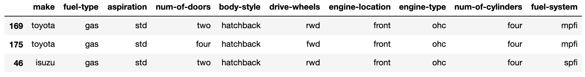

所有其他转换，如缩放、输入和编码，都应该在将数据分成训练集和测试集之后进行。这样，我们可以确保没有信息从测试集泄露到训练样本中。

## 将数据分为训练集和测试集

这里，我们保留 25%的数据用于测试，其余的用于训练:

```py
from sklearn.model_selection import train_test_split
df_train, df_test = train_test_split(df, test_size=0.25, random_state=22)
```

然后，我们可以使用上一节的信息来创建我们的`x`和`y`值:

```py
x_train = df_train[features['all']]
x_test = df_test[features['all']]

y_train = df_train[target]
y_test = df_test[target]
```

通常，对于回归任务，理解目标值的分布是很方便的:

```py
y_train.plot(
    title="Distribution of Car Prices (in 1000's)",
    kind='hist', 
)
```

直方图通常是理解分布的好选择，如下图所示:

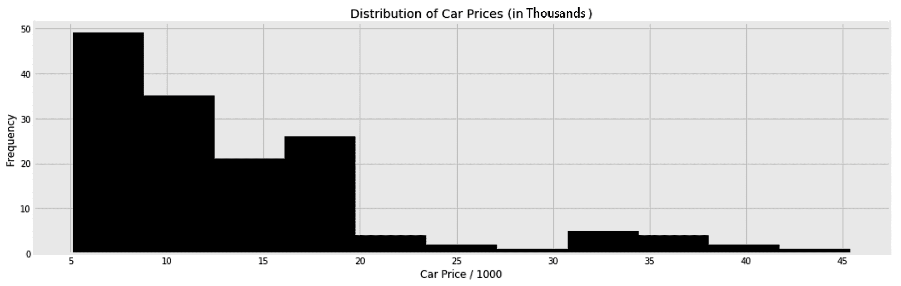

我们以后可能会回到这个分布，以便正确地看待回归变量的平均误差。此外，您可以使用这个范围进行健全性检查。例如，如果您知道您看到的所有价格都落在 5，000 到 45，000 的范围内，您可以决定何时将您的模型投入生产，以便在它返回远离此范围的价格时发出警报。

## 输入缺失值并编码分类特征

在将我们的集合付诸行动之前，我们需要确保我们的数据中没有空值。我们将使用[第 4 章](f97d5d65-e61e-4f65-9b83-1ac4d6a54a77.xhtml)、*准备您的数据*中的`SimpleImputer`函数，用每列中最常见的值替换缺失的值:

```py
from sklearn.impute import SimpleImputer
imp = SimpleImputer(missing_values=np.nan, strategy='most_frequent')

x_train = imp.fit_transform(x_train)
x_test = imp.transform(x_test)
```

您可能已经看到我多次抱怨 scikit-learn 转换器，它不尊重列名，坚持将输入数据帧转换为 NumPy 数组。为了让自己不再抱怨，让我用下面的`ColumnNamesKeeper`类来解决我的痒。每当我将它缠绕在变压器上时，它都会确保所有数据帧都完好无损:

```py
class ColumnNamesKeeper:

    def __init__(self, transformer):
        self._columns = None
        self.transformer = transformer

    def fit(self, x, y=None):
        self._columns = x.columns
        self.transformer.fit(x)

    def transform(self, x, y=None):
        x = self.transformer.transform(x)
        return pd.DataFrame(x, columns=self._columns)

    def fit_transform(self, x, y=None):
        self.fit(x, y)
        return self.transform(x)
```

如您所见，它主要在调用`fit`方法时保存列名。然后，我们可以使用保存的名称在转换步骤后重新创建数据框。

通过继承`sklearn.base.BaseEstimator`和`sklearn.base.TransformerMixin`，可以进一步简化`ColumnNamesKeeper`的代码。如果您愿意编写更多 scikit-learn 友好的变形金刚，您可以查看该库的任何内置变形金刚的源代码。

现在，我可以再次调用`SimpleImputer`，同时将`x_train`和`x_test`保存为数据帧:

```py
from sklearn.impute import SimpleImputer

imp = ColumnNamesKeeper(
    SimpleImputer(missing_values=np.nan, strategy='most_frequent')
)

x_train = imp.fit_transform(x_train)
x_test = imp.transform(x_test)
```

我们在[第 4 章](f97d5d65-e61e-4f65-9b83-1ac4d6a54a77.xhtml)、*准备您的数据*中了解到，除了任何其他非线性算法之外，建议将`OrdinalEncoder` **用于基于树的算法。`category_encoders`库不会弄乱列名，所以这次我们可以使用`OrdinalEncoder`而不需要`ColumnNamesKeeper`。在下面的代码片段中，我们还指定了要编码的列(分类列)和要保持不变的列(其余的列):**

```py
from category_encoders.ordinal import OrdinalEncoder
enc = OrdinalEncoder(
    cols=features['categorical'],
    handle_unknown='value'
)
x_train = enc.fit_transform(x_train)
x_test = enc.transform(x_test)
```

除了`OrdinalEncoder`，你还可以测试[第四章](f97d5d65-e61e-4f65-9b83-1ac4d6a54a77.xhtml) *中目标编码提到的编码器，准备你的数据*。它们也意味着与本章中解释的算法一起使用。在下一节中，我们将对刚刚准备好的数据使用随机森林算法。

# 使用随机森林进行回归

随机森林算法将是这里要处理的第一个集合。这是一个简单易懂的超参数算法。然而，正如我们通常所做的那样，我们将首先使用其默认值来训练算法，如下所示，然后解释其超参数:

```py
from sklearn.ensemble import RandomForestRegressor
rgr = RandomForestRegressor(n_jobs=-1)
rgr.fit(x_train, y_train)
y_test_pred = rgr.predict(x_test)
```

由于每棵树都独立于其他树，我将`n_jobs`设置为`-1`以使用我的多个处理器来并行训练这些树。一旦对它们进行了训练并获得了预测，我们就可以打印以下准确性指标:

```py
from sklearn.metrics import (
    mean_squared_error, mean_absolute_error, median_absolute_error, r2_score
)

print(
    'R2: {:.2f}, MSE: {:.2f}, RMSE: {:.2f}, MAE {:.2f}'.format(
        r2_score(y_test, y_test_pred),
        mean_squared_error(y_test, y_test_pred),
        np.sqrt(mean_squared_error(y_test, y_test_pred)),
        mean_absolute_error(y_test, y_test_pred),
    )
)
```

这将打印以下分数:

```py
# R2: 0.90, MSE: 4.54, RMSE: 2.13, MAE 1.35
```

车价平均 13400。所以，`1.35`的一个**平均绝对误差** ( **MAE** *)* 似乎是合理的。至于**均方误差** ( **MSE** )，用它的平方根来保持和 MAE 相同的单位是有意义的。简而言之，给定高 R ² 分数和低误差，该算法似乎在默认值下表现良好。此外，您可以绘制误差图，以便更好地了解模型的性能:

```py
df_pred = pd.DataFrame(
    {
        'actuals': y_test,
        'predictions': y_test_pred,
    }
)

df_pred['error'] = np.abs(y_test - y_test_pred)

fig, axs = plt.subplots(1, 2, figsize=(16, 5), sharey=False)

df_pred.plot(
    title='Actuals vs Predictions',
    kind='scatter',
    x='actuals',
    y='predictions',
    ax=axs[0],
)

df_pred['error'].plot(
    title='Distribution of Error',
    kind='hist',
    ax=axs[1],
)

fig.show()
```

为了保持代码简洁，我排除了一些格式行。最后，我们得到以下图表:

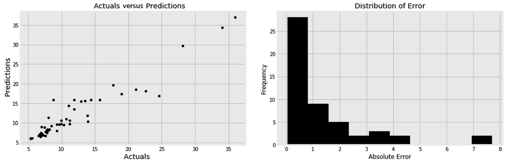

通过绘制预测值与实际值的对比图，我们可以确保模型不会系统性地高估或低估。这通过左侧分散点的 45 度 ^o 斜率显示。分散点的较低斜率会系统性地反映出低估。让分散的点排列在一条直线上可以确保我们没有模型捕捉不到的非线性。右边的直方图显示大多数误差低于 2000。了解你将来可能得到的平均误差和最大误差是有益的。

## 检查树的数量的影响

默认情况下，每棵树都是根据训练数据中的随机样本进行训练的。这可以通过将`bootstrap`超参数设置为`True`来实现。在 bootstrap 抽样中，一个样本可能会在训练过程中多次使用，而另一个样本可能根本不会使用。

当`max_samples`保持为`None`时，每棵树在一个大小等于整个训练数据大小的随机样本上被训练。您可以将`max_samples`设置为小于 1 的分数，然后在更小的随机子样本上训练每棵树。类似地，我们可以将`max_features`设置为小于 1 的分数，以确保每棵树使用可用特征的随机子集。这些参数帮助每棵树都有自己的个性，并确保森林的多样性。更正式地说，这些参数增加了每棵树的方差。因此，建议尽可能多的种植树木，以减少我们刚刚介绍的差异。

在这里，我们比较了三个森林，每个森林都有不同数量的树:

```py
mae = []
n_estimators_options = [5, 500, 5000]

for n_estimators in n_estimators_options:

    rgr = RandomForestRegressor(
        n_estimators=n_estimators,
        bootstrap=True,
        max_features=0.75,
        max_samples=0.75,
        n_jobs=-1,
    )

    rgr.fit(x_train, y_train)
    y_test_pred = rgr.predict(x_test)
    mae.append(mean_absolute_error(y_test, y_test_pred))
```

然后，我们可以为每个森林绘制 MAE 图，以了解拥有更多树的好处:

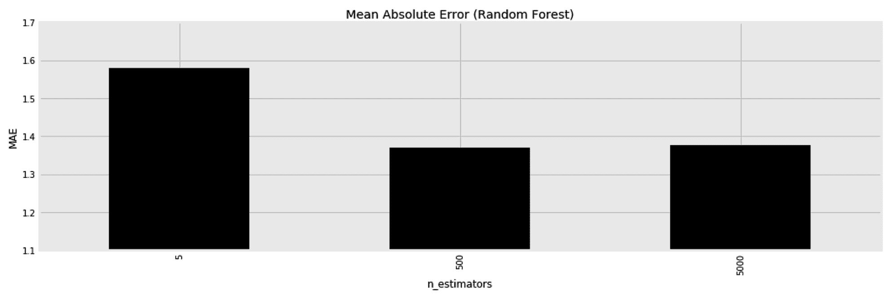

显然，我们刚刚遇到了一组新的超参数来调整`bootstrap`、`max_features`和`max_samples`。因此，对超参数调整应用交叉验证是有意义的。

## 了解每个训练功能的效果

一旦训练了一个随机森林，我们就可以列出训练特征，以及它们的重要性。像往常一样，我们通过使用列名和`feature_importances_`属性将结果放入数据框中，如下所示:

```py
df_feature_importances = pd.DataFrame(
    {
        'Feature': x_train.columns,
        'Importance': rgr.feature_importances_,
    }
).sort_values(
    'Importance', ascending=False
)
```

以下是生成的数据框:

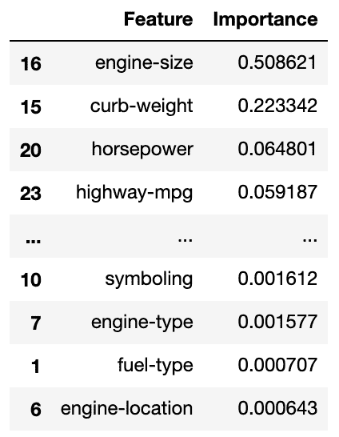

与线性模型不同，这里的所有值都是正的。这是因为这些值只显示每个特征的重要性，而不管它与目标是正相关还是负相关。这对于决策树以及基于树的集成来说是常见的。因此，我们可以使用**部分依赖图** ( **PDPs** )来显示目标和不同特性之间的关系。在这里，我们只根据六大特性的重要性对其进行绘图:

```py
from sklearn.inspection import plot_partial_dependence

fig, ax = plt.subplots(1, 1, figsize=(15, 7), sharey=False)

top_features = df_feature_importances['Feature'].head(6)

plot_partial_dependence(
    rgr, x_train, 
    features=top_features,
    n_cols=3, 
    n_jobs=-1,
    line_kw={'color': 'k'},
    ax=ax
) 

ax.set_title('Partial Dependence')

fig.show()
```

生成的图表更容易阅读，尤其是当目标和特征之间的关系是非线性的时:

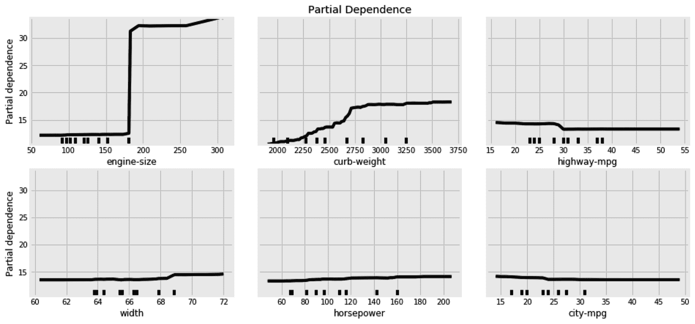

我们现在可以知道，发动机更大、马力更大、每加仑行驶里程更少的汽车往往更贵。

PDP 不仅适用于集合方法，还适用于任何其他复杂的非线性模型。尽管神经网络的每一层都有系数，但 PDP 对于从整体上理解网络是必不可少的。此外，您还可以通过将功能列表作为列表元组传递来理解不同功能对之间的交互，每个元组中有一对功能。

# 使用随机森林进行分类

为了演示随机森林分类器，我们将使用一个合成数据集。我们首先使用内置的`make_hastie_10_2`类创建数据集:

```py
from sklearn.datasets import make_hastie_10_2
x, y = make_hastie_10_2(n_samples=6000, random_state=42)
```

前面的代码片段创建了一个随机数据集。我将`random_state`设置为一个固定的数字，以确保我们都获得相同的随机数据。现在，我们可以将结果数据分为训练集和测试集:

```py
from sklearn.model_selection import train_test_split
x_train, x_test, y_train, y_test = train_test_split(x, y, test_size=0.25, random_state=42)
```

然后，为了评估分类器，我们将在下一节中引入一个新概念，称为**接收器工作特性** ( **ROC** )曲线。

## ROC 曲线

“概率是基于部分知识的期望。对影响一个事件发生的所有环境的完全了解会把期望变成确定性，不会给概率理论留下空间或要求。”

–乔治·布尔(布尔数据类型以他的名字命名)

在分类问题中，分类器为每个样本分配概率，以反映每个样本属于某个类别的可能性。我们通过分类器的`predict_proba()`方法得到这些概率。`predict()`方法通常是在`predict_proba()`方法之上的一个包装器。在二元分类问题中，如果每个样本属于某一类的概率超过 50%，那么它就将每个样本分配到该类。在实践中，我们可能不总是想要坚持这个 50%的阈值，特别是因为不同的阈值通常会改变每个类别的 **T** **rue 阳性率** ( **TPRs** )和**假阳性率** ( **FPRs** )。因此，您可以选择不同的阈值来优化所需的 TPR。

决定哪个阈值适合你的需要的最好方法是使用 ROC 曲线。这有助于我们看到每个阈值的 TPR 和 FPR。为了创建这条曲线，我们将在刚刚创建的合成数据集上训练我们的随机森林分类器，但这次获得分类器的概率:

```py
from sklearn.ensemble import RandomForestClassifier

clf = RandomForestClassifier(
    n_estimators=100,
    oob_score=True,
    n_jobs=-1,
)

clf.fit(x_train, y_train)
y_pred_proba = clf.predict_proba(x_test)[:,1]
```

然后，我们可以计算每个阈值的 TPR 和 FPR，如下所示:

```py
from sklearn.metrics import roc_curve
fpr, tpr, thr = roc_curve(y_test, y_pred_proba)
```

让我们停下来解释一下 TPR 和 FPR 的含义:

*   **TPR** 又称**召回**或**灵敏度**，计算方法为**真阳性** ( **TP** )病例数除以所有阳性病例数；即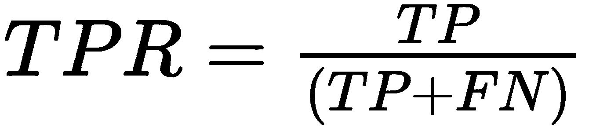，其中 *FN* 是被误归类为阴性的阳性病例(假阴性)。
*   **真阴性率** ( **TNR** )，又称**特异性**，计算方法为**真阴性** ( **TN** )病例数除以所有阴性病例数；即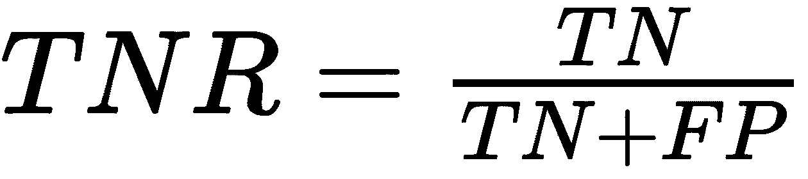，其中 *FP* 是误归类为阳性的阴性病例(假阳性)。
*   **FPR** 定义为 1 减去 TNR；也就是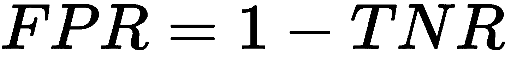。
*   **假阴性率** ( **FNR** )定义为 1 减去 TPR 也就是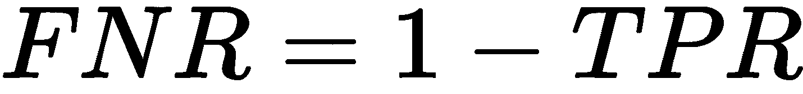。

现在，我们可以将数据集的计算 TPR 和 FPR 放入下表:

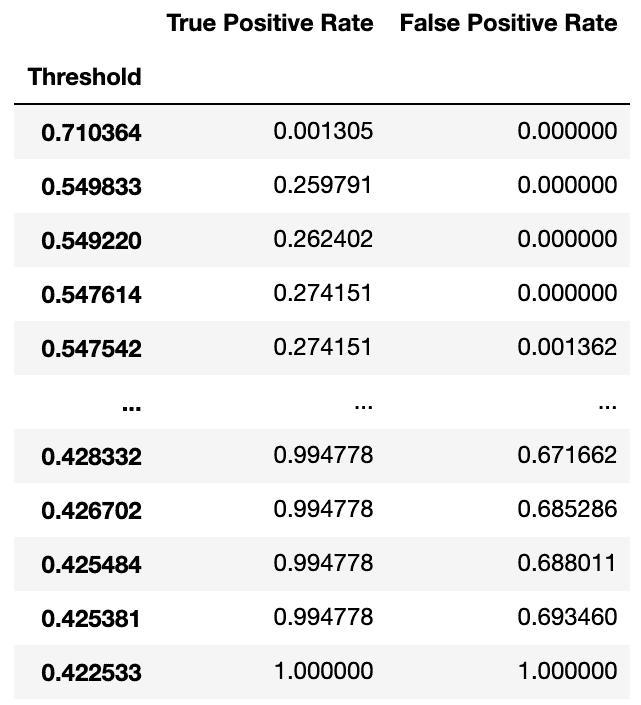

比表格更好的是，我们可以使用以下代码将它们绘制成图形:

```py
pd.DataFrame(
    {'FPR': fpr, 'TPR': tpr}
).set_index('FPR')['TPR'].plot(
    title=f'Receiver Operating Characteristic (ROC)',
    label='Random Forest Classifier',
    kind='line',
)
```

为了简洁起见，我省略了图形的样式代码。我还加了一条 45 ^o 线和曲线 ( **AUC** )下的**面积，我一会儿再解释:**

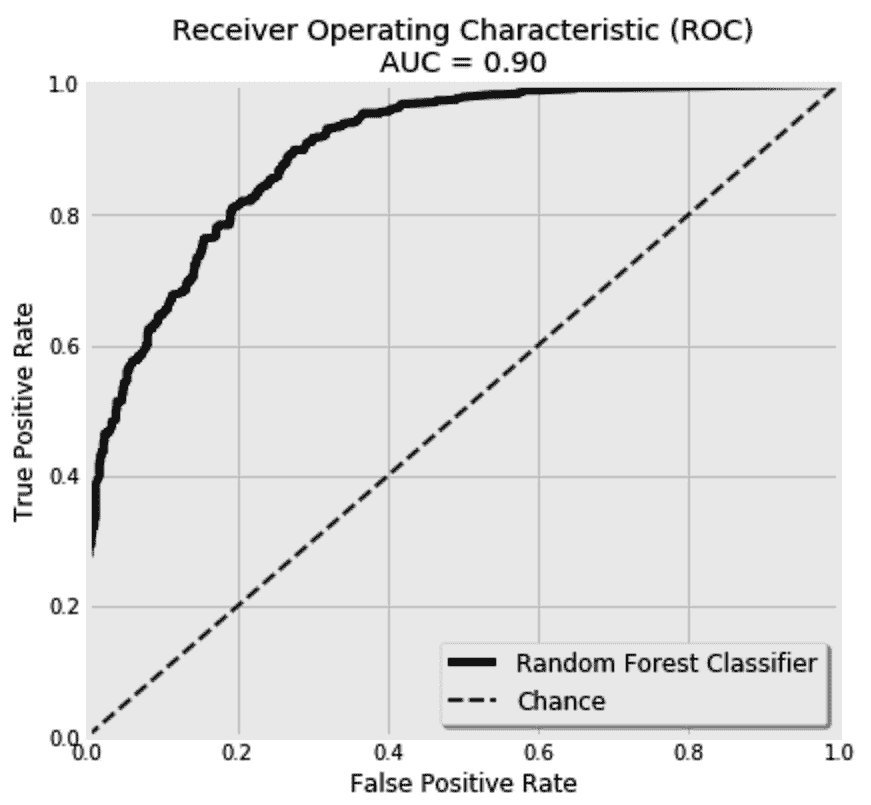

将每个样本随机分配到某个类别的分类器将有一条 ROC 曲线，看起来像 45 ^o 虚线。对此的任何改进都会使曲线向上更加凸出。很明显，兰登森林的 ROC 曲线比 chance 好。最佳分类器将触及图形的左上角。因此，AUC 可以用来反映分类器有多好。`0.5`以上的区域比机会好，而`1.0`的区域是可能的最佳值。我们通常期望值在`0.5`和`1.0`之间。在这里，我们得到了一个 AUC 为`0.94`。可以使用以下代码计算 AUC:

```py
from sklearn.metrics import auc
auc_values = auc(fpr, tpr)
```

我们还可以使用 ROC 和 AUC 来比较两个分类器。这里，我用设置为`True`的`bootstrap`超参数来训练随机森林分类器，并在`bootstrap`设置为`False`时将其与相同的分类器进行比较:

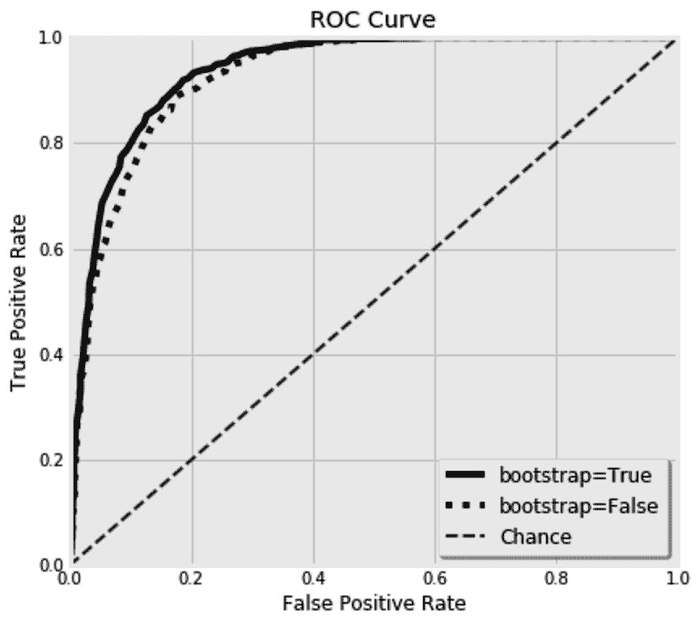

难怪`bootstrap`超参数默认设置为`True`——它给出了更好的结果。现在，您已经看到了如何使用随机森林算法来解决分类和回归问题。在下一节中，我们将解释一个类似的系综:bagging 系综。

# 使用 bagging 回归器

我们将回到汽车数据集，因为这次我们将使用 **bagging 回归变量**。bagging 元估计量非常类似于随机森林。它由多个估计器组成，每个估计器都使用 bootstrap 抽样方法对数据的随机子集进行训练。这里的关键区别在于，尽管决策树被默认用作基本估计器，但是也可以使用任何其他估计器。出于好奇，这次让我们使用 **K 最近邻** ( **KNN** )回归量作为我们的基本估计量。然而，我们需要准备数据以适应新回归变量的需要。

## 准备数字和分类特征的混合

当使用基于距离的算法(如 KNN *)时，建议将所有特征放在相同的比例上。*否则，具有较高幅度的特征对距离度量的影响将盖过其他特征。因为我们在这里混合了数字和分类特性，所以我们需要创建两个并行的管道来分别准备每个特性集。

这是我们管道的顶层视图:

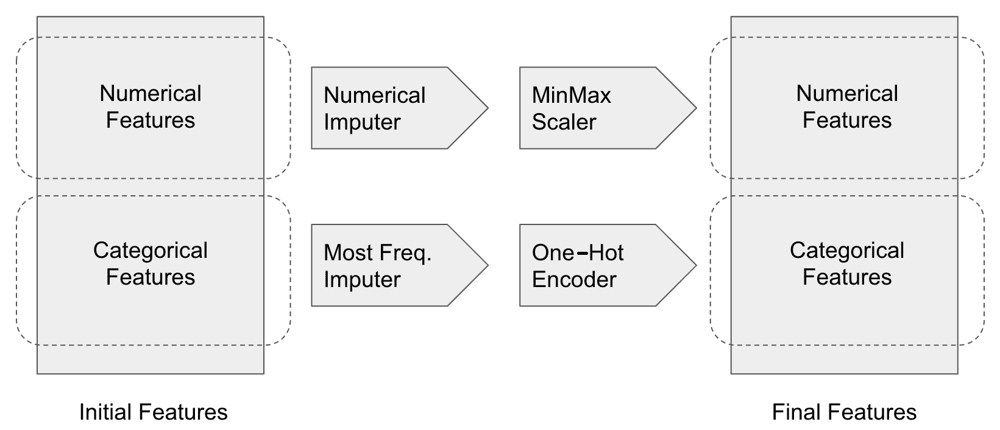

这里，我们首先在管道中构建四个变压器:`Imputer`、`Scaler`、**、**和`OneHotEncoder`。我们还将它们包装在本章前面创建的`ColumnNamesKeeper`中:

```py
from sklearn.impute import SimpleImputer
from category_encoders.one_hot import OneHotEncoder
from sklearn.preprocessing import MinMaxScaler
from sklearn.pipeline import Pipeline

numerical_mputer = ColumnNamesKeeper(
    SimpleImputer(
        missing_values=np.nan, 
        strategy='median'
    )
)

categorical_mputer = ColumnNamesKeeper(
    SimpleImputer(
        missing_values=np.nan, 
        strategy='most_frequent'
    )
)

minmax_scaler = ColumnNamesKeeper(
    MinMaxScaler()
) 

onehot_encoder = OneHotEncoder(
    cols=features['categorical'],
    handle_unknown='value'
)
```

然后，我们将它们放入两条并行的管道:

```py
numerical_pipeline = Pipeline(
    [
        ('numerical_mputer', numerical_mputer), 
        ('minmax_scaler', minmax_scaler)
    ]
)

categorical_pipeline = Pipeline(
    [
        ('categorical_mputer', categorical_mputer), 
        ('onehot_encoder', onehot_encoder)
    ]
)
```

最后，我们连接训练集和测试集的管道输出:

```py
x_train_knn = pd.concat(
    [
        numerical_pipeline.fit_transform(df_train[features['numerical']]), 
        categorical_pipeline.fit_transform(df_train[features['categorical']]),
    ],
    axis=1
)

x_test_knn = pd.concat(
    [
        numerical_pipeline.transform(df_test[features['numerical']]), 
        categorical_pipeline.transform(df_test[features['categorical']]),
    ],
    axis=1
)
```

至此，我们已经准备好构建我们的袋装 KNN 了。

## 用 bagging 元估计量组合 KNN 估计量

`BaggingRegressor`有一个`base_estimator`超参数，在这里你可以设置你想要使用的估值器。这里，`KNeighborsRegressor`用于单个邻居。由于我们聚合了多个估计量来减少它们的方差，因此首先有一个高方差估计量是有意义的，因此这里的邻居数量很少:

```py
from sklearn.ensemble import BaggingRegressor
from sklearn.neighbors import KNeighborsRegressor

rgr = BaggingRegressor(
    base_estimator=KNeighborsRegressor(
        n_neighbors=1
    ),
    n_estimators=400,
)

rgr.fit(x_train_knn, df_train[target])
y_test_pred = rgr.predict(x_test_knn)
```

这个新的设置给了我们一个`1.8`的 MAE。我们可以在这里停下来，或者我们可以决定通过调整它的大的超参数阵列来提高系综的性能。

首先，我们可以尝试不同于 KNN 的估计量，每种估计量都有自己的超参数。然后，bagging 系综也有自己的超参数。我们可以通过`n_estimators`改变估算器的数量。然后，我们可以通过`max_samples`决定是使用整个训练集还是随机子集。类似地，我们也可以通过`max_features`为每个估计器选择一个随机的列子集。可以分别通过`bootstrap`和`bootstrap_features`超参数选择是否对行和列使用自举。

最后，由于每个估计器都是单独训练的，我们可以使用一台具有大量 CPU 的机器，并通过将`n_jobs`设置为`-1`来并行化训练过程。

既然我们已经经历了两个版本的平均系综，是时候检查它们的增强对应部分了。我们将从梯度增强系综开始，然后转移到 AdaBoost 系综。

# 利用梯度推进预测汽车价格

如果我被困在一个荒岛上，必须选择一种算法随身携带，我肯定会选择梯度推进集合！它被证明在许多分类和回归问题上工作得非常好。我们将把它与前几节中相同的汽车数据一起使用。该集成的分类器和回归器版本共享完全相同的超参数，除了它们使用的损失函数。这意味着，每当我们决定使用梯度推进集成进行分类时，我们在这里将要学习的一切都将对我们有用。

与我们目前所见的平均集成不同，提升集成迭代地构建它们的估计器。从初始集合中学习到的知识用于构建其后继集合。这是增强集成的主要缺点，并行性是不可行的。将并行性放在一边，集合的这种迭代性质要求设定学习速率。这有助于梯度下降算法容易地达到损失函数的最小值。这里我们用 500 棵树，每棵树最多 3 个节点，学习率`0.01`。再者，这里用的是**最小二乘** ( **LS** )损失；想想 MSE。稍后将详细介绍可用的损失函数:

```py
from sklearn.ensemble import GradientBoostingRegressor

rgr = GradientBoostingRegressor(
    n_estimators=1000, learning_rate=0.01, max_depth=3, loss='ls'
)

rgr.fit(x_train, y_train)
y_test_pred = rgr.predict(x_test)
```

这种新算法在测试集上为我们提供了以下性能:

```py
# R2: 0.92, MSE: 3.93, RMSE: 1.98, MAE: 1.42
```

如您所见，与随机森林相比，此设置的 MSE 较低，而随机森林的 MAE 较高。梯度推进**回归器可以使用的另一个损失函数是**最小绝对偏差**(**LAD**)；想想梅，这次。LAD 在处理异常值时可能会有所帮助，它有时会降低模型在测试集上的 MAE 性能。然而，它并没有改善手头数据集的 MAE。我们也有百分位数损失，但在深入研究支持的损失函数之前，我们需要学习如何诊断学习过程。**

 **这里要设置的主要超参数是树的数量、树的深度、学习速率和损失函数。根据经验，你应该瞄准更多的树和低学习率。正如我们稍后将看到的，这两个超参数彼此成反比。控制树的深度完全取决于数据。总的来说，我们需要浅的树，让 boosting 赋予它们力量。然而，树的深度控制了我们想要捕捉的特征交互的数量。在存根(具有单个分割的树)中，一次只能学习一个特征。一个更深的树类似于一个嵌套的`if`条件，其中每次都有更多的特性在起作用。我通常从设置在`3`和`5`附近的`max_depth`开始，并一路调整。

## 绘制学习偏差图

随着每一个额外的估计量，我们期望算法学习更多，损失减少。然而，在某些时候，额外的估计器将继续过度拟合训练数据，而不会为测试数据提供太多的改进。

为了有一个清晰的画面，我们需要为训练集和测试集绘制每个附加估计量的计算损失。至于训练损失，由梯度推进元估计器保存到它的`loss_`属性中。对于测试损失，我们可以使用元估计器的`staged_predict()`方法。该方法可用于给定的数据集，以对每个中间迭代进行预测。

由于我们有多个损失函数可供选择，梯度增强还提供了一个`loss_()`方法，它根据使用的损失函数为我们计算损失。这里，我们创建一个新函数来计算每次迭代的训练和测试误差，并将它们放入数据框中:

```py
def calculate_deviance(estimator, x_test, y_test):

    train_errors = estimator.train_score_
    test_errors = [
        estimator.loss_(y_test, y_pred_staged) 
        for y_pred_staged in estimator.staged_predict(x_test)
    ]

    return pd.DataFrame(
        {
            'n_estimators': range(1, estimator.estimators_.shape[0]+1),
            'train_error': train_errors,
            'test_error': test_errors,
        }
    ).set_index('n_estimators')
```

因为我们这里要使用 LS 损失，你可以简单地用`mean_squared_error()`代替`estimator.loss_()`方法，得到完全相同的结果。但是让我们保留`estimator.loss_()`函数，以获得更加通用和可重用的代码。

接下来，我们像往常一样训练梯度推进回归器:

```py
from sklearn.ensemble import GradientBoostingRegressor

rgr = GradientBoostingRegressor(n_estimators=250, learning_rate=0.02, loss='ls')
rgr.fit(x_train, y_train)
```

然后，我们使用经过训练的模型以及测试集来绘制训练和测试学习偏差:

```py
fig, ax = plt.subplots(1, 1, figsize=(16, 5), sharey=False)

df_deviance = calculate_deviance(rgr, x_test, y_test)

df_deviance['train_error'].plot(
    kind='line', color='k', linestyle=':', ax=ax
)

df_deviance['test_error'].plot(
    kind='line', color='k', linestyle='-', ax=ax
)

fig.show()
```

运行代码会得到下面的图表:

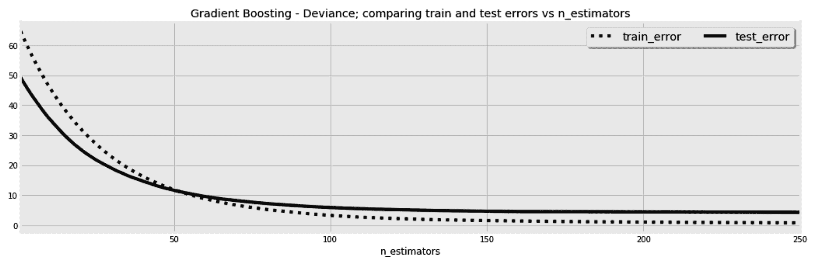

这个图的美妙之处在于，它告诉我们，尽管训练集中的改进在持续，但是在`120`估计器之后，测试集的改进停止了；也就是开始过拟合了。此外，我们可以使用这个图表来了解选择的学习速率的影响，就像我们在第七章*神经网络中所做的那样——深度学习*来了。

## 比较学习率设置

这次我们将训练三个梯度推进回归器，每个都有不同的学习速率，而不是训练一个模型。然后，我们将并排绘制每一个的偏差图，如下所示:

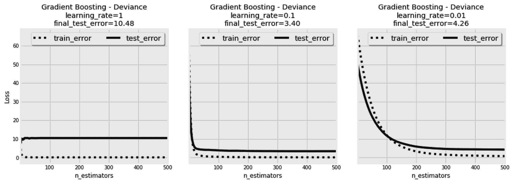

与其他基于梯度下降的模型一样，高学习率会导致估计器过冲并错过局部最小值。我们可以在第一张图中看到这一点，尽管进行了连续迭代，但没有看到任何改进。第二和第三张图中的学习率似乎是合理的。相比之下，第三张图中的学习速率似乎太慢，模型无法在 500 次迭代中收敛。然后，您可以决定增加第三个模型的估计数，以使其收敛。

我们从 bagging 系综中了解到，对每个估计量使用随机训练样本可能有助于过度拟合。在下一节中，我们将看看同样的方法是否也能帮助增强系综。

## 使用不同的样本量

我们已经为每次迭代使用了整个训练集。这一次，我们将训练三个梯度推进回归器，每个都有不同的子样本大小，并像以前一样绘制它们的偏差图。我们将使用固定的学习率`0.01`和 LAD **作为我们的损失函数，如图所示:**

 **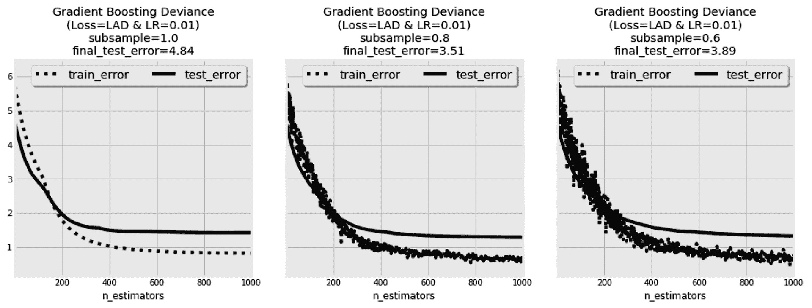

在第一张图中，整个训练样本用于每次迭代。因此，训练损失没有其他两个图表中波动的大。然而，在第二个模型中使用的抽样允许它达到一个更好的测试分数，尽管它的噪声损失图。第三个模型的情况类似，但最终误差稍大。

## 提前停止并调整学习速度

`n_iter_no_change`超参数用于在一定次数的迭代后，如果验证分数没有得到足够的提高，则停止训练过程。为验证预留的子集`validation_fraction`用于计算验证分数。`tol` **超参数用于决定我们必须考虑多少改进才算足够。**

 **梯度推进算法中的`fit`方法接受在每次迭代后调用的回调函数。它还可以用来设置一个自定义条件，以停止基于它的训练过程。此外，它还可以用于监控或您需要的任何其他定制。这个回调函数用三个参数调用:当前迭代的顺序(`n`)、一个渐变增强的实例(`estimator`)及其设置(`params`)。为了演示这个回调函数是如何工作的，让我们构建一个函数，在每`10`次迭代中将一次迭代的学习速率更改为`0.01`，并在剩余的迭代中保持为`0.1`，如下所示:

```py
def lr_changer(n, estimator, params):
    if n % 10:
        estimator.learning_rate = 0.01
    else:
        estimator.learning_rate = 0.1
    return False
```

然后，我们使用我们的`lr_changer`函数，如下所示:

```py
from sklearn.ensemble import GradientBoostingRegressor
rgr = GradientBoostingRegressor(n_estimators=50, learning_rate=0.01, loss='ls')
rgr.fit(x_train, y_train, monitor=lr_changer)
```

现在，如果我们像往常一样打印偏差，我们将会看到在每 10 次^(迭代之后，由于学习率的变化，计算的损失如何跳跃:)

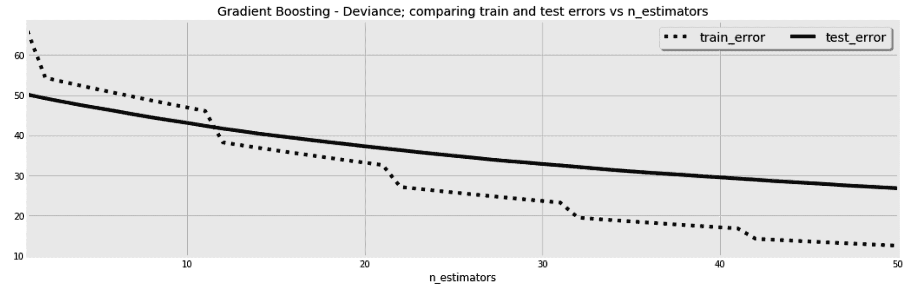

我刚刚做的是非常无用的，但它展示了你手头的可能性。例如，您可以从神经网络中使用的解算器借用自适应学习率和动量等概念，并使用回调函数将它们合并到这里。

## 回归范围

"我努力成为一个现实主义者，而不是悲观主义者或乐观主义者."

尤瓦尔·诺亚·哈拉里

梯度推进回归提供给我们的最后一个珍宝是回归范围。这些对于量化你预测的不确定性非常有用。

我们尽力使我们的预测与实际数据完全一致。然而，我们的数据仍然可能有噪音，或者所使用的特征可能无法捕捉全部真相。举以下例子:

| **x[1]** | **x[2]** | **y** |
| 0 | 0 | 10 |
| 一 | 一 | 50 |
| 0 | 0 | 20 |
| 0 | 0 | 22 |

考虑一个新样本，其中*x[1]= 0 并且*x[2]= 0。我们已经有了三个具有完全相同特征的训练示例，那么这个新样本的预测 *y* 值会是多少呢？如果在训练过程中使用平方损失函数，那么预测目标将接近于三个相应目标 *( `10`、`20`和`22`)的平均值`17.3`。现在，如果使用 MAE，那么预测目标将更接近于`22`，这是三个相应目标的中间值(第 50 ^个百分点)。当使用**分位数**损失函数时，我们可以使用任何其他百分点，而不是第 50 ^个个百分点。因此，为了获得回归范围，我们可以使用两个具有两个不同分位数的回归变量作为范围的上限和下限。***

 *尽管回归范围不管手头数据的维度如何都有效，但是页面的格式迫使我们为了更加清晰而提出一个二维的例子。下面的代码创建了 400 个样本来使用:

```py
x_sample = np.arange(-10, 10, 0.05)
y_sample = np.random.normal(loc=0, scale=25, size=x_sample.shape[0]) 
y_sample *= x_sample 

pd_random_samples = pd.DataFrame(
    {
        'x': x_sample,
        'y': y_sample
    }
)
```

这是生成的 *y* 与 *x* 值的散点图:


现在，我们可以用第 10 ^个和第 90 ^个个百分点作为我们的范围边界来训练两个回归变量，并绘制这些回归边界，以及我们的分散数据点:

```py
from sklearn.ensemble import GradientBoostingRegressor

fig, ax = plt.subplots(1, 1, figsize=(12, 8), sharey=False)

pd_random_samples.plot(
    title='Regression Ranges [10th & 90th Quantiles]', 
    kind='scatter', x='x', y='y', color='k', alpha=0.95, ax=ax
)

for quantile in [0.1, 0.9]:

    rgr = GradientBoostingRegressor(n_estimators=10, loss='quantile', alpha=quantile)
    rgr.fit(pd_random_samples[['x']], pd_random_samples['y'])
    pd_random_samples[f'pred_q{quantile}'] = rgr.predict(pd_random_samples[['x']])

    pd_random_samples.plot(
        kind='line', x='x', y=f'pred_q{quantile}', 
        linestyle='-', alpha=0.75, color='k', ax=ax
    )

ax.legend(ncol=1, fontsize='x-large', shadow=True)

fig.show()
```

我们可以看到大多数点都在这个范围内。理想情况下，我们希望 80%的点落在 **90** - **100** 范围内:

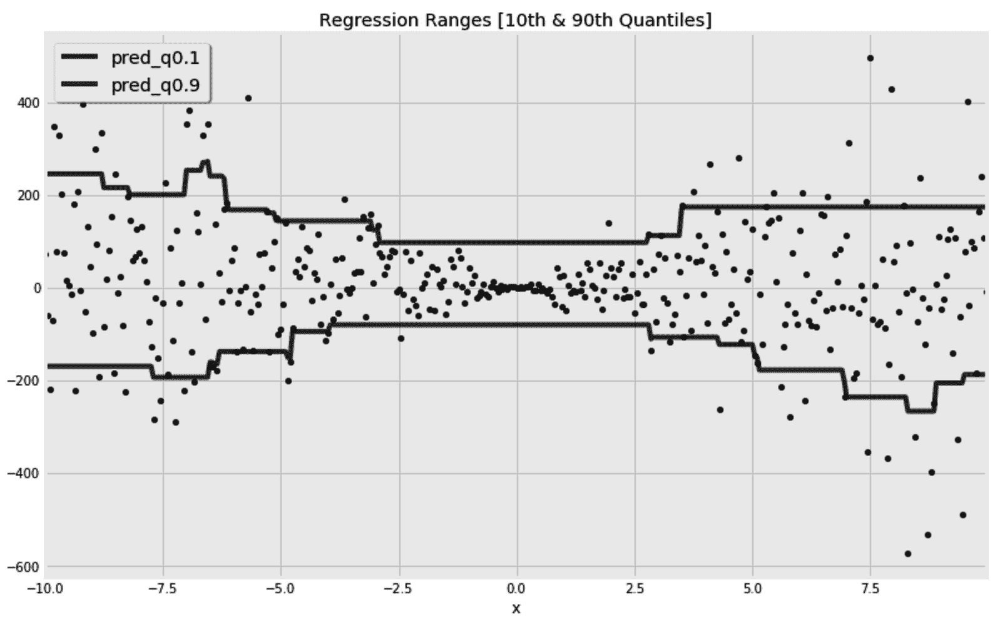

我们现在可以用同样的策略来预测汽车价格:

```py
from sklearn.ensemble import GradientBoostingRegressor

rgr_min = GradientBoostingRegressor(n_estimators=50, loss='quantile', alpha=0.25)
rgr_max = GradientBoostingRegressor(n_estimators=50, loss='quantile', alpha=0.75)

rgr_min.fit(x_train, y_train, monitor=lr_changer)
rgr_max.fit(x_train, y_train, monitor=lr_changer)

y_test_pred_min = rgr_min.predict(x_test)
y_test_pred_max = rgr_max.predict(x_test)

df_pred_range = pd.DataFrame(
    {
        'Actuals': y_test,
        'Pred_min': y_test_pred_min,
        'Pred_max': y_test_pred_max,
    }
)
```

然后，我们可以检查我们的测试集有多少百分比落在回归范围内:

```py
df_pred_range['Actuals in Range?'] = df_pred_range.apply(
    lambda row: 1 if row['Actuals'] >= row['Pred_min'] and row['Actuals'] <= row['Pred_max'] else 0, axis=1
)
```

计算`df_pred_range['Actuals in Range?']`的平均值得到`0.49`，它非常接近我们期望的`0.5`值。显然，我们可以使用更宽或更窄的范围，这取决于我们的用例。如果你的模型将被用来帮助车主出售他们的汽车，你可能需要给他们合理的范围，因为告诉某人他们可以以 5 美元到 30，000 美元之间的任何价格出售他们的汽车是非常准确但无用的建议。有时，一个不太精确但有用的模型比一个精确但无用的模型要好。

另一种现在不常用的升压算法是 AdaBoost 算法。为了完整起见，我们将在下一节中简要探讨它。

# 使用 AdaBoost 集成

在 AdaBoost 集成中，每次迭代中产生的错误被用于改变后续迭代的训练样本的权重。与 boosting 元估计器一样，这种方法也可以使用任何其他估计器，而不是默认使用的决策树。这里，我们在汽车数据集上使用了它的默认估计器:

```py
from sklearn.ensemble import AdaBoostRegressor

rgr = AdaBoostRegressor(n_estimators=100)
rgr.fit(x_train, y_train)
y_test_pred = rgr.predict(x_test)
```

AdaBoost 元估计器也有一个`staged_predict`方法，它允许我们在每次迭代后绘制训练或测试损失的改进。下面是绘制测试错误的代码:

```py
pd.DataFrame(
    [
        (n, mean_squared_error(y_test, y_pred_staged))
        for n, y_pred_staged in enumerate(rgr.staged_predict(x_test), 1)
    ],
    columns=['n', 'Test Error']
).set_index('n').plot()

fig.show()
```

这是每次迭代后计算损失的曲线图:

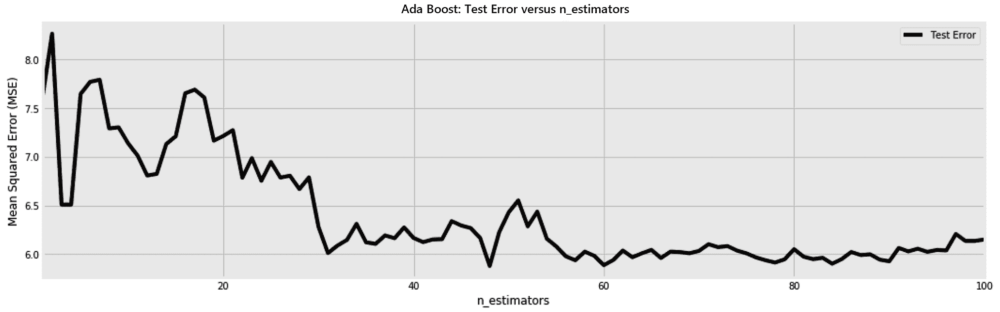

正如在其他集合中一样，我们添加的估计量越多，它就变得越精确。一旦我们开始过度适应，我们应该能够停止。这就是为什么有一个验证样本对于知道何时停止是至关重要的。我在这里使用测试集进行演示，但是在实践中，测试样本应该放在一边，而应该使用验证集。

# 探索更多集成

主要的集成技术就是我们目前看到的那些。下面这些也是值得了解的，并且对一些特殊的情况有用。

## 投票群体

有时，我们有许多好的估计量，每一个都有自己的错误。我们的目标不是减轻他们的偏差或方差，而是结合他们的预测，希望他们不会犯同样的错误。在这些情况下，可以使用`VotingClassifier`和`VotingRegressor`。通过调整`weights`超参数，您可以给一些估值器比其他估值器更高的优先级。`VotingClassifier`具有不同的投票策略，这取决于是否要使用预测的类别标签或者是否应该使用预测的概率。

## 堆叠系综

除了投票，您还可以通过添加一个额外的评估者来组合多个评估者的预测，该评估者使用他们的预测作为输入。这种策略被称为**堆叠**。最终估计器的输入可以限于先前估计器的预测，或者可以是它们的预测和原始训练数据的组合。为了避免过度拟合，通常使用交叉验证来训练最终的估计量。

## 随机树嵌入

我们已经看到了树是如何捕捉数据中的非线性的。因此，如果我们仍然想使用更简单的算法，我们可以只使用树来转换数据，并将预测留给简单的算法来完成。当构建一棵树时，每个数据点都落入它的一片叶子中。因此，叶子的 id 可以用来表示不同的数据点。如果我们构建多棵树，那么每个数据点可以用它落在每棵树上的叶子的 ID 来表示。这些叶子，id 可以被用作我们的新特征，并且可以被馈送到更简单的估计器中。这种嵌入对于特征压缩是有用的，并且允许线性模型捕捉数据中的非线性。

这里，我们使用无监督的`RandomTreesEmbedding`方法来转换我们的汽车特征，然后在`Ridge`回归中使用转换后的特征:

```py
from sklearn.ensemble import RandomTreesEmbedding
from sklearn.linear_model import Ridge
from sklearn.pipeline import make_pipeline

rgr = make_pipeline(RandomTreesEmbedding(), Ridge())
rgr.fit(x_train, y_train)
y_test_pred = rgr.predict(x_test)

print(f'MSE: {mean_squared_error(y_test, y_test_pred)}')
```

从前面的代码块中，我们可以观察到以下内容:

*   这种做法并不局限于`RandomTreesEmbedding`。

*   梯度增强树也可以用于转换数据，以供下游估计器使用。
*   `GradientBoostingRegressor`和`GradientBoostingClassifier`都有一个`apply`功能，可用于特征变换。

# 摘要

在这一章中，我们看到了算法如何受益于以系综的形式组装。我们了解了这些集合如何减轻偏差和方差之间的权衡。

在处理异构数据时，梯度推进和随机森林算法是我分类和回归的首选。由于对树木的依赖，它们不需要任何复杂的数据准备。它们能够处理非线性数据并捕捉特征交互。最重要的是，超参数的调整非常简单。

每种方法中的估计量越多越好，你不应该太担心它们过度拟合。至于梯度推进，如果你有能力拥有更多的树，你可以选择更低的学习率。除了这些超参数之外，这两个算法中的每一个的树的深度应该通过试错和交叉验证来调整。由于这两种算法来自偏差-方差谱的不同方面，您可能最初的目标是拥有大树的森林，稍后您可以修剪这些大树。相反，你可以从浅树开始，依靠你的梯度提升元估计器来提升它们。

到目前为止，在本书中，我们一次只预测了一个目标。在这里，我们预测了汽车的价格，仅此而已。在下一章，我们将看到如何一次预测多个目标。此外，当我们的目标是使用分类器给出的概率时，拥有一个校准的分类器是至关重要的。如果我们有可信的概率，我们就能更好地估计我们的风险。因此，校准分类器将是下一章的另一个主题。*********