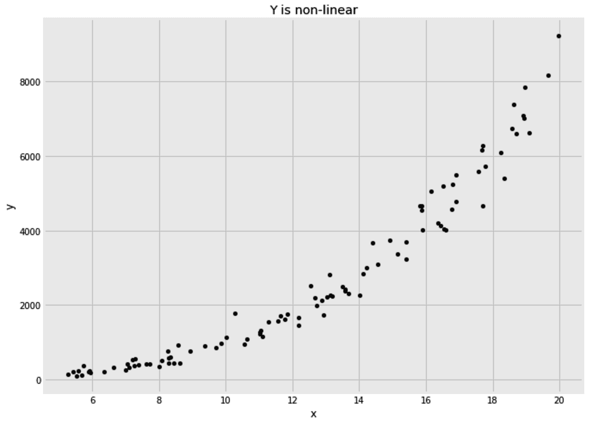
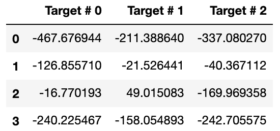
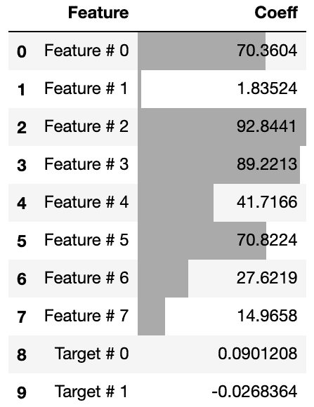
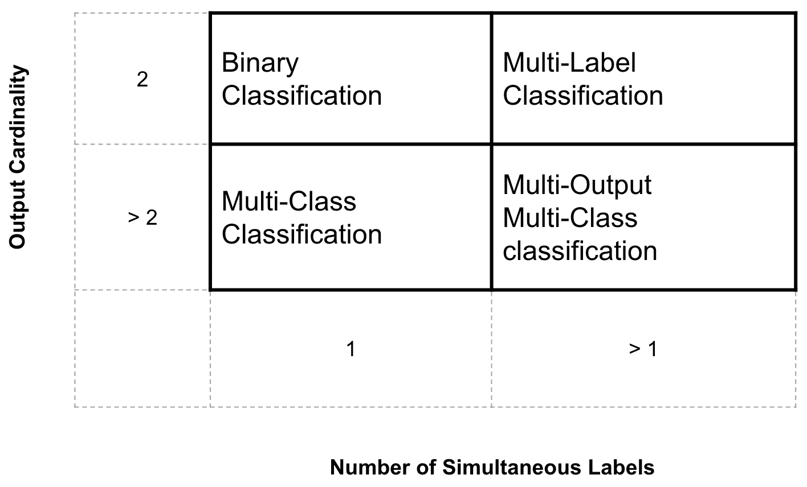
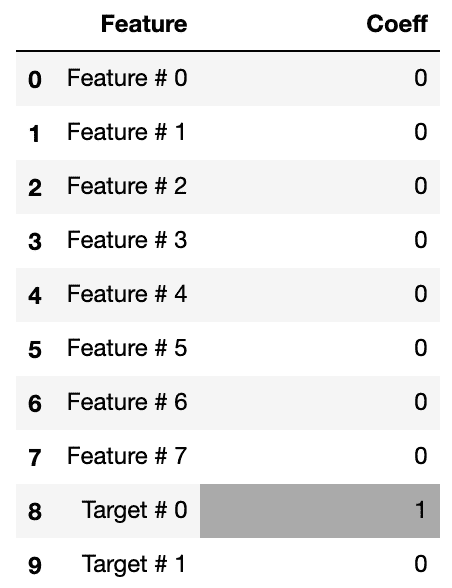
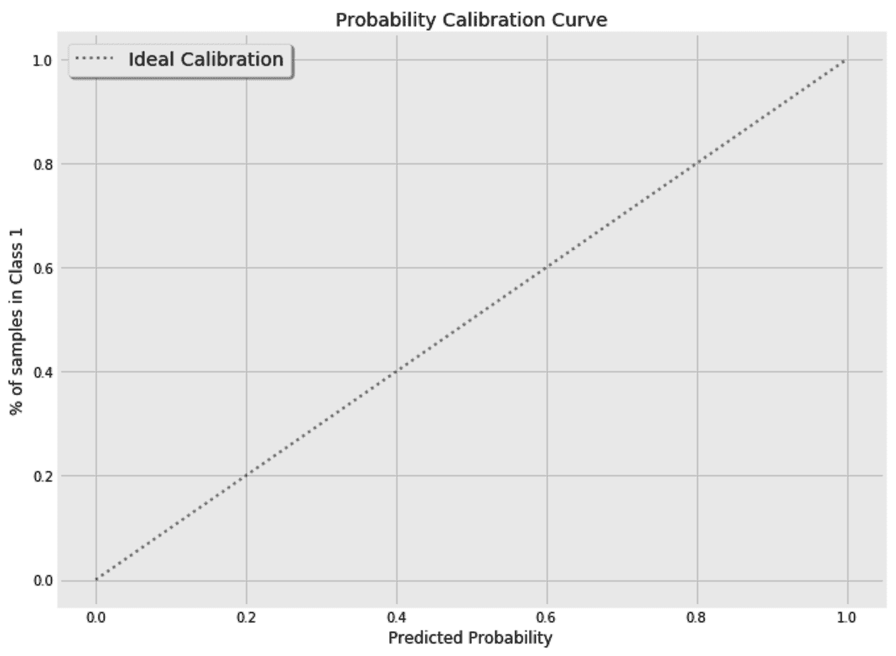
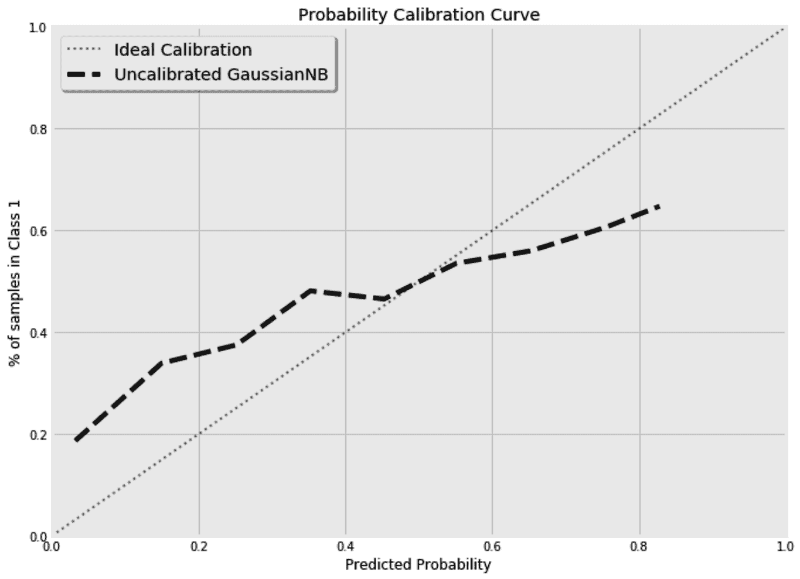
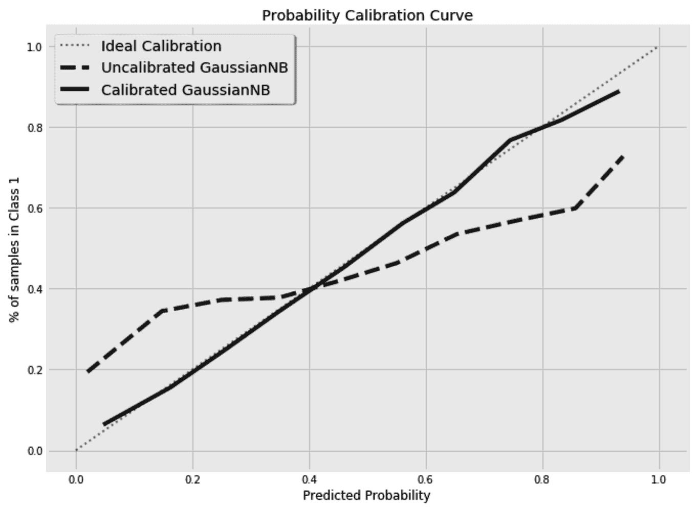

# 九、Y 比 X 更重要

很多注意力都放在输入特征上，也就是我们的 x。我们使用算法来扩展它们，从中进行选择，并设计新的功能添加到它们当中。尽管如此，我们也应该对目标给予同样多的关注。有时，缩放目标可以帮助您使用更简单的模型。其他时候，您可能需要一次预测多个目标。因此，了解目标的分布以及它们之间的相互依赖关系是非常重要的。在这一章中，我们将关注目标以及如何处理它们。

在本章中，我们将讨论以下主题:

*   缩放您的回归目标
*   估计多重回归目标
*   处理复合分类目标
*   校准分类器的概率
*   计算 K 处的精度

# 缩放您的回归目标

在回归问题中，有时缩放目标可以节省时间，并允许我们对手头的问题使用更简单的模型。在这一节中，我们将看到如何通过改变目标的尺度来使我们的评估者的生活更容易。

在下面的例子中，目标和输入之间的关系是非线性的。因此，线性模型不会给出最佳结果。我们可以使用非线性算法，转换我们的特征，或者转换我们的目标。在这三个选项中，变换目标有时可能是最容易的。请注意，我们这里只有一个特性，但是在处理许多特性时，首先考虑转换目标是有意义的。

下图显示了单个特征`x`和因变量`y`之间的关系:



在你我之间，下面的代码用于生成数据，但是为了学习，我们可以假装我们现在不知道 y 和 x 之间的关系:

```py
x = np.random.uniform(low=5, high=20, size=100)
e = np.random.normal(loc=0, scale=0.5, size=100)
y = (x + e) ** 3
```

一维输入(`x`)均匀分布在 *5* 和 *20* 之间。 *y* 和 *x* 之间的关系是三次方的，在 *x* 上增加了一些正态分布的噪声

在拆分数据之前，我们需要将 *x* 从一个向量转换成一个矩阵，如下所示:

```py
from sklearn.model_selection import train_test_split
x = x.reshape((x.shape[0],1))
x_train, x_test, y_train, y_test = train_test_split(x, y, test_size=0.25)
```

现在，如果我们将数据分成训练集和测试集，并运行岭回归，我们将得到`559`的**平均绝对误差** ( **MAE** )。由于随机生成的数据，您的里程可能会有所不同。我们能做得比这更好吗？

请记住，在本章提到的大多数例子中，你将得到的最终结果可能与我的不同。我不喜欢在生成和分割数据时使用随机状态，因为我在这里的主要目的是解释概念，而不考虑运行代码时得到的最终结果和准确性分数。

让我们创建一个简单的转换器来根据给定的`power`转换目标。当`power`设置为`1`时，不对目标进行任何变换；否则，目标被提升到给定的功率。我们的转换器有一个互补的`inverse_transform()`方法来将目标重新转换回其原始比例:

```py
class YTransformer:

    def __init__(self, power=1):
        self.power = power

    def fit(self, x, y):
        pass

    def transform(self, x, y):
        return x, np.power(y, self.power)

    def inverse_transform(self, x, y):
        return x, np.power(y, 1/self.power)

    def fit_transform(self, x, y):
        return self.transform(x, y)
```

现在，我们可以尝试不同的功率设置，并循环不同的变换，直到我们找到一个给出最佳结果的变换:

```py
from sklearn.linear_model import Ridge
from sklearn.metrics import mean_absolute_error
from sklearn.metrics import r2_score

for power in [1, 1/2, 1/3, 1/4, 1/5]:

    yt = YTransformer(power)
    _, y_train_t = yt.fit_transform(None, y_train)
    _, y_test_t = yt.transform(None, y_test)

    rgs = Ridge()

    rgs.fit(x_train, y_train_t)
    y_pred_t = rgs.predict(x_test)

    _, y_pred = yt.inverse_transform(None, y_pred_t)

    print(
        'Transformed y^{:.2f}: MAE={:.0f}, R2={:.2f}'.format(
            power,
            mean_absolute_error(y_test, y_pred),
            r2_score(y_test, y_pred),
        )
    )
```

我们必须将预测值转换为原始值。否则，给定由不同功率设置实现的不同数据标度，计算的误差度量将不具有可比性。

因此，这里在预测步骤之后使用了`inverse_transform()`方法。对我随机生成的数据运行代码得到了以下结果:

```py
Transformed y^1.00: MAE=559, R2=0.89
Transformed y^0.50: MAE=214, R2=0.98
Transformed y^0.33: MAE=210, R2=0.97
Transformed y^0.25: MAE=243, R2=0.96
Transformed y^0.20: MAE=276, R2=0.95
```

正如所料，当使用正确的变换时，即当功率设置为时，误差最小，而`R²`最大。

对数、指数和平方根变换是统计学家最常用的变换。在执行预测任务时使用它们是有意义的，尤其是使用线性模型时。

对数变换仅对正值有用。`Log(0)`未定义，负数的对数给我们虚数。因此，当处理非负目标时，通常应用对数变换。确保我们不会遇到`log(0)`的另一个技巧是，在转换它们之前，给所有的目标值加 1，然后在将预测转换回来之后，减 1。类似地，对于平方根转换，我们必须首先确保没有负的目标。

我们有时可能希望一次预测多个目标，而不是一次处理一个目标。当多个回归任务都使用相同的特性时，将它们合并到一个模型中可以简化您的代码。当你的目标是相互依赖的时候，这也是值得推荐的。在下一节中，我们将看到如何一次估计多个回归目标。

# 估计多重回归目标

在您的在线业务中，您可能想要估计您的用户在下个月、下个季度和下一年的终身价值。你可以为这三个独立的估计中的每一个建立三个不同的回归方程。然而，当三种估计使用完全相同的特征时，建立一个具有三个输出的回归变量变得更加实际。在下一节中，我们将了解如何构建一个多输出回归变量，然后我们将学习如何使用回归链在这些估计值之间注入相关性。

## 构建多输出回归器

一些回归变量允许我们一次预测多个目标。例如，岭回归允许给出二维目标。换句话说，与其将`y`作为一个一维数组，不如将其作为一个矩阵，其中每一列代表一个不同的目标。对于只允许单一目标的其他回归变量，我们可能需要使用多输出回归变量元估计量。

为了演示这个元估计器，我将使用`make_regression`助手来创建一个我们可以摆弄的数据集:

```py
from sklearn.datasets import make_regression

x, y = make_regression(
    n_samples=500, n_features=8, n_informative=8, n_targets=3, noise=30.0
)
```

这里，我们创建`500`样本，有 8 个特征和 3 个目标；即返回的`x`和`y`的形状分别为(`500`、`8`)和(`500`、`3`)。我们还可以给特性和目标取不同的名称，然后将数据分成训练集和测试集，如下所示:

```py
feature_names = [f'Feature # {i}' for i in range(x.shape[1])]
target_names = [f'Target # {i}' for i in range(y.shape[1])]

from sklearn.model_selection import train_test_split
x_train, x_test, y_train, y_test = train_test_split(x, y, test_size=0.25)
```

由于`SGDRegressor`不支持多个目标，下面的代码将抛出一个值错误，抱怨输入的形状:

```py
from sklearn.linear_model import SGDRegressor

rgr = SGDRegressor()
rgr.fit(x_train, y_train)
```

因此，我们必须将`MultiOutputRegressor`包裹在`SGDRegressor`周围，这样它才能工作:

```py
from sklearn.multioutput import MultiOutputRegressor
from sklearn.linear_model import SGDRegressor

rgr = MultiOutputRegressor(
    estimator=SGDRegressor(), 
    n_jobs=-1
)
rgr.fit(x_train, y_train)
y_pred = rgr.predict(x_test)
```

我们现在可以将预测输出到数据帧中:

```py
df_pred = pd.DataFrame(y_pred, columns=target_names)
```

此外，检查三个目标中每个目标的前几个预测。这是我得到的预测的一个例子。请记住，您可能会得到不同的结果:



我们还可以分别打印每个目标的模型性能:

```py
from sklearn.metrics import mean_absolute_error
from sklearn.metrics import r2_score

for t in range(y_train.shape[1]):
    print(
        'Target # {}: MAE={:.2f}, R2={:.2f}'.format(
            t,
            mean_absolute_error(y_test[t], y_pred[t]),
            r2_score(y_test[t], y_pred[t]),
        )
    )
```

在某些情况下，了解一个目标可以作为了解其他目标的垫脚石。在前面提到的生命周期价值评估示例中，下个月的预测有助于季度和年度预测。要使用一个目标的预测作为连续回归变量的输入，我们需要使用回归变量链元估计量。

## 链接多个回归变量

在上一节的数据集中，我们不知道生成的目标是否相互依赖。现在，让我们假设第二个目标依赖于第一个，第三个目标依赖于前两个。我们稍后将验证这些假设。为了注入这些相互依赖，我们将使用`RegressorChain`并指定假设的相互依赖的顺序。ID 在`order`列表中的顺序指定列表中的每个 ID 依赖于之前的 ID。使用正则化回归变量是有意义的。需要正则化来忽略目标之间不存在的任何假定的依赖性。

以下是创建回归量链的代码:

```py
from sklearn.multioutput import RegressorChain
from sklearn.linear_model import Ridge

rgr = RegressorChain(
    base_estimator=Ridge(
        alpha=1
    ), 
    order=[0,1,2],
)
rgr.fit(x_train, y_train)
y_pred = rgr.predict(x_test)
```

测试装置的性能与使用`MultiOutputRegressor`获得的性能几乎相同。看起来链接对手头的数据集没有帮助。我们可以显示三个`Ridge`回归变量在训练后的系数。第一个估计器仅使用输入特征，而后面的估计器将系数分配给输入特征以及先前的目标。下面是如何显示链中第三个估计量的系数:

```py
pd.DataFrame(
    zip(
        rgr.estimators_[-1].coef_, 
        feature_names + target_names
    ),
    columns=['Coeff', 'Feature']
)[
    ['Feature', 'Coeff']
].style.bar(
    subset=['Coeff'], align='mid', color='#AAAAAA'
)
```

从计算的系数中，我们可以看到前两个目标几乎被链中的第三个估计器忽略。由于目标是独立的，链中的每个估计器仅使用输入特征。尽管运行代码时您将获得的系数可能会有所不同，但由于目标的独立性，赋予前两个目标的系数仍然可以忽略不计:



在目标相关的情况下，我们希望看到分配给目标的系数更大。在实践中，我们可以尝试不同的`order`超参数排列，直到找到最佳性能。

如同在回归问题中一样，分类器也可以处理多个目标。尽管如此，一个目标可以是二进制的，也可以有两个以上的值。这给分类情况增加了更多的细微差别。在下一节中，我们将学习如何构建分类器来满足复合目标的需求。

# 处理复合分类目标

与回归变量一样，分类器也可以有多个目标。此外，由于它们的离散目标，单个目标可以有两个或多个值。为了能够区分不同的情况，机器学习实践者提出了以下术语:

*   多类
*   多标签(和多输出)

下表总结了上述术语。我将通过一个例子来进一步说明，并在本章的后面阐明多标签和多输出术语之间的细微差别:



想象一个场景，给你一张图片，你需要根据图片中是否包含猫来对它进行分类。在这种情况下，需要一个二元分类器，也就是说，目标要么是 0，要么是 1。当问题涉及找出图片包含猫、狗还是人时，那么我们的目标的基数超过 2，然后问题被公式化为多类分类问题。

图片也可以包含多个对象。一张图只能有一只猫在里面，而另一张图有一个人和一只猫在一起。在多标签设置中，我们将建立一组二元分类器:一个用于判断图片是否有猫，另一个用于狗，还有一个用于人。为了在不同的目标之间注入相互依赖性，您可能希望一次预测所有同时出现的标签。在这种情况下，通常使用术语多输出。

此外，您可以使用一组二元分类器来解决多类问题。你可以用一个分类器来区分照片上有没有猫，有没有狗，第三个分类器区分有没有人，而不是区分照片上有没有猫，有没有狗。这对于模型的可解释性是有用的，因为三个分类器中的每一个的系数可以被映射到单个类别。在下一节中，我们将使用 *One-vs-Rest* 策略将一个多类问题转化为一组二进制问题。

## 将多类问题转换成一组二元分类器

我们不必拘泥于多类问题。我们可以简单地将手头的多类问题转化为一组二元分类问题。

这里，我们构建了一个包含 5，000 个样本、15 个特征和 1 个标签的数据集，标签包含 4 个可能的值:

```py
from sklearn.datasets import make_classification

x, y = make_classification(
    n_samples=5000, n_features=15, n_informative=8, n_redundant=2, 
    n_classes=4, class_sep=0.5, 
)
```

在像我们通常做的那样分割数据，并保留其中的 25%用于测试之后，我们可以在`LogisticRegression`之上应用 *One-vs-Rest* 策略。顾名思义，这是一种元估计器，它构建多个分类器来判断每个样本是否属于一个类别，并最终组合所有做出的决策:

```py
from sklearn.linear_model import LogisticRegression
from sklearn.multiclass import OneVsRestClassifier
from sklearn.metrics import accuracy_score

clf = OneVsRestClassifier(
    estimator=LogisticRegression(solver='saga')
)
clf.fit(x_train, y_train)
y_pred = clf.predict(x_test)
```

我使用 saga 求解器，因为它对于较大的数据集收敛更快。*一对多*策略给了我`0.43`的准确率。我们可以通过元估计器的`estimators` **方法访问元估计器使用的底层二元分类器，然后我们可以揭示每个底层二元分类器为每个特征学习的系数。**

 **另一个策略是*一对一*。它为每一对类构建单独的分类器，可以如下使用:

```py
from sklearn.linear_model import LogisticRegression
from sklearn.multiclass import OneVsOneClassifier

clf = OneVsOneClassifier(
    estimator=LogisticRegression(solver='saga')
)
clf.fit(x_train, y_train)
y_pred = clf.predict(x_test)

accuracy_score(y_test, y_pred)
```

*一对一***的策略给了我一个堪比`0.44`的准确度。我们可以看到，在处理大量的类时，前面的两种策略可能无法很好地伸缩。`OutputCodeClassifier`是一个更具可扩展性的解决方案。它可以通过将其`code_size`超参数设置为小于 1 的值，将标签编码为更密集的表示。较低的`code_size`将以牺牲准确性和可解释性为代价来提高其计算性能。**

 **一般来说， *One-vs-Rest* 是最常用的策略，如果你的目标是分离每个类的系数，这是一个很好的起点。

为了确保所有类别的返回概率加起来等于 1， *One-vs-Rest* 策略通过将概率除以它们的总数来归一化概率。概率归一化的另一种方法是`Softmax()`函数。而是将每个概率的指数除以所有概率的指数之和。`Softmax()`函数也用于多项逻辑回归，代替`Logistic()`函数，作为多类分类器，不需要*一对一*或*一对一*策略。

## 估计多个分类目标

与`MultiOutputRegressor`一样，`MultiOutputClassifier`是一个元估计器，允许底层估计器处理多个输出。

让我们创建一个新的数据集，看看我们如何使用`MultiOutputClassifier`:

```py
from sklearn.datasets import make_multilabel_classification

x, y = make_multilabel_classification(
    n_samples=500, n_features=8, n_classes=3, n_labels=2
)
```

这里首先要注意的是，`n_classes`和`n_labels`这两个术语在`make_multilabel_classification`助手中会产生误导。之前的设置创建了 500 个带有 3 个二进制目标的样本。我们可以通过打印返回的`x`和`y`的形状以及 y 的基数来确认这一点:

```py
x.shape, y.shape # ((500, 8), (500, 3))
np.unique(y) # array([0, 1])
```

然后，我们强制第三个标签完全依赖于第一个标签。我们一会儿将利用这个事实:

```py
y[:,-1] = y[:,0]    
```

在我们像往常一样分割数据集，并将 25%用于测试之后，我们会注意到`GradientBoostingClassifier`无法处理我们的三个目标。一些分类器能够在没有任何外部帮助的情况下处理多个目标。然而，我们这次决定使用的分类器需要`MultiOutputClassifier`估计器:

```py
from sklearn.multioutput import MultiOutputClassifier
from sklearn.ensemble import GradientBoostingClassifier

clf = MultiOutputClassifier(
    estimator=GradientBoostingClassifier(
        n_estimators=500,
        learning_rate=0.01,
        subsample=0.8,
    ),
    n_jobs=-1
)
clf.fit(x_train, y_train)
y_pred_multioutput = clf.predict(x_test)
```

我们已经知道第一个和第三个目标是相互依赖的。因此，`ClassifierChain`可能是代替`MultiOutputClassifier`估计器的一个很好的选择。然后，我们可以使用其`order`超参数指定目标的依赖关系，如下所示:

```py
from sklearn.multioutput import ClassifierChain
from sklearn.ensemble import GradientBoostingClassifier

clf = ClassifierChain(
    base_estimator=GradientBoostingClassifier(
        n_estimators=500,
        learning_rate=0.01,
        subsample=0.8,
    ),
    order=[0,1,2]
)
clf.fit(x_train, y_train)
y_pred_chain = clf.predict(x_test)
```

现在，如果我们像之前对`RegressorChain`一样显示第三个估计器的系数，我们可以看到它只是复制了它对第一个目标所做的预测，并原样使用它们。因此，除了分配给第一个目标的系数之外，所有系数都设置为零，如下所示:



如您所见，每当我们想要使用的估计器不支持多个目标时，我们都会被覆盖。我们也能够告诉我们的评估者在预测下一个目标时使用哪个目标。

在许多现实生活场景中，我们更关心分类器的预测概率，而不是它的二元决策。一个校准良好的分类器产生可靠的概率，这在风险计算和实现更高的精度方面是至关重要的。

在下一节中，我们将看到如何校准我们的分类器，如果它们的估计概率在默认情况下不可靠。

# 校准分类器的概率

“每项业务和每种产品都有风险。你绕不过去的。”

–李·艾柯卡

假设我们想预测某人是否会感染病毒性疾病。然后我们可以建立一个分类器来预测他们是否会感染病毒。然而，当可能感染的人的百分比太低时，分类器的二元预测可能不够精确。因此，在这种不确定性和有限资源的情况下，我们可能只想隔离那些有超过 90%机会感染的人。分类器的预测概率听起来像是这种估计的好来源。然而，只有当 10 个样本中有 9 个被我们预测为属于某一类的概率超过 90%时，我们才能称这个概率是可靠的。类似地，80%的概率高于 80%的样本最终也应该属于那个类别。换句话说，对于一个完美校准的模型，每当我们绘制目标类中样本的百分比与分类器的预测概率的关系时，我们应该得到以下 45 ^o 线:



有些模型通常校准良好，如逻辑回归分类器。其他一些模型要求我们在使用它们之前校准它们的概率。为了证明这一点，我们将创建以下二元分类数据集，包含 50，000 个样本和`15`特征。我为`class_sep`使用了一个较低的值，以确保这两个类不容易分开:

```py
from sklearn.datasets import make_classification
from sklearn.model_selection import train_test_split

x, y = make_classification(
    n_samples=50000, n_features=15, n_informative=5, n_redundant=10, 
    n_classes=2, class_sep=0.001
)

x_train, x_test, y_train, y_test = train_test_split(x, y, test_size=0.25)
```

然后，我训练了一个高斯朴素贝叶斯分类器，并存储了阳性类别的预测概率。朴素贝叶斯分类器由于其天真的假设而倾向于返回不可靠的概率，正如我们在[第 6 章](0bad86d8-cebe-4da0-a28e-611d9d7b0a65.xhtml)、*使用朴素贝叶斯分类文本*中所讨论的。此处使用`GaussianNB`分类器，因为我们正在处理连续特征:

```py
from sklearn.naive_bayes import GaussianNB

clf = GaussianNB()
clf.fit(x_train, y_train)
y_pred_proba = clf.predict_proba(x_test)[:,-1]
```

Scikit-learn 拥有为我们的分类器绘制校准曲线的工具。它将估计的概率分成多个仓，并计算每个仓的正类样本分数。在下面的代码片段中，我们将 bin 的数量设置为`10`，并使用计算出的概率来创建校准曲线:

```py
from sklearn.calibration import calibration_curve

fraction_of_positives, mean_predicted_value = calibration_curve(
    y_test, y_pred_proba, n_bins=10
)

fig, ax = plt.subplots(1, 1, figsize=(10, 8))

ax.plot(
    mean_predicted_value, fraction_of_positives, "--", 
    label='Uncalibrated GaussianNB', color='k'
)

fig.show()
```

为了简洁起见，我跳过了负责图形格式化的代码部分。运行代码得到了下面的曲线:



正如你所看到的，这个模型远没有被校准。因此，我们可以使用`CalibratedClassifierCV`来调整它的概率:

```py
from sklearn.calibration import CalibratedClassifierCV
from sklearn.naive_bayes import GaussianNB

clf_calib = CalibratedClassifierCV(GaussianNB(), cv=3, method='isotonic')
clf_calib.fit(x_train, y_train)
y_pred_calib = clf_calib.predict(x_test)
y_pred_proba_calib = clf_calib.predict_proba(x_test)[:,-1]
```

在下图中，我们可以看到`CalibratedClassifierCV` **对模型的影响，其中新的概率估计更可靠:**

 **

`CalibratedClassifierCV`使用两种校准方法: **`sigmoid()`和`isotonic()`方法。对于小数据集，建议使用`sigmoid()`方法，因为`isotonic()`方法容易过度拟合。此外，校准应该在与用于拟合模型的数据分开的数据上进行。`CalibratedClassifierCV`允许我们交叉验证，以将用于拟合基础估计值的数据与用于校准的数据分开。在前面的代码中使用了三重交叉验证。**

 **如果线性回归旨在最小化平方误差，同时假设目标 *y* 和特征 *x* 之间的关系是由 *y = f(x)* 表示的线性方程，那么保序回归旨在最小化具有不同假设的平方误差。它假设 *f(x)* 是一个非线性但单调的函数。换句话说，它要么随着 *x* 的增大而继续增大，要么继续减小。保序回归**的这种单调性属性使其适用于概率校准。**

 **除了校准图之外， **Brier 评分**是检查模型是否校准的好方法。它主要计算预测概率和实际目标之间的**均方误差(MSE)** 。因此，较低的 Brier 分数反映了更可靠的可能性。

在下一节中，我们将学习如何使用分类器对预测列表进行排序，然后如何评估这个顺序。

# 计算 k 处的精度

在前一节的病毒感染的例子中，您的隔离容量可能被限制为，比方说，500 个患者。在这种情况下，您会希望根据预测的概率，前 500 名患者中有尽可能多的阳性病例。换句话说，我们并不太关心模型的整体精度，因为我们只关心它对于顶部`k`样本的精度。

我们可以使用以下代码计算顶部`k`样本的精度:

```py
def precision_at_k_score(y_true, y_pred_proba, k=1000, pos_label=1):
    topk = [
        y_true_ == pos_label 
        for y_true_, y_pred_proba_ 
        in sorted(
            zip(y_true, y_pred_proba), 
            key=lambda y: y[1], 
            reverse=True
        )[:k]
    ]
    return sum(topk) / len(topk)
```

如果您不是函数式编程范式的忠实粉丝，那么让我为您详细解释一下代码。`zip()`方法组合这两个列表并返回一个元组列表。列表中的第一个元组将包含第一个项目`y_true`和第一个项目`y_pred_proba`。第二个元组将保存它们中每一个的第二项，以此类推。然后，我根据元组的第二项，即`y_pred_proba`，对元组列表进行了降序排序(`reverse=True`)。然后，我获取元组排序列表的顶部`k`项，并将它们的`y_true`部分与`pos_label`参数进行比较。`pos_label`参数允许我决定基于哪个标签进行精度计算。最后，我计算了`topk`中项目的比率，其中捕获了一个由`pos_label`指定的类的实际成员。

现在，我们可以计算未校准的`GaussianNB`分类器做出的前 500 个预测的精度:

```py
precision_at_k_score(y_test, y_pred_proba, k=500)
```

与所有肯定分类样本的总精度`62%`相比，这为我们提供了顶部`500`样本的精度`82%`。再说一次，你的结果可能与我的不同。

当处理不平衡的数据或不容易分离的类时，`k`度量的精度是一个非常有用的工具，并且您只关心前几个预测的模型精度。它允许您调整您的模型，以捕捉最重要的样本。我打赌谷歌更关心你在第一页看到的搜索结果，而不是第 80 页的结果。如果我只有在证券交易所购买 20 只股票的钱，我希望有一个模型能够正确预测前 20 只股票，并且我不会太在意它对第 100 只^第只股票的准确性。

# 摘要

当处理分类或回归问题时，我们倾向于从考虑模型中应该包含的特征开始。尽管如此，解决方案的关键往往在于目标值。正如我们在本章中看到的，重新调整回归目标可以帮助我们使用更简单的模型。此外，校准我们的分类器给出的概率可以快速提高我们的准确度分数，并帮助我们量化我们的不确定性。我们还学习了如何通过编写一个估计器来一次预测多个输出，从而处理多个目标。这有助于简化我们的代码，并允许估计器使用它从一个标签学到的知识来预测其他标签。

现实生活中的分类问题普遍存在类别不平衡的情况。检测欺诈事件时，您的大部分数据通常由非欺诈案例组成。类似地，对于诸如谁会点击你的广告，谁会订阅你的时事通讯之类的问题，你总是能发现更有趣的少数群体。

在下一章中，我们将看到如何通过改变训练数据使分类器更容易处理不平衡的数据集。**********