# 十一、聚类：理解无标签胡数据

聚类是无监督学习方法的典型代表。当我们需要为未标记的数据添加意义时，它通常是我们的首选。在一个电子商务网站中，营销团队可能会要求你将用户分成几个部分，这样他们就可以定制发送给每一组用户的信息。如果没有人为你标记这数百万用户，那么集群是你将这些用户放入桶中的唯一方法。当处理大量的文档、视频或网页时，没有为这些内容分配类别，并且您不愿意向 *Marie Kondo* 寻求帮助，那么集群是您解决这种混乱的唯一方法。

由于这是我们关于监督学习算法的第一章，我们将从一些关于聚类的理论背景开始。然后，我们将看看三种常用的聚类算法，以及用于评估它们的方法。

在本章中，我们将讨论以下主题:

*   了解聚类
*   k 均值聚类
*   凝聚聚类
*   基于密度的噪声应用空间聚类

我们开始吧！

# 了解聚类

机器学习算法可以看作是优化问题。他们获取数据样本和一个目标函数，并试图优化这个函数。在监督学习的情况下，目标函数基于给予它的标签。我们试图最小化我们的预测和实际标签之间的差异。在无监督学习的情况下，由于缺乏标签，情况有所不同。从本质上讲，聚类算法试图将数据样本放入聚类中，以使聚类内的距离最小化，聚类间的距离最大化。换句话说，我们希望同一聚类中的样本尽可能相似，而不同聚类中的样本尽可能不同。

然而，这个优化问题有一个简单的解决方案。如果我们将每个样本视为其自己的聚类，则聚类内距离全为零，聚类间距离最大。显然，这不是我们想要的聚类算法。因此，为了避免这种琐碎的解决方案，我们通常会在优化函数中添加一个约束。例如，我们可以预定义我们需要的集群数量，以确保避免上述琐碎的解决方案。另一个可能的约束包括设置每个聚类的最小样本数。当我们在本章中讨论每个不同的聚类算法时，我们将在实践中看到这些约束。

标签的缺乏也决定了评估所产生的聚类有多好的不同度量。这就是为什么我决定在这里强调聚类算法的目标函数，因为理解了算法的目标就更容易理解它的评估指标。在本章中，我们将会遇到一些评估指标。

测量聚类内距离的一种方法是计算聚类中每个点与聚类质心之间的距离。由于我们在[第 5 章](b95b628d-5913-477e-8897-989ce2afb974.xhtml)、*最近邻图像处理*中讨论了**最近质心**算法，所以质心的概念现在应该很熟悉了。质心基本上是聚类中所有样本的平均值。再者，一些样本与其均值之间的平均欧氏距离还有一个我们在小学都学过的名字——**标准差**。可以使用完全相同的距离度量来度量聚类质心之间的不相似性。

此时，我们准备探索我们的第一个算法，称为 **K-means** 。然而，我们需要首先创建一些样本数据，以便我们可以使用它来演示我们的算法。在下一节中，在解释完算法之后，我们将创建所需的数据，并使用 K-means 算法对其进行聚类。

# k 均值聚类

“我们都知道我们是独特的个体，但我们倾向于将他人视为群体的代表。”

黛博拉·坦南

在上一节中，我们讨论了通过指定我们需要的聚类数而对我们的目标函数施加的约束。这就是 *K* 代表的意思:集群的数量。我们还讨论了星团的质心，因此这个词的意思。该算法的工作原理如下:

1.  它首先选取 *K 个*随机点，并将它们设置为聚类质心。
2.  然后，它将每个数据点分配到离它最近的质心，以形成 *K 个*簇。
3.  然后，它为新形成的簇计算新的质心。
4.  由于质心已被更新，我们需要返回到*步骤 2* 以基于更新的质心将样本重新分配给它们的新聚类。然而，如果质心没有移动太多，我们知道算法已经收敛，我们停止。

如你所见，这是一个迭代算法。它不断迭代直到收敛，但是我们可以通过设置它的`max_iter`超参数来限制迭代次数。此外，我们可以通过将`tol` *超参数设置为一个更大的值来决定容许更大的质心移动并更早停止。关于初始聚类质心的不同选择可能导致不同的结果。将算法的`init`超参数设置为`k-means++`确保初始质心彼此远离。这通常会比随机初始化产生更好的结果。使用`n_clusters`超参数也给出了 *K* 的选择。为了演示该算法及其超参数的用法，让我们从创建一个样本数据集开始。*

 *## 创建 blob 形状的数据集

我们通常将聚类视为分散数据点的圆形斑点。这种形状也称为凸簇，是算法最容易处理的形状之一。稍后，我们将生成更难聚类的数据集，但现在让我们从简单的 blobs 开始。

`make_blobs`函数帮助我们创建一个 blob 形状的数据集。这里，我们将样本数量设置为`100`，并将它们分成四个簇。每个数据点只有两个特征。这将使我们以后更容易将数据可视化。聚类具有不同的标准偏差；也就是说，一些集群比其他集群更分散。该函数还返回标签。我们将把标签放在一边，以便稍后验证我们的算法。最后，我们将`x`和`y`放入一个数据帧中，并将其命名为`df_blobs`:

```
from sklearn.datasets import make_blobs

x, y = make_blobs(n_samples=100, centers=4, n_features=2, cluster_std=[1, 1.5, 2, 2], random_state=7)

df_blobs = pd.DataFrame(
    {
        'x1': x[:,0],
        'x2': x[:,1],
        'y': y
    }
)
```

为了确保您得到的数据与我得到的完全相同，将数据生成函数的`random_state`参数设置为一个特定的随机种子。现在数据已经准备好了，我们需要创建一个函数来可视化这些数据。

## 可视化我们的样本数据

在本章中，我们将使用以下函数。它获取 2D *x* 和 *y* 标签，并将它们绘制到给定的 Matplotlib 轴 *ax* 中。在实际场景中，没有给定标签，但是我们仍然可以给这个函数由聚类算法预测的标签。结果图得到一个标题，以及从给定的 *y* 的基数推导出的聚类数:

```
def plot_2d_clusters(x, y, ax):

    y_uniques = pd.Series(y).unique()

    for y_unique_item in y_uniques:
 x[
            y == y_unique_item
        ].plot(
            title=f'{len(y_uniques)} Clusters',
            kind='scatter',
            x='x1', y='x2',
            marker=f'${y_unique_item}$',
            ax=ax,
        )
```

我们可以如下使用新的`plot_2d_clusters()`功能:

```
fig, ax = plt.subplots(1, 1, figsize=(10, 6))
x, y = df_blobs[['x1', 'x2']], df_blobs['y']
plot_2d_clusters(x, y, ax)
```

这将为我们提供以下图表:

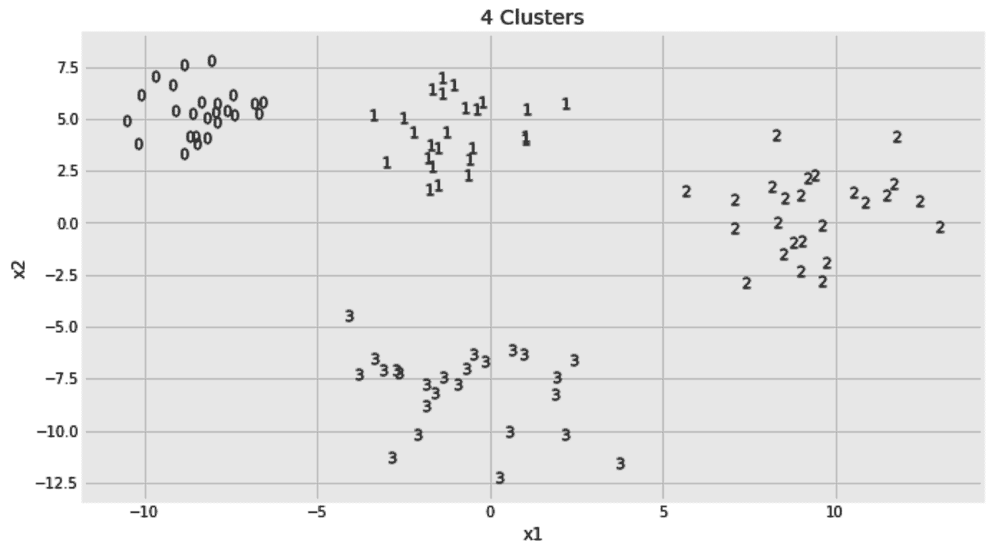

每个数据点根据其给定的标签进行标记。现在，我们将假装这些标签还没有给我们，看看 K-means 算法是否能够预测它们。

## K-均值聚类

既然我们假装没有给出标签，那么我们如何知道对 *K* 使用什么值，即`n_clusters`超参数？我们不能。我们现在随便选一个数字。稍后，我们将学习如何找到`n_clusters`的最佳值。让我们现在把它设置为五。我们将保持所有其他超参数的默认值。一旦算法被初始化，我们就可以使用它的`fit_predict`方法，如下所示:

```
from sklearn.cluster import KMeans
kmeans = KMeans(n_clusters=2, random_state=7)
x, y = df_blobs[['x1', 'x2']], df_blobs['y']
y_pred = kmeans.fit_predict(x)
```

请注意，拟合训练集和预测测试日期的概念在这里很少有意义。我们通常在同一个数据集上进行拟合和预测。我们也不向`fit`或`fit_predict`方法传递任何标签。

既然我们已经预测了新标签，我们可以使用`plot_2d_clusters()`函数将我们的预测与原始标签进行比较，如下所示:

```
fig, axs = plt.subplots(1, 2, figsize=(14, 6))

x, y = df_blobs[['x1', 'x2']], df_blobs['y']
plot_2d_clusters(x, y, axs[0])
plot_2d_clusters(x, y_pred, axs[1])

axs[0].set_title(f'Actuals: {axs[0].get_title()}')
axs[1].set_title(f'KMeans: {axs[1].get_title()}')
```

我将单词`Actuals`和`KMeans`添加到它们相应的图形标题上。生成的集群显示在下面的屏幕截图中:

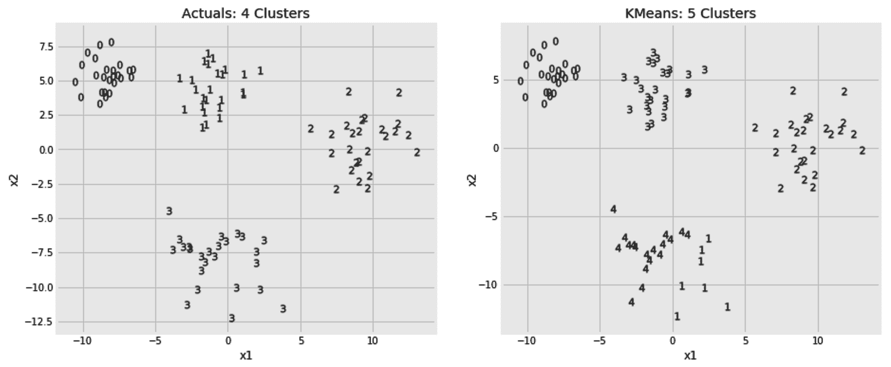

自从我们将 *K* 设置为 5 之后，原来的四个集群中的一个已经被分成了两个。除此之外，对其他集群的预测是有意义的。给予聚类的标签是任意的。算法将标签为 1 的原始聚类称为 3。只要集群有完全相同的成员，这就不会困扰我们。这也不会影响集群评估指标。在评估聚类算法时，他们通常会考虑这一事实并忽略标签名称。

但是，我们如何确定 K 的值呢？我们别无选择，只能用不同数量的聚类多次运行该算法，并选择最佳的一个。在下面的代码片段中，我们遍历了`n_clusters`的三个不同值。我们还可以访问最终的质心，这是在算法收敛后为每个聚类计算的。看到这些质心可以清楚地看出算法是如何将每个数据点分配给自己的聚类的。我们代码片段中的最后一行使用一个三角形标记来绘制三个图形的质心:

```
from sklearn.cluster import KMeans

n_clusters_options = [2, 4, 6]

fig, axs = plt.subplots(1, len(n_clusters_options), figsize=(16, 6))

for i, n_clusters in enumerate(n_clusters_options):

    x, y = df_blobs[['x1', 'x2']], df_blobs['y']

    kmeans = KMeans(n_clusters=n_clusters, random_state=7)
    y_pred = kmeans.fit_predict(x)

    plot_2d_clusters(x, y_pred, axs[i])

    axs[i].plot(
        kmeans.cluster_centers_[:,0], kmeans.cluster_centers_[:,1], 
        'k^', ms=12, alpha=0.75
    )

```

以下是三个选择的结果，并列排列:

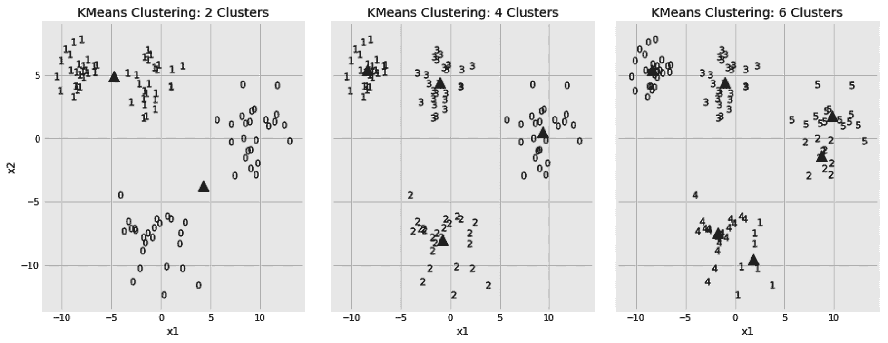

对这三个图的直观研究告诉我们，选择四个集群是正确的选择。然而，我们必须记住，我们在这里处理的是 2D 数据点。如果我们的数据样本包含两个以上的特征，那么同样的视觉调查会更加困难。在下一节中，我们将学习轮廓分数，并使用它来选择最佳的聚类数，而无需视觉辅助。

## 剪影配乐

**轮廓分数**是一个样本与其自己的聚类相比与其他聚类中的样本相似程度的度量。对于每个样本，我们将计算该样本与同一聚类中所有其他样本之间的平均距离。让我们称这个平均距离*为*。然后，我们计算同一个样本和最近聚类中所有其他样本之间的平均距离。让我们称这另一个平均距离为 *B* 。现在，我们可以定义轮廓分数，如下所示:

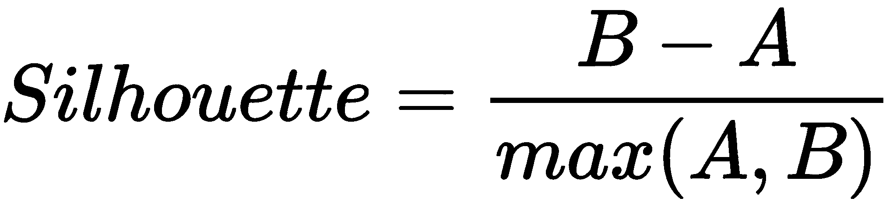

现在，我们将对`n_clusters`的多个值进行循环，并在每次迭代后存储轮廓得分，而不是对聚类进行可视化研究。如您所见，`silhouette_score`有两个参数——数据点(`x`)和预测的聚类标签(`y_pred`):

```
from sklearn.cluster import KMeans
from sklearn.metrics import silhouette_score

n_clusters_options = [2, 3, 4, 5, 6, 7, 8]
silhouette_scores = []

for i, n_clusters in enumerate(n_clusters_options):

    x, y = df_blobs[['x1', 'x2']], df_blobs['y']
    kmeans = KMeans(n_clusters=n_clusters, random_state=7)
    y_pred = kmeans.fit_predict(x)

    silhouette_scores.append(silhouette_score(x, y_pred))
```

我们可以选择给出最佳分数的`n_clusters`值。在这里，我们将计算出的分数放入一个数据框架中，并使用条形图进行比较:

```
fig, ax = plt.subplots(1, 1, figsize=(12, 6), sharey=False)

pd.DataFrame(
    {
        'n_clusters': n_clusters_options,
        'silhouette_score': silhouette_scores,
    }
).set_index('n_clusters').plot(
    title='KMeans: Silhouette Score vs # Clusters chosen',
    kind='bar',
    ax=ax
)
```

所得分数证实了我们最初的决定，即 4 是聚类数的最佳选择:

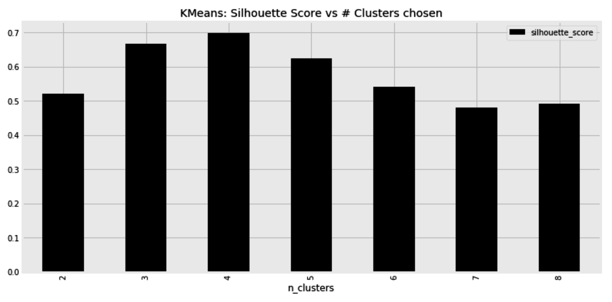

除了挑选聚类的数量之外，算法的初始质心的选择也影响其准确性。错误的选择可能导致 K-means 算法收敛于不期望的局部最小值。在下一节中，我们将见证初始质心如何影响算法的最终决策。

## 选择初始质心

默认情况下，scikit-learn 的 K-means 实现随机选取彼此相距较远的初始质心。它还会尝试多个初始质心，并选择一个给出最佳结果的质心。说到这里，我们也可以手动设置初始质心。在下面的代码片段中，我们将比较两个初始设置，看看它们对最终结果的影响。然后，我们将并排打印两个结果:

```
from sklearn.cluster import KMeans

initial_centroid_options = np.array([
    [(-10,5), (0, 5), (10, 0), (-10, 0)],
    [(0,0), (0.1, 0.1), (0, 0), (0.1, 0.1)],
])

fig, axs = plt.subplots(1, 2, figsize=(16, 6))

for i, initial_centroids in enumerate(initial_centroid_options):

    x, y = df_blobs[['x1', 'x2']], df_blobs['y']
    kmeans = KMeans(
       init=initial_centroids, max_iter=500, n_clusters=4, random_state=7
    )
    y_pred = kmeans.fit_predict(x)
    plot_2d_clusters(x, y_pred, axs[i])

    axs[i].plot(
       kmeans.cluster_centers_[:,0], kmeans.cluster_centers_[:,1], 'k^'
    )
```

下图显示了算法收敛后得到的聚类。为简洁起见，省略了部分样式代码:

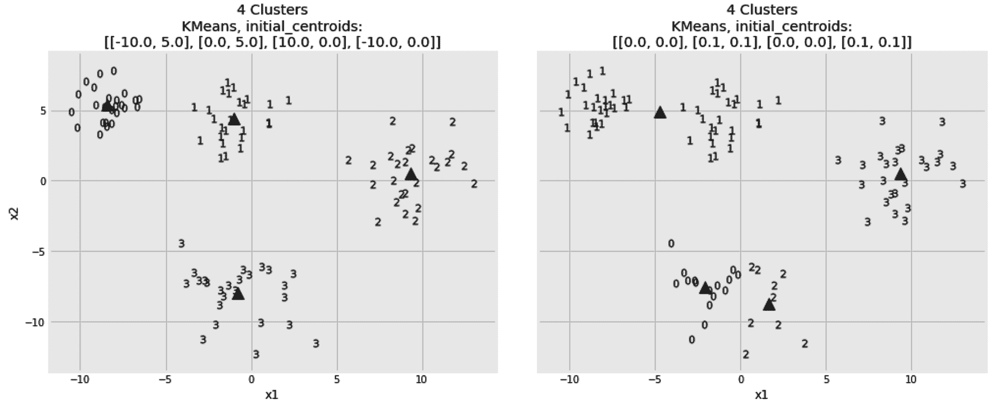

显然，第一个初始设置帮助了算法，而第二个导致了不好的结果。因此，我们必须知道算法的初始化，因为它的结果是不确定的。

在机器学习领域，术语迁移学习指的是一组问题，在这些问题中，我们需要在解决一个问题时重新调整所获得的知识，并将其应用于一个略有不同的问题。人类也需要迁移学习。K-means 算法有一个`fit_transform`方法。如果我们的数据( *x* )是由 *N* 个样本和 *M* 个特征组成的，该方法会将其转换为 *N* 个样本和 *K* 个列。列中的值基于预测的分类。通常情况下， *K* 比 *N* 小很多。因此，您可以重新调整 K 均值聚类**算法的用途，以便在将其转换后的输出提供给简单的分类器或回归器之前，将其用作降维步骤。类似地，在**多类**分类问题中，可以使用聚类算法来降低目标的基数。**

 **与 K-means 算法相反，**凝聚聚类**是另一种结果具有确定性的算法。它不依赖于任何初始选择，因为它从不同的角度处理聚类问题。凝聚聚类是下一节的主题。

# 凝聚聚类

"人口最稠密的城市不过是荒野的聚集地。"

阿尔多斯·赫胥黎

在 K-means 聚类算法中，我们从第一天就有了我们的 K 聚类。随着每次迭代，一些样本可能会改变它们的从属关系，一些聚类可能会改变它们的质心，但是最终，这些聚类是从最开始定义的。相反，在凝聚聚类中，开始时不存在聚类。最初，每个样本属于它自己的聚类。开始时，数据样本有多少，聚类就有多少。然后，我们找到两个最接近的样本，并将它们聚集到一个聚类中。之后，我们通过组合下一个最接近的两个样本、两个聚类或者下一个最接近的样本和一个聚类来继续迭代。如您所见，随着每次迭代，聚类数减少一个，直到所有样本都加入一个聚类。将所有样本放入一个聚类听起来不直观。因此，我们可以选择在任何迭代中停止算法，这取决于我们需要的最终聚类数。

至此，让我们学习如何使用凝聚聚类算法。要让算法提前中止其聚集任务，您所要做的就是通过其`n_clusters`超参数让它知道我们需要的最终聚类数。显然，由于我提到该算法合并了封闭的集群，我们需要深入研究如何计算集群间的距离，但现在让我们忽略这一点，我们稍后会谈到这一点。以下是当集群数量被设置为`4`时该算法的使用方法:

```
from sklearn.cluster import AgglomerativeClustering

x, y = df_blobs[['x1', 'x2']], df_blobs['y']

agglo = AgglomerativeClustering(n_clusters=4)
y_pred = agglo.fit_predict(x)

```

因为我们将聚类数设置为`4`，所以预测的`y_pred`将具有从 0 到 3 的值。

事实上，当聚类数为 4 时，凝聚聚类算法并没有停止。它继续聚合集群，并使用内部树结构跟踪哪些集群是哪些更大集群的成员。当我们指定只需要四个集群时，它会重新访问这个内部树，并相应地推断出集群的标签。在下一节中，我们将学习如何访问算法的内部层次结构，并跟踪它构建的树。

## 追踪聚集聚类的子聚类

正如我们前面提到的，每个样本或聚类都成为另一个聚类的成员，而另一个聚类又成为更大的聚类的成员，依此类推。这个层次结构存储在算法的`children_`属性中。该属性采用列表列表的形式。外部列表的成员数等于数据样本数减一。每个成员列表都由两个数字组成。我们可以列出`children_`属性的最后五个成员如下:

```
agglo.children_[-5:]
```

这将为我们提供以下列表:

```
array([[182, 193],
       [188, 192],
       [189, 191],
       [194, 195],
       [196, 197]])
```

列表的最后一个元素是树的根。它有两个孩子，`196`和`197`。这些是这个根节点的子节点的 id。大于或等于数据样本数的 ID 是聚类 ID，而较小的 ID 指的是单个样本。如果从一个集群 ID 中减去数据样本的数量，它将给出子列表中可以获得该集群成员的位置。从这些信息中，我们可以构建以下递归函数，该函数获取一系列子节点和数据样本，并返回所有分类及其成员的嵌套树，如下所示:

```
def get_children(node, n_samples):
    if node[0] >= n_samples:
        child_cluster_id = node[0] - n_samples
        left = get_children(
            agglo.children_[child_cluster_id], 
            n_samples
        )
    else:
        left = node[0]

    if node[1] >= n_samples:
        child_cluster_id = node[1] - n_samples
        right = get_children(
            agglo.children_[child_cluster_id], 
            n_samples
        )
    else:
        right = node[1]

    return [left, right]
```

我们可以像这样调用刚刚创建的函数:

```
root = agglo.children_[-1]
n_samples = df_blobs.shape[0]
tree = get_children(root, n_samples)
```

此时，`tree[0]`和`tree[1]`包含该树左侧和右侧样本的 IDs 这是两个最大聚类的成员。如果我们的目标是将样本分成四个组，而不是两个组，我们可以使用`tree[0][0]`、`tree[0][1]`、`tree[1][0]`和`tree[1][1]`。下面是`tree[0][0]`的样子:

```
[[[46, [[25, 73], [21, 66]]], [87, 88]],
 [[[22, 64], [4, [49, 98]]],
  [[19, [55, 72]], [[37, 70], [[[47, 82], [13, [39, 92]]], [2, [8, 35]]]]]]]
```

这种嵌套允许我们设置我们希望我们的集群有多深，并相应地检索它们的成员。然而，我们可以使用下面的代码来简化这个列表:

```
def flatten(sub_tree, flat_list):
    if type(sub_tree) is not list:
        flat_list.append(sub_tree)
    else:
        r, l = sub_tree
        flatten(r, flat_list)
        flatten(l, flat_list)
```

现在，我们可以得到一个`tree[0][0]`的成员，如下:

```
flat_list = []
flatten(tree[0][0], flat_list)
print(flat_list)
```

我们也可以模仿`fit_predict`的输出，使用下面的代码片段构建我们自己的预测标签。它会将从 0 到 3 的标签分配给我们构建的树的不同分支的成员。让我们称我们的预测标签为`y_pred_dash`:

```
n_samples = x.shape[0]
y_pred_dash = np.zeros(n_samples)
for i, j, label in [(0,0,0), (0,1,1), (1,0,2), (1,1,3)]:
    flat_list = []
    flatten(tree[i][j], flat_list)
    for sample_index in flat_list:
        y_pred_dash[sample_index] = label
```

为了确保我们的代码按预期工作，`y_pred_dash`中的值应该与上一节中的`y_pred`中的值相匹配。尽管如此，没有说树的`tree[0][0]`部分是否应该被赋予标签`0`、`1`、`2`或`3`。我们对标签的选择是任意的。因此，我们需要一个评分函数来比较这两个预测，同时考虑到标签名称可能会有所不同。这是调整后的兰德指数的工作，这将是下一节的主题。

## 调整后的兰德指数

**调整后的 Rand 指数**就其分类而言与准确度分数非常相似。它计算两个标签列表之间的一致程度，但它考虑了准确性分数无法处理的以下问题:

*   调整后的 rand 索引并不太关心实际的标签，只要这里的一个集群的成员与那里的集群的成员相同。
*   不像在分类中，我们可能会有太多的集群。在将每个样本作为其自己的聚类的极端情况下，如果我们忽略标签的名称，任何两个聚类列表将彼此一致。因此，调整后的 rand 指数降低了两个集群偶然一致的可能性。

当两个预测匹配时，调整得最好的 rand 指数是`1`。因此，我们可以用它来比较`y_pred`和我们的`y_pred_dash`。分数是对称的，因此在调用计分函数时，其参数的顺序并不重要，如下所示:

```
from sklearn.metrics import adjusted_rand_score
adjusted_rand_score(y_pred, y_pred_dash)
```

因为我们得到了调整后的 rand 索引`1`，我们可以放心，我们从子树中推断集群成员的代码是正确的。

我很快提到，在每一次迭代中，算法结合两个最接近的集群。很容易想象如何计算两个样本之间的距离。它们基本上是两个点，我们之前已经使用过不同的距离度量，例如欧几里德距离和曼哈顿距离。然而，集群不是一个点。我们到底应该从哪里开始测量距离？我们要用星团的质心吗？我们是否应该在每个集群中选择一个特定的数据点来计算与它的距离？所有这些选择都可以使用**联动**超参数来指定。在下一部分，我们将看到它的不同选项。

## 选择集群链接

默认情况下，**欧几里德**距离用于决定哪些聚类对彼此最接近。该默认指标可以使用**关联**超参数进行更改。如果您想了解更多关于不同距离度量的信息，如**c**osine 和 **Manhattan** 距离，请参考[第 5 章](b95b628d-5913-477e-8897-989ce2afb974.xhtml)T25，最近邻图像处理。在计算两个聚类之间的距离时，**链接**标准决定了如何测量距离，因为一个聚类通常包含多个数据点。在*完全*链接中，使用两个集群中所有数据点之间的最大距离。相反，在*单*联动中，使用最小距离。显然，*平均*连杆取所有样本对之间所有距离的平均值。在*沃德*链接中，如果两个聚类中的每个数据点与合并聚类的质心之间的平均欧几里德距离最小，则两个聚类合并。只有欧几里得距离可以用于沃德连接。

为了能够比较上述链接方法，我们需要创建一个新的数据集。数据点将以两个同心圆的形式排列。较小的圈子被包围在较大的圈子里，比如莱索托和南非。`make_circles`功能指定要生成的样本数量(`n_samples`)、两个圆相距多远(`factor`)以及数据的噪声程度(`noise`):

```
from sklearn.datasets import make_circles
x, y = make_circles(n_samples=150, factor=0.5, noise=0.05, random_state=7)
df_circles = pd.DataFrame({'x1': x[:,0], 'x2': x[:,1], 'y': y})
```

我将很快显示结果数据集，但首先，让我们使用凝聚算法对新的数据样本进行聚类。我将运行该算法两次:第一次使用完整的链接，然后使用单个链接。这次我将使用曼哈顿距离:

```
from sklearn.cluster import AgglomerativeClustering

linkage_options = ['complete', 'single']

fig, axs = plt.subplots(1, len(linkage_options) + 1, figsize=(14, 6))

x, y = df_circles[['x1', 'x2']], df_circles['y']

plot_2d_clusters(x, y, axs[0])
axs[0].set_title(f'{axs[0].get_title()}\nActuals')

for i, linkage in enumerate(linkage_options, 1):

    y_pred = AgglomerativeClustering(
        n_clusters=2, affinity='manhattan', linkage=linkage
    ).fit_predict(x)

    plot_2d_clusters(x, y_pred, axs[i])

    axs[i].set_title(f'{axs[i].get_title()}\nAgglomerative\nLinkage= {linkage}')
```

以下是两种链接方法的并列结果:

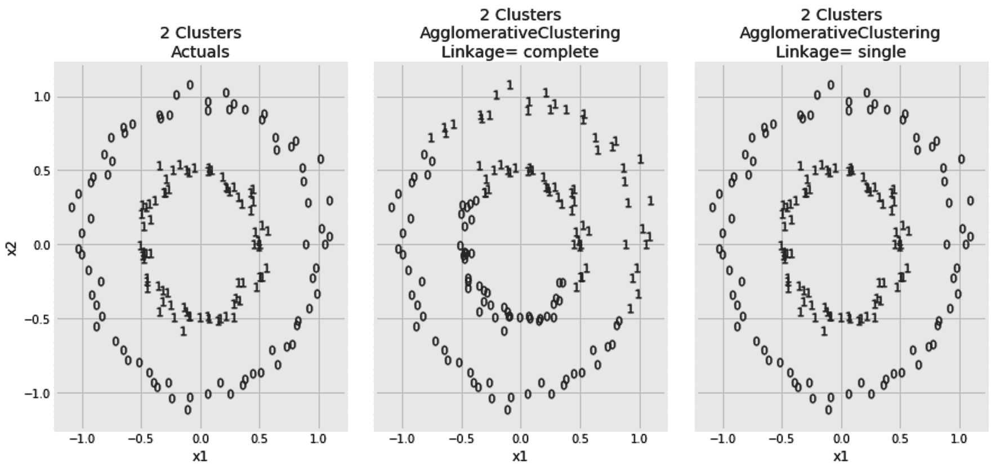

当使用单个链接时，考虑每个集群对之间的最短距离。这使它能够识别数据点排列的圆形条带。竞争链接考虑集群之间的最长距离。这导致了更有偏见的结果。显然，单一联系在这里有最好的结果。然而，由于其变化，它会受到噪声的影响。为了证明这一点，我们可以在将噪声从`0.05`增加到`0.08`后再次生成圆形样本，如下所示:

```
from sklearn.datasets import make_circles
x, y = make_circles(n_samples=150, factor=0.5, noise=0.08, random_state=7)
df_circles = pd.DataFrame({'x1': x[:,0], 'x2': x[:,1], 'y': y})
```

对新样本运行相同的聚类算法将得到以下结果:

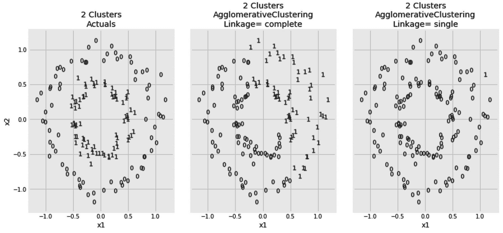

这一次，嘈杂的数据混淆了我们的单个链接，而完整链接的结果没有太大变化。在单个链接中，位于两个集群之间的噪声点可能会导致它们合并。平均联系可视为单一和完全联系标准之间的中间地带。由于这些算法的迭代性质，三种链接方法导致较大的集群变得更大。这可能会导致集群大小不均匀。如果必须避免出现不平衡的集群，那么沃德连锁应该比其他三种连锁方法更受青睐。

到目前为止，K-means 和凝聚聚类算法需要预先定义期望的聚类数。凝聚**聚类**相比 K-means 算法计算量大，而 K-means 算法无法处理非凸数据。在下一节中，我们将看到第三种算法，它不需要预先定义聚类数。****

 ****# 基于密度的噪声应用空间聚类

"除非你从一个人的角度考虑问题，否则你永远不会真正了解他。"

哈柏·李

首字母缩略词 **DBSCAN** 代表**带噪声应用的基于密度的空间聚类**。它认为集群是由低密度区域分隔开的高密度区域。这使得它可以处理任何形状的星团。这与 K-means 算法相反，K-means 算法假设聚类是凸的；也就是说，具有质心的数据块。DBSCAN **算法从识别核心样本开始。这些点在`eps` ( ***ε*** )的距离内至少有`min_samples`。最初，一个聚类是从它的核心样本中构建出来的。一旦一个核心样本被识别，它的邻居也被检查并且如果它们满足核心样本标准就被添加到聚类中。然后，扩展集群，以便我们可以向其中添加非核心样本。这些样品可以在`eps`的距离内从岩心样品直接到达，但它们本身不是岩心样品。一旦所有的聚类连同它们的核心和非核心样本被识别，剩余的样本被认为是噪声。**

 **很明显，`min_samples`和`eps`超参数在最终预测中起着重要作用。这里，我们将`min_samples`设置为`3`，并尝试对`eps` ***:*** 进行不同的设置

```
from sklearn.cluster import DBSCAN

eps_options = [0.1, 1.0, 2.0, 5.0]

fig, axs = plt.subplots(1, len(eps_options) + 1, figsize=(14, 6))

x, y = df_blobs[['x1', 'x2']], df_blobs['y']

plot_2d_clusters(x, y, axs[0])
axs[0].set_title(f'{axs[0].get_title()}\nActuals')

for i, eps in enumerate(eps_options, 1):

    y_pred = DBSCAN(eps=eps, min_samples=3, metric='euclidean').fit_predict(x)

    plot_2d_clusters(x, y_pred, axs[i])
    axs[i].set_title(f'{axs[i].get_title()}\nDBSCAN\neps = {eps}')
```

斑点数据集的结果聚类帮助我们识别`eps` **超参数的效果:**

 **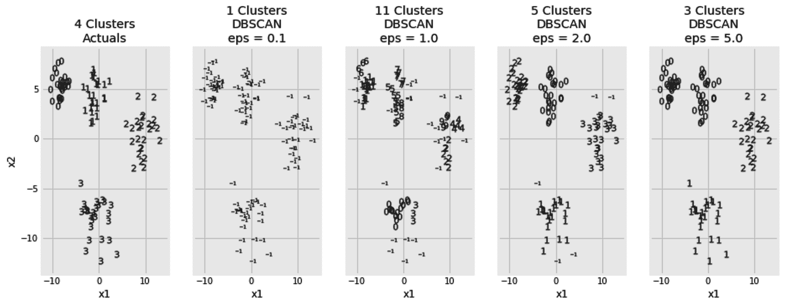

非常小的`eps`不允许任何核心样本形成。当`eps`设置为`0.1`时，几乎所有的点都被当成了噪声。随着我们增加`eps`的值，核心点开始形成。但是，在某个时刻，当`eps` **被设置为`0.5`时，两个集群被错误合并。**

 **同样，`min_samples`的值可以决定我们聚类算法的成败。这里，我们将为我们的同心数据点尝试不同的`min_samples` **值:**

```
from sklearn.cluster import DBSCAN

min_samples_options = [3, 5, 10]

fig, axs = plt.subplots(1, len(min_samples_options) + 1, figsize=(14, 6))

x, y = df_circles[['x1', 'x2']], df_circles['y']

plot_2d_clusters(x, y, axs[0])
axs[0].set_title(f'{axs[0].get_title()}\nActuals')

for i, min_samples in enumerate(min_samples_options, 1):

    y_pred = DBSCAN(
        eps=0.25, min_samples=min_samples, metric='euclidean', n_jobs=-1
    ).fit_predict(x)

    plot_2d_clusters(x, y_pred, axs[i])

    axs[i].set_title(f'{axs[i].get_title()}\nDBSCAN\nmin_samples = {min_samples}')
```

这里，我们可以看到`min_samples`对我们的聚类结果的影响:

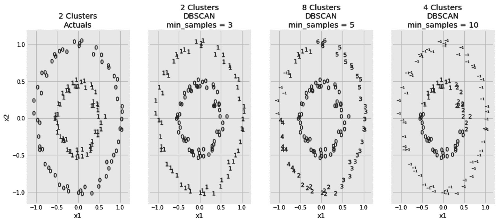

再一次，谨慎选择`min_samples`给出了最好的结果。与`eps`相反，`min_samples`的值越大，岩心样品越难形成。

除了前面提到的超参数，我们还可以改变算法使用的距离度量。通常，`min_samples`取 3 以上的值。将`min_samples`设置为 1 意味着每个样本将成为自己的聚类，而将其设置为 2 将给出与凝聚聚类算法相似的结果，但只有一个链接。你可以从设置`min_samples`值开始，使你的数据维度加倍；也就是特征数量的两倍。然后，如果已知您的数据有噪声，您可以增加它，否则减少它。至于`eps`，我们可以用下面的 **k 线图**。

在同心数据集中，我们将`min_samples`设为 3。现在，对于每个样本，我们想看看它的两个邻居有多远。以下代码片段计算每个点与其最近的两个相邻点之间的距离:

```
from sklearn.neighbors import NearestNeighbors

x = df_circles[['x1', 'x2']]
distances, _ = NearestNeighbors(n_neighbors=2).fit(x).kneighbors()
```

如果`min_samples`被设置为任何其他数字，我们将希望获得与该数字一样多的邻居，减去 1。现在，我们可以关注每个样本中两个距离最远的邻居，并绘制所有结果距离，如下所示:

```
pd.Series(distances[:,-1]).sort_values().reset_index(drop=True).plot() 
```

生成的图形如下所示:

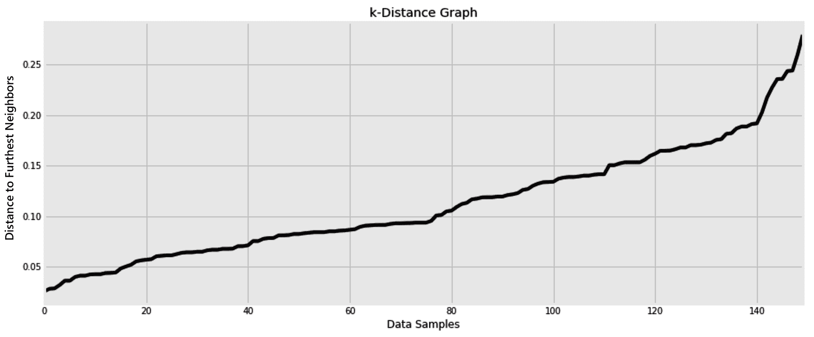

图表中斜率发生显著变化的点为我们提供了对`eps`值的粗略估计。这里，当`min_samples`被设置为 3 时，`0.2`的一个`eps`值听起来相当正确。此外，我们可以为这两个数字尝试不同的值，并使用轮廓得分或任何其他聚类度量来微调我们的超参数。

# 摘要

英国历史学家阿诺德·汤因比曾经说过，“工具是万能的”。在本章中，我们使用了三种工具进行聚类。我们在这里讨论的三种算法都从不同的角度处理这个问题。K-means 聚类算法试图找到概括聚类和质心的点，并围绕这些点构建聚类。凝聚聚类方法更像是一种自底向上的方法，而 DBSCAN 聚类算法引入了核心点和密度等新概念。本章是处理无监督学习问题的三章中的第一章。这里标签的缺乏迫使我们学习更新的评估指标，如调整后的 rand 指数和剪影得分。

在下一章，我们将处理我们的第二个无监督学习问题:**异常检测**。幸运的是，这里讨论的概念，以及来自[第 5 章](b95b628d-5913-477e-8897-989ce2afb974.xhtml)、*最近邻图像处理、*关于最近邻和最近质心算法的概念将在下一章对我们有所帮助。我们将再次得到未标记的数据样本，我们的任务是挑选出奇怪的样本。***************