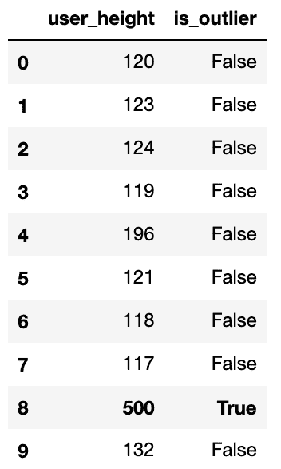
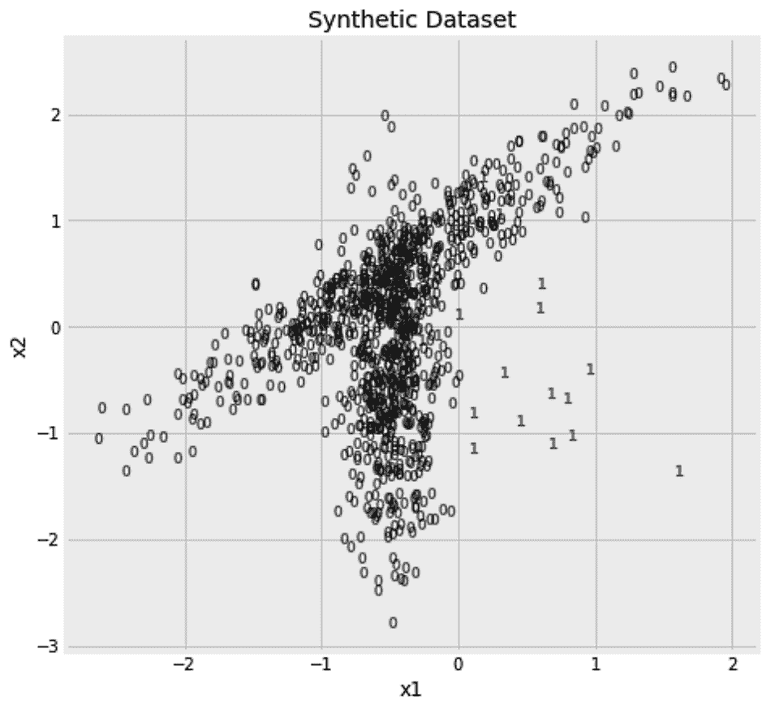

<title>Anomaly Detection – Finding Outliers in Data</title>  Anomaly Detection – Finding Outliers in Data

检测数据中的异常是机器学习中反复出现的主题。在[第 10 章](https://cdp.packtpub.com/hands_on_machine_learning_with_scikit_learn/wp-admin/post.php?post=32&action=edit) [、](https://cdp.packtpub.com/hands_on_machine_learning_with_scikit_learn/wp-admin/post.php?post=32&action=edit) *不平衡学习——连 1%都没中彩票*中，我们学会了如何在我们的数据中发现这些有趣的少数民族。那时，数据是有标签的，前几章的分类算法适用于这个问题。除了**标记的异常检测**问题，还有数据未被标记的情况。

在这一章中，我们将学习如何识别数据中的异常值，即使没有提供标签。我们将使用三种不同的算法，并了解**未标记异常检测**的两个分支。以下是本章将涉及的主题:

*   未标记异常检测
*   使用基本统计检测异常
*   使用`EllipticEnvelope`检测异常值
*   使用**局部异常因子** ( **LOF** )进行异常和新奇检测
*   使用隔离林检测异常值

# 未标记异常检测

在这一章中，我们将从一些未标记的数据开始，我们需要找出其中的异常样本。我们可能只得到内联体，我们想从它们那里了解正常数据是什么样子的。然后，在我们的内联体上拟合一个模型之后，我们得到了新的数据，并需要找出任何偏离目前所见数据的离群值。这类问题被称为**新颖性检测** **n** 。另一方面，如果我们在由内点和外点组合而成的数据集上拟合我们的模型，那么这个问题被称为**外点检测**问题。

像任何其他无标签算法一样，`fit`方法忽略任何给定的标签。为了一致性，这个方法的接口允许你同时传入 *x* 和 *y* ，但是 *y* 被忽略。在新奇检测的情况下，合乎逻辑的做法是首先对不包含离群值的数据集使用`fit`方法，然后对包含离群值和内联值的数据使用算法的`predict`方法。相反，对于异常值检测问题，通常应用您的`fit`方法，并用`fit_predict`方法一次性预测。

在使用我们的任何算法之前，我们需要创建一个样本数据集，以便在本章中使用。我们的数据将包括 1，000 个样本，其中 98%来自特定的分布，其余 2%来自不同的分布。在下一节中，我们将详细了解如何创建这个样本数据。

## 生成样本数据

`make_classification`功能允许我们指定样本的数量以及特征的数量。我们可以限制信息特征的数量，并使一些特征冗余，即依赖于信息特征。我们还可以制作一些信息性或冗余特征的副本。在我们当前的用例中，我们将确保我们所有的特性都是信息性的，因为我们将限制自己只使用两个特性。由于`make_classification`函数意在为分类问题产生数据，它返回 *x* 和 *y* 。

在构建模型时，我们将忽略 *y* ，仅在以后的评估中使用它。我们将通过设置`n_clusters_per_class`到`2`来确保每个类来自两个不同的发行版。我们将通过将`scale`设置为单个值来保持两个特征的相同比例。我们还将确保数据被随机打乱(`shuffle=True`)，并且没有来自一个类的样本被标记为另一个类的成员(`flip_y=0`)。最后，我们将把`random_state`设置为`0`，以确保在我们的计算机上运行以下代码时，我们得到完全相同的随机数据:

```
from sklearn.datasets import make_classification

x, y = make_classification(
    n_samples=1000, n_features=2, n_informative=2, n_redundant=0, n_repeated=0, 
    n_classes=2, n_clusters_per_class=2, weights=[0.98, ], class_sep=0.5, 
    scale=1.0, shuffle=True, flip_y=0, random_state=0
)
```

既然样本数据已经准备好了，是时候考虑如何检测其中的异常值了。

# 使用基本统计检测异常

与其直接跳到 scikit-learn 中可用的算法，不如让我们从思考检测异常样本的方法开始。想象一下，每小时测量一下你网站的流量，你会得到以下数字:

```
hourly_traffic = [
    120, 123, 124, 119, 196, 
    121, 118, 117, 500, 132
]
```

看看这些数字，`500`与其他数字相比听起来很高。从形式上来说，如果假设每小时的交通数据是正态分布的，那么`500`就离它的均值或期望值更远。我们可以通过计算这些数字的平均值，然后检查偏离平均值超过 2 或 3 个标准偏差的数字来衡量这一点。同样，我们可以计算一个高分位数，并检查哪些数字高于它。在这里，我们找到了高于第 95 个百分位数的值:

```
pd.Series(hourly_traffic) > pd.Series(hourly_traffic).quantile(0.95)
```

这段代码将给出一个`False`值的数组，除了倒数第二个值，它对应于`500`。在打印出结果之前，让我们将前面的代码用它的`fit`和`predict`方法做成一个估计器的形式。`fit`方法计算并保存阈值，`predict`方法将新数据与保存的阈值进行比较。我还添加了一个`fit_predict`方法，依次执行这两个操作。下面是估算器的代码:

```
class PercentileDetection:

    def __init__(self, percentile=0.9):
        self.percentile = percentile

    def fit(self, x, y=None):
        self.threshold = pd.Series(x).quantile(self.percentile)

    def predict(self, x, y=None):
        return (pd.Series(x) > self.threshold).values

    def fit_predict(self, x, y=None):
        self.fit(x)
        return self.predict(x) 
```

我们现在可以使用新创建的估计器。在下面的代码片段中，我们使用第 95 ^个百分位数作为我们的估计量。然后，我们将结果预测与原始数据一起放入数据框中。最后，我添加了一些样式逻辑，用粗体标记有异常值的行:

```
outlierd = PercentileDetection(percentile=0.95)
pd.DataFrame(
    {
        'hourly_traffic': hourly_traffic,
        'is_outlier': outlierd.fit_predict(hourly_traffic)
    }
).style.apply(
    lambda row: ['font-weight: bold'] * len(row) 
        if row['is_outlier'] == True 
        else ['font-weight: normal'] * len(row),
    axis=1
)
```

以下是生成的数据框:



我们可以将同样的逻辑应用于上一节的数据集吗？嗯，是的，但是我们首先要搞清楚如何把它应用到多维数据上。

## 对多维数据使用百分位数

与`hourly_traffic`数据不同，我们使用`make_classification`函数生成的数据是多维的。这次我们要检查的功能不止一个。显然，我们可以分别检查每个特性。下面是检查第一个特征的异常值的代码:

```
outlierd = PercentileDetection(percentile=0.98)
y_pred = outlierd.fit_predict(x[:,0])
```

我们也可以对另一个特性做同样的事情:

```
outlierd = PercentileDetection(percentile=0.98)
y_pred = outlierd.fit_predict(x[:,1])
```

现在，我们已经结束了两个预测。我们可以以这样一种方式将它们组合起来，即如果每个样本相对于两个特征中的任何一个是异常值，那么它就被标记为异常值。在下面的代码片段中，我们将调整`PercentileDetection` **估算器来实现这一点:**

```
class PercentileDetection:

    def __init__(self, percentile=0.9):
        self.percentile = percentile

    def fit(self, x, y=None):
        self.thresholds = [
            pd.Series(x[:,i]).quantile(self.percentile)
            for i in range(x.shape[1])
        ]

    def predict(self, x, y=None):
        return (x > self.thresholds).max(axis=1)

    def fit_predict(self, x, y=None):
        self.fit(x)
        return self.predict(x)
```

现在，我们可以使用调整后的估计值，如下所示:

```
outlierd = PercentileDetection(percentile=0.98)
y_pred = outlierd.fit_predict(x) 
```

我们还可以使用之前忽略的标签来计算新估计量的精度和召回率。由于我们关心标签为`1`的少数类，我们在下面的代码片段中将`pos_label`设置为`1`:

```
from sklearn.metrics import precision_score, recall_score

print(
    'Precision: {:.02%}, Recall: {:.02%} [Percentile Detection]'.format(
        precision_score(y, y_pred, pos_label=1),
        recall_score(y, y_pred, pos_label=1),
    )
)
```

这给出了`4%`的精度和`5%`的召回。你期待更好的结果吗？我也是。也许我们需要绘制我们的数据，以了解我们的方法可能存在的问题。这是数据集，其中每个样本根据其标签进行标记:



我们的方法检查每个点，并查看它是否在两个轴中的一个轴上是极值。尽管事实上界外点离内点更远，但是仍然有内点共享界外点的每个点的相同水平或垂直位置。换句话说，如果您将您的点投影到两个轴中的任何一个轴上，您将无法再将界外值与内值分开。因此，我们需要一种方法来同时考虑这两个轴。如果我们找到两个轴的中间点，即数据的中心，然后围绕它画一个圆或椭圆，会怎么样？然后，我们可以将落在这个椭圆之外的任何点视为异常值。这个新策略会有帮助吗？幸运的是，这就是`EllipticEnvelope` 算法所做的。

# 使用椭圆包络检测异常值

"我被平庸的恐惧吓倒了。"

泰勒·斯威夫特

`EllipticEnvelope`算法找到数据样本的中心，然后围绕该中心绘制一个椭球。在**马哈拉诺比斯**距离中测量每个轴上椭球的半径。您可以将马氏距离视为欧几里得距离，其单位是每个方向上的标准偏差数。绘制椭球后，落在椭球外的点可以被视为异常值。

**多元高斯分布**是`EllipticEnvelope`算法的关键概念。这是一维高斯分布的推广。如果高斯分布由单值均值和方差定义，那么多元高斯分布由均值和协方差矩阵定义。然后使用多元高斯分布来绘制一个椭球，该椭球定义了什么是正常的，什么是异常值。

下面是我们如何使用算法的默认设置，使用`EllipticEnvelope`算法来检测数据异常值。请记住，本章中所有离群点检测算法的`predict`方法为离群点返回`-1`，为内联点返回`1`:

```
from sklearn.covariance import EllipticEnvelope

ee = EllipticEnvelope(random_state=0)
y_pred = ee.fit_predict(x) == -1
```

我们可以使用与上一节完全相同的代码来计算预测的精度和召回分数:

```
from sklearn.metrics import precision_score, recall_score

print(
    'Precision: {:.02%}, Recall: {:.02%} [EllipticEnvelope]'.format(
        precision_score(y, y_pred, pos_label=1),
 recall_score(y, y_pred, pos_label=1),
    )
)
```

这一次，我们得到了`9%`的精度和`45%`的召回。这已经比以前的成绩好了，但是我们还能做得更好吗？嗯，如果你再看一下数据，你会注意到它是非凸的。我们已经知道，每个类中的样本来自多个分布，因此这些点的形状看起来并不完全适合椭圆。这意味着我们应该使用一种基于局部距离和密度的算法，而不是将所有东西与固定的质心进行比较。**局部异常因素** ( **LOF** )给了我们这个特征。如果前一章的 **k 均值** **聚类** **算法**与椭圆包络算法属于同一组，那么 LOF 将是 **DBSCAN** 算法的对应物。

# 使用 LOF 的异常和新奇检测

"疯狂在个人身上很少见——但在团体、党派、国家和时代中，这是普遍现象."

弗里德里希·尼采

LOF 采取了与尼采相反的方法——它将一个样本的密度与其邻居的局部密度进行比较。与相邻样本相比，存在于低密度区域的样本被视为异常值。像任何其他基于邻居的算法一样，我们有参数来指定要考虑的邻居数量(`n_neighbors`)和用于查找邻居的距离度量(`metric`和`p`)。默认情况下，使用欧几里德距离，即`metric='minkowski'`和`p=2`。有关可用距离度量的更多信息，可参考[第 5 章](https://cdp.packtpub.com/hands_on_machine_learning_with_scikit_learn/wp-admin/post.php?post=28&action=edit)、*最近邻图像处理*。下面是我们如何使用`LocalOutlierFactor`进行离群点检测，使用 50 个邻居及其默认距离度量:

```
from sklearn.neighbors import LocalOutlierFactor

lof = LocalOutlierFactor(n_neighbors=50)
y_pred = lof.fit_predict(x) == -1
```

精确度和召回分数现在进一步改进了事件。我们得到了精度值`26%`和召回值`65%`。

就像具有`predict`方法和`predict_proba`方法的分类器一样，异常值检测算法不仅能给我们二元预测，还能告诉我们它们有多确信样本是异常值。一旦 LOF 算法被拟合，它就将其异常因子分数存储在`negative_outlier_factor_`中。如果分数更接近`-1`，则样本更有可能是异常值。因此，我们可以使用这个分数，将其底部 1%、2%或 10%的值设置为异常值，并考虑其余的内值。下面是在上述每个阈值下不同性能指标的比较:

```
from sklearn.metrics import precision_score, recall_score

lof = LocalOutlierFactor(n_neighbors=50)
lof.fit(x)

for quantile in [0.01, 0.02, 0.1]:

    y_pred = lof.negative_outlier_factor_ < np.quantile(
        lof.negative_outlier_factor_, quantile
    ) 

    print(
        'LOF: Precision: {:.02%}, Recall: {:.02%} [Quantile={:.0%}]'.format(
            precision_score(y, y_pred, pos_label=1),
            recall_score(y, y_pred, pos_label=1),
            quantile
        )
    )
```

以下是不同的精确度和召回分数:

```
# LOF: Precision: 80.00%, Recall: 40.00% [Quantile=1%]
# LOF: Precision: 50.00%, Recall: 50.00% [Quantile=2%]
# LOF: Precision: 14.00%, Recall: 70.00% [Quantile=10%]
```

与分类器概率的情况一样，这里存在不同阈值的精确度和召回分数之间的权衡。这就是你如何微调你的预测来满足你的需求。如果已知真实标签，也可以使用`negative_outlier_factor_`绘制**接收器工作特性** ( **ROC** )或**精度召回** ( **PR** )曲线。

除了用于离群点检测之外，theLOF **算法还可以用于新颖性检测。**

 **## 使用 LOF 的新颖性检测

当用于离群点检测时，该算法必须适用于具有其内点和离群点的数据集。在新奇检测的情况下，我们被期望只在内联体上使用算法，然后在以后的污染数据集上进行预测。此外，为了用于新颖性检测，在算法的初始化过程中有`novelty=True`。在这里，我们从我们的数据中移除异常值，并使用结果子样本`x_inliers`和`fit`函数。然后，我们正常预测原始数据集:

```
from sklearn.neighbors import LocalOutlierFactor

x_inliers = x[y==0]

lof = LocalOutlierFactor(n_neighbors=50, novelty=True)
lof.fit(x_inliers)
y_pred = lof.predict(x) == -1
```

与我们使用该算法进行异常值检测时相比，得到的精度(`26.53%`)和召回(`65.00%`)值变化不大。最后，在新颖性检测和异常值检测方法方面的选择是一种策略。这取决于模型建立时的可用数据以及是否包含异常值。

你现在可能已经知道我喜欢使用集成方法，所以我很难在不展示一个用于离群点检测的集成算法的情况下结束这一章。在下一节中，我们将看看**isola****tion****forest**算法。

# 使用隔离林检测异常值

在以前的方法中，我们从定义什么是正常开始，然后将不符合这一点的任何东西视为异常值。隔离林算法遵循不同的方法。由于离群值很少且不同，因此它们更容易与其他值隔离开来。因此，当构建随机树的森林时，在树的早期以叶节点结束的样本——也就是说，它不需要大量的分支工作就能被隔离——更有可能是异常值。

作为一个基于树的集成，该算法与其对应算法共享许多超参数，例如要构建的随机树的数量(`n_estimators`)、构建每棵树时要使用的样本比率(`max_samples`)、构建每棵树时要考虑的特征比率(`max_features`)以及是否使用替换进行采样(`bootstrap`)。您也可以通过将`n_jobs`设置为`-1`，使用您机器上所有可用的 CPU 并行构建这些树。这里，我们将构建一个包含 200 棵树的隔离森林算法，然后用它来预测数据集中的离群值。像本章中的所有其他算法一样，`-1`的预测意味着样本被视为异常值:

```
from sklearn.ensemble import IsolationForest

iforest = IsolationForest(n_estimators=200, n_jobs=-1, random_state=10)
y_pred = iforest.fit_predict(x) == -1
```

得到的精度(`6.5%`)和召回(`60.0%`)值不如以前的方法好。显然，LOF 是最适合我们手头数据的算法。我们能够比较这三种算法，因为原始标签对我们来说是可用的。实际上，标签通常是不可用的，并且很难决定使用哪种算法。未标记异常检测评估领域正在积极研究中，我希望看到 scikit-learn 在未来实现可靠的评估指标。

在监督学习的情况下，您可以使用真实标签来评估使用 PR 曲线的模型。谈到未标记的数据，最近的研究人员正试图定制评估标准，如**过剩质量** ( **EM** )和**质量-体积** ( **MV** )曲线。

# 摘要

到目前为止，在本书中，我们已经使用监督学习算法来识别异常样本。当没有提供标签时，本章提供了额外的解决方案。这里解释的解决方案源于机器学习的不同领域，如统计学习、最近邻和基于树的集成。这里介绍的三种工具都有优势，但也有缺点。我们还了解到，在没有提供标签的情况下评估机器学习算法是很棘手的。

本章将处理未标记的数据。在前一章中，我们学习了如何对数据进行聚类，然后我们在这里学习了如何检测数据中的异常值。不过，在本书中，我们还有一个关于无监督学习的话题要讨论。在下一章，我们将讨论一个与电子商务相关的重要话题——推荐引擎。由于这是本书的最后一章，我也想介绍一下机器学习模型部署的可能方法。我们将学习如何保存和加载我们的模型，以及如何在**应用编程接口**(**API**)上部署它们。****