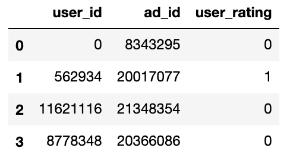
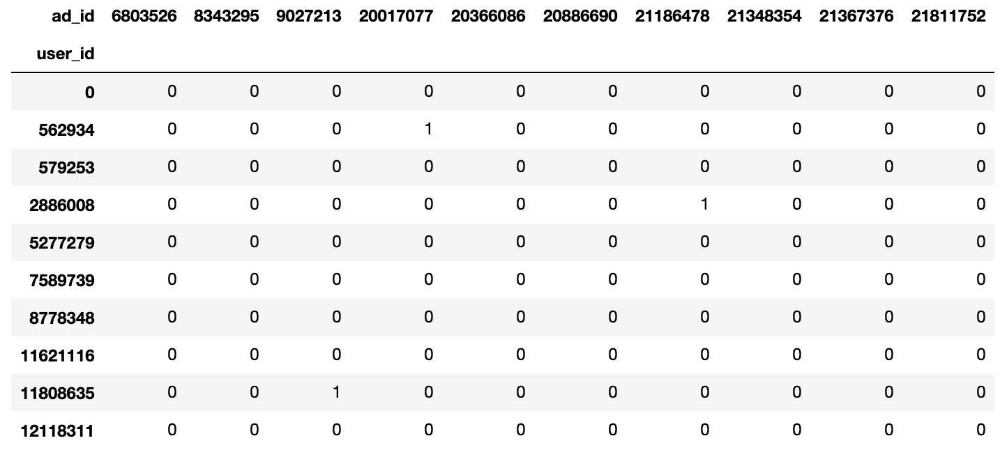
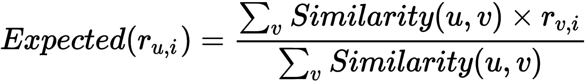
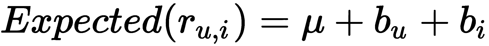
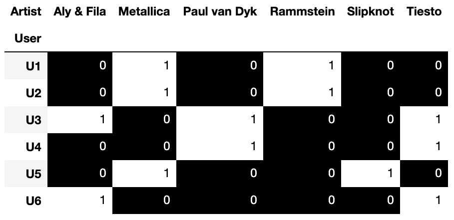
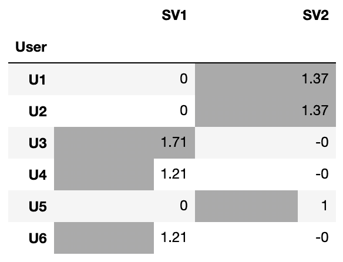
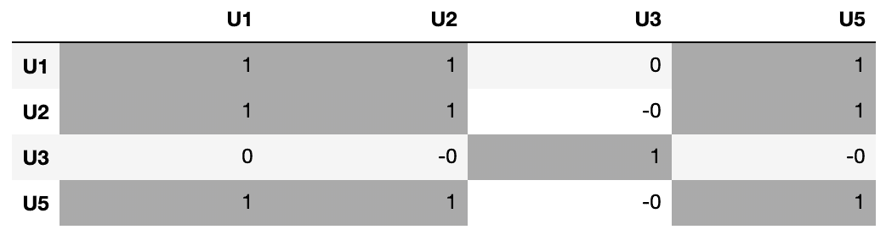
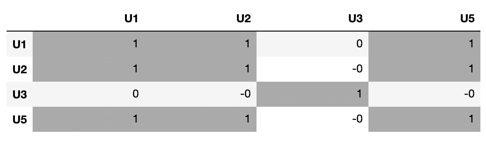
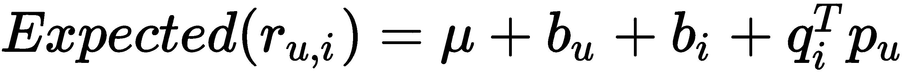

# 十三、推荐系统：了解它们的口味

外行人可能不知道控制证券交易所高频交易的复杂机器学习算法。他们可能也不知道检测网上犯罪和控制太空任务的算法。然而，他们每天都与推荐引擎互动。他们每天都见证着推荐引擎在亚马逊上为他们挑选阅读的书籍，在网飞上选择他们接下来应该看的电影，并影响他们每天阅读的新闻文章。推荐引擎在许多行业的流行需要不同风格的推荐算法。

在这一章中，我们将学习推荐系统使用的不同方法。我们将主要使用一个名为 Surprise 的姐妹库来学习 scikit。Surprise 是一个实现不同协同过滤算法的工具包。因此，我们将从学习推荐引擎中使用的*c*协同过滤算法和*基于内容的过滤*算法之间的区别开始。我们还将学习如何将我们训练好的模型打包，以供其他软件使用，而无需重新训练。这里将讨论以下主题:

*   不同的推荐范例
*   下载惊喜和数据集
*   使用 KNN 启发的算法
*   使用基线算法
*   使用奇异值分解
*   在生产中部署机器学习模型

# 不同的推荐范例

在推荐任务中，您有一组用户与一组项目进行交互，您的工作是找出哪些项目适合哪些用户。你可能对每个用户略知一二:他们住在哪里，他们挣多少钱，他们是通过手机还是平板电脑登录的，等等。类似地，对于一个项目——比如说一部电影——你知道它的类型、制作年份以及它获得了多少奥斯卡奖。显然，这看起来像是一个分类问题。您可以将用户特征与项目特征结合起来，为每个用户-项目对构建一个分类器，然后尝试预测用户是否会喜欢该项目。这种方法被称为**基于内容的过滤**。顾名思义，它和从每个用户、每个项目中提取的内容或特征一样好。实际上，您可能只知道每个用户的基本信息。用户的位置或性别可能会充分揭示他们的口味。这种方法也很难推广。假设我们决定扩展我们的推荐引擎来推荐电视剧。奥斯卡金像奖的数量可能无关紧要，我们可能需要用金球奖提名的数量来代替这个特征。如果以后扩展到音乐呢？相反，考虑一种与内容无关的不同方法是有意义的。

**协同过滤**则不太关心用户或者物品特性。相反，它假设已经对某些项目感兴趣的用户将来可能会有同样的兴趣。为你做一个推荐，它基本上是招募其他和你相似的用户，并利用他们做出的决定在未来向你推荐物品。这里一个明显的问题是冷启动问题。当一个新用户加入时，很难马上知道哪些用户和他们相似。同样，对于一个新的项目，一些用户需要一段时间才能发现它，只有到那时，系统才能向其他用户推荐它。

由于每种方法都有其缺点，因此可以使用两者的混合方法。最简单的形式是，我们可以向新用户推荐平台上最受欢迎的商品。一旦这些新用户消费了足够多的商品，让我们知道他们的口味，我们就可以开始整合一种更具协作性的过滤方法，为他们量身定制推荐。

在这一章中，我们将关注*协同过滤*范例。这是更常见的方法，我们已经在前面的章节中学习了如何构建*基于内容的过滤*方法所需的分类器。我们将使用一个名为 Surprise 的库来演示不同的协同过滤算法。在下一节中，我们将安装 Surprise 并下载本章剩余部分所需的数据。

# 下载惊喜和数据集

Nicolas Hug 创造了 Surprise[[http://surpriselib.com](http://surpriselib.com)]，它实现了许多我们将在这里使用的*协同过滤算法。我使用的是 1.1.0 版本的库。要通过`pip`下载相同版本的库，您可以在终端中运行以下命令:*

```py
          pip install -U scikit-surprise==1.1.0

```

在使用库之前，我们还需要下载本章中使用的数据集。

## 下载 2012 年 KDD 杯数据集

我们将使用我们在[第 10 章](https://cdp.packtpub.com/hands_on_machine_learning_with_scikit_learn/wp-admin/post.php?post=32&action=edit) *中使用的相同数据集，不平衡学习——甚至不到 1%的人赢得彩票*。数据发布在 **OpenML** 平台上。它包含一个记录列表。在每条记录中，都有一个用户看过一个在线广告，还有一个额外的列说明用户是否点击了该广告。在前面提到的章节中，我们构建了一个分类器来预测用户是否点击了广告。我们在分类器中使用了为广告和来访用户提供的特征。在这一章中，我们将把这个问题框架为一个协同过滤问题。因此，我们将只使用用户和广告的 id。所有其他特性都将被忽略，这一次，目标标签将是用户评级。在这里，我们将下载数据并将其放入数据框中:

```py
from sklearn.datasets import fetch_openml

data = fetch_openml(data_id=1220)

df = pd.DataFrame(
    data['data'],
    columns=data['feature_names']
)[['user_id', 'ad_id']].astype(int)

df['user_rating'] = pd.Series(data['target']).astype(int)
```

我们将所有列转换成整数。评级列采用二进制值，其中`1`表示点击或正面评级。我们可以看到，记录中只有`16.8%`得到了正面评价。我们可以通过打印`user_rating`列的含义来检查这一点，如下所示:

```py
df['user_rating'].mean()
```

我们还可以显示数据集的前四行。在这里，您可以看到用户和广告的 id，以及给定的评级:



惊喜库希望数据列完全按照这种顺序排列。因此，现在不需要更多的数据操作。在下一节中，我们将了解如何将该数据帧加载到库中，并将其分成训练集和测试集。

## 处理和分割数据集

最简单的形式是，从协同过滤的角度来看，两个用户是相似的，如果他们对相同的项目给出相同的评价。在当前的数据格式中很难看到这一点。最好将数据放入用户项目评级矩阵中。矩阵中的每一行代表一个用户，每一列代表一个项目，每个单元格中的值代表每个用户对相应项目的评分。我们可以使用`pandas`中的`pivot`方法来创建这个矩阵。在这里，我为数据集的前 10 条记录创建了矩阵:

```py
df.head(10).groupby(
    ['user_id', 'ad_id']
).max().reset_index().pivot(
    'user_id', 'ad_id', 'user_rating'
).fillna(0).astype(int)
```

下面是由`10`项生成的`10`用户矩阵:



我们自己使用数据框来做这件事并不是最有效的方法。惊喜图书馆以更有效的方式存储数据。因此，我们将使用库的`Dataset`模块。在加载数据之前，我们需要指定给定评级的范围。这里，我们将使用`Reader`模块来指定我们的评级采用二进制值。然后，我们将使用数据集的`load_from_df`方法加载数据框。该方法采用我们的数据帧以及上述阅读器的实例:

```py
from surprise.dataset import Dataset
from surprise import Reader

reader = Reader(rating_scale=(0, 1))
dataset = Dataset.load_from_df(df, reader)
```

由于缺少诸如特征和目标的概念，协同过滤算法不被认为是监督学习算法。尽管如此，用户给项目评分，我们试图预测这些评分。这意味着我们仍然可以通过比较实际评分和预测评分来评估我们的算法。这就是为什么通常将数据分成训练集和测试集，并使用指标来评估我们的预测。Surprise 的功能和 scikit-learn 的`train_test_split`功能类似。我们将在这里使用它来将数据分成 75%的训练集和 25%的测试集:

```py
from surprise.model_selection import train_test_split
trainset, testset = train_test_split(dataset, test_size=0.25)
```

除了训练测试分割，我们还可以执行 **K 倍交叉验证**。我们将使用**平均绝对误差** ( **MAE** )和**均方根误差** ( **RMSE** )来比较预测评级和实际评级。下面的代码使用四重交叉验证，并打印四重的平均平均相对误差和 RMSE。为了更容易应用于不同的算法，我创建了一个`predict_evaluate`函数，它获取我们想要使用的算法的一个实例。它还需要整个数据集，算法的名称用于将它与结果一起打印在最后。然后使用`cross_validate` **模块 od `surprise`计算预期误差并打印其平均值:**

```py
from surprise.model_selection import cross_validate

def predict_evaluate(recsys, dataset, name='Algorithm'):
    scores = cross_validate(
        recsys, dataset, measures=['RMSE', 'MAE'], cv=4
    )
    print(
        'Testset Avg. MAE: {:.2f} & Avg. RMSE: {:.2f} [{}]'.format(
            scores['test_mae'].mean(),
            scores['test_rmse'].mean(),
            name
        )
    )
```

我们将在下面的章节中使用这个函数。在学习不同的算法之前，我们需要创建一个参考算法——在沙地上划出一条线，与其余的算法进行比较。在下一节中，我们将创建一个给出随机结果的推荐系统。这将是我们今后的参考算法。

## 创建随机推荐器

我们知道 16.8%的记录会带来正面评价。因此，随机给出 16.8%的正面评价的推荐器似乎是比较其他算法的好参考。顺便说一下，我在这里故意避免使用术语*基线*，而是使用术语*引用*，因为这里使用的算法之一叫做*基线*。无论如何，我们可以通过创建一个继承自惊奇库的`AlgoBase`类的`RandomRating`类来创建我们的参考算法。库中的所有算法都是由`AlgoBase`基类驱动的，它们应该实现一个估算方法。

对每个用户-项目对调用此方法，并期望它返回该特定用户-项目对的预测评级。由于我们在这里返回随机评分，我们将使用 NumPy 的`random`模块。这里，我们在二项式方法中设置了`n=1`,这就把它变成了伯努利分布。在类初始化期间给`p`的值指定了返回 1 的概率。默认情况下，50%的用户-项目对将获得评分`1`，其中 50%将获得评分`0`。我们将覆盖这个缺省值，并在以后使用该类时将其设置为 16.8%。下面是新创建的方法的代码:

```py
from surprise import AlgoBase

class RandomRating(AlgoBase):

    def __init__(self, p=0.5):
        self.p = p
        AlgoBase.__init__(self)

    def estimate(self, u, i):
        return np.random.binomial(n=1, p=self.p, size=1)[0]
```

我们需要将`p`的默认值改为`16.8%`。然后我们可以将`RandomRating`实例传递给`predict_evaluate`来获得估计的误差:

```py
recsys = RandomRating(p=0.168)
predict_evaluate(recsys, dataset, 'RandomRating')
```

前面的代码给出了平均 MAE 为`0.28`和平均 RMSE 为`0.53`。请记住，我们正在使用 K 倍交叉验证。因此，我们计算每个折叠返回的平均误差的平均值。请记住这些错误数字，因为我们希望更高级的算法会产生更低的错误。在下一节中，我们将了解最基本的协同过滤算法家族，其灵感来自于**K-最近邻** ( **KNN** )算法。

# 使用 KNN 启发的算法

我们已经遇到了足够多的 KNN **算法的变体，因此它是我们解决推荐问题的首选。在上一节的用户-项目评分矩阵中，每行代表一个用户，每列代表一个项目。因此，相似的行表示具有相似品味的用户，相同的列表示相同用户喜欢的项目。因此，如果我们想估计用户(*u*I*)对项目的评分( *r [u，i]* )，，我们可以得到用户( *u* )的 KNNs，找到他们对项目( *i* )的评分，并计算他们评分的平均值作为对( *r 【T48)的估计然而，由于这些邻居中的一些与用户( *u* )相比更相似，我们可能需要使用加权平均来代替。由更相似的用户给出的评级应该比其他的给予更大的权重。下面是一个公式，其中相似性得分用于衡量用户邻居给出的评级:****

 **

我们用术语 *v* 来指代 *u* 的邻居。所以， *r [v，i]* 是他们各自给物品的评分( *i* )。相反，我们可以基于*项目相似度*而不是*用户相似度来进行评估。然后，期望评级( *r [u，i]* )将是用户( *u* )对他们最相似的项目( *i* )给出的评级的加权平均值。*

您可能想知道我们现在是否可以设置邻居的数量，以及是否有多个相似性度量可供选择。两个问题的答案都是肯定的。我们稍后会更深入地研究算法的超参数，但是现在，让我们使用它的默认值。一旦`KNNBasic`被初始化，我们可以将它传递给`predict_evaluate`函数，就像我们在上一节中将`RandomRating`估算器传递给它一样。在运行以下代码之前，请确保您的计算机上有足够的内存:

```py
from surprise.prediction_algorithms.knns import KNNBasic
recsys = KNNBasic()
predict_evaluate(recsys, dataset, 'KNNBasic')
```

这一次我们得到了平均 MAE 为`0.28`和平均 RMSE 为`0.38`。考虑到`RandomRating`估计器盲目地进行随机预测，而`KNNBasic`基于用户的相似性做出决定，平方误差的改善是可以预期的。

这里使用的数据集中的等级是二进制值。在其他一些情况下，用户可能被允许给出 5 星评级，甚至给出从 0 到 100 的分数。在这些情况下，一个用户可能比另一个用户更慷慨。我们可能有相同的口味，但对我来说，5 星的评级表明这部电影很棒，而你自己从来没有给过 5 星的评级，你最喜欢的电影得到了 4 星的评级。`KNNWithMeans`算法处理这个问题。这是一个与`KNNBasic`几乎相同的算法，除了它最初将每个用户给出的评分标准化以使它们具有可比性。

如前所述，我们可以为`K`选择数字，以及使用的相似性分数。此外，我们可以决定是基于用户相似性还是基于项目相似性进行评估。这里，我们将邻居的数量设置为`20`，使用余弦相似度，并基于项目相似度进行估计:

```py
from surprise.prediction_algorithms.knns import KNNBasic

sim_options = {
    'name': 'cosine', 'user_based': False
}
recsys = KNNBasic(k=20, sim_options=sim_options, verbose=False)
predict_evaluate(recsys, dataset, 'KNNBasic')
```

由此产生的误差比以前更大。我们得到了`0.29`的平均 MAE 和`0.39`的平均 RMSE。显然，我们需要尝试不同的超参数，直到我们得到最好的结果。幸运的是，Surprise 为调整算法的超参数提供了一个`GridSearchCV`助手。我们基本上提供了一个超参数值的列表，并指定了我们需要用来评估算法的度量。在下面的代码片段中，我们将度量值设置为`rmse`和`mae`。在运行网格搜索时，我们使用 4 重交叉验证，并使用机器中所有可用的处理器。你现在可能知道 KNN 算法的预测时间很慢。因此，为了加快这个过程，我只对数据集的一个子集进行了搜索，如下所示:

```py
from surprise.model_selection import GridSearchCV
from surprise.prediction_algorithms.knns import KNNBasic

param_grid = {
    'sim_options': {
        'name':['cosine', 'pearson'],
    },
    'k': [5, 10, 20, 40],
    'verbose': [True],
}

dataset_subset = Dataset.load_from_df(
    df.sample(frac=0.25, random_state=0), reader
)
gscv = GridSearchCV(
    KNNBasic, param_grid, measures=['rmse', 'mae'], 
    cv=4, n_jobs=-1
)
gscv.fit(dataset_subset)

print('Best MAE:', gscv.best_score['mae'].round(2))
print('Best RMSE:', gscv.best_score['rmse'].round(2))
print('Best Params', gscv.best_params['rmse'])
```

我们得到平均 MAE 为`0.28`，平均 RMSE 为`0.38`。这些结果与默认超参数的结果相同。然而，`GridSearchCV`选择了`20`的`K`值，而不是默认的`40`。它还选择了**皮尔逊相关系数** t 作为其相似性度量。

KNN 算法速度很慢，不能为我们的数据集提供最佳性能。因此，在下一节中，我们将尝试一个非基于实例的学习者。

# 使用基线算法

最近邻算法的简单性是一把双刃剑。一方面更容易把握，但另一方面又缺少一个我们在训练时可以优化的目标函数。这也意味着它的大部分计算是在预测时间进行的。为了克服这些问题，Yehuda Koren 将推荐问题公式化为一个优化任务。尽管如此，对于每个用户-项目对，我们需要估计一个评分( *r [u，i]* )。这次的预期评级是以下三个因素的总和:

*   :所有用户对所有项目的总体平均评分
*   *b [u]*
*   *b [i]*

以下是预期评级的公式:



对于我们训练集中的每个用户-项目对，我们知道它的实际评分( *r [u，i]* )，我们现在需要做的就是找出 *b [u]* 和 *b [i]* 的最优值。我们从上述公式中寻找使实际额定值( *r [u，I])和*预期额定值* ( *r [u，I]T58)之间的差值最小的值。换句话说，当给定训练数据时，我们需要一个求解器来学习各项的值。实际上，基线算法试图最小化实际和预期评级之间的均方差。它还增加了一个惩罚( *b [u]* )和( *b [i]* )的正则项，以避免过拟合。请参考[第 3 章](https://cdp.packtpub.com/hands_on_machine_learning_with_scikit_learn/wp-admin/post.php?post=26&action=edit) *，用线性方程*做决策，更好的理解正则化的概念。**

学习到的系数( *b [u]* 和*b[I]*)是描述每个用户和每个项目的向量。在预测时，如果遇到新用户，则将*b[u]设置为`0`。同样，如果遇到训练集中没有的新项目，则将*b[I]设置为`0`。**

解决这个优化问题有两个求解器:**随机梯度下降** ( **SGD** )和**交替最小二乘** ( **ALS** )。默认情况下使用 ALS。两个解算器都有自己的设置，例如最大历元数和学习速率。此外，您还可以调整正则化参数。

以下是模型与其默认超参数的使用方式:

```py
from surprise.prediction_algorithms.baseline_only import BaselineOnly
recsys = BaselineOnly(verbose=False)
predict_evaluate(recsys, dataset, 'BaselineOnly')
```

这一次，我们得到平均 MAE 为`0.27`，平均 RMSE 为`0.37`。同样，`GridSearchCV`可以用来调整模型的超参数。我将把参数调整留给您来尝试。现在，是时候进入我们的第三个算法:**奇异值分解** ( **SVD** )。

# 使用奇异值分解

用户项目评级矩阵通常是一个巨大的矩阵。我们从数据集得到的这个矩阵包含 30，114 行和 19，228 列，这个矩阵中的大多数值(99.999%)都是零。这是意料之中的。假设你拥有一个流媒体服务，在你的库中有数以千计的电影。一个用户观看几十个以上是不太可能的。这种稀疏造成了另一个问题。如果一个用户看了电影《宿醉:第一部 T21》，而另一个用户看了《宿醉:第二部》，从矩阵的角度来看，他们看了两部不同的电影。我们已经知道，协同过滤算法不使用用户或项目特征。因此，它不知道《宿醉》电影的两个部分属于同一个系列，更不知道它们都是喜剧。为了解决这个缺点，我们需要转换我们的用户项目评级矩阵。我们希望新的矩阵更小，更好地捕捉用户和商品之间的相似之处。

**SVD** 是一种用于降维的矩阵分解算法。与**主成分分析** ( **PCA** )非常相似，我们在[第五章](https://cdp.packtpub.com/hands_on_machine_learning_with_scikit_learn/wp-admin/post.php?post=28&action=edit) *最近邻图像处理*中看到了。与 PCA 中的主成分相反，所得到的奇异值捕捉了关于用户-项目评级矩阵中的用户和项目的潜在信息。如果前一句还没说清楚也不用担心。在下一节中，我们将通过一个例子来更好地理解这个算法。

## 通过奇异值分解提取潜在信息

没有什么咒语尝起来像音乐。让我们看看下面的数据集。在这里，我们有六个用户，每个人都为他们喜欢的音乐家投票:

```py
music_ratings = [('U1', 'Metallica'), ('U1', 'Rammstein'), ('U2', 'Rammstein'), ('U3', 'Tiesto'), ('U3', 'Paul van Dyk'), ('U2', 'Metallica'), ('U4', 'Tiesto'), ('U4', 'Paul van Dyk'), ('U5', 'Metallica'), ('U5', 'Slipknot'), ('U6', 'Tiesto'), ('U6', 'Aly & Fila'), ('U3', 'Aly & Fila')]
```

我们可以将这些评级放入数据框，并使用数据框的`pivot`方法将其转换为用户项目评级矩阵，如下所示:

```py
df_music_ratings = pd.DataFrame(music_ratings, columns=['User', 'Artist'])
df_music_ratings['Rating'] = 1

df_music_ratings_pivoted = df_music_ratings.pivot(
    'User', 'Artist', 'Rating'
).fillna(0)
```

这是生成的矩阵。为了清晰起见，我使用了`pandas`的风格给不同的评分以不同的颜色:



显然，用户 1、2、5 喜欢金属音乐，而用户 3、4、6 喜欢恍惚音乐。尽管用户 5 仅与用户 1 和用户 2 共享一个频带，但我们可以看到这一点。我们也许也能看到这一点，因为我们意识到这些音乐家，因为我们对矩阵有一个整体的看法，而不是专注于个人对。我们可以使用 scikit-learn 的`TruncatedSVD`函数来降低矩阵的维度，并通过 *N* 个分量(单个向量)来表示每个用户和音乐家。下面的代码片段用两个*单一向量*计算`TruncatedSVD`。然后，`transform`函数返回一个新的矩阵，其中每一行代表六个用户中的一个，其两列中的每一列对应于两个单一向量中的一个:

```py
from sklearn.decomposition import TruncatedSVD
svd = TruncatedSVD(n_components=2)
svd.fit_transform(df_music_ratings_pivoted).round(2)
```

我再次将生成的矩阵放入数据框中，并使用其样式根据单元格的值对它们进行着色。下面是代码:

```py
pd.DataFrame(
    svd.fit_transform(df_music_ratings_pivoted),
    index=df_music_ratings_pivoted.index,
    columns=['SV1', 'SV2'], 
).round(2).style.bar(
    subset=['SV1', 'SV2'], align='mid', color='#AAA'
)
```

这是生成的数据框:



你可以把这两个部分中的每一个都当作一种音乐类型。很明显，较小的矩阵能够在流派方面捕捉用户的口味。用户 1、2 和 5 现在彼此更加靠近，用户 3、4 和 6 也是如此，他们彼此之间的距离比在原始矩阵中更近。在下一节中，我们将使用余弦相似性分数来更清楚地展示这一点。

这里使用的概念也适用于文本数据。像`search`、`find`和`forage`这样的词有相似的意思。因此，`TruncatedSVD`变换器可用于将 ***向量空间模型** ( **VSM** )压缩到较低的空间，然后在监督或非监督学习算法中使用。当用在那个语境中，它被称为**潜在语义分析** ( **LSA** )。*

 *这种压缩不仅捕获了在较大矩阵中不清楚的潜在信息，而且有助于距离计算。我们已经知道，像 KNN 这样的算法在低维度下效果最好。不要相信我的话。在下一节中，我们将比较基于原始用户项目评级矩阵和二维矩阵计算的余弦距离。

### 比较两个矩阵的相似性度量

我们可以计算所有用户之间的余弦相似度。我们将从原始的用户项目评级矩阵开始。在计算了用户 1、2、3 和 5 的成对余弦相似性之后，我们将结果放入一个数据框中，并为清晰起见应用了一些样式:

```py
from sklearn.metrics.pairwise import cosine_similarity

user_ids = ['U1', 'U2', 'U3', 'U5']

pd.DataFrame(
    cosine_similarity(
        df_music_ratings_pivoted.loc[user_ids, :].values
    ),
    index=user_ids,
    columns=user_ids
).round(2).style.bar(
    subset=user_ids, align='mid', color='#AAA'
)
```

以下是四个用户之间的成对相似性:



事实上，与用户 3 相比，用户 5 更类似于用户 1 和 2。然而，它们并不像我们预期的那样相似。现在让我们通过使用`TruncatedSVD`来计算相同的相似性:

```py
from sklearn.metrics.pairwise import cosine_similarity
from sklearn.decomposition import TruncatedSVD

user_ids = ['U1', 'U2', 'U3', 'U5']

svd = TruncatedSVD(n_components=2)
df_user_svd = pd.DataFrame(
    svd.fit_transform(df_music_ratings_pivoted),
    index=df_music_ratings_pivoted.index,
    columns=['SV1', 'SV2'], 
)

pd.DataFrame(
    cosine_similarity(
        df_user_svd.loc[user_ids, :].values
    ),
    index=user_ids,
    columns=user_ids
).round(2).style.bar(
    subset=user_ids, align='mid', color='#AAA'
)
```

新的计算捕捉到了这一次音乐家之间潜在的相似之处，并在比较用户时将其纳入。这是新的相似度矩阵:



显然，用户 5 比以前更类似于用户 1 和 2。忽略这里一些零前面的负号。这是因为 Python 实现了浮点运算的 **IEEE** ( **电气电子工程师协会**)标准。

自然，我们也可以根据音乐家的流派(单一向量)来表示他们。该另一个矩阵可通过`svd.components_`检索。然后，我们可以计算不同音乐家之间的相似性。在对稀疏数据进行聚类之前，建议将此转换作为初步步骤。

现在这个版本的`SVD`已经很清楚了，实际上在处理大型数据集的时候，通常会使用更具可扩展性的因式分解算法。**概率矩阵分解**(**P****MF***)*随着观测值的数量线性缩放，在稀疏和不平衡数据集上表现良好。我们将在下一节使用 PMF 的惊喜实现。

## 使用奇异值分解的点击预测

我们现在可以使用 Surprise 的`SVD`算法来预测我们数据集中的点击量。让我们从算法的默认参数开始，稍后再解释:

```py
from surprise.prediction_algorithms.matrix_factorization import SVD
recsys = SVD()
predict_evaluate(recsys, dataset, 'SVD')
```

这一次，我们得到了平均 MAE 为`0.27`和平均 RMSE 为`0.37`。这些结果类似于之前使用的基线算法。事实上，Surprise 对`SVD`的实现是基线算法和`SVD`的结合。它使用以下公式表示用户项目评级:



等式的前三项(、 *b [ u ]* 和 *b [ i ]* )与基线算法中的相同。第四项表示我们从`TruncatedSVD`中得到的两个相似矩阵的乘积。 *q [i] 类似地，*p[u]*matrix 将每个用户表示为多个单一向量。物品矩阵被调换，因此字母 *T* 在它的上面。然后，该算法使用 **SGD** 来最小化预期额定值和实际额定值之间的平方差。与基线模型类似，它也正则化期望评级的系数( *b [u] ，b [i] ，q [i] ，*和 *p [ u ]* )，以避免过拟合。*

我们可以忽略方程的基线部分——也就是通过设置`biased=False`去掉它的前三个系数(、 *b [ u ]* 、 *b [ i ]* )。使用`n_factors`超参数设置要使用的单个矢量的数量。我们还可以通过`n_epochs`控制`SGD`的纪元数量。此外，还有额外的超参数用于设置算法的学习率、正则化及其系数的初始值。您可以使用`surprise`提供的参数调整助手，即`GridSearchCV`或`RandomizedSearchCV`，找到这些参数的最佳组合。

我们对推荐系统及其各种算法的讨论标志着本书中讨论的机器学习主题的结束。像这里讨论的所有其他算法一样，它们只有在投入生产供其他人使用时才有用。在下一节中，我们将了解如何部署一个经过训练的算法，并让其他人也能使用它。

# 在生产中部署机器学习模型

使用机器学习模型有两种主要模式:

*   **批量预测**:在这种模式下，你在某个时间段之后加载一堆数据记录——比如每晚或者每个月。然后你对这些数据进行预测。通常，延迟在这里不是问题，您可以将您的训练和预测代码放入单个批处理作业中。一个例外是，如果您需要过于频繁地运行作业，以至于没有足够的时间在每次作业运行时重新训练模型。然后，有必要对模型进行一次训练，将其存储在某个地方，并在每次进行新的批量预测时加载它。
*   **在线** **预测**:在这个模型中，你的模型通常部署在一个**应用编程接口** ( **API** )的后面。您的 API 通常每次都用一个数据记录来调用，它应该对这个记录进行预测并返回它。在这里，低延迟是最重要的，通常建议对模型进行一次训练，将其存储在某个地方，并在进行新的 API 调用时使用预训练的模型。

如您所见，在这两种情况下，我们可能需要将模型训练期间使用的代码与预测时使用的代码分开。无论是监督学习算法还是非监督学习算法，除了编写的代码行之外，拟合的模型还取决于从数据中学习的系数和参数。因此，我们需要一种方法将代码和学习到的参数存储为一个单元。这个单个单元可以在训练后保存，然后在以后的预测时间使用。为了能够在文件中存储函数或对象，或者通过互联网共享它们，我们需要将它们转换成标准格式或协议。这个过程被称为序列化。`pickle`是 Python 中最常用的序列化协议之一。Python 标准库提供了酸洗对象的工具；然而，在处理 NumPy 数组时，`joblib`是更有效的选择。为了能够使用该库，您需要通过在您的终端中运行以下命令来通过`pip`安装它:

```py
          pip
          install
          joblib

```

一旦安装完毕，你可以使用`joblib`将任何东西保存到磁盘上的一个文件中。例如，在拟合一个基线算法之后，我们可以使用`joblib`函数的`dump`方法存储拟合的对象。该方法需要模型的对象以及用于保存对象的文件的名称。我们通常使用一个`.pkl`扩展名来引用`pickle`文件:

```py
import joblib
from surprise.prediction_algorithms.baseline_only import BaselineOnly

recsys = BaselineOnly()
recsys.fit(trainset)
joblib.dump(recsys, 'recsys.pkl') 
```

一旦保存到磁盘，任何其他 Python 代码都可以再次加载相同的模型并立即使用，而无需重新安装。在这里，我们加载 pickled 算法，并使用它对测试集进行预测:

```py
from surprise import accuracy
recsys = joblib.load('recsys.pkl') 
predictions = recsys.test(testset)
```

这里使用了一个`surprise`估算器，因为这是我们在本章中使用的库。尽管如此，任何 Python 对象都可以用同样的方式进行处理和加载。前几章中使用的任何估算器都可以同样的方式使用。此外，您还可以编写自己的类，实例化它们，并处理结果对象。

要将您的模型部署为 API，您可能需要使用 web 框架，例如 **Flask** 或 **CherryPy** 。开发 web 应用超出了本书的范围，但是一旦您知道如何构建它们，加载 pickled 模型应该很简单。建议在 web 应用启动时加载 pickled 对象。这样，如果每次收到新请求时都重新加载对象，就不会引入任何额外的延迟。

# 摘要

这一章标志着这本书的结束。我希望这里讨论的所有概念现在都清楚了。我也希望每种算法的理论背景和它的实际应用的结合为你在现实生活中适应不同的问题铺平了道路。显然，没有哪本书可以定论，未来会有新的算法和工具提供给你。然而，佩德罗·多明戈斯将机器学习算法分为五个部落。除了进化算法，我们遇到了属于多明戈斯五个部落中四个部落的算法。因此，我希望这里讨论的各种算法，每种算法都有自己的方法，将成为未来处理任何新的机器学习解决方案的良好基础。

所有的书都是进行中的作品。他们的价值不仅在于他们的内容，还包括他们引发的未来讨论的价值。请相信，每当你分享你基于从书中获得的知识而创作的东西时，你都会让任何一本书的作者高兴。每次你引用他们的话，分享新的更好的方法来解释他们书中的东西，甚至纠正他们犯的错误，你都会让他们同样高兴。我也期待着您做出如此宝贵的贡献。******