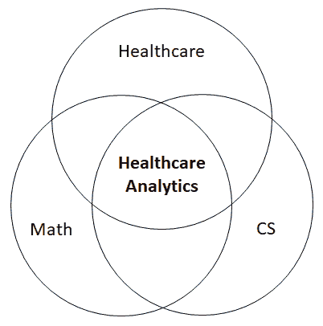
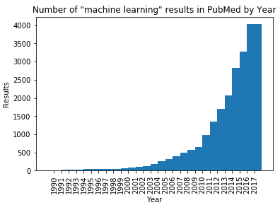
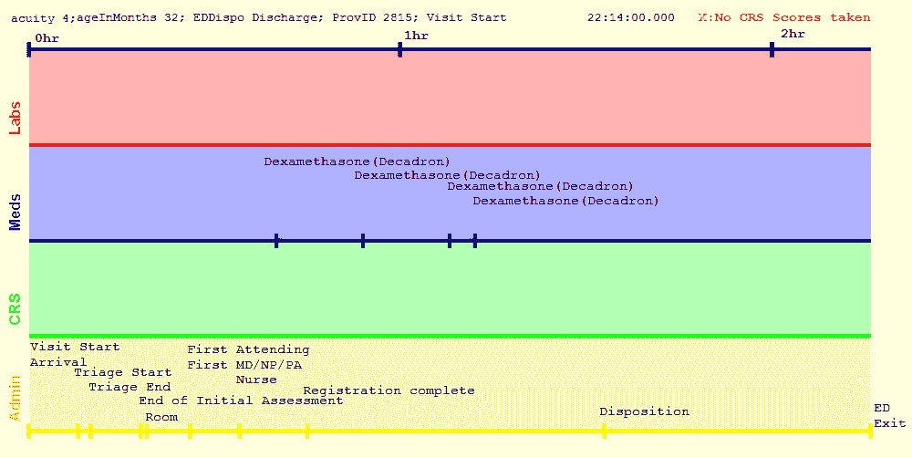
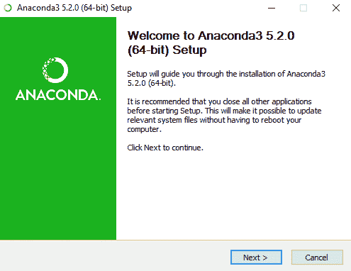
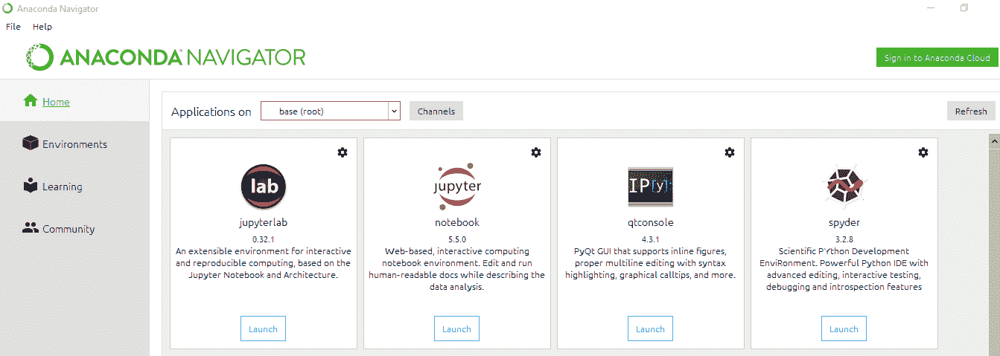
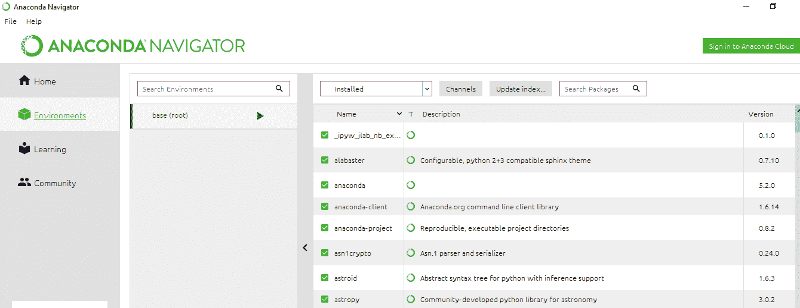
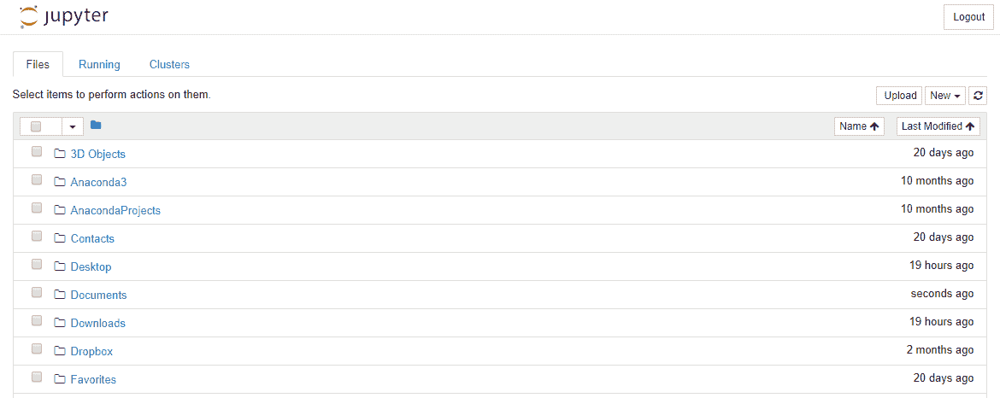
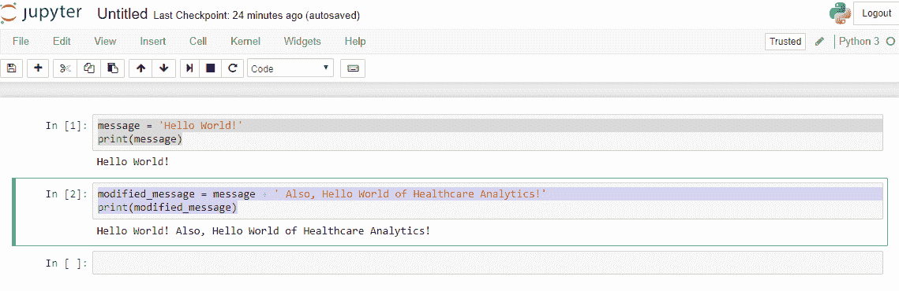
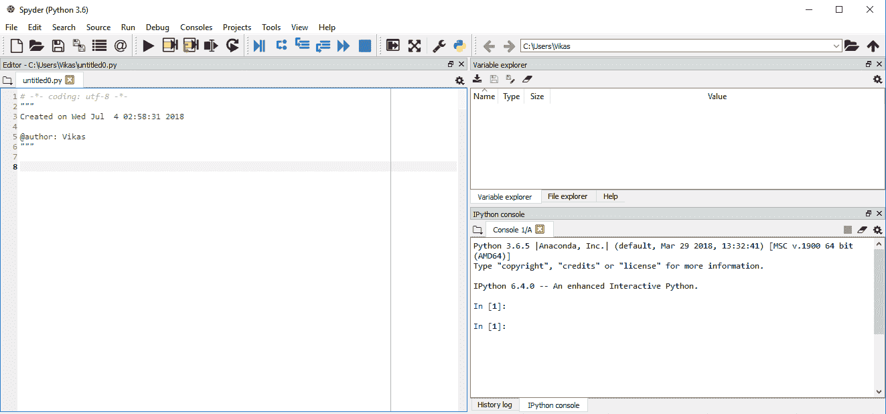

<title>Introduction to Healthcare Analytics</title>  

# 医疗保健分析简介

本章旨在向您介绍医疗保健分析领域，面向所有受众。本章结束时，您将了解医疗保健分析的基本定义、医疗保健分析包含的主题、医疗保健分析的历史以及一些众所周知的应用领域。在本章的后半部分，我们将指导您安装所需的软件，并简要介绍 Anaconda 和 SQLite。

简而言之，我们将在本章中讨论以下主题:

*   医疗保健分析基础
*   医疗分析的历史
*   医疗保健分析示例
*   Anaconda、Jupyter 笔记本和 SQLite 简介

<title>What is healthcare analytics?</title>  

# 什么是医疗保健分析？

不幸的是，韦氏词典中还没有**医疗保健分析**的定义。然而，我们自己对医疗保健分析的定义是*使用先进的计算技术来改善医疗保健*。让我们一个短语一个短语地分解这个定义。

<title>Healthcare analytics uses advanced computing technology</title>  

# 医疗保健分析使用先进的计算技术

在写这篇文章的时候，我们正在接近 2020 年，电脑和手机已经占据了我们生活的许多方面，医疗保健行业也不例外。我们的大多数医疗保健数据正在从纸质图表迁移到电子图表，在许多情况下，这是由政府的大规模激励措施推动的。与此同时，无数的医疗移动应用程序正在被编写，以跟踪生命体征，包括心率和体重，甚至与医生交流。虽然这种迁移不是微不足道的，但它将允许应用先进的计算技术，有望打开改善每个人的医疗保健的大门。

这些先进的计算技术是什么？我们将在接下来的章节中讨论它们。

<title>Healthcare analytics acts on the healthcare industry (DUH!)</title>  

# 医疗保健分析作用于医疗保健行业(废话！)

如果你正在寻找一本书，展示如何使用机器学习来预测世界末日，不幸的是，这不是它。医疗保健分析是医疗保健的全部内容。

<title>Healthcare analytics improves medical care</title>  

# 医疗保健分析改善了医疗保健

到目前为止，我们正在使用计算机在医疗保健方面做一些事情。我们到底在做什么？*我们正在努力改善医疗保健。这太宽泛了，不是吗？医疗保健的有效性通常用所谓的医疗保健三重目标来衡量:改善结果、降低成本和确保质量(尽管我们在这里看到了不同的词语)。让我们依次看看这些目标。*

<title>Better outcomes</title>  

# 更好的结果

在个人层面上，每个人都可以获得更好的医疗保健结果。每当我们去看医生或去医院时，我们都渴望自己的生活有更好的结果。具体来说，以下是我们关心的一些事情:

*   **准确诊断**:我们看医生，通常是为了医学问题。这个问题可能会给我们的生活带来一些痛苦或焦虑。我们所关心的是，这个问题的原因将被准确地确定，以便这个问题可能得到有效的处理。
*   **有效治疗**:治疗可能昂贵、耗时，且可能引起不良副作用；因此，我们想确定治疗是有效的。我们不希望两个月后因为同样的问题不得不再次休假去看医生或住进医院——这样的经历在时间和金钱上都是昂贵的(无论是通过医疗账单还是税收)。
*   **无并发症**:我们不希望在寻求现有疾病的护理时，出现新的感染或危险的摔倒。
*   **全面提高生活质量**:总结一下更好的健康结果的概念，虽然政府机构和医生组织可能有不同的方法来衡量结果，但我们的目标是提高生活质量，延长寿命，消除痛苦和担忧。

<title>Lower costs</title>  

# 降低成本

所以目标是更好的健康结果，对吗？不幸的是，我们不能一直为每个人提供全天候的医疗服务，因为我们的经济会崩溃。我们不能要求全身 x 光检查来提前发现每一种癌症。在实现更好的结果和降低医疗保健成本之间有一个谨慎的平衡。医疗保健分析的想法是，我们将能够用更便宜的技术做更多的事情。一次胸部 CT 扫描以筛查肺癌可能要花费数千美元；然而，对患者的病史进行数学计算以筛查肺癌的成本要低得多。在本书中，计划是向你展示如何进行这些计算。

<title>Ensure quality</title>  

# 确保质量

医疗质量包括患者接受医疗护理后的满意度。在资本主义体系中(如美国的医疗保健体系)，一种屡试不爽的提高质量的方法包括公平客观地衡量不同提供者的表现，以便患者能够对他们的护理做出更明智的决定。

<title>Foundations of healthcare analytics</title>  

# 医疗保健分析基础

现在，我们已经定义并介绍了医疗保健分析，重要的是给出一些从中汲取知识的背景。医疗保健分析可以被视为三个领域的交集:医疗保健(**医疗保健分析**)、数学(**数学**)和计算机科学( **CS** )，如下图所示。让我们依次探索这三个领域:



<title>Healthcare</title>  

# 卫生保健

医疗保健是医疗保健分析的**领域知识**支柱。以下是构成医疗保健分析的一些重要医疗保健知识领域:

*   **医疗保健服务和政策**:了解医疗保健行业的结构、医疗保健行业的主要参与者以及财务激励所在，只会帮助我们改进医疗保健分析工作。
*   **医疗保健数据**:医疗保健数据丰富而复杂，无论是结构化的还是非结构化的。然而，医疗保健数据收集通常遵循特定的模板。了解典型的**病史和体检** ( **H & P** )的细节，以及如何在医疗图表中组织数据，对帮助我们将数据转化为知识大有帮助。
*   **临床科学**:熟悉医学术语和疾病有助于在浩瀚的医学信息海洋中了解什么是重要的。临床科学通常分为两个领域:**生理学**，或者说人体如何正常运作，以及**病理学**，或者说人体在患病时如何运作。这两方面的一些基本知识对进行有效的医疗保健分析非常有帮助。

医疗保健分析的介绍将在[第 2 章](71c31b0a-fa9e-4b31-8b58-f563a815e338.xhtml)、*医疗保健基础*中提供。

<title>Mathematics</title>  

# 数学

我们医疗保健分析三巨头的第二大支柱是数学。我们不是想用这个列表吓走你；以下所有领域的详细知识并不是进行有效医疗保健分析的先决条件。然而，高中数学的基础知识可能是必不可少的。在理解允许我们预测疾病的机器学习模型时，其他领域是最有帮助的。也就是说，以下是构成医疗保健分析的一些重要数学领域:

*   **高中数学**:代数、线性方程和微积分前期等科目是医疗保健分析中更高级数学主题的重要基础。
*   **概率与统计:**信不信由你，每个医学生在培训期间都会上一堂生物统计学的课。是的，有效的医疗诊断和治疗在很大程度上依赖于概率和统计，包括敏感性、特异性和似然比等概念。
*   **线性代数**:通常在制作机器学习模型时，对医疗保健数据所做的操作是向量和矩阵运算。在使用 NumPy 和 scikit 时，您将有效地执行大量这些操作——学习用 Python 制作机器学习模型。
*   **微积分和 o** **优化**:这最后两个主题特别适用于神经网络和深度学习，这是一种特定类型的机器学习，由数据的线性和非线性转换层组成。微积分和最优化对于理解如何训练这些模型是很重要的。

在[第 3 章](46c83498-cb6e-45b4-ac39-6875a8d32400.xhtml)、*机器学习基础*中将介绍医疗保健分析的数学和机器学习。

<title>Computer science</title>  

# 计算机科学

以下是构成医疗保健分析的一些重要的计算机科学领域:

*   **人工智能**:医疗保健分析的核心是人工智能，即研究与环境互动的系统。机器学习是人工智能中的一个子领域，其中使用来自先前事件的信息对未来事件进行预测。我们将在本书的后面部分学习的模型是机器学习模型。
*   **数据库和信息管理**:经常使用**关系型** **数据库**访问医疗保健数据，这些数据通常可以根据需要由**电子病历** ( **EMR** )系统转储，或者位于云中。 **SQL** (结构化查询语言**的简称**)可以用来选择我们感兴趣的特定数据，并对这些数据进行转换。
*   编程语言:编程语言提供了人类程序员和计算机内部的 1 和 0 之间的接口。编程语言允许程序员向计算机提供指令，对数据进行人类实际上无法完成的计算。在本书中，我们将使用 Python，这是一种流行的新兴编程语言，它是开源的、全面的，并具有大量的机器学习库。
*   **软件工程**:你们中的许多人可能正在学习医疗保健分析，因为你们对在工作场所部署生产级医疗保健应用程序感兴趣。**软件工程**是对有效和高效地构建满足用户和客户需求的软件系统的研究。
*   **人机交互**:医疗保健分析应用的最终用户通常不使用编程来获得结果，而是依赖于可视化界面。人机交互是关于人类如何与计算机交互以及如何设计这种界面的研究。当前医学界的一个热门话题是如何使电子病历应用程序对医生来说更加直观和可口，而不是增加他们在书写笔记时必须为每个病人点击鼠标的次数。

计算机科学在医疗保健分析中如此普遍，以至于本书的几乎每一章都涉及到它。

<title>History of healthcare analytics</title>  

# 医疗分析的历史

医疗保健分析的起源可以追溯到 20 世纪 50 年代，就在 1946 年发明世界上第一台计算机( **ENIAC** )后几年。当时，医疗记录仍停留在纸面上，回归分析是手工完成的，政府没有对追求基于价值的护理给予任何激励。尽管如此，人们对开发自动应用程序来诊断和治疗人类疾病的兴趣正在增长，这在当时的科学文献中有所反映。例如，1959 年，*科学*杂志发表了一篇题为“*医学诊断的推理基础*”的文章，作者是 Robert S. Ledley 和 Lee B. Lusted，文章从数学上解释了医生如何做出医学诊断(Ledley 和 Lusted，1959)。这篇论文解释了许多对现代生物统计学至关重要的概念，尽管有时使用了我们今天可能不认识的术语和符号。

在 20 世纪 70 年代，随着计算机在学术研究中心变得突出并变得可用，人们对开发**医疗诊断决策支持**(**【MDDS**)**系统**越来越感兴趣，这是一个涵盖广泛的一体化计算机程序的总称，当输入患者信息时，这些程序可以精确地做出医疗诊断。INTERNIST-1 系统是这些系统中最著名的，是由匹兹堡大学的一组研究人员在 20 世纪 70 年代开发的(Miller 等人，1982)。它的发明者将其描述为“普通内科计算机辅助诊断的实验程序”，内科医生系统是在超过 15 个人年的工作中开发的，并涉及与医生的广泛咨询。其知识库涵盖了 500 种疾病和 3，500 种临床表现，涵盖了所有医学亚专业。用户首先输入患者的阳性和阴性发现，然后他们可以检查鉴别诊断列表，并查看它们如何随着新发现的添加而变化。该程序智能地询问特定的测试结果，直到获得明确的诊断。虽然它显示了最初的承诺，并抓住了医学界的想象力，但在它的建议优于一个领先的医生小组的建议后，它最终未能进入主流。它的消亡(以及 MDDS 系统的总体消亡)的其他原因可能包括缺乏一个吸引人的视觉界面(微软 Windows 尚未发明)以及现代机器学习技术尚未被发现的事实。

在 20 世纪 80 年代，人们对人工智能技术重新产生了兴趣，这种兴趣在 20 世纪 60 年代后期基本上消失了，因为马文·明斯基和西蒙·派珀特在他们的书*感知器* (Minsky 和 Papert，1969)中解释了感知器的局限性。David E. Rumelhart、Geoffrey E. Hinton 和 Ronald J. Williams 的论文“*通过反向传播误差学习表征”于 1986 年发表在 *Nature* 上，标志着经过反向传播训练的非线性**神经网络**的诞生，该网络如今在各种人工智能(如语音和数字识别)方面的性能可与人类匹敌(Rumelhart 等人，1986)。*

仅仅过了几年，这种技术就被应用到医学领域。1990 年，William Baxt 在期刊*Neural computing*(Baxt，1990) *上发表了一篇题为“*在临床决策中使用人工神经网络进行数据分析:急性冠状动脉闭塞的诊断*”的研究。*在这项研究中，一个人工神经网络在使用来自**心电图**(**EKG**)的发现诊断心脏病发作方面胜过了一组内科医生。这项开创性的研究帮助打开了生物医学机器学习研究海啸的闸门，甚至持续到今天。事实上，使用生物医学搜索引擎 PubMed 搜索“机器学习”在 1990 年仅返回 9 个结果，在 2017 年返回超过 4000 个结果，这些结果在中间几年稳步增加:



生物医学机器学习研究的加速有几个因素。首先是机器学习算法的数量和可用性不断增加。神经网络只是其中的一个例子。在 20 世纪 90 年代，医学研究人员开始使用各种替代算法，包括最近开发的算法，如决策树、随机森林和支持向量机，以及传统的统计模型，如逻辑和线性回归。

第二个因素是电子临床数据可用性的增加。在 21 世纪之前，几乎所有的医疗数据都在纸质图表上，进行计算机化的机器学习研究意味着数小时的手动输入数据到计算机中。电子医疗记录的增长和最终传播使得使用这些数据来建立机器学习模型变得更加简单。此外，更多的数据意味着更精确的模型。

这将我们带到了今天，医疗保健分析正在经历一个激动人心的时刻。今天的现代神经网络(通常称为*深度学习*网络)通常在比 EKG 解释更复杂的任务中胜过人类，例如从 x 射线图像中识别癌症和预测患者未来医疗事件的序列。深度学习通常使用数百万份患者记录来实现这一目标，并结合并行计算技术，使在更短的时间内训练大型模型成为可能，以及新开发的调整、调整和优化机器学习模型的技术。当前医疗保健分析中另一个令人兴奋的事件是引入政府激励措施，以消除医疗保健中的过度支出和误诊。这种激励措施不仅引起了学术研究人员对医疗保健分析的兴趣，也引起了希望为医疗保健组织省钱(同时也为自己赚钱)的行业参与者和公司的兴趣。

虽然医疗保健分析和机器算法还没有重新定义医疗保健，但医疗保健分析的未来看起来很光明。就我个人而言，我喜欢想象有一天，医院会配备摄像头，秘密而安全地记录病人护理的每个方面，包括病人和医生之间的对话，以及病人听到自己的医疗检查结果时的面部表情。然后，这些文字和图像可以被传递给机器学习算法，以预测患者对未来结果的反应，以及这些结果首先会是什么。但是我们超越了自己；在我们到达那一天之前，还有许多工作要做！

<title>Examples of healthcare analytics</title>  

# 医疗保健分析示例

为了让您了解医疗保健分析包含的内容，这里有一些医疗保健分析用例示例，展示了现代医疗保健分析的广度和深度。

<title>Using visualizations to elucidate patient care</title>  

# 使用可视化来阐明病人护理

分析通常分为三个子组件——**描述性分析**、**预测性分析**和**规定性分析**。描述性分析包括使用前面讨论的分析技术来更好地描述或总结所研究的过程。理解护理是如何提供的是一个受益于描述性分析的过程。

我们如何使用描述性分析来更好地理解医疗保健服务？以下是一个可视化的幼儿**急诊科** ( **ED** )护理记录的例子，当时他们抱怨哮喘恶化(Basole 等人，2015)。它使用电子病历系统中常见的结构化临床数据来总结他们在急诊室经历的护理事件的时间关系。可视化由四种类型的活动组成–管理(黄色)、诊断(绿色)、药物(蓝色)和实验室测试(红色)。这些由颜色和 *y* 位置编码。沿着 *x* 轴是时间。顶部的黑条被垂直的刻度线分成一小时长的块。这个病人的就诊持续了两个多小时。关于患者的信息显示在黑色时间栏之前。

虽然此类描述性分析研究可能不会直接影响成本或医疗护理建议，但它们可以作为探索和理解患者护理的起点，并通常为推出更具体、更可行的分析方法铺平道路:



<title>Predicting future diagnostic and treatment events</title>  

# 预测未来的诊断和治疗事件

医学中的一个中心问题是识别有患某种疾病风险的病人。通过识别高风险患者，可以采取措施阻止或延迟疾病的发作或完全预防疾病。这是预测分析发挥作用的一个例子——利用以前事件的信息对未来做出预测。有一些疾病特别受预测研究的欢迎:充血性心力衰竭、心肌梗死、肺炎和慢性阻塞性肺病只是受益于早期识别高风险患者的高死亡率、高成本疾病的几个例子。

我们不仅关心未来会发生什么疾病，我们还对识别有需要高成本治疗(如再次住院和看医生)风险的患者感兴趣。通过识别这些患者，我们可以主动采取省钱的措施来降低这些高风险治疗的风险，我们还可以奖励工作出色的医疗机构。

这是一个广泛的例子，有几个未知数要考虑。首先:我们有兴趣预测什么具体事件(或疾病)？第二:我们将使用什么数据来进行预测？从电子病历中提取的结构化临床数据(组织成表格的数据)是当前最流行的数据源；其他可能性包括非结构化数据(医学文本)、医学或 x 射线图像、生物信号(脑电图、EKG)、从设备记录的数据，甚至是来自社交媒体的数据。第三:我们会用什么机器学习算法？

<title>Measuring provider quality and performance</title>  

# 衡量提供商的质量和绩效

虽然做出漂亮的可视化或预测代表了医疗保健分析的更性感的方面，但还有其他类型的分析也很重要。有时，它归结为好的，旧的数字运算。使用医疗保健措施监控医生和医疗保健组织的表现就是这种分析技术的一个很好的例子。医疗保健措施提供了一种机制，通过这种机制，个人可以衡量和比较参与提供者对循证医学建议的依从性。例如，一个被广泛接受的建议是，糖尿病患者每三个月接受一次由医生进行的足部检查，以检测糖尿病足溃疡。

一项由国家赞助的医疗保健措施可能会规定计算在某个机构接受护理的糖尿病患者人数的准则，然后确定接受适当足部护理的患者的百分比。对于常见的心脏、肺和关节疾病以及许多其他疾病，也存在类似的测量方法。这提供了一种识别提供最高质量护理的提供者的方法，并且这些建议可以下载供公众使用。我们将在第 6 章、*测量医疗质量*中讨论具体的医疗保健措施。

<title>Patient-facing treatments for disease</title>  

# 面向患者的疾病治疗

在极少数情况下，医疗保健分析包括用于实际治疗疾病的医疗技术，而不仅仅是对疾病进行研究。这方面的一个例子是**神经假体**。神经假体可以定义为使用人造装置增强神经系统功能。神经假体研究已经使失明或截瘫等残疾患者恢复了部分丧失的功能。例如，一个瘫痪的病人可以不用手，而是用他们的大脑信号来移动屏幕上的计算机光标！在这个特定的应用中，获得了特定神经元的电活动的记录，并且使用机器学习模型来确定在给定神经元放电的情况下光标应该移动的方向。类似的分析可以用于视觉障碍，或者可视化人类正在看到的东西。第二个例子包括在体内植入装置，在癫痫发作发生之前检测到癫痫发作，并主动给予预防性药物治疗。当然，天空是分析驱动治疗的极限。

<title>Exploring the software</title>  

# 探索软件

在这一节中，我们将下载、安装并探索 Anaconda 和 SQLite，这两个发行版将在本书中分别用于 Python 和 SQL。

<title>Anaconda</title>  

# 蟒蛇

本书中的例子需要使用 Python 编程语言。有许多 Python 发行版可用。Anaconda 是专门为机器学习设计的免费开源 Python 发行版。它包括 Python 和 1，000 多个数据科学 Python 库(例如，NumPy、scikit-learn、pandas ),可以在基本 Python 语言之上使用。它还包括 **Jupyter notebook** ，一个我们将在本书中广泛使用的交互式 Python 控制台。Anaconda 附带的其他工具包括 Spyder IDE(交互式开发环境的缩写)和 RStudio。

Anaconda 可以从 https://www.continuum.io/downloads[下载。](https://www.continuum.io/downloads)

要下载 Python 的 Anaconda 发行版，请完成以下步骤:

1.  导航到前面的网站。
2.  根据您的操作系统和所需的 Python 版本选择合适的 Python 下载。对于本书，我们使用了 Anaconda 5.2.0(用于 Windows 的 64 位安装，包括 Python 3.6):


3.  点击下载。您的浏览器将开始下载该文件。完成后，在网络浏览器或操作系统文件管理器中单击该文件。

4.  将出现一个窗口(如下图所示)。点击下一步>按钮:



5.  继续按照提示进行操作，包括接受许可协议、选择安装用户、选择文件目标以及选择各种选项。
6.  Anaconda 将开始安装。由于安装中包含的软件包数量较多，这可能需要一段时间。
7.  安装完成后，关闭 Anaconda 窗口。

<title>Anaconda navigator</title>  

# 巨蟒领航员

现在您已经安装了 Anaconda，您可以通过在 Windows 工具栏中搜索`Anaconda Navigator`或者在 Mac 的`Applications`文件夹中查找 Anaconda Navigator 来访问它的特性。单击图标后，短暂停顿后，您将看到类似以下内容的屏幕:



您当前位于 Home 选项卡，该选项卡列出了 Anaconda 中包含的不同应用程序。您可以从该屏幕访问 Jupyter notebook，以及 Spyder IDE。

要查看安装了哪些软件库，请单击左侧的“环境”选项卡。您可以使用此选项卡根据需要下载和升级特定的库，如以下屏幕截图所示:



<title>Jupyter notebook</title>  

# Jupyter 笔记本

现在，让我们探索一下 Jupyter notebook，这是本书大部分内容中我们都会用到的 Python 编程工具。回到主页，点击 Jupyter 图标中的启动按钮。您的默认浏览器中应该会打开一个新的选项卡，类似于下面的屏幕截图:



这是 Jupyter 应用程序的“文件”选项卡，您可以在其中浏览您计算机的目录以启动新的 Jupyter 笔记本、打开现有笔记本或管理您的目录。

让我们创建一个新的 Jupyter 笔记本。找到控制台右上角的新下拉菜单，然后单击它。在下拉菜单中，单击 Python 3。另一个选项卡将打开类似下面的屏幕截图:


标有`In`的盒子叫做细胞。**单元格**是 Jupyter 内部 Python 编程的功能单元。您在单元格中输入代码，然后单击 run 来执行它。看到结果后，您可以创建一个新的单元格，并继续您的工作流程，如果您愿意，可以在以前的结果基础上继续。

让我们试一个例子。在单元格体中单击，然后键入以下几行:

```
message = 'Hello World!'
print(message)
```

然后，找到顶部工具栏上的播放按钮并单击它。您应该会看到紧跟在单元格后面的`Hello World!`消息。您还会在文本下方看到一个新的单元格。这是朱庇特的工作方式。

现在，在新单元格中，输入以下内容:

```
modified_message = message + ' Also, Hello World of Healthcare Analytics!'
print(modified_message)
```

再次单击播放按钮。您应该会在第二个单元格下看到修改后的消息，并出现第三个单元格。注意，第二个单元格知道`message`变量包含什么，即使它是在第一个单元格中赋值的。Jupyter 记得每次会话时输入控制台的每个命令。要清除内存，您必须关闭并重新启动内核:



现在，让我们结束当前会话。返回浏览器中的主页选项卡。单击左上角的 Running 选项卡。在笔记本菜单下，您应该会看到`Untitled.ipynb`正在运行。点击右边的关机按钮，笔记本就会消失。

Jupyter 到此为止。在接下来的章节中，你会对它有更深入的了解。

<title>Spyder IDE</title>  

# Spyder IDE

Spyder IDE 为 Python 开发提供了一个完整的环境，包括文本编辑器、变量资源管理器、IPython 控制台和可选的命令提示符，如下面的屏幕截图所示:



屏幕的左半部分是编辑器窗口。这是您编写 Python 代码的地方。完成脚本后，我们将使用上方工具栏中的绿色播放按钮运行它们。

屏幕的右半部分水平分成两部分。右上角的窗口，在其最有用的形式中，起到了变量浏览器的作用(如图所示)。该窗口列出了当前 Python 环境中(例如，内存中)每个变量的名称、类型、大小和值。通过点击窗口底部的选项卡，您还可以将窗口更改为文件浏览器或浏览 Python 的帮助文档。

右下角的窗口是控制台。它有一个 Python 命令提示符。这对于运行单个 Python 命令非常有用；它还可以用于运行 Python 脚本和其他功能。此窗口的第三个选项是以前输入的命令的历史日志。

我们不会在本书中大量使用 Spyder 然而，如果您想在以后的项目中使用它，了解它的工作原理是很好的。

<title>SQLite</title>  

# SQLite

医疗保健数据通常存储在数据库中。要从这些数据库中操作和提取所需的数据，您应该了解 SQL。SQL 是一种语言，根据您使用的引擎，它会有许多变化。我们将使用 **SQLite** ，一个免费的公共领域 SQL 数据库引擎。

要下载 SQLite，请执行以下操作:

1.  导航到 SQLite 主页([www.sqlite.org](http://www.sqlite.org))。然后，单击顶部的下载选项卡。
2.  下载适用于您的操作系统的预编译二进制文件。您想要的是 bundle 文件，而不是 DLL 文件(用以下格式命名的文件:`sqlite-tools-{Your OS}-x86-{Version Number}.zip`)。
3.  使用 shell 或命令提示符，导航到包含`sqlite3.exe`程序的目录。
4.  在提示符下，键入`sqlite3 test.db`并按*键输入*。

您现在处于 SQLite 程序中。稍后，我们将使用 SQLite 命令来创建、保存和操作模拟患者数据。SQLite 命令以句点开头，后跟一个小写单词，然后是命令参数。

要退出 SQLite，键入`.exit`并按下*进入*。

<title>Command-line tools</title>  

# 命令行工具

所有的操作系统，无论是 Windows、MacOS 还是 Linux，都有一个命令行工具来输入命令。在 Mac 或 Linux 上，shell 程序接受 bash 命令。在 Windows 上，有不同于 bash 的 DOS 命令。对于本书，我们使用了 Windows PC 和 DOS 命令提示符。在必要的地方，我们包括了我们在文本中使用的命令以及相应的 bash 命令。

<title>Installing a text editor</title>  

# 安装文本编辑器

本书中使用的一些数据文件非常大，可能无法使用电脑自带的标准文本编辑器打开。我们建议使用可下载的源代码编辑器。流行的选择包括 Sublime(Windows 和 Mac)或 notepad++(Windows)。这本书我们用的是 Notepad++。

<title>Summary</title>  

# 摘要

现在，我们已经介绍了医疗保健分析的主题，并为本书的剩余部分设置了您的计算机，我们准备深入医疗保健分析的一些基础。在[第 2 章](71c31b0a-fa9e-4b31-8b58-f563a815e338.xhtml)、*医疗保健基础*中，我们将了解医疗保健分析的一些医疗保健基础。

<title>References</title>  

# 参考

Basole RC、Kumar V、Braunstein ML 等人(2015 年)。急诊科临床路径依从性的分析和可视化。田纳西州纳什维尔:通知医疗保健会议，2015 年 7 月 29 日至 31 日。

Baxt，WG (1990 年)。"人工神经网络在临床决策数据分析中的应用:急性冠状动脉闭塞的诊断."*神经计算* 2 (4): 480-489。

莱德利，卢斯特 LB (1959)。《医学诊断的推理基础》*理科* 130 (3366): 9-21。

米勒 RA，波普勒 Jr .何，迈尔斯法学博士(1982)。"内科医生-1，一个普通内科的实验性计算机诊断顾问."新英格兰医学杂志 307: 468-476。

明斯基 M，帕佩特有限公司(1969 年)。“感知器。”麻省剑桥:麻省理工学院出版社。

鲁梅尔哈特德，辛顿戈，威廉姆斯 RJ (1986)。"通过反向传播误差学习表征."*性质* 323(9): 533-536。