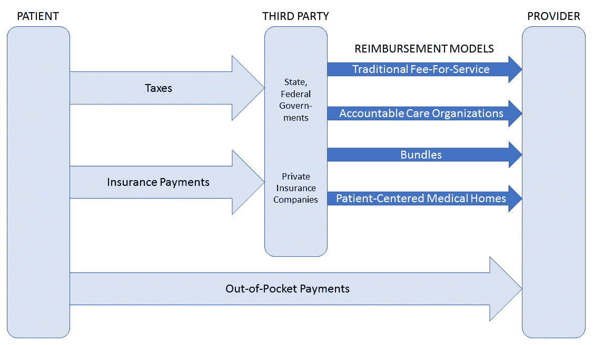
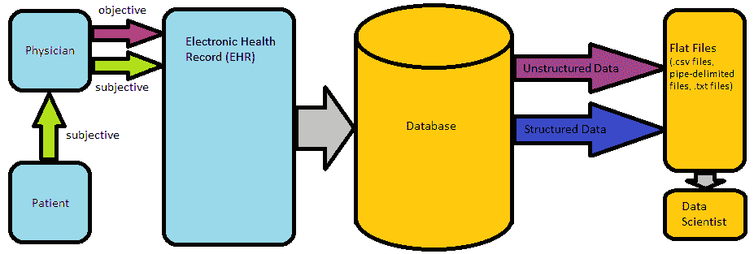

# 二、医疗保健基础

本章主要面向医疗保健经验有限的开发人员。学完本课程后，你将能够描述美国医疗保健服务的基本特征，熟悉美国与分析相关的具体立法，了解医疗保健数据的结构、组织和编码方式，了解医疗保健分析的思考框架。

# 美国的医疗保健服务

医疗保健行业通过与我们自己、我们所爱的人、我们的家人和我们的朋友的互动，影响着我们所有人。当我们身边的人生病或感到疼痛时，与医疗保健行业相关的高成本与身体、情感和精神创伤交织在一起。

在美国，医疗保健系统处于脆弱状态，因为医疗保健支出超过全国总 GDP 的 15%；这一比例远远超过其他发达国家，预计到 2040 年将上升到至少 20%(Braunstein，2014；伯纳特，2015)。美国和国际医疗成本的上升可以归因于几个因素。一个是人口结构向老年人口的转变。平均预期寿命从 1970 年的 70 岁上升到 2011 年首次超过 80 岁(OECD，2013)。虽然这是一个积极的发展，但老年患者通常更容易生病，因此在医疗保健系统看来更昂贵。成本上升的第二个原因是肥胖和糖尿病等严重慢性疾病日益流行(经合组织，2013 年)，这增加了其他慢性疾病的风险。慢性病患者占医疗支出的绝大部分(Braunstein，2014)。第三个原因是不一致的激励，这将在即将到来的提供商报销部分讨论。第四个原因是技术进步，因为在所有经合组织国家，用于执行昂贵的 MRI 成像和 CT 扫描的设备成本都有所增加(OECD，2013)。

接下来，我们将讨论一些基本的医疗术语以及美国的医疗融资方式。

# 医疗保健行业基础

医疗保健大致可分为**住院护理**，即在医院等夜间设施进行的护理，以及**门诊护理**，或**门诊护理**，即在同一天进行的护理，通常在医生办公室进行。住院护理通常涉及治疗已经发展到严重状态或需要复杂干预的疾病，并且通常比门诊护理更昂贵；因此，医疗保健的中心目标是通过强调适当的预防措施来减少住院病人的护理量。

描述医疗保健的另一种方式是“医疗保健提供阶段”**初级保健医师** ( **PCPs** )通常处理患者的整体福祉，并监督所有器官系统；在许多护理提供模式中，他们充当二级和三级护理提供者的“看门人”。**二级护理**指由专门治疗某些疾病或器官系统的医生进行的治疗，如内分泌学家或心胸外科医生。**三级护理**由专科医生转诊提供，通常在专门治疗非常特殊疾病的机构的住院环境中进行，通常通过外科手术进行。

在医疗保健行业，需要一个专业团队来提供最佳的患者护理，每个团队都有不同的角色。医师、医师助理、执业护士、护士、病例管理人员、社会工作者、实验室技术人员和信息技术专业人员只是医疗保健分析领域中您将直接或间接与之共事的一些其他人员。

# 医疗融资

一个世纪以前，钱通常直接从病人流向提供医疗服务的人。然而，如今，医疗融资变得更加复杂，雇主和政府越来越多地参与其中，与医生报销相关的新模式不断涌现。在美国，医疗融资不再完全是私人的；为了帮助贫困人口和老年人，州政府和联邦政府使用从公民那里征收的税收来资助医疗补助计划和 T2 医疗保险计划，这两项计划分别是政府资助的为贫困人口和老年人支付医疗费用的方式。一旦钱到达各种第三方(保险公司和/或政府)，或者当它仍然在患者手中时，必须使用各种支付模型将钱分发给医生。在下图中，我们提供了美国医疗保健系统中资金流动的简单概述。

医疗保健中的许多分析都是对日益强调医生表现和质量而非护理数量的回应:

# 收费服务补偿

传统上，医生通过收费服务支付系统得到补偿，在这种支付系统中，医生为他们进行的每一项测试或程序得到补偿，不管他们的病人在测试或程序后是否感觉更好。这种补偿方法导致了对医生的激励冲突，医生的任务是有效地照顾他们的病人，同时还要谋生。许多人将今天美国过高的医疗支出归咎于 FFS。此外，FFS 报销单独支付给每个医生，医生之间的协调很少。如果一个病人因为同样的病情看了两个医生会怎么样？在 FFS 报销制度下，医生可以要求重复检查并单独报销。

# 基于价值的护理

FFS 的缺点导致了美国医疗保健的新愿景——基于价值的医疗保健。在基于价值的报销系统下，医生根据他们提供的护理质量获得报酬，这可以通过他们的患者成果和他们为每个患者节省的资金来衡量。订购多余的测试和程序的动机消失了，病人和医生的共同目标变得一致。基于价值的护理伞包括一组医生报销模型，根据提供的护理质量奖励医生，每个模型都有自己的细微差别。这些模式包括**责任医疗组织** ( **ACOs** )、**捆绑支付**、以及**以病人为中心的医疗之家** ( **PCMHs** )。

本节中需要记住的重要内容是:

*   在美国和大多数其他国家，医疗费用占 GDP 的比例正在增长
*   基于价值的护理正慢慢成为医生薪酬的新标准

# 医疗保健政策

医疗改革要想成功，需要立法者的支持，幸运的是，它已经得到了支持。在本节中，我们来看看一些为患者权利和隐私铺平道路的立法、电子病历的兴起、基于价值的护理以及医疗保健大数据的进步，所有这些都与医疗保健分析相关。

# 保护患者隐私和患者权利

世界上许多国家已经颁布了保护患者隐私的立法。在美国，保护患者隐私的立法于 1996 年首次签署成为法律，被称为**健康保险携带和责任法案** ( **HIPAA** )。自那时以来，它已经过多次修订和更新。HIPAA 的两个主要组成部分是隐私规则和安全规则。

隐私规则规定了可以使用医疗保健数据的具体情况。特别是，任何可用于识别患者身份的信息(称为**受保护的健康信息** ( **PHI** ))都可以自由用于医疗、账单支付或其他某些医疗保健操作。数据的任何其他用途都需要患者的书面授权。承保实体是指需要遵守 HIPAA 法律的组织。承保实体的例子包括护理提供者和保险计划。2013 年，**最终综合规则**扩大了 HIPAA 的管辖范围，以包括所涵盖实体的业务合作伙伴或独立承包商(如果与美国客户合作，大多数医疗保健分析专业人员都可以归入其中)。因此，如果您在美国处理医疗保健数据，您必须保护患者的数据，否则将面临罚款和/或监禁的风险。

如果您是医疗保健分析专家，您应该如何保护您数据中的**电子患者健康信息** ( **e-PHI** )？安全规则回答了这个问题。安全规则将保护方法分为三类:管理、物理和技术。具体来说，根据美国卫生与公众服务部的网站，医疗保健数据科学家应该:

“确保他们拥有的所有 e-PHI 的机密性、完整性和可用性”。防止对信息安全的“合理预期的威胁”和不允许的使用或披露；以及“确保员工遵守法规”

(美国卫生与公众服务部，2017 年)。有关防护技术的更多具体信息可在 HHS 网站上找到，包括以下指南:

所涵盖的实体和业务伙伴应指定一名隐私官负责 HIPAA 的执行，并为有权访问 e-PHI 的员工维持训练计划

对包含 e-PHI 的硬件和软件的访问应受到严格控制和监管，并仅限于授权人员

通过开放网络(例如，通过电子邮件)发送的 e-PHI 必须加密

要求相关实体和业务伙伴向受影响的个人和卫生与公众服务部报告任何违反安全的行为

在美国之外，许多国家(尤其是加拿大和欧洲国家)已经颁布了医疗保健隐私法。无论你生活在哪个国家，保护病人的数据和隐私都被认为是医疗保健分析的道德实践。

(US Department of Health and Human Services, 2017). More specific information about safeguarding techniques can be found on the HHS website and includes the following guidelines:

*   推进电子病历的采用
*   电子病历与医疗保健分析一起，被视为医疗保健成本不断上升的一种可能的补救措施。在美国，促进电子病历使用的主要立法是 2009 年通过的**医疗信息技术促进经济和临床健康(HITECH)法案**，该法案是美国复苏和再投资法案(Braunstein，2014)的一部分。HITECH 法案向做两件事的医疗保健组织提供激励性付款:
*   采用使用“认证的”**电子健康档案** ( **EHRs** )
*   以有意义的方式使用 EHRs。从 2015 年开始，不使用电子健康记录的医疗保健提供者将受到惩罚，从他们的医疗保险报销中扣除

EHR 要获得认证，必须满足几十项标准。这种标准的例子包括支持临床实践的标准，例如允许计算机化的医嘱输入和记录关于患者的人口统计和临床信息，例如药物列表、过敏列表和吸烟状态。其他标准侧重于维护医疗信息的隐私和安全，它们要求安全访问、紧急访问和在一段时间不活动后访问超时。EHR 还应该能够向适当的机构提交临床质量测量结果。这些标准的完整列表可在[www.healthit.gov](http://www.healthit.gov)获得。

对于提供商来说，仅获得认证的 EHR 是不够的；为了获得奖金，提供商必须按照有意义使用要求的规定，以有意义的方式使用 EHR。同样，存在几十个需求，其中一些是强制性的，一些是可选的。这些要求分布在以下五个领域:

# 改善护理协调

缩小健康差距

1.  吸引患者及其家属
2.  改善人口和公共健康

确保足够的隐私和安全

部分由于 HITECH 法案，EHR 的兴起将导致前所未有的大量临床信息可用于后续分析，以努力降低成本和改善结果。在本章的后面，我们将更详细地探讨临床信息的创建和格式化。

*   Improving care coordination
*   促进基于价值的护理
*   2010 年通过了**患者保护和平价医疗法案** ( **PPACA** )，也被称为**平价医疗法案** ( **ACA** )。这是一项庞大的立法，最广为人知的是它试图减少无保险人口，并为大多数公民提供医疗保险补贴。但是，其中一些鲜为人知的条款增加了本章前面讨论过的新的基于价值的报销模式(即捆绑支付和负责任的护理组织)，并创建了四个原始的基于价值的计划:
*   **医院价值采购计划** ( **HVBP** )
*   **医院再入院减少计划** ( **HRRP** )

**医院获得性条件减少计划** ( **HAC** )

**值修改程序** ( **VM** )

# 这些计划将在第 6 章、*测量医疗质量*中详细讨论。

2015 年的**医疗保险准入和芯片再授权法案** ( **MACRA** )启动了质量支付计划，由**替代支付模式** ( **APM** )计划和**基于绩效的奖励支付系统** ( **MIPS** )两部分组成。这两项计划将在*衡量医疗服务提供者绩效*一章中详细讨论，这两项计划使美国医疗体系进一步从 FFS 报销转向基于价值的报销。

*   推进医疗保健领域的分析
*   有一些法律倡议与推进医疗保健领域的分析相关。其中最相关的是 2015 年颁布的**我们所有人**倡议(以前称为**精准医疗倡议**)，旨在到 2022 年收集 100 万人的健康和基因数据，以努力推进精准医疗和针对个人的医疗。
*   此外，以下三项计划虽然与分析没有直接关系，但可能会间接增加对医疗保健分析研究的资助。2013 年通过的**大脑倡议**，目标是从根本上改善我们对大脑相关疾病和神经疾病的了解，如阿尔茨海默氏症和帕金森氏症。**2016 年通过的癌症突破 2020** ，专注于寻找对抗癌症的疫苗和免疫疗法。2016 年的**21 世纪治愈法案**简化了**美国食品药品监督管理局** ( **FDA** )药物审批流程，以及其他规定。
*   **Value Modifier Program** (**VM**)

总之，前面讨论的过去三十年的立法为医疗保健分析的执行方式的变革奠定了基础，并创造了医疗保健分析要解决的新挑战，不仅在美国，而且在全球范围内。新的报销和融资方法给我们提出了一个问题，即考虑到我们已经掌握的数据，如何更有效地实施医疗保健。

现在让我们换个话题，看看临床数据到底是由什么组成的。

# 患者数据–从患者到计算机的旅程

当患者开始向医生讲述自己的病情时，临床数据收集过程就开始了。这被称为**患者病史**，由于它不是由医生直接观察的，而是由患者叙述的，因此患者的经历被称为**主观信息**。相比之下，**客观信息**来自医生，由医生自己对患者的观察组成，从身体检查、实验室测试和成像研究，到其他诊断程序。主观和客观信息共同构成了临床笔记。

医疗保健中使用的临床记录有几种类型。**病史和体格检查** ( **H & P** )是最彻底和全面的临床记录。它通常在门诊医生第一次看病人时获得，或者在病人第一次入院时获得。对一个病人来说，收集病人的所有数据并在医院的电脑上输入 H & P 可能总共需要 1-2 个小时。通常，每一位医生/每一次住院只做一次健康检查。对于连续的门诊就诊，或持续几天的住院治疗，编制更简短的临床记录。这些被称为**进度注释**，或 **SOAP 注释** (SOAP 代表主观、客观、评估和计划)。在这些笔记中，重点是自最初的 H & P 或之前的进度笔记以来发生的事件。

在患者数据出现在您的数据库中之前，它会经历一个漫长的旅程，从医生团队解释的患者病史开始。患者的故事与来自不同临床部门的其他信息(例如，实验室、影像)相结合，形成**电子健康记录** ( **EHR** )。当医院希望将数据提供给第三方进行进一步分析时，它通常会将数据以数据库格式发布到云中。

Together, the legislation of the past three decades discussed previously has set the stage for revolutionizing how healthcare analytics is performed and has created new challenges to be solved by healthcare analytics, not only in the US, but also across the globe. The new reimbursement and financing methods task us with the problem of figuring out how healthcare can be performed more efficiently, given the data that we already have.

一旦数据被捕获到数据库系统中，分析专家就可以使用各种工具来可视化、透视、分析和构建预测模型:

# 

在下面的小节中，我们将描述这两种类型的临床笔记的重要方面。

历史和物理(H&P)

如前所述，病史和体格检查是对病人最全面的记录，通常在病人入院和/或看新的门诊医生时进行。H&P 临床记录的标准章节将在以下章节中讨论。

元数据和主诉

元数据包括关于患者就诊的基本信息，例如患者的姓名、出生日期、入院日期/时间以及入院医院和主治医生的姓名。

主诉是患者就诊/住院的原因，通常用患者自己的话说。例如:“我胸部有些不舒服。”病史采集者可能会也可能不会将主诉翻译成相应的医学术语，例如“胸痛”

In the following subsections, we will describe the important aspects of these two types of clinical notes.

# The history and physical (H&P)

As mentioned previously, the history and physical is the most comprehensive type of documentation available for patients and is usually conducted upon their admission to hospital and/or when seeing new outpatient physicians. The standard sections of the H&P clinical note are discussed in the following sections.

# Metadata and chief complaint

The metadata includes basic information about the patient's visit, such as the patient’s name, date of birth, date/time of admission, and the name of the admitting hospital and attending physician.

The chief complaint is the reason for the patient’s visit/hospitalization, usually in the patient’s own words. Example: "I'm having some chest discomfort." This chief complaint may, or may not, be translated by the history taker into the corresponding medical terminology, for example, "chest pain."

当前疾病史(HPI)

HPI 包括围绕主诉的细节。该部分通常分为如下两段:

第一段提供围绕主诉的直接细节，通常使用从患者处获得的信息。除了主诉之外，第一句话通常提供关于患者的重要人口统计学细节和关于过去病史的任何相关细节。例如:

“史密斯先生是一名 53 岁的白人男性，有高血压、高血脂、糖尿病和吸烟史，他到急诊室主诉胸痛。”

关于段落的其余部分，第一个 HPI 段落通常包含这里列出的七个标准元素。这七个要素倾向于假设主诉是某种类型的疼痛；一些主诉(如闭经)需要不同的问题。下表总结了这七个要素:

**HPI 元素**

# **对应问题**

**例题答案**

**地点**

疼痛位于哪里？

疼痛是左侧的，放射到左臂和背部。

| **质量** | 疼痛是什么感觉？ | 病人报告有枪击和刺痛。 |
| **严重性** | 从 1 到 10 分，疼痛有多严重？ | 严重性为 8/10。 |
| **定时** | **发病**:疼痛第一次是什么时候开始的？**频率**:疼痛多久发生一次？**持续时间**:疼痛发作多长时间？ | 这一集是半小时前开始的。运动后几个月会发作，持续时间长达 15-20 分钟。 |
| **恶化因素** | 是什么让疼痛加剧？ | 运动加剧了疼痛。 |
| **缓解因素** | 什么能缓解疼痛？ | 通过休息和减肥来缓解疼痛。 |
| **相关症状** | 疼痛出现时，你注意到其他症状了吗？ | 患者报告与呼吸困难相关的症状。 |
| **Alleviating Factors** | 第二段应包含患者之前已经接受的所有医疗护理。典型的问题包括:他们是否已经看过医生或以前住过院？进行了哪些实验和测试？与主诉相关的患者的医疗条件控制得如何？以前尝试过哪些治疗方法？有 x 光片的副本吗？ | 既往病史 |
| H&P 的这一部分列出了影响患者的所有当前和以前的医疗状况，包括但不限于住院治疗(无论是内科、外科还是精神病学原因)。 | 药物 | 本部分提供当前处方和**非处方药** ( **OTC** )药物，通常包括以下详细信息:药物名称、剂量、给药途径和频率。列出的每一种药物都应对应于过去病史中给出的患者当前的一种医疗状况。给药途径和频率通常用缩写书写；请参考下表中的常用缩写列表。 |

家庭历

家族史包括患者之前两代家庭成员的疾病史，重点是慢性病以及与主诉和受影响器官系统相关的疾病。

# 社会历

社会病史提供了在 HPI 无法获得的社会和风险因素的详细信息。本节包括之前未提及的人口统计因素、职业(以及任何危险物质的职业暴露，如果适用)、社会支持(婚姻、子女、受抚养人)和物质使用/滥用(烟草、酒精、娱乐/非法药物)。

# 厌恶

过敏部分通常包括患者过敏的物质，包括药物和相应的反应。如果病人没有已知的药物过敏，通常用缩写词 NKDA 来表示。

# Family history

系统回顾

# 系统的**审查** ( **ROS** )在获得病史的其他部分后，作为重要症状的最终筛选。在这一部分中，患者被询问与身体不同功能器官系统(例如，胃肠、心血管和肺)相关的体验症状。重点是与主诉相关的器官系统和症状。可能会触及多达 14 种不同器官系统的症状。

身体检查

# 医生对病人进行检查，并在这一部分记录检查结果。描述通常从患者的总体健康状况和外观开始，然后是相关的生命体征(更多详情见下表)，接着是**头、眼、耳、鼻和喉** ( **HEENT** )，接着是身体的特定器官/器官系统。

其他客观数据(实验室测试、成像和其他诊断测试)

体检标志着所谓的客观数据的开始，或由医生观察、解释和记录的关于病人的数据。这与主观数据相反，主观数据是由患者第一手提供给医生的信息，并且包括患者病史。体检之后，提供关于患者的所有附加客观数据。这包括任何实验室检查、影像学检查(如果适用)的结果，以及可能已经进行的针对当前疾病的任何其他检查的结果。常见的影像学检查包括 **x 射线** ( **XR** )、**计算机断层扫描** ( **CT** )和**磁共振成像** ( **MRI** )对身体感兴趣区域的扫描。

# 评估和计划

这是 H&P 的最后一部分。在评估中，医生综合前面章节的所有主观和客观数据，对主诉以及病史、体格检查和其他检查的重要发现进行简要总结。医生针对每一组不同的主诉/发现，逐项列出患者病情最可能的原因。在计划中，医生讨论治疗病人的蓝图，同样是以逐项列出的方式。

# Physical examination

进展(SOAP)临床笔记

# 如前所述，SOAP 通知通常是每天为入院的患者填写的，并且包括其首字母缩略词中每个字母的一个部分:**主观、客观、评估和计划** ( **SOAP** )。主观部分集中于病人在前一天晚上有或曾经有过的任何新的抱怨。客观部分包括每日和重点体检以及前一天的实验室、成像和检验结果。评估和计划与惠普的评估和计划相似，从之前的笔记更新而来，考虑了当天的所有活动。

在记录过程的最后，关于患者的有价值的信息被收集并记录在电子病历中。然而，在数据被制成表格之前，它通常与临床代码集集成在一起。让我们在下一节讨论临床代码集。

# 标准化临床代码集

从哲学的角度来说，每一个已知的具有重要意义的物体都有一个名字。你用来阅读这些单词的器官叫做眼睛。这些单词写在一张叫做书页的纸上。要翻页，你要用手。这些都是我们已经命名的对象，以便我们可以很容易地识别它们。

在医疗保健中，重要的实体——例如疾病、程序、实验室测试、药物、症状、细菌种类——也有名称和身份。例如，心脏瓣膜将血液泵送到身体其他部位的故障被称为心力衰竭。ACE 抑制剂是一类用于治疗心力衰竭的药物。

# 然而，当保健行业的工作人员将相同的实体与不同的身份相关联时，问题就出现了。例如，一位医生可能将“心力衰竭”称为“充血性心力衰竭”，而另一位医生可能将其称为“充血性心力衰竭”此外，还有不同程度的特异性:第三位医生可能称之为“收缩性心力衰竭”，以表明功能障碍发生在心跳的收缩期。在医学中，准确性和特异性是最重要的。我们如何确保医疗团队的所有成员都在谈论和思考同一件事？答案就在临床守则中。

**临床代码**可视为医疗概念的唯一标识。每个代码通常由一对对象组成:字母数字代码和代码所代表的实体的文字描述。例如，在 ICD10-CM 编码系统中，代码 I50.9 代表“心力衰竭，未指明。”当已知时，有额外的、更具体的代码来表示更具体的心力衰竭诊断。

世界上可能存在成千上万种不同的编码系统，其中许多仅在孕育它们的特定医疗保健组织中使用。幸运的是，为了减少混淆和促进互操作性，有几个著名的编码系统被视为国家/国际标准。一些更重要的标准化编码系统包括用于医疗诊断的**国际疾病分类** ( **ICD** )、用于医疗程序的**当前程序术语** ( **CPT** )、用于实验室检验的**逻辑观察标识符名称和代码** ( **LOINC** )、用于药物治疗的**国家药物代码** ( **NDC** )以及**医学系统化命名法**(在本节中，我们将更详细地探讨这些编码系统。

# 国际疾病分类(ICD)

疾病和状况通常使用 ICD 编码系统进行编码。ICD 始于 1899 年，每 10 年修订一次，由世界卫生组织 ( **世卫组织**)维护。截至 2016 年，第十次修订(ICD-10)是最新的，由超过 68，000 个独特的诊断代码组成，比以前的任何修订都多。

ICD-10 代码最多可由八个字母数字字符组成。前三个字符表示主要疾病类别；例如，“N18”指定慢性肾病。这些字符后跟一个句点，然后是剩余的字符，这可以提供大量的临床细节(Braunstein，2014)。例如，代码“C50.211”指定“女性右乳房内上象限的恶性肿瘤。”凭借其所有的精度，ICD-10 促进了医疗保健中的分析应用。

当前程序术语(CPT)

使用 CPT 编码系统对内科、外科、诊断和治疗程序进行编码。由美国医学协会(AMA)开发的 CPT 代码由四个数字字符和第五个字母数字字符组成。常用的 CPT 代码包括门诊、外科手术、放射检查、麻醉手术、病史和体检以及新兴技术的代码。与 ICD 不同，CPT 不是一个等级编码系统。然而，根据就诊时间(门诊就诊)或切除组织量(外科手术)等因素，一些概念有多个代码。

逻辑观察标识符名称和代码(LOINC)

# 实验室测试和观察结果使用 LOINC 编码系统进行编码。由 Regenstrief Institute 编写和维护的代码超过 70，000 个，每个代码都是一个六位数字，最后一个数字用连字符与其他数字隔开。与 CPT 代码一样，特定类型的实验室测试(例如，**白细胞** ( **WBC** )计数)通常有多个代码，这些代码会因样本时间、测量单位、测量方法等而异。虽然每个代码都包含大量信息，但当不是所有相关信息都已知时，这可能会在试图为实验室测试(如 WBC 计数)查找代码时造成问题。

国家药品法规(NDC)

NDC 由美国 FDA 维护。每个代码长 10 位，有三个子部分:

# 标识药品制造商/经销商的标签组件

产品成分，从标签上识别实际药物，包括强度、剂量和配方

包装代码，用于识别具体的包装形状和尺寸

# 总的来说，这三个子组件可以唯一地识别 FDA 批准的任何药物。

医学临床术语系统化命名法

# SNOMED-CT 是一个庞大的编码系统，可以唯一识别超过 300，000 个临床概念。这些概念可能是疾病、程序、实验室、药物、器官、传染物、感染、症状、临床发现等等。此外，SNOMED-CT 定义了这些概念之间超过 130 万个关系。SNOMED-CT 由**美国国立卫生研究院** ( **NIH** )维护，是一个更大的编码系统 SNOMED 的子集，其中包括与临床实践无关的概念。NIH 有一个名为 meta map(【https://metamap.nlm.nih.gov/】T4)的软件程序，可以用来标记文本中出现的临床概念，使其在医疗保健的自然语言处理中有用。

The NDC is maintained by the US FDA. Each code is 10 digits long and has three subcomponents:

*   虽然编码系统无法唯一识别每一个临床概念的所有变化和细微差别，但它们相当接近，这样做可以使医学中的某些活动(特别是计费和分析)更加容易。在[第 7 章](d029d858-9c6e-4bf0-b793-87cdc4395e86.xhtml)、*制作医疗保健预测模型*中，我们将使用一些编码系统来制作医疗保健预测模型。
*   既然我们已经介绍了医疗保健基础知识，在下一节中，我们将介绍专门思考医疗保健分析的框架。
*   分解医疗保健分析

所以你决定进入分析领域，你知道你想专注于医疗保健行业。然而，这几乎没有缩小问题空间，因为医疗保健中有数百个公开的问题正在用机器学习和其他分析工具来解决。如果你曾经在谷歌或 PubMed 中键入“医疗保健中的机器学习”这个词，你可能会发现医疗保健中的机器学习用例有多么广阔。在学术界，出版物关注的问题从预测老年人痴呆症的发病到预测六个月内心脏病发作的发生，再到预测哪些抗抑郁药物对患者的反应最好。你如何选择关注的问题？这一部分就是要回答这个问题。选择合适的问题来解决是医疗保健分析的第一个重要步骤。

# 在医疗保健领域，需要解决的问题可以分为四类:

人口

医疗任务

数据格式

疾病

# 我们将在本节中逐一介绍这些组件。

So you've decided to enter the world of analytics, and you know you want to focus on the healthcare industry. However, that barely narrows down the problem space, as there are hundreds of open problems in healthcare that are being addressed with machine learning and other analytical tools. If you have ever typed the words "machine learning in healthcare" into Google or PubMed, you have probably discovered how vast the ocean of machine learning use cases in healthcare is. In academia, publications focus on problems ranging from predicting dementia onset in the elderly to predicting the occurrence of a heart attack within six months to predicting which antidepressants patients will best respond to. How do you pick the problem on which to focus? This section is all about answering that question. Choosing the appropriate problem to solve is the first essential step in healthcare analytics.

人口

*   不幸的是，研究无法解决这个星球上的每一个人类患者，机器学习模型也不例外。在医疗保健领域，患者群体构成了患者群体，因此他们的数据和疾病特征是同质的。患者群体的例子包括住院病人、门诊病人、急诊室病人、儿童、成人和美国公民。从地理上讲，人口甚至可以在州、市或地方一级进行定义。
*   如果你尝试在不同的人群中建模会发生什么？来自不同人群的数据几乎不会重叠。首先，可能很难收集不同人群的相同特征集。某些数据可能只是不为某些人群收集。例如，如果您试图将住院病人和门诊病人结合起来，您将无法获得门诊病人每小时的血压读数或摄入/排出量。此外，另一个问题是，不同人群的数据很可能来自不同的来源，您可能已经知道两个不同的数据源共享许多共同特征的可能性很低。你如何建立一个基于没有相同特征的病人的模型？例如，即使有一个共享的实验室测试，实验室数量的测量方式和表达单位的变化也几乎不可能产生一个同质、一致的数据集。
*   医疗任务
*   在医疗实践中，对患者的评估和治疗可以分解为不同的认知子任务。这些任务中的每一项都有可能通过使用分析得到帮助。筛查、诊断、预后测量、结果测量和对治疗的反应是这些基本任务中的一些，我们将依次查看每一项。

排查

**筛查**可定义为在患者出现体征和症状之前对其疾病进行识别。这一点很重要，因为在许多疾病中，尤其是慢性疾病，早期检测与早期治疗、更好的结果和医疗保健提供者更低的成本是一致的。

# 对某些疾病进行筛查比对其他疾病进行筛查具有更大的潜在益处。为了使疾病筛查有价值，必须满足这里列出的几个条件(Martin *et al.* ，2005):

在确定疾病时，结果必须是可变的

筛选技术应该具有成本效益

# 测试应具有较高的准确度(关于医疗保健中测量测试准确度的方法，请参见[第 3 章](46c83498-cb6e-45b4-ac39-6875a8d32400.xhtml)、*机器学习基础*

这种疾病会给人们带来沉重的负担

# 一个流行的筛查问题和解决方案的例子是使用巴氏涂片筛查宫颈癌；建议女性在一生的大部分时间里每 1-3 年进行一次这种具有成本效益的测试。肺癌筛查是一个尚未找到理想解决方案的问题的例子；虽然使用 x 射线筛查肺癌可能是准确的，并且在某些情况下可能导致早期检测，但是 x 射线是昂贵的，并且使患者暴露于辐射中，并且没有强有力的证据表明早期检测影响预后或结果(Martin *等人*，2005)。越来越多的机器学习模型被开发出来代替医学测试来筛查包括癌症、心脏病和中风在内的疾病(Esfandiari *等人*，2014)。

诊断

**诊断**可以定义为对个体疾病的识别。与筛查相反，诊断可能发生在疾病过程中的任何时间。诊断对几乎每种疾病都很重要，因为它决定了应该如何治疗体征或症状(以及潜在的疾病)。当疾病没有有效的治疗方法时，或者当区分疾病并不改变治疗方法时，就会出现例外。

机器学习在诊断问题中的一个常见用途是在面对神秘症状(例如腹痛)时识别潜在疾病的潜在原因。相比之下，建立一个机器学习模型来区分不同类型的精神病学人格障碍可能效果有限，因为人格障碍很难有效治疗。

*   The outcome must be alterable at the time of identifying the disease
*   结果/预后
*   正如本章前面所讨论的，医疗保健主要关心的是以更低的成本产生更好的结果。通常，我们试图直接确定哪些患者具有不良预后的高风险，而不必关注其体征和症状的具体原因。应用机器学习解决方案的常见结果包括预测哪些患者可能会再次入院，哪些患者会死亡，以及哪些患者会从急诊室入院。正如我们将在第 6 章、*衡量医疗质量*中看到的那样，这些结果中的许多都受到政府和医疗机构的积极监督，在某些情况下，政府甚至提供财政激励来改善具体结果。
*   通常，我们不是将结果分为两类(例如，再入院与不再入院)，而是根据患者疾病的特点，尝试量化患者在特定时间段内的生存机会。例如，在癌症和心力衰竭患者中，您可以尝试预测患者可能存活多少年。这被称为**预测**，也是医疗保健中一个流行的机器学习问题。

对治疗的反应

# 在医疗保健中，疾病通常有多种治疗方法，预测患者对哪种治疗方法有反应本身就是一个问题。例如，癌症患者可以接受多种化疗方案，抑郁症患者有几十种药物治疗方法可供选择。虽然这是一个仍处于初级阶段的机器学习问题，但它正在普及，也被称为个性化医学。

数据格式

医疗保健中的机器学习用例也各不相同，这取决于可用数据的格式。数据格式通常决定了可以使用什么方法和算法来解决问题，因此在确定用例时起着重要的作用。

# Outcome/Prognosis

As discussed earlier in this chapter, healthcare is primarily concerned with producing better outcomes at a lower cost. Often, we try to determine which patients are at a high risk of a poor outcome directly, without necessarily focusing on the specific cause of their signs and symptoms. Popular outcomes for which machine learning solutions are being applied include predicting which patients will likely be readmitted to a hospital, which patients will suffer death, and which patients will be admitted to the hospital from the emergency room. As we will see in [Chapter 6](023c1d7e-f3f0-42e6-a2be-64bd5ba4ab80.xhtml), *Measuring Healthcare Quality*, many of these outcomes are actively monitored by governments and healthcare organizations and, in some cases, governments even provide financial incentives to improve specific outcomes.

Often, instead of dividing outcomes into two classes (for example, readmission versus non-readmission), we can attempt to quantify a patient's chances of survival in terms of a specific time period, given the characteristics of the patient's disease. For example, in cancer and heart failure patients, you can attempt to predict for how many years the patient is likely to survive. This is referred to as **prognosis**, and it is also a popular machine learning problem in healthcare.

# Response to treatment

In healthcare, diseases often have a variety of treatments, and predicting which treatment a patient will respond to is a problem in itself. For example, cancer patients can undergo a variety of chemotherapy regimens, and depressed patients have dozens of pharmacological treatments to choose from. Although this is a machine learning problem that is still in its infancy, it is gaining popularity and is also known as personalized medicine.

# 结构化的

当我们想到机器学习时，我们通常认为数据具有结构化的格式。**结构化数据**是可以被组织成具有离散值的行和列的数据。电子健康记录中的许多患者数据可以以这种格式存储或转换成这种格式。在医疗保健中，单个患者或遭遇通常形成行(或观察)，患者/遭遇的各种特征(例如，人口统计学变量、临床特征、实验室观察)形成列。这种格式特别有助于使用各种算法执行机器学习分析。

无社会组织的

不幸的是，EHR 中的许多数据(如临床记录中的数据)都是自由格式的文本；这就是所谓的**非结构化数据**。作为医疗保健服务的一部分生成的提供者记录提供了有关患者和医院就诊进度的大量信息。根据诊断、放射报告、病理报告和其他诊断的复杂程度，注释还包括非结构化信息。虽然非结构化数据能够传达关于患者的更广泛和更有价值的信息，但与结构化数据相比，对此类数据的分析提出了更大的挑战。

成像

在某些专业中，例如放射学和病理学，使用疾病的照片和图像来收集数据，使用病变的照片、病理切片或 x 射线图像。一个新兴领域是自动分析这些图像数据，以使用这些图像筛选、诊断和测量各种疾病的预后，包括良性和恶性癌症、心脏病和中风。我们将在本书的最后一章讨论这方面的例子。

其他数据格式

**电生理信号采集**是医疗保健中的另一种数据形式；这些信号的采集和分析，无论是癫痫患者的**脑电图** ( **EEG** )信号，还是心脏病患者的**心电图** ( **EKG** )信号，对于疾病诊断和预后测量都是有价值的。2014 年，流行的数据科学竞赛网站 Kaggle 为能够利用脑电图数据最有效地预测癫痫患者癫痫发作的数据科学团队提供了 1 万美元的奖金。

# Structured

疾病

# 医疗保健中用例排列的第四种方式是根据疾病。医学研究中正在积极研究成千上万种医学疾病，每一种都代表着机器学习模型的潜在目标。然而，在机器学习中，并非所有疾病都是生而平等的；有些承诺比其他人更好的潜在回报和机会。

急性和慢性疾病

# 在医疗保健中，疾病通常分为急性或慢性(Braunstein，2014)。这两种疾病都是预测模型的重要目标。**急性病**以突然发病为特征，通常具有自限性，患者在接受适当治疗后通常会完全康复。此外，急性疾病的风险因素通常不是由患者的行为决定的。急性疾病的例子包括流行性感冒、肾结石和阑尾炎。

**相比之下，慢性病**通常会逐渐发作，并持续患者一生。它们受患者行为的影响，如吸烟和肥胖，也受遗传因素的影响。慢性病的例子包括高血压、动脉粥样硬化、糖尿病和慢性肾病。慢性病尤其危险，因为它们往往相互关联，并导致其他严重的慢性和急性疾病。慢性病对社会也是代价高昂的；每年在预防和治疗常见慢性病上花费数十亿美元。

# **急慢性疾病**在医疗保健预测建模中特别流行。这些是由慢性疾病引起的急性突发疾病。例如，中风和心肌梗塞是急性疾病，是慢性疾病高血压和糖尿病的副产品。急慢性疾病模型很受欢迎，因为它允许我们将人群筛选到具有相应慢性疾病的高危人群，从而提高预测模型的产量。例如，如果你试图预测**充血性心力衰竭** ( **CHF** )的发作，一个有用的起点将是患有高血压的患者，这是一个主要的风险因素。这将导致一个比随机抽样更高百分比的真阳性模型。换句话说，如果我们试图预测充血性心力衰竭的发病，在我们的模型中包括健康的 20 岁男性是没有多大用处的。

The **electrophysiological signal collection** is yet another data modality in healthcare; collection and analysis of such signals, be it **electroencephalographic** (**EEG**) signals in epilepsy patients, or **electrocardiographic** (**EKG**) signals in heart attack patients, can be valuable for disease diagnosis and prognosis measurement. In 2014, the popular data science competition website, Kaggle, offered a $10,000 prize for the data science team that could most effectively predict seizures in epilepsy patients using EEG data.

巨蟹星座

# 癌症预测模型成为一个重要的用例有几个原因。首先，癌症是内科疾病中第二大致死原因，仅次于心脏病。它的起病和病程都很隐匿，这让癌症诊断变得更加令人惊讶和具有毁灭性。没有人可以质疑我们武器库中每一种工具对抗癌症的重要性，这包括机器学习方法。

第二，在癌症机器学习中，有各种各样的用例非常适合通过机器学习来解决。例如，给定一个健康的患者，该患者患特定类型癌症的可能性有多大？给定一个刚刚被诊断出患有癌症的病人，我们能便宜地预测癌症是良性还是恶性吗？这个病人预计能活多久？他们有可能在 5 年后还活着吗？10 年？患者最有可能对哪种化疗/放疗方案产生反应？癌症一旦治疗成功，复发的几率有多大？诸如此类的问题得益于数学答案，而这些答案可能超出了单个医生的推理能力，甚至超出了一组医生的推理能力。

# 其他疾病

当然，也有其他疾病受益于预测模型。要记住的另一点是，一些对社会造成特别沉重负担的疾病(例如哮喘和慢性肾病)是管理者特别感兴趣的，并且正在由国家、州和地方各级的公共机构以及私营公司非常积极地资助和研究。

将所有这些放在一起–指定一个用例

既然我们已经看到了机器学习问题在医疗保健中的一些变化方式，那么指定问题就变得更容易了。一旦你选择了一个人群，一个医疗任务，一个结果测量和疾病，你就可以用一个合理的特异性来描述一个机器学习问题。我们没有在讨论中选择算法，因为从技术上讲，它与要解决的问题是分开的，也因为许多问题是通过使用多种算法来解决的。我们将在第 3 章和第 7 章中查看具体的机器学习算法，这将为您提供一些选择算法的背景。

# 以下是一些可以使用上述信息指定的用例示例:

“我想预测一下，未来五年内，哪些健康的老年人有可能被诊断出患有阿尔茨海默氏症。”

“我们将建立一个模型，观察痣的图像，并预测痣可能是良性还是恶性的。”

# “我们能否预测到急诊室就诊的哮喘儿童患者是会入院还是出院？”

摘要

# 在[第 1 章](b15b2b73-d2bb-410f-ab55-5f0f1e91730e.xhtml)、*医疗保健分析简介*中，我们介绍了医疗保健、数学和计算机科学的医疗保健分析三驾马车。在这一章中，我们已经了解了一些基本的医疗保健主题。在[第 3 章](46c83498-cb6e-45b4-ac39-6875a8d32400.xhtml)、*机器学习基础*中，我们将探讨医疗保健分析背后的一些数学和机器学习概念。

参考资料和进一步阅读

贝尔纳特，阿尔诺(2015)。“你不能忽视的五大全球健康趋势。” *UPS 经度。*2015 年 4 月 13 日。[longitudes . ups . com/five-global-health-trends-you-can-ignore/](https://longitudes.ups.com/five-global-health-trends-you-cant-ignore/)。

马克·布朗斯坦(2014 年)。*当代健康信息学。伊利诺伊州，芝加哥:AHIMA 出版社。*

埃斯凡迪亚里 N，巴巴瓦里安先生，莫哈达姆 A-ME，泰伯里 VK (2014) *医学中的知识发现:当前问题和未来趋势*。专家系统应用程序 41(9):4434–4463。

GJ·马丁(2005 年)。“疾病的筛查和预防。”在卡斯珀 DL，布朗瓦尔德东，福奇 AS，豪泽 SL，隆戈 DL，詹姆逊 JL。eds。*哈里森的内科学原理*，16e。纽约州纽约市:麦格劳-希尔公司。

经合组织(2013 年)，《2013 年健康一瞥:经合组织指标》，经合组织出版社。[http://dx.doi.org/10.1787/health_glance-2013-en](http://dx.doi.org/10.1787/health_glance-2013-en)

# 罗伯特·史密斯(1996 年)。*病人的故事。马萨诸塞州波士顿:小，棕色。*

美国卫生与人类服务部(2017)。*面向专业人士的 HIPAA。DC 华盛顿州:民权办公室。*

# References and further reading

Bernaert, Arnaud (2015). "Five Global Health Trends You Can't Ignore." *UPS Longitudes.* April 13, 2015\. [longitudes.ups.com/five-global-health-trends-you-cant-ignore/](https://longitudes.ups.com/five-global-health-trends-you-cant-ignore/).

Braunstein, Mark (2014). *Contemporary Health Informatics.* Chicago, IL: AHIMA Press.

Esfandiari N, Babavalian MR, Moghadam A-ME, Tabar VK (2014) *Knowledge discovery in medicine: current issue and future trend*. *Expert Syst Appl* 41(9): 4434–4463.

Martin, GJ (2005). "Screening and Prevention of Disease." In Kasper DL, Braunwald E, Fauci AS, Hauser SL, Longo DL, Jameson JL. eds. *Harrison's Principles of Internal Medicine*, 16e. New York, NY: McGraw-Hill.

OECD (2013), Health at a Glance 2013: OECD Indicators, OECD Publishing. [http://dx.doi.org/10.1787/health_glance-2013-en](http://dx.doi.org/10.1787/health_glance-2013-en).

Smith, Robert C (1996). *The Patient's Story.* Boston, MA: Little, Brown.

US Department of Health and Human Services (2017). *HIPAA For Professionals.* Washington, DC: Office for Civil Rights.