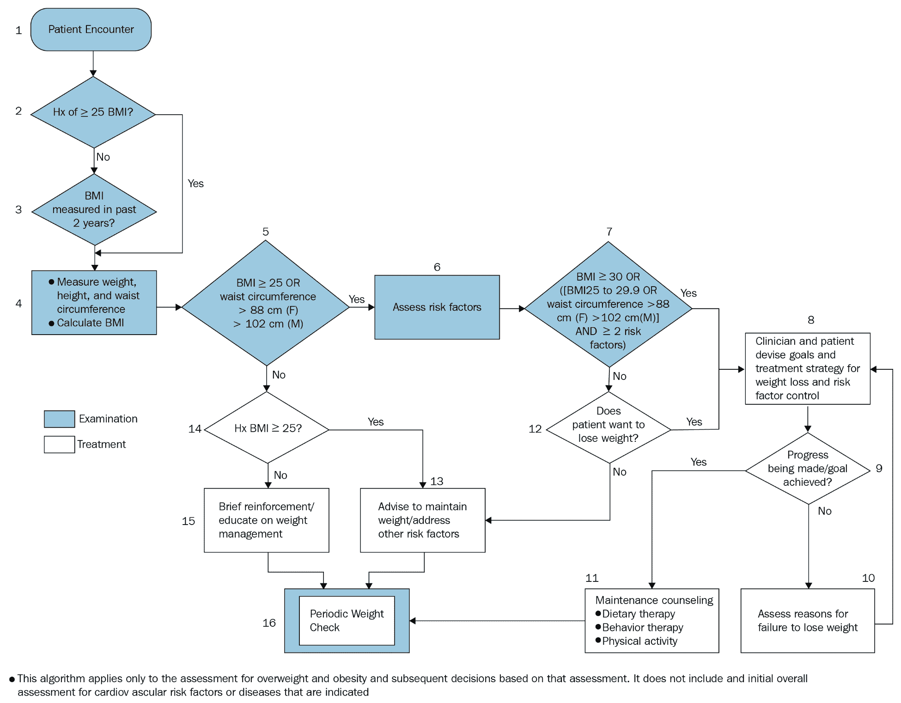
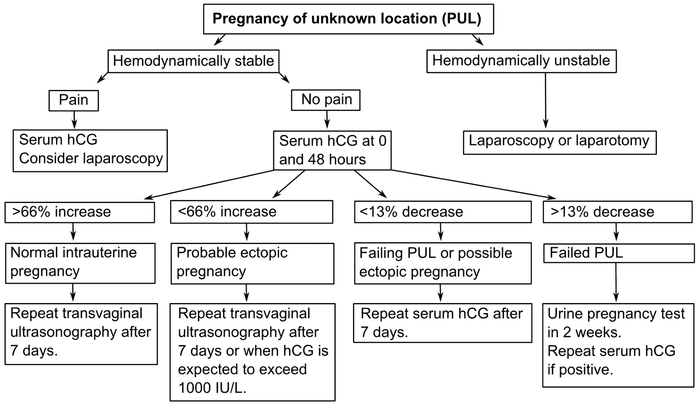
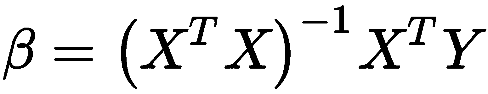
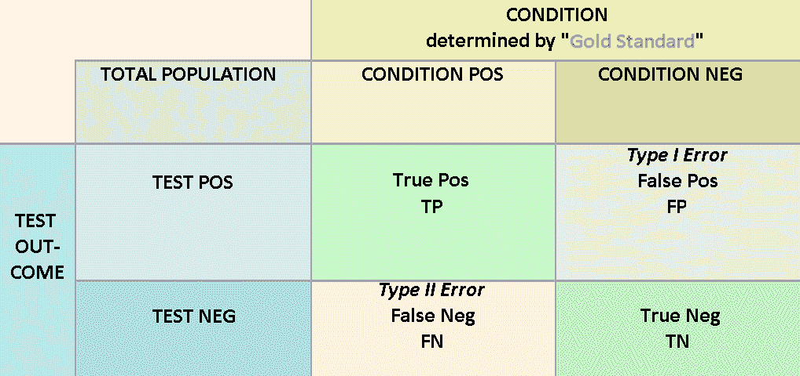
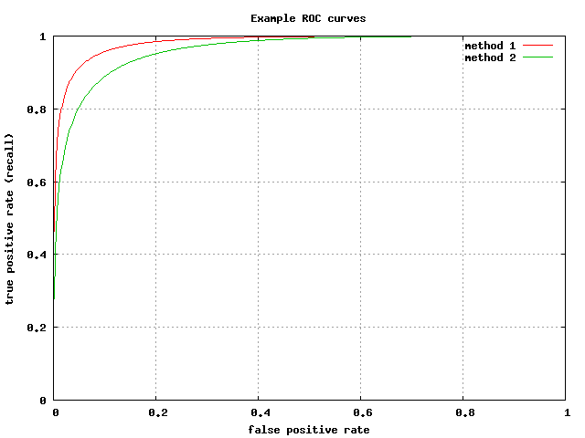

# 机器学习基础

本章介绍了医疗保健分析和机器学习背后的数学基础。它主要面向缺乏医疗保健分析所需的数学背景知识的医疗保健专业人员。本章结束时，您将熟悉以下内容:

*   医疗决策范例
*   基本的机器学习管道


# 医疗决策的模型框架

一个鲜为人知的事实是，除了他们在训练期间必须完成的基础科学课程和临床轮转之外，医生还学习生物统计学和医疗决策方面的课程。在这些课程中，未来的医生将学习一些数学和统计学知识，这些知识将帮助他们整理不同的症状、发现和测试结果，从而为他们的患者制定诊断和治疗计划。许多医生已经被无止境的医学事实和知识轰炸过，对这些课程不屑一顾。然而，无论他们是从这些课程还是从自己的经验中学到的，医生在日常实践中使用的许多推理都类似于一些常见机器学习算法背后的数学。让我们在这一节中更深入地探讨这一论断，因为我们看到了一些流行的医疗决策框架，并将它们与机器学习方法进行了比较。


# 树状推理

我们都熟悉树状推理；当遇到不同的决策点时，它包括分支到各种可能的行动。在这里，我们更仔细地观察树状推理，并检查它的机器学习对应物:决策树和随机森林。


# 用算法和树进行分类推理

在一个医疗决策范例中，临床问题可以作为**树**或**算法**来处理。这里，算法不是指计算机科学意义上的“机器学习算法”；它可以被认为是一个结构化的、有序的规则集，用来达成决策。在这种类型的推理中，树根代表患者遭遇的开始。当医生在提问时了解到更多的信息时，他们会到达不同的分支或决策点，在那里医生可以在多条路线上进行。这些路线代表不同的临床测试或不同的问题。医生将反复做出决定并选择下一个分支，到达不再有分支的终端节点。终端节点代表明确的诊断或治疗计划。

这里我们有一个体重和肥胖管理的临床管理算法的例子(国家心肺血液研究所，2010)。每个决策点(大部分是二元的)是一个菱形，而管理计划是长方形。

例如，假设我们有一位女性患者，测量了几个临床变量:身体质量指数= 27，腰围= 90 cm，心脏危险因素数= 3。从节点#1 开始，我们从节点#2 直接跳到节点#4，因为身体质量指数> 25。在节点#5，答案还是“是”在节点#7，答案同样是“是”，将我们带到节点#8 中概述的管理计划:



结合诊断和治疗的算法的第二个例子如下所示(Haggstrom，2014；Kirk 等人，2014)。在用于未知位置妊娠的诊断/治疗的该算法中，血流动力学稳定且无疼痛的患者(心脏和血管功能稳定的患者)被安排在向医生出示后 0 和 48 小时抽取血清 hCG。根据结果，给出几种可能的诊断，以及相应的管理计划。

请注意，在临床领域，这些树完全有可能是错误的；这些情况被称为预测误差。构建任何树的目标都是选择最佳变量/切割点，使误差最小化:



算法有许多优点。首先，他们将人类的诊断推理建模为一系列层次化的决策或决定。此外，他们的目标是通过迫使看护者在每个决策点提供二元答案来消除不确定性。算法已被证明可以提高医疗实践中护理的标准化，并在今天广泛用于许多医疗条件，不仅在门诊/住院实践中，而且在到达医院之前由**急救医疗技术人员** ( **EMTs** )使用。

然而，算法往往过于简单化，没有考虑到医学症状、发现或测试结果可能无法表明 100%确定性的事实。当必须权衡多种证据才能做出决定时，它们是不够的。

相应的机器学习算法——决策树和随机森林

在上图中，您可能已经注意到，示例树最有可能使用*主观确定的*切割点来决定遵循哪条路线。例如，钻石#5 使用的身体质量指数截止值为 25，钻石#7 使用的身体质量指数截止值为 30。漂亮的整数！在决策分析领域，树通常是基于人类的推理和讨论来构建的。如果我们能够*客观地*确定要削减的最佳变量(以及相应的削减点)以最小化算法的误差，那会怎么样？

这正是我们在使用机器学习算法训练正式的**决策树**时所做的。决策树在 20 世纪 90 年代发展起来，并使用信息论的原理来优化树的分支变量/点，以最大化分类准确性。训练决策树的最常见和最简单的算法是使用所谓的**贪婪**方法。从第一个节点开始，我们获取数据的训练集，并基于每个**变量**使用各种**切割点**对其进行**分割**。在每次分割之后，我们计算由此产生的熵或信息增益。不要担心计算这些量的公式，只要知道它们测量从分裂中获得多少信息，这与分裂的均匀程度相关。例如，使用前面所示的 PUL 算法，导致 8 次正常宫内妊娠和 7 次异位妊娠的分裂将优于导致 15 次正常宫内妊娠和 0 次异位妊娠的分裂。一旦我们有了最佳分割的变量和切割点，我们继续，然后使用剩余的变量重复该方法。为了防止**使**模型过度适应训练数据，当达到特定标准时，我们停止分裂树，或者，我们可以训练一棵具有许多节点的大树，然后移除(**修剪**)一些节点。


# 决策树有一些限制。首先，决策树必须基于单个变量在每一步线性分割决策空间。另一个问题是决策树容易过度拟合。由于这些问题，在最小化错误方面，决策树通常无法与大多数最先进的机器学习算法相竞争。然而，**随机森林，**基本上是去相关决策树的集合，是目前医学中最流行和最准确的机器学习方法之一。我们将在本书的[第七章](d029d858-9c6e-4bf0-b793-87cdc4395e86.xhtml)、*在医疗保健中制作预测模型*中制作决策树和随机森林。

In the preceding diagram, you may have noticed that the example tree most likely uses *subjectively* determined cutpoints in deciding which route to follow. For example, Diamond #5 uses a BMI cutoff of 25, and Diamond #7 uses a BMI cutoff of 30\. Nice, round numbers! In the decision analysis field, trees are usually constructed based on human inference and discussion. What if we could *objectively* determine the best variables to cut (and the corresponding cutpoints at which to cut) in order to minimize the error of the algorithm?

概率推理和贝叶斯定理

接近患者的第二种更数学的方法包括初始化患者的疾病的基线概率，并利用发现的关于患者的每个新的临床发现来更新疾病的概率。使用贝叶斯定理更新概率。

用贝叶斯定理计算临床概率


# 简而言之，贝叶斯定理允许在给定疾病的预测试概率、测试结果和测试的 2 x 2 列联表的情况下，计算疾病的预测试概率。在这种情况下,“测试”结果不一定是实验室测试；它可以是在病史和体格检查中确定的任何临床发现的存在或不存在。例如，胸痛的存在、胸痛是否是胸骨后的、运动负荷试验的结果以及肌钙蛋白结果都可以作为临床发现，在此基础上可以计算试验后的概率。虽然贝叶斯定理可以扩展到包括连续值的结果，但在计算概率之前将测试结果二进制化是最方便的。

为了说明贝叶斯定理的使用，让我们假设你是一名初级保健医生，一名 55 岁的病人走近你说，“我胸痛。”当你听到“胸痛”这个词时，你首先担心的威胁生命的情况是心肌梗塞。你可以问这样一个问题，“这个病人发生心肌梗塞的可能性有多大？”在这种情况下，是否存在胸痛是测试(在该患者中为阳性)，是否存在心肌梗死是我们试图计算的。


# 计算基线 MI 概率

为了计算胸痛患者发生**心肌梗塞** ( **MI** )的概率，我们必须知道三件事:

预测验概率


# 相关疾病临床发现的 2 x 2 列联表(本例中为 MI)

该测试的结果(在这种情况下，患者胸痛呈阳性)

*   The pretest probability
*   因为还不知道患者是否存在其他发现，我们可以将预测试概率作为人群中 MI 的基线患病率。让我们假设，在你的诊所所在的地区，55 岁的人在任何一年的 MI 基线患病率为 5%。因此，该患者心肌梗死的预测试概率为 5%。我们将在后面看到，该患者的测试后疾病概率是预测试概率乘以阳性胸痛的似然比(LR+)。为了得到 LR+，我们需要 2 x 2 列联表。
*   2 x 2 胸痛和心肌梗死应急表

假设下表是在您的诊所就诊的 400 名患者中胸痛和心肌梗死的详细情况:

Because the presence or absence of other findings is not yet known in the patient, we can take the pretest probability to be the baseline prevalence of MI in the population. Let's pretend that in your clinic's region, the baseline prevalence of MI in any given year is 5% for a 55-year-old person. Therefore, the pretest probability of MI in this patient is 5%. We will see later that the post-test probability of disease in this patient is the pretest probability multiplied by the likelihood ratio for positive chest pain (LR+). To get LR+, we need the 2 x 2 contingency table.


# **心肌梗塞(D+)**

**无心肌梗塞(D-)**

| **总计** | **胸痛(T+)** | 15 (TP) | 100(英尺/秒) |
| 115 | **胸痛消失(T-)** | 5(新生力量) | 280(总吨) |
| 285 | **总计** | 20 | 380 |
| 400 | 解释列联表并计算灵敏度和特异性 | 在上表中，有四个数字单元格，标记为 **TP** 、 **FP** 、 **FN** 和 **TN** 。这些缩写分别代表**真阳性**、**假阳性**、**假阴性**和**真阴性**。第一个词(对/错)表示测试结果是否与黄金标准测量的疾病存在相匹配。第二个词(阳性/阴性)表示测试结果。真正的积极和真正的消极是可取的；这意味着测试结果是正确的，这些数字越高，测试越好。另一方面，假阳性和假阴性是不希望的。 | 可以从真/假阳性/阴性中计算出的两个重要量包括**灵敏度**和**特异性**。敏感度是测试在检测疾病方面有多强的一个衡量标准。它表示为阳性检测结果与患病患者总数的比率: |


# 另一方面，特异性是测试在识别没有患病的患者方面有多好的量度。它表达如下:

In the preceding table, there are four numerical cells, labeled **TP**, **FP**, **FN**, and **TN**. These abbreviations stand for **true positives**, **false positives**, **false negatives**, and **true negatives**, respectively. The first word (true/false) indicates whether or not the test result matched the presence of disease as measured by the gold standard. The second word (positive/negative) indicates what the test result was. True positives and true negatives are desirable; this means that the test result is correct and the higher these numbers, the better the test is. On the other hand, false positives and false negatives are undesirable.

这些概念最初可能会令人困惑，所以在你习惯它们之前可能需要一些时间和迭代，但灵敏度和特异性是生物统计学和机器学习中的重要概念。


计算胸痛(+和-)的可能性比率


**似然比**是一项测试改变患病可能性的度量。它通常分为两个量:阳性检验的似然比(LR+)和阴性检验的似然比(LR-)。

在胸痛结果为阳性的情况下，MI 的可能性比率由以下公式给出:


# 假设胸痛结果为阴性，则 MI 的可能性比率由以下公式给出:

由于患者对胸痛的存在呈阳性，在这种情况下只有 LR+适用。为了得到 LR+，我们使用适当的数字:

考虑到胸痛的存在，计算试验后 MI 的概率


现在我们有了 LR+，我们将它乘以预测试概率，得到后验概率:


Since the patient is positive for the presence of chest pain, only LR+ applies in this case. To get LR+, we use the appropriate numbers:

```
LR+ = (TP/(TP + FN)) / (FP/(FP + TN)) 
    = (15/(15 + 5)) / (100/(100 + 280)) 
    = 0.750 / 0.263 
    = 2.85
```


# Calculating the post-test probability of MI given the presence of chest pain

Now that we have LR+, we multiply it by the pretest probability to get the post-test probability:

```
Post-Test Probability = 0.05 x 2.85 = 14.3%.
```

这种诊断和管理病人的方法似乎很有吸引力；能够计算出疾病的确切概率似乎消除了诊断中的许多问题！不幸的是，贝叶斯定理在临床实践中因为许多原因而失效。首先，每一步都需要大量的数据来更新概率。没有一个医生或数据库能够访问所有的列联表，这些列联表需要用发现的关于病人的每个历史元素或实验室测试结果来更新贝叶斯定理。第二，这种概率推理方法对于人类来说是不自然的。讨论的其他技术更有助于人脑的表现。第三，虽然该模型可能对单一疾病有效，但当有多种疾病和共病时，它就不太有效。最后，也是最重要的，作为贝叶斯定理基础的条件独立性、穷尽性和排他性假设在临床世界中不成立。现实是症状和发现并不是完全相互独立的；一项发现的存在与否会影响许多其他发现。总的来说，这些事实使得由贝叶斯定理计算出的概率在大多数情况下是不精确的，甚至是误导性的，即使人们成功地计算出了它。然而，当有充分证据时，贝叶斯定理在医学上对于许多子问题是重要的(例如，使用胸痛特征来计算患者病史中 MI 的概率)。

相应的机器学习算法——朴素贝叶斯分类器

在前面的示例中，我们向您展示了如何在给定预测试概率、可能性和测试结果的情况下计算预测试概率。被称为朴素贝叶斯分类器的机器学习算法对给定观察值的每个特征依次进行这种处理。例如，在前面的示例中，后验概率为 14.3%。让我们假设患者现在已经抽取了肌钙蛋白，并且它升高了。14.3%现在成为预测试概率，并且基于肌钙蛋白和心肌梗死的列联表计算新的预测试概率，其中列联表从训练数据获得。这一直持续到所有特征都用尽为止。同样，关键的假设是每个特性都是独立的。对于分类器，具有最高后验概率的类别(结果)被分配给观察值。

朴素贝叶斯分类器在一组精选的应用程序中很流行。它的优点包括高的可解释性、对缺失数据的鲁棒性以及训练和预测的简易性/速度。然而，它的假设使该模型无法与更先进的算法竞争。


# Corresponding machine learning algorithm – the Naive Bayes Classifier

标准表和加权和方法

我们将讨论的第三个医疗决策范例是标准表及其与线性和逻辑回归的相似性。

标准表


# 使用标准表的部分原因是贝叶斯定理的另一个缺点:它一次考虑一个发现的顺序性。有时候，在考虑疾病的同时，同时考虑很多因素会更方便。如果我们把某种疾病的诊断想象成选择因素的叠加会怎么样？也就是说，在 MI 示例中，患者因具有阳性胸痛而获得一分，因具有阳性压力测试历史而获得一分，等等。我们可以建立一个总点数的阈值，该阈值给出心梗的阳性诊断。因为一些因素比其他因素更重要，我们可以使用加权和，其中每个因素在相加之前乘以一个重要因素。例如，胸痛可能值三分，阳性压力测试史可能值五分。这就是标准表的工作方式。

在下表中，我们给出了修改后的威尔斯标准作为示例。修改后的威尔斯标准(源自 2017 年临床预测)用于确定患者是否可能患有**肺栓塞** ( **肺栓塞**):肺部有危及生命的血凝块。请注意，标准表不仅提供了每个相关临床发现的分值，还提供了解释总分的阈值:


# **临床发现**

**得分**

深静脉血栓形成的临床症状(腿部肿胀、触诊疼痛)

| 3.0 | 替代诊断比肺栓塞的可能性小 |
| 3.0 | 心率>每分钟 100 次 |
| 1.5 | 制动超过 3 天或在过去 4 周内做过手术 |
| 1.5 | 既往诊断为深静脉血栓形成/肺栓塞 |
| 1.5 | 咯血 |
| 1.0 | 病人得了癌症 |
| 1.0 | 1.0 |
| Patient has cancer | **风险分层** |
|  | PE 风险低 |
| < 2.0 | Medium risk for PE |
| 2.0 - 6.0 | High risk for PE |
| > 6.0 | 2.0 - 6.0 |
| High risk for PE | > 6.0 |

相应的机器学习算法–线性和逻辑回归

请注意，标准表倾向于使用易于添加的漂亮的整数。显然，这是为了方便医生在看病人时使用这些标准。如果我们能够以某种方式确定每个因素的最佳点值以及最佳阈值，会发生什么？值得注意的是，名为逻辑回归的机器学习方法正是这样做的。

**逻辑回归**是一种流行的统计机器学习算法，常用于二分类任务。这是一种被称为广义线性模型的模型。


# 要理解 logistic 回归，首先要理解**线性回归**。在线性回归中， *i* ^(th) 输出变量( *y-hat* )被建模为 *p* 单个预测变量、 *x [i]* 的加权和:

变量的权重(β)(也称为**系数**)可由以下等式确定:

逻辑回归类似于线性回归，不同之处在于它对输出变量应用变换，将其范围限制在 0 和 1 之间。因此，它非常适合于在分类任务中对肯定响应的概率进行建模，因为概率也必须在 0 和 1 之间。

逻辑回归有许多实际的优点。首先，它是一个直观简单的模型，易于理解和解释。理解它的机制不需要高中统计学以外的高等数学知识，并且可以很容易地向项目中的技术和非技术利益相关者解释。


其次，就时间或内存而言，逻辑回归不是计算密集型的。系数只是与预测值列表一样长的数的集合，并且它的确定只涉及几次矩阵乘法(参见前面的第二个等式作为例子)。对此的一个警告是，当处理非常大的数据集(例如，数十亿个数据点)时，矩阵可能非常大，但大多数机器学习模型都是如此。



Logistic regression is like linear regression, except that it applies a transformation to the output variable that limits its range to be between 0 and 1\. Therefore, it is well-suited to model probabilities of a positive response in classification tasks, since probabilities must also be between 0 and 1.

第三，逻辑回归不需要对变量进行太多的预处理(例如，居中或缩放)(尽管将预测值移向正态分布的转换可以提高性能)。只要变量是数字格式，就足以开始逻辑回归了。

最后，逻辑回归，特别是当与正则化技术(如 lasso 正则化)结合使用时，可以在进行预测时具有相当强的性能。

然而，在当今快速而强大的计算时代，逻辑回归在很大程度上已经被其他更强大、通常更准确的算法所取代。这是因为逻辑回归对数据和建模任务做出了许多主要假设:

它假设每个预测因子都与结果变量有线性关系。在大多数数据集中显然不是这样。换句话说，逻辑回归不擅长对数据中的非线性进行建模。

它假设所有的预测值都是相互独立的。同样，通常情况并非如此，例如，两个或多个变量可能会相互影响预测，其影响方式不仅仅是每个变量的线性和。这可以通过在模型中添加预测因子的乘积作为相互作用项来部分弥补，但是选择要建模的相互作用并不是一件容易的事情。

它对多重相关的预测变量非常敏感。在存在这些数据的情况下，逻辑回归可能会导致过度拟合。为了克服这一点，有变量选择方法，如向前逐步逻辑回归、向后逐步逻辑回归和最佳子集逻辑回归，但这些算法不精确和/或费时。

*   最后，逻辑回归不像某些分类器(例如朴素贝叶斯)那样对缺失数据具有鲁棒性。
*   模式关联和神经网络
*   最后一个医学决策框架击中了我们对如何处理信息和做出决策的神经生物学理解的核心。

Finally, logistic regression is not robust to missing data, like some classifiers are (for example, Naive Bayes).


# Pattern association and neural networks

The last medical decision making framework strikes at the heart of our neurobiological understanding of how we process information and make decisions.

复杂的临床推理

想象一下，一位抱怨胸痛的老年患者去看一位经验丰富的医生。慢慢地，临床医生提出适当的问题，并根据患者的体征和症状特征得到患者的描述。病人说，他们有高血压病史，但没有其他心脏风险因素。胸痛的强度随着心跳而变化(也称为胸膜炎性胸痛)。患者还报告说，他们刚从欧洲回到美国。他们还抱怨小腿肌肉肿胀。慢慢地，医生将这些较低水平的信息(没有心脏风险因素、胸膜炎性胸痛、长时间不动、阳性 Homan 征)结合起来，并将其与以前患者的记忆和医生自己的丰富知识相结合，以建立该患者的较高水平的视图，并意识到该患者患有肺栓塞。医生命令进行 V/Q 扫描，并着手挽救患者的生命。

这样的故事每天都在全球各地的医疗诊所、医院和急诊科发生。医生使用来自患者病史、检查和测试结果的信息来构建对患者的更高层次的理解。他们是怎么做到的？答案可能在于神经网络和深度学习。


# 相应的机器学习算法——神经网络和深度学习

人类是如何思考和获得意识的，这无疑是宇宙中一个悬而未决的问题。关于人类如何实现理性思考，或者医生如何做出复杂的临床决策，知识非常匮乏。然而，在撰写本文时，我们最接近于模仿人类大脑在普通认知任务中的表现的方式可能是通过神经网络和深度学习。

一个**神经网络**模仿哺乳动物的神经系统，其中预测变量连接到人工“神经元”的连续层，这些人工“神经元”在将其非线性转换的输出发送到下一层之前聚合并求和加权输入。以这种方式，在最终产生指示目标值为正的可能性的结果变量之前，数据可以通过几个层。通常通过使用**反向传播**技术来训练权重，在每次迭代中，正确输出和预测输出之间的负差被添加到权重中。


# Corresponding machine learning algorithm – neural networks and deep learning

神经网络和反向传播技术在 20 世纪 80 年代由 *Nature* journal 发表的一篇著名论文中首次报道，如在[第 1 章](b15b2b73-d2bb-410f-ab55-5f0f1e91730e.xhtml)、*医疗保健分析简介* (Rumelhart 等人，1986)中所讨论的；在 2010 年代，现代计算能力以及海量数据导致神经网络被重新命名为“**深度学习**”随着计算能力和数据可用性的增加，机器学习任务(如语音识别、图像和对象识别以及数字识别)的性能也有了最先进的提高。

神经网络的基本优势在于，它们是为处理数据中预测变量之间的非线性和复杂相互作用而构建的。这是因为神经网络中的每一层本质上都是对前一层的输出执行线性回归，而不仅仅是对输入数据本身执行线性回归。网络的层数越多，网络可以模拟的复杂功能就越多。神经元中非线性转换的存在也有助于这种能力。

神经网络也很容易适用于**多类问题**，其中有两种以上的可能结果。识别数字 0 到 9 只是其中的一个例子。

神经网络也有缺点。首先，它们的可解释性很低，很难向项目中的非技术风险承担者解释。理解神经网络需要大学水平的微积分和线性代数知识。

其次，神经网络可能很难调整。通常涉及许多参数(例如，如何初始化权重、隐藏层的数量和大小、使用什么激活函数、连接模式、正则化和学习速率)，并且系统地调整所有这些参数几乎是不可能的。

最后，神经网络容易过度拟合。过度拟合是指模型已经“记住”了训练数据，不能很好地推广到以前看不到的数据。如果参数/图层太多和/或数据迭代次数太多，就会发生这种情况。

我们将在第七章、*中与神经网络合作，在医疗保健领域建立预测模型*。

Second of all, neural networks can be difficult to tune. There are often many parameters involved (for example, how to initialize weights, the number, and size of hidden layers, what activation functions to use, connectivity patterns, regularization, and learning rates) and tuning all of them systematically is close to impossible.

机器学习管道

在上一节中，我们花了很多时间讨论机器学习模型以及它们如何对应于医疗决策的框架。但是如何训练一个机器学习模型呢？在医疗保健领域，机器学习通常由一种模式化的任务组成。我们可以将这些任务的集合称为**流水线**。虽然对于任何两个机器学习应用程序，没有两个管道是完全相同的，但管道允许我们描述机器学习过程。在本节中，我们描述了许多简单的机器学习项目倾向于遵循的通用管道，特别是在处理**结构化数据**或可以组织成行和列的数据时。

加载数据


# 在我们对数据进行计算之前，必须将数据从存储位置(通常是数据库或实时数据源)加载到计算工作区。工作区允许用户使用流行的语言(包括 R、Python、Hadoop 和 Spark)操作数据和构建模型。许多商业数据库具有专门的功能，以便于加载到工作空间中。机器学习语言本身也具有从文本文件中读取、连接到数据库并从中读取的功能。有时，用户可能更喜欢直接在数据库中执行数据质量控制和清理。这通常包括建立患者索引、数据标准化和数据清理等步骤。在[第 4 章](e1b89921-e75b-4b16-a567-8970a173db53.xhtml)、*计算基础-数据库、*中，我们讨论了使用**结构化查询语言** ( **SQL** )操作数据库，在[第 5 章](12ee77f2-0655-4dc5-abb1-2868d6fcc386.xhtml)、*计算基础-Python 简介、*中，我们讨论了将数据加载到 Python 工作空间的方法。

清理和预处理数据


# 在数据科学中有一句流行的谚语，“数据科学家每花 10 个小时，就要花 7 个小时清理数据。”有几个子任务可以归类到**数据清理**下，我们现在就来看看。

Before we can make computations on the data, it must be **loaded** from a storage location (usually a database or a real-time data feed) into a computing workspace. Workspaces allow the user to manipulate the data and build models using popular languages including R, Python, Hadoop, and Spark. Many commercial databases have specialized functionality in order to facilitate loading into workspaces. The machine learning languages themselves also have functions that read from text files and connect to and read from databases. Sometimes the user may also prefer to perform data quality control and cleansing directly in the database. This typically includes steps such as building a patient index, data normalization, and data cleaning. In [Chapter 4](e1b89921-e75b-4b16-a567-8970a173db53.xhtml), *Computing Foundations – Databases,* we discuss the manipulation of databases using the **Structured Query Language** (**SQL**) and in [Chapter 5](12ee77f2-0655-4dc5-abb1-2868d6fcc386.xhtml), *Computing Foundations – Introduction to Python,* we discuss methods for loading the data into a Python workspace.


# 汇总数据

数据通常在数据库中被组织为单独的表，这些表可以由共同的患者或遭遇标识符绑定在一起。机器学习算法通常一次只处理一种数据结构。因此，将几个表中的数据合并到一个最终的表中是一项重要的任务。在这个过程中，您必须做出一些决定，哪些数据要保留(人口统计数据通常是必不可少的)，哪些数据可以安全地忘记(例如，如果您试图预测癌症的发作，服用抗哮喘药物的确切时间戳可能并不重要)。

解析数据


# 在有些情况下，我们需要的部分或全部数据是压缩形式的。一个例子包括医疗保健调查数据的平面文件，其中每个调查被编码为一个 *N* 字符串，每个位置的字符对应于特定的调查响应。在这种情况下，我们需要的数据必须被分解成各种成分，并在使用之前转换成有用的格式。我们将此活动称为**解析**。甚至使用特定医疗编码系统表达的数据也可能需要一些解析。

转换类型


# 如果你熟悉编程，你会知道数据可以存储为不同的**变量类型**，从简单的整数到复杂的小数再到字符串(字符)类型。这些类型在可对其执行的操作方面有所不同。例如，如果数字 3 和 5 存储为整数类型，我们可以使用代码轻松计算 3+5= 8。然而，如果它们被存储为字符串类型，将“3”加到“5”可能会产生错误，或者可能会产生“35”，这将导致我们的数据出现各种问题，正如您可以想象的那样。清理和检查数据的一部分是确保每个变量都以正确的类型存储。数字数据应该对应于数字类型，大多数其他数据应该对应于字符串或分类类型。

除了变量类型，在许多建模语言中，必须决定如何使用更复杂的**数据容器**来存储数据，例如 R 中的列表、向量和数据帧，以及 Python 中的列表、字典、元组和数据帧。各种导入和建模功能可能会假设不同的数据结构选择，因此再次强调，为了达到期望的结果，数据结构之间的相互转换通常是必要的，这是数据清理的一个关键部分。我们将在[第 5 章](12ee77f2-0655-4dc5-abb1-2868d6fcc386.xhtml)、*计算基础——Python 简介*中讲述 Python 相关的数据结构。


# Converting types

If you are familiar at all with programming, you know that data can be stored as different **variable types**, ranging from simple integers to complex decimals to string (character) types. These types differ in terms of the operations that can be performed on them. For example, if the numbers 3 and 5 are stored as integer types, we can easily calculate 3+5= 8 using code. However, if they are stored as string types, adding "3" to "5" may yield an error, or it may yield "35," and this would cause all sorts of problems with our data, as you can imagine. Part of cleaning and inspecting the data is making sure every variable is stored as its proper type. Numerical data should correspond to numerical types, and most other data should correspond to string or categorical types.

处理缺失数据

机器学习在医疗保健领域如此特别困难的部分原因是它容易**丢失数据**。住院患者的医院数据收集通常依赖于护士和其他临床工作人员来彻底完成，考虑到护士和其他临床工作人员有多忙，难怪许多住院患者数据集具有某些不一致报告的特征，如尿液摄入和排出或药物给药的时间戳。另一个例子是诊断代码:一个病人可能有资格进行一打医疗诊断，但是为了节省时间，门诊医生只将其中的五个输入到图表中。当这些细节被排除在我们的数据之外时，我们的模型在应用于真实患者时将会不那么准确。

比缺乏细节更成问题的是缺失数据对我们算法的影响。在由成千上万的患者和数百个特征组成的数据框架中，即使有一个值缺失，也会阻止模型成功运行。一个快速的解决方法可能是在缺少值的地方简单地键入或估算一个零。但是如果变量是血红蛋白实验室值，那么血红蛋白 0.0 肯定是不可能的。我们应该用平均血红蛋白实验室值来估算缺失的数据吗？我们使用总体平均值还是特定性别平均值？诸如此类的问题是处理缺失数据本身实际上是一个数据科学领域的原因。对数据集中的缺失数据有基本的认识，这一点的重要性怎么强调都不为过。特别是，了解零值数据和缺失数据之间的区别非常重要。此外，熟悉一些概念，如 **zero** 、 **NaN** ("不是一个数字")、 **NULL** ("missing ")或 **NA** ("不适用")，以及它们在您选择的语言中是如何表达的，无论是 SQL、Python、R 还是其他语言，这都很重要。


# 数据清理阶段的最终目标通常是一个单一的**数据框架**，这是一个单一的数据结构，它将数据组织成由行和列组成的类似矩阵的对象，其中行包含单个事件或观察结果，列使用各种数据类型反映观察结果的不同特征。在理想的情况下，所有的变量都将被检查并转换成适当的类型，不会有丢失的数据。应该注意的是，在到达这个最后的里程碑之前，在数据清理、探索、可视化和特征选择之间可能会有一些来回的迭代。数据探索/可视化和特性选择是我们接下来要讨论的两个管道步骤。

Part of the reason why machine learning is so uniquely difficult in healthcare is its propensity for **missing data**. Inpatient hospital-data collection is often dependent on the nurses and other clinical staff to be completed thoroughly, and given how busy nurses and other clinical staff are, it's no wonder that many inpatient datasets have certain features, such as urinary intake and output or timestamps of medication administrations, inconsistently reported. Another example is diagnosis codes: a patient may be eligible for a dozen medical diagnoses but in the interest of time, only five are entered into the chart by the outpatient physician. When details such as these are left out of our data, our models will be that much less accurate when applied to real patients.

探索和可视化数据

为了与解析和清理数据紧密结合，数据探索和可视化是模型构建过程的重要部分。管道的这一部分很难具体定义——在探索数据时，我们到底在寻找什么？潜在的理论是，人类可以比计算机做得更好，比如建立联系和识别模式。人们对数据看得越多，分析得越多，就会越发现变量之间的关系，以及它们如何被用来预测目标变量。

在这一步骤中，一个流行的探索活动是评估所有的预测变量；也就是说，它们的格式(例如，它们是二进制、分类还是连续)以及每种格式中有多少个缺失值。对于**二元变量**，统计有多少个响应是正的，有多少个是负的是有帮助的；对于**分类变量**，统计每个变量可能取多少个值以及每个值的频率直方图是有帮助的；对于**连续变量**，计算一些集中趋势(例如，均值、中值、众数)和离差(例如，标准差、百分位数)的度量是一个好主意。


# 可以进行额外的探索和可视化活动来阐明所选预测变量和目标变量之间的关系。具体的图因格式(二元、分类、连续)而异。例如，当预测变量和目标变量都是连续的时，**散点图**是流行的可视化；为了制作散点图，将每个变量的值绘制在不同的轴上。如果预测变量是连续的，而目标变量是二元的或分类的，那么**双重叠频率直方图**是一个很好的工具，正如**盒须图**一样。

在许多情况下，有如此多的预测变量，以至于不可能手动检查和可视化每个关系。在这些情况下，自动分析和计算测量和统计，如相关系数，变得很重要。

选择功能

构建模型时，功能越多并不总是越好。从实施的角度来看，与具有最少功能的简化版本相比，与多个设备、健康信息系统和源数据库交互的实时临床设置预测管道模型更有可能失败。具体来说，在清理和浏览数据时，您会发现并非所有的要素都与结果变量有显著的关系。

In many cases, there are so many predictor variables that it becomes impossible to inspect manually and visualize each relationship. In these cases, automatic analyses, and calculating measures and statistics, such as correlation coefficients, become important.


# 此外，许多变量可能与其他变量高度相关，几乎不会为准确预测提供新信息。事实上，将这些变量留在模型中会降低模型的准确性，因为它们会给数据添加随机噪声。因此，机器学习管道中的一个常见步骤是执行**特征选择**并从数据中移除不需要的特征。数量和要删除的变量取决于许多因素，包括您的机器学习算法的选择和您希望模型的可解释性。

有许多方法可以从最终模型中移除无关的特征。在迭代方法中，特征被移除，生成的模型被构建、评估并与先前的模型进行比较，这种方法很受欢迎，因为它们允许人们测量调整如何影响模型的性能。选择特征的几种算法包括**最佳子集选择**和向前向后**逐步回归**。还有各种衡量特征重要性的方法，其中包括相对风险比、优势比、*p*-值显著性、套索正则化、相关系数和随机森林出袋误差，我们将在[第 7 章](d029d858-9c6e-4bf0-b793-87cdc4395e86.xhtml)、*在医疗保健中建立预测模型*中探讨其中的一些方法。

训练模型参数

一旦我们有了最终的数据框架，我们就可以把机器学习问题看作是最小化一个误差函数。我们所要做的就是对看不见的病人/遭遇做出最好的预测；我们正努力使预测值和观察值之间的差异最小化。例如，如果我们试图预测癌症的发病，我们希望预测的癌症发生的可能性在发生癌症的患者中较高，在未发生癌症的患者中较低。在机器学习中，预测值和观察值之间的差异被称为**误差函数**或**成本函数**。成本函数可以采取各种形式，机器学习实践者经常在执行建模时修补它们。当最小化成本函数时，我们需要知道我们分配给某些特征的权重。在大多数情况下，与结果变量相关性更高的特征应该比与结果变量相关性较低的特征具有更高的数学重要性。简单地说，我们可以将这些“重要性变量”称为权重或参数。有监督的机器学习的主要目标之一就是找到唯一的一组参数或权重，使我们的成本函数最小化。几乎每种机器学习算法都有自己的方式来为不同的特征分配权重。我们将在[第 7 章](d029d858-9c6e-4bf0-b793-87cdc4395e86.xhtml)、*医疗保健预测模型*中更详细地研究逻辑回归、随机森林和神经网络算法。

评估模型性能


# 最后，在建立模型之后，重要的是对照地面事实评估其性能，以便我们可以在需要时调整它，比较不同的模型，并将我们模型的结果报告给其他人。评估模型性能的方法取决于被预测的目标变量的结构。

通常，评估模型的第一步是制作一个 2 x 2 的列联表，其示例如下所示(Preventive Medicine，2016)。在 2 x 2 列联表中，所有观察结果分为四类，在下图中进一步讨论:


# 

对于二值目标变量(例如，分类问题)，将有四种类型的观察值:

那些我们预测会有积极结果的

那些我们预测会有负面结果的正面结果

那些我们预测会有积极结果的消极结果

*   那些我们预测会有负面结果的
*   这四类观测值分别称为:
*   **真阳性** ( **TP** )
*   **假阴性** ( **FN** )

**误报** ( **FP** )

*   **真底片** ( **TN** )
*   然后可以从这四个量中计算出各种性能指标。我们将在接下来的章节中介绍流行的方法。
*   灵敏度(序列号)
*   **敏感度**，也被称为**回忆**，回答了这样一个问题:“我的模型在错误地检测对疾病呈阳性的观察结果方面有多有效？”

其公式如下所示:


# 特异性

**特异性**回答了这样一个问题:“我的模型在错误地检测对疾病呈阴性的观察结果方面有多有效？”

其公式如下所示:


# 敏感性和特异性是互补的性能度量，通常一起报告以度量模型的性能。

阳性预测值

**正预测值** ( **PPV** )，也称为**精度**，回答问题:“给定我的模型的正预测，它正确的可能性有多大？”


其公式如下所示:


# 阴性预测值(NPV)

**负面预测值** ( **NPV** )回答了这个问题:“给定我的模型的负面预测，它是正确的可能性有多大？”

其公式如下所示:


# 假阳性率(FPR)

**假阳性率** ( **FPR** )回答了这个问题:“给定一个负面的观察，我的模型将其归类为正面的可能性有多大？”

其公式如下所示:


# 也等于 1 减去*特异性(1 - Sp)* 。

精确度(Acc)

**准确性** ( **Acc** )回答了这个问题，“给定任何观察，我的模型将其正确分类的可能性有多大？”它可以用作模型性能的独立度量。


其公式如下:


# 接收机工作特性曲线

当目标变量是二进制时，许多机器学习算法将以从 0 到 1 的分数形式返回对观察的预测。因此，预测的正值或负值取决于我们在该范围内设置阈值的位置。例如，如果我们建立一个模型来预测癌症恶性肿瘤，并确定某个特定患者的恶性肿瘤可能性为 0.65，则选择 0.60 的正阈值会对该患者做出正预测，而选择 0.70 的阈值会对该患者做出负预测。所有的性能分数都因我们设置阈值的位置而异。根据我们的检测目标，某些阈值会导致比其他阈值更好的性能。例如，如果我们对癌症检测感兴趣，将阈值设置为低值(如 0.05)会增加我们模型的灵敏度，但会牺牲特异性，但这可能是我们所希望的，因为我们可能不介意假阳性，只要我们可以识别每个可能有患癌症风险的患者。

Its formula is the following:


# Receiver operating characteristic (ROC) curves

When the target variable is binary, many machine learning algorithms will return the prediction for the observation in the form of a score that ranges from 0 to 1\. Therefore, the positive or negative value of the prediction depends on where we set the threshold in that range. For example, if we build a model to predict cancer malignancy and determine that a particular patient's malignancy likelihood is 0.65, choosing a positive threshold of 0.60 makes a positive prediction for that patient, while choosing a threshold of 0.70 makes a negative prediction for that patient. All of the performance scores vary according to where we set the threshold. Certain thresholds will lead to better performance than others, depending on our goal for detection. For example, if we are interested in cancer detection, setting a threshold to a low value such as 0.05 will increase the sensitivity of our model, at the expense of the specificity, but this may be desired because we may not mind the false positives as long as we can identify every patient who is possibly at risk for cancer.

也许二进制结果变量最常见的性能测量范例是构建一个**接收器操作特性** ( **ROC** ) **曲线**。在此曲线中，我们绘制了两个测量值，假阳性率和灵敏度，因为我们将阈值从 0 变到 1。灵敏度通常与假阳性率成反比，在大多数情况下产生小写的 r 形曲线。模型越强，灵敏度越高，假阳性率一般会越低，曲线下的**面积** ( **AUC** )会趋于 1。因此，AUC 可用于比较模型(针对同一用例),同时消除对阈值的依赖性。

如下所示的示例 ROC 图(示例 ROC 曲线，2016)具有两条 ROC 曲线，一条深色曲线和一条浅色曲线。因为红色(深色)曲线比浅色曲线具有更大的曲线下面积，所以深色曲线测量的模型可以被视为比浅色曲线反映的模型表现更好:

精确召回曲线

**精确召回曲线**是当目标变量不平衡时(例如，当正负比率很低或很高时)ROC 曲线的替代曲线。在医疗保健领域，许多用例具有较低的正负比率，因此您可能会经常看到这条曲线。它绘制了阈值从 0 到 1 变化时灵敏度的阳性预测值。在大多数情况下，这会产生一个大写的 L 形曲线。

连续值目标变量



# 对于连续取值的目标变量(例如回归问题)，没有真阳性或假阳性的概念，因此无法计算之前讨论的度量和曲线。而是通常计算**残差平方和** ( **RSS** ) **误差**:它是实际值与预测值之间距离的平方和。

摘要


# 在这一章中，我们已经浏览了一些用于执行医疗保健分析的机器学习和数学基础。在下一章中，我们将继续探讨医疗保健分析的基本三部曲，转到计算部分。

参考资料和进一步阅读


# 临床预测(2017)。"威尔斯肺栓塞临床预测规则."[http://www.clinicalprediction.com/wells-score-for-pe/](http://www.clinicalprediction.com/wells-score-for-pe/)。2018 年 6 月 6 日接入。

“文件:示例 ROC 曲线. png。”维基共享，自由媒体仓库。世界协调时 2016 年 11 月 26 日 05 时 26 分。https://commons.wikimedia.org/w/index.php? T2 2018 年 7 月 11 日 01:53title = File:Example _ ROC _ curves . png&oldid = 21996 07 71。


# “文件:预防医学统计敏感性 TPR，特异性 TNR，PPV，NPV，FDR，FOR，准确性，似然比，诊断比值比 2 Final.png .”维基共享，免费媒体库。世界协调时 2016 年 11 月 26 日 04 时 26 分。https://commons.wikimedia.org/w/index.php? T4 2018 年 7 月 11 日 01:42title = File:Preventive _ Medicine _ Statistics _ Sensitivity _ TPR，_Specificity_TNR，_PPV，_NPV，_FDR，_FOR，_ ACCuracy _ Ratio，_ Diagnostic _ Odds _ Ratio _ 2 _ final . png&oldid = 219913391。

Clinical Prediction (2017). "Wells Clinical Prediction Rule for Pulmonary Embolism."[http://www.clinicalprediction.com/wells-score-for-pe/](http://www.clinicalprediction.com/wells-score-for-pe/). Accessed June 6, 2018.

米凯尔·海格斯特伦(2014 年)。[2014 年 Mikael hgg strm 医学画廊](https://en.wikiversity.org/wiki/WikiJournal_of_Medicine/Medical_gallery_of_Mikael_H%C3%A4ggstr%C3%B6m_2014)。维基医学杂志 1 (2)。[DOI](https://en.wikipedia.org/wiki/Digital_object_identifier):[10.15347/wjm/2014.008](https://doi.org/10.15347/wjm/2014.008)。[刊号](https://en.wikipedia.org/wiki/International_Standard_Serial_Number)2002-4436。[公共领域](https://creativecommons.org/publicdomain/zero/1.0/deed.en)。

James G，Witten D，Hastie T，Tibshirani R (2014 年)。*统计学习入门。纽约:施普林格。*

柯克 E，博顿利 C，伯恩 T (2014)。“异位妊娠的诊断和未知部位妊娠处理的当前概念”。哼。报告。更新 20(2):250–61。[土井](https://en.wikipedia.org/wiki/Digital_object_identifier):[10.1093/hum upd/DMT 047](https://doi.org/10.1093/humupd/dmt047)。 [PMID](https://en.wikipedia.org/wiki/PMID) [24101604](https://www.ncbi.nlm.nih.gov/pubmed/24101604) 。

马克，DB (2005)。"临床医学中的决策"在卡斯珀 DL，布朗瓦尔德东，福奇 AS，豪泽 SL，隆戈 DL，詹姆逊 JL。eds。*哈里森的* *内科学原理*，16e。纽约州纽约市:麦格劳-希尔公司。

美国国家心肺血液研究所(2010 年)。“治疗算法。”*超重和肥胖指南:电子教材。*[https://www . NHL bi . NIH . gov/health-pro/guidelines/current/obesity-guidelines/e _ textbook/txgd/algor TM/algor TM . htm](https://www.nhlbi.nih.gov/health-pro/guidelines/current/obesity-guidelines/e_textbook/txgd/algorthm/algorthm.htm)。2018 年 6 月 3 日接入。

鲁梅尔哈特德，辛顿戈，威廉姆斯 RJ (1986)。"通过反向传播错误学习表征."*性质* 323(9): 533-536。

Mark, DB (2005). "Decision-Making in Clinical Medicine." In Kasper DL, Braunwald E, Fauci AS, Hauser SL, Longo DL, Jameson JL. eds. *Harrison's* *Principles of Internal Medicine*, 16e. New York, NY: McGraw-Hill.

National Heart, Lung, and Blood Institute (2010). "Treatment Algorithm." *Guidelines on Overweight and Obesity: Electronic Textbook.* [https://www.nhlbi.nih.gov/health-pro/guidelines/current/obesity-guidelines/e_textbook/txgd/algorthm/algorthm.htm](https://www.nhlbi.nih.gov/health-pro/guidelines/current/obesity-guidelines/e_textbook/txgd/algorthm/algorthm.htm) . Accessed June 3, 2018.

Rumelhart DE, Hinton GE, Williams RJ (1986). "Learning representations by backpropagating errors." *Nature *323(9): 533-536.