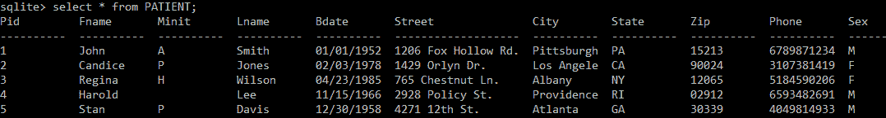
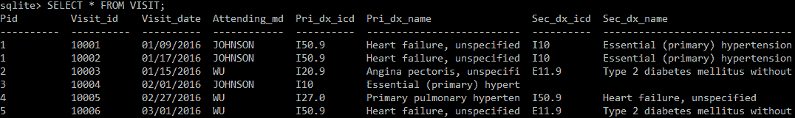
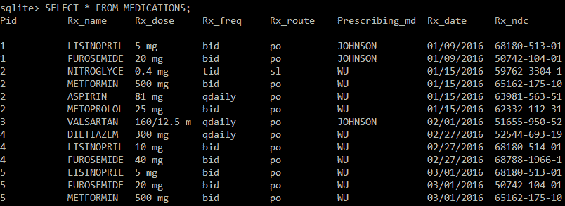
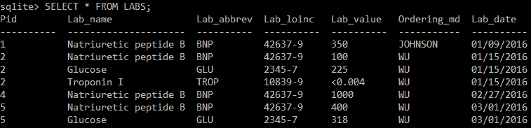
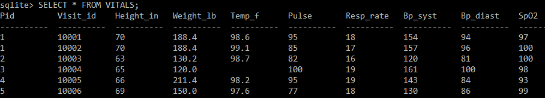
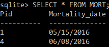

# 计算基础–数据库

本章将向您介绍数据库和**结构化查询语言** ( **SQL** )。它主要面向对医疗保健数据库感兴趣的医疗保健专业人员、初级数据科学家和程序员。本章结束时，你将知道什么是数据库，以及如何使用基本的 SQL 来提取和操作临床数据库中的信息。我们将展示一个示例任务和 SQL 语句，它们对于在一个包含五名患者的小型样本数据库中操作数据非常有用。


# 数据库简介

一个**数据库**可以定义为相关数据的集合(Elmasri 和 Navathe，2010)。数据库通常被细分为 **SQL 数据库**或 **NoSQL 数据库**。在 SQL 数据库中，数据记录在表中，由行和列组成。相关数据可以分布在几个表中，在高效存储和便利性之间进行权衡。**数据库管理系统** ( **DBMS** )是一个使数据库能够提供多种功能的软件。首先，它允许使用 SQL 语言对数据进行*检索*(针对 SQL 数据库)。另一个功能是在需要时更新数据，也是使用 SQL。DBMS 的附加功能包括保护和保证数据安全。

数据库管理本身是一个复杂的领域。在本书中，我们将重点介绍*使用 SQL 检索和更新通常分布在多个相关表中的临床数据*。有关数据库的其他综合资源，请参见本章末尾的*参考文献*部分。


# 使用 SQL 的数据工程–一个示例案例

在本章中，让我们假设你在美国的一家心脏病诊所获得了一项预测分析任务。该诊所希望您预测哪些患者在就诊后的 6 个月内有死亡风险。他们以包含六个表的数据库形式向您提供数据。为了简单起见，我们截断了数据库，只包含了 5 名患者的信息。我们的任务是使用 SQL 语言操纵数据，将其合并到一个表中，以便用于机器学习。我们将首先检查数据库中的患者和数据库结构。然后，我们将介绍工程的基本 SQL 概念，并将数据处理成机器学习的形式。


# 案例详情——预测心脏病实践的死亡率

您所在的心脏病诊所有两名医生:Johnson 医生和 Wu 医生。虽然该诊所有许多患者，但他们感兴趣的是确定哪些就诊患者在未来 6 个月内存在全因死亡的高风险。在 2016 年的某个时候进行门诊访问构成了分析的入选标准。目标变量是患者是否在就诊后 6 个月内去世。

现在我们已经回顾了建模任务的细节，让我们看看数据库中的五个病人。心脏病学诊所发送给您的初步数据包括五名患者的信息，分布在六个表格中。以下是每个病人的案例简介。请注意，这一部分大量使用与心血管疾病相关的临床术语。我们鼓励您使用可用的在线资源来回答您关于该术语的问题。一份全面的临床参考文献是 *Harrison 的《内科学原理》* (Kasper 等人，2005)，本章末尾给出了相关信息。

以下是关于患者的信息:

*   **患者 ID-1** :数据库中的患者#1 是一名 65 岁的男性，患有**充血性心力衰竭** ( **CHF** )，这是一种心脏无法将血液正常泵送到身体其他部位的慢性疾病。他还患有高血压，这是充血性心力衰竭的一个危险因素。他于 2016 年 9 月 1 日和 2016 年 1 月 17 日拜访了他的心脏病专家约翰逊医生。在 1 月 9 日的就诊中，他被发现血压升高(154/94)，B-钠尿肽(BNP)实验室值升高至 350。BNP 是充血性心力衰竭严重程度的标志。他随后被给予赖诺普利和呋塞米，这是治疗充血性心力衰竭和高血压的一线药物。不幸的是，他于 2016 年 5 月 15 日去世。
*   **患者 ID-2** :患者#2 为 39 岁女性，有心绞痛(运动时心血管相关的胸痛)和糖尿病病史。糖尿病是心肌梗塞(心脏病发作；动脉粥样硬化性心脏病的晚期、通常是致命的表现)，而心绞痛可被视为动脉粥样硬化性心脏病的早期表现。她于 2016 年 1 月 15 日拜访了她的心脏病专家吴医生，当时她被发现血糖水平升高到 225，这是糖尿病未得到控制的迹象。她开始用二甲双胍治疗糖尿病，用硝酸甘油、阿司匹林和美托洛尔治疗心绞痛。
*   **患者 ID-3** :患者#3 是一名 32 岁的女性，她为了她的高血压去看约翰逊医生。在 2016 年 2 月 1 日就诊期间，她的血压升至 161/100。她开始服用缬沙坦/氢氯噻嗪，这是一种抗高血压的组合药物。
*   **患者 ID: 4** :患者#4 为患有严重 CHF 并伴有肺动脉高压的 51 岁男性。2016 年 2 月 27 日看了吴医生。在那次访问中，他的体重为 211 磅，血压略有升高，为 143/84。他的脑钠肽水平升高到 1000。他的充血性心力衰竭用赖诺普利和速尿治疗，肺动脉高压用地尔硫卓治疗。不幸的是，他于 2016 年 6 月 8 日去世。
*   **患者 ID-5** :我们数据库中的最后一名患者，患者#5，是一名 58 岁的男性，于 2016 年 3 月 1 日就诊于 Wu 医生，有充血性心力衰竭和 2 型糖尿病病史。在就诊期间，他的血糖升高到 318，脑钠肽中度升高到 400。他开始用赖诺普利和呋塞米治疗充血性心力衰竭，用二甲双胍治疗糖尿病。


# 临床数据库

现在我们已经了解了数据库中包含的五名患者的信息，我们可以描述数据库中包含的表结构和字段，针对六个模拟表:`PATIENT`、`VISIT`、`MEDICATIONS`、`LABS`、`VITALS`和`MORT`。尽管每个临床数据库都不同，但我还是尝试使用医疗保健中常见的结构。通常，表格按临床领域呈现(关于以这种分布式格式接收表格的研究实例，参见 Basole 等人，2015)。例如，通常有一个包含人口统计和个人信息的表，一个包含实验室结果的表，一个包含药物的表，等等，所以这就是我们在这个例子中构建数据库的方式。它们往往被一个公共标识符联系在一起，在我们的例子中是`Pid`字段。

在描述表格时，我们必须牢记数据工程阶段的最终目标——将六个表格中的相关信息合并到一个表格中，该表格的列中除了预测变量之外还包括目标变量(本例中为死亡率),这对预测目标变量应该很有用。这将使我们能够用 Python 的`scikit-learn`等流行的包制作一个机器学习模型。考虑到这一点，我们将突出显示对我们的作业有用的选定字段。


# 病床

在我们的示例中，我们可以在下面的截图中看到的`PATIENT`表包含了我们的患者的人口统计和身份信息——他们的姓名、联系信息、生日和生物性别。在这个例子中，只有 5 个观察值和 11 列；在实际操作中，该表将包含医疗保健组织的所有患者。该表中的行数可能从数百到数十万不等，而该表可能包含几十列，其中包含详细的人口统计信息:



在数据库中，每个独特的患者都被分配了一个标识符(标记为`Pid`的字段)，在我们的例子中，它被简单地编号为 1 - 5。`Pid`栏允许我们跟踪不同桌子上的病人。另外，请注意，每个不同的患者 ID 有且只有一个条目。

在确定了必不可少的标识符列之后，重点应该是保留哪些变量，丢弃哪些变量。当然，年龄和性别是死亡率的重要人口统计学预测指标。如果种族在这张表中，那将是另一个重要的人口统计变量。

该表中另一个值得注意的变量是邮政编码。越来越多的社会经济数据被用于机器学习分析。邮政编码可能与公开可用的人口普查数据相关联；然后，可以将该数据与该表中关于邮政编码的数据相结合，并有可能提供关于每个患者邮政编码的平均教育水平、收入和医疗保健覆盖范围的信息。甚至还有出售家庭级信息的机构；然而，随之而来的是隐私保护和数据安全的重大责任。对于这个例子，我们将省略邮政编码，以保持最终表的简单。

我们将从最终表格中删除的信息包括姓名、街道地址和电话号码。只要我们有患者 ID，这些字段就不会对我们的目标变量产生太大的预测影响。


# 探视台

虽然`PATIENT`表包含每个患者的基本管理信息，但我们的任务是根据每次*就诊*预测死亡风险。`VISIT`表包含每次患者就诊的一个观察结果，以及每次就诊的一些临床信息:



请注意，患者 ID 不再是该表的主要标识符，因为患者#1 有两次就诊；相反，在本例中有一个从`10001`到`10006`编号的`Visit_id`字段，每次访问都有一个不同的 ID。

此表还包含`Visit_date`。由于心脏病学实践表明他们希望了解患者就诊后 6 个月内的死亡风险，因此我们在计算目标变量时将不得不使用该字段。

该表中的两个字段包含 ICD(诊断)代码。实际的表可能包含每次访问的几十个代码。对于每个编码字段，都有一个相应的名称字段，其中包含代码表示的条件的名称。医疗保健中的一种流行方法是，在最终表格中，为我们感兴趣跟踪的每个临床代码创建一列(Futoma 等人，2015；Rajkomar 等人，2018 年)。我们将在本章的后面采用这种方法。

最后，我们注意到主治医生的姓名也包括在内，这可以用来衡量医生的表现。


# 药物表

`MEDICATIONS`表包含五名患者正在服用的每种药物的一个条目。在这个例子中，没有一个单独的列作为这个表的主键。正如我们在下面的屏幕截图中所看到的，该表包括关于药物名称、剂量、频率、途径、处方医生和处方日期的信息。每种药物的 NDC 代码也包括在内；我们在[第 2 章](71c31b0a-fa9e-4b31-8b58-f563a815e338.xhtml)、*医疗保健基金会*中介绍了 NDC 准则:



将药物纳入我们的最终表格并不简单。例如，表格中的信息并不表示每种药物的类别。NDC 代码是存在的，但是 NDC 代码甚至比药物名称更精细，因为它在制作每个独特代码时包括给药途径和剂量；因此，多种形式的赖诺普利可能具有不同的 NDC 密码。为了为每种药物创建一个列，我们可以为每种药物单独创建一个表，其中包含组成它的所有药物，然后将这些信息合并到我们的表中。

如果我们选择包含剂量信息，该字段将需要一些清理。请注意，3 号患者正在接受一种抗高血压复合药物——缬沙坦成分的剂量为 160 mg，而氢氯噻嗪成分的剂量为 12.5 mg。这可能被编码为两种独立的药物，但是创建一个将组合药物分成两行的脚本并不简单。


# 实验室桌子

实验室信息是临床诊断的重要组成部分，许多实验室检验结果有助于预测变量(Donze 等人，2013；Sahni 等人，2018 年)。`LABS`表包括描述实验室测试名称、缩写、LOINC 代码和结果的字段:



在最终表格中包含实验室信息有几种不同的方法。一种方法是将原始实验室结果作为一个连续变量。然而，这导致了一个问题，因为对于大多数实验来说结果将是空的。当它丢失时，我们可以通过输入一个正常范围内的值来解决这个问题。另一种方法是在异常范围内为实验室测试结果设置一个二元变量。这解决了丢失数据的问题，因为如果结果丢失，它将是零。然而，采用这种方法，BNP 值为 1000(表明重度充血性心力衰竭)与 BNP 值为 350(表明轻度充血性心力衰竭)没有区别。我们将在本章中演示这两种方法。

另请注意，`Lab_value`字段有时包含特殊字符，例如在肌钙蛋白结果中。这些将需要被删除，并相应地解释实验室值。培养结果(不包括在本例中)完全是文字性的，通常命名特定的细菌菌株而不是编号。

我们再次重申，这是一个简化的示例，许多针对这些患者的常见实验室检查(例如，WBC 计数、血红蛋白、钠、钾等)都被排除在外。


# 生命体征表

生命体征是患者健康状况的重要指标，可以作为医疗保健机器学习模型的良好预测器(Sahni et al .，2018)。生命体征通常在每次患者就诊时采集，因此它们可以很容易地以原始(数字)形式包含在内，以保持粒度。

在下面的表格截图中，我们注意到虽然身高和体重都存在，但是体重指数 ( **身体质量指数**)却不见了。我们将在第 5 章、*计算基础 Python 简介*中演示身体质量指数的计算。其次，Visit #10004 缺少一个温度读数。这在医疗保健中很常见，可能是由护理中的疏忽引起的:



生命体征表

在本章的后面，我们将估算这次访问的正常温度。


# 死亡之桌

最后，我们来到包含目标变量的表。`MORT`表只包含两个字段，病人标识符和病人去世的日期。未列在此表中的患者可以假定为健在:



稍后，我们将学习如何将该表中的信息转换为二进制目标变量。


# 启动 SQLite 会话

我们将用来转换数据库的数据库引擎是 **SQLite** 。在[第 1 章](b15b2b73-d2bb-410f-ab55-5f0f1e91730e.xhtml)、*医疗保健分析简介*中，我们介绍了安装说明以及基本的 SQLite 命令。应该提到的是，SQL 有许多变体，SQLite 专用的 SQL 与 MySQL 或 SQL Server 数据库专用的 SQL 略有不同。然而，基本原则在所有 SQL 方言中保持不变。

此时，请执行以下操作:

1.  在您的 shell 或命令提示符下导航到包含`sqlite3.exe`程序的目录(使用`cd`命令)。
2.  键入`sqlite3 mortality.db`并按*进入*。您应该会看到如下所示的提示:`sqlite>`。该提示表明您正在使用 SQLite 程序。
3.  在本章的其余部分，我们将创建一些表，并在 SQLite 程序中对它们执行一些 SQLite 命令。
4.  要随时退出会话，键入`.exit`并按*键进入*。


# 数据工程，使用 SQL 一次一个表

现在让我们看看如何使用 SQLite 执行数据工程。首先，我们必须在数据库中创建我们的表。然后，我们将一个接一个地操纵它们，以得到想要的最终表格。


# 查询集# 0–创建六个表

在这个模拟作业中，让我们假设可以从心脏病学诊所下载数据的门户网站不工作。取而代之的是，一名技术人员向您发送 SQLite 命令，您可以使用这些命令来创建六个表。你可以跟着书走，手动输入每个命令。或者，您可以去该书的官方代码库并从那里下载命令。


# 查询集# 0a–创建患者表

在数据库中创建表的一种方法是手动指定它的模式。让我们用第一张表`PATIENT`来做这件事:

```
sqlite> CREATE TABLE PATIENT(
 Pid VARCHAR(30) NOT NULL,
 Fname VARCHAR(30) NOT NULL,
 Minit CHAR,
 Lname VARCHAR(30) NOT NULL,
 Bdate TEXT NOT NULL,
 Street VARCHAR(50),
 City VARCHAR(30),
 State VARCHAR(2),
 Zip VARCHAR(5),
 Phone VARCHAR(10) NOT NULL,
 Sex CHAR,
 PRIMARY KEY (Pid)
);
```

在前面的例子中，注意表的名称出现在`CREATE TABLE`短语之后。接下来是一个左括号，每行都有一个新列(例如，`Pid`和`Fname`)。在每一行中，列名之后是每一列的类型。在本例中，我们对大多数列使用`VARCHAR()`，其中是该列包含的最大字符数。一个`CHAR`列只包含一个字符。最后，一些重要的字段(比如名称和标识符)我们不允许为空，我们使用`NOT NULL`短语为这些列指定。

现在我们已经创建了表的模式，下一步是用数据填充表。正如我们所说的，在数据库中我们只有 5 名患者，因此`PATIENT`表将有 5 行。我们使用一个`INSERT`命令将每一行插入表中，如下所示:

```
sqlite> INSERT INTO PATIENT (Pid, Fname, Minit, Lname, Bdate, Street, City, State, Zip, Phone, Sex)
VALUES ('1','John','A','Smith','1952-01-01','1206 Fox Hollow Rd.','Pittsburgh','PA','15213','6789871234','M');

sqlite> INSERT INTO PATIENT (Pid, Fname, Minit, Lname, Bdate, Street, City, State, Zip, Phone, Sex)
VALUES ('2','Candice','P','Jones','1978-02-03','1429 Orlyn Dr.','Los Angeles','CA','90024','3107381419','F');

sqlite> INSERT INTO PATIENT (Pid, Fname, Minit, Lname, Bdate, Street, City, State, Zip, Phone, Sex)
VALUES ('3','Regina','H','Wilson','1985-04-23','765 Chestnut Ln.','Albany','NY','12065','5184590206','F');

sqlite> INSERT INTO PATIENT (Pid, Fname, Minit, Lname, Bdate, Street, City, State, Zip, Phone, Sex)
VALUES ('4','Harold','','Lee','1966-11-15','2928 Policy St.','Providence','RI','02912','6593482691','M');

sqlite> INSERT INTO PATIENT (Pid, Fname, Minit, Lname, Bdate, Street, City, State, Zip, Phone, Sex)
VALUES ('5','Stan','P','Davis','1958-12-30','4271 12th St.','Atlanta','GA','30339','4049814933','M');
```

注意，在使用`VALUES`关键字之前，`INSERT`语句首先指定将要插入的字段，然后列出实际的数据元素。如果使用了`VARCHAR`或`CHAR`，数据元素应该用单引号括起来。


# 查询集# 0b–创建访问表

现在让我们制作`VISIT`表格。同样，首先我们使用一个`CREATE TABLE`语句，然后是六个`INSERT`语句:

```
sqlite> CREATE TABLE VISIT(
 Pid VARCHAR(30) NOT NULL,
 Visit_id VARCHAR(30) NOT NULL,
 Visit_date DATE NOT NULL,
 Attending_md VARCHAR(30) NOT NULL,
 Pri_dx_icd VARCHAR(20) NOT NULL,
 Pri_dx_name VARCHAR(100) NOT NULL,
 Sec_dx_icd VARCHAR(20),
 Sec_dx_name VARCHAR(100),
 PRIMARY KEY (Visit_id)
);

sqlite> INSERT INTO VISIT (Pid, Visit_id, Visit_date, Attending_md, Pri_dx_icd, Pri_dx_name, Sec_dx_icd, Sec_dx_name)
VALUES ('1','10001','2016-01-09','JOHNSON','I50.9','Heart failure, unspecified','I10','Essential (primary) hypertension');

sqlite> INSERT INTO VISIT (Pid, Visit_id, Visit_date, Attending_md, Pri_dx_icd, Pri_dx_name, Sec_dx_icd, Sec_dx_name)
VALUES ('1','10002','2016-01-17','JOHNSON','I50.9','Heart failure, unspecified','I10','Essential (primary) hypertension');

sqlite> INSERT INTO VISIT (Pid, Visit_id, Visit_date, Attending_md, Pri_dx_icd, Pri_dx_name, Sec_dx_icd, Sec_dx_name)
VALUES ('2','10003','2016-01-15','WU','I20.9','Angina pectoris, unspecified','E11.9','Type 2 diabetes mellitus without complications');

sqlite> INSERT INTO VISIT (Pid, Visit_id, Visit_date, Attending_md, Pri_dx_icd, Pri_dx_name, Sec_dx_icd, Sec_dx_name)
VALUES ('3','10004','2016-02-01','JOHNSON','I10','Essential (primary) hypertension','','');

sqlite> INSERT INTO VISIT (Pid, Visit_id, Visit_date, Attending_md, Pri_dx_icd, Pri_dx_name, Sec_dx_icd, Sec_dx_name)
VALUES ('4','10005','2016-02-27','WU','I27.0','Primary pulmonary hypertension','I50.9','Heart failure, unspecified');

sqlite> INSERT INTO VISIT (Pid, Visit_id, Visit_date, Attending_md, Pri_dx_icd, Pri_dx_name, Sec_dx_icd, Sec_dx_name)
VALUES ('5','10006','2016-03-01','WU','I50.9','Heart failure, unspecified','E11.9','Type 2 diabetes mellitus without complications');
```


# 查询集# 0c–创建药物表

要创建`MEDICATIONS`表，使用下面的代码:

```
sqlite> CREATE TABLE MEDICATIONS(
 Pid VARCHAR(30) NOT NULL,
 Rx_name VARCHAR(50) NOT NULL,
 Rx_dose VARCHAR(20),
 Rx_freq VARCHAR(10),
 Rx_route VARCHAR(10),
 Prescribing_md VARCHAR(30) NOT NULL,
 Rx_date DATE NOT NULL,
 Rx_ndc VARCHAR(30)
);

sqlite> INSERT INTO MEDICATIONS (Pid, Rx_name, Rx_dose, Rx_freq, Rx_route, Prescribing_md, Rx_date, Rx_ndc)
VALUES ('1', 'LISINOPRIL','5 mg','bid','po','JOHNSON','01/09/2016','68180-513-01');

sqlite> INSERT INTO MEDICATIONS (Pid, Rx_name, Rx_dose, Rx_freq, Rx_route, Prescribing_md, Rx_date, Rx_ndc)
VALUES ('1', 'FUROSEMIDE','20 mg','bid','po','JOHNSON','01/09/2016','50742-104-01');

sqlite> INSERT INTO MEDICATIONS (Pid, Rx_name, Rx_dose, Rx_freq, Rx_route, Prescribing_md, Rx_date, Rx_ndc)
VALUES ('2', 'NITROGLYCERIN','0.4 mg','tid','sl','WU','01/15/2016','59762-3304-1');

sqlite> INSERT INTO MEDICATIONS (Pid, Rx_name, Rx_dose, Rx_freq, Rx_route, Prescribing_md, Rx_date, Rx_ndc)
VALUES ('2', 'METFORMIN','500 mg','bid','po','WU','01/15/2016','65162-175-10');

sqlite> INSERT INTO MEDICATIONS (Pid, Rx_name, Rx_dose, Rx_freq, Rx_route, Prescribing_md, Rx_date, Rx_ndc)
VALUES ('2', 'ASPIRIN','81 mg','qdaily','po','WU','01/15/2016','63981-563-51');

sqlite> INSERT INTO MEDICATIONS (Pid, Rx_name, Rx_dose, Rx_freq, Rx_route, Prescribing_md, Rx_date, Rx_ndc)
VALUES ('2', 'METOPROLOL TARTRATE','25 mg','bid','po','WU','01/15/2016','62332-112-31');

sqlite> INSERT INTO MEDICATIONS (Pid, Rx_name, Rx_dose, Rx_freq, Rx_route, Prescribing_md, Rx_date, Rx_ndc)
VALUES ('3', 'VALSARTAN HCTZ','160/12.5 mg','qdaily','po','JOHNSON','02/01/2016','51655-950-52');

sqlite> INSERT INTO MEDICATIONS (Pid, Rx_name, Rx_dose, Rx_freq, Rx_route, Prescribing_md, Rx_date, Rx_ndc)
VALUES ('4', 'DILTIAZEM HYDROCHOLORIDE','300 mg','qdaily','po','WU','02/27/2016','52544-693-19');

sqlite> INSERT INTO MEDICATIONS (Pid, Rx_name, Rx_dose, Rx_freq, Rx_route, Prescribing_md, Rx_date, Rx_ndc)
VALUES ('4', 'LISINOPRIL','10 mg','bid','po','WU','02/27/2016','68180-514-01');

sqlite> INSERT INTO MEDICATIONS (Pid, Rx_name, Rx_dose, Rx_freq, Rx_route, Prescribing_md, Rx_date, Rx_ndc)
VALUES ('4', 'FUROSEMIDE','40 mg','bid','po','WU','02/27/2016','68788-1966-1');

sqlite> INSERT INTO MEDICATIONS (Pid, Rx_name, Rx_dose, Rx_freq, Rx_route, Prescribing_md, Rx_date, Rx_ndc)
VALUES ('5', 'LISINOPRIL','5 mg','bid','po','WU','03/01/2016','68180-513-01');

sqlite> INSERT INTO MEDICATIONS (Pid, Rx_name, Rx_dose, Rx_freq, Rx_route, Prescribing_md, Rx_date, Rx_ndc)
VALUES ('5', 'FUROSEMIDE','20 mg','bid','po','WU','03/01/2016','50742-104-01');

sqlite> INSERT INTO MEDICATIONS (Pid, Rx_name, Rx_dose, Rx_freq, Rx_route, Prescribing_md, Rx_date, Rx_ndc)
VALUES ('5', 'METFORMIN','500 mg','bid','po','WU','03/01/2016','65162-175-10');
```


# 查询集# 0d–创建实验室表

要创建`LABS`表，使用以下代码:

```
sqlite> CREATE TABLE LABS(
 Pid VARCHAR(30) NOT NULL,
 Lab_name VARCHAR(50),
 Lab_abbrev VARCHAR(20), 
 Lab_loinc VARCHAR(10) NOT NULL,
 Lab_value VARCHAR(20) NOT NULL,
 Ordering_md VARCHAR(30),
 Lab_date DATE NOT NULL
);

sqlite> INSERT INTO LABS (Pid, Lab_name, Lab_abbrev, Lab_loinc, Lab_value, Ordering_md, Lab_date)
VALUES ('1','Natriuretic peptide B','BNP','42637-9','350','JOHNSON','2016-01-09');

sqlite> INSERT INTO LABS (Pid, Lab_name, Lab_abbrev, Lab_loinc, Lab_value, Ordering_md, Lab_date)
VALUES ('2','Natriuretic peptide B','BNP','42637-9','100','WU','2016-01-15');

sqlite> INSERT INTO LABS (Pid, Lab_name, Lab_abbrev, Lab_loinc, Lab_value, Ordering_md, Lab_date)
VALUES ('2','Glucose','GLU','2345-7','225','WU','2016-01-15');

sqlite> INSERT INTO LABS (Pid, Lab_name, Lab_abbrev, Lab_loinc, Lab_value, Ordering_md, Lab_date)
VALUES ('2','Troponin I','TROP','10839-9','<0.004','WU','2016-01-15');

sqlite> INSERT INTO LABS (Pid, Lab_name, Lab_abbrev, Lab_loinc, Lab_value, Ordering_md, Lab_date)
VALUES ('4','Natriuretic peptide B','BNP','42637-9','1000','WU','2016-02-27');

sqlite> INSERT INTO LABS (Pid, Lab_name, Lab_abbrev, Lab_loinc, Lab_value, Ordering_md, Lab_date)
VALUES ('5','Natriuretic peptide B','BNP','42637-9','400','WU','2016-03-01');

```

```
sqlite> INSERT INTO LABS (Pid, Lab_name, Lab_abbrev, Lab_loinc, Lab_value, Ordering_md, Lab_date)
VALUES ('5','Glucose','GLU','2345-7','318','WU','2016-03-01');
```


# 查询集# 0e–创建生命体征表

请注意，`VITALS`表使用了数字类型，如`FLOAT`和`INT`。要创建`VITALS`表，使用以下代码:

```
sqlite> CREATE TABLE VITALS(
 Pid VARCHAR(30) NOT NULL,
 Visit_id VARCHAR(30) NOT NULL,
 Height_in INT,
 Weight_lb FLOAT,
 Temp_f FLOAT,
 Pulse INT,
 Resp_rate INT,
 Bp_syst INT,
 Bp_diast INT,
 SpO2 INT
);

sqlite> INSERT INTO VITALS (Pid, Visit_id, Height_in, Weight_lb, Temp_f, Pulse, Resp_rate, Bp_syst, Bp_diast, SpO2)
VALUES ('1','10001',70,188.4,98.6,95,18,154,94,97);

sqlite> INSERT INTO VITALS (Pid, Visit_id, Height_in, Weight_lb, Temp_f, Pulse, Resp_rate, Bp_syst, Bp_diast, SpO2)
VALUES ('1','10002',70,188.4,99.1,85,17,157,96,100);

sqlite> INSERT INTO VITALS (Pid, Visit_id, Height_in, Weight_lb, Temp_f, Pulse, Resp_rate, Bp_syst, Bp_diast, SpO2)
VALUES ('2','10003',63,130.2,98.7,82,16,120,81,100);

sqlite> INSERT INTO VITALS (Pid, Visit_id, Height_in, Weight_lb, Temp_f, Pulse, Resp_rate, Bp_syst, Bp_diast, SpO2)
VALUES ('3','10004',65,120.0,NULL,100,19,161,100,98);

sqlite> INSERT INTO VITALS (Pid, Visit_id, Height_in, Weight_lb, Temp_f, Pulse, Resp_rate, Bp_syst, Bp_diast, SpO2)
VALUES ('4','10005',66,211.4,98.2,95,19,143,84,93);

sqlite> INSERT INTO VITALS (Pid, Visit_id, Height_in, Weight_lb, Temp_f, Pulse, Resp_rate, Bp_syst, Bp_diast, SpO2)
VALUES ('5','10006',69,150.0,97.6,77,18,130,86,99);
```


# 查询集# 0f–创建 MORT 表

要创建`MORT`表，使用以下代码:

```
sqlite> CREATE TABLE MORT(
 Pid VARCHAR(30) NOT NULL,
 Mortality_date DATE NOT NULL,
 PRIMARY KEY (Pid)
);

sqlite> INSERT INTO MORT (Pid, Mortality_date)
VALUES ('1', '2016-05-15');

sqlite> INSERT INTO MORT (Pid, Mortality_date)
VALUES ('4', '2016-06-08');
```


# 查询集# 0g–显示我们的表

为了确认一个表(例如，`PATIENT`)是正确生成的，我们可以使用`SELECT * FROM PATIENT;`查询(我们将在查询集#2 中进一步解释这个语法):

```
sqlite> SELECT * FROM PATIENT;
1 John A Smith 1952-01-01 1206 Fox Hollow Rd. Pittsburgh PA 15213 6789871234 M
2 Candice P Jones 1978-02-03 1429 Orlyn Dr. Los Angele CA 90024 3107381419 F
3 Regina H Wilson 1985-04-23 765 Chestnut Ln. Albany NY 12065 5184590206 F
4 Harold Lee 1966-11-15 2928 Policy St. Providence RI 02912 6593482691 M
5 Stan P Davis 1958-12-30 4271 12th St. Atlanta GA 30339 4049814933 M
```


# 查询集# 1–创建 MORT_FINAL 表

我们编写的第一个查询将使用`CREATE TABLE`语句创建表。在一个版本的`CREATE TABLE`语句中，每个变量都用其对应的数据类型拼写出来。在前面的例子中，我们使用这个版本从头开始创建了六个表。或者，可以通过从现有的表中复制来创建一个表。我们将选择第二个选项。

既然我们已经回答了这个问题，第二个问题仍然存在——我们应该从哪个表复制？将患者信息从`PATIENT`表复制到我们的最终表可能很有诱惑力，因为它包含每个患者的一行，并且包含基本的人口统计信息。然而，我们必须记住用例是基于每次*访问*，而不是病人。因此，如果患者有两次就诊(如患者#1)，从技术上讲，该患者将获得两个风险评分:每次就诊一个。因此，我们应该从复制`VISIT`表中的信息开始。这将创建一个有六行的表，每次访问一行。

因此，我们使用一个`CREATE TABLE`子句开始我们的查询，其中`MORT_FINAL`是我们新表的名称。然后我们使用`AS`关键字。接下来的两行查询使用一个`SELECT-FROM-WHERE`结构指定要复制的信息:

```
sqlite> CREATE TABLE MORT_FINAL AS
SELECT Visit_id, Pid, Attending_md, Visit_date, Pri_dx_icd, Sec_dx_icd
FROM VISIT;
```

`SELECT-FROM-WHERE`语句是从表格中选择我们想要的信息的系统方法。`SELECT`部分充当*列*选择器——跟在`SELECT`关键字后面的是我们想要复制到新表中的列。请注意，我们省略了诊断名称(`Pri_dx_name`、`Sec_dx_name`)，因为这些名称在技术上不是预测变量，只要我们有每个代码，就可以参考它们的含义。关键字`FROM`指定了我们希望从中复制的表名(在本例中为`VISIT`)。`WHERE`关键字是一个可选子句，它允许我们只选择那些满足特定条件的*行*。例如，如果我们想将我们的模型限制在那些患者患有心力衰竭的就诊中，我们可以说`WHERE Pri_dx_code == 'I50.9'`。因为我们想在这个例子中包含所有的访问，所以这个查询不需要 WHERE 子句。我们将在下一个查询集中看到 WHERE 子句的作用。


# 查询集# 2–将列添加到 MORT_FINAL

在本节中，我们将演示添加附加列的两种方法。一种方法使用一个`ALTER TABLE`语句，而第二种方法使用一个`JOIN`操作。


# 查询集# 2a–使用 ALTER TABLE 添加列

现在我们已经将来自`VISIT`表的信息填充到了`MORT_FINAL`表中，是时候开始集成其他表了。我们将从`PATIENT`表开始；具体来说，我们想从这个表中添加出生日期和性别。我们从生日开始。

在查询集#2 中，我们演示了向表中添加新列(生日)的基本查询模式。我们从一个`ALTER TABLE`语句开始，然后是表名、操作(在本例中是`ADD COLUMN`)、新列名和变量类型。尽管标准 SQL 支持日期的`DATE`变量类型，但在 SQLite 中，我们使用的是`TEXT`类型。日期总是以`YYYY-MM-DD`格式指定。

在我们用`ALTER TABLE`语句初始化了新列之后，下一步是从`PATIENT`表中填充实际的出生日期。为此，我们使用了一个`UPDATE`语句。我们指定我们正在更新的表，后面跟着一个`SET`语句和我们正在修改的列的名称，后面有一个等号。

`SELECT-FROM-WHERE`块是 SQL 语言的基本*检索*查询。我们试图从`PATIENT`表中*检索*信息并填充到新的`Bdate`列中，所以我们在等号后面使用了一个`SELECT-FROM-WHERE`语句，用括号括起来。将 SQL 语句想象成用其`SELECT`语句向数据库发出以下命令:“对于`MORT_FINAL`表中的每一行，从`PATIENT`表中找到我的出生日期，其中`PATIENT`表中的`Pid`等于`MORT_FINAL`表中的`Pid`。”

在针对`Bdate`列的`UPDATE`语句之后，我们使用相同的查询序列(`ALTER TABLE`和`UPDATE`)从`PATIENT`表中检索`Sex`列:

查询集# 2b–使用连接添加列

虽然`ALTER TABLE`和`UPDATE`序列是一次向一个表中添加一列的好方法，但是当您想要从同一个表中复制许多列时，这可能会很繁琐。一个`JOIN`操作为我们提供了从同一个表中复制许多列的第二种选择。

In Query Set #2, we demonstrate the basic query pattern for adding a new column (the birthdate) to our table. We start with an `ALTER TABLE` statement, followed by the name of the table, the operation (`ADD COLUMN`, in this case), the name of our new column, and the variable type. Although standard SQL supports a `DATE` variable type for dates, in SQLite, we use the `TEXT` type. Dates are always specified in `YYYY-MM-DD` format.

在`JOIN`操作中，两个表格被组合成一个表格。在下面的查询示例中，`VITALS`表的选定列被追加到`MORT_FINAL`表的末尾。

然而，`MORT_FINAL`表和`VITALS`表都包含若干行。查询如何知道每个表的哪些行相互对应？这是使用一个`ON`子句指定的(在查询的末尾)。`ON`子句说，“当连接表时，组合那些访问 id 相等的行。”因此对于`MORT_FINAL`表中的每一行，它对应的`VISITS`表中只有一行:具有相同访问 ID 的行。这是有意义的，因为我们感兴趣的是在单独的行中从单独的访问中收集信息。

关于连接需要知道的另一件事是，在标准 SQL 中有四种不同的连接类型:左连接、右连接、内连接和外连接。左连接(在 SQLite 中称为左外连接)是我们在这里使用的类型；它说，“对于第一个表的每一行(本例中为`MORT_FINAL`)，添加访问 ID 相等的相应访问列，如果访问表中没有相应的访问 ID，则添加空值。”换句话说，不管右表中是否有相应的行，第一个表的所有行都被保留。在第二个表中有一行但在第一个表中没有的访问将被丢弃。

```
sqlite> ALTER TABLE MORT_FINAL ADD COLUMN Bdate TEXT;

sqlite> UPDATE MORT_FINAL SET Bdate = 
(SELECT P.Bdate
FROM PATIENT AS P
WHERE P.Pid = MORT_FINAL.Pid);

sqlite> ALTER TABLE MORT_FINAL ADD COLUMN Sex CHAR;

sqlite> UPDATE MORT_FINAL SET Sex = 
(SELECT P.Sex
FROM PATIENT AS P
WHERE P.Pid = MORT_FINAL.Pid);
```


# 在右连接中，情况正好相反:第二个表的惟一访问 id 被保留，并且它们与第一个表的相应访问 id 对齐。在第一个表中出现但在第二个表中丢失的访问 id 被丢弃。内部连接包含在最终结果中:只访问两个表中都存在的 id。外部联接包括两个表的所有行，并用空值替换所有缺少的条目。注意，我们应该补充的是，SQLite 不支持右连接和外连接。

那么我们为什么选择左连接呢？从根本上说，我们的工作是为每一次就诊指定一个预测，无论在那次就诊时是否记录了生命体征。因此，`MORT_FINAL`表中出现的每个访问 ID 都应该出现在最终结果中，左连接确保了这一点。

在下面的代码中，我们看到通过使用一个连接，只需要一个总计查询就可以添加八列`VITALS`表。这种方法的缺点是什么？首先，注意创建了一个新表:`MORT_FINAL_2`。我们不能追加到旧的`MORT_FINAL`表中；必须创建一个新表。另外，请注意，我们必须键入我们希望在最终结果中保留的每一列。在 SQL 中，星号(*)表示添加两个表中的所有列的*；我们本来可以写`SELECT * FROM MORT_FINAL ...`。但是，如果我们使用星号，就会有重复的列(例如，`Visit_id`列会出现两次，因为它在两个表中都存在)。*

In a `JOIN` operation, two tables are combined to produce a single table. In the following example query, the selected columns of the `VITALS` table are appended on the end of the `MORT_FINAL` table.

然后我们必须用一个`SELECT`语句排除重复的列。尽管如此，当第二个表中有许多列需要合并到第一个表中时，联接还是很有用的:

查询集# 3-日期处理-计算年龄

到目前为止，我们的`MORT_FINAL_2`表包含 16 列:6 列来自`VISIT`表，2 列来自`PATIENT`表，8 列来自`VITALS`表(您可以使用`SELECT * FROM MORT_FINAL_2;`命令来验证这一点)。在这个查询集中，我们使用日期操作将其中一个变量 birthdate 变量转换成可用的形式:我们计算病人的年龄。

正如我们前面在查询集#2a 中提到的，日期在 SQLite 中存储为`TEXT`变量类型，并且是`YYYY-MM-DD`格式。计算年龄需要两次调用`julianday()`函数。在 SQLite 中，`julianday()`函数将`YYYY-MM-DD`中的日期作为输入，并以浮点形式返回自公元前 4714 年 11 月 24 日 12:00 PM 以来的天数。它本身似乎不是很有用，但是当与另一个`julianday()`调用和一个减号结合使用时，它允许您找到两个日期之间过去的天数。接下来，我们计算出诊日期和出生日期之间的儒略日差，并将结果除以 365.25，得到患者的年龄。我们还将`ROUND()`函数应用于该结果，并四舍五入到小数点后两位(这是`2`在最后的括号结束之前所指示的):

In the following code, we see that by using a JOIN, only one total query is needed to add eight columns of the `VITALS` table. What are the downsides of this method? For one thing, notice that a new table is created: `MORT_FINAL_2`. We cannot append to the old `MORT_FINAL` table; a new table must be created. Also, notice that we have to type out each column that we wish to preserve in the final result. In SQL, the asterisk (*) indicates to add *all* columns from both tables; we could have written `SELECT * FROM MORT_FINAL ...`. However, if we used an asterisk, there would be duplicate columns (for example, the `Visit_id` column would be present twice, since it is in both tables).

Then we would have to exclude the duplicate columns with a `SELECT` statement. Nevertheless, JOINs are useful when there are many columns in a second table that you would like to merge into a first table:

```
sqlite> CREATE TABLE MORT_FINAL_2 AS
SELECT M.Visit_id, M.Pid, M.Attending_md, M.Visit_date, M.Pri_dx_icd, M.Sec_dx_icd, M.Bdate, M.Sex, V.Height_in, V.Weight_lb, V.Temp_f, V.Pulse, V.Resp_rate, V.Bp_syst, V.Bp_Diast, V.SpO2
FROM MORT_FINAL AS M LEFT OUTER JOIN VITALS AS V ON M.Visit_id = V.Visit_id;
```


# Query Set #3 – date manipulation – calculating age

So far, our `MORT_FINAL_2` table contains 16 columns: 6 from the `VISIT` table, 2 from the `PATIENT` table, and 8 from the `VITALS` table (you can verify this by using the `SELECT * FROM MORT_FINAL_2;` command). In this query set, we transform one of these variables, the birthdate variable, into a usable form using date manipulation: we calculate the patients' age.

As we said earlier in Query Set #2a, dates are stored in SQLite as `TEXT` variable types and are in the `YYYY-MM-DD` format. Calculating the age takes two calls to the `julianday()` function. In SQLite, the `julianday()` function takes a date in `YYYY-MM-DD` as input and returns the number of days since November 24th, 4714 BC 12:00 PM as a float. By itself, it may not seem very useful, but when used in combination with another `julianday()` call and a subtraction sign, it allows you to find the number of days that have elapsed between two dates. Following that, we calculate the Julian day difference between the visit date and the birthdate and divide the result by 365.25 to give us the patient ages in years. We also apply the `ROUND()` function to this result and round to two places after the decimal point (which is what the `2` indicates before the final parentheses are closed):

```
sqlite> ALTER TABLE MORT_FINAL_2 ADD COLUMN Age_years REAL;

sqlite> UPDATE MORT_FINAL_2 SET Age_years = 
ROUND((julianday(Visit_date) - julianday(Bdate)) / 365.25,2);
```

查询集# 4-宁滨和汇总诊断

在我们的示例数据库中，`VISIT`表包含了就诊的诊断代码。尽管在我们的示例中，他们没有得到自己的表，但诊断代码是许多分析问题中最重要的信息之一。首先，它们允许我们选择与我们的模型相关的观察值。例如，如果我们正在构建一个预测恶性癌症的模型，我们将需要诊断代码来告诉我们哪些患者患有癌症，并过滤掉其他患者。其次，它们通常是很好的预测变量(Futoma 等人，2015)。例如，正如我们将在[第 7 章](d029d858-9c6e-4bf0-b793-87cdc4395e86.xhtml)、*医疗保健中建立预测模型*中看到的，许多慢性疾病大大增加了医疗保健效果不佳的可能性。显然，我们必须利用诊断代码中给我们的信息来优化我们的预测模型。

这里我们将介绍编码变量的两种转换。第一个转换，**宁滨**，将分类变量转换为一系列用于特定诊断的二元变量。第二个转换，**聚合**，将许多二进制装箱变量组合成一个二进制或数字变量。这些转换不仅适用于诊断代码，也适用于程序、药物和实验室代码。以下是这两种转换的示例。

问题集 4a-宁滨对充血性心力衰竭的诊断

这里，我们看到充血性心力衰竭诊断的宁滨变换。首先，我们使用一个`ALTER TABLE`语句将新列`Chf_dx`初始化为一个整数。`DEFAULT 0`语句意味着所有行都被初始化为零。接下来，当且仅当在`Pri_dx_icd`列或`Sec_dx_icd`列中存在对应于 CHF 的代码时，我们将该列设置为 1:


# Query Set #4 – binning and aggregating diagnoses

In our example database, the `VISIT` table contains the diagnostic codes for the visit. Although they didn't get their own table in our example, the diagnostic codes are among the most important pieces of information for many analytics problems. For one thing, they allow us to select the observations that are relevant to our model. For example, if we were building a model to predict malignant cancers, we would need the diagnosis codes to tell us which patients have cancer and to filter out the other patients. Second, they often serve as good predictor variables (Futoma et al., 2015). For example, as we will see in [Chapter 7](d029d858-9c6e-4bf0-b793-87cdc4395e86.xhtml), *Making Predictive Models in Healthcare*, many chronic diseases increase the likelihood of poor healthcare outcomes by a large amount. Clearly, we must leverage the information given to us in the diagnostic codes to optimize our predictive models.

We will introduce two transformations for coded variables here. The first transformation, **binning**, converts the categorical variable to a series of binary variables for specific diagnoses. The second transformation, **aggregating**, groups many of the binary binned variables into a single binary or numerical variable. These transformations apply not only to diagnostic codes, but to the procedure, medication, and laboratory codes as well. The following are examples of both of these transformations.


# Query Set #4a – binning diagnoses for CHF

Here, we see the binning transformation for congestive heart failure diagnoses. First, we initialize the new column, `Chf_dx`, as an integer using an `ALTER TABLE` statement. The `DEFAULT 0` statement means that all rows are initialized to be zero. Next, we set the column equal to 1 if and only if there is a code corresponding to CHF in the `Pri_dx_icd` column or the `Sec_dx_icd` column:

```
sqlite> ALTER TABLE MORT_FINAL_2 ADD COLUMN Chf_dx INTEGER DEFAULT 0;

sqlite> UPDATE MORT_FINAL_2 SET Chf_dx = 1 
WHERE Pri_dx_icd = 'I50.9' OR Sec_dx_icd = 'I50.9';
```

查询集# 4b–其他疾病的宁滨诊断

在这里，我们看到五个患者数据集中的每个诊断代码都有相同类型的转换。对宁滨高血压、心绞痛、糖尿病和肺动脉高压的查询如下:

查询集# 4c–使用 SUM 汇总心脏诊断

虽然宁滨对于区分个体诊断很重要，但在实践中，我们通常希望将相似或接近相同的诊断代码组合在一起作为一个变量。聚合将两个或多个二进制变量组合成一个二进制/数字变量。在这里，我们使用`+`操作符聚集数据集中的所有心脏诊断代码(CHF、高血压和心绞痛都是心脏病)。结果是五位患者中每一位的心脏诊断总数的计数:


# Query Set #4b – binning diagnoses for other diseases

Here, we see the same type of transformation for every single diagnosis code in our five-patient dataset. The queries for binning hypertension, angina, diabetes, and pulmonary hypertension are as follows:

```
sqlite> ALTER TABLE MORT_FINAL_2 ADD COLUMN Htn_dx INTEGER DEFAULT 0;

sqlite> UPDATE MORT_FINAL_2 SET Htn_dx = 1 
WHERE Pri_dx_icd = 'I10' OR Sec_dx_icd = 'I10';

sqlite> ALTER TABLE MORT_FINAL_2 ADD COLUMN Angina_dx INTEGER DEFAULT 0;

sqlite> UPDATE MORT_FINAL_2 SET Angina_dx = 1 
WHERE Pri_dx_icd = 'I20.9' OR Sec_dx_icd = 'I20.9';

sqlite> ALTER TABLE MORT_FINAL_2 ADD COLUMN Diab_dx INTEGER DEFAULT 0;

sqlite> UPDATE MORT_FINAL_2 SET Diab_dx = 1 
WHERE Pri_dx_icd = 'E11.9' OR Sec_dx_icd = 'E11.9';

sqlite> ALTER TABLE MORT_FINAL_2 ADD COLUMN Pulm_htn_dx INTEGER DEFAULT 0;

sqlite> UPDATE MORT_FINAL_2 SET Pulm_htn_dx = 1 
WHERE Pri_dx_icd = 'I27.0' OR Sec_dx_icd = 'I27.0';
```


# 查询集# 4d–使用计数汇总心脏诊断

在查询集#4b 和#4c 中，我们分别在列名上使用`+`操作符，对三个诊断代码进行分类和聚合。然而，我们可能对宁滨感兴趣，并聚集几十个、几百个、甚至几千个诊断代码。对于大型聚合，查询集合#4b 和#4c 的方法很快变得不切实际。

```
sqlite> ALTER TABLE MORT_FINAL_2 ADD COLUMN Num_cardiac_dx INTEGER;

sqlite> UPDATE MORT_FINAL_2 SET Num_cardiac_dx = Chf_dx + Htn_dx + Angina_dx;
```

这里，我们使用`COUNT`功能和一个补充表来汇总表中列出的诊断代码。我们首先使用一个`CREATE TABLE`语句来创建一个`CARDIAC_DX`表。这个`CREATE TABLE`语句的格式与查询集#1 的格式有点不同。在这个例子中，我们只是通过从现有的表中复制列来创建一个表。在这里，我们从头开始创建表，包括圆括号和圆括号中的列名、变量类型和`NOT NULL`语句。如果有多列，它们将在括号内用逗号分隔。

创建表格后，我们使用一个`INSERT`语句将三个诊断代码插入其中:`I50.9`、`I10`和`I20.9`。然后，我们向我们的`MORT_FINAL_2`表添加一个名为`Num_cardiac_dx_v2`的列。

最后一个查询通过添加表中出现在`Pri_dx_icd`或`Sec_dx_icd`列中的代码数量来更新`Num_cardiac_dx_v2`列。它通过在原始的`UPDATE`语句中为每一列使用一个`SELECT-FROM-WHERE`块来实现。因此，这种类型的查询称为*嵌套*查询。在每个`SELECT`块中，`COUNT(*)`语句只是将结果查询的行数作为一个整数返回。例如，在就诊#10001 中，在`Pri_dx_icd`列中有一个心脏代码，在`Sec_dx_icd`列中也有一个匹配。第一个`SELECT`块将返回一个值`1`，因为没有`COUNT`的查询将返回一个只有一行的表。通过将`COUNT`放在`*`周围，`1`将作为一个整数返回。第二个`SELECT`模块也检测到一个匹配，并返回一个值`1`。`+`操作符使`2`成为最终结果。通过比较`Num_cardiac_dx`和`Num_cardiac_dx_2`列，我们看到结果完全相同。那么，哪种方法更好呢？对于小而简单的聚合，第一种方法更容易，因为只需为每个代码创建一列，然后用+运算符将它们聚合到一个语句中。但是，在实践中，您可能希望经常编辑聚合在一起以创建要素的代码。在这种情况下，第二种方法更容易:

查询集# 5–计算药物


# 现在我们继续药物治疗。让我们添加一个简单地记录每个病人服用的药物数量的特性。在查询集#5(如下)中，我们首先使用一个`ALTER TABLE`语句添加了`Num_meds`列。然后，我们在一个`UPDATE`语句中使用一个`SELECT-FROM-WHERE`块来查找每个患者的药物数量。该查询通过计算`MORT_FINAL_2`表中每个患者 ID 在`MEDICATIONS`表中对应患者 ID 相同的行数来实现。同样，我们使用`COUNT`函数来获取行数。我们在这个查询中引入了一个新函数，`DISTINCT`。`DISTINCT`删除括号中的列中包含重复值的所有行。例如，如果某个病人的`LISINOPRIL`被列出两次，那么`DISTINCT(Rx_name)`函数调用将确保它只被计数一次:

查询集# 6-宁滨异常实验室结果

几篇研究文章发现，实验室值是再入院等临床结果的重要预测指标(Donze 等人，2013)。然而，实验室结果是有问题的，因为它们在大多数患者中是缺失的。不会为每个患者显示任何实验室结果类型；例如，在我们的例子中，并不是每个患者在就诊期间都抽血进行实验室测试。事实上，在我们的数据中出现的三种不同类型的实验室检查中，最常见的检查是 BNP，在六分之四的患者中进行。我们怎么处理另外两个病人？

After creating the table, we insert our three diagnostic codes into it using an `INSERT` statement: `I50.9`, `I10`, and `I20.9`. Then we add a column to our `MORT_FINAL_2` table called `Num_cardiac_dx_v2`.

解决这个问题的一种方法是为异常结果的出现设置一个“标志”。这是在葡萄糖实验室测试的查询集#6 中完成的。在第一个查询使用`ALTER TABLE`语句添加了`Abnml_glucose`列之后，下一个查询将结果设置为每次患者就诊时特定实验室测试超过值 200 的次数。注意多重`AND`条款；它们对于选择正确的患者、日期和感兴趣的实验室检测是必要的。因此，对于此要素，只有结果过多的访问才会具有大于零的值。注意，在测试值之前，我们使用`CAST()`函数将值从`TEXT`转换为`FLOAT`:

```
sqlite> CREATE TABLE CARDIAC_DX(
 Dx_icd TEXT NOT NULL);

sqlite> INSERT INTO CARDIAC_DX (Dx_icd)
VALUES ('I50.9'),('I10'),('I20.9');

sqlite> ALTER TABLE MORT_FINAL_2 ADD COLUMN Num_cardiac_dx_v2 INTEGER;

sqlite> UPDATE MORT_FINAL_2 SET Num_cardiac_dx_v2 = 
(SELECT COUNT(*) 
FROM CARDIAC_DX AS C
WHERE MORT_FINAL_2.Pri_dx_icd = C.Dx_icd) +
(SELECT COUNT(*) 
FROM CARDIAC_DX AS C
WHERE MORT_FINAL_2.Sec_dx_icd = C.Dx_icd);
```


# 虽然这解决了实验室数据缺失的问题，但这种方法的局限性在于它将缺失结果和正常结果视为相同。在查询集#7 中，我们将学习填充缺失值的基本方法。

查询集# 7–输入缺失变量

```
sqlite> ALTER TABLE MORT_FINAL_2 ADD COLUMN Num_meds INTEGER;

sqlite> UPDATE MORT_FINAL_2 SET Num_meds = 
(SELECT COUNT(DISTINCT(Rx_name)) 
FROM MEDICATIONS AS M
WHERE MORT_FINAL_2.Pid = M.Pid);
```


# 虽然查询集#6 中提出的方法解决了实验室的缺失数据问题，但是实际实验室值中包含的所有信息都被丢弃了。例如，对于 BNP，只有两个患者没有值，对于体温生命体征，只有一个患者缺失。

一些先前的研究已经用这一原理进行了实验，并且在使用它的同时用预测模型获得了良好的结果。在(Donze 等人，2013 年)中，一些出院患者(约 1%)有缺失数据。这个数据是假设在正常范围内填写的。

在 SQL 中，**单次插补**很容易完成。我们在这里证明了这一点。

One way around this is to set up a "flag" for the presence of an abnormal result. This is accomplished in Query Set #6 for the glucose lab test. After the first query adds the `Abnml_glucose` column with an `ALTER TABLE` statement, the next query sets the result equal to the number of times that specific lab test exceeds a value of 200 for each patient visit. Notice the multiple `AND` clauses; they are necessary for selecting the right patient, date, and lab test of interest. So, only visits with an excessive result will have a value greater than zero for this feature. Notice we use the `CAST()` function to convert the values from `TEXT` to `FLOAT` before testing the value:

```
sqlite> ALTER TABLE MORT_FINAL_2 ADD COLUMN Abnml_glucose INTEGER;

sqlite> UPDATE MORT_FINAL_2 SET Abnml_glucose = 
(SELECT COUNT(*) FROM LABS AS L
WHERE MORT_FINAL_2.Pid = L.Pid
AND MORT_FINAL_2.Visit_date = L.Lab_date
AND L.Lab_name = 'Glucose'
AND CAST(L.Lab_value AS FLOAT) >= 200);
```

问题集# 7a–使用正常范围插补来输入缺失的温度值


# 这里，我们使用一个`UPDATE`语句将温度变量设置为`98.6`，因为它不存在:

问题集# 7b–使用平均值插补来输入缺失的温度值

这里，我们使用**均值插补**代替正常值插补来填充缺失的温度值。因此，来自查询集#7a 的`98.6`值被替换为`SELECT-FROM-WHERE`块，该块查找温度变量的平均值(在本例中为`98.4`),其中没有遗漏该值。`AVG()`函数返回一组值的平均值。`AVG()`函数和类似函数(`MIN()`、`MAX()`、`COUNT()`、`SUM()`等)被称为**聚合函数**，因为它们使用单个值来描述值的聚合:

查询集# 7c–使用均匀分布输入缺失的 BNP 值

虽然在我们的示例中输入单个缺失的温度值并不困难，但输入两个缺失的 BNP 值却更成问题，原因如下:


# 丢失 BNP 值的访问比例更高。

虽然正常的温度范围只有 98.6，但 BNP 的正常范围却很大，为 100 - 400 pg/mL。在进行正常值估算时，我们如何选择要估算的值？

```
sqlite> UPDATE MORT_FINAL_2 SET Temp_f = 98.6
WHERE Temp_f IS NULL;
```


# 我们数据集中 BNP 值的平均值是 462.5，这实际上是不正常的。这意味着，如果我们尝试用这个变量进行均值插补，我们将会对所有没有抽血的患者进行异常值插补，这是一种极不可能的情况。

虽然这个问题没有完美的答案，但如果我们试图挽救原始 BNP 值(这意味着输入缺失的值)，在这个查询集中，我们从正常范围内的值的均匀分布进行估算:

```
sqlite> UPDATE MORT_FINAL_2 SET Temp_f = 
(SELECT AVG(Temp_f) 
FROM MORT_FINAL_2
WHERE Temp_f IS NOT NULL)
WHERE Temp_f IS NULL;
```


# 查询集# 8–添加目标变量

我们的桌子快用完了。我们已经检查了所有的数据。唯一需要添加的是目标变量。请参见以下内容:

*   查询集 9–可视化 MORT_FINAL_2 表
*   为了可视化我们的最终结果，我们可以做以下事情:
*   摘要

在本章中，我们学习了如何使用 SQL 设计数据库格式的医疗保健数据。我们下载并安装了 SQLite，并编写了一些 SQL 查询来获取建模所需格式的数据。

```
sqlite> ALTER TABLE MORT_FINAL_2 ADD COLUMN Raw_BNP INTEGER;

sqlite> UPDATE MORT_FINAL_2 SET Raw_BNP =
(SELECT CAST(Lab_value as INTEGER)
FROM LABS AS L 
WHERE MORT_FINAL_2.Pid = L.Pid 
AND MORT_FINAL_2.Visit_date = L.Lab_date 
AND L.Lab_name = 'Natriuretic peptide B'); 

sqlite> UPDATE MORT_FINAL_2 SET Raw_BNP =
ROUND(ABS(RANDOM()) % (300 - 250) + 250)
WHERE Raw_BNP IS NULL;
```


# 接下来，在[第 5 章](12ee77f2-0655-4dc5-abb1-2868d6fcc386.xhtml)、*计算基础——Python 简介*中，我们将通过探索 Python 编程语言继续讨论计算基础。

参考资料和进一步阅读

```
sqlite> ALTER TABLE MORT_FINAL_2 ADD COLUMN Mortality INTEGER DEFAULT 0;

sqlite> UPDATE MORT_FINAL_2 SET Mortality =
(SELECT COUNT(*)
FROM MORT AS M
WHERE M.Pid = MORT_FINAL_2.Pid
AND julianday(M.Mortality_date) -
julianday(MORT_FINAL_2.Visit_date) < 180);
```


# Basole RC，Braunstein ML，Kumar V，Park H，Kahng M，Chau DH，Tamersoy A，Hirsh DA，Serban N，BostJ，Lesnick B，Schissel BL，Thompson M (2015)。使用视觉分析法了解急诊科儿科哮喘护理流程的变化。美国医学信息学协会杂志 22(2):318–323，[https://doi.org/10.1093/jamia/ocu016.](https://doi.org/10.1093/jamia/ocu016)

东兹 J，奥杰斯基 D，威廉 D，施尼珀 JL (2013)。内科患者潜在可避免的 30 天再住院:预测模型的推导和验证。*JAMA Intern Med*173(8):632-638。

```
sqlite> .headers on
sqlite> SELECT * FROM MORT_FINAL_2;
Visit_id|Pid|Attending_md|Visit_date|Pri_dx_icd|Sec_dx_icd|Bdate|Sex|Height_in|Weight_lb|Temp_f|Pulse|Resp_rate|Bp_syst|Bp_diast|SpO2|Age_years|Chf_dx|Htn_dx|Angina_dx|Diab_dx|Pulm_htn_dx|Num_cardiac_dx|Num_cardiac_dx_v2|Num_meds|Abnml_glucose|Raw_BNP|Mortality
10001|1|JOHNSON|2016-01-09|I50.9|I10|1952-01-01|M|70|188.4|98.6|95|18|154|94|97|64.02|1|1|0|0|0|2|2|2|0|350|1
10002|1|JOHNSON|2016-01-17|I50.9|I10|1952-01-01|M|70|188.4|99.1|85|17|157|96|100|64.04|1|1|0|0|0|2|2|2|0|266|1
10003|2|WU|2016-01-15|I20.9|E11.9|1978-02-03|F|63|130.2|98.7|82|16|120|81|100|37.95|0|0|1|1|0|1|1|4|1|100|0
10004|3|JOHNSON|2016-02-01|I10||1985-04-23|F|65|120.0|98.44|100|19|161|100|98|30.78|0|1|0|0|0|1|1|1|0|291|0
10005|4|WU|2016-02-27|I27.0|I50.9|1966-11-15|M|66|211.4|98.2|95|19|143|84|93|49.28|1|0|0|0|1|1|1|3|0|1000|1
10006|5|WU|2016-03-01|I50.9|E11.9|1958-12-30|M|69|150.0|97.6|77|18|130|86|99|57.17|1|0|0|1|0|1|1|3|1|400|0
```


# Elmasri R，Navathe S (2010 年)。数据库系统基础，第 6 版。马萨诸塞州波士顿:艾迪森·韦斯利。

Futoma J，Morris J，Lucas J (2015)。早期再入院预测模型的比较。生物医学信息学杂志 56: 229-238。

卡斯珀 DL，布朗瓦尔德 E，福奇 AS，豪泽 SL，隆戈 DL，詹姆森 JL (2005 年)，编辑。*哈里森的内科学原理，* 16e。纽约州纽约市:麦格劳-希尔公司。


# 拉杰科马尔 A、柳文欢 E、陈 K、戴 AM、哈贾杰 N、哈特 M 等人(2018 年)。利用电子健康记录进行可扩展和精确的深度学习。 *npj 数字医学*1:18；doi:10.1038/s41746-018-0029-1。

萨尼 N，西蒙 G，阿罗拉 R (2018)。J Gen Intern Med 33: 921。[https://doi.org/10.1007/s11606-018-4316-y](https://doi.org/10.1007/s11606-018-4316-y)

SQLite 主页。[http://www.sqlite.org/](http://www.sqlite.org/)。访问时间为 2017 年 4 月 3 日。

Elmasri R, Navathe S (2010). Fundamentals of Database Systems, 6th Edition. Boston, MA: Addison Wesley.

Futoma J, Morris J, Lucas J (2015). A comparison of models for predicting early hospital readmissions. *Journal of Biomedical Informatics *56: 229-238.

Kasper DL, Braunwald E, Fauci AS, Hauser SL, Longo DL, Jameson JL (2005), eds. *Harrison's Principles of Internal Medicine, *16e. New York, NY: McGraw-Hill.

Rajkomar A, Oren E, Chen K, Dai AM, Hajaj N, Hardt M, et al. (2018). Scalable and accurate deep learning with electronic health records. *npj Digital Medicine *1:18; doi:10.1038/s41746-018-0029-1.

Sahni N, Simon G, Arora R (2018). *J Gen Intern Med* 33: 921\. [https://doi.org/10.1007/s11606-018-4316-y](https://doi.org/10.1007/s11606-018-4316-y)

SQLite Home Page. [http://www.sqlite.org/](http://www.sqlite.org/). Accessed 04/03/2017.