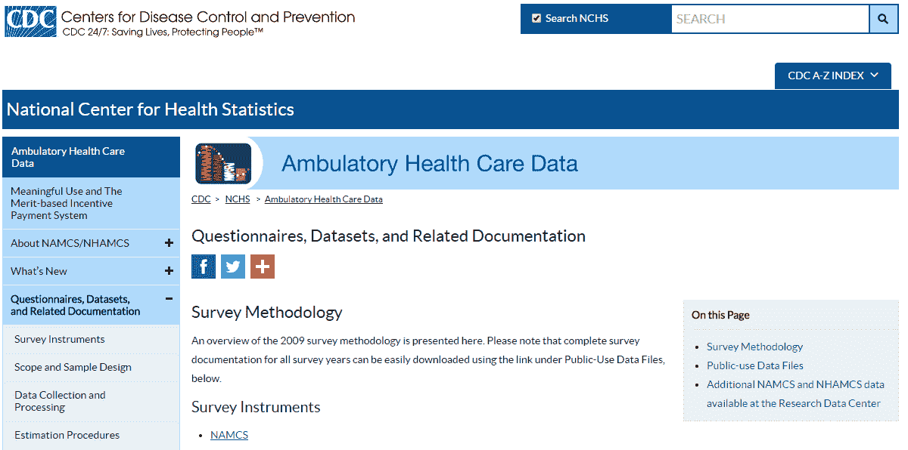
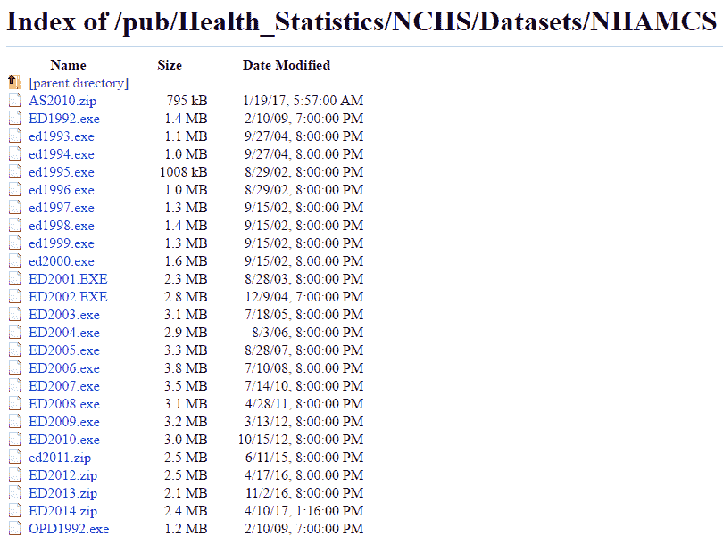
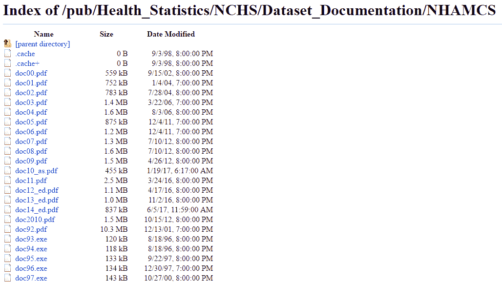
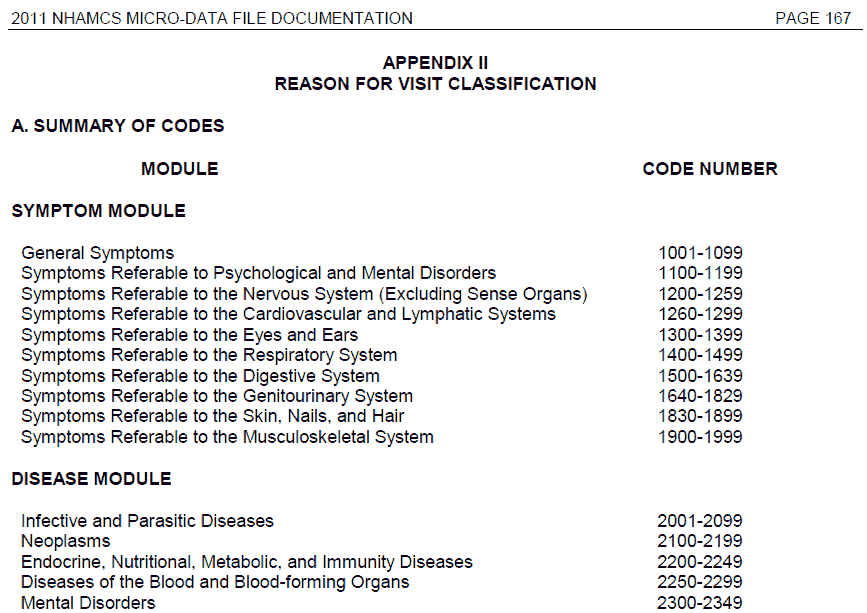

# 七、在医疗保健领域建立预测模型

本章面向所有读者，是本书不可分割的一部分。我们将展示如何使用示例数据和示例机器学习问题为医疗保健构建预测模型。我们将一次一个特征地预处理数据。本章结束时，您将了解如何准备机器学习模型并使其适合临床数据集。


# 医疗保健预测分析简介

在[第 1 章](b15b2b73-d2bb-410f-ab55-5f0f1e91730e.xhtml)、*医疗保健分析简介、*中，我们讨论了分析的三个子组件:描述性分析、预测性分析和规定性分析。预测性和规范性分析构成了医疗保健改善护理、成本和成果的核心使命。这是因为如果我们可以预测未来可能会发生不利事件，我们就可以将稀缺资源用于预防不利事件的发生。

在医疗保健中，我们可以预测(然后预防)哪些不良事件？

*   **死亡**:显然，任何可以预防或预见的死亡都应该避免。一旦预测到死亡的发生，预防措施可能包括指导更多的护士去照顾那个病人，为这个病例雇佣更多的顾问，或者早一点而不是晚一点告诉家属选择。
*   **不良临床事件**:这些事件不等同于死亡，但会大大增加发病率和死亡率。发病率是指并发症，死亡率是指死亡。不良临床事件的例子包括心脏病发作、心力衰竭恶化、慢性阻塞性肺病恶化、肺炎和跌倒。可能出现不良事件的患者可能需要更多的护理或预防性治疗。
*   **再入院**:再入院不会对患者造成明显的危险；然而，它们是昂贵的，因此应避免可预防的再入院。此外，正如我们在第 6 章、*衡量医疗保健质量*中看到的，医疗保险和医疗补助服务中心高度鼓励减少再入院。预防措施包括向高风险患者指派社会工作者和病例管理人员，以确保他们跟进门诊提供者并购买所需的处方。
*   **高利用率**:预测有可能再次产生高额医疗支出的患者，通过为他们的团队分配更多的护理人员并确保频繁的门诊检查和随访，有可能降低成本。

既然我们已经回答了“什么？”问题，下一个问题是，“如何？”换句话说，我们如何预测哪些医疗服务提供者可以采取行动？

*   **首先，我们需要数据**:提供者应该向您发送他们的历史患者数据。这些数据可以是索赔数据、临床记录、EHR 记录的转储或这些数据的某种组合。无论是哪种类型的数据，最终都应该能够塑造成表格格式，其中每一行代表一个患者/遭遇，每一列代表该患者/遭遇的一个特定特征。
*   **使用一些数据，我们训练了一个预测模型**:在[第三章](46c83498-cb6e-45b4-ac39-6875a8d32400.xhtml)、*机器学习基础*中，我们了解了当我们训练预测模型时，我们到底在做什么，以及一般的建模管道是如何工作的。
*   **使用一些数据，我们测试我们模型的性能**:评估我们模型的性能对于设置提供商对模型准确性的期望非常重要。
*   **然后，我们将模型部署到生产环境中，并在常规基础上为患者提供实时预测**:在这个阶段，应该有从提供商到分析公司的定期数据流。该公司随后会对这些患者的定期预测做出回应。

在本章的剩余部分，我们将讨论“如何做？”为医疗保健建立一个预测模型。首先，我们将描述我们的模拟建模任务。然后，我们将描述并获取公开可用的数据集。之后，我们将对数据集进行预处理，并使用不同的机器学习算法来训练预测模型。最后，我们将评估模型的性能。虽然我们不会使用我们的模型对实时数据进行实际预测，但我们将描述这样做的必要步骤。


# 我们的建模任务——预测急诊患者的出院状态

每年，全国有数百万患者使用急诊科的设施。这些设施的资源必须得到妥善管理——如果在任何特定时间有大量病人涌入，工作人员和可用房间都应相应增加。资源和患者流入之间的不匹配可能导致资金浪费和次优的医疗服务。

在这种情况下，我们介绍我们的示例建模任务——预测送往急诊室的患者的出院状态。出院状态是指患者是入院还是送回家。通常情况下，更严重的病例会被送进医院。因此，我们试图在患者住院早期预测急诊随访的结果。

有了这样一个模型，医院的工作流程以及资源流动可以得到极大的改善。许多以前的学术研究都关注这个问题(例如，参见 Cameron et al .，2015)。

你可能想知道为什么我们没有选择不同的建模任务，例如再入院建模或预测 CHF 恶化。首先，公开的临床数据非常有限。我们选择的数据集是 ED 数据集；没有公开的住院数据集可供免费下载，无需注册。然而，我们选择的任务将服务于我们的目的，展示如何建立预测性医疗保健模型。


# 获取数据集

在本节中，我们将提供获取数据及其相关文档的逐步说明。


# NHAMCS 数据集一览

我们为这本书选择的数据集是**国家医院流动医疗护理调查** ( **NHAMCS** )公共使用数据的一部分。这是美国**疾病控制和预防中心** ( **CDC** )公布和维护的调查数据。这个数据集的主页是[https://www.cdc.gov/nchs/ahcd/ahcd_questionnaires.htm](https://www.cdc.gov/nchs/ahcd/ahcd_questionnaires.htm)。

*   NHAMCS 数据是基于调查的数据；它由发送给在医院见过的患者和医疗保健提供者的调查填充。
*   数据文件是固定宽度的格式。换句话说，它们是文本文件，其中每一行都在不同的行上，每一列都是固定长度的字符。有关每个功能的字符长度的信息可在相应的 NHAMCS 文档中找到。
*   根据数据是来自门诊就诊还是急诊就诊，有不同的文件集。我们将在本章中使用 ED 格式。
*   数据附带了关于每个特性内容的详细文档。
*   数据的每一行代表一个不同的 ED 患者遭遇。

请参见下表，了解我们将在本书中使用的 NHAMCS 急诊科数据文件的概要:

| **文件名** | **数据类型和年份** | **行数(遭遇数)** | **列数(特征)** | **宽泛的特征类别** |
| ED2013 | ED 邂逅；2013 | 24,777 | 579 | 就诊日期和信息、人口统计、烟草、到达方式、付款、生命体征、伤检分类、急诊关系、就诊原因、伤害、诊断、慢性病、提供的服务、就诊的提供者、处置、住院、估算数据、急诊信息、社会经济数据 |


# 下载 NHAMCS 数据

原始数据文件和支持文件可从 CDC NHAMCS 主页获得:[https://www.cdc.gov/nchs/ahcd/ahcd_questionnaires.htm](https://www.cdc.gov/nchs/ahcd/ahcd_questionnaires.htm)(以下截图)。我们建议将所有文件下载到本书及其相关文件的专用目录中。此外，请记住它们下载到的目录:



# 下载 ED2013 文件

ED2013 文件包含原始数据。要下载它:

1.  导航到 CDC NHAMCS 主页:[https://www.cdc.gov/nchs/ahcd/ahcd_questionnaires.htm](https://www.cdc.gov/nchs/ahcd/ahcd_questionnaires.htm)。
2.  滚动到页面中间，公共使用数据文件:可下载数据文件标题。
3.  单击 NHAMCS 的链接。它应该会带你到疾病控制中心的 FTP 网站([FTP://FTP . CDC . gov/pub/Health _ Statistics/NCHS/Datasets/nham cs](ftp://ftp.cdc.gov/pub/Health_Statistics/NCHS/Datasets/NHAMCS))。这个网站在下面的截图中。
4.  找到名为`ED2013.zip`的文件。点击它。文件将开始下载。
5.  在文件资源管理器中导航到该文件，并将其解压缩。在解压后的目录中，您应该会看到一个名为`ED2013`的文件，没有扩展名。这是数据文件。

6.  将 ED2013 数据文件移动到与图书相关文件关联的目录中:




# 下载调查项目列表–body _ namcsopd . pdf

1.  导航到 CDC NHAMCS 主页:[https://www.cdc.gov/nchs/ahcd/ahcd_questionnaires.htm](https://www.cdc.gov/nchs/ahcd/ahcd_questionnaires.htm)。
2.  滚动到页面中间，找到调查项目列表“1973-2012”标题。
3.  点击标有 NAMCS 和 NHAMCS 调查内容手册[2012 年 11 月修订]的链接。

4.  该链接会将您带到位于[https://www.cdc.gov/nchs/data/ahcd/body_namcsopd.pdf](https://www.cdc.gov/nchs/data/ahcd/body_namcsopd.pdf)网址的 PDF 页面。这是调查项目的列表。
5.  使用浏览器下载文件。然后使用文件浏览器将其移动到所需的目录。


# 下载文档文件–doc13 _ ed . pdf

1.  导航到 CDC NHAMCS 主页:[https://www.cdc.gov/nchs/ahcd/ahcd_questionnaires.htm](https://www.cdc.gov/nchs/ahcd/ahcd_questionnaires.htm)。
2.  滚动到页面中间的可下载文档标题。
3.  点击 NHAMCS (1992-2014)的链接。它应该会带你到疾控中心的文档 FTP 网站([FTP://FTP . CDC . gov/pub/Health _ Statistics/NCHS/Dataset _ Documentation/nham cs](ftp://ftp.cdc.gov/pub/Health_Statistics/NCHS/Dataset_Documentation/NHAMCS))。这个网站在下面的截图中。
4.  找到名为`doc13_ed.pdf`的文件。点击它。PDF 应该会在您的浏览器中打开。该 PDF 文件包含 ED2013 数据文件的文档。
5.  使用浏览器下载文件。然后使用文件资源管理器将其移动到所需的目录:




# 开始 Jupyter 会话

接下来，我们将启动一个 Jupyter 会话，以便将我们的数据导入 Python，并制作一个机器学习模型。在[第 1 章](b15b2b73-d2bb-410f-ab55-5f0f1e91730e.xhtml)、*医疗保健分析简介*中介绍了创建新 Jupyter 笔记本的详细示例。以下是步骤:

1.  在您的计算机上找到 Jupyter 应用程序并启动它。
2.  在默认浏览器中打开的新 Jupyter 选项卡中，导航到要保存笔记本的目录。
3.  找到控制台右上角的新下拉菜单，单击它，然后选择 Python 3。
4.  您应该会看到一个名为“无标题”的新笔记本。
5.  要重命名您的笔记本，请单击左上角的笔记本名称。应该会出现一个光标。输入所需的名称。我们已经把我们的笔记本命名为`ED_predict`。

现在，您已经准备好将数据集导入 Jupyter。


# 导入数据集

在我们加载数据集之前，必须了解一些关于数据的重要事实:

*   数据是固定宽度的格式，这意味着没有分隔符。必须手动指定列宽。
*   没有包含列名的标题行。
*   如果您使用文本编辑器打开数据文件，您将看到只包含数字的数据行。

因为列宽对于导入`.fwf`文件是必需的，所以我们必须首先将那些*导入到我们的会话中。因此，我们制作了一个名为`ED_metadata.csv`的助手`.csv`文件，它包含每一列的宽度、名称和变量类型。我们的数据只有 579 列，所以制作这样一个文件只需要几个小时。如果您有一个更大的数据集，您可能需要依靠自动宽度检测方法和/或更多的团队成员来为您的数据创建模式。*


# 加载元数据

对于我们的第一个单元格，让我们导入元数据并打印它的小预览:

```
import pandas as pd
pd.set_option('mode.chained_assignment',None)

HOME_PATH = 'C:\\Users\\Vikas\\Desktop\\Bk\\health-it\\ed_predict\\data\\'

df_helper = pd.read_csv(
    HOME_PATH + 'ED_metadata.csv',
    header=0, 
    dtype={'width': int, 'column_name': str, 'variable_type': str}
)

print(df_helper.head(n=5))
```

您应该会看到以下输出:

```
   width column_name  variable_type

0      2      VMONTH    CATEGORICAL

1      1       VDAYR    CATEGORICAL

2      4     ARRTIME  NONPREDICTIVE

3      4    WAITTIME     CONTINUOUS

4      4         LOV  NONPREDICTIVE
```

因此,`ED_metadata.csv`文件只是一个逗号分隔的值文件，包含文档中指定的宽度、列名和变量类型。这个文件可以从本书的代码库中下载。

在下一个单元格中，我们将导入的熊猫数据帧的列转换为单独的列表:

```
width = df_helper['width'].tolist()
col_names = df_helper['column_name'].tolist()
var_types = df_helper['variable_type'].tolist()
```


# 加载 ED 数据集

接下来，我们使用在前一个单元格中创建的`widths`列表，将固定宽度数据文件的内容作为由字符串列组成的 pandas 数据帧导入 Python。然后我们使用`col_names`列表来命名列:

```
df_ed = pd.read_fwf(

    HOME_PATH + 'ED2013',

    widths=width,

    header=None,

    dtype='str'  

)

df_ed.columns = col_names
```

让我们打印数据集的预览，以确认它被正确导入:

```
print(df_ed.head(n=5))
```

输出应该类似于以下内容:

```
  VMONTH VDAYR ARRTIME WAITTIME   LOV  AGE AGER AGEDAYS RESIDNCE SEX ...   \

0     01     3    0647     0033  0058  046    4     -07       01   2 ...    

1     01     3    1841     0109  0150  056    4     -07       01   2 ...    

2     01     3    1333     0084  0198  037    3     -07       01   2 ...    

3     01     3    1401     0159  0276  007    1     -07       01   1 ...    

4     01     4    1947     0114  0248  053    4     -07       01   1 ...    

  RX12V3C1 RX12V3C2 RX12V3C3 RX12V3C4 SETTYPE  YEAR   CSTRATM   CPSUM   PATWT  \

0      nan      nan      nan      nan       3  2013  20113201  100020  002945   

1      nan      nan      nan      nan       3  2013  20113201  100020  002945   

2      nan      nan      nan      nan       3  2013  20113201  100020  002945   

3      nan      nan      nan      nan       3  2013  20113201  100020  002945   

4      nan      nan      nan      nan       3  2013  20113201  100020  002945
```

```
  EDWT  

0  nan  

1  nan  

2  nan  

3  nan  

4  nan  

[5 rows x 579 columns]
```

查看文档中的列值及其含义，确认数据已被正确导入。`nan`值对应于数据文件中的空格。

最后，作为另一项检查，让我们计算数据文件的维度，确认有 24，777 行和 579 列:

```
print(df_ed.shape)
```

输出应该类似于以下内容:

```
(24777, 579)
```

现在数据已经被正确导入，让我们设置我们的响应变量。


# 使响应可变

在某些情况下，我们试图预测的响应变量可能已经是一个单独的定义良好的列。在这些情况下，在将数据分成训练集和测试集之前，只需将响应从字符串转换为数字类型就足够了。

在我们具体的建模任务中，我们试图预测哪些向急诊就诊的患者最终会住院。在我们的案例中，住院治疗包括:

*   入住住院病房接受进一步评估和治疗的患者
*   转到另一家医院(精神病医院或非精神病医院)接受进一步治疗的人
*   进入观察室接受进一步评估的患者(无论他们最终是进入观察室还是在观察室停留后出院)

因此，我们必须进行一些数据辩论，将所有这些不同的结果汇集成一个单一的响应变量:

```
response_cols = ['ADMITHOS','TRANOTH','TRANPSYC','OBSHOS','OBSDIS']

df_ed.loc[:, response_cols] = df_ed.loc[:, response_cols].apply(pd.to_numeric)

df_ed['ADMITTEMP'] = df_ed[response_cols].sum(axis=1)

df_ed['ADMITFINAL'] = 0

df_ed.loc[df_ed['ADMITTEMP'] >= 1, 'ADMITFINAL'] = 1

df_ed.drop(response_cols, axis=1, inplace=True)

df_ed.drop('ADMITTEMP', axis=1, inplace=True)
```

让我们详细讨论前面的代码示例:

*   第一行按名称标识了我们希望包含在最终目标变量中的列。如果这些列中的任何一列的值是`1`，那么目标应该等于`1`。
*   在第 2 行中，我们将列从字符串类型转换为数字类型。
*   在第 3-5 行中，我们创建了一个名为`ADMITTEMP`的列，它包含五个目标列的行总和。然后我们创建最终的目标列`ADMITFINAL`，当`ADMITTEMP`为`>= 1`时，将其设置为等于`1`。
*   在第 6-7 行，我们删除了五个原始响应列和`ADMITTEMP`列，因为我们现在有了最终的响应列。


# 将数据分为训练集和测试集

现在我们有了响应变量，下一步是将数据集分成训练集和测试集。在数据科学中，**训练集**是用于确定模型系数的数据。在训练阶段，模型将预测变量的值与响应值一起考虑，以“发现”将指导新数据预测的规则和权重。正如我们在第 3 章、*机器学习基础*中所讨论的那样，**测试集**然后用于测量我们的模型性能。典型的拆分将 70-80%用于训练数据，20-30%用于测试数据(除非数据集非常大，在这种情况下，可以将较小的百分比分配给测试集)。

一些从业者也有一个用于训练模型参数的验证集，如随机森林模型中的树的大小或正则化逻辑回归中的 lasso 参数。

幸运的是，`scikit-learn`库有一个叫做`train_test_split()`的便利函数，当给定测试集百分比时，它会为我们处理随机分割。要使用这个函数，我们必须首先将目标变量从其余数据中分离出来，我们这样做如下:

```
def split_target(data, target_name):
    target = data[[target_name]]
    data.drop(target_name, axis=1, inplace=True)
    return (data, target)

X, y = split_target(df_ed, 'ADMITFINAL')
```

运行前面的代码后，`y`保存我们的响应变量，`X`保存我们的数据集。我们将这两个变量提供给`train_test_split()`函数，以及`test_size`的`0.25`和再现性的随机状态:

```
from sklearn.model_selection import train_test_split

X_train, X_test, y_train, y_test = train_test_split(
    X, y, test_size=0.25, random_state=1234
)
```

结果是一个 2×2 的分割:`X_train`、`X_test`、`y_train`和`y_test`。我们现在可以使用`X_train`和`y_train`来训练模型，使用`X_test`和`y_test`来测试模型性能。

需要记住的一件重要事情是，在预处理阶段，对训练集进行的任何转换也必须在测试时在测试集上执行，否则，新数据的模型输出将是不正确的。

作为健全性检查，也为了检测任何目标变量的不平衡，让我们检查响应变量中肯定和否定响应的数量:

```
print(y_train.groupby('ADMITFINAL').size())
```

输出如下所示:

```
ADMITFINAL

0    15996

1     2586

dtype: int64
```

我们的结果表明，在测试集中，大约 7 个观察值中有 1 个有正面响应。虽然它不是一个完全平衡的数据集(在这种情况下，比率将是 1/2)，但它也没有不平衡到需要对数据进行任何上采样或下采样。让我们继续预处理预测器。


# 预处理预测变量

让我们来看看医疗保健数据中经常出现的特定预测变量组。


# 访问信息

ED2013 数据集中的第一个要素类别包含有关访问时间的信息。这里包括月、星期几和到达时间等变量。还包括等待时间和就诊时间变量(均以分钟为单位)。


# 月

让我们更详细地分析一下`VMONTH`预测器。下面的代码打印定型集中的所有值及其计数:

```
print(X_train.groupby('VMONTH').size())
```

输出如下所示:

```
VMONTH

01    1757

02    1396

03    1409

04    1719

05    2032

06    1749

07    1696

08    1034

09    1240

10    1306

11    1693

12    1551

dtype: int64
```

我们现在可以看到，正如文档中所说，月份是从`01`到`12`编号的，并且每个月份都有代表。

数据预处理的一部分是执行**特征工程**——也就是说，以某种方式组合或转换特征，以产生比以前的特征更具预测性的新特征。例如，假设我们有一个假设，ED 来访者在冬季更容易被接纳。我们可以制作一个名为`WINTER`的预测器，它是`VMONTH`预测器的组合，因此只有当患者在 12 月、1 月、2 月或 3 月来时，值才是`1`。我们已经在下面的单元格中完成了。稍后，当我们在制作机器学习模型时评估变量重要性时，我们可以测试这一假设:

```
def is_winter(vmonth):
    if vmonth in ['12','01','02','03']:
        return 1
    else:
        return 0

X_train.loc[:,'WINTER'] = df_ed.loc[:,'VMONTH'].apply(is_winter)
X_test.loc[:,'WINTER'] = df_ed.loc[:,'VMONTH'].apply(is_winter)
```

作为一个非正式的测试，让我们打印出`WINTER`变量的分布，并确认它是前四个冬季月份的总和:

```
X_train.groupby('WINTER').size()
```

输出如下所示:

```
WINTER

0    12469

1     6113

dtype: int64
```

果然，我们得到了`6113 = 1551 + 1757 + 1396 + 1409`，确认我们正确地设计了特性。在这一章中，我们将看到特征工程的其他例子。


# 星期几

作为对数据被正确导入的健全性检查，让我们也研究一下`VDAYR`变量，它表示患者就诊发生在一周的哪一天:

```
X_train.groupby('VDAYR').size()
```

输出如下所示:

```
VDAYR

1    2559

2    2972

3    2791

4    2632

5    2553

6    2569

7    2506

dtype: int64
```

正如我们所料，有七个可能的值，并且观察值相对均匀地分布在可能的值上。我们可以想出点子来设计一个`WEEKEND`特性，但是设计额外的特性会非常耗时和耗费内存，而且往往收效甚微。我们将把这个练习留给读者。


# 到达时间

到达时间是包含在数据中的另一个访问信息变量。然而，在其原始形式中，它可能是无用的，因为它可以是 0 到 2，359 之间的整数。让我们制作一个`NIGHT`变量，它只在病人在晚上 8 点到早上 8 点之间来的时候为正。我们创造这一变量的理由是假设在正常时间之外到达急诊室的病人患有更严重的疾病，因此会更频繁地入院。我们可以使用下面的代码来制作`NIGHT`变量:

```
def is_night(arrtime):
    arrtime_int = int(arrtime)
    if ((arrtime_int >= 0) & (arrtime_int < 800)):
        return 1
    elif ((arrtime_int >= 2000) & (arrtime_int < 2400)):
        return 1
    else:
        return 0

X_train.loc[:,'NIGHT'] = df_ed.loc[:,'ARRTIME'].apply(is_night)
X_test.loc[:,'NIGHT'] = df_ed.loc[:,'ARRTIME'].apply(is_night)

X_train.drop('ARRTIME', axis=1, inplace=True)
X_test.drop('ARRTIME', axis=1, inplace=True)
```

在前面的例子中，我们首先编写一个函数，如果病人在晚上 8 点到早上 8 点之间到达，则返回`1`，否则返回`0`。然后，我们使用 pandas 的`apply()`函数将该函数“应用”到`ARRTIME`列，并生成`NIGHT`列。然后我们删除原来的`ARRTIME`列，因为它在原始形式下没有用。


# 等待时间

在 ED 中花费的等待时间是另一个可以合理地与目标变量相关的就诊信息变量。假设，对于分诊护士来说，患有更严重疾病的患者可能看起来更有症状，因此分配了更关键的分诊分数，导致他们比患有不太严重疾病的人等待时间更短。

在文档中，说明了当空白和不适用时，`WAITTIME`变量可以分别采用`-9`和`-7`的值。每当一个连续变量有这样的占位符值时，我们*必须*进行某种插补来移除占位符值。否则，模型会认为患者的等待时间为`-7`分钟，整个模型会被逆向调整。

在这种情况下，均值插补是适当的行动。**均值插补**用数据集其余部分的均值替换这些负值，因此在建模期间，这些观测值对确定该变量的系数没有影响。

为了进行均值插补，我们首先将列转换为数字类型:

```
X_train.loc[:,'WAITTIME'] = X_train.loc[:,'WAITTIME'].apply(pd.to_numeric)
X_test.loc[:,'WAITTIME'] = X_test.loc[:,'WAITTIME'].apply(pd.to_numeric)
```

接下来，我们编写一个名为`mean_impute_values()`的函数，从列中删除`-7`和`-9`的值，并用列的平均值替换它们。我们将该函数一般化，以便稍后可以在其他列的预处理中使用它:

```
def mean_impute_values(data,col): 
    temp_mean = data.loc[(data[col] != -7) & (data[col] != -9), col].mean()
    data.loc[(data[col] == -7) | (data[col] == -9), col] = temp_mean 
    return data

X_train = mean_impute_values(X_train,'WAITTIME')
X_test = mean_impute_values(X_test,'WAITTIME')
```

然后我们调用数据上的函数，我们就完成了。接下来，我们将确认这个函数已经被正确应用，但是首先，让我们再检查几个变量。


# 其他访问信息

该数据集中的最终访问信息变量是访问变量的长度(`LOV`)。然而，探视时间的长短只有在整个急诊室探视之后才能决定，到那时，是否入院或出院的决定已经作出。丢弃在预测期间不可用的变量是很重要的，因此，我们必须丢弃`LOV`。我们这样做，如下面的代码所示:

```
X_train.drop('LOV', axis=1, inplace=True)
X_test.drop('LOV', axis=1, inplace=True)
```

既然我们已经解决了访问信息，让我们继续人口统计变量。


# 人口统计变量

在医疗保健领域，人口统计学变量通常与结果相关。年龄、性别和种族是医疗保健中的主要人口统计变量。在这个数据集中，种族和居住类型也被包括在内。我们把这些变量梳理如下。


# 年龄

随着人们年龄的增长，人们可以预期他们会病得更重，更频繁地被送进医院。一旦我们看到我们的模型的可变重要性结果，这个假设将被检验。

有三个变量反映了数据集中的年龄。`AGE`是以年为单位给出年龄的整数值。`AGEDAYS`是一个整数值，如果患者小于 1 岁，则给出以天为单位的年龄。`AGER`是年龄变量，只是它已被转换为分类变量。让我们将`AGE`变量转换为数字类型，保留`AGER`变量不变，并删除`AGEDAYS`变量，因为它在大多数情况下都不适用:

```
X_train.loc[:,'AGE'] = X_train.loc[:,'AGE'].apply(pd.to_numeric)
X_test.loc[:,'AGE'] = X_test.loc[:,'AGE'].apply(pd.to_numeric)

X_train.drop('AGEDAYS', axis=1, inplace=True)
X_test.drop('AGEDAYS', axis=1, inplace=True)
```


# 性

在医疗保健领域，人们经常发现女性比男性预期寿命更长，总体上更健康，所以让我们在模型中加入`SEX`变量。它已经是绝对的了，所以我们可以让它保持原样。


# 民族和种族

种族(西班牙裔/拉丁裔与非西班牙裔/拉丁裔)和种族也包括在数据中。通常，社会经济地位差的种族在医疗保健方面的结果更差。让我们保留未受影响的种族和人种变量(`ETHUN`和`RACEUN`)不变。我们可以移除多余的`RACER`变量以及族裔和种族的估算版本(`ETHIM`和`RACERETH`):

```
X_train.drop(['ETHIM','RACER','RACERETH'], axis=1, inplace=True)
X_test.drop(['ETHIM','RACER','RACERETH'], axis=1, inplace=True)
```


# 其他人口统计信息

数据中包括患者的住所。既然它是绝对的，就没有必要改变它。

让我们看看到目前为止我们有什么，并使用`head()`函数打印前五行:

```
X_train.head(n=5)
```

水平滚动输出，您应该确认我们所有的转换和变量拖放都已正确完成。


# 分类变量

分流变量对于急诊建模任务非常重要。伤检分类包括根据患者的最初表现和生命体征为其分配风险评分。它通常由专门执行分类的护士完成，包括主观和客观信息。分流分数通常在 1(危急)到 5(非紧急)之间。`IMMEDR`变量(文档中的第 34 项)是该数据集中的分类分数。我们当然会包括它。

我们可以归类为伤检分类变量的其他变量包括患者是否通过 EMS 到达(`ARREMS`；通常与更差的结果相关)以及患者在过去 72 小时内是否被看过并出院(`SEEN72`)。我们还将在模型中包含这些变量。


# 金融变量

患者的支付方法通常包含在医疗保健数据集中，并且通常，某些支付类型与更好或更差的结果相关联。没有预期支付来源(`NOPAY`)或享受医疗补助(`PAYMCAID`)或医疗保险(`PAYMCARE`)的患者通常比享受私人保险(`PAYPRIV`)或自费(`PAYSELF`)的患者健康状况差。让我们包括所有的金融变量，除了`PAYTYPER`变量，它只是其他支付变量的非二进制扩展:

```
X_train.drop('PAYTYPER', axis=1, inplace=True)
X_test.drop('PAYTYPER', axis=1, inplace=True)
```


# 生命特征

生命体征是医疗保健建模中患者的重要信息来源，原因有很多:

*   它们很容易收集。
*   它们通常在临床诊疗开始时可用。
*   他们是客观的。
*   它们是病人健康的数字指标。

该数据集中包括的生命体征有体温、脉搏、呼吸频率、血压(收缩压和舒张压)、血氧饱和度百分比以及是否吸氧。身高和体重通常也被归类为生命体征，但它们不包括在我们的数据中。让我们依次看看每个生命体征。


# 温度

**体温**通常在患者就诊早期使用温度计测量，可以用摄氏度或华氏度记录。98.6 华氏度(37.1 摄氏度)通常被认为是正常体温。明显高于这个范围的温度可以被称为**发烧**或**高热**，通常反映出感染、炎症或环境过度暴露于阳光下。低于正常温度一定程度的温度被称为**低体温症**，通常反映出暴露在寒冷的环境中。温度越偏离正常，通常病情越严重。

在我们的数据集中，`TEMPF`温度被乘以 10，并存储为一个整数。此外，一些值是空白的(由`-9`表示)，我们必须估算这些值，因为温度是一个连续变量。接下来，我们首先将温度转换为数字类型，使用我们之前编写的`mean_impute_values()`函数来估算`TEMPF`中缺失的值，然后使用 lambda 函数将所有温度除以`10`:

```
X_train.loc[:,'TEMPF'] = X_train.loc[:,'TEMPF'].apply(pd.to_numeric)
X_test.loc[:,'TEMPF'] = X_test.loc[:,'TEMPF'].apply(pd.to_numeric)

X_train = mean_impute_values(X_train,'TEMPF')
X_test = mean_impute_values(X_test,'TEMPF')

X_train.loc[:,'TEMPF'] = X_train.loc[:,'TEMPF'].apply(lambda x: float(x)/10)
X_test.loc[:,'TEMPF'] = X_test.loc[:,'TEMPF'].apply(lambda x: float(x)/10)
```

让我们打印出该列的 30 个值，以确认我们的处理是正确执行的:

```
X_train['TEMPF'].head(n=30)
```

输出如下所示:

```
15938     98.200000

5905      98.100000

4636      98.200000

9452      98.200000

7558      99.300000

17878     99.000000

21071     97.800000

20990     98.600000

4537      98.200000

7025      99.300000

2134      97.500000

5212      97.400000

9213      97.900000

2306      97.000000

6106      98.600000

2727      98.282103

4098      99.100000

5233      98.800000

5107     100.000000

18327     98.900000

19242     98.282103

3868      97.900000

12903     98.600000

12763     98.700000

8858      99.400000

8955      97.900000

16360     98.282103

6857      97.100000

6842      97.700000

22073     97.900000

Name: TEMPF, dtype: float64
```

我们可以看到，现在的温度是浮点型的，它们没有乘以 10。此外，我们看到平均值`98.282103`已经被替换，而之前值是空白的。让我们继续下一个变量。


# 脉搏

**脉搏**测量患者的心跳频率。正常范围是 60-100。脉搏比`100`快被称为**心动过速**，通常表示一些潜在的心脏功能障碍、容量衰竭或感染(败血症)。低于`60`的脉搏称为**心动过缓**。

我们必须使用均值插补来插补缺失值。首先，我们将脉冲转换为数字类型:

```
X_train.loc[:,'PULSE'] = X_train.loc[:,'PULSE'].apply(pd.to_numeric)
X_test.loc[:,'PULSE'] = X_test.loc[:,'PULSE'].apply(pd.to_numeric)
```

然后，我们编写一个类似于我们的`mean_impute_values()`函数的`mean_impute_vitals()`函数，除了占位符值已经从`-7`和`-9`更改为`-998`和`-9`:

```
def mean_impute_vitals(data,col): 
    temp_mean = data.loc[(data[col] != 998) & (data[col] != -9), col].mean()
    data.loc[(data[col] == 998) | (data[col] == -9), col] = temp_mean 
    return data

X_train = mean_impute_vitals(X_train,'PULSE')
X_test = mean_impute_vitals(X_test,'PULSE')
```


# 呼吸率

呼吸频率表示人呼吸的频率。18-20 被认为是正常的。呼吸急促(呼吸频率异常升高)在临床实践中很常见，表明体内缺氧，通常是由心脏或肺部原因引起的。呼吸缓慢是一种异常低的呼吸频率。

在以下代码中，我们将`RESPR`变量转换为数值类型，然后对缺失值进行平均值插补:

```
X_train.loc[:,'RESPR'] = X_train.loc[:,'RESPR'].apply(pd.to_numeric)
X_test.loc[:,'RESPR'] = X_test.loc[:,'RESPR'].apply(pd.to_numeric)

X_train = mean_impute_values(X_train,'RESPR')
X_test = mean_impute_values(X_test,'RESPR')
```


# 血压

血压测量的是单位面积上血液对血管壁施加的力的大小。血压由两个数字组成——**收缩压**(心脏收缩期的血压)和**舒张压**(心脏舒张期的血压)。正常的血压通常在收缩压 110 到 120 毫米汞柱之间，舒张压 70 到 80 毫米汞柱之间。血压升高称为**高血压**。血压升高的最常见原因是原发性高血压，它主要是遗传性的(但也是多因素的)。低血压叫做**低血压**。高血压和低血压都有复杂的病因，通常难以识别。

在我们的数据集中，收缩压和舒张压位于不同的列中(分别为`BPSYS`和`BPDIAS`)。首先，我们通过将收缩压转换为数字类型来处理它，这意味着像我们已经对其他列所做的那样输入缺失值:

```
X_train.loc[:,'BPSYS'] = X_train.loc[:,'BPSYS'].apply(pd.to_numeric)
X_test.loc[:,'BPSYS'] = X_test.loc[:,'BPSYS'].apply(pd.to_numeric)

X_train = mean_impute_values(X_train,'BPSYS')
X_test = mean_impute_values(X_test,'BPSYS')
```

舒张压有点复杂。值`998`表示压力为`PALP`，这意味着压力太低而无法被血压计检测到，但又足够高而可以通过触摸(触诊)感觉到。在我们将其转换为数字类型后，我们将用数字值`40`替换`PALP`值:

```
X_train.loc[:,'BPDIAS'] = X_train.loc[:,'BPDIAS'].apply(pd.to_numeric)
X_test.loc[:,'BPDIAS'] = X_test.loc[:,'BPDIAS'].apply(pd.to_numeric)
```

我们编写了一个名为`mean_impute_bp_diast()`的新函数，它将`PALP`值转换为`40`，并将缺失值转换为平均值:

```
def mean_impute_bp_diast(data,col): 
    temp_mean = data.loc[(data[col] != 998) & (data[col] != -9), col].mean()
    data.loc[data[col] == 998, col] = 40
    data.loc[data[col] == -9, col] = temp_mean 
    return data

X_train = mean_impute_values(X_train,'BPDIAS')
X_test = mean_impute_values(X_test,'BPDIAS')
```


# 氧饱和

氧饱和度测量血液中的含氧量。它以百分比的形式报告，数值越高越健康。我们将其转换为数字类型，并执行均值插补，如下所示:

```
X_train.loc[:,'POPCT'] = X_train.loc[:,'POPCT'].apply(pd.to_numeric)
X_test.loc[:,'POPCT'] = X_test.loc[:,'POPCT'].apply(pd.to_numeric)

X_train = mean_impute_values(X_train,'POPCT')
X_test = mean_impute_values(X_test,'POPCT')
```

让我们通过选择这些列并使用`head()`函数来检查我们到目前为止已经完成的生命体征转换:

```
X_train[['TEMPF','PULSE','RESPR','BPSYS','BPDIAS','POPCT']].head(n=20)
```

输出如下所示:

|  | TEMPF | 脉搏 | RESPR | BPSYS | BPDIAS |
| --- | --- | --- | --- | --- | --- |
| 15938 | 98.200000 | 101.000000 | 22.0 | 159.000000 | 72.000000 | 98.000000 |
| 5905 | 98.100000 | 70.000000 | 18.0 | 167.000000 | 79.000000 | 96.000000 |
| 4636 | 98.200000 | 85.000000 | 20.0 | 113.000000 | 70.000000 | 98.000000 |
| 9452 | 98.200000 | 84.000000 | 20.0 | 146.000000 | 72.000000 | 98.000000 |
| 7558 | 99.300000 | 116.000000 | 18.0 | 131.000000 | 82.000000 | 96.000000 |
| 17878 | 99.000000 | 73.000000 | 16.0 | 144.000000 | 91.000000 | 99.000000 |
| 21071 | 97.800000 | 88.000000 | 18.0 | 121.000000 | 61.000000 | 98.000000 |
| 20990 | 98.600000 | 67.000000 | 16.0 | 112.000000 | 65.000000 | 95.000000 |
| 4537 | 98.200000 | 85.000000 | 20.0 | 113.000000 | 72.000000 | 99.000000 |
| 7025 | 99.300000 | 172.000000 | 40.0 | 124.000000 | 80.000000 | 100.000000 |
| 2134 | 97.500000 | 91.056517 | 18.0 | 146.000000 | 75.000000 | 94.000000 |
| 5212 | 97.400000 | 135.000000 | 18.0 | 125.000000 | 71.000000 | 99.000000 |
| 9213 | 97.900000 | 85.000000 | 18.0 | 153.000000 | 96.000000 | 99.000000 |
| 2306 | 97.000000 | 67.000000 | 20.0 | 136.000000 | 75.000000 | 99.000000 |
| 6106 | 98.600000 | 90.000000 | 18.0 | 109.000000 | 70.000000 | 98.000000 |
| 2727 | 98.282103 | 83.000000 | 17.0 | 123.000000 | 48.000000 | 92.000000 |
| 4098 | 99.100000 | 147.000000 | 20.0 | 133.483987 | 78.127013 | 100.000000 |
| 5233 | 98.800000 | 81.000000 | 16.0 | 114.000000 | 78.000000 | 97.311242 |
| 5107 | 100.000000 | 95.000000 | 24.0 | 133.000000 | 75.000000 | 94.000000 |
| 18327 | 98.900000 | 84.000000 | 16.0 | 130.000000 | 85.000000 | 98.000000 |

检查前面的表格，看起来我们情况良好。我们可以看到每一列的估算平均值(具有额外精度的值)。让我们转到数据中的最后一个生命体征，疼痛程度。


# 疼痛程度

**疼痛**是人体有问题的常见指征，通常在每次医学访谈中都会问疼痛程度，无论是初始病史和身体检查还是日常肥皂笔记。疼痛程度通常以 0(不存在)到 10(无法忍受)的等级来报告。让我们首先将`PAINSCALE`列转换为数字类型:

```
X_train.loc[:,'PAINSCALE'] = X_train.loc[:,'PAINSCALE'].apply(pd.to_numeric)
X_test.loc[:,'PAINSCALE'] = X_test.loc[:,'PAINSCALE'].apply(pd.to_numeric)
```

现在，我们必须为均值输入疼痛值编写一个单独的函数，因为它使用`-8`而不是`-7`作为占位符值:

```
def mean_impute_pain(data,col): 
    temp_mean = data.loc[(data[col] != -8) & (data[col] != -9), col].mean()
    data.loc[(data[col] == -8) | (data[col] == -9), col] = temp_mean 
    return data

X_train = mean_impute_pain(X_train,'PAINSCALE')
X_test = mean_impute_pain(X_test,'PAINSCALE')
```

总之，生命体征提供了患者健康的重要图像。最后，当我们计算变量重要性时，我们会看到这些变量的作用有多重要。

现在，我们可以进入下一个变量类别。


# 访问原因代码

就诊原因变量对患者就诊的原因进行编码，可将其视为就诊的主诉(我们在[第 2 章](71c31b0a-fa9e-4b31-8b58-f563a815e338.xhtml)、*医疗保健基础*中讨论了主诉)。在该数据集中，这些原因使用名为*门诊护理就诊分类的原因*的编码集进行编码(更多信息，请参考 2011 年文件的*第 16 页*和*附录 II*；章节最后提供了*附录*第一页的截图)。虽然在患者就诊的早期可能无法确定确切的代码，但我们在此将其包括在内，因为:

*   它反映了患者就诊早期的可用信息。
*   我们将演示如何处理编码变量(所有其他编码变量在患者就诊时出现得太晚，无法用于此建模任务):



出于以下原因，编码变量需要特别注意:

*   通常在表中为一个以上的代码指定多个条目，访问原因代码也不例外。注意，这个数据集包含三个 RFV 列(`RFV1`、`RFV2`和`RFV3`)。例如，哮喘的代码可能出现在这些列中的任何一列。因此，对这些列进行一次性编码是不够的。我们必须检测三列中任何一列的每个代码的存在，我们必须编写一个特殊的函数来完成这项工作。
*   代码是绝对的，但数字本身通常没有任何意义。为了便于解释，我们必须使用适当的描述来相应地命名这些列。为此，我们整理了一个特殊的`.csv`文件，其中包含每个代码的类型化描述(可以从本书的 GitHub 资源库下载)。
*   一种可能的输出格式是每个代码一列，其中一个`1`表示该代码存在，一个`0`表示该代码不存在(如 Futoma 等人，2015 年所做的)。然后可以执行任何期望的组合/转换。我们在这里使用了这种格式。

事不宜迟，让我们开始转换我们的参观原因变量。首先，我们导入 RFV 代码描述:

```
rfv_codes_path = HOME_PATH + 'RFV_CODES.csv'

rfv_codes = pd.read_csv(rfv_codes_path,header=0,dtype='str')
```

现在我们将做我们的 RFV 代码处理。

首先，为了正确命名列，我们从`re`模块导入了`sub()`函数(`re`代表正则表达式)。

然后，我们编写一个函数，扫描任何给定的 RFV 列，查找指定代码的存在，并返回包含新列的数据集，如果代码存在，则返回`1`，如果代码不存在，则返回`0`。

接下来，我们使用一个`for`循环来遍历`.csv`文件中的每个代码，有效地为每个可能的代码添加一个二进制列。我们对训练集和测试集都这样做。

最后，我们放弃了原来的 RFV 列，因为我们不再需要它们。完整代码如下:

```
from re import sub

def add_rfv_column(data,code,desc,rfv_columns):
    column_name = 'rfv_' + sub(" ", "_", desc)
    data[column_name] = (data[rfv_columns] == rfv_code).any(axis=1).astype('int')
    return data

rfv_columns = ['RFV1','RFV2','RFV3']
for (rfv_code,rfv_desc) in zip(
    rfv_codes['Code'].tolist(),rfv_codes['Description'].tolist()
):
    X_train = add_rfv_column(
        X_train,
        rfv_code,
        rfv_desc,
        rfv_columns
    )
    X_test = add_rfv_column(
        X_test,
        rfv_code,
        rfv_desc,
        rfv_columns 
    )

# Remove original RFV columns
X_train.drop(rfv_columns, axis=1, inplace=True)
X_test.drop(rfv_columns, axis=1, inplace=True)
```

让我们来看看使用`head()`函数转换后的数据集:

```
X_train.head(n=5)
```

请注意，现在有 1，264 列。虽然整个数据框已被截断，但如果您水平滚动，应该会看到一些新的`rfv_`列附加到数据框的末尾。


# 伤害代码

数据中还包括伤害代码。虽然就诊原因代码适用于所有就诊，但伤害代码仅适用于患者遭受身体伤害、中毒或医疗副作用(包括自杀企图)的情况。因为受伤的确切原因可能要在进行全面检查后才能知道，而全面检查通常是在已经决定入院后进行的。因此，我们将删除伤害代码变量，因为它们可能包含在预测时不可用的未来信息。但是，如果您希望在建模任务中使用这样的代码，请记住，编码数据可以用类似于前面所示的方式进行处理。有关伤害变量的更多详细信息，请参考文档:

```
inj_cols = [
    'INJURY','INJR1','INJR2','INJPOISAD','INJPOISADR1',
    'INJPOISADR2','INTENT','INJDETR','INJDETR1','INJDETR2',
    'CAUSE1','CAUSE2','CAUSE3','CAUSE1R','CAUSE2R','CAUSE3R'
]

X_train.drop(inj_cols, axis=1, inplace=True)
X_test.drop(inj_cols, axis=1, inplace=True)
```


# 诊断代码

该数据集还包含 ICD-9-DM 代码，用于对每次就诊相关的诊断进行分类。请注意，有三个诊断代码列。这与我们在*访问原因代码*部分所说的编码变量一致。因为 ICD-9 代码通常在完成检查和确定症状原因后分配给就诊，我们将不得不在建模任务中省略它们:

```
diag_cols= [
    'DIAG1','DIAG2','DIAG3',
    'PRDIAG1','PRDIAG2','PRDIAG3',
    'DIAG1R','DIAG2R','DIAG3R'
]

X_train.drop(diag_cols, axis=1, inplace=True)
X_test.drop(diag_cols, axis=1, inplace=True)
```


# 病历

正如我们在[第 2 章](71c31b0a-fa9e-4b31-8b58-f563a815e338.xhtml)、*医疗保健基础*中所讨论的，患有慢性疾病的人通常比没有慢性疾病的人更不健康，健康结果也更差。该数据集包括每次就诊时出现的 11 种常见慢性病的信息。这些疾病是癌症、脑血管疾病、慢性阻塞性肺病、需要透析的疾病、充血性心力衰竭、痴呆、糖尿病、心肌梗塞史、肺栓塞或深静脉血栓形成史以及 HIV/AIDS。因为以前看过的病人的过去病史通常可以通过电子方式获得，并且通常在病人分流的早期确定，所以我们决定在这里包括这些变量。因为它们已经是二进制的，所以不需要处理这些变量。

还有一个称为`TOTCHRON`的连续变量，记录每个患者的慢性病总数，我们的意思是-估算如下:

```
X_train.loc[:,'TOTCHRON'] = X_train.loc[:,'TOTCHRON'].apply(pd.to_numeric)
X_test.loc[:,'TOTCHRON'] = X_test.loc[:,'TOTCHRON'].apply(pd.to_numeric)

X_train = mean_impute_values(X_train,'TOTCHRON')
X_test = mean_impute_values(X_test,'TOTCHRON')
```


# 试验

医疗测试虽然重要，但发生在预测时间之后，因此在这个用例中必须忽略。它们可用于其他建模任务，如再入院预测或死亡率:

```
testing_cols = [
    'ABG','BAC','BLOODCX','BNP','BUNCREAT',
    'CARDENZ','CBC','DDIMER','ELECTROL','GLUCOSE',
    'LACTATE','LFT','PTTINR','OTHERBLD','CARDMON',
    'EKG','HIVTEST','FLUTEST','PREGTEST','TOXSCREN',
    'URINE','WOUNDCX','URINECX','OTHRTEST','ANYIMAGE',
    'XRAY','IVCONTRAST','CATSCAN','CTAB','CTCHEST',
    'CTHEAD','CTOTHER','CTUNK','MRI','ULTRASND',
    'OTHIMAGE','TOTDIAG','DIAGSCRN'
]

X_train.drop(testing_cols, axis=1, inplace=True)
X_test.drop(testing_cols, axis=1, inplace=True)
```


# 程序

我们省略程序，因为与测试类似，它们经常发生在预测时间之后:

```
proc_cols = [
    'PROC','BPAP','BLADCATH','CASTSPLINT','CENTLINE',
    'CPR','ENDOINT','INCDRAIN','IVFLUIDS','LUMBAR',
    'NEBUTHER','PELVIC','SKINADH','SUTURE','OTHPROC',
    'TOTPROC'
]

X_train.drop(proc_cols, axis=1, inplace=True)
X_test.drop(proc_cols, axis=1, inplace=True)
```


# 药物代码

该数据包括 ED 中给出的和/或出院时开出的药物的充分信息。事实上，多达 12 种药物的信息分布在不同的栏目中。显然，药物管理发生在决定接纳病人之后，所以我们不能在这个用例中使用这些列。

然而，如果您希望在自己的预测模型中使用这些信息，我们鼓励您仔细阅读文档并阅读用于药物的编码系统:

```
med_cols = [
    'MED1','MED2','MED3','MED4','MED5',
    'MED6','MED7','MED8','MED9','MED10',
    'MED11','MED12','GPMED1','GPMED2','GPMED3',
    'GPMED4','GPMED5','GPMED6','GPMED7','GPMED8',
    'GPMED9','GPMED10','GPMED11','GPMED12','NUMGIV',
    'NUMDIS','NUMMED',
]

X_train.drop(med_cols, axis=1, inplace=True)
X_test.drop(med_cols, axis=1, inplace=True)
```


# 提供商信息

提供者列表示哪种类型的医疗提供者参与了医疗咨询。我们忽略了这些变量:

```
prov_cols = [
    'NOPROVID','ATTPHYS','RESINT','CONSULT','RNLPN',
    'NURSEPR','PHYSASST','EMT','MHPROV','OTHPROV'
]

X_train.drop(prov_cols, axis=1, inplace=True)
X_test.drop(prov_cols, axis=1, inplace=True)
```


# 处置信息

因为处置变量与结果直接相关，我们不能把它们留在数据中。我们在这里省略了它们(回想一下，我们之前在创建最终目标列之后就删除了几个 disposition 变量):

```
disp_cols = [
    'NODISP','NOFU','RETRNED','RETREFFU','LEFTBTRI',
    'LEFTAMA','DOA','DIEDED','TRANNH','OTHDISP',
    'ADMIT','ADMTPHYS','BOARDED','LOS','HDDIAG1',
    'HDDIAG2','HDDIAG3','HDDIAG1R','HDDIAG2R','HDDIAG3R',
    'HDSTAT','ADISP','OBSSTAY','STAY24'
]

X_train.drop(disp_cols, axis=1, inplace=True)
X_test.drop(disp_cols, axis=1, inplace=True)
```


# 估算列

这些栏表示包含估算数据的栏。在大多数情况下，我们在数据中包含了未估算的对应项，因此不需要估算列，所以我们将其删除:

```
imp_cols = [
    'AGEFL','BDATEFL','SEXFL','ETHNICFL','RACERFL'
]

X_train.drop(imp_cols, axis=1, inplace=True)
X_test.drop(imp_cols, axis=1, inplace=True)
```


# 识别变量

当组合在一起时，识别变量为每次相遇提供了唯一的密钥。虽然这在许多情况下会很方便，但幸运的是，`pandas` DataFrames 已经为每一行唯一地分配了一个整数，所以我们可以删除 ID 变量:

```
id_cols = [
    'HOSPCODE','PATCODE'
]

X_train.drop(id_cols, axis=1, inplace=True)
X_test.drop(id_cols, axis=1, inplace=True)
```


# 电子病历状态栏

该数据集包括几十列，表明了患者就诊的设施的技术水平。我们在[第 2 章](71c31b0a-fa9e-4b31-8b58-f563a815e338.xhtml)、*医疗保健基础*的 *EHR 技术和有意义的使用*部分讨论了这一点。我们省略了这些列，因为它们是基于每家医院而非每次就诊进行评估的:

```
emr_cols = [
    'EBILLANYE','EMRED','HHSMUE','EHRINSE','EDEMOGE',
    'EDEMOGER','EPROLSTE','EPROLSTER','EVITALE','EVITALER',
    'ESMOKEE','ESMOKEER','EPNOTESE','EPNOTESER','EMEDALGE',
    'EMEDALGER','ECPOEE','ECPOEER','ESCRIPE','ESCRIPER',
    'EWARNE','EWARNER','EREMINDE','EREMINDER','ECTOEE',
    'ECTOEER','EORDERE','EORDERER','ERESULTE','ERESULTER',
    'EGRAPHE','EGRAPHER','EIMGRESE','EIMGRESER','EPTEDUE',
    'EPTEDUER','ECQME','ECQMER','EGENLISTE','EGENLISTER',
    'EIMMREGE','EIMMREGER','ESUME','ESUMER','EMSGE',
    'EMSGER','EHLTHINFOE','EHLTHINFOER','EPTRECE','EPTRECER',
    'EMEDIDE','EMEDIDER','ESHAREE','ESHAREEHRE','ESHAREWEBE',
    'ESHAREOTHE','ESHAREUNKE','ESHAREREFE','LABRESE1','LABRESE2',
    'LABRESE3','LABRESE4','LABRESUNKE','LABRESREFE','IMAGREPE1',
    'IMAGREPE2','IMAGREPE3','IMAGREPE4','IMAGREPUNKE','IMAGREPREFE',
    'PTPROBE1','PTPROBE2','PTPROBE3','PTPROBE4','PTPROBUNKE',
    'PTPROBREFE','MEDLISTE1','MEDLISTE2','MEDLISTE3','MEDLISTE4',
    'MEDLISTUNKE','MEDLISTREFE','ALGLISTE1','ALGLISTE2','ALGLISTE3',
    'ALGLISTE4','ALGLISTUNKE','ALGLISTREFE','EDPRIM','EDINFO',
    'MUINC','MUYEAR'
]

X_train.drop(emr_cols, axis=1, inplace=True)
X_test.drop(emr_cols, axis=1, inplace=True)
```


# 详细的药物信息

这些栏目提供了更详细的药物信息。这些列包括药物类别的信息，这些信息是编码的。我们必须省略这些列，因为它们代表未来的信息。然而，这些信息在其他机器学习问题中可能非常有用:

```
drug_id_cols = [
    'DRUGID1','DRUGID2','DRUGID3','DRUGID4','DRUGID5',
    'DRUGID6','DRUGID7','DRUGID8','DRUGID9','DRUGID10',
    'DRUGID11','DRUGID12'
]

drug_lev1_cols = [
    'RX1V1C1','RX1V1C2','RX1V1C3','RX1V1C4',
    'RX2V1C1','RX2V1C2','RX2V1C3','RX2V1C4',
    'RX3V1C1','RX3V1C2','RX3V1C3','RX3V1C4',
    'RX4V1C1','RX4V1C2','RX4V1C3','RX4V1C4',
    'RX5V1C1','RX5V1C2','RX5V1C3','RX5V1C4',
    'RX6V1C1','RX6V1C2','RX6V1C3','RX6V1C4',
    'RX7V1C1','RX7V1C2','RX7V1C3','RX7V1C4',
    'RX8V1C1','RX8V1C2','RX8V1C3','RX8V1C4',
    'RX9V1C1','RX9V1C2','RX9V1C3','RX9V1C4',
    'RX10V1C1','RX10V1C2','RX10V1C3','RX10V1C4',
    'RX11V1C1','RX11V1C2','RX11V1C3','RX11V1C4',
    'RX12V1C1','RX12V1C2','RX12V1C3','RX12V1C4'
]

drug_lev2_cols = [
    'RX1V2C1','RX1V2C2','RX1V2C3','RX1V2C4',
    'RX2V2C1','RX2V2C2','RX2V2C3','RX2V2C4',
    'RX3V2C1','RX3V2C2','RX3V2C3','RX3V2C4',
    'RX4V2C1','RX4V2C2','RX4V2C3','RX4V2C4',
    'RX5V2C1','RX5V2C2','RX5V2C3','RX5V2C4',
    'RX6V2C1','RX6V2C2','RX6V2C3','RX6V2C4',
    'RX7V2C1','RX7V2C2','RX7V2C3','RX7V2C4',
    'RX8V2C1','RX8V2C2','RX8V2C3','RX8V2C4',
    'RX9V2C1','RX9V2C2','RX9V2C3','RX9V2C4',
    'RX10V2C1','RX10V2C2','RX10V2C3','RX10V2C4',
    'RX11V2C1','RX11V2C2','RX11V2C3','RX11V2C4',
    'RX12V2C1','RX12V2C2','RX12V2C3','RX12V2C4'
]

drug_lev3_cols = [
    'RX1V3C1','RX1V3C2','RX1V3C3','RX1V3C4',
    'RX2V3C1','RX2V3C2','RX2V3C3','RX2V3C4',
    'RX3V3C1','RX3V3C2','RX3V3C3','RX3V3C4',
    'RX4V3C1','RX4V3C2','RX4V3C3','RX4V3C4',
    'RX5V3C1','RX5V3C2','RX5V3C3','RX5V3C4',
    'RX6V3C1','RX6V3C2','RX6V3C3','RX6V3C4',
    'RX7V3C1','RX7V3C2','RX7V3C3','RX7V3C4',
    'RX8V3C1','RX8V3C2','RX8V3C3','RX8V3C4',
    'RX9V3C1','RX9V3C2','RX9V3C3','RX9V3C4',
    'RX10V3C1','RX10V3C2','RX10V3C3','RX10V3C4',
    'RX11V3C1','RX11V3C2','RX11V3C3','RX11V3C4',
    'RX12V3C1','RX12V3C2','RX12V3C3','RX12V3C4'
]

addl_drug_cols = [
    'PRESCR1','CONTSUB1','COMSTAT1','RX1CAT1','RX1CAT2',
    'RX1CAT3','RX1CAT4','PRESCR2','CONTSUB2','COMSTAT2',
    'RX2CAT1','RX2CAT2','RX2CAT3','RX2CAT4','PRESCR3','CONTSUB3',
    'COMSTAT3','RX3CAT1','RX3CAT2','RX3CAT3','RX3CAT4','PRESCR4',
    'CONTSUB4','COMSTAT4','RX4CAT1','RX4CAT2','RX4CAT3',
    'RX4CAT4','PRESCR5','CONTSUB5','COMSTAT5','RX5CAT1',
    'RX5CAT2','RX5CAT3','RX5CAT4','PRESCR6','CONTSUB6',
    'COMSTAT6','RX6CAT1','RX6CAT2','RX6CAT3','RX6CAT4','PRESCR7',
    'CONTSUB7','COMSTAT7','RX7CAT1','RX7CAT2','RX7CAT3',
    'RX7CAT4','PRESCR8','CONTSUB8','COMSTAT8','RX8CAT1',
    'RX8CAT2','RX8CAT3','RX8CAT4','PRESCR9','CONTSUB9',
    'COMSTAT9','RX9CAT1','RX9CAT2','RX9CAT3','RX9CAT4',
    'PRESCR10','CONTSUB10','COMSTAT10','RX10CAT1','RX10CAT2',
    'RX10CAT3','RX10CAT4','PRESCR11','CONTSUB11','COMSTAT11',
    'RX11CAT1','RX11CAT2','RX11CAT3','RX11CAT4','PRESCR12',
    'CONTSUB12','COMSTAT12','RX12CAT1','RX12CAT2','RX12CAT3',
    'RX12CAT4'
]

X_train.drop(drug_id_cols, axis=1, inplace=True)
X_train.drop(drug_lev1_cols, axis=1, inplace=True)
X_train.drop(drug_lev2_cols, axis=1, inplace=True)
X_train.drop(drug_lev3_cols, axis=1, inplace=True)
X_train.drop(addl_drug_cols, axis=1, inplace=True)

X_test.drop(drug_id_cols, axis=1, inplace=True)
X_test.drop(drug_lev1_cols, axis=1, inplace=True)
X_test.drop(drug_lev2_cols, axis=1, inplace=True)
X_test.drop(drug_lev3_cols, axis=1, inplace=True)
X_test.drop(addl_drug_cols, axis=1, inplace=True)
```


# 杂项信息

最后，末尾有几列与我们的目的无关，因此我们将其删除:

```
design_cols = ['CSTRATM','CPSUM','PATWT','EDWT']

X_train.drop(design_cols, axis=1, inplace=True)
X_test.drop(design_cols, axis=1, inplace=True)
```


# 最终预处理步骤

现在，我们已经完成了所有的变量组，我们几乎准备好建立我们的预测模型。但是首先，我们必须将所有的分类变量扩展成二进制变量(也称为一键编码或 1-of-K 表示)，并将我们的数据转换成适合输入到`scikit-learn`方法的格式。让我们接下来做那件事。


# 一键编码

scikit-learn 库中的许多分类器要求对分类变量进行一次性编码。**一键编码**或 **1-of-K 表示法**，是指将具有两个以上可能值的分类变量记录为多个变量，每个变量具有两个可能值。

例如，假设我们的数据集中有五名患者，我们希望对编码主要就诊诊断的列进行一次性编码。在一键编码之前，该列如下所示:

| `patient_id` | `primary_dx` |
| 一 | 慢性阻塞性肺病 |
| 2 | 高血压 |
| 3 | 慢性阻塞性肺病 |
| 四 | 充血性心力衰竭（congestive heart failure 的缩写） |
| 5 | 哮喘 |

在一次热编码之后，该列将被分成 *K* 列，其中 *K* 是可能值的数量，并且每列取值 0 或 1，这取决于观察值是否取对应于该列的值:

| `patient_id` | `primary_dx_copd` | `primary_dx_hypertension` | `primary_dx_chf` | `primary_dx_asthma` |
| 一 | 一 | 0 | 0 | 0 |
| 2 | 0 | 一 | 0 | 0 |
| 3 | 一 | 0 | 0 | 0 |
| 四 | 0 | 0 | 一 | 0 |
| 5 | 0 | 0 | 0 | 一 |

请注意，我们已经将前一篇专栏文章中的字符串转换为整数表示。这是有意义的，因为机器学习算法是在数字上训练的，而不是在单词上！这就是为什么一次性编码是必要的。

`scikit-learn`在其`preprocessing`模块中有一个`OneHotEncoder`类。但是，`pandas`有一个`get_dummies()`功能，可以在一行中完成一键编码。让我们使用`pandas`功能。在此之前，我们必须确定数据集中要传递给函数的分类列。我们通过使用元数据来识别分类列，并查看这些列中的哪些与我们的数据中保留的列相交来实现这一点:

```
categ_cols = df_helper.loc[
    df_helper['variable_type'] == 'CATEGORICAL', 'column_name'
]

one_hot_cols = list(set(categ_cols) & set(X_train.columns))

X_train = pd.get_dummies(X_train, columns=one_hot_cols)
```

我们还必须对测试数据进行一次性编码:

```
X_test = pd.get_dummies(X_test, columns=one_hot_cols)
```

最后，我们应该提到，测试集可能包含在训练数据中没有出现的分类值。当使用测试集评估模型的性能时，这可能会导致错误。为了防止这种情况，您可能需要编写一些额外的代码，将测试集中任何缺失的列设置为零。幸运的是，我们不必担心我们的数据集。


# 数字转换

现在让我们将所有列转换成数字格式:

```
X_train.loc[:,X_train.columns] = X_train.loc[:,X_train.columns].apply(pd.to_numeric)
X_test.loc[:,X_test.columns] = X_test.loc[:,X_test.columns].apply(pd.to_numeric)
```


# NumPy 数组转换

最后一步是获取熊猫数据帧的 NumPy 数组，该数组将被直接传递给机器学习算法。首先，我们保存最后的列名，这将有助于我们以后评估变量的重要性:

```
X_train_cols = X_train.columns
X_test_cols = X_test.columns
```

现在，我们使用`pandas`数据帧的`values`属性来访问每个数据帧的底层 NumPy 数组:

```
X_train = X_train.values
X_test = X_test.values
```

现在，我们准备建立模型。


# 构建模型

在本节中，我们将构建三种类型的分类器并评估它们的性能:逻辑回归分类器、随机森林和神经网络。


# 逻辑回归

我们在第 3 章、*机器学习基础*中讨论了逻辑回归模型背后的直觉和基础知识。为了在我们的训练集上构建模型，我们使用了以下代码:

```
from sklearn.linear_model import LogisticRegression

clfs = [LogisticRegression()]

for clf in clfs:
    clf.fit(X_train, y_train.ravel())
    print(type(clf))
    print('Training accuracy: ' + str(clf.score(X_train, y_train)))
    print('Validation accuracy: ' + str(clf.score(X_test, y_test)))

    coefs = {
        'column': [X_train_cols[i] for i in range(len(X_train_cols))],
        'coef': [clf.coef_[0,i] for i in range(len(X_train_cols))]
    }
    df_coefs = pd.DataFrame(coefs)
    print(df_coefs.sort_values('coef', axis=0, ascending=False))
```

在`for`循环之前，我们导入了`LogisticRegression`类，并将`clf`设置为一个`LogisticRegression`实例。训练和测试在`for`循环中进行。首先，我们使用`fit()`方法通过训练数据来拟合模型(例如，确定最佳系数)。接下来，我们使用`score()`方法来评估训练数据和测试数据上的模型性能。

在`for`循环的后半部分，我们打印出每个特征的系数值。通常，系数远离零的要素与结果的正相关/负相关程度最高。然而，我们没有在训练前对数据进行缩放，因此没有适当缩放的更重要的预测因子可能具有更低的系数。

代码的输出应该如下所示:

```
<class 'sklearn.linear_model.logistic.LogisticRegression'>

Training accuracy: 0.888978581423

Validation accuracy: 0.884261501211

         coef                                             column

346  2.825056                     rfv_Symptoms_of_onset_of_labor

696  1.618454                   rfv_Adverse_effect_of_drug_abuse

95   1.467790                    rfv_Delusions_or_hallucinations

108  1.435026  rfv_Other_symptoms_or_problems_relating_to_psy...

688  1.287535                                rfv_Suicide_attempt

895  1.265043                                          IMMEDR_01

520  1.264023  rfv_General_psychiatric_or_psychological_exami...

278  1.213235                                       rfv_Jaundice

712  1.139245         rfv_For_other_and_unspecified_test_results

469  1.084806                            rfv_Other_heart_disease
...
```

首先，让我们讨论一下训练集和测试集的性能。它们非常接近，这表明模型没有过度适应训练集。准确率约为 88%，与预测急诊科状态的研究(Cameron 等人，2015 年)的表现相当。

查看系数，我们可以确认它们有直观的意义。系数最高的特征与妊娠分娩的开始有关；我们都知道分娩会导致住院。许多特征与严重的精神疾病有关，由于患者对自己或他人造成的风险，几乎总是导致入院。`IMMEDR_1`特征也是系数高；请记住，此功能对应于分诊级别上的值 1，这是最关键的值:

```
...
898 -0.839861                                          IMMEDR_04

823 -0.848631                                         BEDDATA_03

625 -0.873828                               rfv_Hand_and_fingers

371 -0.960739                                      rfv_Skin_rash

188 -0.963524                                  rfv_Earache_pain_

217 -0.968058                                       rfv_Soreness

899 -1.019763                                          IMMEDR_05

604 -1.075670                      rfv_Suture__insertion_removal

235 -1.140021                                      rfv_Toothache

30  -1.692650                                           LEFTATRI
```

相反，滚动到底部会显示一些与录取负相关的特征。牙痛和需要拆线出现在这里，它们不太可能导致入院，因为它们不是紧急投诉。

我们已经训练了第一个模型。让我们看看一些更复杂的模型是否会有所改进。


# 随机森林

`scikit-learn`的一个便利特性是许多分类器都有相同的方法，因此模型可以互换构建。我们在下面的代码中看到，当我们分别使用`RandomForestClassifier`类的`fit()`和`score()`方法来训练模型并评估其性能时:

```
from sklearn.ensemble import RandomForestClassifier

clfs_rf = [RandomForestClassifier(n_estimators=100)]

for clf in clfs_rf:
    clf.fit(X_train, y_train.ravel())
    print(type(clf))
    print('Training accuracy: ' + str(clf.score(X_train, y_train)))
    print('Validation accuracy: ' + str(clf.score(X_test, y_test)))

    imps = {
        'column': [X_train_cols[i] for i in range(len(X_train_cols))],
        'imp': [clf.feature_importances_[i] for i in range(len(X_train_cols))]
    }
    df_imps = pd.DataFrame(imps)
    print(df_imps.sort_values('imp', axis=0, ascending=False))
```

输出应该类似于以下内容:

```
<class 'sklearn.ensemble.forest.RandomForestClassifier'>

Training accuracy: 1.0

Validation accuracy: 0.885391444713

                                                column       imp

1                                                  AGE  0.039517

13                                               PULSE  0.028348

15                                               BPSYS  0.026833

12                                               TEMPF  0.025898

16                                              BPDIAS  0.025844

0                                             WAITTIME  0.025111

14                                               RESPR  0.021329

17                                               POPCT  0.020407

29                                            TOTCHRON  0.018417

896                                          IMMEDR_02  0.016714
...
```

这一次验证的准确性与逻辑回归模型相似，约为 88%。然而，对训练数据的准确性是 100%，这表明我们使模型过度适合训练数据。我们将在本章末尾讨论改进模型的潜在方法。

从特征的重要性来看，结果也是有意义的。这一次，生命体征似乎是最重要的预测指标，还有年龄预测指标。滚动到底部显示那些对可预测性没有影响的特征。注意，与回归系数相反，对于随机森林的可变重要性，变量为正的频率在重要性中起作用；这可以解释为什么`IMMEDR_02`比`IMMEDR_01`更重要。


# 神经网络

最后，我们得出神经网络模型。请注意，我们的训练集只有大约 18，000 个观察值；最成功的神经网络模型(例如，“深度学习”模型)通常使用数百万甚至数十亿次观察。然而，让我们看看我们的神经网络模型进展如何。对于神经网络，建议对数据进行适当缩放(例如，使**标准分布**的平均值等于 0，标准差等于 1)。我们使用`StandardScaler`类来完成这个任务:

```
from sklearn.preprocessing import StandardScaler
from sklearn.neural_network import MLPClassifier 

# Scale data
scaler = StandardScaler() 
scaler.fit(X_train) 
X_train_Tx = scaler.transform(X_train) 
X_test_Tx = scaler.transform(X_test) 

# Fit models that require scaling (e.g. neural networks)
hl_sizes = [150,100,80,60,40,20]
nn_clfs = [MLPClassifier(hidden_layer_sizes=(size,), random_state=2345, verbose=True) for size in hl_sizes]

for num, nn_clf in enumerate(nn_clfs):
    print(str(hl_sizes[num]) + '-unit network:')
    nn_clf.fit(X_train_Tx, y_train.ravel())
    print('Training accuracy: ' + str(nn_clf.score(X_train_Tx, y_train)))
    print('Validation accuracy: ' + str(nn_clf.score(X_test_Tx, y_test)))
```

一旦运行前面的单元，您将看到迭代正在完成，一旦迭代未能导致模型的改进，训练将停止并打印精度。在我们的运行中，隐藏层中有 150 个单元的模型的验证准确性为 87%，高于其他隐藏层大小。


# 使用模型进行预测

我们已经完成了数据的预处理，模型的制作和评分。AUC 与先前预测 ed 结果的学术研究中报告的相似(参见 Cameron 等人，2015 年的例子)。

下一步是保存和部署模型，并使用它进行实时预测。幸运的是，scikit-learn 库中的所有分类器都包括几个用于进行预测的函数:

*   对于大多数分类器，`predict()`函数采用一个矩阵， *X* ，它包含未标记的数据作为输入，并简单地返回没有进一步信息的类预测。
*   `predict_proba()`函数采用一个矩阵 *X* ，其中包含未标记的数据作为输入，并返回观察值属于每个类的概率。对于每次观察，这些应该加起来就是`1`。
*   `predict_log_proba()`函数类似于`predict_proba()`函数，只是它返回观察值属于每个类的对数概率。

请记住以下重要事实:*在进行预测时，未标记数据必须以与训练数据相同的方式进行预处理*。这包括:

*   列的添加和删除
*   列转换
*   缺失值的插补
*   缩放和居中
*   一键编码

只要有一列没有经过适当的预处理，就会对模型预测产生极其不利的影响。


# 改进我们的模型

虽然在这一章中，我们已经建立了一个与学术研究相匹配的基本模型，但是仍然有改进的空间。以下是如何改进模型的一些想法，我们让读者来实现这些建议以及读者可能知道的任何其他技巧或技术，以提高性能。你的表现会有多高？

首先，当前的训练数据有大量的列。几乎总是要进行某种特征选择，特别是对于逻辑回归和随机森林模型。对于逻辑回归，执行特征选择的常用方法包括:

*   使用一定数量的具有最高系数的预测器
*   使用一定数量的具有最低 *p* 值的预测值
*   使用套索正则化并移除系数为零的预测值
*   使用贪婪算法，如前向或后向逐步逻辑回归，根据规则系统地删除/添加预测值
*   使用强力算法，如最佳子集逻辑回归，测试给定数量预测值的每个预测值排列/组合

对于随机森林，使用可变重要性并选择一定数量的具有最高重要性的预测因子是非常常见的，就像执行网格搜索一样。

神经网络有自己独特的改进技术。

*   首先，更多的数据总是好的，特别是对于神经网络。
*   所使用的特定优化算法会影响性能。
*   在这个例子中，我们的神经网络只有一个隐藏层。在行业中，具有多个隐藏层的模型变得越来越常见(尽管它们可能需要很长的训练时间)。
*   所使用的特定非线性激活函数也可能影响模型的性能。


# 摘要

在这一章中，我们建立了一个预测模型，用于预测急诊科的结果。虽然医疗保健领域存在许多机器学习问题，但本练习展示了在预处理医疗保健数据、训练和评分模型以及使用未标记数据进行预测时通常会面临的问题。这一章标志着本书编码部分的结束。

现在我们已经看到了预测模型的第一手构建，下一个合乎逻辑的问题是，与传统的统计风险评分相比，预测模型在预测临床结果方面表现如何。我们将在下一章探讨这个问题。


# 参考资料和进一步阅读

卡梅伦 A、罗杰斯 K、爱尔兰 A 等(2015 年)。在分诊时预测入院的简单工具。*Emerg Med J*2015；32:174-179.

Futoma J，Morris J，Lucas J (2015)。早期再入院预测模型的比较。生物医学信息学杂志 56: 229-238。