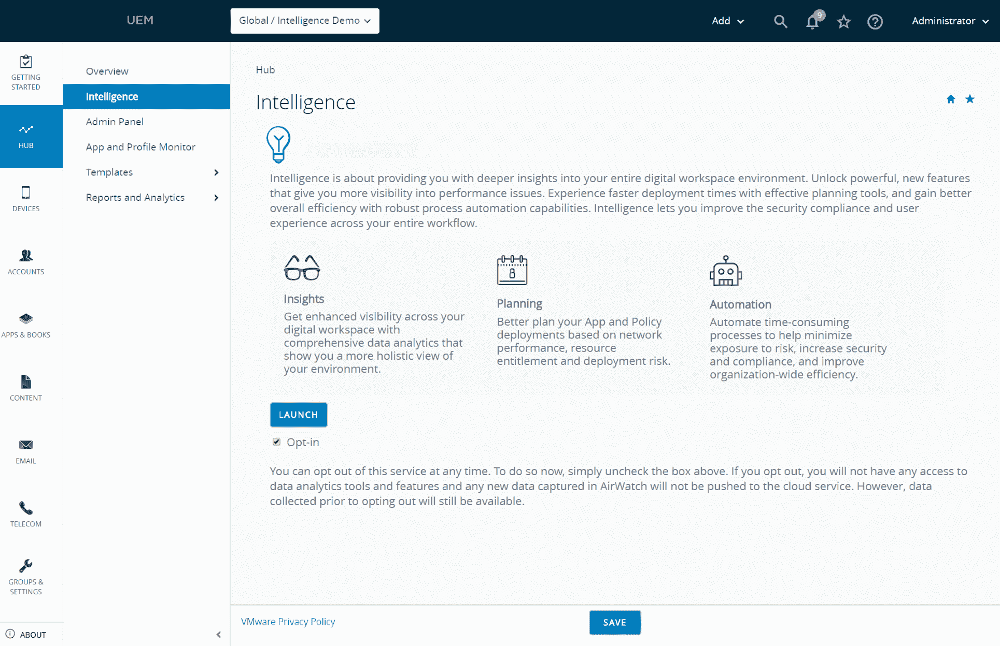
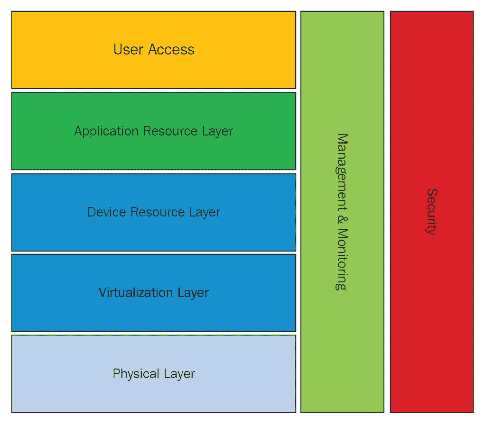
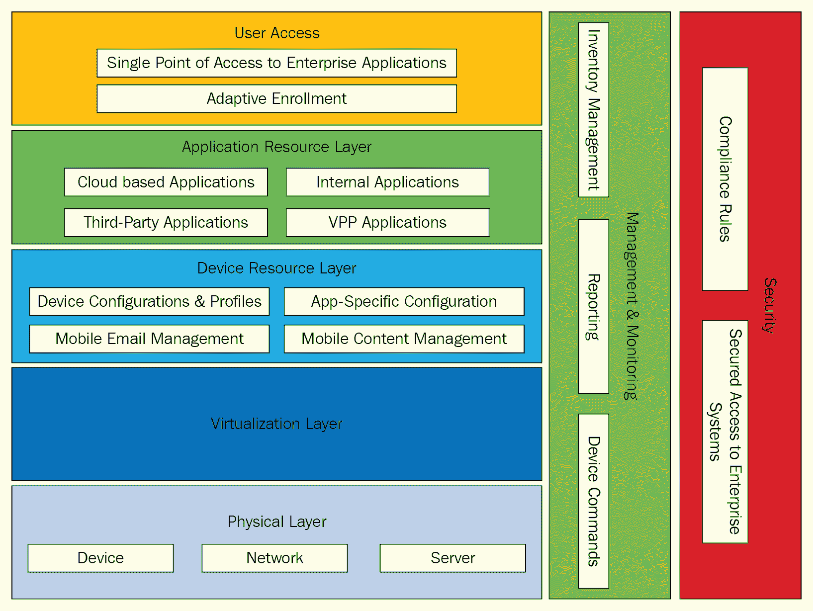
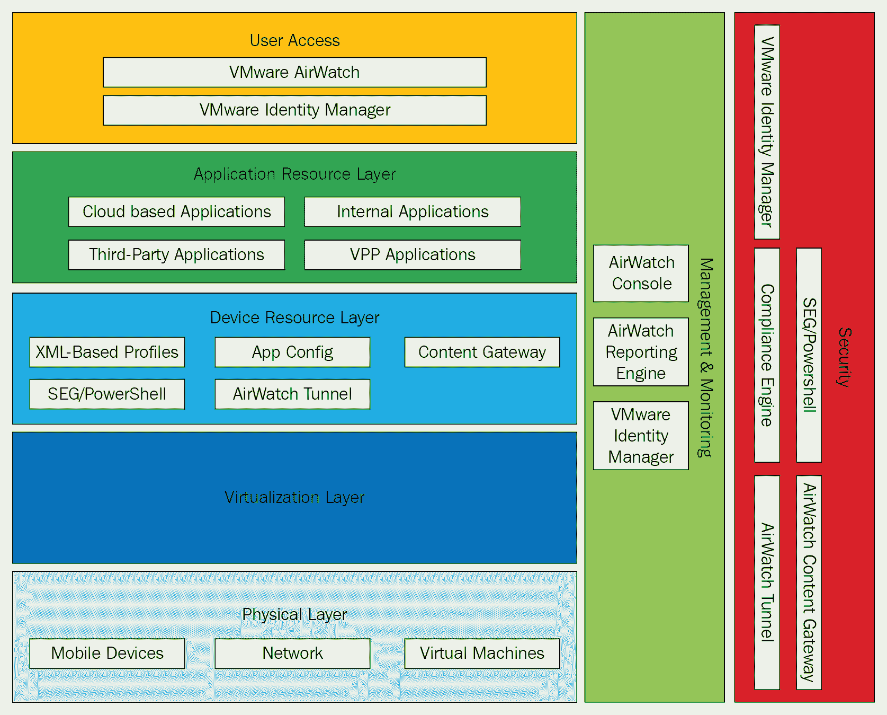

<title>Security with Workspace ONE Intelligence</title>  

# Workspace ONE 智能的安全性

本章将详细介绍 VMware Workspace ONE 及其保护应用程序、数据、终端和网络的创新方法。它可以利用其智能分析引擎管理应用程序和设备的访问，并通过集成第三方工具为最终用户提供端到端的安全性。

我们将了解如何通过高级分析来保护客户的数字工作空间，以及如何创建智能策略来检测、保护和调解他们的应用程序免受威胁。我们还将了解如何设计符合客户政策和 Workspace ONE Intelligence 使用案例的解决方案。

我们将在本章中涉及的主题如下:

*   工作空间智能及其业务目标概述
*   集成的深度洞察、智能规划和智能自动化
*   概念和逻辑设计要求
*   工作空间智能的使用案例
*   Workspace ONE 情报信任网络和 Workspace ONE 空运概述

<title>Technical requirements</title>  

# 技术要求

您可以下载 VMware Workspace ONE Intelligent Hub[https://my . Workspace ONE . com/products/VMware-Workspace-ONE-Intelligent-Hub](https://my.workspaceone.com/products/VMware-Workspace-ONE-Intelligent-Hub)

<title>Workspace ONE Intelligence</title>  

# Workspace ONE 智能

Workspace ONE Intelligence 能够更好地利用 Workspace ONE 平台，从单个存储库中执行基于数据的操作和解决方案。用户希望通过任何设备从任何地方访问他们的公司数据和应用程序。在当前环境下，安全工具无法以主动的方式处理最终用户的需求和安全风险。由于边界(终端用户设备的位置)不断变化，客户无法全面了解设备、应用和用户数据，这带来了巨大的网络安全威胁，并使管理任务变得复杂。

每个组织都必须在不损害安全性的同时照顾好他们的员工。员工工作效率受到应用程序执行问题和不定期服务的影响。通过减少特权，它将受到应用程序访问频繁变化的影响。我们必须找到一种方法来解决安全性和用户工作效率问题，并通过使用智能数据分析和自动化来避免复杂的管理流程。我们还需要一个针对频繁变化的威胁领域的解决方案，它可以与所有相关服务集成，并在当前数字工作空间系统中提供安全方面的保证。

Workspace ONE Intelligence 是构建在 Workspace ONE 平台上的云服务，可帮助客户利用出色的图形、用户界面工具和智能流程，从单一真实来源做出数据驱动的决策。Workspace ONE Intelligence 通过收集、检查和连接设备、应用和用户数据，按需帮助筛选和查找**关键绩效指标**(**KPI**)。随着 it 部门获得所需的数据信息，它可以利用内置的规则引擎来自动化策略，从而根据广泛的指标采取行动。客户可以定义规则，根据上下文进行智能补救。人工智能和人工智能技术可用于整个数字工作空间系统的建议行动和未来规划，客户可以在不影响最终用户工作效率的情况下进行管理。

移动云时代的网络安全需要全面的企业安全战略和方法。Workspace ONE Intelligence 合规性引擎持续监控设备，并执行逐步升级的操作以防止不合规。

<title>Business objectives of Workspace ONE Intelligence</title>  

# Workspace ONE Intelligence 的业务目标

Workspace ONE Intelligence 将帮助客户处理以下业务目标:

*   它有助于管理员在应用部署的不同阶段获得端到端的可见性，从应用参与开始，最终用户在现场做出良好的响应，以快速解决问题，最大限度地减少支持呼叫，并提高用户工作效率。
    单一控制台的端到端可见性如下图所示:

*   它通过向用户提供他们需要的东西并降低硬件和软件的资本支出，有助于更好地利用组织中的资源。
*   它可以识别不合规的系统，然后通过基于最终用户行为自动执行访问控制规则来修补当前的安全补丁，从而快速找到并修复各种漏洞。

Workspace ONE Intelligence 通过利用 Workspace ONE 平台在三个重要领域提供帮助。

<title>Integrated deep insights</title>  

# 集成的深刻见解

集成洞察意味着全面了解客户的数字工作空间，并获得有助于数据驱动的业务战略的精细洞察:

*   Workspace ONE Intelligence 将所有硬件(系统)、应用和最终用户数据在单一平台上相互结合和连接，以获得数字工作空间系统的全面可见性。
*   客户可以实时做出决策，解决最终用户问题，并避免所有安全风险。
*   客户可以运行或定义定制的报告，让根据过去的数据验证数据，并将这些见解用于其他相互关联的决策。
*   根据业务需求，客户必须将投资放在对他们至关重要的数据上。他们可以主动思考所有即将出现的安全漏洞、应用路线图、硬件注册、应用生命周期以及未来的补丁时间表。

客户可以从一个控制台获得完整数字工作空间系统的可见性，包括搜索和查询系统以分析数据、识别模式和检测异常行为的能力。他们可以利用预定义的控制面板和过去的数据，为整个系统做出基于数据的准确决策。

我们将获得与以下属性/参数相关的关键信息:

*   应用程序生命周期
*   应用消费
*   申请承诺
*   用户承诺
*   设备的种类

*   操作系统部署
*   应用程序描述
*   应用程序订阅

客户可以运行报告来查找存在补丁漏洞的系统，监控整个系统的关键 Windows 安全状态，包括监控应用程序发布的安装阶段，或者在 Workspace ONE Intelligence 平台上获取软件和设备清单。

<title>App analytics for smart planning</title>  

# 智能规划的应用分析

客户可以更好地利用整个环境中的软件开发生命周期，最终用户可以快速解决事件，最大限度地减少支持呼叫，并提高最终用户的易用性。

最大限度提高生产力的智能业务分析:

*   客户可以看到实时的应用程序操作，帮助他们对给最终用户带来问题的问题做出即时决策。他们可以首先解决所有关键问题，然后根据最终用户的要求定义应用程序升级时间表。我们可以跨系统、地理边界、连接状态或应用程序版本对应用程序利用情况进行全天候监控，从而全方位了解应用程序流程。客户可以获得关于各种用户组应用程序使用情况的所有相关数据的详细分析。
*   客户可以量化系统中的应用消耗和使用情况，确定利用率最高的应用，并轻松计算投资回报(ROI)。它将帮助决策者更好地了解移动性如何帮助他们的最终用户从应用部署的每个阶段获得端到端的可见性。
*   客户可以在他们的应用程序中找到他们的关键流程或操作，并将它们与重要的业务参数相关联。
*   Workspace ONE Intelligence 客户可以从自主开发的应用中获得自动化的优势。

Workspace ONE Intelligence 有助于基于策略的应用部署。策略是以建议的上下文作为参数来定义的，通过检测问题的根本原因来监控应用程序性能，并通过所需的和经过测试的补丁来增强应用程序交付。

Workspace ONE Intelligence 的价值主张如下:

*   资产生命周期更新的准确计划
*   应用程序许可证更新和升级
*   操作系统的第一天支持
*   定制设备和应用配置
*   基于工作域定义安全策略基线

<title>Intelligent automation driven by decision engines</title>  

# 由决策引擎驱动的智能自动化

客户可以自动化定义的工作流，以利用决策引擎来提高整个组织的利用率:

*   客户可以配置预定义的自动化功能，以智能的方式帮助管理数字工作空间。
*   客户可以通过创建基于这些策略中配置的参数触发的策略来自动化操作和安全流程。基于上下文的策略通过避免手动工作来改进自动化过程。
*   客户可以建立有助于自动化与上下文相关的补救流程的规则，从而提高最终用户的工作效率和易用性。
*   客户可以创建基于上下文的规则，这些规则与客户环境相关，并且通过自动化工作流，可以通过 REST API 与第三方应用程序(如 ServiceNow 和 Slack)集成。

Workspace ONE Intelligence 具有规则引擎，通过根据指标数量创建自动移动规则，在整个系统中执行智能任务。这将有助于构建基于安全策略的智能补救措施的上下文工作流，并实现合规性。Workspace ONE Intelligence 可以与第三方 API 层集成，以创建可以利用客户特定要求的工作流，如下所示:

*   检测具有高度安全威胁的操作，无需任何手动干预即可获得所需的访问控制
*   智能应用程序发布周期可以在部署之前检测到问题

*   通过自动化数据发现来定义所需的系统状态
*   集成第三方应用程序以自动化业务任务

自动化工作流利用第三方服务来避免应用程序安装失败。

<title>Design requirements</title>  

# 设计要求

客户必须实施一项企业计划，为其用户提供通过移动设备灵活、可靠地访问企业系统的能力，例如:

*   让员工能够随时随地通过任何设备安全地访问移动电子邮件
*   向特定员工提供安全内容，以提高现场效率
*   为中央 IT 提供一个安全和监督层，并确认对企业系统的访问是以预期和可信的方式进行的

在确定合适的设计解决方案时，一个设计元素可能有多个选项。在这种情况下，以下按优先顺序排列的设计质量用于为客户确定最佳设计解决方案:

| **设计质量优先级****(从最高到最低考虑)** | **描述** |
| 有效性 | 实现高可用性操作的能力 |
| 易处理 | 灵活性、可扩展性和易操作性 |
| 表演 | 环境性能 |
| 可复性 | 从影响可用性的意外事件中恢复的能力 |
| 安全性 | 整体基础架构安全性和法规政策合规性 |

<title>Conceptual designs</title>  

# 概念设计

面向客户的 VMware 平台由多个互连的层组成，每一层都提供满足业务需求的功能。我们将详细介绍每一层，如下图所示:

每一层都提供特定的功能来交付整体终端用户计算解决方案:

*   **用户访问**:这是所有移动应用和资源的单一界面
*   **应用资源层**:为用户提供应用资源所必需的组件
*   **桌面资源层**:这些是为用户提供设备资源所必需的组件

*   **虚拟化层**:应用托管在虚拟机管理程序上的虚拟机中
*   **物理层**:这是用于运行工作负载的物理基础设施

除了水平层，还有两个垂直层与五个水平层中的每一个交互:

*   **管理**:管理供应的基础设施所必需的组件
*   **安全性**:用于确认调配的工作负载和基础架构符合客户定义的策略的组件

以下项目被确定为工作空间环境的关键业务驱动因素:

| **商业驱动** | **描述** |
| 安全性 | 确认不受管理的设备不访问企业系统 |
| 员工效率 | 为员工提供对企业系统的移动访问 |
| 成本节约 | 通过减少基于移动性的 IT 硬件支出来推动成本节约 |

我们现在将讨论水平层:

*   **用户访问** : 用户门户为用户提供一致的界面。门户的核心功能如下:
    *   **单点访问企业应用**:这是用户从目录中选择项目，并根据需要快速部署、修改或停用它们的能力
    *   **自适应注册**:这是根据所请求应用的安全状态进行的设备注册

下图详细描述了各种业务驱动因素及其用例:

*   **应用资源层**:**T3**应用资源层**向用户提供应用资源。这些资源包括以下内容:**
    *   **基于云的应用**
    *   **第三方应用**
    *   **内部应用**
    *   **VPP 应用**

*   **设备资源层**:****设备资源层**提供以下内容:

    *   **设备配置&配置文件**
    *   **手机邮件管理**
    *   **特定于应用的配置**
    *   **移动内容管理**** 
***   **虚拟化层和物理层**:****虚拟化层**托管虚拟机中的所有应用。**物理层**提供 AirWatch **企业移动性管理** ( **EMM** )平台使用的物理组件。其中包括以下内容:

    *   **设备**:呈现给用户的物理设备
    *   **服务器**:托管虚拟化工作负载的物理服务器
    *   **网络**:物理网络基础设施，包括各种组件互连所需的交换机、路由器和 WAN 链路** ***   **管理&监控** : 由于最终用户平台的动态特性，管理是一个关键的组成部分。垂直管理与平台的所有五个层进行交互，使管理在整个体系中高效、主动。垂直管理提供以下组件:
    *   **库存管理**:从单一管理界面管理和查看设备的能力
    *   **报告**:报告设备或配置集合的能力
    *   **设备命令**:根据需要向用户设备推送命令的能力*   **安全性**:垂直安全性与所有层都有交互作用，以满足安全性需求。安全垂直市场提供以下内容:
    *   **合规规则**:确认设备行为符合预期的能力
    *   **安全访问企业系统**:安全访问企业系统(电子邮件、内容和数据服务器)的能力****

 ****本节通过添加作为解决方案核心的逻辑组件来构建概念设计。逻辑设计反映在下图中，下面的小节讨论每个组件:

本节从较高的层面讨论了构成上图设计的逻辑组件:

*   **用户访问**
    *   **VMware AirWatch** 提供统一用户访问状态所需的注册和数据流程。
    *   **VMware Identity Manager** 提供身份验证策略，并查询现有身份验证源以获得授权。客户利用 **VMware Identity Manager** 根据用户的网络来源实施多因素身份认证。身份认证成功后， **VMware Identity Manager** 会向用户提供其可访问资源的目录。

*   **应用资源层**
    *   **基于云的应用** ( **软件即服务** ( **SaaS** ) **型号**)在 **VMware Identity Manager** 门户上配置并显示为目录项目。访问客户门户的用户从他们的目录中选择应用程序。
    *   **第三方应用**是指在特定于操作系统的应用商店中提供的应用，如 iOS 应用商店和谷歌 Play 商店。
    *   **内部应用**是由客户内部开发的应用。 **VMware AirWatch** 允许管理员将这些应用程序直接推送到设备上。
    *   **VPP 应用程序**是通过苹果批量购买计划购买的应用程序。
*   **设备资源层**
    *   **基于 XML 的配置文件** : **VMware AirWatch** 利用基于 XML 的配置文件来实施限制和推送配置。
    *   **SEG/PowerShell**:**客户将利用 **SEG/PowerShell** 来保护对端点上运行的邮件应用程序的移动访问。该系统利用邮件合规性规则为管理员提供移动电子邮件访问的可见性，并实现统一的设备安全态势。**
    ***   **应用配置** : **VMware AirWatch** 与**应用配置**标准相集成，允许针对特定用例进行特定于应用的配置。*   **AirWatch 隧道**:**VMware**AirWatch 隧道**保护对企业系统(如内部网站)的访问。****
*****   **VMware AirWatch Content Locker**:**这可以保护对后端内容源的访问。该服务器组件确认只有注册的安全设备才能访问敏感的公司数据。*****   **移动设备** : 客户选择了以下设备平台:
    *   苹果 iOS
    *   机器人
    *   Windows 10******

 *****   **网络** : 本系统使用现有物理网络。VMware Workspace ONE 设计和部署服务工程规范中概述了详细的网络连接。
*   **虚拟机** : 现有的虚拟机基础架构用于此系统。

<title>Top ten use cases of Workspace ONE Intelligence</title>  

# Workspace ONE 智能的十大使用案例

Workspace ONE 消除了对云、移动和 Windows 应用程序访问的猜测。IT 人员可以高枕无忧，因为他们知道**自带设备** ( **BYOD** )和企业自有设备都是安全的，并且可以通过简单易用的条件接收设置来保持网络安全。借助安全的应用程序，包括邮件、日历、文档和社交媒体，管理人员不必担心员工的工作效率。借助实时应用交付和自动化，员工不会错过任何一个节拍。

<title>Identifying and mitigating mobile OS vulnerabilities</title>  

# 识别和缓解移动操作系统漏洞

**客户 cha** **挑战**:发现已知漏洞，如 Spectre 或 Meltdown。每个制造商都会快速发布操作系统更新，但制造商在如何实施修复方面有所不同。每个操作系统都有自己的更新时间表和更新版本；iOS 用的是 OS 版本，Android 用的是安全补丁。IT 管理员无法确定受影响的移动设备并在其整个环境中部署修复措施。

Workspace ONE Intelligence 有助于快速评估和报告威胁或漏洞的影响，并与整个组织的管理层和 IT 团队共享这些报告。它通过创建具有过时操作系统版本(iOS)或旧安全补丁日期(Google)的所有设备的可视化来轻松识别具有已知漏洞的资产。它按组织组、设备类型或型号对数据进行分类，以查看哪些设备是最过时和最易受攻击的。它利用自动化来定位易受攻击的设备并添加操作以强制操作系统更新(仅限 iOS 监管的设备)，通过电子邮件或 Slack 通知最终用户，通知 InfoSec 团队最易受攻击的设备，将设备移动到具有更严格访问要求的组织组，并监控 Android 和 iOS 上有多少设备已被修补或升级。

**主要优势** **适合**:这提高了整个组织的安全性，增强了合规性，并增强了 IT 运营和信息安全团队之间的协作。

<title>Insights into Windows 10 OS updates and patches</title>  

# 深入了解 Windows 10 操作系统更新和补丁

**客户挑战**:客户要求提供未安装特定 KBs 的设备列表，这些设备面临的风险最大(严重的安全问题或关键的 Windows 更新)。

Workspace ONE Intelligence 可以帮助客户为所有当前未安装关键知识库的设备创建实时控制面板，并可以按型号或操作系统版本隔离数据，以识别存在风险的操作系统版本。自动化将有助于通知用户他们设备的所有更新，并将监控所有 Windows 10 设备上的设备是否已被修补或升级。

**主要优势**:客户可以节省时间，改善用户体验，并更好地保护他们的终端。

<title>Predicting Windows 10 Dell battery failures and automating replacement</title>  

# 预测 Windows 10 戴尔电池故障并自动更换

**客户挑战** : 用户正在使用需要在全天工作中充电的 Windows 终端，这有时会限制最终用户的移动性，从而影响他们的工作效率。

Workspace ONE Intelligence 可以通过限制这些用户的移动性来帮助他们。客户需要一种解决方案，能够监控电池状况不佳的 Windows 10 戴尔设备，以及电池报告或仪表板的整体寿命。它应该向最终用户提供关于电池寿命的可见性。众所周知，最大充电容量会随着电池寿命的缩短而降低。它可以创建一个工作流，在 Workspace ONE UEM 中标记电池续航能力差的设备。它还有助于报告和创建包含设备信息的 ServiceNow 票证，以便订购新电池。然后，它将通过自动执行所有手动任务，通过 Slack 或电子邮件通知员工更换电池。

**主要优势**:自动化将降低与用户生成的支持单或电话相关的成本，并通过延长设备的使用寿命来提高员工体验和工作效率。

<title>Identifying unsupported OS versions and platforms</title>  

# 识别不支持的操作系统版本和平台

**客户挑战**:**IT 面临的一大挑战是了解有多少用户的设备不再受组织支持，并且可能存在安全风险。IT 部门面临的另一个挑战是缺乏对整个组织内设备和操作系统分布情况的了解，对于构建自己的应用程序的组织来说尤其如此。**

 **Workspace ONE Intelligence 有助于识别太旧而无法升级到最新操作系统并面临最新安全威胁的设备，并在仪表板上创建一个报告或小部件来识别潜在的报废候选设备。它让用户了解最受欢迎的设备类型，向员工推荐新硬件，并轻松地向应用程序开发人员传达设备和操作系统版本的采用情况，以确保他们针对最受欢迎的设备/操作系统组合进行构建，并最大限度地采用他们的内部应用程序。它可以根据使用情况快速确定停止支持哪个设备和操作系统版本。

**主要优势**:这可以优化开发工作，了解每个地区的用户需求，节省时间，并提高生产率。

<title>Tracking OS upgrade progress</title>  

# 跟踪操作系统升级进度

**客户挑战**:每年，苹果和谷歌都会发布新的重大操作系统更新，包括新的 UEM 功能以实现更好的管理，以及新的可用性功能，管理员希望他们的最终用户能够控制这些功能以提高工作效率。当主要操作系统发布时，管理员需要近乎实时地了解操作系统版本的采用情况，以便预测他们需要多长时间来试验新功能，并确定何时是将新的 UEM 功能(例如，安全策略)部署到所有设备的最佳时机。

Workspace ONE Intelligence 有助于创建一个控制面板来监控新旧操作系统的采用情况，并监控报告操作系统最新版本的设备的增加情况，同时查看报告先前版本的设备的减少情况。它还逐年比较了不同供应商之间的操作系统采用情况，并预测了主要操作系统版本将在何时进入他们的大多数设备。

**主要优势**:这有助于对整个环境做出明智的决策，为应用程序开发人员提供量化的见解，并根据操作系统的分布情况确定功能开发的优先级。

<title>Monitoring device utilization or usage</title>  

# 监控设备利用率或使用情况

**客户挑战**:在商业用例中，设备有单一或多种用途，它们或者由一组用户共享，如在零售店，或者专用于一个用户，如航空公司飞行员的电子飞行包。无论是哪种情况，IT 都需要可见性，以确保所有这些资产都处于在线和活动状态。在零售领域，设备闲置的商店最有可能被盗。航空公司的飞行员没有他们的设备就不能飞行，所以不活动的设备应该几乎为零。

Workspace ONE Intelligence 可以帮助 IT 团队了解哪些商店的哪些地方有最不活跃的设备，并使用自动化功能通知商店经理可能被盗的设备。它还有助于创建票证(ServiceNow)并将需要的设备部署到正确的位置，并使用仪表板来监控整个组织或每个位置最常用的设备类型。它还利用智能在购买新设备时做出基于数据的决策。

**主要好处**:这有助于改善商店绩效，提高组织效率，优化资源。

<title>Increasing compliance across Windows 10 devices</title>  

# 提高 Windows 10 设备的合规性

**客户挑战** : IT 团队必须通力合作，快速识别他们的设备在 Windows 10 电脑上的状态。他们必须安装多个代理程序来获取基本的操作系统和型号信息，或者报告更精细的设备状态，例如 BIOS 版本和安全引导状态。

Workspace ONE Intelligence 只需要一个代理就可以收集和报告 IT 团队关心的众多设备状态，并了解高风险设备。查询整个环境以识别风险最大的设备，如过时的 BIOS 版本、禁用安全引导、禁用 TPM 芯片、禁用防火墙、禁用反病毒和加密 BitLocker。它可以按操作系统版本、地区和型号对这些设备进行分类和分段，并创建规则来自动隔离高风险设备并删除对敏感数据源的访问。It 部门通过降低安全策略来自动执行合规性:移除对 VPN/Wi-Fi 的访问、重新启用 BIOS 设置，以及将设备移至授权和应用访问较少的组织组。

**主要好处**:这可以节省时间，因为不需要汇总来自不同来源的多个报告；提高整个环境的合规性；并提高 IT 运营效率。

<title>Comprehensive mobile app deployment visibility</title>  

# 全面的移动应用部署可见性

**客户** **挑战**:作为 IT 管理员，部署应用程序更新对于满足业务和安全需求至关重要。有时，部署应用程序的机会很少。在零售，只能在半夜；为了安全，越早越好；对于 24 小时工作的医护人员来说，现在可能不是推送更新的好时机。

Workspace ONE Intelligence 有助于根据使用模式了解部署应用的最佳时间，并准确报告部署进展情况。它还通过提供任何应用程序的完整 360 度视图，向应用程序开发团队、管理层和服务台实时提供有关应用程序采用、应用程序参与的信息。它通过快速检测部署问题或较差应用采用的根本原因，深入了解每个设备制造商、型号或操作系统版本的应用性能。当用户基数较低时，可以通知旧版本应用程序上的设备更新到最新版本，应用程序开发者可以停止维护旧版本。它利用自动化操作来修复问题，例如通知商店经理一个问题，以便在新版本不稳定的情况下重新部署以前版本的应用程序。

**主要优势**:这可以降低与用户生成的支持票证或电话相关的成本，并提高员工体验和工作效率。帮助开发人员对功能进行优先排序，并深入了解可以淘汰的旧应用版本。

<title>Tracking migration and adoption of productivity applications</title>  

# 跟踪生产力应用程序的迁移和采用

**客户挑战** : IT 部门根据用户反馈和许可成本定期评估生产力应用，并经常将终端用户从一个生产力应用迁移到另一个。IT 面临的挑战是了解迁移进展如何，以及用户是否采用新的生产力应用程序，目的是淘汰旧的解决方案。，比如从 WebEx 转到 Skype 进行缩放。

Workspace ONE Intelligence 有助于快速确定哪些设备安装了哪些生产力应用程序，并监控每个位置或组的每个应用程序的受欢迎程度。它确定一个位置或组是否已完成向新应用程序的迁移，并根据使用和采用情况，使用自动化通知用户他们需要迁移到新应用程序。它根据数据来决定在下一个更新周期购买或更新哪些应用程序。

**主要优势**:这可以优化资源、降低风险、提高合规性、改善员工体验并提高 IT 运营效率。

<title>Adopting internal mobile applications</title>  

# 采用内部移动应用

**客户挑战**:组织在构建和维护内部应用程序上投入了大量资金，但他们不知道使用了多少以及如何使用。

Workspace ONE Intelligence 可以帮助 **l** **业务线** ( **LOB** )所有者轻松监控他们所负责的应用程序的使用情况和参与度，并可以使用应用程序详细信息面板中的实时和历史数据来确定功能开发的优先级。它可以轻松确定应用程序未被使用的原因，并排除任何性能或兼容性问题。强制性的最少使用的应用程序可以有采用补救行动计划；那些不重要的项目可以停止，资源可以重新分配到更重要的项目上。

**主要好处**:这将优化资源，改善用户体验，提高生产力，并最大化开发人员的努力。

<title>Workspace ONE Trust Network</title>  

# Workspace ONE 信任网络

Workspace ONE Trust Network 为客户提供了广泛的新安全方法来保护他们新兴的数字工作空间。客户可以从员工、应用程序、终端和网络创建跨组织的完全合规的安全流程，并在信任和验证框架的基础上利用新功能来防御、识别和恢复网络安全风险。

Workspace ONE Trust Network 具有在 Workspace ONE 平台上开发的内置安全功能，该平台将这些功能与第三方安全合作伙伴服务集成在一起，为他们的数字工作空间提供安全保护。

Workspace ONE Trust Network 提供以下服务:

*   客户可以配置数据加密和应用程序黑名单的规则。它可以监控威胁，如恶意软件和恶意应用程序，并通过其类似访问控制的功能帮助进行补救。
*   终端用户可以利用自助式应用程序目录和应用程序单点登录来提高效率，并跨所有应用程序进行多因素身份验证，这将有助于应用程序保护。
*   它有助于端到端监控安全威胁，如操作系统漏洞、身份验证问题和基于应用程序的攻击。它可以通过在短时间内擦除、隔离和修补来自动执行风险防范措施。
*   它可以通过隔离和补救根本原因来识别可疑的应用程序或文件以及攻击。
*   它具有端到端可见性的数据丢失预防组件，并通过使用其数据分析引擎来防止未经授权的数据传输。

我们将通过数据分析获得有价值的数据，并通过自动化数据过滤来避免过多的数据需要验证和检查。

数字工作区是一个创新领域，通过将第三方安全工具与 Workspace ONE 集成，改善了最终用户体验。

<title>Workspace ONE AirLift</title>  

# 工作区一号空运

Workspace ONE 可以使用具有智能数据分析和自动化功能的云服务来提供终端用户设备生命周期管理任务。VMware digital workspace 是唯一一款适用于所有使用情形和终端设备不同阶段的统一终端管理解决方案。

Workspace ONE 可以通过以下功能转变 Windows 10 管理，从而为客户提供帮助:

*   客户可以通过零接触入职为新员工提供第一天的工作效率，并提高工作效率。
*   客户可以通过从固件到操作系统/应用程序层的云驱动策略进行实时配置。Workspace ONE 可以与戴尔客户端命令套件集成，实现无线 BIOS 配置。
*   Workspace ONE Intelligence 可以在客户网络上或网络外实时打补丁，以便他们始终保持最新状态，并防止受到严重攻击。
*   这是一个完全基于 web 的解决方案，采用对等 Win32 应用程序分发，不需要占用服务器空间。
*   它与微软**系统中心配置经理** ( **SCCM** )通过协助任何**个人电脑生命周期管理** ( **PCLM** )任务来共同管理和共存，并且还支持当前 SCCM 部署 Windows 10 版本。

<title>Workspace ONE platform updates</title>  

# Workspace ONE 平台更新

客户正在使用多种平台，如 Windows 10 和 macOS，因此他们需要跨所有平台定期安全地交付应用程序。Workspace ONE 为所有应用程序提供安全性、生命周期管理和引人注目的功能，不受移动和桌面操作系统平台的影响。这些功能有助于 IT 团队提供更好的安全性和最大的可用性。

<title>Expanded Win32 app delivery</title>  

# 扩展的 Win32 应用交付

Windows 应用程序是任何数字工作空间的重要组成部分，即使大多数组织都在采用与操作系统无关的应用程序。Workspace ONE 通过一个控制台将应用程序和桌面调配相结合，该控制台托管在内部私有云或云服务提供商(公共云)中。Microsoft Azure VDI 上的 VMware Horizon Cloud 是 VMware 对 Microsoft Azure 上已发布应用程序的支持的扩展。

客户可以使用 VMware 软件定义的数据中心工具，例如 NSX、**虚拟存储区域网络** ( **vSAN** )和 vSphere，在跨区域边界的亚马逊数据中心网络中管理内部桌面和应用程序。他们可以利用跨 AWS pods 的 Horizon 7 **云 Pod 架构** ( **CPA** )来支持跨内部部署和基于云的基础架构的联合用户源，并使用单一 Horizon 7 管理控制台来管理他们的日常运营。

<title>Simplified macOS adoption</title>  

# 简化 macOS 采用

Workspace ONE client for macOS 提供了一个统一的平台，即使用户将迁移到不同的操作系统平台。用户可以在 macOS 上使用所有应用程序，包括虚拟 Windows 应用程序。

<title>Extended security for Microsoft Office 365 (O365) applications</title>  

# Microsoft Office 365 (O365)应用程序的扩展安全性

Workspace ONE 扩展了 Microsoft Graph 中的 Intune 应用程序保护规则，为 IT 提供了 O365 特定的安全功能，如数据丢失预防控制和持续的设备风险监控，如果检测到威胁，它会即时断开 O365。客户将保护关键业务数据，因为他们的最终用户在日常使用中使用 Office 365，可以轻松地与其他关键应用程序集成。

<title>VMware Boxer with Intelligent Workflows</title>  

# 具有智能工作流的 VMware Boxer

客户可以通过基于上下文的移动和对 VMware Boxer secure 电子邮件的准确理解来支持移动流，从而在其移动设备上协助终端用户的内容。用户可以在具有自动化工作流程的 Boxer 应用程序中跨多个后端业务流程(如 Salesforce、Concur 和吉拉)开展工作。他们使用具有自动化工作流功能的 Boxer 工具来设计与第三方服务的预定义连接器，以帮助他们的用户在 Boxer 中提高工作效率。

<title>Extended management for rugged devices</title>  

# 加固设备的扩展管理

加固设备需要现场远程管理和智能补救，这两者对于实现最大可用性都很重要。Workspace ONE 通过支持 Android 设备的电池管理来帮助客户获得最大的正常运行时间。客户可以修改已定义的条款，如电池或内存水平、网络连接或触发特定操作的时间，如强制退出任务关键型应用程序或备份文件。

客户可以从加固设备中检索电池健康状况、周期计数和标识，以识别坏电池，并在电池性能不正常之前更换它们。

Workspace ONE 开发了一个广泛的 API 框架，可以与现有的企业系统和服务以及第三方应用程序集成。Workspace ONE API 框架允许外部程序调用核心 Workspace ONE 产品功能，从而扩展安全措施并增强整体企业基础架构。Workspace ONE 架构整合了 RESTful 和**Windows Communication Foundation**(**WCF**)**简单对象访问协议** ( **SOAP** )企业 API，以实现对集成解决方案的自动化、实时事件通知。

<title>Summary</title>  

# 摘要

Workspace ONE Intelligence 的一些功能使我们能够深入了解数字化工作空间，并通过智能统一终端管理实现自动化交付。借助这些功能，客户可以提高安全性、合规性和最终用户的工作效率。Workspace ONE Intelligence 有助于基于数据的决策，通过数字工作空间分析提供整个数字工作空间系统的所有关键数据信息。

在没有任何工具的情况下，管理具有海量数据聚合的移动工作环境是不可能的。如果没有跨所有设备、应用程序和最终用户的单一可见控制台，在数字工作空间中做出数据驱动的决策将是一项艰巨的任务。手动任务是对用户需求和外部操作的反应，而不是主动的。

在下一章中，您将了解 VMware 如何通过向其 VMware vRealize Suite 组件中注入高级分析来根据意图管理 IT 运营，从而帮助客户自动化在 vSphere 上运行的数据中心和公共云。**********