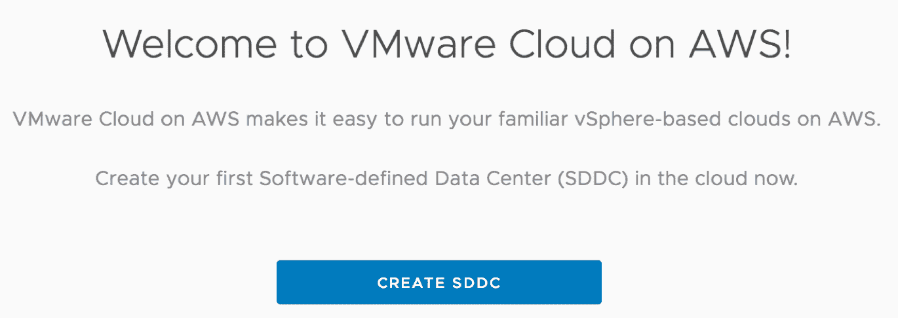
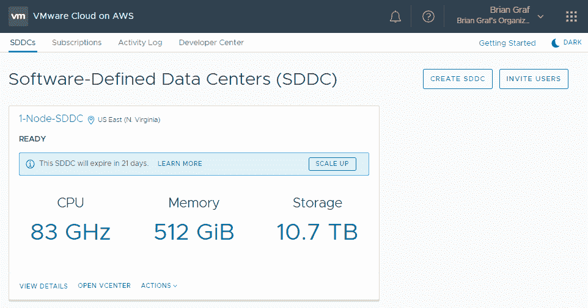
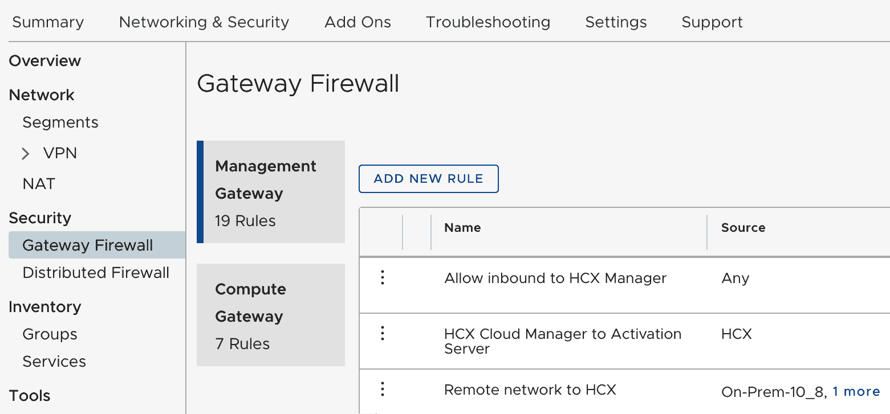
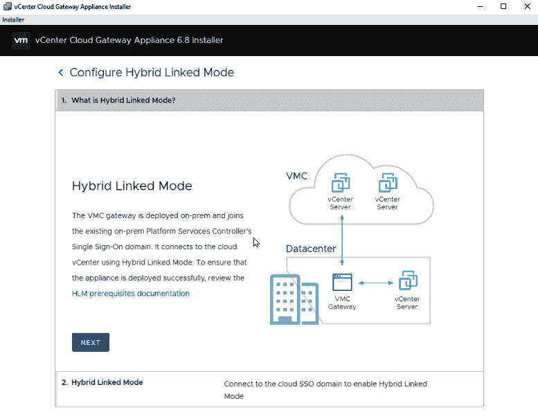
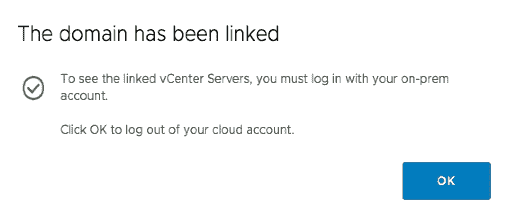

# 五、借助 VMware vRealize Suite 实现主动运维

在本章中，我们将重点介绍 VMware 如何通过向解决方案中注入高级分析来根据意图管理 IT 运维，从而帮助客户自动化在 vSphere 上运行的数据中心和公共云。vRealize Operations 的容量分析引擎利用 ML 技术，根据过去的趋势分析主动提醒您未来的事件。

我们将了解 vRealize Suite 中的不同分析引擎，以及 vRealize 工具如何在不同的云中工作。此外，我们还将了解 vSphere 上容器的自动化，方法是降低**总拥有成本** ( **总拥有成本**)并通过更好的优化提高投资回报率。

我们将在本章中讨论以下主题:

*   统一的端到端监控
*   智能运维分析与**软件定义的数据中心** ( **SDDC** )之旅
*   vRealize operations 架构和容量规划
*   VMware 容器管理服务
*   基于 AWS 的 VMware 云实施计划

# 技术要求

请参考此链接，了解 AWS 上的 VMware Cloud[https://cloud.vmware.com/vmc-aws](https://cloud.vmware.com/vmc-aws)。

# 统一的端到端监控

监控解决方案应收集和监控端到端服务级别和基础架构级别的 KPI，如按事务和服务可用性划分的响应时间，并对偏差发出警报。它可以理解和映射端到端服务的所有组件，如应用和应用组件，并监控所有应用平台组件的性能和可用性，如 web 服务器、应用服务器、消息总线和数据库。我们应该通过监控所有虚拟和物理基础架构组件的性能和可用性，了解并映射所有虚拟和物理基础架构组件，包括虚拟机、服务器、存储和网络。我们可以组合并关联所有这些参数，通过确定警报的根本原因来生成警报。IT 运维团队可以根据其角色在可定制的控制面板上获得所有信息，并拥有所有报告功能。它应该在分析功能中增加一个预测元素，以防止业务中断。

# 智能运维分析

虚拟环境的高度动态性和复杂性需要一个整体视角，并与应用和基础架构的其他部分建立必要的关联。它需要一种新的数据管理和分析技术(为物理基础架构设计的工具不能很好地适应虚拟环境的动态和分散特性)。

运维分析包括两个关键领域:

*   性能分析通过实现以下功能，帮助客户在 IT 运维中采取主动方法，以更快地检测和解决问题:
    *   基于自动学习、接近实时的基线调整、统计和趋势算法，主动控制服务性能和可用性
    *   服务影响分析和优先排序
    *   问题隔离和根本原因分析

*   容量分析通过当前和历史数据分析、模拟和假设情景实现预测方法:
    *   中长期资源调配的容量规划和预测
    *   预测警报
    *   通过自动配置和扩展实现近乎实时的容量优化

# vRealize Operations Manager 架构

vRealize Operations Manager 收集和分析来自企业内多个数据源的信息。vRealize Operations Manager 使用高级分析算法来学习和识别它监控的每个对象的正常行为。这些信息通过视图、报告和仪表板呈现给用户。

用户界面允许用户访问徽章、警报、图表和报告形式的分析结果。

vRealize Operations Manager 可以作为**虚拟设备** ( **vApp** )下载，并作为虚拟机运行。在完整的 vRealize Operations Manager 集群设计中，它将被配置为执行以下角色之一:

*   **主节点**:集群中的第一个关键节点，它将是小型部署架构中的一个独立节点
*   **主副本节点**:高可用性的可选实例
*   **数据节点**:用于可扩展性目的
*   **远程收集器节点**:帮助克服数据收集问题，例如整个网络的网络性能差

vRealize Operations Manager 有两种不同的部署模式:

*   预配置的 vApp
*   作为 Windows 或 Linux 可安装包

为了便于部署，客户可以选择 vApp 模式。

# 应用架构概述

我们将了解 vRealize Operations Manager 的逻辑节点体系结构及其所有功能:

**HTTP 服务**是主要的产品 UI。它支持主产品 UI、管理员 UI 和套件 API。这解释了 vRealize Operations Manager 如何计算压力，以及如何使用压力来计算容量规划的建议大小、剩余容量和剩余时间。这提供了足够的细节，人们可以理解 vROps 如何计算这些值，可以在它们合理时进行辩护，可以识别数据中的侥幸心理何时导致应该被否决的建议，并解释可以在 vROps 中调整的参数背后的概念。

# 容量规划

压力是对性能问题严重性的一种衡量，因为在过去一个月最糟糕的一个小时里，压力太小了。这是一种处理需求高峰和波动的智能方法，它既考虑了资源运行的热度，也考虑了资源在连续周期内运行的时间。

**总容量与可用容量**:总容量是原始容量。可用容量是我们出于规划目的假装拥有的容量，考虑到主机故障并减去一些安全余量。

*总容量–缓冲区(高可用性和常规)=可用容量*。您可以在 vROps 用户界面的分析|剩余容量中看到这一点。

容量定义了应力区。对于压力计算，我们使用总容量还是可用容量？这取决于我们是否想知道实际发生了什么(总的)，或者我们是否在为未来做计划并希望更加谨慎(可用)。

对于实际应力计算，我们使用总容量作为容量。在规划和寻找建议的合适规模时，我们希望保持谨慎，因此我们会进行压力计算，其中容量是可用容量，在给定测量的需求的情况下，在考虑到可能的主机故障和一些安全空间后，在多大的容量下我们才能避免性能问题而不浪费资源。

# 关键成功因素

以下是关键的成功因素:

*   提高**平均修复时间** ( **MTTR** )和运维效率，以防止严重的服务影响
*   实施统一的端到端监控
*   将持续的容量和性能管理与基于策略的自动化补救相结合，以动态优化性能和容量使用，并及时补救性能问题
*   引入运维分析以增强实时可见性，并通过基于基本策略的自动化补救功能为问题隔离和故障排除提供可操作的情报
*   借助高级主动和自动化功能，通过警报和提高**平均故障间隔时间** ( **MTBF** )引入主动问题检测
*   获得对容量、性能和可用性的全面主动控制
*   采用预测分析功能，实现主动识别和解决问题
*   日常的性能、容量和可用性问题在很大程度上是由适应性流程自动化来管理的

# VMware 的 Kubernetes 解决方案

Kubernetes 是企业采用的公认的容器编排器，但是在生产中操作 Kubernetes 并不是一件容易的事情。企业需要一个全面的解决方案，通过网络服务、安全性、策略、持久性、监控和分析来支持多云环境。随着越来越多的容器被使用，为了运行和管理这些容器，客户需要编排工具来管理操作，例如扩大和缩小、调度容器和处理故障。容器编排工具，如 Docker Swarm 和 Mesosphere，是可用的，但最被接受的是一个叫做 Kubernetes 的开源系统。Kubernetes 拥有运行容器化应用的完美解决方案，但在生产环境中运行 Kubernetes 仍然是一项复杂的任务。生产能力(如存储、网络、安全性、多租户和持久性)需要更多的增强和补充工具来可靠地部署、维护、扩展、监控和自我修复底层基础架构。

# Pivotal 容器服务和 VMware Kubernetes 引擎

VMware 拥有**Pivotal Container Service**(**PKS**)，这是一款由 VMware、Pivotal 和谷歌联合开发的产品，在 VMware SDDC 堆栈以及公共云提供商(如**谷歌云平台** ( **GCP** )上部署和管理企业级 Kubernetes。VMware PKS 帮助企业在 vSphere 和公共云中运行 Kubernetes。它从根本上简化了 Kubernetes 的部署和操作，因此您可以轻松地大规模运行容器。我们可以帮助客户使用 PKS，以便他们可以在其现有的 vSphere 环境中快速设置和管理 Kubernetes 服务。客户正在寻找一个易于部署和操作的 Kubernetes 解决方案，帮助他们满足第一天和第二天的所有需求，并消除设置和维护平台的冗长步骤。他们还要求解决方案在网络、存储、安全性和多租户领域提供强化的生产能力。

**VMware Kubernetes 引擎** ( **VKE** )是一款企业级 **Kubernetes 即服务** ( **KaaS** )产品，提供易于使用、默认安全且经济高效的 Kubernetes。VKE 将首先在 AWS 上推出。

Forrester 对混合云监控和管理提供商进行了 31 项标准评估；以下是其中的一些:

*   必须具备跨工作负载的多云计算管理的核心能力
*   必须至少支持基于 AWS、Azure 和 vSphere 的云
*   必须作为独立工具销售

容器是高效的，因为容器为开发人员提供了一种简单、轻量级和可移植的方式来跨各种主机或云环境打包和部署应用。由于这些好处，集装箱的使用预计在未来几年将呈指数增长。容器并不是一项新技术，但是一家名为 Docker 的公司成功地推广了这项技术，Docker 是当今最广为人知的容器格式。

# SDDC 旅程阶段

VMware 定义了 SDDC 之旅的以下阶段:

*   **成本中心**:作为成本中心运作。重点是通过统一的无组织结构和虚拟化基础架构来提高 IT 效率，从而节省资本支出和运维支出，进而降低成本。
*   **服务提供商** : IT 通过提供满足业务需求和服务级别要求的安全、高可用性和弹性的 IT 服务，成为服务提供商。
*   **业务合作伙伴** : IT 部门通过自动化基础设施和应用交付转变为业务合作伙伴，从而加快交付速度，提高 IT 响应能力，加快上市速度。

数据中心虚拟化和标准化的能力成熟度分为三个阶段:

*   计算虚拟化、关键业务应用虚拟化、大数据应用支持
*   软件定义的存储、网络虚拟化、混合云扩展、数据中心迁移
*   跨混合、异构数据中心的管理

以下能力至关重要:

*   **财务模型和衡量**:对资产成本和基础设施能力的认识和理解
*   **流程和控制** : IT 流程适用于虚拟化，但大部分是手动的，具有特别的流程间集成
*   建立标准作业程序以保持作业的一致性
*   关注有限的持续改进

# 基于 VMware 容器的服务

这需要以下 VMware SaaS 和第三方产品:

*   部署网络虚拟化基础(NSX-T)
*   部署和运行容器化的工作负载(VMware Pivotal 容器服务)

交付本服务需要以下先决条件:

*   **部署 NSX-T(虚拟设备)基础**:
    *   虚拟设备虚拟化 CPU 容量(GHz)的最低要求是必须有足够的 CPU 容量来部署 NSX 管理器和 NSX 控制器
    *   虚拟设备虚拟化 RAM 容量(GB)的最低要求是必须有足够的内存容量来部署 NSX 管理器和 NSX 控制器
    *   **网络时间协议** ( **NTP** )必须设置好并经过时间验证无误。
    *   必须配置和测试 DNS 的正向、反向、短名称和长名称解析。
    *   必须调配共享存储。必须有足够的存储容量来部署 NSX 管理器和 NSX 控制器。
    *   **最大传动单元** ( **MTU** )尺寸:1700(最小)

# 在 ESXi 上部署用于网络虚拟化的 NSX-T，并部署用于私有云的 PKS

根据 VMware 标准体系结构部署基于 NSX-T 的网络虚拟化解决方案，并在客户环境中进行验证。该服务包括平台先决条件的技术验证、使用 NSX-T 部署网络虚拟化，以及为客户进行功能测试。

下表显示了与 NSX-T 相关的所有组件的安装和配置:

| **规格** | **描述** |
| 部署和配置 NSX 边缘虚拟机 | 部署并配置为传输节点的 NSX 边缘虚拟机 |
| NSX 逻辑交换机 | 配置的逻辑交换机 |
| NSX-T 第 0 层逻辑路由器实例 | NSX 第 0 层逻辑路由器，使用静态或动态路由**边界网关协议** ( **BGP** )对等，在逻辑和物理网络之间提供打开和关闭网关服务 |
| 配置为传输节点的 VMware ESXi 主机 | ESXi 主机已准备好，注册到 NSX-T 管理平面，并配置为传输节点 |

# 部署 NSX-T 基金会

**VMware NSX-T 基础部署**:这包括 NSX 经理和 NSX 管理员的准备工作、部署和验证；

| **规格** | **描述** |
| 数据中心位置 | 这意味着 NSX-T 组件的数据中心部署。 |
| NSX 管理器实例 | 安装并配置了 NSX-T 管理器设备。 |
| NSX 控制器 | NSX-T 控制器已安装并与 NSX 经理关联。对于每个 NSX 管理器实例，将形成一个由三个 NSX 控制器组成的控制集群。 |

# 部署和运行容器化工作负载

**部署 PKS 用于私有云**:部署 PKS 平台，帮助客户创建一个私有云环境，用于调配 Kubernetes 工作负载。

下表显示了与 PKS 相关的所有组件的安装和配置:

| **规格** | **描述** |
| 将 pivotal operations manager 部署到 vSphere 中 | 这意味着在单个数据中心内部署 pivotal operations manager。 |
| 配置 pivotal operations manager | 这是 pivotal operations manager 实例的配置。 |
| 安装 PKS | 这是指在单个 pivotal operations manager 中部署 PKS 磁贴。 |
| 配置 PKS | 这是 vSphere 中 PKS 的配置、与预先存在的 NSX-T 对象的连接、Kubernetes 集群计划规模调整、**用户帐户和身份验证** ( **UAA** )、差事、系统日志、资源配置和干细胞。 |
| 使用 PKS 创建 Kubernetes 集群 | 这是 PKS 命令行界面的安装和使用，用于根据定义的集群规模计划创建 Kubernetes 集群。 |
| 在 vSphere 中安装和配置 Harbor container registry | 这意味着安装 Harbor Container Registry 实例，无需复制，使用**o**pen虚拟化 应用 ( **OVA** )以便单个实例可以服务于多个集群。VMware 将协助 Harbor 和 Kubernetes 群集节点之间的证书，其他环境配置为支持将容器映像推送到 Harbor 和从 Harbor 拉出。 |
| NSX-T 为 PKS 一体化做准备 | 这意味着创建 PKS 集成所需的 NSX-T 对象。 |
| 逻辑开关 | 为 PKS 管理网络和服务网络创建逻辑交换机。 |
| 用于外部访问的 IP 池 | 配置一个 IP 池，为 PKS 创建的每个 Kubernetes 集群提供负载平衡地址空间。该网络还将为 Kubernetes API 访问和 Kubernetes 公开服务提供 IP 地址。 |
| IP 块 | 一个 IP 块被配置为通过**容器网络接口** ( **CNI** )为 Kubernetes pods 分配地址空间。 |
| NSX-T 第 1 层逻辑路由器实例 | 这些是第 1 层逻辑路由器，一个专用于 PKS 管理组件，一个专用于 Kubernetes 集群节点。 |
| PKS 和 NSX-T 一体化 | 这意味着在 vSphere 上配置 PKS 以与 NSX t 集成 |

# AWS 上的 VMware 云

AWS 上的 VMware Cloud 是基于 vSphere 的云服务。该服务将 VMware 企业级 SDDC 软件引入 AWS 云。它由 VMware 作为一项可灵活扩展的按需服务来交付、销售和支持，利用了 AWS 的全球覆盖范围和服务广度。

除了 VMware vCenter Server 管理和优化，它还提供了一个完整的云解决方案，可在新一代弹性裸机 AWS 基础架构上运行。

这将有助于快速部署安全的企业级 AWS 云资源，这些资源在操作上与基于 vSphere 的云保持一致。这将产生一个完整的交钥匙服务，可与内部私有云以及高级 AWS 服务无缝运行。

此外，新特性支持革新业务功能的新功能:

*   **基于 AWS 的 VMware Cloud 灾难恢复**:这是一项附加的按需服务，有助于降低成本、简化灾难恢复策略，并加快环境的生产速度。
*   **VMware** 该解决方案支持多站点，针对广域网进行了优化，并且非常安全，可以尽快迁移到基于 AWS 的 VMware 云。

# AWS 上的 VMware 云计算不同于内部部署的 vSphere

AWS 上的 VMware Cloud 让 vSphere 在亚马逊的裸机硬件上运行，并配备了云自动化引擎。VMware 管理员可以访问所有必需的界面，包括基于 HTML5 和闪存的 VMware vSphere Web Client，以及所有必需的 API 集成。这是一项由 VMware 管理的服务，基于角色的访问控制将正常工作。

以下是特定用户配置文件的配置:

*   VMware 在 AWS 环境上管理 VMware 云，因此权限被分配给`cloudadmin@vsphere.local`以供用户访问。这可能会导致与需要`administrator@vsphere.local`访问环境的产品不兼容。
*   用户应该将工作负载放在`Workloads`文件夹中，因为其他文件夹的权限被拒绝。
*   由于 NSX 用户界面不可用，网络是通过 AWS 用户界面上的 VMware Cloud 配置的。
*   AWS 上的 VMware Cloud 是一个托管环境，因此所有升级和维护程序都由 VMware 执行。

# 基于 AWS 的 VMware 云实施计划

AWS 上的 VMware Cloud 的优势在于它是一个可按需部署的架构解决方案。很难确保成功满足将预先存在的内部环境连接到基于 AWS 的 VMware 云的要求。

当前的内部安装、软件版本和配置决定了在 AWS 实例上成功连接 VMware 云所需的步骤。本节讨论 VMware 建议的实施途径。

下图显示了评估环境兼容性以连接到 VMware Cloud on AWS 环境时所需的步骤。以下是基于从身份验证开始的标准流程的流程图:

# 基于 AWS 的 VMware 云实施计划

使用以下实施计划来配置内部环境，以支持 VMware Cloud on AWS 连接。完成后，该环境是一个完全配置的混合云，可用于定义的使用情形。

以下是这些步骤的总结:

|  | **行动** | **冲击** | **必需的** | **虚拟机停机时间** |
| --- | --- | --- | --- | --- |
| 一 | 在 AWS 帐户上创建 VMware 云，并将其链接到客户 Amazon 帐户详细信息 | 无；时间表取决于帐户的创建 | 是 | 不 |
| 2 | 在基于 AWS 的 VMware 云中创建 SDDC 数据中心 | 没有人 | 是 | 不 |
| 3 | 执行内部 vSphere 升级(如果需要) | vSphere 已升级，因此虚拟机可能需要停机，要获得升级帮助，请联系您的 VMware 销售代表，了解有关 VMware vSphere 升级服务的信息 | 是(如果版本低于 6.0U3) | 是(如果需要升级) |
| 四 | 内部和 AWS 之间的 VPN 连接 | 创建 VPN 隧道所需的网络更改 | 是 | 不 |
| 5 | 在环境中测试混合链接模式 | 没有人 | 推荐(如果支持混合链接模式) | 不 |
| 6 | 用例配置 | 取决于正在设计的用例 | 不 | 取决于正在设计的用例 |
| 七 | 创建或迁移工作负载 | 冷迁移的虚拟机停机时间 | 不 | 取决于是否需要冷迁移 |

# 在 AWS 上配置 VMC 的详细初始步骤

在 AWS 上配置 VMC 的详细初始步骤如下:

1.  在 AWS 上登录 VMware Cloud
2.  邀请用户加入云实例
3.  将凭据链接到亚马逊帐户
4.  在 AWS SDDC 数据中心创建 VMware 云
    这一步包括在 AWS 实例上的 VMware 云中创建数据中心。在此过程中，将要求客户提供配置的详细信息，包括名称、规模、数据中心位置，最重要的是 IP 地址子网信息。除非再次部署 SDDC，否则无法更改 IP 地址详细信息，因此请确保指定正确的地址。

5.  内部 vSphere 环境升级:
    VSP here 的环境升级必须在此时进行，以便与 AWS 实例上的 VMware 云具有功能兼容性。此过程可能很耗时，但请验证所有功能是否兼容。环境必须是 vSphere 6.0 update 3 或更高版本才能得到支持，但最好是 vSphere 6.5 版本，以便利用混合链接模式和其他功能。

# 安装、配置和操作程序

以下部分描述了在 AWS 环境中安装、配置和操作 VMware 云的几个基本步骤。

以下是在 AWS 环境中测试新 VMware 云的基本测试:

1.  登录到测试控制台:
    1.  打开 web 浏览器
    2.  导航至[https://vmc.vmware.com/](https://vmc.vmware.com/)
    3.  使用您的 VMware Cloud on AWS 凭据登录

2.  创建 SDDC:
    1.  单击创建 SDDC:

3.  邀请用户:
    1.  单击邀请用户:

4.  调整防火墙规则:
    1.  选择创建的 SDDC
    2.  单击网络信息选项卡
    3.  通过 VMC 控制台调整防火墙规则，以允许来自内部网络的访问(或适合您公司的安全策略):

5.  登录到 vCenter Server 实例:
    1.  选择创建的 SDDC
    2.  单击连接信息选项卡
    3.  使用指定的凭据登录 VMware VSP here Web Client(html 5)

下面介绍了在 AWS 上测试 VMware Cloud 的基本工作流:

1.  使用 vSphere Web Client 的 OVF 部署功能创建虚拟机(HTML5):
    1.  转到工作量资源池
    2.  部署 OVF 以创建虚拟机:

2.  创建本地内容库:
    1.  如果您还没有内容库，请在您的内部数据中心创建一个内容库。
    2.  将您的模板、ISO 映像和脚本添加到内容库中。所有的`.vmtx`模板都被转换成 OVF 模板。
    3.  发布您的内容库。
    4.  在基于 AWS SDDC 的 VMware Cloud 中，创建一个内容库，该内容库订阅了您从内部数据中心发布的内容库。内容从您的内部数据中心同步到 AWS 上的 VMware Cloud 中的 SDDC。

3.  使用 ISO 创建虚拟机并引导操作系统:
    1.  将 ISO 上传到内容库
    2.  创建一个虚拟机，并从内容库中挂载 ISO
    3.  然后启动虚拟机
4.  在虚拟机上执行基本的虚拟机操作:
    1.  迁移虚拟机
    2.  克隆虚拟机
    3.  使用 VMware vSphere vMotion 迁移虚拟机
    4.  给虚拟机拍快照
5.  使用 vSphere Web Client(不是远程控制台)连接到您的虚拟机
6.  使用 vSphere Web Client 创建逻辑网络(HTML5):
    1.  转到全局库存列表
    2.  转到逻辑网络
7.  将之前创建的虚拟机分配给此逻辑网络，启动虚拟机，然后编辑虚拟机的设置
8.  创建允许`sddc-cgw-network-1`上的虚拟机访问互联网的规则:
    1.  在计算网关上创建新的防火墙规则
    2.  从您的虚拟机 Ping 互联网上的一个已知 IP 地址

# 混合链接模式测试功能

本节描述混合链接模式测试功能。要测试混合链接模式，请执行以下步骤:

1.  使用“连接信息”选项卡中指定的凭据登录到云 vCenter Server 实例。
2.  通过单击菜单|管理员导航到混合链接模式配置。
3.  在混合云下，单击链接的域:

4.  按照屏幕上的步骤配置混合链接模式:

5.  将本地身份源(Active Directory 或 Open LDAP)添加到云 vCenter Server 实例。

6.  授予云 vCenter Server 对本地 Active Directory 组(前提条件中确定的组)的访问权限:

7.  链接到内部单点登录域(系统会提示您注销)。
8.  使用本地 Active Directory 组中的 Active Directory 用户重新登录到云 vCenter Server 实例。本地和 VMC vCenter Server 清单都应该可用。
9.  在内部和云 vCenter Server 实例中执行虚拟机操作:
    1.  创建和删除虚拟机
    2.  打开和关闭虚拟机
    3.  给虚拟机拍快照
    4.  克隆虚拟机
    5.  迁移虚拟机

目前，内部部署和云 vCenter Server 实例之间不支持 vSphere vMotion。

# 支持和故障排除

在 AWS 环境中，您可以通过多种方式获得 VMware 云的帮助和支持。本节将向您简要介绍一些已知的问题以及可以帮助您解决问题的解决方法。

在 AWS 环境中，您可以通过多种方式获得 VMware 云的帮助和支持。

1.  在联系 VMware 寻求支持之前，请准备好您的 SDDC 的支持信息:
    1.  在 https://vmc.vmware.com[登陆 VMC 控制台](https://vmc.vmware.com)
    2.  单击 SDDC 卡上的查看详细信息
    3.  单击支持查看支持信息
2.  选择获取帮助或支持的方法:

# 摘要

vRealize tools 可以自动将所有 IT 数据和事件关联到一个具有完整 IT 环境视图的统一视图中，并使用预测分析来帮助客户提高性能和避免中断，使他们能够在问题影响业务之前主动识别和修复问题。客户可以在单个解决方案中监控性能、优化基础架构容量并执行日志分析，同时全面了解其应用和基础架构。

vRealize Operations Insight 借助专为 SDDC 设计的管理工具，帮助客户为存储和网络虚拟化做好准备，从而为 SDDC 提供了一个入口。借助 vRealize Suite，虚拟化客户只需一个解决方案即可完成所有工作，包括 vSphere、容器管理和合规性、日志分析、存储和网络可见性、应用依赖关系映射以及操作系统监控。

在下一章[第 5 章](fec95bb1-c90e-460d-b5f9-423d9bb7a3f5.xhtml)、*带 AppDefense 的基于意图的清单*中，我们将探讨 VMware AppDefense，它使组织能够应对与在内部到公共云中保持数据安全相关的挑战。它是一种数据中心终端安全解决方案，将威胁检测和响应直接嵌入到应用和数据所在的虚拟化层的内核中。

# 进一步阅读

*   有关帐户创建、链接和邀请流程的详细信息，请参见位于[的 *VMware Cloud on AWS 文档*https://docs . VMware . com/en/VMware-Cloud-on-AWS/services/com . VMware . VMC-AWS . getting-started/GUID-9 cab 2 B3 e-42d 5-44a 1-9428-e 8 ffd 22 BDD 01 . html](https://docs.vmware.com/en/VMware-Cloud-on-AWS/services/com.vmware.vmc-aws.getting-started/GUID-9CAB2B3E-42D5-44A1-9428-E8FFD22BDD01.html)
*   对于测试，必须满足[https://docs . VMware . com/en/VMware-Cloud-on-AWS/services/com . VMware . VMC-AWS . getting-started/GUID-be 75 f0f 1-2864-4926-97FE-37e 635471 c 43 . html](https://docs.vmware.com/en/VMware-Cloud-on-AWS/services/com.vmware.vmc-aws.getting-started/GUID-BE75F0F1-2864-4926-97FE-37E635471C43.html)中列出的以下先决条件
*   仅当满足先决条件时，才支持混合链接模式；详情请参见本指南，网址为[https://docs . VMware . com/en/VMware-Cloud-on-AWS/services/com . VMware . VMC-AWS . getting-started/GUID-be 75 f 0 f 1-2864-4926-97FE-37e 635471 c 43 . html](https://docs.vmware.com/en/VMware-Cloud-on-AWS/services/com.vmware.vmc-aws.getting-started/GUID-BE75F0F1-2864-4926-97FE-37E635471C43.html)
*   有关网络配置的详细信息，请参见位于[https://docs . VMware . com/en/VMware-Cloud-on-AWS/services/com . VMware . VMC-AWS . getting-started/GUID-3a 7090 C5-836 c-4 DBA-9e 69-a 4a 1d 9 b 6 f 139 . html 的配置管理网关网络](https://docs.vmware.com/en/VMware-Cloud-on-AWS/services/com.vmware.vmc-aws.getting-started/GUID-3A7090C5-836C-4DBA-9E69-A4A1D9B6F139.html)
*   请参见位于[https://docs . VMware . com/en/VMware-Cloud-on-AWS/services/com . VMware . VMC-AWS . Getting-Started/GUID-BC 0 EC 6 c 5-9283-4679-91 F8-87 aad FB 9 e 116 . html 的 *VMware Cloud on AWS 入门*指南的*部署软件定义的数据中心*部分](https://docs.vmware.com/en/VMware-Cloud-on-AWS/services/com.vmware.vmc-aws.getting-started/GUID-BC0EC6C5-9283-4679-91F8-87AADFB9E116.html)
*   有关升级 vSphere 环境的详细信息，请参见位于[https://docs.vmware.com/en/VMware-vSphere/index.html](https://docs.vmware.com/en/VMware-vSphere/index.html)的 vSphere 文档中心的 *VMware vSphere 升级指南*