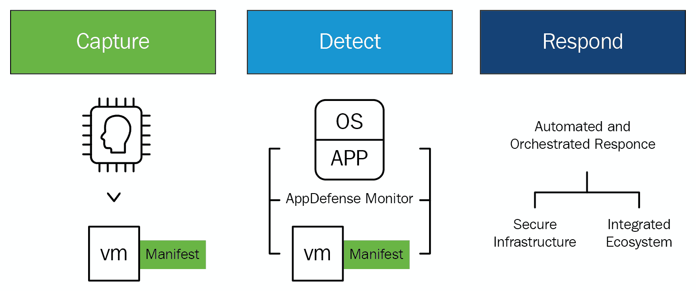
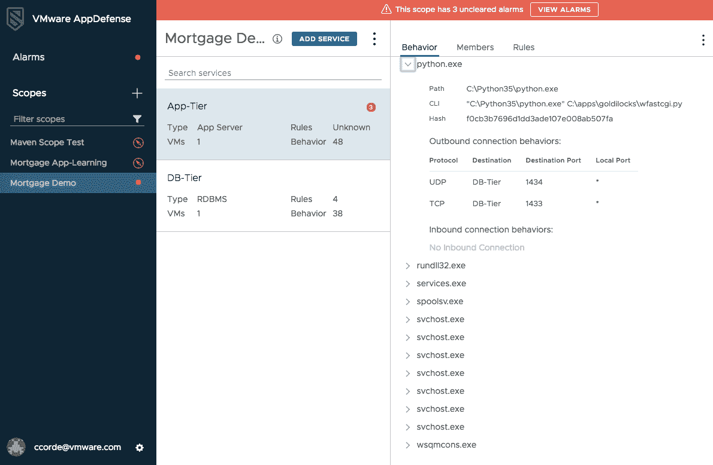

# 六、使用 AppDefense 的基于意图的清单

本章将介绍可用于托管应用的策略，以便为最终用户提供自由，为管理员提供完全控制。您将通过使用 AppDefense 了解商业价值，app defense 使用机器学习为虚拟机中运行的应用创建基于意图的清单。它可以通过一种算法来测量运行状态和预期状态，从而适当地保护应用免受恶意行为的影响。

阅读完本章后，您将学会如何通过定义以应用为中心的策略来检测、保护和实施应用的预期状态，从而在安全运维中心获得相关警报。这也将帮助你设计一个基于精确决策引擎的**安全运维中心** ( **SOC** )，而不是必须进行猜测。

在本章中，我们将讨论以下主题:

*   VMware 在应用安全性方面的创新
*   面向 SOC 的以应用为中心的警报
*   AppDefense 和 NSX

# 技术要求

你可以从 https://my.vmware.com/web/vmware/details?[下载白金版的 VMware AppDefense 插件 2.1.1download group = app defense-211&amp；product id = 742&amp；rPId=31142](https://my.vmware.com/web/vmware/details?downloadGroup=APPDEFENSE-211&productId=742&rPId=31142) 。

# VMware 在应用安全性方面的创新

问题在于客户用来保护数据中心终端的现有安全策略。我们特指托管应用的数据中心内的端点，而不是最终用户端点，如笔记本电脑或电话。

保护应用的传统方法是监控端点的已知威胁签名。想想杀毒软件。反病毒软件有一个已知恶意软件签名的大规模数据库，它使用该数据库来识别终端上的威胁。

这种方法的问题是，如果安全解决方案以前没有发现威胁，就没有匹配的签名，因此，威胁将被错过。这意味着任何全新的(或零日)威胁都不会被检测到。

近年来，为了解决识别未知威胁的问题，用于端点威胁检测的 ML 方法变得更加突出。这个想法是，通过聚合环境中尽可能多的部分的数据，机器学习和人工智能算法可以用来整理和区分正常行为和威胁。这种方法的问题是噪音。这些解决方案从环境的许多不同角落获取如此多的数据，以至于要准确检测威胁非常困难。因此，它们往往会产生大量的误报:

应用安全性必须不断发展，以跟上现代开发实践的速度，VMware 开发了一种独特的方法来解决这一问题。与专注于追踪威胁的传统安全解决方案不同，VMware AppDefense 利用其在虚拟机管理程序中的地位来了解应用的预期状态，并立即对偏离该状态的情况做出响应。这种级别的应用可见性可带来更准确的安全策略和更快的补救，从而简化对恶意行为的防范。这一结果是 IT 和安全团队共同的事实来源，使他们能够轻松地在法规遵从性、安全事件调查和事件响应方面进行协作。

AppDefense 通过从自动化和配置工具(如 vCenter、Puppet 和 Ansible)收集虚拟机清单和应用详细信息来构建上下文，以便了解特定机器和应用的意图。然后，它会监控虚拟机、操作系统、流程和应用的行为，并将此信息与调配期间定义的意图相关联。AppDefense 通过使用机器学习，基于已知的良好行为为机器和应用应该如何运行和通信创建蓝图。

一旦建立了蓝图，它就被存储在虚拟机管理程序的安全分区中。AppDefense 会监控任何更改，检测并防止任何偏离既定状态的情况，从而确保应用、基础架构和操作系统的完整性。当检测到威胁时，它可以通过各种功能和 NSX 数据中心进行本地响应，以实施和遏制威胁。

# 数字治理和合规性

VMware 政府解决方案通过其数据中心转型方法，使客户能够安全地实现政府 IT 现代化，加强网络安全，并简化跨基础架构、云、应用和终端的运维。政府客户可以利用 VMware 解决方案创新 IT 以获得更大的影响力，并部署数字优先的愿景来实现任务目标。

新技术始终是客户以更好的方式提供相同服务的关键促成因素。信息技术现代化现在是网络安全解决方案的一个组成部分。IT 比以往任何时候都更加努力地工作，以满足对基础架构不断增长的需求，为能够支持传统投资和下一代应用的现代云平台开发成本高昂、效率低下的系统。

VMware 通过将计算虚拟化投资扩展到存储、网络和管理领域，提供了一种安全、实用且准确的方法来实现数据中心 IT 运维基础的现代化。现代政府数据中心是软件定义、虚拟化和集中化的，为客户提供了按需运行当今动态服务所需的可用性、可扩展性和运维效率。VMware 的 SDDC 体系结构利用全球一致的基础架构来实现跨内部、私有和公共云的无缝应用和工作负载可移植性，从而使客户能够灵活地运维真正的混合云环境。这最终将跨越通用基础架构和管理环境的内部和公共云。

# 自动化的智能政府工作流程

它正在创新其交付和支持应用的方式，以跟上移动创新，并更好地响应灵活访问政府资源和服务的内部请求。从封闭、僵化的方法转向移动性，客户正在利用虚拟化和云在正确的时间将正确的应用和生产力解决方案交付给正确的用户。VMware 数字工作区解决方案通过跨设备、位置和应用安全、远程地访问资源和数据，使政府工作人员能够更有效地为市民服务。它改变了应用和 It 服务的交付方式，从而提高了工作效率并对任务计划产生了影响。

作为移动工作人员的基础，VMware 数字工作区代表了应用和 IT 服务交付和消费方式的根本转变。基于软件定义的架构，数字工作区将应用与操作系统隔离开来，实现了 Windows、云原生、web 和移动应用的敏捷、无线交付和管理。作为对微软管理 Windows 10 方法的补充，VMware 数字工作空间解决方案抽象了设备和应用生命周期管理，以无线方式支持 Windows 10 电脑和应用。以基于身份的访问和统一终端管理为后盾的企业安全应用目录，可为用户提供消费者般的工作体验，而不会影响数据安全性或合规性。它提供了额外的安全功能，包括对所有终端的全面可见性和管理，如 macOS 和 Windows 台式机和笔记本电脑设备、设备和数据级加密、粒度**数据丢失预防** ( **DLP** )策略以及自动化合规性监控，以进一步保护数据并防止数据丢失。

# 转变网络和安全性

客户必须通过减少总威胁攻击面来加强网络安全。他们通过转变 IT 基础架构和治理来实现这一点。应用和数据存在于日益扩展和分散的 IT 环境中；终端用户不再被整齐地限制在外围防火墙之后，攻击者比以往任何时候都更聪明，因此网络安全工作必须通过扩展到云、用户身份及其设备来绑定不仅仅是核心基础架构。VMware 通过软件定义的多层网络安全方法来帮助客户应对不断变化的安全需求，这种方法增强了用户、应用和数据之间交互的可见性和控制力。

网络虚拟化通过在虚拟机管理程序中嵌入网络和启用微分段来降低物理网络环境中固有的风险和低效率，微分段通过确保网络、安全和自动化策略遵循单个工作负载或应用来减少基础架构的攻击面。该抽象层还为 IT 提供了一个平台，可以插入额外的第三方服务来实现更高级的安全保护，并提供了一个在工作负载级别加密静态数据的理想点。

随着高度分布式计算环境、更大的跨组织和防御协作以及更严格的隐私法规，如**通用数据保护法规** ( **GDPR** )，组织必须适应无边界计算。VMware 通过在虚拟化基础上构建并转向分层、分段和策略驱动的安全体系结构，帮助 IT 实现安全转型。VMware 解决方案与传统的安全措施协同工作，以减少攻击面并防止威胁的横向移动。

# VMware 方法的业务成果

VMware 帮助客户转变政府数据中心，以提高效率、扩展到云中并支持共享服务。VMware 的方法是利用虚拟化和**超融合基础架构** ( **HCI** )来构建一个敏捷、面向服务的数据中心，该数据中心通过以下方法实现标准化、集中化和混合云就绪:

*   减少数据中心占地面积、硬件和运维成本，以优化数据中心
*   构建同类最佳的私有云，仅使用所需资源双向扩展到公共云
*   整合跨多个组织的 IT 系统、功能和服务，以支持共享服务模式
*   除了传统应用之外，还支持云原生应用开发和平台
*   通过更快的按需交付 IT 资源，提高效率和灵活性，并改善 IT 服务级别
*   将节省的资金再投资于应用开发和敏捷性

以下是针对不同使用情形的 VMware 解决方案方法:

*   利用全面的现代安全平台减少总威胁攻击面:
    *   **VMware 方法**:通过在独立于底层物理基础架构的应用基础架构和端点之间应用无处不在的软件层，实现软件定义的安全和治理框架:
        *   将安全功能从底层物理基础架构中分离出来，并将保护置于整个 IT 环境中更接近数据/工作负载的位置
        *   在数据中心和云基础架构中嵌入本质安全
        *   降低风险并改善安全状况
        *   降低运维复杂性
*   利用物联网提供服务和保护:
    *   **VMware 方法** : VMware 提供企业级物联网设备管理和监控解决方案，解决了机构在从边缘到云的物联网使用案例的装载、管理、监控和保护方面面临的挑战。只有一个控制台来配置、保护、管理和监控物联网基础设施。VMware 方法的优势如下:
        *   降低复杂性
        *   提高可靠性
        *   转变安全性
        *   创新速度更快，投资回报率更高
*   构建新的功能、运维模式和服务，包括以下内容:
    *   智能建筑
    *   **国防**:改善资产跟踪和供应链管理；网络中心战，通过摄像机、红外传感器、探测器、无人机和卫星提供共享的战场感知
    *   **车队远程信息处理**:使用传感器远程监控车队中车辆的位置、性能和行为
    *   监测天气和大气条件
    *   加强安全和公共卫生
    *   智能城市
*   开发电子政务和安全框架以实现数字公民:
    *   **VMware 方法** : VMware 通过自动化 IT 基础架构的每一层，帮助政府实现从数据中心到最终用户设备的数字化，从而实现 IT 现代化。这种抽象支持在整个生命周期中以编程方式全面了解和控制系统组件，增强安全性，提高效率，并支持现在和未来的现代框架:
        *   提高公共服务的成本和质量
        *   提供新的功能
        *   加速创新
        *   维护公民信任、数据安全和隐私
*   采用零信任安全模型:
    *   **VMware 方法**:支持软件定义的网络划分和隔离网络，并控制数据中心内的横向移动。它在虚拟机管理程序层中嵌入网络，将网络、自动化和安全服务附加到随工作负载或应用移动的策略驱动的工作流，从而实现分层的深度安全防御方法:
        *   将网络保护扩展到应用和数据
        *   确保安全策略随应用移动
        *   通过跨单个工作负载的自动化和流程编排，系统地实施策略
        *   在整个网络中行使最低特权和单元级信任的能力
        *   包含攻击的横向传播
        *   减少错误和低效

# 利用 AppDefense 进行全球扩张

AppDefense 是基于 ML 技术的威胁检测和响应解决方案。客户信任数字信息，但任何数据泄露都会影响他们的消费者信心和声誉。数据对于组织在当今市场中的竞争力至关重要，因此数据安全性不容妥协。

AppDefense 帮助组织解决一些与保护数据安全相关的挑战。它是一种数据中心终端安全解决方案，具有嵌入到 vSphere 内核中的内置威胁检测和响应解决方案，以及主机应用和相关数据。它整合了关于每个端点上所有必需服务的正确状态的直观信息。它还可以在未经授权的更改发生时进行检测。

以下是带有三个未清除警报的 AppDefense 仪表板的屏幕截图:

VMware AppDefense 专注于验证端点的*已知正确的*参数，无需钻取整个环境，追踪可能构成威胁的*已知的*或*未知的不正确的*行为。通过最大限度地减少误报的发生，安全团队可以满怀信心地将异常检测为真正的威胁。AppDefense 独立于攻击面，因此它本身不会受到攻击。

# 面向 SOC 的以应用为中心的警报

AppDefense 发出智能警报，这对环境意义重大。与从不正确的数据中搜索威胁相比，只有具有自动响应功能的可信警报才能让安全团队专注于从其环境中查找和消除威胁。SOC 可以使用该工具进行可信检测，并自动响应威胁。 **C** **hief 信息安全官** ( **CISO** )组织被拆分为安全架构师和安全运维。安全架构师负责设计用于保护给定应用的策略，安全运维负责实际监控和识别环境中的威胁。

安全架构师审查新的应用，并确定应该如何保护它们。如今，他们对应用是如何组成的、应该(或不应该)运行哪些进程以及应该如何通信(以及与谁通信)知之甚少，他们甚至不知道应该向谁寻求问题的答案。审查过程可能需要几个月的时间，而且他们使用的策略通常是通用的，重点是确保应用已打补丁，并且日志受到监控。

借助 AppDefense，架构师从一开始就可以获得应用的预期状态和行为的可信清单，这使他们能够定义特定的、以应用为中心的策略，从而在最终部署应用时消除对 SOC 的猜测。这使得评审过程更有效，更少的人工，更快，这在组织转向更敏捷的应用开发方法时尤其重要。

一旦应用部署完毕，SOC 就会检测到应用何时遭到破坏。今天，他们被误报和大量他们需要理解的噪音轰炸。如果他们确实发现了问题，补救是手动的，而且是劳动密集型的。有了 AppDefense，当警报出现时，SOC 可以相信警报是合法的。此外，他们可以自动执行补救措施，以便快速有效地消除威胁，最大限度地减少对环境造成的损害。

# 转变应用安全就绪性

在 DevOps 环境中，应用会被快速开发、更改和销毁。具有增强功能的应用代码经常变化，安全团队很难定期更新/了解应用中的新修改。客户不能因为关键数据受损而拿自己的业务冒险，这也可能损害他们宝贵的声誉。客户必须确保跨所有平台的安全服务严密保护其网络、应用和数据中心端点位置。

几乎任何拥有计算机的人都有可能发起针对特定组织的攻击，而且每天都有新的威胁出现。我们不能专注于持续跟踪威胁来应对与 IT 安全相关的所有挑战。

CISOs 负责保护驻留在动态和分布式 IT 环境中的应用和数据。客户必须选择新的云原生应用开发流程，还必须实施增强其业务目标的安全性。

AppDefense 用一种特定的方法保护应用，通过*确保好的*而不是*追逐坏的*。AppDefense 了解应用的行为及其目标，并根据应用所需的状态进行检查。当应用被操纵时，AppDefense 自动响应。这是一个简单而强大的工具，通过提供更多的上下文和控制来缩小攻击面。

AppDefense 还可以在容器环境中工作，并帮助客户跨区域保护他们在任何平台上的应用。AppDefense 为保护数据中心应用提供了一个基础层。AppDefense 是唯一一款可以跨越所有平台的解决方案，它采用一致的方法来发现上下文、定义警报规则以及进行补救。通过集成容器支持，客户可以在他们的所有应用中启动最低特权实施。

# 与开发人员、安全人员和运维团队一起创新 IT 安全性

安全团队可以使用 AppDefense 为具有频繁应用开发和部署流程的客户建立安全审查流程。

由于终端用户需求的不断变化，应用和基础架构的扩展速度越来越快。当应用被定期修改和重新部署时，这将挑战安全团队放弃他们调查和管理修改的传统手动方式。安全团队应该理解应用打算做什么，并为其期望的状态定义安全策略。

我们通过将 AppDefense 与配置工具和自动化框架集成到 CI/CD 管道中来使用它。为了支持 DevSecOps 方法，我们可以通过维护一个与随需应变的应用团队保持同步的预期状态的可信图，用实时监控来定义所需的状态。

# 容器化应用的最低特权安全性

AppDefense 公开了一个 API，使容器安全合作伙伴能够集成到平台中。AppDefense 可以从容器编排系统获得工作负载上下文，还可以配置由容器安全供应商实施的策略。

Aqua Security 是可以与 AppDefense 容器生态系统集成的第三方工具之一；当容器通过调查和执行行为来执行时，它为容器提供运行时保证。AppDefense 和 Aqua Security 将有助于容器运行时配置文件，以便 VMware 可以管理/维护整个数据中心的安全范围，Aqua 还会将引人注目的警报传输到 AppDefense 控制台进行管理和解决。通过集成到可以扩展到混合云模型的容器安全解决方案中，容器附带了一个自动化引擎和为所需状态定义的技术。

AppDefense 支持跨所有平台(如虚拟服务器、裸机服务器和任何云环境)运行的容器工作负载的 VMware vCenter 清单。欧洲的客户可以通过支持数据本地化政策的欧洲数据中心获得 AppDefense。

**通用数据保护条例** ( **GDPR** )(条例【EU】2016/679)是一项为欧盟内部的人们建立并合并数据隐私权的条例。GDPR 还关注欧盟地区边界之外的个人数据出口。GDPR 的首要目标是控制个人数据，如个人的姓名、地址和身份证号码，这是一项基本权利，同时通过协调所有欧盟国家的数据保护规定，使了解全球业务的监管环境变得简单。

GDPR 将当前欧盟数据保护法的范围扩展到处理欧盟个人数据的非欧盟组织。数据保护批准的协调应该使非欧盟组织更容易遵守严格的数据保护法规遵从性授权，并对不遵从行为进行最大限度的惩罚。VMware 将与欧盟的 GDPR 结盟。

VMware 可以通过在标准合同条款内构建合规性框架来解决从欧盟出口个人数据的问题。根据当前的欧盟法律，我们可以保证根据需要为客户的个人数据提供高水平的保护。VMware 的标准合同中有一些条款，如关于 VMware 及其全球子公司之间个人数据全球移动的内部共识。就 VMware 对客户个人数据的处理而言，VMware 的客户依赖于安全港计划下的 VMware 认证。VMware 的任何客户都可以使用 VMware 的内部标准合同条款。

VMware 帮助客户在数据安全方面与 GDPR 保持一致，以便客户可以与隐私专家交流想法，并通过支持预期的法律来执行业务流程。

AppDefense 是一个基于云的安全工具，具有许多优势，但为了性能和数据本地化，拥有本地数据中心是很重要的。欧洲客户必须遵守有关数据本地化的法规。AppDefense 服务将仅从位于欧洲的本地数据中心交付给欧洲的客户。AppDefense 推出了一项关键的云安全服务，通过区域数据中心最大限度地提高全球客户的数量。

印度政府也有这样的政策，他们只能从在印度有数据中心的云服务提供商那里获取服务。

AppDefense 从合规性的角度收集并利用最终用户和业务数据。它也适用于不同的全球数据法律/法规。AppDefense 收集客户的电子邮件地址以进行身份验证，然后将这些地址放入服务中，并检查个人身份信息。AppDefense 还从客户保护的应用中获取主机名、IP 地址和进程信息。从法规遵从性的角度来看，所有这些关键数据都很重要。AppDefense 支持托管在不同种类的云中的应用。

# 通过 AppDefense 增强安全性

客户正在更新其数据中心的基础架构，并且还在不花费任何额外资金的情况下解决所有严重的安全漏洞。AppDefense 和 VMware NSX 将通过微分段增强网络安全性，并保护服务器免受未知威胁。

大多数安全漏洞无法通过单点产品(只能处理单个问题，没有完整的解决方案)或工具来解决，因为这些产品或工具在本质上更基本，更具架构性。AppDefense 使安全性成为企业运行的网络和应用结构的固有部分。通过在 vSphere 内核中植入 AppDefense，安全性成为数据中心终端的固有部分，数据中心终端由应用组成。AppDefense 帮助其客户解决安全模型中安全事件点不断增加的频率和成本，这些事件点主要集中在未识别的威胁上。AppDefense 传达了一种基于目的的安全模型，它决定了应用应该做什么——已知的正确做法。将此与黑客将要做的事情进行比较——已知的错误。

# AppDefense 和 NSX

AppDefense shield 应用运行在 vSphere 环境和各种云环境中。NSX 和 AppDefense 互为补充，但是 NSX 对于 AppDefense 服务不是强制性的。如果 AppDefense 与 NSX 集成，则可以利用自动响应技术，如自动隔离受损的数据中心端点。AppDefense 在一种新的安全模式中表现突出，这种安全模式具有本机、基于目的和以应用为中心的方法。AppDefense 将为计算做与 NSX 为网络做的相同的工作，为商业应用创建最低特权环境。我们可以根据应用的预期状态来监控正在运行的应用，并通过对试图利用应用的攻击的自动响应来调查它们。

AppDefense 与众不同，因为它位于虚拟机管理程序内核中，可以更好地解释数据中心端点的预期状态和行为。它实时监控端点从已知正确的状态到*状态的未批准更改。当应用检测到威胁时，AppDefense 使用 vSphere with NSX 进行自动响应。*

AppDefense 补充了许多安全解决方案，但它与两个主要的终端安全解决方案竞争，如下所示:

*   基于签名的传统产品(防病毒、防恶意软件、IPS 等)
*   下一代终端安全(**终端检测和响应** ( **EDR** )、机器学习、行为分析等等)

AppDefense 是从前面的解决方案发展而来的，通过识别与应用期望状态的偏差，而不是遵循可能的警告。AppDefense 还具有自动响应能力，可以在各个方面与其他安全工具集成。

从数据中心到最终用户，VMware 为其客户提供安全和数据保护功能。它通过发现潜在的数据保护差距，端到端地保护客户的环境:

*   **数据访问和数据传输(使用 VMware NSX)** :创建安全策略，防止数据通过未经批准的网络移动
*   **数据访问(使用 Horizon 和 Workspace ONE)** :创建一个策略引擎，通过身份检查和验证对数据实施基于角色的访问
*   **数据存储(使用 VMware vSphere 和 vSAN)** :支持数据加密
*   **数据删除(使用 VMware vSphere 和 AirWatch)** :清除数据，包括单个数据

AppDefense 不同于微软的**基于虚拟化的安全** ( **VBS** )工具，如 Device Guard、Credential Guard 和 AppLocker，因为这些工具仅适用于 Windows，不支持 Linux 工作负载。此外，这些解决方案都不是为检测和响应数据中心终端威胁而设计的。VBS 使用虚拟机管理程序来帮助保护内核和操作系统的其他部分。AppDefense 专注于应用。保护应用意味着保护应用组件的完整性和行为，而不仅仅是操作系统。即使 VBS 不存在或未启用，AppDefense 也会提供操作系统保护。AppDefense 还为 SOC 提供了检测和响应任何危害的能力。Device Guard 专注于列出允许在机器上运行的可执行文件。它不执行行为白名单。它不以应用为中心来创建、更新和监控这些策略。它不支持自动响应集成。所有这些都是交付可由 SOC 高效使用的解决方案的重要组成部分。AppLocker 是较早的应用白名单解决方案，专注于最终用户终端，它存在传统白名单存在的所有问题。相对于设备保护，关于何时使用 AppLocker 存在明显的混淆。

AppDefense 为应用做白名单和行为分析。传统的白名单是基于监控和验证允许在机器上安装什么。然而，这种方法忽略了行为部分。这台机器被允许做什么？AppDefense 将这两个组件合并到其方法中，以确定应用的预期状态。AppDefense 还全面了解应用行为，而不是只关注单个数据中心端点。AppDefense 在云中存储虚拟机清单、机器名称、预期的进程行为、预期的网络流量和安全警报。AppDefense 保存着关于客户数据中心环境和安全状态的元数据。AppDefense 不会在云中存储任何应用数据，也不处理来自客户的任何实际应用数据。存储的唯一数据是维护基础架构安全状态所需的数据。

我们保护存储在云中的信息，因为我们非常重视 AppDefense 服务的安全性。该服务由 VMware SOC 管理和保护，该团队负责管理所有 VMware 云服务以及 VMware 内部数据中心的安全性。AWS 内的任何配置变更或行为都受到 SOC 的密切监控，并需要经过授权的变更控制流程。所有数据都通过加密隧道发送到 AppDefense 服务或从 app defense 服务接收，所有存储的数据在静态时都是加密的。

AppDefense 使用第三方服务提供商，并使用精选的少数第三方 SaaS 服务。所有第三方供应商都经过内部安全和法律团队的审查，并与 VMware 签订了数据隐私协议。

AppDefense 是从云中管理的，客户通过将 AppDefense 作为 SaaS 服务来使用，可以获得许多好处:

*   安全团队不需要部署、管理和维护软件，这通常不是他们的核心能力。
*   客户可以从 vSphere 客户群的集体知识中获益。这意味着我们可以为来自不同租户的大量机器上运行的行为建立基准，以便更快地识别异常和安全威胁。
*   云交付模型允许我们定期更新和更改一些异常检测逻辑，而不需要客户安装和管理软件更新。
*   通过提供云服务，客户可以从单一位置管理其环境的安全状况。

AppDefense 了解应用的预期状态，应用的预期状态包括应用组合信息，如组成应用的虚拟机、服务和二进制文件，以及与核心应用共存的其他软件，如安全和管理软件。它还包括行为信息，比如各种进程之间的网络交互。AppDefense 还与 vRealize Automation、Puppet 等配置系统相结合，以获取有关预期状态的合成信息。然后，它通过运行时发现行为来增强这一点，以创建一个全面的、经过验证的预期状态。如果虚拟机使用 vMotion 在主机或群集之间移动，AppDefense 策略也会随之移动，类似于 NSX。AppDefense 的管理域边界是 vCenter，因此当前不支持跨 vCenter 移动虚拟机。

可能产生错误警报的预期应用更改有两种形式:软件更新和学习期间没有表现出来的行为。要限制假警报，请执行以下操作:

*   我们建议延长和可变的申请学习期
*   我们支持通配符和智能和自动通配符

AppDefense 不会消耗端点或主机上的大量系统资源，因为它惊人地轻量级，并且消耗主机上的最小资源。AppDefense 使用简单的方法来了解应用的预期状态并监控变化，而不是依赖复杂的算法和计算，这是其他下一代终端安全解决方案通常的工作方式。AppDefense 与 **s** **安全信息和事件管理** ( **SIEM** )和其他下一代安全解决方案相集成，因为它是一个开放平台，允许 SIEM 和其他安全系统使用其警报和应用上下文信息，并利用其自动响应功能。

通过与 DevOps 自动化工具集成，AppDefense 与配置管理工具、编排引擎和云管理门户相集成，以获得可信的预期状态数据。您还可以与 vRealize Automation 集成，并添加对 Puppet 等工具的支持，以实现自动化配置和流程编排。

# 详细的实施和配置计划

以下部分介绍了成功部署 AppDefense 所需的组件和步骤。受 AppDefense 保护的目标应用环境需要具备以下条件:

*   至少两台运行 ESXi 6.5a 或更高版本的 ESXi 主机
*   vCenter 6.5+管理 ESXi 主机
*   虚拟机硬件版本 13
*   AppDefense 设备 OVA 和 HTTPS 连接到互联网的 IP 地址
*   至少一个运行在 64 位 Windows Server 2012 或 2016 上的类似生产的应用
*   优选地，所选择的应用应该是分布式的(例如，Web-App-DB)
*   NSXv 6.3 或以上版本
*   vRA 7.2 或以上

# AppDefense 部署的环境准备

AppDefense 部署的环境准备如下:

*   **第一阶段**:
    *   安装 vCenter
    *   安装 ESXi 主机
    *   安装 NSX 管理器
    *   安装 vRealize Automation

**安装和部署 AppDefense 组件**:应用和基础设施团队负责 AppDefense 平台组件的安装和支持，并负责选择目标应用。应用团队还会调配要测试的目标应用，并模拟对已调配应用的标准更改。

*   **第二阶段**:
    *   提供 AppDefense 登录
    *   下载 AppDefense 设备
    *   部署 AppDefense 设备 OVA

如果满足以下条件，AppDefense 部署将会成功:

它从捕获虚拟机的预期目的、状态和行为开始。这里，我们利用了 vSphere 的一个独特属性，即应用可见性。虚拟机管理程序允许您查看运行时状态(虚拟机中正在运行的内容)和供应状态(最初供应的内容)。

第三阶段:

*   设置 AppDefense 管理器实例
    *   复制 UUID 和 API-KEY
    *   修改`application.properties`文件
    *   验证 AppDefense 设备连接
    *   验证 NSX 管理器连接
    *   验证 vRealize Orchestrator 连接
    *   **通过配置 AppDefense 组件**完成 AppDefense 部署:需要满足这些解决方案的所有技术要求(IP 地址、DNS、VMs、NTP 等)。客户必须通过审查其环境中允许的行为实践、配置保护策略、监控受保护的应用、测试检测功能、使用 VMware 提供的工具、内部工具或手动触发违规来帮助实施团队。运行和保护安装了 AppDefense 的测试应用将根据当前和未来的安全威胁不时进行评估。

**第四阶段**:

*   在 ESXi 主机上安装主机模块
    *   将客户模块部署到应用服务器
    *   启用来宾完整性
    *   验证应用服务器显示就绪状态
    *   **创建具有基本检测和响应能力的应用范围**:app defense 的核心是定义应用的预期状态。预期状态包括应用的组成、流程级别、入站和出站连接行为，以及它们在更广泛的应用上下文中的关系，因为这些应用用于根据客户需求进行连接或集成。这些方法中的一种或多种将用于在部署期间创建预期状态。

**第五阶段**:

*   在应用的 AppDefense 中创建范围
    *   在 AppDefense 中为应用创建服务
    *   验证捕获过程已经运行了几周
    *   **创建应用范围**:您可以利用 vRealize Automation 的基础架构蓝图在 AppDefense 中创建服务和应用范围/组合，也可以在 AppDefense 中手动定义应用组合。

**第六阶段**:

*   创建多机蓝图
    *   在蓝图中标记虚拟机的范围和服务
    *   验证 AppDefense 中的作用域创建
    *   **验证和保护模式**:我们可以通过在应用上运行 AppDefense discovery 模式几周来自动学习应用行为，从而获得应用行为。您还可以修改和验证应用的预期状态(允许的行为)。

**第七阶段**:

*   验证行为
    *   根据需要添加/修改/移除行为
    *   更改行动以验证和保护
    *   观察预警日志中的默认规则违规
    *   **补救测试**:测试自动和手动工作流程，以执行以下补救措施:

**Remediation testing**: Test automatic and manual workflows to perform the following remediation actions:

*   暂停
    *   关机
    *   快照
    *   阻止和警告
    *   检测测试和事故调查
    *   通过触发未授权行为进行预期状态偏差测试
    *   事件调查
    *   带详细通知的警报
    *   设置事件
    *   **第八期**:
*   修改关机规则
    *   触发未经授权的行为
    *   验证日志中的电源关闭和相关警报
    *   修改暂停规则
    *   触发未经授权的行为
    *   验证日志中的暂停和相关警报
    *   修改阻止和警报规则
    *   触发未经授权的行为
    *   验证日志中的阻塞和警报以及相关的警报
    *   修改快照规则
    *   触发未经授权的行为
    *   验证日志中的快照和相关警报
    *   **NSX 经理的补救测试**:

**Remediation testing with NSX Manager**:

*   易于创建和更新预期状态
    *   事故响应自动化的简易性
    *   当使用与预期状态的偏差作为安全或合规事件的信号时，信噪比较低
    *   隔离
    *   保护策略的配置
    *   第九阶段:
*   修改隔离规则
    *   触发未经授权的行为
    *   验证应用了 NSX AppDefense 安全标签
    *   验证 NSX 应用防御安全组是否包含
    *   验证应用了 NSX AppDefense 安全策略
    *   验证虚拟机是否不再能够通信
    *   Verify that the VM can no longer communicate

摘要

# 数字化转型有可能彻底改变政府与公民/选民的联系方式，保护敏感信息，并实现组织的使命。然而，改革政府业务是一项复杂的任务。主要障碍包括孤立的遗留系统、应用和流程；资金和人才短缺；复杂的采购流程；和文化不和谐。尽管面临这些普遍挑战，但政府领导人认识到，为了在数字时代为公众服务，数字化转型是必要的。VMware AppDefense 有助于加强跨基础架构和端点的数据安全性，通过降低网络安全风险来保护敏感的公民数据和隐私。

在下一章 [第 6 章](e97316c5-1a91-4085-9603-e9b643e11ad2.xhtml)、*基于 ML 的智能日志管理*中，您将了解 vRealize tools 如何自动将所有 IT 数据和事件关联到一个统一的视图中，以全面了解 IT 环境，并且您将使用分析来预测并为客户提供支持。我们还将通过使他们能够在问题影响业务之前主动识别和补救问题来提高性能和避免中断。

In the next chapter, [Chapter 6](e97316c5-1a91-4085-9603-e9b643e11ad2.xhtml),  *ML-Based Intelligent Log Management*, you will learn about how vRealize tools can automatically correlate all IT data and events into a unified view with a complete picture of the IT environment, and you will use analytics to predict and provide support to customers. We will also improve performance and avoid disruption by enabling them to proactively identify and remedy issues before they affect the business.