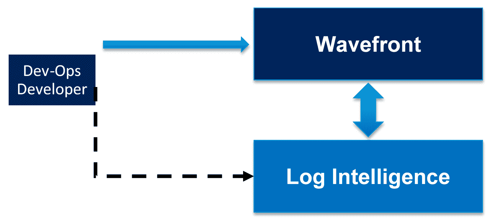
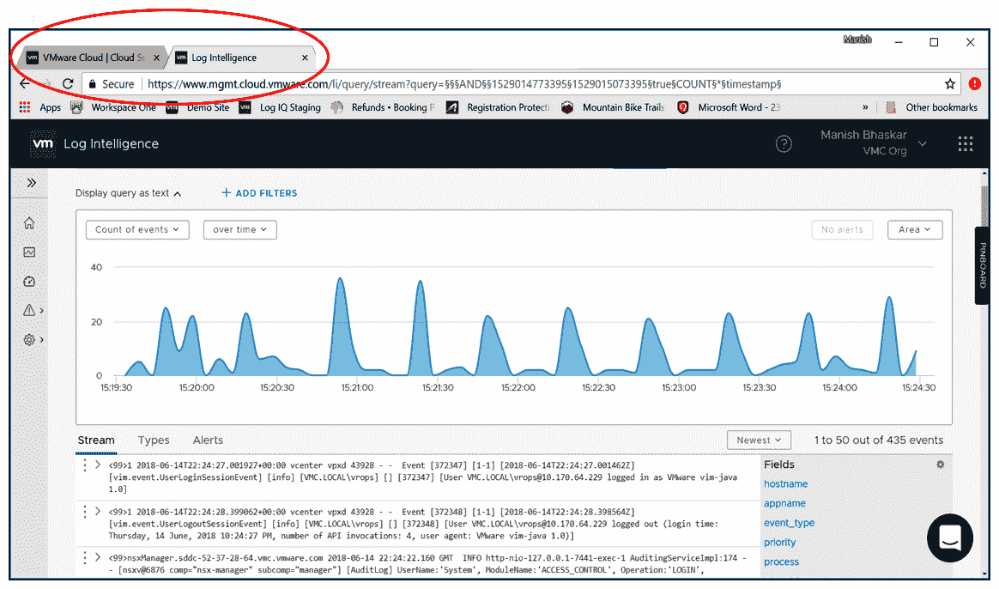
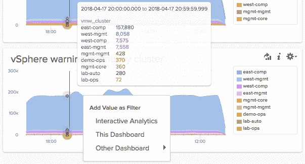
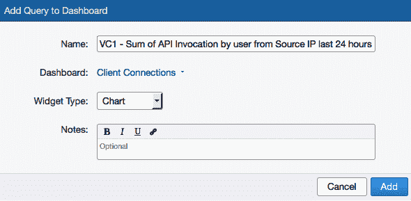

# 六、基于 ML 的智能日志管理

在本章中，我们将探索 vRealize Log Insight 的体系结构及其工作原理。我们还将讨论智能数据汇总是如何发生的，以及它将相似的消息聚集在一起的能力。vRealize Log Insight 还具有自动模式提取功能。它能够通过索引和智能分组跨物理、虚拟和云环境执行快速故障排除，这有助于通过准确的根本原因分析快速找到解决方案。

我们将通过将 vRealize Log Insight 与第三方工具集成，了解如何利用 vRealize Log Insight 进行自动修复，以及索引和消息分组背后的逻辑。

我们将在本章中讨论以下主题:

*   借助 vRealize Log Insight 实现智能日志管理
*   云运维阶段
*   **VMware vrealize Network Insight**(**vRNI**)

# 技术要求

您可以下载以下内容:

*   来自 https://my.vmware.com/web/vmware/details?[的 VMware vRealize Log Insight 4.6.2download group = VRLI-462&product id = 676&rPId = 28154](https://my.vmware.com/web/vmware/details?downloadGroup=VRLI-462&productId=676&rPId=28154)
*   来自 https://my.vmware.com/web/vmware/details?[的 VMware v realize Operations Manager 6 . 7 . 0download group = VR ops-670&product id = 676&rPId = 28154](https://my.vmware.com/web/vmware/details?downloadGroup=VROPS-670&productId=676&rPId=28154)
*   来自 https://my.vmware.com/web/vmware/details?[的 VMware v realize Network Insight 4 . 0 . 0download group = VRNI-400&product id = 832&rPId = 29784](https://my.vmware.com/web/vmware/details?downloadGroup=VRNI-400&productId=832&rPId=29784)
*   来自 https://cloud.vmware.com/log-intelligence[的日志情报](https://cloud.vmware.com/log-intelligence)

# 借助 vRealize Log Insight 实现智能日志管理

VMware 客户了解全面的云管理平台产品非常重要，这只是自动化和简化其数据中心运维工作的一小部分。

我们可以使用 vRealize Log Insight 作为单点解决方案来规划日志管理解决方案。我们应该理解更大、更具战略性的 SDDC 管理故事。日志管理是一个单点解决方案，它符合更大的图景，并提升了讨论。Log Insight 可通过大量可用的内容包进行扩展。与其他解决方案不同，它不会随着数据量的增长而收取更多费用。

# 日志智能价值主张

VMware vRealize Operations 和 vRealize Log Insight 可帮助云服务提供商跨物理、虚拟和云基础架构提供服务。两者都可以在一个简单易用的统一控制台中将结构化和非结构化数据从应用程序关联到存储中。这是通过为准确的未来规划提供对性能、容量和配置的控制来实现的，这有助于通过基于策略的配置采取主动措施。vRealize Log Insight 通过提供基于智能分组的实时日志管理和创新的搜索功能来快速解决问题并增强运维分析，从而为 vRealize Operations 增添价值。

下表显示了 AWS 上 VMware Cloud 的**日志智能** ( **LInt** )核心功能:

| **AWS 上的 VMC+LInt 功能** | **皮棉芯到 VMC** | **LInt 30 天免费试用** | **支付的皮棉(每 GB/月的价格)** |
| 审核日志收集 | 无限的 | 无限的 | 无限的 |
| 非审计日志收集 | 1gb/天 | 无限的 | 按需/客户选择的级别 |
| 日志保留 | 7 天 | 30 天 | 30 天 |
| 审计日志内容 | 有空的 | 有空的 | 有空的 |
| 可视化(仪表板) | 有空的 | 有空的 | 有空的 |
| 搜索并保存查询 | 有空的 | 有空的 | 有空的 |
| 长期存档 |  | 有空的 | 有空的 |
| 警报 |  | 有空的 | 有空的 |
| 通知 |  | 有空的 | 有空的 |
| 事件转发 |  | 有空的 | 有空的 |
| 非审计日志内容 |  | 有空的 | 有空的 |
| 外部网钩 |  | 有空的 | 有空的 |

使用 **Wavefront** 和 **Log Intelligence** 的 DevOps 端到端故障排除能够基于上下文(时间、来源和自定义标记)交叉启动，并从日志中提取指标。

下图显示了 Wavefront 和 Log Intelligence 之间的数据移动流程:

开发团队在经过广泛的过滤后，从日志分析工具中获得精确的数据，并将这些数据推送到**波前**仪表板，以获得所需的输出，这将有助于他们增强应用程序的功能。这是一个持续的循环，三者紧密结合以实现最终的共同目标。

日志智能指标具有以下特性:

*   能够提供严重错误的数量以及警告的数量
*   使用 Wavefront 作为集中式警报仪表板
*   将日志引发的警报转发到 Wavefront
*   与日志关联相关的交叉启动警报
*   应用感知关联和交叉启动
*   跨指标和日志的内容

Wavefront 是一个云原生指标监控和分析平台，专为处理现代云应用程序的高速度和动态性而设计。运行真正的云原生应用(如 Box 等)的 DevOps 和开发者团队使用 Wavefront 来监控他们的云服务。波前有能力达到**前所未有的规模**。Wavefront 平台从分布式应用、容器、微服务、混合公共云基础设施甚至业务数据中收集指标。一旦度量数据在波前时间序列数据库中，我们就可以以波前查询语言的形式应用强大而灵活的分析。

工程师使用 Wavefront 以前所未有的规模了解他们的云服务和分布式应用程序的性能。我们可以即时了解我们所有的云服务。我们可以更快地排除故障，并通过 Wavefront 主动警告和检测异常的主要指标。我们的即时访问和统一可见性提高了代码发布的灵活性，实现了所有内容的相同可见性。一旦 Wavefront 进入一个组织，它的采用就会在数百名工程师中传播，从而实现自助服务方法。

Wavefront 的分析引擎 Wavefront Query Language 易于实施和扩展，它在 Wavefront Query Language 中提供了 100 多种分析功能。借助分析驱动的跨云应用和基础架构的可见性，可以轻松定制仪表盘。使用 vRealize Operations Manager 时，Wavefront 定价按接收速率和每台主机进行定义。客户可以清楚地看到指标消耗，根据需要进行调整，并在没有任何隐藏成本的情况下将其用于预算。Wavefront 数据源是通过集成开源代理、API、代码库和事件、来自日志的指标以及其他工具(DevOps 等)获得的本机指标。它可以轻松扩展到每秒 4，000，000 **个包** ( **pps** )。它在开发人员/开发运维团队中的数千名工程师中被企业采用。Wavefront 已经证明了 SaaS 产品，并成功地与成千上万名开发人员的热门 SaaS 应用程序集成，如 Box、Lyft、Intuit、Workday 等。

波前支持容器技术，如 Docker、 **Pivotal 容器服务** ( **PKS** )、Kubernetes、**弹性容器服务** ( **ECS** )，开箱即用。添加和扩展容器指标没有任何问题或性能下降。它是按比例从头开始建造的。绿地客户还可以将 LInt/Insight 与 Wavefront 结合使用，而非绿地客户可以选择将测井转换为其他测井工具的指标。

Wavefront 不是一个**访问策略管理器** ( **APM** )工具，而是像任何其他 APM 工具一样吸收 APM 指标。它还支持与任何其他长期趋势数据源的关联。它还支持开源库的代码插装，提供应用可见性(StatsD、Micrometer 和 DropWizard)，是大规模微服务和动态定制应用的理想选择。Wavefront 可以补充现有的 APM 工具。它支持使用霍尔特-温特斯和**自回归综合移动平均** ( **ARIMA** )预测算法进行预测。它还可以与超过 125 个应用程序集成，并支持 Azure、GCP 和 AWS。

# 日志智能为服务提供商带来的主要优势

LInt 为服务提供商带来的主要优势如下:

*   主动识别和补救新出现的性能、容量和配置问题，实现最高级别的可用性。
*   持续监控和自动容量管理优化了稀缺的基础架构资源。
*   在单个控制台中可以全面了解多个租户、应用程序、计算、存储和网络。
*   它自动执行 It 策略、配置标准和法规要求。
*   工作负载平衡可以根据环境的操作特征优化工作负载的放置。
*   **定制数据中心**(**CDC**)允许服务提供商组合来自一个或多个 vCenter 环境的主机、集群和数据中心，并将这些 CDC 映射到各个租户，以创建目标的逻辑分组，为所有分析徽章提供完整的容量管理、规划和支持。
*   它通过加快故障排除时间、缩短**平均解决时间** ( **MTTR** )和减少手动工作来降低运维支出和提高运维效率。

针对 AWS 上的 VMware Cloud 的日志智能提供跨 AWS 上的 VMware Cloud、AWS 和内部 SDDC 的基础架构和应用程序日志的统一可见性。基于 AWS 的 VMware Cloud 通过日志智能支持其本机审核日志，以更快地监控结果和故障排除，作为基于自定义触发器/控制面板的异常实时警报的核心服务，以可视化趋势和自定义警报的有效通知。它将在日志中提供高性能搜索功能，以便更快地进行根本原因分析，并从单一控制台支持广泛的应用程序。

# 审计日志示例

VMC 客户可以使用浏览日志日志智能功能在日志智能选项卡中查看审计日志示例。带有 VMC 审核日志信息示例视图的 VMware 云和日志智能选项卡示例如下:

*   虚拟机已创建；虚拟机已删除；虚拟机已修改；防火墙规则已创建
*   防火墙规则已删除；防火墙规则已修改；NAT 规则已创建；NAT 规则已删除
*   IPSec VPN 已创建；IPSec VPN 已删除；IPSec VPN 已修改；失败登录的次数
*   虚拟机开机失败；创建逻辑网络；逻辑网络已删除

以下屏幕截图显示了日志智能仪表板:

vRealize Operations 和 vRealize Log Insight 可用于管理服务提供商、私有或公共云(包括 vCloud Air)上的工作负载。**VMware v realize Business**(**vRB**)Operations 和 vRealize Log Insight 作为 vApps 提供，将在任何安装/认证的 vSphere 硬件基础架构上运行。

**VMware Integrated OpenStack**(**VIO**)是 open stack 的一个版本，包括适用于 VMware 计算、网络和存储虚拟化解决方案的适配器。VIO 有几个用例，不仅仅包括基本的开发人员对基础设施资源的访问。vRealize Operations 和 vRealize Log Insight 可与 OpenStack 配合使用，以便在部署开放 API 集时使用 OpenStack。VIO 用于依赖开放 API 的 web 级应用程序，需要一个管理解决方案来确保 SLA 和持续的基础架构管理。我们将在下一节中介绍云运维阶段，这将解释我们如何简化云运维流程，以通过最佳服务节省更多运维支出。

# 云运维阶段

VMware 提供了一套最佳实践，用于组织、运维和衡量客户向云迁移的成功。目标是让客户获得最佳实践，以便他们能够从这一转变中获得最大收益。

财务透明度、流程成熟度、组织设置和技术实施是旅程每个阶段成功的关键因素。

VMware 为 VMware 云计算之旅定义了以下阶段:

*   使标准化
*   服务经纪人
*   战略伙伴

以下各节将介绍这些阶段。

# 使标准化

我们可以将此阶段纳入服务器整合，并强调云解决方案的服务目录，最终用户可以随时随地通过任何设备按需访问。这将有助于为所有类型的用户和应用程序快速部署服务，而不考虑他们的域。服务目录帮助云环境中的业务用户更高效地完成日常任务，提高工作效率。

在此阶段，我们需要以下能力:

*   **TCO/ROI** :运维成本和资产价值及其功能的清晰可见性
*   **业务和 IT 用户**:云计算方面的专业技能
*   IT 流程应自动化，并符合所有法规要求
*   持续创新，持续改进
*   用于应用调配的自助式按需调配门户
*   无缝适应基于 SaaS 的应用程序
*   基于预测分析的智能运维

# 服务经纪人

我们必须首先为服务驱动的云部署设计一个通用平台。它将充当服务代理，在云环境中提供业务服务。IT 可以通过为当前基础架构增加外部容量来托管内部和外部云环境，或者向其业务用户提供对基于供应商的 SaaS 应用程序的访问。这样，IT 可以最大限度地缩短开发和配置时间，并通过提高服务质量和敏捷性来更好地帮助实现业务目标。

在此阶段，我们需要以下能力:

*   定义应用程序生命周期，并使用持续开发流程设计应用程序
*   以现收现付模式提供服务
*   通过将所有工具集成到一个界面中，自动化了大部分操作任务
*   通过按存储容量使用显示/计费工具进行 IT 基础架构/应用使用计量
*   将资本支出和运维支出分开
*   将基于项目的方法转变为基于需求的成本优化方法
*   集成所有 IT 运维流程以获得单一、统一的控制台
*   设计按需服务和开发流程
*   SLA 应该与业务目标紧密结合
*   服务是通过定制的服务目录定义和提供的
*   设计超越区域界限的云级灾难恢复

# 战略伙伴

客户需要高效、可扩展的云，并在最后阶段为其云环境提供混合功能。它可以作为自动化、策略驱动的治理和跨云环境的控制的服务来使用。

这也将有助于由预测和自我修复操作工具功能支持的零接触操作。应用移动性和独立于设备的访问是云计算的完美用例。

它现在是任何组织的战略合作伙伴，通过改进以下方面来实现其业务目标:

*   按需帮助满足市场需求
*   通过降低**总拥有成本** ( **TCO** )提高利用率
*   提高**服务质量** ( **QoS** )将增加稳定性
*   预算和服务应该相互协调
*   资源优化将提高业务敏捷性和效率
*   基于预测分析和主动行动的持续创新
*   混合云环境中的应用适应性
*   跨私有云和公共云的单一控制台管理
*   跨不同地理位置的服务级别灾难恢复
*   智能补救和自我修复流程

# Log Insight 用户界面

Log Insight 有两个界面用于日志监控和分析:

*   仪表板:仪表板是 Log Insight 吸收的日志数据的 GUI，包含在内容包中，以便更好地定制每个仪表板上的一个或多个小部件。小部件是根据预先构建或用户创建的查询定制的，并带有图表来表示日志数据。
*   交互式分析:这将帮助管理员检查日志消息，定位问题区域，并进行根本原因分析。vSphere content pack 具有自定义的控制面板，其中包含与特定事件相关的日志数据的详细信息。这些仪表板将通过特定事件提供高级概述信息，例如**分布式资源调度器** ( **DRS** )/HA、vMotion、安全性和不同的性能参数。内容包累积并显示整个 vSphere 环境中的相关日志数据，允许快速查看环境中的故障区域，以找到可能的连接原因、根本原因并解决问题。

内容包是 vRealize Log Insight 的只读插件，提供有关特定事件类型(如日志消息)的预定义数据信息，以易于运维团队理解的特定格式提供数据。

内容包应该回答诸如“产品/应用程序健康吗？”此外，内容包应该让人们更好地理解产品/应用程序是如何工作的。

内容包包含可从 VRealize Log Insight 中的控制面板或交互式分析页面保存的信息。这包括以下内容:

*   问题
*   菲尔茨
*   聚集
*   警报
*   仪表板
*   代理组
*   安装说明

Log Insight 能够执行实时日志管理，以获得跨物理、虚拟和云环境的洞察力。Log Insight 与 vRealize Operations Manager 紧密集成，可提供在动态混合云环境中主动提高服务级别和运维效率所需的运维智能和企业范围的可见性。

Splunk Enterprise 是 Log Insight 的竞争解决方案，具有类似的日志管理和操作智能。Splunk Enterprise 是一种通用日志管理解决方案，它密切关注机器数据以提供见解(Splunk 称之为*运维智能*)。与 vRealize Log Insight 相比，在执行搜索查询所需的时间和显示搜索结果所需的时间方面，Splunk 的性能受到影响，远远落后于 Log Insight。

# 索引性能、存储和报告导出

Splunk Enterprise 提供了一个分布式管理控制台，允许管理员查看有关整个 Splunk 基础架构的信息。它可以从几乎任何来源收集数据，并提供多种选项从网络、**命令行界面** ( **CLI** )和应用程序输入数据。管理员还可以配置高级归档和数据报废策略。

但是，当执行网络密集型操作时，Splunk 变得无法远程访问，并且在控制台上查看报告和仪表板时会出现多种问题。

vRealize Log Insight 与 vRealize Operations Manager 紧密集成，可提供对 VMware 虚拟基础架构的深入了解。集成的网络负载平衡器增强了集群的可用性，有助于构建强大的解决方案。历史日志数据可以归档到 NFS 服务器，但功能有限。

# 用户体验

Splunk Enterprise 为日志管理提供了统一的用户控制台。Splunk Enterprise 可以通过两种身份验证方法之一进行访问:使用**轻量级目录访问协议** ( **LDAP** )身份验证或通过专有的 Splunk 身份验证。Splunk 为可视化结果提供了许多选项，包括报告、图表和仪表，但仪表盘中的饼图不会显示图例值。XML 仪表板可以转换为 HTML 仪表板，但是仪表板一旦创建，管理员就不能修改要显示的结果的日期和时间。此外，在为警报配置**简单邮件传输协议** ( **SMTP** )服务器时，Splunk 不会验证 SMTP 服务器的详细信息；每次安排 PDF 报告时，都需要与 Splunk 服务器进行测试连接。

VMware vRealize Log Insight 是一款真正简化的日志管理工具。Log Insight 简化了结果可视化、新字段提取以及从搜索页面本身更改日期/时间标准。与 Splunk Enterprise 不同，Log Insight 还允许修改预配置仪表板的日期和时间值。但是，当任何已保存的查询或图表的字段定义发生更改时，它会停止更新相应的结果。Log Insight 与 vRealize Operations Manager 无缝集成，但发送给 Operations Manager 的警报不会显示严重性级别。Operations Manager 中显示的所有警报与普通信息警报相同。这可能会给试图识别关键或重要问题的管理员带来问题。

以下屏幕截图显示了带有所有警告的仪表板:

我们通过查询打开交互式分析界面，并通过将小部件与其他小部件链接来过滤出与特定客户相关的信息。我们还可以通过单击控制面板来链接多个控制面板，这将显示一个控制面板列表，以便在我们通过控制面板链接获取 vSphere content pack 概述控制面板中所有 vSphere 事件的控制面板(按主机名)时，进一步细化一组日志的查看方式。我们还可以在特定小部件上选择另一个控制面板，这将显示一个控制面板列表，其中包含所选主机的内容包中的特定信息或问题区域。

我们使用配置的查询过滤器信息和时间范围来调整交互式分析。我们将通过单击 Interactive Analytics 将概览图表和查询重置为默认值。我们将首先看到 Interactive Analytics 页面顶部的概览图表，这是日志数据的图形界面。这基于图表类型、查询和选择的累积函数。搜索框和查询生成器帮助用户过滤和定位相关日志信息。如果用户从仪表板视图中的小部件转换而来，则自动输入查询条件，底部视图显示各个日志事件。

它显示与指定时间范围内的日志消息相关的字段。Log Insight 提取日志数据的子集，用作数据库中的一列。这有助于查询非结构化日志数据。我们可以在字段窗格中查看与特定事件相关的字段。包含在索引中或手动提取的字段是静态的。这些字段数据可以通过代理解析器、内容包字段、系统日志字段或手动提取的字段提取或包含。通过单击字段，在字段窗格中会显示一个小图表。

# 事件

吸收的日志事件可以在交互式分析中显示。即使没有添加过滤器，默认情况下也会显示所有日志事件，并根据以下条件提供基于事件的信息:

*   日志消息一到达 Log Insight 服务器，就会被打上时间戳。
*   日志消息有相关的字段来创建快速有效的查询，例如，主机名和 appname 在 syslog RFC 兼容字段中。
*   内容包和第三方工具集成也可以包含字段，例如 VMware 集成添加的`vmw_datacenter`、`vmw_object_id`和`vmw_vcenter`字段。我们可以进行与这些字段相关的查询，以获得特定的日志消息。

**登录 Log Insight 交互分析创建的查询**:

*   **创建查询** : Log Insight 帮助在搜索日志消息时使用简单的英语单词。我们还可以利用正则表达式来创建查询:

*   选择时间范围:
    *   通过列出所有选项浏览时间范围下拉菜单
    *   检查最近 24 小时的数据:

我们可以只显示那些时间戳在所选时间范围内的日志事件。客户端 web 浏览器中设置的时区会发现可见的日志消息。事件列表将根据最近 24 小时的日志消息进行修改。

日志消息输出与过滤器中的匹配值和运算符有关。

以下是获得所需输出的一些滤波器选项:

*   操作员管理过滤功能，就像我们过去管理仪表板一样。具有数值的字段(如延迟数字)有额外的运算符，如或=。
*   当创建两个或更多过滤器时，我们可以选择匹配所有或匹配过滤器中的任何值。
*   我们可以通过单击向下箭头并滚动到所需字段来选择新字段。我们还可以在搜索框中键入过滤器，Log Insight 将根据键入的单词匹配结果。默认情况下，新过滤器有一个文本字段。

Log Insight 利用查询中的 globs。`*`有助于匹配各种字符。`?`仅支持一个字符，而使用`fail*`可能会返回(失败、失败或失败)作为输出，但`erro?`通常会返回单词 error 作为输出。Log Insight 将验证我们在输入值时输入的内容是否匹配。`OR`约束可用于单个过滤器行的多个值，例如包含`esx-03a OR esx-01a`的文本。

**累积函数** : 我们也可以用累积函数来管理 Log Insight 中操作概览图的数据。搜索框上方显示了一段时间内事件的默认累积函数计数，单击下拉菜单将为我们提供更多函数。一个图表中可以包含多个函数。这有助于以两种不同的方式显示单个事件。概览图表将在控制台中以一行的形式修改和添加主机名的唯一计数。每一列和每一行都将显示信息。该列将显示特定时间范围内的事件计数。该行可以显示在上述时间段内具有匹配错误日志的主机名数量。我们将按主机名对结果/事件进行分组，信息将显示特定主机名的时间范围和计数事件。还可以访问不同的图表，默认情况下，Log Insight 会自动为数据集选择最佳图表。我们可以手动选择图表，以各种方式显示数据。

现在，我们将探索 vRealize Network Insight 工具，该工具提供了有关所有网络数据包及其如何从一个对象传输到另一个对象的端到端可见性，以及用于更好规划和设计的预测分析。

# VMware 虚拟化网络洞察力

VMware vRealize Network Insight 为客户提供软件定义的网络和安全性的智能操作。它帮助客户跨不同的云基础架构构建高效、始终在线且安全的网络基础架构。我们可以规划、设计和部署微分段，以获得虚拟和物理网络的可见性。它在管理 VMware NSX 部署方面非常有用，并作为 VMware Network Insight 服务产品提供。vRNI 定期(平均 5 到 10 分钟)以只读方式轮询第三方设备。使用的协议有**安全外壳** ( **SSH** )、**简单网络管理协议** ( **SNMP** )、**表象状态转移** ( **REST** )。

vRNI 管理员必须使用已在这些设备上预定义的只读凭据来配置 vRNI 数据源接口。此外，vRNI 必须能够在没有防火墙和其他类型的安全限制(特定于这些协议)的情况下访问这些设备。特别是，SNMP 通常被配置为高度限制性的。在大多数情况下，发出 SNMP 只读请求的 vRNI 代理节点通常位于本地，与需要轮询的第三方设备位于同一个第 2 层管理网络中。

vRNI 不会实时轮询这些设备，也不会监听或收集 SNMP 陷阱或日志数据。vRNI 是一种基于时间的分析产品，每 5-10 分钟(取决于设备和使用情形)轮询一次数据，以支持该产品中提供的使用情形。以下显示了为 vRNI 仪表板收集数据的各种方法:

*   **SSH** : vRNI 使用 SSH 2.0 版来访问第三方数据源。默认情况下，第三方设备每 10 分钟轮询一次(Brocade VDX 除外，它每 15 分钟轮询一次)。不维护持续会话。
*   **REST** : vRNI 也使用数据源提供的 REST APIs。默认情况下，第三方设备每 10 分钟轮询一次。不维护持续会话。
*   **REST/SSH 用户凭证和特权** : vRNI 需要只读的第三方设备凭证(密码)来访问 REST 和 SSH 数据。这些密码是在 vRNI 用户界面中配置第三方数据提供程序时添加的。
*   **SNMP**:**vRNI 使用 SNMP 从第三方设备(交换机、路由器、防火墙等)收集度量信息。第三方设备大多启用了 SNMP，并且可以从 vRNI 访问。vRNI 每五分钟查询一次设备，以收集度量信息。**

根据所使用的确切 SNMP 版本，需要不同的参数:

*   **SNMP 版本 2C** :需要在交换机上配置 SNMP 团体字符串
*   **SNMP 版本 3** :需要被授权轮询交换机上 SNMP 服务的用户的所有凭证

# 支持的数据源

下表总结了 vRNI 当前支持的数据源:

| **数据源** | **版本/型号** | **描述** |
| AWS(仅限企业许可证) | 不适用 | 它通过 HTTPS 连接到自动气象站。 |
| Arista 开关 | 7050TX、7250QX、7050QX-32S、7280SE-72 | 它通过 SSH v2 和 SNMP 连接到 Arista 交换机。 |
| Brocade 交换机 | VDX 6740，VDX 6940，MLX | 它通过 SSH v2 和 SNMP 连接到 Brocade 交换机。 |
| 检查点防火墙 | R80 | 它通过 HTTPS/REST 连接到 Check Point 防火墙。 |
| 思科**自适应安全设备** ( **ASA** | 5x 系列(无火力)
ASA OS 版本 9.4 | 它通过 SSH v2 和 SNMP 连接到 ASA 设备。 |
| 思科 Catalyst | 3000, 3750, 4500, 6000, 6500 | 它通过 SSH 和 SNMP 连接到 Cisco Catalyst 交换机。 |
| 思科 Nexus | 5000，6000，7000，9000，VSM N1000 | 它通过 SSH v2 和 SNMP 连接 Cisco Nexus 交换机。 |
| 思科**统一计算系统** ( **UCS** ) | B 系列刀片式服务器、C 系列机架式服务器、机箱、结构互连 | 它通过 HTTPS 连接 UCS Manager，通过 SSH 连接 UCS 结构互连以获取信息。它还连接到 UCS 上的 SNMP 服务。 |
| 戴尔交换机 | PowerConnect 8024、FORCE10 MXL 10、FORCE10 S6000、S4048、Z9100 | 它通过 SSH v2 和 SNMP 连接到戴尔交换机。 |
| 大功率(High Power)ˌ高压(High Pressure)ˌ高性能(High Performance)ˌ高聚物(High Polymer) | 惠普 OneView 3.0 | 它通过 HTTPS/REST 连接到 HP OneView Manager。 |
| 大功率(High Power)ˌ高压(High Pressure)ˌ高性能(High Performance)ˌ高聚物(High Polymer) | 惠普虚拟连接管理器 4.41 | 它通过 SSH v2 连接到 HP Virtual Connect Manager。 |
| Infoblox | Infoblox | 它通过 REST 连接到 Infoblox。 |
| Juniper 交换机 | EX3300、QFX 51xx 系列(JunOS v12 和 v15，不带 QFabric) | 它通过 Netconf 或 SSH v2 和 SNMP 连接到 Juniper 交换机。 |
| 帕洛阿尔托全景 | 7.0.x，7.1.x，8.0 | 它通过 HTTPS/REST 连接到全景。 |
| VMware NSX | 6.4、6.3(6 . 3 . 5 之前)、6.2(6 . 2 . 9 之前)、6.1(6 . 1 . 7 之前)、6.0 | 它通过 SSH v2 和 HTTPS 连接到 VMware NSX。 |
| VMware NSX 测试 | 2.0 | 它通过 HTTPS 连接到 VMware NSX T。 |

所有 REST APIs vRNI 都使用以下内容:

| **API** | **描述** |
| `/api/v1/sessions` | 它用 API 创建一个会话。这相当于登录。此操作将安全上下文中提供的用户凭据交换为会话标识符，该标识符将用于对后续调用进行身份验证。为了对后续调用进行身份验证，客户端需要包含会话密钥。 |
| `/api/v1/version` | 它获取 Log Insight 安装的版本。 |
| `/api/v1/content/contentpack/${id}` | 它获取用给定 ID 标识的 vRNI 内容包的细节。 |
| `/api/v1/alerts` | 它获取与该用户对应的警报列表。 |
| `/api/v1/events` | 它获取与查询时间段内发生的内容包警报相匹配的事件列表。 |

# 摘要

在本章中，我们了解了 LInt 如何访问 VMware Cloud on AWS 审核日志，以便作为核心服务更快地进行监控和故障排除，并根据自定义触发器对异常情况发出实时警报。它还将为您提供自定义控制面板，以直观显示自定义警报的有效通知趋势，并在日志中进行高性能搜索，以更快地进行根本原因分析。我们了解了它如何跨广泛的应用程序提供单一控制台，例如 VMware Cloud on AWS、基于云的应用程序和基于本机 AWS EC2 的应用程序，以及 Wavefront 集成，以便使用日志和指标更快地进行
故障排除。我们了解了如何通过识别跨基础架构和应用程序的异常情况，并利用适用于 VMware SDDC 解决方案(如 vCenter 和 NSX)的现成控制面板加快故障排除，来快速确定内部 SDDC 环境的运行状况。

在下一章中，我们将通过使用 vRealize Automation 探索**机器学习即服务** ( **MLaaS** )。ML 工作流程包括数据清理、模型选择、特征工程、模型训练和推理。生产 ML 环境的构建和维护总是很复杂，因为每个 ML 流程可能需要定制硬件和软件。我们可以通过自动部署硬件资源(例如**负载平衡器即服务** ( **LBaaS** )和**网络即服务** ( **NaaS** ))来消除这种复杂性，方法是为它们配置所需的操作系统和应用程序堆栈，并将它们提供给不同的租户。