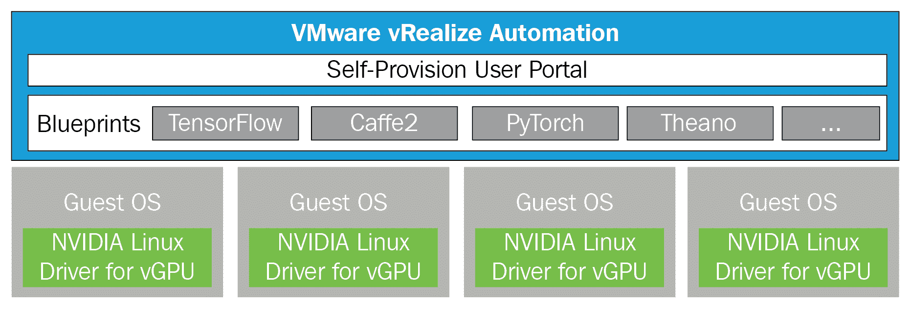
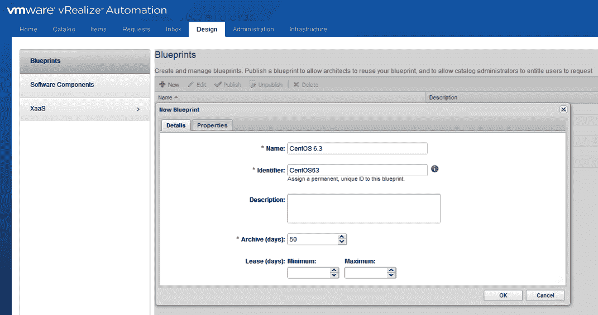
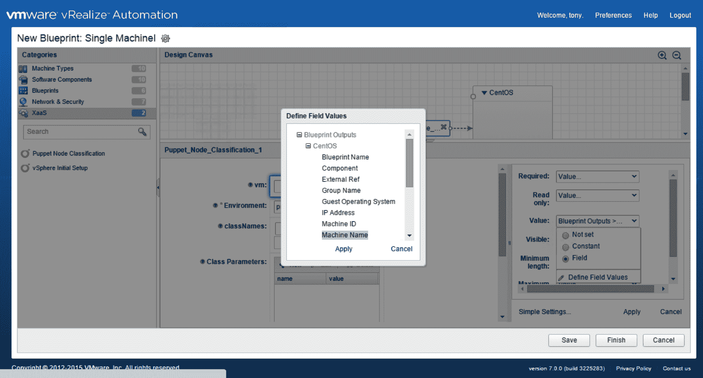
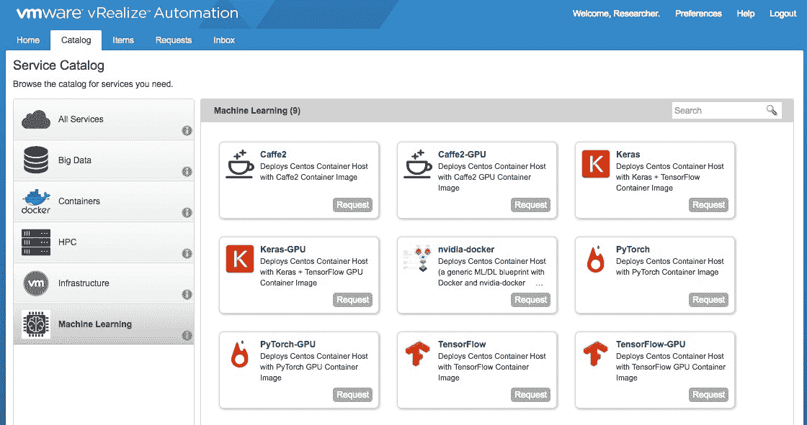
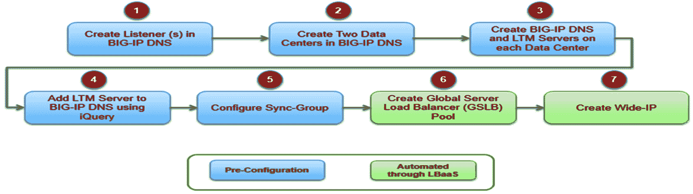
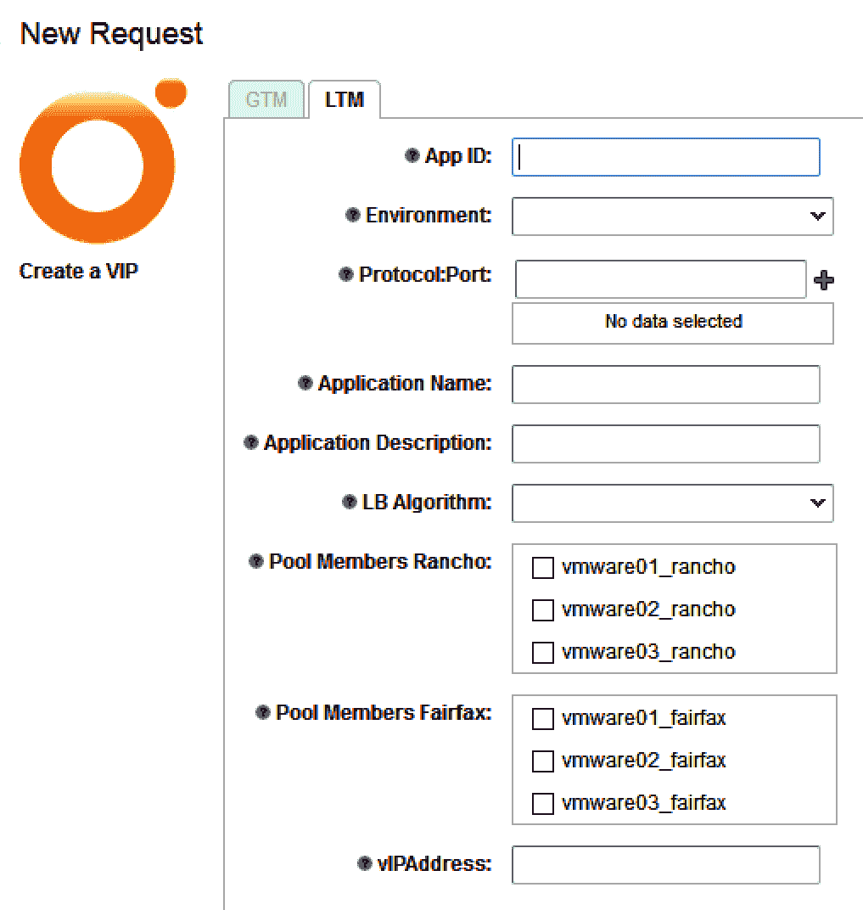

<title>ML as a Service in the Cloud</title>  

# 云计算中的 ML 即服务

本章将帮助您通过使用 vRealize Automation 了解**机器学习即服务** ( **MLaaS** )。ML 工作流程包括数据清理、模型选择、特征工程、模型训练和推理。ML 基础设施的生产开发和管理非常复杂，因为所有 ML 过程都需要修改其硬件和软件。

我们可以通过自动配置硬件资源，将它们与操作系统和应用程序包一起配置，并允许相关 IT 团队访问它们，来最大限度地减少这种复杂性。这种过程定制可以作为 MLaaS 引入。我们将了解 vRealize Automation 如何为 MLaaS 提供 MLaaS 使用案例。它还将有助于蓝图的设计和配置，以便使用 vRealize Automation 中的工作流来定义流程。我们还将了解**负载平衡器即服务** ( **LBaaS** )以及**网络即服务** ( **NaaS** )如何消除基于硬件的网络架构中的瓶颈。

我们将在本章中讨论以下主题:

*   适用于 MLaaS 及其体系结构的 VMware 方法
*   使用案例的 LBaaS
*   转变网络和安全服务

<title>Technical requirements</title>  

# 技术要求

您可以从[https://my.vmware.com/web/vmware/details?下载 VMware vRealize Orchestrator 设备 7.5.0download group = VR ova _ 750&product id = 742](https://my.vmware.com/web/vmware/details?downloadGroup=VROVA_750&productId=742)。

<title>MLaaS in a private cloud</title>  

# 私有云中的 MLaaS

ML 帮助计算机获得知识，而不需要大量的编程，并且通过改进它的开发来提高它在计算和数据方面的性能。

高性能计算和大数据应用利用虚拟化，因为它有助于同时支持不同的软件基础架构、创建资源池、一致的研究环境、多域数据安全性、问题诊断和弹性、有效的负载平衡以及 QoS。 **H** **高性能计算** ( **HPC** )和大数据融合在一起，因此 ML 可以作为来自不同云环境的服务来使用。这些应用程序有巨大的数据量，需要遵循数据合规性和安全策略。客户喜欢选择私有云来托管这些需要更多计算资源的海量数据 ML 应用程序。

我们可以使用 vRealize Automation 在私有云中配置 MLaaS，以便为设计/高级用户提供基于 GPU 的 ML 服务。工作流可以帮助构建基于 ML 的蓝图，满足设计用户的特定需求。

<title>VMware approach for MLaaS</title>  

# 面向 MLaaS 的 VMware 方法

我们有两个私有云选项来与 VMware 一起构建**基础架构即服务** ( **IaaS** ):

*   vRealize 自动化
*   集成 OpenStack

vRealize Automation 通过创建跨混合云托管的定制基础架构、工作负载和应用来帮助实现 IT 自动化。VMware Integrated OpenStack 是由 VMware 直接支持的 OpenStack 发行版，可帮助客户在可靠的 vSphere 引擎上构建企业级 OpenStack 云。它通过易于使用且独立于供应商的 OpenStack API 访问 VMware 环境来增强性能。本章将向您简要介绍如何使用 VMware vRealize Automation 创建 MLaaS。

<title>MLaaS using vRealize Automation and vGPU</title>  

# 使用 vRealize Automation 和 vGPU 的 MLaaS

我们可以配置 TensorFlow 服务，最终用户可以通过利用 vRealize Automation 构建的自助服务配置门户使用该服务。我们的 NVIDIA 卡安装了 vSphere、vRealize Automation 和 NVIDIA GRID 驱动程序，以支持 NVIDIA vGPU 和认证服务器上推荐的来宾操作系统。

应该在 ESXi 上配置 NVIDIA GRID vGPU Manager for ESXi 驱动程序，以供应 vGPU。物理 GPU 应该在 ESXi 中显示为 vGPU 设备，而不是默认的 vSGA 设备。

<title>NVIDIA vGPU configuration on vSphere ESXi</title>  

# vSphere ESXi 上的 NVIDIA vGPU 配置

我们可以构建一个 vRealize Automation 模板，供终端用户利用 TensorFlow 服务。下图中提到了创建和供应 TensorFlow 服务的工作流。使用 CentOS 虚拟机为最终用户构建和调配 TensorFlow 服务需要五个步骤:

1.  向虚拟机添加 NVIDIA GRID vGPU
2.  自定义来宾操作系统环境
3.  将虚拟机转换为模板，并创建自定义规范
4.  设计蓝图
5.  发布蓝图

在[第 1 章](30c0d68f-6ece-4c7b-86d1-a7a46183306e.xhtml)、【vSphere 6.7 的机器学习功能、中，我们了解到前三个步骤在 vCenter 控制台中配置，后两个步骤可通过 vRealize Automation 配置。下图中提到了最后两个步骤:

<title>Customizing the vRealize Automation blueprint </title>  

# 自定义 vRealize Automation 蓝图

首先，我们必须关闭安装了驱动程序/所有工具和 vGPU 的虚拟机。我们必须将其转换为模板，以便用作 vRealize Automation 的蓝图。一旦创建了模板，我们就可以使用定义的参数构建一个统一的定制蓝图。云管理员可以使用它为 TensorFlow 虚拟机创建克隆蓝图:

1.  以管理员身份登录 vSphere web client。
2.  右键单击虚拟机对象，然后选择模板|转换为模板。

3.  单击 Customization Specification Manager，并基于主页上的模板创建一个新的规范。
4.  创建一个软件堆栈，该堆栈定义了在创建虚拟机时要在蓝图中安装和配置的所有软件的软件生命周期。
5.  蓝图必须设计为利用 vRealize Automation 的自定义功能:

6.  捆绑软件堆栈，以设计如何在 vRealize Automation 中的蓝图虚拟机内安装、配置、启动、升级和卸载软件。我们可以将这个软件堆栈拖放到设计控制台上的特定容器变体上。
7.  通过创建软件组件来安装 TensorFlow。浏览设计选项卡，选择软件组件，然后选择新建。
8.  定义软件堆栈的名称和详细信息。我们必须在“概述”部分提及集装箱规格作为机器，然后单击“下一步”继续。
9.  创建一个将获取 TensorFlow GPU 容器映像的命令脚本，并定制`/etc/motd`文件，以便在最终用户登录 TensorFlow 虚拟机时向其显示说明。vRealize Automation 将安装容器映像，示例 bash 脚本类型可以根据所需的配置和安装步骤进行更改。

10.  设计蓝图。蓝图定义了使用 vRealize Automation 实施服务的流程。我们可以选择只能部署单个虚拟机的基本蓝图，以及包含软件堆栈、网络、安全性和存储策略的多虚拟机蓝图:

11.  创建一个只有 CentOS 虚拟机、TensorFlow 应用程序和关联虚拟网络的蓝图:浏览“设计”选项卡，选择“蓝图”，然后选择“新建”。
12.  在新蓝图部分提及名称和详细信息，以便生成唯一的 ID。
13.  通过从类别部分选择机器类型并将 ESXi 主机拖到设计控制台，将 ESXi 主机添加到 TensorFlow 蓝图。我们必须定义其他参数，并在“常规”选项卡中提及前缀，以用于蓝图构建的所有虚拟机名称，并允许用户自行调配最多四个 TensorFlow 虚拟机。
14.  访问“Machine Resources ”(机器资源)选项卡，获取要为该蓝图创建的虚拟机配置的虚拟 CPU、内存和存储的相关信息。
15.  创建虚拟机时，在“网络”选项卡下指定虚拟网络。

16.  从下拉菜单中选择所需的网络，并选择 DHCP 或静态。如果我们将一个直通 PCI 设备包含到一个虚拟机中，我们必须为此配置分配完整的内存预留。在克隆过程中，名为虚拟机内存预留的模板将无法保留此配置。为了做到这一点，我们必须添加特定的 VMware。Memory.Reservation 参数，通过浏览 Properties 选项卡定义内存大小。

我们可以通过机器学习类别中的 vRealize Automation 服务目录将此蓝图配置为服务，并指定用户使用它。编辑自定义属性选项卡，并遵循以下步骤:

1.  在蓝图中选择 TensorFlow-GPU
2.  点击发布:

在前面的屏幕截图中，我们可以从自助服务配置门户中看到各种带 GPU 和不带 GPU 的 ML/DL 服务，设计用户可以使用定义的资源。

<title>LBaaS overview</title>  

# LBaaS 概述

客户可以通过将 LBaaS 与 NSX 和 vRealize automation 引擎集成来使用它，这将创建一个包含应用程序要求的工作流。他们还可以将第三方工具与此服务集成，以实现服务的自动化部署和监控。通过使用 VMware 软件定义的方法，我们有许多选择来设计负载平衡器即服务。

负载平衡器必须卸载 SSL 以提高性能和输出。全局负载平衡器必须故障转移到多个数据中心之间的应用服务。它必须使用效率最高的负载平衡算法来提高应用程序服务的效率。它可以监控应用程序服务，并在发现任何威胁时立即发出警报。

VMware**v realize Orchestrator**(**vRO**)通过根据预定义的工作流自动化 F5 虚拟服务器部署来帮助我们构建 LBaaS，这些工作流包含步骤数、与 IP 地址、协议、端口、配置文件相关的虚拟服务器添加以及特定虚拟服务器的监控报告等参数。LBaaS 必须提供 HTTPS 即服务，并卸载 SSL。vRO 可以在 PowerShell 服务器上执行脚本，生成微软 CA 签名证书，并将其传输到 F5 服务器。它确保 SSL 与 F5 配置文件相关联。

<title>LBaaS design use cases</title>  

# LBaaS 设计用例

LBaaS 用例如下:

*   部署单站点负载平衡器
*   部署多站点负载平衡器
*   自定义负载平衡器
*   删除虚拟机

让我们详细看看使用案例:

*   **部署单站点负载均衡器** : 创建虚拟机，然后用特定的虚拟机定义负载均衡器。用户可以通过**自助服务门户** ( **SSP** )登录并请求虚拟服务器。按照设计，负载平衡器配置在一个站点。用户可以使用列表框和组合框以及预填充的数据来选择数据，以提供数据输入过程。vRealize 能够调用 vRO，进而执行预定义的工作流步骤，为用户选择的虚拟服务器组配置 F5 虚拟服务器。
    一旦 vRealize Automation 收到特定于应用的数据，它就可以根据工作流创建一个 F5 **本地流量管理器** ( **LTM** )虚拟服务器，该虚拟服务器具有 **VMware 基础架构规划器** ( **VIP** )和 DNS 名称:

| **步骤** | **演员** | **动作** |
| --- | --- | --- |
| 一 | 用户 |  |
| 2 | vRealize 自动化 |  |
| 3 | vRO |  |

*   **部署多站点负载均衡器** : 多站点负载均衡器配置不同于单站点负载均衡器，因为与 Big-IP DNS 关联的两个 F5 LTMs 配置在两个数据中心中。Big-IP DNS 不是强制性的，仅作为全局负载平衡器需要。其工作流程可帮助用户在两个站点之间选择不同的交通流量方法(即 50/50、80/20、60/40、40/60 和 20/80)。
    用户将在 vRealize Automation 申请表中输入数据。vRealize Automation 将调用 vRO 工作流来处理数据，创建两台 F5 虚拟服务器(每个站点一台)和一个 F5 Big-IP DNS 系统:

| **步骤** | **演员** | **动作** |
| --- | --- | --- |
| 一 | 用户 |  |
| 2 | vRealize 自动化 |  |
| 3 | vRO |  |

**修改负载平衡器** : 负载平衡器可以在 F5 上使用新虚拟机进行定制，然后我们可以对配置了负载平衡器的新虚拟机执行 XaaS 蓝图。如果用户在负载平衡器部署期间选择了不正确的负载平衡器算法，他们可以通过 XaaS 蓝图来修改它。
下表描述了该用例的操作:

**步骤**

**演员**

**动作**

一

用户

登录到 vRealize SS

请求 LBaaS 使用 XaaS 蓝图进行修改

*   提供修改现有负载平衡器所需的数据

2

| vRealize 自动化 | **Actor** | 接收并验证用户输入的数据 |
| --- | --- | --- |
| 调用 vRO 工作流来修改 F5 虚拟服务器 | 3 | vRO

1.  Logs in to vRealize SS
2.  修改 F5 虚拟服务器
3.  **取消配置虚拟机** : 我们可以通过 vRealize Automation 工作流取消配置 F5 虚拟服务器成员池中的任何成员虚拟机，否则 F5 将发布警报，提示虚拟机不可用。
    用户还可以使用修改后的 XaaS 工作流从 F5 虚拟服务器池中移除虚拟机。删除最后一个虚拟机后，F5 虚拟服务器成员池将自动完成:

 |
| **步骤** | **演员** | **动作**

1.  一
2.  用户

 |
| 3 | 登录到 vRealize SSP | 使用现有蓝图请求取消虚拟机资源调配

1.  2

 |

*   vRealize 自动化

| **Step** | 将 LBaaS XaaS 工作流作为虚拟机取消资源调配蓝图的一部分 | 3 |
| --- | --- | --- |
| LBaaS XaaS 工作流程 | User | 从虚拟机取消资源调配请求中接收所有必要的数据

1.  调用 vRO 工作流
2.  四

 |
| vRO | vRealize Automation | 创建 XaaS 工作流，以便在 F5 虚拟服务器成员池中添加/删除虚拟机

1.  **LBaaS 工作流**:为了提供一个多站点负载均衡器，在多站点设计中，每个站点部署两个相同的负载均衡器。还会创建 Big-IP DNS wide-IP，并要求用户输入其他信息以及主站点和流量比率:

 |
| **车道** | **动作** | **注释**

1.  vRO
2.  使用 REST API 的高级 F5 GTM 工作流

 |
| 4 | 点击 GTM 复选框，输入 BIG-IP DNS 参数，运行工作流以构建 Big-IP DNS 全局负载平衡器 |  |

*   

| 让我们检查一下上图中提到的所有功能。正如我们所知，前五个步骤已经在 LBaaS 工作流中讨论过，并且是执行 LBaaS 工作流所需要的。所有功能都是从参考角度给出的: | 创建一个监听器。从 Big-IP DNS 用户界面中，选择 DNS &#124; Delivery 为监听器参数提供值。需要在每个站点上创建一个侦听器。这是 LBaaS 工作流的先决条件。 | 创建数据中心。从 Big-IP DNS 用户界面中，选择 DNS &#124; GSLB &#124;数据中心&#124;数据中心列表&#124;新数据中心，以提供数据中心名称和其他参数。您需要对两个数据中心重复此步骤。这是 LBaaS 工作流的先决条件。 |
| 创建 Big-IP DNS 和 LTM 服务器。从 Big-IP DNS 用户界面中，选择 DNS &#124; GSLB &#124;服务器&#124;服务器列表&#124;新服务器，将 LTM 服务器添加到 Big-IP DNS。您需要对两个数据中心重复此步骤:主站点和辅助站点。这是 LBaaS 工作流的先决条件。 | 配置`(bigip_add utility)` iQuery: | 登录牧场科尔多瓦的 BIG-IP 域名系统。

1.  运行`# bigip_add <rc-ltm-ip>`命令，将 LTM 牧场添加到 GTM 中。

 |

BIG-IP DNS 和 ltm 之间成功通信后，BIG-IP DNS UI 中的状态将变为绿色。这是 LBaaS 工作流的先决条件。

配置同步组:

向 BIG-IP DNS 系统添加两个 DNS 服务器(`RC_DNS`和`FX_DNS`)。

创建一个同步组。

1.  使用`#gtm _add <fx-gtm-ip>`命令添加 Fairfield Annex BIG-IP GTM 设备。
2.  使用`#bigip_add <fx-ltm-ip>`命令添加费尔菲尔德附属 BIG-IP LTM 设备。这是 LBaaS 工作流的先决条件
3.  创建**全局服务器负载平衡器** ( **GSLB** )池:
4.  GSLB 池将作为 LBaaS 工作流的一部分创建。池名称将由用户提供，作为 XaaS 用户界面的一部分。
    1.  如果是手动创建的，请选择 GSLB |池。点击创建创建一个全局池。
    2.  创建宽 IP:
    3.  Wide-IP 将作为 LBaaS 工作流程的一部分创建。

5.  如果是手动创建的，请选择 GSLB | Wide IPs。单击创建创建一个 wide-IP。宽 IP 名称将由用户提供，作为 XaaS 用户界面的一部分。
    1.  IP 地址将通过 Infoblox 的 vRO IP 保留工作流分配给 wide-IP。
    2.  网络和安全服务面临的挑战
    3.  网络和安全一直是基础设施的瓶颈。
    4.  以下是刚性硬件定义的基础架构的主要难点:
6.  物理端口限制了布局和移动性
    1.  由于缺乏高级自动化功能，资源调配速度很慢，因为它不是为自动化而设计的
    2.  它是操作密集型的，并且依赖于硬件
7.  Create wide-IP:

<title>Challenges with network and security services </title>  

# 按需自动化网络供应和配置，支持快速应用部署

新的组织模式有助于新的云/SDDC 团队和现有职能团队(应用程序、服务器、网络和存储)之间的协作

支持新运营模式和面向服务方法的技能

*   了解新 IT 运营模式的概念，以及为什么网络和安全应该是其中的一部分。
*   **NaaS 模型的不同阶段**
*   审查 ITaaS 和 NaaS 运营模式

确定交付和运营 NaaS 所需的能力

从运营和组织的角度理解 NaaS 运营模式之旅

*   NaaS 运营模式
*   NaaS 是 ITaaS 运营模式的重要组成部分之一，可帮助客户实现特定的 IT(网络、安全等)成果。我们必须审查跨人员、流程和技术的当前网络和安全运营模式，以及如何使用 VMware 运营转型模式和框架提供 NaaS。
*   我们应该首先发现使用结构化方法管理和运营基于 NaaS 的服务所需的运营能力。
*   它侧重于三个主要领域:
*   主动运营管理

网络和安全服务供应

安全操作

*   Review the ITaaS and NaaS operating models
*   确定了关键运营能力，以及如何从当前的运营能力转变为运营网络虚拟化环境，从而为以下每个领域实现 NaaS 愿景:
*   定义愿景和战略

<title>The NaaS operating model</title>  

# 定义关键运营能力

评估运行准备情况

构建运营转型路线图和计划

根据 NaaS 的愿景开发和实施目标运营模式

*   VMware NaaS 转型研讨会服务为客户提供了关于如何利用网络虚拟化体系结构转向 NaaS 运营模式并最终转向 ITaaS 运营模式的运营和组织观点。
*   VMware 将 ITaaS 定义为一种新的交付和运营模式，它利用云技术，通过具有透明价格和既定服务级别的易消费 IT 服务来实现业务敏捷性和基于价值的选择。网络在实现 ITaaS 愿景方面发挥着关键作用。到目前为止，这种基于网络虚拟化和 SDDC/云的新兴网络架构一直被视为灵活性和速度的障碍，它使部署、管理和运营网络和安全性的新方法成为可能。
*   新的运营模式意味着从以设备为中心的运营模式到面向服务的运营模式(称为 NaaS)的范式转变。虽然网络虚拟化是技术的推动因素，但仅靠技术还不足以实现软件定义的网络(以及一般的 SDDC)的全部优势，还必须辅之以简化、集成和自动化的流程，以及利用新技能打破孤岛的跨职能组织。

这种范式转变实际上是一种运营转型，超越了影响运营和组织方面的技术方面。运营和组织方面不应该被认为是事后的想法，它们应该与技术规划和设计并行规划和设计。

NaaS 转型研讨会旨在支持客户的愿景和战略定义阶段，以及规划部署、管理和运营客户将要实施的网络虚拟化解决方案所需的运营和组织能力。

*   Defining the vision and strategy
*   Defining key operational capabilities
*   研讨会的目标是帮助客户了解 NaaS 运营模式，确定采用网络虚拟化对运营和组织的影响和挑战，以及充分利用新兴网络架构优势所需的功能。
*   研讨会服务还介绍了 VMware 运营转型模式和框架，以及它如何应用于推动运营和组织成熟度朝着 NaaS 运营模式发展。
*   NaaS 服务可分为两部分:

**NaaS 转型展望**:我们必须帮助客户清楚了解 VMware NaaS 运营模式、其作为 ITaaS 运营模式一部分的作用，以及采用此模式在 IT 成果方面的优势。我们还将讨论客户的运营战略、目标和目的、跨人员、流程和技术的当前网络和安全运营模式，以及如何使用 VMware 运营转型模式和框架将其转变为 NaaS。本课程面向网络和 IT 基础设施及运营团队，这些团队愿意探索网络虚拟化如何推动采用新的网络和安全运营模式，以使其更加敏捷、灵活、高效并与业务保持一致。

**NaaS 转型发现**:从流程角度出发，发现管理和运营 NaaS 所需的运营能力。端到端操作过程被分解成公共过程元素，并且最优地执行过程元素所需的操作能力被识别。发现活动侧重于三个主要领域:主动运营管理、网络和安全服务自动配置，以及生命周期管理和安全运营。对于每个领域，确定关键运营能力，并对如何从当前的运营能力发展和转变为运营支持 NaaS 愿景的网络虚拟化环境进行高级观察。

The new operating model implies a paradigm shift from a device-centric operating model to a service-oriented operating model called NaaS. Though network virtualization is the technology enabler, the technology alone is not enough to achieve the full benefits of software-defined networking (and SDDC in general) but it has to be complemented by streamlined, integrated, and automated processes and a cross-functional organization that breaks silos with new skills.

This paradigm shift is actually an operations transformation that goes beyond the technology aspects that impact operational and organizational aspects. The operational and organizational aspects shouldn't be considered as an afterthought—they should be planned and designed in parallel to the technology plan and design.

通过使用 NaaS 改造传统网络:

**传统网络挑战**:网络完全是关于端口及其与定制**专用集成电路**(**ASIC**)的性能、配置和功耗相关的能力。它还与网络运营的相关技能和运营支出成本相关。如果网络服务坚持使用特定的物理设备进行手动部署，将无法实现敏捷，这会增加配置更改和人为错误的风险。为每个设备接口编写脚本来协调自动化是不合理的，因为这会妨碍利用虚拟化和云模型的全部功能。

**网络是一种服务**:它一直是，并将继续是一种通过抽象、创建资源池和自动化网络提供的服务。网络服务从容量池中即时调配，与特定硬件分离，实现同等移动性，使用模板进行部署，并通过策略进行控制和管理。NaaS 运营模式使我们能够交付未来的敏捷数据中心、现代应用程序所需的服务速度和敏捷性，以及我们期望的运营支出和资本支出效率和成本节约。

使用 NSX 的 LBaaS 网络设计

VMware NSX 可以帮助我们构建基于虚拟网络自动部署的虚拟可扩展局域网，从而在不同的 web、应用和数据库服务器之间产生微分段。将提供一个**分布式逻辑路由器** ( **DLR** )来实现利用 NSX 逻辑交换机产生的网络之间的路由。由于 DLR 支持多达 1，000 个逻辑接口，因此可以将多个应用程序的逻辑交换机连接到 DLR，以利用其路由功能。

然后，可以使用 NSX 服务组合器功能(如安全组和安全策略)提供应用程序级别的分段。BIG-IP DNS 有助于通过本地智能维护应用冗余。部署在两个站点的两个 BIG-IP DNS 系统将作为一个单元工作，但负责主要和次要的权威域名服务。

*   用户根据定义的规则(如资源冗余、SLA、负载、地理位置或 QoS)从站点 A(主要)或站点 B(辅助)获得最有利的 IP 地址(即 LTM VIP)。
*   **NaaS transformation discovery**: Discover the operational capabilities required to manage and operate NaaS starting from a process perspective. The end-to-end operational processes are decomposed in common process elements and the operational capabilities required to optimally execute the process elements are identified. The discovery activity focuses on three main areas: proactive operations management, network and security services automated provisioning, and life cycle management and security operations. For each area, the key operational capabilities are identified and high-level observations on how to evolve and transform from the current operational capabilities to operating a network virtualization environment that enables the NaaS vision.

当 *A* 类型的查询被广泛使用时，BIG-IP DNS 协助各种查询。BIG-IP DNS 通过将域名和类型与 wide-IP 进行匹配来获取查询，然后选择一个池(GSLB 池)来验证响应。然后，它通过一个 IP 地址从池中获得一个虚拟服务器。GSLB 池将根据每个站点上的负载平衡策略和运行时的资源可用性，帮助选择跨两个站点的虚拟服务器。

BIG-IP DNS 高级设计

*   Wide-IP 是一个完全合格的域名 ( **FQDN** )来获取应用程序 URL，它是一个托管在一组 web 服务器上的 web 应用程序，比如 Apache 或 IIS。BIG-IP DNS 解析查询以定义宽 IP FQDN 与 GSLB 池中的虚拟服务器(VIP)的关联，该池在每个站点有两台虚拟服务器。
*   LTM 虚拟服务器和 BIG-IP DNS 虚拟服务器的负载平衡器池算法并不相同，LTM 虚拟服务器负载平衡器算法由用户从下拉字段中选择。BIG-IP DNS GSLB 池算法是根据用户输入定义的。LBaaS 设计选择了三种 GSLB 池算法:全局交付、比率和循环调度。

<title>LBaaS network design using NSX</title>  

# 定制 BIG-IP DNS 组件

BIG-IP DNS 配置包含以下组件:

**Listener** :这是 BIG-IP DNS 对象，负责运行和响应 DNS 查询。BIG-IP DNS 上的监听器配置应在执行 LBaaS 工作流之前进行定义。

**数据中心**:这是一个容器对象，托管应用交付组件的位置，每个站点有两个 LTM 虚拟服务器。在执行 LBaaS 工作流之前，应定义 BIG-IP DNS 上的数据中心配置。

**服务器**:这是一个承载应用组件的容器对象，可以是 BIG-IP DNS、LTM 服务器或物理服务器实例。在执行 LBaaS 工作流之前，应定义 BIG-IP DNS 上的服务器配置。

**虚拟服务器** : 虚拟服务器在物理服务器上配置了 IP 地址和服务端口。BIG-IP DNS 使用这些 IP 地址和服务端口来解析查询并选择合适的虚拟服务器。

**池**:这是在 BIG-IP DNS 系统**上配置的逻辑对象。虚拟服务器可以设置不同的池，以智能的方式解决查询。可以通过将所有相关的虚拟服务器分组来创建 GSLB 池。LBaaS 的池配置将使用 LBaaS 工作流按需定制。**

<title>BIG-IP DNS high-level design</title>  

# **Wide-IP** :这是一个逻辑容器，通过对 GSLB 池进行分组而被称为 FQDN，拥有一批所有相关的虚拟服务器。该对象是在 LBaaS 工作流中开发和定制的。通过利用 vRO 工作流，FQDN 的 IP 地址将在 Infoblox 上受到限制。

**摘要**:DNS 解析实用程序是一个试验广域 IP 配置的工具，可以下载到系统中。用户喜欢将该实用程序下载到 PowerShell 桌面，以检查 LBaaS 工作流对 wide-IP 配置的接受情况。`#dig @listener-ip wide-ip-name`命令将向监听器发布 DNS 查询，并显示来自 BIG-IP DNS 的响应。

BIG-IP DNS 负载平衡算法

<title>Customizing the BIG-IP DNS component</title>  

# 我们有三种基于 LBaaS 设计的负载均衡算法，我们将在这里进行探讨；它们应该有效地注册到 BIG-IP DNS GSLB 池。

全球可用性

*   这种负载平衡算法适用于主动/备用场景，BIG-IP DNS 将 DNS 名称解析请求分散到池中配置列表中的第一个可访问虚拟服务器，如果虚拟服务器不可访问，BIG-IP DNS 会将请求发布到配置列表中的下一个虚拟服务器。
*   当用户在 XaaS 表单中选择活动/备用时，vRO 工作流应该将 GSLB 池负载平衡算法定义为全局可用。它还确保第一个可到达的虚拟服务器将来自活动站点。
*   比例
*   LBaaS 工作流必须管理两个站点之间的流量。BIG-IP DNS 比率负载平衡算法可以帮助您完成这一使用案例。比率负载平衡方法通过利用加权循环法，在池中的虚拟服务器之间分散 DNS 名称解析请求。两个虚拟服务器的权重应该在 vRO 工作流中进行测量，并使用 REST APIs 进行注册。作为用户，我们可以从 XaaS 表单的下拉列表中选择比率。
*   一系列
*   LBaaS 工作流可以通过在两个站点保持活动状态来分发入站请求。可以为 GSLB 池配置 BIG-IP DNS 循环算法。BIG-IP DNS 域名解析请求可以按顺序分布在 GSLB 池的虚拟服务器之间，因此每个虚拟服务器将获得相似数量的请求。
*   LBaaS·LTM 设计

<title>The BIG-IP DNS load-balancing algorithm</title>  

# LBaaS 设计公司过去认为 BIG-IP 虚拟版安装在两个站点上。它还假设**设备服务集群** ( **DSC** )可用于每对具有主动/主动场景的 BIG-IP 设备。LBaaS 设计还理解同步故障切换设备配置保留在虚拟版本对上，以便在成员对之间同步设备配置，因此设备可以进行故障切换，反之亦然。

配置 BIG-IP LTM 对象

<title>Global availability</title>  

# 以下对象是通过使用 F5 LTM 中的 LBaaS 工作流自动配置的:

**节点**:表示网络中物理或虚拟实例的 IP 地址，如 web 服务器或应用服务器。单个节点可以有许多应用程序服务运行与池成员相关联的不同或相同种类的服务。

**池成员**:它是 IP 地址和端口号的联合，定义了驻留在节点上的应用服务。池成员由 BIG-IP 系统获得。

<title>Ratio</title>  

# **池**:负载平衡可以通过将一个或多个池成员分组并选择合适的池成员来实现。应该在具有特定池成员的池上配置负载平衡策略。

**虚拟服务器**:它是一种监听器，允许匹配由虚拟服务器 IP 和端口组成的流量类型，并根据负载平衡策略将它们转发给池成员。由于 F5 LTM 是一个默认拒绝系统，所有流量都会被阻止。虚拟服务器是连接客户机的理想单元。

<title>Round robin</title>  

# 设计 LTM 负载平衡方法

我们可以用 LTM 虚拟服务器流量操作配置许多负载平衡技术。用户可以从下拉框中选择以下负载平衡技术之一:

<title>The LBaaS LTM design</title>  

# 循环调度(默认)

最少连接

<title>Configuring BIG-IP LTM objects</title>  

# 加权最小连接数

比例

*   观察
*   动态比率
*   最少会话
*   最快的

<title>Designing the LTM load-balancing method</title>  

# 预言性的

“LTM”选项卡如下面的屏幕截图所示:

*   
*   Least Connections
*   Weighted Least Connections
*   设计 LTM 虚拟服务器
*   AWS 上的 VMware Cloud L2 网络扩展服务通过创建具有单个广播域的子网，使客户能够使用 SSL VPN 隧道(L2VPN)通过任何 IP 网络将内部网络扩展到 AWS 上的 VMware Cloud。这使客户能够在内部网络和基于 AWS 的 VMware 云之间移动工作负载，而无需更改 IP 地址。
*   该服务从介绍其产品和收集详细信息开始，以执行技术差距分析和建议，帮助客户为 L2 网络扩展准备环境。配置 AWS 环境上的 VMware 云，并执行扩展的网络功能测试。
*   本服务计划的目标是执行以下两项活动:
*   在 AWS 网络上的内部和 VMware 云之间建立 SSL 隧道(L2VPN)
*   使用 SSL 隧道在 AWS 网络上跨内部部署和 VMware 云扩展 L2 子网

摘要

我们可以从各种基于云的产品中进行选择，包括 SaaS 和 IaaS。**机器学习即服务** ( **MLaaS** )是 IT 行业的最新创新之一。ML 部署基本上需要大量的数据和能够从数据量中研究模式的高级用户。最大似然算法总是碰运气。MLaaS 将在人工智能的采用中发挥至关重要的作用，因为它将帮助开发者和企业获得 ML 特性的好处。它将有助于将人工智能嵌入商业应用程序，并使组织能够以更好的方式使用数据来实现其业务目标。

VMware SDDC 产品和方法可用于自动化各种服务，不仅适用于 VMware 提供的产品，甚至适用于第三方工具。借助 vRealize Orchestrator、vRealize Log Insight 和基于 vSphere hypervisor 的 NSX，使用 vRealize 产品调配和取消调配服务的整个流程可以实现自动化。

下一章，[第八章](54661ee3-fa2a-4640-b539-6a67f00669e9.xhtml)，*基于机器学习的规则引擎与 Skyline* ，将为您详细介绍 VMware Skyline。我们将从客户处收集信息，并使用 ML 作为智能规则引擎来监控，并通过阻止即将到来的威胁，为更快的解决方案提供主动支持。

<title>Designing the LTM virtual server</title>  

# Designing the LTM virtual server

VMware Cloud on the AWS L2 network extension service provides customers with the capability to extend the on-premises networks to VMware Cloud on AWS over any IP network using an SSL VPN tunnel (L2VPN) by creating subnets with a single broadcast domain. This enables customers to move workloads between an on-premises network and VMware Cloud on AWS without changing the IP address.

This service starts by introducing it's offering and collecting details to perform a technical gap analysis and recommendation, which helps the customer to prepare the environment for L2 network extension. VMware Cloud on the AWS environment is configured, and extended network functional testing is performed.

Objectives with this service initiative to perform below two activities:

*   Establishing an SSL tunnel (L2VPN) between on-premises and VMware Cloud on the AWS network
*   Extending the L2 subnets across on-premises and VMware Cloud on AWS networks using the SSL tunnel

<title>Summary</title>  

# Summary

We can choose from various kinds of cloud-based offerings, including SaaS and IaaS. **Machine Learning as a Service** (**MLaaS**) is one of the latest innovations in the IT industry. ML deployment basically needs huge amounts of data and advanced users who can investigate patterns from the data volumes. The ML algorithm is always a hit-and-miss scenario. MLaaS will play a crucial role in AI adoption as it'll help developers and businesses reap the benefits of ML features. It will assist in embedding AI in business apps and enable organizations to use data in better ways to achieve their business objectives.

VMware SDDC products and approaches can be utilized to automate various services, and not just for the VMware-offered products but even for third-party tools. The entire process of provisioning and de-provisioning services using vRealize products can be automated along with vRealize Orchestrator, vRealize Log Insight, and NSX on top of vSphere hypervisor.

The next chapter, [Chapter 8](54661ee3-fa2a-4640-b539-6a67f00669e9.xhtml), *Machine Learning-Based Rule Engine with Skyline*, will give you a detailed overview of VMware Skyline. We will collect information from a customer and use ML as an intelligent rule engine to monitor and provide proactive support for a faster resolution by preventing upcoming threats.