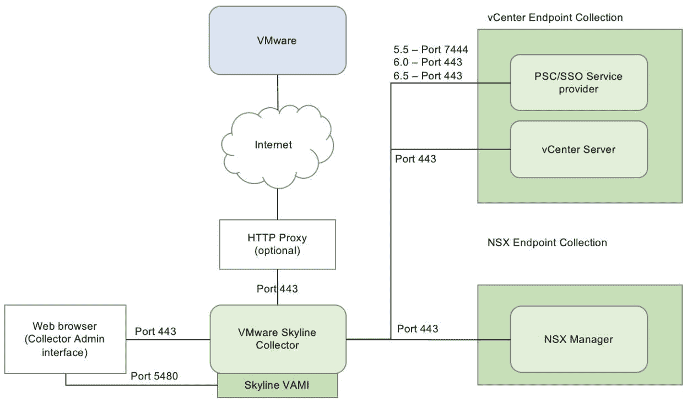
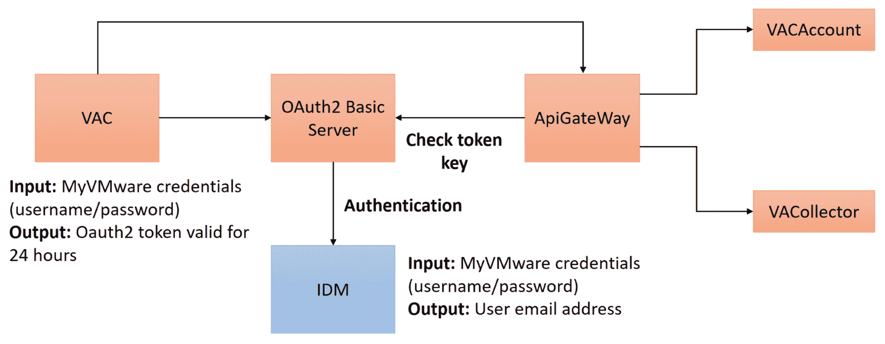
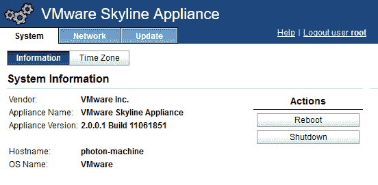
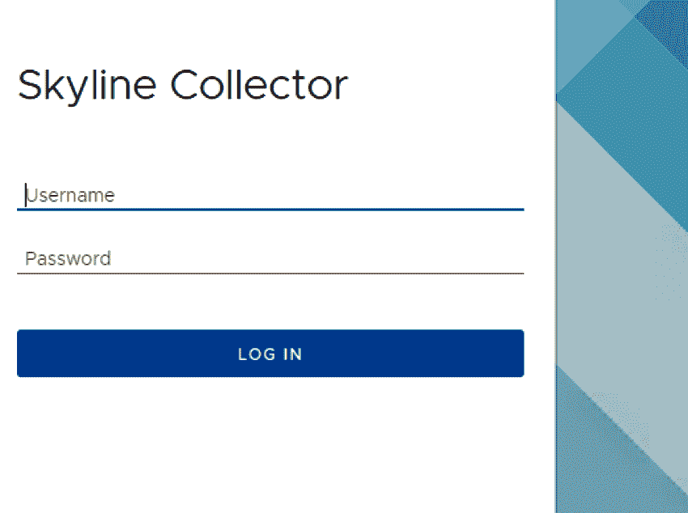
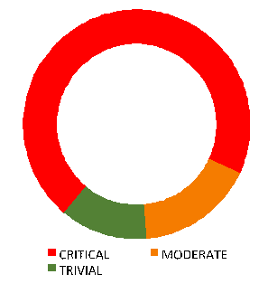
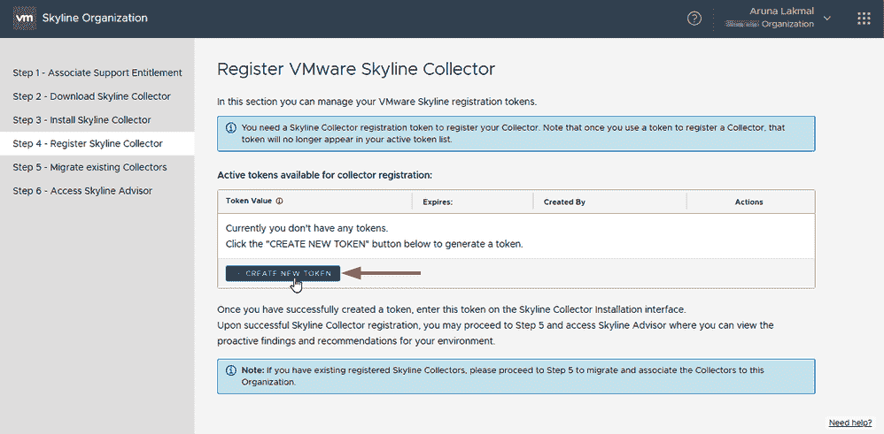
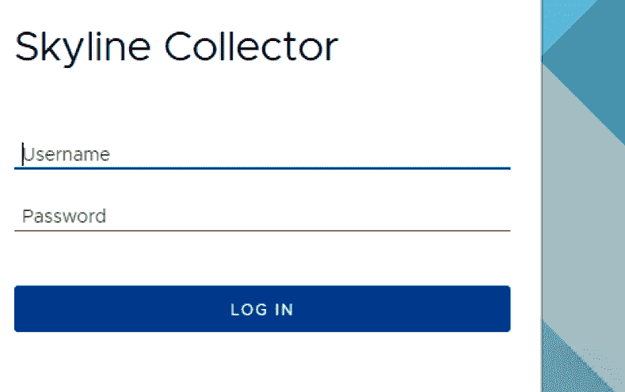

# 基于 ML 的 Skyline 规则引擎

本章将向您展示 VMware Skyline 如何从客户那里收集信息，并使用机器学习技术来创建智能规则引擎。这用于监控异常行为，然后发出一个红色标记来启用主动支持。

您将了解如何创建策略和规则来避免未来事故并最大限度地减少停机时间，还将了解 Skyline 工具的功能和配置。该工具能够自动监控和管理，以防止未知威胁的攻击。

在本章中，我们将讨论以下主题:

*   主动支持技术
*   天际线收集器概述
*   客户体验改善计划

# 技术要求

你可以从 https://my.vmware.com/web/vmware/details?下载 VMware Skyline Collector 2.0.0.2download group = sky line 10&product id = 790&rPId = 26633。

# 主动支持技术 VMware Skyline

VMware 全球服务构建了一个名为 Skyline 的智能支持引擎，该引擎收集客户特定的 VMware 产品相关数据，无需任何手动操作，也不会影响安全策略。它汇总并分析这些数据，以帮助支持团队快速解决问题，并采取措施防止即将出现的问题。

我们可以从部署和使用的角度全方位了解客户环境中的 VMware 产品。我们可以帮助客户，为他们提供更多信息，并允许他们与所有客户终端进行交互，以了解已知和未知问题的概况。Skyline 是在 VMware 基础架构上运行的任务关键型应用程序所必需的，该基础架构一年 365 天、一周 7 天、一天 24 小时都可用，并且经过高度优化，以实现其资源的最高性能。客户需要快速的解决方案和建议，以及所有支持数据分析，以便在客户环境中出现问题之前识别问题。Skyline 可以通过其智能支持系统满足所有这些要求，该系统可帮助支持工程师了解有关特定客户部署 VMware 产品的信息和数据。

如果我们像他们一样了解客户的环境，那么我们就能够提前针对未来可能发生的问题提出主动、规范和预测性的建议。它还将帮助支持团队处理他们的响应式支持案例，因为这些案例可以更快地得到解决，从而帮助客户更快地恢复业务。VMware Skyline 由三个技术组件(收集器、规则引擎和顾问)组成。全球服务具有创新的新支持能力。

VMware Skyline 的主动支持提供了许多优势，包括:

*   定制的支持体验将加深与客户的关系
*   了解客户使用情况将有助于通过客户成功计划采用应用程序和实现价值
*   更快、更高质量的支持解决方案
*   针对客户特定实施的最佳设计、配置和软件版本
*   先进的警告系统提高了可靠性
*   **支持请求** ( **SR** )偏差，以便在发现错误之前将其修复
*   解决问题的时间更短；也就是说，主动收集数据并提供解决方案，以便更快地进行诊断和解决问题
*   通过提供持续增值，保护**支持和订阅服务** ( **SnS** )预订中的大量资金
*   增加总交易规模和报酬，并向客户追加销售从生产支持到卓越服务的产品
*   改进的工具和技术
*   了解客户的环境

# 收藏家、观众和顾问

Skyline Collector 有助于近乎实时地收集有关变更和事件的详细信息，并且与客户环境相隔离，因为收集器中不会保存特定于客户的数据。VMware 支持团队根据需要访问 VMware Skyline 数据。

VMware Skyline Advisor 将是一个面向客户的自助式控制面板，将作为 SaaS 应用程序提供给客户。这将提供关于已识别警报的结果和建议操作的详细分析，以便客户可以配置智能补救。可以利用顾问并将其与查看器连接，以充分利用这一基于策略的分析引擎，该引擎由支持智能库、产品信息和逻辑组成，用于分析内部特定于客户的产品部署数据。这用于获取建议和详细报告，以便与客户共享。它与 VMware 经验证的设计、最佳实践和**知识库** ( **知识库**)文章完美集成，能够发送警报、识别故障和问题以及与推荐设计的任何偏差。然后，它会在支持工程师的帮助下启动补救流程，或者通过自助服务步骤解决故障和问题。Skyline 有一个收集器实例来收集与 VMware 产品相关的信息，并将其传输回 **VMware 分析云** ( **VAC** )基础架构。拥有有效产品支持的客户可以使用 Skyline Collector。它可以通过使用机器学习引擎来分析与特定信息(如故障)相关的变化、活动和模式。Skyline 策略引擎支持智能库，并保存产品信息和相关逻辑，以分析与 VMware 产品相关的客户内部数据流。如果客户没有遵循经过 VMware 验证的设计实践来为 VMware 产品进行配置或补丁管理，它会发送通知。所有发现的问题都被输入到分析引擎中，该引擎有数百个检测策略来帮助我们纠正多个客户的同类问题。

VMware Skyline 收集客户环境中有关 vSphere 和 NSX 的信息**。**它可以分析来自 vSphere 和 NSX 的遥测信息。我们计划在未来通过 vSAN 快速增加对更多 VMware 技术的支持，这是我们路线图中的下一步。最终，所有产品都将在 VMware Skyline 上提供。随着时间的推移，我们的洞察力会变得更好，增加更多预测性建议来减少停机时间和性能问题。随着规则引擎在范围和复杂性方面的发展，VMware Skyline 逐渐成熟，因此对客户的价值将继续增长。客户还可以从集合中添加和删除单个产品部署。Skyline 通过 VMware 托管访问计划免费提供给使用 vSphere 和 NSX 内部部署环境的高级支持客户(任务关键型、医疗关键型和业务关键型)。

# 发布策略

VMware 的计划是提供增量优势，扩大产品和解决方案认知范围，推动在开发中引入客户自助服务机会，并发布路线图。

这将有助于我们快速增加价值，因为我们推出了面向支持工程师的 VMware Skyline Viewer，可用于主动和被动支持客户。我们计划将 VMware Skyline Advisor workbench 提供给各种支持团队和产品工程团队，以便他们在我们扩展自动检测已知问题或建议的能力时，能够积极参与新规则和分析的创建。VMware Skyline 还将为未来以自助服务解决方案形式拥有生产支持和高级支持服务的客户提供额外的支持服务功能。

VMware Skyline 符合全球服务的整体愿景，因为VMware 努力为我们的客户提供同类最佳的支持，这体现在我们的高客户满意度和**净推介值** ( **NPS** )。随着竞争试图缩小这一差距，我们不断创新。VMware Skyline 是让我们在被动和主动支持方面都领先于竞争对手的创新之一。没有其他全栈软件公司提供这种水平的能力。VMware Skyline 专注于转变客户体验，而我们实现这一目标的关键方法是建立客户亲密度。如果我们知道并理解我们的客户在做什么，我们可以更容易地主动与他们接触，以便提供帮助和指导。

VMware Skyline 可以在非常大的客户环境中分阶段部署，并在初始部署期间部署。最好从单个 vCenter 收集信息，让客户就我们提供的价值向我们提供反馈，然后不断增加。我们将在现实世界中遇到一些在测试中永远不会遇到的大规模场景，我们可以通过一个经过测量的采用计划来识别这些场景。我们不推荐任何激进的企业软件初始投放方法。收集器将其自身连接到 vCenter。它也可以连接到多个 vCenter，但它始终可以基于每个 vCenter 进行拆分。非常大的多 vCenter 环境也需要多收集器设置。就网络流量而言，收集器应用装置还应该尽可能靠近 vCenter，以便不会对通过 WAN 发送数据造成压力。多个物理数据中心也会倾向于为每个位置设置多个收集器。数据在后端绑定在一起，所以我们知道它们都来自同一个客户。

在任何时间点，客户都可以选择退出**客户体验改善计划** ( **CEIP** )。客户可以从 operations 中注销 Skyline Collector，并从其环境中禁用所有 Skyline 功能。收集的数据将为客户身份信息保留 13 个月，为其他收集的数据保留长达 4 年。与产品相关的数据被保存并用于不同的流程，以及这些数据的端到端安全性。我们可以根据需要管理数据和取消身份识别。我们可以加密存储和移动中的数据，以及各种各样的物理安全措施，如防火墙、HIPS、IDS 等。我们还可以通过适当的审计为这些数据设计数据备份、灾难恢复和其他安全流程。VMware 负责管理这些收集的数据，以提供更好的技术支持和产品增强。

我们必须满足标准才能访问 VMware Skyline 产品使用数据。这包括完成产品使用数据政策的训练，确认您对如何使用这些数据的责任，并提交一份正式请求，以确定有关我们预期用途的其他详细信息。该流程将继续进行，由我们的经理审核，在特殊情况下，由数据托管人审核。如果您的请求获得批准，则您的访问权限可以在批准的系统上提供。我们计划将申请流程扩展到企业身份访问管理系统。这将是一个面向外部的网站，我们可以与客户分享的一部分。

客户可以通过以下简单步骤下载 Skyline Collector:

点击 https://my.vmware.com/web/vmware/details?的[download group = Skyline 10&product id = 790&rPId = 26633](https://my.vmware.com/web/vmware/details?downloadGroup=SKYLINE10&productId=790&rPId=26633)链接转到 VMware Skyline 下载网站:

使用您的凭据登录 Skyline Collector:

1.  一旦您接受了 Skyline 的隐私政策，您就可以开始安装收集器设备。
2.  用我的 VMware 凭据和授权帐户信息填写几个简单的配置网页，注册收集器以了解基本设置。
3.  天际线收集器概述

4.  Skyline Collector 以虚拟设备的形式提供，可以从客户的环境中收集有关 vSphere 和 NSX 的关键信息，以便支持团队能够提供更好的支持。

# 注册后，客户将获得以下好处:

更好地支持 CEIP

通过这种清晰的方法，客户的数据将会安全无虞

*   VMware 的 My VMware 客户门户将验证客户的有效性
*   我的 VMware 客户帐户将与 Skyline Collector 设备集成
*   在账户被认证之后，客户将有权使用 Skyline 服务
*   客户与 VMware 技术支持服务的直接联系改善了客户支持体验
*   Skyline Collector 的要求
*   安装 Skyline Collector 有一些系统先决条件，包括硬件和软件配置。

# 软件要求如下:

vCenter Server 6.0 或更高版本

ESXi 6.0 或更高版本

*   适用于 vSphere 的 NSX 6.1 或更高版本
*   我们可以在任何满足最低系统先决条件的系统上部署 Skyline Collector。以下是 Skyline Collector 虚拟设备的先决条件:
*   **vcpu 的数量**

**内存**

| **磁盘空间** | 2 | 8 GB |
| 87 GB(如果经过精简资源调配，最初为 1.1 GB) | 网络要求 | 外部网络连接要求如下: |

# **机器**

**连接到**

| **连接类型** | **协议** | **端口** | VMware Skyline 收集器 | `vcsa.vmware.com` |
| HTTPS | 传输控制协议 | `443` | VMware Skyline 收集器 | `vapp-updates.vmware.com` |
| HTTPS | 传输控制协议 | `443` | TCP/IP | 大多数客户希望清理数据，VMware 为客户提供了内部日志清理脚本。它从客户日志中删除 IP 地址、主机名等。相反，会添加一个占位符，并向客户提供一个密钥，以便将 IP 地址和主机名与日志中插入的名称相关联。该功能需要包含在 Skyline 本地设备中，以便不传输客户主机和 IP 数据。如果不是所有的数据需求都被清除，客户可能希望对不同的数据有一些控制(例如单选按钮或复选框)。下表总结了 Skyline 运行所需的所有端口和协议: |

**机器**

**与**的连接

| **连接类型** | **协议** | **端口** | VMware Skyline 收集器 | vCenter Server |
| HTTPS | 传输控制协议 | `443` | VMware Skyline 收集器 | **平台服务控制器** ( **PSC** )/ **单点登录** ( **SSO** )服务提供商 5.5 |
| HTTPS | 传输控制协议 | `7444` | VMware Skyline 收集器 | PSC/SSO 服务提供商 6.0 / 6.5 |
| HTTPS | 传输控制协议 | `443` | VMware Skyline 收集器 | NSX 经理 |
| HTTPS | 传输控制协议 | `443` | 网页浏览器 | Skyline 收集器管理界面 |
| HTTPS | 传输控制协议 | `443` | 网页浏览器 | skyline Collector**vCenter Server Appliance 管理接口** ( **VAMI** |
| HTTPS | 传输控制协议 | `5480` | TCP/IP | Skyline Collector 可以使用不同的网络连接来获取和传输相关数据。下图说明了端口的工作方式: |

Skyline 收集器用户权限

Skyline Collector 的管理帐户进行身份验证并登录 Skyline Collector 管理界面，然后注册应用程序以管理收集端点。管理员帐户的密码将在部署开始和收集器注册时定义。Skyline Collector 的根用户将用于在`https://<Skyline_Collector_Appliance_IP_Address>:5480`通过 VAMI 接口访问进行更新，此时该用户会收到一个挂起更新的通知。

# Skyline Collector 需要只读用户访问权限来连接到安装在客户场所的 VMware 产品(带有许可证信息)，以便它可以收集数据并将其绑定到各自的部署。

Skyline Collector's admin account authenticates and logs in to the Skyline Collector admin interface, and then it registers the application to manage collection endpoints. The admin account's password will be defined as the deployment starts and the collector is registered. Skyline Collector's root user will be used for updates with VAMI interface access at `https://<Skyline_Collector_Appliance_IP_Address>:5480`, when that user is notified of a pending update.

Skyline Collector needs read-only user access to connect to the VMware product (with license information) that's been installed on the customer premises, so that it can gather data and tie it to its respective deployment. 

在所有相关的 vCenter Server 实例中，它需要一个具有以下权限的用户帐户:

收集器可以与默认的 vCenter Server 集成，具有内置的只读访问权限

需要全局|许可权限

*   Skyline Collector 需要审计员的只读访问权限(或 API 的同类访问权限)才能为 NSX 管理器发送查询。下图显示了身份验证过程的工作原理:
*   

Skyline Collector 以**开放式虚拟化设备** ( **OVF** )格式提供，可以通过 vCenter 控制台的 OVF 部署向导进行安装。虚拟设备由预配置的虚拟机组成，其中预安装了来宾操作系统、应用程序和其他相关软件。安装设备后，我们可以通过 web 浏览器访问收集器管理界面，包括与设备关联的 IP 地址或主机名。

**集成客户端插件** : 客户端插件通过 vSphere Web Client 提供对收集器控制台和其他 vSphere 功能的访问。该插件还通过 vSphere Web Client 使用 Windows 会话身份验证来帮助安装其他虚拟设备。

**Skyline 收集器设备** : 我们可以启动收集器设备，然后访问管理界面并获取收集器设备的 IP 地址，以便浏览收集器控制台:

Skyline Collector 应在为特定客户环境配置之前注册。

VMware Skyline 收集器管理界面

启动 Skyline Collector 设备后，我们可以获得该设备的 IP 地址。这可以通过以下方式完成:

# 以管理员身份登录 vSphere Web Client

右键单击收集器虚拟设备并选择电源。然后，单击开机

1.  我们可以在虚拟设备启动后刷新 vSphere Web Client，在“Summary”选项卡中查看收集器设备的 IP 地址
2.  通过网络浏览器浏览至`https://<Collector_Appliance_IP_Address>`
3.  **Skyline 收集器管理界面**:由于收集器证书与环境的主机名/IP 地址不匹配，因此我们第一次连接时会出现浏览器安全警告。首先，我们必须使用默认用户名和密码登录:
4.  

我们默认的用户名是`admin`，密码也是`default`。密码应该至少有八个字符，包括一个大写字母、一个特殊字符、一个数字和一个小写字母。

输入管理员帐户的新密码后，单击“更改”。更改密码后，我们必须再次登录 Skyline Collector 管理界面；我们将得到一个您的密码已被成功更改！屏幕。

连接总是单向的，从 Skyline 收集器到 VAC 或 Photon OS 更新库服务。我们有两种向 Skyline Collector 设备返回数据的方法。这可以通过用于产品更新/补丁等的光子操作系统 VAMI 接口来完成，也可以通过清单更新来完成，在清单更新中，我们可以发布更新的清单，描述已经收集了哪些数据、收集的时间间隔等。设备会定期检查清单更新，当有更新时，它会下载新清单以利用其当前配置。收集器必须通过互联网将加密数据上传到 VMware。如果收集器需要 HTTP 代理才能访问互联网，请将开关切换到 Yes，并配置代理管理员所需的设置。单击测试连通性以验证网络的连通性，然后单击继续。

首次登录时不会注册收集器。配置数据收集需要注册收集器。首次登录时，注册向导将自动出现。

与我的 VMware 帐户链接

我们可以在注册 Skyline Collector 并初始化其流程的同时参与 CEIP。Skyline Collector 数据被广泛用于 CEIP 的支持和产品改进目的:

# 然后，选择同意并继续。Collector 注册要求有效的 My VMware 帐户与有效的 VMware 生产支持或高级服务支持权利相关联。输入您的 My VMware 帐户电子邮件、密码和授权帐户 ID。准备就绪后，选择链接帐户:

一旦收款人成功验证了您的凭证，请点击**继续**。如果客户在登录 My VMware 帐户时遇到问题，请前往[https://my.vmware.com](https://my.vmware.com)重置帐户凭据。您可以从“系统状态”页面的“概述”部分获取 Skyline 收集器和所有关联数据端点的运行状况报告。我们可以通过收集器部分的重启、停止或注销来管理收集器服务。它还将显示 Skyline 收集器 ID 和用于注册过程的 My VMware 用户。Skyline Collector ID 是每个 Skyline Collector 实例的特定标识符，用于识别传输回 VMware 的数据:

我们还可以自定义 Skyline Collector 名称，以便识别与 Skyline Collector 实例相关联的权利号和支持类型(生产/高级服务);这样，我们就可以联系到 VMware 全球支持服务团队。此授权帐户将 Skyline 收集器数据与其各自的支持请求相关联。这些授权帐户可以通过[https://my.vmware.com](https://my.vmware.com)访问和驱动，Skyline Collector 日志活动可以通过管理界面实时显示。

管理端点

Skyline Collector 与 vCenter Server 集成，每个 vCenter 实例将配置三个端点。这些与所有终端的运行状况一起显示在系统状态选项卡中:

# 以下数据是从 vCenter 端点收集的:

VC_CHANGES 端点获取 vCenter 拓扑和配置数据

VC_EVENTS 端点获取 vCenter 事件相关数据

*   VC_HOSTS 端点从 vCenter Server 获取 ESXi 事件数据
*   Skyline Collector 与 NSX 管理器集成，每个 NSX 管理器都配置有三个端点:
*   

以下是对每个端点的描述:

NSX 端点获取 NSX 产品和配置相关数据

NSX 遥测端点获取 NSX 操作参数，如 CPU、内存和磁盘

*   NSX 事件端点获取 NSX 事件相关数据
*   所有端点将显示与 Skyline Collector 集成的相关 VMware 产品实例，以及读取由特定收集端点检索的所有最近和过去数据的关联帐户。所有主动收集端点将显示为绿色，而有故障的被动端点将显示为红色。
*   配置 VMware Skyline 收集器管理界面

所有管理操作都可以通过单击 VMware Skyline Collector 管理界面顶部的“配置”来执行。

# Configuring VMware Skyline Collector admin interface

All administrative actions can be performed by clicking on Configuration at the top of the VMware Skyline Collector admin interface.

我们可以为数据收集添加/删除 vCenter Server，也可以为数据收集添加/删除 NSX 管理器。我们可以从同一个控制台配置自动升级并设置收集器的名称。该控制台还帮助配置活动目录身份验证，VSP here NSX 必须设置具有这些权限的帐户。

自动升级

VMware Skyline Collector 能够自动升级虚拟设备。自动升级将按照计划检查并安装更新。正如我们在 VMware Skyline Collector 的注册阶段提到的那样，我们可以收到电子邮件通知。选择每次自动升级后设置升级。

# 您可以转到“配置”来启用并保存我们已配置的自动升级设置:

您必须启用启用收集器自动升级选项，或者按照以下步骤使用 VAMI 将 Skyline 收集器设备更新到最新版本:

打开网络浏览器，浏览至`https://Skyline_Collector_IP_address:5480`:

1.  使用 root 用户名和密码登录:

2.  选择更新

选择**检查更新**

3.  如果有新的更新，选择**安装更新**
4.  CEIP
5.  参加 VMware CEIP 是必要的，也是 VMware Skyline 的一部分。作为 Skyline Collector 初始注册流程的一部分，您必须加入该计划。Skyline Collector 将与特定产品实例连接的相关产品端点的数据发送回 VMware，以便通过 CEIP 获得快速支持，该功能包括在初始配置期间或安装后的配置页面中。客户可以按照取消注册流程选择退出该计划。

# 收集的信息类型

VMware 产品/服务技术数据包括以下内容:

# **配置数据**:从设计和配置的角度来看，每个客户的基础架构都是独一无二的，即使使用相同的 VMware 产品和服务也是如此。根据他们的业务目标，他们有自己的使用案例，数据包含产品的版本、部署相关信息、设置以及连接到这些产品和服务的所有设备的数据日志等信息。

**功能相关数据**:客户以多种方式部署产品及其功能，使客户能够针对各自的客户领域实现具体的业务案例。

*   **性能数据**:这包括关于产品和服务的信息，以及所有相关的支持报告，例如性能和规模参数、用户界面的响应时间以及 API 调用相关信息。
*   **产品日志数据**:有产品从安装阶段到生产阶段的相关产品日志。这些日志包含系统活动的详细信息。这也将有助于实时生产数据的实际状态，不包括最终客户应用程序数据。
*   产品使用数据利用率
*   产品相关数据得到安全管理，并在适当的客户通知下用于某些内部场景。信息治理执行委员会也同意并接受它。产品相关数据可用于不同的目的，包括:

# **产品部署报告** : 我们可以将客户的实际产品采用情况与购买的产品许可相关联。客户经理只能评估此报告，以便与客户进行富有成效的讨论，并通过改进设计和设置以最佳方式使用购买的产品。

**SDDC 分析**:用于分析 SDDC 产品在客户群中的部署情况。这可用于识别符合特定 SDDC 部署标准的客户，并提供给 VMware 高级管理层。

*   **新 SDDC 产品发布的客户宣传调查**:用于识别部署了新 SDDC 产品发布的客户。执行管理层可以联系这些客户，要求他们对特定的客户调查做出回应。
*   **客户支持**:技术支持工程师可以使用 VMware 许可证密钥和派生的客户 ID 值来联系客户，以便帮助解决特定的支持请求，或者根据对产品使用数据的分析，主动就客户可能遇到的支持问题提供建议。
*   **客户资料和高级分析**:这用于分析客户与 VMware 的交互，以便创建客户资料和高级分析模型。这些必须仅供 VMware 管理层使用，并且需要经过产品使用数据受托人的批准。
*   **Customer support**: Technical support engineers may use a VMware license key and derived customer ID values to contact the customer in order to help resolve a specific support request or to proactively give advice on a support issue the customer may encounter, based on the analysis of the product usage data.
*   **Customer profiles and advanced analytics**: This is used to analyze customer interactions with VMware, in order to create customer profiles and advanced analytics models. These must only be made available to VMware management and need to be approved by the product usage data trustee. 

我们可以在产品文档中找到有关 VMware Skyline 部署体系结构的详细信息，尤其是在包含内部防火墙的客户环境中，这些防火墙对客户网络的不同部分进行分段，每个部分都包括 VMware 产品。这涵盖了客户网络内部以及与互联网/VAC 目的地之间通信的定向连接和网络端口要求。我们不记录收集器的北向和南向 API，它们用于与它们正在收集的产品和 VMware 云进行通信。我们用于将数据传输回 VAC 的 API 可以在 VAC confluence 页面上找到。

VMware Skyline 设计用于将数据单向传送回 VMware，它确保开发的体系结构允许对收集器和产品进行闭环反馈。从 Skyline 收集器到 VAC 或 Photon OS 更新库服务的连接始终是单向的。我们有两种向 Skyline 收集器设备提供返回数据的方法:

通过光子操作系统 VAMI 界面，获取产品更新/补丁等

通过清单更新，我们可以发布更新后的清单，其中描述了收集的数据、收集的时间间隔等等

*   设备会定期检查清单更新，当有更新时，它会下载新清单以利用其当前配置。该系统将寻找以识别**分布式防火墙** ( **DFW** )规则是否在主机或虚拟机级别有效，以便在出现连接问题时更好地进行故障排除。Skyline collector 使用安全协议通过 HTTPS 或 SSH 将收集的产品使用数据传输回 VMware。加密算法用于将 Skyline 收集器数据传输回 VMware。
*   Skyline 会随着时间的推移自动从产品 API 和客户库存中提取遥测信息，以便我们能够识别变化、模式和趋势。这将有助于我们缩短解决问题的时间，并在问题转化为服务可用性、性能或补丁/安全问题之前发现问题。Skyline 收集的数据存储在仅由 VMware 运营的美国 vac 中。协议和加密的快照与 Skyline 一起使用。上游加密通过 TLS 1.2 使用密码套件`TLS_RSA_WITH_AES_128_CBC_SHA256`完成。根据政策指南，收集的数据将在系统中的 VAC 和**操作总结报告** ( **OSRs** )中保留 13 个月。

The appliance checks for manifest updates periodically, and when an update is available, it pulls the new manifest down to utilize its current configurations. The system will look to identify whether the **distributed firewall** (**DFW**) rules are active at the host or the VM level, in order to better troubleshoot connectivity issues as they arise. Skyline collector uses secure protocols to transmit the collected product usage data over HTTPS or SSH, back to VMware. The encryption algorithm is used to transfer the Skyline Collector data back to VMware.

Skyline pulls telemetry information from the product APIs and customer's inventory automatically over time, so that we can identify changes, patterns, and trends. This will help us to lower the time to solve an issue and identify problems before they turn into service availability, performance, or patch/security issues. Data that's collected by Skyline is stored in US-based VACs that are only operated by VMware. Snapshots of the protocols and encryptions are used with Skyline. Upstream encryption is done via TLS 1.2, using the cipher suite `TLS_RSA_WITH_AES_128_CBC_SHA256`. The data that's collected is retained in the system in VAC and **Operational Summary Reports** (**OSRs**) for a period of 13 months, as per policy guidelines.

摘要

VMware Skyline 的突破是能够极大地改变我们对客户环境的可见性，这有许多好处。如果我们知道并理解我们的客户在做什么，我们可以更容易地主动与他们接触，以便提供帮助和指导。在提供支持时，我们可以开始关注核心问题，这样我们就不会仅仅依赖于客户描述的症状。当我们建立和加强这些关系时，这会增强我们的信心。VMware Skyline 的核心是专注于转变客户体验，而我们可以做到这一点的关键方法是建立客户亲密度。我们可以利用这些可靠的数据开始关注客户的核心问题，而不是仅仅依赖症状或客户的意见。

# 下一章，[第 9 章](ab83a378-8642-4264-9394-d0029ddae816.xhtml)，*使用 vRealize 码流进行开发操作*，将为您提供详细的架构设计，支持在 VMware vRealize Automation 私有云平台上部署应用和平台，使用 **c** **持续集成** ( **CI** )和**持续** **交付** ( **CD** )流程以及**体系结构设计建议将基于 VMware vRA/vRO/vRCS 产品参考体系结构和行业最佳实践，以及客户特定的要求和业务目标。**

VMware Skyline's breakthrough of being able to dramatically transform our visibility of the customer's environment has many benefits. If we know and understand what our customers are doing, we can more readily engage with them proactively, in order to provide assistance and guidance.​ We can start to focus on the core problems when supporting them, so that we do not only rely on the symptoms that our customers describe. This drives confidence as we build and strengthen those relationships.​ At the core of VMware Skyline is a focus on transforming the customer experience, and the key way that we can do so is by building customer intimacy.​ We can start to focus on the core issues of customers with these reliable data rather then relying only on the symptoms or, customer's inputs.

The next chapter, [Chapter 9](ab83a378-8642-4264-9394-d0029ddae816.xhtml), *DevOps with vRealize Code Stream*, will provide you with a detailed architectural design that enables the application and platform to be deployed on the VMware vRealize Automation private cloud platform, using **c****ontinuous integration** (**CI**) and **continuous** **delivery** (**CD**) processes, alongside **VMware vRealize Code Stream** (**vRCS**) and other industry standard products. The architectural design recommendations will be based on a VMware vRA/vRO/vRCS product reference architecture and industry best practices, along with customer-specific requirements and business goals.