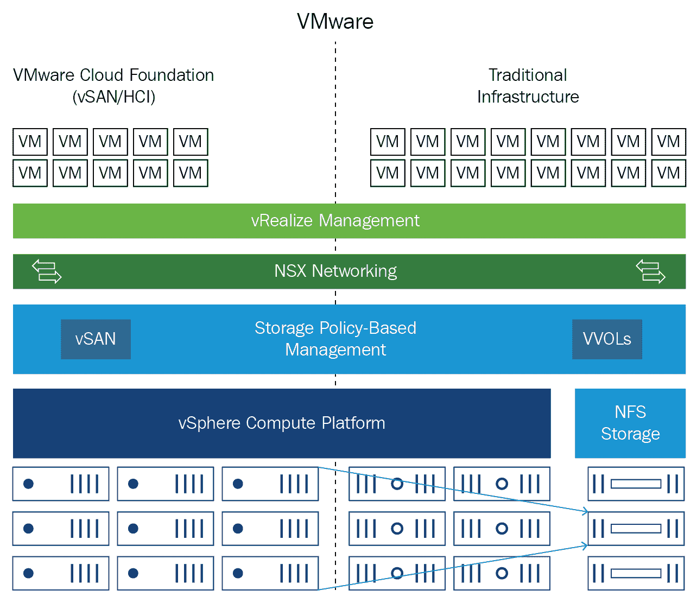
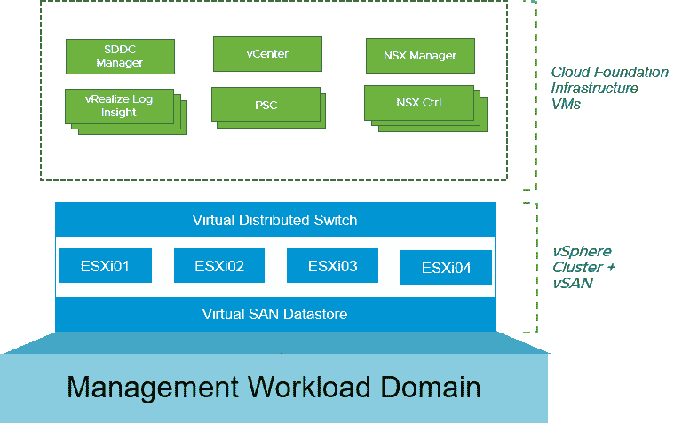

<title>Transforming VMware IT Operations Using ML</title>  

# 使用 ML 转变 VMware IT 运营

本章将帮助您了解 VMware 云计算自动化运营转型如何创建和实施一种生命周期方法来管理和交付基于 SDDC 的服务，从而帮助客户转型为服务提供商组织。该服务专注于优化组织和流程能力，以支持**软件定义的数据中心** ( **SDDC** )概念，从而实现以模块化形式交付的这些技术的全部功能，并通过技术、人员和流程的集成来交付真正的业务优势。

这种基于服务的方法面向以前使用过 VMware 基础架构，但可能没有使用过云自动化解决方案中的产品，或者没有交付基于 SDDC 的服务的经验的新老 VMware 客户。云自动化服务的运营转型通常是大型项目中的关键步骤。

在本章中，我们将了解如何从单一控制台管理云模型，并通过设计可扩展的基础架构从统一平台运行传统和新的云原生应用程序，在不同阶段转变数据中心运营。我们将利用 SDDC 方法中的 ML 技术来做到这一点。

在本章中，我们将讨论以下主题:

*   业务和运营挑战概述
*   转变 VMware 技术支持运营
*   虚拟数据中心

<title>Overview on business and operations challenges</title>  

# 业务和运营挑战概述

我们正努力推动应用管理转型，让 VMware 解决方案让生活变得更轻松。我们可能会遇到管理应用程序带来的许多问题，例如传统配置、复杂冗长的更新，以及必须管理应用程序交付的独立解决方案。VMware 采用不同的方法来管理应用程序。我们有办法将一个应用调配给多个桌面，从而节省大量时间和存储成本。我们可以在几秒钟内大规模交付应用。我们可以隔离应用程序，以消除应用程序冲突障碍。应用程序可以在任何设备和一个门户上使用。我们甚至可以改变您监控应用的方式，以获得更好的性能。

VMware 云计算运营和利益相关方希望分析与客户不同职能部门相关的内部私有云基础架构服务的使用情况，以确定当前趋势、未来需求和预算合规性。客户的云运营和利益相关方必须向客户收取消耗资源的费用。客户的利益相关方希望准确了解提供一个单位的 IaaS 资源所需的成本，更好地了解组成该资源的组件的负载成本，并提供运行 IaaS 所需的**总拥有成本** ( **TCO** )。客户获得了运行 IaaS 基础设施的总资本支出和运营支出，因此他们希望将这些成本分摊到构成服务的底层资源中。这些资源是 CPU、RAM、存储、操作系统、许可证和劳动力。客户的私有云运营团队、云管理员和指定的业务负责人必须深入了解如何向业务部门调配云基础架构，以及所调配资源(如 CPU、RAM 和存储)的已分配和未分配成本，从而做出基于成本的分析和决策。他们希望按资源类型分析基础架构的已分配和未分配成本。云管理员还希望确定是否有硬件可用于在现有基础架构上运行虚拟机，创建关于即将到期或支持终止的旧服务器组的报告，并创建自动报告以向利益相关方显示可能需要采购新的基础架构。

云运营和企业所有者希望分析与客户业务职能部门相关的内部私有云基础架构服务的使用情况，以确定当前趋势、未来需求和预算合规性。云运营团队希望向客户收取消耗资源的费用。他们希望向使用 vRA 软件的消费者提供私有云服务。私有云资源托管在客户的数据中心，这就是业务利益相关方要求最佳定价策略来衡量私有云资源在投资回报方面的商业价值的原因。

几乎每年都需要一个 IT 开发和运营团队来快速供应新的应用程序及其持续更新。这些应用程序拥有 Oracle 企业资源规划等全功能应用程序，以及与各种 SaaS 应用程序集成的 My VMware 门户等自主开发的应用程序。新软件实例的修改和测试很慢，并且手动过程很容易出错。开发团队通常需要一个应用程序开发实例和一个应用程序测试实例。他们还需要一周的时间来进行修正，即使是在应用程序部署完成并投入生产之后。这将使企业等待新的应用程序。

云管理员负责向客户提供特定服务的定义、设计、部署以及持续维护和支持，并与架构师和开发人员合作，最大限度地提高自动化水平，以支持服务并管理其性能。他还负责服务的服务管理交付。

<title>The challenges of not having  services owners for the operations team</title>  

# 运营团队没有服务所有者的挑战

我们缺乏单一的客户联系点，这就产生了不同的、单独的 IT 联系渠道，并可能影响客户体验。It 部门也无法提供全面的端到端服务愿景，导致客户对服务缺乏了解，无法满足客户的需求。这样，所有权分散在不同的人之间，在服务生命周期阶段之间或者在不同的涉众之间产生可能的分解，并且事情可能在不同的人之间发生或者产生重复。由于缺乏单一责任点，它还会产生相互指责的倾向，最终导致被动的管理，缺乏明确的承诺来发展服务和更广泛地推广云。它还缺乏全局视野，因为相同的服务在整个企业中可能以不同的方式交付，这使得标准化更难转变为服务的主动管理。

<title>A solution with service owners</title>  

# 服务所有者的解决方案

一旦任命了服务所有者，我们就有了明确的所有权和单一责任点。它将转变为一种一致的方法，通过促进 It 和客户之间的持续交付和服务持续改进的责任，使他们能够专注于服务的端到端质量、服务与客户需求和 IT 战略的一致性及其未来发展，从而在整个组织内一致地交付服务。它还将推动服务的主动管理和优化。

<title>Responsibilities of the service owner</title>  

# 服务所有者的责任

服务所有者负责整体服务定义和以下云服务产品的交付:

*   召集 IT 中所有必要的利益相关方，根据客户的新服务需求定义服务范围、目标、SLA 等
*   管理开发和增强工作，并与云服务架构师合作
*   由于服务的总体愿景，改善服务并扩大需求
*   持续监控和报告其云服务产品的服务水平实现情况
*   定义 KPI 和报告，这是管理实时服务所必需的
*   就服务表现与客户保持积极对话，以预测并采取必要的行动
*   负责服务台培训，根据他们对服务和客户目标的了解将新的或更改的服务投入生产
*   与支持团队紧密合作，定义最佳流程，并确保支持团队能够发挥作用
*   负责管理其服务的服务门户信息、参数和特征
*   确保客户在门户中拥有正确的信息，并且在出现新服务或变更时能够理解他们所接受的服务
*   在云服务产品的服务成本和财务模型方面提供帮助，他们负责服务成本
*   与合适的利益相关方(包括财务和客户)一起构建合适的成本模型，并教育客户如何推动客户的消费行为

<title>Transforming VMware technical support operations</title>  

# 转变 VMware 技术支持运营

VMware 正在 Workspace One 中创新智能功能，以获得客户洞察并增强安全性。身份管理将通过使用 ML 来监控用户的行为、软件性能和硬件信息。商业应用程序将带有人工智能功能。VMware Skyline 将有助于节省时间，因为收集产品数据、事件和条件以及识别问题将会更快，从而允许更快地**解决** ( **TTR** )。首先，影响最大的领域将是问题识别，以及支持工程师找到所报告问题的答案以及发送产品数据(用于支持调查)所需的时间。VMware Skyline 将确保遵循 **VMware 验证的设计** ( **VVDs** )。与卓越支持服务团队相关的所有支持工程师将负责了解 VMware Skyline 的价值和优势，并通过鼓励客户下载和安装收集器，将其纳入日常对话中，以推动客户的采用。随着查看器的推出，支持工程师在处理 VMware Skyline 客户的支持请求时也需要积极使用它。**支持客户工程师**(**SAE**)和**支持客户经理** ( **SAMs** )可以使用**运营总结报告** ( **OSR** )进行更有影响力的谈话，以增强和拓宽这些电话拜访的重点，从而更加主动。它将有助于总结已确定的更改以及修复已确定的任何潜在问题的建议。将汇编相关的**知识库** ( **KB** )文章、现场警报和安全问题，供客户审查。

客户成功控制面板将使用 VMware Skyline 数据来突出客户实现 VMware 产品和服务最大价值的机会。客户成功团队成员将负责了解 VMware Skyline 的价值和优势，并将其纳入日常对话中，以推动客户采用。客户成功团队可以利用 VMware Skyline 数据，因为它将提供产品使用数据，这些数据将成为客户健康评分的关键输入。它将提供已购买和已部署的数据(应用程序采用情况)，并通过服务团队可以使用的客户健康检查报告提供健康信息。该报告可供**云服务管理者****gers**(**CSMs**)作为更好的未来规划的输入。目前，该报告应该每季度运行一次。

Skyline 还将提供有关产品版本的关键信息，以确保升级前产品的兼容性。它还将提供硬件信息以显示与 VMware 产品的当前状态兼容性，以及提供 VMware 产品客户环境拓扑视图的站点概要信息。它是一种工具，允许顾问与客户接触并向他们提供建议，以便实施团队继续推动所有执行计划和这些建议的实施。

实施团队将能够在 VMware 分析云中查看客户发回的传入数据，但服务团队必须完成数据隐私培训，然后才能请求访问原始格式的数据。VMware Skyline 对客户来说应该是无缝的，并且不需要客户支付额外费用，因为它包含在客户的支持订阅中。VMware Skyline 上的客户将能够更快地解决他们的响应式支持案例，使他们能够更快地恢复业务。通过前瞻性、预测性和规范性建议，可以更快地解决被动支持问题，从而提高环境的整体性能和运行状况。这种整体环境健康状况将包括改进的可靠性、可伸缩性、配置、设计合规性和跨产品建议。

许多客户依靠与 VMware 授权服务提供商的合作关系来管理和支持他们的 VMware 部署，因此合作伙伴应包括在 VMware Skyline 计划中，以便在联合支持流程中利用这项技术。vSAN 支持分析构建可扩展的支持机制，以利用 CEIP 框架。收集的各种数据允许健康检查团队快速测试现有健康检查的改进以及新的准确性。vSAN 兼容性指南团队确定问题的常见原因，工程团队修复尚未报告或上报的问题。

支持团队可以通过减少总体解决时间和增强客户支持体验来快速解决问题。产品管理团队通过更好地了解客户如何配置他们的环境，能够更好地确定功能的优先级，而产品开发需要确定附加配置辅助功能的优先级，以解决最常见的配置问题。这是为具有生产支持的客户提供的，并且是为响应式支持目的而集成的。使用 SSL (HTTPS)协议从 vCenter Server 传输 vSAN CEIP 数据。这将利用为 vCenter Server 配置的代理。CEIP 数据被传送到`https://vcsa.vmware.com`。vSAN 目前使用 CEIP 数据进行配置、运行状况和性能遥测，因为独特的信息非常复杂。

<title>SDDC services</title>  

# SDDC 服务

SDDC 是通过一系列模块化服务组件实现的，这些组件逐步构建组织能力，以定义、设计、开发和发布云服务，并管理发布服务的服务目录。这些模块化服务可以单独交付，也可以作为一个连续模块的程序来交付，这些模块逐渐建立在彼此的成果之上。这些组件从需求识别开始，然后开发可重复的过程，并根据用例进行验证。

<title>Service catalog management</title>  

# 服务目录管理

该服务提高了为用户和企业自助服务发布云服务的可预测性，以便设计、管理和运营客户的云服务目录来满足可用性、服务发布和自助服务的业务要求。它还提供了针对云服务目录的商定服务使用案例的发布，以验证正确的运营流程，该流程通过以服务/租户为中心的角色、责任和技能集支持指南来支持目录的交付，从而允许客户管理和交付服务目录的功能。

<title>Service design, development, and release</title>  

# 服务设计、开发和发布

这通过将客户的云服务设计、开发和发布到基于云的基础架构中的流程，提高了高效构建和发布云服务的运营能力。对达成一致的服务用例进行实例化，以验证和细化服务设计、开发和发布流程。该流程是为基于 sprint 的敏捷服务开发而设计的，但是通过假设一个单一的开发周期，该流程仍然可以用于传统的瀑布式服务开发方法。

<title>Cloud business management operations</title>  

# 云业务管理运营

可以启用云业务管理服务，通过详细报告实现更好的 TCO 和 ROI，以快速做出业务决策，帮助云服务所有者找出整体端到端特定云服务的单位成本，包括以下内容:

*   云服务成本核算
*   定价
*   反馈报告

<title>Service definition and automation</title>  

# 服务定义和自动化

这是一种全面的方法，通过使用成熟的方法来发现、评估和开发服务自动化路线图，来定义客户的云服务自动化和配置路线图。该服务为客户提供了清晰可行的路线图，以在其云环境中实施自动化配置和部署功能。它提供了一个服务定义框架、流程和一组可重复使用的模板，以便为商定的服务使用情形全面定义客户的云服务，并提供了一个以服务/租户为中心的角色。

<title>NSX for vSphere</title>  

# vSphere 的 NSX

我们必须首先了解我们当前的部署和未来的期望，以及与不同地区公共云中托管的应用相关的所有信息(以及订阅详细信息)。我们应该收集有关虚拟网络/ **虚拟专用云** ( **虚拟专用云**)以及在每个 VPC/VNET 产生的所有虚拟机的信息。我们必须与 NSX 一起设计一个网络，用于 API 管理器等 PaaS 产品，以及一个本地环境，并且不能与公共云环境分开管理本地环境。我们必须建议在两种环境中托管应用程序、数据库和 web UIs，并通过专用的快速路由/直接连接连接到公共云。

**虚拟云网络** ( **VCN** )是数字时代的网络模型。这也是 VMware 对未来网络的愿景，使客户能够从边缘到边缘连接和保护应用程序和数据，无论他们位于何处。它允许客户将云网络结构作为软件定义的架构，用于连接分布式世界中的一切。它是一个无处不在的软件层，为客户提供用户、应用程序和数据之间交互的最大可见性和上下文。虚拟云网络是下一代网络服务消费技术的一个类别，越来越多地被 IT 部门采用，以提供有助于统一超分布式世界的数字结构。​

ESXi 主机已准备好用于 vSphere 的 NSX，具有以下值:

| **MTU** | 9000 |
| **段号** | 5000–7999 |
| **组队模式** | 源 MAC |
| **运输区** | 1-包含所有分类 |

NSX 正在从数据中心向边缘扩展，因为交付 VCN 需要非常强大的产品组合。NSX 数据中心是数据中心网络的最佳端到端一致平台。NSX 云正在将数据中心网络扩展到公共云，同时还提供 AWS 上的 VMC、原生 Azure 支持，以及通过**Pivotal Container Service**(**PKS**)提供的 containers/Kubernetes 支持。我们打算交付位于数据中心的控制、策略和自动化，并保持一致性，以交付给客户正在运行的云环境。​

NSX 混合连接将有助于实现应用和网络的混合和移动性。通过**v realize Network Insight**(**vRNI**)提供的强大网络洞察和发现功能，将推动跨物理、虚拟和云环境的安全性和网络优化。下图描绘了一个基于传统 VMware vSphere 的基础架构和一个基于**VMware Cloud Foundation**(**VCF**)(HCI/VSAN)的虚拟基础架构，两者都与 **NFS 存储**集成:

SDDC 的分层方法

如果我们使用 NSX 进行内部部署，我们可以使用交换机端口分析器、 **IP 流信息导出** ( **IPFIX** )内部部署，等等。在这里，我们可以使用 Traceflow 来了解数据包是如何流动的。一旦我们开始向云迁移，这就变得复杂了。这是因为有一个不是由客户操作的底层网络。主干网络属于 AWS 或 Azure，因此我们希望从这样的工具中获得跨所有云帐户和用户的端到端实时运营可见性。

每个公共云提供商都有不同的创建和实例化安全组的方式，管理所有这些会变得很困难。如今，客户在运营云，因为每个团队都创建了自己的 VNET，并且在部署之前会提前手动讨论该 VNET 的安全策略。每当有新的东西需要运行时，就会产生一个票证。他们通常会创建安全组，并将其附加到本地环境中的虚拟机。

每当创建新的虚拟机时，该虚拟机都会继承一系列基于与之相关联的安全组的限制。在下图中，我们可以看到一个基于 VSAN 的四节点集群如何配置了一个分布式交换机来托管所有管理虚拟机，如 **SDDC 管理器**、 **vCenter** 、 **NSX 管理器**、 **vRealize Log Insight** 设备、 **PSC** 控制器和 **NSX** 控制器:

工作负载集群

vRA 简化了使用该网络的应用程序部署流程，并包含带有定义的蓝图，允许自动调配新网络。NSX 是网络的未来，我们已经准备好帮助客户推进他们的数字化转型。我们有强大的技术让我们相信网络正在数字时代向前发展。VMware 正在解决围绕多云、多应用程序框架和现代应用程序结构的关键客户需求，并支持一致的网络和安全策略，以跟踪整个 IT 环境中的应用程序和数据。NSX 是网络的未来，我们很高兴能够帮助我们的客户推进他们的数字化转型。vCenter Server 和 Active Directory 服务器被添加到排除列表中，以避免任何人为错误，并且始终可用。为环境创建了以下安全组、策略和规则。

<title>Recommendations with priority</title>  

# 优先建议

ESXi 主机的物理配置规范列出了 ESXi 主机的特征，可在部署和测试期间按照 VMware 最佳实践使用。每个系统的配置和组装流程都是标准化的，所有组件都以相同的方式安装在每个 ESXi 主机上。标准化 ESXi 主机的整个物理配置对于提供易于管理和支持的基础架构至关重要，因为标准化消除了可变性。您可以跨所有群集成员部署具有相同配置的 ESXi 主机，包括相同的存储和网络配置。例如，一致的 PCI 卡插槽位置(尤其是对于网络控制器而言)对于物理 I/O 资源与虚拟 I/O 资源的准确对齐至关重要。相同的配置可确保虚拟机存储组件在存储和计算资源之间的平衡。以下是我们提到的建议，以及它们的优先级。

<title>Recommendations with priority 1</title>  

# 优先级别为 1 的建议

以下限制属于优先级别为 1 的建议:

*   在所有集群上启用 HA 准入控制。原因:随时保护正在运行的工作负载。
*   增加某些群集中的主机数量，以分析各种情况。原因:在发生硬件故障时，某些群集中没有足够的 ESXi 主机来运行所有现有的虚拟机。
*   使用资源池为进行虚拟机故障转移的**站点恢复管理器** ( **SRM** )预留资源，并确保在争用事件期间公平访问资源。原因:保护工作负载。

*   移除集群中虚拟机的 CPU 预留。原因:如果 ESXi 主机出现故障，虚拟机重启可能会失败。配置没有提供任何真正的好处。
*   确保**网络时间协议** ( **NTP** )配置正确，并且 NTP 服务器已在所有 ESXi 主机上启动。理由:在任何 IT 环境中，保持准确的计时都是至关重要的。
*   将基于物理网卡负载平衡算法的路由用于虚拟机网络。原因:最有效地利用可用的网络带宽。保护工作量。
*   研究 vSphere 5.1 强化指南中的所有 3 级建议。除非有不应用安全建议的特定原因，否则所有建议都应该应用。原因:安全性提高。
*   对于虚拟机具有 RDM 的特定情况，将虚拟机配置文件和`.vmdk`文件放在它们自己的数据存储上，并创建包含数据存储和 RDM 的 SRM 保护组。原因:确保这些特定虚拟机可以独立于其他虚拟机成功恢复。
*   全面了解虚拟机的恢复优先级和依赖关系，并根据需要配置 SRM。原因:增强信心，在发生灾难恢复时，虚拟机可以在预期的时间内正确恢复。服务通常有一个首选的启动顺序，在灾难恢复故障转移期间仍应遵循该顺序。
*   在 SRM 中，配置 1:1 数据存储区以在适当的时候保护组映射。原因:这解决了当前向 ESXi 主机添加新 LUN 以及在一致性组重新同步期间无法进行灾难恢复的问题。它将允许同时启动多个恢复组，还允许对特定服务进行测试或故障切换，而不是对每个受保护的虚拟机进行测试或故障切换。它增加了复杂性，但是为灾难恢复计划引入了大量的智能和意识。
*   预先确定在灾难恢复时将恢复的 50%白银虚拟机的列表。原因:这消除了灾难恢复事件中的混乱，并允许在受控条件下测试灾难恢复计划。
*   在恢复计划中引入基于服务的方法，以便可以根据需要测试和恢复各个服务。原因:这带来了一种面向服务的灾难恢复方法，并允许测试或故障转移特定服务，而不是每个受保护的虚拟机。它增加了复杂性，但是为灾难恢复计划引入了大量的智能和意识。

*   定期执行测试恢复，以增强灾难恢复按预期运行的信心。原因:增强信心，以便在发生灾难恢复时，可以在预期的时间内正确恢复虚拟机。
*   使用最佳实践建议配置所有虚拟化的 Microsoft SQL Server 群集。原因:确保集群的稳定性，并删除抑制性能的配置。

<title>Recommendations with priority 2</title>  

# 优先级别为 2 的建议

以下制约因素属于优先级别为 2 的建议:

*   CPU 利用率通常较低，因此请考虑增加每台 ESXi 主机的 RAM 数量。原因:这在不影响 CPU 性能的情况下提高了整合率。
*   确定是否有必要严格执行 1vCPU: 4 GB RAM RU 模型。原因:计算资源潜在浪费。可能会导致更高的整合率。
*   不要让完整备份作业与防病毒扫描重叠，以限制对 ESXi 主机 CPU 利用率的影响。原因:降低 ESXi 主机上的 CPU 负载要求，否则可能会导致虚拟机及其上运行的服务的性能下降。
*   将虚拟机的防病毒扫描分散到多个时间窗口，以限制对 ESXi 主机 CPU 利用率的影响。原因:降低 ESXi 主机上的 CPU 负载要求，否则可能会导致虚拟机及其上运行的服务的性能下降。
*   为每个 vCenter Server 配置 DRS 规则。原因:始终保护 vCenter Server 虚拟机。
*   为每个 vCenter Server 配置内存预留。原因:始终保护 vCenter Server 虚拟机。
*   为每个 vCenter Server 配置高可用性重启优先级。原因:始终保护 vCenter Server 虚拟机。
*   为所有 ESXi 主机确定并配置辅助 NTP 服务器。原因:当前实现包含单点故障。精确计时是任何 vSphere 实施的重要组成部分。
*   调查主机配置文件或 PowerShell 脚本的使用情况，以检查和修复 ESXi 主机配置中的差异。确定解决方案后，请定期检查以确保 ESXi 主机配置的一致性。原因:这确保了所有 ESXi 主机的标准构建和配置，从而简化了故障排除。

*   自动为故障转移虚拟机预留资源池，并自动共享资源池，以确保在争用期间公平共享群集资源。原因:保护工作负载。
*   修改 vCenter Server 设置，以便任务和事件在 180 天后被截断(无论多长时间的任务和事件都需要保留在虚拟应用装置中)。原因:这可以防止 SQL Server 数据库变得过大，而过大可能会导致性能问题。
*   对所有 ESXi 主机网络使用 **vSphere 分布式交换机** ( **VDS** )。原因:配置起来更容易更简单。跨所有 ESXi 主机提供更一致的网络配置。
*   修改惠普虚拟连接环境中的**虚拟网络接口卡** ( **虚拟网卡**)的网络带宽配置，以最大化网络带宽的整体使用。原因:为了更有效地利用所有可用的网络带宽。
*   配置多网卡 vMotion。原因:这通过更高效地利用网络带宽，实现了更快的 vMotion 事件。
*   识别出于许可目的需要特定 Mac 地址的所有虚拟机。将此 Mac 地址硬编码到虚拟机配置中。修改所有分布式端口组，以便将伪造传输和 MAC 地址更改设置为拒绝。原因:这提高了 vSphere 环境中的安全性。
*   配置 SSO 管理员组，并用适当的 Active Directory 帐户填充它们。原因:提高了安全性和可审核性。
*   在 vCenter Server 中删除`admin@system`域帐户的权限。原因:提高了安全性和可审核性。
*   修改 SSO 中的密码过期超时，以符合本地安全策略。原因:安全性提高。
*   将所有 ESXi 主机添加到 Active Directory。使用`ESX Admins`组(或者创建自己的组并根据需要进行配置),并使用 Active Directory 用户帐户进行填充。配置适当的 SSH 和 ESXi 外壳超时。修改所有 ESXi 主机的 root 密码，使其变得又长又复杂。将密码存放在安全的地方。培训员工使用他们的 Active Directory 帐户而不是 root 帐户连接到 ESXi 主机。原因:提高了安全性和可审核性。
*   创建数据存储集群并添加适当的数据存储。在禁用 I/O 测量的手动模式下配置存储 DRS 设置。原因:使虚拟机的放置变得不那么复杂。
*   在所有数据存储上启用存储 I/O 控制，并对所有虚拟机及其上运行的工作负载进行全面分析。为托管应用程序配置具有特定最佳实践的虚拟机。原因:为了保护工作负载。

*   确保在所有虚拟机上安装并运行最新版本的 VMware tools。原因:提高了性能、安全性、兼容性和可管理性。
*   识别所有配置了超过 4 GB RAM 的虚拟机，这些虚拟机运行的操作系统不支持使用超过 4 GB 的内存。原因:减少计算资源浪费。允许更高的整合率。
*   升级到较新版本的 vSphere。原因:利用了新的软件功能，提高了性能水平，并包括更新的硬件支持。
*   升级到**v realize Operations Manager**(**vROP**)6.7。原因:利用显著改进的架构。
*   确定和实施 vROP 仪表板的用例。原因:利用 vROP 中提供的大量指标来提供对 vSphere 平台的深入了解，并以易于使用的方式进行可视化。
*   确定如何将 vRealize Operations Manage 集成到整体监控解决方案中。原因:改善 vSphere 环境的监控。不再需要使用 vCenter Server 警报，其功能不如 vROP 中的功能。

<title>Recommendations with priority 3</title>  

# 优先级别为 3 的建议

以下制约因素属于优先级别为 3 的建议:

*   仅在绝对必要的情况下使用带有大量虚拟 CPU 的虚拟机。原因:当虚拟机大于**非一致内存访问** ( **NUMA** )边界时，会降低整合率，增加复杂性，并可能影响性能。
*   在物理主机出现故障时，使用高可用性重启优先级首先使重要的虚拟机恢复在线。原因:智能重启虚拟机通常是首选。
*   改变主机容量计算的方式。原因:现有方法复杂且容易出错，可以通过 vROP 实现自动化并以仪表板格式呈现。
*   减少每台 vCenter Server 的虚拟数据中心数量。原因:去除不必要的复杂性。
*   研究结合青铜和白银集群。理由:可以提供更高的整合率，同时降低环境的复杂性。

*   将服务器 OEM **vSphere 安装包** ( **VIB** )软件仓库添加到 vCenter Update Manager，以便可以通过 vCenter Update Manager 更新服务器 OEM 特定的软件和驱动程序。原因:这为 vCenter Update Manager 增加了额外的修补功能。
*   配置巨型帧以实现更快的 vMotion 事件。原因:实现更快、更高效的 vMotion 事件，从而使 ESXi 主机能够更快地撤离。
*   确保所有 ESXi 主机都获得正确许可。原因:这减少了在发生灾难恢复时许可主机的需要，并确保 ESXi 主机在需要时使用适当的配置连接到 vCenter Server。
*   配置 SSO 默认域配置功能，以允许更简单的登录。原因:简化了用户登录。
*   在 SSO 中删除作为身份源的本地操作系统。原因:提高了安全性和可审核性。
*   为模板和 iso 创建专用数据存储。原因:在虚拟机部署期间或访问 ISO 映像时，消除了潜在的性能问题。
*   消除已配置和正在运行的操作系统类型中的不匹配。原因:提高虚拟机和 VMware 工具之间的兼容性。

<title>Virtual data centers</title>  

# 虚拟数据中心

每台 vCenter Server 将有四个虚拟数据中心，与各种网络区域相关。虚拟数据中心结构是一个管理边界，但没有必要创建多个实例，因此不需要从权限角度完全隔离各种 vCenter 结构。四个虚拟数据中心仅用于放置 **vSphere 分布式交换机** ( **VDS** )。ESXi 主机和网络需要在新的单个虚拟数据中心中重新创建。这项活动只能通过广泛的研究和规划来进行。

以下是虚拟资源的配置建议:

*   **每台主机的虚拟机密度**:运营团队确保他们在不同的集群上运行所有需要的虚拟机，并且不会过量使用 RAM。它还可以决定使用每台主机高达 90%的可用 RAM 容量。他们在扩展虚拟机时使用资源单元的概念，每个 RU 相当于 1 个 vCPU 和 4 GB RAM。

*   **合并比率建议**:他们有一个关于 vCPU 与 pCPU 比率应低于 3:1 的一般规则。这一比率通常有助于限制 ESXi 主机上的 RU。该比率应由每个虚拟机的特定应用程序、虚拟机的 CPU 配置和利用率以及虚拟机所驻留的 ESXi 主机的性能指标的组合来决定。固结比和 vCPU:pCPU 比会受到以下参数的影响:
    *   **工作量感知** : 不是所有的工作量都是相等的；一个 4vCPU 虚拟机与另一个配置相同的 4vCPU 虚拟机的性能特征不同。
    *   **虚拟机配置** : 由于 RU 模型的限制，可能会产生不必要的额外开销，从而影响整体整合率。通常，最佳做法是只为虚拟机配置它们所需的资源，以减少具有多个 vCPU 的虚拟机的对称多处理的负面影响。由于 RU 型号是固定型号，因此 RAM 需求增加的虚拟机必须配置更多 vCPUs，即使这些并不需要。
    *   **ESXi 性能指标**:通常不建议采用固定的 CPU 整合率。相反，将前面的详细考虑事项与两个重要的 ESXi 主机指标结合起来，将有助于更好地理解潜在的整合率。
    *   **CPU ready%** :虚拟机准备运行但没有物理 CPU 可用于调度请求的时间百分比。通常应避免大于 10 的值。
    *   仪表盘和超级矩阵:vrop 可以用来创建强大的信息仪表盘。用例总是需要被识别如下:
        *   **容量规划仪表板** : RU 计算是通过从单个集群中获取数字，并使用电子表格来确定容量。创建一个仪表板，并使用公制/超公制来确定*满了*对客户来说是什么样子，这将减少所需的手动任务。这也可以与警报结合使用，以提供有关群集容量的主动警告。
        *   **RU 模型仪表板**:包含受 RU 模型影响的指标的仪表板；CPU 或内存利用不足，ESXi 主机指标受**s**s**对称多处理** ( **SMP** )影响。我们可以识别仪表板的用例，并根据需要创建它们。

vROPs 具有强大的警报引擎，可以基于动态或静态症状阈值。VMware 和已经为 vROPS 创建了解决方案适配器的第三方合作伙伴都发出了许多现成的警报。解决 vROPS 产生的初始数量的警报始终是一项任务，因为这是识别和修复已识别问题的机会，也是调整现有警报和症状和/或创建更适合环境的新症状和警报的机会。自定义组和配置文件可用于创建精细的监控方法。生产 SQL 集群的指标可能与非生产文件服务器有很大不同。使用自定义组和配置文件允许针对特定环境微调警报。这可以确定应该如何从 vSphere 环境中获得警报，并可以确定 vROPS 是否能够满足这些要求，如果可以，则根据需要进行配置。

<title>IaaS solution using vRealize Suite</title>  

# 使用 vRealize Suite 的 IaaS 解决方案

vRA 包括许多分组机制。管理员可以使用这些分组结构来组织计算结构，并创建业务级分组来划分服务、资源和用户。

如今，应用程序在全球混合 IT 基础架构中运行。我们必须将私有数据中心扩展到公共云和容器中。也可以通过连接物联网服务提供商来扩展。NSX 是一个面向所有先前技术或基础设施的统一网络和安全平台，支持客户连接、保护和运营服务，无论应用托管在何处。它有一个嵌入式安全引擎，通过微分段对网络进行分段，并对动态数据进行加密。

当我们谈到云时，我们基本上希望通过一个工具来配置和管理混合网络环境。我们不希望每个云管理系统都在一个孤岛中运行，内部部署也是如此，它应该不知道工作负载当前托管在哪里，以及未来将转移到哪里。我们应该能够将安全策略与工作负载一起移植，而不管它们托管在哪里。

一个开发者不希望我们在开发的道路上，但是我们不能把这些新技术留给开发者。运营团队必须帮助开发团队熟悉这些新工具。IT 管理员有责任设置防火墙，但不能确保存在任何安全漏洞。开发人员没有创建安全策略的任务，他们应该只使用 IT 管理员设计的安全组。我们的目标是拥有一个云配置解决方案，只需 Devops 团队做最少的工作。我们必须为应用程序提供一致的网络和安全性。

NSX 云是针对公共云的 NSX 功能的扩展，不是独立的产品。当我们为本地环境加载 NSX 时，我们已经拥有了 NSX 云所需的 90%。NSX 已经通过我们的逻辑网络构建对物理/内部网络进行了抽象。现在，它归结为通过为所有流量提供跨所有云的可见性，用 NSX 云复制相同的公共云。我们不能保护我们看不见的东西。一个新的虚拟机是由开发人员创建的，而 IT 管理员需要有一个控制面板和某种用户界面来让他们看到。我们必须设计跨内部和公共云的统一一致的安全策略，以便我们能够提供高级 L2/L3 网络功能，或者如果我们正在为内部网络创建逻辑拓扑，则可以有 API 将网络拓扑从内部迁移到云。管理/运营需要单一管理平台，因为这是我们希望为 NSX 云所做的核心工作。我们使用的部署流程或工作负载，如 Ansible 或我们为开发人员部署工作流使用的任何其他工具，不会因为我们使用 NSX 而改变。这是一个关键的价值主张，因为我们在 Azure 和 AWS 中看到了这些选项——就此而言，每一个公共云提供商都是如此。然而，它们有一系列的限制(尤其是在规模上)，这也是 NSX 与众不同的地方。显然，我们不想被一家公共云提供商的产品所束缚。

<title>Business-level administration and organizational grouping</title>  

# 业务级管理和组织分组

NSX 帮助客户配置多层安全。NSX 防火墙将提供主要安全性，由 NSX 管理的 AWS 安全组将提供第二层安全性。它是完全可配置的每个 VPC 与排除列表。它在测试开发中实现了 VM 部署/拆除的敏捷性，同时保持了生产 VPC 的结构完整性，从而实现了两全其美。

在有些环境中，我们会说 VPC 需要完全上船。在某些环境中，一些虚拟机有代理，一些没有代理是可以的。这是一个典型的测试和开发环境，或棕地环境，已经有虚拟机在运行，因此我们可能不想在所有虚拟机上安装代理，但这并不意味着可以隔离它们。

如果我们有生产 VPC，它有一个安装了代理的虚拟机在其中运行，但有人设法进入并安装了一个恶意虚拟机，那么就有可能检测到它并将其隔离。

我们有一个网关，它不断轮询 VPC/VNET 内部正在剥离的新资源。网关希望虚拟机中的代理来注册自己，如果没有，网关会将虚拟机移动到隔离安全组。我们可以通过使用默认的隔离策略设置来实现这一点。由于代理不在那里，NSX **公共云网关** ( **PCG** )无法在那里推行任何政策，这并不意味着 NSX 对虚拟机本身没有控制权。NSX 可以与云提供商沟通，将该虚拟机转移到隔离状态。这就像增加了另一个安全级别，如果我们有一个代理在运行，PCG 可以推送策略并管理虚拟机。如果代理不存在，PCG 可以将整个虚拟机移至隔离状态。因为 PCG 是执行这项任务的人，所以我们不必担心失去与本地系统的连接。PCG 被分配了**身份和访问管理** ( **IAM** )角色，这让它可以与云清单对话。这是有专利的，我们不需要管理员权限来做任何事情。我们可以为我们的客户提供一个云权限模板，他们可以在其中为 NSX 云中的每个组件分配角色和权限。PCG 将被赋予必要的角色，以便能够与云库存管理器对话，并将特定资源转移到隔离状态。

我们需要一个具有本地安全组的代理来获得无代理解决方案。如果 AWS、Azure 和 on-premises 都以相同的方式工作，那么我们就可以轻松地做到这一点。对于所有这些环境来说，一个单一的策略就足够了，但这并不是实际情况。我们可以在 Azure 中为每个虚拟机应用一个安全组，我们可以在 AWS 中嵌套五个安全组。我们无法在 Azure 中嵌套安全组，因为我们必须在 Azure 中为 VNET 编写第三个安全组。我们现在正在讨论安全组爆炸，但我们没有 NSX 云的任何这些问题。我们不能在 AWS 中使用*拒绝*规则，因为我们只能使用*允许*规则。如果我们说不允许特定实例的 web-web 层通信，它不会接受。不属于*允许*规则的任何内容都会被隐式拒绝。

我们尚未看到任何在代理上进行加密的强大用例，但我们确实有以下针对所有任务定义的基于角色的用户:

*   应管理 VPC(云管理员)
*   标记虚拟机(开发人员)
*   添加代理(开发人员)

但是，如果我们需要在公司内的不同组或部门之间提供额外的隔离，或者需要特定于租户的品牌，可以配置许多租户。每个租户都可以有专用的结构组，或者在必要时共享结构组资源。他们有两个或三个订阅，这些订阅中有许多虚拟机，而其他场景可能有多个订阅。VMware IT 的工作是管理 AWS 和 Azure 账户。这里的每个员工都有自己的 AWS/Azure 帐户，但 IT 部门有责任通过消除多个安全接触点来确保我们来自一个安全的界面。将安全组分配给 VPC 和 VNET 的问题在于，必须为每个 VPC/VNET 手动/静态地完成这一工作。作为一名 IT 管理员，我们有两种方法可以做到这一点:用户为工作负载创建 VPC，或者对它们施加安全限制。但是在这里，安全更像是事后的想法。如果我们正在寻找所有 VPC 和 VNETs 的安全组的合并，那么我们需要某种程度的抽象。如果我们想要一个跨 env 的安全组，那么我们需要一个像 NSX 这样的工具。我们可以在我们的 NSX-T 环境中使用 NSGroups 创建 NSX 安全策略。可以使用动态属性来创建 NSGroups，例如虚拟机名称、虚拟机位置、它在哪个 VNET 中运行、它在哪个区域运行等等。它也可以基于用户定义的自定义标签，例如应用程序在什么环境中运行等等。NSX 可以了解这些标签，将它们带回 NSX 管理器，并根据这些标签创建一些安全组，并将它们应用到 NSX 管理器。

Azure 还有其他限制，比如我们每个虚拟机只能有一个 NSG，但 NSX 云不会有任何这样的问题。我们可以和 NSX 有任何 NSG 超集。根据元数据和虚拟机名称，虚拟机可以是多个 SG 的一部分。该策略可以基于属性，而不是基于虚拟机或接口虚拟机，并且对可以堆叠的安全组数量没有限制。策略可以更加动态地定义，而不是静态地定义到特定的虚拟机、入站或出站访问列表等。

<title>vRA deployment</title>  

# vRA 部署

vRA 虚拟设备基于 SUSE Linux。该设备运行公共服务，如授权、批准、通知和组件注册服务，这允许发现分布式系统中的所有其他服务。该设备还有几个与**轻量级目录访问协议** ( **LDAP** )和 vCenter Orchestrator 接口的集成点。vRA 设备还包含一个嵌入式 Postgres 数据库。

服务目录包含所有已配置的服务和目录项目。这是一个通用目录，vRA 和其他解决方案(如 application director)可以使用它来填充项目和服务，如机器蓝图、应用服务和基于 vRealize Orchestrator 工作流的服务。最常见的服务由 vRA 虚拟设备托管。高级服务设计器(自定义服务设计器)将 vCenter Orchestrator 工作流作为目录项目公开，IaaS 组件是 Windows 组件，它处理与预留、蓝图、端点、工作流等相关的功能。以下配置将在 vRA 虚拟设备中启动:

*   组件注册服务，允许发现其他服务
*   认证-用户认证
*   授权-控制访问
*   批准-批准政策

<title>vRA appliance communication</title>  

# vRA 设备通信

以下是 vRealize 组件侦听的传入端口列表:

| **端口** | **礼宾** | **评论** |
| `22` | 传输控制协议（Transmission Control Protocol） | 嘘 |
| `80` | 传输控制协议（Transmission Control Protocol） | 重定向至`443` |
| `111` | TCP，UDP | 位置遥控(remote position control) |
| `443` | 传输控制协议（Transmission Control Protocol） | 访问 vRealize Automation 控制台和 API |
| `5480` | 传输控制协议（Transmission Control Protocol） | 访问 web 管理用户界面 |
| `5488`，`5489` | 传输控制协议（Transmission Control Protocol） | 管理 |
| `7444` | 传输控制协议（Transmission Control Protocol） | HTTPS 上空的 SSO |
| `8230`、`8280`、`8281` | 传输控制协议（Transmission Control Protocol） | 内部 vRealize Orchestrator 实例 |

下表显示了传出端口列表:

| **端口** | **协议** | **评论** |
| `25`，`587` | TCP，UDP | 用于发送通知电子邮件的 SMTP |
| `53` | TCP，UDP | 域名服务器(Domain Name Server) |
| `67`、`68`、`546`、`547` | TCP，UDP | 动态主机配置协议 |
| `80` | 传输控制协议（Transmission Control Protocol） | 可选用于获取更新 |
| `110`，`995` | TCP，UDP | 用于接收通知电子邮件的 POP |
| `143`，`993` | TCP，UDP | 接收通知电子邮件的 IMAP |
| `123` | TCP，UDP | NTP 直接同步，而不是使用主机时间 |
| `443` | 传输控制协议（Transmission Control Protocol） | HTTPS 的 IaaS 管理服务 |

IaaS 组件安装在 Windows 主机上，包括模型管理器、管理界面、执行管理器和数据库。随 vRA 安装的模型管理器包括 VMware 提供的所有默认模型。

模型是构成供应过程的元素的集合，包括数据模型、逻辑、事件定义、安全性以及**分布式执行管理器** ( **DEM** )如何与外部系统通信的规范。该数据库保存 vRA 环境中所有对象的配置、工作流和信息。

vRA 有一个 vRA 设备和一个 IaaS 组件。identity appliance 是基于 Linux 的虚拟设备，为 vRA 提供单点登录功能。vRA VA 也是基于 Linux 的，并提供用户界面和几种常见的服务。IaaS 组件安装在 Windows 主机上，包含管理服务、代理、模型管理器和执行管理器，用于处理和执行所请求的工作流。

<title>Services running as part of the identity service </title>  

# 作为身份服务的一部分运行的服务

以下是作为身份服务的一部分运行的服务:

*   **VMware 目录服务**:由于 VMware 目录服务是**单点登录** ( **SSO** )安装本身的一部分，因此该服务将始终与其他 SSO 服务运行在同一台机器上。没有将它作为远程服务运行的选项。`vmdir`是 VMware 目录服务。

*   **VMware KDC 服务**:这是一个 Kerberos KDC，可以帮助为 **VMware 认证中心** ( **VMCA** )服务生成票证，这是一个符合 x.509 的认证中心。VMCA 服务依赖它来正常运行。它还支持证书的颁发和撤销。身份管理服务负责传入的身份认证请求，并将它们路由到定义的目录或身份源。这是一个重要的步骤，以便全球支持服务知道身份验证期间的任何错误都将主要发生在这里。
*   **VMware 安全令牌服务**:****安全令牌服务** ( **STS** )负责在用户身份得到验证后发布安全令牌。该服务运行 Tomcat 服务器。该服务负责在用户通过身份验证后颁发令牌。与这些服务相关的所有日志都位于所识别设备的`/storage/log/vmware`目录中。**

 **用于与 vRA 组件通信的 API 接口与身份管理服务和**简单对象访问协议** ( **SOAP** )接口。vRA VA 和 IaaS 组件的接口都使用 HTTPS 的**表示状态转移** ( **REST** )。客户可以使用 API 构建自己的 vRA 接口。

通过使用预留策略创建不同的资源服务等级，资源预留可以进一步划分分配给特定组的资源。可以在每个租户内创建多个业务组。业务组可以共享来自同一个结构组的资源，或者利用不同的结构组来更好地隔离组之间的资源。如果我们需要在公司内的不同组或部门之间提供额外的隔离，或者需要特定于租户的品牌，那么可以配置许多租户。如果需要，每个租户可以有专用的结构组或共享的结构组资源。vRA 支持时区、欧洲日期格式和主要货币。

CF 的真正魅力在于它提供了围绕工作负载域的自动化，以及它如何使部署和扩展工作负载域变得非常容易。此外，通过删除工作负载域，可以非常轻松地回收容量。从配置物理服务器到配置交换机上的 VLAN 和 IP 地址，再到部署 vSphere、设置 vSAN 以及部署和配置 NSX，一切都已完成。工作负载域之间有一些共享的方面，例如，我们有一个管理域与两个用户定义的 VI 工作负载域一起运行。

在调配 VDI 工作负载域之前，最好在 SDDC 管理器中查看**虚拟桌面基础架构** ( **VDI** )的全局设置。这些设置允许管理员为台式机和 Horizon 服务器定义命名、规模和广告位置。NSX 还为 VDI 工作负载域提供微分段。已经自动创建了 26 个规则集来提供 VDI 组件的微细分。

<title>A complete solution with the desired result</title>  

# 具有预期结果的完整解决方案

运营团队在创建新虚拟机以及手动部署应用程序时需要付出大量努力，存在人为错误的风险。我们必须将整个基础架构迁移到私有云，并自动化端到端流程，以缩短运营团队的解决时间。

运营团队利用由 vRealize suite 支持的 VMware 内部私有云来提供 IaaS，包括计算、存储和网络资源，以便在这些服务的基础上交付所有应用程序。他们能够实现完全自动化的管理功能，以控制其应用程序开发生命周期流程。vRealize 解决方案具有可扩展性，可以利用自动化脚本来集成第三方工具，如负载平衡器、监控代理和代码存储库。

以前，开发人员需要为新的应用程序实体致电运营团队，并花费数周时间进行配置，但现在开发人员和测试人员可以通过自助服务门户定制他们的需求，从而获得新的或管理他们的应用程序环境。在对环境进行配置和测试之后，开发人员将获得一个应用程序实体的链接，其中包含登录详细信息和一个用于监控环境不同指标的 web 控制台。他们现在将在几个小时内获得全面运行和测试的服务。

<title>Summary</title>  

# 摘要

VMware 运营团队通过 vRA 为他们的所有应用程序及其配置创建了模板。这一自动化工具将端到端应用程序配置时间从几周缩短到 36 小时。我们能够在第一年后将整个周期缩短到 24 小时以内。自动化不仅有助于快速供应，还有助于在重复任务中保持一致性。我们可以使用自动化的预定义策略快速构建开发和测试实验室，从而避免任何人为错误。VMware 工程师现在可以将他们的时间用于新的开发，并帮助他们的运营团队变得更加敏捷。员工可以通过自助服务门户发起和执行他们的任务。这意味着应用程序可以在几个小时内完成配置，因此开发团队有更多的时间来开发新项目。这提高了 VMware 开发人员的效率，也降低了恶意代码和积压作业带来的安全风险。基于 VMware 私有云的 IaaS 还有助于每年节省资本支出和运营支出成本。VMware 能够最大限度地降低成本，并增强对最终客户的服务。他们更加关注产出和快速响应，以实现服务的敏捷性，从而改善客户体验。我们对我们的自动化交付流程很满意，但我们也可以通过使用混合云模型开发基于 VMware 软件定义的服务的其他流程。我们必须根据业务需求定期升级 IT 服务，从而在这个市场中保持竞争力。

在下一章[第 11 章](82337fc1-7032-4681-a158-b5cb87da3789.xhtml)、*利用物联网实现网络转型*中，我们将了解 VMware Pulse 物联网在医疗、研究、科学和零售等不同领域的使用案例。我们将通过转变物联网网络以及了解如何跨边缘设备管理和处理海量数据，了解从数据中心到云再到边缘设备的应用和数据利用。**