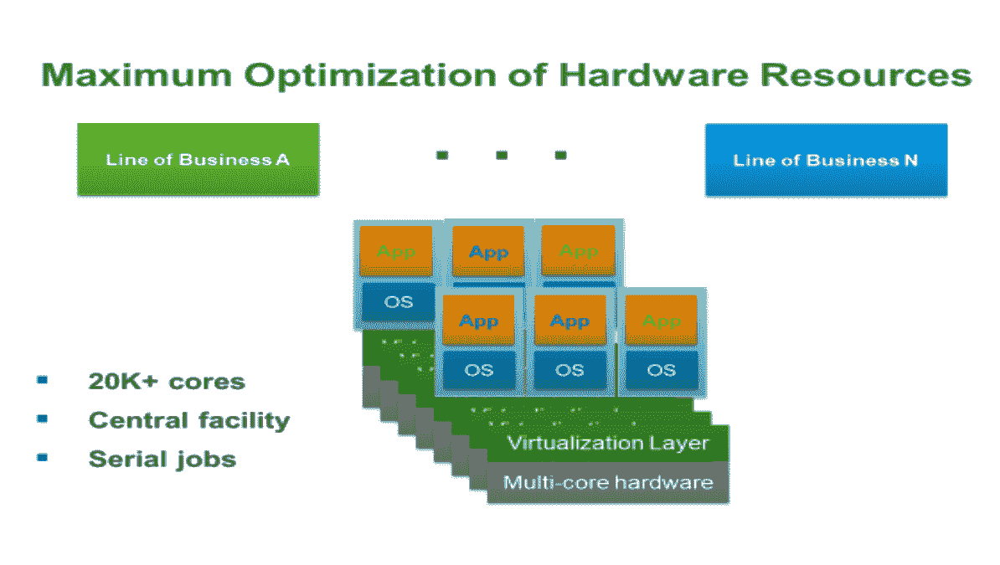
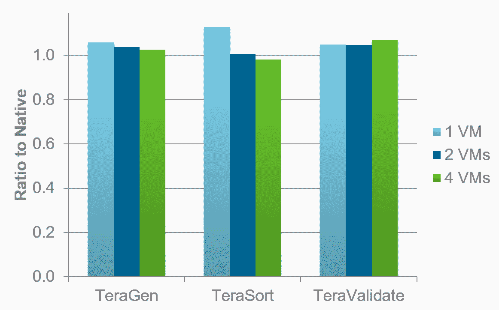
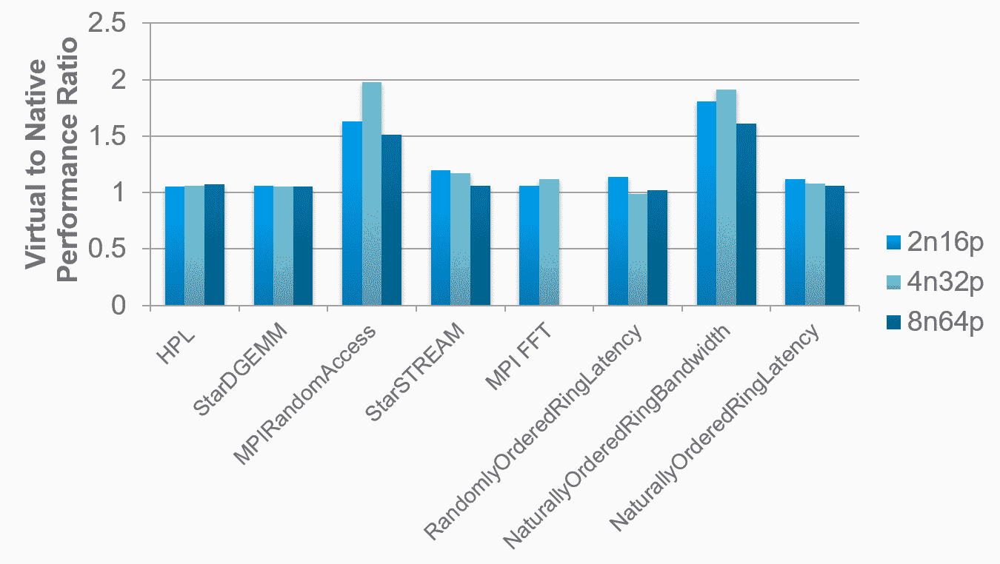
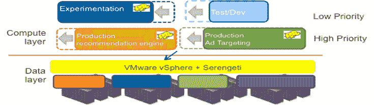
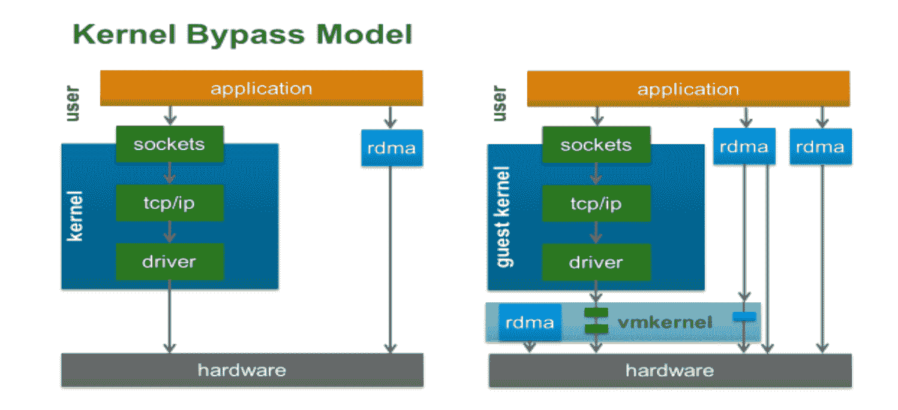

# 高性能计算

在本章中，我们将了解虚拟化的特定方面，这些方面可以提高**高性能计算** ( **HPC** )环境的工作效率。我们将重点关注 VMware vSphere 提供的功能，以及虚拟化如何提高科学工作效率。

我们将探索 vSphere 特性，如**单根 I/O 虚拟化** ( **SR-IOV** )、**远程直接内存访问** ( **RDMA** )和 vGPU，以构建并满足研究、计算、学术、科学和工程工作负载的要求。

本章涵盖以下主题:

*   虚拟化 HPC 应用
*   资源有保证的多租户

# 技术要求

您可以从[https://my . VMware . com/en/web/VMware/info/slug/data center _ cloud _ infra structure/VMware _ vSphere/6 _ 7](https://my.vmware.com/en/web/vmware/info/slug/datacenter_cloud_infrastructure/vmware_vsphere/6_7)下载 VSP here 横向扩展。

# 虚拟化 HPC 应用

本章介绍了我们在 VMware 支持 HPC 应用的工作。第一部分详细描述了客户在 HPC 环境中使用虚拟化的诸多价值。第二部分展示了如何在 HPC 环境中部署虚拟化的几个示例，第三部分讨论了性能的各个方面，从性能的一些核心方面开始，然后转向并行分布式 **M** **消息传递接口** ( **MPI** )应用的吞吐量应用和性能。它还包括几个技术出版物的链接，这些出版物将对那些考虑虚拟化其 HPC 工作负载的人有所帮助。

大多数 HPC 系统都是集群，即通过某种互连连接的计算节点的聚合，如以太网或**InfiniBand**(**IB**)。集群的规模从几个节点到数万个节点不等。HPC 集群的存在是为了运行 HPC 作业，这些作业在集群中的放置由**分布式资源管理器** ( **DRM** )处理。DRM 是一种中间件，能够让 HPC 用户以负载平衡的方式将他们的 HPC 作业加载到 HPC 集群上。

用户通常使用命令行界面来指定他们想要运行的一个或多个作业的特征，然后 DRM 将这些请求排队，并将作业调度到集群中负载最少、配置适当的节点上运行。有许多可用的 DRM，既有开源的也有商业的。例子包括 Grid Engine (Univa)、LSF (IBM)、Torque、**便携批处理系统** ( **PBS** )和 Slurm。DRM 也称为批处理调度程序。IB 是一种高带宽、低延迟的互连，通常用于 HPC 环境中，以提升代码/应用程序/作业的性能，并提高文件系统性能。IB 不是以太网，它不使用 TCP 或任何标准网络堆栈，目前只能通过虚拟机直接路径 I/O(直通模式)在虚拟环境中使用。

本章的目的不是解释虚拟化是如何工作的。x86 虚拟化自 20 世纪 90 年代末在斯坦福大学发明以来，一直采用纯粹基于软件的方法，目前英特尔和 AMD 都相继增加了对虚拟化的更多硬件支持，如 CPU、内存和 I/O。这些硬件增强功能，以及日益复杂的虚拟化软件，极大地提高了不断增长的工作负载的性能。这一点很重要，因为 HPC 人员经常听说，在某些情况下，当进行虚拟化时，HPC 应用程序的性能非常差，但在大多数情况下，运行非常好，甚至非常接近本机性能。大规模整合不适合 HPC 环境，因此可以在其他地方利用 HPC 的虚拟化价值。

现在，我们将了解由客户和我们自己的研究确定的 HPC 中虚拟化的使用案例。由于 HPC 包括如此广泛的工作负载和环境，其中一些会比其他的更能引起特定客户的共鸣。HPC 群集在所有主机上托管单个标准操作系统和应用程序堆栈，因为统一性使我们能够通过限制这些环境中不同使用情形的选项来轻松安排作业，例如需要从单个共享资源为多个用户组提供服务。因为这些传统的集群无法满足多个团队的需求，所以它们鼓励创建分散在整个组织中的专门的计算孤岛，这是低效且昂贵的。

# 资源有保证的多租户

客户希望利用现有的硬件和软件投资，如虚拟机管理程序或物理硬件，以及直接调配到公共云中的可行性。我们可以通过服务自动化解决方案来应对这种情况以及相关服务，该解决方案可以跨许多平台和许多云进行管理。该解决方案可以通过其自动化工具抽象核心任务，然后管理对这些自动化操作的访问和控制，从而自动化所有手动配置服务流程。只有当我们将自动化与策略联系起来时，它才非常有用。基于策略的控制和治理为我们提供了控制驱动云解决方案的自动化应用的能力。云服务门户和目录为终端用户提供了对授权服务的自助式按需访问。

所有现代 x86 系统都是**非统一内存访问** ( **NUMA** )系统，这意味着内存直接连接到系统中的各个 CPU 插槽。这意味着从本地套接字访问内存可以非常快，但访问连接到另一个套接字的内存会比较慢，因为请求和数据必须通过套接字之间的通信路径。这就是为什么它被称为非均匀内存访问。有时，工作负载在虚拟环境中的运行速度会比在裸机上快一点。对于吞吐量工作负载来说尤其如此，这通常是 NUMA 效应的结果。重点不是虚拟化比裸机运行得更快，而是对于某些 HPC 工作负载，虚拟化的性能几乎与裸机的性能相同。实时迁移可用于提高 HPC 环境的效率和灵活性。它也可以用来增加弹性。在传统的裸机 HPC 环境中，作业是静态放置的。考虑这样一个场景，其中必须调度应用程序 C，但是当前没有节点具有足够的资源来运行它。

在裸机环境中有两种选择:

*   应用程序 C 可以在队列中等待，直到应用程序 A 或 B 完成
*   可以取消应用程序 A 或 B，为应用程序 C 腾出空间

这两个选项都会降低群集的作业吞吐量。在终止作业的情况下，如果运行的应用程序是昂贵的独立软件供应商的应用程序，工作的损失会非常昂贵。虚拟环境中的解决方案是使用实时迁移来移动工作负载，以便为应用程序 c 腾出空间。这种方法主要适用于这些作业运行时间相对较长的环境。

让我们看看实时迁移的另一个用途:增加集群的整体吞吐量。考虑运行两个作业的裸机环境。当第三个作业启动时，它可能会消耗比用户预期更多的内存。这会将系统上的其他作业绑定到交换，从而对这些作业的整体性能产生负面影响。**动态资源调度器** ( **DRS** )可以解决虚拟环境中的这种情况:当第三个作业开始消耗所有可用内存时，DRS 可以将过载的虚拟机转移到另一台工作负载较少的机器上，并帮助作业继续以所需的性能运行。

缺乏对特定组或部门的有保证的资源使用是裸机环境集中化的另一个障碍。例如，如果不能保证大型计算岛的所有者在需要时至少能够访问这些资源，他们通常不愿意将他们的硬件资源捐赠给共享池。DRS 提供了满足这一需求的能力。快照可用于保存正在运行的虚拟机的状态，以防止硬件故障；当一台机器出现故障时，虚拟机将被恢复，应用程序将从拍摄快照的位置继续执行。

这在概念上类似于 HPC 中使用的检查点机制，只是我们不是从运行的操作系统中提取进程的状态(这通常会受到各种限制)，而是利用虚拟机和底层虚拟平台之间存在的清晰抽象。更高级的弹性方案(主动 HA 策略)将使用来自底层系统的遥测来预测即将到来的硬件故障，然后主动从有问题的主机迁移工作负载，以避免应用程序中断。例如，运行重要任务的系统上的风扇出现故障，或者检测到的软内存错误的比率增加，这可能表明即将出现硬内存错误的可能性增加。

虽然这种方法不太可能消除对检查点的需要，但它可以减少这种需要。较不频繁的检查点操作和从检查点进行较不频繁的恢复可以提高群集上的总体作业吞吐量。

# 关键用例—统一

一些管理员希望将他们的 HPC 工作视为另一个工作负载，并从部分虚拟和部分物理的基础架构转移到具有更大灵活性和可管理性的全虚拟基础架构。这是一个由我们的金融服务客户完成的简单部署示例。在这种情况下，中央 IT 部门创建了一个共享计算资源，可以将虚拟集群出租给组织内的不同业务部门。需要在一段时间内访问群集的组将收到一组虚拟机，而不是在某个指定时间段内使用的物理机。

对本组织的好处如下:

*   **业务线** ( **业务线**)在他们需要的时候获得他们需要的资源
*   集群和集群节点可以根据 lob 的应用程序需求进行调整(例如，大多数进程运行每个作业只消耗一个 CPU 它们是串行(不是并行)作业)
*   中央 IT 团队可以最大限度地利用可用硬件
*   硬件足够灵活，可以在各种作业之间共享，同时满足用户/工作负载之间的安全合规性
*   业务线之间的相对优先级可以通过策略强制实施，以确保(例如)有严格截止日期的组获得底层硬件资源的更高*公平份额*:

为了在 vSphere 上实现 HPC 应用程序的最佳性能，配置平台级(有时是来宾级)调整有一定的好处。需要进行调整，因为 HPC 应用程序(与大多数企业应用程序不同)对延迟非常敏感。敏感性可能存在于存储、网络或通信互连中。

虽然 VMware 的目标是为任何应用程序提供卓越的开箱即用性能，但 HPC 工作负载对我们来说相对较新，因此需要进行一些调整。我们已经开始通过配置 vCenter advanced 虚拟机参数来自动设置其中的一些可调参数，以便在虚拟机中运行延迟敏感型工作负载。随着时间的推移，这种自动调整将变得更加全面。

客户最初的**网络文件系统存储** ( **NFS** )基准测试体验直接指出了某些情况下的存储延迟。通过调整支持任何 NFS 数据传输的网络堆栈，我们能够直接提升应用性能，正如在裸机环境中看到的那样。默认情况下，通过在企业环境中高效地在网络上移动大量数据来调整网络吞吐量。这意味着，当数据包到达时，它们可能不会被立即处理。

通常，在系统唤醒并处理整批消息之前，允许累积少量消息。这减少了 CPU 的负载，但是降低了消息传递的速度。在数据到达是性能的一个控制因素的情况下，当每个数据包到达时，花费更多的 CPU 周期来迅速处理数据包更有意义。HPC 工作负载通常就是这种情况。虚拟和物理网络设备都应该关闭合并以进行此更改。

还有另一个级别的合并，它发生在更高级别的 **t** **传输控制协议** ( **TCP** )堆栈中(禁用**大型接收卸载** ( **LRO** )在来宾内)，它应该被关闭。我们评估了一些实验的结果，以了解虚拟化引入的额外内存抽象级别是否对 HPC 应用性能有任何影响。

特殊情况是很少或没有空间数据局部性的应用程序。这包括不能有效地使用缓存的应用程序，因为它们不以常规方式访问内存，例如随机访问基准。它不会产生影响，除非在特殊情况下，通过在客户操作系统中使用大页面可以大大降低开销。在这种特殊情况下，关闭 EPT(AMD 上的 RVI)并恢复到基于软件的页表方法也会有所帮助。由**国家安全局** ( **NSA** )创建，它甚至没有局部性，一个接一个地更新随机存储器位置。

这些工作负载会导致大量的**翻译后备缓冲区** ( **TLB** )未命中。因为这个页表缓存中的未命中很频繁，所以如果操作很慢，应用程序就会变慢。事实上，事实证明，由英特尔和 RVI 创建的 EPT 和 RVI 技术虽然是在硬件中实现的，但在处理 TLB 未命中时比由 VMware 开发的旧的*影子页表*方法要慢。使用更大的页面可以减少 TLB 未命中，因此在这些情况下关闭 EPT 或 RVI 会有所帮助。

事实是，EPT 和 RVI 在绝大多数情况下都表现得很好，但记住这个问题是值得的。**高性能 LINPACK** ( **HPL** )像其他 HPC 应用程序一样很好地使用缓存，并获得更好的性能。我们可以看到，这种应用程序类型的性能都非常出色。

对于运行需要大量线程的应用程序的 HPC 客户来说，这是我们虚拟化平台的一个重要方面，因此虚拟机将跨越主机内的多个 CPU 插槽。

ESXi 在许多版本中都支持 *NUMA 感知*，这意味着当它运行虚拟机时，它会小心地将执行线程放在托管虚拟机内存的同一个套接字上，以便所有内存访问都是本地的。当一个虚拟机跨两个套接字时，我们将相似的线程分布在两个套接字上，然后在本地套接字上分配内存以提供最佳性能。因此，即使虚拟机大到足以跨越多个套接字，它也看不到底层硬件的 NUMA。我们引入了 vNUMA 来使 NUMA 拓扑对来宾操作系统可见，然后来宾操作系统可以基于此信息进行自己的优化。从性能角度来看，这很重要。

# 高性能计算集群性能

**标准性能评估公司 OpenMP** ( **SPECOMP** )是一款众所周知的 HPC 性能指标评测套件，适用于在多个节点上运行的多线程应用。每个基准(例如 Swim)与 *x* 轴一起列出。

对于每个基准，有三对比较:一对用于 16-vCPU 虚拟机，一对用于 32-vCPU 虚拟机，一对用于 64-way 虚拟机。Default-16 表示不支持 vNUMA 的 16 路虚拟机的性能，vNUMA-16 表示相同的 16 路虚拟机，但启用了 vNUMA。

**与原生**的比率，越低越好:

图表显示运行时间，所以越低越好。从默认迁移到 vNUMA 时，我们可以看到几乎所有情况下的运行时间都有显著下降。对于需要宽虚拟机的 HPC 用户来说，这是一个非常重要的功能。这些图表显示了在 ESXi 上运行的各种生命科学工作负载的已发布性能结果。

他们表明，这些以吞吐量为导向的应用程序在虚拟化时的运行代价通常低于 5%。来自客户的最新报告表明，这一整类应用(吞吐量)不仅包括生命科学，还包括金融服务、**电子设计自动化** ( **EDA** )芯片设计人员和数字内容创作(电影渲染等)，运行时性能下降不到 5%。要实现这些结果，需要进行平台调整，而不是应用程序调整。

我们有一位 EDA(芯片设计)客户报告的结果，他首先在裸机 Linux 节点上运行了一个 EDA 作业的单个实例。然后，他们在 ESXi 上运行相同的 Linux 和相同的作业，并比较结果。他们看到了 6%的性能下降。我们相信，通过额外的平台调整，这个数字会更低。

然后，他们运行第二个测试，在一个 Linux 实例中运行四个应用程序实例，而四个虚拟机运行相同的作业。因此，我们在两种情况下运行相同的工作负载。在这种配置中，他们发现虚拟作业比裸机作业快完成 2%。

HPCC 性能比率(越低越好):

这种加速通常是由 NUMA 效应和操作系统调度效应造成的。Linux 实例必须在四个作业实例之间进行资源平衡，它还必须处理与多插槽系统相关的 NUMA 问题。

虚拟化将帮助我们获得以下优势:

*   每个 Linux 实例必须只处理一个作业
*   由于 ESXi 调度程序的 NUMA 感知能力，每个虚拟机都将被调度到一个套接字上，因此没有一个 Linux 实例需要承受处理 NUMA 问题的潜在低效率

我们不必担心多个 Linux 实例和虚拟机消耗更多内存:**透明页面共享** ( **TPS** )可以缓解这种情况，因为虚拟机管理程序会找到虚拟机之间的公共页面，并在可能的情况下共享它们。

# 标准的 Hadoop 架构

让我们了解一个标准的 Hadoop 架构:

*   **Hadoop 文件系统** ( **HDFS** ):跨一组连接到 Hadoop 集群中计算节点的本地磁盘实例化的分布式文件系统
*   **映射**:令人尴尬的并行计算，应用于从 HDFS(并行)读取的每个数据块
*   **归约**:获取地图结果并将其合并以执行最终计算的阶段

最终结果通常会存储回 HDFS。Serengeti(开源项目)的优势在于提供了易配置性、多租户性和伸缩灵活性。BDE 允许从 vRealize 蓝图中触发 Serengeti，从而可以轻松地自行调配给定规模的 Hadoop 集群:

上图显示了一个虚拟化的 Hadoop 环境。本地磁盘作为 VMDKs 提供给每个 Hadoop 集群节点上的虚拟机中运行的 guest、Map 和 Reduce 任务。

我们的下一代方法中有两种类型的虚拟机:计算节点和数据节点。数据节点负责管理连接到主机的物理磁盘和 HDFS。计算节点运行地图并减少任务。计算节点和数据节点之间的通信通过快速虚拟机-虚拟机通信进行。

# 标准测试

这些测试是在具有本地磁盘和 10 千兆以太网互连的 32 节点(主机)集群上运行的**。**最重要的一点是运行了四种配置，每种配置都解决相同的问题:

*   **配置 1**:32 台主机的物理集群
*   **配置 2** :一个 32 台虚拟机的虚拟集群
*   **配置 3** :一个 64 个虚拟机的虚拟集群(每个主机两个虚拟机，每个虚拟机使用一半的硬件)
*   **配置 4** :一个 128 个虚拟机的虚拟集群(每台主机四个虚拟机，每个插槽两个，每个虚拟机占用四分之一的硬件资源)

我们使用通用基准来评估 Hadoop 性能的各个方面。以下是虚拟运行时间与本机/物理/裸机运行时间的比率:

*   太根:6%，4%，3%
*   万亿次排序:13%，1%，-1%
*   **TeraValidate** : 5%，5%，7%

一般来说，将问题分解成更小的部分并运行更多的虚拟机会使性能更接近本机。

在 MPI 应用程序中存在各种各样的延迟敏感性。在**粒子网格 Ewald 分子动力学** ( **PMEMD** )上的应用是一个分子动力学代码，超过 40%的 MPI 数据传输涉及单字节长的消息。与**格子玻尔兹曼磁流体力学** ( **LBMHD** )代码相比，所有这些代码的消息大小都大于 1 MB。第一种应用对互连延迟非常敏感，而第二种则不敏感，而是受带宽限制。

每个应用程序都有自己的关于彼此流程的通信模式。工艺/处理器编号显示在 *x* 和 *y* 轴上。 *(x，y)* 处的数据点越暗，在 *x* 和 *y* 过程之间传输的数据越多。PMEMD 模式显示，每个进程都在一系列可用的进程之间进行通信，但是更多的通信发生在邻近的进程之间。在有些算法中，显示的图案在整个图案上是一片黑暗，这表明所有进程之间存在密集的通信。

在 HPC 裸机环境中，绕过内核以获得最佳带宽和最低延迟是很常见的，因为这对许多 MPI 应用程序都很重要。**远程直接内存访问** ( **RDMA** )设备(如 IB)不使用标准的 TCP 网络堆栈(这会增加开销)，而是允许直接与应用程序进行数据传输，而无需使用主机 CPU 来传输数据:

我们可以为我们的虚拟环境选择模拟方式。我们可以使用虚拟机直接路径 I/O 使硬件设备(如 IB)对来宾直接可见(上图中最右边的 **rdma** 框)。这将允许应用程序通过使用 ESXi 直接访问硬件，就像在裸机情况下一样。虚拟机直接路径 I/O 案例左侧的 **rdma** 框代表 VMware 内部正在开发的 vrdma 设备，这是一种半虚拟化的 RDMA 设备。

该设备将继续允许直接访问应用程序硬件进行数据传输，同时继续支持执行快照和使用 vMotion 的能力。这是正在进行的工作，将使 RDMA 方法可供 ESXi 本身以及 vMotion、vSAN 和 FT 等 ESXi 服务使用。我们已经展示了使用 RDMA 传输的 vMotion 的巨大性能提升。

# 英特尔测试了各种 HPC 基准

**高性能计算集群** ( **HPCC** ):

HPC 挑战基准是多个基准的组合，用于测试 HPC 系统的各种属性及其性能。STAR-CD 是用于缸内分析的**计算流体动力学** ( **CFD** )代码。这些是**消息传递接口** ( **MPI** )代码，负责在多个节点上运行多进程。结果是针对几种配置的小型集群的:2 节点、16 个进程；4 节点，32 个进程；8 节点，64 进程(*节点*在 HPC 圈子里是指*主机*)。即使对于这种旧的配置，我们也表现出了与 native 相当的优异性能。英特尔应关闭 EPT 或使用大页面以获得更好的 MPIRandomAccess。我们还没有探索自然有序的环带宽来理解这个问题。

HPCC 代表了一组应用程序，例如一系列 HPC 需求的基准。这是非常积极的，我们做得很好，即使这是公认的非常低的规模。在我们查看 STAR-CD 结果之前，了解一下应用程序的消息传递特征是很有用的。

MPI 应用程序在进程之间执行两种通信:

*   **P2P** :单个进程发送或接收来自另一个进程的数据
*   **集体操作**:许多进程一起参与，以一组模式中的一种模式传输数据

STAR-CD 交换的大部分 P2P 消息都在 1 KB 到 8 KB 的范围内。我们会将这些消息描述为中等大小的消息。随着节点数量的增加，更多的此类消息会进入 128 B-1 KB 范围。这意味着随着节点数量的增加，互连延迟变得更加重要。对于集合操作，Star-CD 中有一个非常明显的延迟敏感性，因为几乎所有消息都在 0 - 128 B 范围内。

这两张图上的 *y* 轴是不同的。Star-CD 使用 P2P 消息的次数比 collectives 多得多。因此，虽然集合操作对等待时间非常敏感，但是等待时间开销的总体影响可能会降低，因为集合并不代表 Star-CD 传输的大多数消息。结果显示，使用 STAR-CD 在双插槽节点上运行 8 个节点和 32 个进程的 A 级模型(奔驰汽车车身)时，速度降低了 15%。

对于许多 HPC 用户来说，这是一个显著的减速，这就是为什么我们继续致力于描述和减少平台中的延迟开销。我们的下一组结果是使用虚拟机直接路径 I/O 和 QDR(每秒 40 千兆位)IB 和 ESXi。

裸机和虚拟机在各种消息大小范围内分别使用两种不同的传输机制 send 和 RDMA read。在虚拟情况下，我们提供等效的带宽。

裸机和虚拟环境的**混合运行时间** (HRT，作为内核运行的运行时间)延迟在很大的消息大小范围内是不同的，取决于许多因素。这些结果是使用 RDMA 读取操作生成的。使用**四倍数据速率** ( **QDR** )(每秒 40 千兆位)IB 和 ESXi，虚拟化会带来大约 0.7 微秒的额外延迟，这对最小的消息大小来说很重要，对较大的消息来说则不那么重要。

当在相同的硬件上使用发送/接收操作时，ESXi 延迟开销降至约 0.4 微秒，对于大于 256 字节的消息，这种差异会消失。同样，这些开销对性能的影响将完全取决于感兴趣的特定应用程序的消息传递特征。用于计算的 GPU，称为**通用 GPU**(**gp GPU**)，有着很有前途的结果。客户可能会对英特尔的加速器产品英特尔至强融核感兴趣。

必须对平台进行适当调整，以支持这些应用程序所需的延迟。我们对平台上的成功和失败非常透明，以便客户准确了解虚拟化 HPC 工作负载和环境的价值和挑战。

# 摘要

在本章中，我们讨论了虚拟化的特定功能，这些功能增强了 HPC 环境的效果。我们重点关注通用虚拟化平台之外的独特功能，并了解虚拟化如何提高科学生产力。虚拟化对特定模拟或计算的运行时的影响可能会有不同的结果，但计算部署的整体性能具有最佳吞吐量。

这本书将帮助您将客户的运营目标与他们的业务目标结合起来。读者将了解 IT 组织如何通过解决关键业务问题，为其业务提供安全、灵活的数字基础，从而实现运营和业务目标。他们将了解 VMware 产品如何帮助客户为企业提供一致且稳定的 IT 性能。VMware 建议在开箱即用的解决方案中利用超融合的虚拟化资源，以加快完全虚拟化基础架构的部署。

读者现在应该知道完全虚拟化的基础架构如何帮助他们加快部署、统一和简化运营、监控和 IT 管理，同时提高扩展能力。软件定义的基础架构使我们能够统一和简化运营、监控和 IT 管理，同时提高可扩展性。本书中提到的所有解决方案都采用了软件定义的方法来构建私有云，这种方法通过通用硬件将虚拟化扩展到整个数字基础架构(计算、存储和网络),该硬件由通用的现有工具和技能集管理。