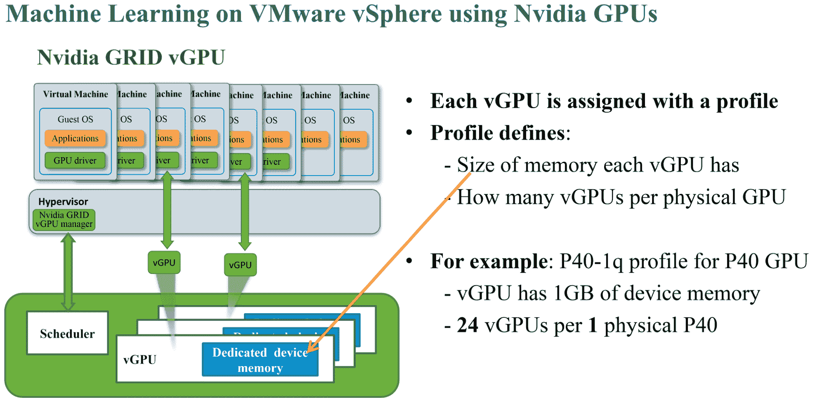
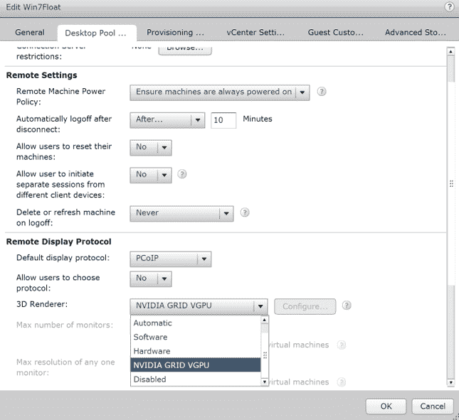
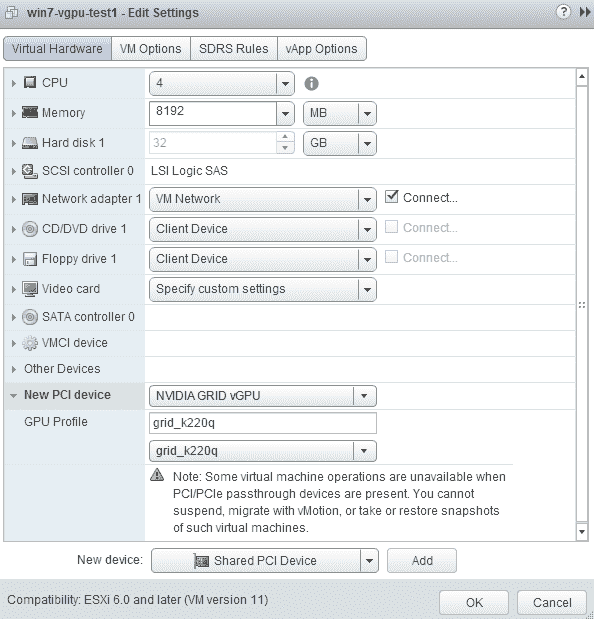
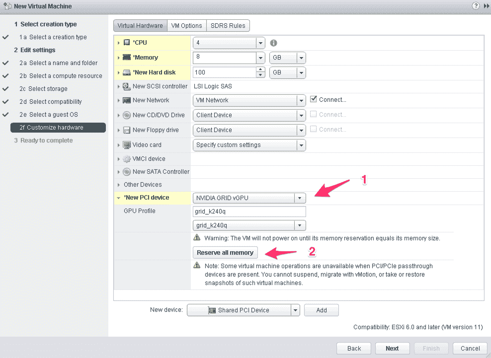
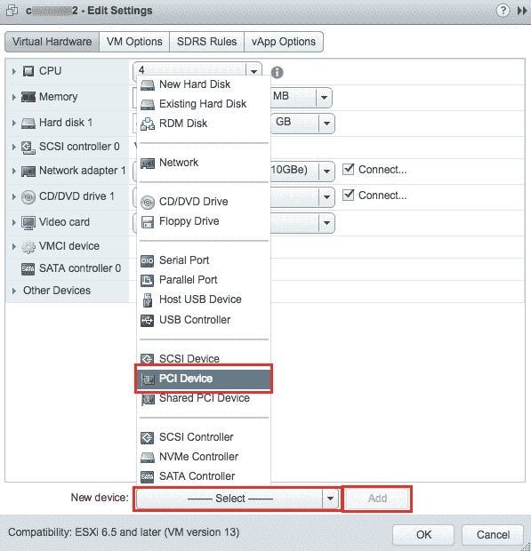
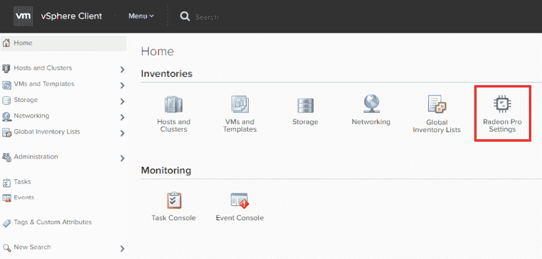

# 一、vSphere 6.7 的机器学习功能

这本书将向您简要介绍不同的 VMware 工具如何帮助客户获得智能自动检测和预测的好处。这种产品将使他们能够检测、可视化异常情况、未来需求以及潜在的现代应用和基础设施问题，并对其进行故障排除，所有这些都不需要用户方面的任何额外的统计或算法专业技能。VMware 为客户提供跨所有服务的运行状况和典型指标行为的统一可见性，无需用户协助，因此减少了故障排除时间。这些工具还将有助于进行预测，以了解未来的容量需求，并最大限度地提高应用和基础架构的效率。

本章向您介绍了如何在 vSphere 环境中通过使用不同的模式来虚拟化 GPU，为特定用户组创建配置文件，以及有关不同的 **NVIDIA 显卡**及其用法的信息。我们还将了解如何在 vSphere 中为基于**机器** l **收益** ( **ML** )的工作负载配置 NVIDIA GPU，以实现特定的业务目标，同时降低成本。

我们将在本章中讨论的主题如下:

*   ML 和 VMware
*   使用 GPU 的不同模式
*   采用 NVIDIA GPUs 的 ML


# 技术要求

您可以下载以下内容:

*   来自[https://my . VMware . com/en/web/VMware/info/slug/data center _ cloud _ infra structure/VMware _ VSP here/6 _ 7 的 VMware VSP here 6.7](https://my.vmware.com/en/web/vmware/info/slug/datacenter_cloud_infrastructure/vmware_vsphere/6_7)
*   https://my.vmware.com/web/vmware/details? VMware vCenter Server 6.5 U1[download group = vc65u 1&product id = 676&rPId = 28154](https://my.vmware.com/web/vmware/details?downloadGroup=VC65U1&productId=676&rPId=28154)
*   VMware Horizon 7[https://my.vmware.com/en/web/vmware/evalcenter?p=horizon-7&src = WWW _ HR zold _ top nav _ DownloadFreeTrail](https://my.vmware.com/en/web/vmware/evalcenter?p=horizon-7&src=WWW_HrzOld_TopNav_DownloadFreeTrail)


# ML 和 VMware

**VMware** 在其大多数产品中广泛利用人工智能和人工智能技术。我们可以通过新版本的 vSphere 6.7 功能以及 **AppDefense** 和 **Workspace** 等产品看到这一点。这是一种有助于实现自动驾驶数据中心未来愿景的智能。VMware 已经完成了性能基准测试，测试内容是如何帮助其客户在 vSphere 上运行自己的 ML 工作负载，同时改进 NVIDIA GPUs 的支持。

ML 对于 VMware 混合云愿景非常重要，因为 ML 有能力吸收大量数据，以利用这些数据进行精确学习并与终端用户交流。


# 基于最大似然的数据分析

ML 正在帮助客户从大型数据集中获取更好的粒度级信息。这将给企业带来巨大的竞争优势，因为客户能够整合来自不同来源的数据，这将有助于管理层先于竞争对手做出重大决策。当我们获得这一结果及其背后的相关原因时，我们可以帮助客户获得准确、高效的数据。人工智能在我们日常生活中的潜力是巨大的。

我们在 ML 中每天都有新的发展，ML 将会进一步扩展。所有最大的公共云供应商都在日常运维中使用基于 ML 的技术。苹果、通用电气和博世也在收集大量数据，并应用机器学习技术来筛选出有用的数据。通用电气正在通过其工业互联网积累数据分析，而苹果拥有来自其数百万最终用户的海量消费者和健康数据，这有助于他们成为人工智能的主要参与者。

将人工智能嵌入当前的云技术有助于企业和消费者的发展，也为所有相关信息创造了规划未来的新机会。我们正在走向智能基础设施，人工智能使用机器来采用人类智能。人工智能基于基于规则的逻辑、决策树和方法论，使其能够像人类一样行事。ML 分析数据并提高重复性任务的性能。DL 将通过定位和检查各种选项来帮助机器学习，以获得最佳结果或解决方案。

客户已经采用了云，现在正在嵌入 ML 技术及其能力，以扩展其动态并向客户交付价值。借助纵向扩展和横向扩展功能，客户可以获得安全可靠的环境。作为回报，云提供商获得了忠诚的长期客户。从商业和人工智能的角度来看，每个云提供商在特定领域都比其他人更好。这将为客户提供多样化的产品，并针对他们的独特需求提供专门的智能。

VMware 将帮助拥有智能基础架构的客户提供跨混合云的可比且安全的解决方案，以选择合适的云提供商来满足其独特的业务需求，如安全性、备份、灾难恢复、网络、存储、图形和基本计算资源管理。

智能技术的一个很好的例子是谷歌地图。当我们离开办公室去开会时，在谷歌地图的指导下，我们能够通过人工智能识别替代路线，为我们节省宝贵的时间。


# 通过 ML 使用虚拟化 GPU

最近，ML 在研究和开发中被广泛使用，GPU 等加速器的计算能力增强使得 ML 应用得以快速采用。

设计师、工程师和建筑师是广泛的最终用户，他们经常在各种用例中使用 3D 图形，并希望他们的 IT 团队在这方面为他们提供帮助。他们使用高端图形工作站实时处理汽车、制造部件和建筑的 3D 模型。它们是制造业、建筑、工程和建筑、高等教育、公共部门、石油和天然气等行业的一部分。他们必须实时查看和控制这些丰富的可视化 2D 和 3D 数据。临床医生、工程师和办公室专业人员等高级用户组代表了数百万依赖丰富的 2D 和 3D 图形交付成果的用户。

如今，随着全球员工人数的增加，组织也在不断发展变化，这些全球员工是地理位置分散的团队，随时随地在任何工作站上使用带有图形的虚拟桌面。由于这些超级用户在现场工作，需要使用笔记本电脑、平板电脑和移动设备等终端设备从任何地方访问应用，他们需要与团队成员实时协作，没有数据丢失的风险，并且完全符合要求。我们必须使用**虚拟桌面基础架构** ( **VDI** )解决方案来重新定义设计师和工程师的工作流程:


采用 NVIDIA GPU 的 VMware Horizon VDI

VMware VDI 解决方案通过了所有领先的 3D 应用工作站的认证，从端点到数据中心的世界一流图形可在任何设备上访问，同时降低了运维支出。基于 NVIDIA GRID vGPU 技术的 VMware Horizon with protocol Blast 通过从云中提供安全的原生 3D 图形，并以较低的运维支出跨任何终端设备和从任何位置交付，确保了出色的用户体验。借助 NVIDIA GRID vGPU 技术，在每个虚拟机上执行的图形命令会直接传递到物理 GPU，而不会在虚拟机管理程序层产生任何开销。

这有助于应用的兼容性，因为应用可以像以前一样在工作站上访问相同的显卡。NVIDIA GRID vGPU 使 GPU 硬件能够进行时间切片，以提供最佳的共享虚拟化图形性能。

VMware、vSphere 和 VMware Horizon 确保高级用户、设计师和工程师能够获得与本机硬件相当的出色图形体验，并通过 NVIDIA 和 VMware 的认证，可用于大多数重要的业务应用。


# GPU 的使用模式

在 vSphere 上托管的虚拟机中运行的应用可以通过两种方式利用 GPU 的处理能力。

**vSphere DirectPath I/O** 是 vSphere 的一项固有功能，它利用为主机配置的支持**虚拟化技术** ( **VT** )的处理器来增强虚拟机的性能。**通用输入输出** ( **GPIO** )是英特尔/AMD CPU 的处理器特性，被称为 I/O 内存管理单元，分配直接内存访问传输和设备中断。这样，虚拟机就能够绕过 VMkernel，直接访问底层物理硬件。启用 DPIO 的服务器硬件支持 vMotion。

硬件辅助 I/O MMU 虚拟化在英特尔处理器中称为定向 I/O ( **VT-d** )的**英特尔虚拟化技术，在 AMD 处理器中称为 **AMD I/O 虚拟化** ( **AMD-Vi** 或 **IOMMU** )。这是芯片组的一项功能，可帮助虚拟机直接访问硬件 I/O 设备，如网卡、存储控制器和 GPU。**

NVIDIA GRID GPUs 支持 vGPU，这是多个用户在虚拟化环境中共享单个物理 GPU 的能力。Horizon View 虚拟桌面有三种基于硬件的图形加速配置。vGPU 提供了最佳的性能和兼容性选项。


# 将 ML 工作负载与 GPU 配置进行比较

我们可以通过用三种不同的 GPU 配置测试来比较同一个 ML 工作负载；这些措施如下:

*   在 vSphere 上使用 DirectPath I/O 的 GPU
*   vSphere 上的网格 vGPU
*   裸机主机上的本机 GPU

我们进行了测试，发现虚拟化层(DirectPath I/O 和 GRID vGPU)只给测试的 ML 应用带来了 4%的开销。通过使用两个具有不同配置的虚拟机，可以将学习时间与特定模型进行比较。

虚拟机资源以及两个虚拟机的操作系统(带和不带 GPU ):

*   **NVIDIA 网格配置** : 1 个 vGPU，12 个 vcpu，60 GB 内存，96gb SSD 存储，CentOS 7.2
*   **无 GPU 配置**:无 GPU，12 个 vCPUs，60 GB 内存，96gb SSD 存储，CentOS 7.2

让我们看看下表:

| **MNIST 工作量** |  **1 个 vGPU(秒)** |  **无 GPU(秒)** |
| **归一化学习时间**  | 1.1 | 10.01 |
| **CPU 利用率** | 9% | 45% |

如上表所示，vGPU 将训练时间减少了 10 倍，CPU 利用率也降低了 5 倍。ML 可以用两个组件引用；这些措施如下:

*   源自 TensorFlow 库的卷积神经网络模型。
*   **加拿大高级研究所** ( **CIFAR** )-10 数据集定义了图像数据集，我们在 ML 和 IT 视觉算法中使用这些数据集。


# 直接路径输入输出

首先，当我们从一个 GPU 扩展到四个 GPU 时，我们重点关注**direct path I/O**(**DPIO**)直通模式:

| **CIFAR-10** | **1 个 GPU** | **2 个 GPU** | **4 个 GPU** |
| **以千为单位的归一化图像/秒(w.r.t. 1 GPU)** | 1.1 | 2.01 | 3.77 |
| **CPU 利用率** | 23% | 41% | 73% |

随着服务器上 GPU 数量的增加，每秒处理的图像越来越多。一个 GPU 几乎用于以每秒 1，000 张图像的速度归一化数据，并将随着 GPU 的增加而进一步增长。通过在两种模式下配置一个 vGPU/VM，可以比较 DPIO 和网格 vGPU 模式的性能:

| **MNIST 工作量****(越低越好)** | **DPIO** | **电网 vGPU** |
| **标准化训练次数** | 1.1 | 1.03 |
| **CIFAR-10 工作负荷****(越高越好)** | **DPIO** | **电网 vGPU** |
| **归一化图像/秒** | 1.1 | 0.83 |

DPIO 和网格模式 vGPU 的性能与一个 vGPU/虚拟机大致相同。我们可以用 DPIO 主机上所有可用的 GPU 来配置一个虚拟机，但一个虚拟机最多只能在网格 vGPU 模式下配置一个 GPU。我们可以区分运行同一作业的四个虚拟机和在 DPIO 模式下使用四个 GPUs 主机的一个虚拟机:

| **CIFAR-10 工作量** | **DPIO** | **DPiO(四个虚拟机)** | **网格 vGPU(四个虚拟机)** |
| **归一化图像/秒
(越高越好)** | 1.1 | 0.96 | 0.94 |
| **CPU 利用率** | 73% | 69% | 67% |

我们应该配置低延迟的虚拟机，或者在多 GPU DPIO 模式下需要较短的训练时间。由于它们专用于特定的虚拟机，因此在此期间，其余的虚拟机将无法访问主机上的 GPU。我们可以通过在网格 vGPU 模式下配置 1 个 GPU 来利用具有更长延迟或学习时间的虚拟机，并享受虚拟化的优势。


# 虚拟环境中 GPU 的可扩展性

Horizon 和 vSphere 支持 vGPU，vGPU 带来了广泛的 API 支持和具有最大可扩展性的原生 NVIDIA 驱动程序的优势。NVIDIA GRID GPUs 基于 NVIDIA Kepler GPU 架构。NVIDIA GRID GPUs 支持 vGPU 功能，允许多个用户在虚拟化环境中共享单个物理 GPU。Horizon 将使用所需的 GPU 在计算和存储资源池中自动对支持 vGPU 的虚拟桌面进行负载平衡，即使不同的池使用不同的用户配置文件也是如此。如果我们创建两个链接克隆池，一个使用 K120Q 配置文件，另一个使用 K220Q 配置文件，Horizon 会毫不费力地将第一个配置文件放在带有 K1 卡的主机上，将后者放在 K2 上。vGPU 配置文件授予专用图形内存。GPU 管理器分配内存大小，以满足每个用户的特定要求。

ESXi 主机最多可以在不同的虚拟机/用户之间共享 16 个基于 GPU 的物理图形。

地平线有三种图形加速:

*   虚拟共享图形
*   虚拟共享直通图形
*   虚拟专用图形
*   每个虚拟机的总内存(包括易失性和非易失性内存)不能超过最大内存限制(6，128 GB)


# 虚拟机中的容器化 ML 应用

**VSP here Integrated Containers**架构提供了两种容器部署模式:

1.  **虚拟容器主机**:vSphere Integrated Containers 利用 VSP here 的原生构造来调配容器。它将 vSphere 的可用性和性能功能(DRS、HA、vMotion)扩展到容器化的工作负载。容器映像可以用作虚拟机，开发人员也可以将其作为 Docker API 使用。
2.  **Docker 容器主机**:开发者可以按需自行调配 Docker 容器主机，并将其作为开发沙箱，重新打包应用。该架构补充了敏捷开发实践和 DevOps 方法，例如**持续集成** ( **CI** )和**持续部署** ( **CD** )。

重新设计与其数据和其他应用组件/逻辑紧密耦合的内部应用将是昂贵且耗时的，因此在不改变应用设计的情况下将应用重新打包在一个容器中可以降低成本。重新打包应用的学习曲线很短。

vSphere Integrated Containers 提供了一个选项，通过使用 Docker 命令行界面实例化 Docker 映像，然后将容器映像部署为虚拟机，而不是 Docker 主机上的容器，因此我们可以获得将应用打包为容器的好处，而无需重新设计。这样，我们可以保持虚拟机的隔离。vSphere Integrated Containers 是应用重新打包的理想解决方案，无需任何新的基础架构/专用硬件，也无需实施新工具。

重新打包的容器化应用可以与运行传统或容器化应用的其他虚拟机一起运行。vSphere 集成容器在基础架构级别具有高可用性，无需开发人员干预即可支持重新打包的容器。我们还可以利用核心 vSphere 功能，例如**VSP here high avail ability**和 **vSphere vMotion** 。


# vGPU 调度和 vGPU 配置文件选择

默认情况下，GPU 支持相等的份额，并且必须根据客户的要求配置固定的份额。

我们可以用以下两个选项来配置 GPU:

*   **平等共享调度器**:一个物理 GPU 作为运行在同一主机上的 vgpu 在所有虚拟桌面之间共享。当在 GPU 中添加/删除 vGPU 时，处理周期的份额会发生变化，并且 vGPU 的性能取决于其他 vGPU 是正在运行还是正在停止。
*   **固定份额调度器**:每个 vGPU 都被分配了固定份额的物理 GPU 处理周期，不管 vGPU 是被添加到 GPU 还是从 GPU 中移除。它将保持不变，即使其他 vGPUs 正在运行或停止。

vSphere 上的 NVIDIA GRID vGPU 可以配置为 vGPU 配置文件的各种选项，该配置文件定义了每个虚拟机可以使用的 GPU 内存，以及可以共享单个 GPU 的最大数量的虚拟机。

**vGPU 配置文件**提供了一系列具有不同缓冲存储器帧大小和头数的虚拟 GPU。用户数量将由附加到特定配置文件的每个 GPU 的帧缓冲区的划分来定义，头的数量表示支持的显示器数量，而最大分辨率将在所有配置文件中保持一致。以 Q 结尾的 vGPU 配置文件必须遵循与专业图形应用的 NVIDIA Quadro 卡相同的应用认证流程。我们可以获得与这些应用 100%的兼容性和性能。可以参考这个链接获得认证应用列表:[https://www . NVIDIA . com/en-us/design-visualization/solutions/virtual ization/](https://www.nvidia.com/en-us/design-visualization/solutions/virtualization/)。


# 高级用户和设计者配置文件

我们可以通过 **NVIDIA Grid** 和 **Horizon** 将要求最苛刻的最终用户转移到数据中心。我们可以帮助这些用户实现移动性、轻松管理、集中化数据和安全性、灾难恢复保护以及虚拟化的其他优势。我们可以将这些用户与他们的工作站绑定在一起，随后将他们链接到一张桌子上。虽然**虚拟专用图形加速** ( **vDGA** )直通允许以 1:1 的比例访问远程工作站，但成本较高，并且没有任何资源优化，现在，我们可以混合工作站用户以及任务/知识用户，以实现更好的资源优化。我们有很多选择来设计具有所需兼容性和性能的解决方案。通过利用 NVIDIA 平台，我们可以在经过认证的软件和硬件上获得高质量的设计应用体验。配置文件的选择取决于主要应用的要求，基于这些要求，我们可以选择合适的 Quadro 认证的 vGPU 配置文件来满足最终用户的要求。


# 知识和任务用户配置文件

任务型工作者大多需要软 3D，这是一种基于软件的 3D 渲染器，适用于图形密集型应用。它们不需要基于硬件的 3D 加速，也不会从中获得显著优势。软 3D 是 Horizon 的标准组件。

办公室工作人员和管理人员属于这种类型，他们大多使用 Microsoft Office、Adobe Photoshop 等应用，以及其他非专业的最终用户应用。一个**虚拟共享图形加速** ( **vSGA** )解决方案可以通过提供跨 GPU 的高水平用户整合来优化该用例的性能。vSGA 不提供广泛的图形 API 支持，因为对于知识工作者来说，考虑基于 vGPU 的解决方案总是更好。


# 使用 vGPU 管理器将 vGPU 主机添加到集群

我们必须安装英伟达 GPU 管理器 **vSphere 安装包** ( **VIB** )，因为英伟达 VIB 拥有主机识别 GPU 所必需的驱动程序。这将给你一个 vGPU 管理器。在安装受支持版本的 vCenter 和 ESXi 之前，ESXi 主机的 BIOS 电源和性能设置应设置为高性能策略。ESXi 主机通过 vCenter 进行管理，并配置了 NTP 和 DNS。

vGPU 管理器 VIB 与虚拟机监控程序中的驱动程序一样被加载。vGPU 管理器最多可以配置八个用户来共享每个物理 GPU。M60 每张卡最多可以设置 32 个用户。该集群必须拥有安装了 NVIDIA Tesla M60 vGPU 的主机。这是为了优化 GPU 的资源分配。


# 采用 NVIDIA GPUs 的 ML

ML 帮助计算机以用户友好的方式工作，而无需显式编程，因此任何人都可以在日常生活中学习和利用它，如健康、研究、科学、金融和智能系统:



在 NVIDIA GRID vGPU 中分配 GPU


# Horizon 中的池和场设置

我们必须像 Horizon 中的普通场一样配置 3D 场:

1.  按照我们在 Horizon 中配置该池的相同方式配置该池，直到我们到达桌面池设置部分。
2.  滚动到“添加桌面池”窗口中的“远程显示协议”部分。
3.  我们必须在 3D 渲染器选项的以下两个选项中进行选择:
    1.  为 vSGA 选择硬件或自动
    2.  为 vDGA 或 MxGPU 选择硬件

4.  在桌面池设置中将默认显示协议设置为 PCoIP，并允许用户在带有 NVIDIA GRID VGPU 3D 渲染器的下拉列表中选择否。
5.  要启用 NVIDIA vGPU，请为虚拟机启用 vGPU 支持:



6.  关闭虚拟机。
7.  在导航窗口中单击虚拟机。选择管理选项卡和设置。点击编辑按钮:


8.  单击新 PCI 设备栏，选择共享 PCI 设备，然后选择添加以继续:



9.  现在显示添加了 NVIDIA GRID vGPU 设备。
10.  使用 GPU 配置文件选择栏配置 GPU，然后单击确定完成配置。


# 配置硬件加速显卡

借助 VMware Horizon，我们可以通过三种方式配置加速:

*   虚拟共享图形
*   虚拟专用图形
*   虚拟共享直通图形


# 虚拟共享图形加速

vSGA 是支持 DirectX 和 OpenGL 的驱动程序。vDGA 配置使用原生显卡驱动程序。SVGA 或 VMware SVGA 3D 是兼容 VMware Windows 显示驱动程序模型的驱动程序，包含在 Windows 虚拟桌面上的 VMware Tools 中。该 3D 图形驱动程序可以安装在 2D/3D 的 Windows 上，也可以用于 3D 和 vSGA 软件。

VMware SVGA 3D 可以针对 2D/3D 软件和 vSGA 部署进行配置，并且虚拟桌面可以在软件或硬件加速之间快速切换，而无需对现有配置进行任何更改。vSGA 通过硬件加速图形配置支持 vMotion。通用驱动程序无需任何进一步配置即可跨平台工作:


服务器的物理 GPU 通过 vSGA 技术进行虚拟化，并与驻留在同一台主机服务器上的多个来宾虚拟机共享。我们必须在虚拟机管理程序中集成特定的驱动程序，所有来宾虚拟机都将利用 VMware vSGA 3D 驱动程序。vSGA 的性能受到一些应用的限制，这些应用不需要 API 支持，并且对 OpenGL 和 DirectX 的支持也有限。


# 在虚拟机中配置 vSGA 设置

vSphere 和 View 池设置中有三种现有的 3D 设置。我们可以启用或禁用 3D，通过 vSphere 将 3D 设置设置为自动。如果我们更改 3D 配置，那么它会将视频内存恢复到默认值 96 MB，因此在更改视频内存之前请务必确认。这些配置有:**自动**(默认)、**软件**和**硬件**:

1.  启用 3D 支持。
2.  将 3D 渲染器设置为自动或硬件。
3.  决定 3D 视频内存。默认情况下，它为 96 MB，但最小为 64 MB，最大为 512 MB:


# vGPU 的虚拟机设置

现在，我们将使用以下屏幕截图为 vGPU 设置虚拟机设置:


上图为我们提供了多种配置选项，符合所有安全措施的应用要求。

1.  选择要配置的虚拟机，然后单击编辑设置。首先，添加一个共享 PCI 设备，然后选择 NVIDIA GRID vGPU 在虚拟机上启用 GPU 直通:


2.  从 GPU 配置文件下拉菜单中选择所需的配置文件:


GPU 配置文件字符串 4q 通知以 GB 为单位的帧缓冲区(VRAM)的大小和所需的网格许可证。

VRAM 0，1 分别通知 512 MB，1，024 MB，依此类推。网格许可证类型如下:

*   用于商业桌面计算的网格虚拟 PC vGPUs 通知 *b*
*   远程桌面会话主机的网格虚拟应用 vGPUs 用 *a* 通知
*   Quadro **虚拟数据中心工作站** ( **vDWS** )针对工作站特定的图形功能和加速，例如多达四个 4K 显示器和针对专业应用的认证驱动程序通知 *q* :



创建虚拟机时，单击保留所有内存。我们可以管理端到端的 NVIDIA 虚拟 GPU 解决方案，如 Quadro vDWS 和**NVIDIA GRID Virtual PC**(**vPC**)，并在主机、来宾或应用级别全面了解其整个基础架构。这有助于我们提高响应速度和敏捷性，从而获得更好的终端用户 VDI 体验。

从高端虚拟工作站到企业虚拟工作区，我们可以提供更好的用户体验，这些虚拟工作区购买经济实惠、易于部署、运维高效。

使用基于 Pascal 的 GPU 和 Quadro vDWS 软件的工程师、设计师、内容创作者和建筑师等用户能够获得在任何虚拟工作站或笔记本电脑上运行加速图形和计算(CUDA 和 OpenCL)工作负载的最佳体验。

知识工作者使用 Windows 10、Office 365 和 YouTube 等程序，这些程序需要图形加速，以便使用基于 NVIDIA Pascal 的 GPU 和 NVIDIA GRID 虚拟 PC 来实现更好的虚拟桌面用户体验。NVIDIA NVENC 通过将 H.264 视频编码从 CPU 卸载到 Linux 虚拟工作站用户，提供了更好的性能和用户密度，这是一项繁重的计算任务。Horizon 为客户提供了一个单一平台，可根据用户的图形需求发布各种桌面(Windows 和 Linux)和应用。


# 网格 vPC 和网格 vApps 功能

NVIDIA GRID 拥有基于特定用例的软件版本:

*   **英伟达网格虚拟应用(vApp)** :我们可以用它来进行应用虚拟化或基于 RDSH 的应用发布。
*   vPC :它适用于提供标准桌面应用、浏览器和多媒体的虚拟桌面。
*   **NVIDIA GRID Virtual Workstation(vWS):**这对从事强大的 3D 内容创建应用(如 CATIA、S、3DExcite、Schlumberger Petrel 或 Autodesk Maya 等)工作的科学家和设计师来说是值得的。vWS 只有这个 NVIDIA Quadro 驱动。

NVIDIA GRID 软件版本可以通过年度订阅、永久许可以及结合支持来购买。高可用性许可证服务器确保用户即使在主许可证服务器脱机的情况下也能不间断地工作；然后，二级许可服务器将向客户端提供许可服务。

此次基于 Pascal 的发布支持 NVIDIA 虚拟 GPU 解决方案和 Maxwell-powered GPU(NVIDIA Tesla M60、M6 和 M10)。NVIDIA 虚拟 GPU 解决方案将在所有配有 Tesla P40 的 Pascal GPUs 和一直推荐的配有适当软件许可证的 P6 (blade)上得到支持。

即使您拥有采用 NVIDIA 网格解决方案的 Maxwell-powered GPU，我们也需要 Pascal GPUs 来受益于性能改进、增加的帧缓冲、更大和更细粒度的配置文件大小、更大的系统内存、在同一 GPU 上运行虚拟化图形和计算工作负载的能力，以及利用新的任务调度器。

简化管理和监控等有助于应用级监控和集成的功能可在 Maxwell 和 Pascal 卡上与 NVIDIA GRID software release 和 GRID Management SDK 2.0 一起工作。我们必须为特定工作负载选择推荐的 Pascal/Maxwell 板。

对于商业客户，我们可以推荐 P40 或 M60。P40 提供最高的性能、更大的内存和更简单的管理，并支持图形和计算的虚拟化(CUDA 和 OpenCL)。从 M60 或 K2 或基于 Skylake 的服务器升级时，建议使用 P40。M60 将继续提供，并提供异构配置文件和更大的 OEM 服务器支持。

**M10** 建议用于密度驱动型部署的客户，对于运行日常图形加速应用的知识型员工，建议使用 M10。对于高密度刀片式服务器部署，建议在 M6 之后部署 P6。


# 电网 vWS 至 Quadro vDWS

我们可以利用 Quadro/GRID 功能，并将其与 VMware 虚拟工作站/PC/虚拟应用解决方案进行比较。NVIDIA GRID vWS 现在是 **NVIDIA Quadro 虚拟数据中心工作站**或 **Quadro vDWS** 。GRID 品牌将用于描述 PC 体验，并将有两个版本:NVIDIA GRID vPC 和 NVIDIA GRID vApps。虽然这两个软件版本曾被称为 NVIDIA GRID 软件平台，但它们现在将被称为 **NVIDIA 虚拟 GPU 解决方案**。

MxGPU 是一种 GPU 虚拟化技术，内置硬件引擎负责虚拟机调度和管理。它根据应用的要求利用底层的 SR-IOV 协议。处于直通模式的 GPU 无法虚拟化，因此首先运行脚本来禁用直通模式。如果 MxGPU 已启用且 vCenter 可访问，则使用插件而不是脚本进行配置。vDGA 通过提供到物理 GPU 的直接通道，可以帮助用户不受限制地专用访问单个 vGPU。对于 vDGA 下的常规直通设备，使用 MxGPU 设备在虚拟机上安装驱动程序的步骤是相同的。

使用 MxGPU 和 vDGA 时配置虚拟机:

1.  对于具有大 BAR 大小的设备，如 Tesla P40，我们必须在虚拟机上设置配置参数:

    *   `firmware="efi"`

    *   `pciPassthru.use64bitMMIO="TRUE"`

    *   `pciPassthru.64bitMMIOSizeGB="64"`

2.  向特定虚拟机添加 PCI 设备，并选择所需的 PCI 设备以启用 GPU 直通:



3.  通过主页上的管理员帐户登录 vSphere Web Client，然后单击镭龙专业版设置。转到数据中心，管理特定数据中心的所有 MxGPU 主机。
4.  我们可以使用 MxGPU 在 vSphere 客户端插件上安装镭龙专业版设置:



VMware 同时支持 AMD 和 NVIDIA 显卡。我们可以从供应商网站下载适当的 VMware 图形驱动程序，以使用显卡或 GPU 硬件。我们可以向单个虚拟机以及多个虚拟机添加 PCI 设备。

5.  要使用命令一次性为多个虚拟机添加 PCI 设备，请执行以下操作:
    1.  浏览到 AMD FirePro VIB 驱动程序并安装 AMD VIB 实用程序:`cd /<path_to_vib from ssh`。
    2.  编辑`vms.cfg: vi vms.cfg`。
6.  按下 *I* 并更改`.*`的实例以匹配需要 GPU 的虚拟机名称，例如将`*MxGPU*`匹配到包含 MxGPU: `.MxGPU`的虚拟机名称。
7.  按 *Esc* 保存并退出，键入`:wq`，按*回车。*

8.  将虚拟功能分配给虚拟机:

```pypy
sh mxgpu-install.sh –a assign 
Eligible VMs:
WIN10-MxGPU-001
WIN10-MxGPU-002
WIN8.1-MxGPU-001
WIN8.1-MxGPU-002
These VMs will be assigned a VF, is it OK?[Y/N]y
```

9.  按下*进入*并选择保留所有访客记忆(全部锁定)。
10.  重启系统，使用 MxGPU 脚本自动分配**虚函数** ( **VF** )。

然后，我们应该验证设备列表中是否填充了所有 VF。这样，我们可以通过使用脚本自动分配 VF。


# 摘要

CAD/CAM、诊断成像、分子设计和空间探索等应用的远程计算解决方案被证明是难以捉摸的。NVIDIA GRID vGPU 技术以及 VMware、vSphere 和 Horizon 虚拟化软件为设计工程师、科学研究人员和数据探索者提供了经济高效的解决方案。

Horizon 提供基于软件的图形加速，足以满足基本使用需求，但基于硬件的图形加速具有网格图形卡与服务器配置的不同组合，可用于解决各种高级用户需求，并在预算范围内满足这些需求。我们可以在两种模式下配置 GPU:

*   DirectPath I/O 直通模式
*   电网 vGPU 模式

对虚拟化 GPU 的共享访问使身临其境的 3D 图形应用可从远程设备访问。该解决方案消除了对专用图形工作站的需求，提高了安全性，并将用户从办公室中解放出来。

下一章将介绍托管应用的策略，以便为最终用户提供自由，并通过基于 ML 算法的基于策略的操作为管理员/服务提供商提供完全控制，这也将有助于改善最终用户体验。


# 进一步阅读

*   *https://www.vmware.com/support/pubs/[的 VMware 文档](https://www.vmware.com/support/pubs/)*
*   https://www.vmware.com/resources/compatibility/search.php[的 *VMware 兼容性指南*](https://www.vmware.com/resources/compatibility/search.php)
*   *vSphere 6.0 配置最大值*指南，位于*[https://www . VMware . com/pdf/VSP here 6/r60/VSP here-60-Configuration-Maximums . pdf](https://www.vmware.com/pdf/vsphere6/r60/vsphere-60-configuration-maximums.pdf)*
**   *VMware vCenter Server* 数据表位于[http://www . VMware . com/files/pdf/products/vCenter/VMware-vCenter-Server-data sheet . pdf](http://www.vmware.com/files/pdf/products/vCenter/VMware-vCenter-Server-Datasheet.pdf)*   *VMware vSphere* 数据表位于[http://www . VMware . com/files/pdf/VSP here/VMW-vs phr-数据表-6-0.pdf](http://www.vmware.com/files/pdf/vsphere/VMW-vSPHR-Datasheet-6-0.pdf)*   *VMware Horizon 7* 数据表位于[http://www . VMware . com/files/pdf/products/Horizon/VMware-Horizon-7-data sheet . pdf](http://www.vmware.com/files/pdf/products/horizon/vmware-horizon-7-datasheet.pdf)*   *每个解决方案组件的多站点部署最佳实践*位于[https://www . VMware . com/content/dam/digital marketing/VMware/en/pdf/tech paper/VMware-horizon-7-enterprise-edition-reference-architecture-multi-site . pdf](https://www.vmware.com/content/dam/digitalmarketing/vmware/en/pdf/techpaper/vmware-horizon-7-enterprise-edition-reference-architecture-multi-site.pdf)*   *适用于 VMware Horizon 7.x 的 NVIDIA vGPU 部署指南*位于[https://images . NVIDIA . com/content/pdf/vGPU/guides/VMware-Horizon-VSP here-deployment _ guide . pdf](https://images.nvidia.com/content/pdf/vgpu/guides/vmware-horizon-vsphere-deployment_guide.pdf)*   *为 NVIDIA GRID vGPU 功能做准备—VMware docs* 位于[https://docs . VMware . com/en/VMware-Horizon-7/7.6/Horizon-virtual-desktops/GUID-ab1b 6311-DB31-4982-ACDF-0 E1 a5 ed 3 b 17d . html](https://docs.vmware.com/en/VMware-Horizon-7/7.6/horizon-virtual-desktops/GUID-AB1B6311-DB31-4982-ACDF-0E1A5ED3B17D.html)*   *在 Horizon Administrator 中配置桌面池*有关完整信息和详细过程，请访问[https://www . VMware . com/content/dam/digital marketing/VMware/en/pdf/products/Horizon/grid-vgpu-deployment-guide . pdf](https://www.vmware.com/content/dam/digitalmarketing/vmware/en/pdf/products/horizon/grid-vgpu-deployment-guide.pdf)*