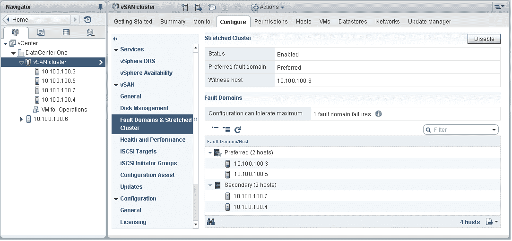
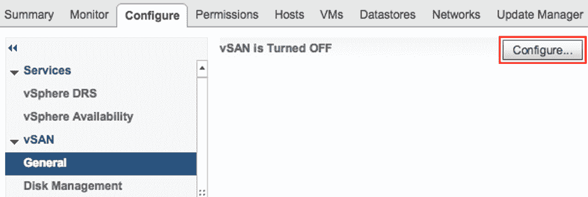
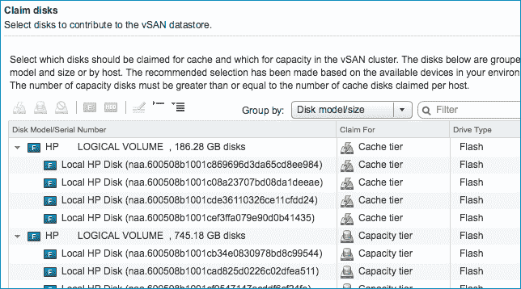
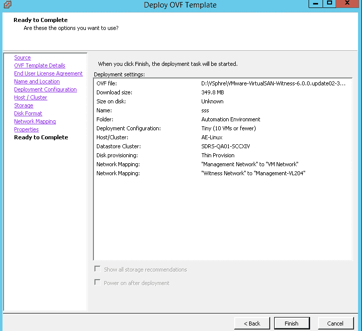
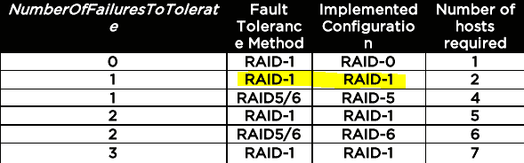

# 二、vSAN 高级分析的主动措施

本章将向您简要介绍**虚拟存储区域网络** ( **vSAN** )设计建议，以及所有监控选项，您的客户可以通过这些选项来评估、推荐和设计他们的环境。这将有助于他们通过智能策略实现运维自动化，从而实现不同的业务目标。

我们将学习如何根据 ML 算法配置基于策略的操作，以及如何通过主动解决客户问题来改善最终用户体验。我们还将学习优化**超融合基础设施** ( **HCI** )来实现客户业务目标。

本章将涵盖以下主题:

*   vSAN 上的应用可扩展性
*   智能监控
*   **扩展集群中的高可用性** ( **HA** )配置
*   采用基于存储策略的管理**的 vSAN 策略设计** ( **SPBM** )


# 技术要求

您可以从 https://my.vmware.com/web/vmware/details?的网站[下载 VMware vCenter Server 6.5 U1 版 download group = vc65u 1&amp；product id = 676&amp；rPId = 28154](https://my.vmware.com/web/vmware/details?downloadGroup=VC65U1&productId=676&rPId=28154)。


# vSAN 上的应用可扩展性

VMware vSAN 可以支持容器和基于更新的 vSphere Docker 卷驱动程序的下一代应用，直接通过 Docker APIs 提供本机支持。这使得 Docker 可以构建在 vSAN 之上，并利用 vSAN 成熟、持久的存储功能。此驱动程序更新具有新功能，包括支持多租户、SPBM、克隆和快照。VMware 的原则是*API 优先*，所有管理功能都可以通过 API 获得，API 是 vSphere APIs 的扩展，成千上万的企业客户使用 API 来自动化他们的操作。

在扣留应存储应用数据的存储层时，应考虑以下参数:

*   **每秒 I/O 操作数** ( **IOPS** )的要求
*   MBps 要求
*   容量要求
*   可用性要求
*   延迟要求
*   考虑任何现有的 SLA
*   考虑数据在信息生命周期中是否会在存储层之间移动

这些详细信息可用于将应用和服务移动到具有匹配特征的存储层。


# 存储和网络评估

vSAN 管理的整体方法可以对基础架构产生显著的积极影响。它与 vRealize Operation 集成，并通过提供有关资源的更深入的信息对其进行补充。以下 VMware 建议从三个不同的角度看待业务挑战:

*   **组织建议**:采用以服务为中心的方法制定虚拟化策略，例如产品和服务级别菜单。

*   **运维建议**:关注流程定义和改进，特别是在供应、系统监控和问题管理方面。研究和评估虚拟基础架构监控工具。
*   **技术建议**:在相似的系统上实施一致的配置，在争用和备份窗口期间执行较小的网络调整以大幅提高网络性能，并配置虚拟机以利用虚拟化的优势。


# 存储设计策略

评估摘要基于**VMware Health Analyzer**(**vHA**)检查点和记录的 vSAN 最佳实践。我们将在下一节中研究一些建议。


# VMware 最佳实践建议

以下是 VMware 的最佳实践，以及针对存储设计策略的建议:

*   验证我们是否在 vCenter 控制台中正确设置了存储策略:
    *   默认情况下，应修改默认规则设置。该政策应根据您的要求来应用。
    *   **策略设置**:在配置过程中，强制供应应设置为真。
    *   对象空间预留(%)应设置为 100%。

**理由**:vSAN 中的虚拟机存储策略会影响在 vSAN 数据存储上运行的虚拟机的性能。这些参数包括每个对象的磁盘条带数、闪存读缓存预留(%)、容许故障数和对象空间预留(%)参数。

VMware 建议您采用一个容错故障和一个磁盘条带的默认策略。我们可以根据客户要求更改策略，也可以更改配置。我们必须为每一个额外的失败更新政策。 *2n+1 个*主机需要满足策略，其中 *n* 是可容忍的失败次数。

*   验证虚拟机是否均匀分布在 vSAN 节点上。正如磁盘资源通常应该均匀分布在 vSAN 主机上一样，为了获得最佳性能，虚拟机也应该相对均匀地分布在这些主机上。

**调整**:这降低了由于单个主机上虚拟机的不平衡而影响性能的可能性，这种不平衡可能会使 vSAN 网络饱和。vSphere 的**分布式资源调度器** ( **DRS** )可以根据需要监控和平衡虚拟机，从而帮助分配磁盘资源。

*   应该正确配置存储控制器的设置，以获得最佳性能。

**理由**:vSAN 中的虚拟机存储策略会影响在 vSAN 数据存储上运行的虚拟机的性能。较低的控制器队列深度可能会影响生产虚拟机在重建/重新同步期间的可用性，因此 vSAN 中需要的最小队列深度为 256。《VMware vSAN 兼容性指南》已更新，仅包含符合此要求的适配器。但是，某些带有旧固件的适配器可能仍然会人为地限制队列深度。控制器应该禁用缓存。如果不可能，请将读缓存设置为 100%。如果控制器未设置为直通，则将每个磁盘作为其自己的设备。不要将驱动器配置为一个大型 RAID 卷。

*   除非绝对必要，否则避免使用闪存读缓存策略保留。

**理由** : vSAN 允许定制用于虚拟机的策略。策略选项之一“闪存读缓存预留(%)”允许预留读缓存。除非绝对必要，否则不要设置此策略选项。这些保留根据容量磁盘大小的百分比为对象保留一部分读缓存(250 GB 磁盘的 10%为 25 GB。)如果不谨慎使用，缓存预留会迅速减少可用缓存并降低 vSAN 的效率。

*   我们应该把磁盘上的文件格式升级到 3.0。

**理由**:要在 vSphere 中使用全套 vSAN 功能，请务必升级磁盘上的文件格式。在 vSAN 从版本 5.5 升级到版本 6.7 的过程中，可以保留磁盘上的格式版本，即 1.0，但您不能使用许多新功能。vSAN 支持这两种磁盘格式。

*   vSAN 应该使用优**非易失性存储器 express**(**NVMe**)E 类磁盘。验证您使用的是受支持的高性能固态硬盘**(**固态硬盘**)以获得最佳性能。**

 ****调整**:所有写入首先命中 vSAN 中的 SSD。vSAN 读缓存命中来自固态硬盘，因此固态硬盘的性能是 vSAN 整体性能的关键因素。

对于容量层，我们也可以使用固态硬盘代替磁盘。《VMware 兼容性指南》根据性能将固态硬盘分成不同的组，帮助客户选择合适的固态硬盘，如下所示:

*   **A 类**:每秒 2500–5000 次写入
*   **B 类**:每秒 5000–10000 次写入
*   **C 类**:每秒 10，000–20，000 次写入
*   **D 类**:每秒 20，000–30，000 次写入
*   **E 类**:每秒 30，000 次以上的写入

VMware 始终建议使用满足应用性能需求的闪存驱动器来实现最佳性能。根据最佳实践，在对最小闪存驱动器应用容错策略之前，我们必须考虑 10%的预计已用**硬盘驱动器** ( **硬盘驱动器**)容量。


# 网络设计策略

vSAN 需要 VMkernel 网络配置来进行同步和复制活动。该端口组通常应专用于 vSAN 流量并与之隔离。但是，如果使用的是 10gb 网络接口，则可以共享。1 千兆网络需要将专用的**网络接口** **射频接口卡** ( **NIC** )分配给端口组。

以下是关于 vSAN 网络配置的主要决策点:

*   **网络速度要求**:全闪存 vSAN 配置(高级版和企业版)仅支持 10 千兆位以太网网络上行链路。实现最高性能需要 10 千兆位网络(IOPS)。VMware 建议将 10 千兆位以太网连接(MTU 9000)用于所有配置中的 vSAN。

*   **要使用的虚拟交换机类型** : vSAN 支持 vSphere 标准虚拟交换机配置和分布式交换机配置。分布式交换机允许使用网络 I/O 控制来确定带宽的优先级。它允许共享接口，并在争用情况下优先考虑性能级别。VMware 建议对 vSAN 端口组使用 **vSphere 分布式交换机** ( **VDS** )。
*   **巨型帧** : vSAN 支持使用巨型帧进行 vSAN 网络传输。VMware 建议对 vSAN 使用巨型帧，但前提是底层物理环境已经配置为支持巨型帧。
*   **业务连续性和灾难恢复** ( **业务连续性/灾难恢复** ) **和分组注意事项** : 业务连续性/灾难恢复在任何环境下都至关重要，以防出现网络故障。vSAN 支持网卡的分组配置，以增强网络的可用性和冗余性。VMware 建议配置使用主动/主动冗余，其路由基于环境中组的物理适配器负载。在这种配置中，空闲网卡不会等待故障发生，而是聚合带宽。


# VMware 最佳实践建议

以下是 VMware 的最佳实践以及针对网络设计策略的建议:

*   我们应该在各种**外围组件互连** ( **PCI** )总线上为一个端口组分配虚拟机网卡，以提高可用性

**调整**:在不同的 PCI 总线上为一个端口组分配虚拟机网卡可以防止与特定 PCI 总线相关的故障。您需要将来自不同 PCI 总线的虚拟机网卡组合在一起，以提高组件故障的故障恢复能力。

*   一致地配置网卡、物理交换机速度和双工设置

**调整**:不正确的网络速度和双工设置会影响性能。必须检查网络适配器(VMNIC)和物理交换机设置并正确设置。如果您的物理交换机配置了特定的速度和双工设置，我们必须强制网络驱动程序使用相同的速度和双工设置。网络设置应设置为自动协商，而不是强制千兆位链接。我们可以从 vSphere client 设置网络适配器速度和双工设置，但需要重新启动才能使更改生效。

*   始终建议将 10 千兆位或更快的网络用于 vSAN

**理由**:小型 vSAN 部署可以在 vSAN 集群中的 ESXi 主机之间使用 1gb 以太网链路，但大多数部署需要 10gb 或更快的链路。VMware 建议使用至少 10gb 的链路来获得最佳数据存储性能。

*   **网络 I/O 控制** ( **NIOC** )份额配置为确保至少 8gb 可用于 vSAN 流量，以避免争用。在使用 NIOC 时，我们将使用 vSAN 预留。

**理由** : VMware 建议针对特定使用情形保留 vSAN，但主要是针对物理网络中的环境条件，从而减少实际带宽。这可以在物理网卡和物理网络之间安排。预留可确保 vSAN 网络流量不会被其他流量类型消耗。NIOC 可以将预留带宽重新分配给其他系统流量类型(管理、 **i** **互联网小型计算机系统接口** ( **iSCSI** )、**容错** ( **FT** )、vMotion 等)，但不能分配给虚拟机流量。虚拟机流量受到限制，即使管理流量很少，也不会出现任何拥塞。

*   由于一个多播组不包含网络分区，因此启用多播网络以实现高效操作

**调整**:vSAN 需要使用**互联网群组管理协议** ( **IGMP** )监听的组播组网。我们应该通过运行网络发现命令来验证网络基础设施是否支持这一要求。该基础架构需要为 vSAN 网络配置一个窥探器载体，或者在许多环境中默认使用的 VLAN 或端口上明确禁用 IGMP 窥探。所有处理 vSAN 流量的物理交换机和路由器，以及第 2 层路径和第 3 层(可选)路径，都应该启用多播。VMware 建议使用第 2 层多播，以简化配置和操作。


# VMware 的客户体验改善计划/vSAN ReadyCare

我们的增强功能是由工程团队根据过去 6-12 个月的客户反馈添加和开发的。VMware 检索有关在客户环境中部署的 VMware 解决方案以及与客户的 VMware 许可证密钥集成的其他服务的技术数据。

根据 VMware 产品或服务的性质以及客户选择的参与级别，累积的技术数据包括以下全部或部分数据:

*   配置数据提供有关 VMware 解决方案配置的信息，以及在客户环境中部署的相关产品，如 VMware 产品的版本、配置详细信息以及 VMware 产品/服务的应用/硬件配置
*   特定于产品功能的数据，它提供了有关如何在客户的数据中心使用 VMware 工具的信息，包括用户界面活动和与第三方工具的集成
*   性能数据有助于使用不同的指标来衡量各种 VMware 产品功能的性能，如可用性/可扩展性/安全性，以及用户界面和 API 集成的响应时间
*   VMware 产品从初始部署到生产阶段形成的产品日志数据，例如过去的系统事件和特定时间段内不同系统状态的日志，而没有客户的应用数据/内容

VMware 通过**客户体验改善计划**(**https://www.vmware.com/in/solutions/trustvmware/ceip.html**)定期更新所有这些信息，以反映其产品/服务的变化，我们总是建议我们的客户定期浏览这个网页(CEIP)，以便他们总是得到更新:。

我们现在将了解如何使用机器学习技术来收集日志和进行监控。


# 智能监控

vSAN 环境监控对于成功部署至关重要。我们必须遵循以下监控实践:

*   一般监控实践
*   vSAN 运行状况检查插件
*   vSAN 观察器
*   VMware v realize Operations Manager 监控
*   监控设计


# 一般监控实践

vSAN 支持通过 VMware vSphere Web Client、HTML 5 client 和 vSAN 管理 API 监控数据存储。vSphere Web Client 监控不同的对象，如集群和数据存储。

如果没有对基础架构的有效控制，虚拟机或 ESXi 主机的蔓延会很快减少虚拟化的投资回报。需要改进的领域包括评估工作负载以确定性能指标，然后使用这些指标来创建特定于虚拟机的 vSAN 策略，以更好地适应工作负载。对于大于缓存磁盘大小的写密集型工作负载，两个节点的条带策略可能会提高性能。我们可以最大限度地减少运维团队在有性能相关问题的虚拟机上花费的故障排除时间。


# vSAN 运行状况检查插件

vSAN 运行状况检查插件是检查 vSAN 集群运行状况的简单方法。默认情况下，它包含在安装中。运行状况检查技术建议如下:

| **优先级** | **组件** | **推荐行动项目** |
| 第一亲代 | vSAN | 验证 vSAN 固件和驱动程序版本。 |
| P2 | 虚拟存储局域网网络 | 将一个端口组的虚拟机网卡分布在不同的 PCI 总线上，以获得更高的冗余度。 |
| P3 | 虚拟存储局域网网络 | 一致地配置网卡、物理交换机速度和双工设置。对于 1gb 网卡，设置为自动协商。 |
| P3 | vSAN | 验证您是否正确设置了存储策略。 |
| P3 | vSAN | 验证虚拟机是否均匀分布在 vSAN 节点上。 |

VMware 建议使用运行状况检查插件，以便轻松监控 vSAN 群集。


# vSAN 观察器

vSAN Observer 对磁盘组进行深入监控，显示组和磁盘层的聚合视图，并监控 vSAN 物理磁盘层的延迟。它读取缓存命中率、逐出和性能，以及其他参数，如大小、磁盘类型、制造商、型号、本地/非本地等等。vSAN Observer 是 **Ruby vSphere 控制台** ( **RVC** )的一部分，它支持在 Windows 平台上使用 vCenter Server 证书，并提供网络、**基于内容的读缓存** ( **CRBC** )和 vSANSparse 统计数据。以下工具/数据可以帮助您的客户解决 vSAN 相关问题:

*   虚拟存储区域网络配置
*   vSAN 运行状况监控
*   vSAN 磁盘统计信息
*   vSAN 性能统计
*   观察者

vSAN Observer 建议您部署 vCenter Server 应用装置，并在新部署的或远程 vCenter Server 应用装置上运行 Observer 会话，以增加数据收集时间，使其超过默认值(2 小时)。

vSAN Observer 用户界面显示以下性能详细信息:

*   物理磁盘层的统计信息
*   大量物理磁盘组详细信息
*   CPU 使用统计
*   vSAN 内存池的消耗
*   跨 vSAN 集群的物理和内存中对象分布


# vRealize Operations Manager 监控

当服务中断不断增加，IT 团队越来越渴望在短时间内发现中断问题时，业务可能会受到严重影响。日志已成为重要的信息来源，是解决 IT 运维问题所必需的。但是，由于日益复杂的 IT 环境，日志的数量和大小都在增长。

随着客户对成本越来越敏感，VMware 云服务之一 Log Intelligence 通过提供对公共云和私有云基础架构的宝贵见解，帮助客户克服这些挑战。日志智能提供快速的 IT 故障排除、跨多个云的深入运维可见性(包括基于 AWS 的 VMware 云)以及集中式日志管理。VMware 建议使用 vRealize Operations Manager 安装和监控 vSAN，这有助于全面监控环境中的 vSAN。


# 影响业务成果的挑战

以下是影响业务成果的挑战:

*   **缺乏可见性**:无法通过单一平台获得系统范围可见性的 IT 团队花费大量时间手动审查日志，这使得他们无法将时间花在更具战略性的任务上
*   **被动故障排除**:由于触发警报的孤立指标，IT 团队花费太多时间来识别和解决问题，增加了花费的时间、成本和停机时间


# 商业利益

日志智能是一项服务，可提供快速的 it 故障排除、跨公共云和私有云环境的深入运维可见性以及集中式日志管理，使 IT 团队能够更轻松、更高效地解读和解决问题。

以下是优点:

*   **最大限度地降低成本**:帮助客户提高绩效，创建更快的问题解决方案，提高公司的最高和最低成本
*   **防止停机**:摆脱被动机制，发现潜在问题，跟踪日志值不正常的基础设施，防止未来停机
*   **节省时间**:使用集中的日志管理工具自动收集和整理信息


# 技术问题

诸如监控和主动支持以减少解决时间等技术问题如下:

*   **缺乏对 SDDC 环境的了解** : IT 管理员通常无法很好地了解其组织的云环境，尤其是其应用团队在公共云中部署的工作负载。
*   **反应式性能故障排除**:传统的日志管理工具依赖于原始性能指标，通常不会在超过性能阈值时向管理员发出警报。此外，它们不能从日志文件中为故障排除和根本原因分析提供额外的见解。


# 技术解决方案

日志智能是 SaaS 提供的产品，易于装载和使用。IT 管理员可以使用它来收集和分析各种类型的机器生成的日志数据。日志智能可以连接到基础架构和应用，通过日志分析实现企业范围的可见性。

Log Intelligence 提供了一个直观的基于 GUI 的界面，使 it 管理员可以轻松地运行简单的交互式搜索，以及深入的分析查询，以快速获得洞察，从而提供立竿见影的价值并提高 IT 效率。


# 日志智能优势

让我们来看看日志智能的一些优势:

*   **立即实现价值** : Log Intelligence 可从公共云和私有云环境中自动收集数据，并通过帮助客户高效获取通用日志收集和分析，同时交付直观有趣的事件，从而立即实现价值
*   **节约成本**:它通过创新的索引和分组方法，帮助客户在虚拟和云部署中快速排除故障，从而缩短升级支持请求的解决时间
*   **提高工作效率**:它有一个包含所有相关信息的单一日志管理控制台，可帮助用户在组织中创新

我们现在将了解在扩展集群部署期间可以使用的不同配置参数。


# 扩展集群中的高可用性配置

VMware vSAN 可以选择在具有远程见证设备的群集中部署两台 ESXi 主机。我们可以为 vSAN 定义特定的 vSphere HA 行为，以验证虚拟机的单独状态。如果可以从定义的分区访问虚拟机的组件，vSphere HA 可以指定特定的虚拟机故障转移操作。

以下是群集设置的屏幕截图:



支持 vSAN 扩展集群的 HA 在集群设置中具有以下配置:

| **vSphere HA** | 配置**参数** |
| 主机监控 | 是 |
| 主机硬件监控-虚拟机组件保护:防止存储连接丢失 | 否，默认 |
| 虚拟机监控 | 否，默认 |
| 准入控制 | 使能够 |
| 数据存储心跳 | 将通过使用已定义列表中的数据存储来禁用数据存储心跳，但不从该列表中选择任何数据存储 |

要配置策略以启用高可用性，请按照下列步骤操作:

1.  转到 HA 设置(启用 HA ),并在主机服务器和见证主机上配置静态路由
2.  将见证虚拟机的 vSAN VLAN 的静态路由添加到数据中心内 ESXi 主机的 vSAN 网络
3.  针对 VMkernel 端口组启用了 vSAN 流量
4.  通过在跨数据站点和见证主机的群集中的所有 ESXi 主机上执行`esxcfg-route –a`命令来添加静态路由
5.  `esxcli`命令用于添加静态路由，如下所示:

```py
esxcli network ip route ipv4 add –n <remote network> -g <gateway to use>
```


# 双节点集群

双节点群集不可能使用 vSAN，因为至少需要三台主机来确保所有组件都受到保护。

可以使用见证从配置向导配置双节点群集。这对于较小的环境来说很好。VMware 为双节点配置引入了**见证流量分离** ( **WTS** )，并且还支持扩展集群的这一功能。大多数扩展的 vSAN 客户通过 CLI ( `esxcli`)配置(见证)来利用此功能。我们所要做的就是用下面的命令为见证流量标记一个**VM kernel NIC**(**vmknic**):

```py
esxcli vsan network ip set -i vmk<X> -T=witness
```


# vSAN 集群的见证设备

VMware 有一个 vSAN 见证应用装置，它基本上是一个在虚拟机中运行的 ESXi 实例，充当见证。与普通 vSAN 集群中的主机或 vSAN 扩展集群的数据中心部分中的主机相比，见证主机需要更少的容量、带宽和性能。见证设备存储虚拟机的见证组件，并在出现故障或裂脑情况时负责对象定额，以使所需的虚拟机可用。

微型环境的见证设备配置如下:

*   微型(10 台虚拟机或更少:应用/域控制器/文件和打印服务器)
*   两个 vCPUs，8 GB vRAM
*   8 GB ESXi 启动磁盘、一个 10 GB 固态硬盘、一个 15 GB 硬盘
*   最多支持 750 个见证组件


# 配置 vSAN 集群

VMware HCL 中提到的所有 VMware vSAN 认证服务器都可以被视为 vSAN 群集的一部分，该群集利用磁盘和闪存磁盘作为容量和缓存层。通过减少对较慢磁盘的访问，70%的可用缓存被分配用于存储频繁读取的磁盘块，而剩余 30%的可用缓存被分配用于写入。多个写入应合并并按顺序写入，以提高磁盘性能:

1.  选择添加主机服务器的群集。
2.  单击配置...右侧的选项用于管理由 vSAN 支持的所有数据存储:



3.  在 Virtual SAN 下找到配置 vSAN 的选项。
4.  转到配置页面。

5.  然后，转到从数据存储中申请磁盘，然后选择**手动**:



6.  容错域和扩展集群:配置两个主机 vSAN 集群。
7.  确认网络在 vSAN VMkernel 适配器上有效。
8.  验证每台服务器的所有磁盘都显示出来。
9.  将磁盘折叠到它们的逻辑驱动器中。然后，将 SSD 设置到缓存层，将 HDD 设置到容量层。
10.  选择容错域以及首选容错域和辅助容错域。
11.  单击下一步并继续。
12.  选择用于选择见证虚拟机的选项。

13.  为见证虚拟机主机映射容量和**缓存层**。然后，部署见证虚拟机来监控 vSAN 集群:



14.  单击“Finish”完成 vSAN 配置。现在应该可以看到磁盘了。
15.  登录到主机服务器，键入以下命令:

```py
localcli vsan cluster get
```

16.  验证群集是否显示为健康状态。
17.  在群集|监视器| VSAN |下，运行运行状况检查以确认配置是否正确。

我们已经了解了如何配置 vSAN 集群，以及如何执行运行状况检查监控。现在，我们将了解可以通过 SPBM 配置的各种策略。


# 与 SPBM 一起设计 vSAN 策略

vSphere 中的存储类别定义映射到通过 vSAN SPBM 定义的策略，以实现不同级别的**服务级别协议**(**SLA**)和**服务质量** ( **QoS** )，并可以利用高级 vSAN 数据服务功能(如重复数据删除、压缩和校验和)带来的优势。如果不存在特定的用例，建议使用通用策略。

首先评估以下不同的应用要求:

*   基于每个虚拟磁盘的 I/O 性能和工作负载概况
*   工作负载的工作集
*   额外缓存的热添加(vSphere 的功能)需要重新填充缓存
*   特定的应用最佳实践，如数据块大小


# 基于业务目标定义策略

vSAN 通过使用 vSphere APIs 实现存储感知，将存储参数集成到 vCenter Server 中。SPBM 进一步帮助定义以虚拟机为中心的策略，这些策略基本上是基于各种策略(带有配置参数)的可用存储功能来存储虚拟机存储配置需求的构造。

这些在这里给出:

*   每个对象的磁盘条带数(性能):默认值= 01，最大值= 12

**备注**:通过定义硬盘编号，RAID 0 条带配置增强了虚拟机磁盘性能。

*   闪存读缓存预留(%)(性能):默认值% = 0，最大值% = 100

**备注**:我们可以将此配置专门用于虚拟机，这些虚拟机必须已读取 IOPS 问题。这需要解决，但是根据 VMware 最佳实践，不建议进行预订。

*   容许的故障数，FTT(冗余):默认值= 01，最大值= 03

**备注**:FTT 数决定了一个存储对象可以容忍的主机、磁盘或网络故障的数量。当创建磁盘的 *n+1* 个副本并且 *2n+1* 个主机或容错域需要与镜像一起为存储做出贡献时，我们可以容忍 *n (0，1，2，3)* 个故障。我们可以容忍一个故障，最少四个节点或容错域，随后可以容忍两个故障，最少六个主机或容错域，以及擦除编码。如果磁盘大小大于 16 TB，最大值为 1。

这些参数在配置界面中配置:

*   容错方法(性能/容量):默认值= RAID 1(镜像)-性能

**备注** : RAID 1 可以使用性能良好的镜像解决容错问题，而 RAID 5/6 通过使用空间效率极高的奇偶校验块来帮助解决容错问题。RAID 5/6 仅在全闪存 vSAN 集群上可用，并且当容许故障数(FTT)设置为`1`或`2`时可用。值为`1` FTT 表示 RAID 5 配置，值为 2 FTT 表示 RAID 6 配置。

*   对象的 IOPS 限制(性能):默认值= 0

**备注**:磁盘 IOPS 的 IOPS 限制是根据使用定义大小的 I/o 数量计算的。默认情况下，它使用 32 KB 的基本大小，因此 64 KB 的 I/O 将代表 2 I/O。没有通过将限制设置为等于`0`来定义限制策略。

*   禁用对象校验和(覆盖策略):默认值=否

**备注**:该设置决定是否对写入卷的数据计算校验和。校验和计算和纠错在后台执行。

*   强制设置(覆盖策略):默认值=否

**备注:**如果强制供应不符合可用资源，它将覆盖当前策略。

*   对象空间预留(密集资源调配%):默认值= 0，最大值= 100

**备注**:在创建虚拟机时，这将有助于一定比例的密集配置存储对象，而其余的存储对象是精简配置的。当预期的存储量已经被对象填满时，这将有助于减少可重复的磁盘增长操作任务。


# RAID 配置的 FTT 策略

策略是基于应用要求配置的，并基于可用的对象应用。下表列出了适用于不同场景的 FTT 策略选项:



**RAID-1** 将用于主机服务器上的**容错方法**。如果我们不对主机使用 HBA 模式，那么我们必须将单个磁盘作为 RAID 0 进行 RAID。有时，网络上的 RAID 5 和 RAID 6 也称为擦除编码。这是在线完成的，因此不需要后期处理。擦除编码将 **RAID5/6** 条带分布在多个主机上，没有任何开销，也不需要数据局部性。 **RAID-5** 需要最少 **4** 个主机集群，采用 3+1 逻辑，并且必须在不丢失数据的情况下承受一个节点故障。这减少了磁盘容量消耗。擦除编码可以保证容量减少。该策略可以在使用 SPDM 系统的每个**v**v**虚拟机磁盘** ( **VMDK** )文件/磁盘上执行。


# 摘要

vSAN 性能和运行状况服务有助于针对已知问题进行更新的运行状况检查，并为最终用户提供可见性。它不会帮助用户从客户的站点收集日志并将其发送给支持团队，以便开发团队在最终用户记录了有问题的支持票证后获得事件。相反，它通过数据来帮助工程团队增强 VMware 产品和相关服务、解决问题，并推荐在实施 VMware 解决方案时要遵循的最佳做法。

在下一章[第 3 章](6e95024c-c15b-43b6-80e8-7975b6bde0af.xhtml)、【Workspace One Intelligence 的安全性中，我们将了解客户如何面临越来越大的压力，要求他们提供有关其组织和用户行为的更智能的见解，以尽可能提供最佳的 IT 服务。在**移动设备管理** ( **MDM** )、PC 和其他第三方系统中存储这些有洞察力的数据的不同工具和系统会导致这些数据的碎片化、训练过程中的不一致性以及最终用户体验。


# 进一步阅读

*   *VMware Virtual SAN 设计和调整指南*，位于[https://www . VMware . com/files/pdf/products/vsan/VSAN _ Design _ and _ Sizing _ Guide . pdf](https://docs.vmware.com/en/VMware-vSphere/6.7/vsan-671-planning-deployment-guide.pdf)
*   *VMware Virtual SAN 健康检查插件指南*，位于[http://www . VMware . com/files/pdf/products/vsan/VMW-GDL-VSAN-健康检查. pdf](http://www.vmware.com/files/pdf/products/vsan/VMW-GDL-VSAN-Health-Check.pdf)
*   *vSphere 6.0 配置最大值指南*，位于[https://www . VMware . com/pdf/VSP here 6/r60/VSP here-60-Configuration-Maximums . pdf](https://www.vmware.com/pdf/vsphere6/r60/vsphere-60-configuration-maximums.pdf)
*   *VMware vSphere 文档*中的 VSP here 存储指南中的 Virtual SAN 文档，位于[https://www . VMware . com/support/pubs/VSP here-esxi-vcenter-server-pubs . html](https://www.vmware.com/support/pubs/vsphere-esxi-vcenter-server-pubs.html)
*   *VMware VSP here 6.0 性能最佳实践的 VMware Virtual SAN 部分*，位于[http://www . VMware . com/files/pdf/tech paper/VMware-perf Best-Practices-VSP here 6-0 . pdf](http://www.vmware.com/files/pdf/techpaper/VMware-PerfBest-Practices-vSphere6-0.pdf)
*   *VSP here Monitoring and Performance VSP here 6.0*中针对较差网络性能的解决方案部分，位于[https://pubs . VMware . com/VSP here-60/topic/com . VMware . IC base/PDF/VSP here-esxi-vcenter-server-60-Monitoring-Performance-guide . PDF](https://pubs.vmware.com/vsphere-60/topic/com.vmware.ICbase/PDF/vsphere-esxi-vcenter-server-60-monitoring-performance-guide.pdf)**