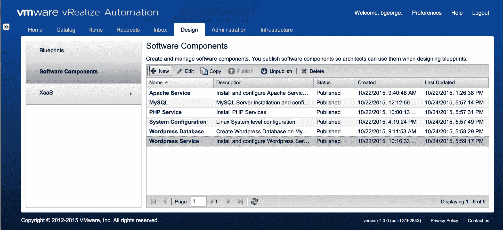
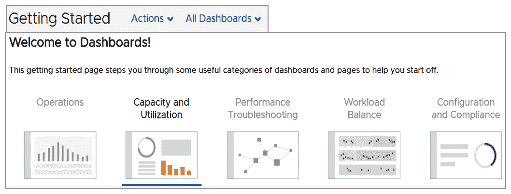
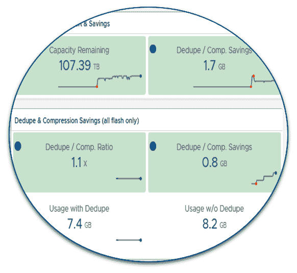
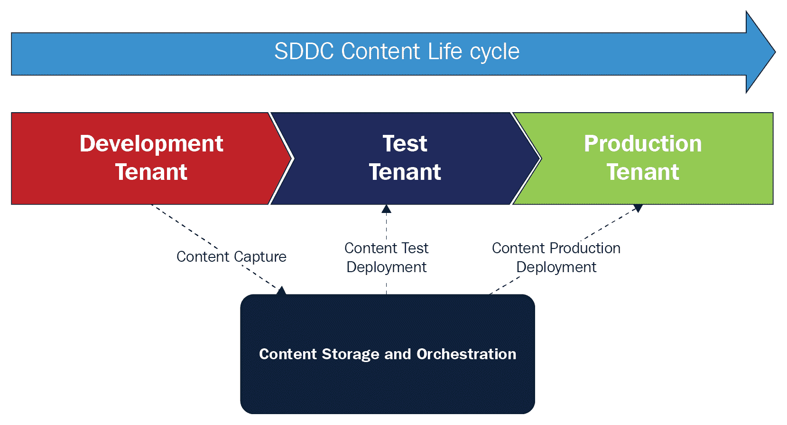
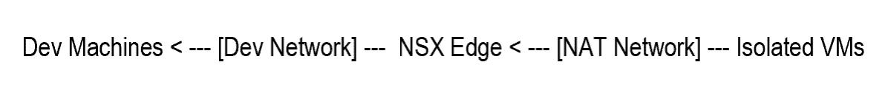
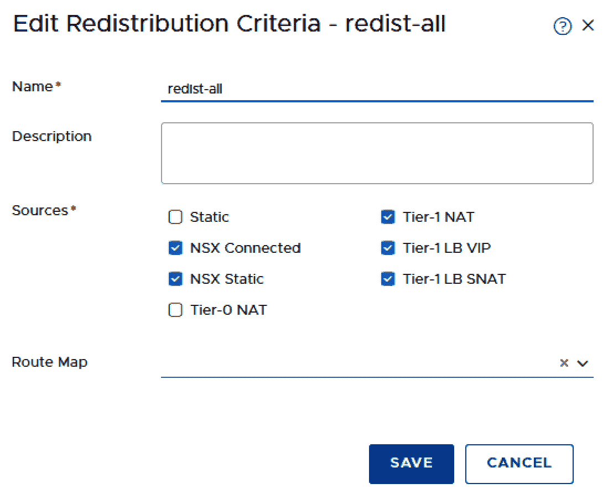
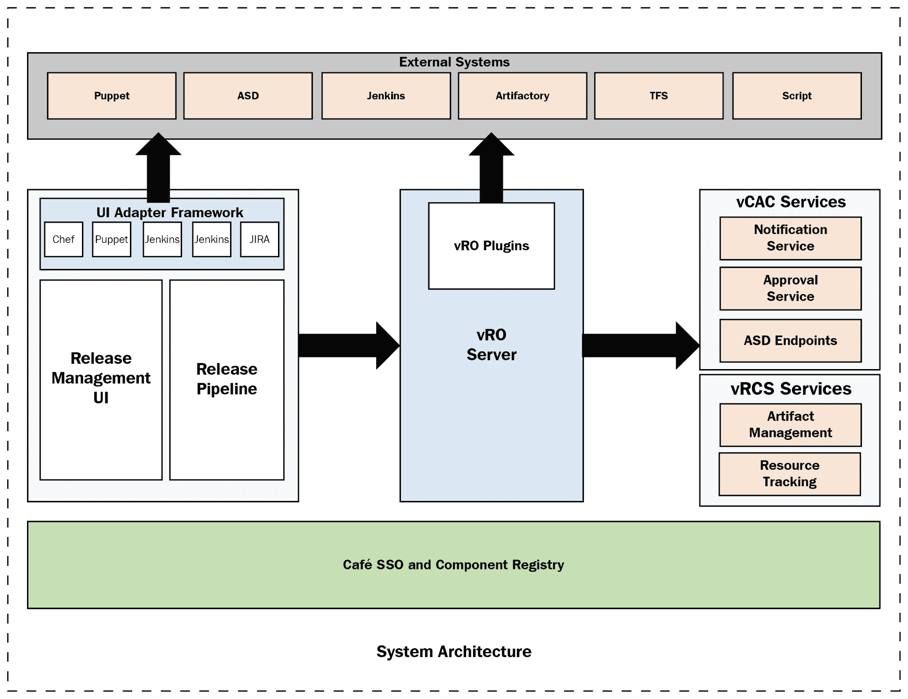
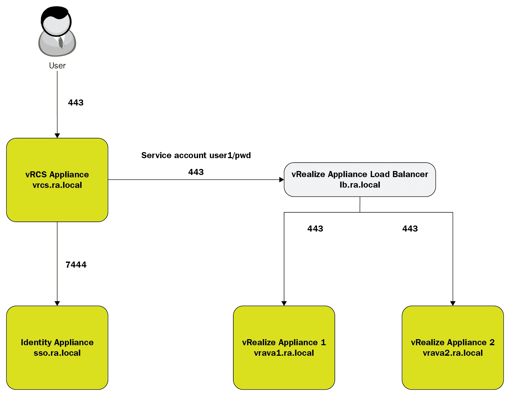

# 九、采用 vRealize 代码流的DevOps

DevOps 运维模式及其支持的 CI/CD 工具集实施方法正在改变 IT 资源的角色和职责，以及传统的设计、交付和运维流程。本章将使您能够进行采用 DevOps 所需的流程更改。我们将研究最高优先级的流程，以转换和应用技术来比较和对比传统运维模式、流程和团队结构与DevOps所需的战略运维模式之间的主要差异。我们还将了解 **VMware vRealize 代码流** ( **vRCS** )及其针对DevOps发布流程和连续应用交付的流程编排。

您将了解适用于私有云的 DevOps 云运维模式。这使开发人员能够利用 VMware 云计算自动化服务以及 Puppet 等配置管理工具来加速DevOps，从而无缝地部署、配置和管理生产就绪型应用。您还将学习使用 **VMware Kubernetes 引擎** ( **VKE** )的 CI/CD。

在本章中，我们将讨论以下主题:

*   应用开发生命周期
*   借助 vRealize 实现自动化
*   vRCS

# 技术要求

您可以从[https://my . VMware . com/web/VMware/info/slug/infra structure _ operations _ management/VMware _ v realize _ Code _ Stream/2 _ x](https://my.vmware.com/web/vmware/info/slug/infrastructure_operations_management/vmware_vrealize_code_stream/2_x)下载 VMware vRealize 代码流，从[https://www . VMware . com/download/EULA/wave front-term-of-service . html](https://www.vmware.com/download/eula/wavefront-terms-of-service.html)下载 VMware Wavefront。

# 应用开发生命周期

为了理解应用转换，理解应用开发生命周期方面发生的变化是很重要的。当变化的速度很慢时，应用开发总是有一个预先确定的计划和一个有限的最终目标。应用的设计是经过深思熟虑的，并且是预先同意的，包括捕获用户的所有需求。然后，接下来的一系列步骤包括制定计划、测试应用的功能、测试应用是否能够高效运行并达到正确的规模(非功能性测试)、用户验收测试，以确认应用已经按照预期的方式构建，然后最终以最终格式投入使用。

一些现代应用的变化速度，加上它们在本质上可能是非常实验性的，这意味着瀑布方法(最终的应用设计在前面已经被完全理解)是行不通的。相反，应用开发、应用设计、用户甚至客户测试都在快速迭代中进行，这意味着应用的开发有一个连续的反馈循环。开发团队也通常被分配到单独的组件，所以没有每个人都必须遵守的受控状态的概念。开发在同步流中进行，频繁的代码签入以确认整体功能。

我们可以在 CD、DevOps 和敏捷等术语中应用这些结果。虽然这些原则可以应用于传统的应用架构，但它们往往最适合基于云的应用工具、平台和架构。应该注意的是，这个领域有几个模型，尽管被广泛实践，但仍在不断成熟。

要意识到的一件非常重要的事情是，敏捷和 DevOps 并不是瀑布的替代品。客户将使用这两个规程，这取决于应用开发需求。将敏捷开发原则应用于任务关键的传统应用可能会产生可怕的后果，相反，您可以使用任意多的云技术，但是使用瀑布方法进行应用开发本质上是探索性的，这将从根本上削弱有效交付的能力。

# CD 管道

DevOps 通过执行以下程序来帮助完成 CD 管道流程:

*   **计划**:我们必须首先计划和定义软件发布周期；用户定义的用例；敏捷的计划行动；和后续计划中的问题制定适当的计划。
*   **代码**:这是由一组相关工具的过程定义的，允许我们编写脚本，以及评估和测试。它还有助于遵循定义的安全性和合规性指标。
*   **提交**:这可以帮助我们定义用于代码评估、合并的过程及其相关工具，并使用主要的源代码库执行它。这个堆栈还有助于通过日常测试、按需执行和主动扫描代码来维护源代码控制。

# CI 管道

CI 管道提供了过程、实践和工具来帮助自动化构建和测试源代码存储库中的每个代码提交。这包括自动化的安全性和合规性测试以及日志记录。

用于自动化单元、功能、安全性和符合性测试的测试过程、实践和工具，记录结果，并获得批准以将工件提升到流程中的下一个阶段。

工件存储库由服务和活动组成，这些服务和活动对于维护与可交付工件相关的版本、升级、治理和策略控制来说，是达到期望的最终状态所必需的。一般来说，这样的工件是那些从源代码转换成二进制包的工件，尽管可能存在其他转换。

我们不断开发和更新软件，以便软件可以通过 CD 按需发布到生产中。

该配置由服务和活动组成，这些服务和活动是实现所需最终状态所必需的，包括将应用自动等幂且快速地部署到静态和按需混合云基础架构。设计和实现将与预定义的 SDLC 流程保持一致，包括适当的源工件管理(例如，Puppet 模块、Chef 食谱、部署蓝图等等)。

控制堆栈由一些服务组成，这些服务对于实现管理工具链所需的最终状态是必要的，这些工具链是操作由该基础架构部署的应用所推荐的。这还将包括 SDLC 流程、工具、集成和行动，这些都是为特定客户维护已定义的服务级别协议所必需的。

反馈堆栈允许您在需要时获得自动反馈，如警报、审计报告、测试报告和部署过程报告。

# 规划

为了持续取得成功的业务成果，VMware 与客户合作评估、建议和记录实现最佳交付流程所需的变更。这一合作努力基于以下服务基础领域的行业最佳实践:

*   **软件开发生命周期** ( **SDLC** )
*   **源代码管理** ( **SCM** )
*   **持续集成** ( **CI** )
*   **工件库** ( **AR** )
*   **连续交货** ( **CD** )
*   **混合云供应** ( **HCP** )
*   **配置管理** ( **CM** )
*   **持续运维管理** ( **COM** )

# SDLC

SDLC 基础由服务和活动组成，这些服务和活动是实现最佳的人员角色、工具链和流程所必需的，以实现客户对软件交付生命周期管理的期望最终状态。

# 持有国家证书的助产士

SCM 基础由服务和活动组成，这些服务和活动是实现管理和版本控制软件源工件的期望最终状态所必需的。除了其他来源，源工件还包括应用源代码、文档、配置信息和过程控制流配置。

# 海峡群岛

CI 由服务和活动组成，这些服务和活动是实现自动化构建、测试和可交付(也就是二进制)工件创建的期望最终状态所必需的。在开发人员使用 Jenkins、Gerrit Triggers 和 vRA 等工具构建软件时，CI 流程通过快速反馈协助应用构建及其验证测试。

# 阿肯色州

VMware 和客户协作定义和完善将资源转化为客户可交付工件的流程和活动。这包括评估和重新调整活动和相关的关键责任角色、职责、所需的技能组合、关键交互，以及与支持服务定义流程和商定的用例及业务成果相关的移交。

AR 基础由服务和活动组成，这些服务和活动对于维护与可交付工件相关的版本、升级、治理和策略控制来说，是实现期望的最终状态所必需的。一般来说，这样的工件是那些从源代码转换成二进制包的工件，尽管可能存在其他转换。

# 发布管道自动化(CD)

CD 由服务和活动组成，这些服务和活动是在自动化治理和关于可交付工件的发布策略方面达到期望的最终状态所必需的。这包括提供必要的工具和集成，以协调人工控制的组织决策过程和自动化交付过程。

# 厘米

CM foundation 由一些服务和活动组成，这些服务和活动对于将应用自动、等幂且快速地部署到静态和随需应变的混合云基础架构来说，是实现所需最终状态所必需的。设计和实现将与商定的 SDLC 流程保持一致，包括适当的源工件管理(例如，Puppet 模块、Chef 食谱、部署蓝图等)。

# HC

HC foundation 由服务和活动组成，这些服务和活动是实现所需最终状态所必需的，这些最终状态是通过自动化资源调配来实现应用向混合云的部署。在这种情况下，混合云可能包括以下内容:

*   VMware vCloud Air、Linux containers、AWS 和其他异构云平台
*   内部虚拟化/云和物理基础架构

该基础服务包括提供工具和集成，这些工具和集成是为所有可交付的工件部署自动提供基础设施服务(即计算、网络和存储)所必需的。设计和实施将与商定的 SDLC 流程保持一致，包括适当的源工件管理(例如，配置蓝图、工作流脚本等)。

# 计算机输出缩微胶片

COM foundation 由服务和活动组成，这些服务和活动对于管理操作服务基础的工具链以及由该基础结构部署的应用来说，是实现所需最终状态所必需的。这包括合并流程、工具、集成和活动，这些是维护客户必须遵守或合理期望的任何**服务级别协议** ( **SLA** )所必需的。

# 反馈

当出现错误时，反馈到计划堆栈中是必要的。这包括错误报告和软件特性中的缺陷，包括操作软件及其底层基础设施所需的任何变更，所有这些都应该由编码栈进行跟踪处理。然后，循环继续。这个反馈然后进入计划堆栈，我们再次开始迭代。我们总是希望确保我们的所有产品都能很好地协同工作，并为我们提供想要的结果。我们的各种流程可以不断更新和改进，以跟上工具链、堆栈处理的代码类型以及托管最终应用的基础架构的变化和更新。

# 请求履行

vRealize Automation 通过跨混合云的统一 IT 服务目录，帮助用户请求和管理不同种类的 IT 服务。

以下是软件配置目录的屏幕截图:

它可以提供编程访问，以支持基于 DevOps 模型的软件的按需交付。

# 变更管理

vRO 有一个内部版本控制系统，可以自动跟踪变化。它具有 API 接口，可以与 Jenkins 等第三方工具集成，还具有审计日志，可以帮助用户审查更改和访问。vRA 可以通过与 Active Directory 集成来实现审批流程的自动化，还可以为备用审批者进行配置，以确保满足变更管理和业务需求。

# 发布管理

应用的发布过程已经发生了根本性的变化，这需要新的工具来跟上它。第一个变化是容器和微服务的兴起。它们支持更快的代码推送，但这是以增加复杂性为代价的。现在，您需要高速跟踪数千个指标，而不是您虚拟化环境的 100 个指标。旧式工具跟不上这些规模和变化，它们会失败。CD 和 DevOps 正在被大型企业采用，因此工程团队现在每天都要将代码投入生产多次，从而推动了对持续监控的需求。DevOps 是主流，尽管运维团队使用的工具仍然是零散的，因此会降低故障排除服务的速度。

# 合规管理

客户希望数据中心合规，因为这是他们 it 的延伸。公共事业部门、金融和医疗保健等受到严格监管的垂直行业在没有合规性认证的情况下无法使用此基础架构。运行混合云或公共云基础架构的客户依靠合规性认证而不是独立审核来确保适当的安全控制到位。许多引人注目的安全漏洞、法庭案例和全球立法变化已经提高了人们对在云中运行的复杂性和风险的认识。打开浏览器，进入[https://marketplace.vmware.com](https://marketplace.vmware.com.)。

AWS 上的 **VMware Cloud** ( **VMC** )正在着手实施合规认证和框架，首先针对**云安全联盟** ( **CSA** )和**通用数据保护条例** ( **GDPR** )，其次是**国际标准化组织** ( **ISO** )、**安全运维中心** ( **SOC** ) **支付卡行业**(**PCI**)**联邦风险授权与管理计划**(**FedRAMP**)**刑事司法** **信息服务** ( **CJIS** )。 目前存在的安全认证适用于云计算，应该认真考虑。云服务将应用政策、安全性、策略和合规性的强制原则，即使是最轻的需求用例也必须遵循这些原则。

# 事故管理

事件本质上是任何问题，如果不加处理，可能会导致客户升级。通过实施客户事件管理流程，我们可以避免许多升级。我们不会在任何地区定义客户上报流程。我们的客户关系管理方法必须不断发展，以强调预防升级的重要性。作为回应，我们可以计划识别事件、跟踪事件并解决事件，以避免事件升级。在此过程中的管理监督和指导应该有助于经理在这些情况升级之前解决它们。沟通是主要的焦点。通信协议必须定义人员、内容和时间。对顾客的回应必须在获得顾客满意的成本和投资成本之间取得平衡。在客户期望和问题导致升级之前，我们可以更好地管理它们。此流程的目的是在早期突出可能升级的问题，以便管理和执行监督可以及时应用，防止升级发生或降低升级的严重性(如果发生的话)。DevOps 团队现在充当 2 级支持，而在他们开始行动之前是 3 级支持。

# 事件管理

DevOps团队必须根据客户的要求，使用 vRealize tools 监控和管理计算、存储、网络、虚拟机、容器等方面的所有应用，并获得与应用相关的事件的关键警报。

# 容量管理

自定义配置文件允许您根据自己创建的规范自动进行容量计算，从而扩展容量规划的功能。选择一个承诺的项目将改变我们的容量数字，因为它假定资源是承诺的。如果我们不希望这些数字发生变化，那么我们可以返回并从容量和利用率控制面板中选择一个计划。维护模式允许我们防止计划内停机影响容量规划。

该解决方案必须能够主动确定虚拟环境的容量问题和风险。它必须提供容量趋势、需求预测和未来项目的假设影响分析:

将创建一个自定义仪表板供测试和开发团队使用。目的是提供 vSphere 基础架构中测试和开发虚拟机的特定视图，重点关注工作负载、剩余容量和可回收容量。以下组件将构成测试和开发仪表板:

*   开发虚拟机概述，显示服务器和工作站虚拟机的运行状况、风险和效率
*   虚拟机工作负载热图，用颜色标记以显示选定类型的虚拟机
*   上周剩余最低磁盘空间容量(%)的虚拟机:

*   空闲虚拟机和利用率最低的虚拟机，如果利用率指数变为 1，则标记为空闲
*   可回收容量显示可回收资源的百分比
*   已关闭的虚拟机和虚拟机被标记为已启动

# 波前仪表板

Wavefront 是一个指标驱动的监控和分析平台。运行 Box、Lyft、Intuit 和 Workday 等云原生应用的企业的 DevOps 和开发人员团队使用 Wavefront 来监控达到惊人规模的云应用的性能。Wavefront platform 收集并分析运行在 VMware Cloud on AWS、AWS containers、微服务、云基础架构甚至业务数据上的分布式应用的指标。一旦指标数据进入 Wavefront 时间序列数据库，Wavefront 客户就可以以 Wavefront 查询语言的形式应用强大而灵活的分析。开发团队使用它来以前所未有的规模监控他们的云服务和分布式应用的性能。他们可以更快地进行故障排除，并通过即时访问主动发出警报和检测领先的异常指标，统一可见性通过在所有云服务、基础架构和工具之间实现相同的可见性来加快代码发布。开发团队可以即时了解所有云服务。Wavefront 遍布数百名工程师，实现了自助服务方法，并使团队能够创新，因为 Wavefront 提供了数字环境中的可见性(数字服务就是业务)。业务决策与应用代码交付保持一致，这有助于每个人通过统一的可见性更快地行动。

Wavefront 提供了许多摄取数据的方法。我们可以直接从 AWS(API、CloudWatch 和 CloudTrail)中检索数据，并且可以从日志中创建指标。

Wavefront 与 DevOps 和开发人员团队的主要区别如下:

*   Wavefront 允许您应用高级指标和查询驱动的分析。有 100 多种数学变换可供您使用度量数据。我们可以使用分析更快地解决问题。波前，作为一个 SaaS 分析平台，提供大规模和高可用性。
*   它提供了可定制的仪表板，帮助开发团队在生产中获得代码的所有权。只需点击一下，就可以共享和导出仪表板。
*   智能警报和主动监控有助于(快速)检测领先指标或快速锁定异常情况，我们可以根据问题的预期形状或时间或我们定义的任何条件来隔离问题。

一旦 Wavefront 进入一个组织，它的采用将在数百名开发人员中传播，实现自助服务方法，并使他们能够以协作的方式进行创新。与代码发布保持一致的同步业务决策有助于 SaaS 企业更快地发展。因为 Wavefront 通常在领先的 SaaS 企业中采用，并且因为他们的云服务是他们的生命线，所以它可以帮助业务领导者做出分析驱动的业务决策。这些决策与云服务代码交付同步，帮助每个人更快地行动。

Wavefront 集成允许您收集、分析和利用来自任何数据源的数据，并对要记住的重要事情进行分层。Wavefront 集成有助于通过完整的 RESTful APIs 和用户界面加速这一过程。来自各个工具的数据可以与其他层相关联。波前在非常高的尺度下是独特的，具有这些特征。各层之间强大的相关性有助于我们跨越单点工具和指标平台取得成功。Wavefront 平台提供 RESTful APIs 以实现可扩展性。Wavefront API 与开发人员选择的任何工具或 DevOps 工具集成，使集成变得容易。例如，Lyft 希望保留他们的 Grafana 仪表盘，并使用 Wavefront 作为最具可扩展性的后端时序数据库。

# 通过监控人们的工作方式获得洞察力

我们必须监控人们的工作方式，更好地洞察业务和运维是否进展顺利。收集指标和监控人员总是很难，我们不能强迫人们自己生成指标。因此，借助 slack 等协作解决方案和 Wavefront 等 SaaS 指标监控解决方案，跟踪和监控人们的兴趣和活动并从中获得洞察力变得更加容易。Wavefront 允许您应用高级指标和查询驱动的分析。有 100 多种数学变换可用于处理指标数据。我们可以使用 Wavefront 更快地解决问题，这是一个具有大规模和高可用性的 SaaS 分析平台。它提供了可定制的仪表板，帮助开发团队在生产中获得代码的所有权。他们的控制面板具有一键式智能警报和主动监控功能，我们可以根据问题的预期形式或时间或任何已定义的条件来隔离问题。

# 借助 vRealize 实现自动化

vRA 可以设计成分布式、高可用的架构，提供多角色服务。这种具有负载平衡功能的高可用性架构可通过 vRA 安装向导进行配置，方法是将它与 VMware Identity Manager 集成，并采用高可用性模式进行**单点登录** ( **SSO** )。它将与嵌入式 vRA 设备 PostgreSQL 内部数据库群集在一起，因为外部 PostgreSQL 选项不再可用。它还具有集群嵌入式 vRO 服务以及工作流和可扩展性的高可用性。它访问 Microsoft Active Directory 服务器来执行用户身份验证和 Active Directory 组成员资格枚举。这提供了一个规定的参考体系结构设计，允许 SDDC 内容生命周期解决方案。该解决方案解决了以下三个主要目标:

*   不同环境之间 vRO 和 vRA 内容传输的自动化
*   vRO/vRA 内容存储和版本控制，包括回滚
*   使用自动化减少测试 vRO/vRA 内容合规性所需的时间和精力

这旨在允许经过身份验证的用户实现 vRA 环境之间的内容同步。项目中定义的服务如下:

*   内容包的创建
*   在测试/验证环境中测试包
*   将包部署到部署的目标环境中
*   端点管理(添加/删除)

下图显示了**的 SDDC 内容** **的生命周期**:

以下是组件:

*   **生产租户**是生产 vRA 租户端点。vRA 和 vRO 内容部署到此端点，以便终端用户可以使用。
*   **vRO** 使用捕获、测试和发布内容的工作流提供编排功能。
*   **工作流**被组织成代表内容生命周期的 vRCS 管道，允许内容通过开发、测试流入生产。
*   **氙气**提供内容存储功能。SDDC 内容在被捕获并在整个生命周期中受到版本控制后，存储在存储库中。
*   **用于托管解决方案服务的虚拟机的配置**基于部署支持多达 100 个管道和 30 个并行管道执行的基础设施的建议。

# 将基础设施部署为代码

我们需要配置 vRA 和 NSX，这将允许从开发环境中使用隔离的虚拟机网络。

所需解决方案的网络布局如下:

NSX Edge 将提供**源网络地址转换** ( **SNAT** )路由，以便隔离的虚拟机可以访问此布局中的外部开发网络资源。它还将提供**目的地 NAT** ( **DNAT** )端口转发，以便开发机器能够通过寻址该布局中的 NSX 边缘来访问目标隔离虚拟机上的特定服务。该设计还将利用 vSphere 链接克隆技术来最大限度地降低存储需求。vRA 资源调配将采用以下蓝图结构实施:

*   **基本 Windows 映像**:这将提供一个可通过 vRA 访问的空白 Windows 映像。
*   **基本 Linux 映像**:这将提供一个空白的 Linux 映像，可以通过 vRA 访问。
*   **Windows 链接克隆组件**:这将是基于从基本 Windows 映像和特定快照实例化的虚拟机的链接克隆蓝图。这表示要调配的实际隔离虚拟机。
*   **Linux 链接克隆组件**:这将是基于虚拟机的链接圆锥体蓝图，该虚拟机是从基本 Linux 映像和特定快照实例化的。这表示要调配的实际隔离虚拟机。
*   **多机蓝图**:这将是一个组件蓝图的集合，将被立即供应:

为正确设置机器，应包括以下组件:

*   **外部网络配置文件**:这是来自外部开发网络的子网定义，以及路由和 DNS 解析的详细信息:
*   **集群预留**:需要一个专用预留来将资源使用限制在单个数据存储上(以便链接克隆工作)，以及将网络端口组映射到外部网络配置文件。

*   **NAT 网络配置文件**:这是隔离的虚拟机将在 NSX 边缘后使用的子网的定义。这只是一个模板，稍后将被复制到多机蓝图组件分配中:

*   **预留策略**:这将是一个专用的预留策略，确保所有蓝图将只处理已创建的指定集群预留。
*   **机器前缀**:仅用于区分多机蓝图已经置备的机器。

# vRealize 代码流

vRealize Application Services 旨在对应用进行建模并自动调配。vRCS 是关于应用发布过程的建模。这两者是互补的:代码流依赖于与**虚拟现实即服务**(**vraa**)、脚本、Puppet 等等的集成来部署代码。代码流允许我们对整个发布过程以及跨阶段和/或环境(功能测试、负载测试、系统集成测试、试运行以及最终的生产)的构建升级进行编码或建模。这不仅包括触发应用部署(通过脚本或其他工具)，还包括在决定将构建提升到下一阶段之前触发测试并查看测试结果。

它还支持在一个阶段中为目前没有自动化的操作创建手动任务。它实际上是一个流程编排工具，而不是一个应用部署或配置解决方案。代码流允许我们触发单个工件(`.jar`、`.war`、配置文件等等)的部署，这与 vRAAS 相反，vra as 迫使我们重新部署整个堆栈，包括底层机器。一个代码流设备可以处理大约 100 个并发管道执行。Puppet、Chef 和其他配置管理工具不是代码流的直接竞争对手。这些工具通常用于配置和部署软件，但是代码流是关于建模一个发布过程的。代码流的核心价值实际上是将配置管理和基础设施供应，以及持续集成、测试和批准系统联系在一起，以自动化整个发布过程。

这有许多技术优势:

*   代码流可以自动化并加速任何类型软件的生命周期。这包括应用(传统的和云原生的)，以及基础架构和 IT 内容(蓝图、工作流、脚本、模板等)。
*   代码流没有规定某种类型的发布模型或工具集。它可以为刚刚起步的公司建模发布过程，并将大多数手动任务置于 100%自动化的发布模型中。因此，它适应一个组织的成熟度级别，并允许他们逐渐向更自动化的模型发展。
*   代码流允许团队向私有云和公共云供应和部署代码。代码流可以利用 vRA 的融合蓝图，或者与 Cloud Foundry 等其他配置解决方案配合使用。
*   VMware 提供了最佳的全堆栈和完全集成的解决方案，从基础 SDDC 到使用 vRA 的管理/配置层，并最终通过代码流发布自动化功能。因此，虽然所有产品都可以独立使用(没有供应商限制)，但当一起使用时，客户拥有一个无与伦比的平台来帮助他们变得更加敏捷。

我们可以在没有 vRA 的情况下安装代码流，因为部署这两种产品肯定有价值，可以从完全集成的自动化供应和自动化发布解决方案中获益。代码流支持两种部署模型:

*   独立，虚拟设备上仅启用代码流功能。然后，管理员可以选择配置代码流，通过外部 vRA 设备调配机器。
*   统一，在同一设备上同时启用代码流和 vRA 功能。vRA 还需要单独的 Windows 服务器来实现 IaaS 功能。生产不支持此配置。

Jenkins 是一个促进 CI 的构建自动化工具，CI 是一种开发实践，要求开发人员每天数次将代码集成到 Git 等共享源代码存储库中。然后，每个签入都由一个自动构建来验证，允许团队尽早发现问题。任何 CI 工具的核心都是自动化构建和构建相关活动的工作，例如构建前或构建后运行的测试。

代码流等发布自动化工具侧重于对更广泛的发布流程进行建模和自动化，一直到生产，这通常集成了 CI 和其他类别的工具，如供应、变更管理和监控，人们通常会为一些手动任务和/或批准这样做。公司经常使用发布自动化工具来实现 CD，在这种实践中，每一个好的构建都有可能被推向生产。CD 是 CI 的超集，涉及更多的工具和团队——不仅仅是开发，还包括操作和发布团队。发布自动化或 CD 工具的核心是对过程建模的管道，包括诸如批准之类的业务构造。

Jenkins 是一个可扩展的工具，可以定制为超越基本的构建和测试，以协调发布过程中的其他活动。我们可以定制 vRO 工作流来做 vRA 做的一些事情，但在某些时候，我们最终会编写太多的逻辑，以至于随着时间的推移，基于工作流的解决方案变得难以维护。基于 Jenkins 的定制解决方案也会发生同样的情况:它们最初可能会工作，但随着时间的推移会变得越来越难管理，尤其是当您试图管理更多的应用时。这是构建与购买方法的典型缺点。Jenkins Enterprise 有一个管道组件来实现发布自动化。它仍然缺乏关键功能，如手动任务和批准，以及将变量从管道中的一个步骤轻松传递到下一个步骤，这些功能通常由顶级发布自动化供应商提供。

由于以下原因，码流只能作为独立产品提供:

*   它不符合 vCloud 或 vRealize 等套件的所有要求和预期功能。例如，它不支持本地化、高可用性或无人值守安装。
*   它需要快速发展，并遵循比现有套件更频繁的发布节奏。
*   它与 vRA 共享一些公共服务，但它可以在没有 vRA 的情况下部署，以便不使用 vRA 的发布工程师或 DevOps 团队仍然可以拥有一个轻量级的持续交付解决方案。

# 管道自动化模型——任何种类软件的发布过程

vRealize Code Stream 由希望自动化其发布或 CD 流程的客户使用。vRealize Code Stream 允许开发人员和运维团队通过降低运维风险来更频繁地发布软件。它的设计原则是集成和扩展，而不是淘汰和替换，这样我们就可以在使用 SDLC 的同时使用现有的工具。这将有助于开发人员利用他们在工具和技能方面的现有投资。在写这本书的时候，vRealize Code Stream 有三个主要功能:

*   管道自动化
*   工件管理
*   发布仪表板

它将提供基于全面集成框架的 RESTful APIs 和功能。手动任务的一些示例如下:

*   **审批**:**代码流拥有自己的原生审批工作流功能，可与其他 vRealize 产品共享。批准可用于在管道执行的任何阶段添加人工监督。此外，Code Stream 还可以利用 vRO 插件调用工单系统来协调审批工作流。**
*   **建模手动任务**:需要手动执行的任务通常需要通过工单系统向任务所有者发出某种类型的通知。代码流利用 vRO 工作流和插件来集成现有系统，如 BMC Remedy **IT 服务管理** ( **ITSM** )、惠普服务管理器、ServiceNow 等。

# vRCS 部署架构

本章描述了推荐的 vrc 部署拓扑。vrc 可以利用 vRA 进行虚拟机调配。有几种可能的部署:

*   同一台设备上的 vrc 和 vRA(建议用于 vrc 和 vRA 都是实验室/评估系统的小型概念验证)
*   两个独立设备上的 vrc 和 vRA(建议用于大型概念验证或生产)

*   vrc 和 vRA 位于两个独立的设备上，其中 vRA 启用了 HA(建议用于大型 POC 或生产)
*   作为外部实体部署的 Artifactory

vRCS 不支持连接到外部 vRO，也不支持其自身的高可用性设置，但它可以与 vRA 的外部高可用性设置集成，以进行虚拟机调配:

*   同一台设备上的 vrc 和 vRA (vRA)
*   两台独立设备上的 vrc 和 vRA
*   两个独立设备上的 vrc 和 vRA，其中 vRA 启用了 HA
*   作为外部实体部署的 Artifactory

配置部署时，请注意以下事项:

*   如果 vRCS 和 vRA 部署在同一个设备中，它可以锁定整个设备。由于 vRA 的 HA 设置有自己的 SSO 服务器，并且没有身份联合支持，因此 vrc 必须使用共享用户帐户来访问 vRA。
*   请将 vRA 端点配置为共享帐户，而不是每个用户会话。vRCS 集成了**高级服务设计器** ( **ASD** )表单，vRCS 1.2 中还附带了一个名为 ASD 的新插件。这个插件只适用于内部 vRA。

# 系统结构

vRCS 架构描述了系统架构中涉及的各种组件。vrc 和 vRA 可以在具有适当许可证的同一设备上。vRCS 要求对端点进行配置，以便它可以与任何外部产品或服务部署集成。它需要来自 vRA 的端点，即使 vRA 和 vrc 在同一个设备中，vrc 也可以与 vRA 通信以进行虚拟机调配。

vrc 可以通过两种方式与 vRA 交互:

*   共享帐户(使用单个公共用户)
*   每用户会话(SSO):

用户可以访问以下端口:

| **服务器角色** | **端口** |
| vRCS/vRA 设备 | `443` |
| vRA 身份设备 | `7444` |

下图显示了 vRCS 通信工作流程:

除了用户需要的端口之外，管理员需要访问以下端口:

| **服务器角色** | **端口**  |
| vRA 身份设备 | `5480` |
| vRCS/vRA 设备 | `5480` |
| **服务器角色** | **入境口岸** | **服务/系统出站端口** |
| vRCS/vRA 设备 | `443`宋承宪:`22`VAMI: `5480` | 身份 VA: `7444` |
| vRA 身份设备 | `7444`宋承宪:`22`VAMI: `5480` | LDAP: `389`LDAPS: `636` |

# 将 vrc 与外部独立 vRA 集成

vrc 可以与现有的 vRA 集成，用于虚拟机调配。因此，需要创建一个端点，其中可以指定外部 vRA 端点相关的详细信息。在阶段中添加任务时，此端点将列在 provisioning 类别下。此端点可以支持共享帐户和每用户会话选项。如果外部 vRA 和 vRCS 链接到同一个 SSO 服务器，则每个用户会话和共享帐户这两个选项都受支持。但是，如果外部 vRA 有自己的 SSO 服务器，则仅支持共享帐户选项。这是因为不支持两个 SSO 服务器之间的身份联合。

用户需要访问以下端口:

| **服务器角色** | **端口** |
| vRCS | `443` |
| vRA 设备 | `443` |
| vRA 身份设备(代码流) | `7444` |

除了用户需要的端口之外，管理员还需要访问以下端口:

| **服务器角色** | **端口** |
| vRCS | `5480` |
| vRA 设备 | `5480` |
| **服务器角色** | **入境口岸** | **服务/系统出站端口** |
| vRCS | `443`宋承宪:`22`VAMI: `5480` | 身份 CS VA: `7444`vRA VA: `443` |
| vRA 设备 | `443`宋承宪:`22`VAMI: `5480` | 身份 vRA VA: `7444` |
| vRA 身份设备(代码流) | `7444`宋承宪:`22`VAMI: `5480` | LDAP: `389`LDAPS: `636` |

# 摘要

代码流提供了对任何类型的软件(应用、蓝图、工作流、配置文件、木偶清单、厨师食谱等等)的发布过程进行建模和可视化的能力。所有的涉众(开发人员、操作团队、发布工程师等等)都可以到一个中心位置来跟踪应用和软件发布的状态。用户不仅可以查看历史，还可以查看构建和发布失败的确切位置。Code Stream 和 vRA 使用相同的交付平台(相同的虚拟设备),并共享许多公共服务，包括捕获 IT 正在努力解决或花费大量时间的发布流程，并通过 vRCS 和 vRA 实现这些流程的自动化。

与购买、集成和管理不同的解决方案以实现资源调配和发布自动化不同，客户可以从单一解决方案中获益。通过与 JFrog Artifactory 等工件存储库集成，Code Stream 可以管理和跟踪新版本生成的多个工件版本，并跟踪它们在各种环境中的部署。随着公司更频繁地发布新的应用版本，部署错误的工件版本和中断生产的风险显著增加。为了帮助客户了解并将所有不同的存储库(Yum、NuGet、Nexus 等)集中到一个地方进行故障排除和安全审计，跟踪哪些工件被部署到了哪里是很重要的。代码流可以在 Java/Linux 和。NET/Windows 商店及其各自的工具集。某些发布管理工具(例如，Octopus、Microsoft Release Manager 和 Chef Delivery)只支持一种技术，或者针对一种技术或某些工具集进行了优化。代码流没有规定任何特定的工具集，这意味着它可以支持整个企业中使用不同技术的不同团队。事实上，它甚至可以用于非应用软件的生命周期:脚本、工作流、蓝图等等。

在下一章[第 10 章](5cce66c5-1e67-470e-a3f8-1ba791438615.xhtml)，*使用 ML 转变 VMware IT 运维*中，我们将了解如何从单一控制台管理不同的云模型，以及数据中心运维方法的分阶段转变。我们还将了解如何设计可扩展的基础设施，使用基于 ML 的解决方案在统一平台上托管传统和新的云原生应用。

# 进一步阅读

*   *DevOps 和敏捷开发—VMware* ，at[https://www . VMware . com/content/dam/digital marketing/VMware/en/pdf/solution overview/VMware-devo PS-Agile-development-white-paper . pdf](https://www.vmware.com/content/dam/digitalmarketing/vmware/en/pdf/solutionoverview/vmware-devops-agile-development-white-paper.pdf)
*   *v realize Code Stream Management Pack for IT devo PS—VMware*，位于[https://www . VMware . com/files/pdf/products/v realize/VMware-v realize-Code-Stream-Management-solution-brief . pdf](https://www.vmware.com/files/pdf/products/vrealize/vmware-vrealize-code-stream-management-solution-brief.pdf)
*   *DevOps-Ready IT:持续交付 vRealize Automation 蓝图*，位于[https://blogs . VMware . com/management/2016/05/devo PS-Ready-IT-Continuous-Delivery-of v realize-Automation-blue prints . html](https://blogs.vmware.com/management/2016/05/devops-ready-it-continuous-delivery-of-vrealize-automation-blueprints.html)
*   *vRealize Code Stream |应用发布自动化*，位于[https://www . VMware . com/in/products/v realize-Code-Stream . html](https://www.vmware.com/in/products/vrealize-code-stream.html)
*   *https://docs.vmware.com/en/vRealize-Code-Stream/index.html[的 vRealize 代码流文档—VMware 文档](https://docs.vmware.com/en/vRealize-Code-Stream/index.html)*
*   *使用云自动化从零到 DevOps Hero】，在[https://blogs . VMware . com/management/2018/10/devo PS-Hero-with-Cloud-Automation . html](https://blogs.vmware.com/management/2018/10/devops-hero-with-cloud-automation.html)*
*   *v realize Code Stream—VMware*，位于[https://code.vmware.com/web/sdk/2.2.0/vrealize-code-stream](https://code.vmware.com/web/sdk/2.2.0/vrealize-code-stream)
*   *面向 DevOps 管理员的 vSphere 集成容器概述—VMware vSphere* ，位于[https://VMware . github . io/vic-product/assets/files/html/1.1/vic _ dev _ ops/Overview _ of _ vic _ devo PS . html](https://vmware.github.io/vic-product/assets/files/html/1.1/vic_dev_ops/overview_of_vic_devops.html)