# 十二、在 vSphere 上虚拟化大数据

在本章中，您将学习在现代大数据平台中利用共享存储。我们将评估 vSphere 虚拟化平台上当前的内存大数据应用。这些平台的内存特性使它们对 I/O 和存储协议的依赖性降低。我们将介绍创建 Hadoop 集群时管理员的工作效率及其控制，并展示如何使用 Hadoop 管理工具将软件安装到虚拟机上。此外，我们将了解扩展和扩展的能力，这样平台上的任何工作负载都可以扩展，通过将资源池化以供多个虚拟 Hadoop 集群共享来利用所有可用的集群资源，从而实现更高的平均资源利用率。

我们将详细讨论以下主题:

*   大数据基础设施
*   开源软件


# 技术要求

您可以从[https://my.vmware.com/web/vmware/details?下载 VMware VSP here Big Data Extensions 2 . 3 . 2download group = BDE _ 232&product id = 676&rPId = 28154](https://my.vmware.com/web/vmware/details?downloadGroup=BDE_232&productId=676&rPId=28154)。


# 大数据基础设施

云实施总是有一个服务目录，其中包含可供消费的所有服务。它还有服务设计、目录管理和知识管理系统。这些服务将为组织提供加速运维和构建敏捷云服务框架的能力。我们必须定义一些角色、职责和功能来管理流程:

*   **服务所有者**:负责服务的价值和管理服务积压
*   **服务积压经理**:负责定义所有积压服务的优先级，包括功能性、非功能性和技术性需求
*   服务发布经理(Service release manager):负责通过交付新功能和维护现有服务来计划、安排和控制构建、测试和发布


# Hadoop 即服务

VMware vSphere **大数据扩展** ( **BDE** )是运行横向扩展集群 Hadoop 应用的平台。它提供了通过单一控制台更改配置的灵活性，以及在 vSphere 平台上以更高的可靠性和安全性纵向和横向扩展计算和存储资源的灵活性:

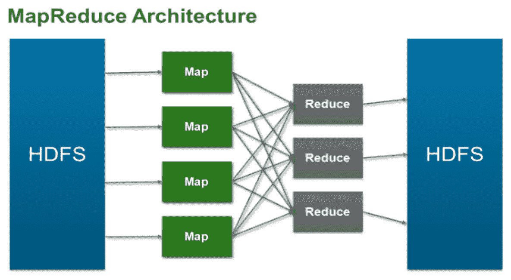

我们将 Hadoop 之旅分为三个阶段:

*   **阶段 1** :这就是我们所说的领航阶段；通常，我们看到的群集规模在 20 个节点以下。在此阶段，客户正在尝试 Hadoop，试图了解 Hadoop 的价值，并在许多情况下证明 Hadoop 在提供新的业务洞察力方面的价值。通常，旅程从业务线开始，有人希望在一两个用例上应用 Hadoop，通常是在企业正在收集但没有做太多的数据上。例如，我们采访的一家石油和天然气公司正在从油井和钻井平台收集所有这些传感器数据。借助 Hadoop，他们可以进行一些有趣的分析，并获得一些非常有趣的见解。
*   **第 2 阶段**:一旦 Hadoop 在大数据上的初始价值得到证实，企业通常会将这些用例整理成文，并作为生产工作负载定期运行。我们在这个阶段看到的一个常见现象是，当人们听说这个生产 Hadoop 集群时，他们希望利用它来探索他们的数据；越来越多的作业被添加到集群中，集群开始扩展和增长。我们看到的另一个共同点是，它不仅仅是关于 MapReduce 的核心 Hadoop 组件和 **Hadoop 分布式文件系统** ( **HDFS** )。Hive、Pig、HBase 等其他非核心 Hadoop 组件通常会添加到集群中。通常，我们会看到生产集群从几十个节点到数百个节点不等，并且它可能会非常快速地增长。在这里，通常有专门的 Hadoop 管理员来确保系统的健康。
*   **第 3 阶段**:在这个阶段，客户在整个组织中广泛使用 Hadoop，并围绕它构建了任务关键型业务工作流。例如，对于一家电子商务零售商来说，推荐引擎现在是他们业务的关键部分，而 Hadoop 是工作流的关键部分。通常，在这个阶段，我们会看到企业扩展到 Hadoop 之外，并将其他大数据技术和服务添加到组合中。通常，**大规模并行处理** ( **MPP** )数据库、NoSQL 数据库以及更多的非核心 Hadoop 组件都是大数据生产系统的一部分。就 Hadoop 节点而言，我们通常会看到成百上千个节点。在极端情况下，像雅虎和脸书这样的公司有几千个节点。


# 部署 BDE 设备

VMware 使您能够通过 vSphere BDE 在现有虚拟基础架构上轻松高效地部署和使用 Hadoop。BDE 使 Hadoop 能够感知虚拟化，提高虚拟环境中的性能，并支持在几分钟内部署高度可用的 Hadoop 集群。vSphere BDE 可自动部署 Hadoop 集群，从而提供更好的 Hadoop 可管理性和可用性。

让我们从这些步骤开始:

1.  在 VMware vSphere Client 中选择 File，然后转到 Deploy VMware-bigdata extensions-x . x _ ov F10 . ova。
2.  在“选择源位置”对话框中，单击“本地文件”单选按钮，单击“浏览”...，浏览到 identity appliance 的位置，单击“打开”,然后单击“下一步”:

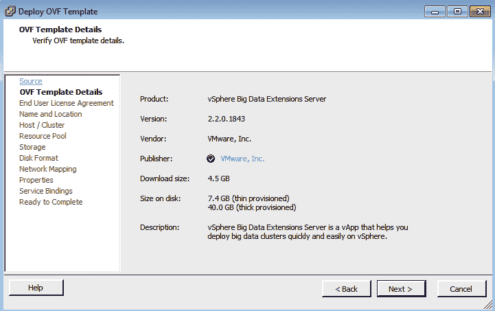

3.  在查看详细信息对话框中，查看摘要详细信息，然后单击下一步。
4.  在接受 EULAs 对话框中，通过单击接受按钮接受许可协议，然后单击下一步。
5.  在选择名称和文件夹对话框中，在名称文本框中输入虚拟设备的唯一名称。
6.  选择我们必须部署虚拟设备的文件夹或数据中心位置，然后单击下一步。对于 QA 部署，选择 East FP | Pumulus | QA 文件夹。
7.  在选择资源对话框中，选择要部署虚拟设备的群集，然后单击下一步。对于 QA 部署，选择 ECHADMIN01 集群。
8.  在“资源库”对话框中选择所需的资源库。
9.  选择 QumulusQA VMs 资源组。
10.  在选择存储对话框中，从选择虚拟磁盘格式下拉列表中选择要用于虚拟设备的磁盘格式。
11.  通过单击列表中的数据存储，选择要放置虚拟设备的数据存储。单击下一步。对于 QA 部署，选择 ECHADMIN01-DEV 和 QA-VMX 数据存储区群集。
12.  在磁盘格式对话框中，选择精简资源调配，然后单击下一步。
13.  在设置网络对话框中，使用目标下拉列表选择要将虚拟设备连接到的网络，然后单击下一步。
14.  对于 QA 部署，选择 xx.xxx.0.0/22。
15.  在即将完成对话框中，选中部署后打开电源复选框，然后单击完成。


# 配置 VMware BDE

我们将部署 vApp，打开电源，然后浏览管理服务器的控制台。此 vSphere 环境中配置了四个 Hadoop 集群。右侧的柱状视图显示了每个集群的名称、状态、运行的 Hadoop 发行版、所属的资源池以及节点列表。资源池管理 Hadoop 如何消耗底层物理资源。

在 vSphere 上配置 BDE 的步骤如下:

1.  以 Serengeti 身份登录，使用以下命令更改 Serengeti 用户密码:

```
run sudo /opt/serengeti/sbin/set-password –u
```

2.  使用 serengeti 用户关闭管理控制台和 SSH。通过运行以下命令来配置 YUM 存储库:

```
# cd /opt/serengeti/www/yum/repos/centos/6/base/RPMS/
wget http://mirror.centos.org/centos/6/os/x86_64/Packages/mailx-12.4-7.el6.x86_64.rpm
wget http://mirror.centos.org/centos/6/os/x86_64/Packages/wsdl4j-1.5.2-7.8.el6.noarch.rpm
```

3.  如果我们不能用`wget`连接，下载`.rpm`然后 winscp(开源工具)就可以了。要创建 repo，请运行以下命令:

```
createrepo ..
```


# BDE 插件

我们将通过单击主页图标，然后选择大数据扩展来访问 BDE 插件:

1.  打开网页浏览器，导航至`https://xx.xxx.x.xx:8443/register-plugin`。请记住，IP 地址将是用户特定的。

2.  选择“Install radial”按钮，用 vCenter 信息填写表单，然后单击“Submit ”:

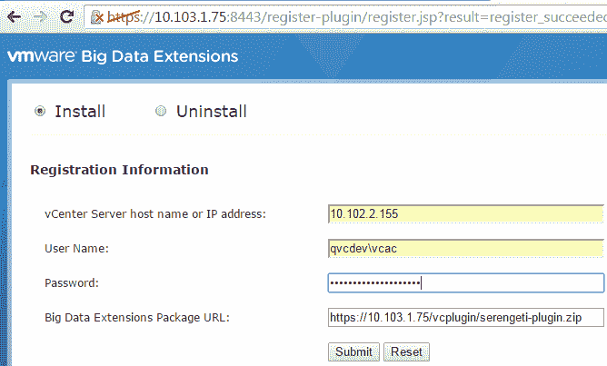

3.  单击 vSphere Web Client 中的“Big Data Extensions ”,然后单击“Summary”选项卡中的“Connect Server…”超链接，浏览清单树以找到管理服务器:

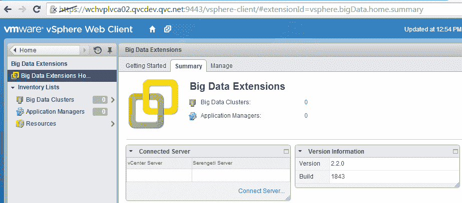

4.  单击“确定”接受证书。现在，服务器已在“摘要”选项卡中连接。
5.  要设置 Hadoop YUM 存储库，请以 root 用户身份 SSH 到 YUM repo 服务器。键入 VMware 知识库文章中显示的命令([https://kb.vmware.com/s/article/2091054](https://kb.vmware.com/s/article/2091054))来配置 **Hortonworks 数据平台** ( **HDP** ) 2 YUM。
6.  在`http://puppet2.qvcdev.qvc.net/hdp/2/`浏览到新的回购。我们将在此环境中利用现有的 YUM repo 服务器。


# 在 BDE 上配置发行版

我们现在将使用 Serengeti 用户帐户通过 SSH 登录到 Serengeti 管理服务器:

1.  使用 PuTTY SSH 到管理服务器，然后双击桌面上的 PuTTY 图标
2.  单击 SerengetiCLI 会话，然后单击打开
3.  运行以下命令:

```
# navigating to the scripts directory

cd /opt/serengeti/sbin
[root@10 sbin]# ./config-dist
ro.rb \
> --name qumulusqahdp \
> --vendor HDP \
> --version 2.x.x \
> --repos http://puppet2.qvcdev.qvc.net/hdp/2/hortonworks-hdp2.repo
```

`qumulushdp`发行版成功添加到`/opt/ erengeti/www/distros/manifest`中。

旧货单备份到`/opt/ serengeti/www/distros/manifest.bak`。

```
[root@10 sbin]# sudo service tomcat restart
```

4.  登录 vCenter Web 客户端，从左侧的树中单击“大数据扩展”
5.  单击大数据群集，然后单击图标添加新群集(绿色+)

我们可以在 Hadoop 发行版中看到新的 HDP 发行版的名称。请记住，该名称将与我们运行`./config-distro.rb` ( `pumulushdp`)时指定的参数相匹配。


# vRO 中的 Hadoop 插件

我们现在可以看到 vRO 如何集成 BDE 插件并运行工作流:

1.  在`https://xx.xxx.x.xx:8283/config_general/General.action`登录 vRO 配置页面:

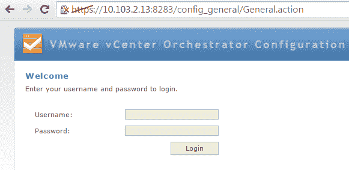

2.  单击左侧的插件选项卡:

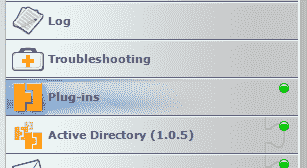

3.  向底部滚动并点按放大镜。找到放大镜并选择所需的插件文件:

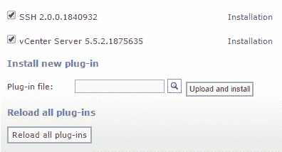

4.  单击上传和安装按钮。
5.  接受许可协议。

这是 VMware vRealize Orchestrator 控制台，我们可以通过它来管理任务:

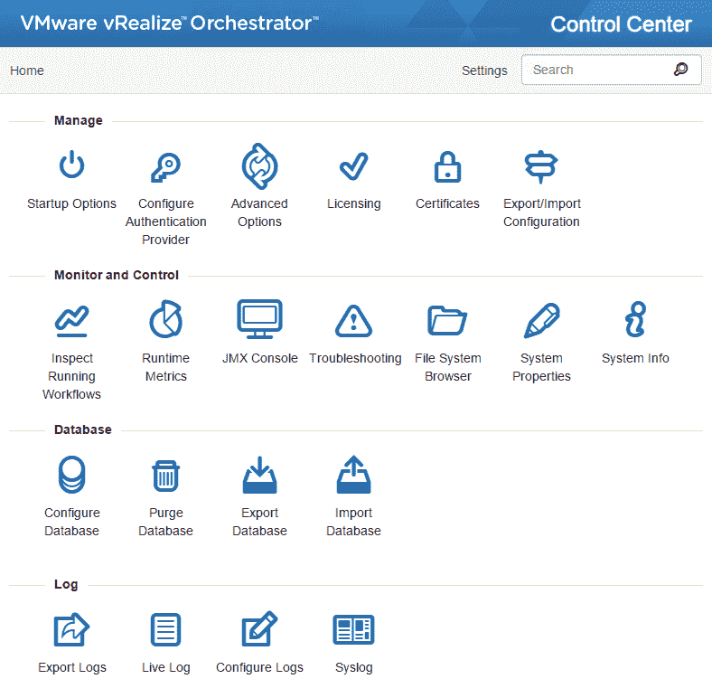

6.  单击“启动选项”以重新启动 vRO 服务，并重新启动 vRO 配置服务器。
7.  登录 vRO 客户端，在“运行”下，选择“工作流”。
8.  在 Library 下，您应该会看到 Hadoop 集群即服务。
9.  展开 Hadoop 集群即服务，然后展开配置。右键单击配置 Serengeti 主机，然后单击启动工作流:

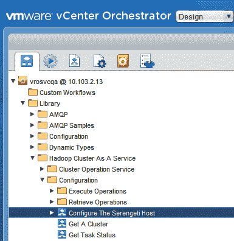

10.  键入 Serengeti 管理服务器的 URL 作为`https://xx.xxx.x.xx:8443/serengeti`。
11.  以 UPN 格式输入 vCenter 上管理用户的用户名(例如，`user@domain.com`)。输入管理用户的密码，然后单击提交:
    *   Serengeti 主机的连接 url:例如，``https://10103.3.18:8443/serengeti``
    *   vCenter Server 用户名:例如，`vrasvcqa@qvcdev.qvc.net`:

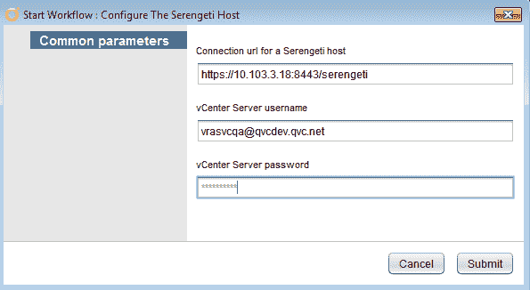

12.  我们收到一个关于导入证书的问题。在表单的最后一页，从下拉列表中选择安装证书…

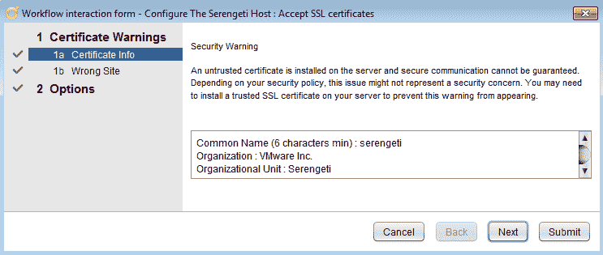

13.  单击下一步，然后单击提交:

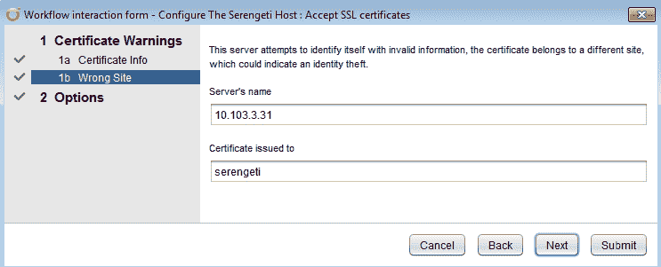

Serengeti 主机现在已经完全配置好了。

我们可以使用 VRO 配置集群，因为工作流“配置 Serengeti 主机”将 rest 主机连接和操作超时值硬编码为 30。

以下屏幕截图显示了工作流创建设置；用户可以根据自己的需求创建不同的工作流:

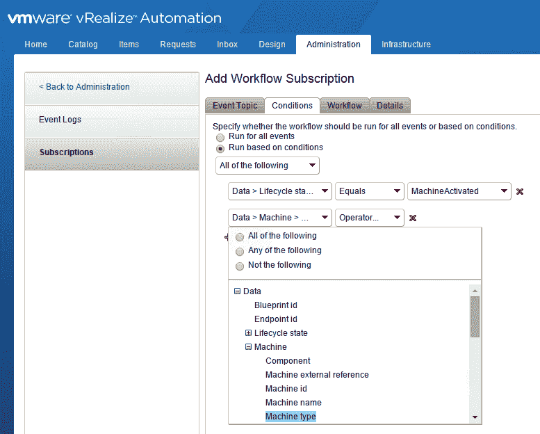

我们必须在 vRA 的 BDE 集群蓝图中选择网络或数据存储资源选项。在 Web 客户端应该有一个下拉选项来选择某个 BDE 资源。这需要在 vRA 蓝图表格上定制。配置 Serengeti 主机，为连接和操作添加超时值。我们还可以从 vSphere web 控制台中选择 BDE 集群大小(小型、中型、大型)。这个需要从 vRA 蓝图在蓝图端定制。


# 开源软件

与传统的专有解决方案相比，组织需要大量的技能来接受开源，因为从零开始构建一个具有所有集成支持的解决方案与利用久经考验的供应商解决方案之间存在巨大差异。对于许多企业来说，这些挑战太令人望而生畏，削弱了开源选择的价值。商业策略、投资和许多其他因素都会发挥作用。在这种情况下，企业会发现商业支持的开源解决方案或专有解决方案更好地支持他们的战略。客户构建数字和在线销售渠道作为其走向市场战略的支柱，开发符合其业务用例独特需求的 OpenStack 专有实施。

客户投入了时间、人才和资源来完善 OpenStack，以满足他们的特定需求。一家大型体育零售商选择了基于开源的解决方案，而不是实施 OpenStack 的商业发行版。VMware Integrated OpenStack 帮助客户节省他们的时间和资源，将他们的技术人才投入到优化其战略中面向客户的部分。不可否认，开源是当今每个公司软件组合的战略组成部分。虽然开源软件有它的长处，但生产就绪并不是它的最高属性之一。还有很多工作要做:让代码符合商业销售产品的标准不是一项无足轻重的投资，而且需要专门的技能。

从选择到测试、集成和安全，都需要一些组装。对于大多数企业来说，这不是他们想做的投资；他们最好投资于他们的核心能力，而不是成为一个开源项目的专家。这就是商业提供商(如 VMware)介入提供企业可以依赖的实用、实用的开源软件的地方。

**Open vSwitch** ( **OVS** )是 VMware 贡献的另一个例子。代码被转移到 Linux 基金会协作项目，以获得 VMware 的持续社区支持，并将继续发挥积极作用，因为 VMware 工程师负责多达 70%的 OVS 活动提交。这些贡献被认为是个人的，整个行业的社区支持继续增长。VMware 正在对物联网领域进行战略投资，EdgeX 和**n**网络功能虚拟化 ( **NFV** )在 **o** **pen 网络自动化平台** ( **ONAP** )方面拥有专业知识。

**Clarity** 是一个很好的例子，它在内部创建软件，并选择开源软件以造福更广泛的社区。Clarity 是一个 UX/UI 设计框架，因为它在应用的视觉方面帮助开发者和设计者。Clarity 是在 VMware 内部开发的，以满足产品的用户界面/UX 需求，但它并不依赖于 VMware 产品来工作或提供价值。它几乎可以在任何环境中应用和使用，所以选择开源它。Clarity 已经起步，因为它有一个活跃的社区，下载次数超过 10 万次，主页浏览量接近 100 万次。我们的开源项目还包括帮助开发人员提高效率的工具和套件。

挑战握手认证协议(CHAP)是一种工具，用于分析未检测的 ELF 核心文件的泄漏、内存增长和损坏。

VMware 产品基于开源，我们支持开源并为此做出贡献，但我们不是开源软件公司。VMware 软件，无论是专有的还是基于开源的，都是生产就绪的:它得到了全面的支持、全面的测试和优化，是安全的，可以随时部署。


# 考虑具有资本支出和运维支出的解决方案

我们可以看到，对于开源解决方案，资本支出成本随着许可成本的降低而降低，而运维支出成本随着部署和维护开源解决方案所需的支持和熟练技术人员而上升。我们看到资本支出越来越受欢迎，这反映了一个**商业现成** ( **COTS** )软件解决方案的许可和支持合同成本，而运维支出下降，因为修补、升级、增强和保护软件的负担落在了供应商身上，而不是企业 IT 部门。

这不是 1:1 的权衡，而是您必须在整个企业中考虑的事情，这不是一个短期的决定；它具有长期的、结构性的和战略性的影响。如果您正在努力招聘或留住员工，转换到开源解决方案，依靠您的知识产权和技术能力使解决方案工作，可能会使您处于非常危险的境地。你可能会被顾问或外包公司所控制，他们承诺在你接近生产运作时会握着你的手。这些成本很少随着时间的推移而下降。另一个可以考虑的选择是混合解决方案:商业支持的开源发行版或开源项目的商业化版本。另一个可供探索的选项是两级选项:一些公司提供一个*社区版本*，这是他们免费提供的开源项目，并提供第二个版本，通常标记为*企业版，*，这是一个出售的产品，提供更强大的软件版本，并得到完全支持。我们可以利用开源来构建我们的战略，并为业务做出正确的决策。因此，从基础开始，我们必须知道我们的应用开发人员或 IT 人员在哪里以及如何利用开源，并了解他们选择背后的决策，包括优势和差距。

当我们的团队开始参与开源项目时，用指南武装他们，让他们对自己的贡献充满信心。对于有关知识产权、许可证类型和合规性以及安全第一选项的最佳实践的问题，我们应该有一个单一的联系点。如果我们想要创建一个新的开源项目或者在一个现有项目的更深层次上参与，一定要理解战略意图。这是一个长期的承诺，需要在人才和时间上的投资，否则我们的努力将会失败，因为它们耗时、分散注意力、耗费金钱，而且可能会令人讨厌。我们必须评估在开源解决方案和专有的、供应商支持和销售的解决方案之间的选择，因为这是一个战略选择，而不仅仅是一个购买决定。我们需要权衡资本支出和运维支出的利弊，并仔细评估我们的长期承诺和雇佣员工的能力。我们可以通过讨论来了解成本和收益以及技术曲线。


# 虚拟化 Hadoop 的优势

虚拟化 Hadoop 的优势如下:

*   **按需配置**:根据定义的策略自动执行集群部署流程
*   **连续可用性** : vSphere 内置的高可用性保护可保护单点故障
*   **灵活性**:资源(CPU、内存、网络和存储)可以根据您的需求按需扩展和缩减
*   **多租户环境**:根据安全合规性，运行 Hadoop 的不同租户可以隔离在共享基础架构中


# 用例–安全性和配置隔离

Hadoop 身份验证和授权模型很弱。敏感数据很难保护。它有多个 MapReduce 工作负载，用于生产批量分析、即席分析和针对不同作业的不同 SLA 的实验任务。

我们需要考虑以下几点:

*   在合理的情况下，整合 HDFS 以最大限度地减少数据重复
*   高优先级作业获得更多资源，以确保它们按时完成
*   每种类型的作业都可以在任何时候获得尽可能多的资源
*   避免 CPU 和内存争用，以便更好地利用资源按时完成工作

我们的目标是通过拥有大数据共享基础架构来集成 Hadoop 工作负载和其他工作负载。Hadoop MapReduce 框架使用 HDFS 作为底层文件系统来处理大型数据集，并使用自己的存储机制。我们还有其他技术，比如 HBase 和 Pivotal。


# 案例研究–为一家大型媒体提供商实现应用交付自动化

以下是挑战:

*   客户要求任何应用都必须可部署到任意数量的后端基础架构，跨越多个私有云
*   一个特定的应用(拥有超过 10，000 台服务器)需要更好的配置过程和工具，以确保达到规定的目标
*   客户当前的资源调配模式需要进行大规模改造，因为启动时间即使不是几个月，也要几周，而且大部分是由手动过程组成的

以下是解决方案:

*   通过**业务流程管理** ( **BPM** )平台/工作流引擎和底层 Java 服务，使用版本控制、软件定义的基础设施实施基于工作流的自动化方法
*   利用 Puppet 架构进行构建过程和打包，并利用面包店工作流程制作图像
*   通过基于 Ruby 的控制台和报告 UX 提供对操作的洞察

*   将吉拉集成到配置工作流中，将使交付易于使用熟悉的工具
*   提供应用服务器和必需数量的 Memcached 及相关实例
*   新系统验证新供应的基础设施，提供任何故障的自动清理，并自动切换路由规则以服务于新的基础设施
*   为客户提供可重复操作所需的工具和模式
*   创建了更好的构建过程和流程，从而产生更稳定的基础设施变更
*   270 台服务器的目标基础架构部署时间从数周/数月缩短到 90 分钟


# 摘要

对于许多企业来说，Hadoop 仍然是相当新的，不同的公司处于其 Hadoop 采用之旅的不同阶段。在与一些客户就此进行合作后，很明显，根据客户所处的阶段，有不同的 Hadoop 使用案例和要求。虚拟化有助于解决每个阶段的所有关键需求。一个公司内的不同部门可以使用多个 Hadoop 集群。

很难管理一个公司中不同部门的多个集群并保持它们良好运行。我们有多个用例运行数据挖掘、推荐引擎，对于我们的在线服务，我们有一个共享的数据集，而不是到处复制数据。我们现在管理单个集群，而不是多个集群。

在下一章中，我们将了解如何在通用 vSphere 平台上为开发人员提供对传统和现代应用开发框架和资源的访问，包括容器服务和开放 API，从而支持云原生应用开发。这使得基于微服务的架构能够更快、更频繁地进行开发，而不会影响安全性、可靠性或治理。


# 进一步阅读

查看以下资源，了解本章所涵盖主题的更多信息:

*   *Adobe 在 VMware vSphere 上部署 Hadoop 作为服务*在[http://www . VMware . com/files/pdf/products/VSP here/VMware-VSP here-Adobe-deployments-HAAS-cs . pdf](http://www.vmware.com/files/pdf/products/vsphere/VMware-vSphere-Adobe-Deploys-HAAS-CS.pdf)
*   *在大规模基础架构中虚拟化 Hadoop，EMC* 在[https://community.emc.com/docs/DOC-41473](https://community.emc.com/docs/DOC-41473)发布的技术白皮书
*   *在高性能服务器上使用 VMware vSphere 6 实现虚拟化 Hadoop 性能*在[http://www.vmware.com/resources/techresources/10452](http://www.vmware.com/resources/techresources/10452)
*   *在[http://www.vmware.com/resources/techresources/10222](http://www.vmware.com/resources/techresources/10222)进行的 vSphere 上虚拟化 Hadoop 性能的基准测试案例研究*
*   *交易处理委员会—TPCx-HS 基准测试结果(Cloudera on VMware performance，由戴尔提交)*http://www.tpc.org/tpcx-hs/results/tpcxhs_results.asp
*   *ESG 实验室审查:VCE v block/采用 EMC Isilon for Enterprise Hadoop 的系统*位于[http://www . ESG-global . com/Lab-reports/ESG-Lab-Review-VCE-v block-systems-with-EMC-Isilon-for-Enterprise-Hadoop/](http://www.esg-global.com/lab-reports/esg-lab-review-vce-vblock-systems-with-emc-isilon-for-enterprise-hadoop/)
*   *VMware BDE 文档网站:VSP here Big Data Extensions(BDE)*at[https://www . VMware . com/support/pubs/VSP here-Big-Data-Extensions-pubs . html](https://www.vmware.com/support/pubs/vsphere-big-data-extensions-pubs.html)
*   *位于[https://www . VMware . com/support/pubs/VSP here-Big-Data-Extensions-pubs . html](https://www.vmware.com/support/pubs/vsphere-big-data-extensions-pubs.html)的《VMware vSphere 大数据扩展—管理员和用户指南》以及《命令行界面用户指南》*
*   *有关 BDE 版本 2.1 的博客文章*位于[http://blogs . VMware . com/VSP here/2014/10/whats-new-VSP here-big-data-extensions-Version-2-1 . html](http://blogs.vmware.com/vsphere/2014/10/whats-new-vsphere-big-data-extensions-version-2-1.html)
*   *VMware 大数据扩展(BDE)社区讨论*在[https://communities.vmware.com/message/2308400](https://communities.vmware.com/message/2308400)
*   *使用 VMware VSP here Big Data Extensions*的 Apache Hadoop 存储配置位于[https://www . VMware . com/files/pdf/VMware-VSP here-BDE-Storage-Provisioning . pdf](https://www.vmware.com/files/pdf/VMware-vSphere-BDE-Storage-Provisioning.pdf)
*   *Hadoop 虚拟化扩展*位于[http://www . VMware . com/files/pdf/Hadoop-virtual ization-Extensions-on-VMware-VSP here-5 . pdf](http://www.vmware.com/files/pdf/Hadoop-Virtualization-Extensions-on-VMware-vSphere-5.pdf)
*   *带有大数据扩展的 vSphere 上的容器编排*位于[https://labs . VMware . com/flings/Big-Data-Extensions-for-VSP here-standard-edition](https://labs.vmware.com/flings/big-data-extensions-for-vsphere-standard-edition)