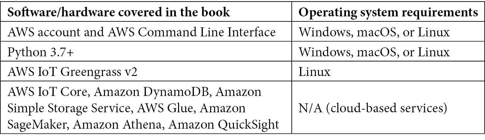

# 零、前言

**物联网** ( **物联网**)已经改变了企业思考和与世界互动的方式。传感器可以测量大批量工业制造操作的性能或偏远岛屿的日常环境健康。物联网使得以各种精度研究世界成为可能，并在任何地方实现数据驱动的决策。**机器学习** ( **ML** )和弹性云计算加速了我们对物联网产生的海量数据的理解和分析能力。借助边缘计算，数据分析和 ML 模型可以在生成数据的源本地处理信息。

这本书将教你结合边缘计算和机器学习技术来交付下一代网络物理成果。首先，您将了解如何使用亚马逊网络服务(如 AWS IoT Greengrass)的软件创建在边缘设备上运行的软件应用。随着您的进步，您将了解如何处理物联网数据并将其从边缘传输到云，并使用亚马逊 SageMaker 使用它来训练 ML 模型。该书还向您展示了如何优化这些模型，并在边缘运行它们，以获得最佳性能、成本节约和数据合规性。

到本书结束时，您将能够确定自己的物联网工作负载的范围，将机器学习的力量发挥到极致，并在生产环境中操作这些工作负载。

# 这本书是给谁的

本书面向负责向边缘交付分析和机器学习支持的软件解决方案的物联网架构师和软件工程师。想要学习和构建物联网解决方案的亚马逊网络服务用户会发现这本书很有用。要充分利用这本书，需要具备在 Linux 上运行 Python 软件的中级经验。

# 这本书涵盖了什么

[*第 1 章*](B17595_01_Final_SS_ePub.xhtml#_idTextAnchor013) ，*机器学习的数据驱动边缘介绍*，介绍了边缘等概念以及机器学习在边缘运行时如何具有独特的价值。它高度概括了消费和工业环境中的使用案例。它为将指导本书实践活动的虚构场景设置了背景。

[*第 2 章*](B17595_02_Final_SS_ePub.xhtml#_idTextAnchor032) ，*边缘工作负载的基础*，概述了设计边缘解决方案的关键考虑事项，并介绍了 AWS IoT Greengrass 的使用。

[*第 3 章*](B17595_03_Final_SS_ePub.xhtml#_idTextAnchor052) ，*构建边缘*，通过更高级地使用 AWS IoT Greengrass 为您的业务逻辑创作软件组件，深入到构建边缘解决方案的下一层细节。

[*第 4 章*](B17595_04_Final_SS_ePub.xhtml#_idTextAnchor073) ，*将云扩展到边缘*，介绍如何构建具有原生云连接的边缘解决方案，并通过互联网将软件部署到远程设备。它还介绍了 AWS 提供的软件组件，用于抽象出 edge 功能的常见需求。

[*第 5 章*](B17595_05_Final_SS_ePub.xhtml#_idTextAnchor090) ，*从边缘*获取和流式传输数据，介绍如何为物联网工作负载执行数据建模，以及为什么它很重要。它还介绍了在边缘收集、接收和处理数据流的各种架构模式和反模式。

[*第 6 章*](B17595_06_Final_SS_ePub.xhtml#_idTextAnchor119) ，*在云上处理和消费数据*，阐述了物联网与大数据技术的集成如何在云中实现大容量复杂数据处理。它还深入探讨了如何将数据处理设计模式从边缘扩展到云，以消除高级用例的障碍。

[*第七章*](B17595_07_Final_SS_ePub.xhtml#_idTextAnchor138) ，*边缘的机器学习工作负载*，介绍了物联网工作负载背景下的机器学习概念。它还深入探讨了机器学习工作流程的不同阶段，以及适用的设计模式和反模式。

[*第 8 章*](B17595_08_Final_SS_ePub.xhtml#_idTextAnchor163) ，*面向边缘的 DevOps 和 MLOps*，阐述了如何将 DevOps 和 m lops 的概念用于物联网工作负载，以实现从云到边缘的敏捷开发实践。

[*第 9 章*](B17595_09_Final_SS_ePub.xhtml#_idTextAnchor182)*大规模车队管理*，介绍了使用云原生物联网工具链进行车队管理的概念。它还深入探讨了现实世界中适用于大规模车载物联网设备的不同场景和机制。

[*第 10 章*](B17595_10_Final_SS_ePub.xhtml#_idTextAnchor199) ，*用 AWS 架构良好的框架评审解决方案*，总结了本书的主要经验和步骤，介绍了如何用 AWS 的多方面评审框架评审解决方案的设计。鉴于从本书中学到的经验，它还为物联网架构师提供了下一步要采取的措施。

从这本书中获得最大收益

你需要一台运行 Windows、macOS 或 Linux 的个人电脑。该计算机在终端中使用 AWS 命令行界面，并通过 web 浏览器使用 AWS 管理控制台。第二个基于 Linux 的系统充当边缘设备，并托管运行 AWS IoT Greengrass 的边缘解决方案。第二个系统可以是本地或远程虚拟机，也可以是 Raspberry Pi 之类的实际设备。对于真正的物联网体验，我们建议使用带有 SenseHAT 扩展板的 Raspberry Pi 3B(或更高版本)来完成本书的实践部分。如果没有硬件设备，可以使用 Ubuntu Linux 虚拟机。最终，无论有没有第二个设备，你都可以完成所有的实际操作步骤。

将 AWS 用于基于云的服务确实会产生少量成本。您需要访问 AWS 帐户或自己创建一个帐户。完成所有动手操作部分的费用最高可达 25 美元。您可以选择退出 ML 训练步骤，将成本降至 5 美元以下。



在创作时，AWS IoT Greengrass v2 不支持 Windows 安装。与 edge 解决方案相关的实践部分是特定于 Linux 的，不能在 Windows 上运行。

**如果你使用的是这本书的数字版，我们建议你自己输入代码或者从这本书的 GitHub 库中获取代码(下一节有链接)。这样做将帮助您避免任何与复制和粘贴代码相关的潜在错误。**

# 下载示例代码文件

你可以从 GitHub 的 https://GitHub . com/packt publishing/Intelligent-Workloads-at-the-Edge 下载本书的示例代码文件。如果代码有更新，它会在 GitHub 库中更新。

我们在 https://github.com/PacktPublishing/也有丰富的书籍和视频目录中的其他代码包。看看他们！

# 下载彩色图像

我们还提供了一个 PDF 文件，其中有本书中使用的截图和图表的彩色图像。您可以从这里下载:

[https://static . packt-cdn . com/downloads/9781801811781 _ color images . pdf](_ColorImages.pdf)

# 习惯用法

本书通篇使用了许多文本约定。

`Code in text`:表示文本中的码字、数据库表名、文件夹名、文件名、文件扩展名、路径名、伪 URL、用户输入和 Twitter 句柄。这里有一个例子:“要使用 Amazon SageMaker 调试器，您必须用三个额外的配置参数来增强`Estimator`:`DebuggerHookConfig`、`Rules`和`ProfilerConfig`。”

代码块设置如下:

```py
#Feature group name
weather_feature_group_name_offline = 'weather-feature-group-offline' + strftime('%d-%H-%M-%S', gmtime())
```

当我们希望将您的注意力吸引到代码块的特定部分时，相关的行或项目以粗体显示:

```py
@smp.step
def train_step(model, data, target):
       output = model(data)
       long_target = target.long()
       loss = F.nll_loss(output, long_target, reduction="mean")
       model.backward(loss)
       return output, loss
    return output, loss 
```

任何命令行输入或输出都按如下方式编写:

```py
$ git clone PacktPublishing/Intelligent-Workloads-at-the-Edge-
```

**粗体**:表示一个新术语、一个重要单词或您在屏幕上看到的单词。例如，菜单或对话框中的单词以**粗体**显示。下面是一个例子:请记住，当您在训练集群中使用多个实例时，所有实例都应该在同一个**可用性区域**中。

提示或重要注意事项

像这样出现。

# 取得联系

我们随时欢迎读者的反馈。

**总体反馈**:如果您对这本书的任何方面有疑问，请发邮件至[customercare@packtpub.com](mailto:customercare@packtpub.com)，并在邮件主题中提及书名。

**勘误表**:虽然我们已经尽力确保内容的准确性，但错误还是会发生。如果你在这本书里发现了一个错误，请告诉我们，我们将不胜感激。请访问[www.packtpub.com/support/errata](http://www.packtpub.com/support/errata)并填写表格。

**盗版**:如果您在互联网上遇到我们作品的任何形式的非法拷贝，如果您能提供我们的地址或网站名称，我们将不胜感激。请通过 copyright@packt.com 的[联系我们，并提供材料链接。](mailto:copyright@packt.com)

**如果你有兴趣成为一名作家**:如果有一个你擅长的主题，并且你有兴趣写一本书或者为一本书投稿，请访问[authors.packtpub.com](http://authors.packtpub.com)。

# 分享你的想法

一旦您阅读了*智能工作负载在边缘*，我们很想听听您的想法！请点击此处直接进入该书的亚马逊评论页面并分享您的反馈。

您的评论对我们和技术社区非常重要，将有助于我们确保提供高质量的内容。