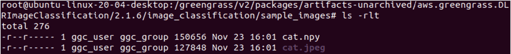

# 七、边缘的机器学习工作负载

边缘计算的发展不仅受到计算高效的硬件设备的推动，还受到十年前仅在云(或内部基础设施)上可用的不同软件技术的推动。例如，想象一下智能手机、智能手表或个人助理，如**亚马逊 Alexa** ，它们为消费者带来了强大的硬件和软件功能。使用面部识别解锁手机或车库门、使用自然语言与 Alexa 对话或乘坐自动驾驶汽车等功能已经成为新常态。因此，信息物理系统需要在其整个生命周期中基于从周围环境中不断学习来构建智能，这已成为当今世界各种工作负载的关键。

重要的是要认识到，大多数顶级科技公司(如*苹果*、*亚马逊*、*谷歌*和 *Meta* ，前身为*脸书*)都使用了**机器学习** ( **ML** )，并通过他们的产品让消费者更容易接触到它。这也不是一项新技术，已经被金融、医疗保健和工业环境等行业部门使用了很长时间。在这一章中，我们将重点关注如何将 ML 功能用于任何**物联网** ( **物联网**)工作负载。

我们将继续致力于互联集线器解决方案，并学习如何在 **edge** (又名 **Greengrass** 设备)上开发 ML 功能。在前面的章节中，您已经了解了在边缘处理不同类型的数据，现在，是时候了解不同的 ML 模型如何对这些数据进行推断，以在边缘获得智能见解。

在本章中，我们将讨论以下主题:

*   为物联网工作负载定义 ML
*   在云端设计 ML 工作流
*   ML 工作流架构实践

# 技术要求

本章的技术要求与 [*第二章*](B17595_02_Final_SS_ePub.xhtml#_idTextAnchor032) 、*边缘工作负载基础*中概述的技术要求相同。请参阅该章中的完整要求。

# 为物联网工作负载定义 ML

ML 技术不再是未来的技术——它们在过去几十年里改变了数百万人的生活。那么，ML 是什么？

“机器学习是在没有明确编程的情况下赋予计算机学习能力的研究领域。”

阿瑟·塞缪尔，1959 年

让我们来看一些来自**消费者**和**工业**领域的物联网工作负载的 ML 应用的真实示例。

首先，这里是消费者细分市场的一些例子:

*   智能手机或智能手表可以识别您的日常习惯，并提供与健身或生产力相关的建议
*   个人助理(如 Alexa、谷歌和 Siri)，你可以以自然的方式与他们互动，满足不同的需求，如控制你的灯和**加热、通风和空调** ( **HVAC** )
*   智能摄像头可以监控您的周围环境，并检测意外行为或威胁
*   智能车库可以通过你的视觉属性、车牌甚至司机的脸来识别你的车
*   自动驾驶汽车可以不断变得更加智能，能够识别交通中的驾驶模式、物体和行人

以下是工业领域的一些例子:

*   能够更好地优化**整体设备效率** ( **OEE** )的智能工厂
*   在不同的工厂、仓库或工作场所提高工人的安全性和生产率
*   使用**计算机视觉** ( **CV** )或音频识别缺陷的实时**质量控制** ( **QC** )
*   改善供应链以减少浪费并提升客户体验，例如从 Amazon.com 1 小时或 15 分钟送货(使用无人机)

为了构建前面提到的能力，客户使用了不同的 ML 框架和算法。为了简洁起见，我们不打算涵盖当今存在的每一个 ML 框架。我们认为这是一个数据科学领域，不符合物联网从业者的日常职责。但是如果你有兴趣深入研究，有很多关于 ML/ **人工智能** ( **AI** )的书籍可供选择。因此，我们在本章的重点将是了解一些关于 ML 系统的历史和核心概念，以及将 ML 与物联网和边缘工作负载集成的方法。

## ML 的历史是怎样的？

今天，作为人类，我们可以使用语音、视觉或触摸与不同类型的机器(从手机到无人驾驶汽车)进行交流。如果没有采用 ML 技术，这是不可能的。这只是一个开始，在未来的几年里，ML 将会以不同的方式改变我们的生活。你可以在*福布斯*:[https://www . Forbes . com/sites/Bernard marr/2016/02/19/a-short-history-of machine-learning-every-manager-short-read/？sh=1ca6cea115e7](https://www.forbes.com/sites/bernardmarr/2016/02/19/a-short-history-of-machine-learning-every-manager-should-read/?sh=1ca6cea115e7) 。

在研究界之外，技术公司如 Amazon.com、谷歌和其他公司也在 20 世纪 90 年代末开始采用 ML 技术。例如，Amazon.com 使用 ML 算法来了解客户的阅读偏好，并建立了一个模型来通知他们符合他们兴趣或风格的新书发布。谷歌用 ML 作为他们的搜索引擎，微软用它来识别电子邮件中的垃圾邮件，等等。从那时起，这项技术已经被许多其他行业采用，并有大量的使用案例。

既然我们已经了解了一点关于 ML 的背景，现在让我们试着去理解 ML 的基础。

## 有哪些不同类型的 ML 系统？

类似于分布式数据系统，有不同种类的技术来处理不同类型的数据，ML 系统也有不同的风格。如果我们将它们分成更广泛的类别，其区别可以这样描述:

*   **受监督的 ML(SML)**—在这种 ML 方法中，模型用带标签的数据集进行训练，并需要人类监督(或教师)。例如，让我们考虑一个场景，我们需要一个连接的 hub 解决方案来识别不同的对象，如猫、狗、人(或季节性鸟类？)谁可能闯入了你的住所。因此，需要由一个人(或多个人)来标记图像，并且在模型准备好(即，模型)预测结果之前，将使用分类算法对该数据进行训练。在下面的截图中，你可以看到一些对象已经被标记，而其余的没有。因此，人类需要对标签进行尽职调查，以确保模型有效:


图 7.1–图像分类的带标签训练集

训练的长度和数据的数量和质量将决定模型的准确性。

*   **无监督的 ML(UML)**—在这种 ML 方法中，模型用未标记的数据集进行训练，并且不需要人工监督(或自学)。例如，让我们考虑在你的前提下有一个新的入侵者，比如一只鹿、一只狼(或一只老虎？)，并且您希望模型将此检测为异常并通知您。在下面的屏幕截图中，您可以看到没有图像被标记，模型需要自己找出异常:


图 7.2–未标记的图像分类训练集

考虑到训练数据集没有鹿、狼或老虎的图片，模型需要足够智能，使用**随机森林**等算法来识别这是**异常**(或新奇检测)。

*   **半监督 ML(SSML)**—在这种 ML 方法中，模型用一个混合了未标记和标记数据的数据集进行训练(想想按需教学，在那里你需要自己学习大部分内容)。所以，让我们考虑一个场景，你从在你家举办的派对上收集你的客人的照片。不同的客人出现在不同的照片中，并且大多数没有被标记，这是算法的无监督部分(例如**聚类**)。现在，作为聚会的主持人，如果您在数据集中标记了一次唯一的个人，ML 模型可以立即自己识别其他图片中的这些个人，如下图所示:


图 7.3-SSML

如果你想搜索个人或家庭的照片并与他们分享，这可能会非常有用(谁在乎其他家庭的照片呢，嗯？).

*   **Reinforcement learning (RL)**—In this method of ML, the model is trained to make a sequence of decisions in an environment and maximize a long-term objective. The model learns through an iterative process of trial and error. An agent such as a physical or virtual device uses this model to take actions guided by a policy at a given environment state and reaches a new state. This makes the agent eligible for a reward (positive or negative), and the agent continues to iterate on this process until it leads to the most optimal long-term rewards. The entire life cycle of an agent progressing from an initial state to a final state is called an **episode**.

    例如，使用 RL，你可以训练一个机器人为你家举办的派对上的所有客人拍照。机器人将停留在特定的轨道上，并从该环境中捕捉图像。如果它保持在轨道上并捕捉到可接受的图像，它将获得正奖励，如果偏离轨道或捕捉到扭曲的快照，它将获得负奖励。随着这一过程的不断迭代，它最终将学会如何最大限度地实现捕捉精彩图像的长期目标。下图反映了 RL 的这一过程:


图 7.4–RL

在上图中，我们已经解释了更广泛的 ML 类别；然而，有太多的框架和算法超出了本书的范围。因此，在下一节中，我们将重点介绍适用于物联网和边缘工作负载生成的数据的最常见方法。

## 物联网工作负载的 ML 分类

在物联网中，ML 的三个最常见用途是在分类、回归和聚类领域，如下图所示:


图 7.5–ML 算法的分类总结

让我们更详细地讨论上图中的术语，如下所示:

*   **分类**—分类是一种 SML 技术，从一组观察到的值开始，得出关于未知数据的一些结论。在现实世界中，分类可以用于图像分类、语音识别、药物分类、情感分析、生物识别等等。
*   **回归**—回归是一种 SML 技术，可以预测连续值。预测是通过使用最佳拟合直线估计因变量( *Y* )和一个或多个自变量( *X* )之间的关系来进行的。在现实世界中，回归可以应用于预测明天的温度、能源利用价格、黄金价格等等。
*   **聚类**—聚类是一种 UML 算法，可以将未标记的数据点分组。这经常用于统计分析。数据集中未标记的数据点的分组是通过识别数据集中具有共同属性和特征的数据点来实现的。在现实世界中，这种算法可以应用于市场细分、医学成像、异常检测和社会网络分析。

在本章的实验操作部分，您将学习如何使用分类算法对对象(如汽车和宠物)进行分类。

## 为什么今天 ML 可以在边缘访问？

我们已经在 [*第六章*](B17595_06_Final_SS_ePub.xhtml#_idTextAnchor119) 、*在云上处理和消费数据中为您介绍了边缘计算的三大定律:* *物理定律*(延迟敏感的用例)*经济定律*(成本敏感的用例)*土地定律*(数据敏感的用例)。基于这些定律，我们可以确定当今世界的各种用例，尤其是与物联网和边缘相关的用例，在这些用例中，从设备或网关本身的本地数据中处理和生成洞察非常有意义，而不是将它们持续发布到云。

然而，约束是这些边缘设备或网关上可用的有限资源(如**中央处理器** ( **CPU** )、**图形处理器** ( **GPU** )、内存、网络、能量)。因此，建议利用云的计算能力，使用首选的框架(如 **MXNET** 、 **TensorFlow** 、 **PyTorch** 、 **Caffe** 或 **Gluon** )构建和训练 ML 模型，然后将模型部署到边缘进行推理。

例如，如果智能家居中产生了大量来自婴儿啼哭、狗叫声或周围建筑噪音的噪音数据，ML 模型可以将这些数据识别为噪音数据，在本地触发任何指定的操作——例如检查婴儿或宠物的警报——但避免将这些数据点发布到云。这样，大量不太具有长期价值的间歇性数据就可以在网站上被过滤掉。

处于边缘的 ML 是一个不断发展的空间，目前有许多来自不同厂商的新兴框架和硬件产品，下表列出了其中的一些。

以下是常见的边缘 ML 框架:


图 7.6–面向边缘的通用 ML 框架

以下是在边缘执行 ML 的常见硬件堆栈:


图 7.7–在边缘执行 ML 的常见硬件堆栈

你已经在使用 Raspberry Pi 作为本书中不同实验的底层硬件。在*ML 架构实践*部分，您将学习如何在云中训练基于 Apache MXNET 的 ML 模型，并在边缘部署它们以进行推理。在这个背景下，让我们讨论如何开始为 edge 构建 ML 应用。

# 在云中设计 ML 工作流

ML 是一个由多个阶段组成的**端到端** ( **E2E** )迭代过程。当我们在本书的其余部分解释不同阶段时，我们将与**跨行业数据挖掘标准流程** ( **CRISP-DM** )联盟提供的通用准则保持一致。CRISP-DM 参考模型是由新兴数据挖掘市场的三位先驱在 1996 年末提出的，并通过多个行业部门的多个组织和服务供应商的参与而不断发展。下图显示了 CRISP-DM 参考模型的不同阶段:


图 7.8-CRISP-DM 参考模型的阶段(根据 https://www.the-modeling-agency.com/crisp-dm 重新绘制)。pdf)

这个模型仍然被认为是进行成功的数据挖掘项目的基线和经过验证的工具，因为它的应用是中立的，并且适用于各种各样的 ML 管道和工作负载。使用前面的参考模型(*图 7.5* )作为基础，ML 项目的生命周期可以扩展到以下活动:


图 7.9–ML 项目的生命周期

前面 ML 活动的工作流程可以直观地描述如下:


图 7.10-e2e ML 流程

在下一节中，我们将通过为您的联网家庭使用图像分类场景来详细阐述这些概念。

## 业务理解和问题框架

第一阶段是从用例向后工作，并从业务角度理解需求。一旦明确了这一点，业务环境就被转化为技术需求(比如对 ML 技术的需求)以实现所需的业务成果。这个概念听起来耳熟吗？如果是的话，恭喜你——你能够理解**领域驱动设计** ( **DDD** )、第六章 、*中介绍的概念，在云上处理和消费数据*。ML 功能可以被看作是另一个有边界的上下文，有自己的一套无处不在的语言。

但是使用 ML 解决问题可能会有所不同，这是 Peter nor vig(Google 的研究主管)的一句名言:

“机器学习改变了你思考问题的方式。重点从数学科学转移到自然科学，进行实验并使用统计数据而不是逻辑来分析结果。”

一个组织需要清楚地识别他们试图解决的业务问题是否是一个 ML 问题。如果这个问题可以用传统的编程方法来解决，那么构建 ML 模型可能是多余的。例如，如果您计划根据历史数据预测特定季度的未来收入，传统的分析方法可能就足够了。但如果你开始考虑其他变量的预测，如天气、竞争对手的活动、促销、经济，这就更适合 ML 问题。所以，作为一个经验法则，总是试着从以下问题开始你的 ML 之旅:

*   *What problem is my organization or product facing?*

    让我们考虑这样一个场景，你正试图解决保护你的家人、宠物和邻居免受你的停车位周围的交通流量的问题。

*   *Would it be a good problem to solve using ML or classic analytics methods?*

    在这里，当车辆接近或离开区域时，需要一个连接的**Home Base Solutions**(**HBS**)hub 来识别停车位中的任何生物。这个问题不能用经典的分析方法来解决，因为你不可能为你所在区域的每一个访客、邻居或送货车都准备好时间表。因此，中枢可以使用运动传感器来检测车辆的运动，从周围环境中捕捉不同的图像(使用安装的摄像机)，并运行实时推理来检测周围的任何物体。如果发现这种情况，它会实时提醒司机、孩子或宠物，避免事故发生。

    早期，计算机视觉(CV)模型依赖于原始像素数据作为输入，但由于其他几个因素，如对象后面的不同背景、照明、相机角度或焦点，这被发现是低效的。因此，图像分类显然是一个最大似然问题。

*   *If it's an ML problem, do I have enough data of optimal quality?*

    考虑到这里范围内的对象是通用的——比如人类、猫或汽车——我们可以依赖公共的数据集，比如 **Caltech-256** 。该数据集包含 256 种不同类型物体的 30，000 多幅图像。

    这往往是我们遇到的最常见的问题:*多少数据足够训练？*真的看情况。

    对于基本的线性模型，您至少应该有几千个数据点，对于神经网络，应该有几十万个数据点(例如前面提到的图像分类)。更多最佳质量的数据使模型能够更智能地预测。如果您的数据较少或数据质量较差，建议首先考虑专门构建的 AI 服务非 ML 解决方案。我经常引用数据，总是*垃圾输入=垃圾输出*。因此，如果您的数据质量有问题，那么它对于经典分析方法或 ML 过程来说价值不大。此外，ML 过程更昂贵，因为您将浪费大量时间和资源，并产生训练具有可疑性能的模型的成本。

现在，让我们假设你已经满足了前面的要求，并且确定你试图解决的问题确实是一个 ML 问题。在这种情况下，您可以选择以下最佳实践来总结问题框架:

1.  将最大似然问题公式化为一组具有各自输入和期望输出的问题。
2.  为项目定义有形的性能度量，例如准确性、预测或延迟。
3.  建立项目成功的定义。
4.  为数据源和数据注释制定策略。
5.  从简单开始——构建一个易于解释、测试、调试和管理的模型。

## 数据收集或整合

在 E2E ML 流程中，您将确定一个将作为 ML 管道输入的数据集，并评估收集该数据集的适当方法。在前面的章节中，您已经了解到，对于不同的物联网用例，AWS 提供了多种批量或实时获取原始数据的方式。在其他现实场景中，如果您的云平台或数据中心中有来自物联网设备和**信息技术** ( **IT** )系统的**PB**(**PB**)历史数据，那么有多种方式可以将这些数据转移到云中的数据湖，如下所示:

*   通过公共互联网传输
*   使用专用光纤通道设置通过专用网络从数据中心传输到使用 AWS Direct Connect 的 AWS
*   Transfer using hardware devices such as AWS Snowball, AWS Snowmobile, or AWS Snowcone, as it will take less time than transfering over the public internet

    有趣的事实

    通过雪地设备传输数据与您将包裹退回 Amazon.com 非常相似！你得到了一个带有 E-link 屏幕的硬件作为返回标签，在那里数据可以被加载并运回 AWS 数据中心。如果你有**艾字节** ( **EB** )的数据，AWS 甚至可以给你一辆被称为 AWS 雪地车的数据运输卡车。请参考 AWS 文档，*如何入门 AWS 雪族*([https://docs.aws.amazon.com/snowball/index.html](https://docs.aws.amazon.com/snowball/index.html))，了解所需步骤。

再次考虑场景，开发一个 ML 模型来识别接近停车位区域的车辆。这里，您可以使用来自公共数据存储库(如 **Caltech** )的训练数据集，因为您通常需要对孩子、宠物和移动物体(如汽车和卡车)的通用图像进行分类。范围内将有两个数据集，如下所示:

*   **训练数据集**—来自加州理工学院的公共数据集将被托管在数据湖中(**亚马逊简单存储服务** ( **亚马逊 S3** ))
*   **推理数据集**—在中枢实时生成

以下代码支持从公共数据存储库中下载两个数据集:


图 7.11–数据理解

对于一个不同的用例，公共数据集不是一个选项，您的组织需要有足够的最佳质量的数据点。

此处提供了此阶段的最佳实践总结:

*   定义您将用作 ML 管道输入的各种数据源
*   确定用作管道输入的数据形式(即原始数据和转换数据)
*   如果需要进一步处理，使用数据沿袭机制来确保数据位置和源被编目
*   使用不同的 AWS 管理的服务来收集、存储和处理数据，而无需额外的繁重工作

## 数据准备

**数据准备**是流水线中的一个关键步骤，因为如果底层数据没有被清理、管理和验证，ML 模型就不能最佳地执行。对于物联网工作负载，由于边缘设备与人类共存于物理环境中(而不是托管在物理数据中心中)，因此产生的噪声数据量可能非常大。此外，随着数据集在互联生态系统中不断增长，通过模式比较进行的数据验证有助于检测新获得的数据集中的数据结构是否发生了变化(例如，当某个功能被弃用时)。您还可以检测数据是否已经开始漂移，也就是说，传入数据的基础统计数据与用于定型模型的初始数据集不同。漂移可能是由于数据的潜在趋势或季节性或其他因素造成的。

因此，一般建议从一个小的、统计上有效的样本开始数据准备，该样本可以用不同的策略反复改进，例如:

*   检查数据异常
*   检查数据模式中的更改
*   检查不同数据集版本的统计数据
*   检查数据完整性等等

AWS 提供了多种方法来帮助您大规模准备数据。你已经玩过 [*第五章*](B17595_05_Final_SS_ePub.xhtml#_idTextAnchor090)*从边缘*摄取和流数据 **AWS 胶水**。如果您还记得，AWS Glue 允许您管理数据的生命周期——例如发现、清理、转换和编目。一旦数据处理完成，数据质量达到要求的标准，它就可以作为输入输入到 ML 过程中。

在这一章中，我们已经向您介绍了一个不同的问题陈述，它是处理一个非结构化数据集(又名图像)。考虑到您正在使用一个已经标记的公共数据集，您将只把数据集分成一个定型子集和一个验证子集。数据科学家最常用的方法是将可用数据分为训练数据集和测试数据集，通常是 70-30 (%)或 80-20 (%)。

以下代码支持从公共数据存储库中拆分两个数据集:


图 7.12–数据准备

然而，在真实的世界中，你可能没有干净的或有标签的数据。因此，你可以利用亚马逊 SageMaker Ground Truth 等服务，这些服务具有自动标记数据(如图像、文本、音频、视频)的内置功能，并且可以轻松访问公共和私人的人工标记器。如果你缺乏内部 ML 技能，或者对雇佣数据科学专业人员的成本敏感，这将非常有用。Ground Truth 使用 ML 模型自动标记原始数据，并以极低的成本产生高质量的训练数据集。但如果模型无法自信地标记数据，它会将问题路由给人类来解决。数据准备的另一个方面是理解数据集中的模式。

此处提供了此阶段的最佳实践总结:

*   通过发现和转换分析您的数据。
*   为正确的工作选择正确的工具(例如数据标记与调优)。
*   从数据组合中理解模式。

# 数据可视化和分析

在这一阶段，您可以通过各种分析和可视化工具继续探索数据，以评估数据是否适合 ML 训练后分析。您可以继续利用 Amazon Athena、Amazon Quicksight 等服务，以及在 [*第 6 章*](B17595_06_Final_SS_ePub.xhtml#_idTextAnchor119) 、*中介绍的在云上处理和消费数据的服务*。

## 特征工程(FE)

在这个阶段，作为物联网专业人员，你们的职责非常有限。在这里，数据科学家将确定数据集中对训练 ML 模型有用的唯一属性。您可以将行视为观察值，将列视为属性。作为数据科学家，您的目标是识别在解决特定的业务问题(也就是特性)中起作用的列。例如，使用图像分类，汽车的颜色或品牌不是确定其为车辆的关键特征。选择和转换变量以确保创建优化的 ML 模型的这个过程被称为 **FE** 。因此，FE 的关键目标是以一种 ML 算法可以用来提取模式和推断更好结果的形式来整理数据。

让我们将铁的不同相分解如下:

*   **特征创建**识别数据集中与问题范围相关的属性，例如图像像素的高度和宽度
*   **特性转换**用于数据兼容性或质量转换，如将输入调整为固定大小或将非数值数据转换为数值数据
*   **特征提取**确定提供最大价值的一组精简特征
*   **特征选择**通过观察相关阈值的变化从数据集中过滤出冗余特征

如果数据集中的特征数量比所能生成的观察值大得多，那么 ML 模型可能会遇到一个叫做**过度拟合**的问题。另一方面，如果特征的数量有限，模型可能会推断出许多不正确的预测。这个问题被称为**欠配合**。换句话说，该模型在测试数据上训练得很好，但无法将泛化应用到新的或未见过的数据集。因此，特征提取可以帮助优化用于 ML 处理的一组特征，这些特征足以生成原始组的综合版本。除了降低过拟合风险，特征提取还通过数据压缩和精度提高来加速训练。不同的特征提取技术有**主成分分析**(**PCA**)**独立成分分析**(**ICA**)**线性判别分析**(**LDA**)**典型相关分析** ( **CCA** )。

AWS 提供了多种方法来帮助你以迭代的方式在你的数据集上执行 FE。例如，Amazon SageMaker 作为一个托管服务提供了一个托管的 **Jupyter** notebook 环境，您可以在其中使用 scikit-learn 库来执行 FE。如果您的组织已经投资了一个**提取、转换、加载** ( **ETL** )框架，如 AWS Glue、 **AWS Glue DataBrew** ，或者一个托管的 Hadoop 框架，如**Amazon Elastic MapReduce**(**Amazon EMR**)，在利用 SageMaker 来训练和部署模型之前，数据科学家可以在那里执行 FE 和转换。

另一个选择是使用 **Amazon SageMaker 处理**。此功能提供了一个完全受管的环境，用于运行 FE 分析作业和大规模模型评估，并整合了各种安全性和合规性要求。

以下是此阶段最佳实践的总结:

*   评估数据集中符合*特征*范例的属性
*   考虑对解决手头问题有用的特性，去掉多余的特性
*   构建一个迭代机制来探索新的特性或特性组合

## 模型训练

这个阶段的关键活动包括选择一个适合你的问题的 ML 算法，然后用来自早期阶段的预处理数据(也就是特征)训练模型。我们已经在*物联网工作负载的 ML 分类*一节中向您介绍了物联网工作负载最常见的 ML 算法。让我们更深入地研究这些算法，如下所示:

*   **分类**—分类有两种应用方式；即二项式或多类。当您有一组关于两个组或类别的观察值时，二项式很有用，例如狗和猫，或者电子邮件是垃圾邮件还是非垃圾邮件。多类包括两个以上的组或类别，例如一组花——玫瑰、百合、兰花或郁金香。不同的分类技术包括决策树、随机森林、逻辑回归和朴素贝叶斯。
*   **回归**—分类用于预测离散值，而回归用于预测连续变量。回归有三种应用方式:*最小二乘法*、*线性*或*逻辑*。
*   **聚类** — *K-means* 是一种非常流行的聚类算法，一般用来给未标记的数据分配一个组。该算法是快速的和可扩展的，因为它使用一种方法通过计算数据点和每个组中心之间的距离来分配每个组。

在前面提到的停车位周围的安全场景中，我们使用了多类分类算法，因为我们希望该模型能够对多类对象进行分类，例如人类(特别是孩子)、汽车和动物(例如猫、狗和兔子)。诸如 SageMaker 这样的 AWS 服务承担了创建和管理训练所需的底层基础设施的无差别重任。您可以选择不同类型的实例，例如启用 CPU 或 GPU 的实例。在下面的例子中，您只需指定一个实例类型`ml.p2.xlarge`以及其他必需的参数，如`volume`和`instance_count`，SageMaker 使用 estimator 接口来实例化和管理基础设施，完成剩下的工作:


图 7.13–ML 训练基础设施

你将在本章中使用 **MXNet 框架**，但是 SageMaker 允许大多数其他 ML 框架，比如 TensorFlow、PyTorch 和 Gluon 来训练你的模型。

请注意模型优化是 ML 的一个关键方面，您需要用不同的参数集来训练一个模型，以确定性能最好的一个。SageMaker 超参数调整作业有助于使用贝叶斯优化或随机搜索技术优化模型。正如您在以下示例中看到的，模型正在使用超参数(如批量大小和形状)进行训练，以解决您的业务问题:


图 7.14–ML 训练参数

为了使这个模型训练过程对新加入 ML 的组织来说更加容易和经济有效，SageMaker 支持自动模型调整(通过 **Autopilot** )来代表你自动执行这些动作。也可以使用您的自定义 ML 算法作为容器图像，并使用 SageMaker 对其进行训练。例如，如果您已经有了一个不使用任何 SageMaker 支持的 ML 框架的自行开发的图像分类模型，您可以将您的模型用作容器图像，并在 SageMaker 中重新训练它，而无需从头开始。SageMaker 还提供了一个监控和调试功能，可以清晰地看到训练指标。

以下是此阶段最佳实践的总结:

*   为您的数据选择正确的算法和训练参数，或者让托管服务为您选择
*   确保数据集分为训练集和测试集
*   应用增量学习来构建最佳模型
*   监控训练指标，以确保模型性能不会随着时间的推移而降低

## 模型评估和部署

在这个阶段，评估模型，以评估它是否解决了上下文中的业务问题。如果没有，您可以用不同的业务规则或方法(比如不同的算法，其他训练参数，等等)构建多个模型，直到您找到满足业务 KPI 的优化模型。在这个阶段，当数据科学家根据实际应用测试模型时，他们可能会发现其他业务问题的推论。为了评估模型，可以对照*历史数据*(又名离线评估)或*实况数据*(又名在线评估)进行测试。一旦 ML 算法通过评估，下一步就是将模型部署到生产中。

但是，如果您的用例主要处理边缘上的离线处理和推理，那么物联网/边缘工作负载的场景会变得有点棘手。在这种情况下，您无法访问云的规模，因此最佳实践通常是进一步优化模型。 **SageMaker Neo** 在这种情况下可能有用，因为它允许你一次训练你的模型，并在云中或边缘的任何地方运行。通过这项服务，您可以在大多数常见框架(如 MXNET、TensorFlow、PyTorch、Keras)中编译模型，并在您选择的目标平台(如英特尔、恩智浦、英伟达、苹果等公司的硬件)上部署优化版本。以下代码有助于根据不同的参数(如操作系统和体系结构)优化模型:


图 7.15–使用 SageMaker Neo 优化模型

SageMaker Neo 的工作方式是，其编译器使用一个 ML 模型在各自的 edge 平台或设备上为您的模型应用最佳可用性能。与未优化的模型相比，Neo 可以优化模型，在不损失准确性的情况下将执行速度提高 25 倍，并且只需要十分之一的空间。但是怎么做呢？我们来探讨一下，如下:

*   Neo 有一个编译器和一个运行时组件。
*   Neo 编译器有一个**应用编程接口** ( **API** )，可以读取使用各种框架开发的模型。一旦读操作完成，它就将特定于框架的函数和操作转换成与框架无关的中间表示。
*   一旦转换完成，它就开始执行一组优化。作为这种优化的结果，二进制代码被生成并持久化到一个共享的对象库中，同时模型定义和参数被存储在单独的文件中。
*   最后，用于受支持目标平台的 Neo 运行时 API 可以加载并执行该编译模型，以提供所需的性能提升。

正如你所想象的，这种优化对于边缘设备来说是强大的，因为它们是资源受限的。下面的屏幕截图示意性地展示了如何在您的生产环境中部署一个优化的模型。在本章的*ML 架构实践*部分，您将学习如何部署使用 SageMaker Neo 训练的模型:


图 7.16–优化硬件的 ML 模型

一旦部署了模型，您需要监控一段时间内的性能指标。这是因为，由于真实世界的数据可能开始与用于训练模型的数据不同，模型的功能效率较低是很常见的。SageMaker 模型监控服务有助于检测偏差，并提醒您、数据科学家或 ML 操作员采取补救措施。

以下是此阶段最佳实践的总结:

*   评估模型性能是否符合业务目标
*   确定您的模型所需的推理方法(离线与在线)
*   通过自动扩展选项在云上部署模型，或者通过硬件特定优化在边缘部署模型
*   监控生产中的模型性能，以确定偏差并执行补救措施

## ML 设计原则

既然您已经了解了 ML 工作流中的常见活动，那么让我们从上一节解释的步骤中总结一下设计原则，如下所示:

*   从用例向后工作，以确定它是需要 ML 的问题还是可以使用经典的分析方法解决的问题。
*   收集足够的最佳质量的数据，以获得精确的 ML 模型。
*   执行分析以了解数据关系和组成。记住:*垃圾输入=垃圾输出*，因此数据准备是 ML 过程中的关键。
*   从一小组特性(也称为属性)开始，以解决特定的业务问题，并通过实验不断发展。
*   考虑使用不同的数据集进行训练、评估和推理。
*   评估模型的准确性，并继续迭代，直到它对于环境中的业务问题是最优的。
*   确定模型是否需要根据实时(在线)或历史(离线)数据进行推理。
*   在云上或边缘上托管模型的不同变体，并根据真实世界的数据确定最佳变体。
*   持续监控已部署模型的准确性、补救和改进指标。
*   利用托管服务来减轻管理底层基础设施的负担。
*   尽可能自动化管道的不同活动，例如数据准备、模型训练、评估、托管、监控和警报。

## 物联网工作负载的 ML 反模式

与任何其他分布式解决方案类似，基于 ML 的物联网工作负载也有反模式。以下是其中的一些:

*   **Don't put all your eggs in one basket**—The E2E ML process includes many activities and thus requires different personas such as the following:
    *   *数据工程师*—负责数据准备，设计 ETL(或 ELT)流程
    *   *数据科学家*—用于构建、训练和优化模型
    *   *开发-运营(DevOps* 或 *MLOps)工程师*—用于构建可扩展和可重复的机器学习基础设施，该基础设施由操作和监控机制构建
    *   *物联网工程师*—构建云到边缘的部署管道，以及从物联网网关到不同后端服务的集成

    总之，期望单个资源大规模地执行所有这些活动将导致项目的失败。

*   **Don't assume the requirements; get aligned**—A plethora of tools is available for analytical and ML purposes and each has its pros and cons. For example, consider the following:
    *   **R** 和 **Python** 都是开发 ML 系统的流行编程语言。一般来说，商业分析师或统计学家会更倾向于 R 或其他商业解决方案(如 **MATLAB** )，而数据科学家会选择 Python。
    *   同样，数据科学家可能有他们偏爱的 ML 框架，比如 TensorFlow over PyTorch。选择不同的语言或框架会产生下游影响，例如，边缘硬件可能需要支持推断 ML 模型所需的相应版本或库。

    因此，对于所有参与 ML 活动的不同角色来说，保持业务和技术需求的一致性是很重要的。

*   **技术债务计划**—用于物联网工作负载的 ML 系统容易产生技术债务，因为它们依赖于来自物联网来源的数据，而物联网来源通常因其噪声而不可靠。这也可能是由于对具有不一致数据的其他上游的依赖性而发生的。例如，考虑以下情况:
    *   如果任何特征(或几个特征)的组成发生了实质性的变化，将导致模型在现实世界中表现不同。这个问题也被称为训练-服务偏斜**，在训练和服务管道中处理数据的方式存在差异。**
    *   **ML 工作负载不同于传统 IT 系统的原因是，它们的行为只能通过小样本单元测试的真实数据来确定。**

 **因此，监控模型的准确性，基于收集的数据知识迭代地优化它，并重新部署是非常关键的。

# ML 架构实践

在本节中，您将在一个已连接的 HBS hub 上部署一个解决方案，这需要您在云上构建和训练 ML 模型，然后将它们部署到边缘进行推理。以下屏幕截图显示了实验室的架构，其中突出显示了您将完成的步骤 *(1-5)* :


图 7.17–动手操作 ML 架构

您的目标包括以下内容，这些内容在前面的体系结构中突出显示为不同的步骤:

*   使用 Amazon SageMaker 构建 ML 工作流
*   使用 AWS 物联网 Greengrass 将 ML 模型从云部署到边缘
*   在边上执行 ML 推理并可视化结果

下表列出了您将在实验中使用的组件:


图 7.18–动手实验组件

## 构建 ML 工作流程

在这个部分，您将使用 Amazon SageMaker Studio 构建、训练和测试 ML 模型。

注意

使用亚马逊 SageMaker 的训练模型将产生额外的费用。如果您想在这方面节省，请使用 GitHub 中针对您的平台提供的经过训练的 ML 模型，并跳到下一部分，即从云到边缘部署模型。

Amazon Sagemaker Studio 是一个基于网络的集成开发环境，使数据科学家(或 ML 工程师)能够一站式处理所有 ML 事务。为了训练模型，您将使用加州理工学院的公共数据集，该数据集包含 256 个对象类别的 30，000 多幅图像。我们开始吧。进行如下操作:

1.  请导航到 **Amazon SageMaker** 控制台并选择 **SageMaker Domain Studio** (从左侧窗格中)。如果这是您第一次与 studio 交互，系统会提示您完成一次性设置。请选择**快速设置，**点击**提交，**选择**默认 VPC 和您选择的子网**，然后点击**保存并继续**。
2.  工作室的搭建需要几分钟时间。请等待状态显示**就绪**后点击**启动 app** - > **工作室**。
3.  这将为你打开 SageMaker 工作室(又名 Jupyter 控制台)。如果您不熟悉 Jupyter，可以把它看作是一个开发 ML 模型的 IDE，类似于 Eclipse、Visual Studio 等等，用于开发分布式应用。
4.  请使用左上方窗格中的**上传文件**按钮上传`chapter7/notebook`文件夹中的`Image-Classification*.ipynb`和`synset.txt`文件。
5.  Double-click to open the Jupyter notebook and choose the Python runtime and kernel, as shown in the following screenshot:

    图 7.19–Jupyter 笔记本内核

6.  Choosing a kernel is a critical step as it provides you with the appropriate runtime for training the ML model. Update the kernel (top right) to choose the GPU runtime for training the ML model. Since you will be processing images, a GPU runtime is preferable. After choosing the kernel, the Jupyter notebook will have the following kernel and configuration:

    图 7.20–选择内核

7.  现在，慢慢浏览代码。请确保您阅读了代码前面的文本，以便更好地理解这些模块的功能。
8.  Click the `*`) adjacent to the block. The asterisk implies that the code is still running. Please wait for that to disappear before you proceed:

    图 7.21–运行步骤

9.  If you go through all the steps till the end, you will be able to complete the following steps:
    1.  下载训练数据集
    2.  准备和预处理数据
    3.  将数据集分为训练样本和测试样本
    4.  使用适当的框架和参数训练模型
    5.  优化边缘硬件的模型
    6.  在亚马逊 S3 存储库上托管模型工件

    模型训练可能需要 10 分钟才能完成。训练之后，你就有了一个使用 MXNet 框架训练的 ML 模型，它能够对 256 个不同的对象进行分类。

10.  请浏览 S3 桶(`sagemaker-<region>-<accountid>/ic-fulltraining/`)。复制 S3 `DLR-resnet50-*-cpu-ImageClassification.zip`，因为你将在下一节用到它。

现在，模型已经在云上训练好了，您将使用 Greengrass 在边缘上部署它，进行近乎实时的推理。

## 将模型从云部署到边缘

作为一名物联网从业者，将模型从云部署到边缘是您将主要参与的步骤。这是一个过渡点，ML 或数据科学团队提供了一个模型，需要将推送到边缘设备群。尽管在现实世界中可以使用**持续集成/持续部署(CI/CD)** 管道来自动化这些步骤，但是您将手动执行这些步骤来详细了解这个过程。

与您在前面章节中为在边缘上部署不同流程而创建的组件(如发布者、订阅者、聚合者)类似，部署 ML 资源也需要相同的方法。我们将创建一个组件，其中包括在上一节中训练的 ML 模型。为了保持连续性，我们将继续使用 AWS 控制台。

注意

Greengrass 提供了一个示例图像分类模型组件，您可以在第 4 章 、*将云扩展到边缘*中使用它。在这里，您将学习如何使用您的定制资源来修改现有的模型组件。在现实世界中，您甚至可能不得不从头创建一个新的模型组件，您可以遵循类似的过程。

我们开始吧。进行如下操作:

1.  Please navigate to the `chapter7/recipe` folder. Now, let's update the recipe to point to the trained model. Please replace the URI (marked with an arrow) with the S3 URI copied in *Step 10* of the *Building the ML workflow* section, as illustrated in the following screenshot. If you have skipped the earlier section and used a trained model from GitHub, please manually upload the model to the S3 bucket of your choice and update the S3 URI in the recipe accordingly:

    图 7.22–配方配置

2.  点击**创建组件**完成模型资源的创建。该型号应出现在**组件**页面的**我的组件**选项卡上。
3.  Now, you need to create an inferencing component. This is the resource that triggers the model on the edge and publishes the results to the cloud.

    注意

    Greengrass 提供了一个示例图像分类推理组件`aws.greengrass.DLRImageClassification`，您已经在 [*第 4 章*](B17595_04_Final_SS_ePub.xhtml#_idTextAnchor073) 、*将云扩展到边缘*中玩过了。在这里，您将学习如何使用相同的推理组件来处理您的定制 ML 模型。在现实世界中，您可能需要使用修改后的清单文件从头开始创建一个新的推理组件，就像您刚刚对模型所做的那样。

4.  在`variant.DLR.ImageClassification.ModelStore`上:通过 SageMaker 训练的 ML 模型。您可以从`aws.greengrass.DLRImageClassification`:ML 模型的推理脚本中进行选择。您可以从`variant.DLR`:ML 推理所需的运行时间中进行选择。您可以从**公共组件**选项卡中进行选择。
5.  On the **Select Components** page, ensure the components shown in the following screenshot are chosen, and then click **Next**:

    图 7.23–绿草组件依赖关系

6.  在`aws.greengrass.DLRImageClassification`的分量上。这将启用**配置组件**选项；点击那个。
7.  更新的**配置，将**部分(右窗格)与以下配置合并，并点击**确认** :

    ```py
    {   "InferenceInterval": "5" }
    ```

8.  在接下来的屏幕中保持所有其他选项的默认设置，并选择**部署**。

现在让我们进入下一部分。

## 在边缘上执行 ML 推理并验证结果

因此，到目前为止，模型已经在 Greengrass 上建立、训练和部署。待推断的图像存储在以下目录中:



图 7.24-green grass hub 上的图片目录

类似于猫图像，您也可以部署其他图像(例如狗、人等等)并配置推理组件来对它们进行推理。

让我们想象一下从边缘发布到云的推理结果。这些结果对于评估模型是否以预期的精度水平运行至关重要。我们将如下进行:

1.  首先，让我们检查组件状态是否显示为正在运行，并检查 Greengrass 日志以验证没有异常。下面是我们需要做的代码:

    ```py
    sudo /greengrass/v2/bin/greengrass-cli component list sudo tail -100f /greengrass/v2/logs/greengrass.log sudo tail -100f aws.greengrass.DLRImageClassification.log
    ```

2.  如果没有错误，请导航到 AWS 物联网控制台，选择**测试**，然后选择 **MQTT 测试客户端**。
3.  在`ml/dlr/image-classification`下。点击**订阅**查看结果，应该是这样的:


图 7.25–来自 ML 的推断结果

如果卡住或需要帮助，请参考 GitHub 中的**故障排除**部分。

祝贺你完成了本章的实践部分！现在，您连接的 **HBS 枢纽**配备了 ML 功能，可以在在线和离线条件下操作，并可以对您停车区域内的人类、宠物和车辆进行分类。

挑战区(可选)

你能想出如何对发布到 AWS 物联网核心的推理结果采取行动吗？这将有助于通过通知/警报自动触发通知，以提醒在停车空间区域漫步的儿童/宠物。

**提示**:你需要在物联网规则引擎中定义一个路由逻辑，通过通知服务推送结果。

现在您已经学会了如何在边缘为物联网工作负载构建 ML 功能，这难道不令人难以置信吗？是时候该休息了！让我们用一个快速总结和一系列问题来结束这一章。

# 总结

在本章中，您了解了与物联网工作负载相关的 ML 概念。您学习了如何设计 ML 管道，以及优化物联网工作负载的模型。您实施了一个边缘到云的架构来对非结构化数据(图像)执行推理。最后，您通过可视化来自边的推理结果来验证工作流，以获得更多见解。

在下一章中，您将了解如何实施 DevOps 和 MLOps 实践，以实现大规模部署的物联网边缘工作负载的运营效率。

# 知识检查

在进入下一章之前，通过回答这些问题来测试你的知识。答案可以在书的结尾找到:

1.  判断正误:存在两种类型的最大似然算法:有监督的和无监督的。
2.  你能回忆起 ML 系统的四种类型及其意义吗？
3.  是非判断:K-means 是一种分类算法。
4.  你能把 ML 项目生命周期的三个阶段按正确的顺序排列吗？
5.  你能想出至少两个用于训练 ML 模型的通用框架吗？
6.  AWS 服务用于将训练好的模型从云部署到边缘？
7.  是非判断:AWS 物联网 Greengrass 仅支持图像分类问题的自定义组件。
8.  你能告诉我一个关于物联网工作负载的 ML 反模式吗？

# 参考文献

有关本章中讨论的概念的更多信息，请查看以下资源:

*   脆:[https://www.datascience-pm.com/crisp-dm-2/](https://www.datascience-pm.com/crisp-dm-2/%0D)
*   *机器学习简史*:[https://www . Forbes . com/sites/Bernard marr/2016/02/19/A-Short-History-of-Machine-Learning-every-manager-should-read/？sh=1ca6cea115e7](https://www.forbes.com/sites/bernardmarr/2016/02/19/a-short-history-of-machine-learning-every-manager-should-read/?sh=1ca6cea115e7%0D)
*   *AWS 上的机器学习*:[https://aws.amazon.com/machine-learning/](https://aws.amazon.com/machine-learning/%0D)
*   带 AWS 物联网服务的 ML:[https://AWS . Amazon . com/blogs/IoT/category/artificial-intelligence/sage maker/](https://aws.amazon.com/blogs/iot/category/artificial-intelligence/sagemaker/%0D)
*   *将 AWS 物联网 Greengrass 版本 2 与亚马逊 SageMaker Neo 和 NVIDIA DeepStream 应用配合使用*:[https://AWS . Amazon . com/blogs/IoT/Using-AWS-IoT-green grass-Version-2-with-Amazon-SageMaker-Neo-and-NVIDIA-deep stream-Applications/](https://aws.amazon.com/blogs/iot/using-aws-iot-greengrass-version-2-with-amazon-sagemaker-neo-and-nvidia-deepstream-applications/%0D)
*   架构良好的 ML 框架:[https://docs . AWS . Amazon . com/well Architected/latest/machine-learning-lens/machine-learning-lens . html](https://docs.aws.amazon.com/wellarchitected/latest/machine-learning-lens/machine-learning-lens.html%0D)
*   通过**机器学习大学**(**MLU**):[https://aws.amazon.com/machine-learning/mlu/](https://aws.amazon.com/machine-learning/mlu/)向 AWS 学习**