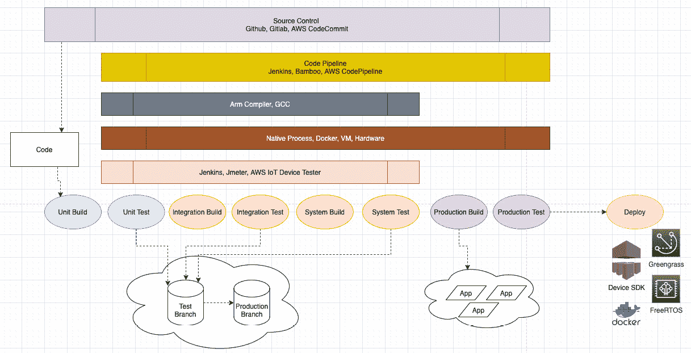

# 八、边缘的 DevOps 和 MLOps

21 世纪一连串的互联设备改变了我们的生活方式。很难回忆起没有智能手机、智能手表、个人数字助理(如亚马逊 Alexa)、联网汽车、智能恒温器或其他设备的便利的日子。

这种采用不会很快放缓，因为行业预测未来几年全球将有超过 250 亿台物联网设备。随着互联技术的日益普及，新常态是拥有*永远在线的*设备。换句话说，*设备应该一直工作*。不仅如此，我们还希望这些设备不断变得更加智能，并通过新功能、增强功能或错误修复在整个生命周期中保持安全。但是，你如何可靠地、大规模地做到这一点呢？亚马逊首席技术官兼副总裁沃纳·威格尔经常说“*一切* *总是失败。*“让任何技术解决方案始终保持正常运行都是一项挑战。

随着**物联网**的出现，这些挑战变得更加严峻和复杂，因为**边缘**设备部署在不同的操作条件下，暴露在环境干扰中，并且具有多层连接、通信和延迟。因此，建立一个从边缘到云的连续机制来收集来自已部署的边缘设备的反馈并迅速采取行动是至关重要的。这正是 DevOps for IoT 的用武之地。 **DevOps** 是**开发运营**的简称。它促进了从云到边缘执行**持续集成和持续部署** ( **CI/CD** )的敏捷方法。

在本章中，我们将重点关注如何利用 DevOps 功能来处理物联网工作负载。我们还将讨论扩展到边缘的 **MLOps** ，这意味着为**机器学习** ( **ML** )工作负载实现敏捷实践。当您构建 ML 管道时，您在前一章中学习了其中的一些概念。本章的重点将是有效地部署和操作这些模型。

您已经熟悉了在边缘开发本地流程，或者以分离的方式从云中部署组件。在本章中，我们将解释如何使用 DevOps 原则将这些部分缝合在一起，这将有助于自动化一系列边缘设备的开发、集成和部署工作流。这将使您能够在边缘高效地运行智能分布式架构(即支持 Greengrass 的设备)，并帮助您的组织更快地推出不同的产品和功能。

在本章中，我们将讨论以下主题:

*   为物联网工作负载定义DevOps
*   在边缘执行 MLOps
*   在边缘部署容器的实践
*   检查你的知识

# 技术要求

*   本章的技术要求与 [*第二章*](B17595_02_Final_SS_ePub.xhtml#_idTextAnchor032) 、*边缘工作负载基础*中概述的技术要求相同。请参阅该章中的完整要求。

现在，让我们深入这一章。

# 为物联网工作负载定义DevOps

DevOps 已经改变了公司在当今世界做生意的方式。亚马逊、网飞、谷歌和脸书等公司每周都会进行数百次或更多的部署，以推出不同的功能、增强功能或漏洞修复。部署本身通常对最终客户是透明的，因为他们不会因为这些持续的部署而经历任何停机。

DevOps 是一种方法，通过缩短开发周期和增加发布频率，使*开发人员和运营*更接近于推断可量化的技术和业务优势，从而加快上市时间。一个常见的误解是 DevOps 只是一套更快构建和交付软件的新技术。DevOps 还代表了一种文化转变，在不同的团队之间促进所有权、协作和凝聚力，以促进整个组织的创新。DevOps 已被各种规模的组织和公司用于分布式工作负载，以更快地实现创新、增强和运营效率。下图显示了软件交付的良性循环:


图 8.1–软件交付的良性循环

为了简洁起见，我们不打算在这里深入DevOps或**敏捷**实践的概念。相反，我们将重点介绍围绕 DevOps 的高级概念，并讨论其与物联网工作负载的相关性。

## devo PS 的基础

DevOps 汇集了不同的工具和最佳实践，如下所示:

*   **共享代码库**:使用版本控制系统是代码开发领域的先决条件和最佳实践。部署包中需要的所有工件都需要存储在这里。示例包括 **Bitbucket** 、 **Gitlab** 和 **AWS CodeCommit** 。
*   **持续集成** ( **CI** ):在这一步，开发人员定期在代码库中提交他们的代码变更。提交的每一个修订都将触发一个自动化构建过程，执行代码扫描、代码审查、编译和自动化单元测试。这允许开发人员快速识别并修复错误，允许他们坚持最佳实践并更快地交付特性。这个过程的输出包括构建符合组织强制实践的工件(比如二进制或可执行程序)。工具链的例子包括 **Jenkins** 、 **Bamboo** 、 **GitLab CI** 和 **AWS 代码管道**。对于物联网工作负载，可以使用类似的工具链。
*   **连续交付** ( **CD** ):这一步扩展了 CI 的前一步，并将所有编译好的二进制文件部署到登台或测试环境。一旦被部署，与集成、功能或非功能需求相关的自动化测试将作为工作流的部分被执行。用于测试的工具链示例包括 **JMeter** 、 **Selenium** 、 **Jenkins** 和**cumber**。这允许开发人员彻底测试变更，并在整个应用的上下文中预先发现问题。最后一步是将经验证的代码工件部署到生产环境中(有或没有人工批准)。
*   **持续监控**(**CM**):devo PS 的核心目标是消除开发和运营团队之间的孤岛。因此，如果您希望有一个持续的反馈循环来观察、警告和缓解与基础架构或托管应用相关的问题，CM 是一个关键步骤，如下图所示:


图 8.2–devo PS 生命周期

监控常用的工具链有**亚马逊 CloudWatch** 、**亚马逊 X-Ray** 、 **Splunk** 、 **New Relic** 。

*   作为代码的基础设施(infra structure as Code)(**IaC**):遵循 CI/CD 的软件开发实践来加速交付代码是很好的第一步，但这还不够。团队可以使用敏捷过程开发和测试他们的代码，但是最终交付到产品仍然遵循瀑布方法。这通常是因为缺乏对基础设施动态配置或扩展的控制。传统上，组织会让系统管理员手动调配所需的基础架构资源，这可能需要几天、几周或几个月的时间。这正是 IaC 的用武之地，因为它允许您使用代码(或 API)以自动化的方式供应和管理基础设施、配置和策略，而不需要任何可能容易出错或耗时的手动干预。常见的工具链有**亚马逊 CloudFormation** 、 **HashiCorp Terraform** 和 **Ansible** 。

现在，我们已经介绍了 DevOps 的基础知识，让我们了解它与物联网和边缘的相关性。

## DevOps与物联网和边缘的相关性

边缘计算的发展从简单的射频识别系统到今天的微控制器和微处理器，已经在需要在边缘构建分布式架构的行业领域开辟了不同的用例。例如，互联 HBS 枢纽具有多种多样的功能，例如:

*   后端传感器/执行器的网关
*   本地组件的运行时
*   云的接口
*   消息代理
*   数据流处理器
*   ML 推理引擎
*   容器编排器

这是一个很大的工作量！因此，传统的开发和交付嵌入式软件的方式不再是可持续的。因此，让我们讨论一下物联网设备生命周期中的核心活动，如下表所示，以了解 DevOps 的相关性:


图 8.3–物联网工作负载中DevOps的相关性

CI/CD/CM 等 DevOps 的关键组件同样与物联网工作负载相关。这组活动通常被称为**边缘操作**，正如我们之前观察到的，它们在边缘和云之间的应用是不同的。例如，CI 对于 edge 来说是不同的，因为我们需要在全球部署的相同硬件上测试设备软件。但是，由于与边缘部署相关的成本和风险较高，因此通常会降低边缘设备的更新频率。对于组织来说，拥有不同的硬件组用于原型和生产运行时也是很常见的。

## 物联网工作负载的DevOps挑战

既然您已经了解了如何将 DevOps 阶段映射到不同的物联网活动，那么让我们再详细阐述一下。下图显示了设备生命周期中通常涉及的工作流程，从其创建到退役:


图 8.4–物联网DevOps工作流

在这里，您可以看到物联网工作负载和其他云托管工作负载之间的一些关键差异。让我们来看看。

*涉及制造过程*:

web 应用、数据库和 API 等分布式工作负载使用云平台提供的底层基础设施。软件开发人员可以使用 IaC 实践，并将它们与其他 CI/CD 机制集成，以提供托管工作负载所需的云资源。对于边缘工作负载，该产品超越了任何数据中心的界限。虽然在测试或原型制作阶段，可以在云平台提供的虚拟基础设施上运行 edge 应用，但真正的产品总是托管在硬件上(如本书项目的树莓 Pi)。根据用设备固件对硬件进行编程所遵循的要求规范，在制造硬件的供应链中总是依赖于合同制造商(或其他供应商)。虽然可以使用 DevOps 实践在云上开发固件,但是只能在制造时刷新固件映像。这阻碍了传统 DevOps 工作流中常见的端到端自动化，在传统 devo PS 工作流中，基础架构(如 AWS EC2 实例)很容易映像并可用于应用部署。下图显示了设备制造和分销的典型生命周期:


图 8.5–物联网设备制造流程

*保护硬件非常重要*:

由**开放 Web 应用安全项目** ( **OWASP** )列出的边缘工作负载的一些关键漏洞如下:

*   弱密码、可猜测密码或硬编码密码
*   缺乏物理硬化
*   不安全的数据传输和存储
*   不安全的默认设置
*   不安全的生态系统界面

尽管分布式工作负载可能会面临类似的挑战，但使用云原生控制来缓解这些挑战会使它们比物联网工作负载更容易实现自动化。以 AWS 为例，默认情况下，AWS 基础设施内的所有通信(例如跨数据中心的通信)在传输过程中都是加密的，不需要任何操作。静态数据可以使用 AWS 提供的密钥管理基础架构(或者客户可以自带)通过单击选项(或自动化)进行加密。每个服务(或托管的工作负载)都需要来启用访问控制，以便通过云原生**身份&访问管理**服务进行身份验证和授权，这也可以通过 IaC 实施来实现自动化。每个服务(或托管的工作负载)都可以通过云原生监控服务(如 **Amazon CloudTrail** 或 **Amazon CloudWatch** )利用可观察性和可追溯性。

相反，对于边缘工作负载，在制造、组装和注册设备的过程中，需要满足所有前述要求，从而增加了供应链通过一键式或自动化工作流手动实施这些要求的负担。例如，作为一种最佳实践，与使用用户名和密码或对称凭证相比，边缘设备应该使用 X.509 证书等凭证通过 TLS1.2 与云执行相互身份验证。此外，应该使用正确的权限集(通过策略)为凭据实现最低特权访问。这有助于确保设备实施所需的访问控制来保护设备的身份，并确保传输中的数据完全加密。此外，边缘上的设备证书(如 X.509 证书)必须位于安全元件或**可信平台模块** ( **TPM** )内，以降低未经授权访问和身份泄露的风险。此外，需要安全机制来分离设备上的文件系统，并使用不同的加密实用程序对静态数据进行加密，例如 **dm-crypt** 、 **GPG** 和 **Bitlocker** 。不同边缘组件的可观察性和可追溯性实现留给各自的所有者。

*缺乏标准化的边缘框架*:

边缘组件不再局限于路由器、交换机、微型服务器或工作站。相反，行业正朝着以不同方式在边缘构建分布式架构的方向发展，如下所示:

*   **雾计算**，它让我们使用异构节点的分散计算基础设施将更多智能转移到边缘
*   **移动/多址计算(MEC)** ，采用下一代无线电频谱(如 5G)来支持新一代边缘工作负载
*   **机箱中数据中心**，通过与云的集成，在边缘实现资源密集型计算能力

下图显示了一个边缘到云的工作流，其中包括分布式架构中常见的各种技术功能:


图 8.6–边缘到云架构

边缘架构的标准仍在不断发展。考虑到有不同的连接接口、通信协议和拓扑，有不同的方法来解决不同的用例。例如，连接接口可能包括不同的短程(如 *BLE* 、 *Wi-Fi* 和*以太网*)或远程无线电网络(如*蜂窝*、 *NB-IoT* 和 *LoRa* )。所使用的连接接口需要在硬件设计阶段确定，并作为一次性流程实施。通信协议可能包括 TCP(面向连接，如 *MQTT* 和 *HTTPS* )或 UDP(无连接，如 *CoAP* )上的不同传输层协议。回想一下**开放系统互联** ( **OSI** )模型的各层，我们在 [*第 2 章*](B17595_02_Final_SS_ePub.xhtml#_idTextAnchor032) 、*边缘工作负载基础*中回顾过。通信接口的选择可以是灵活的，只要底层第 4 层协议在硬件上受支持。例如，如果硬件支持 UDP，可以通过配置更改激活它，并根据需要安装附加的第 7 层软件(如 COAP 客户端)。因此，这个步骤可以通过云到边缘 DevOps 工作流(即 OTA 更新)来执行。将更多智能带到边缘需要应对在低马力计算基础设施上运行分布式拓扑的挑战。因此，有必要定义标准和设计原则，以便在边缘上设计、部署和运行优化的软件工作负载(如代理、微服务、容器、缓存和轻量级数据库)。

希望这有助于您从 DevOps 的角度理解边缘工作负载的独特挑战。在下一节中，您将了解 AWS IoT Greengrass 如何帮助您在边缘上构建和操作分布式工作负载。

# 了解面向 edge 的 DevOps 工具链

在前面的章节中，您学习了如何在边缘本地开发和部署本机流程、数据流和 ML 模型，然后使用 **Greengrass 的**内置 OTA 机制大规模部署它们。我们将在这里解释相反的方法；也就是说，使用 DevOps 实践在云上构建分布式应用，并将它们部署到边缘。下图显示了使用 **OTA** 更新机制持续构建、测试、集成和部署工作负载的方法:



图 8.7–边缘应用的 CI/CD 视图

使用 AWS IoT Greengrass 在边缘构建分布式架构的两种最常见的方法是使用 AWS Lambda 服务或 Docker 容器。

## 边缘处的 AWS Lambda

我想澄清一下，为了避免任何混淆，Lambda 设计的概念是在 [*第 5 章*](B17595_05_Final_SS_ePub.xhtml#_idTextAnchor090) ，*从边缘*摄取和流式传输数据中引入的，是一种用于在边缘操作流式传输和批处理工作流的架构模式。**相反，AWS Lambda** 是一个无服务器的计算服务，它提供了一个无需管理就可以执行任何类型的应用的运行时。它允许开发者专注于业务逻辑，用不同的编程语言(如 *C* 、 *C++* 、 *Java* 、 *Node.js* 、 *Go* )编写代码，并以 ZIP 文件的形式上传。该服务从那里开始调配底层基础架构的资源，并根据传入的请求或事件进行扩展。

在为实时处理、批处理和 API 驱动的工作负载设计基于事件的架构时，AWS Lambda 一直是一种流行的计算选择。正因如此，AWS 决定通过**亚马逊物联网 Greengrass** 扩展 Lambda 运行时对边缘处理的支持。

所以，你想知道在边缘实现 AWS Lambda 的价值是什么吗？

你并不孤单！考虑到自动化硬件配置不是边缘的一个选项，正如本章前面所解释的，这里的价值在于从云到边缘的互操作性、一致性和连续性。对于物联网工作负载来说，云(**分布式堆栈**)和边缘(**嵌入式堆栈**)具有不同的代码基础是非常常见的，这导致了代码集成、测试和部署方面的额外复杂性。这导致了额外的运营开销和上市时间的延迟。

AWS Lambda 旨在弥合这一差距，以便云和嵌入式开发人员可以使用类似的技术堆栈进行软件开发，并拥有可互操作的解决方案。因此，使用公共工具链构建从云到边缘的 DevOps 管道变得可行。

#### AWS Lambda 在 AWS 物联网 Greengrass 上的优势

在边缘运行 Lambda 函数有几个好处，如下所示:

*   部署在边缘设备本地的 Lambda 功能可以*连接到不同的物理接口*，如 CANBus、Modbus 或以太网，以访问硬件上不同的串行端口或 GPIO，类似于嵌入式应用。
*   Lambda 函数可以*充当 AWS 物联网 Greengrass 内不同边缘组件*(如流管理器)和云资源之间的粘合剂。
*   AWS 物联网 Greengrass 还*通过为 edge 使用别名或特定版本，使得部署不同版本的 Lambda 函数*变得更加容易。这有助于连续交付，对于蓝/绿部署等场景非常有用。
*   *粒度访问控制*，包括为不同的本地资源(如磁盘卷、串行端口或 GPIOs)指定配置(以 root 身份运行)或权限(读/写)，可针对 Lambda 函数进行管理。
*   Lambda 函数可以在**容器化**和**非容器化**模式下运行。非容器化模式移除了抽象层，允许 Lambda 作为常规进程在操作系统上运行。这对于延迟敏感的应用(如 ML 推理)非常有用。
*   最后，AWS 物联网 Greengrass *可以让你管理边缘的 Lambda 函数可以使用的硬件资源* (RAM)。

下图显示了部署在边缘上的 AWS Lambda 功能如何与物理层(如文件系统)或抽象层(如 AWS IoT Greengrass 上的流管理器)上的不同组件进行交互:


图 8.8–边缘上的λ交互

在这里，您可以看到 Lambda 提供了一些独特的价值主张，这些价值主张是您必须用本机流程自己构建的。

#### Lambda 面临的挑战

正如你现在已经理解的，每个解决方案或架构都有一个权衡。AWS Lambda 也不例外，可能会面临以下挑战:

*   *与本机进程相比，Lambda 函数可能是资源密集型的*。这是因为它们需要额外的库。
*   *Lambda 功能仅适用于 AWS*。因此，如果您正在寻求开发一个 cloud-agnostic
edge 解决方案(以减轻供应商锁定问题)，您可能需要坚持使用本地流程或 Docker 容器。虽然作为 edge 软件的 Greengrass v2 是开源的，但 AWS Lambda 函数不是。

现在，让我们来理解边缘的容器。

## 边缘容器

一个**容器**是一个软件单元，它封装了必要的代码和所需的依赖关系，以便应用能够在不同的计算环境中可靠地运行。本质上，容器从底层 *OS* (如 Ubuntu、Linux 或 Windows)或*架构*(如 x86 或 ARM)为其托管的应用提供了一个抽象层。此外，由于容器是轻量级的，单个服务器或虚拟机可以运行多个容器。例如，您可以使用各自的容器映像在同一服务器(或虚拟机)上运行 *3 层架构* (web、app 和数据库)。用于容器管理的两个最流行的开源框架是 **Docker** 和 **Kubernetes** 。

在本节中，我们将主要讨论 Docker，因为在撰写本文时，它是 AWS IoT Greengrass 本机支持的唯一选项。与 Lambda 类似，Docker 支持一套详尽的编程语言和工具链，供开发人员以敏捷的方式开发、操作和部署他们的应用。下图显示了部署在 AWS IoT Greengrass 上的基于 Docker 的工作负载的参考架构:


图 8.9–Docker 抽象层

那么，为什么要在边缘的 Lambda 上运行容器？

容器可以带来 Lambda 的所有好处(甚至更多)，同时还具有异构性(不同的平台)、开源性以及针对边缘资源的更好优化。容器也有更广泛的开发者社区。由于容器有一个编排和抽象层，它不依赖于其他运行时，如 AWS IoT Greengrass。因此，如果您的组织决定迁移到另一个边缘解决方案，容器比 Lambda 函数更容易移植。

### Docker 容器在 AWS 物联网 Greengrass 上的优势

使用 Greengrass 在边缘运行容器有以下好处:

*   开发人员可以继续使用他们现有的 CI/CD 管道，并将工件(即 **Docker 映像**)存储在不同的代码存储库中，如**亚马逊弹性容器注册库** ( **ECR** )、公共 Docker Hub、公共 Docker 可信注册库或 S3 存储桶。
*   Greengrass 简化了部署到边缘的过程，唯一的依赖是拥有`aws.greengrass.DockerApplicationManager`)使 Greengrass 能够管理凭证并从支持的存储库中下载映像。
*   Greengrass 为 Docker 实用程序提供一流的支持，如`docker-compose`、`docker run`和`docker load`，所有这些都可以作为依赖项包含在组件的配方文件中，或者可以单独用于测试或监控目的。
*   最后，Greengrass 还支持基于 Docker 的应用和其他组件之间的进程间通信。

下图显示了如何使用 CI/CD 方法开发容器化的应用，并在运行 AWS IoT Greengrass 时将其部署到边缘:


图 8.10–Docker 工作负载的 CI/CD 方法

接下来，让我们了解一下 Docker 面临的挑战。

### Docker 面临的挑战

在边缘上运行容器需要考虑一些权衡，如下所示:

*   在边缘大规模管理容器会带来更多的运营开销，因为它可能会变得复杂。因此，它需要仔细的设计、规划和监控。
*   当您使用私有和公共 Docker 映像构建复杂的 edge 应用时，您也在增加攻击的范围。因此，始终坚持各种运营和安全最佳实践是至关重要的。
*   除了 AWS 物联网 Greengrass 特定的更新，您还需要为 Docker 特定的实用程序提供修补和维护例程，这反过来会增加运营开销和网络费用。
*   容器的额外抽象层可能不适合延迟敏感的用例。例如，在 GPU 上对时间敏感的操作执行 ML 推理，例如通过计算机视觉检测您家中的入侵，作为容器上的本地进程可能会运行得更好。

在本章的实验部分，您将使用 AWS IoT Greengrass 将基于 Docker 的应用部署到 edge。

## 用于 Greengrass 部署的附加工具集

与其他 AWS 服务类似，AWS 物联网 Greengrass 也支持与各种 IaC 解决方案的集成，如 **CloudFormation** 、 **CDK** 和 **Terraform** 。所有这些工具都可以帮助您创建基于云的资源，并将与不同的 CI/CD 管道集成，以支持云到边缘部署。

既然您已经熟悉了 DevOps 工具链的优点和缺点，那么让我们来了解一下它是如何扩展到机器学习的。

# 在边缘徘徊

**机器学习运营** ( **MLOps** )旨在将敏捷方法论整合到运行机器学习工作负载的端到端流程中。MLOps 汇集了数据科学、数据工程和 DevOps 的最佳实践，以简化整个**机器学习开发生命周期** ( **MLDLC** )的模型设计、开发和交付。

根据 MLOps **特别兴趣小组** ( **SIG** )，MLOps 被定义为"*DevOps 方法的扩展，将机器学习和数据科学资产作为 devo PS 生态中的一等公民。*“在过去的几年里，MLOps 从 ML 从业者那里获得了快速的发展势头，并且是一种与语言、框架、平台和基础设施无关的实践。

下图显示了 MLDLC 的良性循环:


图 8.11–m lops 工作流程

前面的图显示了**操作**是 ML 工作流程的一个基本块。我们在 [*第 7 章*](B17595_07_Final_SS_ePub.xhtml#_idTextAnchor138) 、*边缘的机器学习工作负载*中介绍了 ML 设计和开发的一些概念，因此在本节中，我们将主要关注**运营**层。

MLOps 有以下几个好处:

*   **高效**:数据、ML 工程师和数据科学家可以使用自助服务环境，通过精选数据集和集成 ML 工具更快地迭代。
*   **可重复**:类似于 DevOps，将自动化引入 ML 开发生命周期的各个方面(即 MLDC)，减少了人为错误，提高了效率。MLOps 有助于确保一个可重复的过程，以帮助版本、构建、训练、部署和操作 ML 模型。
*   **可靠**:将 CI/CD 实践整合到 MLDC 中可提高部署的质量和一致性。
*   **可审计**:支持所有输入和输出的版本控制等功能，从源数据到训练模型，允许 ML 工作负载的端到端可跟踪性和可观察性。
*   **治理**:实现治理实践来实施策略有助于防止模型偏差，并跟踪数据沿袭和模型质量随时间的变化。

现在，您已经了解了什么是 MLOps，您是否有兴趣了解它与物联网和边缘的关系？让我们来看看。

## m lops 与物联网和边缘的相关性

作为物联网/边缘 SME，您将*而不是*拥有 MLOps 流程。相反，你需要确保依赖关系在边缘(在硬件和软件层)得到满足，以便 ML 工程师在建立和维护这个工作流时进行尽职调查。因此，不要对本节的简短感到惊讶，因为我们的目标只是向您介绍 AWS 上目前在该主题领域可用的基本概念和相关服务。我们希望给你一个快速的提升，这样你就能熟练地与你组织中的 ML 从业者进行更好的对话。

因此，在这种背景下，让我们考虑这样一个场景:来自连接的 HBS 中心的传感器报告来自不同客户安装的各种异常。这导致了多次技术电话，从而影响了客户的体验和利润。因此，您的 CTO 决定建立一个*预测性维护解决方案*，使用 ML 模型通过远程操作快速识别和修复故障。模型应该能够动态地识别数据漂移，并围绕所报告的异常收集额外的信息。因此，ML 从业者的目标是建立一个 MLOps 工作流，以便模型可以频繁地和自动地根据收集的数据进行训练，然后将其部署到连接的 HBS 中心。

此外，监控部署在边缘的 ML 模型的性能以了解它们的效率是必不可少的；例如，查看生成了多少误报。与 DevOps 工作流类似，ML 工作流包括不同的组件，例如版本控制的源代码控制、CI/CD 的训练管道、模型验证的测试、部署的打包以及评估效率的监控。如果该项目成功，将有助于公司在边缘添加更多的 ML 智能，并预测性地缓解问题，以改善客户体验并降低成本。以下参考架构描述了我们可用于在 AWS IoT Greengrass v2 上实施 ML 模型预测性维护的工作流程:


图 8.12-HBS 传感器的预测性维护

如果我们希望实现前面的架构，我们必须尝试预见一些常见的挑战。

## MLOps 挑战边缘

很常见的是，edge 和 ML 从业者提出的与 MLOps 相关的最常见问题如下:

*   如何准备 ML 模型并将其大规模部署到边缘设备？
*   一旦模型被部署到边缘，我如何保护它们(作为知识产权)？
*   我如何监控在边缘运行的 ML 模型，并在需要时对其进行重新训练？
*   如何消除安装 TensorFlow 和 PyTorch 等资源密集型运行时的需求？
*   我如何使用一个标准接口将一个或多个模型与我的 edge 应用连接？
*   我如何自动化所有这些任务，以便有一个可重复的、有效的机制？

这不是一个详尽的列表，因为随着 ML 越来越多地被采用，它还在继续扩展。其中一些问题的答案是组织内文化和技术转变的结合。让我们看一些例子:

*   **Communication is key**: For MLOps to generate the desired outcomes, communication and collaboration across different stakeholders are key. Considering ML projects involve a different dimension of technology related to algorithms and mathematical models, the ML practitioners often speak a different technical language than traditional IT (or IoT) folks.

    因此，成为一个 ML 组织需要时间、训练和跨不同团队的共同发展练习，以产生丰硕的成果。

*   **Decoupling and recoupling**: Machine learning models have life cycles that are generally independent of other distributed systems. This decoupling allows ML practitioners to focus on building their applications without being distracted by the rest.

    然而，与此同时，ML 工作流具有一定的依赖性，例如对大数据工作流或推理所需的应用的依赖性。这意味着 MLOps 是传统 CI/CD 工作流和另一个工作流引擎的组合。如果没有健壮的管道和所需的工具集，这通常会变得很棘手。

*   **Deployment can be tricky**: According to Algorithmia's report, *2020 State of Enterprise Machine Learning*, "*Bridging the gap between ML model building and practical deployments is a challenging task*." There is a fundamental difference between building an ML model in a Jupyter notebook on a laptop or a cloud environment versus deploying that model into a production system that generates value.

    对于物联网，这个问题就像是力量倍增器，因为在部署 ML 模型之前，需要考虑针对不同硬件和运行时的各种优化策略。例如，在 [*第七章*](B17595_07_Final_SS_ePub.xhtml#_idTextAnchor138) ，*边缘的机器学习工作负载*中，您学习了如何使用**亚马逊 SageMaker Neo** 优化 ML 模型，以便它们可以在您的工作环境中高效运行。

*   **环境问题**:ML 模型可能需要在离线条件下运行，因此更容易受到数据漂移的影响，因为不断变化的环境会产生大量数据。例如，想象一个场景，由于自然灾害，你家停电或停水。因此，您的设备(如 HVAC 或水泵)会以异常的方式运行，从而导致本地部署模型的数据漂移。因此，您本地部署的 ML 模型需要足够智能，以处理意外场景中的不同误报。

在本节中，我们已经介绍了边缘的 MLOps 挑战。在下一节中，我们将了解边缘的 MLOps 工具链。

## 了解边缘的 MLOps 工具链

在 [*第七章*](B17595_07_Final_SS_ePub.xhtml#_idTextAnchor138) 、*边缘的机器学习工作负载*中，你学习了如何使用亚马逊 SageMaker 开发 ML 模型，通过 SageMaker Neo 进行优化，使用 AWS IoT Greengrass v2 部署在边缘。在本章中，我将向您介绍 SageMaker 系列中另一项名为 **Edge Manager** 的服务，它可以帮助您解决前面提到的一些 MLOps 挑战，并提供以下开箱即用的功能:

*   能够自动执行从云到边缘设备的构建-训练-部署工作流程，并跟踪每个模型的生命周期。
*   自动优化 ML 模型，以部署在由 CPU、GPU 和嵌入式 ML 加速器支持的各种边缘设备上。
*   支持 **DarkNet** 、 **Keras** 、 **MXNet** 、 **PyTorch** 、 **TensorFlow** 、 **TensorFlow-Lite** 、 **ONNX** 、 **XGBoost** 等不同框架的模型编译。
*   支持ML 模型的多模态托管，以及带有简单 API 接口的，用于执行常见查询，例如在设备上加载、卸载和运行模型上的推理。
*   支持开放的源远程过程协议(使用 **gRPC** )，这些协议允许您通过通用编程语言中的 API与现有的边缘应用集成，例如Android Java、 **C#** / **。NET** 、 **Go** 、 **Java** 、 **Python** 、 **C** 。
*   提供了一个仪表板，用于监控运行在整个车队不同设备上的模型的性能。因此，在前面解释的连接 HBS 中心的场景中，如果发现与模型漂移、模型质量或预测相关的问题，这些问题可以在仪表板中快速可视化，或者通过配置的警报进行报告。

正如您所看到的，Edge Manager 提供了强大的功能来管理 MLOps 所需的功能，并提供了与不同 AWS 服务的本机集成，如 AWS IoT Greengrass。以下是 Edge Manager 与本书前面提到的各种其他服务(如 SageMaker 和 S3)集成的参考架构:


图 8.13–边缘管理器参考架构

注意

MLOps 仍在发展中，如果没有 ML 从业者的参与，实施起来可能会很复杂。如果你想了解更多关于这个主题的知识，请参考其他已经出版的关于这个主题的书籍。

现在，您已经了解了 DevOps 和 MLOps 的基础知识，让我们动手实践一下，以便我们能够应用其中的一些实践，并以敏捷的方式运行边缘工作负载。

# DevOps体系结构实践

在本节中，您将了解如何将多个 Docker 应用部署到边缘，这些应用已经使用云中的 CI/CD 最佳实践进行了开发。这些容器图像可以在名为 **Docker Hub** 的 **Docker 存储库**中获得。下面的图显示了本次实践练习的架构，您将完成*步骤 1* 和 *2* 以将 HBS 中心与现有 CI/CD 管道(由您的 DevOps 组织管理)集成，配置 Docker 容器，然后部署和验证它们，以便它们可以在边缘运行:


图 8.14–动手DevOps架构

以下是您将在本练习中使用的服务:


图 8.15-本练习的服务

您在此实践部分的目标如下:

*   将容器映像从 Docker Hub 部署到 AWS IoT Greengrass。
*   确认容器正在运行。

让我们开始吧。

## 将容器从云部署到边缘

在本节中，您将学习如何将预构建的容器从云部署到边缘:

1.  导航到您设备的终端并确认 Docker 已安装:

    ```
    docker-compose are not installed, please refer to the documentation from Docker for your respective platform to complete this before proceeding.
    ```

2.  现在，让我们回顾一下`docker-compose`文件。如果您以前没有使用过`docker-compose`，那么请注意它是一个用于定义和运行多容器应用的实用程序。这个工具需要一个名为`docker-compose.yaml`的文件，该文件列出了要安装的应用服务及其依赖项的配置细节。
3.  请查看本章`artifacts`文件夹中的`docker-compose.yaml`文件。它包括来自 Docker Hub 的三个容器映像，分别对应于 web、应用和数据库层:

    ```
    services:   web: image: "nginx:latest"   app:     image: "hello-world:latest"   db:   image: "redis:latest"
    ```

4.  导航到以下工作目录，查看绿草配方文件:

    ```
    cd ~/hubsub/recipes nano com.hbs.hub.Container-1.0.0.yaml
    ```

5.  注意，Greengrass 管理的 Docker 应用管理器组件上有一个依赖项。该组件帮助从各自的存储库中检索容器映像，并执行 Docker 相关的命令来安装和管理边缘容器的生命周期:

    ```
    --- RecipeFormatVersion: '2020-01-25' ComponentName: com.hbs.hub.Container ComponentVersion: '1.0.0' ComponentDescription: 'A component that uses Docker Compose to run images from Docker Hub.' ComponentPublisher: Amazon ComponentDependencies:   aws.greengrass.DockerApplicationManager:     VersionRequirement: ~2.0.0 Manifests:   - Platform:       os: all     Lifecycle:       Startup:          RequiresPrivilege: true         Script: |           cd {artifacts:path}           docker-compose up -d       Shutdown:         RequiresPrivilege: true         Script: |           cd {artifacts:path}           docker-compose down
    ```

6.  现在我们已经有了更新的`docker-compose`文件和 Greengrass 组件配方，让我们创建一个本地部署:

    ```
    sudo /greengrass/v2/bin/greengrass-cli deployment create --recipeDir ~/hbshub/recipes --artifactDir ~/hbshub/artifacts --merge "com.hbs.hub.Container=1.0.0"
    ```

7.  使用以下命令验证组件已经成功部署(并且正在运行:

    ```
    sudo /greengrass/v2/bin/greengrass-cli component list
    ```

8.  To test which containers are currently running, run the following command:

    ```
    docker container ls
    ```

    您应该会看到以下输出:


图 8.16–运行容器流程

在我们这里的例子中，app ( `hello-world`)是一个一次性的过程，所以它已经完成了。但是剩下的两个容器仍然在运行。如果您想要检查到目前为止已经运行的所有容器进程，请使用以下命令:

```
docker ps -a
```

您应该会看到以下输出:


图 8.17–所有容器流程

祝贺您——现在您已经从 Docker 存储库(Docker Hub)成功地在边缘部署了多个容器。在现实世界中，如果您想在 HBS 中心运行本地 web 应用，这种模式会很有用。

挑战区(可选)

你能想出如何从亚马逊 ECR 或亚马逊 S3 部署 Docker 映像吗？尽管 Docker Hub 对于存储公共容器映像很有用，但企业通常会为自己开发的应用使用私有存储库。

提示:您需要使用容器图像的适当 URI 对`docker-compose`进行更改，并向 Greengrass 角色提供所需的权限。

至此，您已经了解了如何在边缘上部署来自不同来源的任意数量的容器(只要硬件资源允许),以在边缘上开发多方面的架构。让我们用一个快速总结和一组知识检查问题来结束这一章。

# 总结

在本章中，您了解了 DevOps 和 MLOps 概念，这是为边缘的物联网和 ML 工作负载带来运营效率和敏捷性所必需的。您还了解了如何将容器化的应用从云部署到边缘。该功能允许您在支持 Greengrass 的 HBS 中心构建智能、分布式和异构架构。有了这个基础，您的组织可以继续针对不同类型的工作负载进行创新，并在产品的整个生命周期内向最终用户提供特性和功能。在下一章中，您将了解随着全球客户群从数千台设备增长到数百万台设备，扩展物联网运营的最佳实践。具体来说，您将了解 AWS 物联网 Greengrass 支持的不同车队供应和车队管理技术。

# 知识检查

在进入下一章之前，通过回答这些问题来测试你的知识。答案可以在书的结尾找到:

1.  您将实施什么策略来加快物联网工作负载开发的灵活性？
2.  是非判断:DevOps 是一套帮助开发人员和运营人员更快协作的工具。
3.  您能回忆起在物联网工作负载下实施 DevOps 的至少两个挑战吗？
4.  设计从云到边缘的 DevOps 工作流时，应该考虑哪些服务？
5.  是非判断:在边缘上运行原生容器和 AWS Lambda 函数都提供了类似的好处。
6.  您能想到将 MLOps 用于物联网工作负载的至少三个好处吗？
7.  MLOps 工作流程的不同阶段是什么？
8.  是非判断:面向 edge 的 MLOps 工具链仅限于几种框架和编程语言。
9.  AWS 提供了什么服务来在边缘执行 MLOps？

# 参考文献

有关本章涵盖的主题的更多信息，请查看以下资源:

*   DevOps 和 AWS:[https://aws.amazon.com/devops/](https://aws.amazon.com/devops/%0D)
*   AWS CloudFormation 的基础设施代码:[https://aws.amazon.com/cloudformation/](https://aws.amazon.com/cloudformation/%0D)
*   使用 Edge Manager 在 AWS 上开发物联网-MLOps 工作流:[https://docs . AWS . Amazon . com/sage maker/latest/DG/Edge-green grass . html](https://docs.aws.amazon.com/sagemaker/latest/dg/edge-greengrass.html%0D)
*   具有质量保证的 CRISP-ML 方法:[https://arxiv.org/pdf/2003.05155.pdf](https://arxiv.org/pdf/2003.05155.pdf%0D)
*   机器学习操作:[https://ml-ops.org/](https://ml-ops.org/%0D)
*   码头工人概述:[https://docs.docker.com/get-started/overview/](https://docs.docker.com/get-started/overview/%0D)
*   在 AWS 物联网 Greengrass 上运行 dockered 应用的不同方式:[https://docs . AWS . Amazon . com/green grass/v2/developer guide/run-docker-container . html](https://docs.aws.amazon.com/greengrass/v2/developerguide/run-docker-container.html)
*   特殊利益集团:[https://github.com/cdfoundation/sig-mlops](https://github.com/cdfoundation/sig-mlops)