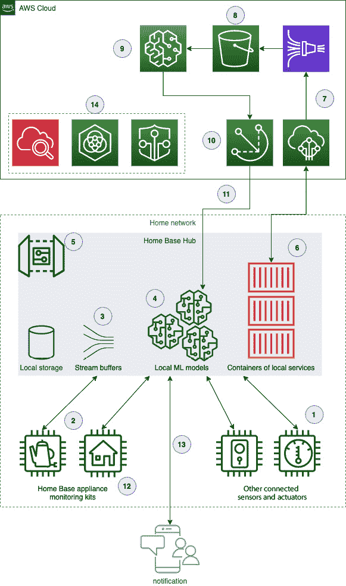

# 十、使用 AWS 构建良好的框架评审解决方案

你现在已经具备了创建边缘**机器学习** ( **ML** )解决方案所需的技能。本章不仅总结了本书中学习到的关键经验，还通过回顾交付的解决方案，说明了它们为什么是最佳实践。通过查看解决方案，我们可以了解 Home Base Solutions 原型集线器的设计如何，以及哪里有进一步改进的机会。您将了解使用 **AWS 架构良好的框架**对解决方案进行深入分析的感觉，这是一种为审查复杂解决方案而创建的机制。最后，我们将为您提供建议的后续步骤，作为将智能工作负载交付到边缘的实践者。

在本章中，我们将讨论以下主要话题:

*   总结主要经验教训
*   描述 AWS 架构良好的框架
*   查看解决方案
*   深入研究 AWS 服务

# 总结主要经验教训

在本节中，我们将对本书中的关键课程进行分组和总结，作为快速参考，以确保不会错过最重要的课程。根据第 1 章到第 9 章的材料，有一个松散的年表，但是一些课程可能会出现在一个组中，而不是在本书中出现的顺序。

## 定义边缘 ML 解决方案

以下主要课程介绍了 edge ML 解决方案的定义、价值主张和形式:

*   **边缘 ML 解决方案的定义**:将智能工作负载带到边缘意味着应用 ML 技术，该技术已被整合到可互操作模拟和数字空间的信息物理解决方案中。edge ML 解决方案使用具有足够计算能力的设备来运行 ML 工作负载，或者直接与传感器和执行器等物理组件连接，或者通过局域网或串行协议间接与终端设备连接。
*   **ML 在边缘的主要优势**:将智能工作负载引入边缘的四个主要优势是:减少响应测量事件的延迟，通过减少对远程网络实体(如服务器)的运行时依赖性来提高解决方案的可用性，通过减少通过 WAN 传输的数据量来降低运营成本，以及通过在边缘专门处理受保护的数据来实现数据治理政策的合规性。
*   **边缘 ML 解决方案的工具**:在边缘运行智能工作负载所需的三个工具是用于编排您的边缘软件的运行时、ML 库和 ML 模型，以及用于在整个边缘与远程服务双向交换数据的机制。
*   **分离的、隔离的服务**:使用面向服务架构的原则来设计您的 edge ML 解决方案，以交付由使用分离机制进行交互的隔离服务组成的内聚整体。为单一目的而设计的代码更容易编写、测试、重用和维护。从传感器获取测量值的代码不需要知道如何直接调用 ML 推理服务。推理服务不需要知道如何将结果直接发送给连接的执行器。要实现的关注点的隔离和分离程度是一个范围，也是架构师考虑权衡的一个平衡行为。
*   **不要对已解决的问题进行重新设计**:使用成熟可靠的技术来解决与 edge ML 解决方案所解决的业务问题无关的实施细节。例如，不要创建新的消息传递协议或数据存储层，除非它们都不能满足您的业务需求。
*   **常见边缘拓扑**:构建边缘解决方案中常见的四种拓扑分别是**星型**、**总线**、**树型**和**混合型**。星型拓扑描述了叶设备如何与倾向于运行任何 ML 工作负载的集线器或网关设备进行交互。总线拓扑描述了隔离的服务如何使用解耦机制相互交互。树形拓扑描述了如何从中央服务管理边缘解决方案群。混合拓扑描述了与云服务交互的边缘解决方案的任何宏观架构的一般形状。

## 使用物联网绿草

以下关键课程总结了 **AWS 物联网 Greengrass** 的定义以及使用它来交付 edge ML 解决方案的最佳实践:

*   什么是格林拉斯？ AWS 物联网 Greengrass 是一款运行时编排工具，旨在通过解决物联网和 ML 解决方案常见的许多实施细节，将智能工作负载交付到边缘，使架构师能够专注于快速交付业务目标。Greengrass 支持面向服务的架构，允许开发人员定义独立运行的组件，并通过使用解耦机制(如进程间通信通道、流、文件或消息队列)有选择地与更广泛的解决方案进行交互。Greengrass 与 AWS 服务进行本地交互，以提供架构师需要解决的常见功能，例如部署软件、获取资源和将数据传输到云。
*   **用组件**构建:Greengrass 将功能单元定义为**组件**，这些组件是用于捆绑静态资源的配方，如工件、配置、依赖性和运行时行为。开发人员可以将任何类型的代码作为组件运行，无论是 shell 脚本、解释代码、编译的二进制文件、AWS Lambda 函数还是 Docker 之类的容器。
*   **将组件部署到边缘**:组件可以在开发周期中使用测试设备上的 Greengrass CLI 进行本地部署。对于生产使用，组件在 AWS 物联网 Greengrass 服务中注册，并作为部署的一部分远程部署到一个或多个分组设备。一个**部署**定义了一组组件，包括组件的版本，以及在部署时应用于这些组件的可选配置。一个设备可以属于多个组，并将聚合其所属组的所有当前部署。
*   **边缘和云之间的安全模型**:green grass 设备和 AWS 服务之间的安全模型使用非对称加密、角色和策略的组合。Greengrass 使用向 AWS 物联网核心注册的私钥和证书向 AWS 物联网服务标识自己。此证书附加到授予权限(如连接和交换消息)的物联网策略。该设备可以从 **AWS 物联网核心**凭证提供者服务请求临时 AWS 凭证，以向其他 AWS 服务标识自己。这是通过指定一个 **AWS 身份和访问管理**角色来实现的，该角色具有附加到它的策略，以向其他 AWS 服务授予权限。在将另一个 AWS 服务交互添加到 Greengrass 解决方案之前，您需要附加一个新策略或更新附加的策略，以包含该 API 的适当权限。
*   **使用托管组件加速构建**:使用 AWS 托管组件在适用的时候解决需求。这些组件解决了一些常见的需求，比如与 AWS 服务交互、部署本地 MQTT 代理来连接本地设备、在边缘和云之间同步设备状态以及运行 ML 工作负载。

## 建模数据和 ML 工作负载

以下主要课程总结了将问题分解为建模数据和您在 edge ML 解决方案中使用的 ML 工作负载时应考虑的技术和模式:

*   **结构化数据的类型**:在边缘获取的数据可以分为三种类型:**结构化**(定义良好的模式)**半结构化**(在使用的键方面有些差异的模式)**非结构化数据**(差异较大或没有模式的模式)。所有三种数据都可以通过 ML 工作负载进行评估，但每种数据的训练方法和算法可能会有所不同。
*   **分析数据以选择实现选项**:使用数据建模技术将高层次的问题从概念模型分解到逻辑模型，再到物理模型，从而在选择收集、存储和访问数据的技术时为实现决策提供信息。分析数据的大小、形状、速度和一致性要求，为选择数据存储技术时的实施决策提供依据。
*   **常见的数据流模式**:edge ML 架构中可以使用的一些常见数据流模式有**提取、转换、加载** ( **ETL** )、**事件驱动** ( **流**)、**微批处理**和**λ架构** ( **并行热** / **冷路径**)。避免边缘架构的反模式，例如复杂事件检测、批处理、数据复制和数据归档。这些模式最好在您的拓扑中的层上实现，比如数据中心或云服务。
*   **领域驱动设计**:考虑领域驱动设计的 10 个原则，以最好地组织您的数据:通过领域管理数据所有权，使用有界上下文定义领域，将有界上下文与应用程序工作负载关联，在有界上下文中共享无处不在的语言，保留原始数据，将数据与元数据相关联，为正确的工作使用正确的工具，对您的数据存储进行分层，保护和管理数据管道，以及为扩展而设计。
*   **边缘工作负载三定律**:当您必须遵守三定律时，将数据工作负载放在边缘(而不是云)。**物理定律**意味着边缘和云之间的延迟是有极限的，有时候你的工作负载需求无法容忍这个延迟。经济学定律意味着将你所有的数据转移到云上可能成本过高。**国家法律**意味着存在数据治理和合规性要求，使得一些数据必须保留在边缘。
*   **ML 训练算法的类型** : ML 模型可以用三种模式中的一种进行训练:**有监督的**(训练数据由人标注)**无监督的**(训练数据未标注；机器自己发现模式或结论)，或**半监督**(有标签和无标签数据的混合)。训练模型模仿人类专家的工作，例如对图像中的对象进行分类，通常意味着使用监督或半监督模式。训练模型以查找数据之间的关系通常意味着使用无监督模式。
*   **迭代数据到模型的生命周期**:使用**跨行业标准流程进行数据挖掘** ( **CRISP-DM** )到迭代您的 ML 工作负载，从理解您的数据到为训练做准备，到评估模型性能，然后将模型部署到边缘。
*   **适当使用 ML**:不是每个问题都可以或者应该用 ML 解决。具有低信噪比的小型数据集或数据往往无法训练出有用的模型。简单的需求(比如需要一次性预测)可以用传统的数据分析、查询和回归技术来解决。
*   **云在训练模型中的价值**:使用云的规模在足够大的数据集上高效地训练模型。一旦您的模型在评估阶段表现良好，使用模型优化来压缩模型，以便它在运行您的 edge ML 解决方案的目标硬件平台上具有高效率和较小的占用空间。继续在设备上测试和评估压缩模型的性能，并在任何重新训练事件之后进行测试和评估。
*   **ML 需要团队**:单一的技术资源可以推动收集数据、训练模型、部署到边缘所需的所有按钮，但是训练有效模型的过程是多方面的。训练有效的模型并将它们部署到边缘需要来自多个领域的专家来达到成功的结果。一个人做不到这一切也没关系。

## 操作生产解决方案

以下关键课程总结了您的解决方案的生产版本的重要区别，以及如何大规模运营该解决方案:

*   **DevOps 是文化** : **开发者运营** ( **DevOps** )不仅仅是关于新的技术和工具。它代表了组织如何促进团队间的所有权、协作和凝聚力以促进创新的文化转变。除了传统的软件开发之外，DevOps 范式还为 edge ML 解决方案的软件交付生命周期带来了好处。
*   **使用托管组件进行监控**:使用 AWS 提供的组件将日志和指标存储在您的 **Amazon CloudWatch** 账户中。这将有助于您的团队通过日志远程诊断问题，并监控带有指标警报的不健康设备，从而操作一组设备。
*   **IaC 对 edge 也很有价值**:在可能的情况下，将您的解决方案作为代码 ( **IaC** )资源的**基础设施进行存储和部署。这使得维护您的解决方案的定义和跨部署可靠地重现结果变得更加容易。**
*   **您的设备生命周期始于制造**:为设备提供身份并定义其供应流程对您设备的供应链有影响。在桌面上准备测试设备很容易。为生产车队创建供应管道更具挑战性。尽早与你的**供应链厂商**、**原始设备制造商**(**OEM**)、**原始设备制造商** ( **ODMs** )沟通需求。
*   **在虚拟化环境中发布代码**:您的软件组件可以定义为脚本、源代码、二进制文件以及介于两者之间的任何内容。在可能的情况下，最好将代码放在 Docker 和 AWS Lambda 等虚拟化环境中，以便为边缘的运行时操作提供更多的可预测性。
*   **MLOps 是循环的**:很像解决数据科学问题的 CRISP-DM 模型，构建和操作 ML 模型的模式是循环的。将模型部署到边缘的 MLOps 可能更具挑战性，因为设备通常处于远程、离线状态或暴露于不可预测的因素。尽早将 MLOps 设计到您的产品生命周期中，以便养成良好的习惯。以后再加只会更难。
*   **部署可能会很昂贵**:AWS 物联网 Greengrass 等服务可以很容易地将软件部署到边缘，但必须考虑传输数据的成本。许多边缘解决方案处于昂贵的网络连接的末端，在那里您无法负担一次又一次地增量推送模型或修复损坏的部署。设置您的 DevOps 和 MLOps 管道，以便您在部署进入生产设备之前对其充满信心。
*   **扩展供应流程** : **认证机构** ( **CAs** )让您用唯一的证书定义您设备的身份。使用您自己的 CA、来自可信供应商的 CA 或由 AWS 提供的 CA 来扩展您的设备群的身份。当机载设备第一次连接到您的服务时，使用自动配置策略，如和**即时** ( **JIT** )配置。
*   **运营商也需要扩大规模**:扩大设备生产规模意味着要管理数千到数百万台设备。通过关注异常值和高严重性问题，使用工具来简化如何操作这么多实体。这意味着您需要一个解决方案来捕获和索引这种运营数据。您还需要一种解决方案，能够轻松深入研究单个设备，或者一次修复大量受影响的设备。

在下一节中，您将了解 AWS 提供的一个框架，该框架用于评估在该平台上构建解决方案时的设计权衡。

# 描述 AWS 架构良好的框架

2015 年， **AWS** 推出了框架，用于指导开发者在基于 AWS 构建时做出良好的设计决策。AWS 架构良好的框架编纂了在 AWS 云上定义、部署和操作工作负载的最佳实践。它以最佳实践白皮书和基于 web 的工具的形式存在，作为考虑事项和建议缓解策略的清单来进行解决方案评估。这种专业知识旨在为 AWS 客户服务，但以一种通常可用于评估任何类型的数字工作负载的格式提供。我们将使用这一框架回顾本书对家庭基础解决方案家电监控产品的解决方案。

架构良好的框架将最佳实践组织成五大支柱。一个**支柱**是框架的一部分，它聚集了设计原则和在一个共同目的下要解决的指导性问题。五大支柱如下:

*   **卓越运营**
*   **安全**
*   **可靠性**
*   **性能效率**
*   **成本优化**

您可能认识到这些支柱中的一些是我们在 [*第 1 章*](B17595_01_Final_SS_ePub.xhtml#_idTextAnchor013) 、*使用机器学习的数据驱动边缘简介*中用来定义边缘 ML 解决方案的价值主张的关键优势！每个支柱包括一段叙述和一组需要评估和考虑的问题。对于那些架构师没有明确回应或现有缓解策略的问题，可以用来定义解决方案现在的设计水平和需要达到的水平之间的差距。例如，如果审查帮助我们识别我们架构中的单个失败点，那么我们将决定在我们的解决方案中风险的可接受性或者是否使用故障转移机制进行重构。

重要的是要明白，当你回答框架的问题来回顾你的解决方案时，没有客观正确或错误的答案。您的解决方案的总体状况不是完成评审的可量化结果。您用来回答单个问题的过程可能会识别重要的重构或突出原始设计中的差距。你的团队对“完成”的定义决定了你的回答必须有多完整或透彻，以及解决了多少问题，也就是说，你的团队对已经完成的尽职调查感到满意。懒惰或肤浅的复习可能不会带来任何有意义的改变。随着解决方案的重要性增加，您的评审的严格程度可能会成比例地增加，甚至是非线性地增加。

在应用框架的过程中，您可能会发现逐个支柱移动、依次回答每个问题，或者将优先问题的子集作为所有支柱的交叉部分的价值。在设计解决方案和实施解决方案的步骤之间审查框架也是推荐的，也更常见。这有助于架构师在投入时间和资源构建解决方案之前预防故障并提高安全性。对于这本书，我们选择将审查留到最后，以便快速进入动手项目，认识到我们是在一个安全的原型环境中实践。

AWS 架构良好的框架还包括被称为**透镜**的扩展。镜头是与特定领域或解决方案类型(如 SaaS 应用程序或物联网解决方案)相关的附加最佳实践的集合。这些镜头帮助架构师在他们的领域内批判性地分析他们的解决方案，尽管其中的指导并不广泛地适用于所有类型的解决方案，例如框架的主体。我们在本章的回顾将使用主体和物联网镜头之间的混合框架问题。本章的*参考文献*部分包含了这两个资源的链接。在下一节中，我们将使用 AWS 良好架构的框架提出的问题的子集来回顾我们的解决方案。

# 查看解决方案

在我们执行解决方案评审之前，让我们重申一下问题，重新审视一下目标解决方案，并思考一下本书构建了什么。这将有助于我们刷新记忆，并使用架构良好的框架将解决方案评审放在上下文中。

## 反思解决方案

在我们虚构的故事中，我们在 Home Base Solutions 担任物联网架构师，负责设计一款新的家电监控产品。该产品是一个集线器设备的组合，它连接到消费者的家庭网络，并与配对的电器监控套件进行交互。这些套件连接到消费者的大型电器上，如炉子或洗衣机，并将遥测数据发送到集线器设备。集线器设备处理遥测数据，将其传输到云以训练 ML 模型，并使用新的遥测和部署的模型托管本地推理工作负载。下图显示了这些实体在消费者家中的关系:

图 10.1–审查 HBS 智能枢纽产品的设计

我们的目标解决方案是在 **Raspberry Pi** 上制作集线器设备原型，以收集遥测数据并运行 ML 工作负载，同时使用 **SenseHAT** 扩展模块收集传感器数据并将结果直观地发送到 LED 矩阵。我们使用 **AWS IoT Greengrass** 为 hub 设备部署了一个运行时环境，该设备可以将我们的代码作为组件进行安装和运行。这些组件封装了我们的业务逻辑，以收集传感器遥测数据，通过边缘和云路由数据，从云中获取资源，并运行我们的 ML 推理工作负载。

我们使用 **Amazon SageMaker** 在云中训练一个新的 ML 模型，使用集线器设备获取的传感器遥测数据，并将其作为训练数据传输到云。这种 ML 模型被部署到边缘，以智能地评估我们监控的设备的健康状况，并在检测到任何异常行为时向消费者发出信号。最后，我们计划如何将我们的解决方案扩展到一系列集线器设备、它们的监控套件和 ML 模型，以及如何在生产环境中操作这些设备。下图回顾了我们的解决方案架构:

图 10.2–来自第一章 *的 [*原始解决方案架构图，数据驱动边缘与机器学习简介*](B17595_01_Final_SS_ePub.xhtml#_idTextAnchor013)*

通过对我们的业务目标和解决方案架构的简要回顾来设置背景，让我们应用 AWS 良好架构的框架来分析我们的解决方案。

## 应用框架

我们将在架构完善的审查中使用的格式是从框架中陈述一个问题，然后以 HBS 物联网架构师的角色给出答案。提醒一下，框架中的亮点选自基础材料和物联网镜头，以推动本章的有趣分析。在框架的完整主体中有更多的最佳实践可以考虑。

注意

以下部分从 AWS 架构良好的框架和物联网透镜扩展中引入问题。例如，标记为 *OPS 4* 的问题表明它们来自*架构良好的框架*。标有 *IOTOPS 4* 的问题表明它来自*物联网镜头扩展*。这一区别与本章无关，但它指出了问题是从哪一个源材料中复制的。

### 卓越运营

**卓越运营**支柱强化了我们对如何运营实时解决方案的思考。它将其指导组织成四个子区域:**组织**、**准备**、**操作**和**进化**。这一支柱强调组织的工作文化和机制对于预测失败的必然性、减少人为错误的影响以及从错误中学习的重要性。现在，让我们回顾一下这篇文章中的一些问题，以及一些我们可能会从架构师那里看到的示例回答。

#### OPS 4、OPS 8 和 OPS 9–如何设计您的工作负载，以便了解其状态？您如何理解工作负载的健康状况？您如何理解您的运营状况？

我们将总结卓越运营支柱对这三个相关问题的回答。在这种情况下，工作负载意味着与满足我们的业务目标相关的任何事情，例如通知客户他们的故障设备。这与操作不同，操作指的是与我们用来操作工作负载的技术实现相关的任何事情，比如我们用来通知我们的团队影响的部署机制或工具。

我们设计了每个级别的工作负载来报告某种健康状态。我们的工作负载可以定义为三个级别，每个级别都有报告其状态的机制，以便我们可以自动监控和发出警报。这三个级别是设备群、在中枢设备上运行的组件以及训练 ML 模型的云管道。在车队级别，hub 设备通过 AWS IoT Greengrass 和 Amazon CloudWatch 等服务向云报告其部署的健康状况和连接状态。我们可以使用诸如 **AWS 物联网设备管理**之类的服务来监控处于不健康状态的设备，并对它们采取行动。设备上运行的组件由物联网 Greengrass 核心软件监控，每个组件的日志可以被发送到云进行自动分析。ML 训练管道报告关于训练准确性的指标，以便我们可以衡量满足我们业务目标的整体状态。

我们将在关键故障时实施阈值警报，例如设备部署失败以及设备监控套件失去与其集线器设备的连接。这使我们能够在故障影响我们的客户之前主动减轻故障，或者联系客户，告知他们可以采取哪些措施来恢复本地运营。

#### OPS 5 和 OPS 6–您如何减少缺陷、简化补救并改进生产流程？您如何降低部署风险？

为了减少缺陷和降低部署风险，我们必须在测试和部署管道中包含运行我们解决方案的每个目标硬件配置文件的物理副本。通过在 AWS 物联网核心中将这些设备指定为单独的组，这些设备将成为首批通过 Greengrass 接收新部署的设备。我们可以配置 CI/CD 管道来为该组创建新的部署，并等待这些部署被报告为成功，然后再将部署推进到第一波生产设备。

无论如何，我们从 Greengrass 获得了一些现成的补救价值，因为默认情况下，它会将失败的部署回滚到以前的状态。这有助于最大限度地减少生产设备的停机时间，并立即向我们的团队发出部署出现问题的信号。如果一组设备中的某一部分部署失败，Greengrass 还可以阻止部署这些设备。

#### io tops 3–您如何确保新配置的设备具备所需的运行先决条件？

在我们使用 Greengrass 的解决方案中，我们知道运行 Greengrass 软件的最低要求是什么。我们使用**物联网设备测试器**软件来验证我们的目标硬件平台与 Greengrass 的要求兼容，并且可以连接到 AWS 服务。我们应该使用物联网设备测试软件来验证我们希望用作 HBS 中心设备的任何未来硬件平台。

我们还应该计算所有组件消耗的必要的额外资源。例如，如果我们知道我们所有的静态资源将消耗 1 GB 的磁盘空间，我们知道我们至少需要这么多，再加上存储日志、临时资源等的空间。一旦我们计算出解决方案的最低要求，我们就可以向物联网设备测试器添加一个自定义测试，以验证每个新的硬件目标是否准备好运行我们的解决方案。

### 安全性

安全支柱强化了关于如何保持或提高工作负载安全状态的思考，例如保护对数据和系统的访问。它将最佳实践组织到以下子领域:身份和访问管理、检测、基础设施保护、数据保护和事件响应。这个支柱强调明确定义工作负载中的资源和参与者、它们之间的界限和访问模式，以及实施这些界限的机制。

#### 第 2 节和第 3 节–如何管理人和机器的身份？你如何管理人和机器的权限？

人员的身份和权限由 AWS 身份访问和管理来管理。我们的客户将使用来自 Google 或脸书等 OAuth 提供商的联合身份登录他们的管理应用程序，或者使用 **Amazon Cognito** 直接与我们一起创建新的用户名。我们将把认知身份与他们拥有的设备联系起来，并使用策略进行交互。

设备的身份和权限由 AWS IAM 和 AWS IoT 核心共同管理。设备到云身份使用向 AWS 物联网核心注册的 X.509 私钥和证书来建立 MQTT 连接。这可用于将证书交换为临时 AWS 凭证。这些临时 AWS 凭证被绑定到一个 IAM 角色，这个 IAM 角色具有附加的策略，以确定这些凭证可以对各种 AWS 服务做什么。通过在每个设备上使用唯一的私有密钥，设备的身份不能被恶意的参与者欺骗。

#### IOT sec 10–您如何分类、管理和保护传输中的数据和静态数据？

在边缘，我们可以将数据分类为来自传感器或用于交付业务成果的运行时数据，或者来自软件和系统日志的运营数据。在我们当前的设计中，在管理或保护方面，我们没有以任何不同的方式处理运行时和操作数据。在这里，我们有机会更好地保护任何潜在的客户隐私数据，如来自连接摄像头的视频馈送。

在边缘，在 Greengrass 解决方案的组件之间传输的任何数据都没有加密。我们使用 Greengrass 的组件和进程间通信(IPC)的权限模型来保护对通过 IPC 发布的数据的访问。使用 MQTT 在叶设备和 Greengrass 设备之间传输的数据在网络上使用私有密钥和带有相互 TLS 的证书进行加密。

在边缘，静态数据没有加密，而是依靠 Unix 文件系统的权限来保护对数据的访问。我们必须确保使用正确的用户和组配置来保护对静态数据的访问。在这里，我们有机会建立一个验证机制，在创建或修改新的系统用户或组时提醒我们。为了每次都执行安全威胁分析，我们必须向解决方案中添加一个新组件，以检查它是否为数据访问提供了适当的安全性。

从边缘到云，我们应该使用 mutual TLS 来加密传输中的 MQTT 流量，使用 Amazon Signature Version 4 来加密任何其他使用临时凭证与 AWS APIs 交换的流量。存储在 AWS 服务中的静态数据使用每个服务的加密策略。例如，存储在亚马逊简单存储服务(S3)中的数据可以使用 AWS 管理的加密密钥进行服务器端加密。

#### IOT sec 11–您如何准备应对影响单个设备或设备群的事件？

我们的运营团队针对设备群的运行状况指标设置了警报。例如，如果设备部署失败，运营团队将收到来自警报的事故单通知。如果一组设备部署失败，我们将呼叫我们的运营团队立即进行分类。

我们将为预期的故障事件编写一系列操作手册，供我们的运营团队作为第一反应遵循。在我们熟悉第一波生产设备之前，第一步将是定义所需的最小操作手册集。

#### IoT sec 8–您如何规划物联网设备的安全生命周期？

我们将与我们的 **ODM** 合作，记录从零件供应链到组装和交付到我们仓库的安全生命周期，以纳入零售包装。对我们来说很重要的一点是，中央处理器、易失性和非易失性存储器、可信平台模块 ( **TPM** )等部件都是可信的，并且在组装到我们的产品之前没有被篡改过。

ODM 为我们的设备提供的所有 TPM 都将与我们将在 AWS 物联网核心中注册的 CA 相关联。我们将在云中预配置每个设备，以便设备可以使用它们受保护的凭据进行连接，而不需要任何 JIT 注册过程。

如果我们发现任何设备的身份受到威胁，我们将评估证书轮换活动是否足以缓解威胁。如果没有，我们将在 AWS 物联网核心中撤销其证书，以阻止其交换进一步的数据，并主动联系客户以启动交换流程。

### 可靠性

可靠性支柱强调工作负载应按照设计和预期继续运行。它将最佳的实践组织成以下子领域:基础、工作负载架构、变更管理和故障管理。这个支柱强调了一些概念，如响应故障的故障转移和修复机制、测试恢复场景，以及在稳定状态操作期间和部署变更后对可用性的监控。

#### REL 协议 3–如何设计工作负载服务架构？

我们使用面向服务的架构设计了工作负载服务架构，并实现了隔离、分离服务的原则。我们使用这种体系结构来简化代码的设计、创作、测试和发布，并最大限度地减少出现故障的孤立服务对解决方案的影响。我们使用核心 Greengrass 软件及其组件定义的机制来整理这种架构设计。

#### REL 8-你如何实施变革？

对于我们的 edge 解决方案，我们使用版本化组件，通过 Greengrass 部署逐步更新设备上运行的软件。我们在测试设备上部署变更，然后将这些变更部署到生产设备上。在设备上失败的部署将自动回滚。10%的部署失败将使整个部署回滚到该机群。

对于我们的云解决方案，我们使用 CloudFormation 模板和堆栈来提供云资源并对其进行更改。我们不会对不通过 IaC 机制创作的生产基础结构进行任何更改。这些变更在部署之前必须由团队中的同行进行审查。我们可以使用 CloudWatch 指标和日志来监控我们调配的资源的任何不健康状态，并在出现运营影响时回滚云形成变化。

#### IOT rel 3–当与云通信时，如何处理设备的可靠性？

我们的 edge ML 解决方案旨在独立于云运行。一些功能在网络不稳定期间会受到影响，例如将故障事件发布到云，以便客户将通知推送至他们的移动应用。发往云的事件、遥测数据和日志在本地缓冲，一旦网络不稳定问题得到解决，它们最终会到达云。发布到云但没有得到确认的数据将被重试，例如将 MQTT 服务质量设置为至少一次*服务级别*。

当云试图与设备通信时，例如当新的部署准备就绪时，我们使用 Greengrass 等持久服务，这些服务跟踪离线且尚未完成待定部署活动的设备。

#### REL 11 和 IOTREL 6–如何设计工作负载以承受组件故障？您如何为您的物理资产验证不同级别的硬件故障模式？

(在这种情况下，*组件故障*并非特指绿草组件。)在这里，我们使用面向服务的架构来承受组件故障，这样我们的任何定制服务都应该能够在不影响整个解决方案的情况下发生故障。例如，如果从温度传感器读取测量值的组件出现故障，集线器设备和边缘解决方案仍将运行，尽管在检测设备异常时准确性会降低。

Greengrass 提供了一些组件，如果失败，可能会影响我们解决方案中的多个结果，例如 IPC 消息总线。如果这样的组件失败，我们的定制组件将无法发布新消息，接收组件将停止获取新消息。我们应该更新发布消息的自定义组件代码，这样它就可以在 IPC 不可用时缓冲消息。我们还应该研究 Greengrass 的行为及其在提供的功能(如 IPC)受到影响时的自我恢复能力。

如果我们的任何网络物理硬件接口出现故障，例如传感器不再能够被读取，我们将停止看到通过 IPC 发布的值，并在使用该传感器的相应软件组件中获得错误消息。我们也许可以使用上传的日志远程对这些事件进行分类。如果我们的任何计算、内存、磁盘或网络硬件组件出现故障，整个解决方案很可能会被禁用，需要进行内部分类或通过我们的客户支持计划更换设备。

### 性能效率

性能效率支柱强调我们在消耗的资源和可用的预算之间取得平衡，并且随着技术的发展，我们将继续寻求效率的提高。它将最佳实践组织成以下子领域:选择、审查、监控和权衡。这个支柱强调为解决的问题委派复杂的任务，规划数据在正确的时间出现在正确的位置，以及减少你的团队必须管理的基础设施。

#### 新 PERF 协议—您如何选择自己的计算解决方案？

关于我们的 ML 模型训练需求，我们将首先根据我们的默认设置选择 AWS 上的计算实例，并通过反复试验来评估是否有更具成本效益的实例配置文件用于我们的训练生命周期。由于 ML 是我们消费产品的一个差异化因素，我们希望在适当的**服务水平协议** ( **SLA** )内，例如在积累了足够的训练数据以产生准确模型后的一个工作日内，在我们客户的设备上启用 ML 模型。随着我们生产规模的扩大，我们可能会发现批量训练作业的价值，从而最大限度地提高调配的计算实例的利用率。

关于我们在边缘的目标设备硬件，我们将在原型设备(如 Raspberry Pi)上测量全部生产工作负载的性能，并根据计算设备的整体利用率迭代生产硬件配置文件。我们希望在总利用率中留出一些缓冲空间，以防我们在将来升级时向设备部署新的工作负载。

#### PERF 6–您如何发展您的工作负载以利用新版本？

我们将监控 AWS 的新版本，寻找机会引入新的托管 Greengrass 组件，为我们的 edge 工作负载处理更多无差别的繁重工作。我们还将关注亚马逊 SageMaker 和**亚马逊弹性云计算**产品组合中的新发布产品，寻找优化我们的 ML 训练渠道的机会。

#### PERF 7-你如何监控你的资源，以确保他们的表现？

我们将为使用托管组件，使 **AWS IoT Device Defender** 能够从每个设备收集系统级指标，如计算、内存和磁盘利用率。我们将监控异常和阈值突破，并对任何检测到的影响做出响应。

#### IoT perf 10–数据从设备传输到物联网应用的频率如何？

对于高优先级的业务成果和运营警报，例如通知其他人检测到异常或传感器值下降，一旦这些数据可用，就会从设备传输到云。对于其他类别的数据，如报告组件日志或传感器遥测以用于新的 ML 训练工作，数据可以每天批量传输。

### 成本优化

成本优化支柱强调了如何以最低成本运营满足业务需求的解决方案。它将最佳实践组织成以下子领域:财务管理、使用意识、成本效益资源、管理需求和供应，以及随时间优化。该支柱强调衡量您的云支出的整体效率，衡量投资回报以确定下一步优化的优先顺序，并寻求可以在不影响需求的情况下降低成本的实施细节。

#### 成本 3–如何监控使用情况和成本？

我们将结合使用 Amazon CloudWatch 的指标和日志，以及 AWS 计费控制台来监控所消费的 AWS 服务的使用情况和成本。预计最重要的成本来源是我们 ML 训练工作负载的云计算实例。我们将监控与每台设备相关的成本，发现个别设备消耗的云成本高于设备群平均水平的异常值。

#### IOTCOST 1 和 IoT cost 3–如何选择一种方法来批量、丰富和聚合从物联网平台交付到其他服务的数据？如何优化设备和物联网平台之间的有效载荷大小？

为了从我们的电器监控套件中捕获传感器遥测数据，我们将每天批量传输遥测数据到云端，这些数据将直接到亚马逊S3。与发送由传感器组件发布的每个有效载荷相比，这将显著降低传输的成本。我们没有计划进一步优化 Greengrass 设备和云之间交换的任何运营消息的有效负载大小，因为我们预计这些消息不会构成很大的开销。

这就是我们对 AWS 良好架构评审的示例响应。有没有你不同意或想修改的回答？审核流程是一个指南，并不包含正确或错误的答案。由您和您的合作者团队来定义答案的完整程度，以及您是否有行动项目作为审核的结果。团队没有答案或者不能清晰地给出详细答案的问题是更好地了解您的架构并在问题出现在您的解决方案中之前预测它们的好机会。在下一节中，我们将提供一些 AWS 特性的最终介绍，您可能会发现这些特性很有用，但不在本书的讨论范围之内。

# 深入 AWS 服务

本书侧重于一个特定的用例，作为一个虚构的叙述，有选择地突出 AWS 的可用功能，这些功能可用于向边缘交付智能工作负载。通过 AWS 物联网 Greengrass、AWS 物联网套件中的其他服务、ML 服务套件以及 AWS 的其余部分，您可以实现比我们在一本书中所能涵盖的更多的东西。

在这一部分中，我们将指出作为这一领域的架构师您可能会感兴趣的更多特性和服务，并提供一些关于如何扩展您到目前为止构建的解决方案以进一步提高您的专业水平的想法。

## AWS 物联网绿草

我们在解决方案中使用的 Greengrass 特性代表了 Greengrass 解决方案所能提供的灵活性的一个子集。您了解了如何使用组件构建、将软件部署到边缘、获取 ML 资源，以及利用内置特性在整个边缘和云中路由消息。我们在 hub 设备原型中使用的组件主要下载 Python 代码，并启动与 **IPC** 消息总线交互的长期应用程序。组件可以设计为每次部署、每次设备启动或按计划运行一次性程序。它们可以被设计为运行作为其他组件软件的依赖项的服务，或者在组件图中的其他依赖项成功运行后等待启动。

您的组件可以通过订阅有关部署事件的通知来与部署生命周期进行交互。例如，您的软件可以请求延期，直到达到一个安全的里程碑(比如清空一个队列或者将内存中的记录写入磁盘)，或者向 Greengrass nucleus 发出信号，表示它现在已经准备好进行更新。

组件可以向其他组件发出信号，指示它们应该暂停或恢复其功能。例如，如果负责有限资源(如磁盘空间或内存)的组件识别出高利用率事件，它可以请求消耗这些资源的组件暂停，直到利用率回到期望的范围。

组件可以通过请求当前配置状态、订阅进一步的更改或为组件的配置设置新值来与彼此的配置进行交互。回到前面的例子，如果资源监视器组件不想完全暂停消费组件，它可以为消费组件指定新的配置值，以降低写入采样值的频率或进入低功率状态。

前面提到的所有三个特性都使用 Greengrass IPC 工作，并且是您的组件和管理组件生命周期的 Greengrass nucleus 之间的本地消息传递的简单应用程序。在您的解决方案设计中，这些功能有很多实用工具，它们展示了您如何在 IPC 之上构建组件交互系统。

在继续 edge ML 解决方案架构师之旅的过程中，您应该了解 Greengrass 的另外几个特性。关于 Greengrass 特性的文档可以在[https://docs.aws.amazon.com/greengrass](https://docs.aws.amazon.com/greengrass)网站上找到:

*   **核心配置**:当在你的设备上安装 Greengrass 核心软件时(或之后，通过部署更新的配置)，你有几个选项来探索优化消耗的资源、网络配置以及设备如何与云服务交互。所有这些都有智能的默认设置来帮助您开始，但是您的生产实现可能需要根据您的架构良好的审查结果对这些进行改进！
*   **在 Docker 容器内运行 green grass**:在本书的解决方案中，我们安装了 Greengrass 作为运行在 Raspberry Pi 上的服务。Greengrass 也可以安装在自己的 Docker 容器中运行的设备上。您可能会发现这对于简化使用 IaC 的设备间的自定义安装很有价值。这也可以用来将您的整个 Greengrass 解决方案作为一个独立的服务，作为在设备上运行的更大的解决方案架构的一部分。
*   **将 Docker 容器作为组件运行**:如果您将 Docker 容器包装成一个新的组件，那么您可以将它们导入到 edge ML 解决方案中，而无需修改。Greengrass 提供了一个托管组件，用于与设备上运行的 Docker 引擎进行交互。它可以从 Docker Hub 和 Amazon 弹性容器注册表中下载图像。这可以加快您在现有工作负载中采用 Greengrass 的速度，其中您的业务逻辑已经在 Docker 容器中定义。

现在，让我们来回顾一下更广泛的 AWS 物联网服务套件中的一些功能，它们可以为您的下一个项目提供动力。

## AWS 物联网服务

AWS 物联网服务套件涵盖设备连接和控制、大规模管理车队、检测和缓解安全漏洞、执行复杂事件检测、分析工业物联网运营等使用案例。Greengrass 是在现有 AWS 物联网服务基础上设计边缘解决方案的模型实施，并且还以强大的方式与这些服务进行了本机集成。这里是 AWS 物联网套件中的一些更多功能，供您在设计下一个 edge ML 解决方案时参考。这些功能的文档可在 https://docs.aws.amazon.com/iot[找到:](https://docs.aws.amazon.com/iot)

*   **安全隧道**:在 [*第四章*](B17595_04_Final_SS_ePub.xhtml#_idTextAnchor073) ，*将云扩展到边缘*中，你将系统和组件日志上传到亚马逊 CloudWatch，以远程分拣你的设备。如果您需要比您的日志所捕获的更多的信息，或者您需要在设备上运行一个命令，但不想为此编写一个组件，会发生什么？借助安全隧道，您可以向您的设备发送信号，要求其与您的运营商建立 SSH 隧道，从而消除了与您的设备建立入站网络连接的必要性。Greengrass 有一个托管组件，可在您的设备上启用此功能。
*   **车队索引**:当使用 AWS 物联网核心的影子服务来同步您的绿草设备、连接到集线器的叶设备、甚至您的组件的状态时，您的所有影子都可以使用 AWS 物联网设备管理的车队索引服务被索引用于查询和动态组。舰队索引使得在您的解决方案中搜索影子支持的实体以进行分析和操作变得容易。例如，您可以创建一个动态设备组，报告低于 20%的电池电量，并通知您的远程技术人员优先更换这些设备上的电池。
*   **Device Defender**:AWS IoT Device Defender是一项服务，用于自动化检测和缓解安全漏洞的过程，可以使用 ML 来建立您的车队正常行为的配置文件。该服务可以向您的安全团队通知以异常方式运行的设备，例如网络流量峰值或断开连接事件，可能代表恶意行为者干扰您的设备。

现在，让我们回顾一下 AWS ML 套件中的一些服务，它们为您的工作负载增加了更多智能。

## 机器学习服务

AWS 的 ML 服务涵盖从帮助开发人员训练和部署模型的工具到解决特定用例的高级人工智能服务。虽然以下服务目前仅在 AWS 云中运行，但它们可以帮助增强您的 AI edge 解决方案，使其能够与远程服务一起工作:

*   亚马逊 Lex 和 Polly :你可以使用与亚马逊 Alexa 语音助手相同的技术在你的解决方案中构建语音界面。Lex 是一项从语音和文本输入中构建交互式体验的服务。Polly 是一项将文本翻译成语音的服务。您可以使用这两者来处理来自设备的音频请求，并返回逼真的合成响应。
*   **亚马逊认知**:你可以从云获得更深入的洞察，从而在边缘增加智能工作负载。例如，您的 edge ML 工作负载可能使用更简单的运动或对象检测模型来捕获重要事件作为视频剪辑，然后仅将这些剪辑发送到云，以便通过 Rekognition 等服务进行更深入的分析。这种升级模式可以帮助您减少边缘所需的资源，并降低专门在云中运行 ML 工作负载的成本。

接下来，我们将提供一些想法，告诉你可以采取哪些后续步骤来扩展本书的解决方案。

## 进一步精通的想法

使用运行本地 ML 工作负载的集线器设备的工作解决方案，您已经练习使用所有必要的工具将智能工作负载部署到边缘。你可能已经有了一个项目来应用你从这本书中学到的东西，并通过实际应用来巩固你所学到的东西。如果你正在寻找下一步行动的灵感，我们已经收集了一些想法来扩展你已经建立的东西，作为进一步熟练掌握本书主题的手段:

*   **添加新的信息物理接口**:Raspberry Pi 的 GPIO 接口、USB 端口和音频输出插孔为扩展您的中枢设备的信息物理接口提供了广阔的设计空间。您可以添加一个新的传感器，创建一个自定义组件来从中读取值，将值传输到云中，并训练您的 ML 模型来检测该提要中的异常。你可以插上一个扬声器，生成音频警报，以响应我们在 [*第 4 章*](B17595_04_Final_SS_ePub.xhtml#_idTextAnchor073) 、*将云扩展到边缘*中部署的对象检测模型。你可以更进一步，从 Amazon Polly 合成定制的语音音频，并通过扬声器播放！
*   **构建设备监控套件的原型**:在本书中，我们使用 SenseHAT 的板载传感器来获取测量值，作为设备监控套件的近似。对于两个设备，您可以提供一个作为 hub 设备，另一个作为监控套件，通过 MQTT 将套件连接到 hub，如 [*第 4 章*](B17595_04_Final_SS_ePub.xhtml#_idTextAnchor073) 、*将云扩展到边缘*所示。从 hub 设备中移除发出传感器读数的组件，并编写一个订阅 MQTT 主题的新组件，并将来自监控套件的新消息转发到相同的 IPC 主题，如 [*第 3 章*](B17595_03_Final_SS_ePub.xhtml#_idTextAnchor052) 、*构建边缘*中所定义。你的监控套件设备不需要部署绿草；它可以运行一个类似于我们在第 4 章 、*将云扩展到边缘*中看到的应用程序，用于使用 AWS 物联网设备 SDK 连接到 Greengrass MQTT broker。
*   **执行您自己的 AWS 良好架构评审**:我们在本章提供的样本评审强调了向架构师提出的几个问题，并在某种程度上的高层次分析中保留了答案。下一步，您可以用本章中没有包括的问题来完成剩余的复习，并利用这个机会记录您对相同问题的回答，也许是为了您的工作量。

您对项目扩展有其他建议吗，或者想展示一下您所构建的吗？请在本书的 GitHub 资源库中打开一个请求或问题，与我们的读者和架构师社区进行交流！

# 总结

这就是我们为你准备的一切！我们，作者，相信这些是最好的技术、实践和工具，你可以用来继续你作为 edge ML 解决方案架构师的旅程。虽然有些工具是特定于 AWS 的，但其他所有工具通常都可以帮助您构建这类解决方案。使用 AWS 物联网 Greengrass 构建的解决方案可以轻松包含与您的 web 服务或云供应商(如微软或谷歌)的服务进行通信的组件。这本书的指导原则是优先教你如何构建和如何考虑构建 edge ML 解决方案，而不是使用特定的工具。

当你采取下一步行动时，无论是扩展本书的原型中枢设备，开始一个新的解决方案，还是更新现有的解决方案，我们希望你在反思你所学到的教训和批判性地思考有助于你实现目标的权衡中找到价值。我们欢迎您通过本书的 GitHub 资源库中包含的交流方法对本书的内容和技术示例提出反馈。我们致力于提供持续卓越的示例和教程，认识到在信息技术的世界里，工具在发展，依赖关系在更新，代码在中断。

我们真诚地感谢您决定投入宝贵的时间，通过我们的书探索将智能工作负载推向边缘的世界。我们祝你在未来的努力中好运！

# 参考文献

有关本章中讨论的概念的更多信息，请查看以下资源:

*   基础设施即代码白皮书:[https://D1 . AWS static . com/whites/devo PS/infra structure-as-Code . pdf](https://d1.awsstatic.com/whitepapers/DevOps/infrastructure-as-code.pdf)
*   AWS 架构中心(IoT):[https://aws.amazon.com/architecture/iot/](https://aws.amazon.com/architecture/iot/)
*   AWS 物联网 Greengrass 文档:[https://docs.aws.amazon.com/greengrass](https://docs.aws.amazon.com/greengrass)
*   AWS 架构良好的主页:[https://aws.amazon.com/architecture/well-architected/](https://aws.amazon.com/architecture/well-architected/)
*   AWS 人工智能服务:[https://aws.amazon.com/machine-learning/ai-services/](https://aws.amazon.com/machine-learning/ai-services/)
*   物联网图集:[https://iotatlas.net](https://iotatlas.net)